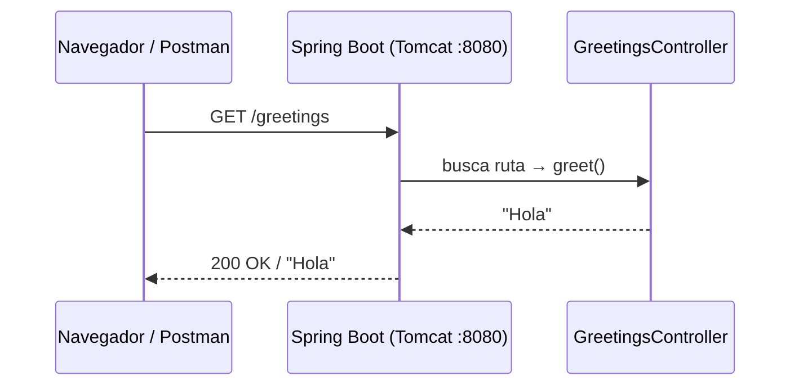

<!-- START OF FILE: docs_lessons_03-first-api_01_objetivo_y_alcance.md -->
# Documento: docs lessons 03-first-api 01 objetivo y alcance
---
# Lección 03 - Tu primera API: ¿qué vas a aprender?

## ¿De dónde venimos?

En las lecciones anteriores exploraste los conceptos teóricos de las APIs REST y el protocolo HTTP. Sabes qué es un recurso, qué es un verbo HTTP y qué significa un código de estado. Pero todavía no has escrito una sola línea de código que funcione en un servidor real.

Esta lección cambia eso. Vamos a pasar de la teoría a la práctica por primera vez.

---

## ¿Qué vas a construir?

Al terminar esta lección tendrás un servidor HTTP real, corriendo en tu máquina, que responde peticiones. Concretamente:

- Un proyecto **Spring Boot** creado desde cero con IntelliJ IDEA
- Un único endpoint que escucha en:

```
GET /greetings
```

- Que devuelve la siguiente respuesta con código `200 OK`:

```
Hola
```

Es simple. Intencionalmente simple. El objetivo no es el endpoint en sí, sino entender **cada pieza que lo hace funcionar**.

---

## ¿Qué vas a ser capaz de explicar?

Más importante que escribir el código es que entiendas el razonamiento detrás de cada parte. Al terminar esta lección deberías poder responder:

- ¿Qué hace Spring Boot y por qué lo usamos?
- ¿Qué es un controlador y cuál es su responsabilidad?
- ¿Por qué la clase tiene la anotación `@RestController`?
- ¿Qué hace `@RequestMapping` y cómo le dice a Spring en qué URL escuchar?
- ¿Cómo sabe Spring que ese método responde a una petición `GET`?
- ¿Qué ocurre entre que escribes `localhost:8080/greetings` en el navegador y ves "Hola"?

---

## ¿Qué NO cubre esta lección? (y por qué)

Esta lección se limita intencionalmente a lo esencial. Los siguientes temas se abordarán más adelante:

| Tema | ¿Por qué lo dejamos después? |
|---|---|
| Separación en capas (Controller / Service / Repository) | Primero entendemos el Controller; las demás capas se agregan una a una |
| Responder con JSON (objetos, listas) | Antes de responder objetos, hay que entender cómo funciona una respuesta básica |
| Recibir parámetros en la URL o en el cuerpo | Primero el caso más simple: un GET sin parámetros |
| Base de datos | Todavía no hay datos que persistir |
| `ResponseEntity` | Lo incorporamos cuando necesitemos controlar el código de respuesta explícitamente |
| Validaciones | No hay datos de entrada que validar aún |

El objetivo es hacer **una cosa, bien hecha y completamente entendida**. Nada más.

---

## La herramienta: IntelliJ IDEA con Spring Initializr

Vas a crear el proyecto usando el asistente integrado de IntelliJ IDEA, que conecta con **Spring Initializr** (start.spring.io). Este asistente genera automáticamente la estructura base del proyecto con las dependencias que tú elijas.

Lo que seleccionarás:
- **Lenguaje:** Java
- **Gestor de dependencias:** Maven
- **Versión de Spring Boot:** la estable más reciente (4.x)
- **Java:** 21
- **Dependencias:** Spring Web, Lombok, Spring Boot DevTools

Cada una de esas decisiones tiene un por qué, y lo explicaremos en el tutorial paso a paso.

---

## La idea central de esta lección

> "Antes de agregar capas, entiende qué hace cada una."

El patrón que vas a aprender en lecciones siguientes (Controller → Service → Repository) solo tiene sentido si primero entiendes qué es un controlador, cómo recibe una petición HTTP y cómo devuelve una respuesta. Esta lección construye esa base.


<!-- START OF FILE: docs_lessons_03-first-api_02_guion_paso_a_paso.md -->
# Documento: docs lessons 03-first-api 02 guion paso a paso
---
# Lección 03 - Tutorial paso a paso: tu primera API con Spring Boot

Sigue esta guía en orden. Cada paso explica qué vas a hacer y **por qué lo hacemos así**. No copies y pegues sin leer: el objetivo es que entiendas cada decisión.

---

## Paso 1: crear el proyecto con IntelliJ IDEA

Abre IntelliJ IDEA y sigue estos pasos:

1. Ve a **File → New → Project...**
2. En el panel izquierdo selecciona **Spring Boot** (o "Spring Initializr")
3. Configura el proyecto con los siguientes valores:

| Campo | Valor |
|---|---|
| Name | `Greetings` |
| Location | La carpeta donde quieras guardar el proyecto |
| Language | Java |
| Type | Maven |
| Group | `cl.duoc.fullstack` |
| Artifact | `greetings` |
| Package name | `cl.duoc.fullstack.greetings` |
| Java | 21 |

4. Haz clic en **Next**
5. Selecciona las siguientes dependencias:
   - ✅ **Spring Web** (en la categoría "Web")
   - ✅ **Lombok** (en la categoría "Developer Tools")
   - ✅ **Spring Boot DevTools** (en la categoría "Developer Tools")
6. Haz clic en **Create**

IntelliJ descargará la estructura base del proyecto y lo abrirá automáticamente.

> **¿Qué acaba de pasar?** IntelliJ se conectó a [start.spring.io](https://start.spring.io) y generó por ti una estructura de proyecto Maven con Spring Boot preconfigurado. Antes de esta herramienta, configurar todo eso manualmente tomaba horas.

---

## Paso 2: entender la estructura del proyecto

Antes de escribir código, dedica unos minutos a explorar lo que se generó. Abre el panel de archivos de IntelliJ y verás algo así:

```
Greetings/
├── src/
│   ├── main/
│   │   ├── java/
│   │   │   └── cl/duoc/fullstack/greetings/
│   │   │       └── GreetingsApplication.java
│   │   └── resources/
│   │       └── application.properties
│   └── test/
│       └── java/
│           └── cl/duoc/fullstack/greetings/
│               └── GreetingsApplicationTests.java
├── pom.xml
└── mvnw
```

### `pom.xml` — el contrato del proyecto

Este archivo le dice a Maven (el gestor de dependencias de Java):
- Qué librerías necesita el proyecto (`<dependencies>`)
- Con qué versión de Java compilar (`<java.version>21</java.version>`)
- Qué plugins usar al construir el proyecto

Cada vez que agregas una dependencia, la declaras aquí. Maven la descarga automáticamente de internet la primera vez.

> **Analogía:** el `pom.xml` cumple el mismo rol que el `package.json` en proyectos Node.js: describe el proyecto y sus dependencias.

### `GreetingsApplication.java` — el punto de entrada

```java
@SpringBootApplication
public class GreetingsApplication {
    public static void main(String[] args) {
        SpringApplication.run(GreetingsApplication.class, args);
    }
}
```

Esta clase es el punto de arranque de toda la aplicación. Cuando ejecutas el proyecto, Java busca el método `main` y lo llama. Ese `main` arranca Spring Boot, que a su vez:

1. Escanea todos los paquetes en busca de clases anotadas (`@RestController`, `@Service`, `@Repository`, etc.)
2. Configura el servidor HTTP embebido (Tomcat, por defecto)
3. Levanta el servidor en el puerto `8080`

La anotación `@SpringBootApplication` es un atajo que combina tres anotaciones:
- `@SpringBootConfiguration` — marca esta clase como fuente de configuración
- `@EnableAutoConfiguration` — activa la configuración automática de Spring
- `@ComponentScan` — le dice a Spring que escanee el paquete actual y todos sus subpaquetes

> **Importante:** nunca borres ni muevas esta clase. Si la mueves a otro paquete, Spring podría dejar de encontrar tus controllers.

### `application.properties` — la configuración de la aplicación

Este archivo controla el comportamiento de Spring Boot sin tocar el código Java. Por ahora solo tiene:

```properties
spring.application.name=Greetings
```

Aquí podrías, por ejemplo, cambiar el puerto:

```properties
server.port=8081
```

O agregar un prefijo global a todas las rutas:

```properties
server.servlet.context-path=/api
```

> **Regla de oro:** cualquier valor que pueda cambiar entre entornos (desarrollo, producción) vive aquí, nunca hardcodeado en el código Java.

### `mvnw` — el wrapper de Maven

Es un script que permite ejecutar Maven sin tenerlo instalado globalmente. Desde la terminal puedes usar:

```bash
./mvnw spring-boot:run    # levanta la aplicación
./mvnw test               # ejecuta los tests
./mvnw package            # compila y empaqueta en un .jar
```

---

## Paso 3: crear el paquete `controller`

Antes de escribir el controlador, crea el paquete donde va a vivir.

En IntelliJ:
1. Haz clic derecho sobre el paquete `cl.duoc.fullstack.greetings`
2. Selecciona **New → Package**
3. Escribe `controller` y presiona Enter

Verás que se crea la carpeta `controller/` dentro del paquete principal.

> **¿Por qué un paquete separado?** En Java, los paquetes son más que carpetas: comunican intención. Al poner tu controlador en un paquete llamado `controller`, cualquier desarrollador que abra el proyecto sabe inmediatamente qué hace esa clase. Es un lenguaje común del ecosistema Java.

---

## Paso 4: crear la clase `GreetingsController`

Haz clic derecho sobre el paquete `controller` recién creado:
1. Selecciona **New → Java Class**
2. Escribe `GreetingsController` y presiona Enter

Escribe el siguiente código:

```java
package cl.duoc.fullstack.greetings.controller;

import org.springframework.web.bind.annotation.GetMapping;
import org.springframework.web.bind.annotation.RequestMapping;
import org.springframework.web.bind.annotation.RestController;

@RestController
@RequestMapping("/greetings")
public class GreetingsController {

    @GetMapping
    public String greet() {
        return "Hola";
    }
}
```

Eso es todo el código que necesitas. Vamos parte por parte.

---

## Paso 5: entender cada parte del controlador

### La clase: `GreetingsController`

```java
public class GreetingsController { ... }
```

Una clase Java normal. El nombre no tiene ningún significado especial para Spring: podría llamarse de cualquier forma. La convención es terminar con `Controller` para que la intención quede clara.

---

### `@RestController`

```java
@RestController
public class GreetingsController { ... }
```

Esta anotación le dice a Spring dos cosas al mismo tiempo:

1. **Esta clase es un controlador HTTP** — Spring la registrará y comenzará a escuchar peticiones a través de ella
2. **Las respuestas se serializan directamente** — lo que retorne cada método se convierte automáticamente en el cuerpo de la respuesta HTTP

Internamente, `@RestController` es la combinación de:
- `@Controller` — registra la clase como manejador de peticiones web
- `@ResponseBody` — hace que el valor de retorno del método sea el cuerpo de la respuesta, no el nombre de una vista HTML

> **¿Por qué existe `@RestController` y no solo `@Controller`?** El `@Controller` original de Spring fue diseñado para aplicaciones que devuelven páginas HTML (vistas). Con `@RestController`, en cambio, lo que el método retorna va directo al cuerpo de la respuesta HTTP. Para una API REST, siempre usarás `@RestController`.

---

### `@RequestMapping("/greetings")`

```java
@RequestMapping("/greetings")
public class GreetingsController { ... }
```

Esta anotación define el **prefijo de URL** para todos los endpoints de esta clase. En este caso, todos los métodos de `GreetingsController` responderán bajo la ruta `/greetings`.

Cuando Spring arranca, lee esta anotación y registra internamente: _"cualquier petición HTTP que llegue a una URL que comience con `/greetings` debe ser manejada por esta clase"_.

> **¿Se puede poner `@RequestMapping` solo en el método y no en la clase?** Sí. Pero ponerlo en la clase permite agrupar todos los endpoints relacionados bajo una misma raíz de URL. Si mañana decides cambiar `/greetings` a `/saludos`, solo cambias una línea (la anotación de la clase) y todos los endpoints se actualizan automáticamente.

---

### El método: `greet()`

```java
public String greet() {
    return "Hola";
}
```

Un método Java normal que retorna un `String`. El nombre `greet` es una convención descriptiva: podría llamarse `hello`, `sayHi` o cualquier cosa, pero debe comunicar lo que hace.

Lo que este método retorna (`"Hola"`) se convierte en el **cuerpo de la respuesta HTTP**. Gracias a `@RestController`, Spring toma ese `String` y lo escribe directamente en la respuesta.

---

### `@GetMapping`

```java
@GetMapping
public String greet() { ... }
```

Esta anotación le dice a Spring que este método responde a peticiones HTTP con el método `GET`.

Combinado con el `@RequestMapping("/greetings")` de la clase, el resultado es:

```
GET /greetings → greet()
```

Cuando alguien hace una petición `GET` a la URL `/greetings`, Spring ejecuta este método y envía `"Hola"` como respuesta.

> **¿Por qué `@GetMapping` y no `@RequestMapping(method = RequestMethod.GET)`?** Ambas hacen exactamente lo mismo. `@GetMapping` es un atajo más conciso introducido en Spring 4.3. Lo mismo aplica para `@PostMapping`, `@PutMapping`, `@DeleteMapping`, etc.

---

## Paso 6: levantar la aplicación

Tienes dos formas de ejecutar el proyecto:

**Opción A — desde IntelliJ:**
Haz clic en el botón ▶ (play) verde que aparece junto al método `main` en `GreetingsApplication.java`, o usa el botón de run en la barra de herramientas.

**Opción B — desde la terminal:**
```bash
./mvnw spring-boot:run
```

En ambos casos verás en la consola un mensaje similar a este:

```
  .   ____          _            __ _ _
 /\\ / ___'_ __ _ _(_)_ __  __ _ \ \ \ \
( ( )\___ | '_ | '_| | '_ \/ _` | \ \ \ \
 \\/  ___)| |_)| | | | | || (_| |  ) ) ) )
  '  |____| .__|_| |_|_| |_\__, | / / / /
 =========|_|==============|___/=/_/_/_/

 :: Spring Boot ::                (v4.0.3)

Started GreetingsApplication in 1.823 seconds (process running for 2.1)
```

Esa última línea confirma que el servidor está corriendo. El tiempo varía, pero debería ser menos de 5 segundos.

> **DevTools en acción:** gracias a la dependencia `spring-boot-devtools` que agregaste, si modificas y guardas cualquier archivo Java, Spring reinicia automáticamente la aplicación. No necesitas detenerla y volver a levantarla manualmente cada vez que cambias código.

---

## Paso 7: probar el endpoint

Tienes tres formas de probar el endpoint:

### Opción A — navegador web

Abre tu navegador y escribe en la barra de direcciones:

```
http://localhost:8080/greetings
```

Verás la palabra `Hola` en la pantalla. El navegador hace automáticamente una petición `GET` a esa URL.

### Opción B — Postman o Insomnia

1. Crea una nueva petición
2. Selecciona el método `GET`
3. Ingresa la URL: `http://localhost:8080/greetings`
4. Haz clic en **Send**

Deberías ver:
- **Status:** `200 OK`
- **Body:** `Hola`

### Opción C — curl desde la terminal

```bash
curl http://localhost:8080/greetings
```

Salida esperada:

```
Hola
```

---

## Paso 8: entender el flujo completo

Cuando escribes `http://localhost:8080/greetings` y presionas Enter, esto es lo que ocurre:

```
1. Tu navegador arma una petición HTTP:
   GET /greetings HTTP/1.1
   Host: localhost:8080

2. La petición viaja por la red (en este caso, en tu misma máquina)
   hasta el puerto 8080.

3. Tomcat (el servidor HTTP embebido de Spring Boot) la recibe.

4. Spring busca en su registro interno qué clase/método maneja
   "GET /greetings" → encuentra GreetingsController.greet()

5. Spring llama al método greet()

6. El método retorna el String "Hola"

7. Spring convierte ese String en el cuerpo de la respuesta HTTP:
   HTTP/1.1 200 OK
   Content-Type: text/plain;charset=UTF-8
   Content-Length: 4

   Hola

8. La respuesta viaja de vuelta a tu navegador, que muestra "Hola".
```

Este flujo —petición → servidor → controller → respuesta— es la base de todo lo que construirás en el curso.

---

## Paso 9: reflexiona antes de cerrar

Antes de pasar a la siguiente sección, respóndete estas preguntas:

1. ¿Qué pasaría si cambias `@GetMapping` por `@PostMapping` y vuelves a probar desde el navegador? ¿Por qué?
2. ¿Qué pasa si cambias `"/greetings"` en `@RequestMapping` por `"/hello"` y vuelves a probar la URL anterior?
3. ¿Qué rol cumple la clase `GreetingsApplication` en todo el proceso? ¿Qué pasaría si la borraras?

Si puedes responder estas tres preguntas con seguridad, entendiste el objetivo de este paso.


<!-- START OF FILE: docs_lessons_03-first-api_03_como_funciona_http.md -->
# Documento: docs lessons 03-first-api 03 como funciona http
---
# Lección 03 - Cómo funciona HTTP y por qué tu endpoint responde

Esta sección no es una lista de reglas para memorizar. Es la explicación del mecanismo real detrás de lo que acabas de construir. Un buen desarrollador no solo sabe *cómo* hacer algo, sino *por qué* funciona.

---

## ¿Qué es HTTP?

**HTTP** (HyperText Transfer Protocol) es el protocolo de comunicación que usan el navegador y el servidor para entenderse. Es un protocolo de texto, sin estado, basado en el modelo **petición → respuesta**:

- El **cliente** (navegador, Postman, aplicación frontend) envía una **petición**
- El **servidor** (tu aplicación Spring Boot) procesa esa petición y devuelve una **respuesta**

Cada petición es independiente: el servidor no recuerda peticiones anteriores a menos que uses mecanismos como cookies o tokens. Eso es lo que significa "sin estado" (stateless).

---

## Anatomía de una petición HTTP

Cuando escribes `http://localhost:8080/greetings` en el navegador, este construye y envía una petición que tiene esta forma:

```http
GET /greetings HTTP/1.1
Host: localhost:8080
User-Agent: Mozilla/5.0 ...
Accept: text/html,application/xhtml+xml,...
```

Vamos parte por parte:

### Línea de inicio: método + ruta + versión

```
GET /greetings HTTP/1.1
```

| Parte | Qué es | En nuestro caso |
|---|---|---|
| `GET` | El **método HTTP** — qué tipo de operación se pide | Leer / obtener información |
| `/greetings` | La **ruta** — qué recurso se solicita | El saludo |
| `HTTP/1.1` | La **versión del protocolo** | La más común hoy en día |

### Cabeceras (headers)

```
Host: localhost:8080
```

Las cabeceras son metadatos de la petición: quién la hace, qué formato acepta como respuesta, qué idioma prefiere, etc. Son pares `Clave: Valor`. Algunas las pone el navegador automáticamente; otras las agrega el desarrollador.

### Cuerpo (body)

En una petición `GET` **no hay cuerpo**. El `GET` solo pide información; no envía datos. El cuerpo es relevante en métodos como `POST` o `PUT`, donde el cliente envía datos al servidor (por ejemplo, los datos de un formulario o un objeto JSON).

---

## Anatomía de una respuesta HTTP

El servidor recibe la petición, la procesa y devuelve una respuesta:

```http
HTTP/1.1 200 OK
Content-Type: text/plain;charset=UTF-8
Content-Length: 4

Hola
```

### Línea de estado: versión + código + descripción

```
HTTP/1.1 200 OK
```

| Parte | Qué es |
|---|---|
| `HTTP/1.1` | Versión del protocolo |
| `200` | **Código de estado** — indica si la operación fue exitosa o no |
| `OK` | Descripción textual del código (para humanos) |

### Cabeceras de respuesta

```
Content-Type: text/plain;charset=UTF-8
Content-Length: 4
```

Le dicen al cliente cómo interpretar el cuerpo:
- `Content-Type`: qué tipo de dato viene en el cuerpo (`text/plain` = texto plano, `application/json` = JSON)
- `Content-Length`: cuántos bytes tiene el cuerpo

Spring Boot agrega estas cabeceras automáticamente según el tipo de dato que retorna el método.

### Cuerpo de la respuesta

```
Hola
```

Lo que el método `greet()` retornó. Para un `String` de Java, Spring lo escribe directamente como texto plano.

---

## Los códigos de estado HTTP más importantes

El código de estado es la forma en que el servidor le dice al cliente si todo salió bien y, si no, qué pasó.

| Rango | Categoría | Significado |
|---|---|---|
| `2xx` | ✅ Éxito | La petición fue procesada correctamente |
| `3xx` | ↪️ Redirección | El recurso se movió a otra URL |
| `4xx` | ❌ Error del cliente | La petición tiene algún problema |
| `5xx` | 💥 Error del servidor | El servidor falló al procesar una petición válida |

Los que más vas a usar en este curso:

| Código | Nombre | Cuándo se usa |
|---|---|---|
| `200 OK` | Éxito | La operación funcionó correctamente |
| `201 Created` | Creado | Se creó un nuevo recurso (`POST`) |
| `400 Bad Request` | Petición inválida | El cliente envió datos incorrectos |
| `404 Not Found` | No encontrado | El recurso solicitado no existe |
| `500 Internal Server Error` | Error del servidor | Algo falló en el código del servidor |

> **¿Por qué importan los códigos?** Un cliente bien implementado (una app frontend, un script, un servicio externo) toma decisiones basadas en el código de estado. Si tu API siempre devuelve `200 OK` aunque haya un error, el cliente no puede saber qué pasó realmente.

---

## Los métodos HTTP y su significado

HTTP define varios métodos (también llamados verbos), cada uno con un propósito específico:

| Método | Propósito | Ejemplo |
|---|---|---|
| `GET` | **Leer** un recurso o una colección | `GET /greetings` — obtener el saludo |
| `POST` | **Crear** un nuevo recurso | `POST /tickets` — crear un ticket |
| `PUT` | **Reemplazar** un recurso completo | `PUT /tickets/1` — reemplazar el ticket 1 |
| `PATCH` | **Modificar** parte de un recurso | `PATCH /tickets/1` — actualizar solo el estado |
| `DELETE` | **Eliminar** un recurso | `DELETE /tickets/1` — eliminar el ticket 1 |

En esta lección solo usamos `GET`. Es el más simple y el más seguro: solo lee, nunca modifica nada.

> **Seguro e idempotente:** `GET` es *seguro* (no tiene efectos secundarios en el servidor) e *idempotente* (hacer la misma petición 10 veces produce el mismo resultado que hacerla una sola vez). Estas propiedades son importantes para cachés y reintentos automáticos.

---

## ¿Cómo sabe Spring qué método ejecutar?

Cuando Spring Boot arranca, escanea todas las clases anotadas con `@RestController`. Para cada una, lee las anotaciones `@RequestMapping`, `@GetMapping`, `@PostMapping`, etc. y construye una **tabla de rutas** interna:

```
GET  /greetings  →  GreetingsController.greet()
```

Cuando llega una petición HTTP, Spring consulta esa tabla y ejecuta el método correspondiente. Si no encuentra ningún método que coincida con el método HTTP y la ruta, Spring devuelve automáticamente un `404 Not Found`.

Este mecanismo se llama **routing** o **mapeo de URLs**.

### ¿Qué pasa si la ruta no existe?

Prueba esto: levanta la aplicación y accede a:

```
http://localhost:8080/hola
```

Spring devuelve `404 Not Found` porque no hay ningún método registrado para `GET /hola`. Eso es correcto: la API solo conoce lo que tú le enseñas.

### ¿Qué pasa si usas el método HTTP incorrecto?

Prueba hacer un `POST /greetings` desde Postman. Spring devuelve `405 Method Not Allowed`, porque hay un método registrado para esa ruta, pero no acepta el verbo `POST`.

---

## ¿Cómo mapea Spring la URL con tu código?

El mapeo funciona en dos niveles, uno en la clase y otro en el método:

```java
@RestController
@RequestMapping("/greetings")   ← nivel 1: prefijo de la clase
public class GreetingsController {

    @GetMapping                  ← nivel 2: método HTTP (GET) + ruta adicional (ninguna)
    public String greet() {
        return "Hola";
    }
}
```

La URL final resulta de **concatenar** el `@RequestMapping` de la clase con la ruta del método:

```
/greetings  +  (vacío)  =  GET /greetings
```

Si el método tuviera `@GetMapping("/formal")`, la URL sería `GET /greetings/formal`.

Esto permite organizar múltiples endpoints relacionados bajo un mismo prefijo:

```java
@RestController
@RequestMapping("/greetings")
public class GreetingsController {

    @GetMapping               // GET /greetings
    public String greet() { return "Hola"; }

    @GetMapping("/formal")    // GET /greetings/formal
    public String formal() { return "Buenos días"; }
}
```

---

## ¿Por qué el puerto es 8080?

Spring Boot incluye un servidor HTTP embebido (**Tomcat** por defecto) que arranca junto con la aplicación. El puerto `8080` es su valor predeterminado.

El número de puerto identifica qué servicio dentro de una máquina debe recibir la conexión. Algunos puertos tienen usos estándar:

| Puerto | Uso estándar |
|---|---|
| `80` | HTTP en producción |
| `443` | HTTPS en producción |
| `8080` | Servidores de desarrollo (convención) |
| `5432` | PostgreSQL |
| `3306` | MySQL |

Para cambiar el puerto de tu aplicación, agrega esto en `application.properties`:

```properties
server.port=9090
```

Después de reiniciar, tu endpoint estaría en `http://localhost:9090/greetings`.

---

## ¿Qué significa `localhost`?

`localhost` es un nombre especial que siempre apunta a **tu propia máquina**. Es equivalente a la dirección IP `127.0.0.1`. Cuando el servidor y el cliente están en la misma máquina (como en desarrollo), usas `localhost` para conectarte al servidor que levantaste tú mismo.

En producción, en lugar de `localhost` usarías el nombre de dominio real del servidor (por ejemplo, `api.miempresa.com`).

---

## El ciclo completo en una imagen


```
┌─────────────────────────────────────────────────────────┐
│                     TU MÁQUINA                          │
│                                                         │
│  ┌─────────────┐    GET /greetings    ┌───────────────┐ │
│  │  Navegador  │ ───────────────────▶ │  Spring Boot  │ │
│  │  o Postman  │                      │  (puerto 8080)│ │
│  │             │ ◀─────────────────── │               │ │
│  └─────────────┘    200 OK / "Hola"   │  Tomcat       │ │
│                                       │  GreetingsCtrl│ │
│                                       └───────────────┘ │
└─────────────────────────────────────────────────────────┘
```

1. El cliente construye y envía la petición HTTP
2. Tomcat recibe la petición en el puerto 8080
3. Spring busca en su tabla de rutas: `GET /greetings → GreetingsController.greet()`
4. Ejecuta el método y obtiene `"Hola"`
5. Construye la respuesta HTTP con código `200 OK` y cuerpo `Hola`
6. Envía la respuesta al cliente


<!-- START OF FILE: docs_lessons_03-first-api_04_checklist_rubrica_minima.md -->
# Documento: docs lessons 03-first-api 04 checklist rubrica minima
---
# Lección 03 - Lista de verificación: ¿llegué al mínimo requerido?

Usa esta lista para revisar tu propio trabajo antes de presentarlo. Cada ítem explica qué significa y cómo verificarlo.

---

## ¿Qué es un indicador de evaluación (IE)?

Los indicadores de evaluación son los criterios concretos con los que se mide tu aprendizaje. En esta lección el foco está en que **el endpoint funcione y puedas explicar cada parte**, no en la cantidad de código que escribiste.

---

## IE 1.1.1 - Proyecto Spring Boot creado y ejecutable

Este indicador verifica que puedes crear un proyecto Spring Boot desde cero y levantarlo correctamente.

Checklist:

- [ ] El proyecto fue creado con IntelliJ IDEA usando Spring Initializr
- [ ] Las dependencias están declaradas en `pom.xml`: `spring-boot-starter-web`, `lombok`, `spring-boot-devtools`
- [ ] La aplicación levanta sin errores (no hay excepciones en la consola al iniciar)
- [ ] La consola muestra el mensaje `Started GreetingsApplication in X seconds`

**Cómo verificarlo:** ejecuta el proyecto y revisa la consola. Si ves el mensaje de inicio sin líneas en rojo (`ERROR`), el proyecto está correcto.

> **Problema común:** si la aplicación no levanta y ves un error como `Port 8080 was already in use`, significa que ya hay otro proceso usando ese puerto. Puedes detenerlo o cambiar el puerto en `application.properties` con `server.port=8081`.

---

## IE 1.1.2 - Endpoint `GET /greetings` funcionando

Este indicador verifica que el endpoint existe, responde al método HTTP correcto y devuelve el valor esperado.

Checklist:

- [ ] La URL `GET http://localhost:8080/greetings` responde con código `200 OK`
- [ ] El cuerpo de la respuesta contiene exactamente `Hola`
- [ ] La URL `POST http://localhost:8080/greetings` responde con `405 Method Not Allowed`
- [ ] La URL `GET http://localhost:8080/hola` responde con `404 Not Found`

**Cómo verificarlo:** usa Postman, Insomnia o el navegador para probar el endpoint. En Postman verás el código de estado en la parte superior derecha de la respuesta.

---

## IE 1.1.3 - Uso correcto de las anotaciones de Spring

Este indicador verifica que sabes qué hace cada anotación y la estás usando correctamente.

Checklist:

- [ ] La clase `GreetingsController` está anotada con `@RestController`
- [ ] La clase tiene `@RequestMapping("/greetings")` con la URL en minúsculas
- [ ] El método `greet()` está anotado con `@GetMapping`
- [ ] Las tres anotaciones están importadas desde `org.springframework.web.bind.annotation`
- [ ] No hay lógica de negocio en el controlador (solo retorna el saludo directamente)

**Cómo verificarlo:** abre `GreetingsController.java` y revisa que cada anotación esté presente. IntelliJ subraya en rojo las anotaciones que no reconoce o que faltan imports.

> **Importante:** si copias una anotación sin el import, IntelliJ no la reconocerá. Usa `Alt+Enter` sobre la anotación subrayada para que IntelliJ agregue el import automáticamente.

---

## IE 1.1.4 - Comprensión del flujo HTTP

Este indicador no se verifica con código: se verifica con tu capacidad de explicar lo que ocurre.

Checklist (para responderte mentalmente o en voz alta):

- [ ] Puedo explicar qué es una petición HTTP y qué contiene (método, ruta, cabeceras, cuerpo)
- [ ] Puedo explicar qué es una respuesta HTTP y qué contiene (código de estado, cabeceras, cuerpo)
- [ ] Puedo explicar por qué la URL es `localhost:8080` y no otra cosa
- [ ] Puedo explicar cómo Spring sabe que `GET /greetings` debe ejecutar `GreetingsController.greet()`
- [ ] Puedo decir qué pasa si hago `GET /hola` (404) y por qué
- [ ] Puedo decir qué pasa si hago `POST /greetings` (405) y por qué

**Cómo verificarlo:** explícalo a un compañero o escríbelo en tus propias palabras. Si no puedes explicarlo sin leer el código, necesitas repasar la sección `03_como_funciona_http.md`.

---

## Estructura mínima esperada del proyecto

```
src/
└── main/
    ├── java/cl/duoc/fullstack/greetings/
    │   ├── GreetingsApplication.java      ← no se modifica
    │   └── controller/
    │       └── GreetingsController.java   ← lo que creaste
    └── resources/
        └── application.properties
```

Si tu `GreetingsController` está directamente en el paquete raíz (sin la carpeta `controller`), el código puede funcionar, pero no sigue las convenciones del ecosistema Java. Mueve la clase al paquete correcto.

---

## Indicadores que se trabajan en lecciones siguientes

Los siguientes indicadores están en el horizonte del curso. No se evalúan en esta lección, pero es útil saber hacia dónde vamos:

| Indicador | Qué cubre |
|---|---|
| IE 1.2.1 | Separación de responsabilidades (Controller / Service / Repository) |
| IE 1.2.2 | Modelo de datos y persistencia en memoria |
| IE 1.1.2 | Diseño de endpoints REST (sustantivos, plural, verbos HTTP correctos) |
| IE 1.1.3 | Respuestas JSON y control de códigos HTTP con `ResponseEntity` |

---

## ¿Completé el mínimo de esta lección?

Puedes decir que completaste esta lección si:

- ✅ El proyecto levanta sin errores
- ✅ `GET http://localhost:8080/greetings` devuelve `200 OK` con cuerpo `Hola`
- ✅ Puedes explicar en tus propias palabras qué hace cada anotación (`@RestController`, `@RequestMapping`, `@GetMapping`)
- ✅ Puedes describir el flujo desde que el navegador envía la petición hasta que recibe la respuesta


<!-- START OF FILE: docs_lessons_03-first-api_05_actividad_individual_greetings.md -->
# Documento: docs lessons 03-first-api 05 actividad individual greetings
---
# Lección 03 - Actividad individual: agrega tu propio saludo

Ahora es tu turno. Esta actividad extiende lo que construiste en clase con `GET /greetings`, pero ahora tomas tus propias decisiones de diseño.

> Si no estuviste en clase, lee primero el tutorial paso a paso (`02_guion_paso_a_paso.md`) y la explicación de HTTP (`03_como_funciona_http.md`) antes de comenzar.

---

## ¿Qué vas a construir?

Vas a agregar un segundo endpoint al mismo controlador `GreetingsController`. El endpoint debe responder a:

```
GET /greetings/formal
```

Y retornar la cadena:

```
Buenos días
```

---

## Restricciones de la actividad

| Restricción | Por qué |
|---|---|
| Usar el mismo `GreetingsController`, no crear otro | Un controlador agrupa los endpoints del mismo recurso |
| Solo `@GetMapping` con una ruta (`"/formal"`) | Practica la combinación de `@RequestMapping` de clase + `@GetMapping` de método |
| El método debe llamarse `formalGreet()` | Los nombres de métodos deben ser descriptivos |
| No modificar el endpoint `GET /greetings` existente | El nuevo endpoint es una adición, no un reemplazo |

---

## Guía de implementación

### 1. Abre `GreetingsController.java`

El archivo está en:
```
src/main/java/cl/duoc/fullstack/greetings/controller/GreetingsController.java
```

### 2. Agrega el nuevo método

Dentro de la clase, junto al método `greet()` existente, escribe:

```java
@GetMapping("/formal")
public String formalGreet() {
    return "Buenos días";
}
```

La clase completa debería verse así:

```java
@RestController
@RequestMapping("/greetings")
public class GreetingsController {

    @GetMapping
    public String greet() {
        return "Hola";
    }

    @GetMapping("/formal")
    public String formalGreet() {
        return "Buenos días";
    }
}
```

### 3. Levanta (o recarga) la aplicación

Si DevTools está activo, la aplicación se recargará sola al guardar. Si no, detén y vuelve a levantar el servidor.

### 4. Prueba ambos endpoints

Verifica que **ambos endpoints** funcionen correctamente:

| Petición | Respuesta esperada | Código esperado |
|---|---|---|
| `GET http://localhost:8080/greetings` | `Hola` | `200 OK` |
| `GET http://localhost:8080/greetings/formal` | `Buenos días` | `200 OK` |

---

## ¿Cómo sé si lo hice bien?

### Logro alto

- Ambos endpoints responden correctamente
- Puedes explicar por qué `@GetMapping("/formal")` genera la URL `/greetings/formal` (y no solo `/formal`)
- Puedes explicar qué pasaría si moverías el método a una clase diferente sin `@RequestMapping("/greetings")`
- El código del controlador es limpio: sin lógica extra, sin comentarios innecesarios, sin código duplicado

### Logro medio

- Ambos endpoints responden correctamente
- La URL del nuevo endpoint funciona pero no puedes explicar el mecanismo de combinación de rutas
- Creaste una segunda clase controller en lugar de agregar el método a la existente

### Logro inicial

- Solo uno de los dos endpoints funciona
- La URL del endpoint no es correcta (por ejemplo, responde en `/formal` en vez de `/greetings/formal`)
- El código tiene errores de compilación o la aplicación no levanta

---

## Extensión opcional: si terminas antes

Si completaste la actividad principal y quieres un desafío adicional, prueba una o más de estas opciones:

### Opción A: cambiar el puerto

Sin tocar el código Java, haz que la aplicación corra en el puerto `9090` en lugar del `8080`. Verifica que el endpoint sigue funcionando en la nueva URL.

### Opción B: agregar un `context-path`

Configura un prefijo global `/api` para todas las rutas. Después de hacerlo, el endpoint debe responder en:

```
GET http://localhost:8080/api/greetings
```

> Pista: busca `server.servlet.context-path` en la documentación de Spring Boot.

---

## Antes de entregar: pregúntate esto

1. Si mañana necesitas agregar un saludo en otro idioma, ¿dónde agregarías el código? ¿Por qué?
2. Si el controlador tuviera `@RequestMapping("/api/greetings")`, ¿qué URL tendría el método `formalGreet()`?
3. ¿Cuál es la diferencia entre `@RequestMapping` en la clase y `@GetMapping` en el método? ¿Pueden intercambiarse?

Si puedes responder estas tres preguntas, completaste el objetivo de esta actividad.


