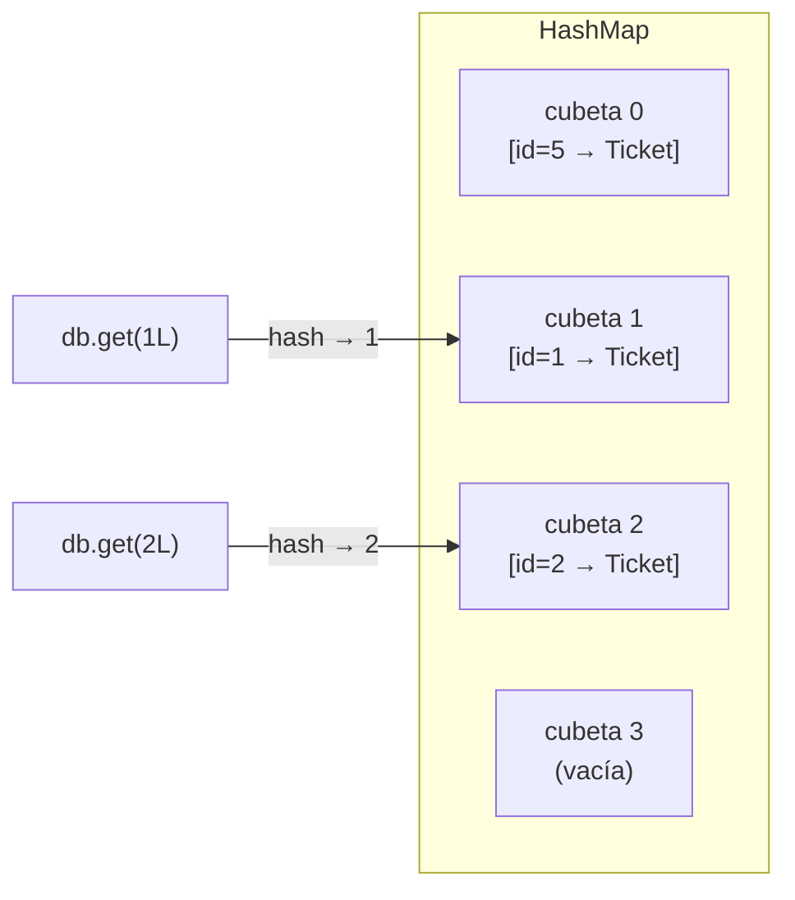
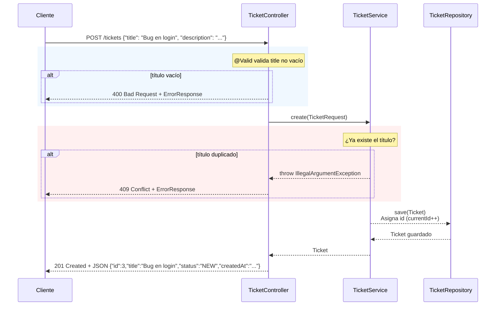

<!-- START OF FILE: docs_lessons_09-map-repository_01_objetivo_y_alcance.md -->
# Documento: docs lessons 09-map-repository 01 objetivo y alcance
---
# Lección 09 - Repository con Map: ¿qué vas a aprender?

## ¿De dónde venimos?

En la lección anterior separaste la entrada de la API del modelo de dominio con `TicketRequest`, y agregaste validación automática con `@NotBlank` y `@Valid`. Tu API ahora:

- Rechaza datos inválidos antes de llegar al Service
- Devuelve errores estructurados en todos los casos
- Protege los campos del modelo que el cliente no debería controlar

Todo eso funciona sobre un `Repository` que guarda tickets en una `List<Ticket>`. Y ahí está el próximo problema.

---

## El problema con la `List`

Cuando buscas un ticket por ID con la implementación actual, el Repository recorre **todos los tickets** uno por uno hasta encontrar el que coincide:

```java
// Con List: O(n) — en el peor caso recorre toda la lista
public Optional<Ticket> findById(Long id) {
    return tickets.stream()
        .filter(t -> t.getId().equals(id))
        .findFirst();
}
```

Si tienes 10 tickets, recorre hasta 10. Si tienes 10.000, recorre hasta 10.000. El tiempo de búsqueda crece de forma **lineal** con la cantidad de datos: eso se llama complejidad O(n).

Para una API de soporte técnico pequeña, esto no es un problema. Pero el patrón importa: aprenderlo mal ahora crea hábitos malos para cuando trabajen con bases de datos reales.

Hay una estructura de datos diseñada específicamente para acceso por clave: el `HashMap`.

---

## ¿Qué vas a construir?

Al terminar esta lección tendrás:

1. Un `TicketRepository` que usa `Map<Long, Ticket>` como almacenamiento: acceso O(1) por ID
2. Todos los métodos del repository refactorizados para aprovechar el Map
3. Soporte para filtrar tickets por estado con `GET /tickets?status=NEW`
4. La lista de tickets devuelta siempre ordenada por fecha de creación

### Lo que vas a ser capaz de explicar

Al terminar deberías poder responder:

- ¿Qué significa O(n) vs O(1) en el contexto de una búsqueda?
- ¿Por qué `HashMap.get(key)` es O(1) y `List.stream().filter(...)` es O(n)?
- ¿Cómo se usa `Map<Long, Ticket>` en lugar de `List<Ticket>` para almacenar y buscar tickets?
- ¿Por qué `Optional.ofNullable(db.get(id))` es el patrón correcto para `findById`?
- ¿Cómo se agrega un parámetro de query opcional con `@RequestParam(required = false)`?

---

## ¿Qué requerimientos implementamos en esta lección?

> El proyecto completo está descrito en [`00_enunciado_proyecto.md`](../00_enunciado_proyecto.md).

| Requerimiento | Lo que construimos |
|---|---|
| **REQ-14** — Filtro por estado `?status=` | El parámetro `@RequestParam(required = false) String status` en el controlador + `getAll(String status)` en el repository |

La refactorización a `Map` no agrega un requerimiento funcional nuevo — el comportamiento de los endpoints no cambia para el cliente. Pero el código interno es más correcto, más eficiente y más cercano a cómo funciona JPA con bases de datos reales.

---

## ¿Qué NO cubre esta lección? (y por qué)

| Tema | ¿Por qué lo dejamos después? |
|---|---|
| Paginación (`page`, `size`) | Requiere colecciones grandes y criterios de ordenamiento múltiples; lo abordamos con JPA |
| Filtros compuestos (estado + fecha + texto) | Complejidad adicional sin valor pedagógico adicional en esta etapa |
| Ordenamiento dinámico por campo | El orden por `createdAt` es suficiente; otros campos los manejará la base de datos |
| `ConcurrentHashMap` para concurrencia | La aplicación es de un solo hilo en esta etapa |
| JPA / `@Entity` / bases de datos reales | El siguiente gran paso; este Map es el puente conceptual |

---

## La estructura que tienes al comenzar

```
src/main/java/cl/duoc/fullstack/tickets/
├── controller/
│   └── TicketController.java   ← getAllTickets() sin filtro
├── dto/
│   └── TicketRequest.java
├── model/
│   ├── Ticket.java
│   └── ErrorResponse.java
├── respository/
│   └── TicketRepository.java   ← usa List<Ticket>, O(n) en findById
├── service/
│   └── TicketService.java      ← getTickets() sin parámetro de filtro
└── TicketsApplication.java
```

Y la estructura que tendrás al terminar (misma, pero con comportamiento diferente internamente):

```
src/main/java/cl/duoc/fullstack/tickets/
├── controller/
│   └── TicketController.java   ← getAllTickets(@RequestParam status)
├── dto/
│   └── TicketRequest.java
├── model/
│   ├── Ticket.java
│   └── ErrorResponse.java
├── respository/
│   └── TicketRepository.java   ← usa Map<Long, Ticket>, O(1) en findById + filter
├── service/
│   └── TicketService.java      ← getTickets(String status)
└── TicketsApplication.java
```


<!-- START OF FILE: docs_lessons_09-map-repository_02_guion_paso_a_paso.md -->
# Documento: docs lessons 09-map-repository 02 guion paso a paso
---
# Lección 09 - Tutorial paso a paso: Repository con Map y filtro por estado

Sigue esta guía en orden. Vas a refactorizar el almacenamiento en memoria de `List` a `Map` y agregar soporte para filtrar tickets por estado.

---

## Paso 1: entender O(n) vs O(1)

Antes de tocar código, entiende el problema que vamos a resolver.

### Complejidad O(n) — lo que tienes ahora

Con una `List`, buscar un elemento por ID requiere recorrer la lista entera en el peor caso:

```java
// O(n): si hay n tickets, en el peor caso compara n veces
public Optional<Ticket> findById(Long id) {
    return tickets.stream()
        .filter(t -> t.getId().equals(id))
        .findFirst();
}
```

| Tickets en memoria | Comparaciones en el peor caso |
|---|---|
| 10 | 10 |
| 1.000 | 1.000 |
| 1.000.000 | 1.000.000 |

La búsqueda crece proporcionalmente con los datos.

### Complejidad O(1) — lo que vas a construir

Con un `HashMap<Long, Ticket>`, el acceso por clave es prácticamente instantáneo, sin importar cuántos elementos haya:

```java
// O(1): accede directamente por clave, sin recorrer nada
public Optional<Ticket> findById(Long id) {
    return Optional.ofNullable(db.get(id));
}
```

| Tickets en memoria | Operaciones de acceso |
|---|---|
| 10 | ~1 |
| 1.000 | ~1 |
| 1.000.000 | ~1 |

> **¿Por qué `HashMap.get()` es O(1)?**
> Un `HashMap` convierte la clave (el ID) en una posición de memoria mediante una función `hash`. Para buscar por clave, calcula el hash y va directo a esa posición — sin recorrer nada. El tiempo de acceso no depende de cuántos elementos haya en el mapa.
>
> Hay casos extremos (colisiones de hash) donde el acceso puede degradarse a O(n), pero son infrecuentes y se resuelven internamente. Para todos los efectos prácticos, `HashMap.get()` es O(1).

---

## Paso 2: refactorizar `TicketRepository` — el almacenamiento

Abre `TicketRepository` y cambia la estructura de almacenamiento.

**Antes:**

```java
List<Ticket> tickets;
long currentId = 0L;

public TicketRepository() {
    tickets = new ArrayList<>();
    tickets.add(new Ticket(currentId++, "Ticket 1", "Ticket 1", "NEW", LocalDateTime.now(), null, null, "admin", null));
    tickets.add(new Ticket(currentId++, "Ticket 2", "Ticket 2", "NEW", LocalDateTime.now(), null, null, "admin", null));
}
```

**Después:**

```java
private final Map<Long, Ticket> db = new HashMap<>();
private long currentId = 1L;

public TicketRepository() {
    LocalDateTime now = LocalDateTime.now();
    LocalDate estimated = LocalDate.now().plusDays(5);

    Ticket t1 = new Ticket(currentId, "Ticket 1", "Descripción del ticket 1", "NEW", now, estimated, null, "admin", null);
    db.put(currentId++, t1);

    Ticket t2 = new Ticket(currentId, "Ticket 2", "Descripción del ticket 2", "NEW", now, estimated, null, "admin", null);
    db.put(currentId++, t2);
    // currentId queda en 3, listo para el siguiente ticket nuevo
}
```

> **¿Por qué `currentId` empieza en `1L` y no en `0L`?**
> Los IDs que empiezan en cero son inusuales y confusos: cuando el cliente recibe `"id": 0`, puede asumir que es un estado nulo o por defecto. Empezar en `1` es el estándar: bases de datos, frameworks y APIs del mundo real usan IDs que parten desde 1.

> **¿Por qué `Map<Long, Ticket>` y no `Map<Integer, Ticket>`?**
> El campo `id` del `Ticket` es `Long`. Si usáramos `Integer`, habría que convertir constantemente entre tipos, lo que añade ruido sin valor. La clave del Map debe ser del mismo tipo que el ID del modelo.

> **¿Por qué `final` en la declaración del mapa?**
> `private final Map<Long, Ticket> db` no significa que el mapa sea inmutable — puedes seguir agregando y eliminando entradas. Significa que la referencia `db` no se puede reasignar a otro objeto. Es una buena práctica en Java: si la referencia no necesita cambiar, márcala como `final`.

---

## Paso 3: refactorizar `getAll()` y agregar `getAll(String statusFilter)`

```java
public List<Ticket> getAll() {
    return db.values().stream()
        .sorted(Comparator.comparing(Ticket::getCreatedAt))
        .toList();
}

public List<Ticket> getAll(String statusFilter) {
    if (statusFilter == null || statusFilter.isBlank()) {
        return getAll();
    }
    return db.values().stream()
        .filter(t -> t.getStatus().equalsIgnoreCase(statusFilter))
        .sorted(Comparator.comparing(Ticket::getCreatedAt))
        .toList();
}
```

**Código equivalente sin expresiones lambda:**

```java
public List<Ticket> getAll(String statusFilter) {
    List<Ticket> all = new ArrayList<>(db.values());
    all.sort(Comparator.comparing(Ticket::getCreatedAt));

    if (statusFilter == null || statusFilter.isBlank()) {
        return all;
    }

    List<Ticket> filtered = new ArrayList<>();
    for (Ticket ticket : all) {
        if (ticket.getStatus().equalsIgnoreCase(statusFilter)) {
            filtered.add(ticket);
        }
    }
    return filtered;
}
```

> **¿Por qué `equalsIgnoreCase` y no `equals`?**
> Para que `?status=new`, `?status=NEW` y `?status=New` funcionen igual. Las APIs bien diseñadas son flexibles con los parámetros de consulta: el cliente no debería tener que saber si el estado es en mayúsculas o minúsculas.

> **¿Por qué `.toList()` y no `.collect(Collectors.toList())`?**
> `.toList()` es un método disponible desde Java 16 que devuelve una lista inmodificable. Es más conciso que `collect(Collectors.toList())` y comunica la intención más claramente. La lista devuelta no necesita ser modificable: solo se usa para serializar a JSON en la respuesta.

> **¿Por qué ordenamos por `createdAt`?**
> `db.values()` devuelve los valores del mapa en un orden no garantizado (depende de la implementación interna del `HashMap`). Ordenar por `createdAt` asegura que el cliente siempre reciba los tickets en un orden consistente y predecible.

---

## Paso 4: refactorizar `findById()`

**Antes:**

```java
public Optional<Ticket> findById(Long id) {
    return tickets.stream()
        .filter(t -> t.getId().equals(id))
        .findFirst();
}
```

**Después:**

```java
public Optional<Ticket> findById(Long id) {
    return Optional.ofNullable(db.get(id));
}
```

`db.get(id)` devuelve el `Ticket` si existe, o `null` si no. `Optional.ofNullable()` convierte ese resultado en un `Optional` — si es `null`, devuelve `Optional.empty()`.

> **¿Por qué `Optional.ofNullable()` y no `Optional.of()`?**
> `Optional.of(valor)` lanza una excepción si el valor es `null`. `Optional.ofNullable(valor)` maneja el `null` silenciosamente, devolviendo `Optional.empty()`. Como `db.get(id)` puede devolver `null` (cuando el ID no existe), debemos usar `ofNullable`.

---

## Paso 5: refactorizar `save()`

**Antes:**

```java
public Ticket save(Ticket newTicket) {
    newTicket.setId(currentId++);
    tickets.add(newTicket);
    return newTicket;
}
```

**Después:**

```java
public Ticket save(Ticket newTicket) {
    newTicket.setId(currentId);
    db.put(currentId++, newTicket);
    return newTicket;
}
```

Primero asignamos el ID al ticket (para que el objeto devuelto ya tenga su ID), luego lo guardamos en el mapa con ese mismo ID como clave, y finalmente incrementamos el contador.

---

## Paso 6: refactorizar `update()`

**Antes (con List):**

```java
public Optional<Ticket> update(Long id, TicketRequest request) {
    Optional<Ticket> found = findById(id); // O(n)
    found.ifPresent(ticket -> {
        ticket.setTitle(request.title());
        // ...
    });
    return found;
}
```

**Después (con Map):**

La lógica de actualización se mueve al `Service` (donde pertenece según CSR), y el `Repository` solo se encarga de persistir:

```java
public void update(Ticket toUpdate) {
    db.put(toUpdate.getId(), toUpdate);
}
```

> **¿Por qué la lógica de mapeo se mueve al Service?**
> En la versión anterior, el `Repository` aplicaba los campos del DTO al ticket. Eso mezclaba lógica de transformación (responsabilidad del `Service`) con lógica de persistencia (responsabilidad del `Repository`). Con el `Map`, el `Service` ya tiene el ticket (obtenido con `findById`), lo modifica, y llama a `repository.update(toUpdate)` solo para persistir.

---

## Paso 7: refactorizar `deleteById()`

**Antes:**

```java
public boolean delete(Long id) {
    return tickets.removeIf(t -> t.getId().equals(id));
}
```

**Después:**

```java
public boolean deleteById(Long id) {
    return db.remove(id) != null;
}
```

`Map.remove(key)` elimina la entrada con esa clave y devuelve el valor eliminado (el `Ticket`), o `null` si la clave no existía. Si el resultado es `!= null`, significa que se eliminó algo.

> **¿Por qué `db.remove(id) != null` y no guardar el resultado en una variable?**
> Porque solo nos interesa si se eliminó algo, no qué se eliminó. Si necesitáramos el ticket eliminado (por ejemplo, para devolverlo en la respuesta), usaríamos `Ticket removed = db.remove(id)` y luego `Optional.ofNullable(removed)`.

---

## Paso 8: actualizar `existsByTitle()`

```java
public boolean existsByTitle(String title) {
    return db.values().stream()
        .anyMatch(t -> t.getTitle().equalsIgnoreCase(title));
}
```

**Código equivalente sin expresiones lambda:**

```java
public boolean existsByTitle(String title) {
    for (Ticket ticket : db.values()) {
        if (ticket.getTitle().equalsIgnoreCase(title)) {
            return true;
        }
    }
    return false;
}
```

`existsByTitle` sigue siendo O(n) porque no hay otra forma de buscar por título sin recorrer todos los valores. Para hacerlo O(1) necesitaríamos un segundo Map<String, Ticket> indexado por título. En esta etapa, O(n) para esta búsqueda es aceptable.

---

## Paso 9: actualizar `TicketService` para pasar el filtro

Agrega el método sobrecargado en el `Service`:

```java
public List<Ticket> getTickets(String status) {
    return this.repository.getAll(status);
}
```

El `Service` delega directamente al `Repository`. No hay lógica de negocio en un simple filtro de lectura.

---

## Paso 10: actualizar `TicketController` para aceptar `?status=`

Modifica el endpoint `GET /tickets`:

**Antes:**

```java
@GetMapping
public ResponseEntity<List<Ticket>> getAllTickets() {
    return ResponseEntity.ok(service.getTickets());
}
```

**Después:**

```java
@GetMapping
public ResponseEntity<List<Ticket>> getAllTickets(
        @RequestParam(required = false) String status) {
    List<Ticket> tickets = status != null
        ? this.service.getTickets(status)
        : this.service.getTickets();
    return ResponseEntity.ok(tickets);
}
```

> **¿Qué hace `@RequestParam(required = false)`?**
> Le indica a Spring que el parámetro `status` en el query string es **opcional**. Si el cliente llama a `GET /tickets`, `status` llega como `null` y se devuelven todos los tickets. Si llama a `GET /tickets?status=NEW`, `status` llega como `"NEW"` y se filtran.
>
> Sin `required = false`, Spring lanzaría un error si el cliente no incluye el parámetro en la URL.

---

## Paso 11: verificar que todo funciona

### Prueba 1: filtrar por estado existente

```
GET http://localhost:8080/ticket-app/tickets?status=NEW
```

Resultado esperado: `200 OK` con la lista de tickets cuyo status es `NEW`, ordenados por `createdAt`.

### Prueba 2: filtrar insensible a mayúsculas

```
GET http://localhost:8080/ticket-app/tickets?status=new
```

Resultado esperado: el mismo que `?status=NEW`.

### Prueba 3: sin parámetro — todos los tickets

```
GET http://localhost:8080/ticket-app/tickets
```

Resultado esperado: `200 OK` con todos los tickets, ordenados por `createdAt`.

### Prueba 4: estado que no existe

```
GET http://localhost:8080/ticket-app/tickets?status=UNKNOWN
```

Resultado esperado: `200 OK` con lista vacía `[]`. No es un error — simplemente no hay tickets con ese estado.

### Prueba 5: operaciones CRUD siguen funcionando

Confirma que `POST`, `GET /by-id/{id}`, `PUT /by-id/{id}` y `DELETE /by-id/{id}` siguen respondiendo igual que antes. La refactorización interna no debe cambiar el comportamiento observable de la API.

---

## Paso 12: reflexiona antes de cerrar

1. ¿Qué hace `Optional.ofNullable(db.get(id))` cuando el ID no existe en el mapa? ¿Y cuando sí existe?
2. Después de llamar a `db.get(id)` y obtener un `Ticket`, ¿por qué modificar ese objeto con `ticket.setTitle(...)` también modifica lo que está guardado en el mapa?
3. Si agregas 1.000.000 de tickets al mapa, ¿cuánto tarda `findById(id)`? ¿Eso cambiaría si fuera una `List`?
4. ¿Por qué `existsByTitle()` sigue siendo O(n) incluso con el mapa? ¿Qué cambio harías para que fuera O(1)?
5. ¿Qué ventaja tiene `.toList()` sobre `.collect(Collectors.toList())`?


<!-- START OF FILE: docs_lessons_09-map-repository_03_map_vs_list_y_csr.md -->
# Documento: docs lessons 09-map-repository 03 map vs list y csr
---
# Lección 09 - Map vs List, y el refinamiento del patrón CSR

## ¿Por qué importa la estructura de datos?

El código que tu API ejecuta se puede medir en términos de eficiencia. No toda solución que "funciona" es igualmente buena: el número de operaciones que realiza importa, especialmente cuando los datos crecen.

---

## La diferencia entre List y Map

| Operación | `List<Ticket>` | `Map<Long, Ticket>` |
|---|---|---|
| Buscar por ID | O(n) — recorre hasta encontrarlo | O(1) — va directo por hash |
| Insertar | O(1) — agrega al final | O(1) — inserta por clave |
| Actualizar por ID | O(n) — primero busca, luego modifica | O(1) — `get(id)` + modificación |
| Eliminar por ID | O(n) — `removeIf` recorre la lista | O(1) — `remove(id)` |
| Recorrer todos | O(n) — inevitable | O(n) — inevitable |
| Filtrar | O(n) — inevitable | O(n) — inevitable |

La conclusión: cuando el acceso por ID es la operación más frecuente (como en un API REST con `GET /tickets/{id}`, `PUT /tickets/{id}`, `DELETE /tickets/{id}`), el `Map` gana claramente.

---

## Cómo funciona un `HashMap` internamente (simplificado)

Un `HashMap` mantiene internamente un arreglo de "cubetas" (buckets). Cuando guardas un par clave-valor:

1. Java calcula el `hashCode()` de la clave (en nuestro caso, el `Long id`)
2. Ese hash determina en qué cubeta del arreglo se almacena
3. Al buscar con `get(id)`, Java recalcula el hash y va directamente a esa cubeta



No hay recorrido. No hay comparaciones. Un cálculo de hash y una posición de memoria.

---

## El puente hacia JPA

Cuando en el futuro migres tu aplicación a una base de datos real con JPA, no escribirás `findById()` a mano. Spring Data JPA lo provee directamente:

```java
// Con JPA, el repositorio es solo una interfaz:
public interface TicketRepository extends JpaRepository<Ticket, Long> {
    // findById ya viene incluido → SELECT * FROM tickets WHERE id = ?
    // La base de datos tiene un índice PRIMARY KEY → O(log n) o O(1) según el motor
}
```

El Map de esta lección te enseña el **concepto** de acceso por clave que JPA aplica con índices de base de datos. El puente es directo.

---

## El patrón CSR bien aplicado: análisis del estado final

Después de las lecciones 07, 08 y 09, tu aplicación tiene una arquitectura CSR madura. Veamos qué hace cada capa y por qué:

### Controller — la capa de presentación

**Responsabilidades:**
- Recibir la petición HTTP y extraer parámetros (`@PathVariable`, `@RequestParam`, `@RequestBody`)
- Validar la entrada con `@Valid`
- Transformar el resultado del Service en una `ResponseEntity` con el código HTTP correcto
- Manejar las excepciones que el Service lanza y convertirlas en respuestas de error

**Lo que NO hace:**
- No tiene `if` de reglas de negocio ("¿el título está duplicado?")
- No accede al Repository directamente
- No construye objetos de dominio (`new Ticket()` no aparece en el Controller)

```java
// Controller limpio: solo HTTP → Service → HTTP
@PostMapping
public ResponseEntity<?> create(@Valid @RequestBody TicketRequest request) {
    try {
        return ResponseEntity.status(CREATED).body(service.create(request));
    } catch (IllegalArgumentException e) {
        return ResponseEntity.status(CONFLICT).body(new ErrorResponse(e.getMessage()));
    }
}
```

### Service — la capa de negocio

**Responsabilidades:**
- Aplicar las reglas de negocio (no duplicar títulos, asignar estado inicial, calcular fechas)
- Coordinar entre Repository y otras fuentes de datos si las hay
- Decidir qué datos construye el servidor vs qué llega del cliente
- Lanzar excepciones con mensajes claros cuando algo viola una regla

**Lo que NO hace:**
- No sabe que existe HTTP (no usa `HttpStatus`, no maneja `ResponseEntity`)
- No construye respuestas JSON
- No accede a la base de datos directamente

```java
// Service: solo lógica de negocio
public Ticket create(TicketRequest request) {
    if (repository.existsByTitle(request.getTitle())) {
        throw new IllegalArgumentException("Ya existe un ticket con el título '" + request.getTitle() + "'");
    }
    Ticket ticket = new Ticket();
    ticket.setTitle(request.getTitle());
    ticket.setStatus("NEW");
    ticket.setCreatedAt(LocalDateTime.now());
    return repository.save(ticket);
}
```

### Repository — la capa de datos

**Responsabilidades:**
- Almacenar y recuperar datos
- Proveer operaciones básicas de acceso: `save`, `findById`, `getAll`, `update`, `delete`
- Implementar la estrategia de acceso más eficiente para cada operación

**Lo que NO hace:**
- No tiene reglas de negocio ("no duplicados" no va aquí)
- No sabe que existe HTTP
- No decide qué campos asigna el servidor (eso es el Service)

```java
// Repository: solo gestión del almacenamiento
public Optional<Ticket> findById(Long id) {
    return Optional.ofNullable(db.get(id)); // O(1), sin lógica de negocio
}
```

---

## Señales de que algo está en la capa equivocada

| Si ves esto... | Está en la capa equivocada | Debería estar en... |
|---|---|---|
| `if (ticket.getTitle() == null)` en el Controller | Controller | Service o DTO (@NotBlank) |
| `HttpStatus.CONFLICT` en el Service | Service | Controller |
| `db.get(id)` directamente en el Controller | Controller | Repository |
| `LocalDateTime.now()` en el Repository | Repository | Service |
| `new Ticket()` en el Controller | Controller | Service |
| `throw new IllegalArgumentException` en el Repository (por regla de negocio) | Repository | Service |

---

## El flujo completo de una petición `POST /tickets` con todo lo aprendido



Cada capa hace exactamente lo que le corresponde. Ninguna hace más.


<!-- START OF FILE: docs_lessons_09-map-repository_04_checklist_rubrica_minima.md -->
# Documento: docs lessons 09-map-repository 04 checklist rubrica minima
---
# Lección 09 - Checklist y rúbrica mínima

Usa esta lista para verificar que implementaste correctamente el Repository con Map y el filtro por estado antes de dar la lección por terminada.

---

## Checklist del `TicketRepository`

### Almacenamiento

- ☐ El campo de almacenamiento es `Map<Long, Ticket> db = new HashMap<>()`
- ☐ **No existe** `List<Ticket> tickets` (fue reemplazada)
- ☐ `currentId` empieza en `1L`
- ☐ Los datos semilla tienen IDs `1` y `2` con descripciones y `estimatedResolutionDate` correctos

### Método `getAll()`

- ☐ Devuelve `new ArrayList<>(db.values())` ordenado por `createdAt`
- ☐ No devuelve `db.values()` directamente (esa es una vista no ordenable)

### Método `getAll(String statusFilter)` (sobrecarga)

- ☐ Si `statusFilter` es `null` o blank, devuelve todos los tickets ordenados
- ☐ Si `statusFilter` tiene valor, filtra usando `equalsIgnoreCase`
- ☐ La lista resultante está ordenada por `createdAt` antes de filtrar

### Método `findById(Long id)`

- ☐ Usa `Optional.ofNullable(db.get(id))`
- ☐ **No** usa `stream().filter()` (eso era la versión List con O(n))
- ☐ El acceso es O(1)

### Método `save(Ticket ticket)`

- ☐ Asigna `ticket.setId(currentId)` **antes** de guardarlo
- ☐ Usa `db.put(currentId++, ticket)`
- ☐ Devuelve el `ticket` con el ID ya asignado

### Método `update(Long id, TicketRequest request)`

- ☐ Llama a `findById(id)` que ahora es O(1)
- ☐ Usa `found.ifPresent(ticket -> {...})` para modificar
- ☐ El `status` solo se actualiza si `request.getStatus()` no es null ni blank
- ☐ **No** necesita `db.put()` al final (el objeto se modifica por referencia)

### Método `delete(Long id)`

- ☐ Usa `db.remove(id) != null`
- ☐ **No** usa `removeIf` (eso era la versión List)
- ☐ Devuelve `true` si se eliminó, `false` si no existía

### Método `existsByTitle(String title)`

- ☐ Usa `db.values().stream().anyMatch(t -> t.getTitle().equalsIgnoreCase(title))`
- ☐ Se acepta que sea O(n) (no hay índice por título)

---

## Checklist del `TicketService`

- ☐ Tiene `getTickets()` sin parámetro que llama a `repository.getAll()`
- ☐ Tiene `getTickets(String status)` que llama a `repository.getAll(status)`
- ☐ El resto de los métodos (`findById`, `create`, `update`, `delete`) no cambian su firma

---

## Checklist del `TicketController`

- ☐ `getAllTickets(@RequestParam(required = false) String status)` — el parámetro `required = false` está presente
- ☐ Llama a `service.getTickets(status)`, no a `service.getTickets()` (sin parámetro)
- ☐ Los demás endpoints no cambian

---

## Checklist de pruebas

- ☐ `GET /tickets` (sin parámetro) → `200 OK` con todos los tickets, ordenados por `createdAt`
- ☐ `GET /tickets?status=NEW` → `200 OK` con solo los tickets en estado `NEW`
- ☐ `GET /tickets?status=new` (minúsculas) → mismo resultado que `?status=NEW`
- ☐ `GET /tickets?status=RESOLVED` cuando no hay tickets resueltos → `200 OK` con `[]`
- ☐ `GET /tickets/by-id/1` → `200 OK` + ticket 1 (findById O(1) funciona)
- ☐ `GET /tickets/by-id/999` → `404 Not Found`
- ☐ `POST /tickets` + `PUT /tickets/by-id/{id}` + `DELETE /tickets/by-id/{id}` siguen funcionando igual
- ☐ `POST /tickets` con título vacío → `400 Bad Request` (validaciones de lección 08 no se rompieron)
- ☐ `POST /tickets` con título duplicado → `409 Conflict` (errores de lección 07 no se rompieron)

---

## Errores comunes a evitar

| Error | Por qué está mal | Cómo corregirlo |
|---|---|---|
| Devolver `db.values()` directamente en `getAll()` | La colección no tiene orden garantizado y no es modificable | Convertir a `new ArrayList<>(db.values())` antes de ordenar |
| Olvidar `required = false` en `@RequestParam` | Spring lanza error si el cliente no manda el parámetro | Agregar `@RequestParam(required = false)` |
| `currentId` empieza en `0L` | IDs que parten de cero son confusos y atípicos | Inicializar en `1L` |
| `db.put(currentId++, ticket)` sin setear el ID al ticket primero | El ticket devuelto tendrá `id = null` | `ticket.setId(currentId); db.put(currentId++, ticket)` |
| `db.get(id)` sin `Optional.ofNullable()` | Si el ID no existe, devuelve `null` — riesgo de NullPointerException | Usar `Optional.ofNullable(db.get(id))` |
| Dejar `List<Ticket>` junto con `Map<Long, Ticket>` | Doble almacenamiento, inconsistencia de datos | Eliminar completamente la List |


<!-- START OF FILE: docs_lessons_09-map-repository_05_actividad_individual.md -->
# Documento: docs lessons 09-map-repository 05 actividad individual
---
# Lección 09 - Actividad individual: Map y filtro en categorías

## Contexto

Tu `CategoryRepository` todavía usa `List<Category>`. Esta actividad aplica el mismo patrón de refactorización que usaste con `TicketRepository`.

Adicionalmente, vas a agregar un filtro de búsqueda por nombre al endpoint `GET /categories`.

---

## Parte 1: refactorizar `CategoryRepository` a Map

### Qué debes cambiar

1. **Almacenamiento:** de `List<Category>` a `Map<Long, Category> db = new HashMap<>()`
2. **`currentId`:** empieza en `1L`
3. **Constructor:** datos semilla con `db.put(currentId++, category)`
4. **`getAll()`:** devuelve `new ArrayList<>(db.values())` ordenado por `name`
5. **`findById(Long id)`:** `Optional.ofNullable(db.get(id))`
6. **`save(Category category)`:** `category.setId(currentId); db.put(currentId++, category); return category`
7. **`update(Long id, CategoryRequest request)`:** `findById(id)` (ahora O(1)) + `ifPresent`
8. **`delete(Long id)`:** `db.remove(id) != null`

### Código de referencia

```java
@Repository
public class CategoryRepository {

    private Map<Long, Category> db = new HashMap<>();
    private long currentId = 1L;

    public CategoryRepository() {
        Category c1 = new Category(currentId, "Hardware", "Problemas con equipos físicos");
        db.put(currentId++, c1);

        Category c2 = new Category(currentId, "Software", "Problemas con aplicaciones");
        db.put(currentId++, c2);
    }

    public List<Category> getAll() {
        List<Category> all = new ArrayList<>(db.values());
        all.sort(Comparator.comparing(Category::getName));
        return all;
    }

    public Optional<Category> findById(Long id) {
        return Optional.ofNullable(db.get(id));
    }

    public boolean existsByName(String name) {
        return db.values().stream()
            .anyMatch(c -> c.getName().equalsIgnoreCase(name));
    }

    public Category save(Category category) {
        category.setId(currentId);
        db.put(currentId++, category);
        return category;
    }

    public Optional<Category> update(Long id, CategoryRequest request) {
        Optional<Category> found = findById(id);
        found.ifPresent(category -> {
            category.setName(request.getName());
            category.setDescription(request.getDescription());
        });
        return found;
    }

    public boolean delete(Long id) {
        return db.remove(id) != null;
    }
}
```

---

## Parte 2: agregar filtro por nombre en `GET /categories`

A diferencia de `Ticket` (donde filtramos por estado), en categorías el filtro útil es por **nombre parcial**: encontrar categorías cuyo nombre contenga una palabra clave.

### Lo que vas a implementar

```
GET /categories?name=hard  → devuelve categorías cuyo nombre contiene "hard" (insensible a mayúsculas)
GET /categories             → devuelve todas las categorías
```

### Cambios en `CategoryRepository`

Agrega el método sobrecargado:

```java
public List<Category> getAll(String nameFilter) {
    List<Category> all = new ArrayList<>(db.values());
    all.sort(Comparator.comparing(Category::getName));
    if (nameFilter != null && !nameFilter.isBlank()) {
        return all.stream()
            .filter(c -> c.getName().toLowerCase().contains(nameFilter.toLowerCase()))
            .collect(Collectors.toList());
    }
    return all;
}
```

### Cambios en `CategoryService`

```java
public List<Category> getCategories() {
    return repository.getAll();
}

public List<Category> getCategories(String name) {
    return repository.getAll(name);
}
```

### Cambios en `CategoryController`

```java
@GetMapping
public ResponseEntity<List<Category>> getAllCategories(
        @RequestParam(required = false) String name) {
    return ResponseEntity.ok(service.getCategories(name));
}
```

---

## Pruebas requeridas

| Prueba | Resultado esperado |
|---|---|
| `GET /categories` | `200 OK` con todas las categorías, ordenadas por nombre |
| `GET /categories?name=hard` | Solo categorías con "hard" en el nombre |
| `GET /categories?name=HARD` | Mismo resultado (insensible a mayúsculas) |
| `GET /categories?name=xyz` | `200 OK` con `[]` |
| `GET /categories/1` | `200 OK` con la categoría (findById O(1)) |
| `GET /categories/999` | `404 Not Found` + `{"message": "..."}` |
| `DELETE /categories/1` | `204 No Content` |
| `DELETE /categories/999` | `404 Not Found` + `{"message": "..."}` |

---

## Desafío opcional

Agrega un segundo parámetro de filtro: `?hasDescription=true` devuelve solo categorías que tienen una descripción no vacía, `?hasDescription=false` devuelve las que tienen descripción vacía o nula.

```
GET /categories?hasDescription=true
```

Implementa la lógica en `CategoryRepository.getAll(String nameFilter, Boolean hasDescription)`.

---

## Criterios de evaluación

| Criterio | Puntaje |
|---|---|
| `CategoryRepository` usa `Map<Long, Category>` correctamente (findById, save, update, delete O(1)) | 35% |
| `GET /categories?name=` filtra por nombre parcial insensible a mayúsculas | 25% |
| `GET /categories` sin parámetro sigue devolviendo todas ordenadas | 20% |
| Los errores 404 y 409 siguen devolviendo `ErrorResponse` correctamente | 10% |
| Las validaciones de `CategoryRequest` siguen funcionando (`@NotBlank`) | 10% |


