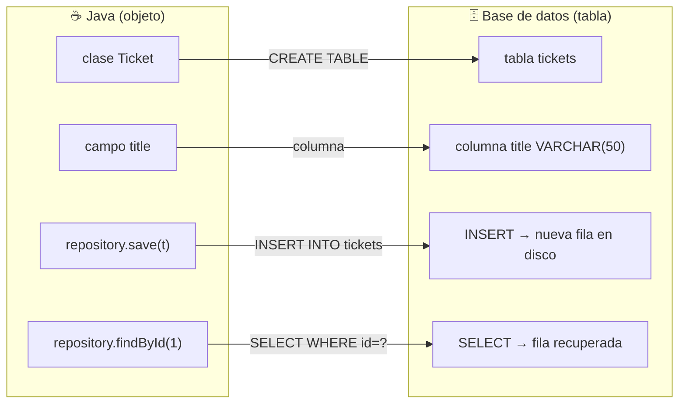
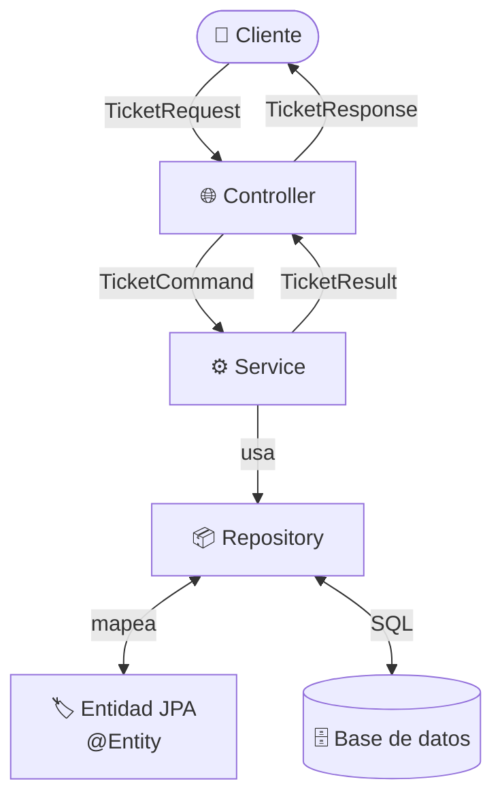
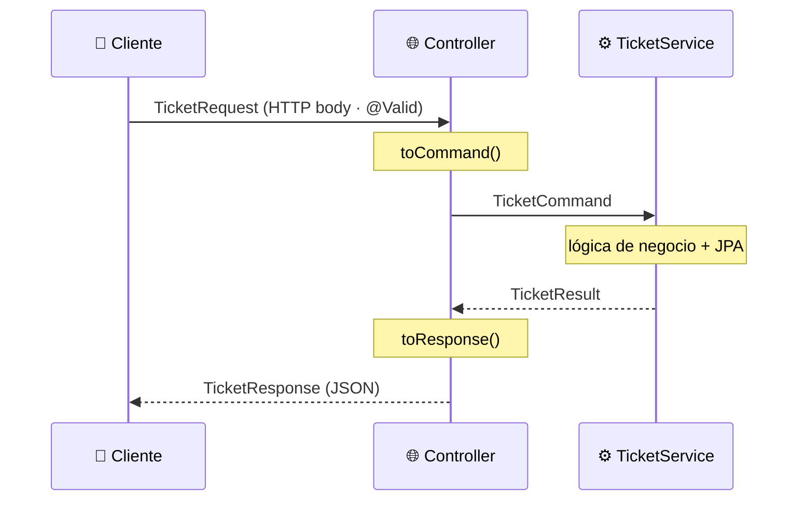
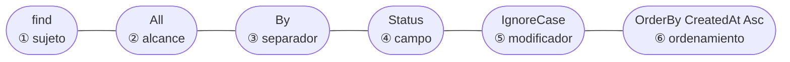
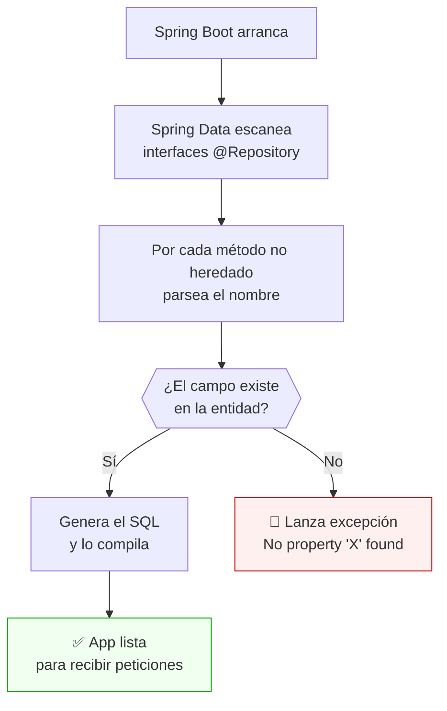
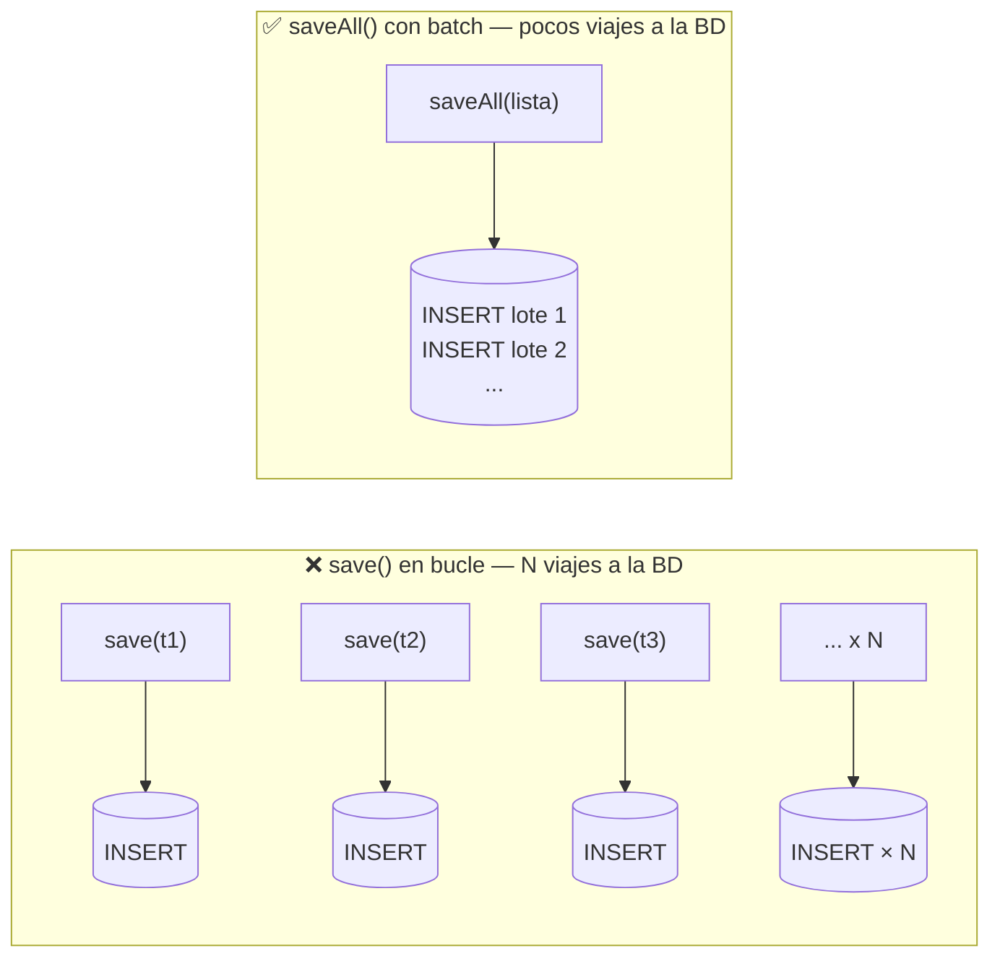
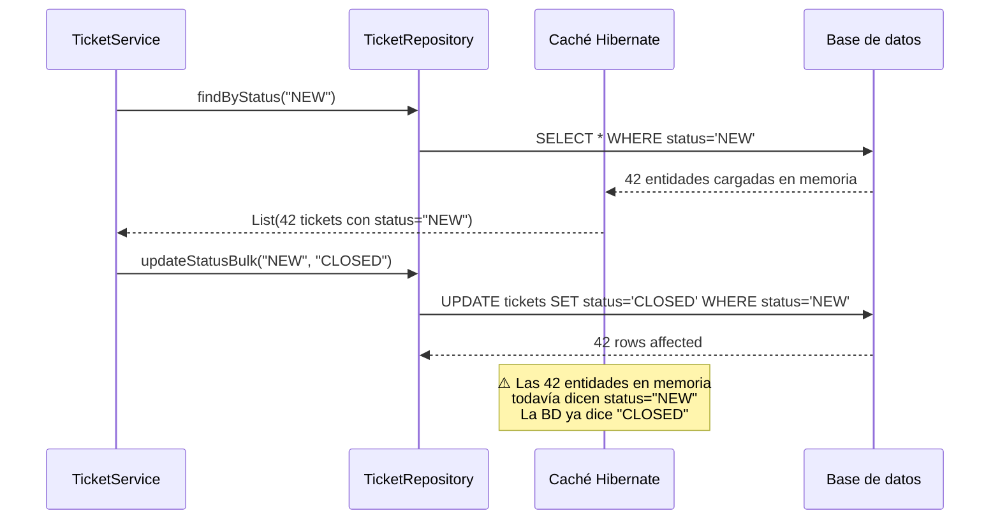
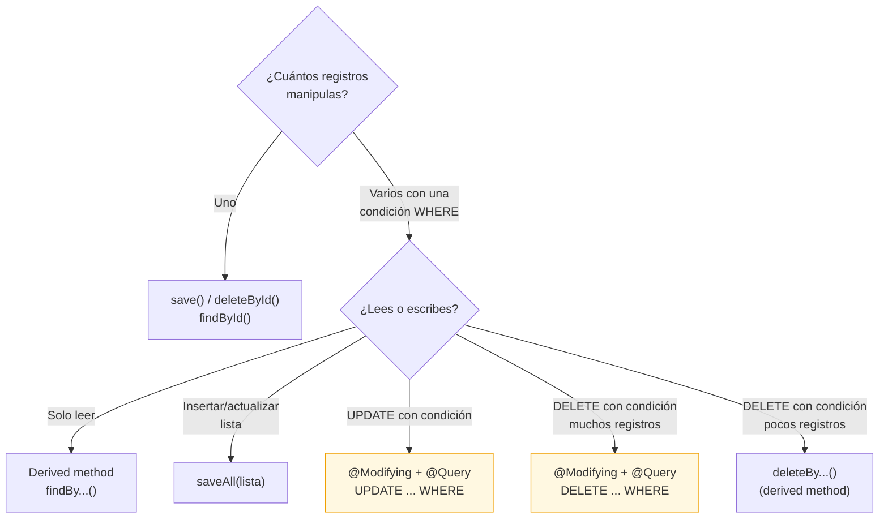
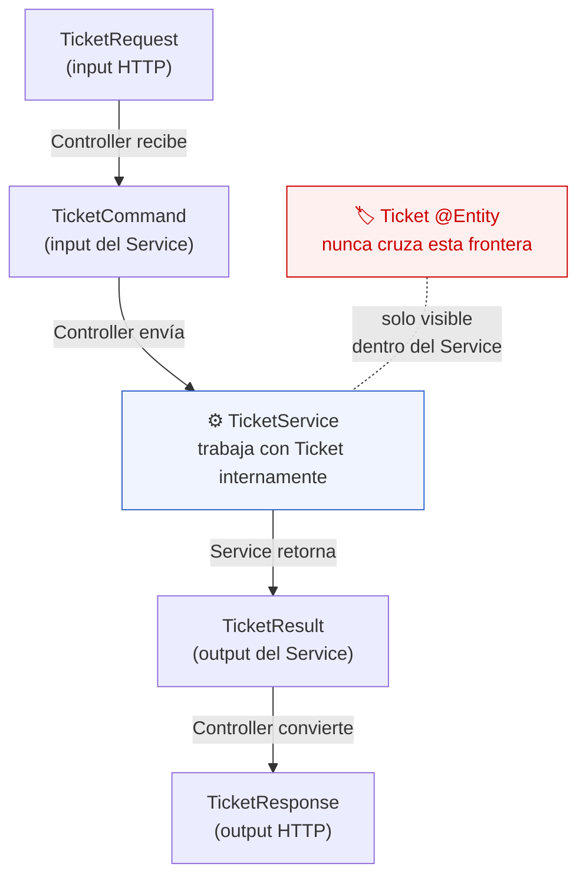
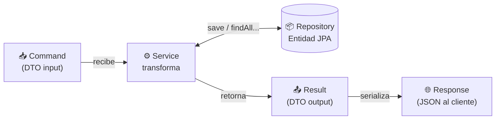

<!-- START OF FILE: docs_lessons_10-jpa-intro_01_objetivo_y_alcance.md -->
# Documento: docs lessons 10-jpa-intro 01 objetivo y alcance
---
# Lección 10 — JPA y ORM: del Map a la base de datos

## ¿De dónde venimos?

En la lección 09 refactorizaste el repositorio para usar `Map<Long, Ticket>` con acceso O(1). Tu API:

- Almacena tickets en memoria con búsqueda eficiente por clave
- Filtra por estado con `?status=`
- Sigue el patrón CSR con responsabilidades bien delimitadas

Pero hay un problema crítico: **cuando la aplicación se reinicia, todos los datos desaparecen**. El `HashMap` vive en la memoria del proceso y muere con él.

Para que los datos sobrevivan reinicios necesitas una base de datos real. Eso es exactamente lo que esta lección resuelve.

---

## ¿Qué es JPA y qué problema resuelve?

**JPA** (Jakarta Persistence API) es la especificación de Java para mapear objetos a tablas de base de datos.

**Hibernate** es la implementación más usada de JPA. Spring Boot lo incluye automáticamente cuando agregas la dependencia correspondiente.

El problema que resuelve se llama "desajuste de impedancia": el código Java trabaja con **objetos**, las bases de datos almacenan **filas en tablas**. JPA actúa como **traductor automático**:



No escribes SQL. JPA lo genera por ti según las anotaciones que agregas a tus clases.

---

## ¿Por qué no retornar entidades directamente?

En una aplicación con capas (Controller → Service → Repository → Model), existe una regla de oro: **nunca exponer entidades JPA fuera del Service**.



**¿Por qué?**

| Problema | Solución |
|----------|----------|
| Ciclos en JSON (A→B→A) | DTOs rompemos la cadena |
| Datos sensibles expuestos | DTO filtra qué se retorna |
| Acoplamiento con BD | La entidad solo existe en repository |
| Cambios en BD rompen API | DTOs son contracts estables |

---

## DTOs: los cuatro roles del flujo de datos

Para resolver esto, usamos **DTOs** (Data Transfer Objects). En una API con JPA hay cuatro roles bien diferenciados:

| DTO | Nombre | Dirección | Quién lo usa |
|-----|--------|-----------|--------------|
| `*Request` | Input HTTP | Cliente → Controller | Controller: valida con `@Valid` |
| `*Command` | Input Service | Controller → Service | Service: recibe para operar |
| `*Result` | Output Service | Service → Controller | Service: retorna datos planos |
| `*Response` | Output HTTP | Controller → Cliente | Controller: serializa a JSON |



| Capa | Input | Output |
|------|-------|--------|
| Controller | Recibe `*Request` del cliente | Retorna `*Response` al cliente |
| Service | Recibe `*Command` | Retorna `*Result` |
| Repository | Entidad JPA | Entidad JPA |

**Regla:**
- Cliente → Controller: `*Request`
- Controller → Service: `*Command`
- Service → Controller: `*Result`
- Controller → Cliente: `*Response`

---

## ¿Qué vas a construir?

Al terminar esta lección tendrás:

1. La dependencia `spring-boot-starter-data-jpa` agregada al `pom.xml`
2. La clase `Ticket` anotada como entidad JPA (`@Entity`, `@Id`, `@GeneratedValue`, `@Column`)
3. `TicketRepository` convertido de **clase** a **interfaz** que extiende `JpaRepository`
4. `TicketService` actualizado para usar los métodos que Spring Data JPA provee automáticamente
5. La aplicación funcionando con base de datos H2 (en memoria)
6. DTOs bien estructurados: `TicketCommand` (input al Service), `TicketResult` (output del Service) y `TicketResponse` (output HTTP)
7. Un `DataInitializer` que siembra tickets iniciales usando JPA al arrancar la aplicación

### Lo que vas a poder explicar

- ¿Qué hace `@Entity` en una clase?
- ¿Qué es `@Id` y por qué no puede faltar en una entidad?
- ¿Qué genera `@GeneratedValue(strategy = GenerationType.IDENTITY)`?
- ¿Qué métodos vienen incluidos en `JpaRepository<Ticket, Long>`?
- ¿Por qué el repositorio ahora es una **interfaz** y no una clase?
- ¿Por qué no retornar entidades JPA directamente?
- ¿Cuál es la diferencia entre `*Command`, `*Result` y `*Response`?

---

## Nuevo requerimiento

| Requerimiento | Descripción |
|---|---|
| **REQ-15** | Los tickets deben persistirse en base de datos real: los datos sobreviven reinicios de la aplicación |

---

## La estructura que tienes al comenzar

```
src/main/java/cl/duoc/fullstack/tickets/
├── controller/
│   └── TicketController.java
├── dto/
│   └── TicketRequest.java
├── model/
│   ├── Ticket.java              ← POJO Lombok, sin anotaciones JPA
│   └── ErrorResponse.java
├── respository/
│   └── TicketRepository.java   ← clase con Map<Long, Ticket>
├── service/
│   └── TicketService.java
└── TicketsApplication.java
```

La estructura al terminar:

```
src/main/java/cl/duoc/fullstack/tickets/
├── config/
│   └── DataInitializer.java    ← siembra datos iniciales con JPA
├── controller/
│   └── TicketController.java   ← recibe Request, retorna Response
├── dto/
│   ├── TicketCommand.java      ← input al Service
│   ├── TicketRequest.java      ← input HTTP (sin cambios, @Valid)
│   ├── TicketResponse.java     ← output HTTP al cliente
│   └── TicketResult.java       ← output del Service
├── model/
│   ├── Ticket.java             ← @Entity, solo vive en repository
│   └── ErrorResponse.java
├── respository/
│   └── TicketRepository.java   ← interfaz JpaRepository
├── service/
│   └── TicketService.java      ← recibe Command, retorna Result
└── TicketsApplication.java
```

---

## ¿Qué NO cubre esta lección?

| Tema | ¿Cuándo se ve? |
|---|---|
| MySQL (XAMPP) | Lección 11 |
| Configurar Supabase (PostgreSQL en la nube) | Lección 11 |
| Relaciones entre tablas (`@ManyToOne`, `@OneToMany`) | Lección 12 |
| Tabla de historial de cambios | Lección 13 |
| Paginación (`Pageable`) | Fuera del alcance del curso |
| JPQL para consultas complejas (subconsultas, JOINs, agregaciones) | Fuera del alcance del curso |
| `@Modifying` + `@Query` para bulk update/delete básico | **Sí se ve** — en `03_jpa_y_orm.md` |


<!-- START OF FILE: docs_lessons_10-jpa-intro_02_guion_paso_a_paso.md -->
# Documento: docs lessons 10-jpa-intro 02 guion paso a paso
---
# Lección 10 — Tutorial paso a paso: migrar a JPA con H2

Sigue esta guía en orden. Al finalizar, tu aplicación guardará los tickets en una base de datos H2 (en memoria para desarrollo) en lugar de un `HashMap` en memoria.

---

## Paso 1: agregar las dependencias en `pom.xml`

Abre `pom.xml` y agrega dentro de `<dependencies>`:

```xml
<!-- Spring Data JPA: incluye Hibernate como implementación -->
<dependency>
    <groupId>org.springframework.boot</groupId>
    <artifactId>spring-boot-starter-data-jpa</artifactId>
</dependency>

<!-- Driver H2 (base de datos en memoria) -->
<dependency>
    <groupId>com.h2database</groupId>
    <artifactId>h2</artifactId>
    <scope>runtime</scope>
</dependency>
```

> **¿Por qué H2?**
> H2 es una base de datos en memoria escrita en Java. No requiere instalación externa, es ideales para desarrollo y testing. Los datos se pierden al cerrar la aplicación (a menos que uses modo archivo).

---

## Paso 2: configurar `application.yml`

Reemplaza el contenido de `src/main/resources/application.yml`:

```yaml
spring:
  application:
    name: Tickets

  datasource:
    url: jdbc:h2:mem:tickets_db
    driver-class-name: org.h2.Driver
    username: sa
    password:

  h2:
    console:
      enabled: true
      path: /h2-console

  jpa:
    hibernate:
      ddl-auto: create-drop
    show-sql: true
    properties:
      hibernate:
        format_sql: true

server:
  port: 8080
  servlet:
    context-path: "/ticket-app"
```

> **¿Qué es `ddl-auto: create-drop`?**
> - `create`: crea las tablas al iniciar
> - `drop`: las borra al cerrar
> Es útil para desarrollo. Los datos no persisten entre ejecuciones (se pierden al cerrar la app).
>
> Para datos persistentes usa `jdbc:h2:file:./data/tickets_db`

> **¿Para qué sirve la consola H2?**
> Accede en `http://localhost:8080/ticket-app/h2-console` para ver la base de datos desde el navegador.Útil para debugging.

---

## Paso 3: anotar `Ticket` como entidad JPA

Abre `Ticket.java` y modifícala así:

```java
package cl.duoc.fullstack.tickets.model;

import jakarta.persistence.Column;
import jakarta.persistence.Entity;
import jakarta.persistence.GeneratedValue;
import jakarta.persistence.GenerationType;
import jakarta.persistence.Id;
import jakarta.persistence.Table;
import jakarta.validation.constraints.NotBlank;
import jakarta.validation.constraints.Size;
import java.time.LocalDate;
import java.time.LocalDateTime;
import lombok.AllArgsConstructor;
import lombok.Getter;
import lombok.NoArgsConstructor;
import lombok.Setter;

@Entity
@Table(name = "tickets")
@Getter
@Setter
@NoArgsConstructor
@AllArgsConstructor
public class Ticket {

  @Id
  @GeneratedValue(strategy = GenerationType.IDENTITY)
  private Long id;

  @NotBlank(message = "El titulo es requerido")
  @Size(max = 50)
  @Column(nullable = false, length = 50)
  private String title;

  @NotBlank
  @Column(nullable = false, columnDefinition = "TEXT")
  private String description;

  @Column(nullable = false, length = 20)
  private String status;

  @Column(name = "created_at")
  private LocalDateTime createdAt;

  @Column(name = "estimated_resolution_date")
  private LocalDate estimatedResolutionDate;

  @Column(name = "effective_resolution_date")
  private LocalDateTime effectiveResolutionDate;
}
```

**Cambios respecto a la versión anterior:**

| Qué cambió | Por qué |
|---|---|
| Se eliminó `@Min(5) @Max(100)` del id | El id lo asigna la base de datos; no tiene sentido validar su valor antes de guardarlo |
| Se agregó `@Entity` | Le dice a JPA "esta clase es una tabla" |
| Se agregó `@Table(name = "tickets")` | Define el nombre exacto de la tabla en la base de datos |
| Se agregó `@Id` | Marca cuál campo es la clave primaria |
| Se agregó `@GeneratedValue(strategy = GenerationType.IDENTITY)` | La base de datos genera el ID automáticamente (AUTO_INCREMENT en MySQL) |
| Se agregaron `@Column(...)` | Personalizan las columnas: nombre, si acepta nulo, longitud máxima |

> **¿Por qué `@NoArgsConstructor` es obligatorio con JPA?**
> Hibernate necesita crear instancias de la entidad usando el constructor sin argumentos para poder poblarla con los datos de la base de datos. Sin `@NoArgsConstructor`, JPA lanzará un error al arrancar.

---

## Paso 4: crear los DTOs del flujo de datos

En esta lección el Controller ya no pasa `TicketRequest` directamente al Service ni el Service retorna entidades JPA. Necesitas tres nuevas clases en el paquete `dto/`.

### `TicketCommand.java` — input del Service

```java
package cl.duoc.fullstack.tickets.dto;

import java.time.LocalDateTime;

public record TicketCommand(
    String title,
    String description,
    String status,
    LocalDateTime effectiveResolutionDate
) {}
```

### `TicketResult.java` — output del Service

```java
package cl.duoc.fullstack.tickets.dto;

import java.time.LocalDate;
import java.time.LocalDateTime;

public record TicketResult(
    Long id,
    String title,
    String description,
    String status,
    LocalDateTime createdAt,
    LocalDate estimatedResolutionDate,
    LocalDateTime effectiveResolutionDate
) {}
```

### `TicketResponse.java` — output HTTP al cliente

```java
package cl.duoc.fullstack.tickets.dto;

import java.time.LocalDate;
import java.time.LocalDateTime;

public record TicketResponse(
    Long id,
    String title,
    String description,
    String status,
    LocalDateTime createdAt,
    LocalDate estimatedResolutionDate,
    LocalDateTime effectiveResolutionDate
) {}
```

> **¿Por qué `TicketResult` y `TicketResponse` son iguales aquí?**
> En esta lección sí son iguales porque `Ticket` aún no tiene relaciones JPA. Cuando en L12 agregues `User` como relación, `TicketResult` expondrá el nombre del usuario como `String` mientras que `TicketResponse` puede formatear o agregar campos calculados. Tenerlos separados desde ahora evita romper la API cuando ocurra ese cambio.

---

## Paso 5: convertir `TicketRepository` a interfaz

Reemplaza completamente el contenido de `TicketRepository.java`:

```java
package cl.duoc.fullstack.tickets.respository;

import cl.duoc.fullstack.tickets.model.Ticket;
import java.util.List;
import org.springframework.data.jpa.repository.JpaRepository;
import org.springframework.stereotype.Repository;

@Repository
public interface TicketRepository extends JpaRepository<Ticket, Long> {

  // Spring Data JPA genera el SQL automáticamente a partir del nombre del método
  boolean existsByTitleIgnoreCase(String title);

  List<Ticket> findByStatusIgnoreCase(String status);

  List<Ticket> findAllByOrderByCreatedAtAsc();
}
```

> **¿Por qué ahora es una interfaz y no una clase?**
> Spring Data JPA genera en tiempo de ejecución una implementación completa de esta interfaz. Tú defines **qué** quieres hacer (los métodos), Spring Data JPA decide **cómo** hacerlo (el SQL). No necesitas escribir ni una línea de acceso a datos.

> **¿De dónde vienen los métodos `findById`, `save`, `deleteById`, `existsById`?**
> Los hereda `JpaRepository<Ticket, Long>`. El primer tipo (`Ticket`) es la entidad; el segundo (`Long`) es el tipo del ID. Todos estos métodos ya vienen implementados.

> **¿Cómo sabe Spring Data que `findByStatusIgnoreCase` busca por el campo `status`?**
> Interpreta el nombre del método: `findBy` + `Status` (campo) + `IgnoreCase` (modificador). Es una convención que el framework entiende y traduce a `SELECT * FROM tickets WHERE LOWER(status) = LOWER(?)`.

> **`existsByTitleIgnoreCase` vs `existsByTitle`**
> Agregar `IgnoreCase` hace la verificación de duplicados insensible a mayúsculas: "Error en login" y "ERROR EN LOGIN" se consideran el mismo título. Siempre que uses `findBy` o `existsBy`, puedes agregar `IgnoreCase` al final del campo.

---

## Paso 6: actualizar `TicketService`

Actualiza `TicketService.java` para recibir `TicketCommand`, usar los métodos de JPA y retornar `TicketResult`:

```java
package cl.duoc.fullstack.tickets.service;

import cl.duoc.fullstack.tickets.dto.TicketCommand;
import cl.duoc.fullstack.tickets.dto.TicketResult;
import cl.duoc.fullstack.tickets.model.Ticket;
import cl.duoc.fullstack.tickets.respository.TicketRepository;
import java.time.LocalDate;
import java.time.LocalDateTime;
import java.util.List;
import java.util.Optional;
import org.springframework.stereotype.Service;

@Service
public class TicketService {

  private final TicketRepository repository;

  public TicketService(TicketRepository repository) {
    this.repository = repository;
  }

  public List<TicketResult> getTickets() {
    return this.repository.findAllByOrderByCreatedAtAsc().stream()
        .map(this::toResult)
        .toList();
  }

  public List<TicketResult> getTickets(String statusFilter) {
    if (statusFilter == null || statusFilter.isBlank()) {
      return getTickets();
    }
    return this.repository.findByStatusIgnoreCase(statusFilter).stream()
        .map(this::toResult)
        .toList();
  }

  public TicketResult create(TicketCommand command) {
    if (this.repository.existsByTitleIgnoreCase(command.title())) {
      throw new IllegalArgumentException(
          "Ya existe un ticket con el título: \"" + command.title() + "\"");
    }
    Ticket ticket = new Ticket();
    ticket.setTitle(command.title());
    ticket.setDescription(command.description());
    ticket.setStatus("NEW");
    ticket.setCreatedAt(LocalDateTime.now());
    ticket.setEstimatedResolutionDate(LocalDate.now().plusDays(5));
    Ticket saved = this.repository.save(ticket);  // ← persiste en H2
    return toResult(saved);
  }

  public Optional<TicketResult> getById(Long id) {
    return this.repository.findById(id).map(this::toResult);
  }

  public boolean deleteById(Long id) {
    if (this.repository.existsById(id)) {
      this.repository.deleteById(id);
      return true;
    }
    return false;
  }

  public Optional<TicketResult> updateById(Long id, TicketCommand command) {
    Optional<Ticket> found = this.repository.findById(id);
    if (found.isEmpty()) {
      return Optional.empty();
    }
    Ticket toUpdate = found.get();
    toUpdate.setTitle(command.title());
    toUpdate.setDescription(command.description());
    if (command.status() != null && !command.status().isBlank()) {
      toUpdate.setStatus(command.status());
    }
    toUpdate.setEffectiveResolutionDate(command.effectiveResolutionDate());
    Ticket saved = this.repository.save(toUpdate);
    return Optional.of(toResult(saved));
  }

  private TicketResult toResult(Ticket ticket) {
    return new TicketResult(
        ticket.getId(),
        ticket.getTitle(),
        ticket.getDescription(),
        ticket.getStatus(),
        ticket.getCreatedAt(),
        ticket.getEstimatedResolutionDate(),
        ticket.getEffectiveResolutionDate()
    );
  }
}
```

**Cambios clave respecto a la versión anterior:**

| Método | Antes (Map) | Ahora (JPA) |
|---|---|---|
| `getTickets` | `db.values()` + sort manual | `findAllByOrderByCreatedAtAsc()` |
| `create` | `db.put(currentId++, ticket)` | `repository.save(ticket)` |
| `getById` | `Optional.ofNullable(db.get(id))` | `repository.findById(id)` |
| `deleteById` | `db.remove(id) != null` | `existsById(id)` + `deleteById(id)` |
| `updateById` | busca + modifica en Map | `findById(id).map(...)` + `save(ticket)` |

> **¿Por qué `repository.save(ticket)` sirve tanto para crear como para actualizar?**
> `save()` revisa si el objeto tiene ID asignado:
> - Sin ID (null): ejecuta `INSERT` → crea un registro nuevo
> - Con ID: ejecuta `UPDATE` → actualiza el registro existente

---

## Paso 7: actualizar `TicketController`

El Controller convierte `TicketRequest` → `TicketCommand` antes de llamar al Service, y convierte `TicketResult` → `TicketResponse` antes de retornar al cliente:

```java
@PostMapping
public ResponseEntity<Object> create(@Valid @RequestBody TicketRequest request) {
  try {
    TicketCommand command = toCommand(request);
    TicketResult result = this.service.create(command);
    return ResponseEntity.status(HttpStatus.CREATED).body(toResponse(result));
  } catch (IllegalArgumentException e) {
    return ResponseEntity.status(HttpStatus.CONFLICT).body(new ErrorResponse(e.getMessage()));
  }
}

// Conversión Request → Command
private TicketCommand toCommand(TicketRequest request) {
  return new TicketCommand(
      request.title(),
      request.description(),
      request.status(),
      request.effectiveResolutionDate()
  );
}

// Conversión Result → Response
private TicketResponse toResponse(TicketResult result) {
  return new TicketResponse(
      result.id(),
      result.title(),
      result.description(),
      result.status(),
      result.createdAt(),
      result.estimatedResolutionDate(),
      result.effectiveResolutionDate()
  );
}
```

Los endpoints GET y PUT siguen el mismo patrón: reciben `TicketRequest`, convierten a `TicketCommand`, llaman al Service, convierten `TicketResult` a `TicketResponse`.

---

## Paso 8: sembrar datos iniciales con `DataInitializer`

Para que la aplicación arranque con tickets de ejemplo, crea la clase `DataInitializer` en el paquete `config/`:

```java
package cl.duoc.fullstack.tickets.config;

import cl.duoc.fullstack.tickets.model.Ticket;
import cl.duoc.fullstack.tickets.respository.TicketRepository;
import java.time.LocalDate;
import java.time.LocalDateTime;
import org.springframework.boot.CommandLineRunner;
import org.springframework.stereotype.Component;

@Component
public class DataInitializer implements CommandLineRunner {

  private final TicketRepository ticketRepository;

  public DataInitializer(TicketRepository ticketRepository) {
    this.ticketRepository = ticketRepository;
  }

  @Override
  public void run(String... args) throws Exception {
    if (ticketRepository.count() == 0) {
      LocalDateTime now = LocalDateTime.now();
      LocalDate estimated = LocalDate.now().plusDays(5);

      Ticket t1 = new Ticket();
      t1.setTitle("Error en login");
      t1.setDescription("No se puede iniciar sesión con Google");
      t1.setStatus("NEW");
      t1.setCreatedAt(now);
      t1.setEstimatedResolutionDate(estimated);
      ticketRepository.save(t1);

      Ticket t2 = new Ticket();
      t2.setTitle("Mejora en dashboard");
      t2.setDescription("Agregar gráficos de estadísticas");
      t2.setStatus("IN_PROGRESS");
      t2.setCreatedAt(now);
      t2.setEstimatedResolutionDate(estimated);
      ticketRepository.save(t2);
    }
  }
}
```

> **¿Qué hace `CommandLineRunner`?**
> Es una interfaz de Spring Boot. El método `run()` se ejecuta automáticamente una vez que la aplicación arranca y el contexto está listo. Es el lugar ideal para sembrar datos iniciales.

> **¿Por qué el `if (count() == 0)`?**
> Evita duplicar los datos si usas `ddl-auto: update` (que no borra la tabla al reiniciar). Con `create-drop` no es estrictamente necesario, pero es buena práctica defensiva.

---

## Paso 9: verificar que la aplicación arranca

Ejecuta:

```bash
./mvnw spring-boot:run
```

En la consola deberías ver:

1. Mensajes de Hibernate creando la tabla:
   ```sql
   create table tickets (
       id bigint generated by default as identity,
       created_at timestamp(6),
       description text not null,
       ...
       primary key (id)
   )
   ```
2. Los `INSERT` del `DataInitializer` (gracias a `show-sql: true`)
3. El banner de la aplicación y el mensaje `Started TicketsApplication`

---

## Paso 10: probar que los datos persisten con H2

Con `ddl-auto: create-drop` los datos **no** persisten entre reinicios (H2 borra la tabla al cerrar). Esto es esperado en desarrollo.

### Consultar los tickets (datos sembrados)

```
GET http://localhost:8080/ticket-app/tickets
```

Resultado esperado: los dos tickets del `DataInitializer` aparecen en la lista.

### Crear un ticket nuevo

```
POST http://localhost:8080/ticket-app/tickets
Content-Type: application/json

{
  "title": "Nuevo ticket de prueba",
  "description": "Verifica que JPA persiste correctamente"
}
```

Resultado esperado: `201 Created` con el ticket en el body (con `id` asignado por la base de datos).

### Ver la base de datos en el navegador

Accede a `http://localhost:8080/ticket-app/h2-console` con:
- JDBC URL: `jdbc:h2:mem:tickets_db`
- User: `sa`
- Password: (vacío)

Ejecuta `SELECT * FROM TICKETS;` para ver los datos directamente en la tabla.

---

## Paso 11: reflexiona antes de cerrar

1. ¿Qué diferencia hay entre `ddl-auto: create-drop` y `ddl-auto: update`? ¿Cuál usarías en producción?
2. Antes, `TicketRepository` era una clase con 150 líneas. Ahora es una interfaz con 3 métodos. ¿Quién escribe el código que falta?
3. ¿Qué pasa si quitas `@NoArgsConstructor` de `Ticket` y reinicias la aplicación?
4. ¿Cómo sabe Spring Data JPA que `findByStatusIgnoreCase` busca por el campo `status` y no por `title`?

---

## ¿Qué sigue?

| Lección | Contenido |
|---------|----------|
| 11 | MySQL (XAMPP) y PostgreSQL (Supabase) con perfiles |
| 12 | User entity y relaciones ManyToOne |
| 13 | TicketHistory para historial de cambios |


<!-- START OF FILE: docs_lessons_10-jpa-intro_03_jpa_y_orm.md -->
# Documento: docs lessons 10-jpa-intro 03 jpa y orm
---
# Lección 10 — JPA, ORM y anotaciones esenciales

## ¿Qué es un ORM?

**ORM** significa *Object-Relational Mapping* (Mapeo Objeto-Relacional). Es la técnica de traducir automáticamente entre dos mundos que hablan idiomas distintos:

| Mundo Java (orientado a objetos) | Mundo SQL (relacional) |
|---|---|
| Clase | Tabla |
| Objeto (instancia) | Fila |
| Campo / atributo | Columna |
| Tipo `String` | `VARCHAR` |
| Tipo `Long` | `BIGINT` |
| Tipo `LocalDateTime` | `DATETIME` |
| Referencia entre objetos (`ticket.user`) | Clave foránea (`ticket.user_id`) |

Sin ORM, escribirías SQL a mano para cada operación. Con JPA + Hibernate, describes tus clases con anotaciones y el framework genera el SQL por ti.

---

## Las anotaciones que debes conocer

### `@Entity`

```java
@Entity
public class Ticket { ... }
```

Le dice a JPA: "esta clase representa una tabla en la base de datos". Cada instancia del objeto corresponde a una fila en esa tabla.

**Regla:** toda clase anotada con `@Entity` debe tener un constructor sin argumentos (lo provee `@NoArgsConstructor` de Lombok).

---

### `@Table`

```java
@Entity
@Table(name = "tickets")
public class Ticket { ... }
```

Define el nombre exacto de la tabla en la base de datos. Si omites `@Table`, JPA usa el nombre de la clase en minúsculas (`ticket`). Es buena práctica explicitarlo siempre para evitar sorpresas.

---

### `@Id`

```java
@Id
private Long id;
```

Marca el campo que es la **clave primaria** de la tabla. Toda entidad JPA debe tener exactamente un `@Id`. Sin él, JPA lanza una excepción al arrancar.

---

### `@GeneratedValue`

```java
@Id
@GeneratedValue(strategy = GenerationType.IDENTITY)
private Long id;
```

Le dice a JPA que la base de datos genera el valor del ID automáticamente. `IDENTITY` usa el mecanismo nativo de la base de datos:

- **MySQL**: `AUTO_INCREMENT`
- **PostgreSQL**: `SERIAL` o `GENERATED ALWAYS AS IDENTITY`

Con esto, nunca asignas el ID manualmente. Cuando llamas a `repository.save(ticket)`, la base de datos asigna el próximo ID disponible y JPA lo inyecta de vuelta en el objeto.

**Estrategias disponibles:**

| Estrategia | Cómo funciona |
|---|---|
| `IDENTITY` | Usa AUTO_INCREMENT / SERIAL de la base de datos. La más simple, la más usada |
| `SEQUENCE` | Usa una secuencia de la base de datos (PostgreSQL lo soporta nativamente) |
| `AUTO` | JPA elige la estrategia según la base de datos. Menos predecible |

Para este curso, siempre usa `IDENTITY`.

---

### `@Column`

```java
@Column(name = "created_at", nullable = false, length = 50)
private String title;
```

Personaliza la columna en la base de datos. Los atributos más usados:

| Atributo | Qué hace | Valor por defecto |
|---|---|---|
| `name` | Nombre de la columna en SQL | Nombre del campo en Java |
| `nullable` | Si la columna acepta `NULL` | `true` |
| `length` | Longitud máxima para `VARCHAR` | `255` |
| `unique` | Si los valores deben ser únicos | `false` |
| `columnDefinition` | Define el tipo SQL exacto | (lo elige Hibernate) |

Si omites `@Column`, JPA crea la columna con el nombre del campo y valores por defecto.

---

## Qué viene incluido en `JpaRepository`

Cuando tu repositorio extiende `JpaRepository<Ticket, Long>`, obtienes estos métodos sin escribir nada:

| Método | SQL equivalente |
|---|---|
| `save(ticket)` | `INSERT` o `UPDATE` según si tiene ID |
| `findById(id)` | `SELECT * FROM tickets WHERE id = ?` |
| `findAll()` | `SELECT * FROM tickets` |
| `existsById(id)` | `SELECT COUNT(*) WHERE id = ?` |
| `deleteById(id)` | `DELETE FROM tickets WHERE id = ?` |
| `count()` | `SELECT COUNT(*) FROM tickets` |

Además, puedes agregar métodos propios siguiendo una convención de nombres que Spring Data interpreta automáticamente:

```java
// Spring Data genera: SELECT * FROM tickets WHERE status = ? (insensible a mayúsculas)
List<Ticket> findByStatusIgnoreCase(String status);

// Spring Data genera: SELECT COUNT(*) WHERE LOWER(title) = LOWER(?)
boolean existsByTitleIgnoreCase(String title);

// Spring Data genera: SELECT * FROM tickets ORDER BY created_at ASC
List<Ticket> findAllByOrderByCreatedAtAsc();

// Spring Data genera: SELECT * FROM tickets WHERE status = ? ORDER BY created_at DESC
List<Ticket> findByStatusOrderByCreatedAtDesc(String status);
```

La convención es: `findBy` + `NombreDeCampo` + (modificadores opcionales como `IgnoreCase`, `OrderBy`, etc.). A continuación se explica en detalle cómo funciona esta convención.

---

## Derived Query Methods — cómo Spring Data lee el nombre del método

Cuando la aplicación arranca, Spring Data escanea cada método de cada repositorio y los que no están en `JpaRepository` los pasa por un **analizador de nombres**. Este analizador descompone el nombre en partes, valida que los campos existan en la entidad y genera el SQL. Si algo no cuadra, la aplicación **no arranca** — el error aparece antes de que llegue la primera petición HTTP. Eso es una ventaja: los errores de consulta se detectan en compilación/arranque, no en producción.

### La anatomía de un nombre derivado

Un nombre de método tiene hasta cuatro partes:



**`findAllByStatusIgnoreCaseOrderByCreatedAtAsc`**
→ `SELECT * FROM tickets WHERE LOWER(status) = LOWER(?) ORDER BY created_at ASC`

Cada parte es opcional excepto el sujeto y el separador `By` (cuando hay condición).

---

### ① Los sujetos — qué retorna el método

El sujeto define el tipo de operación y el tipo de retorno.

| Sujeto | Tipo de retorno | SQL generado |
|--------|----------------|--------------|
| `find...By` | `List<T>` o `Optional<T>` | `SELECT ...` |
| `read...By` | igual que `find` | alias de `find` |
| `get...By` | igual que `find` | alias de `find` |
| `count...By` | `long` | `SELECT COUNT(*)` |
| `exists...By` | `boolean` | `SELECT COUNT(*) > 0` |
| `delete...By` | `void` o `long` | `DELETE FROM ...` |

```java
List<Ticket> findByStatus(String status);         // SELECT ...
long         countByStatus(String status);        // SELECT COUNT(*)
boolean      existsByTitleIgnoreCase(String t);   // SELECT COUNT(*) > 0
long         deleteByStatus(String status);       // DELETE FROM ...
```

---

### ② El alcance (opcional) — cuántos registros

Entre el sujeto y `By` puedes agregar un alcance. El más común es nada (retorna todos los que coinciden) o `Top`/`First` para limitar:

```java
// Todos los que coinciden
List<Ticket> findByStatus(String status);

// Solo el primero (el más reciente)
Optional<Ticket> findFirstByStatusOrderByCreatedAtDesc(String status);

// Solo los 3 primeros
List<Ticket> findTop3ByStatusOrderByCreatedAtAsc(String status);
```

`Top` y `First` son equivalentes — ambos agregan `LIMIT N` al SQL. El número va pegado: `Top3`, `Top10`, `First1`.

---

### ③ El separador `By`

`By` es el pivote: todo lo que va antes define **qué** y **cuánto** retorna; todo lo que va después define el `WHERE`. Sin predicado después del `By`, Spring Data no agrega condición (equivale a `findAll()`).

```java
// sin condición — equivale a findAll() con orden
List<Ticket> findAllByOrderByCreatedAtAsc();
//           ↑ By sin campo antes del OrderBy = sin WHERE
```

---

### ④ Los campos — el nombre Java, no el SQL

El nombre del campo en el método **debe coincidir exactamente** con el nombre del campo en la clase Java (con la primera letra en mayúscula). Spring Data usa reflexión sobre la entidad para validar esto al arrancar.

```java
// Entidad: private LocalDateTime createdAt;

findAllByOrderByCreatedAtAsc()     // ✅ "createdAt" → "CreatedAt"
findAllByOrderByCreationDateAsc()  // ❌ no existe "creationDate" en Ticket
// → No property 'creationDate' found for type 'Ticket'
```

> El nombre de la **columna SQL** (`created_at`) es irrelevante aquí. Spring Data trabaja con el nombre del **campo Java** (`createdAt`).

---

### ⑤ Los modificadores de condición

Después del nombre del campo puedes agregar uno o más modificadores:

| Modificador | SQL generado | Ejemplo |
|---|---|---|
| *(ninguno)* | `= ?` | `findByStatus(String s)` |
| `IgnoreCase` | `LOWER(campo) = LOWER(?)` | `findByStatusIgnoreCase(String s)` |
| `Not` | `!= ?` | `findByStatusNot(String s)` |
| `Containing` | `LIKE '%?%'` | `findByTitleContaining(String t)` |
| `StartingWith` | `LIKE '?%'` | `findByTitleStartingWith(String t)` |
| `EndingWith` | `LIKE '%?'` | `findByTitleEndingWith(String t)` |
| `In` | `IN (?, ?, ...)` | `findByStatusIn(List<String> l)` |
| `IsNull` | `IS NULL` | `findByEffectiveResolutionDateIsNull()` |
| `IsNotNull` | `IS NOT NULL` | `findByEffectiveResolutionDateIsNotNull()` |
| `LessThan` | `< ?` | `findByCreatedAtLessThan(LocalDateTime dt)` |
| `GreaterThan` | `> ?` | `findByCreatedAtGreaterThan(LocalDateTime dt)` |
| `Between` | `BETWEEN ? AND ?` | `findByCreatedAtBetween(LocalDateTime a, LocalDateTime b)` |

Los modificadores se **apilan**: `ContainingIgnoreCase` combina `Containing` con `IgnoreCase`:

```java
// WHERE LOWER(title) LIKE LOWER('%?%')
List<Ticket> findByTitleContainingIgnoreCase(String keyword);
```

---

### Combinar condiciones: `And` y `Or`

Puedes encadenar múltiples campos con `And` u `Or`. Los parámetros del método van en el **mismo orden** que los campos en el nombre:

```java
// WHERE status = ? AND created_at > ?
List<Ticket> findByStatusAndCreatedAtGreaterThan(
    String status, LocalDateTime from);

// WHERE status = ? OR LOWER(title) LIKE LOWER('%?%')
List<Ticket> findByStatusOrTitleContainingIgnoreCase(
    String status, String keyword);

// WHERE status = ? AND effective_resolution_date IS NULL
List<Ticket> findByStatusAndEffectiveResolutionDateIsNull(String status);
```

> **Regla:** los parámetros se asignan por **posición**, no por nombre. Si el método tiene `AndCreatedAtBetween`, necesitas dos parámetros `LocalDateTime` en ese orden.

---

### ⑥ El ordenamiento

`OrderBy` + campo + `Asc`/`Desc` al final del nombre agrega `ORDER BY` al SQL. Puedes encadenar varios campos de orden:

```java
// ORDER BY created_at ASC
List<Ticket> findAllByOrderByCreatedAtAsc();

// WHERE status = ? ORDER BY created_at DESC
List<Ticket> findByStatusOrderByCreatedAtDesc(String status);

// ORDER BY status ASC, THEN created_at DESC
List<Ticket> findAllByOrderByStatusAscCreatedAtDesc();
```

---

### Cómo Spring Data valida todo esto al arrancar



Esto convierte los errores de consulta en **errores de arranque**, no en errores de producción. Si escribiste mal el nombre de un campo, lo sabes antes de que llegue la primera petición.

---

### Cuándo los derived methods no son suficientes

Los derived methods cubren la mayoría de los casos. Hay dos situaciones donde no alcanzan:

1. **El nombre se vuelve ilegible** — más de ~60 caracteres es señal de que necesitas `@Query` con JPQL.
2. **Operaciones masivas con condición** — `save()` siempre trabaja de a un registro; para actualizar o eliminar muchos registros a la vez con una sola sentencia SQL se necesita `@Modifying`. Ambos casos se explican en la siguiente sección.

```java
// 🟡 Límite razonable de derived method — todavía legible
List<Ticket> findByStatusAndEffectiveResolutionDateIsNullOrderByCreatedAtAsc(String s);

// 🔴 Demasiado largo — mejor usar @Query (lección posterior)
List<Ticket> findByStatusAndTitleContainingIgnoreCaseAndCreatedAtBetweenOrderByCreatedAtDesc(
    String status, String keyword, LocalDateTime from, LocalDateTime to);
```

---

## Operaciones masivas — `saveAll`, `@Modifying` y bulk update

`save()` trabaja de a un registro. La pregunta natural es: ¿qué pasa si necesito insertar 500 tickets de una importación, o cerrar todos los tickets con estado `NEW` de una vez?

### `saveAll()` — insertar o actualizar muchos registros

`JpaRepository` ya incluye `saveAll(Iterable<T>)`. La diferencia con un bucle de `save()` no es solo sintáctica: con la configuración correcta Hibernate agrupa los `INSERT` en lotes, reduciendo drásticamente las idas a la base de datos.



```java
// ❌ N llamadas individuales — N round-trips a la BD
for (Ticket t : ticketsImportados) {
    repository.save(t);
}

// ✅ Una sola llamada — Hibernate puede agrupar los INSERTs
repository.saveAll(ticketsImportados);
```

Para activar el batching real de Hibernate, agrega a `application.yml`:

```yaml
jpa:
  properties:
    hibernate:
      jdbc:
        batch_size: 50        # agrupa hasta 50 INSERTs por viaje
      order_inserts: true     # reordena para que el batch sea efectivo
      order_updates: true
```

> **¿Por qué `batch_size` no activa solo?**
> `GenerationType.IDENTITY` (AUTO_INCREMENT) desactiva el batching en Hibernate porque la BD asigna el ID después de cada INSERT y Hibernate necesita ese ID para construir el objeto. Si el rendimiento de inserciones masivas es crítico, existe `GenerationType.SEQUENCE` (PostgreSQL), que permite batching nativo. Fuera del alcance de este curso, pero es útil saberlo.

---

### `@Modifying` — actualizar o eliminar muchos registros con una condición

Ni `save()` ni los derived methods permiten ejecutar un `UPDATE ... WHERE` o `DELETE ... WHERE` en una sola sentencia SQL sin cargar las entidades primero. Para eso existe la combinación `@Query` + `@Modifying`.

```java
@Repository
public interface TicketRepository extends JpaRepository<Ticket, Long> {

  // Cierra todos los tickets NEW de un golpe
  @Modifying
  @Transactional
  @Query("UPDATE Ticket t SET t.status = :newStatus WHERE t.status = :oldStatus")
  int updateStatusBulk(@Param("oldStatus") String oldStatus,
                       @Param("newStatus") String newStatus);

  // Elimina todos los tickets cerrados de un golpe
  @Modifying
  @Transactional
  @Query("DELETE FROM Ticket t WHERE t.status = :status")
  int deleteBulkByStatus(@Param("status") String status);
}
```

Retorna `int` = número de filas afectadas.

> **JPQL vs SQL:** la `@Query` de arriba usa **JPQL** (Java Persistence Query Language). Escribe el nombre de la **clase Java** (`Ticket`, `t.status`) no el nombre de la **tabla SQL** (`tickets`, `status`). JPA traduce a SQL según el dialecto de la base de datos.

---

### Por qué `@Modifying` es necesario

Sin `@Modifying`, Spring Data asume que cualquier `@Query` es un SELECT y lanza una excepción al intentar ejecutar un UPDATE o DELETE. Las tres anotaciones trabajan juntas:

| Anotación | Qué hace |
|---|---|
| `@Query("UPDATE ...")` | Define el JPQL a ejecutar |
| `@Modifying` | Le dice a Spring Data que es una operación de escritura, no lectura |
| `@Transactional` | Envuelve la operación en una transacción; sin ella Hibernate lanza `TransactionRequiredException` |

---

### El problema invisible: la caché de Hibernate

Aquí viene el punto que más confunde. Cuando ejecutas una operación masiva con `@Modifying`, la base de datos se actualiza correctamente. Pero Hibernate mantiene en memoria una **caché de primer nivel** (el contexto de persistencia) con las entidades que ya cargó en esa sesión. Esas entidades **no se actualizan automáticamente** con el resultado del bulk update.



Para resolverlo, agrega `clearAutomatically = true` en `@Modifying`:

```java
@Modifying(clearAutomatically = true)
@Transactional
@Query("UPDATE Ticket t SET t.status = :newStatus WHERE t.status = :oldStatus")
int updateStatusBulk(@Param("oldStatus") String old, @Param("newStatus") String nuevo);
```

`clearAutomatically = true` vacía la caché de primer nivel después del UPDATE. Las siguientes consultas van a la BD y obtienen los datos actualizados.

> **Regla práctica:** si después de un bulk update vas a hacer un `findBy...` en el mismo contexto de transacción, usa `clearAutomatically = true`. Si son operaciones independientes (peticiones HTTP distintas), no es necesario.

---

### El problema del `deleteBy` derivado: carga antes de borrar

Los derived methods de tipo `deleteBy...` tienen un comportamiento que sorprende:

```java
// Parece un DELETE simple...
long deleteByStatus(String status);
```

Pero lo que Hibernate hace internamente es:
1. `SELECT * FROM tickets WHERE status = ?` — carga todas las entidades
2. Para cada entidad: `DELETE FROM tickets WHERE id = ?` — N deletes individuales

Para datasets grandes, esto es un problema de rendimiento (N+1 de eliminación). La alternativa es el bulk delete con `@Modifying`:

```java
// Un único DELETE en la BD — sin cargar entidades
@Modifying(clearAutomatically = true)
@Transactional
@Query("DELETE FROM Ticket t WHERE t.status = :status")
int deleteBulkByStatus(@Param("status") String status);
```

---

### Resumen: cuándo usar cada enfoque



| Operación | Herramienta | Retorna |
|---|---|---|
| Guardar uno | `save(entity)` | `T` (la entidad guardada) |
| Guardar muchos | `saveAll(list)` | `List<T>` |
| Buscar con condición | `findBy...()` | `List<T>` / `Optional<T>` |
| Contar con condición | `countBy...()` | `long` |
| Eliminar uno | `deleteById(id)` | `void` |
| Eliminar con condición (pocos) | `deleteBy...()` | `long` |
| Eliminar con condición (muchos) | `@Modifying @Query DELETE` | `int` (filas afectadas) |
| Actualizar con condición | `@Modifying @Query UPDATE` | `int` (filas afectadas) |

---

## `show-sql: true` — aprende leyendo el SQL generado

En `application.yml` configuraste:

```yaml
jpa:
  show-sql: true
  properties:
    hibernate:
      format_sql: true
```

Esto muestra en consola el SQL que JPA genera para cada operación. Es invaluable para aprender:

```sql
-- Al llamar a repository.save(ticket) con un ticket nuevo:
insert
into
    tickets
    (created_at, description, effective_resolution_date, estimated_resolution_date, status, title)
values
    (?, ?, ?, ?, ?, ?)

-- Al llamar a repository.findById(1L):
select
    t1_0.id,
    t1_0.created_at,
    ...
from
    tickets t1_0
where
    t1_0.id=?
```

En producción desactivarías `show-sql` para no exponer la estructura de la base de datos en los logs.

---

## El puente desde el Map al JPA

El Map que usabas antes y JPA comparten el mismo concepto fundamental: acceso por clave primaria.

| Concepto | Con `Map<Long, Ticket>` | Con JPA |
|---|---|---|
| Guardar | `db.put(id, ticket)` | `repository.save(ticket)` |
| Buscar por ID | `db.get(id)` | `repository.findById(id)` |
| Eliminar | `db.remove(id)` | `repository.deleteById(id)` |
| ¿Existe? | `db.containsKey(id)` | `repository.existsById(id)` |
| Listar todos | `new ArrayList<>(db.values())` | `repository.findAll()` |
| Dónde viven los datos | RAM (se pierden al reiniciar) | Disco (persisten para siempre) |

El cambio conceptual es mínimo. El beneficio es enorme.

---

## El patrón DTO — "profe, es otra clase con los mismos datos... ¿para qué?"

Esta es la pregunta más frecuente cuando se introduce el patrón. La respuesta corta es: **hoy se ven iguales, pero no son lo mismo, y en cuanto el proyecto crece dejan de parecerse**.

### Dos mundos, dos contratos

Una entidad JPA (`Ticket`) es el **reflejo de la base de datos**. Su forma la dictan las tablas, las relaciones, los índices. Cambia cuando la base de datos cambia.

Un DTO (`TicketResponse`) es el **contrato con el cliente de la API**. Su forma la dictan los consumidores: el frontend, la app móvil, los integradores. Cambia cuando ellos necesitan algo diferente.

Son dos contratos distintos que hoy coinciden, pero que divergen con el tiempo. Mezclarlos es juntar dos mundos que hablan idiomas diferentes.

---

### El momento en que dejan de ser iguales

Supongamos que en la lección 12 agregas el campo `createdBy` al ticket (quién lo creó). En la entidad, ese campo es un objeto `User` completo:

```java
// Entidad JPA — lo que vive en la base de datos
@Entity
public class Ticket {
  @ManyToOne
  @JoinColumn(name = "created_by_id")
  private User createdBy;  // objeto completo con id, email, password, roles...
}
```

Pero al cliente de la API no le interesa el objeto `User` completo — solo quiere un nombre para mostrarlo en pantalla:

```java
// DTO — lo que el cliente necesita ver
public record TicketResponse(
    Long id,
    String title,
    String status,
    String createdByName  // solo el nombre, no el User completo
) {}
```

Si hubieras retornado la entidad directamente, el cliente recibiría el objeto `User` entero (incluyendo datos que no debería ver), o peor: un error de serialización porque `User` tiene una lista de tickets que apunta de vuelta a `Ticket` → ciclo infinito → `StackOverflowError`.

El DTO corta ese problema en su raíz.

---

### Las cuatro razones reales

| Pregunta | Sin DTO | Con DTO |
|---|---|---|
| ¿Qué pasa si agrego una relación JPA? | La serialización se rompe o expone datos no deseados | El DTO no cambia: el Service extrae solo lo necesario |
| ¿Qué pasa si hay un campo sensible en la entidad (contraseña, token)? | Se expone al cliente | El DTO simplemente no lo incluye |
| ¿Qué pasa si el cliente necesita un campo calculado? | La entidad no puede tenerlo sin contaminar la capa de persistencia | El Service lo calcula y lo pone en el DTO |
| ¿Qué pasa si cambio el nombre de una columna en la BD? | Rompe la API pública | Solo cambia la entidad y el `toResult()` en el Service; el DTO no cambia |

---

### La regla de diseño

> **La entidad pertenece al repositorio. Nadie fuera del Service debería conocerla.**

Si el Controller importa `Ticket`, algo está mal. Si el Controller importa `TicketResponse`, todo está bien.



---

### ¿Y si de verdad son iguales para siempre?

En proyectos simples o prototipos, puede pasar. Pero el costo de tener el DTO es mínimo (una clase de pocas líneas), mientras que el costo de *no tenerlo* cuando la entidad crece es refactorizar toda la API. La separación de capas se paga sola en el primer cambio de schema.

---

## El patrón `*Result` — por qué no retornamos entidades JPA

Cuando desarrollas una API REST, el Service retorna datos al Controller, quien los pone en `ResponseEntity`. **NUNCA retorno una entidad JPA directamente**. ¿Por qué?

### El problema: entidad JPA vs mundo exterior

Una entidad JPA como `Ticket` tiene muchas responsabilidades que no queremos exponer:

```java
@Entity
public class Ticket {
  @Id
  @GeneratedValue(strategy = GenerationType.IDENTITY)
  private Long id;           // 🔴 JPA internals

  @ManyToOne(fetch = LAZY)
  @JoinColumn(name = "created_by_id")
  private User createdBy;     // 🔴 Relación JPA — serialization circular

  @Entity
  public class User {
    @OneToMany(mappedBy = "createdBy")
    private List<Ticket> ticketsCreated; // 🔴 Relación inversa
  }
}
```

| Problema | Qué pasa |
|---|---|
| Proxies JPA lazy | Al serializar a JSON, falla si el proxy no está inicializado |
| Serialización circular | `Ticket` → `User` → `Ticket` → ... → `StackOverflowError` |
| Exposición de internals | El cliente ve campos como `hibernateLazyInitializer` |
| Acoplamiento con BD | Cambiar la entidad rompe la API pública |

### La solución: transformar a `*Result`

Creamos un DTO de salida (data transfer object) que solo contiene datos:

```java
public record TicketResult(
    Long id,
    String title,
    String description,
    String status,
    // Solo datos planos, sin relaciones JPA
    String createdBy,
    String assignedTo
) {}
```

El Service transforma la entidad a Result:

```java
public List<TicketResult> getTickets() {
  return repository.findAll().stream()
      .map(ticket -> new TicketResult(
          ticket.getId(),
          ticket.getTitle(),
          ticket.getDescription(),
          ticket.getStatus(),
          ticket.getCreatedBy(),   // String, no User
          ticket.getAssignedTo()      // String, no User
      ))
      .toList();
}
```

### El flujo completo



| Capa | Qué usa | Por qué |
|---|---|---|
| Controller | Recibe `*Request` del cliente | Valida input con `@Valid` |
| Controller | Convierte a `*Command` | Desacopla HTTP del Service |
| Service | Recibe `*Command`, retorna `*Result` | Trabaja con datos planos, sin HTTP |
| Controller | Convierte `*Result` a `*Response` | Formatea la salida HTTP |
| HTTP Response | Serializa `*Response` a JSON | El cliente recibe datos limpios |

### ¿Cuándo usar el patrón completo?

A partir de esta lección, el flujo completo por endpoint es:

```
Request → Command → Service → Result → Response
```

- `GET /tickets` → `List<TicketResult>` en Service → `List<TicketResponse>` al cliente
- `GET /tickets/{id}` → `Optional<TicketResult>` en Service → `TicketResponse` al cliente
- `POST /tickets` → `TicketCommand` al Service → `TicketResult` → `TicketResponse` al cliente
- `PUT /tickets/{id}` → `TicketCommand` al Service → `TicketResult` → `TicketResponse` al cliente

El `*Request` y `*Response` son los bordes HTTP; el `*Command` y `*Result` son el contrato interno con el Service.


<!-- START OF FILE: docs_lessons_10-jpa-intro_04_checklist_rubrica_minima.md -->
# Documento: docs lessons 10-jpa-intro 04 checklist rubrica minima
---
# Lección 10 — Checklist y rúbrica mínima

Usa esta lista para verificar que la migración a JPA está completa antes de continuar.

---

## Checklist del `pom.xml`

- ☐ Tiene la dependencia `spring-boot-starter-data-jpa`
- ☐ Tiene la dependencia `h2` con `scope runtime`

---

## Checklist de `application.yml`

- ☐ `spring.datasource.url` apunta a `jdbc:h2:mem:tickets_db`
- ☐ `spring.datasource.driver-class-name` es `org.h2.Driver`
- ☐ `spring.jpa.hibernate.ddl-auto` está configurado como `create-drop`
- ☐ `spring.jpa.show-sql` es `true` (para aprendizaje)
- ☐ `spring.h2.console.enabled` es `true`

---

## Checklist de `Ticket.java`

- ☐ La clase tiene `@Entity` y `@Table(name = "tickets")`
- ☐ El campo `id` tiene `@Id` y `@GeneratedValue(strategy = GenerationType.IDENTITY)`
- ☐ **No** hay `@Min` ni `@Max` sobre el campo `id` (el ID lo asigna la base de datos)
- ☐ El campo `title` tiene `@Column(nullable = false, length = 50)`
- ☐ El campo `description` tiene `@Column(nullable = false, columnDefinition = "TEXT")`
- ☐ El campo `status` tiene `@Column(nullable = false, length = 20)`
- ☐ Los campos de fecha tienen `@Column(name = "...")` con nombre en snake_case
- ☐ La clase sigue teniendo `@NoArgsConstructor` (requerido por JPA)
- ☐ Las importaciones son de `jakarta.persistence.*` (no `javax.persistence.*`)

---

## Checklist de `TicketRepository.java`

- ☐ Es una **interfaz** (no una clase)
- ☐ Extiende `JpaRepository<Ticket, Long>`
- ☐ Tiene el método `boolean existsByTitleIgnoreCase(String title)`
- ☐ Tiene el método `List<Ticket> findByStatusIgnoreCase(String status)`
- ☐ Tiene el método `List<Ticket> findAllByOrderByCreatedAtAsc()`
- ☐ **No** tiene campos como `Map<Long, Ticket> db` ni `long currentId` (eso era la versión manual)

---

## Checklist de DTOs

- ☐ Existe `TicketCommand.java` — `record` con `title`, `description`, `status`, `effectiveResolutionDate`
- ☐ Existe `TicketResult.java` — `record` con todos los campos de `Ticket` (output del Service)
- ☐ Existe `TicketResponse.java` — `record` con todos los campos (output HTTP al cliente)
- ☐ `TicketRequest.java` sigue existiendo con `@NotBlank` y `@Size` (input HTTP del cliente)
- ☐ Ningún DTO importa clases de `jakarta.persistence.*`

---

## Checklist de `TicketService.java`

- ☐ Los métodos reciben `TicketCommand` (no `TicketRequest`)
- ☐ Los métodos retornan `TicketResult` o `List<TicketResult>` (no entidades `Ticket`)
- ☐ `getTickets()` usa `findAllByOrderByCreatedAtAsc()` cuando no hay filtro
- ☐ `getTickets(String statusFilter)` usa `findByStatusIgnoreCase(status)` cuando hay filtro
- ☐ `create(TicketCommand command)` verifica duplicados con `existsByTitleIgnoreCase()` y llama a `save()`
- ☐ `getById(Long id)` retorna `repository.findById(id).map(toResult)` (devuelve `Optional<TicketResult>`)
- ☐ `deleteById(Long id)` usa `existsById()` + `deleteById()`
- ☐ `updateById(Long id, TicketCommand command)` usa `findById()` + `save(ticket)` y retorna `Optional<TicketResult>`
- ☐ El Service **no** asigna el `id` manualmente (eso lo hace la base de datos)
- ☐ Existe el método privado `toResult(Ticket)` que convierte entidad → `TicketResult`

---

## Checklist de `TicketController.java`

- ☐ Recibe `TicketRequest` en los endpoints (body HTTP)
- ☐ Convierte `TicketRequest` → `TicketCommand` antes de llamar al Service (`toCommand()`)
- ☐ Convierte `TicketResult` → `TicketResponse` antes de retornar al cliente (`toResponse()`)
- ☐ **No** retorna entidades `Ticket` ni `TicketResult` directamente al cliente

---

## Checklist de `DataInitializer.java`

- ☐ Existe la clase `DataInitializer` en el paquete `config/`
- ☐ Implementa `CommandLineRunner`
- ☐ El método `run()` usa `ticketRepository.count()` para evitar duplicar datos
- ☐ Siembra tickets con `ticketRepository.save(ticket)`

---

## Checklist de pruebas

- ☐ La aplicación arrêté sin errores (`./mvnw spring-boot:run`)
- ☐ En la consola se ve el SQL de creación de la tabla `tickets`
- ☐ `POST /ticket-app/tickets` crea un ticket
- ☐ `GET /ticket-app/tickets` devuelve los tickets
- ☐ Al reiniciar la aplicación (con `ddl-auto: create-drop`), los datos se pierden (comportamiento esperado)

---

## Errores comunes

| Error | Causa probable | Solución |
|---|---|---|
| `Unable to create bean 'entityManagerFactory'` | Anotaciones JPA incorrectas o falta `@NoArgsConstructor` | Revisar la clase `Ticket` |
| `No property 'status' found for type 'Ticket'` | El nombre del campo en el método del repositorio no coincide con el campo de la clase | Verificar que el campo en `Ticket` se llame exactamente `status` |
| Importaciones de `javax.persistence.*` | Versión incorrecta del paquete | Cambiar a `jakarta.persistence.*` |


<!-- START OF FILE: docs_lessons_10-jpa-intro_05_actividad_individual.md -->
# Documento: docs lessons 10-jpa-intro 05 actividad individual
---
# Lección 10 — Actividad individual: migrar Category a JPA

## Contexto

Tu entidad `Category` (creada en la lección 05) todavía usa un repositorio en memoria. Esta actividad aplica exactamente la misma migración que hiciste con `Ticket`.

---

## Lo que debes entregar

### Parte 1: anotar `Category` como entidad JPA

Modifica `Category.java` con las anotaciones JPA correspondientes:

| Campo | Tipo Java | Anotaciones requeridas |
|---|---|---|
| `id` | `Long` | `@Id`, `@GeneratedValue(strategy = GenerationType.IDENTITY)` |
| `name` | `String` | `@Column(nullable = false, unique = true, length = 100)` |
| `description` | `String` | `@Column(columnDefinition = "TEXT")` |

La clase debe seguir teniendo `@Entity`, `@Table(name = "categories")`, y `@NoArgsConstructor`.

### Parte 2: convertir `CategoryRepository` a interfaz JPA

```java
@Repository
public interface CategoryRepository extends JpaRepository<Category, Long> {

  boolean existsByName(String name);

  List<Category> findAllByOrderByNameAsc();

  List<Category> findByNameContainingIgnoreCase(String name);
}
```

> **¿Qué hace `findByNameContainingIgnoreCase`?**
> Genera `SELECT * FROM categories WHERE LOWER(name) LIKE LOWER('%?%')`. Es el equivalente JPA al filtro de nombre parcial que implementaste en L09 manualmente.

### Parte 3: actualizar `CategoryService`

Adapta los métodos del servicio para usar `JpaRepository`:

- `getCategories(String nameFilter)`: usa `findAllByOrderByNameAsc()` o `findByNameContainingIgnoreCase(nameFilter)` según corresponda
- `create(CategoryRequest request)`: usa `existsByName()` + `save()`
- `getById(Long id)`: usa `findById(id)` — devuelve `Optional<Category>`
- `deleteById(Long id)`: usa `existsById()` + `deleteById()`
- `updateById(Long id, CategoryRequest request)`: usa `findById().map(...)` + `save()`

---

## Pruebas requeridas

| Prueba | Resultado esperado |
|---|---|
| Aplicación arranca sin errores | Tabla `categories` creada en MySQL automáticamente |
| `POST /categories` | Crea y persiste la categoría en MySQL |
| `GET /categories` | Devuelve todas las categorías ordenadas por nombre |
| `GET /categories?name=hard` | Filtra por nombre parcial |
| `GET /categories/{id}` | Devuelve la categoría o `404` |
| `DELETE /categories/{id}` | Elimina el registro de MySQL |
| Reiniciar la app | Las categorías persisten |

---

## Criterios de evaluación

| Criterio | Puntaje |
|---|---|
| `Category` tiene `@Entity`, `@Id`, `@GeneratedValue`, `@Column` correctos | 30% |
| `CategoryRepository` es interfaz y extiende `JpaRepository<Category, Long>` | 25% |
| `CategoryService` usa los métodos de JPA correctamente | 25% |
| Las pruebas pasan y los datos persisten tras reiniciar | 20% |

---

## Desafío opcional

Agrega el siguiente método al repositorio y úsalo en el servicio:

```java
// Devuelve categorías que tienen al menos un ticket asociado
// (lo implementaremos cuando tengamos la relación en L12, por ahora solo decláralo)
long countByNameContainingIgnoreCase(String name);
```

Este método retorna cuántas categorías contienen el texto buscado. Úsalo en el servicio para loguear el resultado: `log.info("Encontradas {} categorías", count)`.


