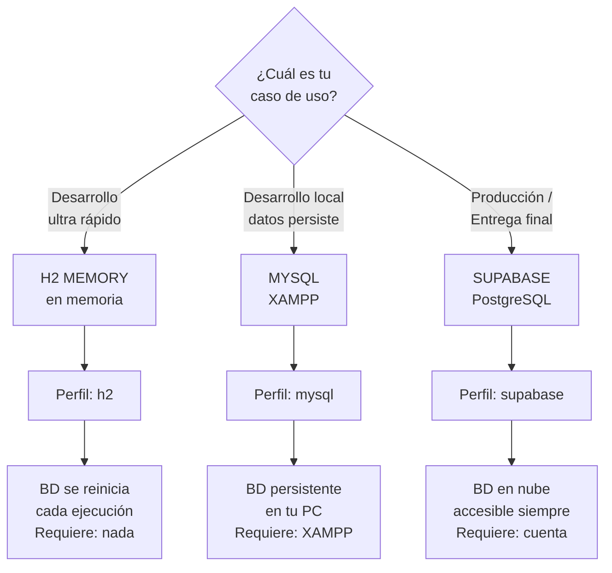
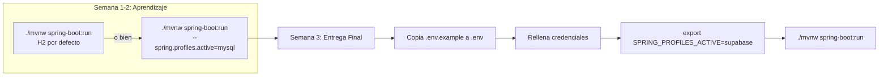
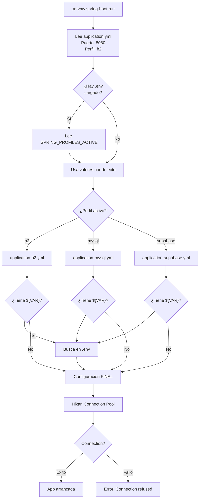
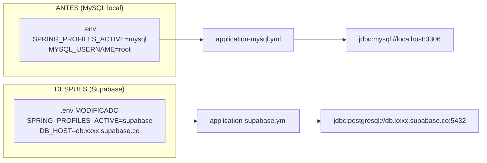
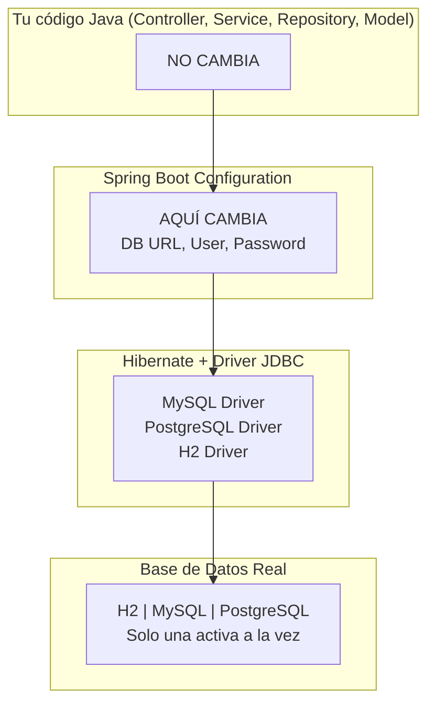
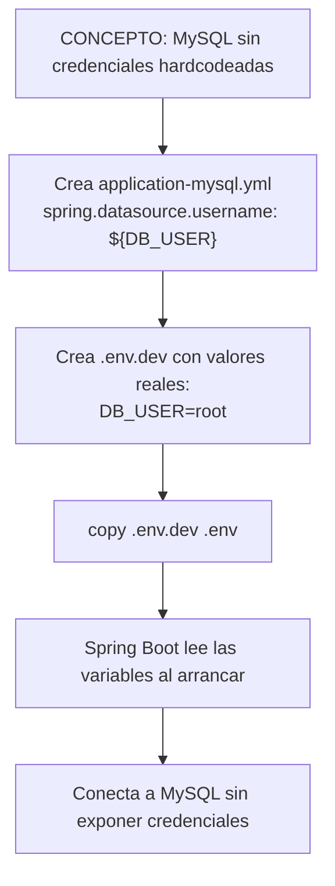
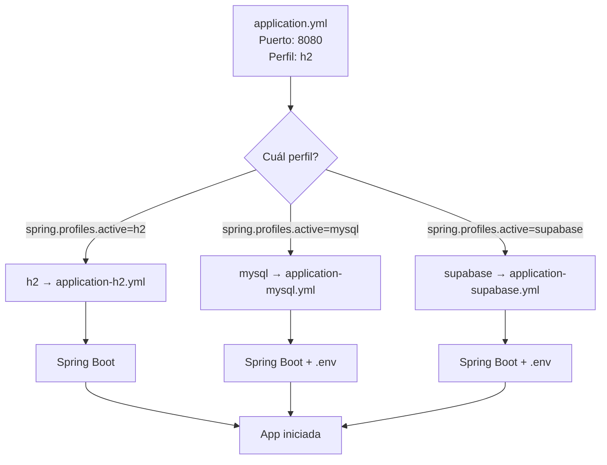

<!-- START OF FILE: docs_lessons_11-database-config_01_objetivo_y_alcance.md -->
# Documento: docs lessons 11-database-config 01 objetivo y alcance
---
# Lección 11 — Configurar bases de datos reales: H2, MySQL y Supabase

## ¿De dónde venimos?

En la lección 10 migraste el proyecto a JPA con H2 (base de datos en memoria). Tu aplicación ahora persiste tickets, pero los datos se pierden al cerrar la aplicación.

Hay dos escenarios que necesitas manejar:

1. **Persistencia real:** necesitas que los datos sobrevivan entre ejecuciones (MySQL, PostgreSQL)
2. **Entornos distintos:** necesitas poder cambiar de base de datos sin modificar el código

Esta lección resuelve ambos con **perfiles de Spring Boot** y **variables de entorno**.

---

## Los tres caminos

| Opción | Dónde corre | Cuándo usarla |
|---|---|---|
| **H2 (en memoria)** | Tu computador local | Tests, desarrollo rápido, sin persistencia |
| **MySQL + XAMPP** | Tu computador local | Desarrollo diario, pruebas con datos persistentes |
| **Supabase** | Nube (PostgreSQL) | Entrega de actividades, demos, trabajo colaborativo |

Los tres usan SQL estándar y funcionan perfectamente con JPA/Hibernate. La única diferencia está en los archivos de configuración.

**Nota:** Aunque usamos la misma base de datos (Supabase) para test y prod, los entornos son diferentes (distinto proyecto, distintas credenciales).

---

## ¿Qué vas a construir?

Al terminar esta lección podrás:

1. Entender cómo usar **perfiles de Spring Boot** para manejar múltiples configuraciones
2. Configurar **entornos** con diferentes valores de variables para cada perfil
3. Configurar variables de entorno para no hardcodear credenciales
3. Conectar la aplicación a **H2** (desarrollo rápido)
4. Conectar la aplicación a **MySQL local** (XAMPP) con la configuración correcta
5. Crear un proyecto en **Supabase** y obtener la URL de conexión
6. Conectar la aplicación a **Supabase** (PostgreSQL en la nube)
7. Cambiar entre las tres bases de datos con un solo argumento (sin modificar código)

### Lo que vas a poder explicar

- ¿Cuál es la diferencia entre MySQL, PostgreSQL y H2 para este proyecto?
- ¿Qué son los **perfiles de Spring Boot** y cómo se usan?
- ¿Cómo protejo mis credenciales usando variables de entorno?
- ¿Qué información necesita Spring Boot para conectarse a una base de datos?
- ¿Qué hace `ddl-auto: create` vs `ddl-auto: update` y cuándo usar cada uno?
- ¿Por qué cambiar de base de datos no requiere cambiar el código Java?
- ¿Cómo configuro variables de entorno desde el sistema operativo y desde IntelliJ?

---

## Documentación por secciones

1. **[Guión paso a paso](02_guion_paso_a_paso.md)** — Instrucciones detalladas para configurar cada perfil
2. **[Resumen de archivos](07_resumen_archivos.md)** — Referencia rápida de qué va en cada archivo
3. **[Guía IntelliJ](06_guia_intellij_env.md)** — Cómo cargar `.env` en IntelliJ IDEA
4. **[MySQL vs PostgreSQL](03_mysql_vs_postgresql.md)** — Comparación técnica

---

## ¿Qué NO cubre esta lección?

| Tema | ¿Por qué queda afuera? |
|---|---|
| Migraciones con Flyway o Liquibase | Herramientas de nivel producción, fuera del alcance del curso |
| Conexión con SSL/TLS forzado | Configuración avanzada de red |
| Connection pooling avanzado | Configuración por defecto de Hikari es suficiente |


<!-- START OF FILE: docs_lessons_11-database-config_02_guion_paso_a_paso.md -->
# Documento: docs lessons 11-database-config 02 guion paso a paso
---
# Lección 11 — Tutorial paso a paso: Perfiles de base de datos

---

## Configuración con Perfiles de Spring Boot

Spring Boot permite gestionar múltiples configuraciones de base de datos usando **perfiles** (profiles). Esto evita cambiar manualmente `application.yml` cada vez que cambias de entorno.

### Archivos de perfil (configuración)

| Archivo | Perfil | Base de Datos |
|--------|-------|--------------|
| `application-h2.yml` | `h2` | H2 (memoria) |
| `application-mysql.yml` | `mysql` | MySQL (XAMPP) |
| `application-supabase.yml` | `supabase` | Supabase (PostgreSQL) |

### Archivos de entorno (valores)

| Archivo | Perfil | Entorno | Cuándo usarlo |
|--------|-------|--------|--------|-------------|
| `.env.local` | `h2` | local | Desarrollo rápido |
| `.env.dev` | `mysql` | dev | Desarrollo con MySQL |
| `.env.test` | `supabase` | test | Pruebas en Supabase |
| `.env.prod` | `supabase` | prod | Producción |

**Nota:** Los entornos `test` y `prod` comparten el perfil `supabase` (misma configuración), pero tienen diferentes valores de conexión.

### Activar un perfil

**Opción 1: Copiar archivo de entorno**
```bash
# Desarrollo rápido (H2)
copy .env.local .env
./mvnw.cmd spring-boot:run

# Desarrollo con MySQL
copy .env.dev .env
./mvnw.cmd spring-boot:run

# Pruebas en Supabase
copy .env.test .env
./mvnw.cmd spring-boot:run

# Producción
copy .env.prod .env
./mvnw.cmd spring-boot:run
```

**Opción 2: Perfil por línea de comandos**
```bash
# H2
./mvnw.cmd spring-boot:run -Dspring.profiles.active=h2

# MySQL
./mvnw.cmd spring-boot:run -Dspring.profiles.active=mysql

# Supabase
./mvnw.cmd spring-boot:run -Dspring.profiles.active=supabase
```

**Opción 3: Variable de entorno**
```bash
# Windows (PowerShell)
$env:SPRING_PROFILES_ACTIVE="mysql"
./mvnw spring-boot:run

# Linux/macOS
export SPRING_PROFILES_ACTIVE=mysql
./mvnw spring-boot:run
```

**Opción 4: Desde IntelliJ IDEA**
1. Abre **Run** → **Edit Configurations**
2. Busca la configuración de Maven (Spring Boot)
3. En el campo **Program arguments**, agrega: `spring-boot:run -Dspring-boot.run.arguments="--spring.profiles.active=mysql"`
4. O en **VM options**, agrega: `-Dspring.profiles.active=mysql`
5. Guarda y ejecuta

---

## Variables de Entorno y Archivo `.env`

Para **no hardcodear credenciales** en el código, usamos variables de entorno. Spring Boot las inyecta automáticamente usando la sintaxis `${variable}`.

### Paso 1: Crear el archivo `.env`

En la raíz del proyecto `Tickets/`, copia `.env.example` a `.env`:

```bash
# Windows
copy .env.example .env

# Linux/macOS
cp .env.example .env
```

**Contenido de `.env`:**
```env
# Perfil activo (h2, mysql, supabase)
SPRING_PROFILES_ACTIVE=mysql

# MySQL Configuration (usado por el perfil mysql)
DB_HOST=localhost
DB_PORT=3306
DB_NAME=tickets_db
DB_USER=root
DB_PASSWORD=

# Supabase Configuration (usado por el perfil supabase)
# DB_HOST=db.xxxxxxxxxxxx.supabase.co
# DB_PORT=5432
# DB_NAME=postgres
# DB_USER=postgres
# DB_PASSWORD=your-supabase-password
```

### Paso 2: Cargar `.env` en los archivos YAML

**`application.yml`:**
```yaml
spring:
  application:
    name: Tickets
  profiles:
    active: h2
  jpa:
    hibernate:
      ddl-auto: update
    show-sql: false

server:
  port: 8080
  servlet:
    context-path: "/ticket-app"
```

**`application-mysql.yml`:**
```yaml
spring:
  datasource:
    url: jdbc:mysql://${DB_HOST:localhost}:${DB_PORT:3306}/${DB_NAME:tickets_db}?useSSL=false&allowPublicKeyRetrieval=true&serverTimezone=UTC
    driver-class-name: com.mysql.cj.jdbc.Driver
    username: ${DB_USER:root}
    password: ${DB_PASSWORD:}
  jpa:
    database-platform: org.hibernate.dialect.MySQLDialect
    hibernate:
      ddl-auto: update
    properties:
      hibernate:
        format_sql: true
```

**`application-supabase.yml`:**
```yaml
spring:
  datasource:
    url: jdbc:postgresql://${DB_HOST}:${DB_PORT}/${DB_NAME}
    driver-class-name: org.postgresql.Driver
    username: ${DB_USER}
    password: ${DB_PASSWORD}
  jpa:
    database-platform: org.hibernate.dialect.PostgreSQL10Dialect
    properties:
      hibernate:
        format_sql: true
```

> **¿Qué significa `${VAR:valor-por-defecto}`?**
> Si la variable de entorno `VAR` no existe, Spring usa `valor-por-defecto`. Es útil para desarrollo local.

### Paso 3: Cargar variables de entorno

#### Opción A: Sistema Operativo (SO)

**Windows (PowerShell):**
```powershell
# Ver una variable
$env:MYSQL_USERNAME

# Establecer (solo en sesión actual)
$env:MYSQL_USERNAME="root"
$env:SPRING_PROFILES_ACTIVE="mysql"

# Establecer permanentemente (requiere admin)
[Environment]::SetEnvironmentVariable("MYSQL_USERNAME", "root", "User")
```

**Linux/macOS:**
```bash
# Ver una variable
echo $MYSQL_USERNAME

# Establecer en sesión actual
export MYSQL_USERNAME="root"
export SPRING_PROFILES_ACTIVE="mysql"

# Establecer permanentemente (agregar a ~/.bashrc, ~/.zshrc, etc.)
echo 'export MYSQL_USERNAME="root"' >> ~/.bashrc
source ~/.bashrc
```

#### Opción B: IntelliJ IDEA

1. **Abre Run → Edit Configurations**
2. Selecciona la configuración de Spring Boot
3. En **Environment variables**, agrega las variables:
   ```
   SPRING_PROFILES_ACTIVE=mysql;DB_HOST=localhost;DB_PORT=3306;DB_NAME=tickets_db;DB_USER=root;DB_PASSWORD=
   ```
   (usa `;` para separar en Windows, `:` en Linux/macOS)
4. Guarda y ejecuta

**O con un archivo `.env` en IntelliJ:**
1. Instala el plugin **EnvFile** desde Preferences → Plugins
2. En **Edit Configurations**, habilita **Use env file** y selecciona tu `.env`
3. IntelliJ cargará automáticamente las variables

#### Opción C: Spring Boot con `dotenv` (Maven)

Agrega la dependencia en `pom.xml`:
```xml
<dependency>
    <groupId>me.paulschwarz</groupId>
    <artifactId>spring-dotenv</artifactId>
    <version>4.0.0</version>
</dependency>
```

Spring cargará automáticamente `Tickets/.env` al arrancar.

### Paso 4: Verificar que funcionó

```bash
./mvnw spring-boot:run -Dspring-boot.run.arguments="--spring.profiles.active=mysql"
```

Deberías ver en los logs:
```
The following profiles are active: mysql
```

Y luego:
```
HikariPool-1 - Starting...
HikariPool-1 - Start completed.
```

---

## Checklist de Seguridad

✅ **Siempre:**
- Crea `.env.example` con valores de ejemplo (sin credenciales reales)
- Agrega `.env` a `.gitignore` para que no se comitee

❌ **Nunca:**
- Hagas commit de `.env` con credenciales reales
- Escribas contraseñas directamente en `application.yml` versionado
- Compartas credenciales por chat o email

---

## Opción A: MySQL con XAMPP (base de datos local)

### Paso A1: verificar que XAMPP está listo

1. Abre el panel de control de XAMPP
2. Inicia los servicios **Apache** y **MySQL** (botón "Start" en cada uno)
3. Verifica que el estado muestre "Running" en verde

### Paso A2: crear la base de datos

1. Abre `http://localhost/phpmyadmin` en el navegador
2. En el panel izquierdo, haz clic en **Nueva**
3. Nombre: `tickets_db`
4. Cotejamiento: `utf8mb4_unicode_ci`
5. Haz clic en **Crear**

> **¿Qué es el cotejamiento?**
> Define cómo se comparan y ordenan los textos. `utf8mb4_unicode_ci` soporta todos los caracteres del español (tildes, ñ) y es insensible a mayúsculas en las comparaciones (`ci` = case-insensitive). Es el estándar para aplicaciones en español.

### Paso A3: verificar `application-mysql.yml`

Este archivo ya existe en `src/main/resources/`. Confírmalo:

```yaml
spring:
  datasource:
    url: jdbc:mysql://${DB_HOST:localhost}:${DB_PORT:3306}/${DB_NAME:tickets_db}?useSSL=false&allowPublicKeyRetrieval=true&serverTimezone=UTC
    driver-class-name: com.mysql.cj.jdbc.Driver
    username: ${DB_USER:root}
    password: ${DB_PASSWORD:}
  jpa:
    database-platform: org.hibernate.dialect.MySQLDialect
    hibernate:
      ddl-auto: update
    properties:
      hibernate:
        format_sql: true
```

> **¿Qué hace `?useSSL=false&allowPublicKeyRetrieval=true&serverTimezone=UTC` en la URL?**
> - `useSSL=false`: desactiva SSL para conexiones locales (XAMPP no tiene certificado)
> - `allowPublicKeyRetrieval=true`: necesario con versiones recientes de MySQL para autenticación sin SSL
> - `serverTimezone=UTC`: sincroniza la zona horaria entre Java y MySQL para que los `LocalDateTime` se guarden y lean correctamente

Luego copia el archivo de entorno y arranca con el perfil mysql:

```bash
copy .env.dev .env
./mvnw.cmd spring-boot:run
```

### Paso A4: arrancar y verificar

```bash
./mvnw spring-boot:run
```

Revisa en phpMyAdmin: debería aparecer la tabla `tickets` creada automáticamente.

---

## Opción B: Supabase (PostgreSQL en la nube)

### Paso B1: crear una cuenta en Supabase

1. Ve a `https://supabase.com`
2. Haz clic en **Start your project**
3. Regístrate con GitHub o con correo electrónico

### Paso B2: crear un proyecto

1. En el dashboard, haz clic en **New project**
2. Nombre del proyecto: `tickets-app` (o el nombre que prefieras)
3. Contraseña de la base de datos: crea una contraseña fuerte y **guárdala** — la necesitarás
4. Región: elige la más cercana (por ejemplo, `South America (São Paulo)`)
5. Haz clic en **Create new project**

Supabase tarda 1-2 minutos en aprovisionar el proyecto.

### Paso B3: obtener la cadena de conexión

1. En tu proyecto de Supabase, ve a **Project Settings** (ícono de engranaje)
2. Haz clic en **Database** en el menú lateral
3. Baja hasta la sección **Connection string**
4. Selecciona la pestaña **JDBC**
5. Copia la cadena. Tendrá este formato:

```
jdbc:postgresql://db.xxxxxxxxxxxx.supabase.co:5432/postgres
```

### Paso B4: agregar el driver de PostgreSQL al `pom.xml`

```xml
<!-- Agrega esto, comenta o elimina el de MySQL mientras uses Supabase -->
<dependency>
    <groupId>org.postgresql</groupId>
    <artifactId>postgresql</artifactId>
    <scope>runtime</scope>
</dependency>
```

### Paso B5: configurar `.env` con tus credenciales de Supabase

Edita tu `.env` (o `.env.test`) con los valores obtenidos en el paso anterior:

```env
SPRING_PROFILES_ACTIVE=supabase
DB_HOST=db.xxxxxxxxxxxx.supabase.co
DB_PORT=5432
DB_NAME=postgres
DB_USER=postgres
DB_PASSWORD=tu-contraseña-de-supabase
```

El archivo `application-supabase.yml` ya existe en `src/main/resources/` y leerá estas variables automáticamente:

```yaml
spring:
  datasource:
    url: jdbc:postgresql://${DB_HOST}:${DB_PORT}/${DB_NAME}
    driver-class-name: org.postgresql.Driver
    username: ${DB_USER}
    password: ${DB_PASSWORD}
  jpa:
    database-platform: org.hibernate.dialect.PostgreSQLDialect
    hibernate:
      ddl-auto: update
    properties:
      hibernate:
        format_sql: true
```

Luego arranca con el perfil supabase:

```bash
copy .env.test .env
./mvnw.cmd spring-boot:run
```

### Paso B6: arrancar y verificar

```bash
./mvnw spring-boot:run
```

En el dashboard de Supabase, ve a **Table Editor** — deberías ver la tabla `tickets` creada automáticamente.

---

## Cómo cambiar entre MySQL y Supabase

El código Java no cambia. Solo cambias el archivo `.env` activo:

```bash
# Para usar MySQL local (XAMPP):
copy .env.dev .env
./mvnw.cmd spring-boot:run

# Para usar Supabase:
copy .env.test .env
./mvnw.cmd spring-boot:run
```

O bien pasa el perfil directamente por línea de comandos:
```bash
./mvnw.cmd spring-boot:run -Dspring.profiles.active=mysql
./mvnw.cmd spring-boot:run -Dspring.profiles.active=supabase
```

> **¿Por qué funciona esto?**
> JPA es una **especificación** (un contrato). Hibernate la implementa para cualquier base de datos que tenga un driver JDBC. El código Java no sabe si está hablando con MySQL o PostgreSQL — eso es responsabilidad de Hibernate y el driver. Cambias la configuración, no el código.

---

## Opciones de `ddl-auto` — cuándo usar cada una

| Valor | Comportamiento | Cuándo usarlo |
|---|---|---|
| `create` | Borra y recrea todas las tablas al arrancar | Primera vez que configuras la BD; **pierde todos los datos** |
| `create-drop` | Crea al arrancar, borra al apagar | Tests automatizados |
| `update` | Agrega columnas y tablas nuevas, no borra datos | Desarrollo activo (el más común) |
| `validate` | Verifica que el esquema coincide, no modifica nada | Producción |
| `none` | No hace nada con el esquema | Cuando el esquema lo controla otra herramienta (Flyway) |

**Para este curso:** usa `update` siempre, excepto cuando necesites partir con datos limpios, en cuyo caso usa `create` una vez y luego vuelve a `update`.

---

## Verificar la conexión sin arrancar la app

Si quieres comprobar que las credenciales son correctas antes de arrancar Spring Boot, puedes probar la conexión directamente con un cliente como **DBeaver** o **TablePlus**:

- **MySQL (XAMPP):** host `localhost`, puerto `3306`, usuario `root`, password vacío
- **Supabase:** usa la cadena de conexión de la sección "Database" → "Connection string" → pestaña "URI"

---

## El patrón `*Command` / `*Response` — Referencia

A partir de esta lección, el código usa el patrón de DTOs de entrada y salida. El motivo está documentado en **Lección 10 — JPA y ORM, sección "Por qué no retornamos entidades directamente"**.

| DTO | Uso |
|---|---|
| `*Command` | Input: el Controller lo recibe y el Service lo procesa |
| `*Response` | Output: el Service transforma la entidad y el Controller la retorna |

**Regla de oro:** Una entidad JPA (`@Entity`) nunca sale del Service. Siempre se convierte a `*Response` primero.


<!-- START OF FILE: docs_lessons_11-database-config_03_mysql_vs_postgresql.md -->
# Documento: docs lessons 11-database-config 03 mysql vs postgresql
---
# Lección 11 — MySQL vs PostgreSQL, y la cadena de conexión JDBC

## MySQL y PostgreSQL: lo que necesitas saber

Ambos son motores de base de datos relacionales que hablan SQL estándar. Para este curso son casi intercambiables. Estas son las diferencias que sí te afectan:

| Aspecto | MySQL (XAMPP) | PostgreSQL (Supabase) |
|---|---|---|
| `AUTO_INCREMENT` | `AUTO_INCREMENT` | `SERIAL` o `GENERATED ALWAYS AS IDENTITY` |
| Palabra reservada `user` | Problemática como nombre de tabla | También problemática |
| Tipos de texto | `VARCHAR`, `TEXT`, `LONGTEXT` | `VARCHAR`, `TEXT` (más flexible) |
| Insensibilidad a mayúsculas | Depende del cotejamiento | Requiere `ILIKE` o `LOWER()` |
| Driver JDBC | `com.mysql.cj.jdbc.Driver` | `org.postgresql.Driver` |
| Puerto por defecto | `3306` | `5432` |

**Para JPA con `GenerationType.IDENTITY`:** ambas bases de datos lo soportan. Hibernate genera el SQL correcto para cada motor automáticamente según el dialecto configurado.

---

## Anatomía de una cadena de conexión JDBC

```
jdbc:mysql://localhost:3306/tickets_db?useSSL=false&serverTimezone=America/Santiago
│    │      │         │    │           │
│    │      │         │    │           └─ parámetros adicionales
│    │      │         │    └─ nombre de la base de datos
│    │      │         └─ puerto
│    │      └─ host (servidor)
│    └─ tipo de base de datos
└─ protocolo JDBC
```

```
jdbc:postgresql://db.xxxxxxxxxxxx.supabase.co:5432/postgres
│    │           │                             │    │
│    │           │                             │    └─ nombre de la BD en Supabase (siempre "postgres")
│    │           │                             └─ puerto PostgreSQL estándar
│    │           └─ host de Supabase (único por proyecto)
│    └─ tipo de base de datos
└─ protocolo JDBC
```

---

## ¿Por qué "user" es una palabra reservada?

Tanto en MySQL como en PostgreSQL, `USER` es una función del sistema (devuelve el usuario conectado). Si creas una tabla llamada `user`, el motor SQL se confunde.

**Solución:** siempre usa `@Table(name = "users")` (en plural) para la entidad de usuarios. Lo aplicarás en la lección 12.

```java
@Entity
@Table(name = "users")  // ← "users", nunca "user"
public class User { ... }
```

---

## ¿Dónde guarda los datos cada opción?

**MySQL / XAMPP:**
Los datos se guardan en archivos del sistema de archivos de tu computador:
```
C:\xampp\mysql\data\tickets_db\
├── tickets.ibd       ← datos de la tabla tickets
└── db.opt            ← configuración de la base de datos
```
Si desinstalaras XAMPP sin respaldar, perderías los datos.

**Supabase:**
Los datos se guardan en servidores de AWS en la región que elegiste. Supabase ofrece backups automáticos diarios en el plan gratuito.

---

## El dialecto de Hibernate

El `dialect` le dice a Hibernate qué "sabor" de SQL debe generar:

```yaml
# MySQL:
properties:
  hibernate:
    dialect: org.hibernate.dialect.MySQLDialect

# PostgreSQL:
properties:
  hibernate:
    dialect: org.hibernate.dialect.PostgreSQLDialect
```

Con Spring Boot 4 y Hibernate 6, el dialecto se detecta automáticamente la mayoría de las veces. Igual es buena práctica explicitarlo para evitar advertencias en la consola.

---

## Buenas prácticas con contraseñas

Nunca subas credenciales reales al repositorio de Git. El `application.yml` que tienes en el repo debería tener contraseñas vacías o de ejemplo:

```yaml
# application.yml (lo que va a Git)
datasource:
  url: jdbc:mysql://localhost:3306/tickets_db
  username: root
  password:          # contraseña vacía para XAMPP local
```

Para Supabase, usa variables de entorno:

```yaml
# application.yml con variable de entorno
datasource:
  url: ${DB_URL}
  username: ${DB_USERNAME}
  password: ${DB_PASSWORD}
```

Y defines las variables en tu entorno antes de arrancar la app. La [Guía IntelliJ](06_guia_intellij_env.md) explica cómo cargarlo desde el IDE, y el [Guión paso a paso](02_guion_paso_a_paso.md) cubre las opciones por terminal y sistema operativo.


<!-- START OF FILE: docs_lessons_11-database-config_04_checklist_rubrica_minima.md -->
# Documento: docs lessons 11-database-config 04 checklist rubrica minima
---
# Lección 11 — Checklist y rúbrica mínima

---

## Prerrequisito (Lección 10)

- ☐ La lección 10 está completa: JPA con H2 funciona

---

## Checklist de configuración de perfiles

- ☐ `application.yml` tiene la configuración base
- ☐ `application-h2.yml` existe con H2 en memoria
- ☐ `application-mysql.yml` existe con MySQL (XAMPP)
- ☐ `application-supabase.yml` existe con PostgreSQL (Supabase)
- ☐ `.env.example` existe con plantilla de variables
- ☐ `spring-dotenv` en `pom.xml` para cargar `.env`

---

## Checklist para MySQL (XAMPP)

- ☐ XAMPP tiene Apache y MySQL corriendo
- ☐ La base de datos `tickets_db` existe en phpMyAdmin
- ☐ `application-mysql.yml` tiene `url: jdbc:mysql://localhost:3306/tickets_db`
- ☐ `application-mysql.yml` tiene `driver-class-name: com.mysql.cj.jdbc.Driver`
- ☐ `pom.xml` tiene la dependencia `mysql-connector-j` con `scope: runtime`
- ☐ La aplicación arranca sin errores de conexión

---

## Checklist para Supabase (PostgreSQL)

- ☐ El proyecto en Supabase fue creado correctamente
- ☐ La contraseña de la base de datos está guardada
- ☐ `application-supabase.yml` tiene la URL JDBC de Supabase
- ☐ `application-supabase.yml` tiene `driver-class-name: org.postgresql.Driver`
- ☐ `pom.xml` tiene la dependencia `postgresql` con `scope: runtime`

---

## Checklist de pruebas

- ☐ `./mvnw spring-boot:run` funciona con H2 (perfil por defecto)
- ☐ `./mvnw spring-boot:run -Dspring.profiles.active=mysql` funciona con MySQL
- ☐ `./mvnw spring-boot:run -Dspring.profiles.active=supabase` funciona con Supabase
- ☐ `POST /ticket-app/tickets` persiste en la base de datos activa
- ☐ Los datos persisten tras reiniciar (excepto H2 con create-drop)

---

## Errores comunes

| Error | Causa probable | Solución |
|---|---|---|
| `Communications link failure` | MySQL no está corriendo | Iniciar MySQL en XAMPP |
| `Access denied for user 'root'` | Contraseña incorrecta | Dejar `password:` vacío en local |
| `Connection to db.xxx.supabase.co refused` | URL incorrecta | Copiar URL desde Supabase → Settings → Database |
| `No suitable driver found` | Driver faltante | Verificar dependencia en `pom.xml` |


<!-- START OF FILE: docs_lessons_11-database-config_05_actividad_individual.md -->
# Documento: docs lessons 11-database-config 05 actividad individual
---
# Lección 11 — Actividad individual: conectar Tickets a Supabase

## Contexto

Tu aplicación ya corre con H2 (perfil por defecto) o MySQL local (XAMPP). Esta actividad te pide conectarla a Supabase (PostgreSQL en la nube) y verificar que los tickets persisten correctamente.

---

## Parte 1: crear el proyecto en Supabase

1. Crea una cuenta en `https://supabase.com` si aún no tienes una
2. Crea un nuevo proyecto llamado `dsy1103-tickets`
3. Elige la región más cercana (São Paulo es la más cercana de Chile)
4. Anota la contraseña de la base de datos — no se puede recuperar después

---

## Parte 2: configurar el entorno para Supabase

Edita `.env.test` con los valores de tu proyecto en Supabase:

```env
SPRING_PROFILES_ACTIVE=supabase
DB_HOST=db.TU_HOST.supabase.co
DB_PORT=5432
DB_NAME=postgres
DB_USER=postgres
DB_PASSWORD=TU_CONTRASEÑA
```

> **¿Dónde encuentro el host?**
> En Supabase → **Project Settings** → **Database** → **Connection string** → pestaña **JDBC**. El host es la parte `db.xxxx.supabase.co`.

Luego copia ese archivo como `.env` activo:

```bash
copy .env.test .env
```

---

## Parte 3: arrancar con el perfil Supabase

```bash
./mvnw.cmd spring-boot:run
```

Verifica en los logs:
```
The following profiles are active: supabase
HikariPool-1 - Start completed.
```

---

## Parte 4: verificar la tabla en Supabase

En el **Table Editor** de Supabase, verifica que la tabla `tickets` fue creada automáticamente por Hibernate.

Luego prueba desde tu cliente HTTP:

| Prueba | Endpoint | Resultado esperado |
|---|---|---|
| Crear ticket | `POST /ticket-app/tickets` | `201 Created`, ticket guardado en Supabase |
| Listar tickets | `GET /ticket-app/tickets` | Datos en la nube |
| Reiniciar app | — | Los tickets siguen presentes |

---

## Parte 5: volver a MySQL local

Cambia el entorno activo a MySQL:

```bash
copy .env.dev .env
./mvnw.cmd spring-boot:run
```

Verifica que la aplicación vuelve a usar MySQL local sin modificar ningún archivo Java.

El objetivo es que puedas cambiar entre bases de datos en menos de un minuto, cambiando solo el `.env`.

---

## Criterios de evaluación

| Criterio | Puntaje |
|---|---|
| `.env.test` configurado correctamente con credenciales de Supabase | 25% |
| Aplicación arranca con perfil `supabase` y logs confirman conexión | 25% |
| Tabla `tickets` visible en Supabase Table Editor | 20% |
| `POST` y `GET` funcionan con datos persistidos en la nube | 20% |
| La aplicación vuelve a MySQL cambiando solo el `.env` | 10% |


<!-- START OF FILE: docs_lessons_11-database-config_06_guia_intellij_env.md -->
# Documento: docs lessons 11-database-config 06 guia intellij env
---
# 🚀 Guía: Cargar Variables de Entorno en IntelliJ IDEA

## El Problema

Cuando ejecutas tu aplicación desde IntelliJ, Spring Boot no carga automáticamente el archivo `.env`. Las credenciales de base de datos se quedan vacías y la conexión falla.

---

## Conceptos Clave

| Concepto | Descripción |
|----------|-------------|
| **Perfil** | Archivo YAML (`application-{profile}.yml`) con configuración |
| **Entorno** | Valores de variables para ese perfil |

### Relación Perfil-Entorno

| Entorno | Perfil | Archivo |
|--------|-------|---------|
| local | h2 | `.env.local` |
| dev | mysql | `.env.dev` |
| test | supabase | `.env.test` |
| prod | supabase | `.env.prod` |

---

## Solución: Plugin EnvFile

### Paso 1: Instala el plugin

1. **File** → **Settings** → **Plugins**
2. Busca "EnvFile" e instala
3. Reinicia IntelliJ

### Paso 2: Configura Run Configuration

1. **Run** → **Edit Configurations...**
2. Selecciona la configuración de Spring Boot
3. En la pestaña **"EnvFile"**, habilita **"Enable EnvFile"**
4. Selecciona el archivo `.env` que corresponda:
   - `.env.local` → desarrollo rápido
   - `.env.dev` → MySQL
   - `.env.test` → Supabase (pruebas)
   - `.env.prod` → Supabase (producción)
5. **Apply** → **OK**

### Paso 3: Ejecuta

Usa el botón ▶ o Shift+F10

Verifica en los logs:
```
The following profiles are active: mysql
HikariPool-1 - Start completed.
```

---

## Solución Alternativa: Variables Manuales

1. **Run** → **Edit Configurations...**
2. En **Environment variables**, agrega:
   ```
   SPRING_PROFILES_ACTIVE=mysql;DB_HOST=localhost;DB_PORT=3306;DB_NAME=tickets_db;DB_USER=root;DB_PASSWORD=
   ```
   (Windows usa `;`, Linux/macOS usa `:`)
3. **Apply** → **OK**

---

## Referencia de Variables por Entorno

### LOCAL (.env.local)
```env
SPRING_PROFILES_ACTIVE=h2
```
Sin variables adicionales.

### DEV (.env.dev)
```env
SPRING_PROFILES_ACTIVE=mysql
DB_HOST=localhost
DB_PORT=3306
DB_NAME=tickets_db
DB_USER=root
DB_PASSWORD=
```

### TEST (.env.test)
```env
SPRING_PROFILES_ACTIVE=supabase
DB_HOST=db.xxx.supabase.co
DB_PORT=5432
DB_NAME=postgres
DB_USER=postgres
DB_PASSWORD=your-password
```

### PROD (.env.prod)
```env
SPRING_PROFILES_ACTIVE=supabase
DB_HOST=db.yyy.supabase.co
DB_PORT=5432
DB_NAME=postgres
DB_USER=postgres
DB_PASSWORD=prod-password
```

---

## Solución Automática: spring-dotenv

Agrega al `pom.xml`:
```xml
<dependency>
    <groupId>me.paulschwarz</groupId>
    <artifactId>spring-dotenv</artifactId>
    <version>4.0.0</version>
</dependency>
```

Spring cargará `.env` automáticamente.

---

## Troubleshooting

| Error | Solución |
|-------|----------|
| "Connection refused" | Verifica que la BD esté corriendo |
| "No profile active" | Define `SPRING_PROFILES_ACTIVE` |
| "Credential errors" | Verifica usuario y password en `.env` |

---

*[← Volver a Lección 11](01_objetivo_y_alcance.md)*


<!-- START OF FILE: docs_lessons_11-database-config_07_resumen_archivos.md -->
# Documento: docs lessons 11-database-config 07 resumen archivos
---
# 📋 Resumen: Archivos de Configuración

## Perfiles vs Entornos

| Concepto | Descripción |
|----------|-------------|
| **Perfil** | Archivo de configuración (`application-{profile}.yml`) |
| **Entorno** | Valores de las variables para ese perfil |

### Relación Perfil-Entorno

| Perfil | Archivo | Entornos que lo usan |
|--------|---------|---------------------|
| `h2` | `application-h2.yml` | local |
| `mysql` | `application-mysql.yml` | dev |
| `supabase` | `application-supabase.yml` | test, prod |

---

## Estructura de Archivos

```
Tickets-11/
├── src/main/resources/
│   ├── application.yml              ← Configuración base (todos los perfiles)
│   ├── application-h2.yml           ← Perfil: H2 (memoria)
│   ├── application-mysql.yml        ← Perfil: MySQL (XAMPP)
│   └── application-supabase.yml     ← Perfil: Supabase (PostgreSQL)
├── .env.example                     ← Plantilla de variables (commitear)
├── .env.local                      ← Entorno local (perfil: h2)
├── .env.dev                        ← Entorno dev (perfil: mysql)
├── .env.test                       ← Entorno test (perfil: supabase)
├── .env.prod                       ← Entorno prod (perfil: supabase)
└── .gitignore                     ← Contiene .env
```

---

## 1. `application.yml` — Base

**Uso:** Configuración común a todos los perfiles.

```yaml
spring:
  application:
    name: Tickets
  jpa:
    show-sql: false
    properties:
      hibernate:
        format_sql: true

server:
  port: 8080
  servlet:
    context-path: "/ticket-app"

logging:
  level:
    root: INFO
    cl.duoc.fullstack: DEBUG
```

---

## 2. `application-h2.yml` — Perfil H2

**Uso:** Desarrollo rápido, tests. La BD se reinicia cada vez que arranca la app.

```yaml
spring:
  datasource:
    url: jdbc:h2:mem:tickets_db;DB_CLOSE_DELAY=-1;DB_CLOSE_ON_EXIT=FALSE
    driver-class-name: org.h2.Driver
    username: sa
    password: ''
  h2:
    console:
      enabled: true
      path: /h2-console
  jpa:
    database-platform: org.hibernate.dialect.H2Dialect
    hibernate:
      ddl-auto: create-drop
    show-sql: true
```

**Activar:** Perfil `h2` (usado por entorno `local`)

---

## 3. `application-mysql.yml` — Perfil MySQL

**Uso:** Base de datos persistente local (XAMPP).

```yaml
spring:
  datasource:
    url: jdbc:mysql://${DB_HOST:localhost}:${DB_PORT:3306}/${DB_NAME:tickets_db}?useSSL=false&allowPublicKeyRetrieval=true&serverTimezone=UTC
    driver-class-name: com.mysql.cj.jdbc.Driver
    username: ${DB_USER:root}
    password: ${DB_PASSWORD:}
  jpa:
    database-platform: org.hibernate.dialect.MySQLDialect
    hibernate:
      ddl-auto: update
    properties:
      hibernate:
        format_sql: true
```

**Variables de entorno (para entorno dev):**
```env
DB_HOST=localhost
DB_PORT=3306
DB_NAME=tickets_db
DB_USER=root
DB_PASSWORD=
```

**Activar:** Perfil `mysql` (usado por entorno `dev`)

---

## 4. `application-supabase.yml` — Perfil Supabase

**Uso:** Base de datos PostgreSQL en la nube (Supabase).

```yaml
spring:
  datasource:
    url: jdbc:postgresql://${DB_HOST}:${DB_PORT:5432}/${DB_NAME:postgres}
    driver-class-name: org.postgresql.Driver
    username: ${DB_USER:postgres}
    password: ${DB_PASSWORD}
  jpa:
    database-platform: org.hibernate.dialect.PostgreSQLDialect
    hibernate:
      ddl-auto: update
    show-sql: false
    properties:
      hibernate:
        format_sql: true

logging:
  level:
    root: WARN
    cl.duoc.fullstack: INFO
```

**Variables de entorno:**
```env
DB_HOST=db.xxxxxxxxxxxx.supabase.co
DB_PORT=5432
DB_NAME=postgres
DB_USER=postgres
DB_PASSWORD=tu-contraseña
```

**Activar:** Perfil `supabase` (usado por entornos `test` y `prod`)

---

## 5. Archivos de Entorno

### `.env.local` (Perfil: h2)
```env
SPRING_PROFILES_ACTIVE=h2
```
Ningún valor adicional necesario.

### `.env.dev` (Perfil: mysql)
```env
SPRING_PROFILES_ACTIVE=mysql
DB_HOST=localhost
DB_PORT=3306
DB_NAME=tickets_db
DB_USER=root
DB_PASSWORD=
```

### `.env.test` (Perfil: supabase)
```env
SPRING_PROFILES_ACTIVE=supabase
DB_HOST=db.test.supabase.co
DB_PORT=5432
DB_NAME=postgres
DB_USER=postgres
DB_PASSWORD=test-password
```

### `.env.prod` (Perfil: supabase)
```env
SPRING_PROFILES_ACTIVE=supabase
DB_HOST=db.prod.supabase.co
DB_PORT=5432
DB_NAME=postgres
DB_USER=postgres
DB_PASSWORD=prod-password
```

---

## 6. `.env.example` — Plantilla

**Uso:** Referencia pública. Se sube al repositorio.

```env
# Environment variables for Tickets application
# Copy this file to .env and configure your values

# Perfil activo (h2, mysql, supabase)
SPRING_PROFILES_ACTIVE=h2

# MySQL Configuration (used by perfil: mysql)
# DB_HOST=localhost
# DB_PORT=3306
# DB_NAME=tickets_db
# DB_USER=root
# DB_PASSWORD=

# Supabase Configuration (used by perfil: supabase)
# DB_HOST=db.xxxxxxxxxxxx.supabase.co
# DB_PORT=5432
# DB_NAME=postgres
# DB_USER=postgres
# DB_PASSWORD=your-password
```

---

## Matriz: Cuándo Usar Cada Entorno

| Entorno | Perfil | Variables | Cuándo Usar |
|--------|-------|----------|-------------|
| **local** | `h2` | - | Desarrollo rápido, tests |
| **dev** | `mysql` | `DB_HOST`, `DB_PORT`, `DB_NAME`, `DB_USER`, `DB_PASSWORD` | Desarrollo con MySQL/XAMPP |
| **test** | `supabase` | Supabase test credentials | Pruebas en la nube |
| **prod** | `supabase` | Supabase prod credentials | Entrega final |

---

## Cómo Activar un Entorno

### Opción 1: Copiar archivo .env
```bash
copy .env.local .env    # Perfil: h2
copy .env.dev .env      # Perfil: mysql
copy .env.test .env     # Perfil: supabase
copy .env.prod .env     # Perfil: supabase

./mvnw spring-boot:run
```

### Opción 2: Variable de entorno
```bash
# PowerShell
$env:SPRING_PROFILES_ACTIVE="mysql"
./mvnw.cmd spring-boot:run

# bash
SPRING_PROFILES_ACTIVE=mysql ./mvnw spring-boot:run
```

### Opción 3: Línea de comandos
```bash
./mvnw spring-boot:run -Dspring.profiles.active=mysql
```

---

## Checklist de Configuración

- ✅ Creaste `.env` copiando `.env.local`, `.env.dev`, `.env.test` o `.env.prod`
- ✅ Llenaste las credenciales en `.env` (excepto en local)
- ✅ `.env` está en `.gitignore`
- ✅ Tienes la base de datos corriendo (XAMPP o Supabase)
- ✅ Ejecutaste la app y verificaste los logs

---

## Flujo de Carga

```
1. application.yml (base)
        ↓
2. application-{perfil}.yml (perfil activo)
        ↓
3. Variables de entorno (.env o sistema)
        ↓
App configurada y corriendo
```

---

*[← Volver a Lección 11](01_objetivo_y_alcance.md)*


<!-- START OF FILE: docs_lessons_11-database-config_08_mapa_de_decisiones.md -->
# Documento: docs lessons 11-database-config 08 mapa de decisiones
---
# 🗺️ Mapa de Decisiones: Qué Perfil Usar



---

## 🎯 Por Etapa del Proyecto



---

## 🔀 Cambiar de Perfil en 3 Formas

### Forma 1️⃣: Línea de Comandos
```bash
./mvnw spring-boot:run \
  -Dspring-boot.run.arguments="--spring.profiles.active=mysql"
```

### Forma 2️⃣: Variable de Entorno (Recomendado)
```bash
# Windows (PowerShell)
$env:SPRING_PROFILES_ACTIVE="mysql"
./mvnw spring-boot:run

# Linux/macOS
export SPRING_PROFILES_ACTIVE=mysql
./mvnw spring-boot:run
```

### Forma 3️⃣: Archivo `.env` + IntelliJ
1. Crea `.env` con `SPRING_PROFILES_ACTIVE=mysql`
2. Instala plugin **EnvFile** en IntelliJ
3. Configura Run Configuration para cargar `.env`
4. Ejecuta (botón ▶)

---

## 📊 Matriz de Compatibilidad

| Característica | H2 | MySQL | Supabase |
|---|:---:|:---:|:---:|
| BD en memoria | ✅ | ❌ | ❌ |
| Datos persistentes | ❌ | ✅ | ✅ |
| Requiere software adicional | ❌ | XAMPP | Cuenta online |
| Acceso desde otro PC | ❌ | ❌ | ✅ |
| Gratis | ✅ | ✅ | ✅ (limits) |
| Para producción | ❌ | ❌ | ✅ |
| Requiere variables de entorno | ❌ | ❌ | ✅ |

---

## 🛠️ Troubleshooting Rápido

### "No puedo conectarme a MySQL"
```bash
# Verifica que XAMPP está corriendo
# Verifica que la BD "tickets_db" existe en phpMyAdmin
# Verifica application-mysql.yml tiene URL correcta
```

### "Variables de entorno no cargan"
```bash
# En IntelliJ: Instala plugin EnvFile
# O define manualmente en Edit Configurations → Environment variables
# O usa: spring-dotenv (ver pom.xml)
```

### "Supabase connection refused"
```bash
# Verifica que DB_HOST, DB_USER, DB_PASSWORD son correctos
# Verifica que la IP de tu PC está en IP whitelist de Supabase (Settings)
```

---

*Para más detalles, ve a [Guión Paso a Paso](02_guion_paso_a_paso.md)*


<!-- START OF FILE: docs_lessons_11-database-config_09_ejemplo_env_completo.md -->
# Documento: docs lessons 11-database-config 09 ejemplo env completo
---
# 📝 Ejemplo: Archivos de Entorno

## Conceptos Clave

| Concepto | Descripción |
|----------|-------------|
| **Perfil** | Archivo YAML (`application-{profile}.yml`) con configuración de BD |
| **Entorno** | Valores de las variables para un perfil específico |

### Relación Perfil-Entorno

| Entorno | Perfil | Base de Datos |
|--------|-------|-------------|
| local | h2 | H2 (memoria) |
| dev | mysql | MySQL (XAMPP) |
| test | supabase | Supabase (PostgreSQL) |
| prod | supabase | Supabase (PostgreSQL) |

---

## Entorno 1: LOCAL (Perfil: h2)

**Cuándo usarlo:** Desarrollo rápido, tests, sin persistencia de datos.

### Archivo: `.env.local`
```env
# Ambiente LOCAL - desarrollo rápido
# Perfil: h2
SPRING_PROFILES_ACTIVE=h2
```

**Sin variables adicionales** — el perfil h2 no necesita credenciales.

### Cómo ejecutarlo
```bash
# Opción A: Copiar .env.local a .env
copy .env.local .env
./mvnw spring-boot:run

# Opción B: Variable de entorno
$env:SPRING_PROFILES_ACTIVE="h2"
./mvnw.cmd spring-boot:run
```

### Resultado esperado en logs
```
The following profiles are active: h2
HikariPool-1 - Starting...
HikariPool-1 - Start completed.
```

---

## Entorno 2: DEV (Perfil: mysql)

**Cuándo usarlo:** Desarrollo diario con datos persistentes (XAMPP).

### Archivo: `.env.dev`
```env
# Ambiente DEV - MySQL local
# Perfil: mysql
SPRING_PROFILES_ACTIVE=mysql

# MySQL Configuration
DB_HOST=localhost
DB_PORT=3306
DB_NAME=tickets_db
DB_USER=root
DB_PASSWORD=
```

### Prerequisites
1. XAMPP instalado y MySQL corriendo
2. Base de datos `tickets_db` creada en phpMyAdmin

### Cómo ejecutarlo
```bash
# Opción A: Copiar .env.dev a .env
copy .env.dev .env
./mvnw spring-boot:run

# Opción B: Variable de entorno
$env:SPRING_PROFILES_ACTIVE="mysql"
./mvnw.cmd spring-boot:run
```

### Resultado esperado en logs
```
The following profiles are active: mysql
HikariPool-1 - Starting...
HikariPool-1 - Start completed.
```

---

## Entorno 3: TEST (Perfil: supabase)

**Cuándo usarlo:** Pruebas con base de datos en la nube (Supabase).

### Archivo: `.env.test`
```env
# Ambiente TEST - Supabase (pruebas)
# Perfil: supabase
SPRING_PROFILES_ACTIVE=supabase

# Supabase Configuration
DB_HOST=db.xxxxxxxxxxxx.supabase.co
DB_PORT=5432
DB_NAME=postgres
DB_USER=postgres
DB_PASSWORD=your-test-password
```

### Dónde obtener los valores

1. **DB_HOST**: Supabase → Settings → Database → Connection string
2. **DB_PORT**: Siempre `5432`
3. **DB_NAME**: Siempre `postgres`
4. **DB_USER**: Siempre `postgres`
5. **DB_PASSWORD**: La que creaste en Supabase

### Cómo ejecutarlo
```bash
# Opción A: Copiar .env.test a .env
copy .env.test .env
./mvnw spring-boot:run

# Opción B: Variable de entorno
$env:SPRING_PROFILES_ACTIVE="supabase"
./mvnw.cmd spring-boot:run
```

### Resultado esperado en logs
```
The following profiles are active: supabase
HikariPool-1 - Starting...
HikariPool-1 - Start completed.
```

---

## Entorno 4: PROD (Perfil: supabase)

**Cuándo usarlo:** Entrega final, producción.

### Archivo: `.env.prod`
```env
# Ambiente PROD - Supabase (producción)
# Perfil: supabase (mismo que test, valores diferentes)
SPRING_PROFILES_ACTIVE=supabase

# Supabase Configuration
DB_HOST=db.yyyyyyyyyyyy.supabase.co
DB_PORT=5432
DB_NAME=postgres
DB_USER=postgres
DB_PASSWORD=your-prod-password
```

**Nota:** Usa el mismo perfil `supabase` que test, pero con diferentes valores de conexión.

### Cómo ejecutarlo
```bash
# Opción A: Copiar .env.prod a .env
copy .env.prod .env
./mvnw spring-boot:run

# Opción B: Variable de entorno
$env:SPRING_PROFILES_ACTIVE="supabase"
./mvnw.cmd spring-boot:run
```

---

## 🎯 Cómo Cambiar de Entorno

### Cambiar solo el archivo .env
```bash
# Desarrollo rápido
copy .env.local .env

# Desarrollo con MySQL
copy .env.dev .env

# Pruebas en Supabase
copy .env.test .env

# Producción
copy .env.prod .env

./mvnw spring-boot:run
```

### Cambiar perfil sin editar .env
Edita la línea `SPRING_PROFILES_ACTIVE`:
```env
# Perfil: h2
SPRING_PROFILES_ACTIVE=h2

# Perfil: mysql
SPRING_PROFILES_ACTIVE=mysql

# Perfil: supabase
SPRING_PROFILES_ACTIVE=supabase
```

---

## 🔒 Seguridad: Checklist Final

**Antes de hacer commit:**

- ✅ `.env` **no está** en el repositorio (verificar `.gitignore`)
- ✅ `.env.example` **sí está** en el repositorio
- ✅ `.env.local`, `.env.dev`, `.env.test`, `.env.prod` están en `.gitignore`
- ✅ Nunca subas credenciales reales

**Comando para verificar:**
```bash
git status .env
# Debería mostrar: .env (not tracked)
```

---

*[← Volver a Lección 11](01_objetivo_y_alcance.md)*


<!-- START OF FILE: docs_lessons_11-database-config_10_cheat_sheet.md -->
# Documento: docs lessons 11-database-config 10 cheat sheet
---
# 🚀 Cheat Sheet — Referencia Rápida Lección 11

## Perfiles vs Entornos

| Concepto | Descripción |
|----------|-------------|
| **Perfil** | Archivo YAML (`application-{profile}.yml`) |
| **Entorno** | Valores de variables para ese perfil |

### Relación Perfil-Entorno

| Entorno | Perfil | Base de Datos |
|--------|-------|-------------|
| local | h2 | H2 (memoria) |
| dev | mysql | MySQL (XAMPP) |
| test | supabase | Supabase (PostgreSQL) |
| prod | supabase | Supabase (PostgreSQL) |

---

## Cuatro Comandos para Arrancar

```bash
# Entorno LOCAL (H2)
copy .env.local .env
./mvnw.cmd spring-boot:run

# Entorno DEV (MySQL/XAMPP)
copy .env.dev .env
./mvnw.cmd spring-boot:run

# Entorno TEST (Supabase)
copy .env.test .env
./mvnw.cmd spring-boot:run

# Entorno PROD (Supabase)
copy .env.prod .env
./mvnw.cmd spring-boot:run
```

O directamente con perfil:
```bash
./mvnw.cmd spring-boot:run -Dspring.profiles.active=h2
./mvnw.cmd spring-boot:run -Dspring.profiles.active=mysql
./mvnw.cmd spring-boot:run -Dspring.profiles.active=supabase
```

---

## Estructura de Archivos

```
src/main/resources/
├── application.yml              ← Base (común a todos)
├── application-h2.yml        ← Perfil: h2
├── application-mysql.yml     ← Perfil: mysql
└── application-supabase.yml ← Perfil: supabase

.env.local                  ← Entorno: local (perfil: h2)
.env.dev                  ← Entorno: dev (perfil: mysql)
.env.test                 ← Entorno: test (perfil: supabase)
.env.prod                 ← Entorno: prod (perfil: supabase)
.env.example               ← Plantilla
```

---

## Variables por Entorno

### LOCAL (no necesita variables)
```env
SPRING_PROFILES_ACTIVE=h2
```

### DEV
```env
SPRING_PROFILES_ACTIVE=mysql
DB_HOST=localhost
DB_PORT=3306
DB_NAME=tickets_db
DB_USER=root
DB_PASSWORD=
```

### TEST / PROD
```env
SPRING_PROFILES_ACTIVE=supabase
DB_HOST=db.xxx.supabase.co
DB_PORT=5432
DB_NAME=postgres
DB_USER=postgres
DB_PASSWORD=tu-password
```

---

## Matriz de Decisión

| Caso | Entorno | Perfil | Cuándo |
|------|--------|-------|--------|
| Tests rápidos | local | h2 | Sin persistencia |
| Desarrollo diario | dev | mysql | Con XAMPP |
| Pruebas en nube | test | supabase | Supabase test |
| Entrega final | prod | supabase | Supabase prod |

---

## Cómo Sé que Funcionó?

Busca en los logs:
```
The following profiles are active: [tu-perfil]
HikariPool-1 - Start completed.
```

Luego prueba: http://localhost:8080/ticket-app/tickets

---

## Seguridad

- ✅ `.env.example` → commitear
- ❌ `.env`, `.env.local`, `.env.dev`, `.env.test`, `.env.prod` → NO commitear
- 🔒 Credenciales reales → solo en `.env` local

---

## Troubleshooting

**"Connection refused"**
→ Verifica que la base de datos esté corriendo y credenciales sean correctas

**"No profile is active"**
→ Define `SPRING_PROFILES_ACTIVE` en variable de entorno o `.env`

**"¿Cuál perfil estoy usando?"**
→ Mira los logs: `The following profile is active: ...`

---

*[← Volver a Lección 11](01_objetivo_y_alcance.md)*


<!-- START OF FILE: docs_lessons_11-database-config_11_flujo_completo.md -->
# Documento: docs lessons 11-database-config 11 flujo completo
---
# 🔗 Flujo Completo: Cómo Todo se Conecta

## 1️⃣ Flujo de Carga al Arrancar Spring Boot



---

## 2️⃣ Ejemplo Práctico: Cambiar de MySQL a Supabase



---

## 3️⃣ Dónde Entra cada Concepto



---

## 4️⃣ Checklist: Verificación en Cada Paso

| Paso | Verificación |
|------|----------------|
| 1 | `application.yml`, `-h2.yml`, `-mysql.yml`, `-supabase.yml` existen |
| 2 | `.env.example` existe, `.env` local NO en Git, `.gitignore` protege `.env*` |
| 3 | Plugin EnvFile instalado o variables de entorno definidas |
| 4 | Logs muestran perfil activo y `HikariPool-1 - Start completed.` |
| 5 | `.env` NO en repositorio, `.env.example` SÍ |

---

## 5️⃣ Traducción: De Concepto a Acción



---

## 6️⃣ Flujo de Diagnóstico: Si Algo No Funciona

```
🔴 Error: "Connection refused"
• ¿Verificaste que la BD está corriendo? (XAMPP, Supabase, H2)
• ¿Verificaste las credenciales? (Host, Puerto, User/Password)
• ¿Verificaste que cargó el perfil? (busca en logs)

🔴 Error: "Variables vacías"
• ¿Instalaste plugin EnvFile?
• ¿Configuraste Run Configuration para usar .env?
• O define manualmente en Environment variables

🔴 Logs dicen "The following profiles are active: []"
• Verifica application.yml tiene spring.profiles.active
• O pasa --spring.profiles.active=mysql

✅ Logs dicen "HikariPool-1 - Connection is working..."
→ TODO FUNCIONA
```

## 6️⃣ Flujo de Diagnóstico: Si Algo No Funciona

```
🔴 Error: "Connection refused"
├─ ¿Verificaste que la BD está corriendo?
│  ├─ MySQL: XAMPP iniciado ✓
│  ├─ Supabase: Accesible desde Internet ✓
│  └─ H2: Siempre está disponible ✓
│
├─ ¿Verificaste las credenciales?
│  ├─ Host: correcto
│  ├─ Puerto: 3306 (MySQL), 5432 (Supabase)
│  └─ Usuario/password: sin typos
│
└─ ¿Verificaste que cargó el perfil?
   └─ Busca en logs: "The following profiles are active: ..."

🔴 Error: "Variables vacías"
├─ ¿Instalaste plugin EnvFile?
├─ ¿Configuraste tu Run Configuration para usar .env?
├─ O define manualmente en Edit Configurations → Environment variables
└─ O usa librería spring-dotenv en pom.xml

🔴 Logs dicen "The following profiles are active: []"
├─ Verifica application.yml tiene spring.profiles.active
└─ O pasa -Dspring-boot.run.arguments="--spring.profiles.active=mysql"

✅ Logs dicen "HikariPool-1 - Start completed."
└─ ¡TODO FUNCIONA! Accede a http://localhost:8080/ticket-app/tickets
```

---

*[← Volver a Lección 11](01_objetivo_y_alcance.md)*


<!-- START OF FILE: docs_lessons_11-database-config_README.md -->
# Documento: docs lessons 11-database-config README
---
# 📚 Lección 11 — Configurar Bases de Datos Reales con Perfiles de Spring Boot

> Aprende a usar **perfiles de Spring Boot** para manejar múltiples configuraciones de base de datos (H2, MySQL, Supabase) y **variables de entorno** para proteger credenciales.

---

## 🎯 ¿Qué Aprenderás?

✅ Configurar múltiples bases de datos con perfiles de Spring Boot  
✅ Manejar variables de entorno de forma segura con `.env`  
✅ Conectar a H2 (en memoria), MySQL (local) y Supabase (en la nube)  
✅ Cambiar entre perfiles sin modificar el código Java  
✅ Cargar variables de entorno desde IntelliJ IDEA  

---

## 📖 Documentos

| Documento | Duración | Para |
|-----------|----------|------|
| **[01. Objetivo y Alcance](01_objetivo_y_alcance.md)** | 5 min | Entender qué aprenderás |
| **[02. Guión Paso a Paso](02_guion_paso_a_paso.md)** ⭐ | 30 min | Instrucciones prácticas |
| **[03. MySQL vs PostgreSQL](03_mysql_vs_postgresql.md)** | 10 min | Entender diferencias |
| **[06. Guía IntelliJ](06_guia_intellij_env.md)** | 5 min | Cargar `.env` en IDE |
| **[07. Resumen de Archivos](07_resumen_archivos.md)** | 5 min | Referencia rápida |
| **[08. Mapa de Decisiones](08_mapa_de_decisiones.md)** | 5 min | Decisiones visuales |
| **[04. Checklist](04_checklist_rubrica_minima.md)** | 5 min | Verificar completitud |
| **[05. Actividad Individual](05_actividad_individual.md)** | - | Tu tarea |

---

## 🚀 Quick Start (2 min)

### Opción 1: H2 (el más fácil, sin instalar nada)
```bash
cd Tickets
./mvnw spring-boot:run
```
✅ Accede a http://localhost:8080/ticket-app/tickets

### Opción 2: MySQL Local
```bash
cd Tickets
./mvnw spring-boot:run \
  -Dspring-boot.run.arguments="--spring.profiles.active=mysql"
```

### Opción 3: Supabase (en la nube)
```bash
cd Tickets
# 1. Copia .env.example a .env
cp .env.example .env
# 2. Edita .env con tus credenciales de Supabase
# 3. Ejecuta:
export SPRING_PROFILES_ACTIVE=supabase
./mvnw spring-boot:run
```

---

## 📂 Estructura de Archivos

```
Tickets/
├── src/main/resources/
│   ├── application.yml              ← Base común (todos los perfiles)
│   ├── application-h2.yml           ← H2 en memoria
│   ├── application-mysql.yml        ← MySQL local
│   └── application-supabase.yml     ← Supabase PostgreSQL
│
├── .env.example                     ← Plantilla (subir a Git ✅)
├── .env.local                      ← Ambiente local (H2)
├── .env.dev                        ← Ambiente dev (MySQL)
├── .env.test                       ← Ambiente test (Supabase)
├── .env.prod                       ← Ambiente prod (Supabase)
└── .gitignore                     ← Incluye .env
```

---

## 🎯 Los Tres Perfiles

| Perfil | BD | Dónde | Cuándo Usar | Arranca | Requiere |
|--------|-----|-------|------------|---------|----------|
| **h2** | H2 (memoria) | Tu PC | Desarrollo rápido | `./mvnw spring-boot:run` | - |
| **mysql** | MySQL | Tu PC | Desarrollo con datos | `-Dspring.profiles.active=mysql` | XAMPP |
| **supabase** | PostgreSQL | Nube | Test/Producción | `-Dspring.profiles.active=supabase` | Variables de entorno |

---

## 🏠 Ambientes (Environments)

Cada ambiente usa un perfil diferente y tiene su propio archivo `.env`:

| Ambiente | Perfil | BD | Archivo .env |
|----------|--------|-----|--------------|
| **local** | h2 | H2 (memoria) | `.env.local` |
| **dev** | mysql | MySQL (XAMPP) | `.env.dev` |
| **test** | supabase | Supabase | `.env.test` |
| **prod** | supabase | Supabase | `.env.prod` |

### Cómo usar

```bash
# Copiar el archivo de ambiente que necesites
cp .env.local .env    # Para desarrollo rápido
cp .env.dev .env       # Para desarrollo con MySQL
cp .env.test .env     # Para pruebas
cp .env.prod .env     # Para producción

# Ejecutar la aplicación
./mvnw spring-boot:run
```

---

## 🔐 Variables de Entorno

Cada archivo `.env` incluye el perfil a usar:

```bash
# .env.local (desarrollo rápido)
SPRING_PROFILES_ACTIVE=h2

# .env.dev (desarrollo con MySQL)
SPRING_PROFILES_ACTIVE=mysql
DB_URL=jdbc:mysql://localhost:3306/tickets_db?useSSL=false&allowPublicKeyRetrieval=true&serverTimezone=UTC
DB_USER=root
DB_PASSWORD=

# .env.test / .env.prod (Supabase)
SPRING_PROFILES_ACTIVE=supabase
DB_URL=jdbc:postgresql://[HOST]:5432/postgres
DB_USER=postgres
DB_PASSWORD=[TU_PASSWORD]
```

**Protección:**
- ✅ `.env.*` → NO commitear (contienen credenciales)
- ✅ `.gitignore` → incluye `.env*`
- ✅ Solo `.env.example` → commitear (plantilla sin datos reales)

---

## 💡 Cómo Funcionan los Perfiles



---

## 🧪 Verificación

Después de arrancar, deberías ver en los logs:

```
The following profiles are active: mysql
HikariPool-1 - Starting...
HikariPool-1 - Start completed.
```

Luego accede a: **http://localhost:8080/ticket-app/tickets**

---

## 🛠️ Para IntelliJ IDEA

1. Instala plugin **EnvFile**
2. Ve a **[Guía IntelliJ](06_guia_intellij_env.md)**
3. Configura tu Run Configuration
4. Ejecuta (botón ▶)

---

## 📝 Tu Actividad

Ve a **[Actividad Individual](05_actividad_individual.md)** para tu tarea.

---

## 🤔 Dudas Frecuentes

**P: ¿Cuál perfil debo usar en desarrollo?**  
R: H2 para empezar (rápido), luego MySQL si necesitas datos persistentes.

**P: ¿Y si no puedo conectar a Supabase?**  
R: Ve a **[Mapa de Decisiones](08_mapa_de_decisiones.md)** → Troubleshooting

**P: ¿Debo commitear `.env`?**  
R: **Nunca.** Commitea `.env.example`, protege `.env` en `.gitignore`.

**P: ¿Puedo usar esta configuración en producción?**  
R: Sí, Supabase está listo para producción. Para más control, usa Docker/Kubernetes.

---

**[← Volver a Lecciones](../)**


