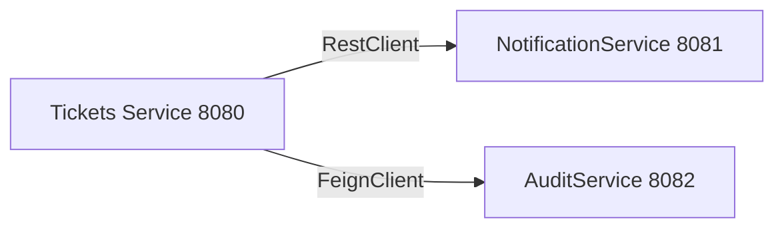
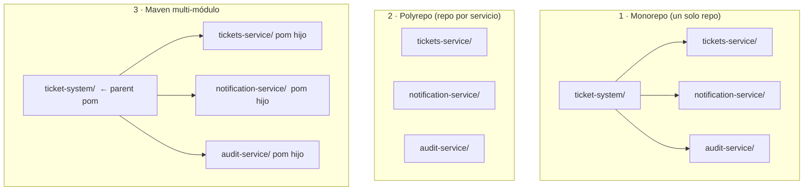
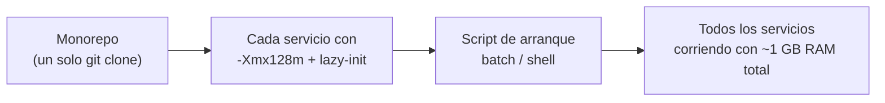
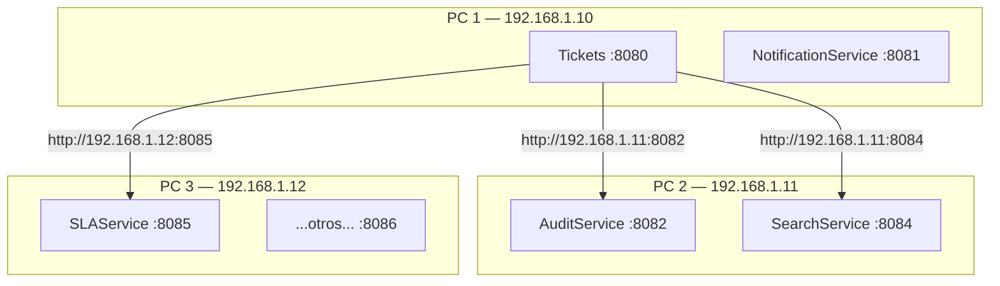
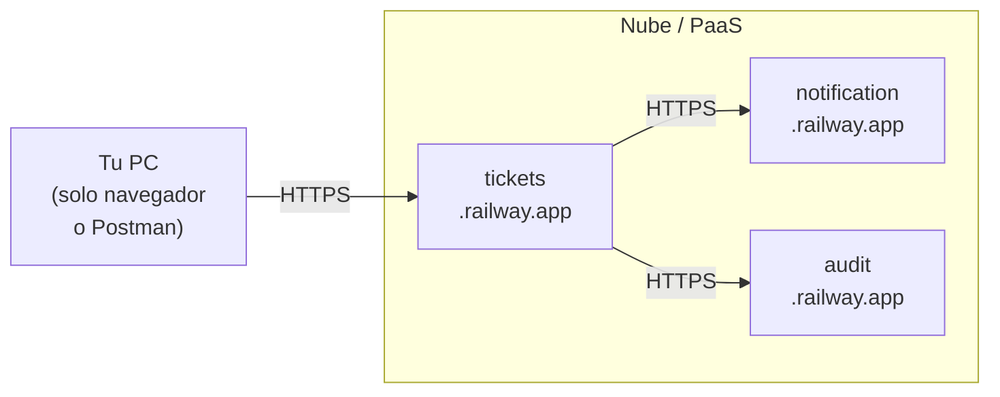
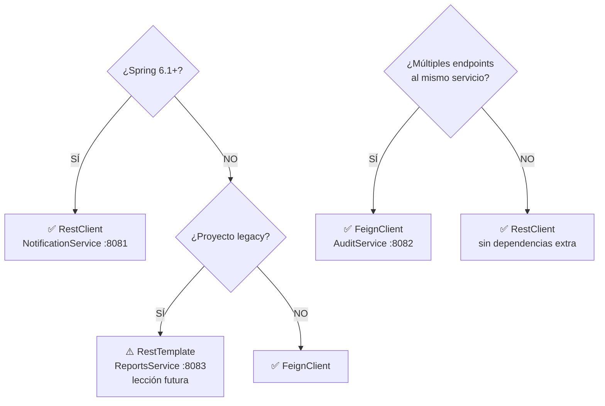
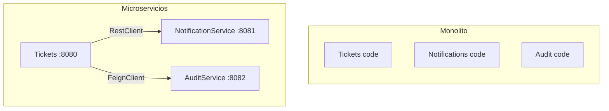

<!-- START OF FILE: docs_lessons_14-microservices_01_objetivo_y_alcance.md -->
# Documento: docs lessons 14-microservices 01 objetivo y alcance
---
# Lección 14 — Comunicación entre Microservicios

## ¿De dónde venimos?

En la lección 13 implementaste un historial persistente de cambios en el ticket. Tu aplicación Tickets funciona perfectamente como **monolito**: un único proyecto que gestiona tickets, usuarios e historial de cambios.

Pero en equipos grandes, surge una necesidad: **dividir la aplicación en microservicios independientes**. En esta lección usaremos dos servicios reales: **NotificationService** (envío de notificaciones, puerto 8081) y **AuditService** (registro de auditoría, puerto 8082). Por ejemplo:



Cada microservicio es una **aplicación independiente** en un puerto diferente. Se comunican vía HTTP/REST.

---

## Los enfoques de comunicación

| Enfoque | Tool | Ventajas | Desventajas | Cuándo |
|---------|------|----------|------------|--------|
| **RestClient** ✅ | Spring Web 6.1+ | Moderno, limpio, sin dependencias | Requiere Spring 6.1+ | Estándar recomendado |
| **FeignClient** | Spring Cloud | Automático, declarativo | Más dependencias | Múltiples llamadas |
| **RestTemplate** ⚠️ | Spring Web | Flexible, control total | Verboso, deprecado | Legacy/excepciones |

Esta lección cubre **todos**, pero con **RestClient como estándar moderno**.

---

## ¿Qué vas a construir?

Al terminar esta lección podrás:

1. Implementar comunicación HTTP entre dos aplicaciones Spring Boot
2. Usar **RestClient** (Spring 6.1+) para llamadas HTTP modernas
3. Usar **FeignClient** como alternativa para múltiples llamadas automáticas
4. Conocer **RestTemplate** (deprecado) para mantenimiento de código legacy
5. Manejar **timeouts y reintentos**
6. Implementar **fallbacks** (qué hacer si el servicio cae)
7. Debuggear problemas de comunicación

### Lo que vas a poder explicar

- ¿Cuándo usar RestClient vs FeignClient vs RestTemplate?
- ¿Qué son los microservicios y por qué importan?
- ¿Cómo manejar errores si un microservicio cae?
- ¿Qué es un circuit breaker y por qué es importante?
- ¿Cómo registrar logs de llamadas HTTP?

---

## Estructura de la Lección

1. **[Este documento](01_objetivo_y_alcance.md)** — Objetivo y alcance
2. **[Organización de Repositorios](02_organizacion_repositorios.md)** — Monorepo, polyrepo y Maven multi-módulo
3. **[Ejecución Local](03_ejecucion_local.md)** — Correr 10 servicios con poca RAM (JVM flags, Docker, nativo)
4. **[Despliegue Distribuido](04_despliegue_externo.md)** — Red local, PaaS/nube y comparativa de estrategias
5. **[Guión Paso a Paso](05_guion_paso_a_paso.md)** — Instrucciones prácticas
6. **[RestClient vs RestTemplate vs FeignClient](06_resttemplate_vs_feign.md)** — Comparación
7. **[Ejemplos Prácticos](07_ejemplos_practicos.md)** — Código listo
8. **[Manejo de Errores](08_manejo_errores.md)** — Timeouts, reintentos, fallbacks
9. **[Debugging](09_debugging.md)** — Logs y troubleshooting
10. **[Checklist](10_checklist_rubrica_minima.md)** — Verificación
11. **[Actividad Individual](11_actividad_individual.md)** — Tu tarea

---

## Requisitos Previos

- ✅ Lecciones 10-13 completadas
- ✅ Entiendes Spring Boot básico
- ✅ Conoces HTTP/REST
- ✅ Tienes **NotificationService** (puerto 8081) y **AuditService** (puerto 8082) corriendo
- ✅ Spring framework 6.1+ / Springboot 3.2+ (para RestClient)


<!-- START OF FILE: docs_lessons_14-microservices_02_organizacion_repositorios.md -->
# Documento: docs lessons 14-microservices 02 organizacion repositorios
---
# Lección 14 — Organización de Repositorios

Antes de escribir una sola línea de código de integración, hay una pregunta que casi todos los equipos se hacen: **¿cómo organizo mis microservicios?** ¿Un solo repositorio con todos? ¿Uno por servicio? ¿O los junto en un proyecto Maven multi-módulo?

---

## ¿Un repo o varios?

Hay tres patrones habituales:



### Comparativa

| Aspecto | Monorepo | Polyrepo | Multi-módulo Maven |
|---------|----------|----------|--------------------|
| **Configuración** | Mínima | Un repo por servicio | Media |
| **Versión compartida** | Manual | No existe | Desde el parent pom |
| **Dependencias comunes** | Copiadas en cada pom | Copiadas | Declaradas una vez |
| **CI/CD** | Un pipeline | Un pipeline por servicio | Un pipeline con perfiles |
| **Aislamiento de cambios** | Bajo | Alto | Medio |
| **Ideal para** | Aprender / evaluaciones | Producción real | Proyectos medianos |

> **En este curso** usamos el patrón **monorepo con proyectos independientes** (cada servicio tiene su propia carpeta con su propio `pom.xml`). Eso simplifica el trabajo pedagógico: clonas un solo repositorio y tienes todo.

---

## Maven Multi-módulo: qué es y cómo crearlo

Un proyecto multi-módulo tiene un **parent `pom.xml`** que agrupa varios módulos. Cada módulo hereda las versiones y dependencias del parent, eliminando duplicación.

### Estructura resultado

```
ticket-system/               ← parent (solo pom.xml, sin src/)
├── pom.xml
├── tickets-service/
│   └── pom.xml              ← hijo: hereda del parent
├── notification-service/
│   └── pom.xml
└── audit-service/
    └── pom.xml
```

### Opción A: A mano

**1. Crear el parent `pom.xml`** en la raíz del proyecto:

```xml
<!-- ticket-system/pom.xml -->
<project>
    <modelVersion>4.0.0</modelVersion>

    <groupId>cl.duoc.fullstack</groupId>
    <artifactId>ticket-system</artifactId>
    <version>1.0.0</version>
    <packaging>pom</packaging>   <!-- ← obligatorio en el parent -->

    <!-- Lista de módulos que componen el sistema -->
    <modules>
        <module>tickets-service</module>
        <module>notification-service</module>
        <module>audit-service</module>
    </modules>

    <parent>
        <groupId>org.springframework.boot</groupId>
        <artifactId>spring-boot-starter-parent</artifactId>
        <version>4.0.5</version>
        <relativePath/>
    </parent>

    <properties>
        <java.version>21</java.version>
    </properties>
</project>
```

**2. En cada módulo hijo**, reemplazar el `<parent>` de Spring Boot por el parent propio:

```xml
<!-- ticket-system/tickets-service/pom.xml -->
<project>
    <modelVersion>4.0.0</modelVersion>

    <!-- Apunta al parent local, no a Spring Boot directamente -->
    <parent>
        <groupId>cl.duoc.fullstack</groupId>
        <artifactId>ticket-system</artifactId>
        <version>1.0.0</version>
        <relativePath>../pom.xml</relativePath>   <!-- ← ruta relativa al parent -->
    </parent>

    <artifactId>tickets-service</artifactId>
    <packaging>jar</packaging>

    <dependencies>
        <dependency>
            <groupId>org.springframework.boot</groupId>
            <artifactId>spring-boot-starter-web</artifactId>
            <!-- versión heredada del parent, no se repite -->
        </dependency>
    </dependencies>
</project>
```

**3. Compilar todo desde la raíz:**

```bash
cd ticket-system
mvnw.cmd package -DskipTests        # compila todos los módulos en orden
mvnw.cmd package -pl tickets-service -am   # solo un módulo y sus dependencias
```

### Opción B: Con IntelliJ IDEA

1. **Crear proyecto padre**: `File → New → Project → Maven` → marcar *Create from archetype: pom* o simplemente borrar el `<packaging>jar</packaging>` y agregar `<packaging>pom</packaging>`.
2. **Agregar módulos**: clic derecho sobre el proyecto raíz → `New → Module → Spring Initializr`.
3. IntelliJ agrega automáticamente el `<module>` en el parent y el `<parent>` en el hijo.

> **Ventaja de IntelliJ**: maneja la configuración del `<relativePath>` solo y sincroniza los cambios del parent automáticamente.

---

*[← Volver a Lección 14](01_objetivo_y_alcance.md) · [Siguiente: Ejecución local →](03_ejecucion_local.md)*


<!-- START OF FILE: docs_lessons_14-microservices_03_ejecucion_local.md -->
# Documento: docs lessons 14-microservices 03 ejecucion local
---
# Lección 14 — Ejecución Local de Múltiples Servicios

Para la segunda evaluación debes levantar ~10 microservicios simultáneamente. Una JVM de Spring Boot en configuración por defecto consume entre **200 y 350 MB de RAM**. En el peor caso: `10 × 350 MB = 3.5 GB` solo para los servicios.

Esta sección cubre las estrategias para reducir ese consumo y poder correrlos todos en una sola PC.

---

## Solución 1: Limitar la RAM de cada JVM

Agrega estos flags al arrancar cada servicio. La forma más simple es en `application.yml` o como variable de entorno:

```bash
# Límite de heap: 128 MB por servicio (suficiente para servicios simples en memoria)
mvnw.cmd spring-boot:run -Dspring-boot.run.jvmArguments="-Xms64m -Xmx128m"
```

O permanentemente en el `pom.xml` de cada servicio:

```xml
<plugin>
    <groupId>org.springframework.boot</groupId>
    <artifactId>spring-boot-maven-plugin</artifactId>
    <configuration>
        <jvmArguments>-Xms64m -Xmx128m</jvmArguments>
    </configuration>
</plugin>
```

---

## Solución 2: Reducir el overhead de Spring Boot

Agrega esto a cada `application.yml`:

```yaml
spring:
  main:
    lazy-initialization: true   # beans creados solo cuando se necesitan
  jmx:
    enabled: false              # deshabilita JMX (no lo usamos)

server:
  tomcat:
    threads:
      max: 10                   # menos hilos = menos memoria (dev only)
```

Con estas tres propiedades, un servicio simple puede arrancar usando **80-120 MB** en lugar de 300 MB.

---

## Solución 3: Docker Compose (Extra — no requerido por la asignatura)

> ⚠️ **Docker y Docker Compose no son parte del currículo oficial de DSY1103.** Esta solución se menciona como referencia para quienes ya lo conozcan o quieran explorarlo por su cuenta. Para más detalle, ver [`docs/extras/docker`](../../../docs/extras/docker/README.md).

Docker Compose levanta todos los servicios con un solo comando. Para que funcione, **cada proyecto Spring Boot necesita un `Dockerfile`** en su raíz. Sin ese archivo, `docker compose up --build` fallará.

**Sobre el nombre del archivo de configuración:** el estándar actual es `compose.yaml` (sin el prefijo `docker-`). Los nombres `docker-compose.yml` y `docker-compose.yaml` siguen siendo reconocidos por retro-compatibilidad, pero son el estilo antiguo (Compose V1).

**Sobre el comando:** usa siempre `docker compose` (con espacio), que es el plugin integrado en Docker Desktop moderno. El comando `docker-compose` (con guión) era la herramienta V1 independiente, deprecada desde 2023.

Estructura necesaria:
```
monorepo/
├── compose.yaml              ← nombre moderno (V2)
├── Tickets/
│   └── Dockerfile            ← requerido por cada servicio
├── NotificationService/
│   └── Dockerfile            ← requerido
└── ...
```

Ejemplo de `compose.yaml`:

```yaml
# compose.yaml — Compose V2 (no necesita campo "version:")
services:
  tickets:
    build: ./Tickets          # ← usa el Dockerfile de ./Tickets/
    ports: ["8080:8080"]
    environment:
      JAVA_TOOL_OPTIONS: "-Xmx128m"

  notification:
    build: ./NotificationService
    ports: ["8081:8081"]
    environment:
      JAVA_TOOL_OPTIONS: "-Xmx64m"

  audit:
    build: ./AuditService
    ports: ["8082:8082"]
    environment:
      JAVA_TOOL_OPTIONS: "-Xmx64m"
```

```bash
docker compose up --build    # construye imágenes y levanta todo
docker compose down          # detiene todo
docker compose logs -f       # ver logs en tiempo real
```

Ver [`docs/extras/docker`](../../../docs/extras/docker/README.md) para el `Dockerfile` mínimo requerido, la diferencia completa V1/V2 y más ejemplos.

---

## Solución 4: Compilación nativa con GraalVM (Extra)

> ⚠️ Esta opción es avanzada y no es requerida por la asignatura. Ver [`docs/extras/native-compilation`](../../../docs/extras/native-compilation/README.md) para el detalle completo.

En lugar de ejecutar un JAR sobre una JVM (que incluye el runtime completo), GraalVM compila la aplicación a un **ejecutable nativo** — código máquina que arranca directamente sin JVM.

| | JVM estándar | Ejecutable nativo |
|---|---|---|
| Startup | ~4 segundos | ~80 ms |
| RAM en reposo | ~250 MB | ~50 MB |
| Tiempo de build | ~10 segundos | 3–10 minutos |

Para 10 servicios: `10 × 50 MB ≈ 500 MB` de RAM total — una mejora enorme. El costo es el tiempo de compilación: cada cambio en el código requiere esperar varios minutos para volver a compilar. No es práctico para desarrollo activo, pero sí para el despliegue final.

```bash
# Requiere GraalVM instalado y JAVA_HOME apuntando a él
mvnw.cmd -Pnative native:compile -DskipTests
./target/mi-servicio     # ejecutable nativo, sin JVM
```

---

## Consejo rápido para empezar

Usa esta combinación como punto de partida — funciona con solo Java y Maven instalados:



Crea un script `start-all.cmd` (Windows) en la raíz:

```bat
@echo off
echo Iniciando todos los microservicios...

start "NotificationService" cmd /k "cd NotificationService && mvnw.cmd spring-boot:run -Dspring-boot.run.jvmArguments=-Xmx64m"
start "AuditService"        cmd /k "cd AuditService        && mvnw.cmd spring-boot:run -Dspring-boot.run.jvmArguments=-Xmx64m"
start "SearchService"       cmd /k "cd SearchService       && mvnw.cmd spring-boot:run -Dspring-boot.run.jvmArguments=-Xmx64m"
start "SLAService"          cmd /k "cd SLAService          && mvnw.cmd spring-boot:run -Dspring-boot.run.jvmArguments=-Xmx64m"
start "Tickets"             cmd /k "cd Tickets             && mvnw.cmd spring-boot:run -Dspring-boot.run.jvmArguments=-Xmx128m"

echo Servicios iniciados. Revisa cada ventana.
```

Cada servicio abre en su propia ventana de terminal, por lo que puedes ver sus logs de forma independiente.

---

*[← Organización de repositorios](02_organizacion_repositorios.md) · [Siguiente: Despliegue distribuido y nube →](04_despliegue_externo.md)*


<!-- START OF FILE: docs_lessons_14-microservices_04_despliegue_externo.md -->
# Documento: docs lessons 14-microservices 04 despliegue externo
---
# Lección 14 — Despliegue Distribuido y en la Nube

Cuando una sola PC no es suficiente — o quieres acceder a los servicios desde cualquier lugar — hay dos opciones: repartir los servicios entre varias máquinas de la misma red, o desplegarlos en un proveedor de nube.

---

## Solución 5: Distribución en múltiples máquinas de la misma red

Si tienes compañeros disponibles o varias computadoras en la misma red WiFi o LAN, puedes **repartir los servicios entre máquinas**. Cada PC corre solo 2-3 servicios y los demás se comunican por la IP de red local.



**Cómo configurarlo:**

1. Averigua la IP local de cada PC:
   ```bash
   # Windows
   ipconfig | findstr "IPv4"
   # Mac / Linux
   ip a | grep "inet "
   ```

2. Actualiza las URLs en `application.yml` de cada servicio para apuntar a la IP correcta:
   ```yaml
   # application.yml de Tickets (corre en PC1)
   services:
     audit:
       url: http://192.168.1.11:8082    # AuditService corre en PC2
     search:
       url: http://192.168.1.11:8084
     sla:
       url: http://192.168.1.12:8085
   ```

3. Verifica que el **firewall** del PC remoto permita conexiones entrantes en ese puerto. En Windows: `Configuración → Firewall → Reglas de entrada → Nuevo puerto`.

**Problema frecuente:** las IPs cambian al reconectar a la red. **Solución:** usa variables de entorno para las URLs en lugar de escribirlas fijas en el YAML:

```yaml
# application.yml — patrón con fallback a localhost
services:
  audit:
    url: ${AUDIT_SERVICE_URL:http://localhost:8082}
  search:
    url: ${SEARCH_SERVICE_URL:http://localhost:8084}
```

Cuando el servicio corre en la misma PC no hace falta configurar nada. Cuando corre en otra máquina, defines la variable de entorno antes de arrancar:

```bash
# Windows (CMD)
set AUDIT_SERVICE_URL=http://192.168.1.11:8082
mvnw.cmd spring-boot:run
```

> Esta distribución replica exactamente cómo funciona un entorno de producción real: microservicios desplegados en distintos servidores que se comunican por red.

---

## Solución 6: Despliegue en la nube / PaaS

Si tu PC tiene poca RAM o quieres acceder a los servicios desde cualquier lugar, puedes desplegar en un **PaaS** (*Platform as a Service*) — plataformas que administran la infraestructura y solo te piden el código o el contenedor.



**Opciones con free tier para aplicaciones Spring Boot:**

| Plataforma | Free tier | Requiere Docker | Notas |
|---|---|---|---|
| [Railway](https://railway.app) | ✅ (con límites) | Opcional | Muy fácil, detecta Spring Boot automáticamente |
| [Render](https://render.com) | ✅ (duerme tras inactividad) | Opcional | Puede tardar en arrancar tras inactividad |
| [Fly.io](https://fly.io) | ✅ (3 VMs pequeñas) | ✅ Requerido | Control más fino, buen para microservicios |
| [DigitalOcean App Platform](https://www.digitalocean.com/products/app-platform) | ❌ (desde $5/mes) | Opcional | Sencillo y confiable |
| [Azure Container Apps](https://azure.microsoft.com/products/container-apps) | ✅ (créditos de estudiante) | ✅ Requerido | Alumnos DUOC pueden tener acceso via Azure for Students |

**Lo que cambia en tu código al pasar a la nube:**

Las URLs dejan de ser `http://localhost:XXXX` y pasan a ser `https://mi-servicio.railway.app`. La forma más limpia de manejarlo es con variables de entorno para no tocar el código:

```yaml
# application.yml — el mismo archivo funciona local y en la nube
services:
  audit:
    url: ${AUDIT_SERVICE_URL:http://localhost:8082}   # usa env var si existe, si no localhost
  notification:
    url: ${NOTIFICATION_SERVICE_URL:http://localhost:8081}
```

En el PaaS configuras la variable `AUDIT_SERVICE_URL=https://mi-audit.railway.app` desde el panel web del proveedor, y el código no cambia.

> **Para la evaluación:** no es necesario desplegar en la nube — los servicios corriendo localmente son suficientes. Esta opción es útil si quieres mostrar el trabajo funcionando desde cualquier dispositivo o si tu PC no tiene suficiente RAM.

---

## Comparativa de todas las estrategias

| Estrategia | RAM local estimada (10 servicios) | Complejidad | Requiere |
|------------|-----------------------------------|-------------|----------|
| Sin optimizar | ~3.5 GB | Ninguna | 16 GB+ de RAM |
| Flags JVM + lazy init | ~1 GB | Baja | Solo Java/Maven ✅ |
| Docker Compose | ~800 MB | Media | Docker instalado + Dockerfile por servicio |
| Compilación nativa | ~600 MB | Alta | GraalVM + build largo |
| Red local (varias PCs) | ~1 GB (distribuido) | Media | Red WiFi/LAN compartida |
| PaaS / nube | 0 MB local | Media–Alta | Cuenta en el proveedor |

**Recomendación para la segunda evaluación:** empieza con *Flags JVM + lazy init* — cero dependencias adicionales y reduce el consumo a ~1 GB. Solo si necesitas más, explora Docker o la distribución en red.

---

*[← Ejecución local](03_ejecucion_local.md) · [Siguiente: Guión paso a paso →](05_guion_paso_a_paso.md)*


<!-- START OF FILE: docs_lessons_14-microservices_05_guion_paso_a_paso.md -->
# Documento: docs lessons 14-microservices 05 guion paso a paso
---
# Lección 14 — Comunicación entre Microservicios: Guión Paso a Paso

---

## Parte 1: RestClient (Recomendado - Spring 6.1+)

### Paso 1: Crear el Cliente HTTP

El primer paso es crear una clase dedicada que encapsule toda la lógica de comunicación con el microservicio externo. Separar esta responsabilidad en su propio `@Service` mantiene al `TicketService` limpio de detalles de red y facilita reemplazar o mockear el cliente en pruebas.

> **¿Por qué inyectar `RestClient.Builder` y no `RestClient` directamente?**  
> Spring Boot auto-configura un bean `RestClient.Builder`. Cada cliente HTTP recibe ese builder, lo personaliza con su propia `baseUrl` y lo convierte en un `RestClient` inmutable. Si inyectáramos `RestClient` directamente, todos los clientes compartirían la misma instancia con la misma URL base.

```java
// NotificationClient.java
import org.springframework.web.client.RestClient;
import org.springframework.stereotype.Service;
import lombok.extern.slf4j.Slf4j;

@Service
@Slf4j
public class NotificationClient {
    
    private final RestClient restClient;
    
    // Spring inyecta el RestClient.Builder preconfigurado (no lo instanciamos nosotros)
    public NotificationClient(RestClient.Builder builder) {
        this.restClient = builder
            .baseUrl("http://localhost:8081")  // URL base de NotificationService
            .build();                           // materializa el cliente inmutable para esta clase
    }
    
    // Patrón fire-and-forget: si falla, el llamador ya completó su operación principal
    public void send(String title, String message, String type, String recipient) {
        try {
            NotificationRequest request = new NotificationRequest(title, message, type, recipient);
            
            restClient.post()              // 1. Método HTTP: POST
                .uri("/api/notifications") // 2. Ruta en NotificationService
                .body(request)            // 3. Cuerpo: Java → JSON automáticamente (Jackson)
                .retrieve()               // 4. Ejecuta la solicitud HTTP
                .toBodilessEntity();      // 5. Descarta el cuerpo de respuesta (solo nos importa el éxito)
                
            log.info("Notificación enviada a '{}': {}", recipient, title);
        } catch (Exception e) {
            // Si la notificación falla, el ticket ya fue guardado: no revertimos nada.
            // Solo logueamos para monitoreo.
            log.error("Error enviando notificación a '{}': {}", recipient, e.getMessage());
        }
    }
}
```

### Paso 2: Configurar RestClient en Spring

Spring Boot ya registra un `RestClient.Builder` disponible para inyectar, por lo que esta configuración es **opcional**. Se vuelve útil cuando necesitas aplicar comportamiento transversal a todos los clientes: interceptores de logging, headers globales, o una `requestFactory` con timeouts personalizados.

> Si no defines este `@Bean`, Spring Boot usa su propio builder por defecto, que es suficiente para empezar.

```java
// RestClientConfig.java
import org.springframework.context.annotation.Bean;
import org.springframework.context.annotation.Configuration;
import org.springframework.web.client.RestClient;
import java.time.Duration;

@Configuration
public class RestClientConfig {
    
    @Bean
    public RestClient.Builder restClientBuilder() {
        // BufferingClientHttpRequestFactory permite leer el cuerpo de la respuesta
        // más de una vez (útil para interceptores de logging que también lo necesitan).
        return RestClient.builder()
            .requestFactory(new org.springframework.http.client.BufferingClientHttpRequestFactory(
                new org.springframework.http.client.SimpleClientHttpRequestFactory()
            ));
    }
}
```

### Paso 3: Integrar en el Servicio Existente

`NotificationClient` se inyecta en `TicketService` exactamente igual que un repositorio: como campo `final`, para que `@RequiredArgsConstructor` lo incluya en el constructor generado. No hay ninguna diferencia en la forma de inyectarlo respecto a un bean local.

```java
// TicketService.java
@Service
@RequiredArgsConstructor
@Slf4j
public class TicketService {
    
    private final TicketRepository ticketRepository;
    private final NotificationClient notificationClient;  // ← nuevo campo; Spring lo inyecta igual que el repositorio
    
    public TicketResult create(TicketRequest request) {
        // ... lógica existente de creación ...
        Ticket saved = ticketRepository.save(ticket);
        
        // Notificar al asignado si existe, via NotificationService (puerto 8081)
        if (saved.getAssignedTo() != null) {
            notificationClient.send(
                "Nuevo ticket asignado",
                "Se te ha asignado el ticket '" + saved.getTitle() + "'",
                "INFO",
                saved.getAssignedTo().getEmail()
            );
        }
        
        return toResult(saved);
    }
}
```

---

## Parte 2: FeignClient (Alternativa - Múltiples Llamadas)

FeignClient es un cliente HTTP **declarativo**: defines una interfaz Java con los métodos que quieres llamar, y Spring genera la implementación en tiempo de ejecución. Es ideal cuando tienes muchas llamadas distintas al mismo servicio, ya que centraliza todo el contrato en una sola interfaz sin escribir código HTTP repetitivo.

### Paso 1: Agregar Dependencias

```xml
<!-- pom.xml -->
<dependency>
    <groupId>org.springframework.cloud</groupId>
    <artifactId>spring-cloud-starter-openfeign</artifactId>
    <version>4.0.3</version>
</dependency>
```

### Paso 2: Habilitar Feign en la App

```java
// TicketsApplication.java
import org.springframework.cloud.openfeign.EnableFeignClients;

@SpringBootApplication
@EnableFeignClients  // ← AGREGAR esta anotación
public class TicketsApplication {
    public static void main(String[] args) {
        SpringApplication.run(TicketsApplication.class, args);
    }
}
```

### Paso 3: Declarar el Contrato del Servicio Remoto

En lugar de escribir código HTTP, defines la interfaz del servicio remoto usando anotaciones familiares (`@GetMapping`, `@PathVariable`). Feign genera la implementación en tiempo de ejecución e inyecta el resultado como cualquier `@Bean`.

> **Atributos de `@FeignClient`:**
> - `name`: identificador lógico del servicio; se usa como clave en `application.yml` para configurar timeouts y nivel de log por cliente
> - `url`: URL base del microservicio remoto
> - `fallback`: clase que implementa esta misma interfaz y se ejecuta automáticamente cuando el servicio no responde

```java
// AuditServiceClient.java
import org.springframework.cloud.openfeign.FeignClient;
import org.springframework.web.bind.annotation.GetMapping;
import org.springframework.web.bind.annotation.PathVariable;
import org.springframework.web.bind.annotation.PostMapping;
import org.springframework.web.bind.annotation.RequestBody;
import java.util.List;

@FeignClient(
    name = "audit-service",                    // clave para configuración en application.yml
    url = "http://localhost:8082",             // URL base de AuditService
    fallback = AuditServiceClientFallback.class
)
public interface AuditServiceClient {
    
    @PostMapping("/api/audit")
    AuditEvent logEvent(@RequestBody AuditRequest request);
    
    @GetMapping("/api/audit/ticket/{ticketId}")
    List<AuditEvent> getAuditByTicket(@PathVariable Long ticketId);
}
```

### Paso 4: Implementar el Fallback

El fallback debe implementar la misma interfaz que el `@FeignClient`. Cuando el servicio remoto no responde (timeout, error 5xx, red caída), Feign llama automáticamente al método equivalente del fallback en lugar de lanzar una excepción, permitiendo que la aplicación continúe funcionando con datos parciales o valores por defecto.

```java
// AuditServiceClientFallback.java
import org.springframework.stereotype.Component;
import lombok.extern.slf4j.Slf4j;
import java.util.List;

@Component
@Slf4j
public class AuditServiceClientFallback implements AuditServiceClient {
    
    @Override
    public AuditEvent logEvent(AuditRequest request) {
        log.warn("AuditService no disponible, evento no registrado: {}", request.action());
        return null;  // el ticket ya fue guardado; solo se pierde el log de auditoría
    }
    
    @Override
    public List<AuditEvent> getAuditByTicket(Long ticketId) {
        log.warn("AuditService no disponible, sin historial de auditoría para ticket {}", ticketId);
        return List.of();  // retornar lista vacía en lugar de lanzar excepción
    }
}
```

### Paso 5: Integrar en el Servicio

La ventaja de Feign se aprecia al integrar en el servicio: el cliente se inyecta igual que cualquier `@Service` o repositorio, y las llamadas HTTP parecen llamadas a métodos locales.

```java
// TicketService.java
@Service
@RequiredArgsConstructor
@Slf4j
public class TicketService {
    
    private final TicketRepository ticketRepository;
    private final AuditServiceClient auditClient;  // ← Feign inyecta la implementación generada
    
    public TicketResult updateById(Long id, TicketRequest request) {
        Ticket ticket = ticketRepository.findById(id).orElseThrow();
        String previousStatus = ticket.getStatus();
        
        // ... actualizar campos ...
        Ticket saved = ticketRepository.save(ticket);
        
        // Registrar en AuditService (automático via Feign)
        auditClient.logEvent(new AuditRequest(
            "STATUS_CHANGE",
            "Ticket",
            saved.getId(),
            null,       // sin usuario autenticado en este ejemplo
            "system",
            previousStatus + " → " + saved.getStatus()
        ));
        
        return toResult(saved);
    }
    
    public List<AuditEvent> getAuditTrail(Long ticketId) {
        return auditClient.getAuditByTicket(ticketId);  // Feign hace el HTTP GET por detrás
    }
}
```

---

## Parte 3: Configuración de Timeouts y Reintentos

### RestClient con Timeouts

```java
// RestClientConfig.java
@Configuration
public class RestClientConfig {
    
    @Bean
    public RestClient.Builder restClientBuilder() {
        // Configuramos la request factory con timeouts para todos los clientes
        var factory = new org.springframework.http.client.SimpleClientHttpRequestFactory();
        factory.setConnectTimeout(java.time.Duration.ofSeconds(5));   // máximo para establecer conexión
        factory.setReadTimeout(java.time.Duration.ofSeconds(10));     // máximo para recibir respuesta
        
        return RestClient.builder()
            .requestFactory(factory);  // NotificationClient (y cualquier otro) heredarán estos timeouts
    }
}
```

### FeignClient con Timeouts

```yaml
# application.yml
spring:
  cloud:
    openfeign:
      client:
        config:
          audit-service:
            connect-timeout: 5000      # 5 segundos para conectar
            read-timeout: 10000        # 10 segundos para leer
            logger-level: BASIC        # Log de requests/responses
          default:
            connect-timeout: 5000
            read-timeout: 10000
```

---

## Parte 4: RestTemplate (Legacy - No Recomendado)

⚠️ **RestTemplate está deprecado desde Spring 6.0. Solo usar si necesitas mantener código legacy.**

> El siguiente ejemplo usa **ReportsService** (puerto 8083), un servicio que se implementará en una lección posterior. Se incluye aquí únicamente para ilustrar el patrón RestTemplate en contraste con RestClient.

```java
// RestTemplateConfig.java (DEPRECADO)
import org.springframework.boot.web.client.RestTemplateBuilder;
import org.springframework.context.annotation.Bean;
import org.springframework.context.annotation.Configuration;
import org.springframework.web.client.RestTemplate;
import java.time.Duration;

@Configuration
public class RestTemplateConfig {
    
    @Bean
    @Deprecated(since = "6.0", forRemoval = true)
    public RestTemplate restTemplate(RestTemplateBuilder builder) {
        return builder
            .setConnectTimeout(Duration.ofSeconds(5))
            .setReadTimeout(Duration.ofSeconds(10))
            .build();
    }
}
```

```java
// ReportsClient.java (DEPRECADO — usar RestClient en proyectos nuevos)
@Service
@Slf4j
public class ReportsClient {
    
    private final RestTemplate restTemplate;
    
    public ReportsClient(RestTemplate restTemplate) {
        this.restTemplate = restTemplate;
    }
    
    public void generateReport(Long ticketId, String type) {
        String url = "http://localhost:8083/api/reports";  // ReportsService (lección futura)
        ReportRequest req = new ReportRequest(ticketId, type);
        
        try {
            restTemplate.postForObject(url, req, Void.class);
            log.info("Reporte '{}' solicitado para ticket {}", type, ticketId);
        } catch (Exception e) {
            log.error("Error solicitando reporte: {}", e.getMessage());
        }
    }
}
```

---

## Resumen: ¿Cuál Usar?

| Situación | Recomendación |
|-----------|---------------|
| **Proyecto nuevo, Spring 6.1+** | ✅ **RestClient** |
| **Múltiples servicios, código limpio** | ✅ **FeignClient** |
| **Código legacy, Spring <6.0** | ⚠️ **RestTemplate** |
| **Una llamada simple** | ✅ **RestClient** |

---

*[← Volver a Lección 14](01_objetivo_y_alcance.md)*


<!-- START OF FILE: docs_lessons_14-microservices_06_resttemplate_vs_feign.md -->
# Documento: docs lessons 14-microservices 06 resttemplate vs feign
---
# Lección 14 — RestClient vs RestTemplate vs FeignClient

## Tabla Comparativa

| Aspecto | RestClient | RestTemplate | FeignClient |
|---------|-----------|-------------|-------------|
| **Complejidad** | Baja | Media | Baja |
| **Dependencias** | Spring Web 6.1+ | Spring Web (ya incluido) | Spring Cloud |
| **Configuración** | Mínima | Manual | Automática |
| **Código** | Moderno | Verboso | Declarativo |
| **Casos de Uso** | Estándar moderno | Legacy | Múltiples llamadas |
| **Timeout** | Fácil | Manual | Configuración |
| **Reintentos** | Integrado | Manual | Automático |
| **Fallback** | Manual | Manual | Anotación |
| **Estado** | ✅ Recomendado | ⚠️ Deprecated | ✅ Alternativa |

---

## Ejemplo 1: RestClient (Recomendado - Spring 6.1+)

```java
@Service
public class NotificationClient {
    private final RestClient restClient;
    
    // Constructor explícito: recibe el builder de Spring y lo personaliza con la URL del servicio.
    // No usar @RequiredArgsConstructor aquí porque ya tenemos constructor explícito.
    public NotificationClient(RestClient.Builder builder) {
        this.restClient = builder
            .baseUrl("http://localhost:8081")  // NotificationService
            .build();
    }
    
    // Enviar notificación a NotificationService (fire-and-forget)
    public void send(String title, String message, String type, String recipient) {
        NotificationRequest req = new NotificationRequest(title, message, type, recipient);
        
        try {
            restClient.post()
                .uri("/api/notifications")
                .body(req)
                .retrieve()
                .toBodilessEntity();
        } catch (Exception e) {
            log.error("Error enviando notificación", e);
        }
    }
}
```

---

## Ejemplo 2: RestTemplate (Legacy - No recomendado)

> Ilustra el patrón con **ReportsService** (puerto 8083, lección futura). No debe usarse en proyectos nuevos.

```java
@Service
@Slf4j
public class ReportsClient {
    private final RestTemplate restTemplate;
    
    public ReportsClient(RestTemplate restTemplate) {
        this.restTemplate = restTemplate;
    }
    
    // Solicitar generación de reporte a ReportsService (puerto 8083)
    public void generateReport(Long ticketId, String type) {
        String url = "http://localhost:8083/api/reports";
        
        ReportRequest req = new ReportRequest(ticketId, type);
        
        try {
            restTemplate.postForObject(url, req, Void.class);
        } catch (Exception e) {
            log.error("Error solicitando reporte", e);
        }
    }
}
```

---

## Ejemplo 3: FeignClient (Alternativa - Múltiples Llamadas)

```java
@FeignClient(
    name = "audit-service",                    // clave para configuración en application.yml
    url = "http://localhost:8082",             // AuditService
    fallback = AuditServiceClientFallback.class
)
public interface AuditServiceClient {
    
    @PostMapping("/api/audit")
    AuditEvent logEvent(@RequestBody AuditRequest request);
    
    @GetMapping("/api/audit/ticket/{ticketId}")
    List<AuditEvent> getAuditByTicket(@PathVariable Long ticketId);
}
```

**Uso:**
```java
@Service
@RequiredArgsConstructor
public class TicketService {
    
    private final AuditServiceClient auditClient;
    
    public TicketResult updateById(Long id, TicketRequest request) {
        // ... actualizar ticket
        Ticket saved = ticketRepository.save(ticket);
        
        // Registrar auditoría en AuditService (limpio y automático via Feign)
        auditClient.logEvent(new AuditRequest(
            "STATUS_CHANGE", "Ticket", saved.getId(), null, "system",
            "Estado actualizado"
        ));
        
        return toResult(saved);
    }
    
    public List<AuditEvent> getAuditTrail(Long ticketId) {
        return auditClient.getAuditByTicket(ticketId);
    }
}
```

---

## Decisión: ¿Cuándo usar cada uno?



---

## Ventajas de Cada Uno

### RestClient ✅ RECOMENDADO
✅ Estándar moderno (Spring 6.1+)  
✅ API fluida y moderna  
✅ Sin dependencias adicionales  
✅ Máximo control  
✅ Debugging fácil  
✅ Timeouts y reintentos integrados  

### RestTemplate ⚠️ DEPRECATED
❌ Deprecado desde Spring 6.0  
❌ No usar en proyectos nuevos  
✅ Aún funciona en código legacy  
✅ Sin dependencias adicionales  
❌ Código repetitivo  
❌ Manejo manual de errores  

### FeignClient ✅ ALTERNATIVA
✅ Código muy limpio y declarativo  
✅ Automático (serialización, errores)  
✅ Fallbacks integrados  
✅ Ideal para múltiples servicios  
❌ Dependencia adicional (Spring Cloud)  
❌ Menos control  
❌ Mayor complejidad si no está acostumbrado  

---

*[← Volver a Lección 14](01_objetivo_y_alcance.md)*


<!-- START OF FILE: docs_lessons_14-microservices_07_ejemplos_practicos.md -->
# Documento: docs lessons 14-microservices 07 ejemplos practicos
---
# Lección 14 — Ejemplos Prácticos Completos

## Escenario: Tickets + NotificationService + AuditService

### Servicio 1: NotificationService (Puerto 8081)

```java
// NotificationController.java — endpoints relevantes para el cliente
@RestController
@RequestMapping("/api/notifications")
public class NotificationController {
    
    @PostMapping
    public ResponseEntity<?> create(@RequestBody NotificationRequest body) {
        // body: { title, message, type (default "INFO"), recipient (default "all") }
        // response: { id, title, message, type, recipient, sent: false, timestamp }
        ...
    }
    
    @GetMapping
    public ResponseEntity<List<?>> getAll() { ... }
    
    @GetMapping("/{id}")
    public ResponseEntity<?> getById(@PathVariable Long id) { ... }
}
```

---

### Servicio 2: AuditService (Puerto 8082)

```java
// AuditController.java — endpoints relevantes para el cliente
@RestController
@RequestMapping("/api/audit")
public class AuditController {
    
    @PostMapping
    public ResponseEntity<?> create(@RequestBody AuditRequest body) {
        // body: { action, entityType (default "Ticket"), entityId, userId, username (default "system"), details }
        // response: { id, action, entityType, entityId, userId, username, details, timestamp }
        ...
    }
    
    @GetMapping
    public ResponseEntity<List<?>> getAll() { ... }
    
    @GetMapping("/ticket/{ticketId}")
    public ResponseEntity<List<?>> getByTicket(@PathVariable Long ticketId) { ... }
}
```

---

### Servicio 3: Tickets Service (Puerto 8080 — Cliente)

#### Opción A: Con RestClient (NotificationClient → NotificationService)

```java
// RestClientConfig.java
@Configuration
public class RestClientConfig {
    
    @Bean
    public RestClient.Builder restClientBuilder() {
        return RestClient.builder()
            .requestFactory(new org.springframework.http.client.BufferingClientHttpRequestFactory(
                new org.springframework.http.client.SimpleClientHttpRequestFactory()
            ));
    }
}

// NotificationClient.java
@Service
@Slf4j
public class NotificationClient {
    
    private final RestClient restClient;
    
    public NotificationClient(RestClient.Builder builder) {
        this.restClient = builder
            .baseUrl("http://localhost:8081")
            .build();
    }
    
    public void send(String title, String message, String type, String recipient) {
        try {
            NotificationRequest request = new NotificationRequest(title, message, type, recipient);
            restClient.post()
                .uri("/api/notifications")
                .body(request)
                .retrieve()
                .toBodilessEntity();
            log.info("Notificación enviada a '{}': {}", recipient, title);
        } catch (Exception e) {
            log.error("Error enviando notificación a '{}': {}", recipient, e.getMessage());
        }
    }
}

// TicketService.java (con RestClient)
@Service
@RequiredArgsConstructor
@Slf4j
public class TicketService {
    
    private final TicketRepository ticketRepository;
    private final NotificationClient notificationClient;
    
    public TicketResult create(TicketRequest request) {
        // ... lógica de creación ...
        Ticket saved = ticketRepository.save(ticket);
        
        if (saved.getAssignedTo() != null) {
            notificationClient.send(
                "Nuevo ticket asignado",
                "Se te ha asignado el ticket '" + saved.getTitle() + "'",
                "INFO",
                saved.getAssignedTo().getEmail()
            );
        }
        
        return toResult(saved);
    }
    
    public TicketResult assignTicket(Long id, Long userId) {
        Ticket ticket = ticketRepository.findById(id).orElseThrow();
        // ... lógica de asignación ...
        Ticket saved = ticketRepository.save(ticket);
        
        notificationClient.send(
            "Ticket asignado",
            "Se te ha asignado el ticket '" + saved.getTitle() + "'",
            "INFO",
            saved.getAssignedTo().getEmail()
        );
        
        return toResult(saved);
    }
}
```

#### Opción B: Con FeignClient (AuditServiceClient → AuditService)

```java
// TicketsApplication.java
@SpringBootApplication
@EnableFeignClients
public class TicketsApplication {
    public static void main(String[] args) {
        SpringApplication.run(TicketsApplication.class, args);
    }
}

// AuditServiceClient.java (con Feign)
@FeignClient(
    name = "audit-service",
    url = "http://localhost:8082",
    fallback = AuditServiceClientFallback.class
)
public interface AuditServiceClient {
    
    @PostMapping("/api/audit")
    AuditEvent logEvent(@RequestBody AuditRequest request);
    
    @GetMapping("/api/audit/ticket/{ticketId}")
    List<AuditEvent> getAuditByTicket(@PathVariable Long ticketId);
}

// AuditServiceClientFallback.java
@Component
@Slf4j
public class AuditServiceClientFallback implements AuditServiceClient {
    
    @Override
    public AuditEvent logEvent(AuditRequest request) {
        log.warn("AuditService no disponible, evento no registrado: {}", request.action());
        return null;
    }
    
    @Override
    public List<AuditEvent> getAuditByTicket(Long ticketId) {
        log.warn("AuditService no disponible, sin historial para ticket {}", ticketId);
        return List.of();
    }
}

// TicketService.java (con FeignClient)
@Service
@RequiredArgsConstructor
@Slf4j
public class TicketService {
    
    private final TicketRepository ticketRepository;
    private final AuditServiceClient auditClient;
    
    public TicketResult updateById(Long id, TicketRequest request) {
        Ticket ticket = ticketRepository.findById(id).orElseThrow();
        String previousStatus = ticket.getStatus();
        
        // ... actualizar campos ...
        Ticket saved = ticketRepository.save(ticket);
        
        auditClient.logEvent(new AuditRequest(
            "STATUS_CHANGE",
            "Ticket",
            saved.getId(),
            null,
            "system",
            previousStatus + " → " + saved.getStatus()
        ));
        
        return toResult(saved);
    }
    
    public List<AuditEvent> getAuditTrail(Long ticketId) {
        return auditClient.getAuditByTicket(ticketId);
    }
}
```

#### Opción C: Con RestTemplate (Legacy — No recomendado)

> Ilustra el patrón con **ReportsService** (puerto 8083), un servicio que se implementará en una lección futura.

```java
// TicketsApplication.java (DEPRECADO)
@SpringBootApplication
public class TicketsApplication {
    
    @Bean
    @Deprecated(since = "6.0", forRemoval = true)
    public RestTemplate restTemplate() {
        return new RestTemplate();
    }
}

// ReportsClient.java (con RestTemplate — DEPRECADO)
@Service
@RequiredArgsConstructor
@Slf4j
public class ReportsClient {
    
    private final RestTemplate restTemplate;
    
    public void generateReport(Long ticketId, String type) {
        String url = "http://localhost:8083/api/reports";  // ReportsService (lección futura)
        ReportRequest req = new ReportRequest(ticketId, type);
        
        try {
            restTemplate.postForObject(url, req, Void.class);
            log.info("Reporte '{}' solicitado para ticket {}", type, ticketId);
        } catch (Exception e) {
            log.error("Error solicitando reporte: {}", e.getMessage());
        }
    }
}
```

---

## Configuración en `application.yml`

### Con RestClient
```yaml
spring:
  application:
    name: tickets-service

server:
  port: 8080
  servlet:
    context-path: "/ticket-app"

logging:
  level:
    org.springframework.web.client: DEBUG
```

### Con FeignClient
```yaml
spring:
  application:
    name: tickets-service
  
  cloud:
    openfeign:
      client:
        config:
          default:
            connect-timeout: 5000
            read-timeout: 10000
            logger-level: BASIC
          
          audit-service:
            connect-timeout: 3000
            read-timeout: 8000
            logger-level: FULL

server:
  port: 8080
  servlet:
    context-path: "/ticket-app"

logging:
  level:
    org.springframework.cloud.openfeign: DEBUG
```

---

## DTOs

```java
// NotificationRequest.java — cuerpo enviado a NotificationService
public record NotificationRequest(String title, String message, String type, String recipient) {}

// AuditRequest.java — cuerpo enviado a AuditService
public record AuditRequest(String action, String entityType, Long entityId, Long userId, String username, String details) {}

// AuditEvent.java — respuesta de AuditService
public record AuditEvent(Long id, String action, String entityType, Long entityId, Long userId, String username, String details, Long timestamp) {}
```

---

*[← Volver a Lección 14](01_objetivo_y_alcance.md)*


<!-- START OF FILE: docs_lessons_14-microservices_08_manejo_errores.md -->
# Documento: docs lessons 14-microservices 08 manejo errores
---
# Lección 14 — Manejo de Errores y Resiliencia

## Timeouts

### RestClient (Recomendado)
```java
@Configuration
public class RestClientConfig {
    
    @Bean
    public RestClient.Builder restClientBuilder() {
        // Configuramos la request factory con timeouts para todos los clientes
        var factory = new org.springframework.http.client.SimpleClientHttpRequestFactory();
        factory.setConnectTimeout(java.time.Duration.ofSeconds(5));   // tiempo máximo para establecer conexión
        factory.setReadTimeout(java.time.Duration.ofSeconds(10));     // tiempo máximo para recibir respuesta
        
        return RestClient.builder()
            .requestFactory(factory);  // todos los clientes construidos con este builder heredan los timeouts
    }
}
```

### FeignClient
```yaml
spring:
  cloud:
    openfeign:
      client:
        config:
          audit-service:
            connect-timeout: 5000     # 5 segundos
            read-timeout: 10000       # 10 segundos
```

### RestTemplate (Legacy - No recomendado)
```java
@Configuration
public class RestTemplateConfig {
    
    @Bean
    @Deprecated(since = "6.0", forRemoval = true)
    public RestTemplate restTemplate() {
        HttpComponentsClientHttpRequestFactory factory = 
            new HttpComponentsClientHttpRequestFactory();
        
        factory.setConnectTimeout(5000);    // 5 segundos
        factory.setReadTimeout(10000);      // 10 segundos
        
        return new RestTemplate(factory);
    }
}
```

---

## Reintentos Automáticos

### RestClient
```java
@Service
@Slf4j
public class NotificationClient {
    
    private final RestClient restClient;
    
    public void sendWithRetry(String title, String message, String type, String recipient) {
        retry(() -> {
            NotificationRequest req = new NotificationRequest(title, message, type, recipient);
            restClient.post()
                .uri("/api/notifications")
                .body(req)
                .retrieve()
                .toBodilessEntity();
            return null;
        }, 3);
    }
    
    private <T> T retry(Supplier<T> supplier, int maxAttempts) {
        for (int attempt = 1; attempt <= maxAttempts; attempt++) {
            try {
                return supplier.get();
            } catch (Exception e) {
                if (attempt == maxAttempts) throw e;
                log.warn("Attempt {} failed, retrying...", attempt);
                try {
                    Thread.sleep(1000L * attempt);  // espera incremental: 1s, 2s, 3s… (backoff lineal)
                } catch (InterruptedException ie) {
                    Thread.currentThread().interrupt();
                    throw new RuntimeException(ie);
                }
            }
        }
        throw new RuntimeException("Retries exhausted");
    }
}
```

### FeignClient
```yaml
spring:
  cloud:
    openfeign:
      client:
        config:
          audit-service:
            # Reintentos
            max-attempts: 3
            retry-delay: 1000  # 1 segundo entre intentos
```

---

## Circuit Breaker (Resilience4j)

```xml
<!-- pom.xml -->
<dependency>
    <groupId>io.github.resilience4j</groupId>
    <artifactId>resilience4j-spring-boot3</artifactId>
    <version>2.1.0</version>
</dependency>
```

```java
@Service
@RequiredArgsConstructor
@Slf4j
public class TicketService {
    
    private final AuditServiceClient auditClient;
    
    @CircuitBreaker(
        name = "audit-service",
        fallbackMethod = "getAuditFallback"
    )
    public List<AuditEvent> getAuditTrail(Long ticketId) {
        return auditClient.getAuditByTicket(ticketId);
    }
    
    // Fallback: ejecutarse si circuit abre
    private List<AuditEvent> getAuditFallback(Long ticketId, Exception e) {
        log.warn("Circuit abierto para AuditService, retornando lista vacía para ticket {}", ticketId);
        return List.of();
    }
}
```

```yaml
resilience4j:
  circuitbreaker:
    configs:
      default:
        failure-rate-threshold: 50         # Abrir si 50% de llamadas falla
        wait-duration-in-open-state: 10s   # Esperar 10s antes de reintentar
        permitted-number-of-calls-in-half-open-state: 3
    instances:
      audit-service:
        base-config: default
```

---

## Manejo de Excepciones

```java
@ExceptionHandler(HttpClientErrorException.class)
public ResponseEntity<?> handleHttpClientException(HttpClientErrorException e) {
    log.error("HTTP error: {}", e.getMessage());
    
    if (e.getStatusCode().value() == 404) {
        return ResponseEntity.notFound().build();
    }
    
    return ResponseEntity.status(e.getStatusCode())
        .body("Error en llamada a microservicio");
}

@ExceptionHandler(Exception.class)
public ResponseEntity<?> handleGenericException(Exception e) {
    log.error("Error de comunicación: {}", e.getMessage());
    return ResponseEntity.status(503)
        .body("Servicio temporalmente no disponible");
}
```

---

## Logging Detallado

```yaml
logging:
  level:
    org.springframework.cloud.openfeign: DEBUG
    org.springframework.web.client.RestClient: DEBUG
    org.springframework.web.client.RestTemplate: DEBUG
    
    # Por cliente específico
    com.example.clients: TRACE
```

```java
// Logger personalizado para Feign
@Component
public class FeignLoggingConfiguration {
    
    @Bean
    public feign.Logger.Level feignLoggerLevel() {
        return feign.Logger.Level.FULL;
    }
}

// Logger personalizado para RestClient
@Component
@Slf4j
public class RestClientInterceptor {
    
    public void logRequest(HttpRequest request, byte[] body) {
        log.debug("REST request: {} {}", request.getMethod(), request.getURI());
    }
    
    public void logResponse(HttpResponse response) {
        log.debug("REST response: {}", response.getStatusCode());
    }
}
```

---

*[← Volver a Lección 14](01_objetivo_y_alcance.md)*


<!-- START OF FILE: docs_lessons_14-microservices_09_debugging.md -->
# Documento: docs lessons 14-microservices 09 debugging
---
# Lección 14 — Debugging y Troubleshooting

## Error 1: "Connection refused"

**Síntoma:**
```
java.net.ConnectException: Connection refused
```

**Causas:**
- El otro microservicio no está corriendo
- URL incorrecta (puerto, host)
- Firewall bloqueando

**Solución:**
```bash
# Linux/macOS: verificar que los servicios están corriendo
lsof -i :8081  # NotificationService
lsof -i :8082  # AuditService

# Windows: equivalente
netstat -aon | findstr :8081
netstat -aon | findstr :8082

# Probar conexión manualmente
curl http://localhost:8081/api/notifications
curl http://localhost:8082/api/audit
```

---

## Error 2: "Read timed out"

**Síntoma:**
```
java.net.SocketTimeoutException: Read timed out
```

**Causa:** El servicio tarda más del timeout configurado.

**Solución:**

### Con RestClient
```java
// Configurar en RestClient builder
restClient = builder
    .baseUrl("http://localhost:8081")
    .build();
```

### Con FeignClient
```yaml
spring:
  cloud:
    openfeign:
      client:
        config:
          audit-service:
            read-timeout: 30000  # Aumentar a 30 segundos
```

### Con RestTemplate (Legacy)
```java
@Bean
public RestTemplate restTemplate() {
    HttpComponentsClientHttpRequestFactory factory = 
        new HttpComponentsClientHttpRequestFactory();
    factory.setReadTimeout(30000);
    return new RestTemplate(factory);
}
```

---

## Error 3: "Bean not found"

**Síntoma (RestClient):**
```
Error creating bean with name 'restClientBuilder'
```

**Síntoma (FeignClient):**
```
Error creating bean with name 'auditServiceClient'
No bean of type 'AuditServiceClient' found
```

**Causa FeignClient:** `@EnableFeignClients` no está en la app principal.

**Solución:**
```java
@SpringBootApplication
@EnableFeignClients  // ← AGREGAR solo para Feign
public class TicketsApplication {
    public static void main(String[] args) {
        SpringApplication.run(TicketsApplication.class, args);
    }
}
```

---

## Error 4: "Invalid content-type"

**Síntoma:**
```
Content-Type: text/plain; charset=UTF-8
Could not deserialize response body of type [class UserDTO]
```

**Causa:** Respuesta no es JSON.

**Solución:**
1. Verificar que el servicio devuelve `Content-Type: application/json`
2. Probar manualmente:
```bash
curl -v http://localhost:8081/api/notifications
curl -v http://localhost:8082/api/audit
# Ver headers en respuesta
```

---

## Debugging: Logs Detallados

### RestClient
```yaml
logging:
  level:
    org.springframework.web.client.RestClient: DEBUG
```

### FeignClient
```yaml
logging:
  level:
    org.springframework.cloud.openfeign: DEBUG
    feign.Logger: DEBUG
```

### RestTemplate (Legacy)
```yaml
logging:
  level:
    org.springframework.web.client.RestTemplate: DEBUG
```

**Verás en logs:**
```
[AuditServiceClient#logEvent] ---> POST http://localhost:8082/api/audit HTTP/1.1
[AuditServiceClient#logEvent] Content-Type: application/json
[AuditServiceClient#logEvent] ---> END HTTP (87-byte body)
[AuditServiceClient#logEvent] <--- HTTP/1.1 200 OK (45ms)
[AuditServiceClient#logEvent] Content-Type: application/json
[AuditServiceClient#logEvent] {"id":1,"action":"STATUS_CHANGE","entityType":"Ticket"}
[AuditServiceClient#logEvent] <--- END HTTP (102-byte body)
```

---

## Testing: Mock de Microservicios

```java
@SpringBootTest
public class TicketServiceTest {
    
    @MockBean
    private AuditServiceClient auditClient;  // Funciona para FeignClient
    
    @MockBean
    private NotificationClient notificationClient;  // Funciona para RestClient
    
    @Autowired
    private TicketService ticketService;
    
    @Test
    public void testUpdateById_registersAuditEvent() {
        // Mock del servicio remoto
        AuditEvent mockEvent = new AuditEvent(1L, "STATUS_CHANGE", "Ticket", 1L, null, "system", "NEW → IN_PROGRESS", 0L);
        
        when(auditClient.logEvent(any()))
            .thenReturn(mockEvent);
        
        // Ejecutar
        ticketService.updateById(1L, request);
        
        // Verificar que se llamó a AuditService
        verify(auditClient).logEvent(any(AuditRequest.class));
    }
    
    @Test
    public void testGetAuditTrailWhenAuditServiceFails() {
        // Simular fallo — el fallback retorna lista vacía
        when(auditClient.getAuditByTicket(1L))
            .thenReturn(List.of());
        
        List<AuditEvent> result = ticketService.getAuditTrail(1L);
        assertNotNull(result);
        assertTrue(result.isEmpty());
    }
}
```

---

*[← Volver a Lección 14](01_objetivo_y_alcance.md)*


<!-- START OF FILE: docs_lessons_14-microservices_10_checklist_rubrica_minima.md -->
# Documento: docs lessons 14-microservices 10 checklist rubrica minima
---
# Lección 14 — Checklist y Rúbrica Mínima

## ✅ Checklist de Completitud

### Dependencias

- [ ] Spring Cloud OpenFeign agregado a `pom.xml` (si usas Feign)
- [ ] Resilience4j agregado (opcional, para circuit breaker)
- [ ] RestClient disponible (Spring 6.1+)

### Código

- [ ] `@EnableFeignClients` en aplicación principal (si usas Feign)
- [ ] RestClient.Builder inyectado (si usas RestClient)
- [ ] Cliente HTTP creado (RestClient, Feign interface o RestTemplate)
- [ ] Fallback implementado (para Feign)
- [ ] Manejo de errores implementado

### Configuración

- [ ] Timeouts configurados en `application.yml`
- [ ] Logging configurado para ver requests/responses
- [ ] URLs correctas (host y puerto)
- [ ] Perfil seleccionado correctamente

### Testing

- [ ] Probaste comunicación entre servicios
- [ ] Tests con mocks de clientes HTTP
- [ ] Probaste fallback cuando servicio cae

### Documentación

- [ ] Entiendo cuándo usar RestClient vs FeignClient vs RestTemplate
- [ ] Puedo explicar qué son microservicios
- [ ] Sé cómo manejar timeouts y errores
- [ ] Entiendo circuit breaker

---

## 🎓 Rúbrica de Evaluación

### 1. Implementación HTTP (40%)

| Criterio | Insuficiente | Satisfactorio | Excelente |
|----------|-------------|--------------|-----------|
| Uso correcto | ❌ No funciona | ✅ Funciona | ✅ + optimizado |
| RestClient | ❌ No usa | ✅ Usa correctamente | ✅ + configurado |
| FeignClient | ❌ No comprende | ✅ Usa | ✅ + fallback |
| RestTemplate | ❌ Usa deprecated | ✅ Solo si legacy | ✅ N/A |
| Elección | ❌ Equivocada | ✅ Apropiada | ✅ + justificada |

### 2. Manejo de Errores (30%)

| Criterio | Insuficiente | Satisfactorio | Excelente |
|----------|-------------|--------------|-----------|
| Timeouts | ❌ No configurado | ✅ Configurado | ✅ + por cliente |
| Excepciones | ❌ No manejadas | ✅ Try/catch | ✅ + custom handlers |
| Fallback | ❌ No existe | ✅ Básico | ✅ + resiliente |
| Logging | ❌ No hay | ✅ Básico | ✅ + detallado |

### 3. Comunicación (20%)

| Criterio | Insuficiente | Satisfactorio | Excelente |
|----------|-------------|--------------|-----------|
| Entre servicios | ❌ No comunica | ✅ Comunica | ✅ + bidireccional |
| Modelos DTO | ❌ Mal formatos | ✅ Correcto | ✅ + documentados |
| Respuestas | ❌ Incompletas | ✅ Correctas | ✅ + validadas |

### 4. Conocimiento (10%)

| Criterio | Insuficiente | Satisfactorio | Excelente |
|----------|-------------|--------------|-----------|
| Microservicios | ❌ Confuso | ✅ Entiende | ✅ + ventajas/desventajas |
| RestClient vs Feign | ❌ No diferencia | ✅ Conoce diferencias | ✅ + cuándo usar cada uno |
| Debugging | ❌ No sabe | ✅ Puede debuggear | ✅ + logs avanzados |

---

*[← Volver a Lección 14](01_objetivo_y_alcance.md)*


<!-- START OF FILE: docs_lessons_14-microservices_11_actividad_individual.md -->
# Documento: docs lessons 14-microservices 11 actividad individual
---
# Lección 14 — Actividad Individual

## 🎯 Objetivo

Implementar comunicación HTTP entre tu aplicación Tickets y **dos servicios externos nuevos** que no se vieron en la lección. Debes aplicar de forma independiente los patrones aprendidos: RestClient, FeignClient o RestTemplate.

> ⚠️ Los servicios de esta actividad (**SearchService** y **SLAService**) aún no están implementados. Se desarrollarán en lecciones posteriores. Para esta actividad debes implementar los **clientes** en Tickets y verificar que el código compila correctamente. Puedes mockear las llamadas en tus tests.

---

## 📋 Servicios a Integrar

### SearchService (Puerto 8084)
Indexa tickets para permitir búsqueda full-text. Cada vez que se crea o actualiza un ticket, debe enviarse al índice.

```
POST /api/search/index
Body:  { ticketId: Long, title: String, description: String, status: String }
Response: 204 No Content
```

**Cliente sugerido:** RestClient (operación única, sin respuesta que procesar).

### SLAService (Puerto 8085)
Controla los tiempos de resolución (Service Level Agreement). Cuando se crea un ticket inicia el contador; también permite consultar el estado del SLA de un ticket.

```
POST /api/sla/start
Body:  { ticketId: Long, priority: String }
Response: { id: Long, ticketId: Long, priority: String, deadline: String, status: String }

GET /api/sla/{ticketId}
Response: { id: Long, ticketId: Long, priority: String, deadline: String, status: String }
```

**Cliente sugerido:** FeignClient (dos endpoints distintos → estilo declarativo más limpio).

---

## 📋 Requisitos Mínimos

### 1. Elegir Cliente HTTP

Para cada servicio decide cuál cliente usar y justifica:

| Servicio | Mi cliente elegido | Justificación |
|----------|--------------------|---------------|
| SearchService | | |
| SLAService | | |

**Guía de decisión:**
- **RestClient**: operación puntual, sin dependencias extras, Spring 6.1+
- **FeignClient**: múltiples endpoints al mismo servicio, estilo declarativo
- **RestTemplate**: solo si mantienes código legacy (Spring < 6.0)

### 2. Implementar DTOs

```java
// SearchIndexRequest.java
public record SearchIndexRequest(Long ticketId, String title, String description, String status) {}

// SlaStartRequest.java
public record SlaStartRequest(Long ticketId, String priority) {}

// SlaEvent.java
public record SlaEvent(Long id, Long ticketId, String priority, String deadline, String status) {}
```

### 3. Implementar Clientes

Crea los clientes en el paquete `clients/`:

**SearchClient** (RestClient):
- [ ] Constructor con `RestClient.Builder`, `baseUrl("http://localhost:8084")`
- [ ] Método `index(Long ticketId, String title, String description, String status)`
- [ ] Manejo de excepción (fire-and-forget, solo log si falla)

**SlaServiceClient** (FeignClient):
- [ ] Interface anotada con `@FeignClient(name = "sla-service", url = "http://localhost:8085")`
- [ ] Método `startSla(@RequestBody SlaStartRequest request)` → `SlaEvent`
- [ ] Método `getSla(@PathVariable Long ticketId)` → `SlaEvent`
- [ ] Clase fallback con respuestas vacías/nulas
- [ ] `@EnableFeignClients` en `TicketsApplication`

### 4. Integración en TicketService

- [ ] En `create()`: llama a `searchClient.index(...)` después de guardar el ticket
- [ ] En `create()`: llama a `slaClient.startSla(...)` con el `ticketId` y prioridad del ticket
- [ ] Nuevo endpoint `GET /tickets/{id}/sla` en el controller → delega en `slaClient.getSla(id)`

Ejemplo de integración esperada:
```java
public Ticket create(TicketRequest request) {
    Ticket saved = repository.save(/* ... */);
    
    searchClient.index(saved.getId(), saved.getTitle(), saved.getDescription(), saved.getStatus());
    slaClient.startSla(new SlaStartRequest(saved.getId(), /* priority */));
    
    return saved;
}
```

### 5. Manejo de Errores

- [ ] Timeout configurado (5s conexión, 10s lectura) para SearchClient
- [ ] Fallback implementado en SlaServiceClient
- [ ] Si SearchService cae, el ticket igual se crea (no debe fallar el flujo principal)
- [ ] Si SLAService cae, el fallback retorna `null` y se loguea el error

---

## 🚀 Pasos

1. **Crear DTOs** (`SearchIndexRequest`, `SlaStartRequest`, `SlaEvent`)

2. **Implementar clientes**
   ```java
   // SearchClient (RestClient)
   searchClient.index(saved.getId(), saved.getTitle(), saved.getDescription(), saved.getStatus());
   
   // SlaServiceClient (FeignClient, dos endpoints)
   SlaEvent sla = slaClient.startSla(new SlaStartRequest(ticketId, priority));
   SlaEvent current = slaClient.getSla(ticketId);
   ```

3. **Registrar `@EnableFeignClients`** en `TicketsApplication`

4. **Configurar timeout** para SearchClient en `RestClientConfig`
   ```java
   var factory = new SimpleClientHttpRequestFactory();
   factory.setConnectTimeout(Duration.ofSeconds(5));
   factory.setReadTimeout(Duration.ofSeconds(10));
   ```

5. **Implementar fallback** para SlaServiceClient
   ```java
   @Component
   public class SlaServiceClientFallback implements SlaServiceClient {
       public SlaEvent startSla(SlaStartRequest request) {
           log.warn("SLAService no disponible, ticket {} sin SLA", request.ticketId());
           return null;
       }
       public SlaEvent getSla(Long ticketId) { return null; }
   }
   ```

6. **Integrar en TicketService** y agregar endpoint `/tickets/{id}/sla` en el controller

7. **Probar que compila**
   ```bash
   cd Tickets-14
   mvnw.cmd package -DskipTests
   ```

8. **Escribir test con mock**
   ```java
   @MockBean
   private SlaServiceClient slaClient;
   @MockBean
   private SearchClient searchClient;
   
   @Test
   void create_callsSearchAndSla() {
       ticketService.create(request);
       verify(searchClient).index(anyLong(), anyString(), anyString(), anyString());
       verify(slaClient).startSla(any(SlaStartRequest.class));
   }
   ```

9. **Commit**
   ```bash
   git commit -m "feat: integración con SearchService y SLAService"
   ```

---

## ✅ Validación

Debes poder responder:

- [ ] "¿Por qué usé RestClient para SearchService y FeignClient para SLAService?"
- [ ] "¿Qué diferencia hay entre fire-and-forget y esperar respuesta?"
- [ ] "¿Qué pasa si SearchService o SLAService caen en producción?"
- [ ] "¿Cómo configuro timeout en RestClient?"
- [ ] "¿Por qué FeignClient es más limpio cuando hay múltiples endpoints?"
- [ ] "¿Qué hace el fallback de SlaServiceClient?"
- [ ] "¿Cómo verifico en un test que mi servicio llamó al cliente correcto?"

---

## 📦 Entrega

Sube tu código con:
- ✅ `SearchClient.java` con RestClient
- ✅ `SlaServiceClient.java` con FeignClient + fallback
- ✅ DTOs: `SearchIndexRequest`, `SlaStartRequest`, `SlaEvent`
- ✅ Integración en `TicketService.create()`
- ✅ Endpoint `GET /tickets/{id}/sla` en controller
- ✅ Timeout configurado
- ✅ Tests con mocks (verifican que se llama a ambos clientes)

---

## 🔥 Desafío Extra (Opcional)

- Implementar **circuit breaker** con Resilience4j sobre `SlaServiceClient`
- Agregar endpoint `PUT /tickets/{id}/sla/close` que cierra el SLA al resolver el ticket
- Implementar reintentos automáticos en `SearchClient`
- Comparar performance RestClient vs FeignClient con JMeter o similares

---

*[← Volver a Lección 14](01_objetivo_y_alcance.md)*


<!-- START OF FILE: docs_lessons_14-microservices_README.md -->
# Documento: docs lessons 14-microservices README
---
# Lección 14 — Comunicación entre Microservicios

**Aprende a comunicar dos microservicios independientes usando RestClient, FeignClient o RestTemplate. Implementa resilencia, timeouts y fallbacks.**

---

## 📚 Contenidos

| Documento | Duración | Para |
|-----------|----------|------|
| **01. Objetivo y Alcance** | 5 min | Entender qué aprenderás |
| **02. Organización de Repositorios** | 8 min | Monorepo, polyrepo y Maven multi-módulo |
| **03. Ejecución Local** | 8 min | Correr 10 servicios con poca RAM |
| **04. Despliegue Distribuido** | 8 min | Red local, PaaS y comparativa |
| **05. Guión Paso a Paso** ⭐ | 20 min | Instrucciones prácticas |
| **06. RestClient vs RestTemplate vs FeignClient** | 10 min | Comparación y decisión |
| **07. Ejemplos Prácticos** | 15 min | Código completo |
| **08. Manejo de Errores** | 10 min | Timeouts, fallbacks, resilencia |
| **09. Debugging** | 10 min | Logs y troubleshooting |
| **10. Checklist** | 5 min | Verificación |
| **11. Actividad Individual** | - | Tu tarea |

---

## 🎯 Quick Start (10 min)

### Con RestClient (Recomendado — NotificationService)

```java
// NotificationClient.java
@Service
public class NotificationClient {
    private final RestClient restClient;
    
    public NotificationClient(RestClient.Builder builder) {
        this.restClient = builder
            .baseUrl("http://localhost:8081")
            .build();
    }
    
    public void send(String title, String message, String type, String recipient) {
        restClient.post()
            .uri("/api/notifications")
            .body(new NotificationRequest(title, message, type, recipient))
            .retrieve()
            .toBodilessEntity();
    }
}
```

### Con FeignClient (Alternativa — AuditService)

```java
// 1. Habilitar
@SpringBootApplication
@EnableFeignClients
public class TicketsApplication {}

// 2. Crear cliente
@FeignClient(name = "audit-service", url = "http://localhost:8082",
             fallback = AuditServiceClientFallback.class)
public interface AuditServiceClient {
    @PostMapping("/api/audit")
    AuditEvent logEvent(@RequestBody AuditRequest request);
    
    @GetMapping("/api/audit/ticket/{ticketId}")
    List<AuditEvent> getAuditByTicket(@PathVariable Long ticketId);
}

// 3. Inyectar y usar
@Service
@RequiredArgsConstructor
public class TicketService {
    private final AuditServiceClient auditClient;
    
    public void afterCreate(Ticket saved) {
        auditClient.logEvent(new AuditRequest(
            "TICKET_CREATED", "Ticket", saved.getId(), null, "system", null
        ));
    }
}
```

### Con RestTemplate (Legacy — ReportsService, no recomendado)

> ⚠️ ReportsService aún no está implementado; se desarrollará en una lección posterior. Este ejemplo muestra el patrón legacy de RestTemplate.

```java
// 1. Registrar bean
@Bean
@Deprecated(since = "6.0", forRemoval = true)
public RestTemplate restTemplate() {
    return new RestTemplate();
}

// 2. ReportsClient.java
@Service
public class ReportsClient {
    private final RestTemplate restTemplate;
    
    public ReportsClient(RestTemplate restTemplate) {
        this.restTemplate = restTemplate;
    }
    
    public void generateReport(Long ticketId, String type) {
        restTemplate.postForObject(
            "http://localhost:8083/api/reports",
            new ReportRequest(ticketId, type),
            Void.class
        );
    }
}
```

---

## 🔑 Conceptos Clave

### Microservicios

Arquitectura donde una aplicación se divide en múltiples servicios independientes:



### RestClient vs RestTemplate vs FeignClient

| Aspecto | RestClient | RestTemplate | FeignClient |
|---------|-----------|-------------|-------------|
| **Líneas de código** | Pocas | Muchas | Pocas |
| **Aprendizaje** | Fácil | Fácil | Intermedio |
| **Automático** | Parcial | No | Sí |
| **Ideal para** | Estándar moderno | Legacy | Múltiples llamadas |
| **Estado** | ✅ Recomendado | ⚠️ Deprecated | ✅ Alternativa |

---

## 📂 Estructura

```
src/main/java/
├── clients/
│   ├── NotificationClient.java             (RestClient → NotificationService :8081)
│   ├── AuditServiceClient.java             (FeignClient → AuditService :8082)
│   ├── AuditServiceClientFallback.java     (Fallback para FeignClient)
│   └── ReportsClient.java                  (RestTemplate legacy → ReportsService :8083)
├── services/
│   └── TicketService.java                  (usa clientes)
└── TicketsApplication.java                 (@EnableFeignClients)
```

---

## ✅ Checklist

- [ ] Dependencia de cliente HTTP elegida (RestClient / RestTemplate / FeignClient)
- [ ] Cliente HTTP creado
- [ ] Fallback para errores (si aplica)
- [ ] Timeouts configurados
- [ ] Integrado en TicketService
- [ ] API responde con datos enriquecidos
- [ ] Tests con mocks

---

## 🚀 Sigue el Guión

Comienza con **[02. Guión Paso a Paso](02_guion_paso_a_paso.md)** para instrucciones detalladas.

---

*Lección 14 de 18 - [← Volver a Lecciones](../)*


