<!-- START OF FILE: docs_extras_README.md -->
# Documento: docs extras README
---
# 📚 Extras — Contenido de Apoyo

Esta sección reúne material complementario sobre temas que **no son parte directa de las lecciones**, pero que son fundamentales para el desarrollo profesional de un desarrollador Full Stack.

> 📌 Se espera que el alumno estudie y practique estos contenidos de forma autónoma. Cada tema tiene su propia carpeta con documentación detallada.

> 🗺️ **¿No sabes por dónde empezar?** Consulta el [Roadmap de Estudio](../roadmap.md) — te indica qué leer según el tiempo que tienes disponible.

---

## Índice de temas

| # | Tema | Carpeta |
|---|------|---------|
| 1 | [Git y GitHub](#1-git-y-github) | [`git-github/`](./git-github/README.md) |
| 2 | [GitFlow](#2-gitflow) | [`gitflow/`](./gitflow/README.md) |
| 3 | [Java para Spring Boot (Mini Curso)](#3-java-para-spring-boot-mini-curso) | [`java-para-spring-boot/`](./java-para-spring-boot/README.md) |
| 4 | [JSON](#4-json) | [`json/`](./json/README.md) |
| 5 | [Lombok](#5-lombok) | [`lombok/`](./lombok/README.md) |
| 6 | [Markdown](#6-markdown) | [`markdown/`](./markdown/README.md) |
| 7 | [Maven](#7-maven) | [`maven/`](./maven/README.md) |
| 8 | [Niveles de Madurez de Richardson](#8-niveles-de-madurez-de-richardson) | [`richardson-maturity-model/`](./richardson-maturity-model/README.md) |
| 9 | [Principios SOLID](#9-principios-solid) | [`solid/`](./solid/README.md) |
| 10 | [Variables de Entorno](#10-variables-de-entorno) | [`env-variables/`](./env-variables/README.md) |
| 11 | [Lógica Proposicional](#11-lógica-proposicional) | [`logica-proposicional/`](./logica-proposicional/README.md) |
| 12 | [🏋️ Ejercicios Prácticos](#12-️-ejercicios-prácticos) | [`ejercicios/`](./ejercicios/README.md) |
| 13 | [Terminal — Bash y Windows](#13-terminal--bash-y-windows) | [`terminal/`](./terminal/README.md) |
| 14 | [YAML](#14-yaml) | [`yaml/`](./yaml/README.md) |
| 15 | [➕ Matemáticas para Programar](#15-matemáticas-para-programar) | [`matematicas-para-programar/`](./matematicas-para-programar/README.md) |
| 16 | [💡 Tips de Programación](#16-tips-de-programación) | [`tips-de-programacion/`](./tips-de-programacion/README.md) |
| 17 | [🧠 Conceptos de Programación — Vocabulario Universal](#17-conceptos-de-programación--vocabulario-universal) | [`conceptos-de-programacion/`](./conceptos-de-programacion/README.md) |
| 18 | [🛠️ Herramientas para Desarrolladores](#18-️-herramientas-para-desarrolladores) | [`herramientas-para-desarrolladores/`](./herramientas-para-desarrolladores/README.md) |
| 19 | [🖥️ Uso de PC para Programadores](#19-️-uso-de-pc-para-programadores) | [`uso-de-pc/`](./uso-de-pc/README.md) |
| 20 | [🕰️ Historia de la Computación e Informática](#20-️-historia-de-la-computación-e-informática) | [`historia-de-la-computacion/`](./historia-de-la-computacion/README.md) |
| 21 | [Próximos temas](#21-próximos-temas) | — |
| 22 | [🎯 Homologación — Diagnóstico Java](#22-homologación--diagnóstico-java) | [`homologacion/`](./homologacion/README.md) |
| 23 | [🏗️ De Monolito a Microservicios](#23-️-de-monolito-a-microservicios) | [`monolito-a-microservicios/`](./monolito-a-microservicios/README.md) |

---

## 1. Git y GitHub

**Git** es un sistema de control de versiones distribuido. **GitHub** es la plataforma en la nube más usada para alojar repositorios Git y colaborar en equipo.

**Conceptos clave:** `commit`, `branch`, `merge`, `pull request`, `push`, `clone`, `.gitignore`, Conventional Commits.

**¿Por qué importa?** Todo proyecto profesional usa Git. Sin él, colaborar en equipo o mantener un historial de cambios es imposible.

→ [Ver documentación completa de Git y GitHub](./git-github/README.md)

---

## 2. GitFlow

**GitFlow** es un **modelo de ramificación** para Git que define cómo organizar las ramas de un proyecto y cómo fluyen los cambios entre ellas. Establece ramas permanentes (`main`, `develop`) y temporales (`feature/*`, `release/*`, `hotfix/*`).

**Ramas clave:** `main` · `develop` · `feature/*` · `release/*` · `hotfix/*`

**¿Por qué importa?** Estandariza el trabajo en equipo, protege el código de producción y facilita la gestión de versiones y correcciones urgentes.

→ [Ver documentación completa de GitFlow](./gitflow/README.md)

---

## 3. Java para Spring Boot (Mini Curso)

Java es el lenguaje del ecosistema **Spring Boot**. Este mini curso cubre desde la sintaxis esencial hasta los conceptos mínimos para escribir y entender código Spring Boot con soltura. Pensado para **cualquier nivel**: el módulo 00 es un repaso rápido (cheat sheet) para quien ya recuerda Java; los módulos 01-12 parten desde los conceptos más básicos y avanzan de forma progresiva.

**Temas cubiertos:** repaso rápido POO · conceptos base (variables, operadores, bloques, bucles, parámetros) · sintaxis y tipos · control de flujo moderno · métodos y sobrecarga · clases, objetos y records · los 4 pilares POO · interfaces y abstracción · colecciones y genéricos · manejo de excepciones · lambdas y Streams · novedades Java 21 · arquitectura de Spring Boot.

**Java:** 21 LTS — incluye `var`, text blocks, `record`, sealed classes, pattern matching, virtual threads y Sequenced Collections.

→ [Ir al Mini Curso: Java para Spring Boot](./java-para-spring-boot/README.md)

---

## 4. JSON

**JSON** (JavaScript Object Notation) es el formato estándar de intercambio de datos en APIs REST. Spring Boot lo gestiona automáticamente con **Jackson**, serializando objetos Java a JSON y viceversa.

**Tipos de datos:** `string` · `number` · `boolean` · `null` · `object` · `array`

**¿Por qué importa?** Es el lenguaje universal de comunicación entre cliente y servidor en APIs REST modernas.

→ [Ver documentación completa de JSON](./json/README.md)

---

## 5. Lombok

**Lombok** es una librería Java que usa **procesamiento de anotaciones** para generar automáticamente código repetitivo (*boilerplate*): getters, setters, constructores, `toString`, `equals`, loggers y más.

**Anotaciones clave:** `@Getter` · `@Setter` · `@AllArgsConstructor` · `@NoArgsConstructor` · `@RequiredArgsConstructor` · `@Data` · `@Builder` · `@Slf4j`

**¿Por qué importa?** Reduce drásticamente el tamaño de las clases Java, evita errores humanos en código repetitivo y mejora la legibilidad. Es estándar en proyectos Spring Boot.

→ [Ver documentación completa de Lombok](./lombok/README.md)

---

## 6. Markdown

Markdown es el **lenguaje de marcado estándar** para documentación técnica. Se usa en `README.md`, issues, pull requests, wikis y más.

**Sintaxis básica:** títulos, listas, tablas, bloques de código, enlaces, imágenes, citas.

**¿Por qué importa?** Todo proyecto necesita documentación. Markdown es la forma más universal y eficiente de escribirla.

→ [Ver documentación completa de Markdown](./markdown/README.md)

---

## 7. Maven

**Apache Maven** es la herramienta de **gestión de proyectos y automatización de builds** estándar en el ecosistema Java/Spring Boot. Gestiona dependencias, compila, testea y empaqueta la aplicación.

**Conceptos clave:** `pom.xml` · coordenadas GAV · ciclo de vida (`compile`, `test`, `package`) · Maven Wrapper (`mvnw`) · scopes de dependencias.

**¿Por qué importa?** Es la herramienta que une todas las piezas del proyecto: descarga librerías, compila el código y produce el JAR ejecutable.

→ [Ver documentación completa de Maven](./maven/README.md)

---

## 8. Niveles de Madurez de Richardson

El **Richardson Maturity Model (RMM)** clasifica las APIs REST en 4 niveles según qué tan bien aplican los principios REST.

| Nivel | Nombre | Resumen |
|-------|--------|---------|
| 0 | Pantano de POX | Un solo endpoint, sin estructura REST |
| 1 | Recursos | URLs por recurso, aún sin verbos HTTP |
| 2 | Verbos HTTP | Verbos y códigos de estado correctos ⭐ |
| 3 | HATEOAS | La API guía al cliente con hipervínculos |

> ⭐ El **Nivel 2 es el mínimo esperado** en este curso.

→ [Ver documentación completa del Modelo de Richardson](./richardson-maturity-model/README.md)

---

## 9. Principios SOLID

**SOLID** es un acrónimo de cinco principios de diseño orientado a objetos que producen código mantenible, extensible y testeable.

| Letra | Principio | Idea central |
|-------|-----------|--------------|
| **S** | Single Responsibility | Una clase = una razón para cambiar |
| **O** | Open/Closed | Abierta para extensión, cerrada para modificación |
| **L** | Liskov Substitution | Las subclases reemplazan a su base sin sorpresas |
| **I** | Interface Segregation | Interfaces pequeñas y específicas |
| **D** | Dependency Inversion | Depender de abstracciones, no de implementaciones |

**¿Por qué importa?** Spring Boot aplica SOLID de forma natural: las capas Controller/Service/Repository separan responsabilidades y la inyección de dependencias aplica el principio D.

→ [Ver documentación completa de Principios SOLID](./solid/README.md)

---

## 10. Variables de Entorno

Las **variables de entorno** permiten configurar la aplicación de forma diferente según el entorno (desarrollo, staging, producción) sin modificar el código fuente. Incluye uso de archivos `.env`, integración con Spring Boot y configuración en IntelliJ IDEA.

**Conceptos clave:** archivo `.env` · `.env.example` · `application.properties` con `${VAR}` · `@Value` · `@ConfigurationProperties` · perfiles de Spring Boot · plugin EnvFile para IntelliJ.

**¿Por qué importa?** Ningún valor sensible (contraseñas, tokens, claves de API) debe estar en el código fuente ni en el repositorio.

→ [Ver documentación completa de Variables de Entorno](./env-variables/README.md)

---

## 11. Lógica Proposicional

La **lógica proposicional** es la rama de la lógica matemática que estudia las relaciones entre proposiciones y las leyes que las rigen. Es la base del razonamiento formal y —muy directamente— de las **condiciones, validaciones y reglas de negocio** en cualquier lenguaje de programación.

**Conceptos clave:** proposiciones · negación (`!`) · conjunción (`&&`) · disyunción (`||`) · condicional (`→`) · bicondicional (`↔`) · tablas de verdad · tautologías · contradicciones · leyes de De Morgan · precedencia de operadores.

**¿Por qué importa?** Cada `if`, `while` o expresión booleana en Java es lógica proposicional aplicada. Comprender estas leyes permite escribir condiciones correctas, simplificar lógica compleja y evitar errores como condiciones contradictorias o código muerto.

→ [Ver documentación completa de Lógica Proposicional](./logica-proposicional/README.md)

---

## 12. 🏋️ Ejercicios Prácticos

**20 ejercicios progresivos** organizados en dos series que integran todos los conceptos del Mini Curso de Java, los 4 pilares de la POO y Lógica Proposicional mediante **casos de uso reales**.

**Serie I — Con ejemplos de código (ejercicios 01 al 15):** cada enunciado incluye snippets de referencia, ejemplos de entrada y salidas esperadas formateadas.

**Serie II — Enunciado abierto (ejercicios 16 al 20):** el sistema a construir se describe de forma funcional. El alumno decide el diseño y la implementación de forma autónoma.

| Nivel | Serie I | Serie II |
|-------|---------|----------|
| ⭐ Básico | 01 – 03 | 16 |
| ⭐⭐ Básico-Medio | 04 – 06 | 17 |
| ⭐⭐⭐ Medio | 07 – 10 | 18 |
| ⭐⭐⭐⭐ Medio-Avanzado | 11 – 13 | 19 |
| ⭐⭐⭐⭐⭐ Avanzado | 14 – 15 | 20 |

**Contextos reales:** acceso a sistemas · descuentos en retail · sensores de temperatura · gestión universitaria · parking · RRHH · tienda de mascotas · restaurante · biblioteca · farmacia · aerolínea · e-learning · e-commerce · red social · banco digital · supermercado · clínica · hospital · concesionaria · logística.

→ [Ver todos los ejercicios](./ejercicios/README.md)

---

## 13. Terminal — Bash y Windows

La **terminal** (o línea de comandos) es la herramienta fundamental de cualquier desarrollador backend. Todo servidor de producción corre Linux sin interfaz gráfica; saber moverse en una terminal es la diferencia entre poder deployar una aplicación o depender de otra persona.

Este extra cubre los mismos conceptos en **dos guías paralelas** según el sistema operativo:

| Guía | Shell | Archivo |
|------|-------|---------|
| 🐧 Linux / macOS | `bash` / `zsh` | [`bash.md`](./terminal/bash.md) |
| 🪟 Windows | CMD y PowerShell | [`windows.md`](./terminal/windows.md) |

**Conceptos clave:** navegación de directorios · listar, crear, mover, copiar y eliminar archivos · leer archivos · variables de entorno · redirección y pipes · búsqueda de texto (`grep` / `Select-String`) · permisos de ejecución · comandos de red (`ping`, `curl`) · atajos de productividad · cheat sheet completo.

**Conexión con el curso:** ejecutar `./mvnw spring-boot:run`, leer variables de entorno, hacer peticiones con `curl` a la API, leer logs en tiempo real.

→ [Ver índice completo de Terminal](./terminal/README.md)

---

## 14. YAML

**YAML** (*YAML Ain't Markup Language*) es el formato estándar para configurar aplicaciones Spring Boot. El archivo `application.yml` reemplaza (o convive) con `application.properties` y escala mucho mejor gracias a su estructura jerárquica por indentación, eliminando la repetición de prefijos en cada línea.

**Conceptos clave:** indentación obligatoria · tipos de datos (string, número, booleano, null) · strings con comillas · multilínea (`|` y `>`) · listas · objetos anidados · comentarios · variables de entorno (`${VAR:default}`) · perfiles de Spring Boot (`application-dev.yml`, `application-prod.yml`, separador `---`) · `@ConfigurationProperties` · errores comunes (tabs, espacios, claves duplicadas).

**¿Por qué importa?** Toda la configuración de Spring Boot — puerto, base de datos, JPA, logging, perfiles, seguridad — vive en `application.yml`. No entender YAML significa no entender cómo se configura la aplicación.

→ [Ver documentación completa de YAML](./yaml/README.md)

---

## 15. ➕ Matemáticas para Programar

Las **matemáticas para programar** cubren el conjunto de operaciones y patrones numéricos que aparecen constantemente en cualquier sistema real: sumar precios, contar eventos, aplicar descuentos, calcular impuestos, promediar calificaciones y redondear correctamente valores monetarios.

**Módulos:** operaciones básicas y operadores Java (`+` `-` `*` `/` `%`) · contador y acumulador · promedio · porcentajes, descuentos y cargos / IVA · redondeo con `Math` · precisión decimal con `BigDecimal` · casos de uso reales (carrito, nómina, parking, notas).

**¿Por qué importa?** El 90% de la lógica de negocio en un backend involucra algún tipo de cálculo. Saber cómo representar y ejecutar esas operaciones correctamente en Java evita bugs de división entera, errores de precisión con `double` y resultados inconsistentes en contextos financieros.

→ [Ir a Matemáticas para Programar](./matematicas-para-programar/README.md)

---

## 16. 💡 Tips de Programación

Los **tips de programación** presentan situaciones reales organizadas de menor a mayor complejidad, con el objetivo de desarrollar el razonamiento lógico para definir algoritmos. Cada tip explica el escenario en lenguaje natural, identifica el error más común, guía el razonamiento paso a paso y ofrece la solución en código Java.

**Módulos:** cómo pensar un problema antes de codear · situaciones básicas (if/else, bucles, listas, validaciones) · situaciones intermedias (objetos, NullPointerException, Streams, agrupación, ordenamiento) · situaciones en REST API (traducir lógica a endpoints, leer parámetros, validar body, status codes, excepciones, separación de capas, filtros y respuestas estructuradas).

**¿Por qué importa?** Saber la sintaxis no es suficiente. La diferencia entre un programador principiante y uno efectivo es la capacidad de leer una situación, entender qué necesita el algoritmo y traducirlo a código correcto sin reescribirlo tres veces.

→ [Ir a Tips de Programación](./tips-de-programacion/README.md)

---

## 17. 🧠 Conceptos de Programación — Vocabulario Universal

El **vocabulario universal del programador** reúne los conceptos fundamentales que se usan en **cualquier lenguaje de programación**: variable, constante, literal, asignación, sentencia, bloque, bucle, función, clase, objeto, ámbito, referencia y muchos más. Cada concepto incluye definición, perspectiva en otros lenguajes, ejemplo en Java y las confusiones más frecuentes.

**¿Por qué importa?** Cuando un instructor dice *"declaras una variable y le asignas un literal"*, si no tienes claro qué significa cada término, la explicación no llega. Este módulo te da ese vocabulario previo — o te lo consolida si ya programas pero lo tenías difuso.

→ [Ir a Conceptos de Programación](./conceptos-de-programacion/README.md)

---

## 18. 🛠️ Herramientas para Desarrolladores

Las **herramientas para desarrolladores** cubren el ecosistema de software que un programador backend usa en el día a día: IDEs, clientes HTTP, gestores de bases de datos, contenedores, clientes Git, plugins de calidad de código, utilidades online y documentación de APIs.

**Categorías:** IDEs (IntelliJ IDEA, VS Code) · Clientes HTTP (Postman, Insomnia, Hoppscotch, curl) · Bases de datos (DBeaver, pgAdmin, MySQL Workbench) · Contenedores (Docker Desktop) · Git GUI (GitKraken, GitHub Desktop) · Calidad (SonarLint) · Utilidades online (start.spring.io, jwt.io, regex101, JSONLint, crontab.guru) · DevTools del navegador · Documentación de API (SpringDoc OpenAPI / Swagger UI).

**¿Por qué importa?** Conocer la herramienta correcta para cada tarea es tan importante como saber programar. Un buen entorno de trabajo multiplica la productividad y reduce errores en el desarrollo.

→ [Ver documentación completa de Herramientas para Desarrolladores](./herramientas-para-desarrolladores/README.md)

---

## 19. 🖥️ Uso de PC para Programadores

Muchos estudiantes abren IntelliJ, escriben código y no saben dónde está ese código en su computador. Este extra cubre los conceptos básicos del sistema de archivos que todo desarrollador debe dominar: cómo funciona el árbol de carpetas, dónde se guardan los proyectos por defecto, cómo encontrarlos, moverlos, organizarlos y evitar los errores más comunes.

Cubre exactamente los mismos conceptos en **dos guías paralelas** según el sistema operativo:

| Guía | Sistema | Archivo |
|------|---------|---------|
| 🪟 [Windows 10 / 11](./uso-de-pc/windows.md) | File Explorer, rutas con `\`, disco `C:\` | `windows.md` |
| 🐧 [Linux (Ubuntu / Mint)](./uso-de-pc/linux.md) | Administrador de archivos, rutas con `/`, carpeta `home` | `linux.md` |

**Conceptos clave:** sistema de archivos · rutas absolutas y relativas · carpeta home · dónde se guardan los proyectos de IntelliJ · cómo abrirlos desde el explorador · crear / renombrar / mover / eliminar · archivos ocultos y extensiones · buscar archivos · organización recomendada · descomprimir un proyecto de start.spring.io · atajos de teclado · cheat sheet.

**¿Por qué importa?** No entender el sistema de archivos propio es una de las causas más frecuentes de proyectos perdidos, errores al clonar repositorios y confusión al trabajar en equipo. Este extra lo resuelve desde cero.

→ [Ver índice completo de Uso de PC](./uso-de-pc/README.md)

---

## 20. 🕰️ Historia de la Computación e Informática

Desde el ábaco mesopotámico del 3000 a.C. hasta los agentes de IA de 2026 — la historia completa de cómo la humanidad construyó la era digital. Cubre los hitos técnicos, los cambios de paradigma, el hardware, el software, los lenguajes de programación, el nacimiento de Internet y la Web, la revolución móvil, la nube, y la inteligencia artificial. Incluye perfiles de las personas que hicieron posible todo lo que usamos hoy.

**9 capítulos:**

| Cap. | Título | Período |
|------|--------|---------|
| 1 | Antes de las máquinas — Los precursores | ~3000 a.C. – 1935 |
| 2 | El nacimiento de la computación | 1936 – 1951 |
| 3 | La era del mainframe | 1952 – 1974 |
| 4 | La revolución personal — La PC llega al hogar | 1975 – 1994 |
| 5 | Internet y la Web — El mundo conectado | 1969 – 2003 |
| 6 | La era móvil y la nube | 2000 – 2015 |
| 7 | Inteligencia Artificial y el presente | 1950 – hoy |
| 8 | Historia de los lenguajes de programación | 1843 – hoy |
| 9 | Pioneros y visionarios — Las personas detrás de todo | Todos |

**Personas clave:** Ada Lovelace · Alan Turing · John von Neumann · Claude Shannon · Grace Hopper · Dennis Ritchie · Linus Torvalds · Tim Berners-Lee · Bill Gates · Steve Jobs · Larry Page · Sergey Brin y muchos más.

**¿Por qué importa?** Cada línea de código que escribes hoy se apoya en décadas de trabajo de personas reales. Entender la historia da contexto, perspectiva y una intuición profunda sobre por qué las tecnologías son como son.

→ [Ver índice completo de Historia de la Computación](./historia-de-la-computacion/README.md)

---

## 21. Próximos temas

Los siguientes contenidos se irán incorporando a medida que avance el curso:

| Tema | Descripción |
|------|-------------|
| **HTTP y Status Codes** | Verbos, cabeceras y códigos de respuesta en profundidad |
| **Inyección de Dependencias** | Principio DI e Inversión de Control (IoC) en Spring |
| **JPA e Hibernate** | Persistencia de datos con ORM y anotaciones `@Entity` |
| **Postman / curl** | Herramientas para probar y documentar APIs REST |
| **Docker (básico)** | Contenedorización de aplicaciones Spring Boot |

---

## 22. 🎯 Homologación — Diagnóstico Java

Evaluación diagnóstica de 10 ejercicios progresivos para desarrollar en **80 minutos de clase**. Cada ejercicio aplica conceptos fundamentales de Java: variables, estructuras de control (`if`, `while`, `do-while`, `for`), colecciones (`ArrayList`, `HashMap`) y los cuatro pilares de POO (encapsulamiento, herencia, abstracción y polimorfismo). Los alumnos deben expresar su pensamiento lógico con sus propias palabras antes de codificar.

**10 ejercicios progresivos (Nivel 1 → 10):**

| # | Ejercicio | Conceptos | Tiempo |
|---|-----------|-----------|--------|
| 1 | Presentación personal | Variables, `println` | ≤ 3 min |
| 2 | Mayor de edad | `if / else` | ≤ 5 min |
| 3 | Clasificador de notas | `if / else if / else`, rangos | ≤ 6 min |
| 4 | Tabla de multiplicar | Bucle `for`, acumuladores | ≤ 7 min |
| 5 | Contador regresivo | `while` y `do-while` | ≤ 8 min |
| 6 | Lista de compras | `ArrayList`, `for-each` | ≤ 8 min |
| 7 | Agenda de contactos | `HashMap`, colecciones clave-valor | ≤ 9 min |
| 8 | Empleado y gerente | Encapsulamiento, herencia, `extends` | ≤ 10 min |
| 9 | Formas geométricas | Interfaz, polimorfismo, `implements` | ≤ 12 min |
| 10 | Sistema de vehículos | Clase abstracta, integración POO total | ≤ 12 min |

**Package:** `cl.duoc.diagnostico.minombredeusuario`

→ [Ver todos los ejercicios de homologación](./homologacion/README.md)

---

## 23. 🏗️ De Monolito a Microservicios

Guía completa de buenas prácticas para dividir un sistema monolítico en microservicios, con un **caso de estudio real** de una empresa manufacturera con múltiples sucursales, bodega central, fabricación propia, proveedores, clientes, fidelización y logística propia + terceros.

**Temas cubiertos:** cuándo y por qué migrar · identificación de Bounded Contexts (DDD + Event Storming) · mapa completo de 15 microservicios (10 de dominio + 5 auxiliares) · comunicación síncrona (REST + Circuit Breaker) vs. asíncrona (eventos + Saga) · estrategia de migración gradual (Strangler Fig) · buenas prácticas (BD por servicio, API versioning, observabilidad, contratos OpenAPI) · anti-patrones a evitar (monolito distribuido, chatty services, big bang) · checklist de migración.

**Servicios del caso FabriTech S.A.:**

| Tipo | Servicios |
|------|-----------|
| Dominio | `catalog` · `manufacturing` · `procurement` · `inventory` · `branch` · `customer` · `order` · `loyalty` · `shipping` · `payment` |
| Auxiliares | `auth` · `notification` · `email` · `pdf` · `report` |

**¿Por qué importa?** La mayoría de los sistemas empresariales modernos son microservicios que empezaron como monolitos. Saber cuándo y cómo hacer esa transición —y qué errores evitar— es una de las habilidades más valoradas en un desarrollador backend senior.

→ [Ver guía completa: De Monolito a Microservicios](./monolito-a-microservicios/README.md)

---

*Última actualización: Marzo 2026 — DSY1103 Fullstack I Backend*


<!-- START OF FILE: docs_extras_ANALISIS_COMPLETO_DUOC_vs_LECCIONES.md -->
# Documento: docs extras ANALISIS COMPLETO DUOC vs LECCIONES
---
# 📊 ANÁLISIS DUOC vs NUESTRAS 18 LECCIONES

## 🎯 Resumen Ejecutivo

**Cobertura actual:** 75% (12 de 16 PDFs DUOC cubiertos)  
**Gaps identificados:** 4 (Git, SOLID, Migrations avanzadas, Microservicios intro)  
**Recomendación:** Crear 3 lecciones adicionales + expandir 1 existente

---

## 📚 MAPEO: PDFs DUOC → Nuestras Lecciones

| PDF DUOC | Conceptos Principales | Nuestras Lecciones | Estado |
|----------|----------------------|-------------------|--------|
| 1.1.1 Intro Microservicios | Qué son, tipos, comunicación | L15 (Microservicios) + nuevo intro | ⚠️ Parcial |
| 1.1.2 Responsabilidades Backend | MVC, capas, responsabilidades | L04 (Responsabilities) | ✅ Cubierto |
| 1.1.3 Era Frameworks | Por qué Spring, ventajas | L01-L03 (implícito) | ✅ Cubierto |
| 1.1.4 HTTP y REST | Status codes, métodos, headers | L01-L02 (Fundamentos) | ✅ Cubierto |
| 1.1.5 Primer proyecto Spring | Setup, estructura, hola mundo | L03 (FirstAPI) | ✅ Cubierto |
| **1.1.6 Git/GitHub** | Versionado, branches, workflow | **❌ NO CUBIERTO** | 🔴 CRÍTICA |
| 1.2.1 Estructura Spring Boot | Pom.xml, carpetas, packages | L04-L05 (implícito) | ✅ Cubierto |
| 1.2.2-1.2.4 Proyecto Biblioteca | CRUD completo, paso-a-paso | L06 (CRUD) | ✅ Cubierto |
| **1.2.5 Buenas Prácticas** | SOLID, architecture, patterns | **❌ NO CUBIERTO** | 🟡 Importante |
| 2.1.1 ORM y Persistencia | JPA, Entity, Repositories | L10 (JPAIntro) + L12 (Relations) | ✅ Cubierto |
| 2.1.2 MySQL connection | JDBC, datasource, profiles | L11 (DatabaseConfig) | ✅ Cubierto |
| **2.2.1 Migrations** | Flyway, versionado, rollback | L14 (Flyway - básico) | ⚠️ Parcial |
| 2.3.1 ResponseEntity | Status codes, headers, bodies | L07 (ErrorHandling) | ✅ Cubierto |
| 2.3.2 Security + Logs | Autenticación, autorización, SLF4J | L16 + L17 | ✅ Cubierto |

---

## 🔴 GAPS: Qué FALTA

### Gap 1: Git/GitHub — CRÍTICA
**PDF:** 1.1.6  
**Concepto:** Control de versiones, workflow Git, branches, pull requests  
**¿Por qué es importante?** Fundamental para trabajar en equipo  
**Solución:** Crear **Lección 0 — Git/GitHub Essentials**

### Gap 2: Buenas Prácticas (SOLID)
**PDF:** 1.2.5  
**Concepto:** S.O.L.I.D, Clean Code, DRY, KISS, patrones de diseño  
**¿Por qué?** Código mantenible en producción  
**Solución:** Crear **Lección 4.5 — SOLID y Clean Code** (entre L04 y L05)

### Gap 3: Migrations Avanzadas
**PDF:** 2.2.1  
**Concepto:** Rollback, reversiones, estrategias de migración en producción  
**¿Por qué?** L14 (Flyway) solo cubre básico  
**Solución:** Expandir **L14** o crear **L14.5 — Migrations Avanzadas**

### Gap 4: Microservicios (Intro profunda)
**PDF:** 1.1.1  
**Concepto:** Qué son, ventajas/desventajas, patrones, discovery  
**¿Por qué?** L15 va directo a código, falta conceptualización  
**Solución:** Expandir **L01 — Introducción** con intro microservicios

---

## ✅ COBERTURA COMPLETA (12 PDFs)

✅ HTTP y REST  
✅ Estructura Spring Boot  
✅ CRUD básico  
✅ ORM y JPA  
✅ Bases de datos  
✅ ResponseEntity  
✅ Spring Security  
✅ Logging  
✅ Persistencia  
✅ Microservicios (comunicación)  
✅ Flyway (migraciones básicas)  
✅ Responsabilidades backend

---

## 📋 PLAN DE IMPLEMENTACIÓN

### Opción A: Fast Track ⭐ **RECOMENDADA**

**Semana 1:**
- Crear **Lección 0 — Git/GitHub** (2h)
- Expandir **L01 — Intro Microservicios** (+0.5h)

**Semana 2-3:**
- Crear **Lección 4.5 — SOLID** (2h)
- Expandir **L14 — Migrations avanzadas** (1.5h)

**Resultado:** 18 → 21 lecciones, 100% cobertura DUOC

### Opción B: Minimal (Solo crítica)

Solo crear Lección 0 (Git) — lo demás puede esperar

---

## 🎯 DECISIÓN

**Recomendación:** **Opción A (Fast Track)**

- Git es crítica (sin versionado no hay equipo)
- SOLID es fundamental (para código profesional)
- Migrations avanzadas cierra el ciclo BD
- Tiempo total: ~12 horas distribuidas en 4 semanas

¿Acción? → Crear Lección 0 y ajustes en L01, L14.


<!-- START OF FILE: docs_extras_conceptos-de-programacion_01_vocabulario_universal.md -->
# Documento: docs extras conceptos-de-programacion 01 vocabulario universal
---
# Módulo 01 — Vocabulario universal del programador

> **Objetivo:** conocer y distinguir los términos fundamentales que se usan en programación **independientemente del lenguaje**. Son el "alfabeto conceptual" que todo desarrollador debe manejar.

---

## Índice

1. [Identificador](#1-identificador)
2. [Tipo de dato](#2-tipo-de-dato)
3. [Literal](#3-literal)
4. [Variable](#4-variable)
5. [Constante](#5-constante)
6. [Declaración](#6-declaración)
7. [Asignación](#7-asignación)
8. [Expresión](#8-expresión)
9. [Operador](#9-operador)
10. [Sentencia / Instrucción](#10-sentencia--instrucción)
11. [Bloque](#11-bloque)
12. [Comentario](#12-comentario)
13. [Condicional](#13-condicional)
14. [Bucle / Ciclo](#14-bucle--ciclo)
15. [Función / Método](#15-función--método)
16. [Parámetro y argumento](#16-parámetro-y-argumento)
17. [Retorno](#17-retorno)
18. [Ámbito (Scope)](#18-ámbito-scope)
19. [Clase](#19-clase)
20. [Objeto / Instancia](#20-objeto--instancia)
21. [Interfaz / Contrato](#21-interfaz--contrato)
22. [Módulo / Paquete / Namespace](#22-módulo--paquete--namespace)
23. [Array / Arreglo](#23-array--arreglo)
24. [Excepción / Error](#24-excepción--error)
25. [Algoritmo](#25-algoritmo)
26. [Referencia](#26-referencia)
27. [📚 Literatura recomendada](#-literatura-recomendada)
28. [🔗 Enlaces de interés](#-enlaces-de-interés)

---

## 1. Identificador

### 📖 Definición

Un **identificador** es el **nombre** que le das a algo en el código: una variable, una función, una clase, un paquete. Es la etiqueta que usas para referirte a ese elemento más adelante.

### 🌐 En otros lenguajes

| Lenguaje | Ejemplo de identificador |
|----------|--------------------------|
| Java | `nombreUsuario`, `calcularPrecio`, `TicketService` |
| Python | `nombre_usuario`, `calcular_precio`, `TicketService` |
| JavaScript | `nombreUsuario`, `calcularPrecio`, `TicketService` |
| C# | `NombreUsuario`, `CalcularPrecio`, `TicketService` |

> La sintaxis cambia, la idea no: **es solo un nombre que tú inventas**.

### ☕ En Java

```java
int edad;               // 'edad' es el identificador
String nombreCompleto;  // 'nombreCompleto' es el identificador
void calcularTotal() {} // 'calcularTotal' es el identificador
```

### ⚠️ Reglas universales

- No puede empezar con un número (`1nombre` ❌, `nombre1` ✅).
- No puede contener espacios (`mi variable` ❌, `miVariable` ✅).
- No puede ser una palabra reservada del lenguaje (`class`, `if`, `return` ❌).

---

## 2. Tipo de dato

### 📖 Definición

El **tipo de dato** define **qué clase de información** puede almacenar una variable: un número entero, un texto, un valor verdadero/falso, una fecha, etc. También define cuánta memoria ocupa y qué operaciones se pueden hacer con ese dato.

### 🌐 Tipos comunes en diferentes lenguajes

| Categoría | Java | Python | JavaScript | C# |
|-----------|------|--------|------------|----|
| Ente<br/>ro | `int`, `long` | `int` | `number` | `int`, `long` |
| Decimal | `double`, `float` | `float` | `number` | `double`, `float` |
| Texto | `String` | `str` | `string` | `string` |
| Booleano | `boolean` | `bool` | `boolean` | `bool` |
| Nulo | `null` | `None` | `null` / `undefined` | `null` |

### ☕ En Java

```java
int      cantidad  = 10;        // número entero
double   precio    = 99.90;     // número decimal
String   nombre    = "Ana";     // texto
boolean  activo    = true;      // verdadero o falso
```

### ⚠️ Importante

Los tipos existen en **todos** los lenguajes, aunque algunos (como Python o JavaScript) sean de tipado dinámico y no requieran que los declares explícitamente.

---

## 3. Literal

### 📖 Definición

Un **literal** es un **valor fijo escrito directamente en el código fuente**. No es una variable, no se calcula: es el valor tal cual aparece escrito.

### 🌐 Perspectiva universal

En todos los lenguajes existen literales. Son los valores "duros" que el programador escribe en el código.

### ☕ En Java

```java
42           // literal entero
3.14         // literal decimal (double)
'A'          // literal carácter
"Hola mundo" // literal String
true         // literal booleano
null         // literal nulo
```

```java
// Aquí 18 y "Permitido" son literales; 'edad' y 'mensaje' son variables
int edad = 18;
String mensaje = "Permitido";
```

### ⚠️ No confundas literal con variable

| Concepto | Ejemplo | ¿Puede cambiar? |
|----------|---------|-----------------|
| Literal | `"Hola"`, `42`, `true` | No — está fijo en el código |
| Variable | `nombre`, `cantidad` | Sí — su valor puede variar |

---

## 4. Variable

### 📖 Definición

Una **variable** es un **espacio con nombre en memoria** donde se guarda un valor que **puede cambiar** durante la ejecución del programa. Funciona como una caja con una etiqueta: la etiqueta es el nombre, y dentro de la caja va el valor.

### 🌐 En otros lenguajes

```python
# Python
edad = 25
edad = 26  # se puede cambiar
```
```javascript
// JavaScript
let edad = 25;
edad = 26;  // se puede cambiar
```
```java
// Java
int edad = 25;
edad = 26;  // se puede cambiar
```

### ☕ En Java

```java
int contador = 0;
contador = 1;           // cambia el valor
contador = contador + 1; // cambia a partir de sí misma

String estado = "ABIERTO";
estado = "CERRADO";     // se puede reasignar
```

### ⚠️ La confusión más frecuente

> "Variable" no significa que el valor **siempre** cambie — significa que **puede** cambiar. Una variable que nunca cambia su valor es técnicamente posible, pero en ese caso probablemente debería ser una constante.

---

## 5. Constante

### 📖 Definición

Una **constante** es como una variable, pero su valor **no puede cambiar** una vez asignado. Sirve para valores fijos y significativos: el número PI, el límite máximo de intentos, el nombre de la aplicación.

### 🌐 En otros lenguajes

```python
# Python: convencion UPPER_CASE (el lenguaje no lo impone, pero se respeta)
MAX_INTENTOS = 3
PI = 3.14159
```
```javascript
// JavaScript: const impide la reasignación
const MAX_INTENTOS = 3;
const PI = 3.14159;
```
```java
// Java: final impide la reasignación; static final para constantes de clase
static final int MAX_INTENTOS = 3;
static final double PI = 3.14159;
```

### ☕ En Java

```java
public class Config {
    static final int    MAX_REINTENTOS    = 3;
    static final String VERSION_APP      = "1.0.0";
    static final double IVA              = 0.19;
}

// Uso
double total = subtotal * (1 + Config.IVA);
```

```java
// Intentar cambiarla → error de compilación
Config.IVA = 0.21; // ❌ ERROR: no se puede reasignar una variable final
```

### ⚠️ Constante vs literal

| | Literal | Constante |
|--|---------|-----------|
| Tiene nombre | ❌ | ✅ |
| Se puede reutilizar con nombre | ❌ | ✅ |
| Fácil de cambiar en un lugar | ❌ | ✅ |

Prefiere constantes con nombre sobre literales sueltos (*magic numbers*).

---

## 6. Declaración

### 📖 Definición

**Declarar** algo es **presentárselo al compilador/intérprete**: decirle que existe una variable, función o clase con ese nombre y ese tipo. Es el acto de registrar el elemento en el programa.

### 🌐 Perspectiva universal

```python
# Python: declaración implícita (solo con la asignación)
nombre = "Ana"
```
```javascript
// JavaScript: declaración explícita con let/const/var
let nombre;
```
```java
// Java: declaración explícita con tipo
String nombre;
```

### ☕ En Java

```java
// Declaración sin valor inicial (solo presenta la variable)
int edad;

// Declaración con valor inicial (declaración + asignación en una línea)
int edad = 25;

// Declaración de método
int sumar(int a, int b) { return a + b; }

// Declaración de clase
class Persona { }
```

### ⚠️ Declaración ≠ Asignación (aunque se hagan juntas)

Son dos cosas distintas que muchas veces se escriben en una sola línea:

```java
String nombre = "Ana";
//     ↑ declaración     ↑ asignación
```

---

## 7. Asignación

### 📖 Definición

La **asignación** es el acto de **guardar un valor dentro de una variable**. Se usa el operador de asignación (`=` en la mayoría de lenguajes) y siempre se lee de **derecha a izquierda**: primero se evalúa el lado derecho, luego se guarda en el lado izquierdo.

### 🌐 Perspectiva universal

En prácticamente todos los lenguajes, `=` es el operador de asignación (no de igualdad matemática).

```python
edad = 25          # Python
```
```javascript
edad = 25;         // JavaScript
```
```java
edad = 25;         // Java
```

### ☕ En Java

```java
int total;
total = 100;            // asignación simple

total = total + 50;     // primero evalúa 'total + 50', luego guarda el resultado
total += 50;            // equivalente al anterior (asignación compuesta)

String estado = "ABIERTO";
estado = "CERRADO";     // reasignación
```

### ⚠️ `=` NO es igualdad

| Símbolo | Significado |
|---------|-------------|
| `=` | Asignación — guarda un valor en una variable |
| `==` | Comparación — pregunta si dos valores son iguales |

```java
int x = 5;     // guarda 5 en x
x == 5;        // pregunta "¿x es igual a 5?" → true (pero no hace nada solo)
```

---

## 8. Expresión

### 📖 Definición

Una **expresión** es cualquier combinación de valores, variables y operadores que **se evalúa y produce un resultado**. Toda expresión "vale" algo.

### 🌐 Perspectiva universal

Las expresiones son universales. Cualquier cosa que puedas "calcular" o "evaluar" es una expresión.

### ☕ En Java

```java
// Expresiones aritméticas
2 + 3           // → 5
precio * 0.19   // → el IVA del precio

// Expresiones de comparación (producen true o false)
edad >= 18      // → true o false
nombre.equals("Ana")  // → true o false

// Expresiones lógicas
edad >= 18 && tieneCuenta  // → true o false

// Expresiones de texto
"Hola, " + nombre          // → "Hola, Ana"

// Las expresiones se pueden combinar y anidar
(precio * cantidad) * (1 + IVA)
```

### ⚠️ Expresión vs Sentencia

Una expresión produce un valor. Una sentencia es una instrucción que **hace** algo (puede contener expresiones).

```java
precio * 1.19          // expresión — calcula pero no "hace" nada por sí sola
total = precio * 1.19; // sentencia de asignación — usa la expresión y guarda el resultado
```

---

## 9. Operador

### 📖 Definición

Un **operador** es un símbolo especial que realiza una operación sobre uno o más valores (**operandos**) y produce un resultado. Son los "verbos" de las expresiones.

### 🌐 Tipos de operadores (universales)

| Categoría | Operadores comunes | Qué hacen |
|-----------|-------------------|-----------|
| **Aritméticos** | `+`, `-`, `*`, `/`, `%` | Operaciones matemáticas |
| **Comparación** | `==`, `!=`, `<`, `>`, `<=`, `>=` | Comparan dos valores → `true`/`false` |
| **Lógicos** | `&&`, `\|\|`, `!` | Combinan condiciones booleanas |
| **Asignación** | `=`, `+=`, `-=`, `*=`, `/=` | Guardan valores en variables |
| **Concatenación** | `+` (en texto) | Une cadenas de texto |

### ☕ En Java

```java
int a = 10, b = 3;

// Aritméticos
a + b   // 13
a - b   // 7
a * b   // 30
a / b   // 3 (división entera)
a % b   // 1 (módulo / resto)

// Comparación
a > b   // true
a == b  // false
a != b  // true

// Lógicos
(a > 0) && (b > 0)  // true — ambas condiciones deben ser verdaderas
(a > 0) || (b < 0)  // true — al menos una es verdadera
!(a > 0)            // false — niega el resultado

// Asignación compuesta
a += 5;  // a = a + 5  → 15
a -= 2;  // a = a - 2  → 13
```

---

## 10. Sentencia / Instrucción

### 📖 Definición

Una **sentencia** (también llamada **instrucción**) es la **unidad mínima de ejecución** de un programa: una orden completa que el programa realiza. Si las expresiones son los cálculos, las sentencias son las acciones.

En la mayoría de lenguajes, una sentencia termina con `;` (Java, JavaScript, C#) o con un salto de línea (Python).

### 🌐 Perspectiva universal

```python
# Python: cada línea es una sentencia
nombre = "Ana"
print(nombre)
```
```javascript
// JavaScript
let nombre = "Ana";
console.log(nombre);
```
```java
// Java
String nombre = "Ana";
System.out.println(nombre);
```

### ☕ En Java

```java
// Sentencia de declaración y asignación
int edad = 25;

// Sentencia de llamada a método
System.out.println("Hola");

// Sentencia de control (condicional)
if (edad >= 18) { ... }

// Sentencia de control (bucle)
for (int i = 0; i < 10; i++) { ... }

// Sentencia de retorno
return resultado;
```

### ⚠️ Importante

No toda sentencia produce un resultado visible. Algunas solo **hacen algo** (guardar un valor, imprimir, llamar un método).

---

## 11. Bloque

### 📖 Definición

Un **bloque** es un **grupo de sentencias** que se tratan como una unidad. Se delimitan con llaves `{ }` en la mayoría de lenguajes (o con indentación en Python). Los bloques definen el **ámbito** de las variables declaradas dentro.

### 🌐 En otros lenguajes

```python
# Python: el bloque se define por indentación
if edad >= 18:
    mensaje = "Adulto"   # dentro del bloque
    print(mensaje)       # dentro del bloque
# aquí termina el bloque
```
```java
// Java: el bloque se define con llaves
if (edad >= 18) {
    String mensaje = "Adulto";  // dentro del bloque
    System.out.println(mensaje); // dentro del bloque
}
// aquí termina el bloque
```

### ☕ En Java

```java
// Bloque de un método
public void saludar() {
    // todo esto es el bloque del método
    String saludo = "Hola";
    System.out.println(saludo);
}

// Bloque de un if
if (precio > 1000) {
    double descuento = precio * 0.10;
    precio = precio - descuento;
}

// Bloque de un for
for (int i = 0; i < 5; i++) {
    System.out.println("Vuelta " + i);
}
```

### ⚠️ Variables dentro de un bloque

Una variable declarada dentro de un bloque **solo existe dentro de ese bloque**:

```java
if (activo) {
    String mensaje = "Sistema activo"; // existe solo aquí
    System.out.println(mensaje);       // ✅ OK
}
System.out.println(mensaje);           // ❌ ERROR: 'mensaje' no existe aquí
```

---

## 12. Comentario

### 📖 Definición

Un **comentario** es texto que el programador escribe en el código **para explicar o documentar**, pero que el compilador/intérprete **ignora completamente**. No afecta la ejecución.

### 🌐 Sintaxis en distintos lenguajes

| Lenguaje | Una línea | Múltiples líneas |
|----------|-----------|-----------------|
| Java / C# / JavaScript | `// comentario` | `/* comentario */` |
| Python | `# comentario` | `""" comentario """` |
| HTML | No aplica | `<!-- comentario -->` |
| SQL | `-- comentario` | `/* comentario */` |

### ☕ En Java

```java
// Esto es un comentario de una línea — el compilador lo ignora

/*
 * Esto es un comentario de varias líneas.
 * Útil para explicaciones largas.
 */

/**
 * Esto es un comentario Javadoc.
 * Sirve para generar documentación automática.
 * @param nombre el nombre del usuario
 * @return saludo personalizado
 */
public String saludar(String nombre) {
    return "Hola, " + nombre; // comentario inline al final de la línea
}
```

### ⚠️ Buenos vs malos comentarios

```java
// ❌ Malo: repite lo que el código ya dice
int edad = 25; // asigna 25 a edad

// ✅ Bueno: explica el POR QUÉ, no el QUÉ
// El IVA en Chile es del 19% según Ley 825
double IVA = 0.19;
```

---

## 13. Condicional

### 📖 Definición

Un **condicional** es una estructura de control que permite que el programa **tome decisiones**: ejecuta un bloque de código **si** se cumple una condición, y otro bloque (o ninguno) si no se cumple. Es el "¿qué hago según la situación?" del código.

### 🌐 Perspectiva universal

Todos los lenguajes tienen alguna forma de condicional. El concepto es idéntico; la sintaxis varía.

```python
# Python
if edad >= 18:
    print("Adulto")
else:
    print("Menor")
```
```javascript
// JavaScript
if (edad >= 18) {
    console.log("Adulto");
} else {
    console.log("Menor");
}
```

### ☕ En Java

```java
// if / else — para condiciones de verdadero/falso
int edad = 20;
if (edad >= 18) {
    System.out.println("Adulto");
} else {
    System.out.println("Menor de edad");
}

// if / else if / else — múltiples condiciones
int nota = 75;
if (nota >= 90) {
    System.out.println("Sobresaliente");
} else if (nota >= 70) {
    System.out.println("Aprobado");
} else {
    System.out.println("Reprobado");
}

// switch — para valores discretos conocidos
String dia = "LUNES";
String tipo = switch (dia) {
    case "LUNES", "MARTES", "MIERCOLES", "JUEVES", "VIERNES" -> "Día hábil";
    case "SABADO", "DOMINGO" -> "Fin de semana";
    default -> "Día inválido";
};

// Operador ternario — condicional en una sola línea
String acceso = (edad >= 18) ? "Permitido" : "Denegado";
```

---

## 14. Bucle / Ciclo

### 📖 Definición

Un **bucle** (también llamado **ciclo** o **loop**) es una estructura de control que **repite un bloque de código** mientras se cumpla una condición, o una cantidad determinada de veces. Evita escribir el mismo código repetido manualmente.

### 🌐 Perspectiva universal

```python
# Python
for i in range(5):
    print(i)

while condicion:
    hacer_algo()
```
```javascript
// JavaScript
for (let i = 0; i < 5; i++) {
    console.log(i);
}
```

### ☕ En Java

```java
// for — cuando se sabe cuántas veces iterar
for (int i = 0; i < 5; i++) {
    System.out.println("Vuelta " + i);  // 0, 1, 2, 3, 4
}

// for-each — para recorrer colecciones
List<String> nombres = List.of("Ana", "Luis", "María");
for (String nombre : nombres) {
    System.out.println("Hola, " + nombre);
}

// while — cuando no se sabe cuántas veces se itera
int intentos = 0;
while (intentos < 3) {
    System.out.println("Intento " + (intentos + 1));
    intentos++;
}

// do-while — se ejecuta al menos una vez
int opcion;
do {
    opcion = leerOpcionDelUsuario();
} while (opcion < 1 || opcion > 5);
```

### ⚠️ Bucle infinito

Un bucle que nunca termina porque su condición nunca se vuelve `false`:

```java
// ❌ Bucle infinito por error
int i = 0;
while (i < 10) {
    System.out.println(i);
    // i nunca aumenta → la condición nunca se vuelve false → loop infinito
}

// ✅ Correcto
while (i < 10) {
    System.out.println(i);
    i++; // avanza hacia el fin del bucle
}
```

---

## 15. Función / Método

### 📖 Definición

Una **función** es un **bloque de código reutilizable con nombre** que realiza una tarea específica y puede ser llamado (invocado) desde distintos puntos del programa. En lenguajes orientados a objetos, cuando una función pertenece a una clase, se la llama **método**.

- **Función** → término general (Python, JavaScript, C, etc.)
- **Método** → función que pertenece a una clase (Java, C#, etc.)

### 🌐 En otros lenguajes

```python
# Python: función con def
def calcular_total(precio, cantidad):
    return precio * cantidad
```
```javascript
// JavaScript: función con function o arrow
function calcularTotal(precio, cantidad) {
    return precio * cantidad;
}
const calcularTotal = (precio, cantidad) => precio * cantidad;
```

### ☕ En Java

```java
// Método que retorna un valor
public double calcularTotal(double precio, int cantidad) {
    return precio * cantidad;
}

// Método que no retorna nada (void)
public void imprimirSaludo(String nombre) {
    System.out.println("Hola, " + nombre);
}

// Llamada al método (invocación)
double total = calcularTotal(29.99, 3);  // → 89.97
imprimirSaludo("Ana");                   // imprime "Hola, Ana"
```

### ⚠️ Ventajas de usar funciones/métodos

1. **Reutilización** — escríbelo una vez, úsalo muchas veces.
2. **Legibilidad** — un buen nombre de función hace el código autodocumentado.
3. **Mantenimiento** — si cambia la lógica, solo cambias un lugar.

---

## 16. Parámetro y argumento

### 📖 Definición

Son dos conceptos que la gente mezcla constantemente:

- **Parámetro** — la variable que **recibe** el valor en la **definición** de la función. Es el "hueco" que la función declara.
- **Argumento** — el valor **concreto** que se **pasa** cuando se **llama** a la función. Es lo que entra en ese hueco.

### ☕ En Java

```java
//           ↓ parámetros: están en la definición
public double calcularDescuento(double precio, double porcentaje) {
    return precio * porcentaje / 100;
}

//                                ↓ argumentos: están en la llamada
double resultado = calcularDescuento(1000.0, 15.0);
//                                   ↑          ↑
//                          precio=1000.0  porcentaje=15.0
```

### ⚠️ Regla mnemotécnica

> **P**arámetro = **P**lantilla (en la definición)  
> **A**rgumento = **A**ctual (en la llamada, el valor real)

---

## 17. Retorno

### 📖 Definición

El **retorno** es el valor que una función/método **devuelve** a quien la llamó. Cuando una función termina con `return valor`, ese valor "sale" de la función y puede ser usado en el lugar donde se hizo la llamada.

### 🌐 Perspectiva universal

```python
# Python
def sumar(a, b):
    return a + b

resultado = sumar(3, 4)  # resultado = 7
```
```javascript
// JavaScript
function sumar(a, b) {
    return a + b;
}
const resultado = sumar(3, 4);  // resultado = 7
```

### ☕ En Java

```java
// Función con retorno: el tipo de retorno va antes del nombre
public int sumar(int a, int b) {
    return a + b;  // devuelve el resultado al que llamó
}

// Función sin retorno: void
public void saludar(String nombre) {
    System.out.println("Hola, " + nombre);
    // no necesita return (puede usarse return; para salir anticipadamente)
}

// Uso del retorno
int resultado = sumar(3, 4);  // resultado = 7
System.out.println(resultado * 2); // también se puede usar directamente: sumar(3,4) * 2
```

### ⚠️ `return` termina la función

```java
public String clasificar(int nota) {
    if (nota >= 70) {
        return "Aprobado";  // la función termina aquí si nota >= 70
    }
    return "Reprobado";     // solo llega aquí si nota < 70
}
```

---

## 18. Ámbito (Scope)

### 📖 Definición

El **ámbito** (en inglés, *scope*) es **el área del código donde una variable existe y puede ser usada**. Fuera de su ámbito, la variable no existe (o es una variable distinta con el mismo nombre).

### 🌐 Perspectiva universal

El concepto de scope existe en todos los lenguajes, aunque las reglas exactas varían.

### ☕ En Java

```java
public class EjemploScope {

    // Ámbito de clase: existe durante toda la vida del objeto
    private String nombre = "Global";

    public void ejemploScope() {
        // Ámbito de método: existe mientras el método se ejecuta
        int x = 10;

        if (x > 5) {
            // Ámbito de bloque: solo existe dentro de este if
            int y = 20;
            System.out.println(x); // ✅ x existe aquí
            System.out.println(y); // ✅ y existe aquí
        }

        System.out.println(x); // ✅ x todavía existe
        System.out.println(y); // ❌ ERROR: y no existe fuera del bloque if
    }
}
```

### ⚠️ Por qué importa el scope

- Evita que variables de diferentes partes del programa se "pisen" entre sí.
- Permite reutilizar nombres de variables en distintas funciones sin conflicto.
- Libera memoria automáticamente cuando la variable sale de su ámbito.

---

## 19. Clase

### 📖 Definición

Una **clase** es una **plantilla o molde** que define la estructura y el comportamiento de un tipo de objeto. Especifica qué datos tiene (atributos/campos) y qué puede hacer (métodos). La clase en sí no es un objeto: es el diseño a partir del cual se crean objetos.

> **Analogía:** la clase es el plano de un edificio; los objetos son los edificios construidos a partir de ese plano.

### 🌐 Perspectiva universal

Las clases existen en todos los lenguajes orientados a objetos:

```python
# Python
class Persona:
    def __init__(self, nombre, edad):
        self.nombre = nombre
        self.edad = edad
```
```javascript
// JavaScript
class Persona {
    constructor(nombre, edad) {
        this.nombre = nombre;
        this.edad = edad;
    }
}
```

### ☕ En Java

```java
public class Persona {
    // Atributos (datos que tiene cada persona)
    private String nombre;
    private int    edad;

    // Constructor (cómo se crea una persona)
    public Persona(String nombre, int edad) {
        this.nombre = nombre;
        this.edad   = edad;
    }

    // Método (qué puede hacer una persona)
    public String saludar() {
        return "Hola, soy " + nombre + " y tengo " + edad + " años.";
    }
}
```

---

## 20. Objeto / Instancia

### 📖 Definición

Un **objeto** (también llamado **instancia**) es una **realización concreta de una clase**. Si la clase es el plano, el objeto es la cosa construida. Cada objeto tiene su propia copia de los atributos definidos en la clase.

- **Instanciar** = crear un objeto a partir de una clase.
- **Instancia** = sinónimo de objeto cuando se quiere enfatizar que fue creado desde una clase.

### ☕ En Java

```java
// Crear objetos (instanciar la clase Persona)
Persona persona1 = new Persona("Ana", 25);
Persona persona2 = new Persona("Luis", 30);

// Cada objeto tiene sus propios datos
System.out.println(persona1.saludar()); // "Hola, soy Ana y tengo 25 años."
System.out.println(persona2.saludar()); // "Hola, soy Luis y tengo 30 años."

// Son objetos distintos aunque sean del mismo tipo
persona1 == persona2; // false (diferentes objetos en memoria)
```

### ⚠️ Clase vs Objeto

| | Clase | Objeto |
|--|-------|--------|
| ¿Qué es? | Plantilla / diseño | Cosa concreta |
| ¿Cuántos hay? | Una sola | Muchos (uno por cada `new`) |
| ¿Ocupa memoria? | Sí (el código) | Sí (los datos de cada instancia) |
| Ejemplo | `Persona` | `persona1`, `persona2` |

---

## 21. Interfaz / Contrato

### 📖 Definición

Una **interfaz** es un **contrato** que define qué métodos debe tener una clase, sin decir cómo los implementa. Es una forma de decir: *"cualquier clase que implemente esta interfaz debe ser capaz de hacer estas cosas"*.

> **Analogía:** una interfaz es como los requisitos de un cargo de trabajo: define qué debes saber hacer, pero no cómo lo haces.

### 🌐 Perspectiva universal

El concepto existe bajo distintos nombres:
- Java, C#: `interface`
- TypeScript: `interface`
- Python: clases abstractas (protocolo similar)
- Go: `interface` (pero sin declararlo explícitamente)

### ☕ En Java

```java
// Definición de la interfaz (el contrato)
public interface Pagable {
    double calcularTotal();
    void procesarPago(double monto);
}

// Clase que cumple el contrato
public class Ticket implements Pagable {

    @Override
    public double calcularTotal() {
        return 150.0; // implementación concreta
    }

    @Override
    public void procesarPago(double monto) {
        System.out.println("Pagando $" + monto);
    }
}
```

---

## 22. Módulo / Paquete / Namespace

### 📖 Definición

Son formas de **organizar y agrupar** el código en unidades lógicas para evitar conflictos de nombres y facilitar el mantenimiento. El nombre varía según el lenguaje:

| Lenguaje | Término | Ejemplo |
|----------|---------|---------|
| Java | Paquete (`package`) | `cl.duoc.fullstack.tickets` |
| Python | Módulo / paquete | `services/ticket_service.py` |
| JavaScript / TypeScript | Módulo (ES modules) | `import { Ticket } from './ticket'` |
| C# | Namespace | `namespace DuocFullstack.Tickets` |
| Go | Package | `package tickets` |

### ☕ En Java

```java
// Declarar a qué paquete pertenece esta clase
package cl.duoc.fullstack.tickets.service;

// Importar clases de otro paquete
import cl.duoc.fullstack.tickets.model.Ticket;
import java.util.List;

public class TicketService {
    // ...
}
```

### ⚠️ Por qué existen

Sin paquetes/módulos, dos clases llamadas `Usuario` en distintas partes de un proyecto grande generarían conflictos. Los paquetes los distinguen:

- `com.empresa.rrhh.Usuario`  
- `com.empresa.ecommerce.Usuario`

---

## 23. Array / Arreglo

### 📖 Definición

Un **array** (o **arreglo**) es una **colección ordenada de elementos del mismo tipo**, almacenados de forma contigua en memoria. Cada elemento se accede mediante un **índice** (posición), que en la mayoría de los lenguajes empieza en **0**.

### 🌐 Perspectiva universal

```python
# Python: lista (más flexible que array clásico)
nombres = ["Ana", "Luis", "María"]
print(nombres[0])  # "Ana"
```
```javascript
// JavaScript
const nombres = ["Ana", "Luis", "María"];
console.log(nombres[0]);  // "Ana"
```

### ☕ En Java

```java
// Declarar y crear un array de enteros con 5 posiciones
int[] numeros = new int[5];
numeros[0] = 10;
numeros[1] = 20;
// ...

// Declarar con valores iniciales
String[] dias = {"Lunes", "Martes", "Miércoles", "Jueves", "Viernes"};

// Acceder por índice
System.out.println(dias[0]);  // "Lunes"
System.out.println(dias[4]);  // "Viernes"
System.out.println(dias[5]);  // ❌ ArrayIndexOutOfBoundsException

// Recorrer con for-each
for (String dia : dias) {
    System.out.println(dia);
}

// Longitud del array
System.out.println(dias.length);  // 5
```

### ⚠️ El índice empieza en 0

```
Posición:   0       1         2          3        4
           "Lunes" "Martes" "Miércoles" "Jueves" "Viernes"
```

Un array de 5 elementos tiene índices del **0 al 4**. Acceder al índice 5 es un error.

---

## 24. Excepción / Error

### 📖 Definición

Una **excepción** es un evento inesperado que ocurre durante la ejecución del programa y que **interrumpe el flujo normal**. En lugar de que el programa simplemente "crashee", los lenguajes modernos permiten **capturar** esa excepción y manejarla de forma controlada.

> **Analogía:** si estás cocinando y se acaba el gas, no dejas de cocinar para siempre — buscas una solución alternativa. Las excepciones son esos "problemas inesperados" y el manejo de excepciones es "qué haces cuando ocurren".

### 🌐 Perspectiva universal

```python
# Python
try:
    resultado = 10 / 0
except ZeroDivisionError:
    print("No se puede dividir entre cero")
```
```javascript
// JavaScript
try {
    JSON.parse("texto inválido");
} catch (error) {
    console.log("Error al parsear:", error.message);
}
```

### ☕ En Java

```java
// Lanzar una excepción
public double dividir(double a, double b) {
    if (b == 0) {
        throw new IllegalArgumentException("No se puede dividir entre cero");
    }
    return a / b;
}

// Capturar una excepción
try {
    double resultado = dividir(10, 0);
} catch (IllegalArgumentException e) {
    System.out.println("Error: " + e.getMessage());
} finally {
    System.out.println("Esto siempre se ejecuta");
}
```

---

## 25. Algoritmo

### 📖 Definición

Un **algoritmo** es una **secuencia finita y ordenada de pasos** que resuelve un problema o realiza una tarea. No es código — es la lógica de la solución, independiente del lenguaje. El código es la implementación de un algoritmo.

> **Analogía:** una receta de cocina es un algoritmo. Puedes seguirla en cualquier cocina (lenguaje) y obtendrás el mismo plato (resultado).

### 🌐 Perspectiva universal

Un mismo algoritmo puede implementarse en cualquier lenguaje:

```
Algoritmo: encontrar el mayor de dos números
1. Recibir número A y número B
2. Si A > B → retornar A
3. Si no → retornar B
```

```java   // En Java
public int mayor(int a, int b) { return a > b ? a : b; }
```
```python  # En Python
def mayor(a, b): return a if a > b else b
```
```javascript  // En JavaScript
const mayor = (a, b) => a > b ? a : b;
```

### ⚠️ Algoritmo ≠ Código

Primero piensas el algoritmo (la lógica), luego lo escribes en código (la implementación). Si el algoritmo está mal, el código también estará mal, sin importar si la sintaxis es perfecta.

---

## 26. Referencia

### 📖 Definición

Una **referencia** es un "puntero" o "dirección" que apunta a **dónde está un objeto en memoria**, en lugar de contener el objeto en sí mismo. En Java, cuando trabajas con objetos, las variables no contienen el objeto — contienen una referencia a él.

### ☕ En Java

```java
// 'p1' no contiene el objeto Persona — contiene la REFERENCIA (dirección de memoria)
Persona p1 = new Persona("Ana", 25);

// 'p2' apunta al MISMO objeto que 'p1'
Persona p2 = p1;

// Si modificas a través de p2, también afecta a p1 (son el mismo objeto)
p2.setNombre("María");
System.out.println(p1.getNombre()); // "María" — porque p1 y p2 apuntan al mismo objeto
```

```java
// Con tipos primitivos NO hay referencias — se copia el valor
int a = 5;
int b = a;   // b tiene una COPIA del valor 5
b = 10;
System.out.println(a); // sigue siendo 5 — a y b son independientes
```

### ⚠️ Por qué `==` no compara contenido en objetos

```java
String s1 = new String("Hola");
String s2 = new String("Hola");

s1 == s2       // false — son referencias a objetos distintos (aunque igual contenido)
s1.equals(s2)  // true  — compara el contenido
```

---

## Tabla resumen

| # | Concepto | En una línea |
|---|----------|--------------|
| 1 | **Identificador** | El nombre que le das a algo en el código |
| 2 | **Tipo de dato** | Qué clase de información almacena una variable |
| 3 | **Literal** | Un valor fijo escrito directamente en el código |
| 4 | **Variable** | Espacio con nombre que guarda un valor que puede cambiar |
| 5 | **Constante** | Como una variable, pero su valor no puede cambiar |
| 6 | **Declaración** | Presentar al compilador que existe algo con ese nombre |
| 7 | **Asignación** | Guardar un valor en una variable |
| 8 | **Expresión** | Combinación que se evalúa y produce un resultado |
| 9 | **Operador** | Símbolo que realiza una operación sobre valores |
| 10 | **Sentencia** | Una instrucción completa y ejecutable |
| 11 | **Bloque** | Grupo de sentencias tratadas como unidad (`{ }`) |
| 12 | **Comentario** | Texto explicativo que el compilador ignora |
| 13 | **Condicional** | Estructura que decide qué ejecutar según una condición |
| 14 | **Bucle / Ciclo** | Estructura que repite un bloque de código |
| 15 | **Función / Método** | Bloque de código reutilizable con nombre |
| 16 | **Parámetro / Argumento** | Hueco en la definición / valor concreto en la llamada |
| 17 | **Retorno** | El valor que devuelve una función al terminar |
| 18 | **Ámbito (Scope)** | Área del código donde una variable existe |
| 19 | **Clase** | Plantilla que define atributos y métodos de un objeto |
| 20 | **Objeto / Instancia** | Realización concreta de una clase |
| 21 | **Interfaz / Contrato** | Define QUÉ debe hacer una clase, sin decir CÓMO |
| 22 | **Módulo / Paquete** | Agrupación lógica de código para organizar y evitar conflictos |
| 23 | **Array / Arreglo** | Colección ordenada de elementos del mismo tipo |
| 24 | **Excepción / Error** | Evento inesperado que interrumpe el flujo normal |
| 25 | **Algoritmo** | Secuencia de pasos que resuelve un problema |
| 26 | **Referencia** | Dirección de memoria que apunta a un objeto |

---

## 📚 Literatura recomendada

| Libro | Autores | Nivel | Por qué leerlo |
|-------|---------|-------|----------------|
| **Code Complete** | Steve McConnell | Intermedio | El estándar de la industria en construcción de software. Dedica capítulos enteros a variables, funciones, naming y sentencias — exactamente este vocabulario en profundidad |
| **Clean Code** | Robert C. Martin | Intermedio | Profundiza en naming, funciones, comentarios y clases con ejemplos Java reales |
| **The Pragmatic Programmer** | Hunt & Thomas | Principiante / Intermedio | Capítulo "Your Code as Communication": por qué los nombres importan y cómo pensar en los conceptos básicos del código |
| **Structure and Interpretation of Computer Programs (SICP)** | Abelson & Sussman | Avanzado | El libro que enseña a pensar en expresiones, procedimientos y abstracción desde los fundamentos. Referencia clásica del MIT |
| **A Mind for Numbers** | Barbara Oakley | Cualquiera | No es de programación, pero explica cómo aprender vocabulario técnico nuevo de forma efectiva — útil al empezar |

---

## 🔗 Enlaces de interés

| Recurso | URL | Por qué vale la pena |
|---------|-----|----------------------|
| **Glosario de CS de MDN** | https://developer.mozilla.org/es/docs/Glossary | Definiciones concisas de términos de programación y web en español |
| **CS50x de Harvard (gratuito)** | https://cs50.harvard.edu/x | El mejor curso introductorio de ciencias de la computación. Enseña este vocabulario desde cero con ejercicios |
| **Roadmap.sh — Backend** | https://roadmap.sh/backend | Mapa visual de los conceptos que un desarrollador backend debe conocer, con los términos de este módulo como base |
| **Programiz — Glosario** | https://www.programiz.com/article/key-terms-in-programming | Términos clave explicados con ejemplos en múltiples lenguajes |
| **Wikipedia — Programming paradigm** | https://es.wikipedia.org/wiki/Paradigma_de_programaci%C3%B3n | Punto de partida para explorar la historia y relación entre los conceptos |


<!-- START OF FILE: docs_extras_conceptos-de-programacion_02_paradigmas_de_programacion.md -->
# Documento: docs extras conceptos-de-programacion 02 paradigmas de programacion
---
# Módulo 02 — Paradigmas de programación

> **Objetivo:** entender qué es un paradigma, por qué existen varios y cómo se relacionan con los lenguajes que usamos. Sin este mapa mental, muchas decisiones de diseño de código parecen arbitrarias.

---

## ¿Qué es un paradigma?

Un **paradigma de programación** es una **forma de pensar y estructurar el código**: un conjunto de principios, ideas y restricciones que guían cómo se organiza la solución a un problema.

> **Analogía:** imagina que tienes que construir una mesa. Un carpintero la hace con madera y ensamble; un soldador la hace con metal y soldadura; un diseñador de mobiliario modular la hace con piezas intercambiables. El resultado es una mesa en los tres casos, pero el enfoque, las herramientas y el proceso son completamente distintos. Los paradigmas son esos enfoques.

Los paradigmas **no son exclusivos ni excluyentes**: un lenguaje moderno como Java o Python soporta varios a la vez.

---

## Índice

1. [Imperativo](#1-imperativo)
2. [Declarativo](#2-declarativo)
3. [Orientado a Objetos (OOP)](#3-orientado-a-objetos-oop)
4. [Funcional](#4-funcional)
5. [¿Cuál usar?](#5-cuál-usar)
6. [Java y los paradigmas](#6-java-y-los-paradigmas)
7. [Tabla resumen](#7-tabla-resumen)
8. [📚 Literatura recomendada](#-literatura-recomendada)
9. [🔗 Enlaces de interés](#-enlaces-de-interés)

---

## 1. Imperativo

### 📖 Definición

El paradigma **imperativo** es el más cercano a cómo funciona el hardware: le dices al programa **exactamente qué hacer, paso a paso, en qué orden**. El código describe *cómo* resolver el problema mediante una secuencia de instrucciones que modifican el estado del programa.

> **Analogía:** una receta de cocina con pasos numerados. "1. Hervir agua. 2. Añadir pasta. 3. Esperar 8 minutos. 4. Escurrir."

### 🌐 Perspectiva universal

Es el paradigma más antiguo y el que la mayoría aprende primero. Lenguajes como C, Pascal y el código de bajo nivel son puramente imperativos.

### ☕ En Java

```java
// Imperativo: le digo al programa exactamente QUÉ HACER y CÓMO
List<Integer> numeros = List.of(1, 2, 3, 4, 5, 6, 7, 8, 9, 10);
List<Integer> paresMayoresA5 = new ArrayList<>();

for (int numero : numeros) {            // paso 1: recorrer uno a uno
    if (numero % 2 == 0) {              // paso 2: verificar si es par
        if (numero > 5) {               // paso 3: verificar si es mayor a 5
            paresMayoresA5.add(numero); // paso 4: agregar a la lista resultado
        }
    }
}
// Resultado: [6, 8, 10]
```

### ⚠️ Características clave

- **Estado mutable**: las variables cambian su valor.
- **Flujo explícito**: tú controlas cada paso.
- **Fácil de seguir** para principiantes, pero puede volverse difícil de mantener.

---

## 2. Declarativo

### 📖 Definición

El paradigma **declarativo** se enfoca en describir **qué quieres obtener**, no *cómo* obtenerlo. Le dices al programa el resultado deseado y el lenguaje/framework se encarga de decidir los pasos internos.

> **Analogía:** en lugar de dar la receta paso a paso, le dices al chef: *"quiero una pasta al dente con salsa de tomate"*. Él decide cómo hacerla.

### 🌐 Perspectiva universal

SQL es el ejemplo más conocido de paradigma declarativo:

```sql
-- Le digo QUÉ quiero, no CÓMO buscarlo
SELECT nombre, edad FROM usuarios WHERE edad >= 18 ORDER BY nombre;
```

HTML también es declarativo: declaras la estructura, el navegador decide cómo renderizarla.

### ☕ En Java (Streams)

```java
// Declarativo: le digo al programa QUÉ QUIERO, no cómo lograrlo
List<Integer> numeros = List.of(1, 2, 3, 4, 5, 6, 7, 8, 9, 10);

List<Integer> paresMayoresA5 = numeros.stream()
    .filter(n -> n % 2 == 0)  // quiero los pares
    .filter(n -> n > 5)        // quiero los mayores a 5
    .collect(Collectors.toList());
// Resultado: [6, 8, 10]
```

### ⚠️ Imperativo vs Declarativo — mismo resultado, diferente enfoque

| | Imperativo | Declarativo |
|--|-----------|-------------|
| Se enfoca en | *Cómo* hacer las cosas | *Qué* se quiere obtener |
| Control del flujo | El programador | El lenguaje/framework |
| Verbosidad | Más código | Más conciso |
| Legibilidad | Explícito, fácil de seguir | Expresivo, más abstracto |

---

## 3. Orientado a Objetos (OOP)

### 📖 Definición

La **Programación Orientada a Objetos** (OOP, del inglés *Object-Oriented Programming*) organiza el código en **objetos**: entidades que combinan **datos** (atributos) y **comportamiento** (métodos). El mundo real se modela como una colección de objetos que interactúan entre sí.

> **Analogía:** en el mundo real, un auto *tiene* marca, modelo y color (datos), y *puede* arrancar, frenar y acelerar (comportamiento). En OOP, `Auto` es una clase con esos atributos y métodos.

### 🌐 Perspectiva universal

OOP es el paradigma dominante en el desarrollo de software empresarial. Lo soportan Java, C#, Python, Ruby, JavaScript, Kotlin, Swift, etc.

```python
# Python
class Auto:
    def __init__(self, marca, modelo):
        self.marca = marca
        self.modelo = modelo

    def arrancar(self):
        print(f"{self.marca} {self.modelo} arrancado")
```

### ☕ En Java

```java
public class Auto {
    private String marca;
    private String modelo;
    private boolean encendido;

    public Auto(String marca, String modelo) {
        this.marca = marca;
        this.modelo = modelo;
        this.encendido = false;
    }

    public void arrancar() {
        this.encendido = true;
        System.out.println(marca + " " + modelo + " arrancado");
    }

    public void apagar() {
        this.encendido = false;
    }
}

// Uso: los objetos interactúan
Auto miAuto = new Auto("Toyota", "Corolla");
miAuto.arrancar();
```

### ⚠️ Los 4 pilares de OOP

| Pilar | Qué significa |
|-------|---------------|
| **Encapsulamiento** | Ocultar los datos internos del objeto; solo accederlos por métodos controlados |
| **Herencia** | Una clase puede reutilizar la definición de otra (`class Gato extends Animal`) |
| **Polimorfismo** | El mismo método puede comportarse distinto según el objeto que lo ejecuta |
| **Abstracción** | Modelar solo lo relevante del mundo real para el problema concreto |

---

## 4. Funcional

### 📖 Definición

La **programación funcional** trata al código como una colección de **funciones puras** que transforman datos sin modificar el estado. Se evita el estado mutable y los efectos secundarios (*side effects*).

> **Analogía:** una calculadora. Le das `5 + 3` y siempre devuelve `8`. No "recuerda" resultados anteriores, no modifica nada externo. Cada operación es independiente y predecible.

### 🌐 Perspectiva universal

Lenguajes puramente funcionales: Haskell, Erlang, Clojure.  
Lenguajes con soporte funcional: Python, JavaScript, Kotlin, Scala, **Java** (desde Java 8 con lambdas y Streams).

```javascript
// JavaScript funcional
const doble = x => x * 2;          // función pura
const esPar = x => x % 2 === 0;    // función pura

const resultado = [1, 2, 3, 4, 5]
    .filter(esPar)      // [2, 4]
    .map(doble);        // [4, 8]
```

### ☕ En Java

```java
// Función pura: mismo input → siempre mismo output, sin efectos secundarios
Function<Integer, Integer> doble = x -> x * 2;
Predicate<Integer> esPar = x -> x % 2 == 0;

List<Integer> resultado = List.of(1, 2, 3, 4, 5).stream()
    .filter(esPar)          // [2, 4]
    .map(doble)             // [4, 8]
    .collect(Collectors.toList());

// Reducción: combinar todos los elementos en uno
int suma = List.of(1, 2, 3, 4, 5).stream()
    .reduce(0, Integer::sum);  // 15
```

### ⚠️ Conceptos clave del paradigma funcional

| Concepto | Qué significa |
|----------|---------------|
| **Función pura** | Dado el mismo input, siempre retorna el mismo output. No modifica nada externo |
| **Inmutabilidad** | Los datos no se modifican; se crean nuevos con los cambios |
| **Sin efectos secundarios** | La función no modifica variables globales, no hace I/O, no modifica parámetros |
| **Función de orden superior** | Una función que recibe o retorna otras funciones (`map`, `filter`, `reduce`) |
| **Lambda / Función anónima** | Función sin nombre, definida inline: `x -> x * 2` |

---

## 5. ¿Cuál usar?

No hay un paradigma universalmente superior. La elección depende del problema:

| Situación | Paradigma sugerido |
|-----------|-------------------|
| Lógica de negocio compleja con muchas entidades | **OOP** — modela el dominio con clases y objetos |
| Transformar, filtrar o mapear colecciones de datos | **Funcional** — streams, lambdas |
| Consultar bases de datos | **Declarativo** — SQL |
| Scripts simples o secuencias de pasos lineales | **Imperativo** — fácil de leer y seguir |
| Problemas de concurrencia y datos compartidos | **Funcional** — la inmutabilidad evita bugs de estado compartido |

> 💡 En la práctica, un buen desarrollador **mezcla paradigmas** según la situación: OOP para estructurar la aplicación, funcional para procesar datos, declarativo para consultas.

---

## 6. Java y los paradigmas

Java nació como un lenguaje **principalmente OOP**, pero ha evolucionado incorporando soporte funcional y declarativo:

```
Java 1.0 (1995)  → OOP puro
Java 5   (2004)  → Genéricos, for-each (más expresivo)
Java 8   (2014)  → Lambdas, Streams, Optional → soporte funcional real
Java 14+ (2020+) → Records, Switch Expressions → más declarativo
Java 21  (2023)  → Records, Pattern Matching, Sealed Classes
```

```java
// En un mismo archivo Java coexisten los tres paradigmas:

public class PedidoService {

    // OOP: el dominio está modelado con clases y objetos
    private final PedidoRepository repository;

    public PedidoService(PedidoRepository repository) {
        this.repository = repository;
    }

    public List<Pedido> obtenerPedidosActivos(List<Pedido> todos) {
        // Funcional: transformar y filtrar con streams y lambdas
        return todos.stream()
            .filter(p -> p.getEstado() == Estado.ACTIVO)
            .sorted(Comparator.comparing(Pedido::getFecha))
            .collect(Collectors.toList());
    }

    // Declarativo: el "qué" está en la consulta, el "cómo" lo maneja JPA
    // @Query("SELECT p FROM Pedido p WHERE p.estado = 'ACTIVO'")
    // List<Pedido> findActivos();
}
```

---

## 7. Tabla resumen

| Paradigma | Pregunta central | Foco | Ejemplo típico |
|-----------|-----------------|------|----------------|
| **Imperativo** | ¿Cómo lo hago paso a paso? | Instrucciones y estado | `for`, `if`, variables mutables |
| **Declarativo** | ¿Qué quiero obtener? | Resultado deseado | SQL, HTML, Streams |
| **OOP** | ¿Qué objetos existen y cómo interactúan? | Entidades con datos y comportamiento | Clases, objetos, herencia |
| **Funcional** | ¿Cómo transformo datos sin efectos secundarios? | Funciones puras, inmutabilidad | Lambdas, `map`, `filter`, `reduce` |

---

## 📚 Literatura recomendada

| Libro | Autores | Nivel | Por qué leerlo |
|-------|---------|-------|----------------|
| **Object-Oriented Software Construction** | Bertrand Meyer | Avanzado | La referencia académica del paradigma OOP. Introduce el concepto de "diseño por contrato" que complementa la orientación a objetos |
| **Functional Programming in Java** | Venkat Subramaniam | Intermedio | La guía más accesible para entender lambdas, streams y programación funcional en Java 8+. Directamente aplicable al curso |
| **Structure and Interpretation of Computer Programs (SICP)** | Abelson & Sussman | Avanzado | El libro que popularizó el paradigma funcional en la academia. Usa Scheme (Lisp) pero los conceptos aplican a cualquier lenguaje |
| **Java: The Complete Reference** | Herbert Schildt | Principiante / Intermedio | Cubre OOP en Java con detalle, incluyendo herencia, interfaces y polimorfismo |
| **Kotlin in Action** | Jemerov & Isakova | Intermedio | Kotlin mezcla OOP y funcional de forma elegante; leerlo da perspectiva sobre cómo un lenguaje moderno equilibra ambos paradigmas |

---

## 🔗 Enlaces de interés

| Recurso | URL | Por qué vale la pena |
|---------|-----|----------------------|
| **Functional Programming en Java — Baeldung** | https://www.baeldung.com/java-functional-programming | Guía práctica de programación funcional en Java con lambdas y streams |
| **¿Qué es OOP? — Oracle Docs** | https://docs.oracle.com/javase/tutorial/java/concepts/index.html | Tutorial oficial de Oracle sobre los conceptos de OOP en Java |
| **Imperativo vs Declarativo — freeCodeCamp** | https://www.freecodecamp.org/news/imperative-vs-declarative-programming-difference | Explicación clara con ejemplos de código |
| **Paradigmas de programación — Computerphile** | https://www.youtube.com/watch?v=sqV3pL5x8PI | Video de 10 minutos explicando los paradigmas de forma visual |
| **Java Streams — Oracle** | https://docs.oracle.com/javase/8/docs/api/java/util/stream/package-summary.html | Documentación oficial de Streams — el paradigma declarativo/funcional en Java |


<!-- START OF FILE: docs_extras_conceptos-de-programacion_03_estructuras_de_datos.md -->
# Documento: docs extras conceptos-de-programacion 03 estructuras de datos
---
# Módulo 03 — Estructuras de datos comunes

> **Objetivo:** conocer las estructuras de datos más usadas en programación, entender qué problema resuelve cada una y cuándo elegirla. Estos conceptos aparecen en todos los lenguajes, aunque la sintaxis varía.

---

## ¿Qué es una estructura de datos?

Una **estructura de datos** es una forma de **organizar, almacenar y gestionar datos en memoria** de manera que puedan ser accedidos y modificados eficientemente. La elección de la estructura correcta puede marcar la diferencia entre un programa rápido y uno lento.

> **Analogía:** organizar documentos en una oficina. Puedes meterlos todos en una caja (array), apilarlos en una pila (stack), hacer una fila para atención (queue), o guardarlos en carpetas etiquetadas por nombre (map). Cada forma tiene ventajas según cómo necesitas acceder a ellos.

---

## Índice

1. [Array / Arreglo](#1-array--arreglo)
2. [Lista](#2-lista)
3. [Pila (Stack)](#3-pila-stack)
4. [Cola (Queue)](#4-cola-queue)
5. [Mapa (Map / Diccionario)](#5-mapa-map--diccionario)
6. [Conjunto (Set)](#6-conjunto-set)
7. [Árbol (Tree)](#7-árbol-tree)
8. [Grafo (Graph)](#8-grafo-graph)
9. [¿Cuál elegir?](#9-cuál-elegir)
10. [Tabla resumen](#10-tabla-resumen)
11. [📚 Literatura recomendada](#-literatura-recomendada)
12. [🔗 Enlaces de interés](#-enlaces-de-interés)

---

## 1. Array / Arreglo

### 📖 Definición

Un **array** es la estructura de datos más básica: una **colección de tamaño fijo** de elementos del mismo tipo, almacenados de forma **contigua en memoria**, accesibles por **índice** (empezando en 0).

### 🌐 Perspectiva universal

```python
notas = [7.5, 6.0, 9.0, 8.5]
print(notas[0])  # 7.5
```
```javascript
const notas = [7.5, 6.0, 9.0, 8.5];
console.log(notas[0]);  // 7.5
```

### ☕ En Java

```java
// Tamaño FIJO — debes saber de antemano cuántos elementos tendrás
int[] numeros = new int[5];          // array de 5 enteros (todos en 0 inicialmente)
String[] dias = {"Lun", "Mar", "Mié", "Jue", "Vie"};

System.out.println(dias[0]);         // "Lun"
System.out.println(dias.length);     // 5

// Recorrer
for (int i = 0; i < dias.length; i++) {
    System.out.println(i + ": " + dias[i]);
}
```

### ✅ Cuándo usarlo

- Sabes exactamente cuántos elementos tendrás.
- Necesitas acceso muy rápido por posición (índice).
- Trabajas con datos primitivos y la performance importa.

### 🌍 Ejemplos reales

- **Píxeles de una imagen:** una foto de 1920×1080 px es, internamente, un array de 2.073.600 valores de color. El acceso por coordenada (fila, columna) es instantáneo.
- **Tabla de posiciones de una liga:** 18 equipos en posiciones fijas del 1 al 18. El tamaño no cambia durante la temporada.
- **Asientos en un avión:** fila 12, asiento C → posición exacta en un array bidimensional. Reservar o liberar un asiento es acceso directo por índice.
- **Buffer de audio/video:** los reproductores cargan fragmentos del audio en arrays de bytes de tamaño fijo para garantizar reproducción sin cortes.

### ⚠️ Limitación

El tamaño es **fijo en el momento de creación**. Si necesitas agregar o quitar elementos dinámicamente, usa una Lista.

---

## 2. Lista

### 📖 Definición

Una **lista** es como un array, pero de **tamaño dinámico**: puede crecer o decrecer según se agreguen o eliminen elementos. Es la estructura de datos más utilizada en el día a día.

### 🌐 Perspectiva universal

```python
# Python: list es dinámica por defecto
nombres = ["Ana", "Luis"]
nombres.append("María")   # agrega al final
nombres.remove("Luis")    # elimina por valor
print(len(nombres))       # 2
```
```javascript
// JavaScript: los arrays son dinámicos
const nombres = ["Ana", "Luis"];
nombres.push("María");    // agrega al final
nombres.splice(1, 1);     // elimina en posición 1
```

### ☕ En Java

```java
import java.util.ArrayList;
import java.util.List;

// ArrayList: lista basada en array dinámico (más rápida para lectura)
List<String> nombres = new ArrayList<>();

// Agregar elementos
nombres.add("Ana");
nombres.add("Luis");
nombres.add("María");
// → ["Ana", "Luis", "María"]

// Acceder por índice
System.out.println(nombres.get(0));    // "Ana"
System.out.println(nombres.size());   // 3

// Eliminar
nombres.remove("Luis");               // por valor → ["Ana", "María"]
nombres.remove(0);                    // por índice → ["María"]

// Verificar existencia
boolean existe = nombres.contains("Ana"); // false (ya fue eliminada)

// Recorrer
for (String nombre : nombres) {
    System.out.println(nombre);
}

// Lista inmutable (solo lectura)
List<String> dias = List.of("Lun", "Mar", "Mié");
dias.add("Jue"); // ❌ UnsupportedOperationException
```

### ⚠️ ArrayList vs LinkedList en Java

| | `ArrayList` | `LinkedList` |
|--|-------------|-------------|
| Acceso por índice | ✅ Rápido O(1) | ❌ Lento O(n) |
| Insertar/eliminar al inicio | ❌ Lento O(n) | ✅ Rápido O(1) |
| Uso recomendado | Mayoría de casos | Inserción/eliminación frecuente al inicio |

> 💡 En la práctica, usa `ArrayList` por defecto a menos que tengas una razón específica para `LinkedList`.

### 🌍 Ejemplos reales

- **Carrito de compras en un e-commerce:** los productos se agregan y eliminan durante la sesión. El tamaño varía constantemente — perfecta para una lista dinámica.
- **Playlist de Spotify:** el usuario puede añadir canciones al final, insertar en cualquier posición o eliminar. El orden importa y cambia.
- **Historial de pedidos de un usuario:** la aplicación carga los últimos N pedidos. La lista puede paginarse y filtrase.
- **Resultados de una búsqueda:** Google, una tienda o una API devuelven una lista de ítems que puede ser vacía, de un elemento, o de miles.
- **Línea de tiempo de una red social:** los posts del feed se van agregando al principio conforme llegan nuevos.

---

## 3. Pila (Stack)

### 📖 Definición

Una **pila** (*stack*) es una estructura de datos que funciona bajo el principio **LIFO** (*Last In, First Out*): el **último elemento en entrar es el primero en salir**. Solo se puede acceder al elemento que está en la "cima" de la pila.

> **Analogía:** una pila de platos. Solo puedes tomar el plato de arriba (el último que pusiste), y solo puedes poner platos encima del que está en la cima.

### Operaciones fundamentales

| Operación | Qué hace | Nombre común |
|-----------|----------|-------------|
| Agregar al tope | Pone un elemento en la cima | `push` |
| Sacar del tope | Extrae y elimina el elemento de la cima | `pop` |
| Ver el tope | Mira sin eliminar el elemento de la cima | `peek` |

### 🌐 Perspectiva universal

```python
# Python: usa list como stack
pila = []
pila.append("A")   # push
pila.append("B")
pila.append("C")
print(pila.pop())  # pop → "C" (el último en entrar)
print(pila.pop())  # pop → "B"
```

### ☕ En Java

```java
import java.util.ArrayDeque;
import java.util.Deque;

// La forma recomendada en Java moderno para Stack
Deque<String> pila = new ArrayDeque<>();

pila.push("A");   // agrega al tope
pila.push("B");
pila.push("C");
// Estado interno: [C, B, A] — C es el tope

System.out.println(pila.peek());  // "C" — solo mira, no extrae
System.out.println(pila.pop());   // "C" — extrae y elimina
System.out.println(pila.pop());   // "B"
System.out.println(pila.pop());   // "A"
```

### ✅ Cuándo usarla

- **Deshacer/Rehacer** (`Ctrl+Z`): cada acción se apila; deshacer hace `pop`.
- **Navegación hacia atrás** en un browser: cada página visitada se apila.
- **Llamadas a funciones**: el propio lenguaje usa una pila interna (call stack).
- **Validar paréntesis balanceados**: `(`, `[`, `{` se apilan, `)`, `]`, `}` verifican el tope.

### 🌍 Ejemplos reales

- **Ctrl+Z en Word, VS Code, Photoshop:** cada cambio que haces se apila. Al deshacer, se saca del tope — el último cambio es el primero en revertirse.
- **Botón "atrás" del navegador:** cada página que visitas se apila. Al hacer clic en "atrás", se saca la última del tope y vuelves a la anterior.
- **Pila de llamadas al debuggear:** cuando el programa falla, el stack trace muestra los frames apilados — el tope es donde ocurrió el error, la base es el punto de entrada.
- **Función "deshacer" en un editor de texto colaborativo (Google Docs):** cada operación (escribir, borrar, formato) se apila por usuario para poder revertirlas en orden inverso.
- **Compilador verificando llaves y paréntesis:** al leer `{`, lo apila. Al leer `}`, lo compara con el tope. Si no coincide o la pila queda vacía antes de tiempo → error de sintaxis.

---

## 4. Cola (Queue)

### 📖 Definición

Una **cola** (*queue*) funciona bajo el principio **FIFO** (*First In, First Out*): el **primer elemento en entrar es el primero en salir**. Como una fila de supermercado.

> **Analogía:** una fila de personas en caja. La primera persona en llegar es la primera en ser atendida.

### Operaciones fundamentales

| Operación | Qué hace | Nombre común |
|-----------|----------|-------------|
| Agregar al final | Pone un elemento al final de la fila | `offer` / `enqueue` |
| Sacar del frente | Extrae el primero de la fila | `poll` / `dequeue` |
| Ver el frente | Mira sin eliminar el primero | `peek` |

### 🌐 Perspectiva universal

```python
# Python: collections.deque como queue
from collections import deque
cola = deque()
cola.append("ticket-1")    # enqueue
cola.append("ticket-2")
cola.append("ticket-3")
print(cola.popleft())      # dequeue → "ticket-1"
print(cola.popleft())      # → "ticket-2"
```

### ☕ En Java

```java
import java.util.ArrayDeque;
import java.util.Queue;

Queue<String> cola = new ArrayDeque<>();

cola.offer("ticket-1");   // agrega al final
cola.offer("ticket-2");
cola.offer("ticket-3");
// Estado: [ticket-1, ticket-2, ticket-3] — ticket-1 es el frente

System.out.println(cola.peek());   // "ticket-1" — solo mira
System.out.println(cola.poll());   // "ticket-1" — extrae
System.out.println(cola.poll());   // "ticket-2"
System.out.println(cola.size());   // 1
```

### ✅ Cuándo usarla

- **Procesamiento de tareas en orden**: impresoras, colas de mensajes (Kafka, RabbitMQ).
- **Atención de tickets**: el primero en crear el ticket, primero en ser atendido.
- **BFS** (Búsqueda en Anchura) en grafos y árboles.
- **Buffer de datos**: cuando el productor genera más rápido de lo que el consumidor procesa.

### 🌍 Ejemplos reales

- **Cola de impresión compartida en una oficina:** los documentos se imprimen en el orden en que se enviaron — el primero en llegar, primero en salir.
- **Sistema de turnos en un hospital o banco:** el paciente/cliente que llegó primero es atendido primero. El número de turno es su posición en la cola.
- **Colas de mensajería en microservicios (Kafka, RabbitMQ, SQS):** un servicio produce eventos (ej: "nuevo pedido") y los encola; otro servicio los consume en orden para procesarlos.
- **Notificaciones push pendientes en un celular sin internet:** se encolan y se envían en orden cuando vuelve la conexión.
- **Descarga de canciones offline en Spotify:** las canciones se agregan a una cola y se descargan una a una en el orden en que se añadieron.

### ⚠️ Stack vs Queue

| | Stack (LIFO) | Queue (FIFO) |
|--|-------------|-------------|
| Principio | Último en entrar, primero en salir | Primero en entrar, primero en salir |
| Analogía | Pila de platos | Fila del banco |
| Agrega en | El tope | El final |
| Extrae de | El tope | El frente |

---

## 5. Mapa (Map / Diccionario)

### 📖 Definición

Un **mapa** (*map*) es una estructura que almacena pares **clave → valor**. Cada clave es única; el valor se obtiene buscando por su clave. A diferencia de las listas, no se accede por posición numérica, sino por una clave de cualquier tipo.

> **Analogía:** un diccionario físico. Buscas la palabra (clave) y encuentras su definición (valor). No recorres todas las páginas — vas directamente a la clave.

### 🌐 Perspectiva universal

```python
# Python: dict
persona = {"nombre": "Ana", "edad": 25, "activo": True}
print(persona["nombre"])       # "Ana"
persona["ciudad"] = "Santiago" # agregar nueva clave
```
```javascript
// JavaScript: objeto o Map
const persona = { nombre: "Ana", edad: 25 };
console.log(persona.nombre);   // "Ana"
persona.ciudad = "Santiago";
```

### ☕ En Java

```java
import java.util.HashMap;
import java.util.Map;

Map<String, Integer> edades = new HashMap<>();

// Agregar pares clave→valor
edades.put("Ana", 25);
edades.put("Luis", 30);
edades.put("María", 28);

// Acceder por clave
System.out.println(edades.get("Ana"));           // 25
System.out.println(edades.get("Carlos"));        // null (clave no existe)
System.out.println(edades.getOrDefault("Carlos", 0));  // 0 (valor por defecto)

// Verificar
System.out.println(edades.containsKey("Luis"));  // true
System.out.println(edades.containsValue(30));    // true

// Eliminar
edades.remove("Luis");

// Recorrer
for (Map.Entry<String, Integer> entrada : edades.entrySet()) {
    System.out.println(entrada.getKey() + " tiene " + entrada.getValue() + " años");
}

// Mapa inmutable
Map<String, String> config = Map.of(
    "host", "localhost",
    "puerto", "8080"
);
```

### ⚠️ Tipos de Map en Java

| Tipo | Ordenado | Thread-safe | Cuándo usar |
|------|---------|------------|-------------|
| `HashMap` | ❌ | ❌ | Caso general — más rápido |
| `LinkedHashMap` | ✅ Orden de inserción | ❌ | Necesitas iterar en orden de inserción |
| `TreeMap` | ✅ Orden natural de claves | ❌ | Necesitas las claves ordenadas (alfabético) |
| `ConcurrentHashMap` | ❌ | ✅ | Acceso concurrente (multi-hilo) |

### 🌍 Ejemplos reales

- **Agenda de contactos del celular:** el nombre (clave) apunta a los datos de contacto (valor). Buscas por nombre, no por posición.
- **Configuración de una aplicación:** `"host" → "localhost"`, `"puerto" → "8080"`, `"timeout" → "30"`. Cada clave es un parámetro, cada valor es su configuración.
- **Caché de una API:** `URL → respuesta`. Antes de hacer la petición real, se consulta si la URL ya está en el mapa. Si está, se devuelve el resultado guardado sin volver a llamar al servidor externo.
- **Inventario de una tienda:** `código de producto → stock disponible`. Buscar el stock de "REF-1234" es inmediato, sin recorrer toda la lista de productos.
- **Tabla de precios de un restaurante:** `nombre del plato → precio`. El sistema de caja busca el precio por nombre del plato.
- **Headers de una petición HTTP:** `"Content-Type" → "application/json"`, `"Authorization" → "Bearer token..."`. Cada header es un par clave-valor.

---

## 6. Conjunto (Set)

### 📖 Definición

Un **conjunto** (*set*) es una colección de elementos **sin duplicados y sin orden garantizado** (en la mayoría de implementaciones). Está inspirado en la teoría de conjuntos matemáticos.

> **Analogía:** una lista de invitados a un evento. No importa el orden en que lleguen, y una misma persona no puede aparecer dos veces.

### 🌐 Perspectiva universal

```python
# Python: set
numeros = {1, 2, 3, 2, 1}
print(numeros)  # {1, 2, 3} — sin duplicados

# Operaciones de conjuntos
a = {1, 2, 3}
b = {2, 3, 4}
print(a & b)    # {2, 3}     — intersección
print(a | b)    # {1, 2, 3, 4} — unión
print(a - b)    # {1}          — diferencia
```

### ☕ En Java

```java
import java.util.HashSet;
import java.util.Set;

Set<String> etiquetas = new HashSet<>();

etiquetas.add("java");
etiquetas.add("backend");
etiquetas.add("java");      // duplicado: NO se agrega
etiquetas.add("spring");

System.out.println(etiquetas.size());           // 3 (no 4)
System.out.println(etiquetas.contains("java")); // true

// Eliminar duplicados de una lista usando Set
List<Integer> conDuplicados = List.of(1, 2, 3, 2, 1, 4, 3);
Set<Integer> sinDuplicados = new HashSet<>(conDuplicados);
// sinDuplicados: {1, 2, 3, 4}

// Set inmutable
Set<String> colores = Set.of("rojo", "verde", "azul");
```

### ✅ Cuándo usarlo

- Cuando necesitas **eliminar duplicados** de una colección.
- Cuando necesitas verificar **pertenencia muy rápido** (`contains` en O(1)).
- Cuando el orden no importa.
- Operaciones de conjuntos: intersección, unión, diferencia.

### 🌍 Ejemplos reales

- **Lista de emails únicos suscritos a un newsletter:** si el mismo correo intenta registrarse dos veces, el Set lo ignora automáticamente.
- **Etiquetas (tags) de un artículo de blog:** "java", "backend", "spring". No tiene sentido repetir una etiqueta; el orden tampoco importa.
- **Permisos de un usuario en un sistema:** `{"LEER", "ESCRIBIR", "ADMIN"}`. Verificar si un usuario tiene permiso es inmediato — no importa el orden, no puede haber duplicados.
- **IPs únicas que visitaron una página en el día:** un servidor recibe miles de requests. Para contar visitantes únicos, cada IP se agrega al Set — las repetidas se descartan automáticamente.
- **Palabras ya vistas al procesar un texto:** útil para detectar vocabulario único o evitar procesar la misma palabra dos veces.

### ⚠️ Tipos de Set en Java

| Tipo | Orden | Cuándo usar |
|------|-------|------------|
| `HashSet` | Sin orden | Caso general — más rápido |
| `LinkedHashSet` | Orden de inserción | Necesitas iterar en el orden en que se agregaron |
| `TreeSet` | Orden natural | Necesitas los elementos ordenados |

---

## 7. Árbol (Tree)

### 📖 Definición

Un **árbol** es una estructura de datos **jerárquica** formada por **nodos** conectados por **aristas** (enlaces). Tiene un nodo raíz (*root*) del que parten ramas, y cada nodo puede tener cero o más nodos hijos. Los nodos sin hijos se llaman **hojas** (*leaves*).

> **Analogía:** un árbol genealógico o el organigrama de una empresa. Hay un ancestro común (la raíz) y cada nodo tiene exactamente un padre — excepto la raíz, que no tiene ninguno.

```
          [CEO]               ← raíz
         /     \
      [CTO]   [CFO]          ← nodos internos
      /   \       \
  [Dev1] [Dev2]  [Cont]      ← hojas
```

### Vocabulario clave

| Término | Significado |
|---------|------------|
| **Raíz** (*root*) | El nodo sin padre — el punto de entrada al árbol |
| **Hijo** (*child*) | Nodo que depende directamente de otro |
| **Padre** (*parent*) | Nodo del que desciende otro |
| **Hoja** (*leaf*) | Nodo sin hijos |
| **Profundidad** (*depth*) | Distancia de un nodo a la raíz |
| **Altura** (*height*) | Distancia máxima desde la raíz hasta una hoja |
| **Subárbol** | Cualquier nodo y todos sus descendientes |

### Tipos más comunes

| Tipo | Característica | Uso típico |
|------|---------------|-----------|
| **Árbol binario** | Cada nodo tiene máximo 2 hijos | Base de muchos algoritmos de búsqueda |
| **Árbol binario de búsqueda (BST)** | Hijo izq. < padre < hijo der. | Búsqueda eficiente O(log n) |
| **Árbol equilibrado (AVL, Rojo-Negro)** | Se autobalancea para mantener O(log n) | `TreeMap`, `TreeSet` en Java |
| **Árbol N-ario** | Cada nodo puede tener N hijos | Sistema de archivos, DOM HTML |
| **Trie** | Árbol de prefijos de texto | Autocompletado de búsquedas |

### 🌍 Ejemplos reales

- **Sistema de archivos (Windows Explorer, Finder):** `C:/` es la raíz. Dentro hay carpetas (nodos internos) y archivos (hojas). Cada carpeta puede contener otras carpetas o archivos, formando un árbol N-ario.
- **DOM del navegador (HTML):** `<html>` es la raíz. Dentro está `<head>` y `<body>`, que a su vez contienen otros elementos. Cuando JavaScript hace `document.getElementById(...)`, recorre este árbol.
- **Organigrama de una empresa:** el CEO es la raíz. Cada director tiene gerentes bajo su cargo, y cada gerente tiene empleados. Es un árbol exacto.
- **Categorías de un e-commerce:** "Electrónica" → "Computadores" → "Laptops" → "Gaming". La jerarquía de categorías es un árbol.
- **Menú de navegación con submenús:** un menú principal tiene ítems, algunos de los cuales despliegan submenús, que a su vez pueden tener sub-submenús.
- **Árbol de decisión médico o de soporte técnico:** "¿Tiene fiebre? → Sí → ¿Hace más de 3 días? → Sí → Ir al médico". Cada pregunta es un nodo, cada respuesta es una rama.
- **Git (control de versiones):** los commits forman un árbol (o grafo). El historial de un branch es una rama del árbol de commits.
- **`TreeMap` y `TreeSet` en Java:** internamente usan un árbol rojo-negro para mantener las claves ordenadas con búsqueda, inserción y eliminación en O(log n).

### ✅ Cuándo usarlo

- Los datos tienen una **jerarquía natural** (padre → hijos).
- Necesitas **búsqueda eficiente** en datos ordenados (BST).
- Trabajas con **estructuras anidadas** de profundidad variable (directorios, JSON anidado, menús).
- Necesitas una colección **siempre ordenada** (`TreeMap`, `TreeSet`).

---

## 8. Grafo (Graph)

### 📖 Definición

Un **grafo** es la estructura de datos más general: un conjunto de **nodos** (también llamados *vértices*) conectados por **aristas** (*edges*). A diferencia del árbol, **no hay raíz**, los nodos pueden conectarse libremente entre sí y pueden existir **ciclos** (caminos que vuelven al mismo nodo).

> **Analogía:** un mapa de carreteras. Las ciudades son los nodos y las carreteras son las aristas. Puedes ir de ciudad A a ciudad B por distintos caminos, y puede haber rutas circulares.

```
Grafo no dirigido (las conexiones van en ambos sentidos):

  [Santiago] ——— [Valparaíso]
      |  \            |
      |   \           |
   [Rancagua] ——— [San Antonio]


Grafo dirigido (las conexiones tienen dirección, como un seguidor en Twitter):

  [Ana] ——→ [Luis]
    ↑           |
    |           ↓
  [María] ←—— [Pedro]
```

### Conceptos clave

| Término | Significado |
|---------|------------|
| **Nodo / Vértice** | Entidad en el grafo (ciudad, persona, página web) |
| **Arista / Arco** | Conexión entre dos nodos |
| **Dirigido** | Las aristas tienen dirección (→). Un seguidor de Twitter es dirigido |
| **No dirigido** | Las aristas no tienen dirección. Una amistad en Facebook es no dirigida |
| **Peso** | Valor asociado a una arista (ej.: distancia, costo, tiempo) |
| **Camino** | Secuencia de nodos conectados de A a B |
| **Ciclo** | Camino que empieza y termina en el mismo nodo |
| **Grado** | Número de aristas que llegan/salen de un nodo |

### Tipos comunes

| Tipo | Característica | Ejemplo |
|------|---------------|---------|
| **No dirigido** | Conexión en ambos sentidos | Amistad en Facebook |
| **Dirigido (dígrafo)** | Conexión con dirección | Seguidor en Twitter/X, dependencias entre módulos |
| **Ponderado** | Aristas con peso/costo | Mapa con distancias, red con latencia |
| **Acíclico dirigido (DAG)** | Sin ciclos, con dirección | Dependencias de tareas, flujos de trabajo |
| **Árbol** | Caso especial de grafo: acíclico, conectado, con raíz | (ver sección anterior) |

### 🌍 Ejemplos reales

- **Google Maps / Waze:** las ciudades (o intersecciones) son nodos; las carreteras son aristas con peso (distancia o tiempo). El algoritmo busca el camino más corto en este grafo ponderado.
- **Redes sociales (LinkedIn, Facebook, Twitter):** cada persona es un nodo. Una amistad es una arista no dirigida; un "seguir" es una arista dirigida. "Personas que quizás conozcas" se calcula encontrando nodos cercanos en el grafo.
- **Internet:** los servidores y routers son nodos; los cables y conexiones inalámbricas son aristas. Cuando un paquete de datos viaja de Chile a Japón, sigue un camino en este inmenso grafo.
- **Dependencias de paquetes (npm, Maven, pip):** cada librería es un nodo; "A depende de B" es una arista dirigida. Instalar una librería instala automáticamente todo su subgrafo de dependencias.
- **Recomendaciones de Netflix/Spotify:** "a los usuarios que vieron X también les gustó Y" construye un grafo de relaciones entre contenidos y usuarios.
- **Flujos de trabajo (GitHub Actions, Jira):** las tareas de un sprint o los pasos de un pipeline CI/CD forman un grafo acíclico dirigido (DAG). La tarea "desplegar" solo puede ejecutarse después de "testear", que depende de "compilar".
- **Mapeo de la web (Google Crawler):** cada página es un nodo; cada hipervínculo es una arista dirigida. Google recorre este enorme grafo para indexar el contenido.
- **Detección de fraude bancario:** los nodos son cuentas y personas; las transacciones son aristas. Patrones sospechosos en el grafo (ciclos cortos, nodos con demasiadas conexiones) pueden indicar fraude.

### ✅ Cuándo usarlo

- Los datos representan **relaciones arbitrarias** entre entidades (no solo padre-hijo).
- Necesitas encontrar **caminos** entre nodos (rutas, conexiones, dependencias).
- Los datos tienen **conexiones circulares** o múltiples caminos entre los mismos puntos.
- Trabajas con **redes**: sociales, de transporte, de comunicación, de dependencias.

### ⚠️ Árbol vs Grafo

| | Árbol | Grafo |
|--|-------|-------|
| ¿Tiene raíz? | ✅ Siempre | ❌ No necesariamente |
| ¿Puede haber ciclos? | ❌ No | ✅ Sí |
| ¿Un nodo puede tener varios padres? | ❌ Solo un padre | ✅ Sí |
| Relación | Jerárquica | Arbitraria |
| ¿Un árbol es un grafo? | ✅ Sí — caso especial | — |

---

## 9. ¿Cuál elegir?

```
¿Necesito acceso por posición/índice?
  ✅ Sí, tamaño fijo → Array
  ✅ Sí, tamaño dinámico → List (ArrayList)

¿Necesito acceso por clave (no por posición)?
  ✅ Sí → Map

¿Necesito eliminar duplicados o verificar pertenencia rápido?
  ✅ Sí → Set

¿Necesito procesar en orden de llegada (FIFO)?
  ✅ Sí → Queue

¿Necesito procesar el último primero (LIFO) o ir hacia atrás?
  ✅ Sí → Stack (Deque)

¿Los datos tienen una jerarquía natural (padre → hijos)?
  ✅ Sí, con búsqueda eficiente → Tree (TreeMap / TreeSet)
  ✅ Sí, con estructura anidada → Tree N-ario

¿Los datos tienen relaciones arbitrarias entre sí (redes, rutas, dependencias)?
  ✅ Sí → Graph
```

---

## 10. Tabla resumen

| Estructura | Duplicados | Orden | Acceso | Caso de uso típico |
|------------|-----------|-------|--------|-------------------|
| **Array** | ✅ Sí | ✅ Por índice | Por índice | Píxeles de imagen, asientos de avión, buffer de audio |
| **List** | ✅ Sí | ✅ Por inserción | Por índice | Carrito de compras, playlist, resultados de búsqueda |
| **Stack** | ✅ Sí | LIFO | Solo el tope | Ctrl+Z, botón "atrás" del navegador, call stack |
| **Queue** | ✅ Sí | FIFO | Solo el frente | Cola de impresión, turnos en hospital, colas Kafka |
| **Map** | ❌ Claves únicas | Por clave | Por clave | Agenda de contactos, caché, headers HTTP, configuración |
| **Set** | ❌ Sin duplicados | Sin orden | Sin índice | Emails únicos, etiquetas de blog, permisos de usuario |
| **Tree** | ✅ Sí | Jerárquico | Desde la raíz | Sistema de archivos, DOM HTML, categorías de tienda |
| **Graph** | ✅ Sí | Relacional | Desde cualquier nodo | Google Maps, redes sociales, dependencias npm |

---

## 📚 Literatura recomendada

| Libro | Autores | Nivel | Por qué leerlo |
|-------|---------|-------|----------------|
| **Grokking Algorithms** | Aditya Bhargava | Principiante | El mejor libro de introducción a algoritmos y estructuras de datos. Ilustrado, con ejemplos en Python. Cubre arrays, listas, pilas, colas, grafos y árboles de forma visual |
| **Introduction to Algorithms (CLRS)** | Cormen, Leiserson, Rivest, Stein | Avanzado | La biblia de los algoritmos y estructuras de datos. Denso pero exhaustivo. Referencia para toda la carrera |
| **Data Structures and Algorithm Analysis in Java** | Mark Allen Weiss | Intermedio | Directamente en Java. Cubre todas las estructuras con análisis de complejidad |
| **Algorithms** | Robert Sedgewick & Kevin Wayne | Intermedio / Avanzado | Excelente cobertura de grafos y árboles con implementaciones Java. Tiene curso gratuito en Coursera |
| **The Algorithm Design Manual** | Steven Skiena | Intermedio / Avanzado | Mitad teoría, mitad "guerra de trincheras" — casos reales de cuándo usar cada estructura |

---

## 🔗 Enlaces de interés

| Recurso | URL | Por qué vale la pena |
|---------|-----|----------------------|
| **VisuAlgo** | https://visualgo.net/es | Visualizaciones animadas de estructuras de datos y algoritmos — ver el Stack, Queue, árbol y grafo en acción |
| **CS Visualized — Linked List, Tree, Graph** | https://dev.to/lydiahallie/cs-visualized-useful-git-commands-37p1 | Artículos visuales de estructuras de datos con animaciones |
| **Big-O Cheat Sheet** | https://www.bigocheatsheet.com | Tabla comparativa de complejidad de las operaciones de cada estructura |
| **Java Collections Framework** | https://docs.oracle.com/javase/8/docs/technotes/guides/collections/overview.html | Documentación oficial de todas las colecciones Java (List, Map, Set, Queue) |
| **LeetCode — Explore** | https://leetcode.com/explore/ | Práctica de estructuras de datos con ejercicios graduados por dificultad |
| **Graph Theory — Khan Academy** | https://www.khanacademy.org/computing/computer-science/algorithms | Introducción a grafos, BFS y DFS de forma accesible |


<!-- START OF FILE: docs_extras_conceptos-de-programacion_04_tipos_de_errores_y_debugging.md -->
# Documento: docs extras conceptos-de-programacion 04 tipos de errores y debugging
---
# Módulo 04 — Tipos de errores y debugging

> **Objetivo:** identificar los tres tipos de errores que existen en programación, entender por qué ocurren y conocer estrategias concretas para encontrarlos y corregirlos. El debugging es una habilidad que separa a los programadores que progresan de los que se frustran.

---

## ¿Por qué importa distinguir el tipo de error?

Cuando algo falla en un programa, la reacción instintiva es "buscar el error". Pero buscar un error de lógica como si fuera uno de sintaxis, o viceversa, es buscar en el lugar equivocado con la herramienta equivocada.

> 📌 Saber **qué tipo de error tienes** determina **dónde mirarlo** y **cómo corregirlo**.

---

## Índice

1. [Error de sintaxis](#1-error-de-sintaxis)
2. [Error en tiempo de ejecución (Runtime Error)](#2-error-en-tiempo-de-ejecución-runtime-error)
3. [Error de lógica](#3-error-de-lógica)
4. [Stack trace — cómo leerlo](#4-stack-trace--cómo-leerlo)
5. [Estrategias de debugging](#5-estrategias-de-debugging)
6. [Tabla resumen](#6-tabla-resumen)
7. [📚 Literatura recomendada](#-literatura-recomendada)
8. [🔗 Enlaces de interés](#-enlaces-de-interés)

---

## 1. Error de sintaxis

### 📖 Definición

Un **error de sintaxis** (*syntax error*) ocurre cuando el código **no respeta las reglas gramaticales del lenguaje**. El compilador o intérprete no puede entender la instrucción — como si escribieras una oración en español con palabras inventadas o sin verbo.

Son los **más fáciles de detectar**: el compilador te dice exactamente dónde está el problema antes de que el programa siquiera se ejecute.

### 🌐 Perspectiva universal

| Lenguaje | ¿Cuándo se detecta? | Herramienta |
|----------|--------------------|----|
| Java, C, C# | Al compilar | Compilador |
| Python, JavaScript | Al interpretar (en tiempo de ejecución) | Intérprete |
| Todos | En el editor moderno | IDE / Linter |

### ☕ Ejemplos en Java

```java
// ❌ Falta el punto y coma al final
int edad = 25       // SyntaxError: ';' expected

// ❌ Llaves sin cerrar
public void saludar() {
    System.out.println("Hola");
// Error: reached end of file while parsing

// ❌ Paréntesis mal balanceados
if edad >= 18 {     // Error: '(' expected
    System.out.println("Adulto");
}

// ❌ Tipo de dato mal escrito
Int edad = 25;      // Error: cannot find symbol 'Int' (es 'int' en minúscula)

// ❌ Comillas sin cerrar
String nombre = "Ana;   // Error: unclosed string literal
```

### ✅ Cómo resolverlo

1. **Lee el mensaje de error** — el compilador te dice la línea exacta.
2. **Mira la línea indicada Y la anterior** — a veces el error real está una línea antes.
3. **Usa el IDE** — subraya los errores en tiempo real antes de compilar.
4. **Formatea el código** — el IDE puede indentar automáticamente y revelar bloques mal cerrados.

### ⚠️ Errores de sintaxis comunes en Java

| Error | Causa frecuente |
|-------|----------------|
| `';' expected` | Falta `;` al final de una sentencia |
| `cannot find symbol` | Nombre mal escrito, clase no importada, variable no declarada |
| `reached end of file` | Llave de cierre `}` faltante |
| `illegal start of expression` | Código fuera de un método, palabra reservada mal usada |
| `incompatible types` | Asignar un tipo a una variable de otro tipo sin conversión |

---

## 2. Error en tiempo de ejecución (Runtime Error)

### 📖 Definición

Un **error en tiempo de ejecución** (*runtime error*) es aquel que ocurre **durante la ejecución del programa**, no al compilar. El código es sintácticamente correcto — el compilador lo acepta — pero algo falla cuando el programa corre con datos reales.

En Java (y otros lenguajes OOP), estos errores se manifiestan como **excepciones** (*exceptions*).

> **Analogía:** la receta de cocina está bien escrita (sin errores de sintaxis), pero al seguirla te das cuenta de que pide 3 huevos y tú solo tienes 2. El error ocurre al ejecutar, no al leer la receta.

### 🌐 Perspectiva universal

```python
# Python: runtime error
lista = [1, 2, 3]
print(lista[10])  # IndexError: list index out of range

numero = int("abc")  # ValueError: invalid literal for int()
```
```javascript
// JavaScript: runtime error
null.toString();   // TypeError: Cannot read properties of null

JSON.parse("texto inválido"); // SyntaxError en runtime (¡no en compilación!)
```

### ☕ Excepciones más comunes en Java

```java
// 1. NullPointerException — operar sobre una referencia null
String nombre = null;
System.out.println(nombre.length()); // ❌ NullPointerException
// Solución: verificar null antes de usar
if (nombre != null) { System.out.println(nombre.length()); }

// 2. ArrayIndexOutOfBoundsException — índice fuera del array
int[] numeros = {1, 2, 3};
System.out.println(numeros[5]); // ❌ ArrayIndexOutOfBoundsException
// Solución: verificar límites con numeros.length

// 3. ClassCastException — conversión inválida entre tipos
Object obj = "texto";
Integer numero = (Integer) obj; // ❌ ClassCastException
// Solución: verificar tipo con instanceof

// 4. NumberFormatException — parsear texto no numérico como número
String texto = "abc";
int valor = Integer.parseInt(texto); // ❌ NumberFormatException
// Solución: validar el texto antes de parsear

// 5. StackOverflowError — recursión infinita
public int factorial(int n) {
    return n * factorial(n - 1);  // ❌ nunca tiene caso base → StackOverflowError
}

// 6. ArithmeticException — división por cero en enteros
int resultado = 10 / 0; // ❌ ArithmeticException: / by zero
```

### ✅ Cómo resolverlo

1. **Lee el stack trace completo** — dice el tipo de excepción, el mensaje y la línea exacta.
2. **Busca la causa raíz** — a menudo es un dato `null`, un índice fuera de rango o un formato inesperado.
3. **Reproduce el error con los mismos datos** — si el error depende de los datos, identifica qué dato lo provoca.
4. **Agrega validaciones** antes de las operaciones riesgosas.
5. **Usa try/catch** para manejar excepciones esperadas de forma controlada.

---

## 3. Error de lógica

### 📖 Definición

Un **error de lógica** (*logic error*) es el más peligroso: el programa **compila y se ejecuta sin errores**, pero produce **resultados incorrectos**. La intención del programador y el código escrito no coinciden.

> **Analogía:** la receta está bien escrita, la sigues sin problemas, pero al final la torta sabe rara — porque pusiste sal en lugar de azúcar. No hubo error al leer ni al ejecutar; el proceso falló en la lógica.

### 🌐 Perspectiva universal

Los errores de lógica son universales y dependen del programador, no del lenguaje. Ningún compilador los detecta porque el código es perfectamente válido.

### ☕ Ejemplos en Java

```java
// ❌ Error de lógica 1: operador incorrecto
// Queremos calcular el promedio de 3 notas
int nota1 = 7, nota2 = 8, nota3 = 9;
double promedio = nota1 + nota2 + nota3 / 3; // ❌ Resultado: 7 + 8 + 3 = 18 (¡no 8!)
// El problema: la división tiene mayor precedencia que la suma
// Correcto:
double promedioOk = (nota1 + nota2 + nota3) / 3.0; // 8.0

// ❌ Error de lógica 2: condición invertida
// Queremos dar descuento a mayores de 60 años
int edad = 65;
if (edad < 60) {  // ❌ da descuento a los MENORES de 60 (al revés)
    System.out.println("Descuento adulto mayor");
}
// Correcto:
if (edad >= 60) {
    System.out.println("Descuento adulto mayor");
}

// ❌ Error de lógica 3: off-by-one (el error de "uno de más o uno de menos")
// Queremos imprimir del 1 al 10
for (int i = 0; i < 10; i++) {
    System.out.println(i); // imprime 0 al 9, no 1 al 10
}
// Correcto:
for (int i = 1; i <= 10; i++) {
    System.out.println(i);
}

// ❌ Error de lógica 4: usar = en lugar de == en condición
int stock = 0;
if (stock = 5) {  // ❌ En Java esto es un error de compilación, pero en C/C++ no
    System.out.println("Hay stock");
}
// En lenguajes que lo permiten, asigna 5 a stock y siempre evalúa como true

// ❌ Error de lógica 5: acumulador no inicializado correctamente
// Queremos el máximo de una lista
List<Integer> numeros = List.of(3, 1, 4, 1, 5, 9, 2, 6);
int maximo = 0;  // ❌ Si todos los números fueran negativos, 0 sería el "máximo" incorrecto
for (int n : numeros) {
    if (n > maximo) maximo = n;
}
// Correcto: inicializar con el primer elemento o con Integer.MIN_VALUE
int maximoOk = Integer.MIN_VALUE;
for (int n : numeros) {
    if (n > maximoOk) maximoOk = n;
}
```

### ✅ Cómo resolverlo

Los errores de lógica requieren **razonamiento**, no solo leer mensajes de error:

1. **Verificar los resultados esperados** — ¿qué valor debería tener la variable en cada paso?
2. **Trazar el código a mano** — ejecutar mentalmente o en papel con valores concretos.
3. **Agregar `System.out.println`** — imprimir el valor de las variables en puntos clave.
4. **Usar el debugger** — pausar la ejecución y ver el estado real del programa paso a paso.
5. **Escribir tests** — un test que verifica el resultado esperado falla si hay error de lógica.

---

## 4. Stack trace — cómo leerlo

### 📖 Definición

Un **stack trace** (o *stack de llamadas*) es el **informe de errores** que Java (y otros lenguajes) genera cuando ocurre una excepción. Muestra la cadena de llamadas de métodos que llevaron al error, desde el más reciente hasta el origen.

### ☕ Ejemplo de stack trace

```
Exception in thread "main" java.lang.NullPointerException: Cannot invoke "String.length()" because "nombre" is null
    at cl.duoc.fullstack.tickets.service.TicketService.validarNombre(TicketService.java:42)
    at cl.duoc.fullstack.tickets.service.TicketService.crearTicket(TicketService.java:28)
    at cl.duoc.fullstack.tickets.controller.TicketController.crear(TicketController.java:15)
    at cl.duoc.fullstack.Main.main(Main.java:8)
```

### 🔍 Cómo leerlo

```
Exception in thread "main"          ← hilo donde ocurrió el error
java.lang.NullPointerException      ← tipo de excepción
: Cannot invoke "String.length()"   ← mensaje descriptivo del error
because "nombre" is null            ← causa específica (Java 14+)

at TicketService.validarNombre(TicketService.java:42)   ← línea exacta del error ← EMPIEZA AQUÍ
at TicketService.crearTicket(TicketService.java:28)     ← quién llamó a validarNombre
at TicketController.crear(TicketController.java:15)     ← quién llamó a crearTicket
at Main.main(Main.java:8)                               ← punto de entrada ← LEE HASTA AQUÍ
```

### ⚠️ Reglas para leer un stack trace

1. **Empieza por arriba**: el primer `at` es donde ocurrió el error.
2. **Busca TU código**: ignora las líneas de librerías externas (Spring, Hibernate, java.util.*) y enfócate en las líneas que tienen *tu* nombre de paquete.
3. **Lee el mensaje**: a menudo dice exactamente qué es `null` o qué salió mal.
4. **Sigue la cadena**: el stack trace muestra el camino que llevó al error — puede ser que el problema real está más abajo en la cadena.

---

## 5. Estrategias de debugging

### 5.1 Print debugging (el más básico)

Agregar impresiones temporales para ver el estado del programa en distintos puntos:

```java
public double calcularTotal(List<Producto> productos) {
    System.out.println("[DEBUG] cantidad de productos: " + productos.size()); // ← agregar
    double total = 0;
    for (Producto p : productos) {
        System.out.println("[DEBUG] producto: " + p.getNombre() + " precio: " + p.getPrecio()); // ← agregar
        total += p.getPrecio();
    }
    System.out.println("[DEBUG] total calculado: " + total); // ← agregar
    return total;
}
```

> ✅ Simple y rápido.  
> ⚠️ Recuerda eliminar los `System.out.println` de debug antes de entregar o desplegar.

### 5.2 Debugger del IDE (el más poderoso)

El **debugger** permite pausar la ejecución en una línea específica (*breakpoint*) e inspeccionar el valor de todas las variables en ese momento.

```
Cómo usar el debugger en IntelliJ IDEA:
1. Haz clic en el número de línea → aparece un punto rojo (breakpoint)
2. Ejecuta con el ícono de "bug" (Debug) en lugar del play normal
3. El programa se pausa en esa línea
4. En el panel Variables ves el valor actual de cada variable
5. Usa Step Over (F8) para ejecutar línea a línea
6. Usa Step Into (F7) para entrar dentro de un método
7. Usa Resume (F9) para continuar hasta el próximo breakpoint
```

### 5.3 Dividir y conquistar (rubber duck debugging)

Cuando no encuentras el error:

1. **Divide el problema**: aisla la sección de código que falla reduciendo el código a lo mínimo que reproduce el error.
2. **Explícalo en voz alta** (o por escrito): el acto de explicar paso a paso fuerza a tu cerebro a procesar la lógica de forma diferente. Muchas veces encuentras el error mientras lo explicas.
3. **Verifica las suposiciones**: ¿estás seguro de que esa variable tiene el valor que crees? Imprímela.

### 5.4 Tests unitarios como herramienta de debugging

Escribir un test que reproduzca el error es la mejor forma de:
- Confirmar que el error existe.
- Verificar que la corrección funciona.
- Evitar que el error reaparezca en el futuro.

```java
@Test
void calcularDescuento_debeRetornarCeroSiPrecioEsCero() {
    double resultado = servicio.calcularDescuento(0.0, 15.0);
    assertEquals(0.0, resultado); // si falla, el test te dice exactamente por qué
}
```

### 5.5 Buscar el mensaje de error

Antes de invertir horas:

1. **Copia el mensaje de error exacto** (sin los nombres de tus clases).
2. **Búscalo en Google o Stack Overflow**.
3. **Lee la documentación oficial** del lenguaje o librería.

> 💡 El 90% de los errores que encuentres como principiante ya fueron encontrados y resueltos por miles de personas. Saber buscar eficientemente es una habilidad tan importante como saber programar.

---

## 6. Tabla resumen

| Tipo de error | ¿Cuándo aparece? | ¿Lo detecta el compilador? | Peligrosidad | Estrategia principal |
|--------------|-----------------|--------------------------|-------------|---------------------|
| **Sintaxis** | Al compilar / antes de ejecutar | ✅ Sí | 🟢 Baja — fácil de encontrar | Leer el mensaje del compilador |
| **Runtime** | Durante la ejecución | ❌ No | 🟡 Media — falla con datos específicos | Leer el stack trace, agregar validaciones |
| **Lógica** | Nunca — el programa "funciona" mal | ❌ No | 🔴 Alta — el programa parece correcto | Debugger, tests, trazado manual |

### Flujo de diagnóstico rápido

```
¿El código no compila?
  → Error de SINTAXIS: lee el mensaje del compilador, corrígelo

¿El código compila pero lanza una excepción al ejecutar?
  → Error de RUNTIME: lee el stack trace, identifica la línea y el tipo de excepción

¿El código corre sin errores pero el resultado es incorrecto?
  → Error de LÓGICA: usa el debugger, agrega prints, traza manualmente
```

---

## 📚 Literatura recomendada

| Libro | Autores | Nivel | Por qué leerlo |
|-------|---------|-------|----------------|
| **The Pragmatic Programmer** | Hunt & Thomas | Principiante / Intermedio | Capítulo "Debugging" — las reglas de oro para encontrar bugs. Uno de los mejores textos prácticos sobre el tema |
| **Debugging: The 9 Indispensable Rules** | David J. Agans | Principiante | Libro delgado y directo. Las 9 reglas son universales y aplican a cualquier lenguaje o sistema |
| **Why Programs Fail: A Guide to Systematic Debugging** | Andreas Zeller | Avanzado | El texto académico más completo sobre debugging sistemático. Incluye técnicas de reducción de fallas y análisis de causa raíz |
| **Clean Code** | Robert C. Martin | Intermedio | Argumenta que el código bien escrito tiene menos errores de lógica — la mejor defensa contra los bugs es la claridad |
| **Test-Driven Development: By Example** | Kent Beck | Intermedio | Los tests como herramienta primaria para detectar errores de lógica antes de que lleguen a producción |

---

## 🔗 Enlaces de interés

| Recurso | URL | Por qué vale la pena |
|---------|-----|----------------------|
| **Debugger de IntelliJ IDEA — Guía oficial** | https://www.jetbrains.com/help/idea/debugging-code.html | Tutorial completo del debugger del IDE que usan en el curso: breakpoints, watches, step over/into |
| **Baeldung — Java Debugging Tips** | https://www.baeldung.com/java-debugging | Técnicas de debugging específicas para Java con ejemplos |
| **Stack Overflow — How to debug small programs** | https://stackoverflow.com/questions/2069367 | El post más leído de SO sobre cómo debuggear sistemáticamente — lectura obligada para principiantes |
| **Visual Debugger — Python Tutor** | https://pythontutor.com/java.html | Ejecuta Java paso a paso en el navegador y muestra el stack y el heap visualmente — perfecto para entender el flujo |
| **Common Java Exceptions — Baeldung** | https://www.baeldung.com/java-common-exceptions | Guía de las excepciones más frecuentes en Java con causas y soluciones |


<!-- START OF FILE: docs_extras_conceptos-de-programacion_05_recursividad.md -->
# Documento: docs extras conceptos-de-programacion 05 recursividad
---
# Módulo 05 — Recursividad

> **Objetivo:** entender qué es la recursividad, cómo funciona internamente, cuándo es la herramienta correcta y cuándo no. Es uno de los conceptos que más cuesta al principio y más se disfruta cuando hace clic.

---

## ¿Qué es la recursividad?

Una función/método es **recursivo** cuando **se llama a sí mismo** como parte de su propia definición para resolver una versión más pequeña del mismo problema.

> **Analogía:** para saber en qué piso estás de un edificio sin mirar los números, le preguntas a la persona del piso de abajo. Esa persona hace lo mismo: le pregunta a la de más abajo. Hasta que alguien llega a la planta baja y dice "estoy en el piso 0". A partir de ahí, cada persona suma 1 y responde al de arriba. Ese proceso es recursividad.

La recursividad es, en esencia, una **alternativa a los bucles**: ambos sirven para repetir algo, pero con enfoques distintos.

---

## Índice

1. [Anatomía de una función recursiva](#1-anatomía-de-una-función-recursiva)
2. [Cómo funciona internamente](#2-cómo-funciona-internamente)
3. [Ejemplos clásicos](#3-ejemplos-clásicos)
4. [Recursividad vs iteración](#4-recursividad-vs-iteración)
5. [Cuándo usar (y cuándo no)](#5-cuándo-usar-y-cuándo-no)
6. [Errores frecuentes](#6-errores-frecuentes)
7. [📚 Literatura recomendada](#-literatura-recomendada)
8. [🔗 Enlaces de interés](#-enlaces-de-interés)

---

## 1. Anatomía de una función recursiva

Toda función recursiva válida tiene **dos partes obligatorias**:

```
función recursiva(problema)
├── CASO BASE    → condición de parada, resuelve el caso más simple sin recursión
└── CASO RECURSIVO → reduce el problema y se llama a sí misma con esa versión reducida
```

Si falta el **caso base** → el programa cae en recursión infinita → `StackOverflowError`.  
Si el **caso recursivo** no reduce el problema → ídem.

### ☕ En Java

```java
// Calcular el factorial de n (n! = n × (n-1) × (n-2) × ... × 1)
public int factorial(int n) {
    // CASO BASE: el problema más simple que podemos resolver directamente
    if (n == 0 || n == 1) {
        return 1;
    }
    // CASO RECURSIVO: reducimos el problema y nos llamamos con la versión reducida
    return n * factorial(n - 1);
}
```

```
factorial(5)
  = 5 * factorial(4)
        = 4 * factorial(3)
              = 3 * factorial(2)
                    = 2 * factorial(1)
                          = 1           ← caso base: devuelve 1
                    = 2 * 1 = 2
              = 3 * 2 = 6
        = 4 * 6 = 24
  = 5 * 24 = 120
```

---

## 2. Cómo funciona internamente

Cada llamada recursiva crea un nuevo **frame** en el **call stack** (pila de llamadas). Cuando se alcanza el caso base, los frames se van resolviendo de vuelta en orden inverso.

```
Estado del call stack durante factorial(4):

┌─────────────────┐  ← tope del stack
│ factorial(1)=1  │
├─────────────────┤
│ factorial(2)    │  espera resultado de factorial(1)
├─────────────────┤
│ factorial(3)    │  espera resultado de factorial(2)
├─────────────────┤
│ factorial(4)    │  espera resultado de factorial(3)
├─────────────────┤
│     main()      │  espera resultado de factorial(4)
└─────────────────┘  ← base del stack
```

Cada frame ocupa memoria. Con entradas muy grandes, el stack se agota → `StackOverflowError`.

---

## 3. Ejemplos clásicos

### Suma de los primeros N números

```java
public int sumar(int n) {
    if (n <= 0) return 0;           // caso base
    return n + sumar(n - 1);        // caso recursivo
}
// sumar(4) = 4 + sumar(3) = 4 + 3 + sumar(2) = 4 + 3 + 2 + sumar(1) = 4+3+2+1 = 10
```

### Contar hacia atrás

```java
public void contarAtras(int n) {
    if (n < 0) return;              // caso base: para en 0
    System.out.println(n);
    contarAtras(n - 1);             // caso recursivo
}
// contarAtras(3) → imprime: 3, 2, 1, 0
```

### Búsqueda binaria (recursiva)

```java
// Busca un elemento en un array ORDENADO
public int busquedaBinaria(int[] arr, int objetivo, int inicio, int fin) {
    if (inicio > fin) return -1;    // caso base: no encontrado

    int medio = (inicio + fin) / 2;

    if (arr[medio] == objetivo) return medio;               // caso base: encontrado
    if (arr[medio] > objetivo)  return busquedaBinaria(arr, objetivo, inicio, medio - 1); // busca izquierda
    else                        return busquedaBinaria(arr, objetivo, medio + 1, fin);    // busca derecha
}
```

### Recorrer una estructura en árbol

La recursividad brilla con estructuras anidadas o en árbol, donde la profundidad es desconocida:

```java
// Calcular la profundidad de un JSON/árbol anidado
// (pseudocódigo — la idea aplica a cualquier estructura árbol)
public int profundidad(Nodo nodo) {
    if (nodo.esHoja()) return 0;    // caso base: sin hijos
    int maxHijo = 0;
    for (Nodo hijo : nodo.getHijos()) {
        maxHijo = Math.max(maxHijo, profundidad(hijo)); // recursivo
    }
    return maxHijo + 1;
}
```

---

## 4. Recursividad vs iteración

El mismo problema se puede resolver con recursividad o con un bucle. A veces una es claramente mejor:

```java
// ITERATIVO — factorial con bucle
public int factorialIterativo(int n) {
    int resultado = 1;
    for (int i = 2; i <= n; i++) {
        resultado *= i;
    }
    return resultado;
}

// RECURSIVO — factorial con recursión
public int factorialRecursivo(int n) {
    if (n <= 1) return 1;
    return n * factorialRecursivo(n - 1);
}
```

| | Iterativo | Recursivo |
|--|-----------|-----------|
| **Legibilidad** | Clara para lógica lineal | Clara para problemas con subestructura |
| **Memoria** | O(1) — usa variables locales | O(n) — crea frames en el stack |
| **Riesgo** | Bucle infinito (más fácil de detectar) | StackOverflowError |
| **Velocidad** | Generalmente más rápido | Overhead por llamadas al stack |
| **Cuándo brilla** | Repetición lineal | Árboles, grafos, divide y vencerás |

---

## 5. Cuándo usar (y cuándo no)

### ✅ Úsala cuando

- El problema tiene **subestructura recursiva natural**: se reduce a versiones más pequeñas del mismo problema.
- Trabajas con **árboles, grafos, estructuras anidadas** (directorios, JSON, XML, menús).
- El algoritmo se basa en **divide y vencerás**: merge sort, quick sort, búsqueda binaria.
- La versión recursiva es **significativamente más legible** que la iterativa.

### ❌ Evítala cuando

- El problema es simplemente **repetición lineal** — un bucle es más eficiente y claro.
- La entrada puede ser **muy grande**: riesgo de `StackOverflowError`.
- Necesitas **máxima performance**: la overhead del stack puede ser significativa.

---

## 6. Errores frecuentes

### ❌ Sin caso base (recursión infinita)

```java
public int factorial(int n) {
    return n * factorial(n - 1); // ❌ nunca para → StackOverflowError
}
```

### ❌ Caso base inalcanzable

```java
public int factorial(int n) {
    if (n == 0) return 1;
    return n * factorial(n + 1); // ❌ n crece en lugar de reducirse → nunca llega a 0
}
```

### ❌ Olvidar el return en el caso recursivo

```java
public int factorial(int n) {
    if (n <= 1) return 1;
    n * factorial(n - 1); // ❌ falta 'return' → el compilador lo detecta en Java
}
```

### ✅ Regla mnemotécnica para diseñar recursividad

```
1. ¿Cuál es el caso más simple que puedo resolver directamente? → CASO BASE
2. ¿Cómo reduzco el problema actual a una versión más pequeña? → CASO RECURSIVO
3. ¿Confío en que la llamada recursiva resolverá la versión más pequeña? → SÍ (fe recursiva)
```

---

## 📚 Literatura recomendada

| Libro | Autores | Nivel | Por qué leerlo |
|-------|---------|-------|----------------|
| **Grokking Algorithms** | Aditya Bhargava | Principiante | Capítulo dedicado a recursividad con diagramas que muestran el call stack visualmente. El mejor punto de partida |
| **The Little Schemer** | Friedman & Felleisen | Principiante / Intermedio | Libro de diálogo que enseña a pensar recursivamente desde cero. Aunque usa Lisp, el pensamiento es universal y muy efectivo |
| **Structure and Interpretation of Computer Programs (SICP)** | Abelson & Sussman | Avanzado | Los primeros capítulos construyen todo el pensamiento computacional sobre recursividad y abstracción |
| **Introduction to Algorithms (CLRS)** | Cormen et al. | Avanzado | Divide y vencerás (capítulo 4) — la aplicación más potente de la recursividad en algoritmia |
| **Algorithms** | Sedgewick & Wayne | Intermedio | Recursividad aplicada a sorting (mergesort, quicksort) y búsqueda binaria con implementaciones Java |

---

## 🔗 Enlaces de interés

| Recurso | URL | Por qué vale la pena |
|---------|-----|----------------------|
| **VisuAlgo — Recursion** | https://visualgo.net/es/recursion | Visualización animada del call stack durante una ejecución recursiva |
| **Python Tutor (Java)** | https://pythontutor.com/java.html | Ejecuta código Java recursivo paso a paso y muestra cada frame del stack en tiempo real |
| **Khan Academy — Recursión** | https://es.khanacademy.org/computing/computer-science/algorithms/recursive-algorithms/a/recursion | Introducción visual a la recursividad con ejercicios |
| **Baeldung — Recursion in Java** | https://www.baeldung.com/java-recursion | Ejemplos de recursividad en Java con análisis de complejidad |
| **The Recursion Fairy (artículo)** | https://jeffe.cs.illinois.edu/teaching/algorithms/book/01-recursion.pdf | Capítulo gratuito del libro de Jeff Erickson — explica la "fe recursiva" de forma magistral |


<!-- START OF FILE: docs_extras_conceptos-de-programacion_06_complejidad_algoritmica.md -->
# Documento: docs extras conceptos-de-programacion 06 complejidad algoritmica
---
# Módulo 06 — Complejidad algorítmica (Big O)

> **Objetivo:** entender cómo medir si un algoritmo es eficiente, qué es la notación Big O y por qué elegir el algoritmo correcto importa más que elegir el lenguaje correcto.

---

## ¿Qué es la complejidad algorítmica?

La **complejidad algorítmica** mide **cómo crece el tiempo de ejecución (o el uso de memoria) de un algoritmo a medida que crece el tamaño de la entrada**. No mide segundos — mide cómo escala.

> **Analogía:** buscar un nombre en una lista de 10 personas es casi instantáneo en cualquier estrategia. Pero buscar en una lista de 10 millones de personas es donde la estrategia lo cambia todo.

La herramienta estándar para expresar complejidad es la **notación Big O** (`O(…)`), que describe el comportamiento en el **peor caso** conforme la entrada `n` tiende a infinito.

---

## Índice

1. [Notación Big O](#1-notación-big-o)
2. [O(1) — Constante](#2-o1--constante)
3. [O(log n) — Logarítmica](#3-olog-n--logarítmica)
4. [O(n) — Lineal](#4-on--lineal)
5. [O(n log n) — Lineal-logarítmica](#5-on-log-n--lineal-logarítmica)
6. [O(n²) — Cuadrática](#6-on--cuadrática)
7. [O(2ⁿ) — Exponencial](#7-o2ⁿ--exponencial)
8. [Complejidad espacial](#8-complejidad-espacial)
9. [Comparación visual y reglas prácticas](#9-comparación-visual-y-reglas-prácticas)
10. [📚 Literatura recomendada](#-literatura-recomendada)
11. [🔗 Enlaces de interés](#-enlaces-de-interés)

---

## 1. Notación Big O

Big O describe el **límite superior** del crecimiento de un algoritmo. Se ignoran constantes y términos menores porque lo que importa es el comportamiento a escala.

```
T(n) = 3n² + 5n + 100
        ↑      ↑    ↑
  dominante  menor constante
                         → O(n²)
```

**Reglas de simplificación:**

| Regla | Ejemplo |
|-------|---------|
| Eliminar constantes multiplicativas | `O(5n)` → `O(n)` |
| Eliminar términos menores | `O(n² + n)` → `O(n²)` |
| El peor caso importa | Si hay un `for` dentro de otro `for` → `O(n²)` |

---

## 2. O(1) — Constante

### 📖 Definición

El algoritmo siempre tarda **lo mismo**, sin importar el tamaño de la entrada. Es la complejidad ideal.

### ☕ Ejemplos en Java

```java
// Acceder a un elemento de un array por índice
int primero = numeros[0]; // O(1) — siempre una operación, sin importar el tamaño

// Insertar/consultar en un HashMap
map.put("clave", valor);  // O(1) amortizado
map.get("clave");         // O(1) amortizado

// Apilar o desapilar en un Stack
pila.push(elemento);      // O(1)
pila.pop();               // O(1)
```

```
n=10     → 1 operación
n=1.000  → 1 operación
n=1.000.000 → 1 operación
```

---

## 3. O(log n) — Logarítmica

### 📖 Definición

Cada paso **divide el problema a la mitad** (o en alguna fracción constante). Crece muy lentamente — duplicar la entrada solo añade un paso.

> **Analogía:** buscar una palabra en un diccionario físico. Abres por la mitad, decides si está antes o después y descartas la mitad. Repites. En 30 pasos puedes buscar entre mil millones de palabras.

### ☕ Ejemplos en Java

```java
// Búsqueda binaria (requiere array ORDENADO)
int[] arr = {1, 3, 5, 7, 9, 11, 13, 15};
int idx = Arrays.binarySearch(arr, 7); // O(log n)

// TreeMap y TreeSet (árbol rojo-negro)
TreeMap<String, Integer> mapa = new TreeMap<>();
mapa.put("clave", 1);  // O(log n) — mantiene orden
mapa.get("clave");     // O(log n)
```

```
n=8      → 3 pasos   (log₂ 8 = 3)
n=1.000  → 10 pasos
n=1.000.000 → 20 pasos
n=1.000.000.000 → 30 pasos
```

---

## 4. O(n) — Lineal

### 📖 Definición

El tiempo crece **proporcionalmente** al tamaño de la entrada. Doblar `n` dobla el tiempo.

### ☕ Ejemplos en Java

```java
// Recorrer una lista: debes visitar cada elemento una vez
for (String nombre : nombres) {      // O(n)
    System.out.println(nombre);
}

// Búsqueda lineal (en lista no ordenada): en el peor caso recorres todo
boolean encontrado = lista.contains("objetivo"); // O(n) en ArrayList

// Suma de todos los elementos
int suma = lista.stream().mapToInt(Integer::intValue).sum(); // O(n)
```

```
n=10     → 10 operaciones
n=1.000  → 1.000 operaciones
n=1.000.000 → 1.000.000 operaciones
```

---

## 5. O(n log n) — Lineal-logarítmica

### 📖 Definición

Más lento que lineal pero mucho mejor que cuadrático. Es la complejidad de los **algoritmos de ordenamiento eficientes**.

### ☕ Ejemplos en Java

```java
// Arrays.sort() y Collections.sort() usan Timsort → O(n log n)
Arrays.sort(numeros);            // O(n log n)
Collections.sort(lista);         // O(n log n)

lista.stream()
    .sorted()
    .collect(Collectors.toList()); // O(n log n)
```

```
n=10     → ~33 operaciones
n=1.000  → ~10.000 operaciones
n=1.000.000 → ~20.000.000 operaciones (vs 1.000.000.000.000 en O(n²))
```

---

## 6. O(n²) — Cuadrática

### 📖 Definición

Aparece cuando hay **un bucle dentro de otro bucle**, ambos dependientes de `n`. Duplicar la entrada **cuadruplica** el tiempo.

### ☕ Ejemplos en Java

```java
// ❌ Buscar duplicados con dos bucles anidados — O(n²)
for (int i = 0; i < lista.size(); i++) {
    for (int j = i + 1; j < lista.size(); j++) {
        if (lista.get(i).equals(lista.get(j))) {
            System.out.println("Duplicado: " + lista.get(i));
        }
    }
}

// ✅ Con HashSet — O(n) para el mismo problema
Set<String> vistos = new HashSet<>();
for (String elemento : lista) {
    if (!vistos.add(elemento)) {
        System.out.println("Duplicado: " + elemento);
    }
}
```

```
n=10     → 100 operaciones
n=1.000  → 1.000.000 operaciones
n=10.000 → 100.000.000 operaciones  ← empieza a doler
```

### ⚠️ Señal de alarma

Cuando ves dos `for` anidados sobre la misma colección, pregúntate: *¿hay una forma de hacerlo con una sola pasada o usando un Map/Set?*

---

## 7. O(2ⁿ) — Exponencial

### 📖 Definición

El tiempo **se duplica con cada elemento adicional**. Solo es aceptable con entradas muy pequeñas.

### ☕ Ejemplo en Java

```java
// Fibonacci recursivo ingenuo — O(2ⁿ)
public int fibonacci(int n) {
    if (n <= 1) return n;
    return fibonacci(n - 1) + fibonacci(n - 2); // calcula los mismos valores MUCHAS veces
}
```

```
fibonacci(5)  → ~15 llamadas
fibonacci(20) → ~21.891 llamadas
fibonacci(40) → ~2.692.537.527 llamadas  ← inaceptable
```

```java
// ✅ Fibonacci con memoización — O(n)
Map<Integer, Long> memo = new HashMap<>();
public long fibonacciMemo(int n) {
    if (n <= 1) return n;
    if (memo.containsKey(n)) return memo.get(n); // reutiliza resultado ya calculado
    long resultado = fibonacciMemo(n - 1) + fibonacciMemo(n - 2);
    memo.put(n, resultado);
    return resultado;
}
```

---

## 8. Complejidad espacial

La notación Big O también mide **cuánta memoria extra** usa un algoritmo:

```java
// O(1) espacial — usa solo variables escalares, sin importar n
public int suma(List<Integer> lista) {
    int total = 0;
    for (int n : lista) total += n;
    return total;
}

// O(n) espacial — crea una estructura del mismo tamaño que la entrada
public List<Integer> duplicar(List<Integer> lista) {
    List<Integer> resultado = new ArrayList<>(); // nueva lista de tamaño n
    for (int n : lista) resultado.add(n * 2);
    return resultado;
}

// O(n) espacial — recursividad: n frames en el stack
public int factorial(int n) {
    if (n <= 1) return 1;
    return n * factorial(n - 1); // n llamadas en el stack simultáneamente
}
```

---

## 9. Comparación visual y reglas prácticas

### Crecimiento según tamaño de entrada

| n | O(1) | O(log n) | O(n) | O(n log n) | O(n²) | O(2ⁿ) |
|---|------|---------|------|-----------|------|------|
| 10 | 1 | 3 | 10 | 33 | 100 | 1.024 |
| 100 | 1 | 7 | 100 | 664 | 10.000 | 10³⁰ |
| 1.000 | 1 | 10 | 1.000 | 9.966 | 1.000.000 | 💥 |
| 1.000.000 | 1 | 20 | 1.000.000 | ~20M | 10¹² | 💥 |

### Jerarquía de mejor a peor

```
O(1) < O(log n) < O(n) < O(n log n) < O(n²) < O(2ⁿ)
 ↑                                               ↑
mejor                                           peor
```

### Reglas prácticas para el día a día

| Si ves esto en el código... | Complejidad probable |
|-----------------------------|---------------------|
| Acceso por índice o clave en Map | O(1) |
| Un solo `for` / `while` sobre la colección | O(n) |
| `Collections.sort()` o `.sorted()` | O(n log n) |
| Un `for` dentro de otro `for` | O(n²) — revisa si se puede mejorar |
| Búsqueda binaria, `TreeMap`, `TreeSet` | O(log n) |
| Recursión que se llama a sí misma dos veces | Posible O(2ⁿ) — usa memoización |
| Eliminar duplicados con `HashSet` | O(n) |

### ¿Cuándo importa optimizar?

```
n < 1.000       → casi cualquier algoritmo funciona en milisegundos
n ~ 10.000      → O(n²) puede volverse perceptible (~100M ops)
n ~ 100.000     → O(n²) es inaceptable; apunta a O(n log n) o mejor
n > 1.000.000   → necesitas O(n) o O(log n) para que sea práctico
```

> 💡 **Regla de oro:** primero haz que funcione correctamente. Luego mide. Luego optimiza — solo si hay un problema real de rendimiento.

---

## 📚 Literatura recomendada

| Libro | Autores | Nivel | Por qué leerlo |
|-------|---------|-------|----------------|
| **Grokking Algorithms** | Aditya Bhargava | Principiante | El capítulo de Big O notation es el más claro para principiantes. Explica O(n), O(log n) y O(n²) con dibujos y analogías cotidianas |
| **Introduction to Algorithms (CLRS)** | Cormen, Leiserson, Rivest, Stein | Avanzado | El tratamiento formal y riguroso de la notación asintótica. Capítulo 3: "Growth of Functions" |
| **The Algorithm Design Manual** | Steven Skiena | Intermedio / Avanzado | La segunda parte ("The Hitchhiker's Guide to Algorithms") es una enciclopedia práctica de complejidades |
| **Algorithms** | Sedgewick & Wayne | Intermedio | Analiza la complejidad de cada estructura y algoritmo de forma práctica con Java |
| **Programming Pearls** | Jon Bentley | Intermedio | Casos reales donde elegir el algoritmo correcto marcó la diferencia de horas a milisegundos |

---

## 🔗 Enlaces de interés

| Recurso | URL | Por qué vale la pena |
|---------|-----|----------------------|
| **Big-O Cheat Sheet** | https://www.bigocheatsheet.com | Referencia rápida de la complejidad temporal y espacial de las estructuras y algoritmos más comunes |
| **VisuAlgo — Sorting** | https://visualgo.net/es/sorting | Ve visualmente cómo distintos algoritmos de ordenamiento (O(n²) vs O(n log n)) se comportan con los mismos datos |
| **CS50 — Algorithms (Harvard)** | https://cs50.harvard.edu/x/2024/weeks/3/ | La clase de algoritmos y Big O de CS50, gratuita y muy accesible |
| **Baeldung — Big O in Java** | https://www.baeldung.com/java-algorithm-complexity | Análisis de complejidad de operaciones comunes de las colecciones Java |
| **Coursera — Algorithms I & II (Princeton)** | https://www.coursera.org/learn/algorithms-part1 | El curso de Sedgewick gratis en Coursera. Una de las mejores formaciones de algoritmos disponibles |


<!-- START OF FILE: docs_extras_conceptos-de-programacion_07_principios_de_buen_codigo.md -->
# Documento: docs extras conceptos-de-programacion 07 principios de buen codigo
---
# Módulo 07 — Principios de buen código

> **Objetivo:** conocer los principios universales que separan el código que *funciona* del código que *se puede mantener*. No son reglas de un lenguaje — son principios de artesanía de software que aplican en cualquier stack.

---

## ¿Por qué importan estos principios?

Hacer que un programa funcione es la primera etapa. Pero en el mundo real, el código:

- Lo leerán otras personas (o tú mismo en 6 meses).
- Se modificará decenas de veces a lo largo del tiempo.
- Tendrá que crecer sin romperse.

> 📌 "Cualquier tonto puede escribir código que una computadora entiende. Los buenos programadores escriben código que los humanos entienden." — Martin Fowler

---

## Índice

1. [DRY — Don't Repeat Yourself](#1-dry--dont-repeat-yourself)
2. [KISS — Keep It Simple, Stupid](#2-kiss--keep-it-simple-stupid)
3. [YAGNI — You Aren't Gonna Need It](#3-yagni--you-arent-gonna-need-it)
4. [Fail Fast](#4-fail-fast)
5. [Principio de responsabilidad única (SRP)](#5-principio-de-responsabilidad-única-srp)
6. [Nombres que explican la intención](#6-nombres-que-explican-la-intención)
7. [Funciones pequeñas y con propósito único](#7-funciones-pequeñas-y-con-propósito-único)
8. [Comentarios: cuándo sí, cuándo no](#8-comentarios-cuándo-sí-cuándo-no)
9. [Números mágicos](#9-números-mágicos)
10. [Tabla resumen](#10-tabla-resumen)
11. [📚 Literatura recomendada](#-literatura-recomendada)
12. [🔗 Enlaces de interés](#-enlaces-de-interés)

---

## 1. DRY — Don't Repeat Yourself

### 📖 Definición

**"No te repitas"**: cada pieza de conocimiento o lógica debe tener **una única representación** en el sistema. Si copias y pegas código, estás violando DRY.

### ☕ En Java

```java
// ❌ DRY violado: la misma lógica de cálculo repetida en dos lugares
public double calcularTotalConIva(double precio) {
    return precio + (precio * 0.19);
}

public double calcularPrecioFinal(double precio) {
    return precio + (precio * 0.19); // ← copia exacta de arriba
}

// ✅ DRY aplicado: un solo lugar con la lógica
private static final double IVA = 0.19;

private double aplicarIva(double precio) {
    return precio * (1 + IVA);
}

public double calcularTotalConIva(double precio) {
    return aplicarIva(precio);
}

public double calcularPrecioFinal(double precio) {
    return aplicarIva(precio);
}
```

### ⚠️ Consecuencia de violar DRY

Si el IVA cambia del 19% al 21%, en el código ❌ debes buscarlo y cambiarlo en **cada lugar** (y es fácil olvidar uno). En el código ✅ lo cambias **en un solo lugar**.

> ⚠️ **Trampa**: DRY no significa "nunca escribas dos líneas similares". Si dos cosas parecen iguales pero representan conceptos distintos, forzar la reutilización puede crear un acoplamiento incorrecto. DRY aplica al **conocimiento**, no mecánicamente a la sintaxis.

---

## 2. KISS — Keep It Simple, Stupid

### 📖 Definición

**"Mantenlo simple"**: la solución más simple que funciona correctamente es siempre preferible a una solución compleja. La complejidad innecesaria es deuda técnica.

### ☕ En Java

```java
// ❌ Sobre-ingeniería innecesaria para determinar si un número es par
public boolean esPar(int numero) {
    return numero % 2 == 0
        ? Boolean.TRUE.equals(Boolean.valueOf(true))
        : Boolean.FALSE.equals(Boolean.valueOf(true));
}

// ✅ Simple y directo
public boolean esPar(int numero) {
    return numero % 2 == 0;
}
```

```java
// ❌ Demasiada abstracción para un caso sencillo
interface CalculadoraDeDescuento {
    double calcular(double precio);
}
class DescuentoDelDiezPorCiento implements CalculadoraDeDescuento { ... }
class FabricaDeCalculadoras { ... }
// ... 5 clases para aplicar un 10%

// ✅ Simple para el problema actual
public double aplicarDescuento(double precio, double porcentaje) {
    return precio * (1 - porcentaje / 100);
}
```

### ⚠️ KISS no es "código malo"

Simple ≠ descuidado. Significa eliminar complejidad **accidental** (la que el programador introduce innecesariamente), no la complejidad **esencial** (la que el problema requiere).

---

## 3. YAGNI — You Aren't Gonna Need It

### 📖 Definición

**"No lo vas a necesitar"**: no implementes funcionalidad que no existe en los requerimientos actuales, anticipando un futuro hipotético. El código que nunca se usa es deuda sin beneficio.

### ☕ En Java

```java
// ❌ YAGNI violado: implementar soporte para múltiples monedas
//    cuando el sistema SOLO necesita pesos chilenos ahora
public class Precio {
    private double valor;
    private String moneda;       // "nadie me pidió esto todavía"
    private double tasaDeCambio; // "por si algún día lo necesito"

    public double convertirA(String otraMoneda) { ... } // nunca se usará
}

// ✅ YAGNI aplicado: implementa lo que se necesita hoy
public class Precio {
    private double valorEnPesos;

    public double getValor() { return valorEnPesos; }
}
// Si en el futuro se necesita multi-moneda, se agrega CUANDO SEA necesario,
// con los requerimientos reales sobre la mesa.
```

### ⚠️ YAGNI no significa "código inflexible"

Significa no añadir complejidad por requerimientos imaginados. Diseña para ser **extensible**, no para anticipar cada posible extensión desde el día uno.

---

## 4. Fail Fast

### 📖 Definición

**"Falla pronto"**: detecta y reporta errores **lo antes posible**, en lugar de dejar que el error se propague y falle en un lugar lejano, haciendo el debugging muy difícil.

### ☕ En Java

```java
// ❌ Fail Slow: el error ocurre lejos de su origen
public void procesarPedido(Pedido pedido) {
    // ... 30 líneas de lógica ...
    String cliente = pedido.getCliente().getNombre(); // NPE aquí, lejos del origen
}

// ✅ Fail Fast: valida al inicio, falla con un mensaje claro
public void procesarPedido(Pedido pedido) {
    if (pedido == null) throw new IllegalArgumentException("El pedido no puede ser null");
    if (pedido.getCliente() == null) throw new IllegalArgumentException("El pedido debe tener cliente");
    if (pedido.getItems().isEmpty()) throw new IllegalArgumentException("El pedido debe tener al menos un ítem");

    // A partir de aquí, las precondiciones están garantizadas
    String cliente = pedido.getCliente().getNombre(); // seguro
    // ...
}
```

```java
// En Java se puede usar Objects.requireNonNull() para mayor expresividad
import java.util.Objects;

public void procesarPedido(Pedido pedido) {
    Objects.requireNonNull(pedido, "El pedido no puede ser null");
    Objects.requireNonNull(pedido.getCliente(), "El pedido debe tener cliente");
    // ...
}
```

### ✅ Beneficios

- El stack trace apunta al **origen real** del problema.
- El mensaje de error describe **exactamente qué salió mal**.
- El código del método principal queda **limpio de validaciones** mezcladas con lógica.

---

## 5. Principio de responsabilidad única (SRP)

### 📖 Definición

Cada módulo, clase o función debe tener **una sola razón para cambiar** — es decir, una sola responsabilidad. Si una clase hace demasiadas cosas, un cambio en cualquiera de ellas puede romper las otras.

> Este es el primero de los principios SOLID. Aquí lo vemos desde una perspectiva general; el extra de [SOLID](../solid/README.md) lo profundiza.

### ☕ En Java

```java
// ❌ Una clase con demasiadas responsabilidades
public class Ticket {
    private String descripcion;
    private String estado;

    public void guardarEnBaseDeDatos() { /* SQL aquí */ }    // responsabilidad: persistencia
    public void enviarEmailAlCliente() { /* SMTP aquí */ }   // responsabilidad: notificación
    public double calcularCosto() { /* lógica aquí */ }      // responsabilidad: negocio
    public String formatearParaReporte() { /* HTML aquí */ } // responsabilidad: presentación
}

// ✅ Cada clase con una responsabilidad
public class Ticket {                        // responsabilidad: el dominio del ticket
    private String descripcion;
    private String estado;
    public double calcularCosto() { ... }
}

public class TicketRepository {             // responsabilidad: persistencia
    public void guardar(Ticket ticket) { ... }
}

public class TicketNotificationService {    // responsabilidad: notificaciones
    public void notificarCliente(Ticket ticket) { ... }
}

public class TicketReportFormatter {        // responsabilidad: formato para reportes
    public String formatear(Ticket ticket) { ... }
}
```

---

## 6. Nombres que explican la intención

### 📖 Definición

Los nombres de variables, métodos y clases deben **revelar la intención** sin necesidad de comentarios adicionales. El código debe leerse casi como prosa.

### ☕ En Java

```java
// ❌ Nombres crípticos
int d;
List<int[]> lst;
void proc(List<int[]> l) {
    for (int[] x : l) {
        if (x[1] > 30) lst.add(x);
    }
}

// ✅ Nombres que comunican
int diasDesdeUltimaModificacion;
List<int[]> ticketsMayoresDeTreintaDias;
void filtrarTicketsVencidos(List<int[]> tickets) {
    for (int[] ticket : tickets) {
        if (ticket[EDAD_INDEX] > DIAS_LIMITE_VENCIMIENTO) {
            ticketsMayoresDeTreintaDias.add(ticket);
        }
    }
}
```

### Guía de nombres por tipo

| Qué nombrar | Convención | Criterio |
|-------------|-----------|---------|
| **Variable booleana** | `esActivo`, `tieneDescuento`, `puedeEditar` | Suena a pregunta de sí/no |
| **Método que retorna valor** | `calcularTotal()`, `obtenerNombre()`, `buscarPorId()` | Verbo + sustantivo |
| **Método void (acción)** | `procesarPago()`, `enviarEmail()`, `validarDatos()` | Verbo de acción |
| **Clase** | `TicketService`, `PedidoRepository`, `UsuarioDTO` | Sustantivo, describe la entidad |
| **Constante** | `MAX_INTENTOS`, `TASA_IVA`, `URL_BASE` | UPPER_SNAKE_CASE, sustantivo |

---

## 7. Funciones pequeñas y con propósito único

### 📖 Definición

Una función debe **hacer una sola cosa y hacerla bien**. Si necesitas usar "y" para describir qué hace un método, probablemente está haciendo demasiado.

### ☕ En Java

```java
// ❌ Método que hace demasiado
public void procesarYGuardarYNotificarTicket(Ticket ticket) {
    // validar
    if (ticket.getDescripcion() == null) throw new RuntimeException("...");
    // calcular costo
    double costo = ticket.getHoras() * TARIFA_HORA;
    ticket.setCosto(costo);
    // guardar en DB
    ticketRepository.save(ticket);
    // enviar email
    emailService.send(ticket.getCliente().getEmail(), "Tu ticket fue procesado");
    // registrar en log
    logger.info("Ticket {} procesado", ticket.getId());
}

// ✅ Métodos pequeños, cada uno con una responsabilidad
public void procesarTicket(Ticket ticket) {
    validar(ticket);
    asignarCosto(ticket);
    guardar(ticket);
    notificarCliente(ticket);
}

private void validar(Ticket ticket) {
    Objects.requireNonNull(ticket.getDescripcion(), "La descripción es requerida");
}

private void asignarCosto(Ticket ticket) {
    ticket.setCosto(ticket.getHoras() * TARIFA_HORA);
}

private void guardar(Ticket ticket) {
    ticketRepository.save(ticket);
}

private void notificarCliente(Ticket ticket) {
    emailService.send(ticket.getCliente().getEmail(), "Tu ticket fue procesado");
}
```

> 💡 El método `procesarTicket` ahora lee como una tabla de contenidos. No necesitas comentarios para entender qué hace.

---

## 8. Comentarios: cuándo sí, cuándo no

### 📖 Definición

Los comentarios no son "siempre buenos". Un buen comentario explica el **por qué**, no el **qué** (el código ya dice el qué).

### ☕ En Java

```java
// ❌ Comentarios que repiten el código (ruido inútil)
// Incrementa el contador en 1
contador++;

// Verifica si el usuario es mayor de edad
if (edad >= 18) { ... }

// ✅ Comentarios que aportan contexto del POR QUÉ
// El RFC 2822 exige que el email tenga al menos un '@' y un '.'
if (!email.contains("@") || !email.contains(".")) { ... }

// Los reintentos son exponenciales para no saturar el servicio externo
// en caso de falla masiva (circuit breaker pattern)
long espera = (long) Math.pow(2, intento) * 1000;

// ⚠️ TODO: migrar esta validación a un Validator dedicado cuando refactoricemos el módulo
if (precio <= 0) throw new IllegalArgumentException("...");
```

### Regla práctica

```
¿El código dice QUÉ hace? → El nombre del método/variable ya lo dice → NO comentes
¿El código no dice POR QUÉ lo hace así? → Comenta el razonamiento
¿Hay una excepción, bug conocido o decisión no obvia? → Comenta
```

---

## 9. Números mágicos

### 📖 Definición

Un **número mágico** (*magic number*) es un literal numérico (o de texto) que aparece en el código sin explicación. Son una violación directa de DRY y hacen el código ilegible.

### ☕ En Java

```java
// ❌ Magic numbers: ¿qué significan 0.19, 3, 86400?
double total = precio * 1.19;
if (intentos > 3) { bloquear(); }
long expiracion = System.currentTimeMillis() + 86400000;

// ✅ Constantes con nombre que explican el significado
private static final double TASA_IVA           = 0.19;
private static final int    MAX_INTENTOS_LOGIN  = 3;
private static final long   UN_DIA_EN_MS        = 24 * 60 * 60 * 1000L;

double total     = precio * (1 + TASA_IVA);
if (intentos > MAX_INTENTOS_LOGIN) { bloquear(); }
long expiracion  = System.currentTimeMillis() + UN_DIA_EN_MS;
```

---

## 10. Tabla resumen

| Principio | En una línea | Señal de que se viola |
|-----------|-------------|----------------------|
| **DRY** | No repitas lógica | Copias y pegas código |
| **KISS** | Elige la solución más simple | Sobre-ingeniería sin justificación |
| **YAGNI** | Implementa lo que necesitas ahora | Código que "algún día quizás se use" |
| **Fail Fast** | Detecta errores lo antes posible | NPE lejos de su origen, mensajes genéricos |
| **SRP** | Una clase/función, una responsabilidad | Métodos con "y" en su nombre, clases enormes |
| **Nombres claros** | El nombre revela la intención | Variables de una letra, abreviaturas crípticas |
| **Funciones pequeñas** | Una función hace una sola cosa | Métodos de 100+ líneas |
| **Sin magic numbers** | Usa constantes con nombre | Literales numéricos sin contexto |

---

## 📚 Literatura recomendada

| Libro | Autores | Nivel | Por qué leerlo |
|-------|---------|-------|----------------|
| **Clean Code: A Handbook of Agile Software Craftsmanship** | Robert C. Martin | Intermedio | El libro de referencia del tema. Cubre naming, funciones, comentarios, formateo y refactoring con ejemplos Java reales. Es la fuente de la mayoría de los principios de este módulo |
| **The Pragmatic Programmer: Your Journey to Mastery** | Hunt & Thomas | Principiante / Intermedio | Introduce DRY, YAGNI y el "principio de menor sorpresa". Lectura imprescindible al inicio de la carrera |
| **A Philosophy of Software Design** | John Ousterhout | Intermedio / Avanzado | Contraargumenta algunos puntos de Clean Code con una perspectiva más orientada a la profundidad del módulo. Pensamiento crítico esencial |
| **Refactoring: Improving the Design of Existing Code** | Martin Fowler | Intermedio | Cómo aplicar estos principios a código existente paso a paso, con catálogo de refactorizaciones concretas |
| **Code Complete** | Steve McConnell | Intermedio | El más enciclopédico. Cubre naming, funciones, comentarios y métricas de calidad con investigación empírica |

---

## 🔗 Enlaces de interés

| Recurso | URL | Por qué vale la pena |
|---------|-----|----------------------|
| **Refactoring.Guru — Code Smells** | https://refactoring.guru/es/refactoring/smells | Catálogo de "malos olores" en el código: cómo identificar violaciones de DRY, SRP y los demás principios |
| **SOLID Principles — Baeldung** | https://www.baeldung.com/solid-principles | Los principios SOLID explicados en Java — extensión natural de lo visto en este módulo |
| **Google Java Style Guide** | https://google.github.io/styleguide/javaguide.html | La guía de estilo de Google para Java — naming, formateo y buenas prácticas en producción |
| **SonarQube Rules** | https://rules.sonarsource.com/java | Las reglas de calidad de código más usadas en la industria Java — son esencialmente estos principios automatizados |
| **The Boy Scout Rule — artículo** | https://www.oreilly.com/library/view/97-things-every/9780596809515/ch08.html | "Deja el campamento más limpio de lo que lo encontraste" — el principio de mejora continua del código |


<!-- START OF FILE: docs_extras_conceptos-de-programacion_08_concurrencia_e_hilos.md -->
# Documento: docs extras conceptos-de-programacion 08 concurrencia e hilos
---
# Módulo 08 — Concurrencia e hilos

> **Objetivo:** entender qué es la concurrencia, por qué existe y cuáles son los problemas clásicos que genera. Es un tema que aparece en cualquier sistema real y que muchos problemas "raros" en producción tienen su origen aquí.

---

## ¿Qué es la concurrencia?

La **concurrencia** es la capacidad de un sistema de **ejecutar múltiples tareas al mismo tiempo** (o aparentemente al mismo tiempo). En programación, esto se logra mediante **hilos** (*threads*).

> **Analogía:** un restaurante con un solo mozo (programa de un hilo) atiende a una mesa, espera que pidan, lleva el pedido a cocina, espera, vuelve, cobra... mientras las demás mesas esperan. Con varios mozos (multihilo), se atienden varias mesas en paralelo.

---

## Índice

1. [Proceso vs Hilo (Thread)](#1-proceso-vs-hilo-thread)
2. [Concurrencia vs Paralelismo](#2-concurrencia-vs-paralelismo)
3. [Por qué usar concurrencia](#3-por-qué-usar-concurrencia)
4. [Problemas clásicos de concurrencia](#4-problemas-clásicos-de-concurrencia)
5. [Sincronización](#5-sincronización)
6. [Concurrencia en Java](#6-concurrencia-en-java)
7. [Concurrencia en la práctica backend](#7-concurrencia-en-la-práctica-backend)
8. [Tabla resumen](#8-tabla-resumen)
9. [📚 Literatura recomendada](#-literatura-recomendada)
10. [🔗 Enlaces de interés](#-enlaces-de-interés)

---

## 1. Proceso vs Hilo (Thread)

| | Proceso | Hilo (Thread) |
|--|---------|--------------|
| **Qué es** | Programa en ejecución, con su propia memoria | Unidad de ejecución dentro de un proceso |
| **Memoria** | Propia y aislada | Compartida con otros hilos del mismo proceso |
| **Comunicación** | Compleja (IPC) | Directa (variables compartidas) |
| **Costo de creación** | Alto | Bajo |
| **Ejemplo** | Abrir Chrome, IntelliJ, Spotify a la vez | Varias pestañas dentro de Chrome |

```
Proceso JVM
├── Hilo principal (main)
├── Hilo de Garbage Collector
├── Hilo del servidor HTTP (Spring Boot)
│   ├── Hilo para request del usuario A
│   ├── Hilo para request del usuario B
│   └── Hilo para request del usuario C
└── Hilos del pool de base de datos
```

---

## 2. Concurrencia vs Paralelismo

Son conceptos distintos que se confunden con frecuencia:

| | Concurrencia | Paralelismo |
|--|-------------|------------|
| **Definición** | Múltiples tareas en progreso, alternando en el tiempo | Múltiples tareas ejecutándose literalmente al mismo tiempo |
| **Requiere** | Un solo núcleo puede lograrlo (time-slicing) | Múltiples núcleos de CPU |
| **Analogía** | Un chef preparando varios platos alternando entre ellos | Varios chefs, cada uno preparando un plato a la vez |

> 📌 La concurrencia es sobre la **estructura** del programa. El paralelismo es sobre la **ejecución** simultánea en hardware. Un programa concurrente puede correr en paralelo si el hardware lo permite.

```
CONCURRENCIA (1 núcleo, alternando):
Hilo A: ████░░░░████░░░░████
Hilo B: ░░░░████░░░░████░░░░

PARALELISMO (2 núcleos, simultáneo):
Hilo A (núcleo 1): ████████████████████
Hilo B (núcleo 2): ████████████████████
```

---

## 3. Por qué usar concurrencia

### ✅ Casos de uso legítimos

| Caso | Por qué ayuda la concurrencia |
|------|------------------------------|
| **Servidor web** | Cada request de usuario se atiende en su propio hilo — sin uno, los usuarios esperarían en fila |
| **Operaciones I/O lentas** | Mientras un hilo espera respuesta de la DB o red, otro puede ejecutarse |
| **Procesamiento de lotes** | Dividir un trabajo grande en partes y procesarlas en paralelo |
| **UI responsiva** | La interfaz gráfica tiene su propio hilo para no congelarse mientras hay cómputo pesado |
| **Tareas en background** | Envío de emails, generación de reportes, mientras el usuario sigue usando la app |

---

## 4. Problemas clásicos de concurrencia

La memoria compartida entre hilos es una fuente de bugs difíciles de reproducir. Son bugs que *a veces* ocurren, en ciertos momentos, bajo ciertas condiciones — los peores bugs de todos.

### 4.1 Condición de carrera (Race Condition)

Dos o más hilos acceden y modifican datos compartidos sin coordinación, y el resultado depende del **orden de ejecución** (que es no determinístico).

```java
// ❌ Condición de carrera: dos hilos incrementan el mismo contador
public class ContadorInseguro {
    private int contador = 0;

    public void incrementar() {
        contador++; // NO es atómica: es leer + sumar + escribir (3 pasos)
    }
}

// Escenario problemático con dos hilos, contador = 0:
// Hilo A lee contador = 0
// Hilo B lee contador = 0
// Hilo A calcula 0 + 1 = 1, escribe 1
// Hilo B calcula 0 + 1 = 1, escribe 1  ← ¡perdió un incremento!
// Resultado final: 1  (esperado: 2)
```

### 4.2 Deadlock (Bloqueo mutuo)

Dos hilos esperan el uno al otro para liberar un recurso, indefinidamente. El programa se cuelga para siempre.

```
Hilo A tiene el lock de Recurso 1, espera el lock de Recurso 2
Hilo B tiene el lock de Recurso 2, espera el lock de Recurso 1
→ Ninguno puede avanzar → DEADLOCK
```

```
Analogía: dos coches en un callejón de un carril. Ninguno retrocede.
```

### 4.3 Starvation (Inanición)

Un hilo nunca consigue acceso al recurso porque otros hilos con mayor prioridad lo acaparan constantemente.

### 4.4 Visibilidad de memoria

Sin las garantías correctas, un hilo puede leer un valor "obsoleto" de una variable que otro hilo ya modificó, debido a las cachés de CPU.

```java
// ❌ Problema de visibilidad: Hilo B puede no ver el cambio de Hilo A
private boolean corriendo = true;

// Hilo A
public void detener() { corriendo = false; }

// Hilo B (puede no ver el cambio nunca, en ciertos sistemas)
while (corriendo) { hacerAlgo(); }
```

---

## 5. Sincronización

La sincronización es el mecanismo para **coordinar el acceso** a recursos compartidos entre hilos.

### `synchronized` en Java

```java
// ✅ synchronized garantiza que solo un hilo ejecuta este método a la vez
public class ContadorSeguro {
    private int contador = 0;

    public synchronized void incrementar() {
        contador++; // ahora es seguro
    }

    public synchronized int obtener() {
        return contador;
    }
}
```

### `volatile` en Java

```java
// ✅ volatile garantiza visibilidad: todos los hilos ven el valor más reciente
private volatile boolean corriendo = true;

// Hilo A
public void detener() { corriendo = false; }

// Hilo B — ahora sí ve el cambio
while (corriendo) { hacerAlgo(); }
```

### Tipos atómicos

```java
import java.util.concurrent.atomic.AtomicInteger;

// ✅ AtomicInteger: operaciones atómicas sin necesidad de synchronized
private AtomicInteger contador = new AtomicInteger(0);

public void incrementar() {
    contador.incrementAndGet(); // atómico: leer + sumar + escribir en un solo paso
}
```

---

## 6. Concurrencia en Java

### Crear hilos

```java
// Forma 1: extender Thread
class MiHilo extends Thread {
    @Override
    public void run() {
        System.out.println("Ejecutando en hilo: " + Thread.currentThread().getName());
    }
}
new MiHilo().start();

// Forma 2: implementar Runnable (más flexible)
Runnable tarea = () -> System.out.println("Hilo: " + Thread.currentThread().getName());
new Thread(tarea).start();
```

### ExecutorService — la forma correcta

Crear hilos manualmente es costoso y difícil de controlar. `ExecutorService` gestiona un **pool de hilos** reutilizables:

```java
import java.util.concurrent.ExecutorService;
import java.util.concurrent.Executors;

// Pool de 4 hilos
ExecutorService executor = Executors.newFixedThreadPool(4);

// Enviar tareas al pool
for (int i = 0; i < 10; i++) {
    int tareaId = i;
    executor.submit(() -> {
        System.out.println("Tarea " + tareaId + " en hilo " + Thread.currentThread().getName());
    });
}

// Siempre cerrar el executor al terminar
executor.shutdown();
```

### CompletableFuture — operaciones asíncronas encadenadas

```java
import java.util.concurrent.CompletableFuture;

// Ejecutar en background y continuar cuando termine
CompletableFuture.supplyAsync(() -> buscarUsuarioEnDB(1L))      // en otro hilo
    .thenApply(usuario -> calcularDescuento(usuario))            // procesa el resultado
    .thenAccept(descuento -> System.out.println("Descuento: " + descuento)) // usa el resultado
    .exceptionally(ex -> { System.out.println("Error: " + ex.getMessage()); return null; });
```

---

## 7. Concurrencia en la práctica backend

En el desarrollo backend con Spring Boot, la concurrencia está presente aunque no la veas directamente:

```
Cada request HTTP → Spring crea (o reusar) un hilo para atenderlo
                 → Tu código se ejecuta en ese hilo
                 → Todos los requests comparten los beans de Spring
                 → Por eso los beans deben ser thread-safe (sin estado mutable)
```

```java
// ✅ Correcto: bean sin estado (stateless) — thread-safe por naturaleza
@Service
public class TicketService {
    private final TicketRepository repository; // inmutable, inyectado una vez

    public List<Ticket> listar() {
        return repository.findAll(); // no modifica ningún campo del servicio
    }
}

// ❌ Peligroso: bean con estado mutable compartido entre requests
@Service
public class TicketServiceInseguro {
    private List<Ticket> cache = new ArrayList<>(); // ← COMPARTIDA entre todos los hilos

    public void agregarAlCache(Ticket t) {
        cache.add(t); // ← race condition si dos requests llegan al mismo tiempo
    }
}
```

### Buenas prácticas en Spring Boot

| Práctica | Por qué |
|----------|---------|
| Beans sin estado (`@Service`, `@Repository`) | Thread-safe automáticamente |
| No guardar estado en campos de los controllers/services | Evita race conditions |
| Usar `ConcurrentHashMap` en lugar de `HashMap` si es compartido | `HashMap` no es thread-safe |
| Operaciones de DB en transacciones (`@Transactional`) | Garantiza consistencia aunque haya concurrencia |
| Usar `@Async` para tareas en background | Spring maneja el pool de hilos |

---

## 8. Tabla resumen

| Concepto | Definición | Ejemplo |
|----------|-----------|---------|
| **Hilo (Thread)** | Unidad de ejecución dentro de un proceso | Cada request HTTP en Spring tiene su hilo |
| **Concurrencia** | Múltiples tareas en progreso, alternando | Chef preparando varios platos en orden |
| **Paralelismo** | Múltiples tareas ejecutándose al mismo tiempo | Varios chefs, cada uno con un plato |
| **Race condition** | El resultado depende del orden de ejecución no determinístico | Dos hilos incrementando el mismo contador |
| **Deadlock** | Dos hilos esperándose mutuamente para siempre | A espera a B, B espera a A |
| **synchronized** | Solo un hilo a la vez ejecuta ese bloque | `public synchronized void incrementar()` |
| **volatile** | Garantiza visibilidad del valor entre hilos | `private volatile boolean corriendo` |
| **AtomicInteger** | Operación de lectura-modificación-escritura atómica | `contador.incrementAndGet()` |
| **ExecutorService** | Pool de hilos reutilizables | `Executors.newFixedThreadPool(4)` |
| **CompletableFuture** | Tarea asíncrona encadenable | Llamada a API externa sin bloquear |

---

## 📚 Literatura recomendada

| Libro | Autores | Nivel | Por qué leerlo |
|-------|---------|-------|----------------|
| **Java Concurrency in Practice** | Goetz, Peierls, Bloch, Bowbeer, Holmes, Lea | Intermedio / Avanzado | El libro definitivo de concurrencia en Java. Cubre race conditions, deadlocks, synchronized, volatile, executors y concurrent collections. Lectura obligada antes de escribir código multihilo en producción |
| **The Art of Multiprocessor Programming** | Herlihy & Shavit | Avanzado | Tratamiento académico riguroso de algoritmos concurrentes y estructuras de datos thread-safe |
| **Effective Java** | Joshua Bloch | Intermedio | Capítulo 11: "Concurrency" — ítems prácticos como preferir executors sobre threads directos y usar concurrent collections |
| **Modern Java in Action** | Urma, Fusco, Mycroft | Intermedio | Capítulos sobre CompletableFuture y programación reactiva — la concurrencia en Java moderno |
| **Seven Concurrency Models in Seven Weeks** | Paul Butcher | Intermedio / Avanzado | Explica distintos modelos de concurrencia (threads, actores, STM, CSP) para entender cuándo usar cada uno |

---

## 🔗 Enlaces de interés

| Recurso | URL | Por qué vale la pena |
|---------|-----|----------------------|
| **Oracle — Java Concurrency Tutorial** | https://docs.oracle.com/javase/tutorial/essential/concurrency/ | Tutorial oficial de Oracle sobre threads, sincronización y concurrent utilities |
| **Baeldung — Java Concurrency** | https://www.baeldung.com/java-concurrency | Serie completa de artículos: threads, ExecutorService, CompletableFuture, locks, concurrent collections |
| **Java Memory Model — Artículo** | https://www.cs.umd.edu/~pugh/java/memoryModel/ | El Java Memory Model explicado por sus creadores — fundamental para entender volatile y synchronized |
| **Spring Async — Baeldung** | https://www.baeldung.com/spring-async | Cómo usar `@Async` en Spring Boot para ejecutar métodos en hilos separados |
| **Visualización de Race Conditions** | https://deadlockempire.github.io | Juego interactivo que muestra visualmente cómo ocurren deadlocks y race conditions — muy efectivo para entenderlos |


<!-- START OF FILE: docs_extras_conceptos-de-programacion_09_entrada_y_salida.md -->
# Documento: docs extras conceptos-de-programacion 09 entrada y salida
---
# Módulo 09 — Entrada y salida (I/O)

> **Objetivo:** entender qué es la entrada/salida (I/O), por qué es una de las operaciones más costosas en un sistema, y conocer las formas esenciales en que un programa se comunica con el mundo exterior.

---

## ¿Qué es I/O?

**I/O** (*Input/Output*, Entrada/Salida) es cualquier operación mediante la cual un programa **recibe o envía datos** hacia o desde el mundo exterior a la memoria RAM del proceso. "Mundo exterior" incluye:

- La consola (teclado y pantalla)
- El sistema de archivos (disco)
- La red (HTTP, sockets, bases de datos)
- Otros procesos o dispositivos (sensores, impresoras, etc.)

> **Por qué importa:** la CPU puede ejecutar miles de millones de instrucciones por segundo. Leer un archivo del disco, hacer una consulta a la base de datos o esperar una respuesta HTTP puede tardar millones de veces más. El I/O es el cuello de botella más común en aplicaciones backend.

---

## Índice

1. [I/O por consola](#1-io-por-consola)
2. [I/O de archivos](#2-io-de-archivos)
3. [I/O de red](#3-io-de-red)
4. [Streams — el concepto unificador](#4-streams--el-concepto-unificador)
5. [I/O bloqueante vs no bloqueante](#5-io-bloqueante-vs-no-bloqueante)
6. [I/O en el contexto backend](#6-io-en-el-contexto-backend)
7. [Tabla resumen](#7-tabla-resumen)
8. [📚 Literatura recomendada](#-literatura-recomendada)
9. [🔗 Enlaces de interés](#-enlaces-de-interés)

---

## 1. I/O por consola

### 📖 Definición

La **consola** (terminal) es la forma más básica de interacción con el usuario: leer texto que escribe el usuario (stdin) y mostrar texto en pantalla (stdout/stderr).

### 🌐 Perspectiva universal

```python
# Python
nombre = input("¿Cuál es tu nombre? ")  # lee de consola
print(f"Hola, {nombre}")                 # escribe en consola
```
```javascript
// Node.js
const readline = require('readline');
const rl = readline.createInterface({ input: process.stdin });
rl.question('¿Cuál es tu nombre? ', (nombre) => {
    console.log(`Hola, ${nombre}`);
});
```

### ☕ En Java

```java
import java.util.Scanner;

// Salida estándar (stdout)
System.out.println("Hola, mundo");          // con salto de línea
System.out.print("Sin salto");              // sin salto de línea
System.out.printf("Precio: $%,.2f%n", 9990.5); // formato → "Precio: $9,990.50"

// Salida de error (stderr — se muestra en rojo en muchos terminales)
System.err.println("ERROR: algo falló");

// Entrada estándar (stdin)
Scanner scanner = new Scanner(System.in);
System.out.print("Ingresa tu nombre: ");
String nombre = scanner.nextLine();          // lee una línea
System.out.print("Ingresa tu edad: ");
int edad = scanner.nextInt();                // lee un entero

System.out.printf("Hola %s, tienes %d años%n", nombre, edad);
scanner.close(); // siempre cerrar recursos
```

### ⚠️ `Scanner` en proyectos reales

`Scanner` con `System.in` es útil para aprender y para aplicaciones de consola. En aplicaciones web (Spring Boot), la entrada/salida ocurre a través de HTTP, no de la consola.

---

## 2. I/O de archivos

### 📖 Definición

Las operaciones de **archivos** permiten leer y escribir datos de forma **persistente** en el disco. A diferencia de la memoria RAM, los archivos sobreviven al apagado del programa.

### 🌐 Perspectiva universal

```python
# Python: leer un archivo
with open("datos.txt", "r") as archivo:
    contenido = archivo.read()

# Python: escribir un archivo
with open("salida.txt", "w") as archivo:
    archivo.write("Hola mundo\n")
```
```javascript
// Node.js
const fs = require('fs');
const contenido = fs.readFileSync('datos.txt', 'utf8');
fs.writeFileSync('salida.txt', 'Hola mundo\n');
```

### ☕ En Java moderno (NIO.2)

Java tiene dos APIs para archivos:
- **API clásica** (`java.io.File`) — antigua, verbosa.
- **NIO.2** (`java.nio.file.Files`, `Path`) — moderna, recomendada desde Java 7.

```java
import java.nio.file.Files;
import java.nio.file.Path;
import java.nio.file.StandardOpenOption;
import java.util.List;

// ── Leer ─────────────────────────────────────────────────────────────────────

// Leer todo el contenido como String
String contenido = Files.readString(Path.of("datos.txt")); // Java 11+

// Leer línea por línea como lista
List<String> lineas = Files.readAllLines(Path.of("datos.txt"));

// Leer línea por línea con Stream (eficiente para archivos grandes)
try (var stream = Files.lines(Path.of("datos.txt"))) {
    stream.filter(linea -> !linea.isBlank())
          .forEach(System.out::println);
}

// ── Escribir ──────────────────────────────────────────────────────────────────

// Escribir un String (sobrescribe si existe)
Files.writeString(Path.of("salida.txt"), "Hola mundo\n");

// Agregar contenido (sin sobrescribir)
Files.writeString(Path.of("salida.txt"), "Nueva línea\n", StandardOpenOption.APPEND);

// Escribir varias líneas
Files.write(Path.of("salida.txt"), List.of("línea 1", "línea 2", "línea 3"));

// ── Metadatos y operaciones ───────────────────────────────────────────────────
Path ruta = Path.of("datos.txt");

boolean existe  = Files.exists(ruta);
long    tamanio = Files.size(ruta);        // en bytes
Files.copy(ruta, Path.of("backup.txt"));
Files.delete(ruta);
Files.createDirectories(Path.of("carpeta/subcarpeta"));
```

### ⚠️ Siempre cerrar los recursos

Los recursos de I/O (streams, readers, connections) deben cerrarse para evitar fugas. Usa **try-with-resources**:

```java
// ✅ Try-with-resources cierra automáticamente el recurso al terminar (o si hay excepción)
try (BufferedReader reader = Files.newBufferedReader(Path.of("datos.txt"))) {
    String linea;
    while ((linea = reader.readLine()) != null) {
        System.out.println(linea);
    }
} // reader.close() se llama automáticamente aquí

// ❌ Sin try-with-resources: fácil olvidar el close()
BufferedReader reader = Files.newBufferedReader(Path.of("datos.txt"));
// ... si hay una excepción aquí, reader nunca se cierra → resource leak
reader.close();
```

---

## 3. I/O de red

### 📖 Definición

La **I/O de red** es la comunicación entre un programa y otro sistema a través de una red (LAN, internet). Incluye:

- Peticiones **HTTP** (la más común en backend)
- Comunicación con **bases de datos** (JDBC, JPA)
- **Sockets** (comunicación TCP/UDP de bajo nivel)
- Consumo de **APIs externas**

### 🌐 Perspectiva universal

```python
# Python: petición HTTP
import requests
respuesta = requests.get("https://api.ejemplo.com/usuarios")
datos = respuesta.json()
```
```javascript
// JavaScript (Node.js / browser)
const respuesta = await fetch("https://api.ejemplo.com/usuarios");
const datos = await respuesta.json();
```

### ☕ En Java

```java
// Java 11+: HttpClient moderno
import java.net.http.HttpClient;
import java.net.http.HttpRequest;
import java.net.http.HttpResponse;
import java.net.URI;

HttpClient client = HttpClient.newHttpClient();

HttpRequest request = HttpRequest.newBuilder()
    .uri(URI.create("https://api.ejemplo.com/usuarios"))
    .header("Accept", "application/json")
    .GET()
    .build();

HttpResponse<String> response = client.send(request, HttpResponse.BodyHandlers.ofString());

System.out.println("Status: " + response.statusCode());    // 200
System.out.println("Cuerpo: " + response.body());          // JSON como String

// En Spring Boot, se usa RestTemplate o WebClient (más moderno)
// RestTemplate
RestTemplate restTemplate = new RestTemplate();
String json = restTemplate.getForObject("https://api.ejemplo.com/usuarios", String.class);
```

---

## 4. Streams — el concepto unificador

### 📖 Definición

En I/O, un **stream** (flujo) es una **secuencia de datos que fluye de un origen a un destino**. Es el concepto unificador detrás de toda I/O: ya sea consola, archivo, red o memoria, todos se tratan como flujos de bytes.

> ⚠️ No confundir con los **Streams de Java 8** (para procesar colecciones). Aquí hablamos del concepto original de I/O streams.

```
Origen → [Stream de lectura] → Tu programa → [Stream de escritura] → Destino
```

### Jerarquía en Java

```
java.io
├── InputStream  (bytes de entrada: archivos, red, consola)
│   ├── FileInputStream
│   ├── BufferedInputStream (agrega buffer para eficiencia)
│   └── System.in
├── OutputStream (bytes de salida: archivos, red, consola)
│   ├── FileOutputStream
│   ├── BufferedOutputStream
│   └── System.out / System.err
├── Reader (caracteres de entrada — maneja encoding)
│   ├── FileReader
│   └── BufferedReader
└── Writer (caracteres de salida)
    ├── FileWriter
    └── BufferedWriter
```

### ☕ Ejemplo: BufferedReader (stream con buffer)

```java
// BufferedReader agrega un buffer para reducir las llamadas reales al disco
// Leer byte a byte del disco = muy lento
// Leer en bloques (buffer) y servir desde memoria = mucho más rápido
try (BufferedReader br = new BufferedReader(new FileReader("datos.txt"))) {
    String linea;
    while ((linea = br.readLine()) != null) { // lee del buffer en memoria
        System.out.println(linea);
    }
}
```

---

## 5. I/O bloqueante vs no bloqueante

### 📖 Definición

| | I/O Bloqueante (Blocking) | I/O No Bloqueante (Non-blocking) |
|--|--------------------------|----------------------------------|
| **Qué hace el hilo** | Espera hasta que el I/O termina | Registra la operación y sigue haciendo otras cosas |
| **Simplicidad** | Código simple y secuencial | Código más complejo (callbacks, async/await) |
| **Eficiencia** | Hilo ocioso mientras espera | Hilo aprovecha la espera |
| **Cuándo usarlo** | La mayoría de casos en backend tradicional | Alta concurrencia con muchas conexiones simultáneas |

```
I/O Bloqueante:
Hilo: [solicita datos] → [esperando...] → [procesa datos]
                              ↑ hilo bloqueado, desperdiciado

I/O No Bloqueante:
Hilo: [solicita datos] → [hace otras cosas] → [notificado] → [procesa datos]
                                 ↑ hilo útil mientras espera
```

### ☕ En Java

```java
// Bloqueante (tradicional) — Spring MVC por defecto
@GetMapping("/usuarios/{id}")
public Usuario obtener(@PathVariable Long id) {
    return repository.findById(id) // ← hilo bloqueado hasta que la DB responda
        .orElseThrow();
}

// No bloqueante (reactivo) — Spring WebFlux
@GetMapping("/usuarios/{id}")
public Mono<Usuario> obtener(@PathVariable Long id) {
    return repository.findById(id); // ← retorna inmediatamente; la DB llama de vuelta
}
```

---

## 6. I/O en el contexto backend

En una aplicación Spring Boot típica, la mayor parte del tiempo de ejecución se pasa haciendo I/O:

```
Request HTTP
    ↓
Controller (CPU — microsegundos)
    ↓
Service (CPU — microsegundos)
    ↓
Repository → Base de datos (I/O de red — milisegundos o más) ← EL CUELLO DE BOTELLA
    ↓
Response HTTP
```

### Buenas prácticas

| Práctica | Por qué |
|----------|---------|
| Usar **connection pools** (HikariCP en Spring Boot) | Reutilizar conexiones DB en lugar de abrir una nueva por request |
| Usar **paginación** en consultas grandes | No traer 1M de registros a memoria de una vez |
| **Cerrar** siempre los recursos (try-with-resources) | Evitar fugas de conexiones o descriptores de archivo |
| Leer archivos grandes con **streams** en lugar de `readAllBytes()` | No cargar todo en memoria |
| **Cachear** resultados de I/O costoso y repetitivo | Reducir llamadas a DB o APIs externas |
| **Validar** antes de escribir | Evitar operaciones de I/O innecesarias |

---

## 7. Tabla resumen

| Tipo de I/O | Origen/Destino | Clase Java | Velocidad relativa |
|-------------|----------------|------------|-------------------|
| **Consola** | Terminal | `System.in` / `System.out` / `Scanner` | Rápida |
| **Archivo** | Disco | `Files`, `BufferedReader/Writer` | Lenta (miles de µs) |
| **Base de datos** | Red + disco | JDBC, JPA/Hibernate | Lenta (ms) |
| **HTTP externo** | Red | `HttpClient`, `RestTemplate`, `WebClient` | Variable (ms a s) |
| **Memoria** | RAM | `ByteArrayInputStream/OutputStream` | Muy rápida |

### Regla de oro

```
Cuanto más lejos de la CPU → más lento
  CPU registers → L1/L2 cache → RAM → SSD → HDD → Red local → Internet
  (nanoseg)       (nanoseg)   (µseg) (µseg) (mseg)  (mseg)     (mseg a seg)
```

> 💡 Un desarrollador backend eficiente sabe que **minimizar, cachear y hacer eficiente el I/O** tiene más impacto en el rendimiento que cualquier micro-optimización de CPU.

---

## 📚 Literatura recomendada

| Libro | Autores | Nivel | Por qué leerlo |
|-------|---------|-------|----------------|
| **Effective Java** | Joshua Bloch | Intermedio | Ítems sobre I/O: usar try-with-resources, preferir NIO.2, y evitar resource leaks — directamente aplicables |
| **Java I/O, NIO and NIO.2** | Jeff Friesen | Intermedio | El libro más completo sobre el sistema de I/O de Java: streams, channels, buffers, file watching y async I/O |
| **Java Performance: The Definitive Guide** | Scott Oaks | Avanzado | Analiza el impacto del I/O en el rendimiento real de aplicaciones Java — connection pools, buffering y latencia |
| **Designing Data-Intensive Applications** | Martin Kleppmann | Avanzado | Aunque no es de Java, es la referencia del estado del arte en I/O de alto rendimiento: bases de datos, mensajería, streams en tiempo real |
| **Spring Boot in Action** | Craig Walls | Principiante / Intermedio | Cómo Spring Boot abstrae el I/O de red (HTTP, JDBC, JPA) — directamente aplicable al curso |

---

## 🔗 Enlaces de interés

| Recurso | URL | Por qué vale la pena |
|---------|-----|----------------------|
| **Oracle — Java NIO.2 Tutorial** | https://docs.oracle.com/javase/tutorial/essential/io/ | Tutorial oficial de I/O en Java: Files, Paths, streams, y operaciones de directorio |
| **Baeldung — Java NIO2** | https://www.baeldung.com/java-nio-2-file-api | Guía práctica de la API de archivos moderna (Files, Path) con ejemplos |
| **Baeldung — Java HttpClient** | https://www.baeldung.com/java-9-http-client | Cómo usar el HttpClient moderno de Java 11+ para peticiones HTTP |
| **Spring WebFlux — Docs oficiales** | https://docs.spring.io/spring-framework/docs/current/reference/html/web-reactive.html | I/O no bloqueante y reactivo en Spring — el siguiente nivel después del I/O bloqueante tradicional |
| **Latency Numbers Every Programmer Should Know** | https://gist.github.com/jboner/2841832 | Tabla de latencias reales de distintas operaciones de I/O — muestra de forma contundente por qué el I/O importa |


<!-- START OF FILE: docs_extras_conceptos-de-programacion_10_memoria_stack_heap_gc.md -->
# Documento: docs extras conceptos-de-programacion 10 memoria stack heap gc
---
# Módulo 10 — Memoria: Stack, Heap y Garbage Collection

> **Objetivo:** entender cómo gestiona la memoria un programa en ejecución, qué diferencia hay entre el stack y el heap, qué es una referencia y cómo funciona el garbage collector. Estos conceptos explican muchos comportamientos que de otro modo parecen "magia".

---

## ¿Por qué importa entender la memoria?

- Explica por qué `==` no compara el contenido de objetos en Java.
- Explica el `NullPointerException` — uno de los errores más frecuentes.
- Explica por qué pasar un objeto a un método puede modificarlo, pero pasar un `int` no.
- Explica el `StackOverflowError` de la recursividad infinita.
- Explica por qué Java no tiene `free()` como C, pero aun así puede tener fugas de memoria.

---

## Índice

1. [Las dos zonas de memoria: Stack y Heap](#1-las-dos-zonas-de-memoria-stack-y-heap)
2. [El Stack (Pila de llamadas)](#2-el-stack-pila-de-llamadas)
3. [El Heap](#3-el-heap)
4. [Referencias](#4-referencias)
5. [Paso por valor vs paso por referencia](#5-paso-por-valor-vs-paso-por-referencia)
6. [null — la referencia vacía](#6-null--la-referencia-vacía)
7. [Garbage Collection](#7-garbage-collection)
8. [Fugas de memoria en lenguajes con GC](#8-fugas-de-memoria-en-lenguajes-con-gc)
9. [Tabla resumen](#9-tabla-resumen)
10. [📚 Literatura recomendada](#-literatura-recomendada)
11. [🔗 Enlaces de interés](#-enlaces-de-interés)

---

## 1. Las dos zonas de memoria: Stack y Heap

Cuando una aplicación Java se ejecuta, la JVM divide la memoria en (al menos) dos zonas fundamentales:

```
┌──────────────────────────────────────────────┐
│                   MEMORIA JVM                │
│                                              │
│  ┌─────────────┐       ┌──────────────────┐  │
│  │    STACK    │       │      HEAP        │  │
│  │             │       │                  │  │
│  │ Variables   │       │ Objetos creados  │  │
│  │ primitivas  │       │ con 'new'        │  │
│  │             │       │                  │  │
│  │ Referencias │──────▶│ String, List,    │  │
│  │ a objetos   │       │ arrays, POJOs... │  │
│  │             │       │                  │  │
│  │ Frames de   │       │ Vive mientras    │  │
│  │ métodos     │       │ haya referencias │  │
│  └─────────────┘       └──────────────────┘  │
│   Tamaño fijo            Tamaño dinámico      │
│   Rápido                 Más lento            │
│   LIFO                   Gestionado por GC    │
└──────────────────────────────────────────────┘
```

| | Stack | Heap |
|--|-------|------|
| **Qué almacena** | Variables primitivas, referencias, frames de métodos | Objetos (instancias de clases) |
| **Tamaño** | Fijo y limitado (~512KB–1MB por hilo) | Grande y dinámico (toda la RAM disponible) |
| **Gestión** | Automática (LIFO) | Automática (Garbage Collector) |
| **Velocidad** | Muy rápido | Más lento (fragmentación, GC) |
| **Error típico** | `StackOverflowError` | `OutOfMemoryError` |
| **Alcance** | Solo el método actual | Toda la aplicación (mientras haya referencia) |

---

## 2. El Stack (Pila de llamadas)

### 📖 Definición

El **stack** almacena los **frames de ejecución** de los métodos. Cada vez que se llama un método, se crea un **frame** con:
- Las **variables locales** del método
- Los **parámetros** recibidos
- El **punto de retorno** (a dónde volver cuando el método termine)

Cuando el método termina, su frame se elimina automáticamente del stack (LIFO).

### ☕ Visualización en Java

```java
public class EjemploStack {

    public static void main(String[] args) {
        int a = 5;              // 'a' vive en el frame de main
        int resultado = doble(a);
        System.out.println(resultado);
    }

    static int doble(int numero) {
        int multiplicador = 2;  // vive en el frame de doble
        return numero * multiplicador;
    }
}
```

```
Cuando se ejecuta doble(5):

┌──────────────────────┐ ← tope
│ Frame: doble(5)      │
│   numero = 5         │
│   multiplicador = 2  │
│   retorna a: main:3  │
├──────────────────────┤
│ Frame: main          │
│   a = 5              │
│   resultado = ???    │  (esperando)
│   args = [referencia]│
└──────────────────────┘

Cuando doble() retorna 10:
└─ Frame de doble se elimina
└─ Frame de main: resultado = 10
```

### ⚠️ StackOverflowError

Cuando la recursión es infinita (o muy profunda), el stack se llena:

```java
public int infinito(int n) {
    return infinito(n + 1); // ❌ sin caso base → frame tras frame → stack overflow
}
```

---

## 3. El Heap

### 📖 Definición

El **heap** es la región de memoria donde se almacenan **todos los objetos** creados con `new`. Es grande, dinámico y compartido entre todos los hilos de la aplicación.

### ☕ Visualización en Java

```java
public static void main(String[] args) {
    // Stack: 'persona' guarda una REFERENCIA (una dirección de memoria)
    // Heap: el objeto Persona con sus campos se crea aquí
    Persona persona = new Persona("Ana", 25);
    //        ↑                   ↑
    //   referencia         objeto en el heap
    //   (en el stack)

    String nombre = "Luis";       // también va al heap (String es objeto)
    int    edad   = 30;           // va al STACK (primitivo, no objeto)
    int[]  notas  = {7, 8, 9};    // el array va al heap; 'notas' es referencia en stack
}
```

```
STACK                    HEAP
┌────────────────┐       ┌──────────────────────────┐
│ persona → ─────┼──────▶│ Persona { "Ana", 25 }    │
│ nombre  → ─────┼──────▶│ String "Luis"            │
│ edad    = 30   │       │ int[] { 7, 8, 9 }        │
│ notas   → ─────┼──────▶│                          │
└────────────────┘       └──────────────────────────┘
```

---

## 4. Referencias

### 📖 Definición

Una **referencia** es una variable que almacena la **dirección de memoria** de un objeto en el heap, no el objeto en sí. Piénsala como un "número de casa": no es la casa, pero te dice dónde está.

### ☕ Consecuencias en Java

```java
// Dos referencias al MISMO objeto
Persona p1 = new Persona("Ana", 25);
Persona p2 = p1;                     // p2 copia la REFERENCIA, no el objeto

p2.setNombre("María");               // modifica el objeto al que apuntan AMBAS
System.out.println(p1.getNombre()); // "María" — p1 y p2 son el mismo objeto

// Comparación de referencias vs contenido
String s1 = new String("Hola");
String s2 = new String("Hola");

System.out.println(s1 == s2);       // false — referencias distintas (objetos distintos)
System.out.println(s1.equals(s2));  // true  — contenido igual
```

```
ANTES de p2.setNombre():        DESPUÉS de p2.setNombre():

STACK        HEAP               STACK        HEAP
p1 → ──┐                       p1 → ──┐
       ▼                              ▼
   { "Ana", 25 }                  { "María", 25 }
       ▲                              ▲
p2 → ──┘                       p2 → ──┘
```

---

## 5. Paso por valor vs paso por referencia

### 📖 Definición

Cuando pasas algo a un método, ¿qué recibe exactamente? Depende del tipo:

- **Tipos primitivos** (`int`, `double`, `boolean`, etc.): se pasa una **copia del valor**. El método no puede modificar la variable original.
- **Objetos**: se pasa una **copia de la referencia**. El método puede modificar el objeto al que apunta (pero no puede hacer que la variable original apunte a otro objeto).

> 📌 Java es siempre **paso por valor** — pero cuando el valor es una referencia, el efecto parece "paso por referencia".

### ☕ En Java

```java
// Tipo primitivo: el método recibe una COPIA del valor
public void incrementar(int numero) {
    numero++;  // modifica solo la copia local
}

int x = 5;
incrementar(x);
System.out.println(x); // 5 — x no cambió

// Objeto: el método recibe una COPIA DE LA REFERENCIA
public void cambiarNombre(Persona p) {
    p.setNombre("María"); // modifica el objeto en el heap → SÍ afecta al original
}

Persona persona = new Persona("Ana", 25);
cambiarNombre(persona);
System.out.println(persona.getNombre()); // "María" — el objeto fue modificado

// PERO no puede cambiar a qué apunta la variable original
public void reasignar(Persona p) {
    p = new Persona("Luis", 30); // crea nuevo objeto, reasigna la copia local de la referencia
                                  // NO afecta a la variable 'persona' del llamador
}

reasignar(persona);
System.out.println(persona.getNombre()); // "María" — persona sigue apuntando al mismo objeto
```

---

## 6. null — la referencia vacía

### 📖 Definición

`null` significa que una referencia **no apunta a ningún objeto**. Es como tener el número de una casa que no existe. Intentar usar una referencia `null` lanza `NullPointerException`.

### ☕ En Java

```java
Persona persona = null; // la referencia existe, pero no apunta a ningún objeto

// Esto lanza NullPointerException:
persona.getNombre(); // ❌ ¿getNombre() de qué objeto? No hay objeto.

// Verificar antes de usar
if (persona != null) {
    System.out.println(persona.getNombre()); // seguro
}

// Java 8+: Optional como alternativa a null
Optional<Persona> posiblePersona = Optional.ofNullable(encontrarPersona(1L));
posiblePersona.ifPresent(p -> System.out.println(p.getNombre()));
String nombre = posiblePersona.map(Persona::getNombre).orElse("Desconocido");
```

### 🌐 Perspectiva universal

`null` (o su equivalente) existe en casi todos los lenguajes:

| Lenguaje | Valor nulo | Protección |
|----------|-----------|-----------|
| Java | `null` | `Optional<T>`, `if != null` |
| Kotlin | `null` | Tipos nullables (`String?`), operador `?.` |
| Python | `None` | `if valor is not None` |
| JavaScript | `null` / `undefined` | Optional chaining (`?.`) |
| C# | `null` | Nullable reference types, `??` |
| Go | `nil` | Verificación explícita |

> 💡 Tony Hoare, inventor del `null`, lo llamó su "error de mil millones de dólares".

---

## 7. Garbage Collection

### 📖 Definición

El **Garbage Collector** (GC) es un proceso automático que **detecta y libera la memoria** de los objetos en el heap que ya no son accesibles (ya no tienen ninguna referencia que apunte a ellos).

> **En C/C++**: el programador debe liberar la memoria manualmente con `free()` / `delete`. Olvidarse = **fuga de memoria**. Liberar dos veces = **crash**.  
> **En Java, Python, C#, JavaScript**: el GC lo hace automáticamente. Pero no es magia: puede haber problemas si el código mantiene referencias innecesariamente.

### ☕ Cómo funciona en Java (conceptual)

```java
// Paso 1: crear objetos
Persona p1 = new Persona("Ana");    // objeto A en el heap
Persona p2 = new Persona("Luis");   // objeto B en el heap

// Paso 2: reasignar la referencia
p1 = p2; // p1 ahora apunta al objeto B ("Luis")
           // objeto A ("Ana") ya no tiene ninguna referencia → elegible para GC

// Paso 3: el GC eventualmente libera el objeto A
// (no ocurre en un momento determinístico — el GC decide cuándo)
```

```
ANTES:                              DESPUÉS de p1 = p2:
p1 ──▶ { "Ana" }                   p1 ─┐
p2 ──▶ { "Luis" }                  p2 ─┴──▶ { "Luis" }
                                   
                                   { "Ana" } ← sin referencia → GC lo elimina
```

### El ciclo de vida de un objeto

```
new Persona() → objeto creado en heap
     ↓
en uso (alcanzable desde el código)
     ↓
ninguna referencia apunta a él → objeto "muerto"
     ↓
GC lo detecta y libera la memoria
```

### ⚠️ No puedes controlar cuándo actúa el GC

```java
System.gc(); // solo es una *sugerencia* — la JVM puede ignorarla
             // nunca dependas de que el GC actúe en un momento específico
```

---

## 8. Fugas de memoria en lenguajes con GC

Aunque el GC evita la mayoría de fugas, aún pueden ocurrir si el código **mantiene referencias a objetos que ya no necesita**.

### ☕ Ejemplos en Java

```java
// ❌ Fuga: lista estática que crece indefinidamente
public class Cache {
    private static final List<Objeto> cache = new ArrayList<>();

    public static void agregar(Objeto obj) {
        cache.add(obj); // se agrega, pero nunca se elimina
        // el GC no puede liberar estos objetos porque la lista los referencia
    }
}

// ❌ Fuga: listeners/observers que no se dan de baja
boton.addActionListener(miListener); // agrega referencia a miListener
// Si nunca se hace boton.removeActionListener(miListener),
// miListener (y todo lo que él referencia) no puede ser recolectado

// ✅ Solución: eliminar referencias cuando ya no se necesitan
cache.remove(obj);                          // limpiar explícitamente
boton.removeActionListener(miListener);     // dar de baja el listener
```

### Síntomas de fuga de memoria

- El uso de memoria crece **continuamente** sin bajar.
- Eventualmente aparece `java.lang.OutOfMemoryError: Java heap space`.
- El GC se ejecuta **muy frecuentemente** pero no libera mucho.

---

## 9. Tabla resumen

| Concepto | Definición | Error relacionado |
|----------|-----------|-------------------|
| **Stack** | Zona de memoria para frames de métodos y variables locales | `StackOverflowError` (recursión infinita) |
| **Heap** | Zona para objetos creados con `new` | `OutOfMemoryError` (heap lleno) |
| **Referencia** | Variable que guarda la dirección de un objeto en el heap | `NullPointerException` (referencia sin objeto) |
| **null** | Referencia que no apunta a ningún objeto | `NullPointerException` al invocar métodos |
| **Paso por valor** | Se copia el valor (primitivo) o la referencia (objeto) | Confusión sobre si el original se modifica |
| **Garbage Collector** | Proceso que libera objetos sin referencias en el heap | Fugas de memoria si se mantienen refs innecesarias |

### Regla mnemotécnica

```
Primitivos → van al STACK → se copian al pasar a métodos → desaparecen solos al salir del bloque
Objetos    → van al HEAP  → se acceden por REFERENCIA   → el GC los elimina cuando nadie los referencia
```

---

## 📚 Literatura recomendada

| Libro | Autores | Nivel | Por qué leerlo |
|-------|---------|-------|----------------|
| **Java Performance: The Definitive Guide** | Scott Oaks | Avanzado | El libro más completo sobre la JVM, el heap, el GC y cómo tunarlos. Imprescindible para entender cómo Java gestiona la memoria en producción |
| **Effective Java** | Joshua Bloch | Intermedio | Ítem 7: "Eliminate obsolete object references" — fugas de memoria en Java. Ítem 6: evitar crear objetos innecesarios. Directamente sobre el heap |
| **Understanding the JVM: Advanced Features and Best Practices** | Zhou Zhiming | Avanzado | El tratamiento más profundo del modelo de memoria JVM, GC algorithms (G1, ZGC, Shenandoah) y la gestión del heap |
| **Java in a Nutshell** | Evans & Flanagan | Principiante / Intermedio | Cubre la gestión de memoria de Java de forma accesible — buena introducción antes de los libros más avanzados |
| **Optimizing Java** | Evans, Gough & Newland | Avanzado | Capítulos dedicados al heap, GC tuning y análisis de fugas de memoria con herramientas reales |

---

## 🔗 Enlaces de interés

| Recurso | URL | Por qué vale la pena |
|---------|-----|----------------------|
| **Python Tutor (Java)** | https://pythontutor.com/java.html | Visualiza en tiempo real el stack y el heap mientras ejecutas código Java paso a paso — la mejor herramienta para entender referencias y frames |
| **Oracle — Java GC Tuning Guide** | https://docs.oracle.com/en/java/javase/21/gctuning/ | Guía oficial del Garbage Collector de Java 21: G1GC, ZGC, parámetros y monitoreo |
| **Baeldung — Java Memory Management** | https://www.baeldung.com/java-memory-management-interview-questions | Conceptos de memoria en Java explicados con preguntas y respuestas de entrevista |
| **JVM Internals — artículo** | https://blog.jamesdbloom.com/JVMInternals.html | Explicación visual y detallada de la arquitectura interna de la JVM: stack, heap, method area y GC |
| **VisualVM — Herramienta** | https://visualvm.github.io | Herramienta gratuita para monitorear el heap, el GC y las fugas de memoria en aplicaciones Java en tiempo real |
| **Eclipse Memory Analyzer (MAT)** | https://eclipse.dev/mat/ | Herramienta de análisis de heap dumps — para diagnosticar fugas de memoria en producción |


<!-- START OF FILE: docs_extras_conceptos-de-programacion_11_patrones_creacionales.md -->
# Documento: docs extras conceptos-de-programacion 11 patrones creacionales
---
# Módulo 11 — Patrones de diseño: Creacionales

> **Objetivo:** conocer los patrones creacionales del catálogo GoF, entender qué problema resuelve cada uno, cuándo aplicarlos y cómo se implementan en Java.

---

## ¿Qué son los patrones de diseño?

Un **patrón de diseño** (*design pattern*) es una **solución reutilizable y probada a un problema recurrente** en el diseño de software orientado a objetos. No es código copiable — es una plantilla conceptual que se adapta al contexto de cada proyecto.

Fueron sistematizados en 1994 por los cuatro autores conocidos como la **"Gang of Four" (GoF)**: Gamma, Helm, Johnson y Vlissides, en el libro *"Design Patterns: Elements of Reusable Object-Oriented Software"*.

### Las tres familias

| Familia | Pregunta que responde | Módulo |
|---------|----------------------|--------|
| **Creacionales** | ¿Cómo crear objetos de forma flexible y controlada? | Este módulo |
| **Estructurales** | ¿Cómo componer clases y objetos en estructuras mayores? | Módulo 12 |
| **De comportamiento** | ¿Cómo distribuir responsabilidades y comunicación entre objetos? | Módulo 13 |

---

## Patrones creacionales

Los patrones creacionales abstraen el proceso de **instanciación de objetos**. En lugar de usar `new ClaseX()` directamente en todas partes, encapsulan la lógica de creación, haciendo el sistema más flexible y desacoplado.

---

## Índice

1. [Singleton](#1-singleton)
2. [Factory Method](#2-factory-method)
3. [Abstract Factory](#3-abstract-factory)
4. [Builder](#4-builder)
5. [Prototype](#5-prototype)
6. [Tabla comparativa](#6-tabla-comparativa)
7. [Literatura recomendada](#7-literatura-recomendada)
8. [Enlaces de interés](#8-enlaces-de-interés)

---

## 1. Singleton

### 📖 Definición

Garantiza que una clase tenga **una única instancia** en toda la aplicación y proporciona un punto de acceso global a ella.

> **Analogía:** el presidente de un país. Solo puede haber uno al mismo tiempo, y todos acceden al mismo a través del mismo cargo.

### 🌍 Casos de uso reales

- **Pool de conexiones a la base de datos** (HikariCP en Spring Boot): una sola instancia gestiona todas las conexiones — crear una por request sería devastadoramente lento.
- **Logger de la aplicación**: todos los módulos escriben al mismo sistema de logs. Si hubiera múltiples instancias, los archivos de log quedarían fragmentados o con condiciones de carrera.
- **Caché en memoria**: una sola instancia de caché compartida entre todos los servicios. Varias instancias implicarían datos inconsistentes.
- **Configuración de la aplicación**: las propiedades cargadas desde `application.properties` se leen una vez y se comparten globalmente.
- **Driver de hardware**: el driver de una impresora, tarjeta de red o GPU debe existir en una sola instancia para controlar el dispositivo.

### ☕ Implementación en Java

```java
// ── Singleton con inicialización perezosa (thread-safe con double-checked locking) ──
public class ConfiguracionApp {

    // volatile garantiza visibilidad entre hilos (ver módulo 08)
    private static volatile ConfiguracionApp instancia;

    private final String urlBaseDeDatos;
    private final int    puertoServidor;

    // Constructor privado — nadie puede hacer 'new ConfiguracionApp()'
    private ConfiguracionApp() {
        this.urlBaseDeDatos = System.getenv("DB_URL");
        this.puertoServidor = Integer.parseInt(System.getenv().getOrDefault("PORT", "8080"));
    }

    // Punto de acceso global único
    public static ConfiguracionApp getInstance() {
        if (instancia == null) {
            synchronized (ConfiguracionApp.class) {
                if (instancia == null) {          // segunda verificación dentro del lock
                    instancia = new ConfiguracionApp();
                }
            }
        }
        return instancia;
    }

    public String getUrlBaseDeDatos() { return urlBaseDeDatos; }
    public int    getPuertoServidor()  { return puertoServidor; }
}

// Uso
ConfiguracionApp config = ConfiguracionApp.getInstance();
System.out.println(config.getPuertoServidor()); // 8080
```

```java
// ── Singleton con enum (forma más segura y concisa en Java) ──
public enum DatabaseConnection {
    INSTANCE;

    private final String url = "jdbc:postgresql://localhost:5432/miapp";

    public String getUrl() { return url; }
    public void ejecutarQuery(String sql) { /* ... */ }
}

// Uso
DatabaseConnection.INSTANCE.ejecutarQuery("SELECT * FROM tickets");
```

> 💡 **En Spring Boot** no necesitas implementar Singleton manualmente. Todos los `@Service`, `@Repository` y `@Component` son Singleton por defecto — Spring gestiona la instancia única automáticamente.

### ⚠️ Cuándo NO usarlo

- Cuando el estado compartido genera problemas de concurrencia (ver Módulo 08).
- Cuando dificulta las pruebas unitarias (el estado global persiste entre tests).
- En exceso: el "anti-patrón" de hacer Singleton todo lo que no debería serlo.

---

## 2. Factory Method

### 📖 Definición

Define una **interfaz para crear un objeto**, pero deja que las **subclases decidan qué clase instanciar**. El método de fábrica delega la instanciación a las subclases.

> **Analogía:** una pizzería tiene un método `hacerPizza()`. La pizzería de Milán hace pizza italiana; la de Nueva York hace pizza americana. Ambas implementan el mismo proceso, pero crean productos distintos.

### 🌍 Casos de uso reales

- **Generación de reportes en múltiples formatos:** el sistema tiene un método `generarReporte()`, y según el formato solicitado (PDF, Excel, CSV), se instancia el generador correspondiente sin que el cliente sepa cuál es.
- **Sistema de pagos con múltiples proveedores:** `PagoFactory.crear("WEBPAY")` devuelve una instancia de `PagoWebpay`; `PagoFactory.crear("PAYPAL")` devuelve `PagoPaypal`. El código cliente no cambia al añadir un nuevo proveedor.
- **Creación de notificaciones por canal:** `NotificacionFactory.crear("EMAIL")`, `crear("SMS")`, `crear("PUSH")` — mismo método, objeto distinto según el canal.
- **Drivers de bases de datos (JDBC):** `DriverManager.getConnection(url)` devuelve una conexión distinta según si la URL apunta a PostgreSQL, MySQL u Oracle.

### ☕ Implementación en Java

```java
// ── Producto (interfaz) ──
public interface Notificacion {
    void enviar(String destinatario, String mensaje);
}

// ── Productos concretos ──
public class NotificacionEmail implements Notificacion {
    @Override
    public void enviar(String destinatario, String mensaje) {
        System.out.println("Email a " + destinatario + ": " + mensaje);
    }
}

public class NotificacionSms implements Notificacion {
    @Override
    public void enviar(String destinatario, String mensaje) {
        System.out.println("SMS a " + destinatario + ": " + mensaje);
    }
}

public class NotificacionPush implements Notificacion {
    @Override
    public void enviar(String destinatario, String mensaje) {
        System.out.println("Push a " + destinatario + ": " + mensaje);
    }
}

// ── Fábrica ──
public class NotificacionFactory {

    public static Notificacion crear(String tipo) {
        return switch (tipo.toUpperCase()) {
            case "EMAIL" -> new NotificacionEmail();
            case "SMS"   -> new NotificacionSms();
            case "PUSH"  -> new NotificacionPush();
            default      -> throw new IllegalArgumentException("Tipo desconocido: " + tipo);
        };
    }
}

// ── Uso: el cliente no sabe qué clase concreta se usa ──
String canalPreferido = usuario.getCanalNotificacion(); // "EMAIL", "SMS" o "PUSH"
Notificacion notif = NotificacionFactory.crear(canalPreferido);
notif.enviar(usuario.getContacto(), "Tu ticket fue resuelto");
```

### ⚠️ Cuándo NO usarlo

- Cuando solo hay un tipo de producto y no se espera que crezca. El patrón agrega complejidad que solo se justifica con múltiples variantes.

---

## 3. Abstract Factory

### 📖 Definición

Proporciona una interfaz para crear **familias de objetos relacionados** sin especificar sus clases concretas. Es una "fábrica de fábricas".

> **Analogía:** una fábrica de muebles de estilo. Si eliges estilo "Moderno", te entrega sofá moderno, mesa moderna y silla moderna — todos coordinados. Si eliges "Clásico", te entrega la familia clásica completa.

### 🌍 Casos de uso reales

- **Soporte multibases de datos:** una `DBFactory` para PostgreSQL crea `PostgresConnection`, `PostgresQueryBuilder` y `PostgresMigrator`; la de MySQL crea sus equivalentes. Al cambiar de BD, solo se cambia la fábrica.
- **Temas visuales (UI theming):** una `UIFactory` para tema oscuro crea botones oscuros, barras de progreso oscuras y diálogos oscuros; la de tema claro, sus equivalentes. El código de la app no cambia.
- **Pasarelas de pago por región:** la fábrica para Chile usa Webpay, la de México usa OXXO Pay, la de Europa usa Stripe — cada fábrica crea el cliente de pago, el generador de recibos y el validador de tarjetas correspondiente a la región.

### ☕ Implementación en Java

```java
// ── Interfaces de la familia de productos ──
public interface Boton      { void renderizar(); }
public interface Checkbox   { void seleccionar(); }

// ── Familia "Claro" ──
public class BotonClaro implements Boton {
    @Override public void renderizar() { System.out.println("Botón blanco con borde gris"); }
}
public class CheckboxClaro implements Checkbox {
    @Override public void seleccionar() { System.out.println("Checkbox azul claro marcado"); }
}

// ── Familia "Oscuro" ──
public class BotonOscuro implements Boton {
    @Override public void renderizar() { System.out.println("Botón gris oscuro con borde blanco"); }
}
public class CheckboxOscuro implements Checkbox {
    @Override public void seleccionar() { System.out.println("Checkbox verde neón marcado"); }
}

// ── Fábrica abstracta ──
public interface UIFactory {
    Boton    crearBoton();
    Checkbox crearCheckbox();
}

// ── Fábricas concretas ──
public class UIFactoryClaro implements UIFactory {
    @Override public Boton    crearBoton()    { return new BotonClaro(); }
    @Override public Checkbox crearCheckbox() { return new CheckboxClaro(); }
}

public class UIFactoryOscuro implements UIFactory {
    @Override public Boton    crearBoton()    { return new BotonOscuro(); }
    @Override public Checkbox crearCheckbox() { return new CheckboxOscuro(); }
}

// ── Uso ──
String tema = configuracion.getTema(); // "CLARO" u "OSCURO"
UIFactory factory = tema.equals("OSCURO") ? new UIFactoryOscuro() : new UIFactoryClaro();

Boton    boton    = factory.crearBoton();    // siempre coordinado con el tema
Checkbox checkbox = factory.crearCheckbox();
boton.renderizar();
checkbox.seleccionar();
```

---

## 4. Builder

### 📖 Definición

Separa la **construcción de un objeto complejo** de su representación, permitiendo que el mismo proceso de construcción cree distintas representaciones. Permite construir objetos paso a paso, eligiendo solo los campos necesarios.

> **Analogía:** configurar una hamburguesa en una app de delivery. Eliges pan, carne, vegetales, salsas — paso a paso, solo lo que quieres. Al final pides `construir()` y obtienes tu hamburguesa personalizada.

### 🌍 Casos de uso reales

- **Construcción de queries SQL dinámicas:** `QueryBuilder.select("nombre").from("usuarios").where("activo = true").orderBy("nombre").limit(10).build()` — solo se añaden las cláusulas necesarias.
- **Configuración de clientes HTTP:** construir un `HttpClient` con timeout, headers de autenticación, proxy y política de reintentos — solo los que apliquen.
- **Creación de emails complejos:** asunto, destinatarios, CC, BCC, cuerpo HTML, adjuntos — no siempre se usan todos los campos.
- **Generación de documentos PDF:** título, autor, márgenes, fuente, páginas — se construye paso a paso.
- **DTOs de respuesta de API con campos opcionales:** `ApiResponse.builder().data(resultado).mensaje("OK").paginacion(pagina).build()`.

### ☕ Implementación en Java

```java
// ── Objeto a construir ──
public class Ticket {
    // Campos obligatorios
    private final String titulo;
    private final String descripcion;
    private final String clienteId;
    // Campos opcionales
    private final String   asignadoA;
    private final String   prioridad;
    private final String   categoria;
    private final String   etiquetas;

    private Ticket(Builder builder) {
        this.titulo      = builder.titulo;
        this.descripcion = builder.descripcion;
        this.clienteId   = builder.clienteId;
        this.asignadoA   = builder.asignadoA;
        this.prioridad   = builder.prioridad;
        this.categoria   = builder.categoria;
        this.etiquetas   = builder.etiquetas;
    }

    // ── Builder estático interno ──
    public static class Builder {
        // Obligatorios
        private final String titulo;
        private final String descripcion;
        private final String clienteId;
        // Opcionales (con valores por defecto)
        private String asignadoA = "Sin asignar";
        private String prioridad  = "NORMAL";
        private String categoria  = "GENERAL";
        private String etiquetas  = "";

        public Builder(String titulo, String descripcion, String clienteId) {
            this.titulo      = titulo;
            this.descripcion = descripcion;
            this.clienteId   = clienteId;
        }

        public Builder asignarA(String agente)    { this.asignadoA = agente;    return this; }
        public Builder prioridad(String prioridad) { this.prioridad  = prioridad; return this; }
        public Builder categoria(String categoria) { this.categoria  = categoria; return this; }
        public Builder etiquetas(String etiquetas) { this.etiquetas  = etiquetas; return this; }

        public Ticket build() {
            // Aquí se pueden añadir validaciones antes de construir
            if (titulo.isBlank()) throw new IllegalStateException("El título no puede estar vacío");
            return new Ticket(this);
        }
    }

    @Override
    public String toString() {
        return "Ticket{titulo='%s', prioridad='%s', asignadoA='%s'}".formatted(titulo, prioridad, asignadoA);
    }
}

// ── Uso: legible, sin constructores con 7 parámetros ──
Ticket ticketSimple = new Ticket.Builder("Error en login", "No puedo ingresar", "cliente-42")
    .build();

Ticket ticketCompleto = new Ticket.Builder("Falla crítica en pagos", "El checkout falla en prod", "cliente-99")
    .asignarA("desarrollador-senior")
    .prioridad("CRITICA")
    .categoria("PAGOS")
    .etiquetas("produccion,urgente,pagos")
    .build();

System.out.println(ticketCompleto);
// Ticket{titulo='Falla crítica en pagos', prioridad='CRITICA', asignadoA='desarrollador-senior'}
```

> 💡 **Lombok** genera el Builder automáticamente con `@Builder`. **Spring** usa este patrón extensivamente en `WebClient.builder()`, `RestTemplate.builder()`, etc.

---

## 5. Prototype

### 📖 Definición

Permite crear nuevos objetos **copiando (clonando) un objeto existente** en lugar de instanciar desde cero. Útil cuando la creación es costosa o cuando se necesitan muchas variaciones de un objeto base.

> **Analogía:** en lugar de rediseñar un contrato desde cero cada vez, partes de una **plantilla** (prototipo) y modificas solo lo que necesitas: nombre del cliente, fecha, montos.

### 🌍 Casos de uso reales

- **Plantillas de documentos:** clonar una plantilla de contrato y personalizar solo los campos variables (cliente, monto, fecha). Crear el objeto desde cero implicaría reconstruir toda la estructura.
- **Configuraciones base de pruebas (fixtures):** en testing, clonar un objeto de usuario base y modificar solo el campo que el test necesita verificar.
- **Objetos de juego (game objects):** clonar un "enemigo base" con sus propiedades por defecto y personalizar la dificultad, posición o apariencia para cada instancia.
- **Caché de objetos costosos de inicializar:** crear el objeto una vez con todos sus datos cargados (de DB, de archivos), y clonar cuando se necesita una copia.

### ☕ Implementación en Java

```java
// Java tiene soporte nativo con Cloneable, pero la forma moderna usa copy constructors
public class ConfiguracionEmail implements Cloneable {

    private String servidor;
    private int    puerto;
    private String usuario;
    private boolean usarSSL;
    private List<String> destinatariosCopia; // campo de referencia

    public ConfiguracionEmail(String servidor, int puerto, String usuario, boolean usarSSL) {
        this.servidor            = servidor;
        this.puerto              = puerto;
        this.usuario             = usuario;
        this.usarSSL             = usarSSL;
        this.destinatariosCopia  = new ArrayList<>();
    }

    // Copy constructor (forma recomendada en Java moderno)
    public ConfiguracionEmail(ConfiguracionEmail original) {
        this.servidor            = original.servidor;
        this.puerto              = original.puerto;
        this.usuario             = original.usuario;
        this.usarSSL             = original.usarSSL;
        this.destinatariosCopia  = new ArrayList<>(original.destinatariosCopia); // copia profunda
    }

    public ConfiguracionEmail conUsuario(String nuevoUsuario) {
        ConfiguracionEmail copia = new ConfiguracionEmail(this); // clonar
        copia.usuario = nuevoUsuario;                             // personalizar
        return copia;
    }

    // getters y setters...
}

// ── Uso ──
ConfiguracionEmail baseEmpresa = new ConfiguracionEmail("smtp.empresa.com", 587, "sistema@empresa.com", true);

// Clonar y personalizar para distintos departamentos
ConfiguracionEmail emailVentas  = baseEmpresa.conUsuario("ventas@empresa.com");
ConfiguracionEmail emailSoporte = baseEmpresa.conUsuario("soporte@empresa.com");
// baseEmpresa no fue modificado
```

---

## 6. Tabla comparativa

| Patrón | Pregunta que responde | Cuándo usarlo | Ejemplo en Java/Spring |
|--------|----------------------|---------------|------------------------|
| **Singleton** | ¿Cómo garantizar una sola instancia? | Recursos compartidos globalmente (pool, config, logger) | `@Service`, `@Component` en Spring |
| **Factory Method** | ¿Cómo crear objetos sin especificar la clase exacta? | Múltiples variantes del mismo tipo de objeto | `NotificacionFactory.crear("EMAIL")` |
| **Abstract Factory** | ¿Cómo crear familias de objetos relacionados? | Cambiar toda una familia de implementaciones a la vez | Factories de DB, themes de UI |
| **Builder** | ¿Cómo construir objetos complejos paso a paso? | Objetos con muchos campos opcionales | `@Builder` de Lombok, `WebClient.builder()` |
| **Prototype** | ¿Cómo crear copias de objetos existentes? | Objetos costosos de crear, plantillas con variaciones | Copy constructors, `BeanUtils.copyProperties()` |

---

## 7. Literatura recomendada

| Libro | Autores | Nivel | Por qué leerlo |
|-------|---------|-------|----------------|
| **Design Patterns: Elements of Reusable Object-Oriented Software** | Gamma, Helm, Johnson, Vlissides (GoF) | Avanzado | El libro original. Denso pero es la referencia definitiva del campo |
| **Head First Design Patterns** | Freeman & Robson | Principiante / Intermedio | La introducción más amigable. Visual, con humor y ejemplos prácticos |
| **Refactoring to Patterns** | Joshua Kerievsky | Intermedio / Avanzado | Cómo llegar a los patrones mediante refactoring, no desde cero |
| **Clean Code** | Robert C. Martin | Intermedio | Principios de código limpio que complementan el uso correcto de patrones |
| **Effective Java** | Joshua Bloch | Intermedio / Avanzado | Ítem 1: "Static factory methods instead of constructors" — directamente relevante |

---

## 8. Enlaces de interés

| Recurso | URL | Por qué vale la pena |
|---------|-----|----------------------|
| **Refactoring.Guru — Patrones creacionales** | https://refactoring.guru/es/design-patterns/creational-patterns | Las mejores explicaciones visuales disponibles, con diagramas UML y código en Java |
| **Java Design Patterns** | https://java-design-patterns.com/patterns/ | Repositorio de patrones con implementaciones Java reales y tests |
| **Baeldung — Design Patterns in Java** | https://www.baeldung.com/design-patterns-series | Artículos detallados con código Java práctico |
| **SourceMaking** | https://sourcemaking.com/design_patterns | Explicaciones clásicas con analogías del mundo real |
| **Spring Framework Patterns** | https://www.baeldung.com/spring-framework-design-patterns | Cómo Spring usa internamente los patrones GoF |


<!-- START OF FILE: docs_extras_conceptos-de-programacion_12_patrones_estructurales.md -->
# Documento: docs extras conceptos-de-programacion 12 patrones estructurales
---
# Módulo 12 — Patrones de diseño: Estructurales

> **Objetivo:** conocer los patrones estructurales del catálogo GoF, entender qué problema de composición resuelve cada uno y cómo se implementan en Java.

---

## ¿Qué son los patrones estructurales?

Los patrones estructurales se ocupan de **cómo se componen clases y objetos** para formar estructuras más grandes. Su propósito es facilitar el diseño especificando una forma simple de **relacionar entidades** sin crear dependencias rígidas entre ellas.

> Si los patrones creacionales hablan de *cómo crear*, los estructurales hablan de *cómo ensamblar*.

---

## Índice

1. [Adapter (Adaptador)](#1-adapter-adaptador)
2. [Decorator (Decorador)](#2-decorator-decorador)
3. [Facade (Fachada)](#3-facade-fachada)
4. [Composite (Compuesto)](#4-composite-compuesto)
5. [Proxy](#5-proxy)
6. [Tabla comparativa](#6-tabla-comparativa)
7. [Literatura recomendada](#7-literatura-recomendada)
8. [Enlaces de interés](#8-enlaces-de-interés)

---

## 1. Adapter (Adaptador)

### 📖 Definición

Convierte la interfaz de una clase en otra interfaz que el cliente espera. Permite que **clases con interfaces incompatibles trabajen juntas** sin modificar su código fuente.

> **Analogía:** un adaptador de enchufe de viaje. Tu cargador tiene un enchufe tipo A (americano) y el tomacorriente es tipo C (europeo). El adaptador no cambia ninguno de los dos — solo hace que sean compatibles.

### 🌍 Casos de uso reales

- **Integrar una librería de terceros con interfaz distinta:** tu sistema espera un `ServicioPago` con el método `cobrar(monto)`, pero la librería del proveedor tiene `procesarTransaccion(importe, moneda)`. El Adapter traduce entre las dos.
- **Migración progresiva de sistemas legacy:** el sistema nuevo trabaja con `ClienteDTO`, pero la base de datos antigua devuelve `LegacyClienteRecord`. Un Adapter convierte uno en otro sin tocar ninguno.
- **Unificar múltiples fuentes de datos:** tienes tres proveedores de clima con APIs distintas. Un Adapter por proveedor los hace verse idénticos al resto del sistema.
- **Logging:** Spring usa Adapter para que distintas librerías de logging (Log4j, Logback, JUL) se comporten como `slf4j.Logger`.
- **Lectores de archivos en distintos formatos:** tu parser espera un `LectorTexto`, pero tienes archivos CSV, JSON y XML. Un Adapter por formato hace que todos sean `LectorTexto`.

### ☕ Implementación en Java

```java
// ── Interfaz que el sistema espera ──
public interface ServicioPago {
    boolean cobrar(String clienteId, double monto);
}

// ── Clase externa incompatible (no podemos modificarla) ──
public class WebpaySDK {
    public String iniciarTransaccion(double importe, String rut, String moneda) {
        // lógica interna del SDK de Webpay
        return "TOKEN-" + System.currentTimeMillis();
    }
    public boolean confirmarTransaccion(String token) {
        return true; // simulación
    }
}

// ── Adapter: hace que WebpaySDK se vea como ServicioPago ──
public class WebpayAdapter implements ServicioPago {

    private final WebpaySDK sdk;

    public WebpayAdapter(WebpaySDK sdk) {
        this.sdk = sdk;
    }

    @Override
    public boolean cobrar(String clienteId, double monto) {
        // Traduce la llamada del sistema hacia la API del SDK
        String token = sdk.iniciarTransaccion(monto, clienteId, "CLP");
        return sdk.confirmarTransaccion(token);
    }
}

// ── Uso: el cliente solo conoce ServicioPago, no sabe que por dentro es Webpay ──
ServicioPago pago = new WebpayAdapter(new WebpaySDK());
boolean exito = pago.cobrar("rut-123456789", 59990.0);
// Si mañana cambiamos a PayPal, creamos PaypalAdapter — el cliente no cambia
```

### ⚠️ Cuándo NO usarlo

- Si puedes modificar la clase original para que cumpla la interfaz, hazlo directamente — el Adapter agrega una capa de indirección.

---

## 2. Decorator (Decorador)

### 📖 Definición

Agrega **comportamiento adicional a un objeto dinámicamente**, sin modificar su clase. Una alternativa flexible a la herencia para extender funcionalidades.

> **Analogía:** un café negro. Le agregas leche → café con leche. Le agregas azúcar → café con leche y azúcar. Le agregas canela → café con leche, azúcar y canela. Cada adición es un "decorador" que envuelve al anterior.

### 🌍 Casos de uso reales

- **Logging de llamadas a métodos:** decorar un `Repository` con un `LoggingRepository` que registra el tiempo de cada consulta, sin tocar el repositorio original.
- **Caché sobre un servicio:** decorar `UsuarioService` con `CachedUsuarioService` que guarda el resultado en memoria — si ya existe, lo retorna sin ir a la BD.
- **Compresión y cifrado de archivos:** `ArchivoBase → ArchivoComprimido(base) → ArchivoCifrado(comprimido)`. Cada capa agrega un comportamiento.
- **Autorización sobre endpoints:** decorar un handler HTTP con verificación de permisos antes de ejecutar la lógica real.
- **Streams de Java I/O:** `new BufferedReader(new InputStreamReader(new FileInputStream("archivo.txt")))` — cada wrapper decora al anterior con nueva funcionalidad.
- **Spring AOP (`@Transactional`, `@Cacheable`, `@Async`):** Spring envuelve el bean original en un proxy que agrega comportamiento transaccional, de caché o asíncrono — exactamente el patrón Decorator.

### ☕ Implementación en Java

```java
// ── Interfaz base ──
public interface TicketRepository {
    Ticket buscarPorId(Long id);
    void   guardar(Ticket ticket);
}

// ── Implementación real ──
public class TicketRepositoryJPA implements TicketRepository {
    @Override
    public Ticket buscarPorId(Long id) {
        System.out.println("Consultando BD para ticket " + id);
        return new Ticket(id, "Descripción del ticket");
    }
    @Override
    public void guardar(Ticket ticket) {
        System.out.println("Guardando ticket en BD: " + ticket.getId());
    }
}

// ── Decorator: agrega logging sin modificar el original ──
public class LoggingTicketRepository implements TicketRepository {

    private final TicketRepository delegado;

    public LoggingTicketRepository(TicketRepository delegado) {
        this.delegado = delegado;
    }

    @Override
    public Ticket buscarPorId(Long id) {
        long inicio = System.currentTimeMillis();
        Ticket resultado = delegado.buscarPorId(id);        // delega al original
        long fin = System.currentTimeMillis();
        System.out.printf("buscarPorId(%d) tardó %d ms%n", id, fin - inicio);
        return resultado;
    }

    @Override
    public void guardar(Ticket ticket) {
        System.out.println("Guardando ticket: " + ticket.getId());
        delegado.guardar(ticket);
    }
}

// ── Decorator: agrega caché encima del logging ──
public class CachedTicketRepository implements TicketRepository {

    private final TicketRepository delegado;
    private final Map<Long, Ticket> cache = new HashMap<>();

    public CachedTicketRepository(TicketRepository delegado) {
        this.delegado = delegado;
    }

    @Override
    public Ticket buscarPorId(Long id) {
        return cache.computeIfAbsent(id, delegado::buscarPorId);
    }

    @Override
    public void guardar(Ticket ticket) {
        delegado.guardar(ticket);
        cache.put(ticket.getId(), ticket); // actualizar caché
    }
}

// ── Composición de decoradores ──
TicketRepository repo =
    new CachedTicketRepository(           // capa 3: caché
        new LoggingTicketRepository(      // capa 2: logging
            new TicketRepositoryJPA()     // capa 1: implementación real
        )
    );

Ticket t = repo.buscarPorId(1L); // pasa por las 3 capas
```

---

## 3. Facade (Fachada)

### 📖 Definición

Proporciona una **interfaz simplificada** a un conjunto de interfaces en un subsistema complejo. La Fachada no elimina la complejidad — la oculta detrás de una interfaz limpia.

> **Analogía:** el panel de control de un auto moderno. No sabes nada del motor, la transmisión ni la inyección de combustible. Giras la llave (o presionas un botón) y el auto arranca. El panel es la fachada del sistema complejo del vehículo.

### 🌍 Casos de uso reales

- **Servicio de checkout en e-commerce:** el frontend llama a `CheckoutService.procesarCompra(carrito, pago)`. Por dentro, ese método coordina el servicio de inventario, el procesador de pagos, el generador de facturas, el servicio de envío y el de notificaciones. El cliente solo ve un método.
- **Capa de servicio en Spring Boot:** `TicketService` es una fachada sobre el repositorio, el servicio de notificaciones, el validador y el logger — el controller llama a `ticketService.crear(dto)` sin saber nada de los detalles.
- **SDK de terceros:** AWS SDK expone fachadas (`S3Client`, `SesClient`, `SqsClient`) sobre subsistemas HTTP extremadamente complejos.
- **Módulo de reportes:** `ReporteService.generarMensual(mes, año)` coordina internamente la consulta a múltiples tablas, el cálculo de métricas, la generación del PDF y el envío por email.

### ☕ Implementación en Java

```java
// ── Subsistemas complejos ──
public class ServicioInventario {
    public boolean verificarStock(Long productoId, int cantidad) {
        System.out.println("Verificando stock de " + productoId);
        return true;
    }
    public void reservarStock(Long productoId, int cantidad) {
        System.out.println("Reservando " + cantidad + " unidades de " + productoId);
    }
}

public class ServicioPago {
    public String procesarPago(String tarjeta, double monto) {
        System.out.println("Procesando pago de $" + monto);
        return "TRANSACCION-" + System.currentTimeMillis();
    }
}

public class ServicioFactura {
    public String generarFactura(String transaccionId, double monto) {
        System.out.println("Generando factura para transacción " + transaccionId);
        return "FACTURA-001";
    }
}

public class ServicioNotificacion {
    public void notificarCompra(String email, String facturaId) {
        System.out.println("Enviando confirmación a " + email + " con factura " + facturaId);
    }
}

// ── Fachada: interfaz simple sobre los 4 subsistemas ──
public class CheckoutFacade {

    private final ServicioInventario  inventario;
    private final ServicioPago        pago;
    private final ServicioFactura     factura;
    private final ServicioNotificacion notificacion;

    public CheckoutFacade(ServicioInventario inventario, ServicioPago pago,
                          ServicioFactura factura, ServicioNotificacion notificacion) {
        this.inventario   = inventario;
        this.pago         = pago;
        this.factura      = factura;
        this.notificacion = notificacion;
    }

    // Una sola llamada coordina todos los subsistemas
    public String procesarCompra(Long productoId, int cantidad,
                                  String tarjeta, double monto, String email) {
        if (!inventario.verificarStock(productoId, cantidad)) {
            throw new IllegalStateException("Sin stock suficiente");
        }
        inventario.reservarStock(productoId, cantidad);
        String transaccion = pago.procesarPago(tarjeta, monto);
        String facturaId   = factura.generarFactura(transaccion, monto);
        notificacion.notificarCompra(email, facturaId);
        return facturaId;
    }
}

// ── Uso: el controller solo conoce la fachada ──
CheckoutFacade checkout = new CheckoutFacade(
    new ServicioInventario(), new ServicioPago(),
    new ServicioFactura(), new ServicioNotificacion()
);

String factura = checkout.procesarCompra(42L, 2, "4111-1111-1111-1111", 59990.0, "ana@email.com");
```

---

## 4. Composite (Compuesto)

### 📖 Definición

Compone objetos en **estructuras de árbol** para representar jerarquías parte-todo. Permite tratar a los **objetos individuales y las composiciones de manera uniforme**.

> **Analogía:** el sistema de archivos. Una carpeta puede contener archivos y otras carpetas. Calcular el "tamaño total" funciona igual tanto para un archivo (su propio tamaño) como para una carpeta (suma recursiva de su contenido).

### 🌍 Casos de uso reales

- **Sistema de archivos:** tanto archivos como carpetas tienen nombre y tamaño. `getTamaño()` en un archivo retorna su tamaño; en una carpeta, suma recursivamente el tamaño de todo su contenido.
- **Menú de navegación con submenús:** un ítem de menú puede ser un enlace (hoja) o un submenú (compuesto) que contiene más ítems. Renderizar el menú funciona igual en ambos casos.
- **Árbol de categorías de una tienda:** "Electrónica" contiene "Computadores" que contiene "Laptops" que contiene productos. El precio total o el conteo de productos se calcula recursivamente.
- **Expresiones matemáticas:** `(3 + 4) * (2 - 1)`. Cada operación puede contener otras operaciones o valores simples. Evaluar la expresión funciona recursivamente.
- **DOM HTML:** cada elemento puede tener hijos (compuesto) o ser un nodo de texto (hoja). `render()` funciona igual en todos.

### ☕ Implementación en Java

```java
// ── Componente base (interfaz común para hojas y compuestos) ──
public interface ComponenteMenu {
    String getNombre();
    void   renderizar(int nivel);
}

// ── Hoja: ítem simple sin hijos ──
public class ItemMenu implements ComponenteMenu {

    private final String nombre;
    private final String url;

    public ItemMenu(String nombre, String url) {
        this.nombre = nombre;
        this.url    = url;
    }

    @Override public String getNombre() { return nombre; }

    @Override
    public void renderizar(int nivel) {
        System.out.println("  ".repeat(nivel) + "→ " + nombre + " (" + url + ")");
    }
}

// ── Compuesto: puede contener hojas y otros compuestos ──
public class Submenu implements ComponenteMenu {

    private final String                   nombre;
    private final List<ComponenteMenu>     hijos = new ArrayList<>();

    public Submenu(String nombre) { this.nombre = nombre; }

    @Override public String getNombre() { return nombre; }

    public void agregar(ComponenteMenu componente) { hijos.add(componente); }

    @Override
    public void renderizar(int nivel) {
        System.out.println("  ".repeat(nivel) + "▼ " + nombre);
        for (ComponenteMenu hijo : hijos) {
            hijo.renderizar(nivel + 1);   // recursivo — funciona igual para hojas y compuestos
        }
    }
}

// ── Uso ──
Submenu menuPrincipal = new Submenu("Menú Principal");

menuPrincipal.agregar(new ItemMenu("Inicio", "/"));

Submenu menuProductos = new Submenu("Productos");
menuProductos.agregar(new ItemMenu("Laptops",    "/productos/laptops"));
menuProductos.agregar(new ItemMenu("Celulares",  "/productos/celulares"));

Submenu menuAccesorios = new Submenu("Accesorios");
menuAccesorios.agregar(new ItemMenu("Teclados",  "/accesorios/teclados"));
menuAccesorios.agregar(new ItemMenu("Mouses",    "/accesorios/mouses"));

menuProductos.agregar(menuAccesorios); // un submenú dentro de otro

menuPrincipal.agregar(menuProductos);
menuPrincipal.agregar(new ItemMenu("Contacto", "/contacto"));

menuPrincipal.renderizar(0);
// ▼ Menú Principal
//   → Inicio (/)
//   ▼ Productos
//     → Laptops (/productos/laptops)
//     → Celulares (/productos/celulares)
//     ▼ Accesorios
//       → Teclados (/accesorios/teclados)
//       → Mouses (/accesorios/mouses)
//   → Contacto (/contacto)
```

---

## 5. Proxy

### 📖 Definición

Proporciona un **sustituto o marcador de posición** para otro objeto. El Proxy controla el acceso al objeto real, pudiendo añadir lógica antes o después de delegar la llamada.

> **Analogía:** el asistente personal de un CEO. No hablas directamente con el CEO — hablas con su asistente, quien decide si la reunión es necesaria, la agenda, y te pasa con el CEO solo si corresponde.

### 🌍 Casos de uso reales

- **Lazy loading (carga perezosa):** el objeto real es costoso de crear (abre conexión a BD, carga un archivo grande). El Proxy existe como representante y solo crea el objeto real cuando realmente se necesita.
- **Control de acceso (proxy de seguridad):** antes de llamar a `eliminarUsuario()`, el proxy verifica si el usuario actual tiene permisos de administrador. Si no, lanza una excepción.
- **Caché (proxy de caché):** el proxy guarda el resultado de la primera llamada y para las siguientes devuelve el valor en memoria sin llamar al objeto real.
- **Logging / Auditoría (proxy de logging):** registra cada llamada a métodos sensibles: quién llamó, cuándo, con qué parámetros y cuál fue el resultado.
- **Spring AOP y `@Transactional`:** cuando Spring crea un bean con `@Transactional`, en realidad te entrega un Proxy que envuelve el bean real y gestiona la transacción automáticamente.
- **JPA Lazy Loading (`@OneToMany`):** Hibernate entrega un Proxy en lugar del objeto real. Al acceder por primera vez a la colección, el Proxy dispara la consulta SQL.

### ☕ Implementación en Java

```java
// ── Interfaz ──
public interface ServicioUsuario {
    Usuario buscarPorId(Long id);
    void    eliminar(Long id);
}

// ── Servicio real ──
public class ServicioUsuarioImpl implements ServicioUsuario {
    @Override
    public Usuario buscarPorId(Long id) {
        System.out.println("Consultando BD para usuario " + id);
        return new Usuario(id, "Ana García");
    }
    @Override
    public void eliminar(Long id) {
        System.out.println("Eliminando usuario " + id + " de la BD");
    }
}

// ── Proxy de control de acceso ──
public class ProxyServicioUsuario implements ServicioUsuario {

    private final ServicioUsuario   servicio;
    private final SesionUsuario     sesion;

    public ProxyServicioUsuario(ServicioUsuario servicio, SesionUsuario sesion) {
        this.servicio = servicio;
        this.sesion   = sesion;
    }

    @Override
    public Usuario buscarPorId(Long id) {
        // buscar no requiere permisos especiales
        return servicio.buscarPorId(id);
    }

    @Override
    public void eliminar(Long id) {
        // eliminar requiere rol ADMIN
        if (!sesion.tieneRol("ADMIN")) {
            throw new SecurityException("Sin permisos para eliminar usuarios");
        }
        System.out.println("Auditoría: " + sesion.getUsuario() + " eliminó al usuario " + id);
        servicio.eliminar(id);
    }
}

// ── Uso ──
SesionUsuario sesion = new SesionUsuario("ana", List.of("ADMIN"));
ServicioUsuario servicio = new ProxyServicioUsuario(new ServicioUsuarioImpl(), sesion);

servicio.buscarPorId(1L);   // ✅ pasa sin validación
servicio.eliminar(2L);      // ✅ tiene ADMIN — ejecuta
```

---

## 6. Tabla comparativa

| Patrón | Pregunta que responde | Clave | Ejemplo en Java/Spring |
|--------|----------------------|-------|------------------------|
| **Adapter** | ¿Cómo hago compatibles dos interfaces distintas? | Traducción de interfaz | SDK de terceros, legacy integration |
| **Decorator** | ¿Cómo agrego comportamiento sin modificar la clase? | Envuelve el original, agrega lógica | `@Transactional`, `@Cacheable`, I/O streams |
| **Facade** | ¿Cómo simplifico un subsistema complejo? | Punto de entrada único | `@Service` en Spring, SDKs, checkout |
| **Composite** | ¿Cómo trato igual a hojas y contenedores? | Estructura árbol recursiva | Sistema de archivos, menús, DOM |
| **Proxy** | ¿Cómo controlo el acceso a un objeto? | Sustituto con lógica añadida | Spring AOP, JPA lazy loading, seguridad |

### ⚠️ Decorator vs Proxy — la confusión más frecuente

Se implementan igual (ambos envuelven al objeto original con la misma interfaz), pero el **propósito es distinto**:

| | Decorator | Proxy |
|--|-----------|-------|
| **Propósito** | Agregar funcionalidad | Controlar acceso |
| **Lo decide** | El código cliente (compone decoradores) | El framework/sistema (transparente al cliente) |
| **Ejemplos** | Logging de rendimiento, caché opcional | Seguridad, lazy loading, Spring AOP |

---

## 7. Literatura recomendada

| Libro | Autores | Nivel | Por qué leerlo |
|-------|---------|-------|----------------|
| **Design Patterns: Elements of Reusable Object-Oriented Software** | Gamma, Helm, Johnson, Vlissides (GoF) | Avanzado | Fuente original de los patrones estructurales |
| **Head First Design Patterns** | Freeman & Robson | Principiante / Intermedio | Capítulos sobre Decorator y Adapter especialmente claros |
| **Refactoring: Improving the Design of Existing Code** | Martin Fowler | Intermedio | Cómo evolucionar hacia patrones estructurales mediante refactoring |
| **Patterns of Enterprise Application Architecture** | Martin Fowler | Avanzado | Proxy, Repository y otros patrones en contexto enterprise |

---

## 8. Enlaces de interés

| Recurso | URL | Por qué vale la pena |
|---------|-----|----------------------|
| **Refactoring.Guru — Patrones estructurales** | https://refactoring.guru/es/design-patterns/structural-patterns | Diagramas UML animados y código Java para cada patrón |
| **Baeldung — Structural Patterns** | https://www.baeldung.com/design-patterns-series | Artículos individuales con ejemplos Java detallados |
| **Java Design Patterns — Structural** | https://java-design-patterns.com/categories/structural/ | Repositorio con implementaciones y tests |
| **Spring Framework — cómo usa los patrones** | https://www.baeldung.com/spring-framework-design-patterns | Proxy (AOP), Decorator, Facade en el contexto de Spring |
| **Patrones en la JDK** | https://stackoverflow.com/questions/1673841 | Lista de dónde usa la JDK estándar cada patrón GoF |


<!-- START OF FILE: docs_extras_conceptos-de-programacion_13_patrones_comportamiento.md -->
# Documento: docs extras conceptos-de-programacion 13 patrones comportamiento
---
# Módulo 13 — Patrones de diseño: Comportamiento

> **Objetivo:** conocer los patrones de comportamiento del catálogo GoF, entender qué problema de comunicación o distribución de responsabilidades resuelve cada uno y cómo se implementan en Java.

---

## ¿Qué son los patrones de comportamiento?

Los patrones de comportamiento se ocupan de **cómo los objetos interactúan y se comunican entre sí**, y de **cómo se distribuyen las responsabilidades**. No se preguntan cómo se crean ni cómo se ensamblan los objetos — se preguntan cómo *actúan* y *colaboran*.

> Si los estructurales son sobre arquitectura, los de comportamiento son sobre conversaciones: quién habla con quién, cuándo y qué dice.

---

## Índice

1. [Observer (Observador)](#1-observer-observador)
2. [Strategy (Estrategia)](#2-strategy-estrategia)
3. [Command (Comando)](#3-command-comando)
4. [Template Method (Método Plantilla)](#4-template-method-método-plantilla)
5. [Chain of Responsibility (Cadena de Responsabilidad)](#5-chain-of-responsibility-cadena-de-responsabilidad)
6. [State (Estado)](#6-state-estado)
7. [Tabla comparativa](#7-tabla-comparativa)
8. [Literatura recomendada](#8-literatura-recomendada)
9. [Enlaces de interés](#9-enlaces-de-interés)

---

## 1. Observer (Observador)

### 📖 Definición

Define una dependencia **uno-a-muchos** entre objetos: cuando un objeto cambia de estado, **todos sus dependientes son notificados automáticamente**. El objeto que genera eventos se llama **sujeto** (*subject* o *publisher*); los que reaccionan se llaman **observadores** (*observers* o *subscribers*).

> **Analogía:** una suscripción a un canal de YouTube. Cuando el canal sube un video (evento), todos los suscriptores reciben una notificación. El canal no sabe cuántos suscriptores tiene ni qué hacen con la notificación.

### 🌍 Casos de uso reales

- **Notificaciones al crear un ticket de soporte:** cuando se crea un ticket, se notifica al agente asignado por email, se crea una entrada en el log de auditoría y se actualiza el contador del dashboard — tres observadores del mismo evento.
- **Sistema de eventos de UI (click, hover, submit):** el botón "Enviar" es el sujeto. El formulario, el validador y el tracker de analytics son observadores que reaccionan al click.
- **Mercado financiero en tiempo real:** cuando el precio de una acción cambia, todos los traders, alertas y gráficos suscritos a esa acción se actualizan.
- **Spring Application Events:** `ApplicationEventPublisher.publishEvent(evento)` notifica a todos los `@EventListener` registrados en el contexto.
- **Reactive Streams (RxJava, Spring WebFlux):** la programación reactiva es Observer en su esencia — un stream de datos que notifica a sus suscriptores.
- **WebSockets:** el servidor es el sujeto; todos los clientes conectados son observadores que reciben actualizaciones en tiempo real.

### ☕ Implementación en Java

```java
// ── Interfaz del observador ──
public interface ObservadorTicket {
    void onTicketCreado(Ticket ticket);
}

// ── Sujeto: gestiona la lista de observadores y lanza eventos ──
public class SistemaTickets {

    private final List<ObservadorTicket> observadores = new ArrayList<>();

    public void suscribir(ObservadorTicket obs)   { observadores.add(obs); }
    public void desuscribir(ObservadorTicket obs) { observadores.remove(obs); }

    public Ticket crearTicket(String titulo, String clienteId) {
        Ticket ticket = new Ticket(titulo, clienteId);
        // ... guardar en BD ...
        notificar(ticket); // avisar a todos los observadores
        return ticket;
    }

    private void notificar(Ticket ticket) {
        for (ObservadorTicket obs : observadores) {
            obs.onTicketCreado(ticket); // cada uno reacciona a su manera
        }
    }
}

// ── Observadores concretos ──
public class NotificadorEmail implements ObservadorTicket {
    @Override
    public void onTicketCreado(Ticket ticket) {
        System.out.println("Email enviado al agente sobre ticket: " + ticket.getTitulo());
    }
}

public class AuditoriaLogger implements ObservadorTicket {
    @Override
    public void onTicketCreado(Ticket ticket) {
        System.out.println("Auditoría: ticket " + ticket.getId() + " creado a las " + LocalDateTime.now());
    }
}

public class DashboardActualizador implements ObservadorTicket {
    @Override
    public void onTicketCreado(Ticket ticket) {
        System.out.println("Dashboard: contador de tickets abiertos +1");
    }
}

// ── Uso ──
SistemaTickets sistema = new SistemaTickets();
sistema.suscribir(new NotificadorEmail());
sistema.suscribir(new AuditoriaLogger());
sistema.suscribir(new DashboardActualizador());

sistema.crearTicket("Error en checkout", "cliente-42");
// → Email enviado...
// → Auditoría: ticket creado a las...
// → Dashboard: contador +1
```

> 💡 En Java estándar existen `java.util.Observer`/`Observable` (deprecated desde Java 9) y el modelo de eventos de Swing. Spring usa `ApplicationEvent` + `@EventListener` como su implementación.

---

## 2. Strategy (Estrategia)

### 📖 Definición

Define una familia de algoritmos, encapsula cada uno y los hace **intercambiables**. Permite que el algoritmo varíe independientemente de los clientes que lo usan.

> **Analogía:** GPS con diferentes modos de ruta. Tienes el mismo destino, pero puedes elegir la estrategia: "ruta más rápida", "evitar peajes", "evitar autopistas", "ruta turística". El GPS no cambia — solo cambia la estrategia de cálculo.

### 🌍 Casos de uso reales

- **Cálculo de descuentos según tipo de cliente:** cliente normal → sin descuento; cliente VIP → 15% off; cliente corporativo → precio negociado fijo. El proceso de pago es el mismo; la estrategia de precio varía.
- **Ordenamiento de resultados de búsqueda:** "ordenar por precio", "ordenar por relevancia", "ordenar por popularidad" — el mismo conjunto de productos, distintos algoritmos de ordenamiento.
- **Métodos de pago intercambiables:** el flujo de checkout es el mismo; la estrategia de cobro cambia (tarjeta, transferencia, efectivo, crypto).
- **Validación de documentos:** validar un RUT chileno, un DNI argentino o un NIF español requieren algoritmos distintos. El formulario llama a `validar(documento)` con la estrategia correcta según el país.
- **Compresión de archivos:** ZIP, GZIP, LZ4 son estrategias distintas de compresión. El código que comprime no sabe cuál se usa.

### ☕ Implementación en Java

```java
// ── Interfaz de estrategia ──
public interface EstrategiaDescuento {
    double calcular(double precioOriginal);
    String getDescripcion();
}

// ── Estrategias concretas ──
public class SinDescuento implements EstrategiaDescuento {
    @Override public double calcular(double precio) { return precio; }
    @Override public String getDescripcion() { return "Precio normal"; }
}

public class DescuentoVIP implements EstrategiaDescuento {
    private static final double PORCENTAJE = 0.15;
    @Override
    public double calcular(double precio) { return precio * (1 - PORCENTAJE); }
    @Override
    public String getDescripcion() { return "Descuento VIP 15%"; }
}

public class DescuentoCorporativo implements EstrategiaDescuento {
    private final double precioFijo;
    public DescuentoCorporativo(double precioFijo) { this.precioFijo = precioFijo; }
    @Override
    public double calcular(double precio) { return Math.min(precio, precioFijo); }
    @Override
    public String getDescripcion() { return "Precio corporativo: $" + precioFijo; }
}

// ── Contexto: usa la estrategia sin saber cuál es ──
public class CarritoCompras {

    private final List<Producto> productos = new ArrayList<>();
    private EstrategiaDescuento  estrategia = new SinDescuento(); // por defecto

    public void setEstrategia(EstrategiaDescuento estrategia) {
        this.estrategia = estrategia;
    }

    public double calcularTotal() {
        double subtotal = productos.stream()
            .mapToDouble(Producto::getPrecio)
            .sum();
        return estrategia.calcular(subtotal);
    }

    public void mostrarResumen() {
        System.out.printf("Estrategia: %s%n", estrategia.getDescripcion());
        System.out.printf("Total: $%.2f%n", calcularTotal());
    }
}

// ── Uso: la estrategia se elige en tiempo de ejecución ──
CarritoCompras carrito = new CarritoCompras();
carrito.agregar(new Producto("Laptop", 999.99));

// Cliente normal
carrito.setEstrategia(new SinDescuento());
carrito.mostrarResumen(); // Precio normal → $999.99

// Cliente VIP
carrito.setEstrategia(new DescuentoVIP());
carrito.mostrarResumen(); // Descuento VIP 15% → $849.99

// Cliente corporativo
carrito.setEstrategia(new DescuentoCorporativo(800.0));
carrito.mostrarResumen(); // Precio corporativo → $800.00
```

> 💡 Las **lambdas** de Java 8+ son estrategias en su forma más concisa: `carrito.setEstrategia(precio -> precio * 0.90)` es una estrategia anónima.

---

## 3. Command (Comando)

### 📖 Definición

Encapsula una **solicitud como un objeto**, permitiendo parametrizar clientes con distintas solicitudes, hacer cola de solicitudes, y soportar operaciones que se puedan **deshacer** (*undo*).

> **Analogía:** una orden en un restaurante escrita en un papel. El mesero no ejecuta la orden — la entrega a cocina. La cocina puede procesarla cuando tenga capacidad. Y si hay un error, la nota escrita permite saber exactamente qué se pidió para corregirlo.

### 🌍 Casos de uso reales

- **Ctrl+Z / Ctrl+Y (deshacer/rehacer):** cada acción del usuario (escribir, borrar, mover) es un Command con su método `ejecutar()` y su método `deshacer()`. Se apilan en una Stack.
- **Cola de tareas asíncronas:** los jobs se encapsulan como Commands y se envían a una cola (Kafka, RabbitMQ). Un worker los procesa cuando tiene capacidad, sin que el emisor espere.
- **Transacciones de base de datos:** una transacción es un Command. Si falla, se llama a `rollback()` (el deshacer).
- **Macros y automatizaciones:** una macro graba una secuencia de Commands y los repite. Útil en editores, hojas de cálculo y herramientas de testing.
- **Sistema de auditoría:** al encapsular cada operación como Command, es trivial registrar quién ejecutó qué, cuándo y con qué parámetros.

### ☕ Implementación en Java

```java
// ── Interfaz del comando ──
public interface Comando {
    void ejecutar();
    void deshacer();
}

// ── Receptor: el objeto que hace el trabajo real ──
public class EditorTexto {
    private StringBuilder texto = new StringBuilder();

    public void insertar(String contenido) {
        texto.append(contenido);
        System.out.println("Texto actual: '" + texto + "'");
    }
    public void eliminarUltimos(int n) {
        if (texto.length() >= n) texto.delete(texto.length() - n, texto.length());
        System.out.println("Texto actual: '" + texto + "'");
    }
    public String getTexto() { return texto.toString(); }
}

// ── Comandos concretos ──
public class ComandoInsertar implements Comando {

    private final EditorTexto editor;
    private final String      contenido;

    public ComandoInsertar(EditorTexto editor, String contenido) {
        this.editor    = editor;
        this.contenido = contenido;
    }

    @Override public void ejecutar()  { editor.insertar(contenido); }
    @Override public void deshacer()  { editor.eliminarUltimos(contenido.length()); }
}

// ── Invocador: gestiona la historia de comandos ──
public class HistorialComandos {

    private final Deque<Comando> historial = new ArrayDeque<>();

    public void ejecutar(Comando cmd) {
        cmd.ejecutar();
        historial.push(cmd);        // apilar para poder deshacer
    }

    public void deshacer() {
        if (!historial.isEmpty()) {
            historial.pop().deshacer(); // desapilar y revertir
        }
    }
}

// ── Uso ──
EditorTexto    editor    = new EditorTexto();
HistorialComandos historial = new HistorialComandos();

historial.ejecutar(new ComandoInsertar(editor, "Hola"));
// Texto actual: 'Hola'
historial.ejecutar(new ComandoInsertar(editor, " mundo"));
// Texto actual: 'Hola mundo'
historial.deshacer();
// Texto actual: 'Hola'          ← Ctrl+Z
historial.deshacer();
// Texto actual: ''              ← Ctrl+Z de nuevo
```

---

## 4. Template Method (Método Plantilla)

### 📖 Definición

Define el **esqueleto de un algoritmo** en una clase base, dejando que las subclases redefinan ciertos pasos sin cambiar la estructura general del algoritmo.

> **Analogía:** una receta de cocina con pasos fijos y pasos personalizables. La secuencia es siempre: preparar ingredientes → cocinar → emplatar → decorar. Pero "cocinar" puede ser hornear, freír o hervir según la receta concreta.

### 🌍 Casos de uso reales

- **Procesamiento de distintos formatos de reporte:** el flujo siempre es: obtener datos → transformar → generar documento → guardar. Los pasos de "transformar" y "generar" varían entre PDF, Excel y CSV.
- **Proceso de autenticación:** validar credenciales → verificar cuenta → registrar acceso → devolver token. Los pasos de "validar credenciales" difieren entre autenticación por usuario/contraseña y OAuth.
- **Pipeline de importación de datos:** leer archivo → validar → transformar → persistir → notificar. El paso de "leer" varía entre CSV, XML y JSON.
- **JUnit y frameworks de testing:** `setUp()` → `test()` → `tearDown()` — el framework define la secuencia; el test concreto implementa cada paso.
- **Spring Data `JpaRepository`:** define los métodos base (`findAll`, `save`, `delete`); tú solo implementas las queries específicas de tu entidad.

### ☕ Implementación en Java

```java
// ── Clase abstracta con el algoritmo plantilla ──
public abstract class GeneradorReporte {

    // Método plantilla: define el esqueleto — NO se puede sobreescribir (final)
    public final void generar(String periodo) {
        System.out.println("=== Generando reporte de " + periodo + " ===");
        List<Object> datos     = obtenerDatos(periodo);        // paso 1: abstracto
        List<Object> procesados = procesarDatos(datos);        // paso 2: abstracto
        String       contenido  = formatear(procesados);       // paso 3: abstracto
        guardar(contenido, periodo);                           // paso 4: concreto (compartido)
        notificar(periodo);                                    // paso 5: hook (opcional)
        System.out.println("=== Reporte generado ===");
    }

    // Pasos que las subclases DEBEN implementar
    protected abstract List<Object> obtenerDatos(String periodo);
    protected abstract List<Object> procesarDatos(List<Object> datos);
    protected abstract String       formatear(List<Object> datos);

    // Paso concreto compartido por todos (no abstracto)
    private void guardar(String contenido, String periodo) {
        System.out.println("Guardando reporte en disco: reporte-" + periodo + "." + getExtension());
    }

    // Hook: las subclases pueden sobreescribir o dejar el comportamiento por defecto
    protected void notificar(String periodo) {
        System.out.println("Notificación genérica: reporte listo para " + periodo);
    }

    protected abstract String getExtension();
}

// ── Implementación concreta para PDF ──
public class ReportePDF extends GeneradorReporte {
    @Override
    protected List<Object> obtenerDatos(String periodo) {
        System.out.println("Consultando BD para período " + periodo);
        return List.of("dato1", "dato2");
    }
    @Override
    protected List<Object> procesarDatos(List<Object> datos) {
        System.out.println("Calculando totales y agrupaciones");
        return datos;
    }
    @Override
    protected String formatear(List<Object> datos) {
        System.out.println("Generando estructura PDF con iText");
        return "<pdf>contenido</pdf>";
    }
    @Override
    protected void notificar(String periodo) {
        System.out.println("Email enviado al gerente con el PDF de " + periodo); // comportamiento propio
    }
    @Override protected String getExtension() { return "pdf"; }
}

// ── Implementación concreta para Excel ──
public class ReporteExcel extends GeneradorReporte {
    @Override
    protected List<Object> obtenerDatos(String periodo) {
        System.out.println("Consultando BD para Excel " + periodo);
        return List.of("dato1", "dato2");
    }
    @Override
    protected List<Object> procesarDatos(List<Object> datos) {
        System.out.println("Pivotando datos para planilla");
        return datos;
    }
    @Override
    protected String formatear(List<Object> datos) {
        System.out.println("Generando XLSX con Apache POI");
        return "<xlsx>contenido</xlsx>";
    }
    @Override protected String getExtension() { return "xlsx"; }
    // notificar() usa la implementación por defecto
}

// ── Uso ──
GeneradorReporte pdf   = new ReportePDF();
GeneradorReporte excel = new ReporteExcel();

pdf.generar("2026-03");   // misma secuencia, pasos distintos
excel.generar("2026-03");
```

---

## 5. Chain of Responsibility (Cadena de Responsabilidad)

### 📖 Definición

Permite pasar una solicitud a lo largo de una **cadena de manejadores**. Cada manejador decide si procesa la solicitud o la pasa al siguiente en la cadena.

> **Analogía:** el proceso de aprobación de un gasto en una empresa. Un gasto de $100 lo aprueba el gerente de área. Si supera $1.000, escala al director. Si supera $10.000, escala al CEO. Cada nivel procesa lo que puede y pasa el resto al siguiente.

### 🌍 Casos de uso reales

- **Middleware / Filtros HTTP (Servlet Filters, Spring Security):** cada request pasa por una cadena de filtros: autenticación → autorización → validación de CORS → logging → rate limiting → el controller. Cada filtro puede cortar la cadena o pasarla.
- **Aprobación de préstamos o créditos:** el analista aprueba hasta cierto monto; si supera, escala al supervisor; si supera más, al comité de crédito.
- **Sistema de logging multinivel:** un mensaje de nivel DEBUG es procesado solo por el logger de desarrollo; ERROR también activa el logger de alertas y el de email; CRITICAL activa todos.
- **Validación en pipeline:** validar formato → validar reglas de negocio → validar contra BD. Cada validador puede detener el proceso con un error o pasar al siguiente.
- **Pipeline de CI/CD:** compilar → testear → analizar calidad → construir imagen Docker → desplegar. Cada etapa puede fallar y detener la cadena.

### ☕ Implementación en Java

```java
// ── Manejador abstracto ──
public abstract class AprobadorGasto {

    protected AprobadorGasto siguiente;

    public AprobadorGasto setSiguiente(AprobadorGasto siguiente) {
        this.siguiente = siguiente;
        return siguiente; // permite encadenar con fluent API
    }

    public abstract void aprobar(SolicitudGasto solicitud);

    protected void pasarAlSiguiente(SolicitudGasto solicitud) {
        if (siguiente != null) {
            siguiente.aprobar(solicitud);
        } else {
            System.out.println("RECHAZADO: monto $" + solicitud.getMonto() +
                               " supera el límite de aprobación — requiere junta directiva");
        }
    }
}

// ── Manejadores concretos ──
public class GerenteArea extends AprobadorGasto {
    private static final double LIMITE = 1_000.0;
    @Override
    public void aprobar(SolicitudGasto s) {
        if (s.getMonto() <= LIMITE) {
            System.out.printf("✅ Gerente aprobó $%.0f: %s%n", s.getMonto(), s.getConcepto());
        } else {
            System.out.printf("↗ Gerente escala $%.0f al Director%n", s.getMonto());
            pasarAlSiguiente(s);
        }
    }
}

public class Director extends AprobadorGasto {
    private static final double LIMITE = 10_000.0;
    @Override
    public void aprobar(SolicitudGasto s) {
        if (s.getMonto() <= LIMITE) {
            System.out.printf("✅ Director aprobó $%.0f: %s%n", s.getMonto(), s.getConcepto());
        } else {
            System.out.printf("↗ Director escala $%.0f al CEO%n", s.getMonto());
            pasarAlSiguiente(s);
        }
    }
}

public class CEO extends AprobadorGasto {
    private static final double LIMITE = 100_000.0;
    @Override
    public void aprobar(SolicitudGasto s) {
        if (s.getMonto() <= LIMITE) {
            System.out.printf("✅ CEO aprobó $%.0f: %s%n", s.getMonto(), s.getConcepto());
        } else {
            pasarAlSiguiente(s);
        }
    }
}

// ── Construcción de la cadena y uso ──
AprobadorGasto gerente  = new GerenteArea();
AprobadorGasto director = new Director();
AprobadorGasto ceo      = new CEO();

gerente.setSiguiente(director).setSiguiente(ceo); // encadenar

gerente.aprobar(new SolicitudGasto(500.0,    "Materiales de oficina"));
// ✅ Gerente aprobó $500: Materiales de oficina

gerente.aprobar(new SolicitudGasto(5_000.0,  "Laptop para desarrollador"));
// ↗ Gerente escala $5000 al Director
// ✅ Director aprobó $5000: Laptop para desarrollador

gerente.aprobar(new SolicitudGasto(50_000.0, "Servidor de producción"));
// ↗ Gerente escala al Director → ↗ Director escala al CEO
// ✅ CEO aprobó $50000: Servidor de producción

gerente.aprobar(new SolicitudGasto(200_000.0, "Adquisición empresa"));
// RECHAZADO: supera el límite — requiere junta directiva
```

---

## 6. State (Estado)

### 📖 Definición

Permite que un objeto **altere su comportamiento cuando su estado interno cambia**. El objeto parecerá cambiar de clase. Cada estado posible se encapsula en su propia clase.

> **Analogía:** un semáforo. El mismo semáforo se comporta diferente según su estado: en verde permite el paso, en amarillo advierte, en rojo detiene. El "objeto semáforo" es siempre el mismo, pero su comportamiento cambia con el estado.

### 🌍 Casos de uso reales

- **Ciclo de vida de un ticket de soporte:** Abierto → En Progreso → En Revisión → Resuelto → Cerrado. Cada estado permite distintas acciones: un ticket Cerrado no puede reabrirse desde Resuelto directamente; uno Abierto no puede marcarse como Resuelto sin pasar por Progreso.
- **Pedido en e-commerce:** Pendiente → Confirmado → En Preparación → Enviado → Entregado → (Devuelto). Cada estado determina qué acciones están disponibles (cancelar solo en Pendiente, registrar entrega solo en Enviado).
- **Máquina expendedora:** Sin monedas → Con monedas → Dispensando → Sin stock. Cada estado acepta o rechaza las interacciones del usuario de forma distinta.
- **Conexión de red:** Desconectado → Conectando → Conectado → Reconectando. El comportamiento de `enviarDatos()` varía completamente según el estado.
- **Documento en flujo de aprobación:** Borrador → En Revisión → Aprobado → Publicado → Archivado.

### ☕ Implementación en Java

```java
// ── Interfaz de estado ──
public interface EstadoTicket {
    void asignar(Ticket ticket);
    void resolver(Ticket ticket);
    void cerrar(Ticket ticket);
    String getNombre();
}

// ── Estados concretos ──
public class EstadoAbierto implements EstadoTicket {
    @Override
    public void asignar(Ticket ticket) {
        System.out.println("Ticket asignado a un agente");
        ticket.setEstado(new EstadoEnProgreso()); // transición
    }
    @Override
    public void resolver(Ticket ticket) {
        System.out.println("❌ No se puede resolver un ticket no asignado");
    }
    @Override
    public void cerrar(Ticket ticket) {
        System.out.println("❌ No se puede cerrar directamente — debe resolverse primero");
    }
    @Override public String getNombre() { return "ABIERTO"; }
}

public class EstadoEnProgreso implements EstadoTicket {
    @Override
    public void asignar(Ticket ticket) {
        System.out.println("❌ Ticket ya está asignado");
    }
    @Override
    public void resolver(Ticket ticket) {
        System.out.println("✅ Ticket marcado como resuelto");
        ticket.setEstado(new EstadoResuelto()); // transición
    }
    @Override
    public void cerrar(Ticket ticket) {
        System.out.println("❌ Debes resolver el ticket antes de cerrarlo");
    }
    @Override public String getNombre() { return "EN_PROGRESO"; }
}

public class EstadoResuelto implements EstadoTicket {
    @Override
    public void asignar(Ticket ticket) {
        System.out.println("❌ Ticket ya fue resuelto");
    }
    @Override
    public void resolver(Ticket ticket) {
        System.out.println("❌ Ticket ya está resuelto");
    }
    @Override
    public void cerrar(Ticket ticket) {
        System.out.println("✅ Ticket cerrado definitivamente");
        ticket.setEstado(new EstadoCerrado()); // transición
    }
    @Override public String getNombre() { return "RESUELTO"; }
}

public class EstadoCerrado implements EstadoTicket {
    @Override public void asignar(Ticket t) { System.out.println("❌ Ticket cerrado — no modificable"); }
    @Override public void resolver(Ticket t) { System.out.println("❌ Ticket cerrado — no modificable"); }
    @Override public void cerrar(Ticket t)   { System.out.println("❌ Ticket ya está cerrado"); }
    @Override public String getNombre()       { return "CERRADO"; }
}

// ── Contexto: el objeto cuyo comportamiento cambia ──
public class Ticket {
    private EstadoTicket estado = new EstadoAbierto(); // estado inicial
    private final String titulo;

    public Ticket(String titulo) { this.titulo = titulo; }

    public void setEstado(EstadoTicket estado) { this.estado = estado; }

    // Delega al estado actual — el comportamiento varía automáticamente
    public void asignar()  { estado.asignar(this);  }
    public void resolver() { estado.resolver(this); }
    public void cerrar()   { estado.cerrar(this);   }
    public String getEstadoNombre() { return estado.getNombre(); }
}

// ── Uso ──
Ticket ticket = new Ticket("Error en login");
System.out.println("Estado: " + ticket.getEstadoNombre()); // ABIERTO

ticket.resolver(); // ❌ No se puede resolver un ticket no asignado
ticket.asignar();  // ✅ Ticket asignado — estado → EN_PROGRESO
ticket.asignar();  // ❌ Ticket ya está asignado
ticket.resolver(); // ✅ Ticket resuelto — estado → RESUELTO
ticket.cerrar();   // ✅ Ticket cerrado — estado → CERRADO
ticket.asignar();  // ❌ Ticket cerrado — no modificable
```

---

## 7. Tabla comparativa

| Patrón | Pregunta que responde | Clave | Ejemplo en Java/Spring |
|--------|----------------------|-------|------------------------|
| **Observer** | ¿Cómo notifico a múltiples objetos cuando algo cambia? | Suscripción automática a eventos | Spring `@EventListener`, Reactive Streams |
| **Strategy** | ¿Cómo hago intercambiable un algoritmo? | Encapsula variantes del mismo proceso | Cálculo de descuentos, métodos de pago |
| **Command** | ¿Cómo encapsulo una acción para ejecutarla/deshacerla? | La acción como objeto | Ctrl+Z, colas de tareas asíncronas |
| **Template Method** | ¿Cómo fijo el esqueleto de un proceso con pasos variables? | Algoritmo con huecos para subclases | Generación de reportes, pipelines |
| **Chain of Responsibility** | ¿Cómo proceso una solicitud por múltiples manejadores en secuencia? | Cadena de filtros | Spring Security, aprobaciones, middleware |
| **State** | ¿Cómo cambio el comportamiento según el estado del objeto? | El estado encapsula el comportamiento | Ciclo de vida de tickets, pedidos |

---

## 8. Literatura recomendada

| Libro | Autores | Nivel | Por qué leerlo |
|-------|---------|-------|----------------|
| **Design Patterns: Elements of Reusable Object-Oriented Software** | Gamma, Helm, Johnson, Vlissides (GoF) | Avanzado | Definición original de los 23 patrones — capítulos sobre Observer y Strategy son fundamentales |
| **Head First Design Patterns** | Freeman & Robson | Principiante / Intermedio | El mejor punto de entrada — especialmente el capítulo de Strategy (capítulo 1) |
| **Refactoring to Patterns** | Joshua Kerievsky | Intermedio / Avanzado | Muestra cuándo y cómo introducir Strategy, Command y Template Method mediante refactoring |
| **Growing Object-Oriented Software, Guided by Tests** | Freeman & Pryce | Avanzado | Cómo emergen los patrones de comportamiento guiados por TDD |
| **Patterns of Enterprise Application Architecture** | Martin Fowler | Avanzado | Observer (como Domain Events), Command (Service Layer), Chain (Pipeline) en contextos enterprise |

---

## 9. Enlaces de interés

| Recurso | URL | Por qué vale la pena |
|---------|-----|----------------------|
| **Refactoring.Guru — Patrones de comportamiento** | https://refactoring.guru/es/design-patterns/behavioral-patterns | Diagramas interactivos y código Java/Python para cada patrón |
| **Baeldung — Behavioral Patterns** | https://www.baeldung.com/design-patterns-series | Artículos prácticos: Observer, Strategy, Command con Spring |
| **Java Design Patterns — Behavioral** | https://java-design-patterns.com/categories/behavioral/ | Repositorio con código, tests y casos de uso reales |
| **Spring Events (Observer en Spring)** | https://www.baeldung.com/spring-events | Cómo implementar Observer con `ApplicationEvent` y `@EventListener` |
| **Spring Security Filter Chain** | https://docs.spring.io/spring-security/reference/servlet/architecture.html | Chain of Responsibility en acción en el framework más usado de Java |
| **SourceMaking — Behavioral** | https://sourcemaking.com/design_patterns/behavioral_patterns | Explicaciones clásicas con analogías del mundo real |


<!-- START OF FILE: docs_extras_conceptos-de-programacion_README.md -->
# Documento: docs extras conceptos-de-programacion README
---
# 🧠 Conceptos de Programación — Vocabulario Universal

> **Nivel de entrada:** cualquiera — este material es previo o paralelo a cualquier lenguaje.  
> **Objetivo:** dominar el vocabulario fundamental que se usa en **cualquier lenguaje de programación**, no solo en Java.  
> **Lenguaje de referencia para ejemplos:** Java 21 (aunque los conceptos aplican a Python, JavaScript, C#, etc.)

---

## ¿Por qué aprender vocabulario antes de aprender sintaxis?

Cuando aprendes un lenguaje de programación, el instructor dice cosas como:
*"declaras una variable", "asignas un literal", "el método retorna un valor"*.

Si no tienes claro qué significa cada uno de esos términos, **la explicación no llega**. Este extra te da ese vocabulario.

> 📌 Estos conceptos son transversales: si los entiendes en Java, los reconocerás en Python, JavaScript, C#, Go, etc.

---

## Índice de módulos

| # | Tema | Archivo |
|---|------|---------|
| 01 | Vocabulario universal del programador | [`01_vocabulario_universal.md`](./01_vocabulario_universal.md) |
| 02 | Paradigmas de programación | [`02_paradigmas_de_programacion.md`](./02_paradigmas_de_programacion.md) |
| 03 | Estructuras de datos comunes | [`03_estructuras_de_datos.md`](./03_estructuras_de_datos.md) |
| 04 | Tipos de errores y debugging | [`04_tipos_de_errores_y_debugging.md`](./04_tipos_de_errores_y_debugging.md) |
| 05 | Recursividad | [`05_recursividad.md`](./05_recursividad.md) |
| 06 | Complejidad algorítmica (Big O) | [`06_complejidad_algoritmica.md`](./06_complejidad_algoritmica.md) |
| 07 | Principios de buen código | [`07_principios_de_buen_codigo.md`](./07_principios_de_buen_codigo.md) |
| 08 | Concurrencia e hilos | [`08_concurrencia_e_hilos.md`](./08_concurrencia_e_hilos.md) |
| 09 | Entrada y salida (I/O) | [`09_entrada_y_salida.md`](./09_entrada_y_salida.md) |
| 10 | Memoria: Stack, Heap y Garbage Collection | [`10_memoria_stack_heap_gc.md`](./10_memoria_stack_heap_gc.md) |
| 11 | Patrones de diseño: Creacionales | [`11_patrones_creacionales.md`](./11_patrones_creacionales.md) |
| 12 | Patrones de diseño: Estructurales | [`12_patrones_estructurales.md`](./12_patrones_estructurales.md) |
| 13 | Patrones de diseño: Comportamiento | [`13_patrones_comportamiento.md`](./13_patrones_comportamiento.md) |

---

## ¿Qué encontrarás aquí?

Cada concepto viene con:

- 📖 **Definición clara** — qué es y para qué sirve
- 🌐 **Perspectiva universal** — cómo existe en otros lenguajes
- ☕ **Ejemplo en Java** — para anclarlo al lenguaje del curso
- ⚠️ **Errores comunes o confusiones frecuentes**

---

## Resumen de contenidos

### 01 — Vocabulario universal
Los 26 términos que todo programador usa sin importar el lenguaje: variable, constante, literal, asignación, sentencia, bloque, bucle, función, clase, objeto, ámbito, referencia y más.

### 02 — Paradigmas de programación
Qué es un paradigma y cuáles existen: **imperativo** (paso a paso), **declarativo** (qué quiero, no cómo), **orientado a objetos** (clases y objetos) y **funcional** (funciones puras e inmutabilidad). Cómo Java mezcla los cuatro.

### 03 — Estructuras de datos comunes
Las estructuras de datos esenciales: **Array** (tamaño fijo), **Lista** (dinámica), **Pila/Stack** (LIFO), **Cola/Queue** (FIFO), **Mapa/Map** (clave→valor) y **Conjunto/Set** (sin duplicados). Cuándo usar cada una.

### 04 — Tipos de errores y debugging
Los tres tipos de errores: **sintaxis** (el compilador lo detecta), **runtime** (falla al ejecutar) y **lógica** (funciona mal sin avisar). Cómo leer un stack trace y estrategias de debugging: print, debugger del IDE, tests unitarios.

### 05 — Recursividad
Qué es una función recursiva, sus dos partes obligatorias (**caso base** y **caso recursivo**), cómo funciona el call stack durante la ejecución, ejemplos clásicos (factorial, búsqueda binaria, árboles) y cuándo elegirla sobre la iteración.

### 06 — Complejidad algorítmica (Big O)
Cómo medir si un algoritmo escala: notación Big O, las complejidades más comunes (**O(1), O(log n), O(n), O(n log n), O(n²), O(2ⁿ)**), complejidad espacial y reglas prácticas para el día a día.

### 07 — Principios de buen código
Los principios universales de artesanía del software: **DRY** (no te repitas), **KISS** (mantenlo simple), **YAGNI** (no lo vas a necesitar), **Fail Fast**, **SRP**, nombres que revelan intención, funciones pequeñas y el problema de los números mágicos.

### 08 — Concurrencia e hilos
Qué es un hilo, diferencia entre concurrencia y paralelismo, por qué usarla, los problemas clásicos (**race condition, deadlock, starvation**), cómo sincronizar (`synchronized`, `volatile`, `AtomicInteger`), `ExecutorService`, `CompletableFuture` y cómo aplica en Spring Boot.

### 09 — Entrada y salida (I/O)
Qué es I/O y por qué es el mayor cuello de botella en backend. I/O por **consola** (`Scanner`, `System.out`), **archivos** (NIO.2, `Files`, try-with-resources), **red** (`HttpClient`, REST), el concepto de **stream de bytes**, I/O **bloqueante vs no bloqueante** y buenas prácticas en Spring Boot.

### 10 — Memoria: Stack, Heap y Garbage Collection
Cómo divide Java la memoria en **Stack** (frames de métodos, variables locales) y **Heap** (objetos). Qué es una **referencia**, por qué `==` no compara contenido de objetos, **paso por valor vs referencia**, qué es `null` y el `NullPointerException`, cómo funciona el **Garbage Collector** y cómo ocurren las fugas de memoria en lenguajes con GC.

### 11 — Patrones de diseño: Creacionales
Los patrones de **creación de objetos** del catálogo GoF: **Singleton** (una sola instancia), **Factory Method** (delegar la creación a subclases), **Abstract Factory** (familias de objetos relacionados), **Builder** (construcción paso a paso con campos opcionales) y **Prototype** (clonar objetos existentes). Cada uno con definición, casos de uso reales, implementación Java, literatura y enlaces.

### 12 — Patrones de diseño: Estructurales
Los patrones de **composición de clases y objetos** del catálogo GoF: **Adapter** (compatibilizar interfaces incompatibles), **Decorator** (agregar comportamiento sin modificar la clase), **Facade** (simplificar subsistemas complejos), **Composite** (tratar igual hojas y contenedores en árboles) y **Proxy** (controlar el acceso a un objeto). Cada uno con definición, casos de uso reales, implementación Java, literatura y enlaces.

### 13 — Patrones de diseño: Comportamiento
Los patrones de **comunicación y distribución de responsabilidades** del catálogo GoF: **Observer** (notificación uno-a-muchos), **Strategy** (algoritmos intercambiables), **Command** (encapsular acciones para ejecutar/deshacer), **Template Method** (esqueleto de algoritmo con pasos variables), **Chain of Responsibility** (cadena de filtros/manejadores) y **State** (comportamiento que cambia con el estado del objeto). Cada uno con definición, casos de uso reales, implementación Java, literatura y enlaces.


<!-- START OF FILE: docs_extras_docker_01_conceptos_basicos.md -->
# Documento: docs extras docker 01 conceptos basicos
---
# 01 — Conceptos básicos de Docker

> Material complementario para DSY1103. Docker no es parte del currículo oficial.

---

## La arquitectura general

Antes de escribir un solo archivo, conviene entender qué elementos existen y cómo se relacionan.

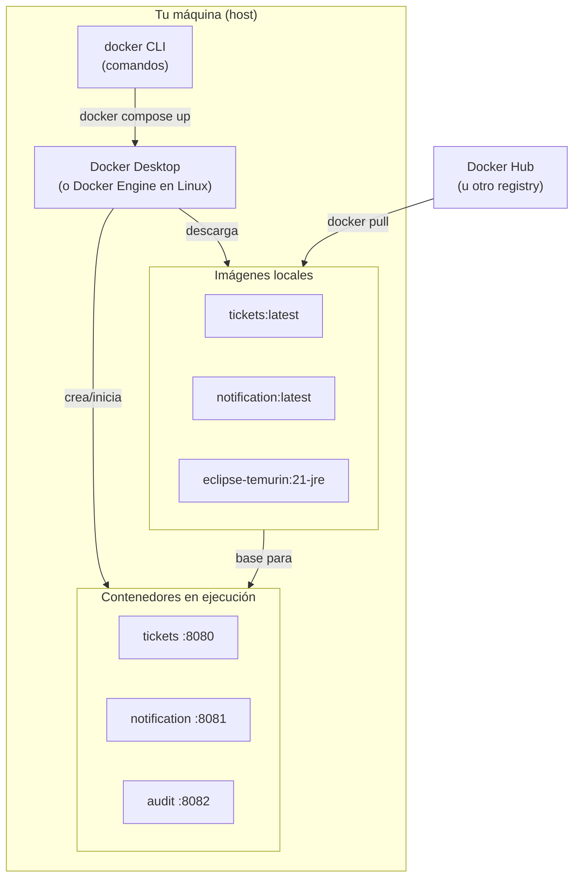

---

## Imagen vs Contenedor

La diferencia más importante, y la que más confunde al principio:

| Concepto | Analogía | Descripción |
|---|---|---|
| **Imagen** | Receta de cocina / Clase en Java | Plantilla estática. Define el sistema de archivos, los comandos, el punto de entrada. Solo lectura. |
| **Contenedor** | Plato cocinado / Instancia de objeto | Imagen en ejecución. Tiene su propio proceso, su propia red, su propio sistema de archivos temporal. |

Una misma imagen puede generar múltiples contenedores simultáneos. Por eso se puede escalar: `docker compose up --scale notification=3` crea 3 contenedores del mismo servicio.

---

## Imagen base

Toda imagen Docker se construye **a partir de otra imagen** — eso es la imagen base, la instrucción `FROM` del `Dockerfile`. Las imágenes forman una cadena jerárquica:

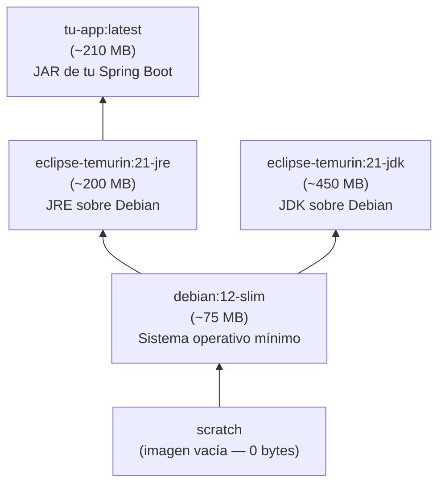

Cuando haces `FROM eclipse-temurin:21-jre`, tu imagen hereda todo el sistema de archivos de esa imagen: el sistema operativo (Debian), las librerías de sistema y el JRE completo. Solo agregas encima tu JAR.

### ¿Por qué `eclipse-temurin` y no `openjdk`?

Las imágenes `openjdk:*` en Docker Hub fueron **deprecadas oficialmente en 2022** y ya no reciben actualizaciones de seguridad. Siguieron existiendo en el registry pero sin mantenimiento.

**`eclipse-temurin`** es el sucesor oficial, mantenido por [Eclipse Adoptium](https://adoptium.net/) (fundación Eclipse). Razones para elegirlo:

| Aspecto | `openjdk` (deprecado) | `eclipse-temurin` (actual) |
|---|---|---|
| Mantenimiento | ❌ Abandonado desde 2022 | ✅ Actualizaciones regulares |
| Organización | Oracle / comunidad | Eclipse Foundation |
| Certificación TCK | ✅ | ✅ |
| Parches de seguridad | ❌ | ✅ |
| Distribución | OpenJDK builds | Adoptium Temurin builds |

> **Regla simple:** si en algún tutorial ves `FROM openjdk:17` o `FROM openjdk:21`, reemplázalo por `FROM eclipse-temurin:21-jre` (o `-jdk` si necesitas compilar).

### Alpine Linux — imágenes más pequeñas

Algunas imágenes tienen el sufijo `-alpine`, por ejemplo `eclipse-temurin:21-jre-alpine`. Alpine Linux es una distribución minimalista diseñada específicamente para contenedores:

| Característica | Debian (base regular) | Alpine Linux |
|---|---|---|
| Tamaño base | ~75 MB | ~5 MB |
| Librería C | `glibc` (GNU) | `musl libc` (alternativa liviana) |
| Package manager | `apt` | `apk` |
| Shell | `bash` | `sh` (BusyBox) |
| Imagen JRE resultante | ~200 MB | ~130 MB |

**¿Cuándo usar Alpine?**

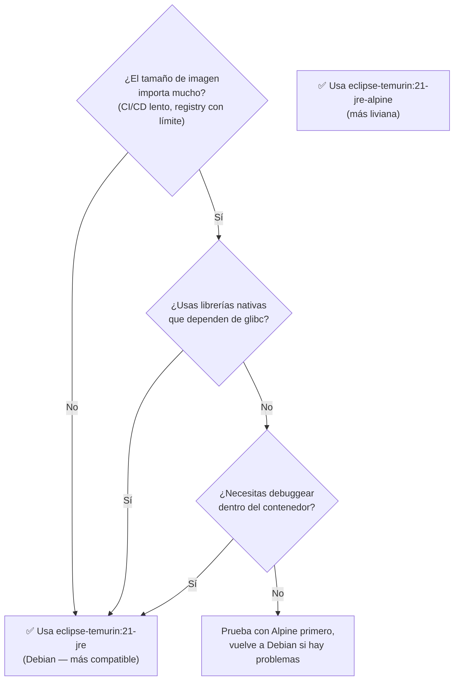

**Para esta asignatura:** usa `eclipse-temurin:21-jre` (Debian). Es más simple, más compatible y la diferencia de 70 MB no es relevante en un entorno de aprendizaje local.

**Alpine para producción/CI:** es una buena elección cuando las imágenes se suben a un registry y se despliegan frecuentemente. El ahorro de ~70 MB por servicio se multiplica con decenas de deployments.

---

## Las capas (layers)

Docker almacena las imágenes como **capas apiladas**. Cada instrucción en el `Dockerfile` genera una capa nueva.

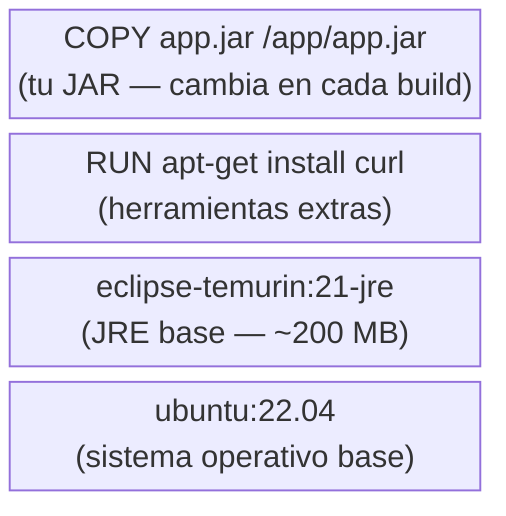

**¿Por qué importa?** Las capas se cachean. Si la instrucción no cambió ni cambiaron sus entradas, Docker reutiliza la capa guardada. Una capa invalidada invalida **todas las capas encima de ella**.

Por eso el orden en el `Dockerfile` importa: pon las instrucciones que menos cambian **primero** (dependencias de Maven) y las que cambian frecuentemente **al final** (el JAR de tu aplicación).

---

## Ciclo de vida de un contenedor

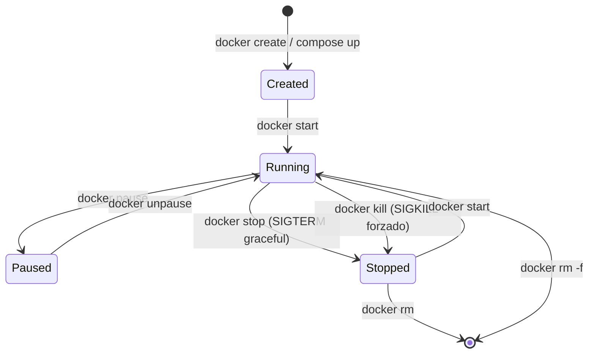

Con `docker compose`, `up` = create + start. `down` = stop + rm.

---

## Redes (networks)

Por defecto, Docker Compose crea una **red virtual privada** para todos los servicios del mismo `compose.yaml`. Dentro de esa red:

- Los servicios **se comunican por nombre de servicio**, no por `localhost`
- Cada contenedor tiene su propia dirección IP interna
- El host solo puede acceder a los **puertos publicados** (`ports:`)

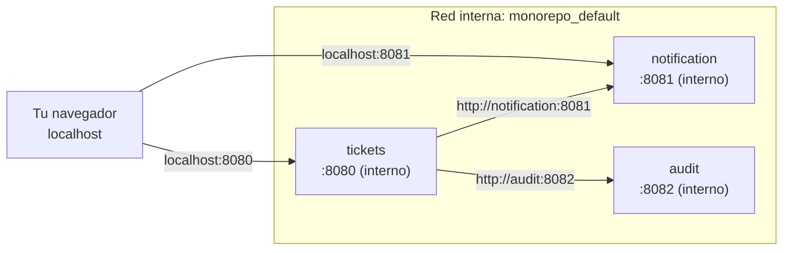

> **Importante para los microservicios:** si `tickets` necesita llamar a `notification`, la URL dentro de la red Docker es `http://notification:8081`, **no** `http://localhost:8081`. Esto significa que tu configuración de Spring (`application.yml`) debe cambiar si corres los servicios con Docker vs. de forma local.

Una forma limpia de manejarlo es con **profiles** de Spring Boot:

```yaml
# application.yml (local)
notification:
  url: http://localhost:8081

# application-docker.yml (dentro de contenedor)
notification:
  url: http://notification:8081
```

```yaml
# compose.yaml
services:
  tickets:
    build: ./Tickets
    environment:
      SPRING_PROFILES_ACTIVE: docker
```

---

## Volúmenes (volumes)

Los contenedores son **efímeros**: cuando se eliminan con `docker rm`, todo su sistema de archivos desaparece. Para **persistir datos** (una base de datos, logs, archivos subidos) se usan volúmenes.

```yaml
services:
  mysql:
    image: mysql:8
    volumes:
      - mysql_data:/var/lib/mysql   # ← datos persisten aunque el contenedor se borre

volumes:
  mysql_data:   # Docker crea y gestiona este volumen
```

Para los microservicios de esta asignatura (que usan almacenamiento en memoria) no son necesarios, pero son esenciales en cuanto se agrega una base de datos real.

---

## Registry: Docker Hub y alternativas

Las imágenes se distribuyen a través de **registries**. El más común es [Docker Hub](https://hub.docker.com/). Cuando haces:

```bash
FROM eclipse-temurin:21-jre
```

Docker descarga automáticamente esa imagen desde Docker Hub si no la tiene en caché local.

Alternativas empresariales:
- **GitHub Container Registry** (`ghcr.io`) — integrado con GitHub Actions
- **AWS ECR**, **Google Artifact Registry**, **Azure Container Registry**
- **Registry privado propio** — para entornos sin acceso a internet

---

## Resumen rápido de comandos de imágenes y contenedores

```bash
# Imágenes
docker images                        # lista imágenes locales
docker pull eclipse-temurin:21-jre   # descarga imagen sin crear contenedor
docker rmi nombre:tag                # elimina imagen local
docker image prune                   # elimina imágenes sin usar

# Contenedores individuales (sin Compose)
docker run -p 8080:8080 tickets:latest     # crea y arranca contenedor
docker run -d -p 8080:8080 tickets:latest  # en segundo plano (detached)
docker ps                                  # contenedores en ejecución
docker ps -a                               # todos (incluye detenidos)
docker stop <id_o_nombre>                  # detiene gracefully (SIGTERM)
docker rm <id_o_nombre>                    # elimina contenedor detenido
docker logs <id_o_nombre>                  # ver logs
docker logs -f <id_o_nombre>               # logs en tiempo real
docker exec -it <id_o_nombre> bash         # terminal dentro del contenedor
docker inspect <id_o_nombre>               # toda la info del contenedor (JSON)
```

---

## Siguiente paso

- [`02_dockerfile.md`](./02_dockerfile.md) — Dockerfile en profundidad para Spring Boot
- [`03_compose_avanzado.md`](./03_compose_avanzado.md) — compose.yaml avanzado: healthchecks, profiles, .env y más


<!-- START OF FILE: docs_extras_docker_02_dockerfile.md -->
# Documento: docs extras docker 02 dockerfile
---
# 02 — Dockerfile en profundidad para Spring Boot

> Material complementario para DSY1103. Docker no es parte del currículo oficial.

---

## Anatomía de un Dockerfile

Un `Dockerfile` es una lista de instrucciones que Docker ejecuta en orden para construir una imagen. Cada instrucción genera una capa nueva.

```dockerfile
# Instrucción  argumento(s)
FROM           eclipse-temurin:21-jre
WORKDIR        /app
COPY           target/app.jar app.jar
EXPOSE         8080
ENTRYPOINT     ["java", "-jar", "app.jar"]
```

### Instrucciones principales

| Instrucción | Uso | Ejemplo |
|---|---|---|
| `FROM` | Imagen base. Siempre primera (o después de `ARG`). | `FROM eclipse-temurin:21-jre` |
| `WORKDIR` | Crea y establece el directorio de trabajo | `WORKDIR /app` |
| `COPY` | Copia archivos del host a la imagen | `COPY target/*.jar app.jar` |
| `ADD` | Como COPY pero además extrae `.tar` y soporta URLs. Preferir COPY salvo que necesites esas funciones. | `ADD https://... /tmp/` |
| `RUN` | Ejecuta un comando durante el build (instalar paquetes, compilar). | `RUN ./mvnw package -DskipTests` |
| `ENV` | Variable de entorno disponible en build y en runtime | `ENV PORT=8080` |
| `ARG` | Variable de build (solo disponible durante `docker build`, no en runtime) | `ARG JAR_FILE=target/*.jar` |
| `EXPOSE` | Documenta el puerto que usa el contenedor (informativo, no lo publica automáticamente) | `EXPOSE 8080` |
| `ENTRYPOINT` | Comando principal del contenedor. No se sobreescribe fácilmente. | `ENTRYPOINT ["java", "-jar", "app.jar"]` |
| `CMD` | Argumentos por defecto para ENTRYPOINT, o comando por defecto si no hay ENTRYPOINT. Se puede sobreescribir en `docker run`. | `CMD ["--spring.profiles.active=prod"]` |
| `USER` | Cambia al usuario con el que se ejecutan las instrucciones siguientes | `USER appuser` |
| `VOLUME` | Declara un punto de montaje (informativo, como EXPOSE) | `VOLUME /tmp` |
| `LABEL` | Metadatos de la imagen | `LABEL maintainer="yo@duoc.cl"` |

---

## Build simple (una etapa)

El enfoque más rápido de entender: copias el JAR ya compilado y lo empaquetas.

```dockerfile
FROM eclipse-temurin:21-jre
WORKDIR /app
COPY target/mi-app.jar app.jar
EXPOSE 8080
ENTRYPOINT ["java", "-jar", "app.jar"]
```

**Flujo de trabajo:**
```bash
mvnw.cmd package -DskipTests       # genera target/mi-app.jar en el host
docker build -t mi-app .            # construye imagen usando el JAR ya generado
docker run -p 8080:8080 mi-app      # corre el contenedor
```

**Desventaja:** el JAR tiene que existir antes de llamar a `docker build`. Si tienes Maven instalado en el host no hay problema, pero si quieres que Docker compile solo (ej. en CI/CD), necesitas el build multi-stage.

---

## Build multi-stage (recomendado para producción)

Dos etapas en el mismo archivo: una con JDK para compilar, otra con JRE solo para ejecutar.

```dockerfile
# ─────────────────────────────────────────────
# Etapa 1: compilación
# ─────────────────────────────────────────────
FROM eclipse-temurin:21-jdk AS build
WORKDIR /app

# Primero copiar solo los archivos de dependencias (pom.xml + wrapper)
# para aprovechar el cache de capas: si el pom.xml no cambió,
# Docker reutiliza la capa de descarga de dependencias.
COPY .mvn/ .mvn/
COPY mvnw pom.xml ./
RUN ./mvnw dependency:go-offline -q   # descarga dependencias y las cachea

# Ahora sí copiar el código fuente
COPY src/ src/
RUN ./mvnw package -DskipTests --no-transfer-progress

# ─────────────────────────────────────────────
# Etapa 2: imagen final (solo lo necesario)
# ─────────────────────────────────────────────
FROM eclipse-temurin:21-jre
WORKDIR /app

# Copiar solo el JAR del paso de compilación
COPY --from=build /app/target/*.jar app.jar

# Opcional pero recomendado: no correr como root
RUN addgroup --system appgroup && adduser --system --ingroup appgroup appuser
USER appuser

EXPOSE 8080
ENTRYPOINT ["java", "-jar", "app.jar"]
```

### Por qué separar `COPY pom.xml` del `COPY src/`

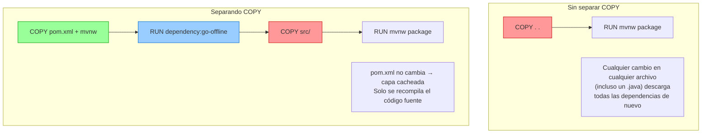

---

## .dockerignore

Al igual que `.gitignore`, este archivo le dice a Docker qué ignorar al enviar el contexto de build. Sin él, Docker envía toda la carpeta (incluyendo `target/` que puede pesar cientos de MB).

```
# .dockerignore (en la raíz del proyecto Spring Boot)

# Compilados de Maven
target/

# Archivos de IDE
.idea/
*.iml
.vscode/
*.class

# Git
.git/
.gitignore

# Logs
*.log
logs/

# Archivos de SO
.DS_Store
Thumbs.db
```

> **Regla práctica:** si usas build multi-stage, ignora `target/` porque Docker va a compilar desde el código fuente. Si usas build simple (copias el JAR), **no** ignores `target/`.

---

## Variantes de imagen base

> Para entender **por qué se elige `eclipse-temurin`** sobre `openjdk` y qué es Alpine, ver [`01_conceptos_basicos.md` — Imagen base](./01_conceptos_basicos.md#imagen-base).

### JDK vs JRE — qué incluye cada uno

| Componente | JRE | JDK |
|---|---|---|
| Máquina virtual Java (JVM) | ✅ | ✅ |
| Librerías de runtime (`rt.jar`, módulos) | ✅ | ✅ |
| Compilador `javac` | ❌ | ✅ |
| Herramientas de desarrollo (`jdb`, `jmap`, `jstack`) | ❌ | ✅ |
| Maven, Gradle | ❌ | ❌ (van aparte) |
| **Uso en Docker** | Imagen final | Solo etapa de build |

El JRE es suficiente para **ejecutar** un JAR ya compilado. El JDK es necesario para **compilarlo**. Por eso el multi-stage build usa JDK en etapa 1 y JRE en etapa 2.

### Comparativa de imágenes disponibles

| Imagen | Base OS | Tamaño aprox. | Uso recomendado |
|---|---|---|---|
| `eclipse-temurin:21-jdk` | Debian 12 | ~450 MB | Etapa de build (multi-stage) |
| `eclipse-temurin:21-jre` | Debian 12 | ~200 MB | ✅ **Imagen final** — recomendado para aprendizaje |
| `eclipse-temurin:21-jdk-alpine` | Alpine 3 | ~350 MB | Etapa de build cuando el tamaño importa |
| `eclipse-temurin:21-jre-alpine` | Alpine 3 | ~130 MB | Imagen final liviana (producción/CI) |

**Para esta asignatura:** usa `eclipse-temurin:21-jre`. Es la opción más simple y compatible.

**Alpine en producción:** reduce ~70 MB por imagen. Relevante cuando hay decenas de deployments en CI/CD o límites de tamaño en el registry. Puede tener problemas de compatibilidad con librerías nativas que asumen `glibc` (la librería C de GNU, que usa Debian pero no Alpine).

### Ejemplo: cambiar a Alpine sin tocar el resto del Dockerfile

```dockerfile
# Solo cambia esta línea en la etapa 2:
FROM eclipse-temurin:21-jre-alpine   # en lugar de eclipse-temurin:21-jre

# El resto del Dockerfile es idéntico
WORKDIR /app
COPY --from=build /app/target/*.jar app.jar
EXPOSE 8080
ENTRYPOINT ["java", "-jar", "app.jar"]
```

> Si hay problemas con Alpine (errores de librería nativa, herramientas de debug ausentes), vuelve a `eclipse-temurin:21-jre` y el problema desaparece — todo lo demás del Dockerfile permanece igual.

---

## Pasar variables de configuración al contenedor

Spring Boot lee variables de entorno y las mapea a propiedades. Por ejemplo, `SPRING_DATASOURCE_URL` sobreescribe `spring.datasource.url` en `application.yml`.

### En Dockerfile (valor fijo, para defaults)
```dockerfile
ENV SERVER_PORT=8080
ENV SPRING_PROFILES_ACTIVE=production
```

### En compose.yaml (valor configurable por entorno)
```yaml
services:
  tickets:
    build: ./Tickets
    environment:
      SERVER_PORT: "8080"
      SPRING_PROFILES_ACTIVE: docker
      JAVA_TOOL_OPTIONS: "-Xmx128m -Xms64m"
```

### Con archivo .env (buena práctica — no commitear el .env con datos reales)
```bash
# .env (en la misma carpeta que compose.yaml)
TICKETS_PORT=8080
DB_PASSWORD=secreto123
```

```yaml
# compose.yaml
services:
  tickets:
    ports: ["${TICKETS_PORT}:8080"]
    environment:
      DB_PASSWORD: ${DB_PASSWORD}
```

---

## CMD vs ENTRYPOINT — la diferencia práctica

```dockerfile
# Solo ENTRYPOINT: el contenedor siempre corre exactamente esto
ENTRYPOINT ["java", "-jar", "app.jar"]

# Solo CMD: se puede sobreescribir con el comando en docker run
CMD ["java", "-jar", "app.jar"]

# Combinados: ENTRYPOINT fijo, CMD como argumentos por defecto
ENTRYPOINT ["java", "-jar", "app.jar"]
CMD ["--spring.profiles.active=default"]
```

Sobreescribir `CMD` en runtime:
```bash
# Usa el ENTRYPOINT del Dockerfile pero con otro perfil de Spring
docker run mi-app --spring.profiles.active=production
```

---

## Dockerfile para los microservicios de esta asignatura

Como todos los microservicios (`NotificationService`, `AuditService`, `SearchService`, `SLAService`) tienen la misma estructura, el mismo `Dockerfile` aplica a todos sin cambios:

```dockerfile
# Dockerfile (copiar igual en cada servicio)
FROM eclipse-temurin:21-jdk AS build
WORKDIR /app
COPY .mvn/ .mvn/
COPY mvnw pom.xml ./
RUN chmod +x mvnw && ./mvnw dependency:go-offline -q
COPY src/ src/
RUN ./mvnw package -DskipTests --no-transfer-progress

FROM eclipse-temurin:21-jre
WORKDIR /app
COPY --from=build /app/target/*.jar app.jar
EXPOSE 8080
ENTRYPOINT ["java", "-jar", "app.jar"]
```

> En Windows el `mvnw` puede tener problemas de permisos de ejecución. El `RUN chmod +x mvnw` lo soluciona dentro del contenedor Linux.

---

## Verificar la imagen construida

```bash
docker build -t tickets-test .
docker images tickets-test              # ver tamaño
docker history tickets-test             # ver las capas y sus tamaños
docker run --rm -p 8080:8080 tickets-test   # correr y eliminar al detener (--rm)
```

---

## Siguiente paso

- [`03_compose_avanzado.md`](./03_compose_avanzado.md) — compose.yaml avanzado: healthchecks, profiles, .env, watch y más


<!-- START OF FILE: docs_extras_docker_03_compose_avanzado.md -->
# Documento: docs extras docker 03 compose avanzado
---
# 03 — compose.yaml avanzado

> Material complementario para DSY1103. Docker no es parte del currículo oficial.

---

## Estructura completa de un servicio en compose.yaml

```yaml
services:
  nombre-servicio:
    build:
      context: ./MiServicio          # directorio con el Dockerfile
      dockerfile: Dockerfile          # nombre del Dockerfile (por defecto "Dockerfile")
      args:
        BUILD_ENV: production          # ARGs disponibles durante docker build
    image: mi-org/mi-servicio:latest  # nombre de la imagen resultante
    container_name: mi-servicio        # nombre fijo del contenedor (no recomendado si escalas)
    ports:
      - "8080:8080"                    # "puerto_host:puerto_contenedor"
    environment:
      SPRING_PROFILES_ACTIVE: docker
      JAVA_TOOL_OPTIONS: "-Xmx128m"
    env_file:
      - .env                           # cargar variables desde archivo
    volumes:
      - ./logs:/app/logs               # montar carpeta del host
      - datos_volume:/var/lib/data     # volumen gestionado por Docker
    depends_on:
      mysql:
        condition: service_healthy     # espera hasta que mysql esté healthy
    healthcheck:
      test: ["CMD", "curl", "-f", "http://localhost:8080/actuator/health"]
      interval: 10s
      timeout: 5s
      retries: 5
      start_period: 30s                # esperar 30s antes de empezar a chequear
    restart: unless-stopped            # reiniciar si el proceso falla
    networks:
      - red-interna
    profiles:
      - full                           # solo se levanta si se activa el perfil "full"
```

No todos los campos son necesarios. El siguiente es el mínimo para los microservicios de la asignatura:

```yaml
services:
  tickets:
    build: ./Tickets
    ports: ["8080:8080"]
    environment:
      JAVA_TOOL_OPTIONS: "-Xmx128m"
```

---

## depends_on y healthchecks

`depends_on` solo garantiza el **orden de inicio**, no que el servicio esté listo para recibir peticiones. Con `condition: service_healthy` espera a que el contenedor declare `healthy`.

```yaml
services:
  mysql:
    image: mysql:8
    environment:
      MYSQL_ROOT_PASSWORD: root
      MYSQL_DATABASE: ticketdb
    healthcheck:
      test: ["CMD", "mysqladmin", "ping", "-h", "localhost", "-uroot", "-proot"]
      interval: 5s
      timeout: 3s
      retries: 10
      start_period: 20s

  tickets:
    build: ./Tickets
    ports: ["8080:8080"]
    depends_on:
      mysql:
        condition: service_healthy    # tickets no arranca hasta que mysql esté healthy
    environment:
      SPRING_DATASOURCE_URL: jdbc:mysql://mysql:3306/ticketdb
      SPRING_DATASOURCE_USERNAME: root
      SPRING_DATASOURCE_PASSWORD: root
```

> `condition: service_healthy` requiere Compose V2. Con V1 (`docker-compose`) no funciona.

Para Spring Boot sin MySQL (servicios en memoria como los de esta asignatura) no se necesita `depends_on`. Es útil solo cuando un servicio depende de otro que tarda en iniciar.

---

## Variables de entorno y .env

### Tres formas de pasar variables

```yaml
services:
  tickets:
    environment:
      # 1. Valor literal
      SERVER_PORT: "8080"

      # 2. Desde variable de entorno del host (si existe, si no, error)
      DB_PASSWORD: ${DB_PASSWORD}

      # 3. Con valor por defecto
      SPRING_PROFILES_ACTIVE: ${PROFILE:-docker}
```

### Archivo .env (forma recomendada para datos sensibles)

Docker Compose carga automáticamente el archivo `.env` del mismo directorio que `compose.yaml`:

```bash
# .env  (NO commitear si tiene contraseñas reales)
TICKETS_PORT=8080
NOTIFICATION_PORT=8081
DB_PASSWORD=mi_contraseña_local
```

```yaml
# compose.yaml
services:
  tickets:
    ports: ["${TICKETS_PORT}:8080"]
    environment:
      DB_PASSWORD: ${DB_PASSWORD}
```

> Agrega `.env` a `.gitignore`. Puedes commitear un `.env.example` con valores ficticios como referencia para otros desarrolladores.

---

## Redes personalizadas

Por defecto Compose crea una red automática. Para más control:

```yaml
services:
  tickets:
    networks: [backend, frontend]

  mysql:
    networks: [backend]          # mysql NO es accesible desde frontend

  nginx:
    networks: [frontend]         # nginx solo ve a tickets (por frontend)

networks:
  backend:
  frontend:
```

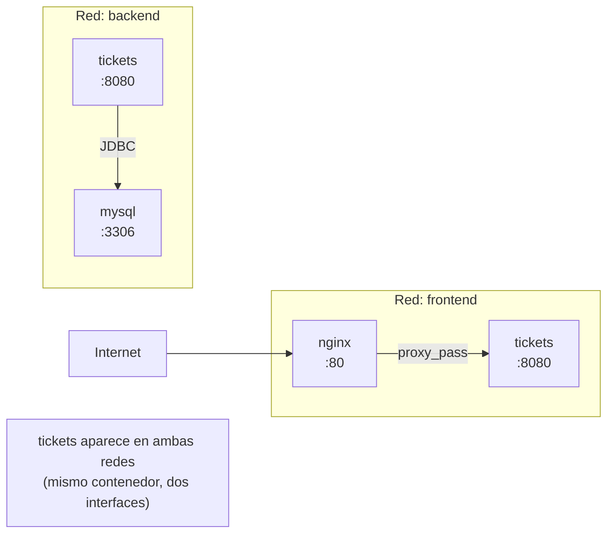

Para la asignatura, la red por defecto es suficiente.

---

## Volúmenes

```yaml
services:
  mysql:
    image: mysql:8
    volumes:
      - mysql_data:/var/lib/mysql     # volumen named (persistente entre down/up)
      - ./init.sql:/docker-entrypoint-initdb.d/init.sql  # bind mount (archivo del host)

  tickets:
    volumes:
      - ./logs:/app/logs              # bind mount: carpeta local → dentro del contenedor

volumes:
  mysql_data:    # Docker gestiona dónde guardar esto en el host
```

### Tipos de montaje

| Tipo | Sintaxis | Descripción |
|---|---|---|
| **Named volume** | `vol_name:/ruta` | Docker gestiona la ubicación. Persiste entre `down/up`. |
| **Bind mount** | `./local:/ruta` | Carpeta real del host. Útil para logs, archivos de config. |
| **tmpfs** | (en la clave `tmpfs:`) | Solo en memoria, se borra al parar el contenedor. |

---

## Profiles: levantar subconjuntos de servicios

Con muchos servicios, no siempre quieres levantar todo. Los profiles permiten agrupar:

```yaml
services:
  tickets:
    build: ./Tickets
    ports: ["8080:8080"]
    # sin profile → siempre se levanta

  notification:
    build: ./NotificationService
    ports: ["8081:8081"]
    profiles: [notificaciones]     # solo si se activa el perfil

  audit:
    build: ./AuditService
    ports: ["8082:8082"]
    profiles: [auditoría]

  search:
    build: ./SearchService
    ports: ["8084:8084"]
    profiles: [búsqueda]

  sla:
    build: ./SLAService
    ports: ["8085:8085"]
    profiles: [sla]
```

```bash
docker compose up                                   # solo tickets
docker compose --profile notificaciones up          # tickets + notification
docker compose --profile notificaciones --profile sla up  # tickets + notification + sla
COMPOSE_PROFILES=notificaciones,sla docker compose up     # misma cosa, via variable
```

---

## compose.yaml completo para la asignatura

Este archivo cubre los 5 servicios actuales del proyecto. Guárdalo en la raíz del monorepo:

```yaml
# compose.yaml — DSY1103 Fullstack I
# Requisito: cada carpeta listada en "build:" debe tener un Dockerfile

services:
  tickets:
    build: ./Tickets
    ports: ["8080:8080"]
    environment:
      JAVA_TOOL_OPTIONS: "-Xmx128m -Xms64m"
    healthcheck:
      test: ["CMD-SHELL", "curl -sf http://localhost:8080/ticket-app/tickets || exit 1"]
      interval: 15s
      timeout: 5s
      retries: 5
      start_period: 40s
    restart: on-failure

  notification:
    build: ./NotificationService
    ports: ["8081:8081"]
    environment:
      JAVA_TOOL_OPTIONS: "-Xmx64m -Xms32m"
    restart: on-failure

  audit:
    build: ./AuditService
    ports: ["8082:8082"]
    environment:
      JAVA_TOOL_OPTIONS: "-Xmx64m -Xms32m"
    restart: on-failure

  search:
    build: ./SearchService
    ports: ["8084:8084"]
    environment:
      JAVA_TOOL_OPTIONS: "-Xmx64m -Xms32m"
    restart: on-failure

  sla:
    build: ./SLAService
    ports: ["8085:8085"]
    environment:
      JAVA_TOOL_OPTIONS: "-Xmx64m -Xms32m"
    restart: on-failure
```

Uso:
```bash
docker compose up --build    # primera vez: compila e inicia
docker compose up -d         # en background (detached)
docker compose down          # detiene y elimina contenedores
docker compose ps            # estado de todos los servicios
docker compose logs -f tickets   # logs en tiempo real de tickets
```

---

## Restart policies

| Política | Comportamiento |
|---|---|
| `no` (default) | No reinicia nunca |
| `on-failure` | Reinicia si el proceso termina con error (código ≠ 0) |
| `always` | Siempre reinicia, incluso si se detuvo manualmente |
| `unless-stopped` | Igual que `always` pero no reinicia si se detuvo con `docker stop` |

Para desarrollo: `on-failure` o sin `restart`. Para producción: `unless-stopped`.

---

## docker compose watch (hot-reload, V2 only)

Compose V2 incluye un modo de desarrollo que observa cambios en el código fuente y reconstruye/sincroniza automáticamente:

```yaml
services:
  tickets:
    build: ./Tickets
    develop:
      watch:
        - action: rebuild              # reconstruye imagen completa
          path: ./Tickets/src
        - action: sync                 # sincroniza archivos sin reconstruir
          path: ./Tickets/src/main/resources
          target: /app/resources
        - action: rebuild
          path: ./Tickets/pom.xml
```

```bash
docker compose watch    # activa el modo watch
```

> Para Spring Boot, el ciclo rebuild puede tardar 30-60 segundos. Es más práctico usar `spring-boot-devtools` con ejecución local (`mvnw spring-boot:run`) para hot-reload rápido.

---

## Comandos de referencia completos

```bash
# Construcción
docker compose build                 # construye todas las imágenes
docker compose build tickets         # construye solo una
docker compose build --no-cache      # construye sin usar caché

# Ciclo de vida
docker compose up                    # crea y arranca
docker compose up -d                 # en background
docker compose up --build            # construye y arranca
docker compose up --build tickets    # solo un servicio
docker compose start                 # arranca contenedores ya creados
docker compose stop                  # detiene sin eliminar contenedores
docker compose down                  # detiene y elimina contenedores
docker compose down -v               # también elimina volúmenes
docker compose down --rmi all        # también elimina imágenes

# Estado y logs
docker compose ps                    # estado de todos
docker compose ps tickets            # estado de uno
docker compose logs                  # todos los logs
docker compose logs -f               # en tiempo real
docker compose logs -f --tail=50 tickets  # últimas 50 líneas de uno

# Ejecución dentro de contenedor
docker compose exec tickets bash         # terminal dentro del contenedor
docker compose exec tickets sh           # si no tiene bash (Alpine)
docker compose run --rm tickets bash     # nuevo contenedor temporal

# Escalado
docker compose up --scale notification=3  # 3 instancias de notification

# Limpieza
docker compose down -v --rmi all          # limpieza completa
```


<!-- START OF FILE: docs_extras_docker_README.md -->
# Documento: docs extras docker README
---
# 🐳 Docker y Docker Compose

> **Nota:** Docker no es parte de la asignatura DSY1103. Este material es complementario para quienes quieran profundizar en la contenerización de aplicaciones Spring Boot.

---

## Contenido

| Archivo | Descripción |
|---|---|
| **README.md** (este archivo) | Resumen orientativo: V1 vs V2, Dockerfile mínimo, compose.yaml básico |
| [`01_conceptos_basicos.md`](./01_conceptos_basicos.md) | Imágenes, capas, contenedores, redes, volúmenes — con diagramas |
| [`02_dockerfile.md`](./02_dockerfile.md) | Todas las instrucciones Dockerfile, multi-stage, `.dockerignore`, variantes de imagen base |
| [`03_compose_avanzado.md`](./03_compose_avanzado.md) | `depends_on`+healthchecks, profiles, `.env`, redes personalizadas, watch, referencia completa de comandos |

---

## ¿Qué es Docker?

**Docker** es una plataforma de **contenerización**: empaqueta una aplicación junto con todas sus dependencias (JDK, librerías, configuración) en una imagen portable que puede ejecutarse en cualquier máquina con Docker instalado, independientemente del sistema operativo.

Un **contenedor** es una instancia en ejecución de una imagen. Es similar a una máquina virtual pero mucho más liviano, porque comparte el kernel del sistema operativo en lugar de virtualizarlo completo.

---

## Docker Compose V1 vs V2 — lo nuevo y lo viejo

Este es uno de los puntos que más confusión genera porque ambas versiones coexisten y se parecen, pero hay diferencias importantes.

### El comando: `docker compose` vs `docker-compose`

| | V1 (legacy) | V2 (actual) |
|---|---|---|
| **Comando** | `docker-compose` (guión) | `docker compose` (espacio) |
| **Tipo** | Herramienta Python independiente | Plugin integrado en el CLI de Docker |
| **Instalación** | `pip install docker-compose` o paquete separado | Incluido en Docker Desktop y Docker Engine moderno |
| **Estado** | ⚠️ Deprecado desde 2023 | ✅ Estándar actual |
| **Retro-compatibilidad** | — | Lee archivos `docker-compose.yml` del V1 |

> `docker-compose` (con guión) puede seguir funcionando si está instalado por separado en el sistema, pero no viene incluido en las versiones modernas de Docker Desktop. **Usa siempre `docker compose` (con espacio).**

### El archivo: `compose.yaml` vs `docker-compose.yml`

Docker Compose busca el archivo de configuración en este orden de prioridad:

1. `compose.yaml` ← **preferido** (estándar actual)
2. `compose.yml`
3. `docker-compose.yaml` ← retro-compatibilidad
4. `docker-compose.yml` ← retro-compatibilidad (V1 legacy)

> **Usa `compose.yaml`** en proyectos nuevos. Los archivos `docker-compose.yml` siguen funcionando, pero son el estilo antiguo.

### ¿Qué es retro-compatible y qué no?

| Feature | V1 `docker-compose` | V2 `docker compose` |
|---------|---------------------|---------------------|
| Leer `docker-compose.yml` | ✅ | ✅ |
| Leer `compose.yaml` | ❌ | ✅ |
| `depends_on` con `condition: service_healthy` | ❌ | ✅ |
| `docker compose watch` (hot-reload) | ❌ | ✅ |
| `--wait` (esperar a que estén listos) | ❌ | ✅ |
| Sintaxis básica de servicios/ports/environment | ✅ | ✅ |

---

## Requisito: Dockerfile en cada servicio

Docker Compose necesita saber **cómo construir la imagen** de cada servicio. Eso se define en un archivo `Dockerfile` en la raíz de cada proyecto Spring Boot. Sin él, `docker compose up --build` fallará.

### Dockerfile mínimo para Spring Boot (multi-stage)

```dockerfile
# Etapa 1: construir el JAR con Maven
FROM eclipse-temurin:21-jdk AS build
WORKDIR /app
COPY .. .
RUN ./mvnw package -DskipTests --no-transfer-progress

# Etapa 2: imagen final liviana (solo JRE, sin herramientas de build)
FROM eclipse-temurin:21-jre
WORKDIR /app
COPY --from=build /app/target/*.jar app.jar
ENTRYPOINT ["java", "-jar", "app.jar"]
```

**¿Por qué dos etapas?** La primera incluye JDK + Maven (~600 MB). La segunda solo necesita el JRE (~200 MB) para ejecutar el JAR compilado. El resultado final es una imagen más pequeña.

> Spring Boot también puede generar la imagen automáticamente con:
> ```bash
> mvnw.cmd spring-boot:build-image
> ```
> Pero requiere Docker instalado y corriendo, y tarda más la primera vez.

---

## compose.yaml básico

```yaml
# compose.yaml (en la raíz del monorepo)
#
# Diferencias con el estilo antiguo (docker-compose.yml):
#   - El campo "version:" ya NO es necesario en Compose V2
#   - El archivo se llama "compose.yaml" (no "docker-compose.yml")
#   - El comando es "docker compose" (espacio), no "docker-compose" (guión)

services:
  tickets:
    build: ./Tickets          # ← busca Dockerfile en ./Tickets/
    ports:
      - "8080:8080"           # "puerto_host:puerto_contenedor"
    environment:
      # JAVA_TOOL_OPTIONS es la variable estándar de la JVM.
      # -Xmx limita la RAM máxima del heap. -Xms es el tamaño inicial.
      # Sin esto, la JVM puede reclamar toda la RAM del host.
      JAVA_TOOL_OPTIONS: "-Xmx128m -Xms64m"

  notification:
    build: ./NotificationService
    ports:
      - "8081:8081"
    environment:
      JAVA_TOOL_OPTIONS: "-Xmx64m -Xms32m"

  audit:
    build: ./AuditService
    ports:
      - "8082:8082"
    environment:
      JAVA_TOOL_OPTIONS: "-Xmx64m -Xms32m"

  search:
    build: ./SearchService
    ports:
      - "8084:8084"
    environment:
      JAVA_TOOL_OPTIONS: "-Xmx64m -Xms32m"

  sla:
    build: ./SLAService
    ports:
      - "8085:8085"
    environment:
      JAVA_TOOL_OPTIONS: "-Xmx64m -Xms32m"
```

> **`JAVA_TOOL_OPTIONS` vs `JAVA_OPTS`**: `JAVA_TOOL_OPTIONS` es la variable estándar reconocida directamente por la JVM (definida en la especificación Java). `JAVA_OPTS` es una convención histórica de scripts de arranque (como los de Tomcat) — no es estándar y puede no funcionar dentro de un contenedor si el script de inicio no la reenvía explícitamente.

> **¿Por qué los servicios pequeños usan 64m?** Spring Boot con almacenamiento en memoria consume alrededor de 50-80 MB de heap en reposo. Sin límite, la JVM reserva por defecto 25% de la RAM del sistema, lo que en una máquina con 16 GB significaría 4 GB por servicio.

### Comandos principales (V2)

```bash
# Primera vez: construye las imágenes Y levanta los contenedores
docker compose up --build

# Veces siguientes (si el código no cambió): levanta las imágenes ya construidas
docker compose up

# En background (no bloquea la terminal)
docker compose up -d

# Detener todos los contenedores (los datos en volúmenes se conservan)
docker compose down

# Detener Y eliminar imágenes también
docker compose down --rmi all

# Levantar solo un servicio específico (y sus dependencias declaradas)
docker compose up tickets

# Ver logs en tiempo real de todos los servicios
docker compose logs -f

# Ver logs de un servicio específico (últimas 100 líneas + seguimiento)
docker compose logs -f --tail=100 tickets

# Ver estado de los contenedores
docker compose ps
```

---

## Comparativa: sin Docker vs con Docker

| | Sin Docker | Con Docker |
|---|---|---|
| **Instalación en PC** | Java + Maven | Solo Docker Desktop |
| **Arrancar todo** | Script batch + múltiples terminales | `docker compose up` |
| **Reproducibilidad** | Depende del entorno local | Igual en cualquier máquina |
| **Curva de aprendizaje** | Baja | Media |
| **Uso en producción** | No recomendado | Sí |

---

## Recursos para aprender más

- [Docker Compose — Documentación oficial](https://docs.docker.com/compose/)
- [Migración de V1 a V2](https://docs.docker.com/compose/migrate/)
- [Spring Boot con Docker — Guía oficial](https://spring.io/guides/gs/spring-boot-docker/)
- [Especificación Compose (archivo compose.yaml)](https://docs.docker.com/compose/compose-file/)


<!-- START OF FILE: docs_extras_ejercicios_01_validador_acceso.md -->
# Documento: docs extras ejercicios 01 validador acceso
---
# Ejercicio 01 — Validador de acceso al sistema

> **Nivel:** ⭐ Básico  
> **Conceptos:** Lógica proposicional · Operadores `&&`, `||`, `!` · `if/else` · Variables booleanas  
> **Tiempo estimado:** 20–30 min

---

## 🏢 Contexto

Trabajas como desarrollador junior en una empresa de software. El equipo de seguridad te pide implementar la **lógica de validación de acceso** al sistema interno. El sistema debe decidir si un usuario puede ingresar o no, basándose en tres condiciones simples.

---

## 📋 Enunciado

Crea un programa Java que valide si un usuario puede acceder al sistema según las siguientes reglas de negocio:

**Proposiciones:**
- **p:** El usuario tiene cuenta activa (`cuentaActiva = true/false`)
- **q:** La contraseña ingresada es correcta (`passwordCorrecto = true/false`)
- **r:** El usuario no tiene sesión activa en otro dispositivo (`sinSesionActiva = true/false`)

**Regla de acceso:**
> Un usuario puede acceder **si y solo si** tiene cuenta activa **Y** la contraseña es correcta **Y** no tiene sesión activa en otro dispositivo.
>
> Fórmula lógica: `acceso = p ∧ q ∧ r`

**Regla de bloqueo:**
> El sistema bloquea la cuenta **si** el usuario no tiene cuenta activa **O** ha intentado ingresar más de 3 veces con contraseña incorrecta.
>
> Fórmula lógica: `bloqueada = ¬p ∨ (intentos > 3)`

El programa debe imprimir un **mensaje descriptivo** indicando por qué se permite o deniega el acceso.

---

## 🚫 Restricciones

- No uses librerías externas; solo Java puro.
- Declara cada proposición como variable `boolean` con nombre descriptivo.
- Usa al menos un operador `!` (negación), uno `&&` (conjunción) y uno `||` (disyunción).
- El mensaje de salida debe ser **exactamente** como se muestra en los ejemplos.
- No uses `Scanner`; define los valores directamente en el código (como si vinieran de una base de datos).
- El método `main` debe delegar la lógica a **al menos un método separado** llamado `verificarAcceso`.

---

## 📥 Ejemplos de entrada

> Los valores se definen directamente como variables en el código.

### Caso 1 — Acceso permitido
```
cuentaActiva    = true
passwordCorrecto = true
sinSesionActiva  = true
intentos        = 1
```

### Caso 2 — Contraseña incorrecta
```
cuentaActiva    = true
passwordCorrecto = false
sinSesionActiva  = true
intentos        = 2
```

### Caso 3 — Sesión activa en otro dispositivo
```
cuentaActiva    = true
passwordCorrecto = true
sinSesionActiva  = false
intentos        = 0
```

### Caso 4 — Cuenta bloqueada por intentos
```
cuentaActiva    = true
passwordCorrecto = false
sinSesionActiva  = true
intentos        = 4
```

### Caso 5 — Cuenta desactivada
```
cuentaActiva    = false
passwordCorrecto = true
sinSesionActiva  = true
intentos        = 0
```

---

## 📤 Salidas esperadas

### Caso 1
```
✅ Acceso permitido. Bienvenido al sistema.
```

### Caso 2
```
❌ Acceso denegado: contraseña incorrecta.
```

### Caso 3
```
❌ Acceso denegado: ya tienes una sesión activa en otro dispositivo.
```

### Caso 4
```
🔒 Cuenta bloqueada: demasiados intentos fallidos. Contacta al administrador.
```

### Caso 5
```
🔒 Cuenta bloqueada: tu cuenta está desactivada. Contacta al administrador.
```

---

## 💡 Pistas

<details>
<summary>Pista 1 — Estructura del método</summary>

```java
static String verificarAcceso(boolean cuentaActiva, boolean passwordCorrecto,
                               boolean sinSesionActiva, int intentos) {
    // primero verifica si la cuenta está bloqueada
    // luego evalúa p ∧ q ∧ r
    // finalmente determina el motivo de rechazo
}
```
</details>

<details>
<summary>Pista 2 — Orden de evaluación</summary>

Evalúa primero las condiciones de bloqueo (tienen prioridad sobre el intento de acceso), luego las condiciones de acceso, y finalmente devuelve el motivo específico de rechazo.
</details>

---

## 🧠 Reflexión final

Una vez que tu programa funcione, responde:

1. ¿Qué operador lógico representa `¬` en Java?
2. ¿Por qué es importante evaluar primero el bloqueo antes que el acceso?
3. Si quisieras que el acceso fuera válido **incluso** sin contraseña cuando la cuenta tiene un token especial, ¿cómo cambiaría la fórmula lógica?

---

*[← Volver al índice](./README.md) · [Siguiente ejercicio →](./02_calculadora_descuentos.md)*


<!-- START OF FILE: docs_extras_ejercicios_02_calculadora_descuentos.md -->
# Documento: docs extras ejercicios 02 calculadora descuentos
---
# Ejercicio 02 — Calculadora de descuentos en tienda

> **Nivel:** ⭐ Básico  
> **Conceptos:** Variables · Tipos de datos · Operadores aritméticos · `if/else if/else` · Lógica proposicional (conjunción y disyunción)  
> **Tiempo estimado:** 25–35 min

---

## 🏪 Contexto

Trabajas para una cadena de retail llamada **TechStore**. El área de marketing lanzó una campaña de descuentos por temporada de rebajas. Tu tarea es implementar la **calculadora de precio final** que aplicará los descuentos según las reglas del negocio.

---

## 📋 Enunciado

Crea una clase `CalculadoraDescuentos` con un método `calcularPrecioFinal` que reciba:

- `precioOriginal` (`double`): precio base del producto.
- `esClienteVip` (`boolean`): indica si el cliente pertenece al programa de fidelidad.
- `esDiaDeRebajas` (`boolean`): indica si hoy es día de rebajas (aplica descuento adicional).
- `cantidadProductos` (`int`): cantidad de unidades compradas.

**Reglas de descuento (aplicar en orden):**

| Condición | Descuento |
|-----------|-----------|
| Cliente VIP **Y** día de rebajas | 30% |
| Solo cliente VIP | 20% |
| Solo día de rebajas | 15% |
| Ninguna de las anteriores | 0% |

**Descuento adicional por volumen (se suma al anterior):**

| Cantidad | Descuento adicional |
|----------|---------------------|
| 10 o más unidades | +10% |
| 5–9 unidades | +5% |
| Menos de 5 | 0% |

> ⚠️ El descuento total **no puede superar el 40%** del precio original.

El programa debe imprimir:
- Precio original
- Descuento aplicado (en %)
- Precio final por unidad
- Total a pagar (precio final × cantidad)

---

## 🚫 Restricciones

- Usa `double` para los precios y `int` para la cantidad.
- No uses librerías externas; solo Java puro.
- Aplica la lógica proposicional explícitamente: declara las proposiciones como variables `boolean`.
- El descuento máximo es 40%; si la suma supera ese valor, se aplica exactamente 40%.
- Redondea el precio final a 2 decimales usando `Math.round`.
- La clase debe tener el método `calcularPrecioFinal` que **retorne** el precio final (`double`), y un método `imprimirResumen` que muestre el desglose.

---

## 📥 Ejemplos de entrada

### Caso 1 — Cliente VIP en día de rebajas, compra 12 unidades
```
precioOriginal    = 50000.0
esClienteVip      = true
esDiaDeRebajas    = true
cantidadProductos = 12
```

### Caso 2 — Cliente normal en día de rebajas, compra 3 unidades
```
precioOriginal    = 25000.0
esClienteVip      = false
esDiaDeRebajas    = true
cantidadProductos = 3
```

### Caso 3 — Cliente VIP, día normal, compra 7 unidades
```
precioOriginal    = 80000.0
esClienteVip      = true
esDiaDeRebajas    = false
cantidadProductos = 7
```

### Caso 4 — Cliente normal, día normal, compra 1 unidad
```
precioOriginal    = 15000.0
esClienteVip      = false
esDiaDeRebajas    = false
cantidadProductos = 1
```

---

## 📤 Salidas esperadas

### Caso 1
```
=== Resumen de compra ===
Precio original:   $50.000
Descuento base:    30% (VIP + Día de rebajas)
Descuento volumen: 10% (12 unidades)
Descuento total:   40% (máximo aplicado)
Precio por unidad: $30.000
Cantidad:          12
Total a pagar:     $360.000
```

### Caso 2
```
=== Resumen de compra ===
Precio original:   $25.000
Descuento base:    15% (Día de rebajas)
Descuento volumen: 0%
Descuento total:   15%
Precio por unidad: $21.250
Cantidad:          3
Total a pagar:     $63.750
```

### Caso 3
```
=== Resumen de compra ===
Precio original:   $80.000
Descuento base:    20% (VIP)
Descuento volumen: 5% (7 unidades)
Descuento total:   25%
Precio por unidad: $60.000
Cantidad:          7
Total a pagar:     $420.000
```

### Caso 4
```
=== Resumen de compra ===
Precio original:   $15.000
Descuento base:    0%
Descuento volumen: 0%
Descuento total:   0%
Precio por unidad: $15.000
Cantidad:          1
Total a pagar:     $15.000
```

---

## 💡 Pistas

<details>
<summary>Pista 1 — Variables proposicionales</summary>

```java
boolean esVip = esClienteVip;
boolean esRebajas = esDiaDeRebajas;
boolean esVipYRebajas = esVip && esRebajas;
boolean tieneDescuentoBase = esVip || esRebajas;
```
</details>

<details>
<summary>Pista 2 — Cálculo del descuento</summary>

Calcula el descuento como un valor entre 0.0 y 1.0 (ej: 30% = 0.30), luego aplica:
`precioFinal = precioOriginal * (1 - descuentoTotal)`
</details>

---

## 🧠 Reflexión final

1. ¿Por qué usamos `boolean` para representar las condiciones en lugar de `String`?
2. ¿Qué conectivo lógico expresa la condición «cliente VIP **o** día de rebajas»?
3. ¿Cómo cambiaría el código si hubiera un tercer tipo de descuento: «primera compra del mes»?

---

*[← Ejercicio anterior](./01_validador_acceso.md) · [Volver al índice](./README.md) · [Siguiente ejercicio →](./03_clasificador_temperatura.md)*


<!-- START OF FILE: docs_extras_ejercicios_03_clasificador_temperatura.md -->
# Documento: docs extras ejercicios 03 clasificador temperatura
---
# Ejercicio 03 — Clasificador de temperatura ambiental

> **Nivel:** ⭐ Básico  
> **Conceptos:** `switch` expression · Rangos numéricos · Lógica proposicional (condicional `→`) · Constantes · Métodos estáticos  
> **Tiempo estimado:** 25–35 min

---

## 🌡️ Contexto

Formas parte del equipo de desarrollo de una empresa de **monitoreo ambiental** llamada **ClimaTech**. El sistema recibe mediciones de temperatura de distintos sensores instalados en almacenes de alimentos. Tu tarea es crear un **clasificador** que, dado el valor de temperatura, determine el estado del ambiente y emita una alerta si es necesario.

---

## 📋 Enunciado

Crea una clase `ClasificadorTemperatura` con los siguientes métodos:

1. **`clasificar(double temperatura)`** → retorna un `String` con la categoría:

| Rango (°C) | Categoría | Color de alerta |
|-----------|-----------|-----------------|
| Menor a -10 | `"CONGELAMIENTO EXTREMO"` | 🔵 Azul |
| -10 a 0 (inclusive) | `"CONGELADO"` | 🔵 Azul |
| 0 a 8 (inclusive) | `"REFRIGERADO"` | 🟢 Verde |
| 8 a 15 (inclusive) | `"FRESCO"` | 🟢 Verde |
| 15 a 25 (exclusive) | `"TEMPERATURA AMBIENTE"` | 🟡 Amarillo |
| 25 a 35 (inclusive) | `"CALUROSO"` | 🟠 Naranja |
| Mayor a 35 | `"CRÍTICO"` | 🔴 Rojo |

2. **`requiereAlerta(double temperatura, String tipoAlmacen)`** → retorna `boolean`.

**Regla lógica (lógica proposicional):**
- **p:** la temperatura está fuera del rango seguro para el tipo de almacén.
- **q:** el tipo de almacén es `"FARMACIA"` o `"ALIMENTOS"`.
- **r:** la temperatura es mayor a 30°C o menor a -5°C.
- **Condición de alerta:** `(p ∧ q) ∨ r`

**Rangos seguros por tipo de almacén:**

| Tipo | Rango seguro |
|------|-------------|
| `"FARMACIA"` | 2°C – 8°C |
| `"ALIMENTOS"` | 0°C – 6°C |
| `"ELECTRONICA"` | 15°C – 25°C |
| Otro | 10°C – 30°C |

3. **`generarReporte(double temperatura, String tipoAlmacen)`** → imprime el reporte completo.

---

## 🚫 Restricciones

- Usa `if/else if` para los rangos de temperatura (no se puede mapear con `switch` directamente).
- Declara los rangos como **constantes** (`static final double`).
- El método `requiereAlerta` debe declarar explícitamente las proposiciones `p`, `q`, `r` como variables `boolean`.
- No uses librerías externas.
- El método `clasificar` debe retornar la cadena exacta indicada en la tabla.

---

## 📥 Ejemplos de entrada

### Caso 1
```
temperatura   = 4.5
tipoAlmacen   = "FARMACIA"
```

### Caso 2
```
temperatura   = 12.0
tipoAlmacen   = "ALIMENTOS"
```

### Caso 3
```
temperatura   = 36.8
tipoAlmacen   = "ELECTRONICA"
```

### Caso 4
```
temperatura   = -3.0
tipoAlmacen   = "FARMACIA"
```

### Caso 5
```
temperatura   = 22.0
tipoAlmacen   = "ELECTRONICA"
```

---

## 📤 Salidas esperadas

### Caso 1
```
🌡️ Reporte de temperatura — Almacén: FARMACIA
Temperatura medida: 4.5°C
Clasificación:      REFRIGERADO 🟢
Rango seguro:       2.0°C – 8.0°C
Estado:             ✅ Dentro del rango seguro
Alerta activa:      No
```

### Caso 2
```
🌡️ Reporte de temperatura — Almacén: ALIMENTOS
Temperatura medida: 12.0°C
Clasificación:      FRESCO 🟢
Rango seguro:       0.0°C – 6.0°C
Estado:             ⚠️ Fuera del rango seguro
Alerta activa:      Sí — Verificar almacén de inmediato
```

### Caso 3
```
🌡️ Reporte de temperatura — Almacén: ELECTRONICA
Temperatura medida: 36.8°C
Clasificación:      CRÍTICO 🔴
Rango seguro:       15.0°C – 25.0°C
Estado:             ⚠️ Fuera del rango seguro
Alerta activa:      Sí — Verificar almacén de inmediato
```

### Caso 4
```
🌡️ Reporte de temperatura — Almacén: FARMACIA
Temperatura medida: -3.0°C
Clasificación:      CONGELADO 🔵
Rango seguro:       2.0°C – 8.0°C
Estado:             ⚠️ Fuera del rango seguro
Alerta activa:      Sí — Verificar almacén de inmediato
```

### Caso 5
```
🌡️ Reporte de temperatura — Almacén: ELECTRONICA
Temperatura medida: 22.0°C
Clasificación:      TEMPERATURA AMBIENTE 🟡
Rango seguro:       15.0°C – 25.0°C
Estado:             ✅ Dentro del rango seguro
Alerta activa:      No
```

---

## 💡 Pistas

<details>
<summary>Pista 1 — Constantes de rango</summary>

```java
static final double MIN_FARMACIA = 2.0;
static final double MAX_FARMACIA = 8.0;
// ...etc
```
</details>

<details>
<summary>Pista 2 — Método requiereAlerta</summary>

```java
static boolean requiereAlerta(double temp, String tipo) {
    boolean p = esFueraDeRango(temp, tipo);       // fuera del rango seguro
    boolean q = tipo.equals("FARMACIA") || tipo.equals("ALIMENTOS");
    boolean r = temp > 30 || temp < -5;
    return (p && q) || r;
}
```
</details>

---

## 🧠 Reflexión final

1. ¿Cuál es la diferencia entre `→` (condicional) y `↔` (bicondicional) en lógica proposicional? ¿Alguno de ellos está implícito en este ejercicio?
2. ¿Por qué separar la lógica en métodos distintos mejora la legibilidad del código?
3. ¿Cómo aplicarías el principio **DRY** (Don't Repeat Yourself) al momento de verificar los rangos para distintos tipos de almacén?

---

*[← Ejercicio anterior](./02_calculadora_descuentos.md) · [Volver al índice](./README.md) · [Siguiente ejercicio →](./04_registro_estudiantes.md)*


<!-- START OF FILE: docs_extras_ejercicios_04_registro_estudiantes.md -->
# Documento: docs extras ejercicios 04 registro estudiantes
---
# Ejercicio 04 — Registro de estudiantes

> **Nivel:** ⭐⭐ Básico-Medio  
> **Conceptos:** Clases · Constructores · Getters y setters · Encapsulamiento básico · `toString()` · Lógica proposicional en validaciones  
> **Tiempo estimado:** 35–50 min

---

## 🎓 Contexto

Eres el desarrollador asignado a un instituto de educación superior llamado **InstitutoDuoc**. El departamento de admisiones necesita un sistema para **registrar y consultar información** de sus estudiantes. Tu primera tarea es modelar la clase `Estudiante` y crear un pequeño programa de prueba.

---

## 📋 Enunciado

Implementa las siguientes clases:

### Clase `Estudiante`

**Atributos (todos privados):**

| Atributo | Tipo | Descripción |
|----------|------|-------------|
| `rut` | `String` | RUT del estudiante (formato: `12345678-9`) |
| `nombre` | `String` | Nombre completo |
| `carrera` | `String` | Nombre de la carrera |
| `anioIngreso` | `int` | Año de ingreso (entre 2000 y el año actual) |
| `notaPromedio` | `double` | Promedio de notas (entre 1.0 y 7.0) |
| `activo` | `boolean` | Si está matriculado actualmente |

**Constructor:** `Estudiante(String rut, String nombre, String carrera, int anioIngreso)`
- La nota promedio inicia en `1.0` y `activo` en `true`.
- Valida que `anioIngreso` sea entre 2000 y 2026; si no, lanza `IllegalArgumentException`.
- Valida que ningún campo de texto sea `null` o vacío.

**Métodos:**
- Getters para todos los atributos.
- Setter solo para `notaPromedio` (valida que esté entre 1.0 y 7.0).
- Setter solo para `activo`.
- `toString()`: retorna un resumen del estudiante.
- `estaEnRiesgo()`: retorna `true` si el promedio es menor a 4.0 **y** el estudiante está activo.
- `obtenerEstado()`: retorna `"En riesgo académico"`, `"Aprobado"`, `"Egresado"` o `"Inactivo"` según corresponda.

**Regla para `obtenerEstado()` (expresada con lógica proposicional):**
- **p:** `activo == true`
- **q:** `notaPromedio >= 4.0`
- **r:** `notaPromedio >= 6.0`
- Si `¬p` → `"Inactivo"`
- Si `p ∧ r` → `"Destacado"`
- Si `p ∧ q ∧ ¬r` → `"Aprobado"`
- Si `p ∧ ¬q` → `"En riesgo académico"`

### Clase `RegistroEstudiantes`

Clase principal (`main`) que crea **al menos 4 estudiantes** con distintos escenarios y llama a `toString()` y `obtenerEstado()` para cada uno.

---

## 🚫 Restricciones

- Todos los atributos deben ser `private`.
- El constructor debe validar los datos; ante cualquier error, lanza `IllegalArgumentException` con mensaje descriptivo.
- No uses `Scanner`; los datos se definen directamente en el `main`.
- El método `estaEnRiesgo()` debe usar explícitamente los operadores `&&` y `!`.
- `toString()` debe sobreescribir el método de `Object` (usar `@Override`).

---

## 📥 Ejemplos de entrada

```java
// En el main:
Estudiante e1 = new Estudiante("12345678-9", "Ana García", "Ingeniería en Software", 2022);
e1.setNotaPromedio(6.2);

Estudiante e2 = new Estudiante("98765432-1", "Carlos López", "Diseño Gráfico", 2023);
e2.setNotaPromedio(3.5);

Estudiante e3 = new Estudiante("11111111-1", "María Torres", "Administración", 2020);
e3.setActivo(false);
e3.setNotaPromedio(5.0);

Estudiante e4 = new Estudiante("22222222-2", "Juan Pérez", "Ingeniería en Software", 2024);
e4.setNotaPromedio(4.5);
```

---

## 📤 Salidas esperadas

```
========================================
RUT:          12345678-9
Nombre:       Ana García
Carrera:      Ingeniería en Software
Año ingreso:  2022
Promedio:     6.2
Estado:       Destacado
En riesgo:    No
========================================
RUT:          98765432-1
Nombre:       Carlos López
Carrera:      Diseño Gráfico
Año ingreso:  2023
Promedio:     3.5
Estado:       En riesgo académico
En riesgo:    Sí
========================================
RUT:          11111111-1
Nombre:       María Torres
Carrera:      Administración
Año ingreso:  2020
Promedio:     5.0
Estado:       Inactivo
En riesgo:    No
========================================
RUT:          22222222-2
Nombre:       Juan Pérez
Carrera:      Ingeniería en Software
Año ingreso:  2024
Promedio:     4.5
Estado:       Aprobado
En riesgo:    No
========================================
```

---

## 💡 Pistas

<details>
<summary>Pista 1 — Validación en constructor</summary>

```java
public Estudiante(String rut, String nombre, String carrera, int anioIngreso) {
    if (rut == null || rut.isBlank()) throw new IllegalArgumentException("El RUT no puede estar vacío");
    if (anioIngreso < 2000 || anioIngreso > 2026) 
        throw new IllegalArgumentException("Año de ingreso inválido: " + anioIngreso);
    // ...asignaciones
}
```
</details>

<details>
<summary>Pista 2 — Método obtenerEstado con proposiciones</summary>

```java
public String obtenerEstado() {
    boolean p = this.activo;
    boolean q = this.notaPromedio >= 4.0;
    boolean r = this.notaPromedio >= 6.0;

    if (!p) return "Inactivo";
    if (p && r) return "Destacado";
    if (p && q) return "Aprobado";
    return "En riesgo académico";
}
```
</details>

---

## 🧠 Reflexión final

1. ¿Por qué los atributos deben ser `private` y no `public`?
2. ¿Qué pasaría si no validamos el `anioIngreso` en el constructor?
3. ¿Por qué el estado `"Inactivo"` tiene prioridad sobre los demás? Exprésalo con una tabla de verdad para `p`, `q` y `r`.

---

*[← Ejercicio anterior](./03_clasificador_temperatura.md) · [Volver al índice](./README.md) · [Siguiente ejercicio →](./05_sistema_parking.md)*


<!-- START OF FILE: docs_extras_ejercicios_05_sistema_parking.md -->
# Documento: docs extras ejercicios 05 sistema parking
---
# Ejercicio 05 — Sistema de parking

> **Nivel:** ⭐⭐ Básico-Medio  
> **Conceptos:** Encapsulamiento · Estado interno · Métodos con lógica de negocio · `this` · Lógica proposicional (bicondicional)  
> **Tiempo estimado:** 40–55 min

---

## 🚗 Contexto

Una empresa administradora de estacionamientos llamada **ParkSmart** necesita digitalizar su operación. Actualmente llevan el control en papel: registran cuándo entra un vehículo, cuándo sale y cuánto cobra. Tu misión es implementar el **sistema de control de un estacionamiento** con lógica de negocio real.

---

## 📋 Enunciado

### Clase `Vehiculo`

**Atributos (todos privados):**

| Atributo | Tipo | Descripción |
|----------|------|-------------|
| `patente` | `String` | Patente del vehículo (ej: `"ABCD12"`) |
| `tipo` | `String` | `"AUTO"`, `"MOTO"` o `"CAMIONETA"` |
| `horaEntrada` | `int` | Hora de entrada (0–23) |

Constructor: `Vehiculo(String patente, String tipo, int horaEntrada)`  
Getters para todos los atributos. Sin setters (inmutable una vez creado).

---

### Clase `Estacionamiento`

**Atributos privados:**

| Atributo | Tipo | Descripción |
|----------|------|-------------|
| `nombre` | `String` | Nombre del estacionamiento |
| `capacidadMaxima` | `int` | Máximo de vehículos que puede albergar |
| `vehiculosActuales` | `int` | Vehículos actualmente dentro |
| `totalRecaudado` | `double` | Total acumulado de cobros |
| `abierto` | `boolean` | Si el estacionamiento está operativo |

**Tarifas (constantes estáticas):**

| Tipo | Tarifa por hora |
|------|----------------|
| `"AUTO"` | $1.500 |
| `"MOTO"` | $800 |
| `"CAMIONETA"` | $2.000 |

**Métodos:**

- `ingresar(Vehiculo v)`: registra el ingreso del vehículo.  
  **Condición lógica:** un vehículo puede ingresar **si y solo si** (`↔`) el estacionamiento está abierto **Y** hay espacio disponible.  
  Lanza `IllegalStateException` si no puede ingresar (con mensaje descriptivo).

- `salir(Vehiculo v, int horaSalida)`: calcula el cobro, descuenta el vehículo y acumula recaudación.  
  **Regla:** si `horaSalida < horaEntrada`, asume que el vehículo estuvo hasta medianoche y continuó al día siguiente.  
  Lanza `IllegalArgumentException` si `horaSalida` no está en rango 0–23.

- `calcularCobro(Vehiculo v, int horaSalida)`: retorna el monto a cobrar (`double`). Si la estadía es menor a 1 hora, se cobra mínimo 1 hora.

- `estaLleno()`: retorna `boolean`.

- `getDisponibles()`: retorna cuántos espacios libres hay.

- `imprimirEstado()`: imprime el estado actual del estacionamiento.

---

## 🚫 Restricciones

- Todos los atributos deben ser `private`.
- Las tarifas deben ser `private static final double`.
- El método `ingresar` debe validar la condición lógica **explícitamente** con variables `boolean`:  
  `boolean puedeEntrar = estaAbierto && hayEspacio;`
- No uses arreglos para guardar los vehículos; solo lleva el conteo numérico.
- El método `calcularCobro` no debe modificar el estado del objeto (debe ser puro).

---

## 📥 Ejemplos de entrada

```java
Estacionamiento park = new Estacionamiento("ParkSmart Centro", 3);

Vehiculo v1 = new Vehiculo("ABCD12", "AUTO", 9);
Vehiculo v2 = new Vehiculo("XY5678", "MOTO", 10);
Vehiculo v3 = new Vehiculo("ZZ9900", "CAMIONETA", 8);
Vehiculo v4 = new Vehiculo("KK1111", "AUTO", 11);  // el 4to debería fallar

park.ingresar(v1);
park.ingresar(v2);
park.ingresar(v3);
park.imprimirEstado();

park.salir(v1, 12);   // 3 horas
park.salir(v2, 14);   // 4 horas
park.imprimirEstado();

park.ingresar(v4);    // ahora sí hay espacio
park.salir(v3, 18);   // 10 horas
park.salir(v4, 13);   // 2 horas
park.imprimirEstado();
```

---

## 📤 Salidas esperadas

```
=== ParkSmart Centro ===
Capacidad:    3 espacios
Ocupados:     3
Disponibles:  0
Recaudado:    $0
Estado:       🔴 LLENO

🚗 ABCD12 (AUTO)    — salida 12:00 — estadía: 3h — cobro: $4.500
🏍️ XY5678 (MOTO)   — salida 14:00 — estadía: 4h — cobro: $3.200
=== ParkSmart Centro ===
Capacidad:    3 espacios
Ocupados:     1
Disponibles:  2
Recaudado:    $7.700
Estado:       🟢 CON ESPACIO

🚗 KK1111 (AUTO)     ingresó a las 11:00
🚚 ZZ9900 (CAMIONETA)— salida 18:00 — estadía: 10h — cobro: $20.000
🚗 KK1111 (AUTO)    — salida 13:00 — estadía: 2h  — cobro: $3.000
=== ParkSmart Centro ===
Capacidad:    3 espacios
Ocupados:     0
Disponibles:  3
Recaudado:    $30.700
Estado:       🟢 CON ESPACIO
```

---

## 💡 Pistas

<details>
<summary>Pista 1 — Calcular horas de estadía</summary>

```java
int horas = horaSalida - v.getHoraEntrada();
if (horas <= 0) horas += 24;   // cruzó la medianoche o misma hora (mínimo 1h)
if (horas == 0) horas = 1;
```
</details>

<details>
<summary>Pista 2 — Bicondicional en ingresar</summary>

La condición `p ↔ q` equivale a `(p && q) || (!p && !q)`. Aquí el "si y solo si" es que **ambas condiciones deben ser verdaderas** simultáneamente para que la entrada sea posible.
```java
boolean estaAbierto = this.abierto;
boolean hayEspacio = this.vehiculosActuales < this.capacidadMaxima;
boolean puedeEntrar = estaAbierto && hayEspacio;
```
</details>

---

## 🧠 Reflexión final

1. ¿Por qué `calcularCobro` debería ser un método "puro" (sin efectos secundarios)?
2. ¿Qué problema habría si `vehiculosActuales` fuera `public`?
3. La condición de ingreso usa `&&`: ¿cómo se expresaría con un bicondicional completo si quisiéramos que el estacionamiento estuviera cerrado cuando está lleno también?

---

*[← Ejercicio anterior](./04_registro_estudiantes.md) · [Volver al índice](./README.md) · [Siguiente ejercicio →](./06_gestor_empleados.md)*


<!-- START OF FILE: docs_extras_ejercicios_06_gestor_empleados.md -->
# Documento: docs extras ejercicios 06 gestor empleados
---
# Ejercicio 06 — Gestor de empleados

> **Nivel:** ⭐⭐ Básico-Medio  
> **Conceptos:** Herencia · `extends` · `super` · Sobrescritura (`@Override`) · Polimorfismo básico · Lógica proposicional en reglas de negocio  
> **Tiempo estimado:** 45–60 min

---

## 👥 Contexto

La empresa **ConstructoraAndes** tiene distintos tipos de empleados: algunos trabajan a tiempo completo con sueldo fijo, otros trabajan por horas y reciben pago variable. El área de RRHH necesita un sistema que **calcule el sueldo líquido** de cada empleado según su tipo y aplique los descuentos legales correspondientes.

---

## 📋 Enunciado

### Clase base abstracta `Empleado`

**Atributos protegidos:**

| Atributo | Tipo | Descripción |
|----------|------|-------------|
| `rut` | `String` | RUT del empleado |
| `nombre` | `String` | Nombre completo |
| `cargo` | `String` | Cargo en la empresa |
| `activo` | `boolean` | Si está contratado actualmente |

**Constructor:** `Empleado(String rut, String nombre, String cargo)`  
**Métodos:**
- Getters para todos los atributos. Setter solo para `activo`.
- `calcularSueldoBruto()` → método **abstracto** que retorna `double`.
- `calcularDescuentos()` → calcula descuentos legales (AFP 10% + Salud 7% del sueldo bruto).
- `calcularSueldoLiquido()` → `sueldoBruto - descuentos`.
- `imprimirLiquidacion()` → imprime la liquidación de sueldo (método **final**, no se puede sobreescribir).
- `toString()` → resumen básico del empleado.

### Clase `EmpleadoTiempoCompleto` (extiende `Empleado`)

**Atributos adicionales:**
- `sueldoBase` (`double`): sueldo mensual fijo.
- `bonoDesempeno` (`double`): bono adicional (puede ser 0).

**Constructor:** `EmpleadoTiempoCompleto(String rut, String nombre, String cargo, double sueldoBase)`

**Regla de bono de desempeño:**  
El bono se asigna con `asignarBono(double porcentaje)` donde `porcentaje` es entre 0 y 100.  
El bono es `sueldoBase * porcentaje / 100`.

`calcularSueldoBruto()` → `sueldoBase + bonoDesempeno`.

### Clase `EmpleadoPorHoras` (extiende `Empleado`)

**Atributos adicionales:**
- `valorHora` (`double`): valor pagado por hora trabajada.
- `horasTrabajadas` (`int`): horas trabajadas en el mes.

**Constructor:** `EmpleadoPorHoras(String rut, String nombre, String cargo, double valorHora)`

**Regla de horas extra (lógica proposicional):**
- **p:** `horasTrabajadas > 45` (superó jornada normal)
- **q:** `horasTrabajadas <= 90` (dentro del máximo legal)
- Si `p ∧ q` → las horas sobre 45 se pagan al 150% del valor normal.
- Si `¬q` (más de 90 horas) → las horas sobre 90 se pagan al 200%, y las de 45–90 al 150%.
- Si `¬p` → sin horas extra.

`calcularSueldoBruto()` → aplica las reglas anteriores.

### Clase `GestorEmpleados` (clase principal)

Crea una lista de empleados de distintos tipos, los procesa con polimorfismo e imprime la liquidación de cada uno.

---

## 🚫 Restricciones

- `Empleado` debe ser clase abstracta (`abstract class`).
- `calcularSueldoBruto()` debe ser `abstract` en `Empleado`.
- `imprimirLiquidacion()` debe ser `final` (no se puede sobreescribir en subclases).
- Usa `@Override` en todos los métodos sobreescritos.
- El método `main` debe iterar sobre un arreglo o lista de tipo `Empleado[]` (polimorfismo).
- Los descuentos AFP (10%) y Salud (7%) son fijos para todos los tipos.

---

## 📥 Ejemplos de entrada

```java
EmpleadoTiempoCompleto e1 = new EmpleadoTiempoCompleto("11111111-1", "Ana Mora", "Jefe de Obra", 1_200_000);
e1.asignarBono(15);  // 15% de bono

EmpleadoPorHoras e2 = new EmpleadoPorHoras("22222222-2", "Pedro Soto", "Operario", 8_500);
e2.registrarHoras(52);  // 52 horas trabajadas

EmpleadoTiempoCompleto e3 = new EmpleadoTiempoCompleto("33333333-3", "Laura Vega", "Administrativa", 850_000);
// sin bono

EmpleadoPorHoras e4 = new EmpleadoPorHoras("44444444-4", "Marcos Silva", "Electricista", 12_000);
e4.registrarHoras(95);  // supera máximo legal

Empleado[] empleados = { e1, e2, e3, e4 };
for (Empleado e : empleados) {
    e.imprimirLiquidacion();
}
```

---

## 📤 Salidas esperadas

```
╔══════════════════════════════════════════╗
║          LIQUIDACIÓN DE SUELDO          ║
╠══════════════════════════════════════════╣
║ RUT:      11111111-1                    ║
║ Nombre:   Ana Mora                      ║
║ Cargo:    Jefe de Obra                  ║
║ Tipo:     Tiempo Completo               ║
╠══════════════════════════════════════════╣
║ Sueldo base:     $1.200.000             ║
║ Bono desempeño:  $180.000 (15%)         ║
║ Sueldo bruto:    $1.380.000             ║
║ AFP (10%):      -$138.000               ║
║ Salud (7%):     -$96.600                ║
║ Sueldo líquido:  $1.145.400             ║
╚══════════════════════════════════════════╝

╔══════════════════════════════════════════╗
║          LIQUIDACIÓN DE SUELDO          ║
╠══════════════════════════════════════════╣
║ RUT:      22222222-2                    ║
║ Nombre:   Pedro Soto                    ║
║ Cargo:    Operario                      ║
║ Tipo:     Por Horas                     ║
╠══════════════════════════════════════════╣
║ Horas normales:  45h × $8.500 = $382.500║
║ Horas extra:      7h × $12.750= $89.250 ║
║ Sueldo bruto:    $471.750               ║
║ AFP (10%):      -$47.175                ║
║ Salud (7%):     -$33.022               ║
║ Sueldo líquido:  $391.553               ║
╚══════════════════════════════════════════╝
```
> *(continúa para e3 y e4 con el mismo formato)*

---

## 💡 Pistas

<details>
<summary>Pista 1 — Clase abstracta</summary>

```java
public abstract class Empleado {
    // ...atributos protegidos
    public abstract double calcularSueldoBruto();

    public final void imprimirLiquidacion() {
        double bruto = calcularSueldoBruto();  // polimorfismo en acción
        double descuentos = calcularDescuentos();
        // ...imprimir
    }
}
```
</details>

<details>
<summary>Pista 2 — Horas extra con lógica proposicional</summary>

```java
boolean p = horasTrabajadas > 45;
boolean q = horasTrabajadas <= 90;

if (!p) {
    return valorHora * horasTrabajadas;
} else if (p && q) {
    double normal = 45 * valorHora;
    double extra = (horasTrabajadas - 45) * valorHora * 1.5;
    return normal + extra;
} else {
    // más de 90 horas
    double normal = 45 * valorHora;
    double extra = (90 - 45) * valorHora * 1.5;
    double superExtra = (horasTrabajadas - 90) * valorHora * 2.0;
    return normal + extra + superExtra;
}
```
</details>

---

## 🧠 Reflexión final

1. ¿Por qué `imprimirLiquidacion()` es `final`? ¿Qué problema previene?
2. ¿Cómo funciona el polimorfismo cuando el bucle llama a `calcularSueldoBruto()` sobre un arreglo de tipo `Empleado`?
3. Si mañana se agrega un nuevo tipo `EmpleadoContrato`, ¿qué métodos **obligatoriamente** debe implementar? ¿Por qué?

---

*[← Ejercicio anterior](./05_sistema_parking.md) · [Volver al índice](./README.md) · [Siguiente ejercicio →](./07_tienda_mascotas.md)*


<!-- START OF FILE: docs_extras_ejercicios_07_tienda_mascotas.md -->
# Documento: docs extras ejercicios 07 tienda mascotas
---
# Ejercicio 07 — Tienda de mascotas

> **Nivel:** ⭐⭐⭐ Medio  
> **Conceptos:** Colecciones `List<T>` · `ArrayList` · Iteración con `for-each` · Búsqueda manual · Lógica proposicional en filtros · `toString()`  
> **Tiempo estimado:** 50–70 min

---

## 🐾 Contexto

**PetWorld** es una cadena de tiendas de mascotas que necesita un sistema para gestionar su **catálogo de productos** y procesar ventas. El inventario tiene distintos tipos de productos: alimentos, accesorios y medicamentos. Tu tarea es implementar el sistema de gestión del catálogo.

---

## 📋 Enunciado

### Clase `Producto`

**Atributos (privados):**

| Atributo | Tipo | Descripción |
|----------|------|-------------|
| `codigo` | `String` | Código único del producto (ej: `"ALM-001"`) |
| `nombre` | `String` | Nombre del producto |
| `categoria` | `String` | `"ALIMENTO"`, `"ACCESORIO"` o `"MEDICAMENTO"` |
| `precio` | `double` | Precio de venta |
| `stock` | `int` | Unidades disponibles |
| `requiereReceta` | `boolean` | Solo aplica para medicamentos |

Constructor, getters y setter solo para `precio` y `stock`.

---

### Clase `CatalogoProductos`

**Atributo:** `List<Producto> productos` (privado).

**Métodos:**

- `agregarProducto(Producto p)`: agrega un producto. Lanza `IllegalArgumentException` si el código ya existe.
- `buscarPorCodigo(String codigo)`: retorna el `Producto` o `null` si no existe.
- `buscarPorCategoria(String categoria)`: retorna una nueva `List<Producto>` con los productos de esa categoría.
- `productosConStock()`: retorna lista de productos con `stock > 0`.
- `productosAgotados()`: retorna lista de productos con `stock == 0`.
- `actualizarStock(String codigo, int cantidad)`: suma o resta del stock. Lanza `IllegalStateException` si el nuevo stock sería negativo.
- `imprimirCatalogo()`: imprime todos los productos ordenados por categoría.
- `calcularValorInventario()`: retorna `double` con el valor total (`precio × stock`) de todos los productos.

**Lógica proposicional en `puedeVender`:**  
Implementa el método `boolean puedeVender(String codigo, int cantidad, boolean clienteTienReceta)`:
- **p:** el producto existe en el catálogo.
- **q:** hay suficiente stock (`stock >= cantidad`).
- **r:** el producto **no** requiere receta `(¬requiereReceta)`.
- **s:** el cliente tiene receta.
- Puede venderse si: `p ∧ q ∧ (r ∨ s)`

---

## 🚫 Restricciones

- Usa `ArrayList<Producto>` internamente; **no uses arreglos**.
- Los métodos de búsqueda que retornan listas deben retornar una **nueva lista** (no la interna).
- Valida en `agregarProducto` que el código no se repita (iteración manual, sin Streams).
- En `puedeVender`, declara explícitamente las proposiciones como variables `boolean`.
- No uses `Collections.sort()`; el orden en `imprimirCatalogo` puede hacerse agrupando por categoría con `if`.

---

## 📥 Ejemplos de entrada

```java
CatalogoProductos catalogo = new CatalogoProductos();

catalogo.agregarProducto(new Producto("ALM-001", "Royal Canin Adulto 15kg", "ALIMENTO", 32990, 20, false));
catalogo.agregarProducto(new Producto("ALM-002", "Whiskas Atún 1kg", "ALIMENTO", 4990, 0, false));
catalogo.agregarProducto(new Producto("ACC-001", "Correa ajustable nylon", "ACCESORIO", 8990, 15, false));
catalogo.agregarProducto(new Producto("ACC-002", "Cama ortopédica para perro", "ACCESORIO", 45990, 5, false));
catalogo.agregarProducto(new Producto("MED-001", "Antibiótico Amoxicilina 500mg", "MEDICAMENTO", 12990, 30, true));
catalogo.agregarProducto(new Producto("MED-002", "Vitamina C Masticable", "MEDICAMENTO", 5990, 10, false));

catalogo.imprimirCatalogo();

System.out.println("\n¿Puede vender MED-001 x2 sin receta? " + catalogo.puedeVender("MED-001", 2, false));
System.out.println("¿Puede vender MED-001 x2 con receta? " + catalogo.puedeVender("MED-001", 2, true));
System.out.println("¿Puede vender ALM-002 x1?             " + catalogo.puedeVender("ALM-002", 1, false));

catalogo.actualizarStock("ALM-001", -3);
System.out.println("\nValor total del inventario: $" + catalogo.calcularValorInventario());
```

---

## 📤 Salidas esperadas

```
════════════════════════════════════════════
          CATÁLOGO PETWORLD
════════════════════════════════════════════
🥩 ALIMENTOS
  [ALM-001] Royal Canin Adulto 15kg   - $32.990  Stock: 20
  [ALM-002] Whiskas Atún 1kg          - $4.990   Stock: 0  ⚠️ AGOTADO

🎾 ACCESORIOS
  [ACC-001] Correa ajustable nylon    - $8.990   Stock: 15
  [ACC-002] Cama ortopédica para perro- $45.990  Stock: 5

💊 MEDICAMENTOS
  [MED-001] Antibiótico Amoxicilina   - $12.990  Stock: 30  🔒 Requiere receta
  [MED-002] Vitamina C Masticable     - $5.990   Stock: 10

¿Puede vender MED-001 x2 sin receta? false
¿Puede vender MED-001 x2 con receta? true
¿Puede vender ALM-002 x1?             false

Valor total del inventario: $1.244.570
```

> 💡 El valor del inventario se calcula como:  
> `(32990×17) + (4990×0) + (8990×15) + (45990×5) + (12990×30) + (5990×10)`

---

## 💡 Pistas

<details>
<summary>Pista 1 — Verificar código duplicado</summary>

```java
public void agregarProducto(Producto p) {
    for (Producto existente : productos) {
        if (existente.getCodigo().equals(p.getCodigo())) {
            throw new IllegalArgumentException("Ya existe el código: " + p.getCodigo());
        }
    }
    productos.add(p);
}
```
</details>

<details>
<summary>Pista 2 — puedeVender con proposiciones</summary>

```java
public boolean puedeVender(String codigo, int cantidad, boolean clienteTieneReceta) {
    Producto prod = buscarPorCodigo(codigo);
    boolean p = prod != null;
    if (!p) return false;
    boolean q = prod.getStock() >= cantidad;
    boolean r = !prod.isRequiereReceta();
    boolean s = clienteTieneReceta;
    return p && q && (r || s);
}
```
</details>

---

## 🧠 Reflexión final

1. ¿Por qué retornar una **nueva lista** en los métodos de búsqueda y no la interna?
2. ¿Qué pasa si el código de `puedeVender` recibe un `codigo` que no existe? ¿Cómo lo manejas?
3. La fórmula `p ∧ q ∧ (r ∨ s)` — ¿cómo se lee en lenguaje natural? Construye la tabla de verdad para los casos `r=false, s=false` y `r=false, s=true`.

---

*[← Ejercicio anterior](./06_gestor_empleados.md) · [Volver al índice](./README.md) · [Siguiente ejercicio →](./08_reservas_restaurante.md)*


<!-- START OF FILE: docs_extras_ejercicios_08_reservas_restaurante.md -->
# Documento: docs extras ejercicios 08 reservas restaurante
---
# Ejercicio 08 — Sistema de reservas de restaurante

> **Nivel:** ⭐⭐⭐ Medio  
> **Conceptos:** Interfaces · Polimorfismo · `implements` · Múltiples implementaciones · Lógica proposicional en decisiones  
> **Tiempo estimado:** 55–75 min

---

## 🍽️ Contexto

El restaurante **GourmetExpress** ofrece tres modalidades de servicio: comer en local, pedido para llevar y delivery a domicilio. Cada modalidad tiene sus propias reglas de tiempo, costo y disponibilidad. Tu tarea es modelar este sistema usando **interfaces y polimorfismo**.

---

## 📋 Enunciado

### Interface `Pedido`

```java
public interface Pedido {
    String getId();
    String getCliente();
    List<String> getItems();
    double calcularSubtotal();
    double calcularTotal();      // incluye todos los costos adicionales
    int estimarTiempoMinutos();
    String obtenerResumen();
    boolean puedeConfirmarse();  // regla de negocio propia de cada modalidad
}
```

### Interface `ConDescuento`

```java
public interface ConDescuento {
    double aplicarDescuento(double porcentaje);
    String obtenerDescuentoInfo();
}
```

---

### Clase `PedidoEnLocal` (implements `Pedido`)

**Atributos adicionales:**
- `numeroMesa` (`int`): número de mesa (1–20).
- `cantidadPersonas` (`int`): personas en la mesa.

**Reglas:**
- `calcularTotal()` → subtotal (sin cargo adicional).
- `estimarTiempoMinutos()` → 15 + (5 × cantidad de items).
- `puedeConfirmarse()`:
  - **p:** `numeroMesa >= 1 && numeroMesa <= 20`
  - **q:** `cantidadPersonas >= 1 && cantidadPersonas <= 8`
  - Condición: `p ∧ q`

---

### Clase `PedidoParaLlevar` (implements `Pedido`, `ConDescuento`)

**Atributos adicionales:**
- `nombreCliente` (`String`)
- `horaRetiro` (`int`): hora de retiro (0–23).

**Reglas:**
- `calcularTotal()` → subtotal − descuento aplicado.
- `estimarTiempoMinutos()` → 20 + (3 × cantidad de items).
- Descuento disponible: 10% sobre el subtotal.
- `puedeConfirmarse()`:
  - **p:** `horaRetiro >= 11 && horaRetiro <= 22` (horario de atención)
  - **q:** `!items.isEmpty()`
  - Condición: `p ∧ q`

---

### Clase `PedidoDelivery` (implements `Pedido`, `ConDescuento`)

**Atributos adicionales:**
- `direccion` (`String`)
- `distanciaKm` (`double`): distancia al domicilio.
- `esHoraPunta` (`boolean`): si es hora punta (mayor demanda).

**Reglas:**
- Costo de delivery: `$1.500 + (distanciaKm × $500)`.
- Si `esHoraPunta`, el costo de delivery se duplica.
- `calcularTotal()` → subtotal + costoDelivery − descuento.
- `estimarTiempoMinutos()` → 30 + (distanciaKm × 5) + (esHoraPunta ? 15 : 0).
- `puedeConfirmarse()`:
  - **p:** `distanciaKm <= 10.0` (radio máximo de delivery)
  - **q:** `direccion != null && !direccion.isBlank()`
  - **r:** `calcularSubtotal() >= 5000` (monto mínimo)
  - Condición: `p ∧ q ∧ r`

---

### Clase `GestorPedidos`

Crea una `List<Pedido>` con pedidos de distintos tipos y los procesa de forma uniforme (polimorfismo).

---

## 🚫 Restricciones

- Las clases de pedido deben implementar las interfaces, no extender clases base.
- El método `puedeConfirmarse()` debe declarar las proposiciones explícitamente como variables `boolean`.
- El método `obtenerResumen()` debe retornar un `String` multi-línea (usa `\n`).
- En el `main`, usa `List<Pedido>` y recorre con `for-each` (polimorfismo).
- Para aplicar `ConDescuento`, usa `instanceof` antes del cast.

---

## 📥 Ejemplos de entrada

```java
List<String> items1 = List.of("Lomo saltado", "Pisco sour", "Ensalada mixta");
PedidoEnLocal p1 = new PedidoEnLocal("P001", "Mesa 5", items1, 5, 3);

List<String> items2 = List.of("Pizza familiar", "Bebida 1.5L");
PedidoParaLlevar p2 = new PedidoParaLlevar("P002", "Roberto Silva", items2, 13);
p2.aplicarDescuento(10);

List<String> items3 = List.of("Hamburguesa doble", "Papas fritas", "Malteada");
PedidoDelivery p3 = new PedidoDelivery("P003", "Laura Pérez", items3, "Av. Providencia 1234", 3.5, true);
p3.aplicarDescuento(5);

// Precios por item (definidos en el constructor o en una constante):
// Lomo saltado: $9.500, Pisco sour: $4.800, Ensalada mixta: $3.200
// Pizza familiar: $18.900, Bebida 1.5L: $1.990
// Hamburguesa doble: $7.500, Papas fritas: $2.500, Malteada: $3.800

List<Pedido> pedidos = List.of(p1, p2, p3);
for (Pedido pedido : pedidos) {
    System.out.println(pedido.obtenerResumen());
    System.out.println("¿Puede confirmarse? " + (pedido.puedeConfirmarse() ? "✅ Sí" : "❌ No"));
    System.out.println("─".repeat(45));
}
```

---

## 📤 Salidas esperadas

```
🍽️  PEDIDO EN LOCAL — P001
Mesa: 5 | Personas: 3
Items:
  · Lomo saltado     $9.500
  · Pisco sour       $4.800
  · Ensalada mixta   $3.200
Subtotal:     $17.500
Total:        $17.500
Tiempo est.:  30 min
¿Puede confirmarse? ✅ Sí
─────────────────────────────────────────────

🥡 PARA LLEVAR — P002
Cliente: Roberto Silva | Retiro: 13:00
Items:
  · Pizza familiar   $18.900
  · Bebida 1.5L      $1.990
Subtotal:     $20.890
Descuento:   -$2.089 (10%)
Total:        $18.801
Tiempo est.:  26 min
¿Puede confirmarse? ✅ Sí
─────────────────────────────────────────────

🚴 DELIVERY — P003
Cliente: Laura Pérez
Dirección: Av. Providencia 1234
Distancia: 3.5 km | Hora punta: Sí
Items:
  · Hamburguesa doble $7.500
  · Papas fritas      $2.500
  · Malteada          $3.800
Subtotal:     $13.800
Delivery:    +$5.500 (tarifa × 2 hora punta)
Descuento:   -$690 (5%)
Total:        $18.610
Tiempo est.:  62 min
¿Puede confirmarse? ✅ Sí
─────────────────────────────────────────────
```

---

## 💡 Pistas

<details>
<summary>Pista 1 — Interfaz con precios de items</summary>

Para simplificar, puedes definir un `Map<String, Double>` estático con los precios y que `calcularSubtotal()` itere los items y sume precios.
</details>

<details>
<summary>Pista 2 — instanceof para ConDescuento</summary>

```java
for (Pedido pedido : pedidos) {
    if (pedido instanceof ConDescuento cd) {  // pattern matching Java 16+
        System.out.println(cd.obtenerDescuentoInfo());
    }
}
```
</details>

---

## 🧠 Reflexión final

1. ¿Por qué se usa una interfaz en lugar de una clase abstracta para modelar `Pedido`?
2. ¿Qué ventaja ofrece el polimorfismo al iterar `List<Pedido>` con distintos tipos dentro?
3. ¿Cómo cambiaría el diseño si en el futuro se agrega una modalidad `PedidoMesa Virtual` para eventos? ¿Qué deberías implementar?

---

*[← Ejercicio anterior](./07_tienda_mascotas.md) · [Volver al índice](./README.md) · [Siguiente ejercicio →](./09_biblioteca_digital.md)*


<!-- START OF FILE: docs_extras_ejercicios_09_biblioteca_digital.md -->
# Documento: docs extras ejercicios 09 biblioteca digital
---
# Ejercicio 09 — Biblioteca digital

> **Nivel:** ⭐⭐⭐ Medio  
> **Conceptos:** Clases abstractas · Herencia multi-nivel · `@Override` · Colecciones · `Map<K,V>` · Lógica proposicional en disponibilidad  
> **Tiempo estimado:** 60–80 min

---

## 📚 Contexto

La **Biblioteca Nacional Digital** está construyendo su nuevo sistema de préstamos. El catálogo tiene distintos tipos de recursos: libros físicos, libros digitales, revistas y audiolibros. Cada uno tiene sus propias reglas de préstamo y devolución. Tu tarea es modelar este sistema con herencia y abstracción.

---

## 📋 Enunciado

### Clase abstracta `RecursoBiblioteca`

**Atributos protegidos:**

| Atributo | Tipo | Descripción |
|----------|------|-------------|
| `isbn` | `String` | Identificador único |
| `titulo` | `String` | Título del recurso |
| `autor` | `String` | Autor o autores |
| `anioPublicacion` | `int` | Año de publicación |
| `disponible` | `boolean` | Si puede prestarse ahora |

**Métodos abstractos:**
- `getTipo()` → `String` (ej: `"Libro Físico"`, `"Libro Digital"`)
- `getDiasPrestamo()` → `int` (días máximos de préstamo permitidos)
- `getDescripcionFormato()` → `String` (describe el formato del recurso)

**Métodos concretos:**
- `prestar()`: marca como no disponible. Lanza `IllegalStateException` si ya está prestado.
- `devolver()`: marca como disponible.
- `toString()`: resumen del recurso.
- `estaDisponible()`: getter de `disponible`.

---

### Clase `LibroFisico` (extiende `RecursoBiblioteca`)

**Atributos adicionales:**
- `numeroPaginas` (`int`)
- `ubicacionEstante` (`String`) ej: `"A-12-3"`

`getDiasPrestamo()` → 14 días.  
`getDescripcionFormato()` → `"Libro impreso, %d páginas, Estante: %s"`.

---

### Clase `LibroDigital` (extiende `RecursoBiblioteca`)

**Atributos adicionales:**
- `formatoArchivo` (`String`): `"PDF"`, `"EPUB"` o `"MOBI"`.
- `tamañoMB` (`double`)

`getDiasPrestamo()` → 30 días (digital, no se deteriora).  
`getDescripcionFormato()` → `"E-book en formato %s, %.1f MB"`.  
**Importante:** un `LibroDigital` **siempre está disponible** (puede prestarse a múltiples usuarios). `prestar()` no cambia el estado.

---

### Clase `Revista` (extiende `RecursoBiblioteca`)

**Atributos adicionales:**
- `numeroEdicion` (`int`)
- `mes` (`String`): mes de publicación.

`getDiasPrestamo()` → 7 días.  
`getDescripcionFormato()` → `"Revista, Edición %d, %s %d"`.

---

### Clase `Audiolibro` (extiende `LibroDigital`)

**Atributos adicionales:**
- `duracionMinutos` (`int`)
- `narrador` (`String`)

`getTipo()` → `"Audiolibro"`.  
`getDiasPrestamo()` → 21 días.  
`getDescripcionFormato()` → `"Audio, %d min, narrado por %s"`.

---

### Clase `SistemaBiblioteca`

**Atributos:**
- `Map<String, RecursoBiblioteca> catalogo` (clave: ISBN).
- `Map<String, String> prestamosActivos` (clave: ISBN, valor: RUT del lector).

**Métodos:**
- `registrar(RecursoBiblioteca r)`: agrega al catálogo.
- `prestar(String isbn, String rutLector)`: realiza el préstamo.
  - **Lógica proposicional:**
    - **p:** el recurso existe en el catálogo.
    - **q:** el recurso está disponible (`estaDisponible()`).
    - **r:** el lector no tiene más de 3 préstamos activos.
    - Puede prestarse: `p ∧ (q ∨ esDigital) ∧ r` (donde `esDigital` identifica si es `LibroDigital`).
- `devolver(String isbn)`: procesa la devolución.
- `buscarPorAutor(String autor)`: retorna lista de recursos.
- `imprimirCatalogo()`: imprime todos los recursos agrupados por tipo.
- `imprimirPrestamosActivos()`: lista los préstamos en curso.

---

## 🚫 Restricciones

- `RecursoBiblioteca` debe ser `abstract`.
- `LibroDigital.prestar()` debe sobreescribir el método padre y **no** cambiar `disponible`.
- Usa `Map<String, RecursoBiblioteca>` para el catálogo (no `List`).
- Cuenta los préstamos activos por lector iterando el `Map` de préstamos.
- En `prestar`, declara explícitamente las proposiciones `p`, `q`, `r` como `boolean`.

---

## 📥 Ejemplos de entrada

```java
SistemaBiblioteca sistema = new SistemaBiblioteca();

sistema.registrar(new LibroFisico("ISBN-001", "Clean Code", "Robert C. Martin", 2008, 431, "B-03-1"));
sistema.registrar(new LibroFisico("ISBN-002", "El Principito", "Antoine de Saint-Exupéry", 1943, 96, "A-01-5"));
sistema.registrar(new LibroDigital("ISBN-003", "Spring Boot in Action", "Craig Walls", 2016, "PDF", 12.4));
sistema.registrar(new Revista("ISBN-004", "National Geographic", "Varios", 2024, 312, "Marzo"));
sistema.registrar(new Audiolibro("ISBN-005", "Sapiens", "Yuval Noah Harari", 2011, "PDF", 8.5, 1483, "John Lee"));

sistema.imprimirCatalogo();

sistema.prestar("ISBN-001", "12345678-9");
sistema.prestar("ISBN-003", "12345678-9");  // digital, siempre disponible
sistema.prestar("ISBN-003", "98765432-1");  // mismo digital, otro lector
sistema.prestar("ISBN-001", "11111111-1");  // ya prestado, debe fallar

sistema.imprimirPrestamosActivos();

sistema.devolver("ISBN-001");
sistema.prestar("ISBN-001", "11111111-1");  // ahora sí
```

---

## 📤 Salidas esperadas

```
══════════════════════════════════════════════
       CATÁLOGO — BIBLIOTECA NACIONAL DIGITAL
══════════════════════════════════════════════
📖 Libros Físicos
  [ISBN-001] Clean Code — Robert C. Martin (2008)
             Libro impreso, 431 páginas, Estante: B-03-1
             Disponible: ✅ | Préstamo máx: 14 días

  [ISBN-002] El Principito — Antoine de Saint-Exupéry (1943)
             Libro impreso, 96 páginas, Estante: A-01-5
             Disponible: ✅ | Préstamo máx: 14 días

💻 Libros Digitales
  [ISBN-003] Spring Boot in Action — Craig Walls (2016)
             E-book en formato PDF, 12.4 MB
             Disponible: ✅ (siempre) | Préstamo máx: 30 días

📰 Revistas
  [ISBN-004] National Geographic — Varios (2024)
             Revista, Edición 312, Marzo 2024
             Disponible: ✅ | Préstamo máx: 7 días

🎧 Audiolibros
  [ISBN-005] Sapiens — Yuval Noah Harari (2011)
             Audio, 1483 min, narrado por John Lee
             Disponible: ✅ (siempre) | Préstamo máx: 21 días

✅ Préstamo registrado: ISBN-001 → lector 12345678-9
✅ Préstamo registrado: ISBN-003 → lector 12345678-9 (digital)
✅ Préstamo registrado: ISBN-003 → lector 98765432-1 (digital)
❌ No se pudo prestar ISBN-001: recurso no disponible.

══ Préstamos activos ══
  ISBN-001 → 12345678-9 (Clean Code)
  ISBN-003 → 12345678-9 (Spring Boot in Action)
  ISBN-003 → 98765432-1 (Spring Boot in Action)

✅ Devolución registrada: ISBN-001
✅ Préstamo registrado: ISBN-001 → lector 11111111-1
```

---

## 💡 Pistas

<details>
<summary>Pista 1 — Detectar si es digital</summary>

```java
boolean esDigital = catalogo.get(isbn) instanceof LibroDigital;
```
</details>

<details>
<summary>Pista 2 — Contar préstamos activos del lector</summary>

```java
long prestamosDelLector = prestamosActivos.values().stream()
    .filter(rut -> rut.equals(rutLector))
    .count();
boolean r = prestamosDelLector < 3;
```
> Puedes usar un bucle `for` sin Stream si aún no llegaste a ese módulo.
</details>

---

## 🧠 Reflexión final

1. ¿Por qué `Audiolibro` extiende `LibroDigital` y no directamente `RecursoBiblioteca`?
2. ¿Qué patrón de diseño refleja el hecho de que `prestar()` en `LibroDigital` sobreescribe sin cambiar el estado?
3. Expresa la condición de préstamo `p ∧ (q ∨ esDigital) ∧ r` con una tabla de verdad para los casos más relevantes.

---

*[← Ejercicio anterior](./08_reservas_restaurante.md) · [Volver al índice](./README.md) · [Siguiente ejercicio →](./10_farmacia_online.md)*


<!-- START OF FILE: docs_extras_ejercicios_10_farmacia_online.md -->
# Documento: docs extras ejercicios 10 farmacia online
---
# Ejercicio 10 — Farmacia online

> **Nivel:** ⭐⭐⭐ Medio  
> **Conceptos:** Excepciones personalizadas · `try/catch/finally` · Excepciones checked vs unchecked · Lógica proposicional en validaciones · Jerarquía de excepciones  
> **Tiempo estimado:** 60–80 min

---

## 💊 Contexto

La cadena **FarmaTech** lanzó su plataforma de ventas online. El sistema debe manejar múltiples tipos de errores que pueden ocurrir durante una venta: productos sin stock, medicamentos sin receta, montos inválidos y errores de pago. Tu tarea es implementar la **jerarquía de excepciones** y el **flujo de compra** robusto.

---

## 📋 Enunciado

### Jerarquía de excepciones personalizadas

```
Exception
└── FarmaTechException  (checked)
    ├── ProductoNoEncontradoException
    ├── StockInsuficienteException
    └── RecetaRequeridaException

RuntimeException
└── FarmaTechRuntimeException  (unchecked)
    ├── PagoInvalidoException
    └── CarritoVacioException
```

**`FarmaTechException`** (checked): constructor que recibe `String mensaje` y otro con `String mensaje, Throwable causa`.

**`StockInsuficienteException`**: incluye `stockDisponible` (`int`) y `cantidadSolicitada` (`int`) como atributos. Su `getMessage()` debe retornar:  
`"Stock insuficiente: solicitados %d, disponibles %d"`.

**`RecetaRequeridaException`**: incluye el `nombreProducto` (`String`). Su `getMessage()` debe retornar:  
`"El medicamento '%s' requiere receta médica vigente"`.

**`PagoInvalidoException`**: incluye el `montoPago` (`double`) y `totalCompra` (`double`). Su `getMessage()`:  
`"Pago insuficiente: se pagó $%.0f pero el total es $%.0f"`.

---

### Clase `CarritoCompra`

**Atributos:**
- `Map<String, Integer> items`: código del producto → cantidad.
- `Map<String, Double> precios`: código → precio unitario.
- `Map<String, Boolean> requierenReceta`: código → requiere receta.
- `Map<String, Integer> stockDisponible`: código → stock actual.

**Métodos:**

- `agregarItem(String codigo, String nombre, double precio, int cantidad, boolean requiereReceta, int stock)`:  
  - Lanza `ProductoNoEncontradoException` si `codigo` es `null` o vacío.  
  - Lanza `StockInsuficienteException` si `cantidad > stock`.
  
- `procesarVenta(boolean clienteTieneReceta, double montoPago)`:  
  Lógica de negocio con las siguientes validaciones en orden:
  1. Lanza `CarritoVacioException` si no hay items.
  2. Para cada item que `requiereReceta`:  
     - **Proposición:** `¬clienteTieneReceta` → lanza `RecetaRequeridaException`.
  3. Calcula el total.
  4. Lanza `PagoInvalidoException` si `montoPago < total`.
  5. Retorna un objeto `TicketVenta` con el resumen.

- `calcularTotal()`: suma `precio × cantidad` para todos los items.

---

### Clase `TicketVenta`

Record (Java 16+) con:  
`record TicketVenta(String folio, List<String> items, double total, double montoPago, double vuelto) {}`

Método `imprimir()` que formatea la boleta.

---

### Clase `FarmaTechApp` (clase principal)

Implementa escenarios con `try/catch` para cada tipo de excepción.

---

## 🚫 Restricciones

- Las excepciones `FarmaTechException` y sus hijas son **checked** (heredan de `Exception`).
- Las `FarmaTechRuntimeException` y sus hijas son **unchecked** (heredan de `RuntimeException`).
- El bloque `procesarVenta` debe usar un único `try/catch` en el `main` que capture cada excepción específica antes de la genérica.
- Usa `finally` para imprimir siempre `"--- Fin de transacción ---"`.
- Usa `@Override` en `getMessage()` de las excepciones que lo sobreescriban.
- `TicketVenta` debe ser un `record`.

---

## 📥 Ejemplos de entrada

### Escenario A — Compra exitosa
```java
CarritoCompra carrito = new CarritoCompra();
carrito.agregarItem("MED-001", "Paracetamol 500mg", 2990, 2, false, 50);
carrito.agregarItem("ALM-001", "Vitamina C", 4500, 1, false, 30);
TicketVenta ticket = carrito.procesarVenta(false, 15000);
ticket.imprimir();
```

### Escenario B — Medicamento sin receta
```java
CarritoCompra carrito2 = new CarritoCompra();
carrito2.agregarItem("MED-002", "Amoxicilina 500mg", 8990, 1, true, 20);
carrito2.procesarVenta(false, 20000);  // sin receta → excepción
```

### Escenario C — Stock insuficiente
```java
CarritoCompra carrito3 = new CarritoCompra();
carrito3.agregarItem("MED-003", "Ibuprofeno 400mg", 3500, 100, false, 10);  // pide 100, hay 10
```

### Escenario D — Carrito vacío
```java
CarritoCompra carrito4 = new CarritoCompra();
carrito4.procesarVenta(false, 5000);
```

### Escenario E — Pago insuficiente
```java
CarritoCompra carrito5 = new CarritoCompra();
carrito5.agregarItem("ACC-001", "Termómetro digital", 12990, 1, false, 8);
carrito5.procesarVenta(false, 5000);  // paga 5000, total 12990
```

---

## 📤 Salidas esperadas

### Escenario A
```
════════════════════════════
       BOLETA FARMATECH
════════════════════════════
Folio: FT-2024-001
  Paracetamol 500mg x2   $5.980
  Vitamina C x1          $4.500
────────────────────────────
Total:                   $10.480
Pago:                    $15.000
Vuelto:                  $4.520
════════════════════════════
--- Fin de transacción ---
```

### Escenario B
```
❌ RecetaRequeridaException: El medicamento 'Amoxicilina 500mg' requiere receta médica vigente
--- Fin de transacción ---
```

### Escenario C
```
❌ StockInsuficienteException: Stock insuficiente: solicitados 100, disponibles 10
```

### Escenario D
```
❌ CarritoVacioException: No hay productos en el carrito
--- Fin de transacción ---
```

### Escenario E
```
❌ PagoInvalidoException: Pago insuficiente: se pagó $5.000 pero el total es $12.990
--- Fin de transacción ---
```

---

## 💡 Pistas

<details>
<summary>Pista 1 — Excepción checked con atributos</summary>

```java
public class StockInsuficienteException extends FarmaTechException {
    private final int stockDisponible;
    private final int cantidadSolicitada;

    public StockInsuficienteException(int stockDisponible, int cantidadSolicitada) {
        super(String.format("Stock insuficiente: solicitados %d, disponibles %d",
                cantidadSolicitada, stockDisponible));
        this.stockDisponible = stockDisponible;
        this.cantidadSolicitada = cantidadSolicitada;
    }
}
```
</details>

<details>
<summary>Pista 2 — try/catch con múltiples excepciones en el main</summary>

```java
try {
    TicketVenta ticket = carrito.procesarVenta(clienteTieneReceta, montoPago);
    ticket.imprimir();
} catch (RecetaRequeridaException e) {
    System.out.println("❌ RecetaRequeridaException: " + e.getMessage());
} catch (PagoInvalidoException e) {
    System.out.println("❌ PagoInvalidoException: " + e.getMessage());
} catch (CarritoVacioException e) {
    System.out.println("❌ CarritoVacioException: " + e.getMessage());
} catch (FarmaTechException e) {
    System.out.println("❌ Error general: " + e.getMessage());
} finally {
    System.out.println("--- Fin de transacción ---");
}
```
</details>

---

## 🧠 Reflexión final

1. ¿Por qué `StockInsuficienteException` es **checked** y `CarritoVacioException` es **unchecked**? ¿Cuándo conviene cada tipo?
2. ¿Qué garantiza el bloque `finally`? ¿Puede una excepción en `finally` "tapar" una anterior?
3. Si el sistema tuviera un `Logger` que registra cada error en base de datos, ¿dónde lo llamarías: en el `catch` o en el `finally`?

---

*[← Ejercicio anterior](./09_biblioteca_digital.md) · [Volver al índice](./README.md) · [Siguiente ejercicio →](./11_sistema_vuelos.md)*


<!-- START OF FILE: docs_extras_ejercicios_11_sistema_vuelos.md -->
# Documento: docs extras ejercicios 11 sistema vuelos
---
# Ejercicio 11 — Sistema de gestión de vuelos

> **Nivel:** ⭐⭐⭐⭐ Medio-Avanzado  
> **Conceptos:** Genéricos `<T>` · `Map<K, V>` · `Enum` · Lógica proposicional compleja · Interfaces genéricas · Validaciones compuestas  
> **Tiempo estimado:** 70–90 min

---

## ✈️ Contexto

**AeroChile** es una aerolínea que necesita un sistema de gestión de vuelos. El sistema maneja distintos tipos de asientos (Economy, Business, First Class), cada uno con sus propias reglas de reserva, equipaje y precio. Tu tarea es implementar el sistema usando **genéricos** para que sea extensible a futuro.

---

## 📋 Enunciado

### Enum `ClaseVuelo`

```java
public enum ClaseVuelo {
    ECONOMY("Economy", 1.0),
    BUSINESS("Business", 2.5),
    FIRST_CLASS("Primera Clase", 4.0);

    private final String nombre;
    private final double multiplicadorPrecio;
    // constructor, getters
}
```

### Enum `EstadoVuelo`

```java
public enum EstadoVuelo { PROGRAMADO, ABORDANDO, EN_VUELO, ATERRIZADO, CANCELADO }
```

### Interface genérica `Reservable<T>`

```java
public interface Reservable<T> {
    boolean reservar(T asiento, String pasajero);
    boolean cancelar(T asiento);
    boolean estaDisponible(T asiento);
    List<T> getDisponibles();
}
```

### Clase `Asiento`

**Atributos:** `numero` (`String`, ej: `"12A"`), `clase` (`ClaseVuelo`), `disponible` (`boolean`), `pasajeroAsignado` (`String`).

Constructor, getters, `toString()`.

---

### Clase `Vuelo` (implementa `Reservable<Asiento>`)

**Atributos:**

| Atributo | Tipo | Descripción |
|----------|------|-------------|
| `codigoVuelo` | `String` | ej: `"LA501"` |
| `origen` | `String` | Ciudad de origen |
| `destino` | `String` | Ciudad de destino |
| `precioBase` | `double` | Precio base del ticket Economy |
| `estado` | `EstadoVuelo` | Estado actual del vuelo |
| `asientos` | `Map<String, Asiento>` | Clave: número de asiento |

**Métodos:**

- `agregarAsiento(Asiento a)`: agrega al mapa.
- `reservar(Asiento asiento, String pasajero)` (de la interfaz):
  - **Lógica proposicional:**
    - **p:** `asiento != null`
    - **q:** el asiento existe en el vuelo (`asientos.containsKey(asiento.getNumero())`)
    - **r:** `asiento.isDisponible()`
    - **s:** el estado del vuelo es `PROGRAMADO` o `ABORDANDO`
    - Puede reservarse: `p ∧ q ∧ r ∧ s`
- `cancelar(Asiento asiento)`: libera el asiento. Solo si estado es `PROGRAMADO`.
- `calcularPrecio(Asiento asiento)`: `precioBase × clase.getMultiplicadorPrecio()`.
- `getAsientosPorClase(ClaseVuelo clase)`: retorna lista de asientos de esa clase.
- `getOcupacion()`: retorna porcentaje de asientos ocupados (0.0–100.0).
- `imprimirManifiesto()`: imprime todos los pasajeros por clase.

---

### Clase genérica `Repositorio<T, ID>`

```java
public class Repositorio<T, ID> {
    private final Map<ID, T> almacen = new HashMap<>();

    public void guardar(ID id, T entidad) { ... }
    public T buscar(ID id) { ... }           // retorna null si no existe
    public boolean existe(ID id) { ... }
    public List<T> listarTodos() { ... }
    public void eliminar(ID id) { ... }
    public int total() { ... }
}
```

### Clase `GestorVuelos`

Usa `Repositorio<Vuelo, String>` para almacenar vuelos y tiene métodos:
- `registrarVuelo(Vuelo v)`.
- `buscarVuelosDisponibles(String origen, String destino)`: retorna vuelos con asientos Economy disponibles.
- `imprimirResumen()`: lista todos los vuelos con su ocupación.

---

## 🚫 Restricciones

- `Reservable<T>` debe ser una interfaz genérica real (con `<T>`).
- `Repositorio<T, ID>` debe ser una clase genérica real; no puede contener lógica específica de `Vuelo`.
- El método `reservar` debe declarar explícitamente las proposiciones `p`, `q`, `r`, `s`.
- Los `Enum` deben tener atributos y métodos (no ser simples listas de constantes).
- No uses `null` como valor de retorno en `Repositorio.buscar`; puedes usar `Optional<T>` si llegaste al módulo 08.

---

## 📥 Ejemplos de entrada

```java
Vuelo v1 = new Vuelo("LA501", "Santiago", "Lima", 120000, EstadoVuelo.PROGRAMADO);
// Agregar asientos
v1.agregarAsiento(new Asiento("10A", ClaseVuelo.FIRST_CLASS));
v1.agregarAsiento(new Asiento("10B", ClaseVuelo.FIRST_CLASS));
v1.agregarAsiento(new Asiento("20A", ClaseVuelo.BUSINESS));
v1.agregarAsiento(new Asiento("30A", ClaseVuelo.ECONOMY));
v1.agregarAsiento(new Asiento("30B", ClaseVuelo.ECONOMY));
v1.agregarAsiento(new Asiento("30C", ClaseVuelo.ECONOMY));

Asiento a1 = v1.getAsientos().get("10A");
Asiento a2 = v1.getAsientos().get("30A");
Asiento a3 = v1.getAsientos().get("20A");

v1.reservar(a1, "María González");
v1.reservar(a2, "Pedro Soto");
v1.reservar(a2, "Juan Díaz");  // ya reservado, debe fallar

GestorVuelos gestor = new GestorVuelos();
gestor.registrarVuelo(v1);
gestor.imprimirResumen();
v1.imprimirManifiesto();

System.out.println("\nPrecio First Class: $" + v1.calcularPrecio(a1));
System.out.println("Precio Economy:     $" + v1.calcularPrecio(a2));
System.out.println("Ocupación:          " + v1.getOcupacion() + "%");
```

---

## 📤 Salidas esperadas

```
══════════════════════════════════════════
   GESTOR AEROCHILE — RESUMEN DE VUELOS
══════════════════════════════════════════
✈️  LA501 | Santiago → Lima
   Estado:    PROGRAMADO
   Asientos:  6 total | 2 ocupados | 4 disponibles
   Ocupación: 33.3%

══════════════════════════════════════════
   MANIFIESTO DE VUELO LA501
   Santiago → Lima
══════════════════════════════════════════
👑 Primera Clase
   10A — María González
   10B — (disponible)

💼 Business
   20A — (disponible)

🛫 Economy
   30A — Pedro Soto
   30B — (disponible)
   30C — (disponible)

❌ Reserva fallida: asiento 30A no disponible (ya asignado a Pedro Soto)

Precio First Class: $480.000
Precio Economy:     $120.000
Ocupación:          33.3%
```

---

## 💡 Pistas

<details>
<summary>Pista 1 — Clase genérica Repositorio</summary>

```java
public class Repositorio<T, ID> {
    private final Map<ID, T> almacen = new HashMap<>();

    public void guardar(ID id, T entidad) {
        almacen.put(id, entidad);
    }
    public T buscar(ID id) {
        return almacen.get(id);  // null si no existe
    }
    public List<T> listarTodos() {
        return new ArrayList<>(almacen.values());
    }
}
```
</details>

<details>
<summary>Pista 2 — Método reservar con proposiciones</summary>

```java
@Override
public boolean reservar(Asiento asiento, String pasajero) {
    boolean p = asiento != null;
    boolean q = p && asientos.containsKey(asiento.getNumero());
    boolean r = q && asiento.isDisponible();
    boolean s = estado == EstadoVuelo.PROGRAMADO || estado == EstadoVuelo.ABORDANDO;
    
    if (p && q && r && s) {
        asiento.asignar(pasajero);
        return true;
    }
    return false;
}
```
</details>

---

## 🧠 Reflexión final

1. ¿Qué ventaja aporta `Repositorio<T, ID>` frente a tener un `Map` directamente en `GestorVuelos`?
2. ¿Por qué la proposición `q` depende de `p`? ¿Qué ocurriría si evaluaras `q` sin verificar `p` antes?
3. ¿Cómo modificarías `Repositorio` para que `buscar` retorne `Optional<T>` en lugar de `null`?

---

*[← Ejercicio anterior](./10_farmacia_online.md) · [Volver al índice](./README.md) · [Siguiente ejercicio →](./12_plataforma_cursos.md)*


<!-- START OF FILE: docs_extras_ejercicios_12_plataforma_cursos.md -->
# Documento: docs extras ejercicios 12 plataforma cursos
---
# Ejercicio 12 — Plataforma de cursos online

> **Nivel:** ⭐⭐⭐⭐ Medio-Avanzado  
> **Conceptos:** Lambdas · `Stream` · `filter` · `map` · `sorted` · `collect` · `Comparator` · `Optional` · Lógica proposicional en predicados  
> **Tiempo estimado:** 70–90 min

---

## 💻 Contexto

**EduTech** es una plataforma de cursos online al estilo Udemy. Tienen miles de cursos con instructores, categorías y calificaciones. El equipo de analítica necesita generar distintos reportes del catálogo. Tu tarea es implementar las **consultas usando Streams y lambdas**.

---

## 📋 Enunciado

### Clase `Curso` (usa `record`)

```java
public record Curso(
    String id,
    String titulo,
    String instructor,
    String categoria,
    double precio,
    double calificacion,   // 0.0 a 5.0
    int totalEstudiantes,
    int duracionHoras,
    boolean esPremium,
    boolean disponible
) {}
```

---

### Clase `AnaliticaCursos`

Recibe en el constructor una `List<Curso>` y expone los siguientes métodos. **Todos deben usar Streams y lambdas** (sin bucles `for`).

#### Métodos de filtrado:

1. **`getCursosGratuitos()`** → `List<Curso>`: cursos con `precio == 0`.

2. **`getCursosPorCategoria(String categoria)`** → `List<Curso>`.

3. **`getCursosBienCalificados(double minCalificacion)`** → `List<Curso>`: calificación >= minCalificacion y disponible.  
   **Proposición lógica (como `Predicate`):**  
   `p: calificacion >= minCalificacion` ∧ `q: disponible == true`

4. **`getCursosRecomendados(String categoria, boolean soloPremium)`** → `List<Curso>`:  
   Filtra por categoría, calificación >= 4.0, disponible, y si `soloPremium` entonces `esPremium == true`.  
   Ordena por calificación descendente.

#### Métodos de transformación:

5. **`getTitulosCursos()`** → `List<String>`: solo los títulos de todos los cursos.

6. **`getInstructoresUnicos()`** → `List<String>`: nombres de instructores únicos, ordenados alfabéticamente.

7. **`getTitulosConPrecio()`** → `List<String>`: `"Título — $precio"` para cursos con precio > 0.

#### Métodos de agregación:

8. **`getCalificacionPromedio()`** → `double`: promedio de calificaciones de todos los cursos disponibles.

9. **`getTotalEstudiantes()`** → `long`: suma de todos los estudiantes.

10. **`getCursoMasPopular()`** → `Optional<Curso>`: el de mayor cantidad de estudiantes.

11. **`getCursoMejorCalificado()`** → `Optional<Curso>`: el de mayor calificación disponible.

#### Métodos de agrupación:

12. **`getCursosPorCategoriaAgrupados()`** → `Map<String, List<Curso>>`: agrupa por categoría.

13. **`getResumenPorCategoria()`** → `Map<String, Long>`: cantidad de cursos por categoría.

14. **`imprimirReporte()`**: imprime un reporte general usando los métodos anteriores.

---

## 🚫 Restricciones

- **Todos los métodos 1–13 deben usar `stream()`**; no se permite `for`, `while` ni `forEach` con lógica de negocio.
- El `record Curso` no puede tener métodos adicionales.
- Los predicados complejos deben usar variables `Predicate<Curso>` con nombres descriptivos.
- `imprimirReporte()` puede usar `forEach` para imprimir.
- Usa `Collectors.groupingBy` para los métodos de agrupación.

---

## 📥 Ejemplos de entrada

```java
List<Curso> cursos = List.of(
    new Curso("C001", "Java para principiantes", "Ana López", "Programación", 0, 4.7, 15000, 12, false, true),
    new Curso("C002", "Spring Boot avanzado",    "Carlos Mora", "Programación", 49990, 4.9, 8500, 30, true, true),
    new Curso("C003", "Diseño UI con Figma",      "María Soto", "Diseño", 29990, 4.3, 5200, 8, false, true),
    new Curso("C004", "Machine Learning con Python","Carlos Mora","Datos", 79990, 4.8, 12000, 40, true, true),
    new Curso("C005", "Excel básico",              "Juan Vera", "Ofimática", 0, 3.9, 22000, 5, false, true),
    new Curso("C006", "React y Next.js",           "Ana López", "Programación", 39990, 4.6, 7800, 20, false, true),
    new Curso("C007", "Python desde cero",         "Luis Pino", "Programación", 0, 4.5, 18000, 15, false, false),
    new Curso("C008", "Data Science con R",        "María Soto", "Datos", 59990, 4.1, 3100, 35, true, true),
    new Curso("C009", "Adobe Photoshop pro",       "Juan Vera", "Diseño", 34990, 4.4, 6400, 14, true, true),
    new Curso("C010", "Kubernetes y Docker",       "Carlos Mora", "DevOps", 69990, 4.7, 4200, 25, true, true)
);

AnaliticaCursos analitica = new AnaliticaCursos(cursos);
analitica.imprimirReporte();
```

---

## 📤 Salidas esperadas

```
══════════════════════════════════════════════════
           REPORTE EDUTECH — CATÁLOGO
══════════════════════════════════════════════════

📊 RESUMEN GENERAL
  Total de cursos:       10
  Cursos disponibles:    9
  Total de estudiantes:  102.200
  Calificación promedio: 4.49 ★
  Curso más popular:     Excel básico (22.000 estudiantes)
  Mejor calificado:      Spring Boot avanzado (4.9 ★)

🆓 CURSOS GRATUITOS (3)
  · Java para principiantes — Ana López (4.7 ★, 15.000 est.)
  · Excel básico            — Juan Vera (3.9 ★, 22.000 est.)
  · Python desde cero       — Luis Pino (4.5 ★) ⚠️ No disponible

⭐ CURSOS BIEN CALIFICADOS >= 4.5 y disponibles (6)
  · Spring Boot avanzado   4.9 ★
  · Machine Learning       4.8 ★
  · Java para principiantes 4.7 ★
  · Kubernetes y Docker    4.7 ★
  · React y Next.js        4.6 ★
  · Python desde cero      4.5 ★ ⚠️ No disponible

🏫 CURSOS POR CATEGORÍA
  Programación : 4 cursos
  Datos        : 2 cursos
  Diseño       : 2 cursos
  Ofimática    : 1 curso
  DevOps       : 1 curso

👨‍🏫 INSTRUCTORES ÚNICOS
  Ana López, Carlos Mora, Juan Vera, Luis Pino, María Soto

💎 RECOMENDADOS EN "Programación" (Premium) (1)
  · Spring Boot avanzado — Carlos Mora (4.9 ★)
```

---

## 💡 Pistas

<details>
<summary>Pista 1 — Predicados nombrados</summary>

```java
Predicate<Curso> disponibleYBienCalificado = c ->
    c.disponible() && c.calificacion() >= minCalificacion;

return cursos.stream()
    .filter(disponibleYBienCalificado)
    .sorted(Comparator.comparingDouble(Curso::calificacion).reversed())
    .collect(Collectors.toList());
```
</details>

<details>
<summary>Pista 2 — Agrupación por categoría</summary>

```java
public Map<String, List<Curso>> getCursosPorCategoriaAgrupados() {
    return cursos.stream()
        .collect(Collectors.groupingBy(Curso::categoria));
}

public Map<String, Long> getResumenPorCategoria() {
    return cursos.stream()
        .collect(Collectors.groupingBy(Curso::categoria, Collectors.counting()));
}
```
</details>

<details>
<summary>Pista 3 — Curso más popular con Optional</summary>

```java
public Optional<Curso> getCursoMasPopular() {
    return cursos.stream()
        .max(Comparator.comparingInt(Curso::totalEstudiantes));
}
```
</details>

---

## 🧠 Reflexión final

1. ¿Qué diferencia hay entre `map()` y `filter()` en un Stream?
2. ¿Por qué `getCursoMasPopular()` retorna `Optional<Curso>` y no directamente `Curso`?
3. Expresa el predicado de `getCursosRecomendados` como una fórmula de lógica proposicional con 4 variables (`p`, `q`, `r`, `s`).

---

*[← Ejercicio anterior](./11_sistema_vuelos.md) · [Volver al índice](./README.md) · [Siguiente ejercicio →](./13_ecommerce_tecnologia.md)*


<!-- START OF FILE: docs_extras_ejercicios_13_ecommerce_tecnologia.md -->
# Documento: docs extras ejercicios 13 ecommerce tecnologia
---
# Ejercicio 13 — E-commerce de tecnología

> **Nivel:** ⭐⭐⭐⭐ Medio-Avanzado  
> **Conceptos:** `Stream` avanzado · `Optional` · `flatMap` · `reduce` · `Collectors.toMap` · `groupingBy` · `partitioningBy` · Lógica proposicional en reglas de negocio  
> **Tiempo estimado:** 75–100 min

---

## 🛒 Contexto

**TechMart** es un e-commerce de tecnología. Tienen un sistema de pedidos con múltiples líneas (cada pedido tiene varios productos). El área de analítica necesita **reportes avanzados** sobre ventas, clientes y productos. Tu tarea es procesar estos datos usando **Streams avanzados**.

---

## 📋 Enunciado

### Records de datos

```java
public record Producto(String sku, String nombre, String categoria, double precio, int stock) {}

public record LineaPedido(Producto producto, int cantidad) {
    public double subtotal() { return producto.precio() * cantidad; }
}

public record Pedido(
    String id,
    String clienteRut,
    String clienteNombre,
    List<LineaPedido> lineas,
    String estado,           // "PENDIENTE", "ENVIADO", "ENTREGADO", "CANCELADO"
    String region
) {
    public double total() {
        return lineas.stream().mapToDouble(LineaPedido::subtotal).sum();
    }
}
```

---

### Clase `MotorAnalitica`

Recibe `List<Pedido>` en el constructor. Todos los métodos deben usar **Streams**.

#### Métodos requeridos:

1. **`getTotalVentas()`** → `double`: suma de totales de pedidos `ENTREGADO`.

2. **`getPedidosPorEstado()`** → `Map<String, Long>`: cantidad de pedidos por estado.

3. **`getPedidosPorEstadoParticionados()`** → `Map<Boolean, List<Pedido>>`: activos (PENDIENTE o ENVIADO) vs inactivos.

4. **`getTopProductosMasVendidos(int n)`** → `List<String>`: nombres de los `n` productos más vendidos por cantidad (usando `flatMap`).

5. **`getIngresoPorRegion()`** → `Map<String, Double>`: suma de ventas entregadas por región.

6. **`getClientesConMasGasto(int n)`** → `List<String>`: los `n` clientes (por nombre) con mayor gasto acumulado en pedidos `ENTREGADO`.

7. **`getProductoMasVendidoPorCategoria()`** → `Map<String, String>`: para cada categoría, el nombre del producto más vendido.

8. **`getTicketPromedio()`** → `double`: promedio del total de pedidos `ENTREGADO`.

9. **`hayStockSuficiente(String sku, int cantidad)`** → `boolean`:  
   **Proposición lógica:**  
   - **p:** el producto existe en alguna línea de pedido.  
   - **q:** `stock >= cantidad`.  
   - Retorna `p ∧ q`.

10. **`getPedidosConDescuentoPotencial()`** → `List<Pedido>`: pedidos `PENDIENTE` con total > $100.000 (candidatos a descuento).

11. **`imprimirReporteEjecutivo()`**: imprime un dashboard con los datos anteriores.

---

## 🚫 Restricciones

- **No uses `for`, `while` ni `if` fuera de lambdas** en ningún método del 1 al 10.
- Usa `flatMap` en `getTopProductosMasVendidos`.
- Usa `Collectors.partitioningBy` en `getPedidosPorEstadoParticionados`.
- Usa `Collectors.toMap` o `groupingBy` con downstream en `getProductoMasVendidoPorCategoria`.
- Usa `reduce` o `mapToDouble(...).sum()` donde corresponda.
- `imprimirReporteEjecutivo()` puede usar `forEach`.
- Todos los `record` son inmutables (no los modifiques).

---

## 📥 Ejemplos de entrada

```java
// Productos
Producto p1 = new Producto("SKU-001", "MacBook Pro 14\"", "Laptops", 1_899_990, 5);
Producto p2 = new Producto("SKU-002", "iPhone 15 Pro",    "Smartphones", 999_990, 12);
Producto p3 = new Producto("SKU-003", "AirPods Pro",      "Audio", 249_990, 30);
Producto p4 = new Producto("SKU-004", "Samsung Galaxy S24","Smartphones", 799_990, 8);
Producto p5 = new Producto("SKU-005", "Monitor LG 27\"",  "Monitores", 399_990, 6);
Producto p6 = new Producto("SKU-006", "Teclado mecánico", "Accesorios", 89_990, 25);

// Pedidos
List<Pedido> pedidos = List.of(
    new Pedido("PED-001", "11111111-1", "Ana García",
        List.of(new LineaPedido(p1, 1), new LineaPedido(p3, 2)),
        "ENTREGADO", "Metropolitana"),

    new Pedido("PED-002", "22222222-2", "Carlos López",
        List.of(new LineaPedido(p2, 2), new LineaPedido(p6, 1)),
        "ENVIADO", "Valparaíso"),

    new Pedido("PED-003", "11111111-1", "Ana García",
        List.of(new LineaPedido(p4, 1)),
        "ENTREGADO", "Metropolitana"),

    new Pedido("PED-004", "33333333-3", "María Torres",
        List.of(new LineaPedido(p5, 2), new LineaPedido(p6, 3)),
        "PENDIENTE", "Biobío"),

    new Pedido("PED-005", "44444444-4", "Juan Pérez",
        List.of(new LineaPedido(p2, 1), new LineaPedido(p3, 1)),
        "ENTREGADO", "Metropolitana"),

    new Pedido("PED-006", "22222222-2", "Carlos López",
        List.of(new LineaPedido(p1, 1)),
        "CANCELADO", "Valparaíso"),

    new Pedido("PED-007", "33333333-3", "María Torres",
        List.of(new LineaPedido(p4, 2), new LineaPedido(p3, 3)),
        "PENDIENTE", "Biobío")
);

MotorAnalitica motor = new MotorAnalitica(pedidos);
motor.imprimirReporteEjecutivo();
```

---

## 📤 Salidas esperadas

```
╔══════════════════════════════════════════════════════╗
║         REPORTE EJECUTIVO — TECHMART                ║
╚══════════════════════════════════════════════════════╝

💰 MÉTRICAS DE VENTAS
  Total ventas (entregados): $4.349.950
  Ticket promedio:           $1.449.983
  Pedidos por estado:
    ENTREGADO : 3
    ENVIADO   : 1
    PENDIENTE : 2
    CANCELADO : 1

🗺️  INGRESOS POR REGIÓN (entregados)
  Metropolitana : $3.549.960
  Valparaíso    : $0
  Biobío        : $0

👑 TOP 3 CLIENTES POR GASTO
  1. Ana García    — $2.699.980
  2. Juan Pérez    — $1.249.970
  3. Carlos López  — $0 (cancelado)

📦 TOP 3 PRODUCTOS MÁS VENDIDOS (unidades)
  1. AirPods Pro          — 6 unidades
  2. iPhone 15 Pro        — 3 unidades
  3. Samsung Galaxy S24   — 3 unidades

🏆 MEJOR PRODUCTO POR CATEGORÍA
  Laptops     : MacBook Pro 14"
  Smartphones : iPhone 15 Pro
  Audio       : AirPods Pro
  Monitores   : Monitor LG 27"
  Accesorios  : Teclado mecánico

🏷️  PEDIDOS CANDIDATOS A DESCUENTO (pendientes > $100.000)
  PED-004 — María Torres  — $1.069.950
  PED-007 — María Torres  — $2.348.950
```

---

## 💡 Pistas

<details>
<summary>Pista 1 — flatMap para aplanar líneas de pedidos</summary>

```java
public List<String> getTopProductosMasVendidos(int n) {
    return pedidos.stream()
        .flatMap(p -> p.lineas().stream())
        .collect(Collectors.groupingBy(
            l -> l.producto().nombre(),
            Collectors.summingInt(LineaPedido::cantidad)
        ))
        .entrySet().stream()
        .sorted(Map.Entry.<String, Integer>comparingByValue().reversed())
        .limit(n)
        .map(Map.Entry::getKey)
        .collect(Collectors.toList());
}
```
</details>

<details>
<summary>Pista 2 — Mejor producto por categoría</summary>

```java
public Map<String, String> getProductoMasVendidoPorCategoria() {
    // 1. Aplanar todas las líneas
    // 2. groupingBy(categoria, luego sumar cantidades por producto)
    // 3. Para cada categoria, encontrar el producto con más cantidad
}
```
</details>

<details>
<summary>Pista 3 — partitioningBy</summary>

```java
public Map<Boolean, List<Pedido>> getPedidosPorEstadoParticionados() {
    return pedidos.stream()
        .collect(Collectors.partitioningBy(p ->
            p.estado().equals("PENDIENTE") || p.estado().equals("ENVIADO")
        ));
}
// true  → activos
// false → inactivos (ENTREGADO, CANCELADO)
```
</details>

---

## 🧠 Reflexión final

1. ¿Cuándo usarías `flatMap` en lugar de `map`? Da un ejemplo de cuándo `map` sería insuficiente.
2. ¿Por qué `partitioningBy` es preferible a `groupingBy` cuando la condición es binaria?
3. ¿Cómo expresarías la condición `getTopProductosMasVendidos` como una consulta SQL? ¿Qué cláusulas usarías?

---

*[← Ejercicio anterior](./12_plataforma_cursos.md) · [Volver al índice](./README.md) · [Siguiente ejercicio →](./14_red_social_universitaria.md)*


<!-- START OF FILE: docs_extras_ejercicios_14_red_social_universitaria.md -->
# Documento: docs extras ejercicios 14 red social universitaria
---
# Ejercicio 14 — Red social universitaria

> **Nivel:** ⭐⭐⭐⭐⭐ Avanzado  
> **Conceptos:** `record` · `sealed` classes · Pattern matching (`instanceof`, `switch`) · `Optional` · Streams · Lógica proposicional compleja · Diseño POO integrado  
> **Tiempo estimado:** 90–120 min

---

## 🎓 Contexto

**CampusConnect** es la red social interna de una universidad. Permite que estudiantes, docentes y personal administrativo compartan publicaciones, interactúen con contenido y reciban notificaciones. Tu tarea es modelar el sistema usando las **características modernas de Java 21**.

---

## 📋 Enunciado

### Sealed class `Usuario`

```java
public sealed class Usuario permits Estudiante, Docente, Administrativo {
    private final String id;
    private final String nombre;
    private final String email;
    private final boolean activo;

    // constructor, getters
    public abstract String getRol();
    public abstract boolean puedePublicar();
    public abstract boolean puedeModerar();
}
```

### Subclases permitidas

```java
public final class Estudiante extends Usuario {
    private final String carrera;
    private final int semestre;

    @Override public String getRol() { return "Estudiante"; }
    // puedePublicar: true si activo y semestre >= 1
    // puedeModerar: siempre false
}

public final class Docente extends Usuario {
    private final String departamento;
    private final boolean esJefeDepto;

    @Override public String getRol() { return "Docente"; }
    // puedePublicar: true si activo
    // puedeModerar: true si activo && esJefeDepto
}

public final class Administrativo extends Usuario {
    private final String unidad;

    @Override public String getRol() { return "Administrativo"; }
    // puedePublicar: true si activo
    // puedeModerar: true si activo
}
```

---

### Sealed class `Publicacion`

```java
public sealed class Publicacion permits Texto, Imagen, Encuesta, Evento {
    protected final String id;
    protected final Usuario autor;
    protected final String contenido;
    protected int likes;
    protected final List<String> comentarios;

    // constructor, getters
    public abstract String getTipo();
    public abstract String getResumen();
}
```

```java
public final class Texto extends Publicacion {
    // getTipo() → "📝 Texto"
    // getResumen() → primeras 50 chars del contenido
}

public final class Imagen extends Publicacion {
    private final String urlImagen;
    private final String descripcionAlt;
    // getTipo() → "📷 Imagen"
    // getResumen() → "[Imagen] " + descripcionAlt
}

public final class Encuesta extends Publicacion {
    private final List<String> opciones;
    private final Map<String, Integer> votos;  // opción → cantidad de votos
    // getTipo() → "📊 Encuesta"
    // votar(String opcion): agrega un voto a la opción
    // getResumen() → "Encuesta: " + contenido + " (" + opciones.size() + " opciones)"
    // getResultados(): retorna la opción más votada
}

public final class Evento extends Publicacion {
    private final String lugar;
    private final String fecha;   // "dd/MM/yyyy HH:mm"
    private final int capacidadMaxima;
    private final List<String> inscritos;
    // getTipo() → "📅 Evento"
    // inscribir(String usuarioId): agrega si hay cupo
    // getResumen() → "Evento: " + contenido + " — " + lugar + " — " + fecha
}
```

---

### Clase `FeedCampusConnect`

**Atributos:**
- `List<Publicacion> publicaciones`
- `List<Usuario> usuarios`

**Métodos con pattern matching:**

- `procesarPublicacion(Publicacion pub)`:  
  Usa `switch` con pattern matching para imprimir información según el tipo:
  ```java
  String info = switch (pub) {
      case Texto t    -> "Texto de " + t.getAutor().getNombre() + ": " + t.getResumen();
      case Imagen img -> "Imagen de " + img.getAutor().getNombre() + ": " + img.getResumen();
      case Encuesta e -> "Encuesta: " + e.getResumen();
      case Evento ev  -> "Evento: " + ev.getResumen() + " (cupo: " + ev.getCapacidadMaxima() + ")";
  };
  ```

- `publicar(Usuario usuario, Publicacion pub)`:  
  **Lógica proposicional:**  
  - **p:** `usuario.puedePublicar()`  
  - **q:** `usuario.isActivo()`  
  - **r:** `pub != null`  
  - Puede publicar: `p ∧ q ∧ r`  
  Lanza `IllegalStateException` si no puede publicar.

- `moderar(Usuario moderador, String idPublicacion)`:  
  - **Proposición:** solo puede eliminar si `moderador.puedeModerar()`.

- `getPublicacionesPorAutor(String autorId)` → `List<Publicacion>` (Stream).

- `getPublicacionesConMasLikes(int n)` → `List<Publicacion>` (Stream, ordenadas desc).

- `getTendencias()` → `Map<String, Long>`: cantidad de publicaciones por tipo.

- `getEventosConCupo()` → `List<Evento>`: eventos con inscritos < capacidadMaxima (Stream + pattern matching con `instanceof`).

- `getUsuarioPorId(String id)` → `Optional<Usuario>`.

- `imprimirFeed()`: imprime el feed completo usando `procesarPublicacion`.

---

## 🚫 Restricciones

- Usa `sealed class` y `permits` correctamente (Java 17+).
- El `switch` en `procesarPublicacion` debe ser exhaustivo (cubrir **todos** los tipos permitidos).
- `puedePublicar()` y `puedeModerar()` deben usar lógica proposicional con variables `boolean` explícitas.
- Usa `Optional<Usuario>` en `getUsuarioPorId`.
- Usa Streams en todos los métodos de consulta del feed.
- El `switch` con pattern matching es obligatorio en `procesarPublicacion` (no uses `if/else if`).

---

## 📥 Ejemplos de entrada

```java
// Usuarios
Estudiante est1 = new Estudiante("U001", "Valentina Rivas", "v.rivas@campus.cl", true, "Ingeniería en Software", 4);
Docente doc1    = new Docente("U002", "Dr. Hugo Reyes",  "h.reyes@campus.cl", true, "Ciencias de la Computación", true);
Docente doc2    = new Docente("U003", "Prof. Carla Muñoz","c.munoz@campus.cl", true, "Matemáticas", false);
Administrativo adm1 = new Administrativo("U004", "Roberto Pino", "r.pino@campus.cl", true, "Registro Civil");

// Publicaciones
Texto t1 = new Texto("P001", est1, "¡Acabo de aprobar Algoritmos con un 6.5! Gracias a todos los que me ayudaron 🎉");
Imagen i1 = new Imagen("P002", doc1, "Foto del laboratorio renovado", "https://campus.cl/img/lab.jpg", "Nuevo laboratorio de computación con 40 PCs");
Encuesta e1 = new Encuesta("P003", doc2, "¿Qué horario prefieren para la clase de recuperación?",
    List.of("Lunes 18:00", "Miércoles 18:00", "Sábado 10:00"));
Evento ev1 = new Evento("P004", adm1, "Feria de prácticas profesionales 2025",
    "Sala magna, edificio A", "15/04/2025 10:00", 200);

// Interacciones
t1.darLike(); t1.darLike(); t1.darLike();
i1.darLike(); i1.darLike();
e1.votar("Miércoles 18:00"); e1.votar("Miércoles 18:00"); e1.votar("Lunes 18:00");
ev1.inscribir("U001"); ev1.inscribir("U003");

FeedCampusConnect feed = new FeedCampusConnect();
feed.agregarUsuario(est1); feed.agregarUsuario(doc1);
feed.agregarUsuario(doc2); feed.agregarUsuario(adm1);

feed.publicar(est1, t1);
feed.publicar(doc1, i1);
feed.publicar(doc2, e1);
feed.publicar(adm1, ev1);

feed.imprimirFeed();
System.out.println("\n📊 Tendencias: " + feed.getTendencias());
System.out.println("🏆 Más likes: " + feed.getPublicacionesConMasLikes(2)
    .stream().map(Publicacion::getId).toList());
```

---

## 📤 Salidas esperadas

```
══════════════════════════════════════════════════
            FEED — CAMPUS CONNECT
══════════════════════════════════════════════════

📝 Texto de Valentina Rivas:
   "¡Acabo de aprobar Algoritmos con un 6.5! Gracias..."
   ❤️  3 likes · 💬 0 comentarios

📷 Imagen de Dr. Hugo Reyes:
   [Imagen] Nuevo laboratorio de computación con 40 PCs
   ❤️  2 likes · 💬 0 comentarios

📊 Encuesta de Prof. Carla Muñoz:
   ¿Qué horario prefieren para la clase de recuperación?
   🔵 Lunes 18:00      — 1 voto
   🟢 Miércoles 18:00  — 2 votos ✅ Ganando
   ⚪ Sábado 10:00     — 0 votos
   ❤️  0 likes · 💬 0 comentarios

📅 Evento de Roberto Pino:
   Feria de prácticas profesionales 2025
   📍 Sala magna, edificio A
   🕐 15/04/2025 10:00
   👥 Inscritos: 2 / 200
   ❤️  0 likes · 💬 0 comentarios

📊 Tendencias: {📝 Texto=1, 📷 Imagen=1, 📊 Encuesta=1, 📅 Evento=1}
🏆 Más likes: [P001, P002]
```

---

## 💡 Pistas

<details>
<summary>Pista 1 — Switch exhaustivo con sealed</summary>

Si `Publicacion` es `sealed` con `permits Texto, Imagen, Encuesta, Evento`, el `switch` con pattern matching **no necesita `default`** porque el compilador sabe que cubre todos los casos.
</details>

<details>
<summary>Pista 2 — puedePublicar con proposiciones</summary>

```java
// En la clase Estudiante:
@Override
public boolean puedePublicar() {
    boolean p = this.isActivo();
    boolean q = this.semestre >= 1;
    return p && q;
}
```
</details>

<details>
<summary>Pista 3 — getEventosConCupo con instanceof en Stream</summary>

```java
public List<Evento> getEventosConCupo() {
    return publicaciones.stream()
        .filter(p -> p instanceof Evento)
        .map(p -> (Evento) p)
        // o con pattern matching: .map(Evento.class::cast)
        .filter(e -> e.getInscritos().size() < e.getCapacidadMaxima())
        .collect(Collectors.toList());
}
```
</details>

---

## 🧠 Reflexión final

1. ¿Qué garantía ofrece `sealed class` que `abstract class` no ofrece?
2. ¿Por qué el `switch` con pattern matching sobre `sealed class` es exhaustivo sin `default`?
3. Diseña la tabla de verdad para la condición `puedePublicar` de un `Docente` considerando `activo` y cualquier otra condición que agregues.
4. ¿Cómo se podría extender este sistema para agregar notificaciones push cuando alguien da like sin romper el código existente (principio Open/Closed de SOLID)?

---

*[← Ejercicio anterior](./13_ecommerce_tecnologia.md) · [Volver al índice](./README.md) · [Siguiente ejercicio →](./15_simulador_banco.md)*


<!-- START OF FILE: docs_extras_ejercicios_15_simulador_banco.md -->
# Documento: docs extras ejercicios 15 simulador banco
---
# Ejercicio 15 — Simulador de banco completo

> **Nivel:** ⭐⭐⭐⭐⭐ Avanzado  
> **Conceptos:** Integración total · Arquitectura por capas · `sealed` · `record` · `Optional` · Streams · Excepciones · Genéricos · Lambdas · Interfaces · Herencia · Lógica proposicional  
> **Tiempo estimado:** 120–180 min

---

## 🏦 Contexto

**BancoDigital SA** necesita un simulador de sistema bancario que cubra las operaciones más comunes: creación de cuentas, depósitos, retiros, transferencias y generación de cartolas. El sistema debe estar bien estructurado por capas, ser robusto ante errores y generar reportes precisos.

> ⚠️ Este es el ejercicio más completo del mini curso. Integra **todos** los conceptos vistos. Tómate el tiempo necesario para planificarlo antes de codificar.

---

## 📐 Arquitectura esperada

```
bancodigital/
├── model/          (entidades y records)
│   ├── Cliente.java
│   ├── TipoCuenta.java         (enum)
│   ├── Cuenta.java             (abstract)
│   ├── CuentaCorriente.java
│   ├── CuentaAhorro.java
│   ├── CuentaVista.java
│   ├── Movimiento.java         (record)
│   └── EstadoMovimiento.java   (enum)
│
├── exception/      (jerarquía de excepciones)
│   ├── BancoException.java
│   ├── SaldoInsuficienteException.java
│   ├── CuentaBloqueadaException.java
│   ├── LimiteDiarioExcedidoException.java
│   └── CuentaNoEncontradaException.java
│
├── service/        (lógica de negocio)
│   ├── CuentaService.java      (interface)
│   ├── TransferenciaService.java (interface)
│   └── impl/
│       ├── CuentaServiceImpl.java
│       └── TransferenciaServiceImpl.java
│
├── repository/     (persistencia simulada)
│   └── BancoRepository.java    (genérico)
│
└── BancoDigitalApp.java        (main)
```

---

## 📋 Enunciado detallado

### Capa: `model`

#### `enum TipoCuenta`
```java
public enum TipoCuenta {
    CORRIENTE("Cuenta Corriente", 5_000_000, true),
    AHORRO("Cuenta de Ahorro", 2_000_000, false),
    VISTA("Cuenta Vista / RUT", 500_000, false);

    private final String nombre;
    private final double limiteDiario;      // límite de transferencia diaria
    private final boolean permiteSobregiro;
    // constructor, getters
}
```

#### `record Movimiento`
```java
public record Movimiento(
    String id,
    String cuentaOrigen,
    String cuentaDestino,   // null si es depósito/retiro
    double monto,
    String tipo,            // "DEPOSITO", "RETIRO", "TRANSFERENCIA"
    String descripcion,
    LocalDateTime fecha,
    EstadoMovimiento estado
) {}
```

#### Clase abstracta `Cuenta`

**Atributos protegidos:**
- `numeroCuenta` (`String`)
- `titular` (`Cliente`)
- `saldo` (`double`)
- `tipo` (`TipoCuenta`)
- `bloqueada` (`boolean`)
- `historial` (`List<Movimiento>`)
- `totalRetiradoHoy` (`double`)

**Métodos abstractos:**
- `double calcularComisionTransferencia(double monto)` → cada tipo cobra distinto.
- `boolean aceptaSobregiro()` → según el tipo.

**Métodos concretos:**
- `depositar(double monto)`: valida `monto > 0`, agrega al saldo, registra `Movimiento`.
- `retirar(double monto)`: valida condiciones, descuenta saldo, registra `Movimiento`.
- `getHistorial()`: retorna lista inmutable.
- `getSaldo()`, `getNumeroCuenta()`, `getTitular()`, getters en general.

**Validaciones en `retirar` (lógica proposicional):**
- **p:** `monto > 0`
- **q:** `!bloqueada`
- **r:** `saldo + (aceptaSobregiro() ? margenSobregiro() : 0) >= monto`
- **s:** `totalRetiradoHoy + monto <= tipo.getLimiteDiario()`
- Condición para retirar: `p ∧ q ∧ r ∧ s`
- Si `¬p` → `IllegalArgumentException("Monto inválido")`
- Si `¬q` → `CuentaBloqueadaException`
- Si `¬r` → `SaldoInsuficienteException`
- Si `¬s` → `LimiteDiarioExcedidoException`

#### Subclases

**`CuentaCorriente extends Cuenta`:**
- `margenSobregiro`: $500.000 fijo.
- `calcularComisionTransferencia(monto)` → 0.5% del monto (mínimo $500).
- `aceptaSobregiro()` → `true`.

**`CuentaAhorro extends Cuenta`:**
- Sin sobregiro.
- `calcularComisionTransferencia(monto)` → $300 fijo si monto < $100.000; gratis si monto >= $100.000.
- `aceptaSobregiro()` → `false`.

**`CuentaVista extends Cuenta`:**
- Sin sobregiro. Límite diario de $500.000.
- `calcularComisionTransferencia(monto)` → gratis siempre.
- `aceptaSobregiro()` → `false`.
- Máximo **3 transferencias por día** (agrega validación adicional).

---

### Capa: `exception`

Jerarquía completa (todas `checked`, heredan de `BancoException extends Exception`):

| Excepción | Atributos extra | Mensaje |
|-----------|----------------|---------|
| `SaldoInsuficienteException` | `saldoActual`, `montoSolicitado` | `"Saldo insuficiente: disponible $X, solicitado $Y"` |
| `CuentaBloqueadaException` | `numeroCuenta` | `"La cuenta %s está bloqueada"` |
| `LimiteDiarioExcedidoException` | `limiteRestante`, `montoIntentado` | `"Límite diario excedido: restante $X, intentado $Y"` |
| `CuentaNoEncontradaException` | `numeroCuenta` | `"No existe la cuenta: %s"` |

---

### Capa: `service`

#### Interface `CuentaService`

```java
public interface CuentaService {
    Cuenta crearCuenta(Cliente cliente, TipoCuenta tipo);
    void depositar(String numeroCuenta, double monto) throws BancoException;
    void retirar(String numeroCuenta, double monto) throws BancoException;
    Optional<Cuenta> buscarCuenta(String numeroCuenta);
    List<Movimiento> obtenerHistorial(String numeroCuenta) throws BancoException;
    void bloquearCuenta(String numeroCuenta) throws BancoException;
    void imprimirCartola(String numeroCuenta) throws BancoException;
}
```

#### Interface `TransferenciaService`

```java
public interface TransferenciaService {
    void transferir(String cuentaOrigen, String cuentaDestino, double monto, String descripcion)
        throws BancoException;
    List<Movimiento> getTransferenciasEntreFechas(String numeroCuenta,
        LocalDate desde, LocalDate hasta) throws BancoException;
}
```

---

### Capa: `repository`

```java
public class BancoRepository<T extends Cuenta> {
    private final Map<String, T> cuentas = new HashMap<>();

    public void guardar(T cuenta) { cuentas.put(cuenta.getNumeroCuenta(), cuenta); }
    public Optional<T> buscar(String numero) { return Optional.ofNullable(cuentas.get(numero)); }
    public List<T> listarTodas() { return new ArrayList<>(cuentas.values()); }
    public boolean existe(String numero) { return cuentas.containsKey(numero); }
    public int total() { return cuentas.size(); }
}
```

---

## 🚫 Restricciones

- La arquitectura por capas debe respetarse: el `main` solo habla con `Service`; el `Service` habla con `Repository` y `Cuenta`; `Cuenta` no conoce `Service`.
- Todas las excepciones del dominio son **checked**.
- El `main` debe usar `try/catch` diferenciados para cada excepción.
- `Movimiento` debe ser un `record`.
- Los métodos de `Service` que generan listas deben usar Streams.
- `imprimirCartola` debe usar Stream para ordenar por fecha y formatear.
- `getTransferenciasEntreFechas` debe usar `filter` con `LocalDate`.
- El número de cuenta se autogenera con un UUID o contador estático.

---

## 📥 Ejemplo de uso (main)

```java
CuentaServiceImpl cuentaService = new CuentaServiceImpl(new BancoRepository<>());
TransferenciaService transService = new TransferenciaServiceImpl(cuentaService);

Cliente cli1 = new Cliente("11111111-1", "Ana García", "ana@mail.cl");
Cliente cli2 = new Cliente("22222222-2", "Pedro López", "pedro@mail.cl");

Cuenta cc1 = cuentaService.crearCuenta(cli1, TipoCuenta.CORRIENTE);
Cuenta ca1 = cuentaService.crearCuenta(cli1, TipoCuenta.AHORRO);
Cuenta cv2 = cuentaService.crearCuenta(cli2, TipoCuenta.VISTA);

cuentaService.depositar(cc1.getNumeroCuenta(), 1_500_000);
cuentaService.depositar(cv2.getNumeroCuenta(), 200_000);

transService.transferir(cc1.getNumeroCuenta(), cv2.getNumeroCuenta(), 300_000, "Pago arriendo");
cuentaService.retirar(cv2.getNumeroCuenta(), 50_000);

// Intentar transferir más del límite diario desde CuentaVista
try {
    transService.transferir(cv2.getNumeroCuenta(), cc1.getNumeroCuenta(), 600_000, "Prueba límite");
} catch (LimiteDiarioExcedidoException e) {
    System.out.println("❌ " + e.getMessage());
}

cuentaService.imprimirCartola(cc1.getNumeroCuenta());
cuentaService.imprimirCartola(cv2.getNumeroCuenta());
```

---

## 📤 Salidas esperadas

```
╔══════════════════════════════════════════════════════╗
║         CARTOLA — BANCO DIGITAL SA                  ║
╠══════════════════════════════════════════════════════╣
║ Titular:  Ana García                                ║
║ RUT:      11111111-1                                ║
║ Cuenta:   CC-0001 (Cuenta Corriente)                ║
║ Saldo:    $1.198.500                                ║
╠══════════════════════════════════════════════════════╣
║ MOVIMIENTOS                                         ║
╠══════════════════════════════════════════════════════╣
║ 19/03/2026 10:15  DEPÓSITO       +$1.500.000        ║
║ 19/03/2026 10:16  TRANSFERENCIA  -$300.000          ║
║                   → Pedro López (CV-0001)           ║
║                   Comisión: -$1.500                 ║
╠══════════════════════════════════════════════════════╣
║ Total depósitos:      $1.500.000                    ║
║ Total retiros/trans:  -$301.500                     ║
╚══════════════════════════════════════════════════════╝

❌ LimiteDiarioExcedidoException: Límite diario excedido: restante $150.000, intentado $600.000

╔══════════════════════════════════════════════════════╗
║         CARTOLA — BANCO DIGITAL SA                  ║
╠══════════════════════════════════════════════════════╣
║ Titular:  Pedro López                               ║
║ RUT:      22222222-2                                ║
║ Cuenta:   CV-0001 (Cuenta Vista / RUT)              ║
║ Saldo:    $450.000                                  ║
╠══════════════════════════════════════════════════════╣
║ MOVIMIENTOS                                         ║
╠══════════════════════════════════════════════════════╣
║ 19/03/2026 10:15  DEPÓSITO       +$200.000          ║
║ 19/03/2026 10:16  TRANSFERENCIA  +$300.000          ║
║                   ← Ana García (CC-0001)            ║
║ 19/03/2026 10:17  RETIRO         -$50.000           ║
╠══════════════════════════════════════════════════════╣
║ Total depósitos/rec:  $500.000                      ║
║ Total retiros/trans:  -$50.000                      ║
╚══════════════════════════════════════════════════════╝
```

---

## 💡 Pistas

<details>
<summary>Pista 1 — Validaciones en retirar con proposiciones</summary>

```java
public void retirar(double monto) throws BancoException {
    boolean p = monto > 0;
    boolean q = !this.bloqueada;
    double margen = aceptaSobregiro() ? margenSobregiro() : 0;
    boolean r = this.saldo + margen >= monto;
    boolean s = this.totalRetiradoHoy + monto <= this.tipo.getLimiteDiario();

    if (!p) throw new IllegalArgumentException("El monto debe ser positivo");
    if (!q) throw new CuentaBloqueadaException(this.numeroCuenta);
    if (!r) throw new SaldoInsuficienteException(this.saldo, monto);
    if (!s) throw new LimiteDiarioExcedidoException(
        tipo.getLimiteDiario() - totalRetiradoHoy, monto);

    this.saldo -= monto;
    this.totalRetiradoHoy += monto;
    registrarMovimiento("RETIRO", null, monto, "Retiro en efectivo");
}
```
</details>

<details>
<summary>Pista 2 — getTransferenciasEntreFechas con Stream</summary>

```java
public List<Movimiento> getTransferenciasEntreFechas(String numero,
        LocalDate desde, LocalDate hasta) throws BancoException {
    Cuenta cuenta = obtenerCuentaOFallar(numero);
    return cuenta.getHistorial().stream()
        .filter(m -> m.tipo().equals("TRANSFERENCIA"))
        .filter(m -> {
            LocalDate fechaMov = m.fecha().toLocalDate();
            return !fechaMov.isBefore(desde) && !fechaMov.isAfter(hasta);
        })
        .sorted(Comparator.comparing(Movimiento::fecha))
        .collect(Collectors.toList());
}
```
</details>

<details>
<summary>Pista 3 — Generar número de cuenta</summary>

```java
private static int contadorCC = 0;
private static int contadorCA = 0;
private static int contadorCV = 0;

private String generarNumeroCuenta(TipoCuenta tipo) {
    return switch (tipo) {
        case CORRIENTE -> "CC-%04d".formatted(++contadorCC);
        case AHORRO    -> "CA-%04d".formatted(++contadorCA);
        case VISTA     -> "CV-%04d".formatted(++contadorCV);
    };
}
```
</details>

<details>
<summary>Pista 4 — Planificación sugerida</summary>

Implementa en este orden para minimizar errores de compilación:

1. `enum TipoCuenta` y `enum EstadoMovimiento`
2. `record Movimiento` y clase `Cliente`
3. Jerarquía de excepciones
4. `Cuenta` (abstracta) → `CuentaCorriente`, `CuentaAhorro`, `CuentaVista`
5. `BancoRepository<T>`
6. Interfaces `CuentaService` y `TransferenciaService`
7. Implementaciones `CuentaServiceImpl` y `TransferenciaServiceImpl`
8. `BancoDigitalApp` (main con casos de prueba)
</details>

---

## 🧠 Reflexión final

1. ¿Por qué la capa `Cuenta` no debe conocer la capa `Service`? ¿Qué principio SOLID describe esto?
2. Construye la tabla de verdad completa de la condición de retiro `p ∧ q ∧ r ∧ s` (16 filas). ¿En cuántas combinaciones se permite el retiro?
3. ¿Cómo adaptarías `BancoRepository<T extends Cuenta>` para persistir los datos en un archivo JSON en lugar de en memoria?
4. Si añadieras notificaciones por email al realizar una transferencia, ¿en qué capa lo implementarías y por qué?
5. ¿Cómo usarías este simulador como base para un proyecto Spring Boot? Identifica qué clases se convertirían en `@Entity`, `@Repository`, `@Service` y `@RestController`.

---

## 🏆 Desafío adicional (opcional)

Una vez que el simulador funcione, intenta agregar:

- **Multi-moneda:** soporte para CLP y USD, con conversión automática en transferencias entre cuentas de distinta moneda.
- **Interés automático:** las `CuentaAhorro` generan un 0.3% mensual; implementa un método `aplicarInteresDelMes()`.
- **Límite de intentos:** bloqueo automático de cuenta tras 3 retiros fallidos consecutivos por saldo insuficiente.

---

*[← Ejercicio anterior](./14_red_social_universitaria.md) · [Volver al índice](./README.md)*


<!-- START OF FILE: docs_extras_ejercicios_16_puntos_fidelidad.md -->
# Documento: docs extras ejercicios 16 puntos fidelidad
---
# Ejercicio 16 — Sistema de puntos de fidelidad del supermercado

> **Nivel:** ⭐ Básico
> **Conceptos:** Variables y tipos de datos · Operadores aritméticos · Lógica proposicional · Condicionales · Métodos
> **Tiempo estimado:** 20–35 min

---

## 🛒 Contexto

La cadena de supermercados **FreshMart** lanzó un programa de fidelidad para premiar a sus clientes frecuentes. Con cada compra acumulan puntos que luego pueden canjear como descuento. El equipo comercial necesita una herramienta que, dado el perfil del cliente y el detalle de la compra, calcule automáticamente cuántos puntos gana, si puede canjear algo ese día y cuánto termina pagando.

---

## 📋 Enunciado

Para cada compra se conoce lo siguiente: el nombre del cliente, el monto pagado en pesos, los puntos que tenía acumulados antes de esta visita, si pertenece al programa de socios, y si la compra ocurre en fin de semana.

---

### Cómo se acumulan los puntos

Por cada $1.000 completos de compra el cliente gana un punto. Los clientes socios ganan el doble. Si además la compra es en fin de semana, reciben un punto extra por cada 10 puntos acumulados en esa compra. Las fracciones de punto se descartan siempre.

---

### Cuándo se puede canjear

El canje solo es posible cuando se cumplen las tres condiciones al mismo tiempo:

- El cliente es socio del programa.
- Tiene al menos 100 puntos acumulados antes de la compra.
- El monto de la compra es de $5.000 o más.

Si alguna de las tres no se cumple, no hay canje. Cada punto vale $5 de descuento, pero el máximo que se puede canjear equivale al 20% del monto de la compra, aunque el cliente tenga más puntos disponibles.

El monto final es el monto original menos el descuento obtenido por canje. Si no hubo canje, el monto final es el mismo que el original.

---

### Qué debe mostrar el programa

Al procesar una compra, el programa imprime un resumen con:

- Nombre del cliente y si es socio o no.
- Si la compra fue en fin de semana.
- Monto original de la compra.
- Puntos previos al inicio de la compra.
- Puntos ganados en esta compra y cómo se calcularon.
- Si hubo canje: cuántos puntos se canjearon y a cuánto equivalen en pesos.
- Monto final a pagar.
- Nuevo saldo de puntos (previos + ganados − canjeados).

---

## 🚫 Restricciones

- Los puntos son siempre números enteros; nunca uses decimales para representarlos.
- Las tres condiciones del canje deben estar escritas como tres variables con nombres que expliquen qué verifican, antes de combinarlas en la decisión final.
- No mezcles el cálculo del canje dentro de la condición misma; primero determina si hay canje, luego calcula cuántos puntos aplican.
- Organiza la lógica en métodos con nombres descriptivos; el punto de entrada solo coordina las llamadas.
- Muestra los montos en pesos con separador de miles, sin centavos.

---

## 📥 Casos de prueba

**Caso 1 — Sofía Herrera:** socia del programa, compra en fin de semana por $85.000, tenía 120 puntos acumulados.

**Caso 2 — Marcos Díaz:** no es socio, compra un día de semana por $4.300, tenía 50 puntos acumulados.

**Caso 3 — Laura Vega:** socia del programa, compra un día de semana por $30.000, tenía 60 puntos acumulados.

**Caso 4 — Pedro Soto:** socio del programa, compra en fin de semana por $3.000, tenía 200 puntos acumulados.

---

## 📤 Resultados esperados

**Caso 1 — Sofía Herrera:**
Como es socia, los puntos base son 170 (85 × 2). Como es fin de semana, gana 17 puntos adicionales (170 ÷ 10, descartando fracción). Total ganado: 187 puntos. Las tres condiciones de canje se cumplen: es socia ✔, tiene más de 100 puntos previos ✔, compra mayor a $5.000 ✔. El 20% de $85.000 son $17.000, que equivaldrían a 3.400 puntos; como solo tiene 120, canjea los 120 completos → descuento de $600. Monto final: $84.400. Nuevo saldo: 120 + 187 − 120 = **187 puntos**.

**Caso 2 — Marcos Díaz:**
No es socio, gana solo puntos base: 4 puntos ($4.300 ÷ $1.000, descartando fracción). No puede canjear porque no es socio. Monto final: $4.300. Nuevo saldo: 50 + 4 = **54 puntos**.

**Caso 3 — Laura Vega:**
Es socia pero no es fin de semana, gana el doble de los puntos base: 60 puntos. No puede canjear porque sus 60 puntos previos son menos de 100. Monto final: $30.000. Nuevo saldo: 60 + 60 = **120 puntos**.

**Caso 4 — Pedro Soto:**
Es socio y es fin de semana. Puntos base: 6 (3 × 2). Bono de fin de semana: 0 (6 ÷ 10 = 0). Total ganado: 6 puntos. No puede canjear porque la compra es menor a $5.000. Monto final: $3.000. Nuevo saldo: 200 + 6 = **206 puntos**.

---

## 🧠 Reflexión final

¿Cuál de las tres condiciones del canje crees que se incumple más frecuentemente en el mundo real, y por qué? Si mañana el área comercial agrega una cuarta condición —que el cliente no tenga deudas pendientes con la tienda—, ¿cómo cambia la regla? ¿Seguiría siendo una conjunción o cambiaría el conectivo lógico?

---

*[← Ejercicio anterior](./15_simulador_banco.md) · [Volver al índice](./README.md) · [Siguiente ejercicio →](./17_clinica_pacientes.md)*


<!-- START OF FILE: docs_extras_ejercicios_17_clinica_pacientes.md -->
# Documento: docs extras ejercicios 17 clinica pacientes
---
# Ejercicio 17 — Registro de pacientes en clínica

> **Nivel:** ⭐⭐ Básico-Medio
> **Conceptos:** Clases · Constructores · Encapsulamiento · Getters y setters · Validaciones · Relación entre objetos
> **Tiempo estimado:** 40–55 min

---

## 🏥 Contexto

La **Clínica Santa Clara** está digitalizando su proceso de admisión. Hoy todo se registra en papel y eso provoca errores, datos incompletos y pérdida de información. Tu tarea es construir el sistema que permita registrar pacientes y sus consultas médicas, con todas las validaciones que el proceso real exige.

---

## 📋 Enunciado

El sistema maneja dos entidades que se relacionan: el **paciente** y la **consulta médica**. Un paciente puede tener varias consultas registradas a lo largo del tiempo.

---

### El paciente

De cada paciente se registra: RUN con dígito verificador, nombre completo, fecha de nacimiento (día, mes y año por separado), grupo sanguíneo, alergias conocidas y si tiene seguro de salud complementario.

Al registrar un paciente solo son obligatorios el RUN, el nombre y la fecha de nacimiento. El grupo sanguíneo parte como *«desconocido»*, las alergias como *«ninguna»* y el seguro como inactivo. Estos tres datos pueden actualizarse después.

**Validaciones al momento de registrar:**
- El nombre no puede estar vacío.
- El año de nacimiento debe estar entre 1900 y el año actual. Si no cumple, el sistema debe rechazar el registro con un mensaje claro.
- Si se intenta actualizar el grupo sanguíneo con un valor vacío, también debe rechazarse.

El sistema calcula automáticamente la edad del paciente a partir de su año de nacimiento (considera el año actual como 2026). A partir de eso, también sabe si es mayor de edad (18 años o más) y si es adulto mayor (65 años o más).

---

### La consulta médica

De cada consulta se registra: el paciente al que pertenece, el médico tratante, el motivo de consulta, el diagnóstico (que puede quedar pendiente si aún no se registra) y el costo.

Cada consulta recibe un número correlativo único que se asigna automáticamente desde el primer registro; no lo ingresa el usuario.

El diagnóstico y el costo se pueden registrar después de crear la consulta. El costo no puede ser negativo.

**Cálculo del cobro:** si el paciente tiene seguro complementario, paga el 20% del costo; si no tiene, paga el 100%. Este cálculo usa directamente los datos del paciente asociado.

---

### Qué debe mostrar el programa

Para cada paciente se imprime un bloque con su información completa y luego la lista de sus consultas, indicando para cada una: número de consulta, médico, motivo, diagnóstico, costo total y monto que efectivamente paga el paciente. Al final, un resumen del total de pacientes y consultas del día.

---

## 🚫 Restricciones

- Ningún dato de paciente o consulta puede accederse directamente desde fuera; todo pasa por los métodos correspondientes.
- El número correlativo de consulta se genera solo, sin intervención del código que crea la consulta.
- El paciente no sabe que existen las consultas; quien gestiona esa relación es el programa principal.
- Las validaciones están separadas de la lógica de registro; no se mezclan en el mismo bloque.
- No uses colecciones dentro de las entidades del modelo. Si necesitas agrupar consultas de un paciente, hazlo desde el programa principal con un arreglo simple.
- El cálculo de lo que paga el paciente obtiene la información del seguro directamente desde el paciente, sin recibirla como parámetro.

---

## 📥 Casos de prueba

**Andrea Morales** — RUN 12.345.678-K, nacida el 15 de marzo de 1988, grupo A+, sin alergias, con seguro complementario.
- Consulta 1: doctora Paula Ramírez, control de presión arterial, diagnóstico hipertensión leve, costo $45.000.
- Consulta 2: doctor Héctor Lara, dolor de cabeza recurrente, diagnóstico migraña tensional, costo $38.000.

**Rodrigo Cárdenas** — RUN 9.876.543-2, nacido el 22 de julio de 2002, grupo O−, alergia a la penicilina, sin seguro.
- Consulta 1: doctor Héctor Lara, fiebre alta, diagnóstico cuadro viral, costo $32.000.
- Consulta 2: doctora Ana Soto, seguimiento, diagnóstico aún pendiente, costo aún no registrado.

**Carmen Fuentes** — RUN 6.122.313-5, nacida el 3 de enero de 1958, grupo B+, sin alergias, sin seguro.
- Consulta 1: doctora Paula Ramírez, dolor articular, diagnóstico artrosis leve, costo $55.000.

---

## 📤 Resultados esperados

**Andrea Morales** tiene 38 años, es mayor de edad, no es adulto mayor. Sus dos consultas muestran que, al tener seguro, solo paga el 20%: $9.000 de la primera y $7.600 de la segunda.

**Rodrigo Cárdenas** tiene 23 años, es mayor de edad, no es adulto mayor. Sin seguro paga el 100%: $32.000 en su primera consulta. La segunda aparece con diagnóstico y costo pendientes, por lo que el monto a cobrar también figura como pendiente.

**Carmen Fuentes** tiene 68 años, es mayor de edad y también adulto mayor. Sin seguro paga el total de su consulta: $55.000.

Al cierre: 3 pacientes registrados, 5 consultas en el día.

---

## 🧠 Reflexión final

¿Por qué el número de consulta se genera automáticamente en lugar de pedírselo a quien crea la consulta? ¿Qué problema concreto evita esa decisión? Si el sistema se reiniciara, ¿qué pasaría con ese contador y cómo se resuelve ese problema en un sistema real conectado a una base de datos? ¿Qué concepto fundamental de la POO estás aplicando cuando nadie puede modificar directamente los datos de un paciente?

---

*[← Ejercicio anterior](./16_puntos_fidelidad.md) · [Volver al índice](./README.md) · [Siguiente ejercicio →](./18_turnos_hospital.md)*


<!-- START OF FILE: docs_extras_ejercicios_18_turnos_hospital.md -->
# Documento: docs extras ejercicios 18 turnos hospital
---
# Ejercicio 18 — Sistema de turnos de hospital

> **Nivel:** ⭐⭐⭐ Medio
> **Conceptos:** Herencia · Clases abstractas · Interfaces · Polimorfismo · Colecciones · Lógica proposicional
> **Tiempo estimado:** 60–80 min

---

## 🏨 Contexto

El **Hospital Regional del Sur** atiende tres tipos de pacientes: los que llegan por urgencia, los que tienen consulta ambulatoria con un médico y los que van a un procedimiento programado. Cada tipo sigue reglas distintas para calcular el tiempo de espera y decidir si el paciente pasa directo o hace cola. El sistema actual es manual y colapsa en las horas punta. Tu tarea es construir el gestor de turnos que unifique los tres tipos bajo el mismo mecanismo de administración.

---

## 📋 Enunciado

Cada turno, sin importar su tipo, tiene información en común: un número identificador único, el nombre del paciente, su RUN y la hora de llegada. El número se genera automáticamente con un prefijo distinto según el tipo: los de urgencia comienzan con **U-**, los ambulatorios con **A-** y los de procedimiento con **P-**, seguidos de un correlativo propio de cada tipo (U-001, U-002, A-001…).

Cualquier turno debe poder responder tres preguntas: ¿cuál es tu número?, ¿en qué consiste este turno?, ¿cuánto tiempo estimado de espera tienes? Y una cuarta: ¿puedes pasar a atención inmediata sin cola?

Esas cuatro preguntas las responde cada tipo de turno a su manera, según sus propias reglas.

---

### Turno de urgencia

Agrega al turno común: el nivel de urgencia (del 1 al 5, donde 1 es el más crítico), una descripción del motivo y si el paciente llegó en ambulancia.

**Tiempo de espera:** el nivel de urgencia multiplicado por 8 minutos. Los niveles 1 y 2 tienen espera cero porque se atienden al llegar.

**Atención inmediata:** el paciente pasa directo si el nivel es 1 o 2, **o** si llegó en ambulancia. Basta con que se cumpla una de las dos.

---

### Turno ambulatorio

Agrega: la especialidad médica, el nombre del médico asignado, si el paciente tiene hora previamente agendada y en qué posición está en la cola de ese médico (0 significa que es el próximo).

**Tiempo de espera:** la posición en la cola multiplicada por 15 minutos. Si el paciente tiene hora agendada, ese tiempo se reduce a la mitad.

**Atención inmediata:** solo si tiene hora agendada **y** además es el primero en la cola (posición 0). Las dos condiciones deben darse juntas.

---

### Turno de procedimiento

Agrega: el nombre del procedimiento, el número de sala, la duración estimada, si requiere preparación previa (por ejemplo ayuno) y si el equipamiento está disponible.

**Tiempo de espera:** 20 minutos si el equipamiento está listo; 90 minutos si falta algo.

**Atención inmediata:** nunca. Un procedimiento siempre requiere preparación previa del personal.

Si el equipamiento no está disponible, la descripción del turno debe mostrar una advertencia visible, porque eso cambia el tiempo de espera del paciente.

---

### El gestor de turnos

El gestor mantiene la lista de todos los turnos registrados, sin distinguir de qué tipo son. Desde ahí ofrece cuatro operaciones:

1. Mostrar todos los turnos con su descripción completa.
2. Mostrar solo los que tienen atención inmediata.
3. Calcular el tiempo total de espera acumulado entre los turnos que sí hacen cola (los de atención inmediata no cuentan).
4. Mostrar un conteo de cuántos turnos hay de cada tipo.

---

## 🚫 Restricciones

- El comportamiento compartido (número, nombre, RUN, hora) y el comportamiento específico de cada tipo deben estar claramente separados en la jerarquía de clases.
- El gestor no debe conocer qué tipo específico de turno tiene en su lista; simplemente les hace las mismas preguntas a todos y cada uno responde según sus propias reglas.
- Las condiciones de atención inmediata deben estar escritas como variables con nombre antes de combinarse, no directamente en la expresión booleana.
- El contador de numeración es independiente por tipo de turno; cada uno lleva su propio.
- La lista del gestor trabaja con el tipo más general posible, no con los tipos concretos.

---

## 📥 Casos de prueba

Los siguientes turnos se registran en este orden:

| # | Paciente | Tipo | Datos adicionales |
|---|----------|------|-------------------|
| 1 | Valentina Castro — 20.000.001-0 — llegó 08:30 | Urgencia | Nivel 2 · motivo: dolor torácico intenso · llegó en ambulancia |
| 2 | Diego Muñoz — 15.000.002-1 — llegó 09:10 | Ambulatorio | Traumatología · Dr. Sánchez · sin hora agendada · posición 3 en cola |
| 3 | Rosa Jiménez — 16.000.003-2 — llegó 07:45 | Procedimiento | Ecografía abdominal · sala 4 · 40 min · sin preparación previa · equipamiento disponible |
| 4 | Tomás Herrera — 17.000.004-3 — llegó 09:50 | Urgencia | Nivel 4 · motivo: dolor de muelas · sin ambulancia |
| 5 | Lucía Vega — 18.000.005-4 — llegó 08:00 | Ambulatorio | Cardiología · Dra. Ramírez · con hora agendada · posición 0 en cola |
| 6 | Carlos Romero — 19.000.006-5 — llegó 10:15 | Procedimiento | Biopsia de piel · sala 2 · 60 min · requiere preparación · **equipamiento no disponible** |

---

## 📤 Resultados esperados

Al listar todos los turnos en orden de ingreso:

- **U-001 · Valentina Castro** — urgencia nivel 2, dolor torácico, en ambulancia. Espera: 0 min. ✅ Atención inmediata.
- **A-001 · Diego Muñoz** — ambulatorio, traumatología, Dr. Sánchez, sin hora, posición 3. Espera: 45 min.
- **P-001 · Rosa Jiménez** — ecografía abdominal, sala 4, 40 min, sin preparación, equipamiento listo. Espera: 20 min.
- **U-002 · Tomás Herrera** — urgencia nivel 4, dolor de muelas, sin ambulancia. Espera: 32 min.
- **A-002 · Lucía Vega** — ambulatorio, cardiología, Dra. Ramírez, con hora, posición 0. Espera: 0 min. ✅ Atención inmediata.
- **P-002 · Carlos Romero** — biopsia de piel, sala 2, 60 min, requiere preparación. ⚠️ Equipamiento no disponible. Espera: 90 min.

Solo pasan a atención inmediata: **Valentina Castro** y **Lucía Vega**.

Tiempo de espera acumulado en cola (sin los inmediatos): 45 + 20 + 32 + 90 = **187 minutos**.

Resumen por tipo: 2 urgencias · 2 ambulatorios · 2 procedimientos.

---

## 🧠 Reflexión final

¿Qué ventaja concreta tiene que el gestor trabaje con el tipo más general y no con los tipos específicos? Si mañana se agrega un cuarto tipo —turnos de telemedicina—, ¿qué partes del sistema hay que modificar y cuáles quedan intactas? ¿Por qué en este diseño se necesitan tanto una estructura común base como un contrato de comportamiento separado? Explícalo con tus propias palabras, sin usar jerga técnica.

---

*[← Ejercicio anterior](./17_clinica_pacientes.md) · [Volver al índice](./README.md) · [Siguiente ejercicio →](./19_concesionaria_ventas.md)*


<!-- START OF FILE: docs_extras_ejercicios_19_concesionaria_ventas.md -->
# Documento: docs extras ejercicios 19 concesionaria ventas
---
# Ejercicio 19 — Análisis de ventas de concesionaria

> **Nivel:** ⭐⭐⭐⭐ Medio-Avanzado
> **Conceptos:** Streams · Lambdas · `filter` · `map` · `sorted` · `collect` · `Optional` · `groupingBy` · `reduce` · Predicados
> **Tiempo estimado:** 75–95 min

---

## 🚗 Contexto

**AutoChile** tiene sucursales en varias ciudades y cierra decenas de ventas cada mes. El gerente general necesita reportes rápidos y confiables: quién vendió más, qué vehículos no se movieron, cómo se distribuye el financiamiento y qué tan bien negocian los vendedores. Tu tarea es construir el motor de análisis que genere esos reportes procesando la información de ventas registrada.

---

## 📋 Enunciado

El sistema trabaja con dos tipos de información: los **vehículos** del inventario y las **ventas** del mes.

De cada **vehículo** se conoce: un código único, la marca, el modelo, el año de fabricación, la categoría (sedán, SUV, pickup, furgón o eléctrico), el precio de lista en pesos, si es nuevo o usado, y el consumo en litros por cada 100 km (los eléctricos tienen consumo cero).

De cada **venta** se conoce: un identificador, el vehículo vendido, el nombre del vendedor, la ciudad de la sucursal, el mes de la venta (número del 1 al 12), el precio final negociado en pesos y si el cliente pagó al contado o financió con crédito.

Ambos tipos de información son inmutables: una vez registrados, sus datos no cambian.

---

### Qué debe poder hacer el sistema

El motor de análisis recibe la lista de ventas del mes y expone los siguientes reportes. **Todos deben calcularse procesando la colección de forma funcional, sin recorrerla manualmente con bucles.**

**Ventas agrupadas por ciudad** — retorna un mapa donde cada ciudad tiene su lista de ventas.

**Ingresos por ciudad** — retorna un mapa donde cada ciudad tiene la suma de los precios finales de sus ventas.

**Vehículo más vendido** — retorna el vehículo que aparece más veces en las ventas. Si no hay ventas, lo indica de forma segura sin explotar.

**Top N vendedores** — recibe un número N y retorna los N vendedores con mayor monto acumulado, ordenados de mayor a menor. Muestra nombre y total formateado.

**Vehículos que no se vendieron** — recibe la lista completa del inventario y retorna los que no aparecen en ninguna venta del mes, ordenados alfabéticamente por marca.

**Distribución de financiamiento** — separa las ventas en dos grupos: las financiadas con crédito y las pagadas al contado.

**Descuento promedio aplicado** — calcula cuánto bajó el precio en promedio, expresado como porcentaje sobre el precio de lista. Se calcula venta por venta y luego se promedia.

**Ventas de eléctricos** — filtra las ventas de vehículos eléctricos y las ordena por precio final de mayor a menor.

**Ventas rentables** — una venta es rentable cuando se cumplen las tres condiciones al mismo tiempo: el precio final supera el 90% del precio de lista, el vehículo es SUV o eléctrico, y la venta ocurrió entre octubre y diciembre. Cada condición debe definirse por separado con un nombre claro antes de combinarlas.

**Reporte ejecutivo** — imprime en pantalla un resumen con los datos más relevantes obtenidos de los reportes anteriores.

---

## 🚫 Restricciones

- Los reportes del 1 al 9 no pueden recorrer la colección manualmente; deben procesarla de forma funcional.
- Las tres condiciones del reporte de ventas rentables se declaran con nombres descriptivos antes de combinarse, no directamente en el filtro.
- El reporte de vehículo más vendido retorna un resultado que puede o no tener valor; se consume de forma segura sin verificación manual de nulos.
- El reporte de vehículos no vendidos construye internamente el conjunto de códigos ya vendidos de forma funcional, sin recorrerlo en un bucle.
- El descuento de cada venta se calcula dentro del mismo procesamiento, sin variables auxiliares externas.
- Los reportes que retornan listas entregan siempre listas nuevas, no referencias a estructuras internas.

---

## 📥 Casos de prueba

### Inventario (12 vehículos)

| Código | Marca | Modelo | Año | Categoría | Precio de lista | Estado |
|--------|-------|--------|-----|-----------|----------------|--------|
| V-01 | Chevrolet | Tracker | 2023 | SUV | $22.000.000 | Nuevo |
| V-02 | Toyota | Hilux | 2024 | Pickup | $31.000.000 | Nuevo |
| V-03 | Hyundai | Ioniq 5 | 2025 | Eléctrico | $39.000.000 | Nuevo |
| V-04 | Suzuki | Swift | 2019 | Sedán | $7.800.000 | Usado |
| V-05 | Ford | Ranger | 2022 | Pickup | $27.000.000 | Nuevo |
| V-06 | Kia | Sportage | 2023 | SUV | $24.000.000 | Nuevo |
| V-07 | BYD | Atto 3 | 2025 | Eléctrico | $36.000.000 | Nuevo |
| V-08 | Nissan | Frontier | 2021 | Pickup | $19.000.000 | Usado |
| V-09 | Renault | Duster | 2022 | SUV | $16.500.000 | Nuevo |
| V-10 | Mercedes-Benz | GLC | 2024 | SUV | $72.000.000 | Nuevo |
| V-11 | Mitsubishi | L200 | 2020 | Pickup | $14.000.000 | Usado |
| V-12 | Volkswagen | Amarok | 2023 | Pickup | $33.000.000 | Nuevo |

### Ventas de marzo 2026

| Vehículo | Vendedor | Ciudad | Precio final | Pago |
|----------|----------|--------|-------------|------|
| Chevrolet Tracker (V-01) | Ana Pérez | Santiago | $20.800.000 | Contado |
| Toyota Hilux (V-02) | Carlos Mora | Concepción | $30.200.000 | Crédito |
| Hyundai Ioniq 5 (V-03) | Ana Pérez | Santiago | $38.000.000 | Contado |
| Suzuki Swift (V-04) | Diego Salinas | Valparaíso | $7.300.000 | Crédito |
| Ford Ranger (V-05) | Carlos Mora | Concepción | $26.500.000 | Crédito |
| Kia Sportage (V-06) | Mónica Ruiz | La Serena | $23.000.000 | Contado |
| BYD Atto 3 (V-07) | Mónica Ruiz | La Serena | $35.500.000 | Contado |
| Renault Duster (V-09) | Diego Salinas | Valparaíso | $15.800.000 | Crédito |

---

## 📤 Resultados esperados

| Reporte | Resultado |
|---------|-----------|
| Ingresos por ciudad | Santiago $58.800.000 · Concepción $56.700.000 · La Serena $58.500.000 · Valparaíso $23.100.000 |
| Top 3 vendedores | Ana Pérez $58.800.000 · Mónica Ruiz $58.500.000 · Carlos Mora $56.700.000 |
| Vehículos no vendidos | Mercedes-Benz GLC · Mitsubishi L200 · Nissan Frontier · Volkswagen Amarok |
| Financiamiento | 5 ventas con crédito · 3 al contado |
| Descuento promedio | ≈ 2,4% sobre el precio de lista |
| Ventas de eléctricos | Hyundai Ioniq 5 ($38.000.000) → BYD Atto 3 ($35.500.000) |
| Ventas rentables (oct–dic) | Ninguna — marzo no es temporada alta |

---

## 🧠 Reflexión final

¿Por qué conviene darle un nombre claro a cada condición del reporte de ventas rentables en lugar de escribirlas directamente juntas en el filtro? Si el próximo año la temporada alta pasa a incluir también enero y febrero, ¿qué cambia exactamente y dónde? Finalmente, explica con tus propias palabras en qué situación usarías `flatMap` en lugar de `map`, y cómo lo aplicarías si un vehículo pudiera pertenecer a más de una categoría al mismo tiempo.

---

*[← Ejercicio anterior](./18_turnos_hospital.md) · [Volver al índice](./README.md) · [Siguiente ejercicio →](./20_sistema_delivery.md)*


<!-- START OF FILE: docs_extras_ejercicios_20_sistema_delivery.md -->
# Documento: docs extras ejercicios 20 sistema delivery
---
# Ejercicio 20 — Sistema de logística y entregas

> **Nivel:** ⭐⭐⭐⭐⭐ Avanzado
> **Conceptos:** Sealed classes · Records · Pattern matching · Streams · Excepciones · Interfaces · Herencia · Genéricos · Optional · Lógica proposicional · Arquitectura por capas
> **Tiempo estimado:** 120–160 min

---

## 🚚 Contexto

**LogiExpress** opera en todo el país con tres tipos de envío: paquetes estándar, envíos refrigerados y documentos legales. Cada tipo tiene sus propias reglas de cobro, condiciones de despacho y restricciones de transporte. La empresa cuenta con repartidores especializados por zona y tipo de vehículo. Tu tarea es construir el sistema completo que gestione desde el registro de un envío hasta la confirmación de su entrega.

> ⚠️ Antes de escribir cualquier código, dibuja en papel el esquema de entidades y cómo se relacionan entre sí. Esa inversión de tiempo al principio se recupera al codificar.

---

## 📋 Enunciado

---

### Los envíos

Todo envío —sin importar su tipo— tiene un código de seguimiento generado automáticamente, los datos del remitente y el destinatario (nombre, teléfono y dirección), el peso en kilogramos, la zona de destino, el estado actual y la fecha y hora de creación.

Los códigos siguen el formato `PKG-0001` para paquetes, `REF-0001` para refrigerados y `DOC-0001` para documentos, con un contador independiente por tipo.

Cualquier envío debe poder responder: ¿cuánto cuesta?, ¿en qué consiste?, y ¿está listo para ser despachado? Esas tres preguntas las responde cada tipo según sus propias reglas.

El sistema solo permite tres tipos de envío y ningún otro. Eso debe quedar garantizado en el diseño.

---

#### Paquete estándar

Agrega: dimensiones (largo, ancho, alto en cm), si contiene artículos frágiles y si requiere firma al recibir.

**Costo:** los primeros 5 kg cuestan $3.000 por kilo; desde el kilo 6 en adelante, $2.000 por kilo. Si el contenido es frágil se suma un recargo fijo de $2.500.

**Listo para despachar** cuando se cumplen las tres condiciones juntas: el peso es mayor que cero, las tres dimensiones son positivas y el estado es *pendiente*.

---

#### Envío refrigerado

Agrega: temperatura de conservación requerida en °C, tipo de producto (alimentos, medicamentos o muestras médicas), si el contenedor está sellado y el tiempo máximo de tránsito en horas.

**Costo:** el costo base de un paquete del mismo peso, más $4.000 por cada hora de tránsito máximo.

**Listo para despachar** cuando: el contenedor está sellado, la temperatura requerida está entre −20°C y +8°C (es decir, cumple simultáneamente que es ≥ −20 **y** ≤ 8), y el estado es *pendiente*. Si el contenedor no está sellado, el sistema debe rechazar el despacho con un error descriptivo.

---

#### Documento legal

Agrega: tipo de documento (notarial, judicial, comercial o personal), si requiere acuse de recibo, número de páginas y si está autenticado notarialmente.

**Costo fijo por tipo:**

| Tipo | Costo base |
|------|-----------|
| Notarial | $8.000 |
| Judicial | $12.000 |
| Comercial | $5.000 |
| Personal | $2.500 |

Si requiere acuse de recibo se agrega $1.500.

**Listo para despachar** cuando el número de páginas es mayor que cero y el estado es *pendiente*. Si el documento es judicial y no está autenticado, el sistema muestra una advertencia pero permite el despacho igual.

---

### Los estados de un envío

Un envío pasa por cinco estados posibles: **Pendiente**, **En preparación**, **En tránsito**, **Entregado** y **Fallido**. Cada estado tiene un nombre legible y una descripción de lo que significa.

---

### Los repartidores

Todo repartidor tiene un identificador, un nombre, la zona que cubre, la cantidad de envíos que lleva actualmente y si está disponible. Hay tres tipos:

- **Repartidor en moto** — capacidad máxima de 5 envíos simultáneos. Acepta cualquier tipo de envío.
- **Repartidor en furgón** — capacidad máxima de 15 envíos. No puede transportar envíos refrigerados.
- **Repartidor refrigerado** — capacidad máxima de 8 envíos. Solo acepta refrigerados y documentos; nunca paquetes estándar de más de 10 kg.

---

### Las alertas de error

El sistema maneja tres tipos de error propios del negocio, todos de tipo comprobado (el código que los provoca debe declararlos o capturarlos explícitamente):

- **Envío no válido** — el envío no cumple las condiciones de despacho. Incluye el código del envío y el motivo del rechazo.
- **Repartidor no disponible** — ningún repartidor puede tomar ese envío en esa zona. Incluye el tipo de envío que se intentó despachar.
- **Entrega fallida** — se intentó confirmar la entrega de un envío que no estaba en tránsito. Incluye el estado actual del envío.

---

### Cómo funciona el despacho

Cuando se despacha un envío, el sistema busca el primer repartidor disponible que cumpla todas las condiciones:

- **Para un paquete estándar:** debe tener capacidad, ser de la misma zona y no ser refrigerado (los refrigerados no toman paquetes estándar de más de 10 kg).
- **Para un envío refrigerado:** debe ser de tipo refrigerado, tener capacidad y ser de la misma zona. Las tres condiciones son obligatorias.
- **Para un documento:** puede ser cualquier tipo de repartidor con capacidad disponible en la misma zona.

Si ningún repartidor cumple todas las condiciones, se lanza el error de repartidor no disponible.

La decisión de qué repartidor puede tomar qué tipo de envío debe tomarse inspeccionando el tipo real del envío, no con una cadena de comparaciones manuales.

---

### La organización del sistema

El sistema se organiza en capas que no se saltan:

- El **repositorio** almacena y recupera envíos sin conocer las reglas del negocio. Es genérico y sirve para cualquier tipo de entidad.
- El **servicio de envíos** expone: registrar un envío, buscarlo por código (devolviendo un resultado que puede estar vacío), actualizar su estado, despacharlo asignando un repartidor y listar los envíos de una zona.
- El **servicio de reportes** expone: ingreso total de envíos entregados, distribución por estado, repartidor con más entregas completadas, envíos ordenados por costo y resumen ejecutivo. Todos los cálculos usan procesamiento funcional de colecciones.
- El **programa principal** solo habla con los servicios; nunca accede directamente al repositorio ni a los envíos.

---

## 🚫 Restricciones

- El diseño debe garantizar que solo existan los tres tipos de envío definidos; no debe ser posible crear un cuarto tipo sin modificar esa declaración.
- La lógica que decide qué repartidor toma qué envío usa inspección del tipo del envío, no comparaciones manuales de texto.
- El servicio de reportes no puede recorrer colecciones con bucles; usa procesamiento funcional.
- Los tres errores del negocio son comprobados; quien llama a los métodos que los lanzan debe manejarlo explícitamente.
- El repositorio no contiene lógica de negocio; es una caja de almacenamiento genérica.
- Las condiciones de despacho de cada tipo de envío se escriben como variables con nombre antes de combinarse.

---

## 📥 Casos de prueba

### Repartidores disponibles

| Nombre | Tipo | Zona |
|--------|------|------|
| Felipe Araya | Moto | Norte |
| Sandra Mora | Furgón | Sur |
| Ignacio Pino | Refrigerado | Norte |

### Envíos a registrar (en orden)

| Código | Tipo | Remitente → Destinatario | Zona | Detalles |
|--------|------|--------------------------|------|----------|
| PKG-0001 | Paquete | María López → Pedro González | Norte | 3 kg · 30×20×15 cm · sin frágil · sin firma |
| REF-0001 | Refrigerado | Lab. BioMed → Clínica Las Condes | Sur | 1,5 kg · 4°C · medicamentos · sellado · 6h tránsito |
| DOC-0001 | Documento | Notaría Central → Constructora Andes | Norte | Notarial · 20 páginas · sin acuse · autenticado |
| PKG-0002 | Paquete | Importadora Tech → Carlos Fuentes | Sur | 12 kg · 50×40×30 cm · frágil · con firma |
| REF-0002 | Refrigerado | Frigorífico del Sur → Supermercado Metro | Norte | 8 kg · −2°C · alimentos · sellado · 4h tránsito |

Después de registrar los cinco:
1. Se intenta despachar todos.
2. PKG-0001 se actualiza a *Entregado*.
3. Se intenta registrar y despachar un sexto envío refrigerado con contenedor **no sellado** → debe generar error.
4. Se intenta confirmar la entrega de PKG-0002 que aún está *En tránsito* → debe generar error.
5. Se imprime el reporte ejecutivo.

---

## 📤 Resultados esperados

**Despacho de los cinco envíos:**

- **PKG-0001** → asignado a Felipe Araya (moto, zona norte). ✅
- **REF-0001** → zona sur, solo Sandra Mora disponible, pero no transporta refrigerados; Ignacio Pino es refrigerado pero está en zona norte. ❌ Error: repartidor no disponible.
- **DOC-0001** → Felipe Araya tiene capacidad en zona norte. ✅
- **PKG-0002** → zona sur, peso 12 kg; Sandra Mora (furgón) puede tomarlo. ✅
- **REF-0002** → zona norte, Ignacio Pino tiene capacidad. ✅

**Estado tras el despacho:**

| Envío | Estado |
|-------|--------|
| PKG-0001 | En tránsito → luego Entregado |
| REF-0001 | Pendiente (no se pudo despachar) |
| DOC-0001 | En tránsito |
| PKG-0002 | En tránsito |
| REF-0002 | En tránsito |

**Reporte ejecutivo:**
- Ingresos totales (envíos entregados): $9.000 (PKG-0001: 3 kg × $3.000).
- Distribución: 1 entregado · 1 pendiente · 3 en tránsito.
- Repartidor con más entregas: Felipe Araya (1 entrega confirmada).
- Error de envío no válido: «El contenedor del envío REF-0006 no está sellado correctamente».
- Error de entrega fallida: «PKG-0002 no está en estado Entregado; estado actual: En tránsito».

---

## 🧠 Reflexión final

¿Qué garantía concreta aporta el hecho de limitar los tipos de envío posibles, y dónde se ve esa garantía en la práctica al escribir el código? Describe el camino completo que recorre una solicitud de despacho desde que se llama hasta que el envío queda asignado a un repartidor: ¿qué capas atraviesa y qué hace cada una? ¿Por qué las reglas de negocio viven en el servicio y no directamente en las entidades? Si LogiExpress agrega un cuarto tipo de envío para objetos de valor (joyas, obras de arte), ¿qué partes del sistema hay que tocar y cuáles quedan sin cambios?

---

## 🏆 Desafíos opcionales

**Desafío A — historial de estados:** cada envío registra un historial de los cambios de estado con el estado anterior, el nuevo y la hora del cambio. El reporte ejecutivo puede mostrar la traza completa de cualquier envío por su código.

**Desafío B — múltiples zonas por repartidor:** un repartidor puede cubrir más de una zona. La asignación busca repartidores cuya lista de zonas incluya la del envío. ¿Qué tipo de colección usarías para guardar las zonas y por qué?

**Desafío C — tarifa dinámica:** el costo de cualquier envío se multiplica por un factor adicional si fue creado entre las 18:00 y las 21:00 (horario punta), y por otro factor si la zona de destino figura en una lista de zonas remotas configurables.

---

*[← Ejercicio anterior](./19_concesionaria_ventas.md) · [Volver al índice](./README.md)*


<!-- START OF FILE: docs_extras_ejercicios_README.md -->
# Documento: docs extras ejercicios README
---
# 🏋️ Ejercicios Prácticos de Java

> **Propósito:** aplicar de forma integrada los conceptos del Mini Curso Java para Spring Boot, los 4 pilares de la POO y Lógica Proposicional mediante **casos de uso reales y progresivos**.

---

## ¿Cómo usar estos ejercicios?

1. **Lee el enunciado completo** antes de escribir una sola línea de código.
2. **Identifica los conceptos** que se ejercitan (marcados en cada archivo).
3. **Escribe tu solución desde cero** sin copiar el ejemplo de entrada/salida.
4. **Verifica** que tu programa produce exactamente la salida esperada.
5. **Refactoriza**: ¿puedes hacerlo más limpio? ¿más corto con Streams?

> 📌 Cada ejercicio indica el **nivel de dificultad** y los **conceptos clave** que debes aplicar.

---

## Índice de ejercicios

### 🧩 Serie I — Con ejemplos de código de referencia

| # | Título | Nivel | Conceptos clave |
|---|--------|-------|-----------------|
| 01 | [Validador de acceso al sistema](./01_validador_acceso.md) | ⭐ Básico | Lógica proposicional, `&&`, `\|\|`, `!` |
| 02 | [Calculadora de descuentos](./02_calculadora_descuentos.md) | ⭐ Básico | Variables, operadores, `if/else` |
| 03 | [Clasificador de temperatura](./03_clasificador_temperatura.md) | ⭐ Básico | `switch`, lógica proposicional, rangos |
| 04 | [Registro de estudiantes](./04_registro_estudiantes.md) | ⭐⭐ Básico-Medio | Clases, constructores, getters/setters |
| 05 | [Sistema de parking](./05_sistema_parking.md) | ⭐⭐ Básico-Medio | Encapsulamiento, estado, métodos |
| 06 | [Gestor de empleados](./06_gestor_empleados.md) | ⭐⭐ Básico-Medio | Herencia, `extends`, sobrescritura |
| 07 | [Tienda de mascotas](./07_tienda_mascotas.md) | ⭐⭐⭐ Medio | Colecciones `List`, iteración, lógica |
| 08 | [Reservas de restaurante](./08_reservas_restaurante.md) | ⭐⭐⭐ Medio | Interfaces, polimorfismo |
| 09 | [Biblioteca digital](./09_biblioteca_digital.md) | ⭐⭐⭐ Medio | Clases abstractas, herencia, colecciones |
| 10 | [Farmacia online](./10_farmacia_online.md) | ⭐⭐⭐ Medio | Excepciones personalizadas, validaciones |
| 11 | [Sistema de vuelos](./11_sistema_vuelos.md) | ⭐⭐⭐⭐ Medio-Avanzado | Genéricos, `Map`, lógica proposicional compleja |
| 12 | [Plataforma de cursos](./12_plataforma_cursos.md) | ⭐⭐⭐⭐ Medio-Avanzado | Lambdas, `Stream`, `filter`, `map` |
| 13 | [E-commerce de tecnología](./13_ecommerce_tecnologia.md) | ⭐⭐⭐⭐ Medio-Avanzado | `Stream` avanzado, `Optional`, agrupación |
| 14 | [Red social universitaria](./14_red_social_universitaria.md) | ⭐⭐⭐⭐⭐ Avanzado | Records, sealed classes, todo integrado |
| 15 | [Simulador de banco completo](./15_simulador_banco.md) | ⭐⭐⭐⭐⭐ Avanzado | Integración total, arquitectura por capas |

### 🔓 Serie II — Enunciado abierto

> Estos ejercicios describen el comportamiento esperado del sistema de forma funcional. El alumno debe diseñar, modelar e implementar la solución de forma autónoma.

| # | Título | Nivel | Conceptos clave |
|---|--------|-------|-----------------|
| 16 | [Puntos de fidelidad supermercado](./16_puntos_fidelidad.md) | ⭐ Básico | Variables, lógica proposicional, métodos estáticos |
| 17 | [Registro de pacientes en clínica](./17_clinica_pacientes.md) | ⭐⭐ Básico-Medio | Clases, encapsulamiento, relación entre objetos |
| 18 | [Sistema de turnos de hospital](./18_turnos_hospital.md) | ⭐⭐⭐ Medio | Herencia, interfaces, polimorfismo, colecciones |
| 19 | [Análisis de ventas de concesionaria](./19_concesionaria_ventas.md) | ⭐⭐⭐⭐ Medio-Avanzado | Streams, lambdas, predicados, Optional |
| 20 | [Sistema de logística y entregas](./20_sistema_delivery.md) | ⭐⭐⭐⭐⭐ Avanzado | Sealed classes, pattern matching, integración total |

---

## Leyenda de niveles

| Nivel | Estrellas | Descripción |
|-------|-----------|-------------|
| Básico | ⭐ | Variables, tipos, control de flujo, lógica proposicional simple |
| Básico-Medio | ⭐⭐ | Clases, objetos, encapsulamiento, métodos con lógica |
| Medio | ⭐⭐⭐ | Herencia, interfaces, colecciones, excepciones |
| Medio-Avanzado | ⭐⭐⭐⭐ | Genéricos, lambdas, streams, Optional |
| Avanzado | ⭐⭐⭐⭐⭐ | Integración total, Java 21, diseño orientado a objetos completo |

---

*[← Volver a Extras](../README.md)*


<!-- START OF FILE: docs_extras_env-variables_README.md -->
# Documento: docs extras env-variables README
---
# 🔐 Variables de Entorno — Configuración Segura de Aplicaciones

## ¿Qué son las variables de entorno?

Las **variables de entorno** son valores de configuración que se definen **fuera del código fuente**, en el sistema operativo o en un archivo externo. Permiten que la aplicación se comporte de forma diferente según el entorno donde se ejecuta (desarrollo, testing, producción) sin necesidad de cambiar el código.

> 📌 **Regla de oro:** ningún valor sensible (contraseñas, tokens, claves de API, URLs de bases de datos) debe estar escrito directamente en el código fuente ni subirse al repositorio.

---

## ¿Por qué usarlas?

| Problema sin variables de entorno | Solución con variables de entorno |
|----------------------------------|----------------------------------|
| Contraseñas hardcodeadas en el código | Valores sensibles fuera del repositorio |
| Cambiar URL de BD requiere modificar código | Cambiar solo el entorno, no el código |
| El mismo código no funciona en prod y local | Una app, múltiples configuraciones |
| Secretos expuestos en el historial de Git | Archivos `.env` nunca subidos al repo |

---

## Variables de entorno en Spring Boot

Spring Boot lee la configuración desde múltiples fuentes, en este orden de prioridad (de mayor a menor):

```
1. Variables de entorno del sistema operativo
2. Propiedades de sistema Java (-D flags)
3. application.properties / application.yml
4. Valores por defecto en el código (@Value con fallback)
```

### `application.properties` con variables de entorno

La sintaxis `${NOMBRE_VARIABLE}` permite referenciar una variable de entorno en `application.properties`:

```properties
# application.properties

spring.application.name=Tickets

# Puerto del servidor (por defecto 8080 si no se define PORT)
server.port=${PORT:8080}

# Base de datos (valores tomados del entorno)
spring.datasource.url=${DB_URL}
spring.datasource.username=${DB_USER}
spring.datasource.password=${DB_PASSWORD}

# JWT Secret
app.jwt.secret=${JWT_SECRET}
app.jwt.expiration=${JWT_EXPIRATION:3600}
```

> 💡 La sintaxis `${VAR:valor_por_defecto}` define un **valor por defecto** si la variable no está definida en el entorno. Muy útil en desarrollo.

---

## Inyectar valores con `@Value`

La anotación `@Value` permite leer propiedades del `application.properties` (o del entorno) directamente en clases de Spring:

```java
import org.springframework.beans.factory.annotation.Value;
import org.springframework.stereotype.Service;

@Service
public class TicketService {

    @Value("${app.tickets.max-per-user:10}")
    private int maxTicketsPerUser;

    @Value("${spring.application.name}")
    private String appName;

    public void validarLimite(Long userId) {
        if (countByUser(userId) >= maxTicketsPerUser) {
            throw new RuntimeException("Límite de tickets alcanzado para: " + appName);
        }
    }
}
```

---

## Inyectar grupos de propiedades con `@ConfigurationProperties`

Para múltiples propiedades relacionadas, es más elegante usar `@ConfigurationProperties`:

```properties
# application.properties
app.tickets.max-per-user=10
app.tickets.default-status=ABIERTO
app.tickets.notify-on-create=true
```

```java
import lombok.Getter;
import lombok.Setter;
import org.springframework.boot.context.properties.ConfigurationProperties;
import org.springframework.stereotype.Component;

@Getter
@Setter
@Component
@ConfigurationProperties(prefix = "app.tickets")
public class TicketsProperties {
    private int maxPerUser;
    private String defaultStatus;
    private boolean notifyOnCreate;
}

// Uso en un servicio
@Service
@RequiredArgsConstructor
public class TicketService {
    private final TicketsProperties ticketsProperties;

    public Ticket create(Ticket ticket) {
        ticket.setStatus(ticketsProperties.getDefaultStatus());
        return repository.save(ticket);
    }
}
```

---

## Archivo `.env` — Variables locales de desarrollo

El archivo `.env` es un archivo de texto plano que define variables de entorno para el entorno **local de desarrollo**. Es la forma más común de manejar configuración sensible sin hardcodearla.

### Formato del archivo `.env`

```dotenv
# .env — Variables de entorno locales (¡NUNCA subir al repositorio!)

# Servidor
PORT=8080

# Base de datos
DB_URL=jdbc:postgresql://localhost:5432/tickets_db
DB_USER=postgres
DB_PASSWORD=mi_password_local

# Seguridad
JWT_SECRET=mi_clave_secreta_local_muy_larga_y_segura
JWT_EXPIRATION=3600

# Configuración de la app
APP_ENV=development
```

### Archivo `.env.example` — Plantilla pública

Se debe crear un archivo `.env.example` (sin valores reales) que **sí se sube al repositorio**, para que otros desarrolladores sepan qué variables necesitan configurar:

```dotenv
# .env.example — Copia este archivo como .env y completa los valores

PORT=8080

DB_URL=jdbc:postgresql://localhost:5432/nombre_bd
DB_USER=
DB_PASSWORD=

JWT_SECRET=
JWT_EXPIRATION=3600

APP_ENV=development
```

---

## Configurar `.env` en IntelliJ IDEA

IntelliJ IDEA no carga archivos `.env` de forma nativa para las configuraciones de ejecución. Hay dos formas de configurarlo:

### Opción 1 — Plugin `.env files support` (recomendada)

1. Abre IntelliJ IDEA → **File → Settings → Plugins**
2. Busca `"EnvFile"` o `".env files support"` e instala el plugin
3. Ve a **Run → Edit Configurations...**
4. Selecciona tu configuración de Spring Boot (`TicketsApplication`)
5. En la pestaña **EnvFile**, activa **"Enable EnvFile"**
6. Haz clic en `+` y selecciona tu archivo `.env`
7. Aplica y guarda

### Opción 2 — Definir variables manualmente en la configuración de ejecución

1. Ve a **Run → Edit Configurations...**
2. Selecciona tu configuración de Spring Boot
3. En el campo **Environment variables**, haz clic en el ícono `📋` o escribe directamente:

```
DB_URL=jdbc:postgresql://localhost:5432/tickets_db;DB_USER=postgres;DB_PASSWORD=secret
```

> ⚠️ Las variables definidas en la configuración de ejecución son **solo para ese equipo local** y no se guardan en el repositorio.

### Opción 3 — Spring Boot con `spring-dotenv` (librería)

Agrega la dependencia en `pom.xml`:

```xml
<dependency>
    <groupId>me.paulschwarz</groupId>
    <artifactId>spring-dotenv</artifactId>
    <version>4.0.0</version>
</dependency>
```

Con esta librería, Spring Boot carga automáticamente el archivo `.env` al arrancar, sin necesidad de configurar el IDE.

```properties
# application.properties — las variables del .env ya están disponibles
spring.datasource.url=${DB_URL}
spring.datasource.username=${DB_USER}
spring.datasource.password=${DB_PASSWORD}
```

---

## Perfiles de Spring Boot

Spring Boot permite definir diferentes configuraciones por **perfil** de entorno:

```
src/main/resources/
├── application.properties          # configuración base (común a todos)
├── application-dev.properties      # solo para desarrollo local
├── application-staging.properties  # solo para staging/QA
└── application-prod.properties     # solo para producción
```

**`application-dev.properties`:**
```properties
spring.datasource.url=jdbc:h2:mem:testdb
spring.datasource.username=sa
spring.datasource.password=
spring.h2.console.enabled=true
logging.level.root=DEBUG
```

**`application-prod.properties`:**
```properties
spring.datasource.url=${DB_URL}
spring.datasource.username=${DB_USER}
spring.datasource.password=${DB_PASSWORD}
logging.level.root=WARN
```

**Activar un perfil:**
```bash
# Por variable de entorno (recomendado en producción)
SPRING_PROFILES_ACTIVE=prod ./mvnw spring-boot:run

# Por propiedad en application.properties (desarrollo)
spring.profiles.active=dev

# Por argumento al ejecutar el JAR
java -jar tickets.jar --spring.profiles.active=prod
```

---

## `.gitignore` — Proteger las variables

Es **crítico** que el archivo `.env` esté en `.gitignore`. Si accidentalmente se sube al repositorio, las credenciales quedan expuestas en el historial de Git para siempre.

```gitignore
# .gitignore

# Variables de entorno locales
.env
.env.local
*.env

# Configuración de ejecución local de IntelliJ (puede contener env vars)
.idea/runConfigurations/

# Archivos compilados
target/
```

> 🚨 **Si accidentalmente subiste un `.env` con credenciales reales**: cambia inmediatamente todas las contraseñas y tokens expuestos. El historial de Git conserva el archivo aunque luego lo elimines.

---

## Flujo completo en el proyecto Tickets

```
.env (local, ignorado por Git)
  │
  ▼
IntelliJ IDEA (carga el .env via plugin o configuración)
  │
  ▼
application.properties
  spring.datasource.url=${DB_URL}        ← Spring lee la variable
  spring.datasource.password=${DB_PASSWORD}
  │
  ▼
Spring Boot (inyecta los valores en los beans)
  │
  ▼
@Value("${spring.datasource.url}")       ← disponible en cualquier clase Spring
```

---

## Resumen rápido

| Qué | Cómo | ¿Va al repositorio? |
|-----|------|:-------------------:|
| Valores sensibles | Archivo `.env` | ❌ No |
| Plantilla de variables | `.env.example` | ✅ Sí |
| Referencia en Spring Boot | `${VAR_NAME}` en `.properties` | ✅ Sí |
| Inyección en código | `@Value("${propiedad}")` | ✅ Sí |
| Exclusión de Git | `.gitignore` con `.env` | ✅ Sí |

---

## Recursos recomendados

| Recurso | Tipo | Enlace |
|---------|------|--------|
| Spring Boot Externalized Configuration | 📖 Oficial | [docs.spring.io/spring-boot/reference/features/external-config.html](https://docs.spring.io/spring-boot/reference/features/external-config.html) |
| Plugin EnvFile para IntelliJ | 🔧 Plugin | [plugins.jetbrains.com/plugin/7861-envfile](https://plugins.jetbrains.com/plugin/7861-envfile) |
| The Twelve-Factor App — Config | 📖 Metodología | [12factor.net/es/config](https://12factor.net/es/config) |
| spring-dotenv | 📦 Librería | [github.com/paulschwarz/spring-dotenv](https://github.com/paulschwarz/spring-dotenv) |

---

*[← Volver a Extras](../README.md)*


<!-- START OF FILE: docs_extras_gitflow_README.md -->
# Documento: docs extras gitflow README
---
# 🌊 GitFlow — Estrategia de Ramificación

## ¿Qué es GitFlow?

**GitFlow** es un **modelo de ramificación** (branching strategy) para Git, propuesto por Vincent Driessen en 2010. Define un conjunto de reglas sobre cómo organizar las ramas de un repositorio y cómo fluyen los cambios entre ellas a lo largo del ciclo de vida del software.

> 📌 GitFlow **no es una herramienta** ni un comando de Git: es un **conjunto de convenciones y reglas** que el equipo acuerda seguir. Se puede aplicar usando solo comandos estándar de Git.

---

## ¿Por qué usar GitFlow?

| Problema sin estrategia | Solución con GitFlow |
|------------------------|----------------------|
| Código inestable en `main` | `main` solo contiene código listo para producción |
| Mezcla de features incompletos | Cada funcionalidad vive en su propia rama `feature/` |
| Bugs en producción difíciles de parchear | Ramas `hotfix/` permiten corregir sin interrumpir el desarrollo |
| Lanzamientos caóticos | Ramas `release/` estabilizan el código antes de desplegar |
| Sin historial claro de versiones | Cada release queda etiquetado (`tag`) en `main` |

---

## Las 5 ramas de GitFlow

GitFlow define dos tipos de ramas: **permanentes** (viven durante toda la vida del proyecto) y **temporales** (se crean para una tarea específica y se eliminan al terminar).

### Ramas permanentes

| Rama | Propósito |
|------|-----------|
| `main` | Código en **producción**. Siempre estable. Solo recibe merges desde `release/` o `hotfix/` |
| `develop` | Rama de **integración**. Contiene el trabajo más reciente listo para el próximo release |

### Ramas temporales

| Rama | Se crea desde | Se fusiona hacia | Propósito |
|------|--------------|------------------|-----------|
| `feature/*` | `develop` | `develop` | Nueva funcionalidad |
| `release/*` | `develop` | `main` y `develop` | Preparar un nuevo lanzamiento |
| `hotfix/*` | `main` | `main` y `develop` | Corregir un bug crítico en producción |

---

## Diagrama del flujo

```
main      ────●────────────────────────────●────────────●────▶
               │                           ↑            ↑
               │  (tag v1.0)               │ (tag v1.1) │ (tag v1.1.1)
               │                        release/1.1     │
develop   ─────●──────●──────●──────────────●──●──────●─┼─────▶
                       │      ↑              ↑   │      ↑ │
                       │      │              │   │      │ │
feature/login ─────────●──────┘              │   │      │ │
                              │              │   │      │ │
feature/tickets ──────────────●──────────────┘   │      │ │
                                                 │      │ │
                                          hotfix/bug-x──┘ │
                                                          ↑
                                                    (merge a main)
```

---

## Ciclo de vida de cada rama

### 1. 🌿 `feature/*` — Nueva funcionalidad

**Cuándo:** Al comenzar a desarrollar una nueva característica.

**Reglas:**
- Se crea a partir de `develop`
- Se fusiona de vuelta a `develop` al terminar
- Nunca se fusiona directamente a `main`
- Nombre sugerido: `feature/nombre-descriptivo` (ej. `feature/login`, `feature/crear-ticket`)

**Flujo:**
```
develop
   │
   ├─── (crear) feature/login
   │         │
   │         ● commit: agrega formulario
   │         ● commit: agrega validación
   │         ● commit: agrega tests
   │         │
   └─── (merge) feature/login → develop
```

**En Git:**
```bash
# Crear la rama feature desde develop
git checkout develop
git checkout -b feature/login

# ... desarrollar, hacer commits ...
git commit -m "feat(auth): agrega formulario de login"
git commit -m "feat(auth): agrega validación de credenciales"

# Fusionar de vuelta a develop
git checkout develop
git merge --no-ff feature/login

# Eliminar la rama feature (ya no es necesaria)
git branch -d feature/login
```

> 💡 El flag `--no-ff` (no fast-forward) crea siempre un commit de merge, preservando el historial de que esos cambios vinieron de una feature branch.

---

### 2. 🚀 `release/*` — Preparar un lanzamiento

**Cuándo:** Cuando `develop` tiene suficientes funcionalidades para un nuevo release y se quiere estabilizar antes de pasar a producción.

**Reglas:**
- Se crea a partir de `develop`
- Solo se permiten correcciones menores (bugs, ajustes de documentación, número de versión)
- Al terminar, se fusiona a **`main`** (con tag) **y** a **`develop`**
- Nombre sugerido: `release/x.y.z` (ej. `release/1.2.0`)

**Flujo:**
```
develop  ──●── (tiene features A, B, C listas)
            │
            ├─── (crear) release/1.2.0
            │         │
            │         ● fix: corrige bug menor
            │         ● chore: actualiza versión a 1.2.0
            │         │
main     ───┼─────────●  ← merge + tag v1.2.0
            │         │
develop  ───┼─────────●  ← merge (para incluir los fixes)
```

**En Git:**
```bash
# Crear la rama release desde develop
git checkout develop
git checkout -b release/1.2.0

# ... correcciones menores, actualización de versión ...
git commit -m "chore: actualiza versión a 1.2.0"

# Fusionar a main y etiquetar
git checkout main
git merge --no-ff release/1.2.0
git tag -a v1.2.0 -m "Release v1.2.0"

# Fusionar también a develop (para traer las correcciones)
git checkout develop
git merge --no-ff release/1.2.0

# Eliminar la rama release
git branch -d release/1.2.0
```

---

### 3. 🚑 `hotfix/*` — Corrección urgente en producción

**Cuándo:** Se detecta un bug crítico en producción que no puede esperar al próximo release.

**Reglas:**
- Se crea a partir de **`main`** (no de `develop`)
- Solo contiene la corrección del bug
- Al terminar, se fusiona a **`main`** (con tag) **y** a **`develop`**
- Nombre sugerido: `hotfix/descripcion-del-bug` (ej. `hotfix/null-pointer-login`)

**Flujo:**
```
main  ──● v1.2.0 ─────────────────● v1.2.1
         │                        ↑
         ├─── (crear) hotfix/bug  │
         │         │              │
         │         ● fix: corrige NullPointer en login
         │         │              │
         └─────────┘ ─────────────┘ (merge a main + tag)
                   │
develop ───────────● (merge para incluir el fix)
```

**En Git:**
```bash
# Crear la rama hotfix desde main
git checkout main
git checkout -b hotfix/null-pointer-login

# ... corregir el bug ...
git commit -m "fix(auth): corrige NullPointerException al iniciar sesión sin email"

# Fusionar a main y etiquetar
git checkout main
git merge --no-ff hotfix/null-pointer-login
git tag -a v1.2.1 -m "Hotfix v1.2.1"

# Fusionar también a develop
git checkout develop
git merge --no-ff hotfix/null-pointer-login

# Eliminar la rama hotfix
git branch -d hotfix/null-pointer-login
```

---

## Reglas de fusión resumidas

```
feature/*   →  develop                (nunca a main directamente)
release/*   →  main + develop         (merge en ambas)
hotfix/*    →  main + develop         (merge en ambas)
```

| ¿Quién puede mergear a `main`? | Solo `release/*` y `hotfix/*` |
|---|---|
| ¿Quién puede mergear a `develop`? | `feature/*`, `release/*` y `hotfix/*` |
| ¿Se hace commit directo en `main` o `develop`? | ❌ Nunca (solo merges) |

---

## Versionado semántico con GitFlow

GitFlow se combina naturalmente con **Semantic Versioning** (`MAJOR.MINOR.PATCH`):

| Tipo de cambio | Qué sube | Ejemplo |
|----------------|---------|---------|
| Corrección de bug (`hotfix`) | `PATCH` | 1.2.0 → **1.2.1** |
| Nueva funcionalidad (`release`) | `MINOR` | 1.2.0 → **1.3.0** |
| Cambio incompatible con versiones anteriores | `MAJOR` | 1.2.0 → **2.0.0** |

Los tags en `main` reflejan estas versiones:

```bash
git tag -a v1.3.0 -m "Release v1.3.0: agrega módulo de tickets"
git tag -a v1.3.1 -m "Hotfix v1.3.1: corrige validación de estado"
```

---

## GitFlow vs otros flujos de trabajo

| Criterio | GitFlow | GitHub Flow | Trunk-Based |
|----------|---------|-------------|-------------|
| Número de ramas permanentes | 2 (`main` + `develop`) | 1 (`main`) | 1 (`main`) |
| Complejidad | Alta | Baja | Media |
| Ideal para | Releases planificados | Despliegue continuo | Equipos con CI/CD maduro |
| Velocidad de entrega | Ciclos planificados | Alta (deploy por PR) | Muy alta (varias veces al día) |
| Riesgo de conflictos | Menor (ramas largas bien definidas) | Mayor si hay muchas features | Requiere feature flags |

> 📌 GitFlow es ideal cuando el proyecto tiene **releases con versiones definidas** y **equipos medianos o grandes**. Para proyectos pequeños con despliegue continuo, **GitHub Flow** puede ser suficiente.

---

## Convención de nombres de ramas

| Tipo | Patrón | Ejemplo |
|------|--------|---------|
| Feature | `feature/nombre-descriptivo` | `feature/crear-ticket` |
| Release | `release/x.y.z` | `release/2.1.0` |
| Hotfix | `hotfix/descripcion-del-bug` | `hotfix/error-500-tickets` |

> 💡 Usa **kebab-case** (palabras separadas por guiones), sin espacios ni caracteres especiales.

---

## Aplicado al proyecto Tickets

El proyecto `Tickets` podría organizar su desarrollo con GitFlow así:

```
main
  └── v0.1.0 (primera versión funcional)
  └── v0.1.1 (hotfix: corrige respuesta 500 en GET /tickets)
  └── v0.2.0 (agrega endpoint de búsqueda por estado)

develop
  ├── feature/get-all-tickets
  ├── feature/create-ticket
  ├── feature/update-ticket-status
  └── feature/delete-ticket

release/0.2.0
  └── chore: actualiza versión en pom.xml
  └── fix: ajusta validación de campo status

hotfix/0.1.1
  └── fix(controller): corrige NullPointerException en GET /tickets/{id}
```

**Ejemplo de flujo para una nueva feature:**

```bash
# 1. Partir desde develop actualizado
git checkout develop
git pull origin develop

# 2. Crear la feature branch
git checkout -b feature/create-ticket

# 3. Desarrollar y commitear
git commit -m "feat(tickets): agrega endpoint POST /tickets"
git commit -m "test(tickets): agrega prueba unitaria para createTicket"

# 4. Integrar a develop
git checkout develop
git merge --no-ff feature/create-ticket -m "merge: feature/create-ticket"
git push origin develop

# 5. Limpiar
git branch -d feature/create-ticket
```

---

## Buenas prácticas

| ✅ Hacer | ❌ Evitar |
|---------|---------|
| Crear `feature` siempre desde `develop` actualizado | Crear `feature` desde `main` |
| Usar `--no-ff` en todos los merges de GitFlow | Usar fast-forward (pierde historial de ramas) |
| Etiquetar cada release en `main` con `git tag` | Dejar `main` sin tags de versión |
| Hacer PRs de `feature` → `develop` para revisión | Mergear sin revisión de código |
| Fusionar `hotfix` tanto a `main` como a `develop` | Olvidar llevar el hotfix a `develop` |
| Nombres de ramas descriptivos en kebab-case | Nombres genéricos como `fix`, `cambios`, `nueva` |
| `release` solo para correcciones menores | Agregar features nuevas en una rama `release` |

---

## Recursos recomendados

| Recurso | Tipo | Enlace |
|---------|------|--------|
| A successful Git branching model (artículo original) | 📖 Artículo | [nvie.com/posts/a-successful-git-branching-model](https://nvie.com/posts/a-successful-git-branching-model/) |
| Atlassian — Gitflow Workflow | 📄 Guía | [atlassian.com/git/tutorials/comparing-workflows/gitflow-workflow](https://www.atlassian.com/git/tutorials/comparing-workflows/gitflow-workflow) |
| Semantic Versioning | 📖 Estándar | [semver.org/lang/es](https://semver.org/lang/es/) |
| Learn Git Branching (interactivo) | 🎮 Interactivo | [learngitbranching.js.org](https://learngitbranching.js.org/?locale=es_ES) |

---

*[← Volver a Extras](../README.md)*


<!-- START OF FILE: docs_extras_git-github_README.md -->
# Documento: docs extras git-github README
---
# 🐙 Git y GitHub

## ¿Qué es Git?
Git es un **sistema de control de versiones distribuido** que permite registrar el historial de cambios de un proyecto, colaborar con otros desarrolladores y mantener múltiples versiones del código de forma organizada.

## ¿Qué es GitHub?
GitHub es una **plataforma en la nube** que aloja repositorios Git y ofrece herramientas para la colaboración: pull requests, issues, wikis, GitHub Actions (CI/CD), entre otros.

---

## Conceptos clave

| Concepto | Descripción |
|---|---|
| `repository` | Proyecto versionado con Git |
| `commit` | Instantánea de cambios registrada en el historial |
| `branch` | Rama de desarrollo independiente |
| `merge` | Integración de cambios entre ramas |
| `pull request` | Solicitud de revisión e integración de cambios (GitHub) |
| `clone` | Copia local de un repositorio remoto |
| `push` | Subir cambios locales al repositorio remoto |
| `pull` | Obtener y fusionar cambios del repositorio remoto |
| `.gitignore` | Archivo que indica a Git qué archivos ignorar |
| `HEAD` | Puntero al commit actual en la rama activa |
| `staging area` | Zona intermedia antes de confirmar un commit |
| `remote` | Referencia al repositorio remoto (ej. `origin`) |
| `tag` | Etiqueta fija a un commit, usada para versiones |

---

## Flujo de trabajo básico

```bash
# 1. Inicializar un repositorio
git init

# 2. Clonar un repositorio existente
git clone https://github.com/usuario/repositorio.git

# 3. Ver el estado de los archivos
git status

# 4. Agregar cambios al área de staging
git add .
git add src/archivo.java   # agregar un archivo específico

# 5. Crear un commit
git commit -m "feat: agrega endpoint de creación de tickets"

# 6. Subir cambios al repositorio remoto
git push origin main

# 7. Crear y cambiar a una nueva rama
git checkout -b feature/nueva-funcionalidad

# 8. Obtener cambios del repositorio remoto
git pull origin main

# 9. Ver el historial de commits
git log --oneline --graph
```

---

## Trabajo con ramas (branching)

Las ramas permiten desarrollar funcionalidades de forma aislada sin afectar la rama principal.

```bash
# Crear una nueva rama
git branch feature/login

# Cambiar a una rama existente
git checkout feature/login

# Crear y cambiar en un solo paso (forma moderna)
git switch -c feature/login

# Listar ramas
git branch -a

# Fusionar una rama en la rama actual
git merge feature/login

# Eliminar una rama local
git branch -d feature/login

# Eliminar una rama remota
git push origin --delete feature/login
```

### Estrategia de ramas recomendada (Git Flow simplificado)

```
main          → código estable y desplegado
develop       → integración de funcionalidades
feature/*     → nuevas funcionalidades
fix/*         → corrección de errores
```

---

## Resolución de conflictos

Un **conflicto** ocurre cuando dos ramas modifican las mismas líneas de un archivo.

```bash
# Git marcará los conflictos en el archivo:
<<<<<<< HEAD
    código de tu rama actual
=======
    código de la otra rama
>>>>>>> feature/login

# Pasos para resolver:
# 1. Editar el archivo manualmente y elegir qué código conservar
# 2. Marcar como resuelto
git add archivo-con-conflicto.java
# 3. Completar el merge
git commit
```

---

## Comandos útiles adicionales

```bash
# Ver diferencias entre archivos
git diff

# Deshacer cambios en un archivo (antes del staging)
git checkout -- archivo.java

# Quitar un archivo del staging
git reset HEAD archivo.java

# Modificar el último commit (solo si no fue pusheado)
git commit --amend -m "nuevo mensaje"

# Guardar cambios temporalmente sin commitear
git stash
git stash pop     # recuperar los cambios guardados

# Ver qué cambió en un commit específico
git show <hash-del-commit>

# Revertir un commit (sin borrar el historial)
git revert <hash-del-commit>
```

---

## Convención de commits (Conventional Commits)

Se recomienda usar el estándar [Conventional Commits](https://www.conventionalcommits.org/) para mantener un historial legible y compatible con herramientas de automatización (changelogs, versionado semántico, etc.).

### Formato

```
<tipo>(alcance opcional): descripción corta

[cuerpo opcional]

[footer opcional]
```

### Tipos comunes

| Tipo | Cuándo usarlo |
|------|--------------|
| `feat` | Nueva funcionalidad |
| `fix` | Corrección de un error |
| `docs` | Cambios en documentación |
| `refactor` | Refactorización sin cambio funcional |
| `test` | Agrega o modifica pruebas |
| `chore` | Tareas de mantenimiento, dependencias |
| `style` | Cambios de formato (espacios, punto y coma) |
| `perf` | Mejoras de rendimiento |
| `ci` | Cambios en pipelines de CI/CD |

### Ejemplos

```bash
git commit -m "feat(tickets): agrega endpoint para cerrar tickets"
git commit -m "fix(auth): corrige validación de token expirado"
git commit -m "docs: actualiza README con instrucciones de instalación"
git commit -m "refactor(service): extrae lógica de negocio al servicio"
```

---

## GitHub: funcionalidades clave

### Pull Request (PR)
Un PR es una solicitud para fusionar cambios de una rama a otra. Permite revisión de código antes de integrar.

**Buenas prácticas:**
- Títulos claros usando Conventional Commits
- Descripción del cambio y por qué se hace
- Al menos un revisor asignado
- PRs pequeños y enfocados en un solo tema

### Issues
Los issues permiten registrar tareas, bugs y mejoras. Se pueden vincular a PRs con palabras clave:

```
Closes #42
Fixes #15
Resolves #8
```

### GitHub Actions (CI/CD básico)
Permite automatizar tareas como compilar, testear y desplegar al hacer push o abrir un PR.

```yaml
# .github/workflows/build.yml
name: Build Java
on: [push, pull_request]
jobs:
  build:
    runs-on: ubuntu-latest
    steps:
      - uses: actions/checkout@v4
      - uses: actions/setup-java@v4
        with:
          java-version: '21'
      - run: ./mvnw test
```

---

## Archivo `.gitignore`

El `.gitignore` evita que archivos innecesarios o sensibles sean rastreados por Git.

```gitignore
# Compilados Java
target/
*.class

# IDE
.idea/
*.iml
.vscode/

# Variables de entorno
.env
*.env

# Logs
*.log
logs/
```

> 💡 Puedes generar `.gitignore` personalizados en [gitignore.io](https://www.toptal.com/developers/gitignore)

---

## ⚠️ Errores comunes (especialmente en laboratorio)

En equipos compartidos como los del laboratorio, es muy frecuente encontrarse con errores al usar Git y GitHub. Aquí están los más comunes y cómo resolverlos.

---

### ❌ `Please tell me who you are` / El push usa la cuenta de otro

**Síntoma:** Al hacer `git commit` o `git push`, Git dice que no sabe quién eres, o peor, usa el usuario y correo de otro estudiante que usó el equipo antes.

**Causa:** Git guarda la identidad del usuario de forma global en el equipo. En un PC compartido, esa configuración puede ser de otra persona.

**Solución:**
```bash
# Ver qué usuario está configurado actualmente
git config --global user.name
git config --global user.email

# Configurar TU identidad (hacerlo siempre al inicio del laboratorio)
git config --global user.name "Tu Nombre"
git config --global user.email "tu.correo@ejemplo.com"
```

> 💡 **Buena práctica en laboratorio:** siempre ejecuta `git config --global user.name` al comenzar para verificar que eres tú.

---

### ❌ `remote: Permission to usuario/repo.git denied`

**Síntoma:** Al hacer `git push`, GitHub rechaza la operación diciendo que no tienes permiso, aunque el repositorio es tuyo.

**Causa:** El equipo tiene guardadas las credenciales de otro usuario (token o contraseña). Git las usa automáticamente sin pedirte las tuyas.

**Solución:**
```bash
# En Linux/Mac: borrar las credenciales guardadas del sistema
git config --global --unset credential.helper

# O bien, forzar que Git te pida credenciales nuevamente
git config --global credential.helper ""
```

Si el repositorio usa HTTPS, también puedes cambiar el remote para incluir tu usuario:
```bash
git remote set-url origin https://TU_USUARIO@github.com/TU_USUARIO/tu-repo.git
```

> 💡 Lo más recomendable es usar **tokens de acceso personal (PAT)** de GitHub en lugar de contraseña. Se generan en: *GitHub → Settings → Developer settings → Personal access tokens*.

---

### ❌ `fatal: not a git repository`

**Síntoma:**
```
fatal: not a git repository (or any of the parent directories): .git
```

**Causa:** Estás ejecutando comandos de Git en una carpeta que no es un repositorio Git (no tiene la carpeta `.git`).

**Solución:**
```bash
# Verificar en qué carpeta estás
pwd

# Ir a la carpeta correcta de tu proyecto
cd /ruta/a/tu/proyecto

# Verificar que tiene la carpeta .git
ls -la

# Si es un proyecto nuevo y aún no tiene git, inicializarlo
git init
```

---

### ❌ `error: src refspec main does not match any`

**Síntoma:** Al hacer `git push origin main`, Git dice que la rama `main` no existe.

**Causa:** Nunca se hizo un primer `commit`, o la rama local tiene otro nombre (por ejemplo `master`).

**Solución:**
```bash
# Ver qué ramas existen localmente
git branch

# Si no aparece ninguna, aún no hay commits. Crear el primero:
git add .
git commit -m "feat: primer commit"

# Si la rama se llama 'master' en vez de 'main', renombrarla:
git branch -M main

# Luego hacer el push
git push -u origin main
```

---

### ❌ `Updates were rejected because the remote contains work`

**Síntoma:**
```
! [rejected] main -> main (fetch first)
error: failed to push some refs to 'https://github.com/...'
hint: Updates were rejected because the remote contains work that you do not have locally.
```

**Causa:** El repositorio remoto tiene commits que tú no tienes localmente. Puede pasar si trabajaste desde otro equipo o si GitHub tiene cambios (como el README creado al crear el repo).

**Solución:**
```bash
# Traer los cambios remotos primero y luego hacer push
git pull origin main --rebase

# Si hay conflictos, resolverlos y luego:
git push origin main
```

> ⚠️ No usar `git push --force` a menos que sepas exactamente lo que haces. Puedes borrar el trabajo de otros.

---

### ❌ `CONFLICT (content): Merge conflict in archivo.java`

**Síntoma:** Al hacer `git pull` o `git merge`, Git indica que hay conflictos y no puede fusionar automáticamente.

**Causa:** El mismo archivo fue modificado en dos lugares distintos (dos ramas, dos equipos, etc.).

**Solución:**
```bash
# 1. Ver los archivos con conflicto
git status

# 2. Abrir el archivo y buscar las marcas de conflicto:
# <<<<<<< HEAD
#     tu código
# =======
#     código del otro lado
# >>>>>>> origin/main

# 3. Editar el archivo manualmente, dejando solo el código correcto
# 4. Marcar como resuelto y continuar
git add archivo-con-conflicto.java
git commit
```

---

### ❌ `git` no se reconoce como comando / `command not found: git`

**Síntoma:** Al escribir cualquier comando de Git, la terminal responde `command not found`.

**Causa:** Git no está instalado en el equipo, o no está en el PATH del sistema.

**Solución:**
```bash
# Verificar si Git está instalado
git --version

# En Ubuntu/Debian (si no está instalado)
sudo apt install git

# Verificar que está en el PATH
which git
```

---

### ❌ `Your branch is ahead of 'origin/main' by N commits`

**Síntoma:** Git te dice que tu rama local está adelantada al remoto pero no hiciste `push`.

**Causa:** Hiciste commits localmente pero no los subiste a GitHub.

**Solución:**
```bash
# Simplemente hacer push
git push origin main
```

---

### ❌ `detached HEAD state`

**Síntoma:**
```
HEAD detached at a1b2c3d
```

**Causa:** Hiciste checkout a un commit directamente (no a una rama). En este estado, los commits que hagas no pertenecen a ninguna rama y pueden perderse.

**Solución:**
```bash
# Volver a la rama principal
git checkout main
# o
git switch main

# Si ya hiciste commits en este estado y no quieres perderlos, crear una rama primero:
git switch -c mi-rama-rescate
```

---

### ✅ Checklist para el laboratorio

Antes de comenzar a trabajar en un equipo compartido, ejecuta estos pasos:

```bash
# 1. Verificar identidad
git config --global user.name
git config --global user.email

# 2. Si no eres tú, configurar tu identidad
git config --global user.name "Tu Nombre"
git config --global user.email "tu.correo@ejemplo.com"

# 3. Clonar tu repositorio (si no está en el equipo)
git clone https://github.com/TU_USUARIO/tu-repo.git
cd tu-repo

# 4. Verificar en qué rama estás
git branch

# 5. Traer los últimos cambios
git pull origin main
```

---

## Recursos recomendados

| Recurso | Tipo | Enlace |
|---------|------|--------|
| Pro Git Book | 📖 Libro (gratis) | [git-scm.com/book/es](https://git-scm.com/book/es/v2) |
| Learn Git Branching | 🎮 Interactivo | [learngitbranching.js.org](https://learngitbranching.js.org/?locale=es_ES) |
| GitHub Docs | 📄 Documentación | [docs.github.com/es](https://docs.github.com/es) |
| Conventional Commits | 📄 Estándar | [conventionalcommits.org](https://www.conventionalcommits.org/es/v1.0.0/) |
| gitignore.io | 🛠️ Herramienta | [toptal.com/developers/gitignore](https://www.toptal.com/developers/gitignore) |

---

*[← Volver a Extras](../README.md)*


<!-- START OF FILE: docs_extras_herramientas-para-desarrolladores_README.md -->
# Documento: docs extras herramientas-para-desarrolladores README
---
# 🛠️ Herramientas para Desarrolladores

> **Nivel de entrada:** cualquiera — este extra es una guía de referencia, no un tutorial lineal.  
> **Objetivo:** conocer el ecosistema de herramientas que un desarrollador backend usa en el día a día y saber para qué sirve cada una.  
> **Contexto:** Java 21 + Spring Boot 4 + MySQL (XAMPP) + APIs REST.

---

## ¿Por qué importa conocer las herramientas?

Un programador no trabaja solo con el lenguaje. El entorno que lo rodea —el IDE, el cliente HTTP, el gestor de base de datos, las utilidades online— define en gran medida su productividad y la calidad de su trabajo.

> 💡 Conocer la herramienta correcta para cada tarea es tan importante como saber programar.

---

## Mapa de herramientas

```
🛠️ Herramientas para Desarrolladores
│
├── 🖊️  IDEs y editores          → IntelliJ IDEA · VS Code
├── 🌐  Clientes HTTP / API      → Postman · Insomnia · Hoppscotch · curl
├── 🗄️  Gestores de bases de datos → DBeaver · pgAdmin · MySQL Workbench
├── 🐳  Contenedores             → Docker Desktop
├── 🌿  Git GUI                  → GitKraken · GitHub Desktop · Sourcetree
├── 🔍  Calidad de código        → SonarLint · CheckStyle
├── 🧰  Utilidades online        → start.spring.io · jwt.io · regex101 · crontab.guru
├── 🔬  Navegador y DevTools     → Chrome / Firefox DevTools
└── 📄  Documentación de API     → Swagger UI · SpringDoc OpenAPI
```

---

## Índice

| # | Categoría | Herramientas |
|---|-----------|-------------|
| 1 | [IDEs y editores](#1-ides-y-editores) | IntelliJ IDEA, VS Code |
| 2 | [Clientes HTTP / API](#2-clientes-http--api) | Postman, Insomnia, Hoppscotch, curl |
| 3 | [Gestores de bases de datos](#3-gestores-de-bases-de-datos) | DBeaver, pgAdmin, MySQL Workbench |
| 4 | [Contenedores](#4-contenedores) | Docker Desktop |
| 5 | [Git GUI](#5-git-gui) | GitKraken, GitHub Desktop, Sourcetree |
| 6 | [Calidad de código](#6-calidad-de-código) | SonarLint, CheckStyle |
| 7 | [Utilidades online](#7-utilidades-online) | start.spring.io, jwt.io, regex101, JSONLint, crontab.guru |
| 8 | [Navegador y DevTools](#8-navegador-y-devtools) | Chrome / Firefox DevTools |
| 9 | [Documentación de API](#9-documentación-de-api) | Swagger UI, SpringDoc OpenAPI |
| 10 | [Tabla resumen](#10-tabla-resumen) | Todas |

---

## 1. IDEs y editores

Un **IDE** (Integrated Development Environment) es el entorno donde se escribe, ejecuta y depura el código. Elegir uno bueno impacta directamente en la productividad.

---

### IntelliJ IDEA ⭐ Recomendado para este curso

| Dato | Detalle |
|------|---------|
| **Fabricante** | JetBrains |
| **Ediciones** | Community (gratis, sin soporte Spring) · Ultimate (de pago, licencia educativa gratuita) |
| **Descarga** | [jetbrains.com/idea](https://www.jetbrains.com/idea/) |
| **Ideal para** | Java, Spring Boot, Kotlin, Maven/Gradle |

> ⚠️ **Este curso requiere IntelliJ IDEA Ultimate** (o la licencia educativa gratuita). La edición Community **no incluye** soporte para Spring Boot, HTTP Client ni las herramientas de base de datos integradas.
>
> 🎓 Tramita la **licencia educativa gratuita** de JetBrains en [jetbrains.com/student](https://www.jetbrains.com/student/) — solo necesitas un correo institucional o cuenta de GitHub Student.

**¿Por qué IntelliJ?**

- Autocompletado inteligente que entiende el contexto de Spring Boot (anota con `@Autowired`, sugiere beans, detecta errores de configuración).
- Refactorizaciones seguras: renombrar una clase actualiza todas las referencias automáticamente.
- Integración nativa con Maven, Git, Docker, bases de datos y HTTP Client.
- Debugger visual potente: inspección de variables, breakpoints condicionales, evaluación de expresiones.

**Características clave para el curso**

| Función | Cómo usarla |
|---------|-------------|
| Ejecutar la app | Botón ▶ o `Shift+F10` |
| Debuggear | `Shift+F9`, poner breakpoints con clic en el margen |
| Buscar en todo el proyecto | `Ctrl+Shift+F` |
| Navegar a una clase | `Ctrl+N` |
| Navegar a un símbolo | `Ctrl+Shift+Alt+N` |
| Ver todos los errores | Ventana *Problems* |
| HTTP Client integrado | Archivos `.http` — prueba endpoints sin salir del IDE |
| Database integrada | Vista *Database* — conectar a PostgreSQL, MySQL, H2 |

**Edición Community vs. Ultimate**

| Función | Community | Ultimate |
|---------|-----------|----------|
| Java y Kotlin | ✅ | ✅ |
| Spring Boot support | ❌ | ✅ |
| HTTP Client | ❌ | ✅ |
| Database tools | ❌ | ✅ |
| Frameworks web (HTML/JS) | ❌ | ✅ |


---

### Visual Studio Code

| Dato | Detalle |
|------|---------|
| **Fabricante** | Microsoft |
| **Precio** | Gratuito y open source |
| **Descarga** | [code.visualstudio.com](https://code.visualstudio.com/) |
| **Ideal para** | JavaScript, TypeScript, Python, Front End — también Java con extensiones |

**Extensiones útiles para Java con VS Code**

- `Extension Pack for Java` — soporte completo para Java
- `Spring Boot Extension Pack` — soporte para Spring Boot
- `REST Client` — archivo `.http` para probar APIs (similar al HTTP Client de IntelliJ)
- `GitLens` — historial de Git enriquecido
- `Prettier` — formateo automático de código

> 💡 VS Code es excelente para el **frontend** y para proyectos JavaScript/TypeScript. Para el backend Java con Spring Boot, IntelliJ IDEA es significativamente más potente.

---

## 2. Clientes HTTP / API

Un **cliente HTTP** permite enviar peticiones a una API REST y ver la respuesta sin necesidad de un navegador o un frontend. Es la herramienta principal para probar y depurar endpoints.

---

### Postman ⭐ Más popular

| Dato | Detalle |
|------|---------|
| **Precio** | Gratis (plan básico) |
| **Descarga** | [postman.com](https://www.postman.com/) |
| **Plataformas** | Windows, macOS, Linux, Web |

**Conceptos clave de Postman**

| Concepto | Descripción |
|----------|-------------|
| **Request** | Una petición HTTP configurada (método, URL, headers, body) |
| **Collection** | Carpeta que agrupa requests relacionados (ej.: todas las peticiones de `tickets`) |
| **Environment** | Conjunto de variables (ej.: `{{BASE_URL}}`, `{{TOKEN}}`) que cambian según el entorno |
| **Tests** | Scripts JavaScript que validan automáticamente la respuesta |
| **Pre-request script** | Script que se ejecuta antes de enviar la petición |

**Flujo típico en el curso**

```
1. Abrir Postman
2. Crear una colección "Tickets API"
3. Agregar un Environment con variable BASE_URL = http://localhost:8080
4. Crear requests: GET /api/v1/tickets · POST /api/v1/tickets · etc.
5. Ejecutar y verificar la respuesta (status code, body JSON)
```

**Ejemplo de petición POST con body JSON**

```
Method: POST
URL: {{BASE_URL}}/api/v1/tickets
Headers:
  Content-Type: application/json
Body (raw JSON):
{
  "title": "Error en login",
  "priority": "HIGH"
}
```

---

### Insomnia

| Dato | Detalle |
|------|---------|
| **Precio** | Gratis (plan básico) |
| **Descarga** | [insomnia.rest](https://insomnia.rest/) |
| **Plataformas** | Windows, macOS, Linux |

Interfaz más limpia y directa que Postman. Muy popular entre desarrolladores que prefieren simplicidad. Soporta REST, GraphQL y gRPC.

---

### Hoppscotch

| Dato | Detalle |
|------|---------|
| **Precio** | Gratis y open source |
| **Acceso** | [hoppscotch.io](https://hoppscotch.io/) (sin instalación) |
| **Plataformas** | Web, PWA instalable |

Alternativa liviana 100% en el navegador. Ideal para pruebas rápidas sin instalar nada.

---

### curl (línea de comandos)

`curl` es la herramienta de línea de comandos más usada para hacer peticiones HTTP. Viene preinstalada en Linux y macOS; en Windows está disponible desde PowerShell.

**Comandos esenciales**

```bash
# GET
curl http://localhost:8080/api/v1/tickets

# GET con formato JSON bonito (requiere jq instalado)
curl http://localhost:8080/api/v1/tickets | jq

# POST con body JSON
curl -X POST http://localhost:8080/api/v1/tickets \
  -H "Content-Type: application/json" \
  -d '{"title": "Error en login", "priority": "HIGH"}'

# PUT
curl -X PUT http://localhost:8080/api/v1/tickets/1 \
  -H "Content-Type: application/json" \
  -d '{"title": "Error actualizado", "priority": "LOW"}'

# DELETE
curl -X DELETE http://localhost:8080/api/v1/tickets/1

# Ver headers de respuesta
curl -i http://localhost:8080/api/v1/tickets

# Verbose (ver todo el detalle de la petición)
curl -v http://localhost:8080/api/v1/tickets
```

> 💡 `curl` es indispensable en servidores Linux donde no hay interfaz gráfica. Aprenderlo es parte de ser un desarrollador backend completo.

---

### Comparación de clientes HTTP

| Herramienta | Instalación | GUI | Colecciones | Scripting | Colaboración | Ideal para |
|-------------|-------------|-----|-------------|-----------|--------------|-----------|
| Postman | App | ✅ | ✅ | ✅ JS | ✅ | Equipos, pruebas complejas |
| Insomnia | App | ✅ | ✅ | ✅ JS | ✅ | Simplicidad, GraphQL |
| Hoppscotch | Web | ✅ | ✅ | ❌ | ✅ | Pruebas rápidas sin instalar |
| curl | Terminal | ❌ | ❌ | ✅ Bash | ❌ | Scripts, servidores |
| HTTP Client (IntelliJ) | IDE | Archivos `.http` | ✅ | ✅ JS | ❌ | Integrado al flujo de trabajo |

---

## 3. Gestores de bases de datos

Un **gestor de bases de datos** (o cliente de BD) es una interfaz visual para conectarse a una base de datos, ejecutar consultas SQL, ver tablas y gestionar datos.

---

### DBeaver ⭐ Recomendado

| Dato | Detalle |
|------|---------|
| **Precio** | Gratis (Community Edition) |
| **Descarga** | [dbeaver.io](https://dbeaver.io/) |
| **Plataformas** | Windows, macOS, Linux |
| **Soporta** | PostgreSQL, MySQL, MariaDB, H2, SQLite, Oracle, SQL Server y +80 más |

**¿Por qué DBeaver?**

- Conecta a **cualquier base de datos** con un único cliente.
- Editor SQL con autocompletado y resaltado de sintaxis.
- Vista de tablas, relaciones y datos como hoja de cálculo.
- Exportar/importar datos en CSV, JSON, SQL.

**Conexión típica a H2 (base de datos en memoria de Spring Boot)**

```
Driver: H2 Embedded
URL: jdbc:h2:mem:testdb   (o la que configure en application.yml)
User: sa
Password: (vacío)
```

**Conexión a PostgreSQL**

```
Host: localhost
Port: 5432
Database: nombre_db
User: postgres
Password: tu_contraseña
```

---

### pgAdmin

| Dato | Detalle |
|------|---------|
| **Precio** | Gratis y open source |
| **Descarga** | [pgadmin.org](https://www.pgadmin.org/) |
| **Ideal para** | PostgreSQL exclusivamente |

Herramienta oficial de administración de PostgreSQL. Más completa para tareas avanzadas de administración (usuarios, roles, backups), pero más pesada que DBeaver para el uso diario.

---

### MySQL Workbench

| Dato | Detalle |
|------|---------|
| **Precio** | Gratis |
| **Descarga** | [mysql.com/products/workbench](https://www.mysql.com/products/workbench/) |
| **Ideal para** | MySQL y MariaDB exclusivamente |

Herramienta oficial de Oracle para MySQL. Incluye modelado visual de base de datos (diagramas ER), migración y administración.

---

### XAMPP ⭐ Recomendado para este curso

| Dato | Detalle |
|------|---------|
| **Precio** | Gratis y open source |
| **Descarga** | [apachefriends.org](https://www.apachefriends.org/) |
| **Plataformas** | Windows, macOS, Linux |
| **Incluye** | Apache · **MySQL (MariaDB)** · PHP · phpMyAdmin |

**¿Por qué XAMPP en este curso?**

XAMPP es la forma más sencilla de instalar MySQL en el equipo local sin configuración manual. Con un solo instalador tienes MySQL corriendo y disponible para Spring Boot en minutos.

> 💡 Para este curso **solo necesitas MySQL** — Apache y PHP son componentes extra que XAMPP trae pero no son obligatorios.

**Pasos para usarlo con Spring Boot**

```
1. Instalar XAMPP
2. Abrir el Panel de Control de XAMPP
3. Iniciar el módulo "MySQL" (botón Start)
4. MySQL queda disponible en localhost:3306
5. Entrar a phpMyAdmin → http://localhost/phpmyadmin
6. Crear la base de datos del proyecto (ej.: tickets_db)
7. Configurar Spring Boot para conectarse a esa BD
```

**Configuración en `application.yml` (Spring Boot 4)**

```yaml
spring:
  datasource:
    url: jdbc:mysql://localhost:3306/tickets_db
    username: root
    password:          # Por defecto XAMPP no tiene contraseña
    driver-class-name: com.mysql.cj.jdbc.Driver
  jpa:
    hibernate:
      ddl-auto: update
    show-sql: true
    database-platform: org.hibernate.dialect.MySQLDialect
```

**Dependencia Maven necesaria**

```xml
<dependency>
    <groupId>com.mysql</groupId>
    <artifactId>mysql-connector-j</artifactId>
    <scope>runtime</scope>
</dependency>
```

> ⚠️ XAMPP usa **MariaDB** (fork compatible de MySQL). Funciona perfectamente con el driver de MySQL y con Spring Data JPA sin ningún cambio adicional.

---

### Comparación de gestores de BD

| Herramienta | Precio | Multi-BD | Diagramas ER | Peso | Ideal para |
|-------------|--------|----------|--------------|------|-----------|
| **XAMPP** | Gratis | ❌ MySQL/MariaDB | ❌ | Ligero | **Instalar MySQL fácil — este curso** |
| DBeaver Community | Gratis | ✅ +80 | ✅ | Medio | Explorar y consultar la BD |
| pgAdmin | Gratis | ❌ Solo PG | ❌ | Medio | Administración PostgreSQL |
| MySQL Workbench | Gratis | ❌ Solo MySQL | ✅ | Pesado | Administración MySQL avanzada |
| DataGrip (JetBrains) | De pago | ✅ | ✅ | Pesado | Profesional avanzado |

---

## 4. Contenedores

### Docker Desktop

| Dato | Detalle |
|------|---------|
| **Precio** | Gratis para uso personal y educativo |
| **Descarga** | [docker.com/products/docker-desktop](https://www.docker.com/products/docker-desktop/) |
| **Plataformas** | Windows, macOS, Linux |

**¿Qué es Docker?**

Docker permite **empaquetar una aplicación y todas sus dependencias en un contenedor** que corre igual en cualquier máquina. Es la solución al problema clásico: *"en mi máquina funciona"*.

**Conceptos clave**

| Concepto | Descripción | Analogía |
|----------|-------------|---------|
| **Imagen** | Plantilla inmutable (el "molde") | Clase en Java |
| **Contenedor** | Instancia de una imagen en ejecución | Objeto en Java |
| **Dockerfile** | Instrucciones para construir una imagen | `pom.xml` pero para el entorno |
| **docker-compose.yml** | Orquesta múltiples contenedores | Un "proyecto" de contenedores |
| **Registry** | Repositorio de imágenes | Maven Central, pero para contenedores |
| **Docker Hub** | Registry público oficial | [hub.docker.com](https://hub.docker.com/) |

**Comandos esenciales**

```bash
# Descargar una imagen
docker pull postgres:16

# Ejecutar PostgreSQL en un contenedor
docker run --name mi-postgres \
  -e POSTGRES_PASSWORD=secreto \
  -e POSTGRES_DB=tickets_db \
  -p 5432:5432 \
  -d postgres:16

# Ver contenedores en ejecución
docker ps

# Ver logs de un contenedor
docker logs mi-postgres

# Detener un contenedor
docker stop mi-postgres

# Eliminar un contenedor
docker rm mi-postgres
```

**`docker-compose.yml` típico para el curso**

```yaml
version: '3.8'
services:
  postgres:
    image: postgres:16
    container_name: tickets-db
    environment:
      POSTGRES_DB: tickets_db
      POSTGRES_USER: admin
      POSTGRES_PASSWORD: secreto
    ports:
      - "5432:5432"
    volumes:
      - tickets_data:/var/lib/postgresql/data

volumes:
  tickets_data:
```

```bash
# Levantar todos los servicios del compose
docker compose up -d

# Bajar todos los servicios
docker compose down
```

> 💡 Docker es la forma más práctica de tener una base de datos PostgreSQL local sin instalarla directamente en el sistema operativo. Se levanta y se baja con un comando.

---

## 5. Git GUI

Los clientes gráficos de Git facilitan visualizar el historial, las ramas y los conflictos de merge sin usar la terminal. No reemplazan a Git, pero complementan su uso.

---

### GitKraken

| Dato | Detalle |
|------|---------|
| **Precio** | Gratis (plan básico) · Pro de pago |
| **Descarga** | [gitkraken.com](https://www.gitkraken.com/) |
| **Ideal para** | Visualización de historial complejo, GitFlow |

Interfaz visual más completa del mercado. Excelente para entender el grafo de commits y ramas. Tiene soporte integrado para **GitFlow** (crea y cierra ramas con botones).

---

### GitHub Desktop

| Dato | Detalle |
|------|---------|
| **Precio** | Gratis y open source |
| **Descarga** | [desktop.github.com](https://desktop.github.com/) |
| **Ideal para** | Principiantes, flujo simple con GitHub |

Interfaz minimalista oficial de GitHub. Ideal para quien empieza con Git y quiere lo esencial: clone, commit, push, pull, branch, merge.

---

### Sourcetree

| Dato | Detalle |
|------|---------|
| **Precio** | Gratis |
| **Descarga** | [sourcetreeapp.com](https://www.sourcetreeapp.com/) |
| **Ideal para** | GitFlow visual, Atlassian/Bitbucket |

Cliente gratuito de Atlassian (creadores de Jira y Confluence). Tiene soporte para GitFlow y se integra bien con Bitbucket.

---

### Comparación de clientes Git GUI

| Herramienta | Precio | Plataformas | GitFlow | Integración | Ideal para |
|-------------|--------|-------------|---------|-------------|-----------|
| GitKraken | Freemium | Win/Mac/Linux | ✅ Visual | GitHub, GitLab, Bitbucket | Uso avanzado |
| GitHub Desktop | Gratis | Win/Mac | ❌ | GitHub | Principiantes |
| Sourcetree | Gratis | Win/Mac | ✅ Visual | GitHub, Bitbucket | Flujo Atlassian |
| IntelliJ Git | Incluido | Win/Mac/Linux | ❌ | GitHub, GitLab | Uso integrado |

---

## 6. Calidad de código

### SonarLint ⭐ Recomendado

| Dato | Detalle |
|------|---------|
| **Precio** | Gratis |
| **Instalación** | Plugin para IntelliJ IDEA / VS Code |
| **Sitio** | [sonarlint.org](https://www.sonarlint.org/) |

**¿Qué hace SonarLint?**

Analiza el código en tiempo real mientras escribes y detecta:

- **Bugs**: lógica incorrecta que puede causar errores en producción.
- **Code Smells**: código que funciona pero es difícil de mantener.
- **Vulnerabilidades de seguridad**: uso de APIs inseguras, exposición de datos sensibles.
- **Duplicación de código**: bloques copiados que deberían estar en un método.

**Instalación en IntelliJ IDEA**

```
File → Settings → Plugins → Marketplace → buscar "SonarLint" → Install
```

> 💡 SonarLint es como tener un code reviewer automático que revisa cada línea mientras la escribes. Instálalo desde el primer día.

---

### CheckStyle

| Dato | Detalle |
|------|---------|
| **Precio** | Gratis y open source |
| **Instalación** | Plugin para IntelliJ IDEA · integración con Maven |
| **Sitio** | [checkstyle.org](https://checkstyle.org/) |

Verifica que el código cumple una **guía de estilo** (convenciones de nombrado, longitud de líneas, orden de imports, etc.). Se puede configurar con estilos predefinidos como Google Java Style o Sun Coding Standards.

---

## 7. Utilidades online

Herramientas web que se usan puntualmente durante el desarrollo, sin necesidad de instalación.

---

### start.spring.io — Spring Initializr ⭐

| Dato | Detalle |
|------|---------|
| **URL** | [start.spring.io](https://start.spring.io/) |
| **Uso** | Generador de proyectos Spring Boot |

Genera la estructura inicial de un proyecto Spring Boot con las dependencias seleccionadas. Produce un ZIP listo para abrir en IntelliJ.

**Opciones clave al crear un proyecto**

| Campo | Recomendado para el curso |
|-------|--------------------------|
| Project | Maven |
| Language | Java |
| Spring Boot | **4.x** (última versión estable, sin SNAPSHOT) |
| Java | **21** |
| Dependencias | Spring Web · Spring Data JPA · Lombok · **MySQL Driver** |

---

### jwt.io — Debugger de JWT

| Dato | Detalle |
|------|---------|
| **URL** | [jwt.io](https://jwt.io/) |
| **Uso** | Decodificar y verificar JSON Web Tokens |

Permite pegar un token JWT y ver su contenido (header, payload, signature) de forma visual. Útil cuando se trabaja con autenticación.

**Anatomía de un JWT**

```
eyJhbGciOiJIUzI1NiJ9      ← Header  (algoritmo)
.eyJ1c2VyIjoiYWRtaW4ifQ  ← Payload (datos)
.SflKxwRJSMeKKF2QT4fwpM  ← Signature (verificación)
```

---

### regex101 — Probador de expresiones regulares

| Dato | Detalle |
|------|---------|
| **URL** | [regex101.com](https://regex101.com/) |
| **Uso** | Escribir, probar y entender expresiones regulares |

Permite probar una regex contra texto de ejemplo y explica paso a paso qué hace cada parte. Soporta el flavour de Java (`JAVA 8`).

**Ejemplo de regex útil en el curso**

```regex
^\+?[0-9]{8,15}$    ← Validar número de teléfono
^[a-zA-Z0-9._%+-]+@[a-zA-Z0-9.-]+\.[a-zA-Z]{2,}$  ← Validar email
^[A-Z][a-z]+([ ][A-Z][a-z]+)*$  ← Nombre propio
```

---

### JSONLint / JSON Formatter

| Herramienta | URL | Uso |
|-------------|-----|-----|
| JSONLint | [jsonlint.com](https://jsonlint.com/) | Validar que un JSON es sintácticamente correcto |
| JSON Formatter | [jsonformatter.curiousconcept.com](https://jsonformatter.curiousconcept.com/) | Formatear JSON comprimido en modo legible |

Útiles para verificar el body de una petición o la respuesta de una API cuando el JSON viene en una sola línea.

---

### crontab.guru — Expresiones Cron

| Dato | Detalle |
|------|---------|
| **URL** | [crontab.guru](https://crontab.guru/) |
| **Uso** | Construir y entender expresiones cron para tareas programadas |

Spring Boot incluye `@Scheduled` para tareas programadas, que usa expresiones cron. Esta herramienta las explica en lenguaje natural.

```java
@Scheduled(cron = "0 0 9 * * MON-FRI")
// "A las 9:00 AM de lunes a viernes"
public void enviarReporte() { ... }
```

---

### Otros recursos online útiles

| Herramienta | URL | Para qué |
|-------------|-----|---------|
| HTTP Status Codes | [httpstatuses.io](https://httpstatuses.io/) | Referencia rápida de todos los status codes |
| Mockaroo | [mockaroo.com](https://www.mockaroo.com/) | Generar datos de prueba realistas (CSV, JSON, SQL) |
| Carbon | [carbon.now.sh](https://carbon.now.sh/) | Crear imágenes bonitas de fragmentos de código |
| Excalidraw | [excalidraw.com](https://excalidraw.com/) | Diagramas y bocetos de arquitectura |
| draw.io | [app.diagrams.net](https://app.diagrams.net/) | Diagramas UML, ER, arquitectura |

---

## 8. Navegador y DevTools

Las **DevTools** (herramientas de desarrollo del navegador) son esenciales para depurar el frontend y las peticiones HTTP que se hacen a la API.

---

### Chrome DevTools / Firefox DevTools

**Cómo abrir:** `F12` o clic derecho → *Inspeccionar*

**Pestañas relevantes para el curso**

| Pestaña | Uso principal |
|---------|--------------|
| **Network** | Ver todas las peticiones HTTP, sus headers, body y respuestas |
| **Console** | Ver errores de JavaScript y ejecutar código en el contexto de la página |
| **Application** | Ver cookies, localStorage, sessionStorage |
| **Elements** | Inspeccionar y modificar el HTML/CSS en vivo |

**Pestaña Network — Lo más útil**

```
1. Abrir DevTools → pestaña Network
2. Realizar la acción en el frontend (clic en botón, enviar formulario)
3. Ver la petición generada: URL, método, status code, body enviado, respuesta recibida
4. Copiar como cURL: clic derecho → Copy → Copy as cURL
```

> 💡 La pestaña **Network** permite ver exactamente qué petición envía el navegador a la API. Si algo falla, ese es el primer lugar donde buscar.

---

## 9. Documentación de API

### Swagger UI / SpringDoc OpenAPI ⭐

| Dato | Detalle |
|------|---------|
| **Dependencia** | `springdoc-openapi-starter-webmvc-ui` |
| **URL local** | `http://localhost:8080/swagger-ui.html` |
| **Estándar** | OpenAPI 3.0 |

**¿Qué es Swagger UI?**

Una interfaz web interactiva que documenta automáticamente todos los endpoints de una API REST a partir de las anotaciones de Spring Boot. Permite probar endpoints directamente desde el navegador.

**Agregar SpringDoc al proyecto**

En `pom.xml`:

```xml
<dependency>
    <groupId>org.springdoc</groupId>
    <artifactId>springdoc-openapi-starter-webmvc-ui</artifactId>
    <version>2.5.0</version>
</dependency>
```

**Anotaciones opcionales para mejorar la documentación**

```java
@Tag(name = "Tickets", description = "Gestión de tickets de soporte")
@RestController
@RequestMapping("/api/v1/tickets")
public class TicketController {

    @Operation(summary = "Obtener todos los tickets")
    @ApiResponse(responseCode = "200", description = "Lista de tickets")
    @GetMapping
    public List<TicketResponse> getAll() { ... }

    @Operation(summary = "Crear un nuevo ticket")
    @ApiResponse(responseCode = "201", description = "Ticket creado exitosamente")
    @PostMapping
    public ResponseEntity<TicketResponse> create(@RequestBody TicketRequest request) { ... }
}
```

**URLs importantes**

| URL | Contenido |
|-----|-----------|
| `/swagger-ui.html` | Interfaz visual interactiva |
| `/v3/api-docs` | Especificación OpenAPI en JSON |
| `/v3/api-docs.yaml` | Especificación OpenAPI en YAML |

---

## 10. Tabla resumen

| Categoría | Herramienta | Precio | Imprescindible |
|-----------|-------------|--------|----------------|
| **Lenguaje** | Java 21 JDK | Gratis | ⭐⭐⭐ |
| **Framework** | Spring Boot 4 | Gratis | ⭐⭐⭐ |
| **Build tool** | Maven (vía `mvnw`) | Gratis | ⭐⭐⭐ |
| **IDE** | IntelliJ IDEA Ultimate | Licencia educativa gratuita | ⭐⭐⭐ |
| **Cliente HTTP** | Postman | Gratis | ⭐⭐⭐ |
| **Cliente HTTP** | curl | Preinstalado | ⭐⭐⭐ |
| **Cliente HTTP** | Insomnia | Gratis | ⭐⭐ |
| **Cliente HTTP** | Hoppscotch | Web gratis | ⭐⭐ |
| **Base de datos** | XAMPP (MySQL) | Gratis | ⭐⭐⭐ |
| **Base de datos** | DBeaver Community | Gratis | ⭐⭐ |
| **Contenedores** | Docker Desktop | Gratis | ⭐ |
| **Control de versiones** | Git | Gratis | ⭐⭐⭐ |
| **Git GUI** | GitHub Desktop | Gratis | ⭐⭐ (Opcional) |
| **Git GUI** | GitKraken | Freemium | ⭐ |
| **Calidad** | SonarLint (plugin) | Gratis | ⭐⭐⭐ |
| **Online** | start.spring.io | Gratis | ⭐⭐⭐ |
| **Online** | jwt.io | Gratis | ⭐⭐ |
| **Online** | regex101 | Gratis | ⭐⭐ |
| **Online** | JSONLint | Gratis | ⭐⭐ |
| **Navegador** | Chrome / Firefox DevTools | Incluido | ⭐⭐⭐ |
| **Documentación API** | SpringDoc OpenAPI | Gratis | ⭐⭐⭐ |

**Leyenda:** ⭐⭐⭐ Obligatorio desde el primer día · ⭐⭐ Útil en etapas posteriores · ⭐ Opcional / avanzado

---

## Kit mínimo para arrancar el curso

Instala estas herramientas **en orden** antes de la primera clase:

| # | Herramienta | Por qué |
|---|-------------|---------|
| 1 | **Java 21 JDK** | El lenguaje del curso — sin él nada compila |
| 2 | **IntelliJ IDEA Ultimate** (licencia educativa) | IDE del curso con soporte completo para Spring Boot |
| 3 | **Maven** | Gestor de dependencias y build — viene integrado como `mvnw` en cada proyecto |
| 4 | **Spring Boot 4** | El framework — se descarga automáticamente vía `start.spring.io` + Maven |
| 5 | **XAMPP** | La forma más fácil de instalar MySQL localmente; inicia el módulo MySQL con un clic |
| 6 | **Postman** | Probar y explorar los endpoints de la API |
| 7 | **Git** | Control de versiones — imprescindible para cualquier proyecto |
| 8 | **GitHub Desktop** *(Opcional)* | Interfaz gráfica para Git si prefieres no usar la terminal |

**Pasos de instalación sugeridos**

```
1. Instalar Java 21 JDK
   → adoptium.net (Temurin 21 LTS) o jetbrains.com/jdk

2. Instalar IntelliJ IDEA Ultimate
   → jetbrains.com/idea
   → Activar con licencia educativa: jetbrains.com/student

3. Instalar XAMPP
   → apachefriends.org
   → Abrir el Panel de Control → iniciar módulo MySQL

4. Instalar Postman
   → postman.com

5. Instalar Git
   → git-scm.com

6. (Opcional) Instalar GitHub Desktop
   → desktop.github.com

7. Crear el primer proyecto en start.spring.io
   → Project: Maven · Java 21 · Spring Boot 4.x
   → Dependencias: Spring Web · Spring Data JPA · Lombok · MySQL Driver
   → Abrir en IntelliJ IDEA
```

> ✅ Maven **no requiere instalación separada** — cada proyecto Spring Boot incluye el Maven Wrapper (`mvnw` / `mvnw.cmd`) que se auto-descarga la versión correcta.

Con este kit puedes desarrollar, probar y gestionar cualquier API REST del curso desde el primer día.

---

*Última actualización: Marzo 2026 — DSY1103 Fullstack I Backend*


<!-- START OF FILE: docs_extras_historia-de-la-computacion_01_precursores.md -->
# Documento: docs extras historia-de-la-computacion 01 precursores
---
# 📜 Capítulo 1 — Antes de las Máquinas: Los Precursores

> **Período:** ~3000 a.C. — 1935  
> **Pregunta central:** ¿Cómo llegó la humanidad a la idea de una máquina que calcula y sigue instrucciones?

---

## El problema que siempre estuvo ahí

Desde que los humanos empezaron a comerciar, construir pirámides, cobrar impuestos y trazar mapas estelares, necesitaron calcular. Y calcular es tedioso, lento y propenso a errores cuando lo hace el cerebro humano durante horas.

La historia de la computación empieza ahí: en la necesidad humana de **delegar el cálculo a una herramienta**.

---

## ~3000 a.C. — El ábaco: la primera herramienta de cálculo

El **ábaco** es el dispositivo de cálculo más antiguo conocido. Apareció en Mesopotamia, fue adoptado por Egipto, Grecia, Roma, China y Japón — cada cultura con su variante.

No es una computadora, pero representa el primer paso conceptual: **externalizar una operación mental en un objeto físico**.

```
Principio del ábaco:
  Cada fila de cuentas representa una posición (unidades, decenas, centenas...)
  Mover cuentas = ejecutar una operación
  El resultado queda "almacenado" en la posición de las cuentas
```

El ábaco chino (suanpan) y japonés (soroban) siguen siendo usados hoy en algunas culturas, y expertos los operan más rápido que una calculadora para operaciones básicas.

---

## 1614 — Las tablas logarítmicas: calcular con papel

John **Napier** (Escocia) inventó los **logaritmos** — una herramienta matemática que convierte multiplicaciones en sumas, reduciendo enormemente el esfuerzo de cálculo.

Sus tablas logarítmicas publicadas en 1614 fueron usadas por científicos, navegantes y astrónomos durante **300 años**. Kepler usó logaritmos de Napier para calcular las órbitas planetarias.

> 💡 La idea clave: si puedes transformar un problema difícil en uno más simple, has avanzado. Los compiladores hacen exactamente esto — transforman código de alto nivel en instrucciones de máquina.

---

## 1642 — La Pascalina: primer calculadora mecánica

**Blaise Pascal** (Francia, 19 años) construyó la **Pascalina** para ayudar a su padre, que trabajaba como recaudador de impuestos y pasaba horas sumando columnas de números.

```
Pascalina:
  ✅ Podía sumar y restar
  ✅ Mecanismo de engranajes — completamente mecánica
  ✅ Acarreo automático (cuando una rueda llega a 9, la siguiente avanza 1)
  ❌ No podía ser "programada" — hacía una sola operación
```

Pascal construyó unas 50 unidades. Era cara y difícil de fabricar, así que no tuvo éxito comercial — pero demostró que **una máquina podía realizar aritmética sin intervención humana directa**.

---

## 1673 — Leibniz y la multiplicación mecánica

**Gottfried Wilhelm Leibniz** (Alemania) mejoró la Pascalina creando la **Rueda de Leibniz**, un mecanismo que permitía multiplicar y dividir — no solo sumar.

Pero Leibniz hizo algo igual de importante en 1679: desarrolló el **sistema numérico binario** — representar cualquier número usando solo `0` y `1`.

> 🔑 El sistema binario de Leibniz es literalmente la base de toda computación digital moderna. Cada bit en un procesador moderno, cada byte en tu RAM, cada archivo en tu disco — todo es binario.

---

## 1801 — El telar de Jacquard: la idea del programa

**Joseph Marie Jacquard** (Francia) inventó un telar automático controlado por **tarjetas perforadas**. Cada tarjeta con agujeros en posiciones específicas indicaba qué hilos levantar — creando patrones de tejido complejos de forma automática y repetible.

```
Telar de Jacquard:
  Tarjeta perforada → instrucción
  Secuencia de tarjetas → programa
  El telar → procesador (ejecuta las instrucciones)
  El tejido resultante → output
```

Este es el primer ejemplo en la historia de **una máquina controlada por instrucciones externas que pueden cambiarse**. El concepto de "programa separado del hardware" nace aquí, en un telar textil francés.

Los obreros tejedores, amenazados por el desempleo, quemaron telares y atacaron a Jacquard en las calles. Es uno de los primeros ejemplos de resistencia tecnológica de la historia.

---

## 1820s–1870s — Charles Babbage: el visionario imposible

**Charles Babbage** (Inglaterra) es considerado el **padre conceptual de la computadora**.

### La Difference Engine (Motor de Diferencias, 1822)

Diseñó una máquina mecánica para calcular tablas matemáticas automáticamente — eliminando los errores humanos de los libros de tablas usados en navegación y astronomía.

El gobierno británico le financió (con el equivalente de millones de dólares actuales) pero la máquina nunca se terminó. Los engranajes de la época no tenían la precisión necesaria.

### La Analytical Engine (Motor Analítico, 1837)

Mientras la Difference Engine no avanzaba, Babbage diseñó algo radicalmente más ambicioso: la **Analytical Engine**.

```
Analytical Engine — diseño (nunca construida):
  ├── Mill (Molino)      → equivalente a la CPU
  ├── Store (Almacén)    → equivalente a la RAM (1.000 números de 50 dígitos)
  ├── Reader             → lector de tarjetas perforadas (entrada)
  ├── Printer            → impresora (salida)
  └── Control de flujo   → condicionales y bucles (¡en 1837!)
```

La Analytical Engine tenía, en papel, **todos los componentes conceptuales de una computadora moderna**: unidad de procesamiento, memoria, entrada, salida y control de flujo. Babbage murió en 1871 sin verla construida.

En 1991, el Museo de Ciencias de Londres construyó la Difference Engine #2 según los planos originales de Babbage. Funciona perfectamente — la tecnología de la época era el único obstáculo.

---

## 1843 — Ada Lovelace: la primera programadora

**Augusta Ada King, Condesa de Lovelace** (hija de Lord Byron, el poeta) conoció a Babbage a los 17 años y quedó fascinada con la Analytical Engine.

En 1843 tradujo del francés un artículo sobre la Analytical Engine escrito por el matemático Luigi Menabrea, y añadió sus propias notas — que terminaron siendo **tres veces más largas que el artículo original**.

### La Nota G — el primer algoritmo

En sus notas, Ada describió con detalle cómo programar la Analytical Engine para calcular los **números de Bernoulli**, una secuencia matemática compleja. Este es considerado el **primer algoritmo de la historia** — instrucciones paso a paso diseñadas para ser ejecutadas por una máquina.

```
Ada Lovelace fue la primera en entender que:
  ✅ La máquina podía manipular cualquier símbolo, no solo números
  ✅ Un programa podía repetir pasos (bucles)
  ✅ La máquina podía tomar decisiones según resultados anteriores (condicionales)
  ✅ El mismo "motor" podía servir para tareas completamente distintas
```

También fue la primera en advertir los límites de la máquina: *"La Analytical Engine no origina nada. Solo puede hacer lo que nosotros ordenemos que haga."* — una reflexión sobre IA que sigue siendo relevante 180 años después.

El lenguaje de programación **Ada** (1980, usado en sistemas militares y aeroespaciales) lleva su nombre.

---

## 1854 — George Boole: la lógica se vuelve matemática

**George Boole** (Inglaterra, autodidacta, sin título universitario) publicó en 1854 *"An Investigation of the Laws of Thought"*, donde presentó el **álgebra booleana**.

La idea central: la lógica del pensamiento puede expresarse matemáticamente usando solo dos valores: **verdadero (1)** y **falso (0)**, combinados con tres operaciones: **AND, OR, NOT**.

```
Álgebra booleana:
  0 AND 0 = 0      0 OR 0 = 0      NOT 0 = 1
  0 AND 1 = 0      0 OR 1 = 1      NOT 1 = 0
  1 AND 1 = 1      1 OR 1 = 1

En Java:
  true && false → false   (AND)
  true || false → true    (OR)
  !true         → false   (NOT)
```

En vida de Boole, esto era filosofía matemática abstracta. Ochenta años después, Claude Shannon demostró que los circuitos eléctricos implementan álgebra booleana de forma natural. Cada compuerta lógica (AND, OR, NOT) en un chip moderno es álgebra de Boole en silicio.

> 🔑 Todo el hardware digital — desde tu procesador hasta una calculadora de bolsillo — funciona gracias al álgebra booleana de un matemático autodidacta del siglo XIX.

---

## 1890 — Herman Hollerith: las tarjetas perforadas escalan

El censo de EE.UU. de 1880 tardó **8 años** en procesarse manualmente. Se calculaba que el de 1890 podría tardar más de 10 años — más tiempo del que había entre censos.

**Herman Hollerith** (EE.UU.) diseñó un sistema electromecánico de tarjetas perforadas para procesar los datos del censo. Cada persona quedaba codificada en una tarjeta con agujeros en posiciones específicas. Las máquinas leían las tarjetas eléctricamente y tabulaban resultados.

```
Resultado: el censo de 1890 (62 millones de personas) se procesó en 6 semanas.
```

Hollerith fundó la **Tabulating Machine Company** en 1896, que se fusionó con otras empresas en 1911 y en 1924 pasó a llamarse **IBM** (International Business Machines).

Las tarjetas perforadas dominaron el almacenamiento de datos por casi 80 años — hasta los años 1970s.

---

## 1904–1930s — La electrónica entra en escena

### 1904 — Tubo de vacío (válvula termoiónica)

**John Ambrose Fleming** inventó el primer tubo de vacío (diodo), y Lee de Forest mejoró el diseño en 1906 con el triodo, que podía **amplificar señales eléctricas y actuar como interruptor**.

El tubo de vacío hizo posible:
- La radio y la televisión
- Los primeros teléfonos de larga distancia
- Y eventualmente... las primeras computadoras electrónicas

```
Tubo de vacío:
  ✅ Velocidad eléctrica (mucho más rápido que los engranajes mecánicos)
  ❌ Grande (tamaño de un puño)
  ❌ Genera mucho calor
  ❌ Se quema frecuentemente
  ❌ Consume mucha energía
```

### 1930s — La convergencia

En los años 30, varias cosas convergieron:
- La matemática tenía las bases (Boole, Turing pronto llegaría)
- La electrónica tenía los tubos de vacío
- Los problemas urgentes (criptografía militar, trayectorias de artillería, tablas de navegación) exigían cálculo masivo

La computadora electrónica estaba a punto de nacer — y la Segunda Guerra Mundial la aceleraría dramáticamente.

---

## Resumen del capítulo

| Año | Persona / Hito | Aporte conceptual |
|-----|----------------|-------------------|
| ~3000 a.C. | Ábaco | Externalizar el cálculo en una herramienta |
| 1614 | Napier / Logaritmos | Transformar un problema difícil en uno simple |
| 1642 | Pascal / Pascalina | Máquina que realiza aritmética automáticamente |
| 1673 | Leibniz / Binario | El lenguaje universal de las máquinas digitales |
| 1801 | Jacquard / Telar | Instrucciones externas controlan la máquina (el programa) |
| 1837 | Babbage / Analytical Engine | CPU + memoria + entrada + salida + control de flujo |
| 1843 | Ada Lovelace | Primer algoritmo — el programa como arte |
| 1854 | Boole / Álgebra booleana | La lógica se vuelve matemática — base del hardware |
| 1890 | Hollerith / IBM | Tarjetas perforadas a escala — nace IBM |
| 1904 | Tubo de vacío | La electrónica hace posible la velocidad |

---

→ Siguiente capítulo: [El nacimiento de la computación (1936–1951)](./02_nacimiento_computacion.md)

*Última actualización: Marzo 2026 — DSY1103 Fullstack I Backend*


<!-- START OF FILE: docs_extras_historia-de-la-computacion_02_nacimiento_computacion.md -->
# Documento: docs extras historia-de-la-computacion 02 nacimiento computacion
---
# ⚡ Capítulo 2 — El Nacimiento de la Computación

> **Período:** 1936 — 1951  
> **Pregunta central:** ¿Cómo pasamos del papel y los engranajes a las primeras computadoras electrónicas reales?

---

## El contexto: guerra, urgencia y matemáticas

Los años 30 y 40 fueron convulsos. La Segunda Guerra Mundial (1939–1945) creó una necesidad desesperada de calcular más rápido que el enemigo:

- Descifrar mensajes cifrados de la máquina **Enigma** alemana.
- Calcular trayectorias balísticas de artillería.
- Diseñar la bomba atómica (Proyecto Manhattan).
- Calcular tablas de navegación para la armada.

La guerra aceleró 20 años de desarrollo tecnológico en 5. Las primeras computadoras electrónicas nacieron directamente de estas urgencias militares.

---

## 1936 — Alan Turing: la computadora antes de existir

En 1936, el matemático británico **Alan Turing** (26 años) publicó un paper titulado *"On Computable Numbers, with an Application to the Entscheidungsproblem"*.

En ese paper describió una máquina imaginaria — hoy llamada **Máquina de Turing** — para responder una pregunta matemática abstracta: ¿qué puede y qué no puede ser calculado por un proceso mecánico?

### La Máquina de Turing (concepto)

```
Máquina de Turing (abstracta, no física):
  ├── Cinta infinita        → memoria (puede leer y escribir símbolos)
  ├── Cabeza lectora/escrit → lee el símbolo actual, escribe uno nuevo
  ├── Tabla de estados      → reglas (si estás en estado X y lees Y, haz Z)
  └── Estado actual         → "posición mental" de la máquina

La máquina:
  1. Lee el símbolo bajo la cabeza
  2. Busca en la tabla qué hacer según (estado actual, símbolo leído)
  3. Escribe un nuevo símbolo, mueve la cinta izquierda/derecha, cambia de estado
  4. Repite hasta llegar al estado de "fin"
```

### ¿Por qué importa esto?

Turing demostró que **cualquier problema que pueda resolverse mediante un proceso paso a paso (algoritmo) puede ser resuelto por una Máquina de Turing**. Y una sola máquina universal podía simular cualquier otra máquina específica si se le cargaba la descripción adecuada.

Esto es la **Tesis de Church-Turing**: la definición formal de qué significa "computar" algo.

> 🔑 La Máquina de Turing es el fundamento teórico de toda computación. Tu procesador Intel, el compilador de Java, el servidor de Google — todos son, en esencia, Máquinas de Turing físicas y muy rápidas.

---

## 1937–1938 — Claude Shannon conecta la lógica con los circuitos

Siendo estudiante de posgrado en el MIT, **Claude Shannon** escribió lo que se considera *"la tesis de maestría más importante del siglo XX"*.

Su idea: los circuitos eléctricos (interruptores que pueden estar abiertos o cerrados, 0 o 1) implementan de forma natural el **álgebra booleana de Boole** (1854).

```
Interruptor abierto  = 0 = falso
Interruptor cerrado  = 1 = verdadero

Dos interruptores en serie  = AND  (ambos cerrados para pasar corriente)
Dos interruptores en paralelo = OR  (cualquiera cerrado para pasar corriente)
Un interruptor invertido = NOT
```

Shannon demostró que se pueden diseñar circuitos que sumen, comparen, decidan y recuerden usando álgebra booleana. En 1948 publicó *"A Mathematical Theory of Communication"*, fundando la **Teoría de la Información** y definiendo el **bit** (binary digit) como la unidad mínima de información.

---

## 1941 — Konrad Zuse y el Z3: la primera computadora programable

Mientras en Inglaterra y EE.UU. se trabajaba en secreto, el ingeniero alemán **Konrad Zuse** construyó en su sala de estar, prácticamente solo y sin apoyo estatal, la **Z3** (1941).

```
Z3 — especificaciones:
  ├── Tecnología: relés electromagnéticos (no tubos de vacío)
  ├── Sistema numérico: binario (por primera vez en una computadora real)
  ├── Memoria: 64 palabras de 22 bits
  ├── Programación: cinta de película cinematográfica perforada
  ├── Velocidad: 5-10 operaciones por segundo
  └── Uso: cálculos de ingeniería aeronáutica para la Luftwaffe
```

El Z3 es reconocido hoy como la **primera computadora electromecánica completamente programable y automática** de la historia. Fue destruida en un bombardeo aliado en 1943.

Zuse también creó el **Plankalkül** (Plan Cálculo, 1945) — el primer lenguaje de programación de alto nivel diseñado, aunque no fue implementado en su época.

---

## 1943 — Colossus: descifrar Enigma con electrónica

En Bletchley Park, el centro secreto de criptografía británico, el matemático **Max Newman** y el ingeniero **Tommy Flowers** construyeron **Colossus** — la primera computadora electrónica completamente funcional.

Su único propósito: descifrar los mensajes de la máquina Lorenz SZ-42 alemana, usada por el Alto Mando Nazi.

```
Colossus Mark 1 (1943):
  ├── 1.500 tubos de vacío (electrónico — sin partes mecánicas en el cálculo)
  ├── Leía cinta de papel a 5.000 caracteres por segundo
  ├── No era de propósito general (solo hacía descifrado)
  └── Clasificado como secreto hasta 1975 — el mundo no supo que existió
```

Colossus fue tan secreto que Churchill ordenó destruir todas las máquinas y documentos al terminar la guerra. El proyecto no se desclasificó hasta 1975. Durante décadas, los ingenieros que lo construyeron no pudieron contar lo que habían hecho.

Se estima que Colossus **acortó la guerra en 2 años**, salvando millones de vidas.

---

## 1944 — Harvard Mark I: la computadora más grande del mundo

**IBM** y la **Universidad de Harvard** construyeron el **Harvard Mark I** — financiado por la Armada de EE.UU. para calcular tablas balísticas.

```
Harvard Mark I:
  ├── 15,5 metros de largo · 2,4 metros de alto
  ├── 765.000 componentes mecánicos
  ├── 800 km de cable
  ├── Pesaba 4.500 kg (4,5 toneladas)
  ├── Podía sumar en 0,3 segundos
  ├── Programación: cinta de papel perforado
  └── Operó hasta 1959
```

**Grace Hopper** trabajó como programadora del Mark I. Un día encontró una polilla muerta dentro del relé 70 causando un fallo — literalmente la pegó en el libro de registro con la nota *"First actual case of bug being found"*. Así nació el término **bug** (error de software).

---

## 1945 — ENIAC: la computadora que el mundo conoció

El **ENIAC** (Electronic Numerical Integrator and Computer) fue presentado públicamente en 1946 y se convirtió en el símbolo de la computadora moderna ante el mundo.

```
ENIAC — especificaciones:
  ├── 17.468 tubos de vacío
  ├── 70.000 resistencias
  ├── 10.000 condensadores
  ├── Pesaba 30 toneladas
  ├── Ocupaba 167 m² (el tamaño de una casa grande)
  ├── Consumía 150 kW de electricidad
  ├── Velocidad: 5.000 sumas por segundo
  └── Programación: cables y switches físicos — reprogramar tomaba días
```

### Las programadoras del ENIAC

Lo que muchos no saben: el ENIAC fue **programado principalmente por seis mujeres**: Jean Jennings Bartik, Frances Bilas Spence, Kay McNulty Mauchly Antonelli, Marlyn Wescoff Meltzer, Ruth Lichterman Teitelbaum y Frances Elizabeth Snyder Holberton.

Ellas desarrollaron los algoritmos, depuraron los errores y descubrieron técnicas de programación que se siguen usando hoy — sin recibir crédito público durante décadas.

---

## 1945 — La Arquitectura Von Neumann: el diseño que persiste

El matemático húngaro-estadounidense **John von Neumann** escribió en 1945 el *"First Draft of a Report on the EDVAC"* — un documento que describía una arquitectura de computadora radicalmente importante.

### El concepto clave: el programa almacenado

Antes, las computadoras eran cableadas para una tarea específica. Cambiar el programa significaba reconectar físicamente cables. Von Neumann propuso que **el programa se almacene en la misma memoria que los datos** — y que la CPU lo lea y ejecute de forma secuencial.

```
Arquitectura Von Neumann (1945) — usada en casi toda computadora hasta hoy:

  ┌─────────────────────────────────────────┐
  │              MEMORIA                    │
  │  (almacena datos Y programas juntos)    │
  └────────────────┬────────────────────────┘
                   │
  ┌────────────────▼────────────────────────┐
  │                CPU                      │
  │  ┌──────────────┐  ┌──────────────────┐ │
  │  │  ALU         │  │  Unidad de       │ │
  │  │  (Aritmética │  │  Control         │ │
  │  │  y Lógica)   │  │  (fetch-decode-  │ │
  │  └──────────────┘  │   execute)       │ │
  │                    └──────────────────┘ │
  └─────────────────────────────────────────┘
           │                    │
  ┌────────▼────────┐  ┌────────▼────────────┐
  │    ENTRADA      │  │       SALIDA         │
  │ (teclado,       │  │  (pantalla,          │
  │  cinta, disco)  │  │   impresora)         │
  └─────────────────┘  └──────────────────────┘
```

Esta arquitectura tiene un cuello de botella inherente — la CPU y la memoria comparten el mismo bus de comunicación — conocido hoy como el **"cuello de botella de Von Neumann"**. Arquitecturas modernas como GPUs y procesadores vectoriales existen en parte para superar esta limitación.

---

## 1947 — El transistor: el invento que lo cambió todo

El 16 de diciembre de 1947, en los **Laboratorios Bell** de AT&T, los físicos **John Bardeen**, **Walter Brattain** y **William Shockley** demostraron el primer **transistor** funcional.

El transistor es un interruptor electrónico:
- Sin partes mecánicas móviles
- Más pequeño que un tubo de vacío
- Genera mucho menos calor
- Usa mucha menos energía
- Es extremadamente confiable

```
Tubo de vacío vs. Transistor:
                    Tubo de vacío    Transistor (1947)
  Tamaño            ~10 cm           ~1 cm (y bajando)
  Calor             Mucho            Poco
  Confiabilidad     Baja             Alta
  Costo             Caro             Barato
  Velocidad         Buena            Mejor
```

Bardeen, Brattain y Shockley ganaron el **Premio Nobel de Física de 1956** por este invento.

El transistor hizo posible todo lo que vino después: circuitos integrados, microprocesadores, computadoras personales, teléfonos móviles. Es probablemente el invento más importante del siglo XX.

---

## 1948 — Manchester Baby: el primer programa almacenado

El 21 de junio de 1948, en la Universidad de Manchester, la **Manchester Small-Scale Experimental Machine** (apodada "Baby") ejecutó el primer programa **almacenado en memoria electrónica** de la historia.

El programa, escrito por **Tom Kilburn**, encontraba el máximo divisor de un número. Tardó 52 minutos en ejecutarlo — hoy un procesador moderno lo haría en nanosegundos.

Este es el momento en que la Arquitectura Von Neumann pasó del papel a la realidad.

---

## 1951 — UNIVAC: la computadora llega al mundo comercial

El **UNIVAC I** (Universal Automatic Computer) fue la primera computadora producida comercialmente en EE.UU., diseñada por **Eckert y Mauchly** (los creadores del ENIAC).

La primera unidad fue entregada a la **Oficina del Censo de EE.UU.** en 1951 — cerrando el círculo con Herman Hollerith, que había mecanizado el censo 60 años antes.

El momento que puso al UNIVAC en el mapa cultural: en las elecciones presidenciales de noviembre de 1952, CBS usó un UNIVAC en vivo en televisión para predecir los resultados. El UNIVAC predijo la victoria aplastante de **Eisenhower** sobre Stevenson cuando los analistas humanos aún veían la carrera como cerrada. La predicción fue correcta.

Fue la primera vez que millones de personas vieron una computadora "en acción" — y empezaron a entender que no era solo una calculadora gigante, sino algo nuevo.

---

## Resumen del capítulo

| Año | Hito | Significado |
|-----|------|-------------|
| 1936 | Máquina de Turing | Definición teórica de computación — qué puede calcularse |
| 1937 | Shannon — álgebra booleana en circuitos | Los circuitos físicos implementan lógica matemática |
| 1941 | Zuse Z3 | Primera computadora programable real (electromecánica) |
| 1943 | Colossus | Primera computadora electrónica — descifra Enigma |
| 1944 | Harvard Mark I | IBM entra en la computación — Grace Hopper y el "bug" |
| 1945 | ENIAC | La computadora que el mundo vio — programada por mujeres |
| 1945 | Arquitectura Von Neumann | El diseño que define la computadora hasta hoy |
| 1947 | Transistor | El invento que hace posible todo lo demás |
| 1948 | Manchester Baby | Primer programa almacenado ejecutado en hardware |
| 1948 | Teoría de la Información | Nace el "bit" — la unidad mínima de información |
| 1951 | UNIVAC I | La computadora se convierte en producto comercial |

---

→ Siguiente capítulo: [La era del mainframe (1952–1974)](./03_era_mainframe.md)

*Última actualización: Marzo 2026 — DSY1103 Fullstack I Backend*


<!-- START OF FILE: docs_extras_historia-de-la-computacion_03_era_mainframe.md -->
# Documento: docs extras historia-de-la-computacion 03 era mainframe
---
# 🏢 Capítulo 3 — La Era del Mainframe

> **Período:** 1952 — 1974  
> **Pregunta central:** ¿Cómo pasó la computadora de ser un experimento científico a ser el motor de la industria, los gobiernos y la ciencia?

---

## El mainframe: cuando una computadora llenaba una sala

Durante más de dos décadas, la computadora fue sinónimo de **mainframe**: una máquina enorme, carísima, que vivía en una sala climatizada, operada por técnicos especializados con batas blancas, accesible solo para gobiernos, grandes corporaciones y universidades.

El usuario promedio no tocaba una computadora. Entregaba tarjetas perforadas a un técnico que las ingresaba por lotes (*batch processing*), y horas después recibía los resultados impresos. Interactividad: ninguna.

Esta era duró desde los 50s hasta mediados de los 70s, cuando el microprocesador lo cambiaría todo.

---

## 1952–1955 — IBM domina el mercado

**IBM** (International Business Machines) no inventó la computadora, pero fue quien la convirtió en industria.

### IBM 701 (1952) — "La calculadora de defensa"

La primera computadora científica de IBM, diseñada para cálculos militares durante la Guerra de Corea. Rentada (no vendida) a 19 clientes, principalmente del gobierno y laboratorios de investigación.

### IBM 650 (1954) — La más vendida de su época

```
IBM 650:
  ├── Precio: ~500.000 USD de 1954 (~5 millones USD actuales)
  ├── Memoria: tambor magnético de 2.000 palabras de 10 dígitos
  ├── Programación: lenguaje máquina o SOAP (ensamblador)
  ├── Unidades vendidas: ~1.800 (enorme para la época)
  └── Usada en universidades, bancos, aerolíneas
```

IBM también introdujo el modelo de **arrendamiento** (alquiler mensual) en lugar de venta directa — lo que garantizó ingresos recurrentes y creó el concepto de "servicio al cliente" en tecnología.

---

## 1953 — La memoria de núcleo magnético

**Jay Forrester** del MIT patentó la **memoria de núcleo de ferrita** — pequeños anillos de material magnético que podían almacenar un bit cada uno. Era el método estándar de memoria RAM hasta los años 70s.

```
Características:
  ✅ No volátil (mantenía datos sin electricidad)
  ✅ Más rápida que los tambores magnéticos anteriores
  ✅ Confiable y duradera
  ❌ Cara y difícil de fabricar (se ensamblaba a mano con hilo de cobre)
```

De aquí viene la expresión *"core memory"* y el término *"core dump"* (volcado de memoria) que todavía se usa en programación cuando un programa falla y vuelca su estado de memoria.

---

## 1957 — FORTRAN: el programador deja de hablar en binario

Antes de 1957, programar significaba escribir instrucciones en **lenguaje de máquina** (código binario) o en **ensamblador** (mnemónicos como `MOV AX, 1` que se traducen directamente a binario). Era tedioso, propenso a errores y completamente diferente en cada modelo de computadora.

**John Backus** y su equipo en IBM crearon **FORTRAN** (FORmula TRANslation) — el **primer lenguaje de programación de alto nivel** ampliamente adoptado.

```fortran
C Programa FORTRAN para calcular el área de un triángulo
      PROGRAM AREA
      REAL BASE, ALTURA, AREA
      READ(*,*) BASE, ALTURA
      AREA = 0.5 * BASE * ALTURA
      WRITE(*,*) 'El área es:', AREA
      STOP
      END
```

El equipo de IBM tardó dos años en convencer a sus propios colegas de que una máquina podía generar código eficiente automáticamente — muchos ingenieros insistían en que ningún compilador podría igualar el código ensamblador escrito a mano.

Se equivocaron. FORTRAN generaba código eficiente y permitía a los científicos concentrarse en los problemas, no en la máquina.

> 💡 FORTRAN sigue siendo usado hoy en 2026 — en meteorología, simulaciones de física nuclear y computación de alto rendimiento. Es el lenguaje de programación más longevo en uso activo.

---

## 1958–1959 — El circuito integrado: miles de transistores en un chip

El transistor (1947) había reemplazado los tubos de vacío. Pero conectar miles de transistores discretos con cables y soldaduras seguía siendo costoso, lento y poco confiable.

En 1958, **Jack Kilby** (Texas Instruments) fabricó el primer **circuito integrado** funcional — varios transistores, resistencias y condensadores grabados sobre una misma pieza de semiconductor (germanio).

Independientemente y casi al mismo tiempo, **Robert Noyce** (Fairchild Semiconductor) creó una versión mejorada usando silicio y conexiones metálicas, más práctica para la producción en masa.

```
Circuito Integrado (IC) — por qué cambió todo:

  Antes (transistores discretos):
    1.000 transistores = 1.000 piezas soldadas = frágil, grande, caro

  Con IC:
    1.000 transistores = 1 chip del tamaño de una uña = sólido, pequeño, barato
```

Kilby ganó el **Premio Nobel de Física de 2000** por la invención del circuito integrado. Noyce había muerto en 1990 (los Nobel no se otorgan póstumamente).

Noyce cofundó **Fairchild Semiconductor** (1957) y luego **Intel Corporation** (1968).

---

## 1959 — COBOL: la computadora entra en los negocios

Mientras FORTRAN servía a científicos e ingenieros, los negocios necesitaban un lenguaje diferente: que manejara grandes volúmenes de datos de clientes, facturas, nóminas y inventarios.

**Grace Hopper** (Almirante de la Marina de EE.UU.) lideró el diseño de **COBOL** (COmmon Business-Oriented Language).

```cobol
IDENTIFICATION DIVISION.
PROGRAM-ID. SALUDO.
PROCEDURE DIVISION.
    DISPLAY "Hola desde COBOL"
    STOP RUN.
```

COBOL fue diseñado para ser legible en inglés — Hopper creía que los ejecutivos de negocios deberían poder leer (aunque no escribir) programas.

> 🔢 Dato impactante: en 2026, los sistemas COBOL procesan estimados de **$3 billones** (trillones) de transacciones diarias — más del 95% del volumen de las tarjetas de crédito del mundo pasa por código COBOL. El 80% de las transacciones en persona en bancos tocan código COBOL. Es el lenguaje más importante que nadie menciona.

---

## 1960s — La Ley de Moore y la miniaturización exponencial

En 1965, **Gordon Moore** (cofundador de Intel) publicó un artículo observando que el número de transistores en un circuito integrado se **duplicaba aproximadamente cada dos años** — con costos que caían exponencialmente.

```
Ley de Moore (observación, 1965):

  1961: 4 transistores por chip
  1965: 64 transistores
  1971: 2.300 transistores (Intel 4004)
  1982: 134.000 transistores (Intel 286)
  2000: 42.000.000 transistores (Pentium 4)
  2024: ~80.000.000.000 transistores (Apple M3)

  Duplicación cada ~2 años durante 60 años seguidos.
```

La Ley de Moore no es una ley física — es una observación que se convirtió en objetivo para la industria. Ha guiado la estrategia de Intel, AMD, Samsung y TSMC durante décadas.

Hoy, los transistores se miden en **nanómetros** (1 nm = 0,000001 mm). Los procesadores de 2024 usan transistores de 3 nm — 20.000 veces más pequeños que el grosor de un cabello humano.

---

## 1964 — IBM System/360: nace la industria del software

El **IBM System/360** fue el lanzamiento de producto más ambicioso e influyente de la historia de la informática.

Antes del System/360, cada modelo de computadora tenía su propia arquitectura — software escrito para una no funcionaba en otra. IBM cambió eso con una **familia de computadoras compatibles entre sí**, desde los modelos más pequeños hasta los más potentes.

```
IBM System/360 — innovaciones:
  ✅ Compatibilidad de software en toda la familia (del más pequeño al mayor)
  ✅ Mismo conjunto de instrucciones (ISA) en todos los modelos
  ✅ Sistema operativo separado del hardware (OS/360)
  ✅ Arquitectura de 8 bits para un "byte" — IBM estandarizó el byte de 8 bits
  ✅ Discos duros intercambiables
  ✅ Primera vez que IBM vendió software por separado del hardware
```

El System/360 costó a IBM más de $5.000 millones de dólares de la época para desarrollar — más que el Proyecto Manhattan de la bomba atómica. La apuesta casi destruyó a IBM financieramente. Pero cuando llegó al mercado, arrasó.

> 🔑 El System/360 creó la **industria del software**: al separar software de hardware, generó un mercado donde terceros podían vender programas. Sin él, la idea de "comprar software" como producto independiente quizás habría tardado décadas más en nacer.

El proyecto fue documentado por **Fred Brooks** en *"The Mythical Man-Month"* (1975) — el libro más importante sobre gestión de proyectos de software, aún vigente hoy.

---

## 1964 — BASIC: programar para todos

**John Kemeny** y **Thomas Kurtz** del Dartmouth College crearon **BASIC** (Beginner's All-purpose Symbolic Instruction Code) con un objetivo claro: que estudiantes de humanidades, ciencias sociales y artes pudieran programar sin ser matemáticos.

```basic
10 PRINT "¿Cuál es tu nombre?"
20 INPUT NOMBRE$
30 PRINT "Hola, " + NOMBRE$ + "!"
40 END
```

BASIC fue el primer lenguaje verdaderamente diseñado para la educación. En 1975, **Bill Gates** y **Paul Allen** adaptaron BASIC para el Altair 8800 — ese producto se convirtió en la base de Microsoft.

---

## 1969 — Unix: el sistema operativo que lo cambió todo

En los **Laboratorios Bell** de AT&T, **Ken Thompson** y **Dennis Ritchie** crearon **Unix** — inicialmente como proyecto personal en una computadora PDP-7 abandonada.

```
Filosofía Unix (que pervive en Linux, macOS, Android):
  "Haz una sola cosa y hazla bien"
  "Todo es un archivo"
  "Conecta programas pequeños para hacer cosas grandes"
  "Escribe código para humanos, no para máquinas"
```

Unix introdujo conceptos que definieron el software moderno:
- **Shell**: interfaz de línea de comandos programable
- **Pipes** (`|`): conectar la salida de un programa con la entrada de otro
- **Sistema de archivos jerárquico**: directorios dentro de directorios
- **Multiusuario y multitarea**: varios usuarios y procesos simultáneos
- **Portabilidad**: diseñado para funcionar en distintos hardware

En 1973, Ritchie reescribió Unix en **C** — haciendo que un sistema operativo fuera portable entre diferentes arquitecturas de hardware por primera vez. Antes, cada sistema operativo estaba escrito en ensamblador específico para un chip.

Unix fue licenciado a universidades a precio simbólico. Las generaciones de programadores de los 70s y 80s aprendieron Unix en la universidad — y llevaron su filosofía al mundo laboral. Todo servidor Linux actual, macOS, Android, iOS, y los servidores que corren Java Spring Boot son descendientes directos de Unix.

---

## 1969 — ARPANET: la semilla de Internet

El mismo año que Unix, el Departamento de Defensa de EE.UU. activó **ARPANET** — la primera red de computadoras de área amplia que implementó el concepto de **conmutación de paquetes**.

La idea: en lugar de una línea dedicada entre dos puntos (como el teléfono), la información se divide en paquetes que viajan de forma independiente por distintas rutas y se reensamblan en el destino.

```
29 de octubre de 1969 — el primer mensaje de ARPANET:

  Origen: UCLA (Los Ángeles)
  Destino: Stanford Research Institute (Menlo Park)
  Mensaje intentado: "LOGIN"
  Mensaje recibido: "LO"
  (el sistema colapsó en la "G")

  El primer mensaje de la historia de Internet fue un crash.
```

ARPANET conectaba 4 universidades en 1969. Se convertiría en Internet treinta años después.

---

## 1971 — El microprocesador: una CPU en un chip

El **Intel 4004** (1971), diseñado por **Federico Faggin**, **Ted Hoff** y **Stanley Mazor**, fue el primer **microprocesador** comercial — una CPU completa en un solo chip de silicio.

```
Intel 4004 — especificaciones:
  ├── 2.300 transistores
  ├── Proceso: 10 micrómetros (10.000 nm)
  ├── Velocidad: 740 kHz (0,00074 GHz)
  ├── Ancho de datos: 4 bits
  ├── Precio original: ~300 USD
  └── Uso original: calculadora Busicom (no una computadora)
```

El 4004 era 20 veces más potente que el ENIAC — la computadora de 30 toneladas de 1945 — en un chip más pequeño que una uña.

En 1972, Intel lanzó el **8008** (8 bits), y en 1974 el **8080** — este último sería el procesador sobre el que Bill Gates y Paul Allen escribirían el primer BASIC para la PC.

---

## 1972 — El lenguaje C: el padre de todos

**Dennis Ritchie** creó el **lenguaje C** en los Laboratorios Bell, principalmente para reescribir Unix.

```c
#include <stdio.h>

int main() {
    printf("Hello, World!\n");
    return 0;
}
```

C fue diseñado para ser:
- **Portátil**: el mismo código funciona en distintos procesadores
- **Eficiente**: acceso directo a memoria y hardware
- **Expresivo**: más legible que ensamblador, más potente que lenguajes anteriores

La influencia de C es incalculable:
- **Unix** fue reescrito en C (1973)
- **C++** es C con objetos (1983)
- **Java** tomó la sintaxis de C
- **Python**, **PHP**, **JavaScript**, **Go**, **Rust** — todos tienen sintaxis derivada de C
- Los sistemas operativos Windows, macOS, Linux y el kernel de Android están escritos en C y C++

> 💬 *"C es el lenguaje de programación más cercano al lenguaje de los dioses que los mortales pueden escribir."* — Brian Kernighan

---

## Resumen del capítulo

| Año | Hito | Legado |
|-----|------|--------|
| 1952 | IBM 701 | IBM domina la era del mainframe |
| 1957 | FORTRAN | El programador habla con la máquina en alto nivel |
| 1958 | Circuito integrado | Miniaturización exponencial — empieza la era del chip |
| 1959 | COBOL | Los negocios se informatizan — sigue procesando billones hoy |
| 1964 | IBM System/360 | Compatibilidad de software — nace la industria del software |
| 1964 | Ley de Moore | La predicción que guió 60 años de la industria |
| 1964 | BASIC | Programar para todos — educación + Microsoft |
| 1969 | Unix | La filosofía de software que domina los servidores hoy |
| 1969 | ARPANET | La semilla de Internet |
| 1971 | Intel 4004 | CPU en un chip — el microprocesador lo cambia todo |
| 1972 | Lenguaje C | El padre de casi todos los lenguajes modernos |

---

→ Siguiente capítulo: [La revolución personal — La PC llega al hogar (1975–1994)](./04_revolucion_personal.md)

*Última actualización: Marzo 2026 — DSY1103 Fullstack I Backend*


<!-- START OF FILE: docs_extras_historia-de-la-computacion_04_revolucion_personal.md -->
# Documento: docs extras historia-de-la-computacion 04 revolucion personal
---
# 💻 Capítulo 4 — La Revolución Personal: La PC Llega al Hogar

> **Período:** 1975 — 1994  
> **Pregunta central:** ¿Cómo pasó la computadora de ser un instrumento de gobiernos y corporaciones a convertirse en algo que cualquier persona podía tener en su casa?

---

## El cambio de paradigma

En 1974, si querías usar una computadora, tenías que trabajar en una gran empresa, una universidad o el gobierno, y compartirla con decenas de personas a través de terminales. La idea de tener una computadora en casa era ciencia ficción.

En 1984, Apple anunciaba el Macintosh en el Super Bowl con el eslogan *"el 24 de enero, Apple Computer presentará Macintosh. Y verás por qué 1984 no será como '1984'"*.

Diez años. Eso tardó la computadora en pasar de la sala de máquinas al escritorio del hogar. Y todo empezó en un garaje.

---

## 1975 — Altair 8800: la chispa que encendió todo

En enero de 1975, la revista **Popular Electronics** publicó en su portada el **Altair 8800** con el titular: *"Proyecto del año: la primera computadora de escritorio para el mundo"*.

```
Altair 8800:
  ├── Microprocesador: Intel 8080 a 2 MHz
  ├── Memoria: 256 bytes (no kilobytes, no megabytes — 256 BYTES)
  ├── Entrada: switches (palancas) en el panel frontal
  ├── Salida: luces LED en el panel frontal
  ├── Precio: $439 en kit (armarlo tú mismo), $621 ensamblado
  └── Sistema operativo: ninguno (solo firmware básico)
```

El Altair no tenía teclado, ni pantalla, ni disco. Para ingresar un programa había que activar switches en el panel frontal en binario. Para ver el resultado, leer las luces LED.

Era prácticamente inusable. Y aun así, miles de aficionados lo compraron.

### La reacción de dos jóvenes en Cambridge, Massachusetts

**Bill Gates** (19 años) y **Paul Allen** (22 años) leyeron la portada de Popular Electronics y llamaron a MITS (fabricante del Altair) ofreciendo un intérprete de BASIC para la máquina. No tenían el intérprete. No tenían el hardware. Pero tenían la audacia.

En ocho semanas, escribieron un intérprete de BASIC para el Altair 8080, sin tener siquiera el hardware disponible (lo desarrollaron en un emulador). Funcionó a la primera en el hardware real.

Ese fue el primer producto de **Microsoft** (1975).

---

## 1975–1977 — El Club de Computadoras Homebrew

En un garage de Menlo Park, California, se reunía el **Homebrew Computer Club** — ingenieros, aficionados y visionarios que compartían información sobre las primeras computadoras personales.

Dos de sus miembros eran **Steve Wozniak** y **Steve Jobs**.

Wozniak ("Woz") era el genio técnico: diseñó una computadora que usaba solo la mitad de chips que cualquier diseño equivalente. Jobs era el visionario comercial: vio que esta máquina podía venderse como producto.

---

## 1976–1977 — Apple: la computadora para humanos

### Apple I (1976)

**Steve Wozniak** diseñó el **Apple I** — una placa de circuito que necesitaba que el usuario añadiera la caja, el teclado y la pantalla. Se vendieron 200 unidades a $666,66 cada una.

### Apple II (1977)

El **Apple II** fue el primer gran éxito de Apple. A diferencia del Apple I, venía completo: caja de plástico, teclado integrado, salida de color para TV, y una ranura para cartuchos de juego.

```
Apple II (1977):
  ├── CPU: MOS Technology 6502 a 1 MHz
  ├── RAM: 4 KB (expandible a 48 KB)
  ├── Almacenamiento: cinta de cassette (luego disquete)
  ├── Precio: $1.298 USD (1977) ≈ $6.000 USD actuales
  ├── Sistema operativo: Apple DOS
  └── Vendió: 2 millones de unidades entre 1977 y 1993
```

El Apple II fue el primer gran éxito comercial de la computadora personal — pero lo que realmente lo disparó fue una aplicación.

### VisiCalc (1979): la primera aplicación asesina

**Dan Bricklin** y **Bob Frankston** crearon **VisiCalc** — la primera hoja de cálculo electrónica de la historia — para el Apple II.

```
VisiCalc hizo por el Apple II lo que no podía hacer la publicidad:
  Contadores, analistas y ejecutivos compraban Apple II's
  SOLO para poder usar VisiCalc.
  Una sola aplicación justificaba el costo de toda la computadora.
```

Este fue el primer ejemplo de una **"killer app"** — una aplicación tan útil que impulsa las ventas del hardware que la ejecuta. El concepto se repetiría: Lotus 1-2-3 para el IBM PC, Microsoft Office para Windows, Instagram para el iPhone.

---

## 1981 — IBM PC: el estándar que definió una industria

**IBM**, la empresa más grande del mundo en informática empresarial, observó el crecimiento del mercado de PCs y decidió entrar.

Lo hicieron con prisa. En lugar de diseñar todo internamente, **subcontrataron componentes del mercado abierto**: procesador Intel 8088, sistema operativo a Microsoft (MS-DOS), y publicaron las especificaciones del hardware abiertamente.

```
IBM PC (1981) — modelo 5150:
  ├── CPU: Intel 8088 a 4,77 MHz
  ├── RAM: 16 KB (expandible a 256 KB)
  ├── Almacenamiento: disquetes de 5,25 pulgadas
  ├── Precio base: $1.565 USD (sin monitor, sin disquete)
  ├── SO: PC-DOS (MS-DOS de Microsoft)
  └── Vendido en tiendas Sears y Computerland (primera vez IBM en retail)
```

### El error histórico de IBM

Al publicar las especificaciones abiertas y comprar componentes de terceros, IBM involuntariamente creó un estándar que **cualquier empresa podía copiar**. En menos de dos años, empresas como **Compaq**, **Tandy**, **Zenith** y decenas más fabricaron **clones IBM PC** completamente compatibles.

IBM perdió el control de su propio estándar. Lo que ganó fue Microsoft: el contrato que Gates había firmado para proveer MS-DOS especificaba que Microsoft **conservaba los derechos** para licenciar MS-DOS a otros fabricantes. Así Microsoft pudo vender DOS a todos los fabricantes de clones.

### La decisión del siglo

**Gary Kildall** de Digital Research tenía **CP/M** — el sistema operativo estándar de la época, que corría en millones de computadoras. IBM lo contactó primero para licenciar CP/M para el IBM PC.

La reunión no salió bien (las versiones difieren: algunos dicen que Kildall se fue a volar en su avión privado ese día). IBM fue a hablar con Microsoft. Gates compró **QDOS** (Quick and Dirty Operating System) a **Tim Paterson** por $50.000, lo rebautizó como MS-DOS, y se lo licenció a IBM conservando el derecho a venderlo a otros.

Gary Kildall murió en 1994 relativo al olvido. Bill Gates se convirtió en el hombre más rico del mundo.

---

## 1973–1984 — Xerox PARC: el futuro inventado y no aprovechado

El **Palo Alto Research Center** de Xerox, fundado en 1970, fue el laboratorio más extraordinario de la historia de la computación. Sus investigadores inventaron:

- La **interfaz gráfica de usuario (GUI)** — ventanas, íconos, menús desplegables
- El **ratón** (mouse)
- La **red Ethernet** — el estándar de red local que usamos hoy
- La **impresora láser**
- **Smalltalk** — el primer lenguaje orientado a objetos completo
- El **WYSIWYG** (lo que ves es lo que obtienes) en editores de texto
- El concepto de **computación personal** orientada al usuario no técnico

```
El problema de Xerox: no supo monetizar sus inventos.
  Xerox quería vender fotocopiadoras, no computadoras.
  El Xerox Alto (1973) y el Star (1981) incorporaban todo esto
  pero costaban $75.000 USD — fuera del alcance del mercado masivo.
```

En 1979, **Steve Jobs** visitó Xerox PARC con un acuerdo: Xerox podía comprar acciones de Apple, y Apple podría ver la tecnología. Jobs vio la GUI y el ratón, quedó aterrado y convencido de que eso era el futuro.

---

## 1984 — El Macintosh: la GUI para el mundo

El **Apple Macintosh** se lanzó el 24 de enero de 1984, anunciado por el icónico anuncio televisivo del Super Bowl dirigido por **Ridley Scott** (director de Blade Runner).

```
Apple Macintosh (1984):
  ├── CPU: Motorola 68000 a 8 MHz
  ├── RAM: 128 KB
  ├── Pantalla: 9 pulgadas, blanco y negro, 512×342 píxeles
  ├── Almacenamiento: disquete de 3,5 pulgadas (sin disco duro)
  ├── Precio: $2.495 USD ≈ $7.500 USD actuales
  └── Innovación: GUI + ratón + menús desplegables para el mercado masivo
```

Por primera vez, una persona sin ningún conocimiento técnico podía usar una computadora intuitivamente. Hacer clic en íconos, arrastrar archivos, ver el resultado en pantalla tal como se imprimiría.

El Macintosh no fue el primero en tener GUI (eso fue el Xerox Alto), pero fue el primero en **llevarlo al mercado masivo** a un precio (relativamente) accesible.

---

## 1985 — Windows 1.0: Microsoft entra a la era gráfica

Mientras Apple protegía su GUI celosa y legalmente, **Microsoft** desarrolló **Windows** — una interfaz gráfica que corría sobre MS-DOS en el IBM PC y sus clones.

```
Windows 1.0 (1985):
  ├── No era un sistema operativo sino un "entorno gráfico" sobre DOS
  ├── Las ventanas no se superponían (solo side by side) — limitación técnica
  ├── Incluía: Paint, Notepad, Calculator, Clock
  └── Recepción: tibia — tardó años en convencer al mercado
```

Windows 3.0 (1990) y Windows 3.1 (1992) fueron los que realmente despegaron, vendiendo 10 millones de copias en dos años. La batalla entre Apple y Microsoft por la interfaz gráfica dominaría los 80s y gran parte de los 90s.

---

## 1985 — C++: los objetos llegan al mainstream

**Bjarne Stroustrup** (Laboratorios Bell) publicó **C++** en 1985 — una extensión de C que añadía **programación orientada a objetos** (clases, herencia, polimorfismo, encapsulación).

C++ hizo que el paradigma orientado a objetos fuera práctico y eficiente para sistemas de producción. Su influencia directa llevaría a Java (1995), que simplificó y estandarizó las ideas de C++ eliminando la gestión manual de memoria.

---

## 1991 — Linux: el kernel que mueve el mundo

El 25 de agosto de 1991, un estudiante finlandés de 21 años llamado **Linus Torvalds** publicó en un grupo de noticias de internet:

> *"Hola a todos los que usan minix — estoy haciendo un sistema operativo libre (solo un hobby, no será tan grande ni tan profesional como GNU) para clones AT 386(486)."*

Ese "hobby" se convertiría en el **kernel de Linux** — el núcleo de sistema operativo más usado del mundo.

```
¿Dónde corre Linux hoy?
  ✅ El 100% de los 500 supercomputadores más rápidos del mundo
  ✅ El ~97% de los servidores web de internet
  ✅ Android (basado en Linux) — ~72% de los smartphones
  ✅ La mayoría de los sistemas embebidos (routers, smart TVs, autos)
  ✅ AWS, Google Cloud, Azure (sus servidores corren Linux)
  ✅ El servidor donde corre tu API de Spring Boot — probablemente Linux
```

Torvalds publicó Linux bajo la licencia **GPL** (GNU General Public License), lo que significaba que cualquiera podía usar, modificar y distribuir el código, siempre que las modificaciones también fueran libres. Este es el modelo **open source**.

El movimiento **GNU** de **Richard Stallman** (iniciado en 1983) había creado todas las herramientas de software libre (compilador GCC, editor Emacs, utilidades de Unix) pero le faltaba un kernel. Linux fue la pieza que completó el sistema operativo libre: **GNU/Linux**.

---

## 1984–1994 — La era de los videojuegos y la cultura digital

Los años 80s y primeros 90s no solo fueron revolución empresarial — también fueron la era que creó la **cultura digital** popular:

| Año | Producto | Significado |
|-----|---------|-------------|
| 1977 | Atari 2600 | El videojuego llega al hogar |
| 1982 | Commodore 64 | La computadora personal más vendida de todos los tiempos (17 millones) |
| 1983 | CD-ROM | El audio digital — el disco físico como medio masivo |
| 1984 | Tetris (Alexei Pajitnov) | Primer juego global — distribuido en disquetes sin control de copyright |
| 1985 | Nintendo NES en EE.UU. | Salva la industria del videojuego tras el crash de 1983 |
| 1989 | Game Boy | Computación portátil para todos |
| 1993 | DOOM (id Software) | Primeros juegos 3D en tiempo real — revolución gráfica |
| 1993 | CD-ROM multimedia | Enciclopedias en disco — Encarta, Grolier |

---

## Resumen del capítulo

| Año | Hito | Legado |
|-----|------|--------|
| 1975 | Altair 8800 | Enciende el movimiento de la computadora personal |
| 1975 | Microsoft fundada | Gates y Allen → el software como negocio |
| 1976 | Apple fundada | Jobs y Wozniak → la tecnología como diseño |
| 1977 | Apple II | Primera PC exitosa comercialmente |
| 1979 | VisiCalc | Primera "killer app" — la app que vende el hardware |
| 1981 | IBM PC | Estandariza la PC — y le da el mercado a Microsoft |
| 1984 | Macintosh | GUI para el mundo — computar sin manual |
| 1985 | Windows 1.0 | Microsoft en el escritorio — dominaría los 90s |
| 1985 | C++ | OOP eficiente — padre de Java |
| 1991 | Linux | El kernel libre que mueve el mundo hoy |

---

→ Siguiente capítulo: [Internet y la Web — El mundo conectado (1969–2003)](./05_internet_y_la_web.md)

*Última actualización: Marzo 2026 — DSY1103 Fullstack I Backend*


<!-- START OF FILE: docs_extras_historia-de-la-computacion_05_internet_y_la_web.md -->
# Documento: docs extras historia-de-la-computacion 05 internet y la web
---
# 🌐 Capítulo 5 — Internet y la Web: El Mundo Conectado

> **Período:** 1969 — 2003  
> **Pregunta central:** ¿Cómo pasamos de computadoras aisladas a un mundo donde toda la información está a un clic de distancia?

---

## Dos inventos distintos que la gente confunde

Antes de empezar: **Internet** y la **Web** son cosas diferentes.

```
Internet  → la infraestructura (cables, routers, protocolos de comunicación)
            Es la "autopista" — existe desde 1969

Web (WWW) → una aplicación que corre sobre Internet
            Son los "vehículos" (páginas web, hiperlinks, HTTP)
            Existe desde 1991

Analógía:
  Internet = red eléctrica nacional
  Web = los electrodomésticos que se enchufan a ella
```

Puedes usar Internet sin usar la Web (email, FTP, SSH). Pero no puedes usar la Web sin Internet.

---

## 1969 — ARPANET: los cuatro nodos que empezaron todo

ARPANET (Advanced Research Projects Agency Network) fue financiada por el Departamento de Defensa de EE.UU. con un objetivo concreto: crear una red de comunicación que pudiera **sobrevivir un ataque nuclear**.

La clave conceptual: **conmutación de paquetes**, propuesta por **Paul Baran** (RAND Corporation, 1962). En lugar de una línea dedicada entre dos puntos, los datos se dividen en paquetes que viajan de forma independiente por distintas rutas y se reensamblan en el destino.

```
Conmutación de paquetes vs. conmutación de circuitos:

  Teléfono (circuito):  A ——————————————————> B
                        Línea dedicada para toda la llamada
                        Si se corta, se corta la comunicación

  ARPANET (paquetes):   A → [paquete 1] → nodo X → nodo Z → B
                        A → [paquete 2] → nodo Y → nodo W → B
                        A → [paquete 3] → nodo X → nodo W → B
                        Los paquetes van por rutas distintas y llegan igual
                        Si cae un nodo, los paquetes buscan otra ruta
```

### 29 de octubre de 1969 — El primer mensaje

El primer mensaje en ARPANET fue enviado desde la **Universidad de California, Los Ángeles (UCLA)** hacia el **Stanford Research Institute**:

- El equipo de la UCLA tecleó: `LOGIN`
- El sistema remoto recibió: `LO` — y se cayó

El primer mensaje transmitido por la red que eventualmente se convertiría en Internet fue `"LO"` — un crash.

ARPANET creció lentamente. En 1971 tenía 15 nodos, en 1972 tenía 37, y en 1973 empezó a conectarse con redes en Europa.

---

## 1972–1983 — Los protocolos: el idioma común de la red

Para que computadoras distintas, de distintos fabricantes, pudieran comunicarse, necesitaban un lenguaje común: **protocolos**.

### Email (1971)

**Ray Tomlinson** inventó el email y eligió el símbolo `@` para separar el nombre de usuario del host. El primer email fue enviado por Tomlinson a sí mismo entre dos computadoras PDP-10 adyacentes.

El email fue tan popular que rápidamente dominó el tráfico de ARPANET — mucho más que la transferencia de archivos que era el objetivo original.

### TCP/IP (1974–1983)

**Vint Cerf** y **Bob Kahn** publicaron en 1974 el paper *"A Protocol for Packet Network Intercommunication"* — describiendo **TCP/IP**.

```
TCP/IP = dos protocolos complementarios:

  IP  (Internet Protocol):
      Direcciona paquetes — cada dispositivo tiene una "dirección IP"
      Define cómo enviar un paquete de A a B pasando por múltiples redes

  TCP (Transmission Control Protocol):
      Garantiza la entrega — si un paquete se pierde, se retransmite
      Reensambla los paquetes en el orden correcto
      Controla la velocidad para no saturar la red
```

El 1 de enero de 1983, ARPANET adoptó TCP/IP como protocolo estándar. Ese día se considera el **nacimiento oficial de Internet** — el día en que todas las redes conectadas a ARPANET empezaron a hablar el mismo idioma.

### DNS (1983)

Con miles de computadoras en la red, recordar direcciones IP numéricas (192.168.1.1) era imposible. **Paul Mockapetris** diseñó el **Sistema de Nombres de Dominio (DNS)** — un directorio distribuido que traduce nombres legibles (`google.com`) a direcciones IP.

```
DNS en acción:
  Tú escribes: www.google.com
  Tu computador pregunta al DNS: ¿cuál es la IP de google.com?
  DNS responde: 142.250.80.46
  Tu computador conecta con esa IP

  Es como una guía telefónica automática y distribuida para Internet.
```

---

## 1989–1991 — Tim Berners-Lee y la World Wide Web

En marzo de 1989, **Tim Berners-Lee**, investigador del **CERN** (el laboratorio de física de partículas más grande del mundo) en Suiza, presentó una propuesta a su jefe titulada *"Information Management: A Proposal"*.

Su jefe escribió al margen: *"Vago pero emocionante"*.

Ese documento fue la propuesta de la **World Wide Web**.

### El problema que Berners-Lee quería resolver

En el CERN trabajaban miles de investigadores de todo el mundo. Cuando alguien se iba, su conocimiento se perdía — los documentos no estaban organizados ni eran fácilmente accesibles para otros.

Berners-Lee propuso un sistema de **hipertexto** — documentos que se pueden enlazar entre sí con clics — distribuido en servidores de Internet.

### Los tres inventos de Berners-Lee (1991)

```
1. HTML (HyperText Markup Language)
   El lenguaje para escribir páginas web
   <h1>Título</h1>
   <p>Párrafo con un <a href="otra-pagina.html">enlace</a></p>

2. HTTP (HyperText Transfer Protocol)
   El protocolo para transferir páginas web entre servidor y navegador
   GET /index.html HTTP/1.0  →  el cliente pide la página
   200 OK + contenido HTML   ←  el servidor la entrega

3. URL (Uniform Resource Locator)
   La "dirección" de cualquier recurso en la Web
   https://info.cern.ch/hypertext/WWW/TheProject.html
```

El **6 de agosto de 1991**, Berners-Lee publicó la primera página web de la historia en `http://info.cern.ch`. Describía qué era la World Wide Web. Esa página (restaurada) sigue accesible hoy.

Berners-Lee no patentó ninguna de estas tecnologías. Las donó libremente al mundo. Esta decisión es probablemente el acto de generosidad tecnológica más impactante de la historia.

> 💬 *"Si hubiera patentado la Web, hoy sería billonario pero habría destruido el mayor proyecto colaborativo de la humanidad."* — Tim Berners-Lee

---

## 1993 — Mosaic: la Web se vuelve visual

La Web de 1991-1992 era solo texto. El primer navegador con imágenes integradas en la página fue **Mosaic**, creado por **Marc Andreessen** y **Eric Bina** en el NCSA (National Center for Supercomputing Applications).

```
Mosaic (1993):
  ✅ Mostraba imágenes dentro del texto (antes las imágenes se abrían aparte)
  ✅ Interfaz gráfica con botones de navegación
  ✅ Disponible para Windows, Mac y Unix
  ✅ Gratis
  ➡  200.000 descargas en su primer año
  ➡  El número de servidores web creció de 50 a 500 en 1993
```

Mosaic convirtió la Web de herramienta técnica en medio de comunicación popular.

Marc Andreessen fundó **Netscape Communications** en 1994, creando el **Netscape Navigator** — el navegador dominante hasta que Internet Explorer lo aplastó en la "Guerra de Navegadores" de finales de los 90s.

---

## 1994–2000 — El Big Bang del comercio en internet

Los años 1994-2000 fueron la explosión de Internet como plataforma comercial y cultural.

### Las empresas fundacionales

| Año | Empresa | Fundador | Historia |
|-----|---------|----------|---------|
| 1994 | **Amazon** | Jeff Bezos | Empezó vendiendo libros online desde un garaje en Bellevue, Washington |
| 1994 | **Yahoo!** | Jerry Yang y David Filo | El primer directorio web popular — la guía de Internet |
| 1994 | **Netscape** | Marc Andreessen | El navegador que masificó la Web |
| 1995 | **eBay** | Pierre Omidyar | El primer gran marketplace de subasta online |
| 1995 | **Amazon lanza su tienda** | — | $20.000 de ventas en la primera semana |
| 1996 | **Hotmail** | Sabeer Bhatia, Jack Smith | Email gratuito en el navegador — vendido a Microsoft por $400M |
| 1998 | **Google** | Larry Page, Sergey Brin | Empezaron en el garage de Susan Wojcicki en Menlo Park |
| 1999 | **Napster** | Shawn Fanning | P2P de música — cambió la industria musical para siempre |

### 1995 — El año de los lenguajes para la Web

1995 fue el año más prolífico en la creación de lenguajes de programación web:

| Lenguaje | Creador | Empresa | Propósito |
|----------|---------|---------|-----------|
| **Java** | James Gosling | Sun Microsystems | "Write once, run anywhere" — apps multiplataforma |
| **JavaScript** | Brendan Eich | Netscape | Programar el navegador — creado en ¡10 días! |
| **PHP** | Rasmus Lerdorf | — | Páginas web dinámicas — powers WordPress hoy |
| **Ruby** | Yukihiro Matsumoto | — | Productividad del programador primero |

> 📖 **Historia de JavaScript**: Brendan Eich creó JavaScript en 10 días en 1995 para Netscape. El nombre fue un truco de marketing — Java era popular y Netscape quería el reconocimiento del nombre. Java y JavaScript no tienen relación técnica real. La prisa de su creación explica algunas de sus "particularidades" que siguen causando confusión hoy.

### La burbuja de las punto-com (1995–2001)

El acceso masivo a Internet generó una euforia inversora sin precedentes. Cualquier empresa que añadiera ".com" a su nombre podía salir a bolsa y multiplicar su valor en semanas, sin importar si tenía clientes, ingresos o un plan de negocio.

```
Ejemplos del exceso de la burbuja punto-com:

  Pets.com: gastó $11.8M en publicidad antes de tener ventas relevantes
  Webvan: entrega de comida online — levantó $800M y quebró en 18 meses
  Boo.com: tienda de ropa — gastó $135M en 18 meses, luego liquidó todo
  eToys: alcanzó una valuación de $7.8B — más que Toys R Us — antes de ir a quiebra

El NASDAQ llegó a 5.048 puntos en marzo de 2000.
En octubre de 2002 había caído a 1.114 — una pérdida del 78%.
```

### Los sobrevivientes

Las empresas que sobrevivieron al crash de 2001 son hoy los gigantes de Internet:
- **Amazon** — que usó la crisis para optimizar, crecer y reinventarse
- **Google** — que salió a bolsa en 2004 con ingresos reales
- **eBay** — marketplace con modelo probado

El crash enseñó algo importante: **el negocio real importa**. Una tecnología no vale sin un modelo de monetización.

---

## 1991–2003 — La Web crece: de texto a multimedia

```
Evolución de la Web:

  Web 1.0 (1991–2003):
    ├── Páginas estáticas — solo para leer, no para interactuar
    ├── HTML puro, sin estilos CSS
    ├── Sin bases de datos detrás (archivos HTML estáticos)
    ├── El usuario es receptor, no creador
    └── Velocidad: modems de 14.4 kbps a 56 kbps

  Hitos:
    1994 → Netscape Navigator
    1995 → JavaScript (animaciones en el navegador)
    1995 → CSS 1.0 (estilos separados del contenido)
    1996 → Flash (animaciones y multimedia interactiva)
    1998 → Google (búsqueda inteligente)
    2001 → Wikipedia (el conocimiento colaborativo)
    2003 → MySpace (primer gran red social)
```

---

## El protocolo HTTP: la base de tu API

Aquí es donde la historia conecta directamente con el curso:

**HTTP** (HyperText Transfer Protocol), inventado por Berners-Lee en 1991, es el protocolo de comunicación que usa tu API REST con Spring Boot.

```
GET /api/v1/tickets HTTP/1.1
Host: localhost:8080

↓ Tu @GetMapping en Spring Boot responde:

HTTP/1.1 200 OK
Content-Type: application/json

[{"id": 1, "title": "Error en login"}, ...]
```

HTTP evolucionó:
- **HTTP/1.0** (1996) — una conexión por petición
- **HTTP/1.1** (1997) — conexiones persistentes, caché, hosts virtuales
- **HTTP/2** (2015) — multiplexación, compresión de headers, más rápido
- **HTTP/3** (2022) — sobre QUIC (UDP), aún más rápido

---

## Resumen del capítulo

| Año | Hito | Legado |
|-----|------|--------|
| 1969 | ARPANET — 4 nodos | La semilla de Internet |
| 1971 | Email (Ray Tomlinson) | El primer "killer app" de Internet |
| 1974 | TCP/IP (Cerf y Kahn) | El idioma universal de Internet |
| 1983 | DNS | Nombres legibles para IPs — google.com en lugar de 142.250.80.46 |
| 1989 | Propuesta de la WWW (Berners-Lee) | La idea que conectó el mundo |
| 1991 | Primera página web | HTML + HTTP + URL — el trío fundacional |
| 1993 | Mosaic | La Web se vuelve visual y accesible |
| 1994 | Amazon, Yahoo!, Netscape | El comercio entra a Internet |
| 1995 | Java, JavaScript, PHP | Los lenguajes de la Web |
| 1998 | Google | El conocimiento organizado |
| 2000 | Crash punto-com | El mercado corrige — sobreviven los mejores |

---

→ Siguiente capítulo: [La era móvil y la nube (2000–2015)](./06_era_movil_y_cloud.md)

*Última actualización: Marzo 2026 — DSY1103 Fullstack I Backend*


<!-- START OF FILE: docs_extras_historia-de-la-computacion_06_era_movil_y_cloud.md -->
# Documento: docs extras historia-de-la-computacion 06 era movil y cloud
---
# 📱 Capítulo 6 — La Era Móvil y la Nube

> **Período:** 2000 — 2015  
> **Pregunta central:** ¿Cómo la computación pasó del escritorio al bolsillo — y del servidor propio a la nube?

---

## El nuevo paradigma: siempre conectado, desde cualquier lugar

El siglo XXI trajo dos transformaciones simultáneas y complementarias:

1. **La computación se volvió móvil**: el smartphone puso una computadora más potente que el ENIAC en el bolsillo de 4.000 millones de personas.
2. **El software se fue a la nube**: en lugar de instalar programas, accedemos a servicios. En lugar de tener servidores propios, alquilamos capacidad de cómputo.

Estas dos transformaciones crearon el mundo digital en el que vivimos hoy.

---

## 2000–2006 — La Web 2.0: el usuario crea contenido

Después del crash de las punto-com, Internet resurgió transformado. La nueva Web no era solo para leer — era para **participar**.

El término **Web 2.0** fue popularizado por **Tim O'Reilly** en 2004, pero el fenómeno ya estaba en marcha.

```
Web 1.0 (1991–2003)         Web 2.0 (2003–2010)
─────────────────────────   ────────────────────────────────
Páginas estáticas           Páginas dinámicas e interactivas
El usuario lee              El usuario crea y comparte
Contenido de empresas       Contenido generado por usuarios
Sin comunidad               Redes sociales, comentarios, wikis
HTML puro                   AJAX, JavaScript, APIs REST
```

### Las plataformas que definieron la Web 2.0

| Año | Plataforma | Por qué importó |
|-----|-----------|----------------|
| 2001 | **Wikipedia** | El conocimiento construido en comunidad — 5 millones de artículos en inglés hoy |
| 2003 | **WordPress** | Cualquier persona puede tener un blog — democratiza la publicación |
| 2003 | **MySpace** | Primera red social masiva |
| 2004 | **Facebook** | Mark Zuckerberg desde su dormitorio en Harvard — hoy 3 billones de usuarios |
| 2005 | **YouTube** | Tres ex-empleados de PayPal — vendido a Google en 2006 por $1.650 millones |
| 2006 | **Twitter** | 140 caracteres — el pulso del mundo en tiempo real |
| 2006 | **AWS** (Amazon Web Services) | Amazon empieza a alquilar su infraestructura |
| 2007 | **Dropbox** | Almacenamiento en la nube para todos |
| 2008 | **GitHub** | Control de versiones social — el hub del software mundial |

### AJAX: la magia detrás de la Web 2.0

**AJAX** (Asynchronous JavaScript and XML) fue la tecnología que hizo posible la Web 2.0. Permitía que una página web **actualizara parte de su contenido sin recargar toda la página** — haciendo las apps web tan fluidas como las apps de escritorio.

```
Sin AJAX:
  Haces clic en "Me gusta" → la página entera se recarga → molestos 3 segundos

Con AJAX:
  Haces clic en "Me gusta" → JavaScript envía petición en background → 
  solo el contador cambia en la página → instantáneo
```

GMail (2004) y Google Maps (2005) fueron las demostraciones más impactantes de AJAX — mostraron que una app web podía ser tan fluida como una aplicación de escritorio.

---

## 2004–2007 — El smartphone: la computadora que cabe en el bolsillo

### La prehistoria del smartphone

Antes del iPhone, existían los **teléfonos inteligentes** pero eran complicados de usar:

| Año | Producto | Significado |
|-----|---------|-------------|
| 2000 | **Nokia 3310** | El teléfono más vendido — 126 millones de unidades |
| 2002 | **BlackBerry 5810** | Email en el teléfono — estándar en los negocios |
| 2003 | **Nokia N-Gage** | Gaming + teléfono — fracaso memorable |
| 2004 | **Motorola Razr** | El teléfono como objeto de deseo — 130 millones vendidos |
| 2005 | **Windows Mobile** | Microsoft intenta el smartphone — interfaz diseñada para dedos con stylus |

---

## 9 de enero de 2007 — El iPhone: el antes y el después

En la MacWorld Conference, **Steve Jobs** subió al escenario y dijo:

> *"Hoy Apple va a reinventar el teléfono."*

Y cumplió.

```
iPhone (primera generación, junio 2007):
  ├── Pantalla táctil capacitiva multi-touch (sin stylus, sin teclado físico)
  ├── CPU: Samsung ARM a 620 MHz
  ├── RAM: 128 MB
  ├── Almacenamiento: 4 GB o 8 GB
  ├── No soportaba aplicaciones de terceros (solo las de Apple)
  ├── No tenía 3G (solo EDGE)
  ├── Precio: $499 con contrato
  └── Se vendieron 1.4 millones en el primer trimestre
```

El iPhone no inventó el smartphone. Inventó el smartphone **usable** — con una pantalla táctil que respondía a los dedos de forma natural, sin stylus, sin menús incomprensibles.

### Lo que el iPhone cambió para siempre

```
Antes del iPhone (enero 2007):     Después del iPhone (enero 2008+):
──────────────────────────────     ─────────────────────────────────────
Teclado físico obligatorio         Pantalla táctil — el teclado aparece cuando lo necesitas
Apps del fabricante solamente      App Store — cualquier developer puede distribuir
WAP (web móvil limitada)           Web completa en el teléfono
Batería: días de autonomía         Batería: un día — pero con internet real
GPS: extra de pago                 GPS integrado
Cámara: básica, sin software       Cámara con software + internet = Instagram
```

La **App Store** abrió el 10 de julio de 2008 con 552 aplicaciones. Hoy tiene más de 1,8 millones. Creó una nueva industria: el **desarrollo de apps móviles**, donde un developer independiente podía ganar millones creando una aplicación.

---

## 2008 — Android: el iPhone para todos

**Google** compró **Android Inc.** en 2005 por $50 millones cuando Android era solo un startup con una idea.

En septiembre de 2008, se lanzó el **HTC Dream** (T-Mobile G1) — el primer teléfono Android. A diferencia del iPhone:

```
Android vs. iPhone (2008):

  iPhone (Apple):
  ├── Sistema operativo cerrado — solo en hardware Apple
  ├── App Store controlada — Apple aprueba cada app
  ├── Precio premium
  └── Un fabricante, un hardware

  Android (Google):
  ├── Sistema operativo abierto (open source, basado en Linux)
  ├── Play Store más permisiva — cualquier developer puede publicar
  ├── Disponible para cualquier fabricante (Samsung, LG, HTC, Motorola...)
  ├── Rango amplio de precios — desde gama baja hasta premium
  └── Personalizable
```

La estrategia de Google fue brillante: al dar Android gratis a los fabricantes, Google aseguró que **sus servicios (búsqueda, Gmail, Maps, YouTube) estuvieran en todos los smartphones del mundo**.

Resultado en 2026: Android tiene aproximadamente el 72% del mercado global de smartphones. iOS tiene el 27%. Juntos, el 99%.

---

## 2006–2010 — Cloud Computing: el servidor que no ves

### El problema que AWS resolvió

En los 2000s, si una startup quería lanzar un servicio web, necesitaba:
1. Comprar servidores físicos (cara, inversión inicial grande)
2. Alquilar espacio en un datacenter
3. Instalar y configurar el sistema operativo
4. Contratar un equipo de operaciones para mantenerlo
5. Esperar semanas o meses para tener todo listo

Si el servicio despegaba y necesitabas más capacidad, tardabas semanas en obtener más servidores. Si el tráfico caía, los servidores ociosos igualmente costaban dinero.

### Amazon Web Services (AWS, 2006)

**Amazon** había construido una infraestructura tecnológica masiva para su propia tienda online — con picos de tráfico enormes en Navidad y valles profundos el resto del año.

**Jeff Bezos** y sus ingenieros tuvieron una idea: **alquilar esa capacidad sobrante a otras empresas**.

En marzo de 2006 lanzaron **S3** (Simple Storage Service — almacenamiento) y en agosto de 2006 **EC2** (Elastic Compute Cloud — servidores virtuales).

```
Propuesta de valor de AWS:
  ✅ Sin inversión inicial — pagas por lo que usas por hora
  ✅ Escala en minutos — si necesitas 100 servidores, los tienes en 5 minutos
  ✅ Sin mantenimiento físico — Amazon se encarga del hardware
  ✅ Disponible globalmente — centros de datos en múltiples continentes
  ✅ Fiabilidad — SLAs del 99,99% de disponibilidad
```

AWS revolucionó cómo se construye software:

| Antes de AWS (pre-2006) | Con AWS (post-2006) |
|------------------------|---------------------|
| Servidor propio → semanas de setup | EC2 → servidor listo en 5 minutos |
| Inversión inicial de $50.000+ | $0 inicial — paga por uso |
| Capacidad fija | Escala automática con el tráfico |
| Un datacenter = un punto de fallo | Múltiples zonas de disponibilidad |
| Equipo de ops para mantener | Foco en el producto, no en el hardware |

Startups que usaron AWS desde el principio:
- **Airbnb** (2008) — desde su primer día
- **Dropbox** (2007) — empezó en S3
- **Netflix** (migró a AWS entre 2008 y 2016) — el mayor cliente de AWS

### El modelo Cloud: IaaS, PaaS, SaaS

```
Modelos de servicio en la nube:

  IaaS (Infrastructure as a Service):
    Alquilas hardware virtual (servidores, storage, red)
    Tú gestionas el SO, middleware y aplicaciones
    Ejemplo: AWS EC2, Google Compute Engine, Azure VMs

  PaaS (Platform as a Service):
    Alquilas una plataforma lista para desplegar tu app
    Tú solo subes el código — la plataforma gestiona el resto
    Ejemplo: Heroku, Google App Engine, AWS Elastic Beanstalk

  SaaS (Software as a Service):
    Usas una aplicación completa vía browser
    No instalas nada — accedes desde cualquier dispositivo
    Ejemplo: Gmail, Salesforce, Slack, Notion, GitHub

                    │ Gestionas tú  │ Gestiona el proveedor │
  On-Premise        │ Todo          │ Nada                  │
  IaaS              │ SO, App       │ Hardware, red         │
  PaaS              │ App, datos    │ SO, middleware        │
  SaaS              │ Datos         │ Todo lo demás         │
```

---

## 2008–2010 — El ecosistema móvil se consolida

```
2008:
  ├── App Store (julio) — 10 millones de descargas en el primer fin de semana
  ├── Android Market (octubre) — luego Google Play
  ├── GitHub lanza — el hub del código open source
  └── Spotify lanza en Europa (streaming legal de música)

2009:
  ├── WhatsApp fundado por ex-empleados de Yahoo! (vendido a Facebook en 2014 por $19B)
  ├── Bitcoin white paper (Satoshi Nakamoto) — criptomonedas
  └── Uber fundado (lanza en 2010)

2010:
  ├── Instagram lanzado (13 empleados, vendido a Facebook en 2012 por $1B)
  ├── iPad — Apple crea la categoría tablet
  ├── Pinterest lanzado
  └── El 5% del tráfico de Internet es móvil (en 2023 es el 58%)
```

---

## 2010–2015 — Big Data, DevOps y el software moderno

### Big Data

Con millones de usuarios generando datos constantemente, las bases de datos relacionales tradicionales empezaron a mostrar sus límites. Nació el movimiento **NoSQL** y el concepto de **Big Data**.

```
Bases de datos relacionales (SQL):
  ✅ Consistencia y transacciones (ACID)
  ✅ Consultas complejas (JOINs)
  ❌ Difíciles de escalar horizontalmente con terabytes de datos

Bases de datos NoSQL:
  ✅ Escalan horizontalmente con facilidad
  ✅ Esquema flexible (documentos, grafos, clave-valor)
  ❌ Sin transacciones complejas (eventualmente consistentes)

Ejemplos NoSQL:
  MongoDB (2009) — documentos JSON
  Redis (2009)   — clave-valor en memoria (ultra-rápido)
  Cassandra (2008, Apache) — columnar, enorme escala
  Neo4j (2007)   — grafos (relaciones complejas)
```

### DevOps

El movimiento **DevOps** nació de una frustración: los equipos de desarrollo (Dev) y de operaciones (Ops) trabajaban en silos, causando despliegues lentos, errores y "funciona en mi máquina" como excusa eterna.

```
Principios DevOps:
  ✅ Integración Continua (CI) — el código se integra y testea automáticamente
  ✅ Entrega Continua (CD) — el software se despliega automáticamente
  ✅ Infraestructura como código — los servidores se configuran con scripts
  ✅ Monitoreo y feedback — observar el sistema en producción en tiempo real

Herramientas DevOps que emergieron en esta época:
  Jenkins (2011)   → automatización de builds y deploys
  Docker (2013)    → contenedores — "funciona en mi máquina" resuelto
  Kubernetes (2014)→ orquestación de contenedores (Google)
  Ansible (2012)   → configuración de servidores como código
```

### Docker (2013): el "funciona en mi máquina" resuelto

**Solomon Hykes** presentó Docker en la PyCon de 2013 en una demo de 5 minutos que cambió la industria.

```
Sin Docker:
  "El servidor de producción tiene CentOS 6, mi máquina tiene Ubuntu 20"
  → La app funciona en desarrollo pero falla en producción

Con Docker:
  La app + todas sus dependencias se empaquetan en un contenedor
  El contenedor corre igual en desarrollo, staging y producción
  → "Construye una vez, corre en cualquier lugar"
```

Docker adoptó y popularizó el concepto de **contenedores Linux** (que existían desde 2006 con LXC) haciéndolos simples de usar.

---

## Resumen del capítulo

| Año | Hito | Legado |
|-----|------|--------|
| 2004 | Facebook | Las redes sociales cambian cómo nos comunicamos |
| 2005 | YouTube | Video democratizado — cualquiera puede publicar |
| 2006 | AWS lanza EC2 y S3 | La nube como infraestructura — cambia cómo se construye software |
| 2007 | iPhone | El smartphone usable — redefine la computación personal |
| 2008 | Android | El smartphone para todos — domina el mercado global |
| 2008 | GitHub | El hub del código — colaboración open source masiva |
| 2008 | App Store + Play Store | Nueva industria: el desarrollo de apps |
| 2010 | Instagram, iPad | La imagen y el contenido visual dominan |
| 2013 | Docker | Contenedores — el despliegue de software se estandariza |
| 2014 | Kubernetes (Google) | Orquestación de contenedores a escala |

---

→ Siguiente capítulo: [Inteligencia Artificial y el presente (1956–hoy)](./07_ia_y_el_futuro.md)

*Última actualización: Marzo 2026 — DSY1103 Fullstack I Backend*


<!-- START OF FILE: docs_extras_historia-de-la-computacion_07_ia_y_el_futuro.md -->
# Documento: docs extras historia-de-la-computacion 07 ia y el futuro
---
# 🤖 Capítulo 7 — Inteligencia Artificial y el Presente

> **Período:** 1950 — 2026  
> **Pregunta central:** ¿Cómo pasamos de la idea de "máquinas que piensan" a herramientas de IA que millones de personas usan todos los días?

---

## La IA no es nueva — tiene 70 años de historia

Cuando ChatGPT apareció en noviembre de 2022 y el mundo pareció "descubrir" la inteligencia artificial, muchos pensaron que era algo nuevo.

No lo era.

La IA tiene más de 70 años de historia — con picos de entusiasmo, décadas de decepciones ("Inviernos de la IA"), y finalmente el despegue real gracias a la convergencia de tres factores que tardaron décadas en madurar simultáneamente: **datos masivos**, **poder de cómputo** y **mejores algoritmos**.

---

## 1950 — Alan Turing y la pregunta fundamental

En 1950, **Alan Turing** publicó *"Computing Machinery and Intelligence"* con la pregunta que abriría el campo:

> *"¿Pueden las máquinas pensar?"*

Turing propuso el **Test de Turing**: si un humano conversa con una máquina por escrito y no puede distinguirla de otro humano, la máquina puede considerarse "inteligente".

Este test sigue siendo referencia hoy, aunque también es cuestionado — los Large Language Models como GPT-4 pasan el Test de Turing en muchas situaciones, pero ¿eso significa que "piensan"?

---

## 1956 — La Conferencia de Dartmouth: nace la IA como campo

En el verano de 1956, **John McCarthy**, **Marvin Minsky**, **Claude Shannon** y otros se reunieron en el Dartmouth College para una conferencia de investigación de 6 semanas.

McCarthy acuñó el término **"Inteligencia Artificial"** para describir el campo.

La premisa del workshop era optimista:

> *"Procederemos sobre la base de la conjetura de que cada aspecto del aprendizaje o de cualquier otra característica de la inteligencia puede en principio ser descrito con tal precisión que una máquina puede ser construida para simularlo."*

Era 1956. Había computadoras tan potentes como una calculadora de bolsillo. El optimismo era enorme.

---

## 1956–1974 — El primer verano de la IA: el optimismo desmedido

Los primeros años fueron prometedores:

```
1956: Logic Theorist (Newell y Simon) — demostró teoremas matemáticos automáticamente
1958: LISP — el lenguaje de la IA clásica (listas, recursión, símbolos)
1959: Arthur Samuel crea un programa que aprende a jugar damas mejor que él
1964: ELIZA — primer chatbot (Joseph Weizenbaum, MIT)
        Simulaba a un psicoterapeuta Rogeriano
        Muchos usuarios pensaban que era una persona real
1969: SHRDLU — entendía y ejecutaba comandos en lenguaje natural
```

Las predicciones de la época eran extraordinariamente optimistas:

> *"En 10 años, una computadora será campeón mundial de ajedrez."* — Simon y Newell, 1957

Tardó 40 años (Deep Blue venció a Kasparov en 1997).

> *"En 20 años, las máquinas harán cualquier trabajo que pueda hacer un ser humano."* — Simon, 1965

Seguimos esperando.

---

## 1974–1980 — El Primer Invierno de la IA

La promesa no se cumplió. Los proyectos de IA no daban los resultados esperados:

- **El problema de la escala**: los algoritmos que funcionaban en problemas pequeños fallaban completamente en problemas del mundo real.
- **La explosión combinatoria**: el número de posibilidades en un juego de ajedrez o en el lenguaje natural era tan enorme que los computadores de la época no podían manejarlo.
- **Sin datos**: no había suficientes datos para entrenar sistemas complejos.
- **Sin potencia de cómputo**: los algoritmos eran correctos pero las máquinas eran demasiado lentas.

Los gobiernos cortaron el financiamiento. El campo entró en el **Primer Invierno de la IA** (1974–1980).

---

## 1980–1987 — El renacimiento: los Sistemas Expertos

Los **Sistemas Expertos** parecieron ser la solución. En lugar de enseñar a la máquina a aprender, **codificaban el conocimiento de expertos humanos** en reglas:

```
Sistema Experto MYCIN (1976) — diagnóstico de infecciones bacterianas:
  SI el paciente tiene fiebre alta
  Y el recuento de glóbulos blancos es >11.000
  Y hay síntomas de dolor lumbar
  ENTONCES probablemente hay infección de riñón (confianza: 0.85)
  RECOMENDAR antibiótico X con dosis Y

MYCIN era más preciso que médicos junior en diagnósticos de meningitis.
```

Los sistemas expertos tuvieron éxito industrial real:
- **R1/XCON** (DEC, 1978): configuraba pedidos de computadoras, ahorraba $40M/año
- **DENDRAL**: identificaba estructuras moleculares
- **MYCIN**: diagnóstico médico

En los 80s, el mercado de IA llegó a $1 billón de dólares anuales. Empresas como **Symbolics** vendían computadoras especializadas en LISP a $100.000 cada una.

---

## 1987–1993 — El Segundo Invierno de la IA

Los sistemas expertos tenían un problema fundamental: necesitaban que expertos humanos codificaran **cada regla manualmente**. Cuando los problemas se volvían complejos, el número de reglas se volvía inmanejable.

Las **computadoras personales** (IBM PC y compatibles) se volvieron más baratas y poderosas que las costosísimas estaciones LISP. El mercado colapsó. Según invierno.

Pero mientras el Invierno golpeaba a los sistemas expertos, algo nuevo y más profundo se desarrollaba en los laboratorios universitarios.

---

## 1986 — Backpropagation: el algoritmo que lo cambió todo

En 1986, **David Rumelhart**, **Geoffrey Hinton** y **Ronald Williams** popularizaron el algoritmo de **retropropagación del error (backpropagation)** para entrenar redes neuronales multicapa.

```
¿Qué es una red neuronal artificial?

  Inspirada en el cerebro humano — neuronas conectadas:

  Entrada → [Capa oculta 1] → [Capa oculta 2] → Salida
  
  Cada conexión tiene un "peso" (número)
  La red "aprende" ajustando esos pesos para minimizar el error

  Backpropagation:
    1. La red hace una predicción
    2. Se calcula el error (diferencia entre predicción y resultado real)
    3. El error se "propaga hacia atrás" por la red
    4. Cada peso se ajusta un poco en la dirección que reduce el error
    5. Se repite millones de veces con millones de ejemplos
```

En teoría era poderoso. En práctica, con las computadoras de 1986, entrenar redes con más de 2-3 capas ocultas era computacionalmente imposible.

---

## 1997 — Deep Blue vence a Kasparov: la IA demuestra poder

El 11 de mayo de 1997, la supercomputadora **Deep Blue** de IBM venció al campeón mundial de ajedrez **Garry Kasparov** en el juego 6 de una serie de 6, ganando el match 3,5 a 2,5.

```
Deep Blue:
  ├── 480 chips especializados para ajedrez
  ├── Evaluaba 200 millones de posiciones por segundo
  ├── Mirada hacia adelante: 12 movimientos o más en posiciones complejas
  └── No "pensaba" — era búsqueda exhaustiva con evaluación heurística

Kasparov, después de la derrota:
  "Siento una mente nueva, una inteligencia nueva detrás del tablero."
```

Deep Blue no "entendía" el ajedrez — calculaba posibilidades a velocidades imposibles para el cerebro humano. Fue un triunfo de la fuerza bruta, no de la inteligencia real. Pero demostró que las computadoras podían superar a humanos en dominios específicos.

---

## 1990s–2000s — Machine Learning: aprender de los datos

Un cambio de paradigma fundamental ocurrió en los 90s: en lugar de programar reglas explícitas, **se le daba a la máquina datos y ella extraía los patrones**.

```
IA Clásica (sistemas expertos):
  Programador → codifica reglas → máquina aplica reglas

Machine Learning:
  Datos → algoritmo → máquina aprende reglas automáticamente

Ejemplo — detección de spam:

  Sistema experto:
    SI contiene "GRATIS" Y "Haga clic aquí" → es spam

  Machine Learning:
    Analiza 1.000.000 de emails etiquetados como spam/no-spam
    Aprende qué combinaciones de palabras predicen spam
    Se adapta a nuevos patrones automáticamente
```

### Algoritmos de ML que tuvieron éxito real en los 90s-2000s

| Algoritmo | Para qué funcionó |
|-----------|------------------|
| **Support Vector Machines** | Clasificación de texto, reconocimiento de caracteres |
| **Árboles de decisión y Random Forests** | Predicción, análisis de datos tabulares |
| **Naive Bayes** | Filtros de spam — Gmail lo usó extensivamente |
| **K-means clustering** | Segmentación de clientes |
| **Sistemas de recomendación** | Amazon ("otros también compraron"), Netflix |

En 2006, **Netflix** lanzó el **Netflix Prize**: $1 millón de dólares para quien mejorara su algoritmo de recomendación en un 10%. El ganador tardó 3 años — pero el concurso aceleró enormemente la investigación en ML.

---

## 2012 — El big bang del Deep Learning: AlexNet

El 30 de septiembre de 2012 cambió la historia de la IA.

En el **ImageNet Large Scale Visual Recognition Challenge** — la competencia de reconocimiento de imágenes más importante del mundo — un equipo de la Universidad de Toronto liderado por **Geoffrey Hinton** presentó **AlexNet**: una red neuronal profunda (deep learning) con 8 capas.

```
ImageNet Challenge 2012 — resultados:

  Sistemas tradicionales (los mejores del mundo): ~26% de error
  AlexNet (red neuronal profunda):                10,9% de error

  Una mejora del 41% — de un salto.
  El segundo lugar quedó 10 puntos por detrás.
```

### ¿Por qué funcionó en 2012 y no antes?

La combinación correcta finalmente se alineó:

```
1. DATOS: ImageNet — 14 millones de imágenes etiquetadas manualmente
   (Internet hizo posible recopilar este volumen)

2. POTENCIA DE CÓMPUTO: GPUs (Unidades de Procesamiento Gráfico)
   NVIDIA — diseñadas para gráficos pero perfectas para ML
   Una GPU hace miles de operaciones en paralelo
   AlexNet usó dos GPUs NVIDIA GTX 580 para entrenar

3. ALGORITMOS: Redes neuronales profundas + backpropagation + nuevas técnicas
   ReLU activation — entrenamiento más rápido
   Dropout — reduce el overfitting
   Data augmentation — más datos a partir de menos
```

AlexNet fue el momento en que el mundo académico — y pronto la industria — entendió que el Deep Learning era el futuro.

**Hinton**, **LeCun** y **Bengio** ("los padrinos del Deep Learning") ganaron el **Premio Turing de 2018** (el Nobel de la computación).

---

## 2014–2020 — La IA se industrializa

### La carrera de los gigantes

Después de AlexNet, cada gran empresa tecnológica se lanzó al Deep Learning:

| Año | Empresa | Hito |
|-----|---------|------|
| 2014 | Google | Compra DeepMind por $500M |
| 2014 | Facebook | DeepFace — reconocimiento facial al 97,35% |
| 2015 | Google | TensorFlow — framework de DL open source |
| 2016 | Google/DeepMind | **AlphaGo** vence a Lee Sedol en Go (4-1) |
| 2016 | NVIDIA | GPU V100 — acelerador especializado en IA |
| 2018 | Google | BERT — modelo de lenguaje transformador |
| 2018 | OpenAI | GPT-1 — primer modelo de lenguaje generativo grande |

### AlphaGo (2016): el momento que impresionó al mundo

El **Go** es un juego de tablero chino de 2.500 años de antigüedad — más complejo que el ajedrez por varios órdenes de magnitud (más posibles juegos que átomos en el universo observable).

Durante décadas, los expertos dijeron que una máquina nunca vencería a un maestro de Go.

En marzo de 2016, **AlphaGo** de DeepMind venció al campeón mundial **Lee Sedol** (4 juegos a 1). En el juego 2, AlphaGo jugó el **Movimiento 37** — una jugada tan inusual y brillante que los expertos creyeron al principio que era un error. No lo era.

AlphaGo no fue programado para jugar Go. **Aprendió** jugando millones de partidas contra sí mismo.

### Los Transformers (2017): la arquitectura que lo cambió todo

En 2017, investigadores de Google publicaron el paper *"Attention Is All You Need"* — introduciendo la arquitectura **Transformer**.

```
Arquitectura Transformer — por qué fue revolucionaria:

  Antes (RNNs/LSTMs):
    El texto se procesaba secuencialmente — una palabra tras otra
    Para entender "El banco del río era empinado", la red tenía que
    recordar "banco" hasta llegar a "río" — difícil con textos largos

  Con Transformers (Atención):
    El modelo mira TODAS las palabras simultáneamente
    Calcula qué palabras se relacionan con cuáles (atención)
    "banco" presta más atención a "río" que a "dinero" — contexto
    Paralelizable → entrenamiento mucho más rápido en GPUs
```

Los Transformers son la base de GPT, BERT, LLaMA, Gemini, Claude — básicamente toda la IA moderna de lenguaje.

---

## 2020–2022 — GPT y la IA que escribe

**OpenAI** (fundada en 2015 por Elon Musk, Sam Altman y otros, con apoyo de Microsoft) desarrolló la familia de modelos GPT (Generative Pre-trained Transformer):

```
Evolución GPT:

  GPT-1 (2018): 117 millones de parámetros
    → Generaba texto coherente pero limitado

  GPT-2 (2019): 1.500 millones de parámetros
    → OpenAI dijo que era "demasiado peligroso" para publicar completo
    → Lo publicaron en etapas — el texto generado era impresionante

  GPT-3 (2020): 175.000 millones de parámetros
    → Escritura, código, traducciones, respuestas a preguntas
    → Acceso vía API — empresas lo integraron en productos
    → GitHub Copilot (2021) — el programador asistido por IA

  GPT-4 (2023): ~1 billón de parámetros (estimado, no confirmado)
    → Multimodal (texto + imágenes)
    → Aprueba el bar exam en el percentil 90
    → Pasa el Test de Turing en condiciones informales
```

---

## 30 de noviembre de 2022 — ChatGPT: el momento que todo cambió

**OpenAI** lanzó **ChatGPT** — una interfaz de chat construida sobre GPT-3.5. No era la primera IA generativa, pero era la primera **accesible, fácil de usar y asombrosamente capaz**.

```
ChatGPT — el crecimiento más rápido de la historia:

  Usuarios en:
    5 días    → 1 millón
    2 meses   → 100 millones
    12 meses  → 100 millones de usuarios activos diarios

  Para comparar:
    Instagram tardó 2,5 años en llegar a 100 millones
    TikTok tardó 9 meses
    ChatGPT: 2 meses
```

ChatGPT podía:
- Escribir código en cualquier lenguaje
- Explicar conceptos técnicos complejos
- Redactar emails, artículos, guiones
- Resolver problemas matemáticos
- Analizar texto y resumirlo
- Traducir idiomas con fluidez nativa

### La carrera de la IA Generativa (2023–2026)

| Año | Modelo | Empresa | Capacidad |
|-----|--------|---------|-----------|
| 2023 | GPT-4 | OpenAI | Multimodal, razonamiento avanzado |
| 2023 | Gemini | Google DeepMind | Integrado en el ecosistema Google |
| 2023 | LLaMA | Meta | Open source — cualquiera puede ejecutarlo |
| 2023 | Claude | Anthropic | Énfasis en seguridad y largas conversaciones |
| 2024 | Sora | OpenAI | Generación de video a partir de texto |
| 2024 | GPT-4o | OpenAI | Voz, video, texto en tiempo real |
| 2024 | Gemini 2.0 | Google | Agentes de IA — actúa en el mundo |
| 2025 | Modelos de razonamiento | OpenAI, DeepSeek | Piensan paso a paso — matemáticas y código |
| 2026 | Agentes de IA | Múltiples | La IA toma acciones, no solo responde |

---

## El presente: dónde estamos en 2026

```
El panorama tecnológico actual:

  🤖 IA Generativa:
     Los LLMs son asistentes de productividad en programación, escritura y análisis
     GitHub Copilot, Cursor, y otros asistentes de código son mainstream
     El programador que no usa IA es el que tarda el doble

  ☁️  Nube e Infraestructura:
     AWS, Google Cloud y Azure dominan la infraestructura global
     Kubernetes es el estándar de orquestación
     Serverless y edge computing crecen

  📱 Mobile:
     El 60%+ del tráfico web es móvil
     Android e iOS son los únicos sistemas operativos móviles relevantes
     Las apps nativas compiten con las Progressive Web Apps (PWA)

  🔗 Open Source:
     Linux mueve casi todo el internet
     Java, Python, JavaScript, Go, Rust — todos open source o con raíces en él
     El modelo open source de IA (LLaMA, Mistral) compite con el cerrado

  ⚛️  Computación Cuántica (emergente):
     IBM, Google, IonQ construyen computadoras cuánticas
     IBM supera los 1.000 qubits
     Para problemas prácticos generales: aún faltan años
     Para criptografía y simulaciones químicas: promesa real
```

---

## La conexión con tu carrera como programador

```
Cada herramienta que usas hoy tiene su historia:

  Java (1995)       → Lleva 30 años evolucionando
  Spring Boot       → Sobre hombros de Spring (2003), Java EE, servlets (1997)
  HTTP/REST         → Berners-Lee (1991) + Roy Fielding (2000)
  Git               → Linus Torvalds (2005) — sí, el mismo del kernel
  MySQL             → 1995 — casi 30 años en producción
  JSON              → Douglas Crockford (2001)
  GitHub            → 2008 — construido sobre Git
  IntelliJ IDEA     → 2001 — JetBrains, Praga, República Checa
  Maven             → 2004
  Docker            → 2013
  GitHub Copilot    → 2021 — IA que completa tu código

Y todo eso se apoya en:
  El transistor (1947)
  El circuito integrado (1958)
  Unix (1969)
  C (1972)
  TCP/IP (1974)
  La arquitectura de Von Neumann (1945)
  El álgebra booleana de Boole (1854)
  Y los algoritmos de Ada Lovelace (1843)
```

---

## Resumen del capítulo

| Período | Hito | Estado |
|---------|------|--------|
| 1950 | Test de Turing | Define qué significa que una máquina "piense" |
| 1956 | Conferencia de Dartmouth | Nace el campo de la IA |
| 1956–1974 | Primer verano de IA | Optimismo exagerado |
| 1974–1980 | Primer Invierno | La realidad frena el hype |
| 1980–1987 | Sistemas Expertos | IA con éxito industrial real |
| 1987–1993 | Segundo Invierno | Los sistemas expertos no escalan |
| 1986 | Backpropagation | El algoritmo que hace posible el Deep Learning |
| 1997 | Deep Blue vence a Kasparov | La IA supera al humano en ajedrez |
| 2000s | Machine Learning | Aprender de datos — bases del ML moderno |
| 2012 | AlexNet — Deep Learning | El punto de inflexión de la IA moderna |
| 2016 | AlphaGo | La IA supera al humano en Go |
| 2017 | Transformers | La arquitectura de toda la IA de lenguaje moderna |
| 2022 | ChatGPT | La IA generativa llega al gran público |
| 2024–2026 | Agentes de IA | La IA pasa de responder a actuar |

---

→ Siguiente capítulo: [Historia de los lenguajes de programación](./08_lenguajes_de_programacion.md)

*Última actualización: Marzo 2026 — DSY1103 Fullstack I Backend*


<!-- START OF FILE: docs_extras_historia-de-la-computacion_08_lenguajes_de_programacion.md -->
# Documento: docs extras historia-de-la-computacion 08 lenguajes de programacion
---
# 🔤 Capítulo 8 — Historia de los Lenguajes de Programación

> **Período:** 1843 — 2026  
> **Pregunta central:** ¿Cómo evolucionó la forma en que los humanos le dicen a las máquinas qué hacer?

---

## El arco completo: de los switches a la IA que escribe código

La historia de los lenguajes de programación es la historia de **hacer más expresivo y poderoso el diálogo entre humano y máquina** — a la vez que se reducen los errores y se aumenta la productividad.

```
1843 → Algoritmo de Ada Lovelace (en papel)
1940s → Código máquina (binario, directo al hardware)
1950s → Ensamblador (mnemónicos — MOV, ADD, JMP)
1957 → FORTRAN (primer lenguaje de alto nivel)
1958 → LISP (primer lenguaje funcional)
1959 → COBOL (el lenguaje del negocio)
1964 → BASIC (el lenguaje de la educación)
1970s → C (portable, eficiente, universal)
1970s → SQL (el lenguaje de los datos)
1980s → C++, Objective-C (orientación a objetos)
1987 → Perl (texto y scripts)
1990s → Python, Java, JavaScript, Ruby, PHP (la Web moderna)
2000s → C#, Scala, Go (ecosistemas industriales)
2010s → Kotlin, Swift, Rust, TypeScript (modernización)
2020s → La IA escribe código — GitHub Copilot, ChatGPT
```

---

## Los paradigmas: distintas formas de pensar el código

Antes de ver la historia cronológica, entendamos los **paradigmas de programación** — las filosofías fundamentales sobre cómo organizar el código.

```
Paradigma Imperativo:
  Describes CÓMO hacer algo — paso a paso
  "Ve a la heladera, abre la puerta, saca la leche, cierra la puerta"
  Ejemplos: C, ensamblador, FORTRAN, BASIC

  Subparadigma — Orientado a Objetos (OOP):
    Organizas el código en "objetos" con estado y comportamiento
    "La Heladera tiene el método abrirPuerta() y el estado leche:2"
    Ejemplos: Java, C++, Python, C#, Ruby

Paradigma Funcional:
  Describes QUÉ calcular — funciones matemáticas puras sin estado
  "leche = contenidoHeladera(ingrediente: LECHE)"
  Ejemplos: LISP, Haskell, Erlang, Clojure, F#
  (Python, Java, JavaScript tienen elementos funcionales)

Paradigma Declarativo:
  Describes QUÉ quieres, no cómo obtenerlo
  "Quiero la leche de la heladera" — sin especificar cómo
  Ejemplos: SQL, HTML, CSS, Prolog

Paradigma Reactivo:
  El código reacciona a eventos y flujos de datos
  Ejemplos: RxJava, Reactor (usado en Spring WebFlux)
```

---

## 1843 — Ada Lovelace: el primer algoritmo (antes del hardware)

Ada Lovelace escribió en 1843 un algoritmo para calcular los números de Bernoulli en la Analytical Engine de Babbage — una máquina que nunca se construyó.

El algoritmo incluía conceptos que siguen siendo fundamentales:
- Variables (`n` que va cambiando)
- Bucles (la secuencia de instrucciones que se repite)
- Condicionales implícitos

---

## 1940s — Código máquina y ensamblador

Las primeras computadoras se programaban en **código máquina**: instrucciones binarias directas al procesador.

```
Código máquina (ejemplo para x86):
  10110000 01100001   → Mover el valor 97 al registro AL

Ensamblador (el mismo código, legible):
  MOV AL, 61h   → Mover el valor hexadecimal 61 (=97 decimal) al registro AL

Cada instrucción de ensamblador corresponde exactamente a una instrucción del procesador.
El ensamblador traduce los mnemónicos a binario — este traductor se llama "assembler".
```

Programar en ensamblador era tedioso, propenso a errores y completamente específico para cada tipo de procesador. Un programa para IBM 701 no funcionaba en UNIVAC.

---

## 1957 — FORTRAN: el salto a alto nivel

**John Backus** (IBM) y su equipo de 13 ingenieros crearon FORTRAN en 1957.

```fortran
! FORTRAN moderno — suma de números del 1 al 100
PROGRAM SUMA
  INTEGER :: i, suma
  suma = 0
  DO i = 1, 100
    suma = suma + i
  END DO
  PRINT *, "Suma =", suma
END PROGRAM SUMA
```

**Contribuciones de FORTRAN:**
- Primer compilador de alto nivel ampliamente adoptado
- Demostró que el compilador podía generar código eficiente
- Matrices y aritmética de punto flotante de forma natural
- Define la base de la sintaxis imperativa que persiste hasta hoy

FORTRAN sigue siendo usado en 2026 en física computacional, meteorología y aeronáutica.

---

## 1958 — LISP: la otra rama del árbol

**John McCarthy** (MIT) creó LISP (LISt Processing) en 1958 — el segundo lenguaje de alto nivel, y el primero en ser radicalmente diferente.

```lisp
;; LISP — suma recursiva del 1 al n
(defun suma (n)
  (if (= n 0)
      0
      (+ n (suma (- n 1)))))

(suma 100) ; → 5050
```

LISP introdujo conceptos revolucionarios:
- **Funciones de primera clase**: las funciones son datos — puedes pasarlas como parámetros
- **Recursión** como alternativa principal a los bucles
- **Garbage collection**: la memoria se gestiona automáticamente (antes era manual)
- **Código como datos**: un programa LISP puede manipular otros programas LISP
- **Read-Eval-Print Loop (REPL)**: ejecutar código interactivamente

Muchos conceptos de LISP tardaron décadas en llegar a los lenguajes mainstream:
- Garbage collection → Java (1995)
- Funciones de primera clase → JavaScript (1995), luego lambdas en Java (2014)
- REPL → Python, Node.js, Jupyter Notebooks

---

## 1959 — COBOL: la computadora en el banco

**Grace Hopper** y el comité CODASYL crearon COBOL (1959) para los negocios.

```cobol
IDENTIFICATION DIVISION.
PROGRAM-ID. CALCULAR-SALARIO.

DATA DIVISION.
WORKING-STORAGE SECTION.
  01 SALARIO-BASE    PIC 9(7)V99.
  01 HORAS-EXTRA     PIC 9(3).
  01 TOTAL-SALARIO   PIC 9(7)V99.

PROCEDURE DIVISION.
  MULTIPLY 1.5 BY HORAS-EXTRA GIVING PAGO-EXTRA
  ADD SALARIO-BASE PAGO-EXTRA GIVING TOTAL-SALARIO
  DISPLAY "Salario total: " TOTAL-SALARIO
  STOP RUN.
```

COBOL está diseñado para ser legible — casi como inglés. Y sigue estando vivo: procesa el 95% de las transacciones de tarjeta de crédito del mundo.

---

## 1964 — BASIC: aprender a programar

**John Kemeny** y **Thomas Kurtz** crearon BASIC en 1964 para que estudiantes sin formación técnica pudieran programar en el mainframe de Dartmouth.

```basic
10 REM Programa que saluda al usuario
20 PRINT "¿Cuál es tu nombre?"
30 INPUT NOMBRE$
40 PRINT "Hola, " + NOMBRE$ + "! Bienvenido a la programación."
50 END
```

BASIC fue el lenguaje con el que millones de jóvenes de los 80s dieron sus primeros pasos — en el Apple II, el Commodore 64, el ZX Spectrum, el MSX. Bill Gates lo usó para crear el primer producto de Microsoft.

---

## 1972 — C: el lenguaje que movió el mundo

**Dennis Ritchie** (Bell Labs) creó C entre 1969 y 1973, principalmente para reescribir Unix.

```c
#include <stdio.h>

// C — programa que calcula factorial recursivamente
int factorial(int n) {
    if (n <= 1) return 1;
    return n * factorial(n - 1);
}

int main() {
    printf("10! = %d\n", factorial(10));
    return 0;
}
```

**C introdujo o popularizó:**
- Tipos de datos (int, char, float, double, void)
- Punteros — acceso directo a la memoria
- Estructuras (struct) — precursoras de las clases
- Funciones con parámetros y retorno
- Compilación a código nativo eficiente
- Portabilidad — el mismo código en distintos procesadores

**El árbol de descendientes de C:**

```
C (1972)
├── C++ (1983) — C con objetos
│   ├── Java (1995) — C++ sin punteros, con GC
│   │   └── Kotlin (2011) — Java moderno para Android
│   ├── C# (2000) — Java de Microsoft
│   └── Objective-C (1984) → Swift (2014) — iOS
├── Perl (1987) — texto y scripts
├── Python (1991) — legibilidad y productividad
├── PHP (1994) — web server-side
├── JavaScript (1995) — web client-side
├── Go (2009) — concurrencia moderna
└── Rust (2015) — seguridad de memoria sin GC
```

---

## 1974 — SQL: el lenguaje de los datos

**Edgar F. Codd** (IBM) publicó en 1970 el paper que fundamentó las bases de datos relacionales. **Donald Chamberlin** y **Raymond Boyce** (IBM) desarrollaron **SQL** (Structured Query Language) en 1974.

```sql
-- SQL — el mismo desde 1974
SELECT nombre, salario
FROM empleados
WHERE departamento = 'Ingeniería'
  AND salario > 50000
ORDER BY salario DESC;
```

SQL es el lenguaje declarativo por excelencia: describes **qué datos quieres**, no **cómo obtenerlos**. El motor de base de datos decide el plan de ejecución más eficiente.

SQL, con variaciones menores, funciona en MySQL, PostgreSQL, Oracle, SQL Server, SQLite — todos los sistemas de bases de datos relacionales hablan SQL. Lleva 50 años siendo indispensable.

---

## 1983 — C++: objetos al poder

**Bjarne Stroustrup** (Bell Labs) creó C++ como "C con clases" — añadiendo programación orientada a objetos a la eficiencia de C.

```cpp
// C++ — clase con encapsulación
class CuentaBancaria {
private:
    double saldo;
public:
    CuentaBancaria(double saldoInicial) : saldo(saldoInicial) {}

    void depositar(double monto) {
        if (monto > 0) saldo += monto;
    }

    double getSaldo() const { return saldo; }
};
```

C++ fue el lenguaje dominante en software de sistemas, juegos y aplicaciones de alto rendimiento durante los 80s y 90s. Es la base de:
- El motor de los navegadores web (Chrome V8, Firefox SpiderMonkey)
- El motor de Unreal Engine (videojuegos)
- Adobe Photoshop
- Microsoft Office
- Muchos sistemas embebidos

---

## 1987 — Perl: el procesamiento de texto

**Larry Wall** creó **Perl** para procesar texto de forma eficiente — manipular archivos de log, extraer datos, automatizar tareas de sistema.

Perl fue el lenguaje dominante en CGI (scripts del lado del servidor) en los primeros años de la Web.

```perl
# Perl — contar líneas que contienen "ERROR" en un log
open(my $fh, '<', 'app.log') or die "No puedo abrir: $!";
my $count = grep { /ERROR/ } <$fh>;
print "Encontré $count líneas con errores\n";
```

Perl introdujo el concepto de **"hay más de una forma de hacerlo"** (TMTOWTDI) — libertad total para el programador. Python tomaría la filosofía opuesta: **"debería haber una única forma obvia de hacerlo"**.

---

## 1991 — Python: la legibilidad como valor

**Guido van Rossum** (Países Bajos) creó Python durante las navidades de 1989 y lo publicó en 1991. El nombre viene de **Monty Python**, no de la serpiente.

```python
# Python — legible como pseudocódigo
def fibonacci(n):
    if n <= 1:
        return n
    return fibonacci(n-1) + fibonacci(n-2)

numeros = [fibonacci(i) for i in range(10)]
print(numeros)  # [0, 1, 1, 2, 3, 5, 8, 13, 21, 34]
```

**Filosofía de Python (El Zen de Python):**
- *"La legibilidad cuenta"*
- *"Simple es mejor que complejo"*
- *"Debería haber una — y preferiblemente solo una — forma obvia de hacerlo"*

Python tardó en popularizarse. En los 90s era un lenguaje de scripting de nicho. En los 2000s ganó popularidad en administración de sistemas y web (Django, Flask). En los 2010s se convirtió en el **lenguaje dominante de la IA y el Machine Learning** (NumPy, Pandas, TensorFlow, PyTorch).

En 2026, Python es el lenguaje más usado del mundo según la mayoría de los índices.

---

## 1995 — Java: "Write Once, Run Anywhere"

**James Gosling** y su equipo en **Sun Microsystems** crearon Java en 1995 con un objetivo específico: escribir software para dispositivos electrónicos que tenían distintos procesadores.

```java
// Java — el mismo código funciona en Windows, Mac y Linux
public class HolaMundo {
    public static void main(String[] args) {
        System.out.println("Hola, Mundo!");
        // Este .class corre en la JVM — cualquier plataforma
    }
}
```

**La solución de Java: la JVM**

```
Código Java (.java)
     ↓ Compilador Java (javac)
Bytecode Java (.class)
     ↓ Java Virtual Machine (JVM)
Código máquina específico del procesador
```

El bytecode es el mismo en todas las plataformas. La JVM lo traduce al código nativo de cada procesador. Una vez compilado, el programa corre en Windows, Linux, macOS, Solaris... sin recompilar.

**Java en la historia:**
- 1995: Java 1.0 — "Write once, run anywhere"
- 2004: Java 5 — generics, autoboxing, enumeraciones
- 2009: Oracle compra Sun Microsystems por $7,4 billones
- 2014: Java 8 — lambdas y Streams — el Java moderno empieza aquí
- 2017: Java 9 — módulos
- 2018: Ciclo de releases cada 6 meses (Java 11, 17, 21 son LTS)
- 2024: Java 21 LTS — records, sealed classes, virtual threads, pattern matching

**Ecosistema Java en 2026:**
- **Spring Boot** — el framework backend más usado en Java empresarial
- **Kotlin** — el sucesor de Java en Android y creciendo en backend
- **Quarkus, Micronaut** — alternativas cloud-native a Spring Boot
- La JVM sigue siendo la plataforma de ejecución de Kotlin, Scala, Clojure, Groovy

---

## 1995 — JavaScript: el lenguaje del navegador

**Brendan Eich** (Netscape) creó JavaScript en **10 días** en mayo de 1995. Las prisas se notan — JavaScript tiene muchas inconsistencias que siguen causando confusión hoy.

```javascript
// JavaScript — el lenguaje que corre en el navegador
const saludar = (nombre) => `Hola, ${nombre}!`;
console.log(saludar("Mundo"));

// Las "rarezas" de JavaScript:
typeof null       // "object" — bug de 1995 que no puede corregirse
0.1 + 0.2         // 0.30000000000000004 — problema de punto flotante
[] + []           // "" — concatenación de arrays vacíos
[] + {}           // "[object Object]"
```

A pesar de sus imperfecciones, JavaScript es el único lenguaje que corre nativamente en los navegadores — lo que lo convierte en el lenguaje más ejecutado del mundo. Node.js (2009) llevó JavaScript al servidor.

**TypeScript (2012)** — Microsoft añadió tipado estático a JavaScript, resolviendo muchos de sus problemas para proyectos grandes. Hoy es el estándar en proyectos JavaScript serios.

---

## 2000s — Los lenguajes de la industrialización

| Año | Lenguaje | Creador | Por qué |
|-----|---------|---------|--------|
| 2000 | **C#** | Microsoft / Anders Hejlsberg | Java de Microsoft para .NET — evolucionó muy rápido |
| 2003 | **Scala** | Martin Odersky | OOP + Funcional sobre la JVM |
| 2004 | **Ruby on Rails** | DHH (sobre Ruby de 1995) | "Convention over configuration" — 10× más rápido en web |
| 2006 | **Groovy** | James Strachan | Scripting dinámico para la JVM |

---

## 2009 — Go: concurrencia para el mundo moderno

**Robert Griesemer**, **Rob Pike** y **Ken Thompson** (sí, el mismo de Unix y C) crearon **Go** (Golang) en Google en 2009.

```go
// Go — servidor HTTP en pocas líneas
package main

import (
    "fmt"
    "net/http"
)

func handler(w http.ResponseWriter, r *http.Request) {
    fmt.Fprintf(w, "Hola desde Go!")
}

func main() {
    http.HandleFunc("/", handler)
    http.ListenAndServe(":8080", nil)
}
```

Go fue diseñado para resolver los problemas de escala de Google: código que compila rápido, se ejecuta eficientemente, tiene concurrencia incorporada y es fácil de leer por equipos grandes.

Goroutines — el modelo de concurrencia de Go — permiten manejar miles de conexiones simultáneas con poco código y poca memoria. Herramientas como Docker y Kubernetes están escritas en Go.

---

## 2011 — Kotlin: Java sin el dolor

**JetBrains** (los creadores de IntelliJ IDEA) crearon **Kotlin** para reemplazar Java en su propia base de código — era demasiado verboso y propenso a errores.

```kotlin
// Kotlin — la misma lógica, mucho menos código que Java
data class Ticket(val id: Int, val titulo: String, val prioridad: String)

fun main() {
    val tickets = listOf(
        Ticket(1, "Error en login", "HIGH"),
        Ticket(2, "Botón roto", "LOW")
    )
    tickets
        .filter { it.prioridad == "HIGH" }
        .forEach { println(it.titulo) }
}
```

En 2017, Google anunció Kotlin como **lenguaje oficial de Android** — junto a Java. Hoy la mayoría del código nuevo de Android se escribe en Kotlin.

---

## 2014 — Swift: el lenguaje de Apple

**Chris Lattner** (Apple) creó Swift en secreto durante 4 años. Se anunció en WWDC 2014 como reemplazo de Objective-C para el desarrollo de apps iOS y macOS.

```swift
// Swift — sintaxis moderna y segura
struct Ticket {
    let id: Int
    var titulo: String
    let prioridad: String
}

let ticket = Ticket(id: 1, titulo: "Error en login", prioridad: "HIGH")
print("Ticket: \(ticket.titulo)")
```

Swift introdujo características de seguridad de tipos muy fuertes — especialmente con `Optional` para evitar null pointer exceptions, el error más común en Objective-C y Java.

---

## 2015 — Rust: seguridad de memoria sin recolector de basura

**Graydon Hoare** (Mozilla) creó Rust — un lenguaje de sistemas que garantiza seguridad de memoria **sin** necesitar un recolector de basura (garbage collector).

```rust
// Rust — el compilador previene errores de memoria en tiempo de compilación
fn main() {
    let s1 = String::from("hola");
    let s2 = s1;      // s1 se "mueve" a s2 — s1 ya no es válido
    // println!("{}", s1); // Error de compilación — el compilador lo previene
    println!("{}", s2);   // Correcto
}
```

El sistema de "ownership" de Rust hace imposible los errores de memoria más comunes (buffer overflows, use-after-free, dangling pointers) en tiempo de compilación, sin runtime overhead.

Rust fue votado el **lenguaje más amado** en la encuesta de Stack Overflow durante 10 años consecutivos (2016-2025). Linux kernel (2022), Windows kernel, Firefox, Cloudflare y Mozilla lo usan en producción.

---

## El árbol de los lenguajes — Influencias

```
FORTRAN (1957) ──────────────────────────────────────→ Ciencia y matemáticas
LISP (1958) ──────────────────────────────────────────→ Haskell, Clojure, funcional
COBOL (1959) ─────────────────────────────────────────→ COBOL moderno
                                                          (sigue vivo)
C (1972)
├── C++ (1985) ──────────────────────────────────────→ sistemas, juegos
│   └── Java (1995) ─────────────────────────────────→ backend empresarial
│       ├── C# (2000) ───────────────────────────────→ ecosistema Microsoft
│       ├── Kotlin (2011) ───────────────────────────→ Android
│       └── Scala (2003) ────────────────────────────→ Big Data (Spark)
├── Perl (1987) ─────────────────────────────────────→ texto, sysadmin
├── Python (1991) ───────────────────────────────────→ IA, ciencia de datos, web
├── PHP (1994) ──────────────────────────────────────→ web (WordPress: 43% de la web)
├── JavaScript (1995) ───────────────────────────────→ web frontend/backend
│   └── TypeScript (2012) ───────────────────────────→ JavaScript con tipos
├── Ruby (1995) ─────────────────────────────────────→ web (Rails)
└── Go (2009) ───────────────────────────────────────→ cloud, contenedores
Rust (2015) ─────────────────────────────────────────→ sistemas, WebAssembly
Swift (2014) ────────────────────────────────────────→ iOS, macOS
```

---

## El índice TIOBE 2026 — Los lenguajes más usados

> *Los rankings varían según la fuente (TIOBE, Stack Overflow, GitHub, RedMonk). Esta es una aproximación.*

| # | Lenguaje | Fortaleza principal |
|---|---------|---------------------|
| 1 | Python | IA, ciencia de datos, scripting, enseñanza |
| 2 | Java | Backend empresarial, Android |
| 3 | JavaScript | Web frontend, Node.js |
| 4 | C/C++ | Sistemas, embebidos, juegos |
| 5 | C# | Ecosistema Microsoft, Unity |
| 6 | TypeScript | JavaScript tipado — proyectos grandes |
| 7 | Go | Cloud, microservicios, DevOps |
| 8 | Rust | Sistemas, seguridad, WebAssembly |
| 9 | Kotlin | Android, backend JVM |
| 10 | Swift | iOS, macOS |
| 11 | PHP | Web (WordPress, Laravel) |
| 12 | R | Estadística, ciencia de datos |
| 13 | SQL | Bases de datos — siempre relevante |
| 14 | Scala | Big Data, funcional JVM |
| 15 | COBOL | Banca, gobierno — inamovible |

---

## Resumen del capítulo

La evolución de los lenguajes sigue un patrón claro:

```
1. Un nuevo hardware o contexto crea nuevas necesidades
2. Un programador frustrando con la herramienta actual crea algo mejor
3. El nuevo lenguaje gana adopción lentamente
4. Llega un "killer app" o plataforma que lo dispara (la Web para JS, IA para Python)
5. Se vuelve estándar — y alguien empieza a frustrarse con él y crea el siguiente
```

```
Java nació porque C++ era demasiado complejo y no era portable
Python nació porque Perl era demasiado críptico
Kotlin nació porque Java era demasiado verboso
Rust nació porque C++ tenía demasiados errores de memoria
TypeScript nació porque JavaScript era demasiado impredecible en proyectos grandes
```

Cada lenguaje que usas hoy es la respuesta de alguien a los problemas del lenguaje anterior.

---

→ Siguiente capítulo: [Pioneros y visionarios — Las personas detrás de todo](./09_pioneros_y_visionarios.md)

*Última actualización: Marzo 2026 — DSY1103 Fullstack I Backend*


<!-- START OF FILE: docs_extras_historia-de-la-computacion_09_pioneros_y_visionarios.md -->
# Documento: docs extras historia-de-la-computacion 09 pioneros y visionarios
---
# 🧑‍💻 Capítulo 9 — Pioneros y Visionarios: Las Personas Detrás de Todo

> **Período:** Todos  
> **Objetivo:** conocer a las personas que con su trabajo, su curiosidad y — muchas veces — su terquedad frente al mundo, construyeron la era digital.

---

> 💬 *"La tecnología no cae del cielo. Tiene nombre y apellido."*

---

## Ada Lovelace (1815–1852)
### La primera programadora de la historia

**Ada Augusta King, Condesa de Lovelace** nació en 1815, hija del poeta romántico **Lord Byron** — quien abandonó a la familia cuando Ada tenía un mes de vida.

Su madre, asustada de que heredara la supuesta "locura" poética de su padre, la educó intensamente en matemáticas y ciencias — inusual para una mujer del siglo XIX.

A los 17 años conoció a **Charles Babbage** en una conferencia. Mientras los demás invitados quedaron impresionados con la Difference Engine, Ada entendió de inmediato las implicaciones más profundas de la máquina.

En 1843, tradujo un artículo en francés sobre la Analytical Engine y añadió notas propias que eran tres veces más largas que el artículo original. En la **Nota G**, describió el primer algoritmo de la historia — instrucciones para que la máquina calculara los números de Bernoulli.

```
Lo que Ada entendió (que Babbage no había articulado):
  ✅ La máquina podía manipular cualquier símbolo, no solo números
  ✅ Un programa podía repetir pasos (bucles)
  ✅ La máquina podía tomar decisiones según resultados (condicionales)
  ✅ El mismo hardware podía resolver problemas completamente distintos
  ✅ La máquina no "origina" nada — solo hace lo que se le ordena
     (reflexión sobre IA que sigue siendo relevante hoy)
```

Ada murió a los 36 años de cáncer uterino. No vivió para ver ninguna computadora real. El lenguaje de programación **Ada** (1980), usado en sistemas militares y aeroespaciales, lleva su nombre.

---

## Charles Babbage (1791–1871)
### El visionario que llegó 100 años antes

**Charles Babbage** fue matemático, ingeniero e inventor inglés — y uno de los hombres más frustrados de su época.

Trabajó durante décadas en la **Analytical Engine** — la primera computadora mecánica programable, diseñada en los 1830s — sin nunca verla construida. Los engranajes de la época no podían fabricarse con la precisión que sus diseños requerían.

Fue también uno de los primeros críticos de la burocracia institucional y de la pseudociencia. Publicó un libro atacando las "molestias" de su época, incluyendo un capítulo entero sobre músicos callejeros (los odiaba profundamente).

El Museo de Ciencias de Londres construyó en 1991 la Difference Engine #2 según sus planos originales. Funcionó perfectamente — confirmando que Babbage tenía razón en todo, y que la ingeniería de su época era el único obstáculo.

---

## Alan Turing (1912–1954)
### El padre de la computación y héroe de guerra olvidado

**Alan Mathison Turing** es posiblemente la figura más importante en la historia de la computación — y también una de las más trágicas.

### Sus contribuciones

**1936 — La Máquina de Turing**: mientras resolvía un problema de lógica matemática abstracta, describió una máquina teórica que estableció los fundamentos de toda la computación moderna. Definió qué puede y qué no puede ser calculado.

**1939–1945 — Bletchley Park**: Turing lideró el equipo que descifró los mensajes de la máquina **Enigma** alemana — la base de las comunicaciones militares nazis. Diseñó la **Bomba** (una máquina electromecánica) que automatizaba el descifrado.

```
Impacto estimado de descifrar Enigma:
  Acortó la guerra en 2 años
  Salvó entre 14 y 21 millones de vidas
```

**1950 — El Test de Turing**: propuso el criterio para determinar si una máquina puede considerarse "inteligente" — seminal para el campo de la IA.

**1952 — Morfogénesis**: publicó trabajo sobre cómo los patrones matemáticos determinan el desarrollo biológico — fundacional para la biología computacional.

### La injusticia

En 1952, Turing fue procesado por el Estado británico por "indecencia grave" — su relación homosexual con un hombre era ilegal en la Inglaterra de la época. Fue condenado y sometido a castración química como alternativa a la prisión.

Murió el 7 de junio de 1954, a los 41 años. El veredicto oficial fue suicidio por cianuro (mordió una manzana envenenada). Algunos historiadores cuestionan si fue accidental.

En 2009, el Primer Ministro británico **Gordon Brown** emitió una disculpa oficial por el tratamiento sufrido. En 2013, la Reina **Elizabeth II** le concedió el **indulto real póstumo**.

El **Premio Turing** (otorgado desde 1966 por la ACM) es el equivalente al Nobel en computación.

---

## John von Neumann (1903–1957)
### El genio que diseñó la computadora moderna

**John von Neumann** (Neumann János Lajos en húngaro) fue uno de los matemáticos más brillantes del siglo XX — capaz de trabajar con igual maestría en matemáticas puras, física, economía, teoría de juegos y computación.

Sus contribuciones abarcan:
- **Mecánica cuántica** — formulación matemática rigurosa
- **Teoría de juegos** — el concepto del equilibrio de Nash (con Nash)
- **Proyecto Manhattan** — cálculos para la bomba atómica
- **Arquitectura Von Neumann** (1945) — el diseño que define la computadora hasta hoy

```
Arquitectura Von Neumann:
  Programa almacenado en la misma memoria que los datos
  CPU con ALU (aritmética y lógica) + Unidad de Control
  Ciclo fetch-decode-execute

  Casi toda computadora construida desde 1945 sigue este diseño.
```

Von Neumann podía hacer cálculos mentales complejos más rápido que la mayoría podía hacerlos en papel. Se dice que podía memorizar un libro completo después de leerlo una vez.

Murió de cáncer en 1957, posiblemente provocado por la radiación de las pruebas nucleares que observó de cerca.

---

## Claude Shannon (1916–2001)
### El padre de la era de la información

**Claude Elwood Shannon** es el matemático cuya tesis de maestría fue llamada "la más importante del siglo XX".

**1937** — En su tesis demostró que los circuitos eléctricos (abiertos o cerrados) implementan el álgebra booleana de Boole — conectando la lógica matemática con el hardware físico.

**1948** — Publicó *"A Mathematical Theory of Communication"* — fundando la **Teoría de la Información**. Definió el **bit** como la unidad mínima de información, y desarrolló la fórmula de la entropía que determina la cantidad máxima de información comprimible.

```
Shannon definió la información como incertidumbre reducida.
Un mensaje que diga algo completamente inesperado contiene más información
que uno que diga algo ya sabido.

La entropía de Shannon es la base de:
  → Compresión (ZIP, MP3, JPEG, H.264)
  → Criptografía
  → Corrección de errores en transmisión
  → Teoría de códigos
```

Shannon era también conocido por montar en monociclo por los pasillos de los Laboratorios Bell mientras hacía malabarismo.

---

## Grace Hopper (1906–1992)
### La almirante que enseñó a las máquinas a hablar inglés

**Grace Brewster Murray Hopper** fue matemática, Almirante de la Marina de los Estados Unidos, y una de las programadoras más influyentes de la historia.

En 1944 fue asignada como programadora del **Harvard Mark I** — la computadora de 4,5 toneladas de IBM.

**1952 — El primer compilador**: Hopper convenció a su equipo de que era posible escribir un programa que **tradujera instrucciones en inglés a código máquina** — lo que hoy llamamos compilador. Muchos colegas insistían en que "una computadora solo puede hacer aritmética — no puede entender palabras". Hopper lo demostró: podía.

**1959 — COBOL**: lideró el diseño de COBOL — el lenguaje de negocio diseñado para ser legible como inglés.

**El "bug" original**: En 1947 encontró una polilla muerta dentro del relé 70 del Mark II, causando un fallo. La pegó en el libro de registro con la anotación: *"First actual case of bug being found"*. Así popularizó el término **bug** para errores de software.

Hopper también popularizó el concepto de que es más fácil pedir perdón que pedir permiso — una filosofía que guía el movimiento de startups hoy.

Recibió la **Medalla Presidencial de la Libertad** (póstumamente, 2016). El destructor de la Marina USS Hopper lleva su nombre.

---

## Dennis Ritchie (1941–2011)
### El hombre que creó el lenguaje que mueve el mundo

**Dennis MacAlistair Ritchie** trabajó en los **Laboratorios Bell** de AT&T toda su carrera. Creó **C** (1972) y co-creó **Unix** (1969–1973) con Ken Thompson.

```
El legado de Ritchie:
  C  → la sintaxis que heredan Java, Python, JavaScript, Go, PHP, C#...
  Unix → la filosofía que heredan Linux, macOS, Android, iOS, FreeBSD...

  Linux está escrito en C
  macOS está escrito en C y Objective-C
  Windows está escrito en C y C++
  Python está implementado en C
  El intérprete de JavaScript V8 está escrito en C++
  La JVM de Java está escrita en C++
```

Ritchie murió el 12 de octubre de 2011 — una semana después que Steve Jobs. Jobs recibió cobertura mundial. La muerte de Ritchie pasó casi desapercibida para el público general.

**Rob Pike** (colega de Bell Labs) escribió: *"Dennis era modesto al punto de la invisibilidad."*

**Brian Kernighan** (coautor del libro "The C Programming Language" con Ritchie) dijo: *"Prácticamente todo el software que usas corre sobre la base que Dennis construyó."*

---

## Ken Thompson (1943–)
### El co-creador de Unix y Go

**Kenneth Lane Thompson** co-creó Unix con Ritchie en 1969. También creó el lenguaje **B** (precursor de C) y fue el principal diseñador de **Go** en Google (2009).

Una historia legendaria: Thompson encontró una minicomputadora PDP-7 abandonada en los Laboratorios Bell y pasó sus vacaciones programando en ella. En tres semanas, escribió el primer sistema de archivos de Unix, el primer kernel rudimentario, y el primero en shell. Cuando Ritchie preguntó qué había hecho, Thompson respondió: *"Creé un sistema operativo"*.

Thompson también jugó ajedrez competitivo y creó **Belle** — uno de los primeros programas de ajedrez de alto nivel, en 1978.

---

## Linus Torvalds (1969–)
### El estudiante que creó el kernel que mueve el mundo

**Linus Benedict Torvalds** nació en Helsinki, Finlandia. En 1991, siendo estudiante de ciencias de la computación en la Universidad de Helsinki, creó el **kernel de Linux** — inicialmente como hobby para aprender sobre el hardware de su PC 386.

```
25 de agosto de 1991 — el mensaje que cambió el mundo del software:

  "Hola a todos los que usan minix — estoy haciendo un sistema operativo libre 
   (solo un hobby, no será tan grande ni tan profesional como GNU) para 
   clones AT 386(486)."

El "hobby" que Torvalds describió como pequeño y amateur mueve hoy:
  - El 100% de los 500 supercomputadores más potentes del mundo
  - El ~97% de los servidores web de Internet
  - El 72% de los smartphones (Android)
  - AWS, Google Cloud, Azure (sus servidores)
  - El servidor donde corre tu API de Spring Boot
```

Torvalds también creó **Git** en 2005 — en dos semanas, como solución de emergencia cuando el sistema de control de versiones que usaba el proyecto Linux retiró la licencia gratuita.

Git es hoy el sistema de control de versiones más usado del mundo. GitHub, GitLab y Bitbucket son plataformas construidas sobre Git.

---

## Bill Gates (1955–)
### El que convirtió el software en un negocio global

**William Henry Gates III** creó Microsoft a los 19 años junto a **Paul Allen**, transformando el software de curiosidad técnica a industria multibillonaria.

Sus decisiones clave:
- **1975**: vende el primer producto de Microsoft (BASIC para el Altair) — antes de tenerlo listo
- **1981**: compra QDOS por $50.000, lo licencia a IBM como MS-DOS, y conserva los derechos para venderlo a otros fabricantes de clones — decisión que construye el monopolio de Microsoft
- **1990**: Windows 3.0 y Office — el combo que domina el escritorio empresarial por décadas
- **2000**: deja la CEO de Microsoft para enfocarse en filantropía

Microsoft bajo Gates fue también conocido por prácticas agresivas contra la competencia — en 2001, el Departamento de Justicia de EE.UU. demandó a Microsoft por prácticas monopólicas.

Desde 2000, la **Fundación Bill y Melinda Gates** ha donado más de $50.000 millones a salud global, educación y reducción de la pobreza.

---

## Steve Jobs (1955–2011)
### El que convirtió la tecnología en arte

**Steven Paul Jobs** no era programador. Era un visionario de producto y un maestro de la presentación. Su contribución fue convencer a ingenieros, diseñadores y al mundo de que los computadores podían ser **bellos, sencillos y deseables**.

Sus logros clave:
- **Apple II** (1977): convierte el trabajo de Wozniak en el primer gran éxito de la PC
- **Macintosh** (1984): GUI y ratón para el mercado masivo
- **NeXT** (1985-1997): la empresa que fundó tras ser expulsado de Apple — su OS fue la base de macOS
- **Pixar** (comprada en 1986): la primera película de animación 3D (Toy Story, 1995)
- **iMac** (1998): salva a Apple de la quiebra con diseño icónico
- **iPod** (2001): 1.000 canciones en tu bolsillo
- **iTunes / App Store**: el modelo de distribución digital que cambió la música y el software
- **iPhone** (2007): redefine el smartphone
- **iPad** (2010): crea la categoría tablet

Jobs murió de cáncer de páncreas el 5 de octubre de 2011, a los 56 años.

> 💬 *"El diseño no es solo cómo se ve o cómo se siente. El diseño es cómo funciona."* — Steve Jobs

---

## Tim Berners-Lee (1955–)
### El hombre que regaló la Web al mundo

**Sir Timothy John Berners-Lee** inventó la World Wide Web en 1989-1991 mientras trabajaba en el CERN en Suiza.

Sus tres inventos — HTML, HTTP y URL — transformaron Internet de red académica en la infraestructura global de información que usamos hoy.

Lo que lo hace extraordinario no es solo la invención, sino la **decisión de no patentarla**. Berners-Lee donó la Web libremente a la humanidad. No es billonario. Si hubiera patentado HTTP o HTML, sería posiblemente el hombre más rico del mundo.

```
Web = el acto de generosidad tecnológica más impactante de la historia
  HTML — libre
  HTTP — libre
  URL  — libre
  W3C  — consorcio sin fines de lucro que mantiene los estándares
```

Hoy lidera el **World Wide Web Consortium (W3C)** y la iniciativa **Solid** para devolver a los usuarios el control de sus datos personales.

---

## Vint Cerf y Bob Kahn
### Los padres de Internet

**Vinton Cerf** y **Robert Kahn** co-diseñaron **TCP/IP** en 1974 — el protocolo que es literalmente la base de Internet.

Sin TCP/IP, las computadoras de distintas redes no podrían comunicarse. Es el "idioma universal" que permitió conectar todas las redes del mundo en una sola: Internet.

Cerf trabaja hoy en Google como "Chief Internet Evangelist". Kahn fundó la Corporation for National Research Initiatives (CNRI).

Recibieron la **Medalla Presidencial de la Libertad** en 2005 de George W. Bush.

---

## Larry Page y Sergey Brin
### Los que organizaron la información del mundo

**Lawrence Page** y **Sergey Brin** se conocieron en Stanford como estudiantes de doctorado. Desarrollaron el algoritmo **PageRank** — que calificaba la relevancia de páginas web según cuántas otras páginas las citaban — y lo convirtieron en **Google** (1998).

Google empezó en el garaje de **Susan Wojcicki** (quien luego sería CEO de YouTube).

```
Google en números (2026):
  - 8.500 millones de búsquedas por día
  - 95% del mercado de búsqueda móvil
  - YouTube: 2.700 millones de usuarios mensuales
  - Gmail: 1.800 millones de usuarios
  - Android: en el 72% de los smartphones
  - Google Cloud: tercer proveedor cloud más grande
  - Waymo: vehículos autónomos
  - DeepMind: IA de vanguardia (AlphaGo, AlphaFold)
```

---

## Líderes del presente

| Persona | Empresa | Contribución actual |
|---------|---------|---------------------|
| **Jensen Huang** | NVIDIA | El hardware de la IA — las GPUs que entrenan todos los modelos |
| **Sam Altman** | OpenAI | ChatGPT, GPT-4 — la IA generativa al mundo |
| **Satya Nadella** | Microsoft | Transformó Microsoft — Azure, GitHub, OpenAI, Copilot |
| **Sundar Pichai** | Google | Gemini, Google Cloud, Android |
| **Jeff Bezos** | Amazon | AWS — la nube que cambió cómo se construye software |
| **Elon Musk** | xAI, Tesla, SpaceX | xAI (Grok), exploración espacial privada |
| **Linus Torvalds** | Linux | Sigue manteniendo el kernel de Linux activamente |

---

## Las mujeres invisibilizadas

La historia de la computación le debe mucho a mujeres cuyo trabajo fue minimizado, ignorado o atribuido a otros:

| Persona | Contribución | Historia |
|---------|-------------|---------|
| **Ada Lovelace** (1815–1852) | Primera programadora | Reconocida póstumamente |
| **Grace Hopper** (1906–1992) | Primer compilador, COBOL | Reconocida en vida, tardíamente |
| **Programadoras del ENIAC** (1945) | Programaron la primera computadora electrónica | No aparecieron en la foto oficial — eran "operadoras" |
| **Katherine Johnson** (1918–2020) | Cálculos de las misiones Apolo | Su historia en "Hidden Figures" (2016) |
| **Dorothy Vaughan** (1910–2008) | Primera gerente negra de la NASA, experta en FORTRAN | Reconocida décadas después |
| **Mary Jackson** (1921–2005) | Primera ingeniería aeroespacial negra de la NASA | Reconocida décadas después |
| **Radia Perlman** (1951–) | Inventó el algoritmo Spanning Tree Protocol — base de redes Ethernet | A veces llamada "madre de Internet" |
| **Margaret Hamilton** (1936–) | Software del Apollo Guidance Computer — acuñó el término "software engineering" | Reconocida en 2016 con la Medalla Presidencial |

---

## Resumen: el hilo que conecta a todos

```
Ada Lovelace  →  Conceptualizó el programa (1843)
Boole         →  Dio la lógica (1854)
Hollerith     →  Construyó IBM (1890)
Turing        →  Dio la teoría (1936) + descifró la guerra (1943)
Von Neumann   →  Diseñó la arquitectura (1945)
Shannon       →  Definió el bit (1948)
Hopper        →  Creó el compilador (1952)
Ritchie       →  Creó C y Unix (1969-1972)
Torvalds      →  Creó Linux y Git (1991, 2005)
Berners-Lee   →  Inventó la Web y la regaló (1991)
Gates         →  Convirtió el software en industria (1975)
Jobs          →  Convirtió la tecnología en deseo (1976)
Cerf y Kahn   →  Conectaron el mundo con TCP/IP (1974)
Page y Brin   →  Organizaron la información (1998)
Hinton, LeCun →  Hicieron funcionar el Deep Learning (2012)
Torvalds      →  Git — la base del trabajo colaborativo de hoy (2005)
```

Cada vez que haces un `git commit`, cada vez que abres un navegador, cada vez que escribes código Java en IntelliJ y lo corres sobre Linux en la nube — estás usando el trabajo de estas personas.

---

*Última actualización: Marzo 2026 — DSY1103 Fullstack I Backend*


<!-- START OF FILE: docs_extras_historia-de-la-computacion_README.md -->
# Documento: docs extras historia-de-la-computacion README
---
# 🕰️ Historia de la Computación e Informática

> **Nivel de entrada:** cualquiera — no se requieren conocimientos técnicos previos.  
> **Objetivo:** comprender de dónde viene todo lo que usamos hoy: lenguajes, sistemas, internet, hardware y software — y apreciar el camino humano que hizo posible la era digital.  
> **Formato:** narrativo con datos, fechas, personas y contexto histórico.

---

## ¿Por qué estudiar historia si quiero programar?

Porque el software que escribes hoy no nació de la nada.

Cada línea de Java que escribes carga décadas de decisiones: por qué las variables tienen tipos, por qué los métodos existen, por qué hay clases, por qué existe un compilador. Detrás de cada uno de esos conceptos hay una persona que resolvió un problema real en un momento histórico específico.

Estudiar historia de la computación te da:

- **Contexto**: entiendes *por qué* las cosas son como son, no solo *cómo* usarlas.
- **Perspectiva**: ves cuánto cambió en tan poco tiempo — y qué puede cambiar todavía.
- **Respeto**: por el trabajo de quienes te dieron las herramientas que usas gratis hoy.
- **Intuición**: los patrones se repiten. Quien conoce la historia reconoce las tendencias.

> 💬 *"Si he visto más lejos, es porque estaba parado sobre los hombros de gigantes."*  
> — Isaac Newton (y aplicable a toda la historia de la informática)

---

## Línea de tiempo — de un vistazo

```
~3000 a.C.  Ábaco — primer dispositivo de cálculo
  1642      Pascal — Pascalina (calculadora mecánica)
  1804      Jacquard — telar con tarjetas perforadas (precursor del programa)
  1837      Babbage — Analytical Engine (concepto de computadora programable)
  1843      Ada Lovelace — primer algoritmo de la historia
  1854      Boole — álgebra booleana (base lógica de toda computación)
  1890      Hollerith — tarjetas perforadas para el censo de EE.UU.
  1936      Turing — máquina de Turing (fundamento teórico de la computación)
  1941      Zuse Z3 — primera computadora programable electromecánica
  1943      Colossus — primera computadora electrónica (descifrado WWII)
  1945      ENIAC — primera computadora electrónica de propósito general
  1945      Von Neumann — arquitectura que define la computadora moderna
  1947      Transistor — Bell Labs (reemplaza los tubos de vacío)
  1948      Shannon — Teoría de la Información, nace el "bit"
  1951      UNIVAC — primera computadora comercial
  1957      FORTRAN — primer lenguaje de alto nivel
  1958      Circuito integrado (IC) — fin de los transistores discretos
  1964      IBM System/360 — primer sistema de computadoras compatible
  1969      Unix — el sistema operativo que lo cambió todo
  1969      ARPANET — la semilla de Internet
  1971      Intel 4004 — primer microprocesador comercial
  1972      C — el lenguaje que definió el software moderno
  1975      Altair 8800 — la computadora personal que encendió la revolución
  1976      Apple I — Jobs y Wozniak en un garaje
  1981      IBM PC — la PC se convierte en estándar industrial
  1984      Macintosh — GUI para el mundo, el ratón entra al mainstream
  1985      Windows 1.0 — Microsoft entra a la era gráfica
  1989      Tim Berners-Lee propone la World Wide Web
  1991      Linux kernel — Linus Torvalds, open source para todos
  1993      Mosaic — el primer navegador web gráfico popular
  1995      Java, JavaScript, PHP, Ruby — el año de los lenguajes
  1998      Google — un buscador que cambió internet para siempre
  2001      Wikipedia, iPod, Mac OS X
  2004      Facebook — arranca la era de las redes sociales
  2007      iPhone — el smartphone redefine la computación
  2008      Android, GitHub, AWS se consolida
  2010s     Cloud computing, Big Data, Machine Learning
  2012      Deep Learning despega — AlexNet gana ImageNet
  2016      AlphaGo vence al campeón mundial de Go
  2022      ChatGPT — la IA generativa llega al gran público
  2024-...  Agentes de IA, computación cuántica, el futuro abierto
```

---

## Índice de capítulos

| # | Capítulo | Período | Archivo |
|---|----------|---------|---------|
| 1 | [Antes de las máquinas — Los precursores](#) | ~3000 a.C. – 1930 | [`01_precursores.md`](./01_precursores.md) |
| 2 | [El nacimiento de la computación](#) | 1936 – 1951 | [`02_nacimiento_computacion.md`](./02_nacimiento_computacion.md) |
| 3 | [La era del mainframe](#) | 1952 – 1974 | [`03_era_mainframe.md`](./03_era_mainframe.md) |
| 4 | [La revolución personal — La PC llega al hogar](#) | 1975 – 1994 | [`04_revolucion_personal.md`](./04_revolucion_personal.md) |
| 5 | [Internet y la Web — El mundo conectado](#) | 1969 – 2003 | [`05_internet_y_la_web.md`](./05_internet_y_la_web.md) |
| 6 | [La era móvil y la nube](#) | 2000 – 2015 | [`06_era_movil_y_cloud.md`](./06_era_movil_y_cloud.md) |
| 7 | [Inteligencia Artificial y el presente](#) | 1956 – hoy | [`07_ia_y_el_futuro.md`](./07_ia_y_el_futuro.md) |
| 8 | [Historia de los lenguajes de programación](#) | 1843 – hoy | [`08_lenguajes_de_programacion.md`](./08_lenguajes_de_programacion.md) |
| 9 | [Pioneros y visionarios — Las personas detrás de todo](#) | Todos | [`09_pioneros_y_visionarios.md`](./09_pioneros_y_visionarios.md) |

---

## Los 20 hitos más importantes de la historia

| # | Año | Hito | Por qué importa |
|---|-----|------|-----------------|
| 1 | 1843 | Ada Lovelace escribe el primer algoritmo | Nace el concepto de programa |
| 2 | 1854 | Álgebra booleana (Boole) | Base lógica de toda la electrónica digital |
| 3 | 1936 | Máquina de Turing | Fundamento teórico de qué puede computar una máquina |
| 4 | 1945 | Arquitectura Von Neumann | Diseño que define la computadora hasta hoy |
| 5 | 1947 | Transistor | Hace posible la miniaturización de todo |
| 6 | 1948 | Teoría de la Información (Shannon) | Define el bit, la unidad mínima de información |
| 7 | 1957 | FORTRAN | Primer lenguaje de alto nivel — el programador deja de hablar en binario |
| 8 | 1958 | Circuito Integrado (IC) | Miles de transistores en un chip — empieza la miniaturización real |
| 9 | 1964 | IBM System/360 | Primera línea de computadoras compatibles — nace la industria de software |
| 10 | 1969 | Unix + ARPANET | El SO que inspiró todo + la semilla de Internet |
| 11 | 1971 | Microprocesador (Intel 4004) | Una CPU completa en un chip — posibilita la PC |
| 12 | 1972 | Lenguaje C | Fundamento de Unix, Linux, Python, Java... casi todo |
| 13 | 1981 | IBM PC | Estandariza la computadora personal — nace la industria del PC |
| 14 | 1984 | Macintosh (GUI + ratón) | La interfaz gráfica llega al mundo real |
| 15 | 1991 | Linux + WWW | Open source + Web — dos fuerzas que dominan el software actual |
| 16 | 1995 | Java, JavaScript, HTTP/1.0 | La base del desarrollo web moderno |
| 17 | 1998 | Google | Cambia cómo el mundo accede al conocimiento |
| 18 | 2007 | iPhone | La computación cabe en el bolsillo — redefine todo |
| 19 | 2012 | Deep Learning (AlexNet) | La IA deja de ser ciencia ficción |
| 20 | 2022 | ChatGPT | La IA generativa entra a la vida cotidiana |

---

## Las personas que cambiaron el mundo

| Persona | Aporte principal | Época |
|---------|-----------------|-------|
| **Ada Lovelace** | Primera programadora de la historia | 1840s |
| **Charles Babbage** | Diseñó la primera computadora mecánica programable | 1820s–1870s |
| **George Boole** | Álgebra booleana — la lógica del hardware | 1850s |
| **Herman Hollerith** | Tarjetas perforadas — precursor de IBM | 1890s |
| **Alan Turing** | Máquina de Turing, descifrador de Enigma, padre de la IA | 1930s–1950s |
| **John von Neumann** | Arquitectura de la computadora moderna | 1940s |
| **Claude Shannon** | Teoría de la Información, el bit | 1940s |
| **Grace Hopper** | Primer compilador, lenguaje COBOL | 1950s |
| **Dennis Ritchie** | Lenguaje C y co-creador de Unix | 1970s |
| **Ken Thompson** | Co-creador de Unix y del lenguaje B | 1970s |
| **Bill Gates** | Microsoft, popularizó el software como negocio | 1975–2000s |
| **Steve Jobs** | Apple, la GUI para todos, iPhone | 1976–2011 |
| **Linus Torvalds** | Linux — el kernel que mueve el mundo | 1991–hoy |
| **Tim Berners-Lee** | La World Wide Web | 1989–hoy |
| **Vint Cerf & Bob Kahn** | TCP/IP — el protocolo de Internet | 1970s |
| **Larry Page & Sergey Brin** | Google | 1998–hoy |
| **Jeff Bezos** | Amazon → AWS → la nube como infraestructura | 1994–hoy |

---

*Última actualización: Marzo 2026 — DSY1103 Fullstack I Backend*


<!-- START OF FILE: docs_extras_homologacion_01_presentacion_personal.md -->
# Documento: docs extras homologacion 01 presentacion personal
---
# Ejercicio 01 — Presentación personal

> **Nivel:** ⭐ Básico · Nivel 1  
> **Conceptos:** Variables · Tipos de datos primitivos · Asignación · `System.out.println`  
> **Tiempo estimado:** ≤ 3 minutos

---

## 🏢 Contexto

Eres el nuevo desarrollador en el equipo. Como primer task, el líder técnico te pide crear un pequeño programa que muestre por consola los datos básicos de tu perfil profesional, tal como aparecería en una tarjeta de presentación digital.

---

## 📋 Enunciado

Crea la clase `Ejercicio01PresentacionPersonal` dentro del package `cl.duoc.diagnostico.minombredeusuario`.

El programa debe:

1. Declarar las siguientes variables con **valores fijos** (sin usar `Scanner`):
   - `nombre` (`String`): tu nombre completo.
   - `edad` (`int`): tu edad.
   - `carrera` (`String`): el nombre de tu carrera.
   - `semestre` (`int`): el semestre en que te encuentras.
   - `tieneExperienciaLaboral` (`boolean`): `true` o `false` según corresponda.

2. Imprimir por consola una presentación con el siguiente formato exacto:

```
=== Tarjeta de Presentación ===
Nombre   : Juan Pérez
Edad     : 22 años
Carrera  : Ingeniería en Informática
Semestre : 4
Experiencia laboral: Sí
```

> Si `tieneExperienciaLaboral` es `false`, debe imprimir `No` en lugar de `Sí`.

---

## 🚫 Restricciones

- Una sola clase con método `main`.
- No uses `Scanner`.
- Usa **variables declaradas explícitamente** (no valores literales directo en el `println`).
- El valor `Sí` / `No` debe obtenerse evaluando la variable booleana con un operador ternario o un `if`.

---

## 🧠 ¿Cómo lo resolverías?

> ✏️ **Escribe aquí, con tus propias palabras:**
> - ¿Qué entiendes que pide el ejercicio?
> - ¿Qué pasos seguirías para resolverlo?
> - ¿Qué tipo de datos usarías para cada dato y por qué?

_(Completa esta sección antes de escribir código)_

---

## 💡 Pista

Recuerda que en Java puedes usar el operador ternario para transformar un `boolean` en texto:

```java
String respuesta = tieneExperienciaLaboral ? "Sí" : "No";
```

---

## 📐 Estructura esperada

```java
package cl.duoc.diagnostico.minombredeusuario;

public class Ejercicio01PresentacionPersonal {

    public static void main(String[] args) {
        // 1. Declarar variables
        // 2. Imprimir presentación
    }
}
```


<!-- START OF FILE: docs_extras_homologacion_02_mayor_de_edad.md -->
# Documento: docs extras homologacion 02 mayor de edad
---
# Ejercicio 02 — Mayor de edad

> **Nivel:** ⭐ Básico · Nivel 2  
> **Conceptos:** Variables · `if` / `else` · Comparación de enteros  
> **Tiempo estimado:** ≤ 5 minutos

---

## 🏢 Contexto

Trabajas en el área de sistemas de una municipalidad. Se te pide implementar la validación de edad para un trámite en línea: solo los ciudadanos **mayores de 18 años** pueden completar el formulario por sí solos; los menores deben ser acompañados por un tutor.

---

## 📋 Enunciado

Crea la clase `Ejercicio02MayorDeEdad` dentro del package `cl.duoc.diagnostico.minombredeusuario`.

El programa debe:

1. Declarar una variable `int edad` con un valor fijo (simula el dato ingresado por el ciudadano).
2. Declarar una variable `String nombre` con el nombre del ciudadano.
3. Evaluar la edad y mostrar un mensaje diferente según el caso:

**Si la persona es mayor o igual a 18 años:**
```
Bienvenido/a, Juan Pérez.
Puedes completar el trámite de forma autónoma.
```

**Si la persona es menor de 18 años:**
```
Hola, Juan Pérez.
Debes asistir con tu tutor legal para completar este trámite.
Tu edad registrada: 15 años.
```

---

## 🚫 Restricciones

- Una sola clase con método `main`.
- No uses `Scanner`.
- La evaluación debe realizarse con una sentencia `if / else`.
- Los mensajes deben adaptarse dinámicamente usando las variables declaradas.

---

## 🧠 ¿Cómo lo resolverías?

> ✏️ **Escribe aquí, con tus propias palabras:**
> - ¿Qué condición defines para determinar si alguien es mayor de edad?
> - ¿Qué pasa en el caso verdadero y en el caso falso?
> - ¿Cómo incluyes el nombre y la edad en los mensajes de salida?

_(Completa esta sección antes de escribir código)_

---

## 💡 Pista

Prueba tu solución con al menos dos valores de `edad`: uno mayor o igual a 18 y otro menor.

---

## 📐 Estructura esperada

```java
package cl.duoc.diagnostico.minombredeusuario;

public class Ejercicio02MayorDeEdad {

    public static void main(String[] args) {
        String nombre = "...";
        int edad = ...;

        if (...) {
            // mayor de edad
        } else {
            // menor de edad
        }
    }
}
```


<!-- START OF FILE: docs_extras_homologacion_03_clasificador_notas.md -->
# Documento: docs extras homologacion 03 clasificador notas
---
# Ejercicio 03 — Clasificador de notas

> **Nivel:** ⭐ Básico · Nivel 3  
> **Conceptos:** Variables · `if` / `else if` / `else` · Rangos numéricos  
> **Tiempo estimado:** ≤ 6 minutos

---

## 🏢 Contexto

El sistema de gestión académica de DUOC UC necesita una función que clasifique automáticamente la nota de un alumno y le entregue un mensaje motivador según su rendimiento.

---

## 📋 Enunciado

Crea la clase `Ejercicio03ClasificadorNotas` dentro del package `cl.duoc.diagnostico.minombredeusuario`.

El programa debe:

1. Declarar una variable `double nota` con un valor entre **1.0 y 7.0**.
2. Declarar una variable `String nombreAlumno` con el nombre del estudiante.
3. Clasificar la nota según la siguiente tabla y mostrar el resultado:

| Rango | Clasificación | Mensaje |
|-------|--------------|---------|
| 6.0 – 7.0 | Excelente | `"¡Felicitaciones! Rendimiento sobresaliente."` |
| 5.0 – 5.9 | Bueno | `"Buen trabajo, sigue así."` |
| 4.0 – 4.9 | Suficiente | `"Aprobado, pero puedes mejorar."` |
| 1.0 – 3.9 | Reprobado | `"No aprobaste. Debes rendir el examen de repetición."` |

**Formato de salida:**
```
Alumno  : María González
Nota    : 5.8
Estado  : Bueno
Mensaje : Buen trabajo, sigue así.
```

---

## 🚫 Restricciones

- Una sola clase con método `main`.
- No uses `Scanner`.
- Usa `if / else if / else` (no `switch`).
- Los rangos deben evaluarse correctamente con `>=` y `<`.
- La nota debe validarse: si está fuera del rango [1.0, 7.0], imprime `"Nota inválida."`.

---

## 🧠 ¿Cómo lo resolverías?

> ✏️ **Escribe aquí, con tus propias palabras:**
> - ¿Cómo defines los rangos de nota con condicionales encadenados?
> - ¿Qué diferencia hay entre `if/else if` y múltiples `if` independientes?
> - ¿Cómo aseguras que los rangos no se superpongan?

_(Completa esta sección antes de escribir código)_

---

## 💡 Pista

Evalúa los rangos de mayor a menor (de 6.0 a 1.0) para evitar condiciones superpuestas:

```java
if (nota >= 6.0) {
    // Excelente
} else if (nota >= 5.0) {
    // Bueno
} // ...
```

---

## 📐 Estructura esperada

```java
package cl.duoc.diagnostico.minombredeusuario;

public class Ejercicio03ClasificadorNotas {

    public static void main(String[] args) {
        String nombreAlumno = "...";
        double nota = ...;

        String clasificacion;
        String mensaje;

        if (nota < 1.0 || nota > 7.0) {
            // nota inválida
        } else if (...) {
            // rangos
        }

        // imprimir resultado
    }
}
```


<!-- START OF FILE: docs_extras_homologacion_04_tabla_multiplicar.md -->
# Documento: docs extras homologacion 04 tabla multiplicar
---
# Ejercicio 04 — Tabla de multiplicar

> **Nivel:** ⭐⭐ Básico-Medio · Nivel 4  
> **Conceptos:** Bucle `for` · Variables acumuladoras · Aritmética básica  
> **Tiempo estimado:** ≤ 7 minutos

---

## 🏢 Contexto

Una aplicación educativa para niños de primaria necesita un módulo que genere tablas de multiplicar. Como desarrollador del equipo, debes implementar el generador.

---

## 📋 Enunciado

Crea la clase `Ejercicio04TablaMultiplicar` dentro del package `cl.duoc.diagnostico.minombredeusuario`.

El programa debe:

1. Declarar una variable `int numero` con el número cuya tabla se quiere imprimir (valor fijo entre 1 y 12).
2. Usar un bucle `for` que itere del 1 al 12.
3. En cada iteración, imprimir la línea de la tabla con el siguiente formato:

```
=== Tabla del 7 ===
7  x  1  =   7
7  x  2  =  14
7  x  3  =  21
7  x  4  =  28
7  x  5  =  35
7  x  6  =  42
7  x  7  =  49
7  x  8  =  56
7  x  9  =  63
7  x 10  =  70
7  x 11  =  77
7  x 12  =  84
```

4. Al final, imprimir la **suma de todos los resultados** de la tabla:

```
Suma total de la tabla: 546
```

---

## 🚫 Restricciones

- Una sola clase con método `main`.
- No uses `Scanner`.
- Usa un único bucle `for` para generar la tabla y acumular la suma.
- El formato de alineación de columnas es obligatorio (usa `printf` o `String.format`).

---

## 🧠 ¿Cómo lo resolverías?

> ✏️ **Escribe aquí, con tus propias palabras:**
> - ¿Cuántas veces debe repetirse el bucle?
> - ¿Qué operación realizas en cada iteración?
> - ¿Cómo calcularías la suma total dentro del mismo bucle?

_(Completa esta sección antes de escribir código)_

---

## 💡 Pista

Para mantener el alineado de columnas puedes usar `printf`:

```java
System.out.printf("%d  x %2d  = %3d%n", numero, i, numero * i);
```

Y para acumular la suma declara una variable `suma` antes del bucle e incrementa en cada iteración:

```java
int suma = 0;
for (int i = 1; i <= 12; i++) {
    suma += numero * i;
}
```

---

## 📐 Estructura esperada

```java
package cl.duoc.diagnostico.minombredeusuario;

public class Ejercicio04TablaMultiplicar {

    public static void main(String[] args) {
        int numero = 7;
        int suma = 0;

        System.out.println("=== Tabla del " + numero + " ===");
        for (int i = 1; i <= 12; i++) {
            // imprimir línea
            // acumular suma
        }
        // imprimir suma total
    }
}
```


<!-- START OF FILE: docs_extras_homologacion_05_contador_regresivo.md -->
# Documento: docs extras homologacion 05 contador regresivo
---
# Ejercicio 05 — Contador regresivo

> **Nivel:** ⭐⭐ Básico-Medio · Nivel 5  
> **Conceptos:** Bucle `while` · Bucle `do-while` · Variables de control  
> **Tiempo estimado:** ≤ 8 minutos

---

## 🏢 Contexto

Estás desarrollando el módulo de lanzamiento de una aplicación de cohetes educativa. El sistema necesita dos contadores: uno que valide si el usuario ingresó un número válido antes de iniciar (usando `do-while`) y otro que realice la cuenta regresiva (usando `while`).

---

## 📋 Enunciado

Crea la clase `Ejercicio05ContadorRegresivo` dentro del package `cl.duoc.diagnostico.minombredeusuario`.

El programa debe resolver **dos partes** independientes:

### Parte A — Validación con `do-while`

Simula que un operador ingresa un número de inicio para la cuenta regresiva. Define una variable `int intentos` que comience en 0 y una variable `int valorIngresado`. Usando un bucle `do-while`:

- El bloque se ejecuta **al menos una vez**.
- Si `valorIngresado` es menor o igual a 0, incrementa `intentos` y muestra: `"Valor inválido. Intento #X. Ingresa un número mayor a 0."`.
- Cuando el valor sea válido (> 0), muestra: `"Valor aceptado: X"`.

> Simula el comportamiento definiendo de antemano en el código qué valores se "ingresan" (ej: -5, 0, 10). Itera sobre un arreglo de valores de prueba.

### Parte B — Cuenta regresiva con `while`

Con el `valorIngresado` válido obtenido en la Parte A, realiza la cuenta regresiva usando un bucle `while`:

```
Iniciando cuenta regresiva desde 10...
10
9
8
7
6
5
4
3
2
1
0
¡Despegue! 🚀
```

---

## 🚫 Restricciones

- Una sola clase con método `main`.
- No uses `Scanner`.
- La Parte A **debe** usar `do-while`.
- La Parte B **debe** usar `while`.
- Ambas partes deben estar separadas con comentarios en el código.

---

## 🧠 ¿Cómo lo resolverías?

> ✏️ **Escribe aquí, con tus propias palabras:**
> - ¿Cuál es la diferencia clave entre `while` y `do-while`?
> - ¿Por qué `do-while` es adecuado para la validación de entrada?
> - ¿Cuál es la condición de parada del bucle de cuenta regresiva?

_(Completa esta sección antes de escribir código)_

---

## 💡 Pista

Para simular múltiples intentos sin `Scanner`, usa un arreglo y un índice:

```java
int[] valoresPrueba = {-5, 0, 10};
int indice = 0;
int valorIngresado;
int intentos = 0;

do {
    valorIngresado = valoresPrueba[indice++];
    // evaluar y acumular intentos
} while (valorIngresado <= 0);
```

---

## 📐 Estructura esperada

```java
package cl.duoc.diagnostico.minombredeusuario;

public class Ejercicio05ContadorRegresivo {

    public static void main(String[] args) {

        // === PARTE A: Validación con do-while ===
        int[] valoresPrueba = {-5, 0, 10};
        int indice = 0;
        int valorIngresado;
        int intentos = 0;

        do {
            // leer siguiente valor simulado
            // evaluar
        } while (...);

        // === PARTE B: Cuenta regresiva con while ===
        int contador = valorIngresado;
        System.out.println("Iniciando cuenta regresiva desde " + contador + "...");
        while (...) {
            // imprimir y decrementar
        }
        System.out.println("¡Despegue! 🚀");
    }
}
```


<!-- START OF FILE: docs_extras_homologacion_06_lista_compras.md -->
# Documento: docs extras homologacion 06 lista compras
---
# Ejercicio 06 — Lista de compras

> **Nivel:** ⭐⭐⭐ Medio · Nivel 6  
> **Conceptos:** `ArrayList` · `for-each` · Métodos de colecciones · Lógica de búsqueda  
> **Tiempo estimado:** ≤ 8 minutos

---

## 🏢 Contexto

Estás desarrollando una pequeña app de supermercado. El módulo de carrito de compras necesita almacenar productos, mostrarlos, buscar si un producto ya está agregado y eliminar uno por nombre.

---

## 📋 Enunciado

Crea la clase `Ejercicio06ListaCompras` dentro del package `cl.duoc.diagnostico.minombredeusuario`.

El programa debe usar un `ArrayList<String>` llamado `carrito` y realizar las siguientes operaciones **en orden**, mostrando el estado del carrito después de cada una:

1. **Agregar** estos productos al carrito: `"Leche"`, `"Pan"`, `"Huevos"`, `"Mantequilla"`, `"Jugo"`.
2. **Mostrar** todos los productos numerados:
   ```
   === Carrito de compras ===
   1. Leche
   2. Pan
   3. Huevos
   4. Mantequilla
   5. Jugo
   Total de productos: 5
   ```
3. **Buscar** si el producto `"Huevos"` está en el carrito e imprimir:
   - `"✔ Huevos está en el carrito."` si existe.
   - `"✘ Huevos no está en el carrito."` si no existe.
4. **Eliminar** el producto `"Pan"` del carrito.
5. **Mostrar** el carrito actualizado con el mismo formato del paso 2.

---

## 🚫 Restricciones

- Una sola clase con método `main`.
- Usa `ArrayList<String>` de `java.util`.
- Usa un bucle `for-each` para mostrar la lista (y una variable `int contador` para numerarla).
- Usa el método `.contains()` para la búsqueda y `.remove()` para eliminar.
- No uses `Scanner`.

---

## 🧠 ¿Cómo lo resolverías?

> ✏️ **Escribe aquí, con tus propias palabras:**
> - ¿Por qué se usa `ArrayList` en lugar de un arreglo normal?
> - ¿Cómo recorres una lista con `for-each`?
> - ¿Qué hace el método `contains` y cuál es su tipo de retorno?
> - ¿Qué diferencia hay entre eliminar por índice y eliminar por objeto?

_(Completa esta sección antes de escribir código)_

---

## 💡 Pista

Para numerar elementos con `for-each`, lleva un contador externo:

```java
int contador = 1;
for (String producto : carrito) {
    System.out.println(contador + ". " + producto);
    contador++;
}
```

Para eliminar por nombre (objeto `String`):

```java
carrito.remove("Pan");
```

---

## 📐 Estructura esperada

```java
package cl.duoc.diagnostico.minombredeusuario;

import java.util.ArrayList;

public class Ejercicio06ListaCompras {

    public static void main(String[] args) {
        ArrayList<String> carrito = new ArrayList<>();

        // 1. Agregar productos
        // 2. Mostrar carrito
        // 3. Buscar "Huevos"
        // 4. Eliminar "Pan"
        // 5. Mostrar carrito actualizado
    }
}
```


<!-- START OF FILE: docs_extras_homologacion_07_agenda_contactos.md -->
# Documento: docs extras homologacion 07 agenda contactos
---
# Ejercicio 07 — Agenda de contactos

> **Nivel:** ⭐⭐⭐ Medio · Nivel 7  
> **Conceptos:** `HashMap` · Recorrido de colecciones clave-valor · `entrySet` · `for-each`  
> **Tiempo estimado:** ≤ 9 minutos

---

## 🏢 Contexto

Estás desarrollando una agenda de contactos para una empresa de telecomunicaciones. Necesitas almacenar los números de teléfono de los clientes usando su nombre como clave de búsqueda, y brindar operaciones básicas: agregar, buscar y listar.

---

## 📋 Enunciado

Crea la clase `Ejercicio07AgendaContactos` dentro del package `cl.duoc.diagnostico.minombredeusuario`.

El programa debe usar un `HashMap<String, String>` llamado `agenda` donde la **clave** es el nombre del contacto y el **valor** es su número de teléfono. Realiza las siguientes operaciones **en orden**:

1. **Agregar** los siguientes contactos:
   - `"Ana López"` → `"+56 9 1234 5678"`
   - `"Carlos Ruiz"` → `"+56 9 8765 4321"`
   - `"María González"` → `"+56 9 5555 0000"`
   - `"Pedro Soto"` → `"+56 9 1111 2222"`

2. **Mostrar** todos los contactos ordenados alfabéticamente por nombre:
   ```
   === Agenda de Contactos ===
   Ana López          → +56 9 1234 5678
   Carlos Ruiz        → +56 9 8765 4321
   María González     → +56 9 5555 0000
   Pedro Soto         → +56 9 1111 2222
   Total contactos: 4
   ```

3. **Buscar** el número de `"Carlos Ruiz"` e imprimir:
   - `"Contacto encontrado → Carlos Ruiz: +56 9 8765 4321"` si existe.
   - `"Contacto no encontrado: Carlos Ruiz"` si no existe.

4. **Actualizar** el teléfono de `"Ana López"` a `"+56 9 9999 8888"` e imprimir `"Contacto actualizado."`.

5. **Eliminar** a `"Pedro Soto"` de la agenda e imprimir `"Contacto eliminado: Pedro Soto"`.

6. **Mostrar** el estado final de la agenda con el mismo formato del paso 2.

---

## 🚫 Restricciones

- Una sola clase con método `main`.
- Usa `HashMap<String, String>` de `java.util`.
- Para listar los contactos ordenados, usa `new ArrayList<>(agenda.keySet())` y luego `Collections.sort()`.
- Usa `.containsKey()` para la búsqueda.
- No uses `Scanner`.

---

## 🧠 ¿Cómo lo resolverías?

> ✏️ **Escribe aquí, con tus propias palabras:**
> - ¿Qué es una clave y un valor en un `HashMap`?
> - ¿Por qué el `HashMap` es útil para una agenda de contactos?
> - ¿Cómo recorres todos los pares clave-valor de un `HashMap`?
> - ¿Qué ocurre si usas `put` con una clave que ya existe?

_(Completa esta sección antes de escribir código)_

---

## 💡 Pista

Para recorrer el `HashMap` con las claves ordenadas:

```java
List<String> nombres = new ArrayList<>(agenda.keySet());
Collections.sort(nombres);
for (String nombre : nombres) {
    System.out.printf("%-18s → %s%n", nombre, agenda.get(nombre));
}
```

Para actualizar un valor, simplemente usa `put` con la misma clave:

```java
agenda.put("Ana López", "+56 9 9999 8888");
```

---

## 📐 Estructura esperada

```java
package cl.duoc.diagnostico.minombredeusuario;

import java.util.ArrayList;
import java.util.Collections;
import java.util.HashMap;
import java.util.List;

public class Ejercicio07AgendaContactos {

    public static void main(String[] args) {
        HashMap<String, String> agenda = new HashMap<>();

        // 1. Agregar contactos
        // 2. Mostrar agenda ordenada
        // 3. Buscar "Carlos Ruiz"
        // 4. Actualizar "Ana López"
        // 5. Eliminar "Pedro Soto"
        // 6. Mostrar agenda final
    }
}
```


<!-- START OF FILE: docs_extras_homologacion_08_empleado_gerente.md -->
# Documento: docs extras homologacion 08 empleado gerente
---
# Ejercicio 08 — Empleado y gerente

> **Nivel:** ⭐⭐⭐⭐ Medio-Avanzado · Nivel 8  
> **Conceptos:** Encapsulamiento · Herencia · `extends` · `super` · Sobreescritura de métodos  
> **Tiempo estimado:** ≤ 10 minutos

---

## 🏢 Contexto

El departamento de recursos humanos de una empresa de software necesita un sistema básico para representar a sus empleados. Existen dos tipos: empleados normales y gerentes. Un gerente **es un** empleado, pero con un bono adicional y la responsabilidad de liderar un equipo.

---

## 📋 Enunciado

Crea la clase `Ejercicio08EmpleadoGerente` dentro del package `cl.duoc.diagnostico.minombredeusuario`.

Este archivo debe contener **tres clases** (todas en el mismo archivo `.java`):

### Clase `Empleado`
- **Atributos privados:** `nombre` (`String`), `rut` (`String`), `salarioBase` (`double`).
- **Constructor** que inicialice los tres atributos.
- **Getters y setters** para todos los atributos.
- **Método `calcularSalario()`** que retorna el `salarioBase`.
- **Método `mostrarInfo()`** que imprime:
  ```
  Empleado: Juan Pérez | RUT: 12.345.678-9 | Salario: $850000.0
  ```

### Clase `Gerente` (extiende `Empleado`)
- **Atributo privado:** `bono` (`double`), `equipo` (`String`).
- **Constructor** que llame a `super(...)` y reciba también `bono` y `equipo`.
- **Sobreescribe `calcularSalario()`** retornando `salarioBase + bono`.
- **Sobreescribe `mostrarInfo()`** imprimiendo:
  ```
  Gerente: Ana Torres | RUT: 98.765.432-1 | Salario: $1700000.0 (incluye bono $200000.0) | Equipo: Backend
  ```

### Clase `Ejercicio08EmpleadoGerente` (contiene `main`)
- Crea **un** objeto `Empleado` y **un** objeto `Gerente`.
- Llama a `mostrarInfo()` de cada uno.
- Llama a `calcularSalario()` e imprime el resultado para ambos.
- Muestra la diferencia salarial entre el gerente y el empleado:
  ```
  Diferencia salarial: $850000.0
  ```

---

## 🚫 Restricciones

- Las tres clases deben estar en el mismo archivo `Ejercicio08EmpleadoGerente.java`.
- Solo la clase `Ejercicio08EmpleadoGerente` puede ser `public`.
- Usa `private` en todos los atributos.
- Usa `@Override` al sobreescribir métodos.
- No uses `Scanner`.

---

## 🧠 ¿Cómo lo resolverías?

> ✏️ **Escribe aquí, con tus propias palabras:**
> - ¿Qué significa que `Gerente` extiende `Empleado`?
> - ¿Para qué sirve `super(...)` en el constructor del `Gerente`?
> - ¿Qué es encapsulamiento y cómo lo aplicas con `private` y getters/setters?
> - ¿Por qué se usa `@Override` al sobreescribir `calcularSalario()`?

_(Completa esta sección antes de escribir código)_

---

## 💡 Pista

Recuerda que `super(...)` llama al constructor de la clase padre:

```java
public Gerente(String nombre, String rut, double salarioBase, double bono, String equipo) {
    super(nombre, rut, salarioBase);
    this.bono = bono;
    this.equipo = equipo;
}
```

Y al sobreescribir `calcularSalario()`, puedes llamar al método del padre con `super.calcularSalario()`:

```java
@Override
public double calcularSalario() {
    return super.calcularSalario() + bono;
}
```

---

## 📐 Estructura esperada

```java
package cl.duoc.diagnostico.minombredeusuario;

class Empleado {
    private String nombre;
    private String rut;
    private double salarioBase;

    // constructor, getters, setters
    public double calcularSalario() { ... }
    public void mostrarInfo() { ... }
}

class Gerente extends Empleado {
    private double bono;
    private String equipo;

    // constructor con super
    @Override
    public double calcularSalario() { ... }
    @Override
    public void mostrarInfo() { ... }
}

public class Ejercicio08EmpleadoGerente {
    public static void main(String[] args) {
        // crear Empleado y Gerente
        // llamar mostrarInfo() y calcularSalario()
        // mostrar diferencia salarial
    }
}
```


<!-- START OF FILE: docs_extras_homologacion_09_formas_geometricas.md -->
# Documento: docs extras homologacion 09 formas geometricas
---
# Ejercicio 09 — Formas geométricas

> **Nivel:** ⭐⭐⭐⭐ Medio-Avanzado · Nivel 9  
> **Conceptos:** Interfaz (`interface`) · `implements` · Polimorfismo · `ArrayList` de tipos  
> **Tiempo estimado:** ≤ 12 minutos

---

## 🏢 Contexto

El equipo de una aplicación de diseño gráfico necesita un módulo que calcule el área y el perímetro de distintas figuras geométricas de manera uniforme. Sin importar el tipo de figura, el sistema debe poder operar con todas ellas usando el mismo contrato.

---

## 📋 Enunciado

Crea la clase `Ejercicio09FormasGeometricas` dentro del package `cl.duoc.diagnostico.minombredeusuario`.

Este archivo debe contener **cinco elementos** (todos en el mismo archivo `.java`):

### Interfaz `Figura`
Define el **contrato** que deben cumplir todas las figuras:
- `double calcularArea()` — retorna el área.
- `double calcularPerimetro()` — retorna el perímetro.
- `String getNombre()` — retorna el nombre de la figura.

### Clase `Circulo` (implementa `Figura`)
- **Atributo:** `radio` (`double`).
- Nombre: `"Círculo"`.
- Área: `π × radio²`.
- Perímetro: `2 × π × radio`.

### Clase `Rectangulo` (implementa `Figura`)
- **Atributos:** `base` (`double`), `altura` (`double`).
- Nombre: `"Rectángulo"`.
- Área: `base × altura`.
- Perímetro: `2 × (base + altura)`.

### Clase `TrianguloEquilatero` (implementa `Figura`)
- **Atributo:** `lado` (`double`).
- Nombre: `"Triángulo Equilátero"`.
- Área: `(√3 / 4) × lado²`.
- Perímetro: `3 × lado`.

### Clase `Ejercicio09FormasGeometricas` (contiene `main`)
- Crea una lista `ArrayList<Figura>` y agrega un objeto de cada tipo.
- Recorre la lista con `for-each` e imprime para cada figura:
  ```
  === Círculo ===
  Área      : 78.54 u²
  Perímetro : 31.42 u
  ```
- Al final, muestra cuál es la figura con **mayor área**:
  ```
  Figura con mayor área: Rectángulo (120.00 u²)
  ```

---

## 🚫 Restricciones

- Todos los elementos en el mismo archivo `Ejercicio09FormasGeometricas.java`.
- Solo la clase `Ejercicio09FormasGeometricas` puede ser `public`.
- Usa `Math.PI` y `Math.sqrt()` donde corresponda.
- Redondea los resultados a 2 decimales con `String.format("%.2f", valor)`.
- Para encontrar la figura con mayor área, usa un bucle `for-each` y una variable auxiliar.
- No uses `Scanner`.

---

## 🧠 ¿Cómo lo resolverías?

> ✏️ **Escribe aquí, con tus propias palabras:**
> - ¿Qué es una interfaz y en qué se diferencia de una clase abstracta?
> - ¿Qué significa que `Circulo` implementa `Figura`?
> - ¿Cómo permite el polimorfismo tratar objetos distintos (`Circulo`, `Rectangulo`) de forma uniforme en la lista?
> - ¿Cómo encontrarías la figura con mayor área recorriendo la lista?

_(Completa esta sección antes de escribir código)_

---

## 💡 Pista

Al declarar la lista como `ArrayList<Figura>`, puedes llamar los métodos de la interfaz sin importar el tipo concreto:

```java
for (Figura figura : figuras) {
    System.out.println("=== " + figura.getNombre() + " ===");
    System.out.printf("Área      : %.2f u²%n", figura.calcularArea());
}
```

Para encontrar el máximo:

```java
Figura mayorFigura = figuras.get(0);
for (Figura figura : figuras) {
    if (figura.calcularArea() > mayorFigura.calcularArea()) {
        mayorFigura = figura;
    }
}
```

---

## 📐 Estructura esperada

```java
package cl.duoc.diagnostico.minombredeusuario;

import java.util.ArrayList;

interface Figura {
    double calcularArea();
    double calcularPerimetro();
    String getNombre();
}

class Circulo implements Figura {
    private double radio;
    // constructor, @Override métodos
}

class Rectangulo implements Figura {
    private double base, altura;
    // constructor, @Override métodos
}

class TrianguloEquilatero implements Figura {
    private double lado;
    // constructor, @Override métodos
}

public class Ejercicio09FormasGeometricas {
    public static void main(String[] args) {
        ArrayList<Figura> figuras = new ArrayList<>();
        // agregar figuras
        // recorrer y mostrar info
        // mostrar figura con mayor área
    }
}
```


<!-- START OF FILE: docs_extras_homologacion_10_sistema_vehiculos.md -->
# Documento: docs extras homologacion 10 sistema vehiculos
---
# Ejercicio 10 — Sistema de vehículos

> **Nivel:** ⭐⭐⭐⭐⭐ Avanzado · Nivel 10  
> **Conceptos:** Clase abstracta · Abstracción · Polimorfismo · Herencia · Interfaz · Encapsulamiento · `ArrayList`  
> **Tiempo estimado:** ≤ 12 minutos

---

## 🏢 Contexto

Una empresa de transporte necesita un sistema que administre su flota de vehículos. La flota incluye automóviles, camiones y motocicletas. Todos los vehículos comparten características comunes, pero cada tipo calcula su consumo de combustible de forma diferente. Además, algunos vehículos son **eléctricos** y deben cumplir un contrato especial de recarga.

---

## 📋 Enunciado

Crea la clase `Ejercicio10SistemaVehiculos` dentro del package `cl.duoc.diagnostico.minombredeusuario`.

Este archivo debe contener **todos los elementos** (mismo archivo `.java`):

### Interfaz `Electrico`
- `void recargar(int minutos)` — simula una recarga e imprime: `"Recargando [marca] durante [minutos] minutos..."`.
- `int getNivelBateria()` — retorna el nivel de batería (0–100).

### Clase abstracta `Vehiculo`
- **Atributos protegidos:** `marca` (`String`), `modelo` (`String`), `anio` (`int`), `kilometraje` (`double`).
- **Constructor** que inicialice todos los atributos.
- **Getters** para todos los atributos.
- **Método concreto `mostrarInfo()`** que imprime la información base:
  ```
  [Automóvil] Toyota Corolla (2022) | Km: 15000.0
  ```
- **Método abstracto `calcularConsumo(double km)`** que retorna el litros (o kWh) necesarios para recorrer `km` kilómetros.

### Clase `Automovil` (extiende `Vehiculo`)
- **Atributo:** `consumoPorKm` (`double`) — litros por km.
- `calcularConsumo(double km)` → `consumoPorKm × km`.
- Sobreescribe `mostrarInfo()` llamando a `super.mostrarInfo()` y añadiendo: `"  Consumo estimado (100 km): X.X litros"`.

### Clase `Camion` (extiende `Vehiculo`)
- **Atributos:** `consumoPorKm` (`double`), `cargaToneladas` (`double`).
- `calcularConsumo(double km)` → `consumoPorKm × km × (1 + cargaToneladas / 10)` (la carga aumenta el consumo).
- Sobreescribe `mostrarInfo()` añadiendo la carga actual y el consumo estimado.

### Clase `AutomovilElectrico` (extiende `Automovil`, implementa `Electrico`)
- **Atributo:** `nivelBateria` (`int`).
- Sobreescribe `calcularConsumo(double km)` → retorna `0.15 × km` (kWh por km).
- Implementa `recargar(int minutos)`: incrementa `nivelBateria` en `minutos / 5` (máximo 100) e imprime el mensaje.
- Implementa `getNivelBateria()`.
- Sobreescribe `mostrarInfo()` añadiendo: `"  Batería: X% | Consumo estimado (100 km): 15.0 kWh"`.

### Clase `Ejercicio10SistemaVehiculos` (contiene `main`)
- Crea una `ArrayList<Vehiculo>` con un `Automovil`, un `Camion` y un `AutomovilElectrico`.
- Recorre la lista con `for-each` llamando a `mostrarInfo()` y `calcularConsumo(100.0)`.
- Para el `AutomovilElectrico`, también llama a `recargar(30)`.
- Al final, imprime el **vehículo con mayor consumo** en 100 km:
  ```
  Vehículo de mayor consumo (100 km): Camion Ford F-350 → 45.0 litros
  ```

---

## 🚫 Restricciones

- Todos los elementos en el mismo archivo `.java`.
- Solo la clase `Ejercicio10SistemaVehiculos` puede ser `public`.
- Usa `abstract` correctamente (clase abstracta y método abstracto).
- Usa `@Override` en todos los métodos sobreescritos.
- Usa `instanceof` para verificar si un `Vehiculo` es también `Electrico` antes de llamar a `recargar`.
- No uses `Scanner`.

---

## 🧠 ¿Cómo lo resolverías?

> ✏️ **Escribe aquí, con tus propias palabras:**
> - ¿Qué diferencia hay entre una clase abstracta y una interfaz?
> - ¿Por qué `calcularConsumo` es abstracto en `Vehiculo`?
> - ¿Cómo permite el polimorfismo llamar a `mostrarInfo()` de distintas subclases usando una lista de `Vehiculo`?
> - ¿Cómo usarías `instanceof` para detectar si un vehículo es eléctrico?
> - ¿Cómo una clase puede extender otra **y** implementar una interfaz al mismo tiempo?

_(Completa esta sección antes de escribir código)_

---

## 💡 Pista

Para detectar si un elemento de la lista es eléctrico y llamar `recargar`:

```java
for (Vehiculo v : flota) {
    v.mostrarInfo();
    System.out.printf("  Consumo (100 km): %.1f%n", v.calcularConsumo(100.0));
    if (v instanceof Electrico electrico) {
        electrico.recargar(30);
    }
}
```

Para encontrar el vehículo con mayor consumo:

```java
Vehiculo mayorConsumo = flota.get(0);
for (Vehiculo v : flota) {
    if (v.calcularConsumo(100.0) > mayorConsumo.calcularConsumo(100.0)) {
        mayorConsumo = v;
    }
}
```

---

## 📐 Estructura esperada

```java
package cl.duoc.diagnostico.minombredeusuario;

import java.util.ArrayList;

interface Electrico {
    void recargar(int minutos);
    int getNivelBateria();
}

abstract class Vehiculo {
    protected String marca, modelo;
    protected int anio;
    protected double kilometraje;

    // constructor, getters
    public void mostrarInfo() { ... }
    public abstract double calcularConsumo(double km);
}

class Automovil extends Vehiculo {
    private double consumoPorKm;
    // constructor, @Override
}

class Camion extends Vehiculo {
    private double consumoPorKm, cargaToneladas;
    // constructor, @Override
}

class AutomovilElectrico extends Automovil implements Electrico {
    private int nivelBateria;
    // constructor, @Override, implementa Electrico
}

public class Ejercicio10SistemaVehiculos {
    public static void main(String[] args) {
        ArrayList<Vehiculo> flota = new ArrayList<>();
        // agregar vehículos
        // recorrer y mostrar info + consumo
        // recargar si es eléctrico
        // mostrar mayor consumo
    }
}
```


<!-- START OF FILE: docs_extras_homologacion_README.md -->
# Documento: docs extras homologacion README
---
# 🎯 Homologación — Diagnóstico de conocimientos Java

> **Propósito:** Evaluar de forma progresiva los conocimientos básicos y avanzados de programación en Java que el alumno ha adquirido durante el curso.  
> **Duración total:** 80 minutos  
> **Package de trabajo:** `cl.duoc.diagnostico.minombredeusuario`

---

## 📌 Instrucciones generales

1. **Lee cada enunciado completo** antes de escribir código.
2. **Responde con tus propias palabras** la sección "¿Cómo lo resolverías?" que aparece en cada ejercicio. Este texto evidencia tu pensamiento lógico.
3. **Implementa una clase Java por ejercicio** dentro del package `cl.duoc.diagnostico.minombredeusuario`. Reemplaza `minombredeusuario` con tu nombre de usuario real (ej: `jperez`).
4. **No copies ni pegues** código de otros compañeros. Cada solución debe reflejar tu propio razonamiento.
5. Los ejercicios avanzan en dificultad del **nivel 1 al nivel 10**. Comienza desde el primero.
6. Administra tu tiempo: el primer ejercicio debe resolverse en **menos de 3 minutos**.

---

## ⏱️ Distribución de tiempo sugerida

| # | Ejercicio | Conceptos | Tiempo |
|---|-----------|-----------|--------|
| 01 | [Presentación personal](./01_presentacion_personal.md) | Variables, asignación, `System.out.println` | ≤ 3 min |
| 02 | [Mayor de edad](./02_mayor_de_edad.md) | `if` / `else` | ≤ 5 min |
| 03 | [Clasificador de notas](./03_clasificador_notas.md) | `if` / `else if` / `else` | ≤ 6 min |
| 04 | [Tabla de multiplicar](./04_tabla_multiplicar.md) | Bucle `for` | ≤ 7 min |
| 05 | [Contador regresivo](./05_contador_regresivo.md) | Bucle `while` y `do-while` | ≤ 8 min |
| 06 | [Lista de compras](./06_lista_compras.md) | `ArrayList`, `for-each` | ≤ 8 min |
| 07 | [Agenda de contactos](./07_agenda_contactos.md) | `HashMap`, recorrido de colecciones | ≤ 9 min |
| 08 | [Empleado y gerente](./08_empleado_gerente.md) | Encapsulamiento, herencia, `extends` | ≤ 10 min |
| 09 | [Formas geométricas](./09_formas_geometricas.md) | Interfaz, polimorfismo, `implements` | ≤ 12 min |
| 10 | [Sistema de vehículos](./10_sistema_vehiculos.md) | Clase abstracta, abstracción, integración total | ≤ 12 min |

---

## 🧠 ¿Qué evalúa cada nivel?

| Nivel | Habilidad evaluada |
|-------|--------------------|
| 1 | Declaración y uso de variables, salida por consola |
| 2 | Toma de decisiones simples con `if/else` |
| 3 | Toma de decisiones múltiples con `if/else if/else` |
| 4 | Control de flujo con bucle `for` |
| 5 | Control de flujo con `while` y `do-while` |
| 6 | Uso de colecciones dinámicas (`ArrayList`) |
| 7 | Uso de colecciones clave-valor (`HashMap`) |
| 8 | Encapsulamiento y herencia (OOP) |
| 9 | Interfaces y polimorfismo (OOP) |
| 10 | Abstracción e integración de todos los pilares OOP |

---

## 📁 Estructura de archivos esperada

```
src/main/java/cl/duoc/diagnostico/minombredeusuario/
├── Ejercicio01PresentacionPersonal.java
├── Ejercicio02MayorDeEdad.java
├── Ejercicio03ClasificadorNotas.java
├── Ejercicio04TablaMultiplicar.java
├── Ejercicio05ContadorRegresivo.java
├── Ejercicio06ListaCompras.java
├── Ejercicio07AgendaContactos.java
├── Ejercicio08EmpleadoGerente.java
├── Ejercicio09FormasGeometricas.java
└── Ejercicio10SistemaVehiculos.java
```

---

## 📝 Sección de pensamiento lógico

Cada ejercicio incluye una sección **"¿Cómo lo resolverías?"**. Allí debes escribir, **en tus propias palabras**:

- ¿Qué entiendes que pide el ejercicio?
- ¿Qué pasos seguirías para resolverlo?
- ¿Qué conceptos de Java usarías y por qué?

> Esta sección es **obligatoria** y forma parte de la evaluación. No es necesario que esté perfectamente redactada; lo que importa es que refleje tu razonamiento real.

---

## Leyenda de niveles

| Nivel | Estrellas | Descripción |
|-------|-----------|-------------|
| 1–2 | ⭐ | Variables, tipos primitivos, control de flujo básico |
| 3–4 | ⭐⭐ | Decisiones múltiples, bucles |
| 5–6 | ⭐⭐⭐ | Bucles avanzados, colecciones |
| 7–8 | ⭐⭐⭐⭐ | Colecciones compuestas, OOP básica |
| 9–10 | ⭐⭐⭐⭐⭐ | OOP completa, interfaces, abstracción |


<!-- START OF FILE: docs_extras_java-para-spring-boot_00_repaso_rapido.md -->
# Documento: docs extras java-para-spring-boot 00 repaso rapido
---
# Módulo 00 — Repaso rápido: Java y POO para Spring Boot

> **¿Para quién es este módulo?**  
> Para quien ya recuerda bien Java y los pilares de la POO y solo quiere una **referencia rápida** antes de arrancar con Spring Boot.  
> Si no recuerdas bien Java o llevas tiempo sin practicarlo, ve directo al [Módulo 01](./01_sintaxis_y_tipos.md) y recorre el curso en orden.

---

## Los 4 pilares de la POO

### 1. 🔒 Encapsulamiento
Ocultar el estado interno de un objeto y exponer solo lo necesario a través de métodos públicos. Protege la integridad de los datos y permite cambiar la implementación interna sin afectar al exterior.

```java
public class Ticket {
    private Long id;
    private String titulo;
    private String estado;

    public Long getId() {
        return id;
    }

    public void setEstado(String estado) {
        if (estado == null || estado.isBlank()) {
            throw new IllegalArgumentException("El estado no puede estar vacío");
        }
        this.estado = estado;
    }
}
```

> 💡 En Spring Boot, las clases `@Entity` y los DTOs dependen fuertemente del encapsulamiento.

---

### 2. 🧬 Herencia
Permite que una clase **hija** reutilice atributos y comportamientos de una clase **padre**, promoviendo la reutilización de código.

```java
// Clase padre: atributos comunes a todas las entidades
public class EntidadBase {
    private Long id;
    private LocalDateTime creadoEn = LocalDateTime.now();
    private LocalDateTime actualizadoEn;
    // getters y setters...
}

// Clase hija: hereda id, creadoEn y actualizadoEn
public class Ticket extends EntidadBase {
    private String titulo;
    private String descripcion;
    private String estado;
    // solo define lo específico de Ticket
}
```

> ⚠️ Prefiere **composición sobre herencia** cuando la relación no es estrictamente "es un".

---

### 3. 🎭 Polimorfismo
Un objeto puede comportarse de distintas formas según el contexto. Permite escribir código genérico que funcione con múltiples tipos.

```java
public interface Notificador {
    void notificar(String destinatario, String mensaje);
}

public class EmailNotificador implements Notificador {
    @Override
    public void notificar(String destinatario, String mensaje) {
        System.out.println("Enviando email a " + destinatario + ": " + mensaje);
    }
}

public class SmsNotificador implements Notificador {
    @Override
    public void notificar(String destinatario, String mensaje) {
        System.out.println("Enviando SMS a " + destinatario + ": " + mensaje);
    }
}

// Código que no sabe qué implementación usa — funciona con ambas
public class ServicioTicket {
    private final Notificador notificador;

    public ServicioTicket(Notificador notificador) {
        this.notificador = notificador;
    }

    public void cerrarTicket(Ticket ticket) {
        notificador.notificar(ticket.getUsuario(), "Tu ticket fue cerrado.");
    }
}
```

---

### 4. 🧩 Abstracción
Modelar solo los aspectos relevantes de un objeto, ocultando la complejidad de la implementación.

```java
public abstract class ServicioBase<T, ID> {
    public abstract T buscarPorId(ID id);
    public abstract List<T> listarTodos();
    public abstract T guardar(T entidad);
    public abstract void eliminar(ID id);
}

public class TicketService extends ServicioBase<Ticket, Long> {
    @Override
    public Ticket buscarPorId(Long id) {
        // implementación específica
    }
    // ...
}
```

---

## Interfaces vs Clases Abstractas

| Característica | `interface` | `abstract class` |
|---|---|---|
| Herencia múltiple | ✅ Sí | ❌ No (solo una) |
| Estado (atributos) | Solo constantes | ✅ Sí |
| Constructores | ❌ No | ✅ Sí |
| Métodos con implementación | Solo `default` / `static` | ✅ Sí |
| Cuándo usar | Contratos de comportamiento | Base común con lógica compartida |

---

## Herramientas Java esenciales para Spring Boot

### `Optional<T>`
Evita el `NullPointerException` envolviendo valores que pueden ser nulos.

```java
Optional<Ticket> ticket = ticketRepository.findById(1L);

ticket.ifPresent(t -> System.out.println(t.getTitulo()));

Ticket t = ticket.orElseThrow(() -> new RuntimeException("Ticket no encontrado"));

Ticket t = ticket.orElse(new Ticket());
```

### Generics
Permiten escribir clases y métodos que funcionan con cualquier tipo.

```java
public class Respuesta<T> {
    private T data;
    private String mensaje;
    private int status;
}

Respuesta<Ticket> respuesta = new Respuesta<>(ticket, "OK", 200);
Respuesta<List<Ticket>> lista = new Respuesta<>(tickets, "OK", 200);
```

### Stream API y Lambdas
Procesamiento funcional de colecciones de forma expresiva.

```java
List<Ticket> tickets = ticketRepository.findAll();

List<Ticket> abiertos = tickets.stream()
    .filter(t -> "ABIERTO".equals(t.getEstado()))
    .collect(Collectors.toList());

List<String> titulos = tickets.stream()
    .map(Ticket::getTitulo)
    .collect(Collectors.toList());

long total = tickets.stream()
    .filter(t -> "CERRADO".equals(t.getEstado()))
    .count();
```

### Anotaciones (`@`)
Java permite definir metadatos sobre clases, métodos y campos. Spring Boot los usa extensivamente.

```java
@RestController
@RequestMapping("/tickets")
public class TicketController {

    @Autowired
    private TicketService service;

    @GetMapping("/{id}")
    public ResponseEntity<Ticket> obtener(@PathVariable Long id) {
        return ResponseEntity.ok(service.buscarPorId(id));
    }
}
```

### Records (Java 14+)
Forma concisa de crear clases inmutables de datos (útiles para DTOs).

```java
public record TicketDTO(Long id, String titulo, String estado) {}

TicketDTO dto = new TicketDTO(1L, "Error en login", "ABIERTO");
System.out.println(dto.titulo()); // "Error en login"
```

---

## Operadores lógicos y buenas prácticas en condiciones

Cheat sheet rápido para escribir condiciones correctas y legibles. Ver detalle completo en [Módulo 03 — sección 3.8](./03_control_de_flujo.md#38-operadores-lógicos-y-buenas-prácticas-en-condiciones-compuestas).

```java
// Operadores principales (con cortocircuito)
&&   // AND: true solo si ambos son true
||   // OR:  true si al menos uno es true
!    // NOT: invierte el booleano
^    // XOR: true si exactamente uno es true (no ambos)

// Cortocircuito — null check siempre a la izquierda
if (obj != null && obj.metodo())   { ... }  // ✅ seguro
if (obj != null & obj.metodo())    { ... }  // ❌ & evalúa ambos: NPE si obj es null

// De Morgan — simplificar negaciones
!(A && B)  →  !A || !B
!(A || B)  →  !A && !B

// Guard clauses — retorna temprano en lugar de anidar
public String proceso(Ticket t) {
    if (t == null)       return "nulo";
    if (!t.isActivo())   return "inactivo";
    if (t.isBloqueado()) return "bloqueado";
    return "ok: " + t.getTitulo();  // camino feliz sin anidamiento
}

// Comparar objetos: equals(), nunca ==
"ABIERTO".equals(estado)           // ✅ seguro ante null
Objects.equals(estado, "ABIERTO")  // ✅ seguro ante null

// Antipatrones a evitar
if (activo == true)  { }  // ❌ → if (activo)
if (activo == false) { }  // ❌ → if (!activo)
if (estado = "X")    { }  // ❌ asignación, no comparación
```

---

## Principios SOLID (resumen)

| Principio | Nombre | Idea central |
|-----------|--------|--------------|
| **S** | Single Responsibility | Una clase = una razón para cambiar |
| **O** | Open/Closed | Abierto para extensión, cerrado para modificación |
| **L** | Liskov Substitution | Las subclases deben poder reemplazar a sus bases |
| **I** | Interface Segregation | Interfaces pequeñas y específicas |
| **D** | Dependency Inversion | Depender de abstracciones, no de implementaciones |

> 📌 Spring Boot aplica SOLID de forma natural: `@Service`, `@Repository` y `@Controller` separan responsabilidades; la inyección de dependencias aplica el principio D.  
> → Más detalle en [Principios SOLID](../solid/README.md)

---

## Estructura típica de un proyecto Spring Boot

```
📦 tickets
 ├── 🎮 controller/     → Recibe peticiones HTTP (@RestController)
 ├── 🧠 service/        → Lógica de negocio (@Service)
 ├── 🗄️ repository/     → Acceso a datos (@Repository / JpaRepository)
 └── 📋 model/          → Entidades y DTOs (@Entity, Records)
```

---

## ¿Qué sigue?

Si este módulo te resultó fluido, puedes ir directamente al **[Módulo 06 — Los 4 pilares de la POO aplicados](./06_poo_pilares.md)** para ver los ejemplos con mayor profundidad, o al **[Módulo 12 — El camino a Spring Boot](./12_camino_a_spring_boot.md)** si ya te sientes listo.

Si en cambio encontraste conceptos que no recordabas del todo, empieza por el **[Módulo 01 — Conceptos base de programación en Java](./01_conceptos_base.md)**.

---

*[← Volver al índice del Mini Curso](./README.md)*


<!-- START OF FILE: docs_extras_java-para-spring-boot_01_conceptos_base.md -->
# Documento: docs extras java-para-spring-boot 01 conceptos base
---
# Módulo 01 — Conceptos base de programación en Java

> **Objetivo:** internalizar los bloques de construcción del código: convenciones de nombres, variables, asignación, operadores, sentencias, bloques, condicionales (`if`, `switch`), bucles y parámetros. Todo con enfoque en Java.

---

## 1.1 Convenciones de nombres — el error más frecuente

Java tiene reglas de escritura que **todo el ecosistema respeta**. Escribir mal el case de un identificador no da error de compilación, pero sí genera confusión, bugs sutiles y rechazo en revisiones de código.

| Qué | Convención | Ejemplos correctos | Ejemplos incorrectos |
|-----|------------|-------------------|----------------------|
| Clases e interfaces | `PascalCase` | `Ticket`, `TicketService`, `UserDTO` | `ticket`, `ticketservice`, `ticket_service` |
| Variables y métodos | `camelCase` | `nombreUsuario`, `calcularPrecio()` | `NombreUsuario`, `nombre_usuario` |
| Constantes | `UPPER_SNAKE_CASE` | `MAX_INTENTOS`, `PI` | `maxIntentos`, `MaxIntentos` |
| Paquetes | `minúsculas.sin.guiones` | `cl.duoc.fullstack.tickets` | `cl.Duoc.FullStack` |
| Archivos `.java` | Igual que la clase pública | `TicketService.java` | `ticketService.java` |

```java
// ✅ Correcto
public class TicketService {          // PascalCase → clase
    private static final int MAX_REINTENTOS = 3;  // UPPER_SNAKE_CASE → constante
    private String nombreUsuario;     // camelCase → variable

    public String obtenerNombre() {   // camelCase → método
        return nombreUsuario;
    }
}

// ❌ Incorrecto (compila, pero está mal)
public class ticketservice {
    private String NombreUsuario;
    private static final int max_reintentos = 3;

    public String ObtenerNombre() {
        return NombreUsuario;
    }
}
```

> 💡 **Regla práctica:** si ves una letra mayúscula al inicio → es una clase. Si ves letras seguidas con mayúsculas en el medio → es una variable o método. Si ves todo en mayúsculas con `_` → es una constante.

---

## 1.2 Estructura mínima de un archivo Java

Cada archivo `.java` sigue esta estructura. La clase pública **debe** tener el mismo nombre que el archivo.

```
NombreArchivo.java
│
└── package cl.duoc.fullstack.tickets;   ← paquete (carpeta)
│
└── import java.util.List;               ← importaciones
│
└── public class NombreArchivo {         ← clase pública (mismo nombre que el archivo)
        // campos, métodos...
    }
```

```java
// Archivo: Ticket.java
package cl.duoc.fullstack.tickets.model;   // en qué "carpeta lógica" vive esta clase

import java.time.LocalDateTime;            // importar clases externas que usaremos

public class Ticket {                      // DEBE llamarse igual que el archivo
    // contenido de la clase...
}
```

> ⚠️ Si llamas a la clase `ticket` pero el archivo se llama `Ticket.java`, **el compilador lanzará un error**.

---

## 1.3 Variables — la caja con nombre

Una **variable** es un espacio en memoria con:
- Un **tipo** (qué clase de dato guarda)
- Un **nombre** (cómo la llamamos en el código)
- Un **valor** (lo que hay guardado dentro)

```
tipo   nombre   = valor ;
 │       │          │    │
 │       │          │    └── fin de sentencia
 │       │          └─────── valor inicial (opcional al declarar)
 │       └────────────────── identificador único en su ámbito
 └────────────────────────── int, String, boolean, double...
```

```java
// Declarar sin inicializar (la variable existe pero no tiene valor)
int edad;

// Declarar e inicializar en la misma línea
int edad = 22;

// Declarar primero, asignar después
String nombre;
nombre = "Ana";

// Constante: una vez asignada no puede cambiar (final)
final double PI = 3.14159;
// PI = 3;  ← Error de compilación: no se puede reasignar una constante
```

### Variables locales vs campos de clase

```java
public class Ejemplo {

    // Campo de clase (field): existe mientras exista el objeto
    private String titulo;

    public void metodoEjemplo() {
        // Variable local: solo existe dentro de este método
        int contador = 0;
        // 'contador' no existe fuera de este bloque
    }
}
```

---

## 1.4 Asignación — el operador `=`

El operador `=` **no significa "igual"** matemáticamente. Significa **"guarda este valor en esta variable"**. Se lee de derecha a izquierda.

```java
int x = 5;       // "guarda 5 en x"
x = x + 1;       // "calcula x+1 (=6), luego guárdalo en x"
// Ahora x vale 6

// NO confundir con ==
x = 5;    // asignación: guarda 5 en x
x == 5;   // comparación: ¿x es igual a 5? (devuelve true/false)
```

```java
// Secuencia de asignaciones — se ejecuta línea por línea
int a = 10;
int b = 20;
int suma = a + b;   // suma = 30
a = suma;           // ahora a = 30, b sigue siendo 20
```

> 🚨 Error clásico: usar `=` donde va `==` (o viceversa) es un bug muy frecuente.
> ```java
> if (estado = "ABIERTO")  // ❌ asignación dentro de un if
> if (estado.equals("ABIERTO"))  // ✅ comparación correcta para objetos
> ```

---

## 1.5 Operadores

### Aritméticos

```java
int a = 10, b = 3;

int suma        = a + b;   // 13
int resta       = a - b;   // 7
int producto    = a * b;   // 30
int cociente    = a / b;   // 3  ← división entera (descarta decimales)
int resto       = a % b;   // 1  ← módulo (resto de la división)

double exacto   = (double) a / b;  // 3.333... ← casting para no perder decimales
```

### Asignación compuesta — forma abreviada

```java
int x = 10;
x += 5;   // equivale a: x = x + 5  → x = 15
x -= 3;   // equivale a: x = x - 3  → x = 12
x *= 2;   // equivale a: x = x * 2  → x = 24
x /= 4;   // equivale a: x = x / 4  → x = 6
x %= 4;   // equivale a: x = x % 4  → x = 2
```

### Incremento y decremento

```java
int i = 5;
i++;   // i pasa a ser 6 (post-incremento)
i--;   // i pasa a ser 5 (post-decremento)
++i;   // i pasa a ser 6 (pre-incremento)

// Diferencia pre vs post cuando se usa dentro de una expresión:
int a = 5;
int b = a++;   // b = 5, luego a = 6  (primero asigna, luego incrementa)
int c = ++a;   // a = 7, luego c = 7  (primero incrementa, luego asigna)
```

### Comparación — siempre devuelven `boolean`

```java
int x = 10;
boolean r1 = x == 10;   // true  (igual a)
boolean r2 = x != 10;   // false (distinto de)
boolean r3 = x > 5;     // true  (mayor que)
boolean r4 = x < 5;     // false (menor que)
boolean r5 = x >= 10;   // true  (mayor o igual)
boolean r6 = x <= 9;    // false (menor o igual)

// Para objetos (String, etc.) usa .equals(), NO ==
String a = "hola";
String b = "hola";
a == b;         // ❌ compara referencias en memoria, no el contenido
a.equals(b);    // ✅ compara el contenido → true
```

### Lógicos — combinan condiciones `boolean`

```java
boolean activo = true;
boolean admin  = false;

boolean ambos   = activo && admin;   // AND → true solo si los dos son true → false
boolean alguno  = activo || admin;   // OR  → true si al menos uno es true  → true
boolean noActivo = !activo;          // NOT → invierte → false

// Ejemplo real
if (activo && !admin) {
    System.out.println("Usuario activo sin permisos de admin");
}
```

> 💡 En el **Módulo 03 (sección 3.8)** encontrarás la guía completa: tabla de verdad, cortocircuito, leyes de De Morgan y las seis buenas prácticas para escribir condiciones compuestas legibles y sin bugs.

---

## 1.6 Sentencias — por qué termina todo con `;`

Una **sentencia** (statement) es la unidad mínima de instrucción. En Java, **toda sentencia termina con punto y coma** (`;`). Es como el punto final de una oración.

```java
int edad = 22;                           // sentencia de declaración
edad = edad + 1;                         // sentencia de asignación
System.out.println("Hola");             // sentencia de llamada a método
boolean mayorDeEdad = edad >= 18;        // sentencia de declaración con expresión
```

```java
// ❌ Sin ; el compilador da error
int x = 5    // SyntaxError: ';' expected

// ❌ Partir una sentencia en múltiples líneas es válido, pero el ; va al final
int resultado =
    10 + 20 +
    30;        // ✅ el ; cierra la sentencia aunque esté en varias líneas
```

> 💡 Las estructuras de control (`if`, `for`, `while`, `class`) **no llevan** `;` al cerrar su bloque `{}`.

---

## 1.7 Bloques de código — las llaves `{}`

Un **bloque** agrupa varias sentencias y define el **ámbito (scope)** de las variables. Toda variable declarada dentro de un bloque **deja de existir** al cerrar ese bloque.

```java
{
    // inicio del bloque
    int x = 10;       // x existe aquí
    System.out.println(x);
}   // fin del bloque — x ya no existe
// System.out.println(x);  ← Error: x no existe aquí
```

```java
public class Demo {                    // bloque de clase
    private int campo = 0;            // existe mientras exista el objeto

    public void metodo() {            // bloque de método
        int local = 5;               // existe solo en este método

        if (local > 0) {             // bloque de if
            int interno = 1;         // existe solo en este if
            System.out.println(local + interno);
        }
        // 'interno' ya no existe aquí
        System.out.println(local);   // ✅ 'local' sí existe aquí
    }
}
```

### Regla de indentación

Cada nivel de bloque se **indenta 4 espacios** (o 1 tab). IntelliJ lo hace automáticamente.

```java
public class Ejemplo {                // nivel 0
    public void metodo() {            // nivel 1
        if (true) {                   // nivel 2
            System.out.println("ok"); // nivel 3
        }
    }
}
```

---

## 1.8 Condicionales — `if / else if / else`

Un bloque `if` ejecuta código **solo si una condición es `true`**. Java evalúa la condición (entre paréntesis) y, si da `true`, entra al bloque `{}`.

```
if (condición) {
     │
     └── debe ser boolean: true o false
```

```java
// Solo if — hace algo si se cumple la condición
int temperatura = 35;
if (temperatura > 30) {
    System.out.println("Hace calor");
}

// if + else — una rama u otra
int edad = 16;
if (edad >= 18) {
    System.out.println("Mayor de edad");
} else {
    System.out.println("Menor de edad");
}

// if + else if + else — múltiples condiciones en cadena
int nota = 75;
if (nota >= 90) {
    System.out.println("Sobresaliente");
} else if (nota >= 70) {
    System.out.println("Aprobado");
} else if (nota >= 50) {
    System.out.println("Suficiente");
} else {
    System.out.println("Reprobado");
}
```

> ⚠️ **Errores frecuentes:**
> - Poner `;` después del `if (condición)` → el bloque nunca se ejecuta
> - Usar `=` en lugar de `==` dentro de la condición → asigna en vez de comparar
> - Comparar `String` con `==` en vez de `.equals()`

```java
// ❌ Incorrecto: ; después del if — el bloque {} no está ligado al if
if (nota >= 70);          // esta línea es el "cuerpo" vacío del if
{
    System.out.println("Aprobado");  // esto SIEMPRE se ejecuta
}

// ❌ Incorrecto: == en String compara referencias, no contenido
String estado = "ABIERTO";
if (estado == "ABIERTO") { ... }    // puede fallar

// ✅ Correcto
if (estado.equals("ABIERTO")) { ... }
```

---

## 1.9 `switch` — elegir entre múltiples valores fijos

Cuando necesitas comparar **una misma variable contra varios valores posibles**, `switch` es más legible que una cadena de `if/else if`.

```java
// switch clásico — compara una variable contra cases fijos
String estado = "EN_PROCESO";

switch (estado) {
    case "ABIERTO":
        System.out.println("Ticket recién creado");
        break;              // ← OBLIGATORIO: sin él, el código "cae" al siguiente case
    case "EN_PROCESO":
        System.out.println("Ticket siendo atendido");
        break;
    case "CERRADO":
        System.out.println("Ticket resuelto");
        break;
    default:                // se ejecuta si ningún case coincide
        System.out.println("Estado desconocido: " + estado);
}
```

> ⚠️ **El `break` es obligatorio** en el switch clásico. Si lo olvidas, Java sigue ejecutando los cases siguientes (*fall-through*), lo que casi siempre es un bug.

```java
// Ejemplo de fall-through accidental (bug frecuente)
switch (estado) {
    case "ABIERTO":
        System.out.println("Abierto");
        // ← falta break → ejecuta también el case siguiente!
    case "EN_PROCESO":
        System.out.println("En proceso");
        break;
}
// Si estado = "ABIERTO" imprime: "Abierto" Y "En proceso"
```

```java
// switch con int
int diaSemana = 3;
switch (diaSemana) {
    case 1: System.out.println("Lunes");    break;
    case 2: System.out.println("Martes");   break;
    case 3: System.out.println("Miércoles"); break;
    case 4: System.out.println("Jueves");   break;
    case 5: System.out.println("Viernes");  break;
    default: System.out.println("Fin de semana");
}
```

> 💡 En el **Módulo 03** verás el `switch` moderno (Java 14+) que usa `->` en lugar de `:` + `break`, elimina el fall-through y puede retornar un valor directamente.

---

## 1.10 Bucles — repetir acciones

### `for` clásico — cuando sabes cuántas veces iterar

```
for (inicio ; condición ; paso) {
      │           │         │
      │           │         └── qué cambia en cada vuelta
      │           └──────────── mientras esto sea true, sigue
      └──────────────────────── valor inicial del contador
```

```java
// Imprimir números del 1 al 5
for (int i = 1; i <= 5; i++) {
    System.out.println(i);   // imprime 1, 2, 3, 4, 5
}

// Recorrer un array por índice
String[] nombres = {"Ana", "Luis", "Marta"};
for (int i = 0; i < nombres.length; i++) {
    System.out.println(nombres[i]);  // Ana, Luis, Marta
}
```

### `while` — cuando no sabes cuántas veces iterar

```java
int intentos = 0;
while (intentos < 3) {
    System.out.println("Intento " + (intentos + 1));
    intentos++;
}
// Si intentos empieza en 3 o más, el bloque NUNCA se ejecuta
```

### `do-while` — se ejecuta al menos una vez

```java
int numero;
do {
    numero = pedirNumeroAlUsuario();   // se ejecuta al menos una vez
} while (numero < 0);                 // repite si el número es negativo
```

### `for-each` — la forma más limpia de recorrer colecciones

```java
// En lugar de:
for (int i = 0; i < nombres.length; i++) {
    System.out.println(nombres[i]);
}

// Usa esto cuando no necesitas el índice:
for (String nombre : nombres) {
    System.out.println(nombre);   // más limpio, menos error-prone
}
```

---

## 1.11 Arrays y listas — cómo iterar

### Arrays — tamaño fijo

```java
// Declarar un array de 5 enteros (todos en 0 por defecto)
int[] numeros = new int[5];

// Declarar e inicializar directamente
int[] numeros = {10, 20, 30, 40, 50};
String[] estados = {"ABIERTO", "EN_PROCESO", "CERRADO"};

// Acceder por índice (empieza en 0)
System.out.println(numeros[0]);   // 10
System.out.println(numeros[4]);   // 50
// numeros[5]  ← Error en tiempo de ejecución: ArrayIndexOutOfBoundsException

// Recorrer
for (int n : numeros) {
    System.out.println(n);
}

// Tamaño de un array
System.out.println(numeros.length);  // 5 (es un campo, sin paréntesis)
```

### Listas — tamaño dinámico

```java
import java.util.ArrayList;
import java.util.List;

// Crear una lista vacía de Strings
List<String> nombres = new ArrayList<>();

// Agregar elementos
nombres.add("Ana");
nombres.add("Luis");
nombres.add("Marta");

// Acceder por índice
System.out.println(nombres.get(0));    // Ana
System.out.println(nombres.size());    // 3 (es un método, lleva paréntesis)

// Eliminar
nombres.remove("Luis");               // por valor
nombres.remove(0);                    // por índice

// Recorrer con for-each
for (String nombre : nombres) {
    System.out.println(nombre);
}

// Recorrer con índice (cuando necesitas saber la posición)
for (int i = 0; i < nombres.size(); i++) {
    System.out.println(i + ": " + nombres.get(i));
}
```

> 💡 **Array vs List:** usa `int[]` cuando el tamaño es fijo y conocido. Usa `List<String>` cuando el tamaño puede cambiar (agregar/quitar elementos).

---

## 1.12 Parámetros — datos que entran a un método

Los **parámetros** son las "entradas" que un método recibe para hacer su trabajo. Se declaran entre los paréntesis del método.

```
tipo nombreMétodo(tipo1 param1, tipo2 param2) {
                   │               │
                   └──────┬────────┘
                     parámetros: las entradas del método
```

```java
// Método con 2 parámetros: recibe dos números y devuelve su suma
public int sumar(int a, int b) {
    return a + b;
}

// Llamada al método — los valores que se pasan se llaman "argumentos"
int resultado = sumar(5, 3);   // 5 y 3 son los argumentos
```

### Diferencia: parámetro vs argumento

```java
// En la DEFINICIÓN del método: se llaman parámetros
public void saludar(String nombre) {     // 'nombre' es el PARÁMETRO
    System.out.println("Hola, " + nombre);
}

// En la LLAMADA al método: se llaman argumentos
saludar("Ana");    // "Ana" es el ARGUMENTO que se pasa al parámetro 'nombre'
```

### Los parámetros tienen scope local

```java
public void procesar(int numero) {
    int doble = numero * 2;
    System.out.println(doble);
}
// Fuera del método, 'numero' y 'doble' no existen
```

### Métodos sin parámetros y métodos con múltiples parámetros

```java
// Sin parámetros: paréntesis vacíos
public void imprimirFecha() {
    System.out.println(LocalDate.now());
}

// Múltiples parámetros — se separan con coma
public String crearTicket(String titulo, String descripcion, String estado) {
    return titulo + " | " + descripcion + " | " + estado;
}

// Llamada
crearTicket("Bug login", "No carga la pantalla", "ABIERTO");
```

---

## Resumen visual

```
Archivo: Ticket.java
         ──────
         PascalCase = clase

┌─────────────────────────────────────────────────────────┐
│ package cl.duoc.fullstack.tickets.model;  ← paquete      │
│                                                           │
│ public class Ticket {                     ← clase         │
│                                                           │
│   private String titulo;  ← campo (variable de clase)     │
│   private static final int MAX = 5;  ← constante          │
│                                                           │
│   public void setTitulo(String titulo) {  ← método        │
│   //                    ───────────────                   │
│   //                    parámetro                         │
│                                                           │
│       this.titulo = titulo;  ← sentencia de asignación    │
│   //              ↑                                       │
│   //              operador de asignación                  │
│                                                           │
│   }  ← cierre de bloque del método                       │
│                                                           │
│ }  ← cierre de bloque de la clase                        │
└─────────────────────────────────────────────────────────┘
```

---

## Ejercicio

Dado el siguiente código con **6 errores** (de naming, asignación y estructura), identifícalos y corrígelos:

```java
public class ticket_service {

    private String NombreCliente;
    private static final int maxReintentos = 3;

    Public void ProcesarTicket(String titulo, int intentos) {
        boolean completado = intentos == maxReintentos
        if (completado = true) {
            System.out.println("Completado: " + titulo)
        }
    }
}
```

<details>
<summary>Ver solución</summary>

```java
// Errores corregidos:
// 1. ticket_service → TicketService (PascalCase)
// 2. NombreCliente → nombreCliente (camelCase)
// 3. maxReintentos → MAX_REINTENTOS (UPPER_SNAKE_CASE para constante)
// 4. Public → public (minúscula)
// 5. ProcesarTicket → procesarTicket (camelCase)
// 6. completado = true → completado == true (o simplemente 'completado')
// + Faltan ; al final de sentencias

public class TicketService {

    private String nombreCliente;
    private static final int MAX_REINTENTOS = 3;

    public void procesarTicket(String titulo, int intentos) {
        boolean completado = intentos == MAX_REINTENTOS;
        if (completado) {
            System.out.println("Completado: " + titulo);
        }
    }
}
```
</details>

---

*[← Módulo 00 — Repaso rápido](./00_repaso_rapido.md) | [Módulo 02 — Sintaxis esencial y tipos →](./02_sintaxis_y_tipos.md)*


<!-- START OF FILE: docs_extras_java-para-spring-boot_02_sintaxis_y_tipos.md -->
# Documento: docs extras java-para-spring-boot 02 sintaxis y tipos
---
# Módulo 02 — Sintaxis esencial y tipos de datos

> **Objetivo:** dominar la sintaxis fundamental de Java y entender cómo Java 21 la moderniza con `var`, text blocks y records.

---

## 2.1 Estructura mínima de un programa Java

En Java, **todo el código debe vivir dentro de una clase**. No existen funciones sueltas ni código ejecutable fuera de una clase, como en otros lenguajes. El punto de entrada de cualquier programa es el método `main`, cuya firma exacta (`public static void main(String[] args)`) debe respetarse para que la JVM lo reconozca.

Para mostrar texto en consola, Java ofrece tres variantes: `println` (imprime y añade salto de línea), `print` (imprime sin salto) y `printf` (permite formatear la salida con marcadores de posición como `%s` para texto o `%d` para enteros, similar al `printf` de C).

```java
// Nombre del archivo debe coincidir EXACTAMENTE con el nombre de la clase pública
public class HolaMundo {

    // Punto de entrada: el método main
    public static void main(String[] args) {
        System.out.println("Hola, mundo!"); // imprime con salto de línea al final
        System.out.print("Sin salto ");     // imprime sin salto de línea
        System.out.printf("Nombre: %s, Edad: %d%n", "Ana", 25); // formato: %s=texto, %d=entero
    }
}
```

> 💡 En Java, **todo va dentro de una clase**. No existen funciones sueltas fuera de una clase.

---

## 2.2 Tipos primitivos

Java tiene 8 tipos primitivos que viven en la pila (stack), no en el heap. Son los bloques de construcción más básicos y representan valores simples, no objetos. Conocerlos evita errores de desbordamiento (overflow) y pérdida de precisión en cálculos.

Para el día a día, usarás principalmente: `int` para números enteros, `double` para decimales, `boolean` para condiciones y `char` para caracteres individuales. Los otros tipos (`byte`, `short`, `long`, `float`) se usan en contextos específicos donde el tamaño del dato importa.

| Tipo | Tamaño | Rango | Ejemplo |
|------|--------|-------|---------|
| `byte` | 8 bits | −128 a 127 | `byte b = 100;` |
| `short` | 16 bits | −32 768 a 32 767 | `short s = 1000;` |
| `int` | 32 bits | −2 147 483 648 a 2 147 483 647 | `int n = 42;` |
| `long` | 64 bits | muy grande | `long l = 10_000_000_000L;` |
| `float` | 32 bits | ~7 dígitos decimales | `float f = 3.14f;` |
| `double` | 64 bits | ~15 dígitos decimales | `double d = 3.14159;` |
| `boolean` | 1 bit lógico | `true` / `false` | `boolean ok = true;` |
| `char` | 16 bits | carácter Unicode | `char c = 'A';` |

```java
// Los guiones bajos en números (Java 7+) mejoran la legibilidad sin afectar el valor
long poblacionMundial = 8_100_000_000L;  // la L indica que es long, no int
int hexadecimal       = 0xFF_EC_D1_12;

// Casting: convierte un tipo en otro compatible
// De mayor a menor precisión debes hacer el cast explícito (puedes perder datos)
double precio = 9.99;
int precioEntero = (int) precio;   // 9 — trunca los decimales, NO redondea
// De menor a mayor precisión el casting es automático (widening)
int entero = 5;
double exacto = entero;  // 5.0 — no necesitas cast
```

---

## 2.3 Tipos de referencia y `String`

Los tipos de referencia viven en el heap. A diferencia de los primitivos, una variable de referencia **no contiene el dato en sí**, sino la dirección de memoria donde está el objeto. Esto tiene una consecuencia importante: comparar dos referencias con `==` compara las direcciones, no los contenidos.

`String` es el tipo de referencia más usado. Es **inmutable**: ningún método modifica el String original, siempre retorna uno nuevo. Esto hace que sea seguro compartirlo y que Java pueda optimizar su almacenamiento en un pool interno.

```java
String nombre  = "Spring Boot";  // literal (internado en pool de strings)
String vacio   = "";
String nulo    = null;            // referencia que apunta a nada

// Métodos útiles de String
String s = "  Hola, Mundo!  ";
System.out.println(s.trim());           // "Hola, Mundo!"
System.out.println(s.toLowerCase());    // "  hola, mundo!  "
System.out.println(s.contains("Mundo"));// true
System.out.println(s.replace("Mundo", "Spring")); // "  Hola, Spring!  "
System.out.println(s.split(",")[0]);    // "  Hola"

// Concatenación: usa + para pocas concatenaciones
String saludo = "Hola, " + nombre + "!";

// StringBuilder: usa para concatenaciones en bucles (más eficiente)
StringBuilder sb = new StringBuilder();
for (int i = 0; i < 5; i++) {
    sb.append("item").append(i).append("\n");
}
String resultado = sb.toString();

// Comparar strings: SIEMPRE con .equals(), nunca con ==
String a = "Java";
String b = "Java";
System.out.println(a == b);       // true a veces (pool), pero NO confíes en esto
System.out.println(a.equals(b));  // true — siempre correcto
```

---

## 2.4 `var` — inferencia de tipo local (Java 10+)

`var` permite que el compilador **infiera el tipo** en variables locales. El tipo sigue siendo estático (no es como JavaScript); solo evitas escribirlo.

```java
// Sin var (verboso)
ArrayList<String> nombres = new ArrayList<String>();

// Con var (el compilador sabe que es ArrayList<String>)
var nombres = new ArrayList<String>();
var precio  = 99.99;          // double
var mensaje = "Hola";         // String
var usuario = new Usuario();  // Usuario

// var NO se puede usar para:
// - campos de clase
// - parámetros de métodos
// - tipos de retorno
// - cuando el lado derecho es null (no se puede inferir el tipo)
var x = null; // ❌ Error de compilación
```

> ✅ Usa `var` cuando el tipo sea **obvio** por el contexto (lado derecho claro). Evítalo cuando haga el código menos legible.

---

## 2.5 Text Blocks (Java 15+)

Los text blocks permiten escribir strings multilínea de forma limpia, sin concatenaciones ni `\n`.

```java
// Antes — difícil de leer y mantener
String jsonAntes = "{\n" +
    "  \"nombre\": \"Ana\",\n" +
    "  \"edad\": 25\n" +
    "}";

// Ahora con text block — lo que ves es lo que obtienes
String json = """
        {
          "nombre": "Ana",
          "edad": 25
        }
        """;

// Muy útil para SQL embebido en Java
String sql = """
        SELECT u.nombre, u.email
        FROM usuarios u
        WHERE u.activo = true
        ORDER BY u.nombre
        """;

// Muy útil para HTML en respuestas de prueba
String html = """
        <html>
            <body>
                <h1>Hola desde Spring Boot</h1>
            </body>
        </html>
        """;
```

> 💡 La **indentación de cierre** (`"""`) determina cuántos espacios se eliminan automáticamente del inicio de cada línea.

---

## 2.6 Constantes

Una constante es un valor que **no cambia** durante la ejecución del programa. En Java se declaran con `static final`: `static` porque pertenece a la clase (no a cada instancia) y `final` porque no puede reasignarse una vez asignada. Por convención, se escriben en `MAYUSCULAS_CON_GUIONES_BAJOS` para que sean fácilmente identificables en el código.

Agrupar constantes relacionadas en una clase dedicada (como `EstadoTicket`) centraliza los valores y evita el uso de "magic strings" dispersas por el código.

```java
public class EstadoTicket {
    public static final String ABIERTO   = "ABIERTO";
    public static final String EN_PROGRESO = "EN_PROGRESO";
    public static final String CERRADO   = "CERRADO";
    public static final int    MAXIMO_TICKETS = 100;
}

// Uso: accedes al valor por el nombre de la constante, no por el valor literal
// Si el valor cambia, solo lo cambias en un lugar
String estado = EstadoTicket.ABIERTO;
```

---

## 2.7 Arrays

Un array es una **colección de tamaño fijo** del mismo tipo. Una vez creado, no puedes cambiar su capacidad. Los índices empiezan en `0` y el último elemento está en la posición `length - 1`. Acceder a un índice fuera de rango lanza `ArrayIndexOutOfBoundsException` en tiempo de ejecución.

En Spring Boot casi siempre usarás `List<T>` en lugar de arrays porque las listas son dinámicas y ofrecen muchos más métodos de utilidad. Sin embargo, los arrays aparecen frecuentemente en el código del framework (como el parámetro `String[] args` de `main`) y en algunas APIs de bajo nivel.

```java
// Declaración e inicialización
int[]    numeros = {1, 2, 3, 4, 5};
String[] nombres = new String[3];   // crea un array de 3 elementos, todos null
nombres[0] = "Ana";
nombres[1] = "Luis";
nombres[2] = "María";

// Acceso y longitud
System.out.println(numeros[0]);     // 1 — primer elemento
System.out.println(numeros.length); // 5 — propiedad, sin paréntesis (no es método)

// Array bidimensional: array de arrays
int[][] matriz = {
    {1, 2, 3},
    {4, 5, 6}
};
System.out.println(matriz[1][2]);   // 6 — fila 1, columna 2
```

---

## 🏋️ Ejercicios de práctica

### Ejercicio 2.1 — Tipos y conversión
Dado el siguiente código, predice el resultado **antes** de ejecutarlo:

```java
int a = 10;
int b = 3;
double resultado = a / b;
System.out.println(resultado); // ¿Qué imprime?

double resultado2 = (double) a / b;
System.out.println(resultado2); // ¿Y esto?
```

<details>
<summary>🔍 Ver solución</summary>

```
3.0    // La división entera da 3, luego se convierte a double 3.0
3.3333333333333335  // Ahora la división es de doubles
```
El casting `(double)` se aplica **antes** de la división, cambiando la aritmética.
</details>

---

### Ejercicio 2.2 — Manipulación de Strings
Escribe un método que reciba un email como `String` y retorne `true` si el email contiene exactamente un `@` y termina en `.cl` o `.com`.

```java
public static boolean esEmailValido(String email) {
    // Tu código aquí
}
```

<details>
<summary>🔍 Ver solución</summary>

```java
public static boolean esEmailValido(String email) {
    if (email == null || email.isBlank()) return false;

    long arrobas = email.chars()
                        .filter(c -> c == '@')
                        .count();

    return arrobas == 1 && (email.endsWith(".cl") || email.endsWith(".com"));
}

// Pruebas:
// esEmailValido("ana@duoc.cl")   → true
// esEmailValido("sin-arroba.cl") → false
// esEmailValido("dos@@test.com") → false
```
</details>

---

### Ejercicio 2.3 — Text Block
Reescribe el siguiente string usando un text block:

```java
String xml = "<usuario>\n  <nombre>Ana</nombre>\n  <rol>ADMIN</rol>\n</usuario>\n";
```

<details>
<summary>🔍 Ver solución</summary>

```java
String xml = """
        <usuario>
          <nombre>Ana</nombre>
          <rol>ADMIN</rol>
        </usuario>
        """;
```
</details>

---

### Ejercicio 2.4 — var y legibilidad
Decide en cuáles líneas es apropiado usar `var` y en cuáles no. Justifica:

```java
// a)
ArrayList<Map<String, List<Integer>>> datos = new ArrayList<Map<String, List<Integer>>>();

// b)
double precio = calcularPrecioFinal(producto, descuento);

// c)
Scanner sc = new Scanner(System.in);
```

<details>
<summary>🔍 Ver solución</summary>

- **a)** ✅ `var datos = new ArrayList<Map<String, List<Integer>>>();` — el tipo es largo y repetitivo, var mejora legibilidad.
- **b)** ⚠️ `var precio = calcularPrecioFinal(...)` — es discutible. El nombre del método sugiere que es un número, pero `var` oculta que es `double`. Mejor dejarlo explícito.
- **c)** ✅ `var sc = new Scanner(System.in);` — el tipo es obvio por el constructor.
</details>

---

*[← Índice del mini curso](./README.md) | [Módulo 02 → Control de flujo](./02_control_de_flujo.md)*


<!-- START OF FILE: docs_extras_java-para-spring-boot_03_control_de_flujo.md -->
# Documento: docs extras java-para-spring-boot 03 control de flujo
---
# Módulo 03 — Control de flujo moderno

> **Objetivo:** dominar todas las estructuras de control de Java: condicionales (`if/else`, `switch` clásico y expression), bucles (`for`, `for-each`, `while`, `do-while`, `break`, `continue`), pattern matching moderno con `instanceof` y `switch` (Java 16-21), y buenas prácticas al escribir condiciones compuestas con operadores lógicos.

---

## 3.1 `if / else if / else`

La sentencia `if` le dice a Java: *"ejecuta este bloque solo si esta condición es verdadera"*. La condición entre paréntesis debe resultar en un `boolean`; si es `true`, entra al bloque `{}`; si es `false`, lo salta.

Cuando necesitas evaluar más de una posibilidad exclusiva, encadenas `else if`. Java evalúa las condiciones **de arriba hacia abajo** y ejecuta el **primer** bloque cuya condición sea `true`, ignorando el resto. El `else` final actúa como "en cualquier otro caso".

```java
int codigo = 404;

if (codigo == 200) {
    System.out.println("OK");
} else if (codigo == 404) {
    System.out.println("No encontrado");
} else if (codigo >= 500) {
    System.out.println("Error del servidor");
} else {
    System.out.println("Código desconocido");
}
```

> 💡 Ordena los `else if` de la condición más específica a la más general. Si inviertes el orden puedes capturar casos de forma incorrecta.

### Operador ternario

Para asignaciones condicionales simples de una línea, el operador ternario `? :` es más expresivo que un bloque `if/else` completo. Funciona así: `condición ? valorSiTrue : valorSiFalse`. Solo úsalo cuando ambas ramas sean cortas y legibles; si necesitas lógica compleja, prefiere el `if/else` clásico.

```java
// if/else verboso
String mensaje;
if (activo) {
    mensaje = "Usuario activo";
} else {
    mensaje = "Usuario inactivo";
}

// Equivalente con ternario — una sola línea
String mensaje = activo ? "Usuario activo" : "Usuario inactivo";

// Ternario anidado (evitar más de un nivel de anidamiento)
String rol = esAdmin ? "ADMIN" : esEditor ? "EDITOR" : "LECTOR";
```

---

## 3.2 `switch` — la versión clásica

El `switch` clásico sirve para comparar **una sola variable** contra múltiples valores posibles. Es equivalente a una cadena de `if/else if`, pero más legible cuando hay muchos casos discretos (como un estado, un día de la semana o un código de operación).

Cada `case` define el valor que se compara; el compilador salta directamente al `case` que coincida. El `default` se ejecuta si ningún `case` coincide, y es opcional (aunque muy recomendable para manejar valores inesperados).

El detalle más importante del switch clásico es el **`break`**: sin él, la ejecución "cae" al siguiente case y lo ejecuta también, aunque su valor no coincida. Esto se llama *fall-through* y casi siempre es un bug.

```java
String dia = "LUNES";

switch (dia) {
    case "LUNES":
    case "MARTES":
    case "MIERCOLES":
    case "JUEVES":
    case "VIERNES":
        System.out.println("Día laboral");
        break;          // SIN break, cae al siguiente case (fall-through)
    case "SABADO":
    case "DOMINGO":
        System.out.println("Fin de semana");
        break;
    default:
        System.out.println("Día inválido");
}
```

> ⚠️ El `break` olvidado es uno de los bugs más frecuentes en Java clásico. La nueva sintaxis lo elimina.

---

## 3.3 `switch` expression (Java 14+) ⭐

La versión moderna del `switch` es una **expresión** (retorna un valor) y usa `->` en lugar de `:` + `break`.

```java
String dia = "LUNES";

// Switch como expresión: asigna directamente
String tipo = switch (dia) {
    case "LUNES", "MARTES", "MIERCOLES", "JUEVES", "VIERNES" -> "Laboral";
    case "SABADO", "DOMINGO"                                   -> "Fin de semana";
    default -> throw new IllegalArgumentException("Día desconocido: " + dia);
};

System.out.println(tipo); // "Laboral"

// Con yield: cuando necesitas múltiples líneas en un branch
int numeroDia = switch (dia) {
    case "LUNES"    -> 1;
    case "MARTES"   -> 2;
    case "MIERCOLES"-> 3;
    default         -> {
        System.out.println("Procesando día: " + dia);
        yield -1;  // yield devuelve el valor en bloques multilínea
    }
};
```

> ✅ Usa la switch expression moderna siempre que puedas. Elimina bugs de `break` y es más expresiva.

---

## 3.4 Pattern Matching en `instanceof` (Java 16+)

Antes de Java 16 tenías que castear manualmente después de `instanceof`. Ahora el casting es parte del patrón:

```java
// Estilo antiguo (Java 15 y anterior)
Object objeto = "Hola";
if (objeto instanceof String) {
    String s = (String) objeto;  // cast manual
    System.out.println(s.toUpperCase());
}

// Estilo moderno con pattern matching — Java 16+
if (objeto instanceof String s) {
    // 's' ya está disponible como String, sin cast manual
    System.out.println(s.toUpperCase());
}

// Ejemplo más real: procesar distintos tipos de respuesta
public String describir(Object respuesta) {
    if (respuesta instanceof String s) {
        return "Texto: " + s.toUpperCase();
    } else if (respuesta instanceof Integer n) {
        return "Número: " + (n * 2);
    } else if (respuesta instanceof List<?> lista) {
        return "Lista con " + lista.size() + " elementos";
    } else {
        return "Tipo desconocido";
    }
}
```

---

## 3.5 Pattern Matching en `switch` (Java 21) ⭐

Java 21 lleva el pattern matching al switch, combinando el poder de ambos:

```java
// Procesar distintos tipos con switch + pattern matching
public String procesarRespuestaHttp(Object cuerpo) {
    return switch (cuerpo) {
        case String s   -> "Texto plano (%d caracteres)".formatted(s.length());
        case Integer n  -> "Código numérico: " + n;
        case List<?> l  -> "Lista de %d elementos".formatted(l.size());
        case null       -> "Cuerpo vacío";
        default         -> "Formato desconocido: " + cuerpo.getClass().getSimpleName();
    };
}

// Guarded patterns: condición adicional en el case
public String clasificarPrecio(Object valor) {
    return switch (valor) {
        case Integer n when n < 0       -> "Precio inválido";
        case Integer n when n == 0      -> "Gratis";
        case Integer n when n < 10_000  -> "Económico";
        case Integer n                  -> "Premium ($" + n + ")";
        case Double d when d < 0        -> "Precio inválido";
        case Double d                   -> "Precio: $%.2f".formatted(d);
        default                         -> "Tipo no soportado";
    };
}
```

---

## 3.6 Bucles

Los bucles permiten **repetir un bloque de código** mientras se cumpla una condición. Java ofrece cuatro tipos, cada uno con un propósito diferente. Elegir el adecuado hace el código más claro y menos propenso a errores.

### `for` clásico

Úsalo cuando sabes **exactamente cuántas veces** quieres iterar, o cuando necesitas el índice de la posición actual. Tiene tres partes en su cabecera separadas por `;`: la inicialización (se ejecuta una sola vez al inicio), la condición (se evalúa antes de cada vuelta) y el paso (se ejecuta al final de cada vuelta).

```java
for (int i = 0; i < 5; i++) {
    System.out.println("Iteración: " + i);
}

// Hacia atrás
for (int i = 10; i >= 0; i--) {
    System.out.println(i);
}

// Con paso diferente
for (int i = 0; i <= 100; i += 10) {
    System.out.println(i);  // 0, 10, 20, ... 100
}
```

### `for-each` (enhanced for) — el más usado en Java

Cuando no necesitas el índice y solo quieres recorrer todos los elementos de una colección o array, el `for-each` es la opción más limpia. Es más conciso, más legible y elimina el riesgo de cometer errores de índice. Java lo llama internamente usando el `Iterator` de la colección.

```java
List<String> nombres = List.of("Ana", "Luis", "María");

// Forma más limpia cuando no necesitas el índice
for (String nombre : nombres) {
    System.out.println("Hola, " + nombre);
}

// Con arrays también funciona
int[] numeros = {1, 2, 3, 4, 5};
for (int n : numeros) {
    System.out.println(n);
}
```

### `while` y `do-while`

Usa `while` cuando **no sabes de antemano cuántas iteraciones** necesitarás — la condición determina si el bucle sigue. La diferencia clave entre ambos es el momento en que se evalúa la condición: `while` la evalúa **antes** de cada vuelta (puede no ejecutarse nunca si la condición inicia en `false`), mientras que `do-while` la evalúa **después** de cada vuelta, garantizando que el cuerpo se ejecuta **al menos una vez**.

```java
// while: verifica ANTES de ejecutar (puede no ejecutarse nunca)
int intentos = 0;
while (intentos < 3) {
    System.out.println("Intento " + (intentos + 1));
    intentos++;
}

// do-while: verifica DESPUÉS de ejecutar (se ejecuta AL MENOS una vez)
String respuesta;
do {
    respuesta = leerEntradaUsuario();
} while (!respuesta.equals("salir"));
```

### `break` y `continue`

Dentro de un bucle puedes alterar su flujo con dos palabras clave: `break` **termina** el bucle inmediatamente y continúa con el código que viene después, mientras que `continue` **salta** el resto del cuerpo de la iteración actual y pasa a la siguiente evaluación de la condición.

```java
// break: sale del bucle completo
for (int i = 0; i < 10; i++) {
    if (i == 5) break;       // para en 5, no imprime 5
    System.out.println(i);   // imprime 0, 1, 2, 3, 4
}

// continue: salta a la siguiente iteración
for (int i = 0; i < 10; i++) {
    if (i % 2 == 0) continue;  // salta los pares
    System.out.println(i);      // imprime 1, 3, 5, 7, 9
}

// Etiquetas (labels): para break/continue en bucles anidados
externo:
for (int i = 0; i < 3; i++) {
    for (int j = 0; j < 3; j++) {
        if (i == 1 && j == 1) break externo;  // sale del bucle externo
        System.out.println(i + "," + j);
    }
}
```

---

## 3.7 Operadores útiles

Los operadores son los símbolos que realizan cálculos o comparaciones entre valores. Java los agrupa según su función: aritméticos para matemática, compuestos para abreviar asignaciones, lógicos para combinar condiciones booleanas.

Un detalle importante es el **cortocircuito** en los operadores lógicos: con `&&` (AND), si el primer operando es `false`, Java **no evalúa el segundo** (porque el resultado ya no puede ser `true`). Con `||` (OR), si el primero es `true`, el segundo tampoco se evalúa. Esto es muy útil para evitar `NullPointerException` al encadenar condiciones.

```java
// Aritméticos
int suma  = 10 + 3;   // 13
int resta = 10 - 3;   // 7
int mult  = 10 * 3;   // 30
int div   = 10 / 3;   // 3  ← división entera: descarta los decimales
int mod   = 10 % 3;   // 1  ← módulo: el resto de la división entera

// Compuestos: forma abreviada de operar y reasignar en la misma variable
int n = 5;
n += 3;  // equivale a n = n + 3 → n = 8
n -= 2;  // equivale a n = n - 2 → n = 6
n *= 4;  // equivale a n = n * 4 → n = 24
n /= 6;  // equivale a n = n / 6 → n = 4
n++;     // post-incremento: n = 5 (usa el valor actual y luego incrementa)
++n;     // pre-incremento:  n = 6 (incrementa primero y luego usa el valor)

// Lógicos: combinan expresiones booleanas
boolean a = true, b = false;
System.out.println(a && b);  // false — AND: verdadero solo si los dos son true
System.out.println(a || b);  // true  — OR:  verdadero si al menos uno es true
System.out.println(!a);      // false — NOT: invierte el valor booleano

// Cortocircuito en acción: evita NullPointerException sin necesidad de try-catch
String s = null;
if (s != null && s.length() > 0) { // s.length() solo se llama si s != null
    System.out.println("No vacío");
}
// Si s fuera null y no hubiera cortocircuito, s.length() lanzaría NullPointerException
```

> 💡 La **sección 3.8** profundiza en operadores lógicos, tabla de verdad, leyes de De Morgan y seis buenas prácticas concretas para escribir condiciones compuestas correctas y mantenibles.

---

## 3.8 Operadores lógicos y buenas prácticas en condiciones compuestas

Saber usar `if` es fácil; saber escribir condiciones **claras, seguras y mantenibles** es lo que separa el código amateur del profesional. Esta sección profundiza en los operadores lógicos y en las reglas que hacen tus condiciones legibles y sin bugs.

### Tabla de operadores lógicos

| Operador | Nombre | Descripción | Cortocircuito |
|----------|--------|-------------|:---:|
| `&&` | AND lógico | `true` solo si **ambos** son `true` | ✅ Sí |
| `\|\|` | OR lógico | `true` si **al menos uno** es `true` | ✅ Sí |
| `!` | NOT lógico | Invierte el valor booleano | — |
| `&` | AND sin cortocircuito | `true` si ambos son `true`, evalúa **siempre** ambos | ❌ No |
| `\|` | OR sin cortocircuito | `true` si al menos uno es `true`, evalúa **siempre** ambos | ❌ No |
| `^` | XOR exclusivo | `true` si **exactamente uno** es `true` (no ambos) | — |

**Tabla de verdad:**

| A | B | `A && B` | `A \|\| B` | `!A` | `A ^ B` |
|:---:|:---:|:---:|:---:|:---:|:---:|
| `true`  | `true`  | `true`  | `true`  | `false` | `false` |
| `true`  | `false` | `false` | `true`  | `false` | `true`  |
| `false` | `true`  | `false` | `true`  | `true`  | `true`  |
| `false` | `false` | `false` | `false` | `true`  | `false` |

```java
boolean activo = true;
boolean admin  = false;

System.out.println(activo && admin);   // false — AND: ambos deben ser true
System.out.println(activo || admin);   // true  — OR: al menos uno es true
System.out.println(!activo);           // false — NOT: invierte
System.out.println(activo ^ admin);    // true  — XOR: exactamente uno es true
```

---

### Cortocircuito: tu primera línea de defensa

Con `&&`, si el primer operando es `false`, Java **no evalúa el segundo**; el resultado ya no puede ser `true`. Con `||`, si el primero es `true`, el segundo tampoco se evalúa. Esta propiedad no es solo una optimización: es la herramienta principal para evitar `NullPointerException` sin try-catch.

```java
// ✅ Null check antes de usar el objeto — si nombre es null, length() nunca se llama
String nombre = null;
if (nombre != null && nombre.length() > 0) {
    System.out.println("Nombre válido: " + nombre);
}

// ❌ Con & (sin cortocircuito) — evalúa SIEMPRE los dos lados: NullPointerException
if (nombre != null & nombre.length() > 0) {  // 💥 lanza NPE si nombre es null
    System.out.println("Nombre válido");
}

// ✅ Con || — si la caché es válida, ni siquiera llama a la base de datos
boolean cacheValida = true;
if (cacheValida || cargarDesdeBD(id) != null) {  // cargarDesdeBD() NO se llama
    // usa la caché
}
```

> 💡 **Regla de oro del cortocircuito:** pon siempre la condición más barata (o el null check) a la **izquierda** del `&&` o `||`.

---

### Leyes de De Morgan — simplificar negaciones

Las leyes de De Morgan te permiten transformar negaciones compuestas en formas más legibles:

| Original | Equivalente |
|----------|-------------|
| `!(A && B)` | `!A \|\| !B` |
| `!(A \|\| B)` | `!A && !B` |

```java
// ❌ Negación de una expresión compuesta — difícil de razonar de un vistazo
if (!(estado.equals("CERRADO") || estado.equals("CANCELADO"))) {
    procesarTicket(ticket);
}

// ✅ Aplicando De Morgan: !(A || B) → !A && !B — más directo
if (!estado.equals("CERRADO") && !estado.equals("CANCELADO")) {
    procesarTicket(ticket);
}

// ✅ Mejor aún: extraer la intención a un método con nombre positivo
if (estaActivo(estado)) {
    procesarTicket(ticket);
}

private boolean estaActivo(String estado) {
    return !estado.equals("CERRADO") && !estado.equals("CANCELADO");
}
```

---

### Buenas prácticas al escribir condiciones compuestas

#### ✅ BP-1: Nombra las condiciones complejas con variables booleanas

Cuando una condición tiene más de dos partes, extráela a variables con nombres que expliquen **qué significa** la condición, no cómo se calcula. El código se lee como prosa.

```java
// ❌ Una sola línea con cinco condiciones: hay que analizar todo antes de entender
if (usuario != null && usuario.isActivo() && usuario.getRol().equals("ADMIN") && !usuario.isBloqueado()) {
    accederPanel();
}

// ✅ Variables con nombres descriptivos: se lee de un vistazo
boolean usuarioValido = usuario != null && usuario.isActivo();
boolean tienePermiso  = usuario.getRol().equals("ADMIN");
boolean noBloqueado   = !usuario.isBloqueado();

if (usuarioValido && tienePermiso && noBloqueado) {
    accederPanel();
}
```

---

#### ✅ BP-2: Limita las condiciones por `if` — extrae a métodos

Más de 3 condiciones en un mismo `if` es una señal de que la lógica debe encapsularse en un método propio. Esto también facilita el testing unitario de esa validación de forma aislada.

```java
// ❌ Seis condiciones: imposible de leer de un vistazo
if (ticket != null && ticket.getTitulo() != null && !ticket.getTitulo().isBlank()
        && ticket.getEstado().equals("ABIERTO") && ticket.getPrioridad() >= 1
        && ticket.getPrioridad() <= 5) {
    procesarTicket(ticket);
}

// ✅ Método con nombre descriptivo: legible y fácil de probar de forma aislada
if (esTicketProcesable(ticket)) {
    procesarTicket(ticket);
}

private boolean esTicketProcesable(Ticket ticket) {
    if (ticket == null) return false;
    boolean tituloValido    = ticket.getTitulo() != null && !ticket.getTitulo().isBlank();
    boolean estadoAbierto   = ticket.getEstado().equals("ABIERTO");
    boolean prioridadValida = ticket.getPrioridad() >= 1 && ticket.getPrioridad() <= 5;
    return tituloValido && estadoAbierto && prioridadValida;
}
```

---

#### ✅ BP-3: Guard clauses — retorna temprano en vez de anidar

En lugar de envolver toda la lógica en bloques `if` anidados, comprueba las precondiciones al inicio del método y retorna (o lanza excepción) si no se cumplen. El "camino feliz" queda limpio y sin indentación profunda.

```java
// ❌ Anidamiento profundo: el camino principal está sepultado
public String procesarTicket(Ticket ticket) {
    if (ticket != null) {
        if (ticket.isActivo()) {
            if (!ticket.isBloqueado()) {
                return "Procesado: " + ticket.getTitulo();
            } else {
                return "Ticket bloqueado";
            }
        } else {
            return "Ticket inactivo";
        }
    } else {
        return "Ticket nulo";
    }
}

// ✅ Guard clauses: sale temprano en cada caso de error
public String procesarTicket(Ticket ticket) {
    if (ticket == null)       return "Ticket nulo";
    if (!ticket.isActivo())   return "Ticket inactivo";
    if (ticket.isBloqueado()) return "Ticket bloqueado";

    // El camino feliz es obvio y está sin anidamiento
    return "Procesado: " + ticket.getTitulo();
}
```

> 💡 Las guard clauses también se usan en Spring Boot en los métodos de servicio: validan parámetros de entrada antes de operar con la base de datos.

---

#### ✅ BP-4: Ordena las condiciones estratégicamente

El orden de las condiciones afecta tanto a la seguridad (evitar NPE) como al rendimiento (evitar operaciones costosas innecesarias).

```java
// ✅ Null check siempre a la IZQUIERDA del && — si falla, lo demás no se evalúa
if (usuario != null && usuario.getRol().equals("ADMIN")) { ... }

// ✅ Condición barata antes que operación costosa (llamada a BD, red, etc.)
if (intentos < MAX_REINTENTOS && validarTokenEnBD(token)) { ... }
//   ↑ comparación simple           ↑ operación costosa — solo si la simple pasa

// ✅ En &&: pon la más probable que sea false a la izquierda (cortocircuita antes)
if (esCacheValida && cargarDesdeBD(id) != null) { ... }

// ✅ En ||: pon la más probable que sea true a la izquierda (cortocircuita antes)
if (estaEnCache(id) || cargarDesdeBD(id) != null) { ... }
```

---

#### ✅ BP-5: Evita las cadenas de negaciones

Múltiples `!` seguidos o la negación de expresiones compuestas hacen el código muy difícil de razonar. Usa De Morgan o extrae un método con nombre positivo.

```java
// ❌ Doble negación — hay que hacer el cálculo mental de invertir dos veces
if (!usuario.isInactivo() && !usuario.isBloqueado()) { ... }

// ✅ Nombra el concepto con un método positivo
if (usuario.isActivo() && usuario.estaDisponible()) { ... }

// ❌ Negación de una expresión compuesta — muy difícil de leer
if (!(!activo || !admin)) { ... }

// ✅ Simplifica con De Morgan y extrae el nombre
boolean puedeOperar = activo && admin;
if (puedeOperar) { ... }
```

---

#### ✅ BP-6: Compara objetos con `equals()`, no con `==`

El operador `==` en objetos compara **referencias de memoria**, no el contenido. Para Strings y cualquier objeto usa `.equals()`. Cuando el objeto puede ser `null`, usa `Objects.equals()` o pon el literal a la izquierda.

```java
String estado = obtenerEstado();

// ❌ Compara referencias — puede dar false aunque el texto sea igual
if (estado == "ABIERTO") { ... }

// ✅ Compara contenido — correcto
if (estado.equals("ABIERTO")) { ... }

// ✅ Seguro si estado puede ser null — Objects.equals maneja null sin NPE
if (Objects.equals(estado, "ABIERTO")) { ... }

// ✅ "Yoda condition" — el literal a la izquierda nunca lanza NPE
if ("ABIERTO".equals(estado)) { ... }
```

---

### Antipatrones frecuentes

```java
// ❌ Comparar boolean con true/false — siempre es redundante
if (activo == true)  { ... }   // equivale a if (activo)
if (activo == false) { ... }   // equivale a if (!activo)

// ✅ Directo y sin ruido
if (activo)  { ... }
if (!activo) { ... }

// ❌ Retornar true/false desde un if — totalmente innecesario
public boolean esAdmin(Usuario u) {
    if (u.getRol().equals("ADMIN")) {
        return true;
    } else {
        return false;
    }
}

// ✅ Retorna la expresión booleana directamente
public boolean esAdmin(Usuario u) {
    return u.getRol().equals("ADMIN");
}

// ❌ Asignación accidental dentro del if — compila, pero es un bug
if (estado = "ABIERTO") { ... }     // asigna "ABIERTO" a estado, NO compara

// ✅ Comparación correcta
if (estado.equals("ABIERTO")) { ... }
```

> ⚠️ IntelliJ IDEA detecta la mayoría de estos antipatrones y los señala con advertencias amarillas. Actívalas: **Analyze → Inspect Code**.

---

## 🏋️ Ejercicios de práctica

### Ejercicio 3.1 — Switch expression
Reescribe el siguiente switch clásico como switch expression moderna:

```java
int mes = 3;
String estacion;
switch (mes) {
    case 12: case 1: case 2:
        estacion = "Verano";
        break;
    case 3: case 4: case 5:
        estacion = "Otoño";
        break;
    case 6: case 7: case 8:
        estacion = "Invierno";
        break;
    case 9: case 10: case 11:
        estacion = "Primavera";
        break;
    default:
        estacion = "Mes inválido";
}
```

<details>
<summary>🔍 Ver solución</summary>

```java
int mes = 3;
String estacion = switch (mes) {
    case 12, 1, 2  -> "Verano";
    case 3, 4, 5   -> "Otoño";
    case 6, 7, 8   -> "Invierno";
    case 9, 10, 11 -> "Primavera";
    default        -> throw new IllegalArgumentException("Mes inválido: " + mes);
};
```
</details>

---

### Ejercicio 3.2 — FizzBuzz con control de flujo
Imprime los números del 1 al 30. Si el número es divisible por 3 imprime "Fizz", si es divisible por 5 imprime "Buzz", si es divisible por ambos imprime "FizzBuzz".

<details>
<summary>🔍 Ver solución</summary>

```java
for (int i = 1; i <= 30; i++) {
    String resultado = switch (0) {
        default -> {
            if      (i % 15 == 0) yield "FizzBuzz";
            else if (i % 3  == 0) yield "Fizz";
            else if (i % 5  == 0) yield "Buzz";
            else                  yield String.valueOf(i);
        }
    };
    System.out.println(resultado);
}

// Alternativa más simple con ternario:
for (int i = 1; i <= 30; i++) {
    if      (i % 15 == 0) System.out.println("FizzBuzz");
    else if (i % 3  == 0) System.out.println("Fizz");
    else if (i % 5  == 0) System.out.println("Buzz");
    else                  System.out.println(i);
}
```
</details>

---

### Ejercicio 3.3 — Pattern matching
Escribe un método `describir(Object obj)` que use pattern matching con switch (Java 21) para retornar:
- Si es `String`: `"Texto de N letras: [valor en mayúsculas]"`
- Si es `Integer` mayor o igual a 0: `"Entero positivo: N"`
- Si es `Integer` negativo: `"Entero negativo: N"`
- Si es `Double`: `"Decimal: N.NN"`
- Si es `null`: `"Nulo"`
- Cualquier otro: `"Desconocido"`

<details>
<summary>🔍 Ver solución</summary>

```java
public static String describir(Object obj) {
    return switch (obj) {
        case null                   -> "Nulo";
        case String s               -> "Texto de %d letras: %s".formatted(s.length(), s.toUpperCase());
        case Integer n when n >= 0  -> "Entero positivo: " + n;
        case Integer n              -> "Entero negativo: " + n;
        case Double d               -> "Decimal: %.2f".formatted(d);
        default                     -> "Desconocido";
    };
}
```
</details>

---

### Ejercicio 3.4 — Condiciones compuestas y buenas prácticas

El siguiente método tiene **cinco problemas** relacionados con operadores lógicos y buenas prácticas. Identifícalos y reescribe el método aplicando todo lo aprendido en la sección 3.8.

```java
public String validarAcceso(Usuario usuario, String accion) {
    if (usuario != null) {
        if (usuario.isActivo() == true) {
            if (!(!usuario.isBloqueado())) {
                return "Bloqueado";
            }
            if (usuario.getRol() == "ADMIN" || usuario.getRol() == "EDITOR"
                    || usuario.getRol() == "MODERADOR" || usuario.getRol() == "SUPERVISOR"
                    || accion != null && !accion.isBlank()) {
                return "Acceso concedido para: " + accion;
            } else {
                return "Sin permiso";
            }
        } else {
            return "Inactivo";
        }
    } else {
        return "Usuario nulo";
    }
}
```

<details>
<summary>🔍 Ver solución</summary>

**Problemas identificados:**
1. `usuario.isActivo() == true` — comparación redundante de boolean con `true`.
2. `!(!usuario.isBloqueado())` — doble negación, equivale a `usuario.isBloqueado()`.
3. Anidamiento profundo con cuatro niveles de `if/else` — se corrige con guard clauses.
4. Comparación de `String` con `==` en lugar de `.equals()`.
5. Cinco condiciones en un solo `if` — deben extraerse a un método con nombre descriptivo.

```java
public String validarAcceso(Usuario usuario, String accion) {
    // Guard clauses — condiciones de error al inicio
    if (usuario == null)          return "Usuario nulo";
    if (!usuario.isActivo())      return "Inactivo";
    if (usuario.isBloqueado())    return "Bloqueado";

    // Condición compleja extraída con nombre descriptivo y equals() correcto
    boolean tieneRolPermitido = usuario.getRol().equals("ADMIN")
            || usuario.getRol().equals("EDITOR")
            || usuario.getRol().equals("MODERADOR")
            || usuario.getRol().equals("SUPERVISOR");
    boolean accionValida = accion != null && !accion.isBlank();

    if (tieneRolPermitido && accionValida) {
        return "Acceso concedido para: " + accion;
    }
    return "Sin permiso";
}
```

> 💡 Bonus: `tieneRolPermitido` podría moverse a un método `tieneRolPermitido(usuario)` o validarse contra un `Set<String>` de roles permitidos para mayor mantenibilidad.

</details>

---

*[← Módulo 02 — Sintaxis y tipos](./02_sintaxis_y_tipos.md) | [Índice](./README.md) | [Módulo 04 — Métodos →](./04_metodos.md)*


<!-- START OF FILE: docs_extras_java-para-spring-boot_04_metodos.md -->
# Documento: docs extras java-para-spring-boot 04 metodos
---
# Módulo 04 — Métodos: diseño y sobrecarga

> **Objetivo:** saber diseñar métodos bien nombrados, comprender firma, retorno, parámetros, sobrecarga y los conceptos de paso por valor/referencia.

---

## 4.1 Anatomía de un método

```
[modificador de acceso] [static] [tipo de retorno] nombreMétodo([parámetros]) {
    // cuerpo
    return valor; // obligatorio si el tipo de retorno no es void
}
```

```java
public class Calculadora {

    // Método público que retorna int
    public int sumar(int a, int b) {
        return a + b;
    }

    // Método sin retorno (void)
    public void imprimirResultado(int resultado) {
        System.out.println("Resultado: " + resultado);
    }

    // Método estático: se llama sin instanciar la clase
    public static double calcularIva(double precio) {
        return precio * 0.19;
    }
}

// Uso:
Calculadora calc = new Calculadora();
int suma = calc.sumar(5, 3);     // 8
calc.imprimirResultado(suma);    // "Resultado: 8"
double iva = Calculadora.calcularIva(1000); // método estático
```

---

## 4.2 Modificadores de acceso

| Modificador | Visible desde |
|------------|---------------|
| `public` | Cualquier clase |
| `protected` | Misma clase, mismo paquete, subclases |
| *(sin modificador)* | Solo mismo paquete (package-private) |
| `private` | Solo la misma clase |

```java
public class CuentaBancaria {
    private double saldo;          // solo esta clase puede leer/modificar
    double tasaInteres;            // package-private
    protected String titular;     // subclases también acceden
    public String numeroCuenta;   // todos acceden

    private void calcularInteres() { /* ... */ }  // interno
    public double getSaldo() { return saldo; }     // API pública
}
```

> 🔒 Regla de oro: **lo más restrictivo posible**. Empieza con `private` y abre solo lo necesario.

---

## 4.3 Sobrecarga de métodos (Overloading)

Múltiples métodos con el **mismo nombre** pero **diferente firma** (tipo o número de parámetros).

```java
public class Formateador {

    // Versión básica
    public String formatear(String valor) {
        return "[" + valor + "]";
    }

    // Misma acción, diferente tipo
    public String formatear(int valor) {
        return "[" + valor + "]";
    }

    // Misma acción, parámetro adicional
    public String formatear(String valor, String etiqueta) {
        return etiqueta + ": [" + valor + "]";
    }

    // Versión con varargs (número variable de argumentos)
    public String formatearTodos(String... valores) {
        return String.join(" | ", valores);
    }
}

// El compilador decide cuál llamar según los argumentos:
Formateador f = new Formateador();
f.formatear("hola");             // → "[hola]"
f.formatear(42);                 // → "[42]"
f.formatear("hola", "Saludo");  // → "Saludo: [hola]"
f.formatearTodos("a", "b", "c"); // → "a | b | c"
```

---

## 4.4 Paso por valor vs. paso por referencia

En Java **todo se pasa por valor**, pero el "valor" de un objeto es su **referencia** (dirección de memoria).

```java
// Tipos primitivos: se pasa una copia. El original NO cambia.
public static void duplicar(int n) {
    n = n * 2;  // solo modifica la copia local
}

int x = 5;
duplicar(x);
System.out.println(x); // 5 — no cambió

// Objetos: se pasa la referencia por valor.
// Puedes modificar el ESTADO del objeto, pero no reasignar la variable externa.
public static void cambiarNombre(StringBuilder sb) {
    sb.append(" Boot");  // modifica el objeto — SÍ se refleja afuera
}

public static void reasignar(StringBuilder sb) {
    sb = new StringBuilder("Otro"); // reasigna la variable local — NO se refleja afuera
}

var sb = new StringBuilder("Spring");
cambiarNombre(sb);
System.out.println(sb); // "Spring Boot"

reasignar(sb);
System.out.println(sb); // "Spring Boot" — la reasignación no tuvo efecto externo
```

---

## 4.5 Métodos con `Optional` como retorno (Java 8+)

Cuando un método **puede no encontrar** un resultado, retornar `Optional<T>` en lugar de `null` es mucho más seguro y expresivo.

```java
import java.util.Optional;

public class RepositorioUsuarios {

    private List<String> usuarios = List.of("ana@duoc.cl", "luis@duoc.cl");

    // ❌ Estilo antiguo: retornar null es peligroso
    public String buscarPorEmail(String email) {
        for (String u : usuarios) {
            if (u.equals(email)) return u;
        }
        return null; // quien llame debe recordar verificar null
    }

    // ✅ Estilo moderno: retornar Optional comunica la posibilidad de ausencia
    public Optional<String> buscarPorEmailSeguro(String email) {
        return usuarios.stream()
                       .filter(u -> u.equals(email))
                       .findFirst(); // retorna Optional<String>
    }
}

// Uso:
var repo = new RepositorioUsuarios();

Optional<String> resultado = repo.buscarPorEmailSeguro("ana@duoc.cl");

// Opción 1: ifPresent — solo actúa si hay valor
resultado.ifPresent(u -> System.out.println("Encontrado: " + u));

// Opción 2: orElse — valor por defecto
String usuario = resultado.orElse("desconocido");

// Opción 3: orElseThrow — lanza excepción si no hay valor
String usuarioOrFalla = resultado.orElseThrow(() ->
    new RuntimeException("Usuario no encontrado")
);

// Opción 4: map — transforma si hay valor
Optional<String> emailMayusculas = resultado.map(String::toUpperCase);
```

> 💡 En Spring Boot, los repositorios JPA retornan `Optional<T>` automáticamente: `Optional<Ticket> findById(Long id)`.

---

## 4.6 Métodos de fábrica estáticos (Static Factory Methods)

Patrón muy común en Spring Boot y en la API estándar de Java:

```java
public class Respuesta<T> {
    private final T datos;
    private final String mensaje;
    private final int status;

    private Respuesta(T datos, String mensaje, int status) {
        this.datos = datos;
        this.mensaje = mensaje;
        this.status = status;
    }

    // Métodos de fábrica: nombres descriptivos en lugar de constructores
    public static <T> Respuesta<T> ok(T datos) {
        return new Respuesta<>(datos, "Operación exitosa", 200);
    }

    public static <T> Respuesta<T> creado(T datos) {
        return new Respuesta<>(datos, "Recurso creado", 201);
    }

    public static <T> Respuesta<T> noEncontrado(String mensaje) {
        return new Respuesta<>(null, mensaje, 404);
    }
}

// Uso — mucho más legible que new Respuesta<>(ticket, "OK", 200):
Respuesta<Ticket> r1 = Respuesta.ok(ticket);
Respuesta<Ticket> r2 = Respuesta.creado(nuevoTicket);
Respuesta<Ticket> r3 = Respuesta.noEncontrado("Ticket no existe");
```

---

## 🏋️ Ejercicios de práctica

### Ejercicio 4.1 — Sobrecarga
Diseña una clase `Calculadora` con métodos sobrecargados `calcularArea` para:
- Círculo: recibe `double radio`
- Rectángulo: recibe `double ancho, double alto`
- Triángulo: recibe `double base, double altura`

<details>
<summary>🔍 Ver solución</summary>

```java
public class Calculadora {

    public double calcularArea(double radio) {
        return Math.PI * radio * radio;
    }

    public double calcularArea(double ancho, double alto) {
        return ancho * alto;
    }

    // ⚠️ Problema: misma firma que el rectángulo. 
    // Solución: usar nombre diferente o enumerado de figura.
    // Para el triángulo, usamos un tercer parámetro para distinguir:
    public double calcularAreaTriangulo(double base, double altura) {
        return (base * altura) / 2;
    }
}
// Nota: la sobrecarga no puede diferenciarse SOLO por nombre de parámetro,
// sino por tipo y número. Por eso triángulo y rectángulo necesitan
// nombres distintos o un parámetro adicional.
```
</details>

---

### Ejercicio 4.2 — Optional
Escribe un método `Optional<Integer> dividir(int a, int b)` que retorne `Optional.empty()` si `b == 0`, o el resultado envuelto en `Optional` si `b != 0`. Luego usa el resultado imprimiendo el valor o el mensaje "División por cero no permitida".

<details>
<summary>🔍 Ver solución</summary>

```java
public static Optional<Integer> dividir(int a, int b) {
    if (b == 0) return Optional.empty();
    return Optional.of(a / b);
}

// Uso:
dividir(10, 2)
    .ifPresentOrElse(
        r -> System.out.println("Resultado: " + r),
        () -> System.out.println("División por cero no permitida")
    );

dividir(10, 0)
    .ifPresentOrElse(
        r -> System.out.println("Resultado: " + r),
        () -> System.out.println("División por cero no permitida")
    );
```
</details>

---

### Ejercicio 4.3 — Paso por valor
Sin ejecutar el código, predice la salida:

```java
public static void modificar(int[] arr, int primitivo) {
    arr[0] = 99;
    primitivo = 999;
}

int[] arreglo = {1, 2, 3};
int numero = 5;
modificar(arreglo, numero);
System.out.println(arreglo[0]);  // ¿?
System.out.println(numero);      // ¿?
```

<details>
<summary>🔍 Ver solución</summary>

```
99  // El array es un objeto. Se pasa la referencia por valor, 
    // pero puedes modificar su CONTENIDO. arr[0] = 99 modifica el array original.
5   // El int es primitivo. Se pasa una copia. primitivo = 999 no afecta 'numero'.
```
</details>

---

*[← Módulo 02](./02_control_de_flujo.md) | [Índice](./README.md) | [Módulo 04 → Clases y objetos](./04_clases_y_objetos.md)*


<!-- START OF FILE: docs_extras_java-para-spring-boot_05_clases_y_objetos.md -->
# Documento: docs extras java-para-spring-boot 05 clases y objetos
---
# Módulo 05 — Clases, objetos y constructores

> **Objetivo:** modelar entidades del mundo real en clases Java bien diseñadas, entender el ciclo de vida de los objetos y conocer la alternativa moderna: los `record`.

---

## 5.1 ¿Qué es una clase?

Una **clase** es un molde o plantilla. Un **objeto** es una instancia de esa clase. La clase define qué datos (campos) y comportamientos (métodos) tienen los objetos.

```java
// Clase: el molde
public class Ticket {
    // Campos (estado del objeto)
    private Long   id;
    private String titulo;
    private String descripcion;
    private String estado;

    // Métodos (comportamiento del objeto)
    public boolean estaAbierto() {
        return "ABIERTO".equals(this.estado);
    }
}

// Objeto: instancia concreta del molde
Ticket t1 = new Ticket();  // crea un objeto en el heap
Ticket t2 = new Ticket();  // crea OTRO objeto independiente
```

---

## 5.2 Constructores

Un constructor inicializa el objeto en el momento de su creación. Si no defines ninguno, Java genera uno vacío por defecto.

```java
public class Usuario {
    private final String email;  // final: no puede cambiar después de asignarse
    private String nombre;
    private String rol;

    // Constructor vacío (no siempre conviene)
    public Usuario() {
    }

    // Constructor con parámetros obligatorios
    public Usuario(String email, String nombre) {
        this.email  = email;
        this.nombre = nombre;
        this.rol    = "LECTOR";  // valor por defecto
    }

    // Constructor completo
    public Usuario(String email, String nombre, String rol) {
        this(email, nombre);    // reutiliza el constructor anterior con this()
        this.rol = rol;
    }
}

// Uso:
Usuario u1 = new Usuario("ana@duoc.cl", "Ana");
Usuario u2 = new Usuario("luis@duoc.cl", "Luis", "ADMIN");
```

---

## 5.3 Getters, Setters y encapsulamiento

Los campos `private` se exponen controladamente a través de getters y setters:

```java
public class Ticket {
    private Long   id;
    private String titulo;
    private String estado;

    // Getter: acceso de solo lectura
    public Long getId() { return id; }
    public String getTitulo() { return titulo; }
    public String getEstado() { return estado; }

    // Setter con validación (encapsulamiento real)
    public void setEstado(String estado) {
        if (estado == null || estado.isBlank()) {
            throw new IllegalArgumentException("El estado no puede estar vacío");
        }
        if (!List.of("ABIERTO", "EN_PROGRESO", "CERRADO").contains(estado)) {
            throw new IllegalArgumentException("Estado inválido: " + estado);
        }
        this.estado = estado;
    }

    // No siempre necesitas setter para todos los campos
    // Si 'id' solo lo asigna la base de datos, no expongas setId()
}
```

> 💡 **Lombok** genera getters, setters, constructores y más automáticamente con anotaciones. Se usa mucho en Spring Boot. Lo verás en el extra de [Lombok](../lombok/README.md).

---

## 5.4 `toString`, `equals` y `hashCode`

Estos tres métodos heredados de `Object` son fundamentales:

```java
public class Ticket {
    private Long   id;
    private String titulo;
    private String estado;

    // Constructor, getters...

    // toString: representación legible del objeto
    @Override
    public String toString() {
        return "Ticket{id=%d, titulo='%s', estado='%s'}".formatted(id, titulo, estado);
    }

    // equals: dos tickets son iguales si tienen el mismo id
    @Override
    public boolean equals(Object o) {
        if (this == o) return true;                    // misma referencia
        if (!(o instanceof Ticket otro)) return false; // distinto tipo (usa pattern matching)
        return Objects.equals(id, otro.id);
    }

    // hashCode: DEBE ser consistente con equals
    // Si equals compara por id, hashCode también debe basarse en id
    @Override
    public int hashCode() {
        return Objects.hash(id);
    }
}

// Comportamiento sin sobreescribir:
Ticket t1 = new Ticket(1L, "Bug");
Ticket t2 = new Ticket(1L, "Bug");
System.out.println(t1 == t2);      // false — diferente referencia
System.out.println(t1.equals(t2)); // false (Object.equals usa ==)

// Comportamiento CON sobreescribir:
System.out.println(t1.equals(t2)); // true — mismo id
```

> ⚠️ Si sobreescribes `equals`, **siempre** sobreescribe `hashCode`. No hacerlo causa bugs silenciosos en colecciones como `HashMap` y `HashSet`.

---

## 5.5 Clases inmutables

Una clase inmutable es aquella cuyo estado **no puede cambiar** después de crearse. Son thread-safe por naturaleza y más fáciles de razonar.

```java
// Clase inmutable: todos los campos son final, no hay setters
public final class Coordenada {
    private final double latitud;
    private final double longitud;

    public Coordenada(double latitud, double longitud) {
        if (latitud < -90 || latitud > 90) {
            throw new IllegalArgumentException("Latitud inválida: " + latitud);
        }
        this.latitud  = latitud;
        this.longitud = longitud;
    }

    public double getLatitud()  { return latitud; }
    public double getLongitud() { return longitud; }

    // En lugar de setter, retorna un NUEVO objeto con el cambio
    public Coordenada conLatitud(double nuevaLatitud) {
        return new Coordenada(nuevaLatitud, this.longitud);
    }

    @Override
    public String toString() {
        return "(%.4f, %.4f)".formatted(latitud, longitud);
    }
}
```

---

## 5.6 `record` — clases de datos modernas (Java 16+) ⭐

Un `record` es una forma concisa de declarar una clase **inmutable de datos**. Java genera automáticamente:
- Constructor canónico (con todos los campos)
- Getters (sin prefijo `get`)
- `toString`, `equals`, `hashCode`

```java
// 1 línea reemplaza ~50 líneas de clase clásica
public record TicketDTO(Long id, String titulo, String estado) {}

// Uso:
var dto = new TicketDTO(1L, "Error en login", "ABIERTO");

System.out.println(dto.id());      // 1
System.out.println(dto.titulo());  // "Error en login"
System.out.println(dto.estado());  // "ABIERTO"
System.out.println(dto);           // TicketDTO[id=1, titulo=Error en login, estado=ABIERTO]

// Los records pueden tener:
// - Validación en el constructor compacto
public record Email(String valor) {
    // Constructor compacto: se ejecuta antes de asignar los campos
    Email {
        if (valor == null || !valor.contains("@")) {
            throw new IllegalArgumentException("Email inválido: " + valor);
        }
    }
}

// - Métodos adicionales
public record Punto(double x, double y) {
    public double distanciaAlOrigen() {
        return Math.sqrt(x * x + y * y);
    }

    public Punto mover(double dx, double dy) {
        return new Punto(x + dx, y + dy); // retorna nuevo record
    }
}
```

> ✅ En Spring Boot, los `record` son ideales para **DTOs** (objetos de transferencia de datos): el cuerpo de un request o response JSON.

### Record vs. Clase tradicional vs. Lombok

| | Record | Clase con Lombok `@Data` | Clase manual |
|---|---|---|---|
| Líneas de código | 1 | ~5 | ~50 |
| Mutable | ❌ No | ✅ Sí | ✅ Sí |
| Ideal para | DTOs de entrada/salida | Entidades JPA | Lógica compleja |
| Getters | `campo()` | `getCampo()` | Manual |

---

## 5.7 `this` y `static`

```java
public class Contador {
    private int valor;
    private static int totalInstancias = 0; // compartido por TODAS las instancias

    public Contador() {
        totalInstancias++;          // cada vez que se crea un Contador
        this.valor = 0;             // this: referencia al objeto actual
    }

    public void incrementar() {
        this.valor++;               // this es opcional aquí (sin ambigüedad)
    }

    public void incrementar(int n) {
        this.valor += n;
    }

    // Método de instancia: necesita un objeto
    public int getValor() { return valor; }

    // Método estático: pertenece a la CLASE, no a un objeto
    public static int getTotalInstancias() { return totalInstancias; }
}

Contador c1 = new Contador();
Contador c2 = new Contador();
c1.incrementar(5);

System.out.println(c1.getValor());              // 5
System.out.println(Contador.getTotalInstancias()); // 2
```

---

## 🏋️ Ejercicios de práctica

### Ejercicio 5.1 — Diseño de clase
Diseña una clase `Producto` con los campos: `id` (Long), `nombre` (String), `precio` (double), `stock` (int). Agrega:
- Constructor que recibe nombre y precio (id y stock tienen valores por defecto)
- Método `aplicarDescuento(double porcentaje)` que valide que el porcentaje esté entre 0 y 100
- Método `estaDisponible()` que retorne `true` si stock > 0
- `toString` legible

<details>
<summary>🔍 Ver solución</summary>

```java
public class Producto {
    private static long contadorId = 1;

    private final Long   id;
    private       String nombre;
    private       double precio;
    private       int    stock;

    public Producto(String nombre, double precio) {
        this.id     = contadorId++;
        this.nombre = nombre;
        this.precio = precio;
        this.stock  = 0;
    }

    public void aplicarDescuento(double porcentaje) {
        if (porcentaje < 0 || porcentaje > 100) {
            throw new IllegalArgumentException("Porcentaje debe estar entre 0 y 100");
        }
        this.precio = this.precio * (1 - porcentaje / 100);
    }

    public boolean estaDisponible() {
        return this.stock > 0;
    }

    // Getters
    public Long getId()       { return id; }
    public String getNombre() { return nombre; }
    public double getPrecio() { return precio; }
    public int getStock()     { return stock; }
    public void setStock(int stock) { this.stock = stock; }

    @Override
    public String toString() {
        return "Producto{id=%d, nombre='%s', precio=%.2f, stock=%d}"
                .formatted(id, nombre, precio, stock);
    }
}
```
</details>

---

### Ejercicio 5.2 — Record con validación
Crea un `record` `Coordenada(double lat, double lon)` que valide en el constructor compacto que `lat` esté entre −90 y 90, y `lon` entre −180 y 180. Agrega un método `distanciaA(Coordenada otra)` usando la fórmula euclidiana simple.

<details>
<summary>🔍 Ver solución</summary>

```java
public record Coordenada(double lat, double lon) {
    Coordenada {
        if (lat < -90  || lat > 90)  throw new IllegalArgumentException("Latitud inválida: " + lat);
        if (lon < -180 || lon > 180) throw new IllegalArgumentException("Longitud inválida: " + lon);
    }

    public double distanciaA(Coordenada otra) {
        double dlat = this.lat - otra.lat;
        double dlon = this.lon - otra.lon;
        return Math.sqrt(dlat * dlat + dlon * dlon);
    }
}

// Prueba:
var santiago  = new Coordenada(-33.45, -70.67);
var valparaiso = new Coordenada(-33.05, -71.62);
System.out.println(santiago.distanciaA(valparaiso)); // ~1.02 (en grados)
```
</details>

---

*[← Módulo 03](./03_metodos.md) | [Índice](./README.md) | [Módulo 05 → POO Pilares](./05_poo_pilares.md)*


<!-- START OF FILE: docs_extras_java-para-spring-boot_06_poo_pilares.md -->
# Documento: docs extras java-para-spring-boot 06 poo pilares
---
# Módulo 06 — Los 4 pilares de la POO aplicados

> **Objetivo:** comprender y aplicar los 4 pilares de la POO en contextos reales, con ejemplos que aparecen directamente en código Spring Boot.

---

## Los 4 pilares de un vistazo

| Pilar | Pregunta que responde | Beneficio |
|-------|----------------------|-----------|
| **Encapsulamiento** | ¿Quién puede ver/modificar el estado? | Protección de datos, cohesión |
| **Herencia** | ¿Cómo reutilizo código entre clases relacionadas? | Reutilización, jerarquía |
| **Polimorfismo** | ¿Cómo proceso distintos tipos de forma uniforme? | Extensibilidad, código genérico |
| **Abstracción** | ¿Qué necesito exponer, qué puedo ocultar? | Simplicidad, bajo acoplamiento |

---

## 6.1 🔒 Encapsulamiento

**Principio:** oculta el estado interno. Solo expón lo necesario mediante una API controlada.

```java
public class CuentaBancaria {
    private final String numeroCuenta;
    private double saldo;
    private final List<String> movimientos = new ArrayList<>();

    public CuentaBancaria(String numeroCuenta, double saldoInicial) {
        if (saldoInicial < 0) {
            throw new IllegalArgumentException("El saldo inicial no puede ser negativo");
        }
        this.numeroCuenta = numeroCuenta;
        this.saldo = saldoInicial;
    }

    // Getter: solo lectura
    public double getSaldo() { return saldo; }
    public String getNumeroCuenta() { return numeroCuenta; }

    // API controlada: toda la lógica de negocio está aquí
    public void depositar(double monto) {
        if (monto <= 0) throw new IllegalArgumentException("Monto debe ser positivo");
        saldo += monto;
        movimientos.add("+ $" + monto);
    }

    public void retirar(double monto) {
        if (monto <= 0) throw new IllegalArgumentException("Monto debe ser positivo");
        if (monto > saldo) throw new IllegalStateException("Saldo insuficiente");
        saldo -= monto;
        movimientos.add("- $" + monto);
    }

    // Retorna copia inmutable para que nadie pueda modificar la lista interna
    public List<String> getMovimientos() {
        return List.copyOf(movimientos);
    }
}
```

> 💡 En Spring Boot: las clases `@Entity`, `@Service` y los DTOs aplican encapsulamiento. Los controladores no acceden directo al repositorio; pasan por el servicio.

---

## 6.2 🧬 Herencia

**Principio:** una clase hija (`extends`) hereda campos y métodos de la clase padre y puede especializarlos.

```java
// Clase padre: comportamiento común a todas las entidades con ID
public class EntidadBase {
    private Long id;
    private LocalDateTime creadoEn = LocalDateTime.now();
    private LocalDateTime actualizadoEn;

    public Long getId() { return id; }
    public LocalDateTime getCreadoEn() { return creadoEn; }

    // Marca la entidad como actualizada
    public void marcarActualizado() {
        this.actualizadoEn = LocalDateTime.now();
    }
}

// Clase hija: hereda id, creadoEn, actualizadoEn
public class Ticket extends EntidadBase {
    private String titulo;
    private String descripcion;
    private String estado;

    public Ticket(String titulo, String descripcion) {
        // super(): llama al constructor del padre (implícito si es vacío)
        this.titulo      = titulo;
        this.descripcion = descripcion;
        this.estado      = "ABIERTO";
    }

    public void actualizar(String nuevoTitulo) {
        this.titulo = nuevoTitulo;
        super.marcarActualizado();  // llama método del padre con super
    }

    // Getters...
}

// Otra hija con diferente especialización
public class Usuario extends EntidadBase {
    private String email;
    private String rol;
    // ...
}
```

### Cuándo NO usar herencia

> ⚠️ Usa herencia solo para relaciones **"es un"** verdaderas. Si la relación es **"tiene un"**, usa composición.

```java
// ❌ Herencia inapropiada: un Ticket NO "es" un ArrayList
public class Ticket extends ArrayList<String> { /* ... */ }

// ✅ Composición: un Ticket "tiene" comentarios
public class Ticket extends EntidadBase {
    private List<String> comentarios = new ArrayList<>();
    // ...
}
```

### Regla de Liskov (L de SOLID)

Una subclase debe poder **reemplazar** a su superclase sin romper el comportamiento del programa:

```java
// Función que trabaja con cualquier EntidadBase
public void registrarAuditoria(EntidadBase entidad) {
    System.out.println("Entidad ID " + entidad.getId() +
                       " creada el " + entidad.getCreadoEn());
}

// Funciona con Ticket O con Usuario sin importar el tipo concreto
registrarAuditoria(new Ticket("Bug", "Descripción"));
registrarAuditoria(new Usuario("ana@duoc.cl", "ADMIN"));
```

---

## 6.3 🎭 Polimorfismo

**Principio:** un objeto puede comportarse de distintas formas según su tipo real en tiempo de ejecución.

### Polimorfismo en tiempo de ejecución (Override)

```java
public class Notificador {
    public String enviar(String destinatario, String mensaje) {
        return "Notificando a " + destinatario;
    }
}

public class EmailNotificador extends Notificador {
    @Override
    public String enviar(String destinatario, String mensaje) {
        return "📧 Email a " + destinatario + ": " + mensaje;
    }
}

public class SmsNotificador extends Notificador {
    @Override
    public String enviar(String destinatario, String mensaje) {
        return "📱 SMS a " + destinatario + ": " + mensaje;
    }
}

// Código polimórfico: no sabe NI le importa qué tipo concreto es
public class ServicioAlertas {
    private final Notificador notificador; // referencia al tipo BASE

    public ServicioAlertas(Notificador notificador) {
        this.notificador = notificador;
    }

    public void alertar(String usuario, String mensaje) {
        // En tiempo de ejecución Java llama al método del tipo REAL
        String resultado = notificador.enviar(usuario, mensaje);
        System.out.println(resultado);
    }
}

// Uso: mismo código, distinto comportamiento
var email = new ServicioAlertas(new EmailNotificador());
var sms   = new ServicioAlertas(new SmsNotificador());

email.alertar("ana@duoc.cl", "Tu ticket fue cerrado"); // 📧 Email a ana...
sms.alertar("+56912345678", "Tu ticket fue cerrado");  // 📱 SMS a +569...
```

> 💡 En Spring Boot esto es el corazón de la **inyección de dependencias**: el servicio no sabe qué implementación concreta de `Notificador` recibirá. Spring la inyecta en tiempo de ejecución.

---

## 6.4 🧩 Abstracción

**Principio:** expón solo lo esencial; oculta los detalles de implementación.

### Con clase abstracta

```java
// Define el "qué" hace, no el "cómo"
public abstract class ServicioBase<T, ID> {
    // Método abstracto: obliga a las subclases a implementarlo
    public abstract T buscarPorId(ID id);
    public abstract List<T> listarTodos();
    public abstract T guardar(T entidad);

    // Método concreto: comportamiento compartido
    public void validarNoNulo(T entidad) {
        if (entidad == null) {
            throw new IllegalArgumentException("La entidad no puede ser nula");
        }
    }
}

// Clase concreta: implementa el "cómo"
public class TicketService extends ServicioBase<Ticket, Long> {
    private final List<Ticket> tickets = new ArrayList<>();

    @Override
    public Ticket buscarPorId(Long id) {
        return tickets.stream()
                      .filter(t -> t.getId().equals(id))
                      .findFirst()
                      .orElseThrow(() -> new RuntimeException("Ticket no encontrado: " + id));
    }

    @Override
    public List<Ticket> listarTodos() {
        return List.copyOf(tickets);
    }

    @Override
    public Ticket guardar(Ticket ticket) {
        validarNoNulo(ticket); // usa método del padre
        tickets.add(ticket);
        return ticket;
    }
}
```

---

## 6.5 Override vs. Overload — diferencias clave

Estos dos términos suenan parecidos pero son conceptos completamente distintos que se confunden frecuentemente:

- **Override (sobreescritura)** es redefinir en una subclase un método que ya existe en la superclase, cambiando su **comportamiento** pero manteniendo la misma firma. Es el mecanismo del polimorfismo. Java lo resuelve en **tiempo de ejecución** según el tipo real del objeto. La anotación `@Override` es opcional pero muy recomendable porque le pide al compilador que verifique que sí estás sobreescribiendo algo.

- **Overload (sobrecarga)** es declarar múltiples métodos en la **misma clase** con el mismo nombre pero diferente firma (tipo o número de parámetros). No requiere herencia. Java elige cuál invocar en **tiempo de compilación** según los argumentos que le pasas.

| | **Override** (Polimorfismo) | **Overload** (Sobrecarga) |
|---|---|---|
| ¿Qué es? | Redefinir método heredado en subclase | Múltiples métodos con mismo nombre |
| Anotación | `@Override` (recomendada) | Ninguna |
| Firma | Debe ser **idéntica** | Debe ser **diferente** |
| Resuelto en | Tiempo de **ejecución** | Tiempo de **compilación** |
| Requiere herencia | Sí | No |

```java
public class Animal {
    public String sonido() { return "..."; }
}

public class Perro extends Animal {
    @Override                              // Override: MISMA firma, DISTINTO comportamiento
    public String sonido() { return "Guau"; }
    // Sin @Override compilaría igual, pero es buena práctica tenerlo:
    // el compilador te avisa si cometes un error en el nombre o los parámetros

    public String sonido(int veces) {      // Overload: DISTINTA firma (diferente parámetro)
        return "Guau".repeat(veces);       // el compilador elige este cuando llamas sonido(3)
    }
}

Animal a = new Perro();      // referencia Animal, objeto Perro
a.sonido();                  // → "Guau" (Override: usa el método del tipo REAL en ejecución)
// a.sonido(3);              // ❌ Animal no tiene sonido(int), solo Perro tiene Overload
```

---

## 🏋️ Ejercicios de práctica

### Ejercicio 6.1 — Encapsulamiento
Diseña una clase `Semaforo` con un estado interno `String color` que solo puede ser `"ROJO"`, `"AMARILLO"` o `"VERDE"`. El color inicial es `"ROJO"`. Agrega un método `siguiente()` que avance al siguiente color en ciclo (ROJO → VERDE → AMARILLO → ROJO...).

<details>
<summary>🔍 Ver solución</summary>

```java
public class Semaforo {
    private String color;
    private static final List<String> CICLO = List.of("ROJO", "VERDE", "AMARILLO");

    public Semaforo() {
        this.color = "ROJO";
    }

    public String getColor() { return color; }

    public void siguiente() {
        int indiceActual = CICLO.indexOf(color);
        int siguienteIndice = (indiceActual + 1) % CICLO.size();
        this.color = CICLO.get(siguienteIndice);
    }

    @Override
    public String toString() {
        return "Semaforo[" + color + "]";
    }
}
```
</details>

---

### Ejercicio 6.2 — Herencia y polimorfismo
Crea una jerarquía: clase base `Figura` con un método abstracto `calcularArea()` y un método concreto `describir()` que imprima `"Figura: [nombre] — Área: [area]"`. Implementa `Circulo(double radio)`, `Rectangulo(double ancho, double alto)` y `Triangulo(double base, double altura)`. Crea una lista de figuras mixta y llama `describir()` en cada una.

<details>
<summary>🔍 Ver solución</summary>

```java
public abstract class Figura {
    private final String nombre;

    public Figura(String nombre) { this.nombre = nombre; }

    public abstract double calcularArea();

    public void describir() {
        System.out.printf("Figura: %-12s — Área: %.2f%n", nombre, calcularArea());
    }
}

public class Circulo extends Figura {
    private final double radio;
    public Circulo(double radio) { super("Círculo"); this.radio = radio; }

    @Override
    public double calcularArea() { return Math.PI * radio * radio; }
}

public class Rectangulo extends Figura {
    private final double ancho, alto;
    public Rectangulo(double ancho, double alto) {
        super("Rectángulo"); this.ancho = ancho; this.alto = alto;
    }

    @Override
    public double calcularArea() { return ancho * alto; }
}

public class Triangulo extends Figura {
    private final double base, altura;
    public Triangulo(double base, double altura) {
        super("Triángulo"); this.base = base; this.altura = altura;
    }

    @Override
    public double calcularArea() { return (base * altura) / 2; }
}

// Main
List<Figura> figuras = List.of(
    new Circulo(5),
    new Rectangulo(4, 6),
    new Triangulo(3, 8)
);

figuras.forEach(Figura::describir);
// Figura: Círculo      — Área: 78.54
// Figura: Rectángulo   — Área: 24.00
// Figura: Triángulo    — Área: 12.00
```
</details>

---

*[← Módulo 04](./04_clases_y_objetos.md) | [Índice](./README.md) | [Módulo 06 → Interfaces](./06_interfaces_y_abstraccion.md)*


<!-- START OF FILE: docs_extras_java-para-spring-boot_07_interfaces_y_abstraccion.md -->
# Documento: docs extras java-para-spring-boot 07 interfaces y abstraccion
---
# Módulo 07 — Interfaces y clases abstractas

> **Objetivo:** dominar las interfaces como contratos de comportamiento, entender cuándo usar interfaces vs. clases abstractas, y conocer las interfaces funcionales que son la base de las lambdas.

---

## 7.1 ¿Qué es una interfaz?

Una interfaz define **qué** puede hacer algo, sin especificar **cómo**. Es un contrato que las clases se comprometen a cumplir al implementarla.

```java
// Definición del contrato
public interface Almacenable<T, ID> {
    T   guardar(T entidad);
    T   buscarPorId(ID id);
    List<T> listarTodos();
    void eliminar(ID id);
}

// Clase que cumple el contrato
public class TicketRepositorio implements Almacenable<Ticket, Long> {
    private List<Ticket> tickets = new ArrayList<>();

    @Override
    public Ticket guardar(Ticket ticket) {
        tickets.add(ticket);
        return ticket;
    }

    @Override
    public Ticket buscarPorId(Long id) {
        return tickets.stream()
                      .filter(t -> t.getId().equals(id))
                      .findFirst()
                      .orElseThrow(() -> new RuntimeException("No encontrado: " + id));
    }

    @Override
    public List<Ticket> listarTodos() { return List.copyOf(tickets); }

    @Override
    public void eliminar(Long id) { tickets.removeIf(t -> t.getId().equals(id)); }
}
```

---

## 7.2 Herencia múltiple con interfaces

Una clase puede implementar **múltiples interfaces** (algo imposible con `extends`):

```java
public interface Exportable {
    String exportarJson();
    String exportarCsv();
}

public interface Auditable {
    LocalDateTime getCreadoEn();
    LocalDateTime getActualizadoEn();
}

public interface Validable {
    boolean esValido();
    List<String> obtenerErrores();
}

// Una clase puede implementar todas:
public class Ticket implements Exportable, Auditable, Validable {
    private String titulo;
    private String estado;
    private LocalDateTime creadoEn = LocalDateTime.now();
    private LocalDateTime actualizadoEn;

    @Override
    public String exportarJson() {
        return """
               {"titulo": "%s", "estado": "%s"}
               """.formatted(titulo, estado);
    }

    @Override
    public String exportarCsv() {
        return titulo + "," + estado;
    }

    @Override
    public LocalDateTime getCreadoEn() { return creadoEn; }

    @Override
    public LocalDateTime getActualizadoEn() { return actualizadoEn; }

    @Override
    public boolean esValido() { return titulo != null && !titulo.isBlank(); }

    @Override
    public List<String> obtenerErrores() {
        List<String> errores = new ArrayList<>();
        if (titulo == null || titulo.isBlank()) errores.add("El título es obligatorio");
        if (estado == null) errores.add("El estado es obligatorio");
        return errores;
    }
}
```

---

## 7.3 Métodos `default` en interfaces (Java 8+)

Las interfaces pueden tener métodos con implementación usando `default`. Esto permite agregar comportamiento sin romper las clases que ya implementan la interfaz.

```java
public interface Notificador {
    // Método abstracto: obligatorio implementar
    void enviar(String destinatario, String mensaje);

    // Método default: implementación por defecto (puede sobreescribirse)
    default void enviarConAsunto(String destinatario, String asunto, String cuerpo) {
        enviar(destinatario, "[" + asunto + "] " + cuerpo);
    }

    // Método estático en interfaz: utilitario
    static String formatearMensaje(String plantilla, Object... argumentos) {
        return plantilla.formatted(argumentos);
    }
}

public class EmailNotificador implements Notificador {
    @Override
    public void enviar(String destinatario, String mensaje) {
        System.out.println("📧 EMAIL → " + destinatario + ": " + mensaje);
    }

    // Puede sobreescribir el default o heredarlo tal cual
}

// Uso:
var email = new EmailNotificador();
email.enviar("ana@duoc.cl", "Hola");
email.enviarConAsunto("ana@duoc.cl", "ALERTA", "Tu ticket fue cerrado"); // usa default
```

---

## 7.4 Interfaces funcionales — la base de las lambdas ⭐

Una **interfaz funcional** es una interfaz con exactamente **un método abstracto** (puede tener métodos `default` y `static`, pero solo un abstracto). La anotación `@FunctionalInterface` le pide al compilador que verifique esto y falle si alguien agrega un segundo método abstracto accidentalmente.

Son la base de las lambdas: cuando asignas una lambda a una variable o pasas una lambda como argumento, Java la está convirtiendo implícitamente en una implementación de la interfaz funcional correspondiente.

El paquete `java.util.function` define las interfaces funcionales más comunes para no tener que crearlas desde cero cada vez:

| Interfaz | Firma | Descripción | Cuándo usarla |
|----------|-------|-------------|---------------|
| `Predicate<T>` | `boolean test(T t)` | Evalúa una condición | Filtrar elementos |
| `Function<T, R>` | `R apply(T t)` | Transforma T en R | Convertir/mapear |
| `Consumer<T>` | `void accept(T t)` | Consume sin retornar | Imprimir, guardar |
| `Supplier<T>` | `T get()` | Produce sin recibir | Crear objetos bajo demanda |
| `BiFunction<T,U,R>` | `R apply(T t, U u)` | Transforma dos entradas | Combinar dos valores |
| `UnaryOperator<T>` | `T apply(T t)` | Transforma del mismo tipo | Modificar sin cambiar tipo |

```java
import java.util.function.*;

// Predicate: evalúa una condición y retorna true o false
// Útil en stream.filter() y para validaciones
Predicate<Ticket> estaAbierto = ticket -> "ABIERTO".equals(ticket.getEstado());

// Function: transforma un tipo en otro
// Útil en stream.map() y para convertir entidades a DTOs
Function<Ticket, String> resumir = ticket ->
    "#" + ticket.getId() + " — " + ticket.getTitulo();

// Consumer: realiza una acción con el elemento sin retornar nada
// Útil en stream.forEach() y para side effects controlados
Consumer<Ticket> imprimir = ticket ->
    System.out.println(ticket.getTitulo() + " [" + ticket.getEstado() + "]");

// Supplier: produce un valor sin recibir ningún argumento
// Útil para crear objetos de forma diferida (lazy) o en orElseGet()
Supplier<Ticket> ticketDePrueba = () -> new Ticket("Test", "Descripción de prueba");

// Los Predicate tienen métodos de composición que los hacen muy potentes
Predicate<Ticket> estaCerrado  = estaAbierto.negate();          // invierte
Predicate<Ticket> tieneTitulo  = t -> t.getTitulo() != null && !t.getTitulo().isBlank();
Predicate<Ticket> esValido     = estaAbierto.and(tieneTitulo);  // ambas condiciones
Predicate<Ticket> cualquiera   = estaAbierto.or(tieneTitulo);   // al menos una

// Uso con colecciones — aquí se ve por qué son tan útiles:
List<Ticket> tickets = obtenerTickets();
tickets.stream()
       .filter(estaAbierto)   // reutilizas el mismo Predicate en distintos streams
       .map(resumir)          // reutilizas la misma Function
       .forEach(System.out::println);
```

---

## 7.5 Interface vs. Clase abstracta — ¿cuándo usar cada una?

```
¿Comparten SOLO un contrato de comportamiento?
→ Usa interfaz

¿Comparten también estado (campos) y lógica concreta?
→ Usa clase abstracta (o combina ambas)
```

| Característica | `interface` | `abstract class` |
|---|---|---|
| Herencia múltiple | ✅ Sí | ❌ Solo una |
| Campos de instancia | ❌ Solo constantes | ✅ Sí |
| Constructores | ❌ No | ✅ Sí |
| Métodos concretos | Solo `default`/`static` | ✅ Sí |
| Cuándo usar | Contrato de comportamiento | Base común con lógica |

```java
// Combinación: clase abstracta implementa parte de una interfaz
public interface Repositorio<T, ID> {
    T guardar(T entidad);
    Optional<T> buscarPorId(ID id);
    List<T> listarTodos();
    void eliminar(ID id);
}

// Clase abstracta provee lógica común, deja lo específico abstracto
public abstract class RepositorioEnMemoria<T, ID> implements Repositorio<T, ID> {
    protected List<T> almacen = new ArrayList<>();

    @Override
    public T guardar(T entidad) {
        almacen.add(entidad);
        return entidad;
    }

    @Override
    public List<T> listarTodos() { return List.copyOf(almacen); }

    @Override
    public void eliminar(ID id) {
        almacen.removeIf(e -> obtenerIdDe(e).equals(id));
    }

    // Abstracto: cada subclase sabe cómo obtener su ID
    protected abstract ID obtenerIdDe(T entidad);
}

// Implementación concreta: solo debe definir cómo buscar y obtener ID
public class TicketRepositorioMemoria extends RepositorioEnMemoria<Ticket, Long> {
    @Override
    public Optional<Ticket> buscarPorId(Long id) {
        return almacen.stream().filter(t -> t.getId().equals(id)).findFirst();
    }

    @Override
    protected Long obtenerIdDe(Ticket ticket) { return ticket.getId(); }
}
```

---

## 7.6 Clases anónimas y lambdas

Antes de Java 8, la única forma de implementar una interfaz funcional "al vuelo" era con una **clase anónima**: una clase sin nombre declarada e instanciada en el mismo lugar. Su sintaxis es verbosa porque debes declarar la clase completa con `@Override` aunque solo tenga una función.

Java 8 introdujo las lambdas precisamente para reemplazar las clases anónimas en este caso. Son semánticamente equivalentes — el compilador convierte internamente la lambda en una implementación de la interfaz — pero con una fracción del código. Cuando la lambda se reduce a llamar un único método existente, las referencias a método son aún más concisas.

```java
// Estilo antiguo: clase anónima — funcional pero muy verboso
Comparator<String> comparadorAntiguo = new Comparator<String>() {
    @Override
    public int compare(String a, String b) {
        return a.length() - b.length();   // compara por longitud
    }
};

// Estilo moderno: lambda — mismo comportamiento, 90% menos código
Comparator<String> comparadorLambda = (a, b) -> a.length() - b.length();

// Aún más conciso con referencia a método estático de la clase Comparator
// Cuando existe un método que ya hace exactamente lo que necesitas, úsalo
Comparator<String> comparadorMetodo = Comparator.comparingInt(String::length);

// Uso — los tres comparadores se comportan de forma idéntica:
List<String> nombres = new ArrayList<>(List.of("Ana", "Carlos", "Bo", "Valentina"));
nombres.sort(comparadorLambda);
System.out.println(nombres); // [Bo, Ana, Carlos, Valentina] — orden por longitud
```

---

## 🏋️ Ejercicios de práctica

### Ejercicio 7.1 — Diseño con interfaz
Define una interfaz `Calculable` con el método `double calcular()`. Implementa tres clases: `Suma(double a, double b)`, `Producto(double a, double b)` y `Potencia(double base, double exponente)`. Crea una lista `List<Calculable>` con instancias de cada tipo y usa un bucle para imprimir el resultado de cada una.

<details>
<summary>🔍 Ver solución</summary>

```java
@FunctionalInterface
public interface Calculable {
    double calcular();
}

public record Suma(double a, double b) implements Calculable {
    public double calcular() { return a + b; }
}

public record Producto(double a, double b) implements Calculable {
    public double calcular() { return a * b; }
}

public record Potencia(double base, double exponente) implements Calculable {
    public double calcular() { return Math.pow(base, exponente); }
}

// Main:
List<Calculable> operaciones = List.of(
    new Suma(3, 4),
    new Producto(5, 6),
    new Potencia(2, 10)
);

operaciones.forEach(op -> System.out.printf("%.2f%n", op.calcular()));
// 7.00, 30.00, 1024.00
```
</details>

---

### Ejercicio 7.2 — Interfaces funcionales
Sin usar Stream, aplica manualmente una `Function<String, String>` que convierta un email a `"usuario"` (todo lo que está antes del `@`). Luego usa un `Predicate<String>` para filtrar solo los emails que terminen en `.cl` de una lista.

<details>
<summary>🔍 Ver solución</summary>

```java
Function<String, String> extraerUsuario = email -> email.split("@")[0];
Predicate<String> esChileno = email -> email.endsWith(".cl");

List<String> emails = List.of("ana@duoc.cl", "luis@gmail.com", "pedro@uc.cl");

for (String email : emails) {
    if (esChileno.test(email)) {
        System.out.println(extraerUsuario.apply(email));
    }
}
// ana
// pedro
```
</details>

---

*[← Módulo 05](./05_poo_pilares.md) | [Índice](./README.md) | [Módulo 07 → Colecciones](./07_colecciones_y_genericos.md)*


<!-- START OF FILE: docs_extras_java-para-spring-boot_08_colecciones_y_genericos.md -->
# Documento: docs extras java-para-spring-boot 08 colecciones y genericos
---
# Módulo 08 — Colecciones y Genéricos

> **Objetivo:** manejar con soltura las colecciones más comunes de Java (`List`, `Map`, `Set`) y entender los genéricos, que son la base de Spring Boot, JPA y la API de Streams.

---

## 8.1 El framework de colecciones de Java

Java incluye un conjunto de clases e interfaces listas para usar que resuelven el problema de agrupar y manipular múltiples objetos. En lugar de trabajar con arrays de tamaño fijo, las colecciones crecen y se reducen dinámicamente, ofrecen métodos de búsqueda, ordenamiento y manipulación, y están diseñadas para diferentes casos de uso.

La jerarquía principal tiene dos ramas independientes: `Collection` (para agrupaciones de elementos individuales) y `Map` (para asociaciones clave-valor). Conocer qué interfaz usar en cada situación es una de las habilidades más importantes en Java:

```
Iterable
└── Collection
    ├── List     → Ordenada, permite duplicados
    │   ├── ArrayList   (acceso rápido por índice)
    │   └── LinkedList  (inserción/eliminación rápidas)
    ├── Set      → Sin duplicados
    │   ├── HashSet     (sin orden garantizado)
    │   └── LinkedHashSet (mantiene orden de inserción)
    └── Queue    → Cola FIFO
        └── PriorityQueue
Map          → Pares clave-valor (no es Collection)
    ├── HashMap     (sin orden garantizado)
    └── LinkedHashMap (mantiene orden de inserción)
```

> 💡 **Regla general de elección:** si necesitas mantener el orden de inserción y acceder por posición → `List`. Si necesitas garantizar unicidad → `Set`. Si necesitas asociar una clave con un valor → `Map`.

---

## 8.2 `List` — la más usada

`List` es la colección más común en Java y en Spring Boot. Representa una **secuencia ordenada** de elementos donde cada uno tiene un índice (empezando en 0) y se permiten duplicados. Su implementación más habitual es `ArrayList`, que internamente usa un array que se redimensiona automáticamente.

Siempre declara el tipo como la **interfaz** `List<T>` (no `ArrayList<T>`) en el lado izquierdo — esto te permite cambiar la implementación en el futuro sin tocar el código que usa la variable.

```java
import java.util.ArrayList;
import java.util.List;

// Crear listas
List<String> vacia    = new ArrayList<>();
List<String> de       = List.of("Ana", "Luis", "María"); // inmutable
List<String> mutable  = new ArrayList<>(de);             // mutable, inicializada con de

// CRUD básico
mutable.add("Carlos");                  // agrega al final
mutable.add(0, "Primero");              // agrega en posición 0
mutable.set(1, "Ana Modificada");       // reemplaza en posición 1
mutable.remove("Luis");                 // elimina por valor
mutable.remove(0);                      // elimina por índice

// Consultas
System.out.println(mutable.get(0));     // obtiene por índice
System.out.println(mutable.size());     // tamaño
System.out.println(mutable.isEmpty());  // ¿vacía?
System.out.println(mutable.contains("María")); // ¿contiene?
System.out.println(mutable.indexOf("María"));  // índice de la primera ocurrencia

// Iterar
for (String nombre : mutable) {
    System.out.println(nombre);
}

// Iterar con índice
for (int i = 0; i < mutable.size(); i++) {
    System.out.println(i + ": " + mutable.get(i));
}

// Ordenar
mutable.sort(Comparator.naturalOrder());            // A-Z
mutable.sort(Comparator.reverseOrder());            // Z-A
mutable.sort(Comparator.comparingInt(String::length)); // por longitud

// Convertir entre tipos
String[] arreglo = mutable.toArray(new String[0]);
List<String> deArreglo = List.of(arreglo);
```

---

## 8.3 `Map` — pares clave-valor

Un `Map` almacena asociaciones entre una **clave** y un **valor**, como un diccionario. Cada clave es única dentro del mapa (agregar un valor con una clave ya existente **reemplaza** el anterior). Los valores sí pueden repetirse.

La implementación más común es `HashMap`, que ofrece operaciones `get` y `put` en tiempo constante O(1) pero no garantiza ningún orden. Cuando el orden de inserción importa, usa `LinkedHashMap`. En Spring Boot verás `Map` frecuentemente para construir respuestas JSON dinámicas o para agrupar datos.

```java
import java.util.HashMap;
import java.util.Map;

// Crear
Map<String, Integer> edades = new HashMap<>();
Map<String, String>  inmutable = Map.of("Ana", "ADMIN", "Luis", "EDITOR");

// Agregar y actualizar
edades.put("Ana", 25);
edades.put("Luis", 30);
edades.put("Ana", 26);  // reemplaza el valor existente para "Ana"

// Leer
System.out.println(edades.get("Ana"));              // 26
System.out.println(edades.getOrDefault("Pedro", 0)); // 0 — si no existe, valor por defecto
System.out.println(edades.containsKey("Luis"));      // true
System.out.println(edades.containsValue(30));        // true

// Eliminar
edades.remove("Luis");

// Iterar
for (Map.Entry<String, Integer> entry : edades.entrySet()) {
    System.out.println(entry.getKey() + " → " + entry.getValue());
}

// Iterar con forEach (lambda)
edades.forEach((nombre, edad) -> System.out.println(nombre + " tiene " + edad + " años"));

// Obtener solo claves o valores
Set<String>    claves  = edades.keySet();
Collection<Integer> valores = edades.values();

// computeIfAbsent: agrega solo si no existe
edades.computeIfAbsent("María", k -> 28);

// merge: combina valores existentes
edades.merge("Ana", 1, Integer::sum); // Ana = 26 + 1 = 27

// putIfAbsent: agrega solo si la clave no existe
edades.putIfAbsent("Carlos", 22);
```

---

## 8.4 `Set` — sin duplicados

Un `Set` es una colección que **no permite elementos duplicados**. Al intentar agregar un elemento que ya existe (según `equals` y `hashCode`), el `Set` simplemente lo ignora sin lanzar error. Esta propiedad lo hace ideal para representar grupos donde la unicidad es una regla de negocio: roles de usuario, etiquetas, permisos.

`HashSet` no garantiza ningún orden. Si necesitas el orden de inserción usa `LinkedHashSet`; si necesitas orden alfabético o natural usa `TreeSet`.

```java
import java.util.HashSet;
import java.util.Set;

Set<String> roles = new HashSet<>();
roles.add("ADMIN");
roles.add("EDITOR");
roles.add("ADMIN");  // ignorado: ya existe

System.out.println(roles.size());        // 2
System.out.println(roles.contains("ADMIN")); // true

// Operaciones de conjunto
Set<String> rolesA = new HashSet<>(Set.of("ADMIN", "EDITOR"));
Set<String> rolesB = new HashSet<>(Set.of("EDITOR", "LECTOR"));

// Intersección
rolesA.retainAll(rolesB);
System.out.println(rolesA); // [EDITOR]

// Unión
rolesA.addAll(rolesB);

// Diferencia
rolesA.removeAll(rolesB);
```

---

## 8.5 Colecciones inmutables — fábricas modernas (Java 9+)

A partir de Java 9, puedes crear colecciones **inmutables** (que no se pueden modificar después de su creación) de forma muy concisa con los métodos de fábrica `List.of()`, `Set.of()` y `Map.of()`. Cualquier intento de añadir, eliminar o modificar un elemento lanzará `UnsupportedOperationException`.

¿Por qué querrías esto? Porque las colecciones inmutables son más seguras (nadie puede modificarlas por accidente), son más eficientes en memoria y facilitan el razonamiento sobre el código. Úsalas siempre que el contenido no vaya a cambiar. Si después necesitas modificar la colección, envuélvela en una implementación mutable como `ArrayList`.

```java
// Java 9+: List.of, Set.of, Map.of — inmutables y sin nulls
List<String> lista = List.of("a", "b", "c");
Set<Integer> conjunto = Set.of(1, 2, 3);
Map<String, Integer> mapa = Map.of("uno", 1, "dos", 2);

// Para crear mutable a partir de inmutable:
var mutableLista = new ArrayList<>(lista);
var mutableMapa  = new HashMap<>(mapa);

// Java 10+: List.copyOf, Map.copyOf — copia inmutable de existente
List<String> copia = List.copyOf(mutableLista);
```

---

## 8.6 Genéricos — escribir código tipo-seguro y reutilizable

Los genéricos permiten crear clases y métodos que trabajan con **cualquier tipo**, con verificación en tiempo de compilación.

```java
// Sin genéricos (Java antiguo): peligroso
List lista = new ArrayList();
lista.add("hola");
lista.add(42);        // compila, pero puede fallar en runtime
String s = (String) lista.get(0); // cast manual
String x = (String) lista.get(1); // ❌ ClassCastException en runtime

// Con genéricos: seguro en compilación
List<String> listaSegura = new ArrayList<>();
listaSegura.add("hola");
// listaSegura.add(42); // ❌ Error de COMPILACIÓN — mucho mejor
String y = listaSegura.get(0); // sin cast
```

### Clase genérica

```java
// T es un parámetro de tipo (puede tener cualquier nombre, pero T es convención)
public class Caja<T> {
    private T contenido;

    public Caja(T contenido) {
        this.contenido = contenido;
    }

    public T getContenido() { return contenido; }

    public void setContenido(T contenido) { this.contenido = contenido; }

    public boolean estaVacia() { return contenido == null; }

    @Override
    public String toString() {
        return "Caja[" + contenido + "]";
    }
}

// Uso: el compilador verifica los tipos
Caja<String>  cajaTexto  = new Caja<>("Spring Boot");
Caja<Integer> cajaNúmero = new Caja<>(42);
Caja<Ticket>  cajaTicket = new Caja<>(new Ticket("Bug", "Descripción"));

// Con var:
var caja = new Caja<>("hola"); // infiere Caja<String>
```

### Método genérico

```java
// El tipo T se declara antes del tipo de retorno
public static <T> List<T> repetir(T elemento, int veces) {
    List<T> lista = new ArrayList<>();
    for (int i = 0; i < veces; i++) {
        lista.add(elemento);
    }
    return lista;
}

// El compilador infiere T:
List<String>  strings  = repetir("hola", 3); // [hola, hola, hola]
List<Integer> enteros  = repetir(0, 5);       // [0, 0, 0, 0, 0]
```

### Bounded type parameters (límites)

A veces no quieres que `T` pueda ser absolutamente cualquier tipo, sino solo tipos que cumplan cierta condición. Los **bounded type parameters** te permiten restringir `T` con `extends`: `<T extends Comparable<T>>` significa "T puede ser cualquier tipo, pero ese tipo debe implementar `Comparable<T>`". Esto te permite llamar a los métodos de `Comparable` dentro del método genérico con seguridad.

El **wildcard** (`?`) va un paso más allá: lo usas cuando no necesitas referenciar el tipo genérico en el cuerpo del método, solo indicar una restricción de herencia. `List<? extends Number>` significa "una lista de algún tipo que sea Number o lo extienda" — puede ser `List<Integer>`, `List<Double>` o `List<Float>`, y el método los acepta a todos.

```java
// <T extends Comparable<T>>: T puede ser cualquier tipo que se pueda comparar consigo mismo
// Esto nos permite llamar elemento.compareTo(max) con seguridad dentro del método
public static <T extends Comparable<T>> T maximo(List<T> lista) {
    if (lista.isEmpty()) throw new NoSuchElementException("Lista vacía");
    T max = lista.get(0);
    for (T elemento : lista) {
        if (elemento.compareTo(max) > 0) max = elemento;
    }
    return max;
}

// El mismo método funciona con cualquier tipo que implemente Comparable:
System.out.println(maximo(List.of(3, 1, 4, 1, 5, 9, 2))); // 9
System.out.println(maximo(List.of("banana", "apple", "cherry"))); // cherry

// Wildcard (?): acepta List<Integer>, List<Double>, List<Float>...
// Usas ? cuando dentro del método no necesitas saber el tipo exacto,
// solo trabajar con la interfaz Number (doubleValue(), intValue(), etc.)
public static double sumarNumeros(List<? extends Number> numeros) {
    double suma = 0;
    for (Number n : numeros) {
        suma += n.doubleValue();  // Number tiene doubleValue(), no necesitamos saber el tipo exacto
    }
    return suma;
}

sumarNumeros(List.of(1, 2, 3));     // acepta List<Integer>
sumarNumeros(List.of(1.5, 2.5));    // acepta List<Double>
```

---

## 8.7 `Optional<T>` como colección de 0 o 1 elemento

`Optional<T>` puede verse como una colección especial que contiene **cero o exactamente un elemento**. Lo introdujo Java 8 como alternativa segura a retornar `null` cuando un método puede no encontrar un resultado. En lugar de que el código que llama tenga que recordar verificar `if (resultado != null)`, el `Optional` hace explícita esa posibilidad y obliga a manejarla.

En Spring Boot lo verás constantemente: todos los métodos `findById()` de los repositorios JPA retornan `Optional<T>`. Aprender a componerlo con `map`, `filter` y `orElseThrow` es esencial.

```java
// Optional como alternativa a null (revisado en módulo 03, ampliado aquí)
Optional<Ticket> opt = repositorio.buscarPorId(99L);

// Transformaciones encadenadas: si el Optional tiene valor, aplica las operaciones;
// si está vacío, todo el pipeline devuelve Optional.empty() directamente.
String titulo = opt
    .filter(t -> "ABIERTO".equals(t.getEstado()))  // descarta si no está abierto
    .map(Ticket::getTitulo)                          // extrae el título (String)
    .map(String::toUpperCase)                        // lo convierte a mayúsculas
    .orElse("SIN TÍTULO");                           // valor por defecto si vacío

// ifPresentOrElse (Java 9+): maneja ambos casos en una sola llamada
opt.ifPresentOrElse(
    t -> System.out.println("Encontrado: " + t.getTitulo()),
    () -> System.out.println("No encontrado")
);

// or (Java 9+): si está vacío, proporciona un Optional alternativo
// Útil para encadenar búsquedas en múltiples fuentes
Optional<Ticket> resultado = opt.or(() -> Optional.of(ticketPorDefecto));
```

---

## 🏋️ Ejercicios de práctica

### Ejercicio 8.1 — List y Map
Dado una lista de palabras, crea un `Map<String, Integer>` que cuente cuántas veces aparece cada palabra (frecuencia de palabras):

```java
List<String> palabras = List.of("java", "spring", "java", "boot", "spring", "java");
// Resultado esperado: {java=3, spring=2, boot=1}
```

<details>
<summary>🔍 Ver solución</summary>

```java
List<String> palabras = List.of("java", "spring", "java", "boot", "spring", "java");

Map<String, Integer> frecuencia = new HashMap<>();
for (String palabra : palabras) {
    frecuencia.merge(palabra, 1, Integer::sum);
}
System.out.println(frecuencia); // {java=3, spring=2, boot=1}

// Alternativa con getOrDefault:
Map<String, Integer> frecuencia2 = new HashMap<>();
for (String palabra : palabras) {
    frecuencia2.put(palabra, frecuencia2.getOrDefault(palabra, 0) + 1);
}
```
</details>

---

### Ejercicio 8.2 — Genéricos
Crea una clase genérica `Par<A, B>` (similar a un Tuple) con dos campos de tipos diferentes, sus getters, `toString`, `equals` y `hashCode`. Luego crea un método estático `List<Par<String, Integer>> contarPalabras(List<String> palabras)` que retorne pares (palabra, frecuencia).

<details>
<summary>🔍 Ver solución</summary>

```java
// Con record (mucho más conciso)
public record Par<A, B>(A primero, B segundo) {}

// Método:
public static List<Par<String, Integer>> contarPalabras(List<String> palabras) {
    Map<String, Integer> frecuencia = new HashMap<>();
    for (String p : palabras) {
        frecuencia.merge(p, 1, Integer::sum);
    }
    List<Par<String, Integer>> resultado = new ArrayList<>();
    frecuencia.forEach((palabra, count) -> resultado.add(new Par<>(palabra, count)));
    return resultado;
}

// Prueba:
var pares = contarPalabras(List.of("a", "b", "a", "c", "b", "a"));
pares.forEach(p -> System.out.println(p.primero() + ": " + p.segundo()));
```
</details>

---

### Ejercicio 8.3 — Colecciones inmutables
¿Por qué el siguiente código lanza una excepción? ¿Cómo lo corriges?

```java
List<String> nombres = List.of("Ana", "Luis");
nombres.add("María"); // ¿Qué pasa?
```

<details>
<summary>🔍 Ver solución</summary>

`List.of()` crea una lista **inmutable**. Llamar a `add()` lanza `UnsupportedOperationException`.

```java
// Corrección: envolver en ArrayList mutable
List<String> nombres = new ArrayList<>(List.of("Ana", "Luis"));
nombres.add("María"); // ✅ funciona
```
</details>

---

*[← Módulo 06](./06_interfaces_y_abstraccion.md) | [Índice](./README.md) | [Módulo 08 → Excepciones](./08_excepciones.md)*


<!-- START OF FILE: docs_extras_java-para-spring-boot_09_excepciones.md -->
# Documento: docs extras java-para-spring-boot 09 excepciones
---
# Módulo 09 — Manejo de excepciones

> **Objetivo:** distinguir entre excepciones checked y unchecked, usar `try-catch-finally` con confianza, crear excepciones personalizadas y aplicar el patrón de manejo de errores de Spring Boot.

---

## 9.1 ¿Qué es una excepción?

Una excepción es un **evento anormal** que interrumpe el flujo normal del programa. En Java las excepciones son **objetos** que representan ese evento; no son códigos de error numéricos ni mensajes de texto: son instancias de clases que cargan información sobre qué salió mal, dónde y por qué.

Cuando ocurre una excepción, Java crea el objeto correspondiente y lo *lanza* (throws). Si el código actual no la *captura* (catch), sube por la pila de llamadas hasta encontrar alguien que la maneje o hasta llegar al tope y terminar el programa con un mensaje de error.

La jerarquía de excepciones de Java parte de `Throwable` y se divide en dos grandes ramas:

```
Throwable
├── Error         → Errores graves e irrecuperables del sistema (OutOfMemoryError, StackOverflowError)
│                   → NO deberías capturarlos: indican que la JVM está en estado crítico
└── Exception     → Situaciones anómalas pero recuperables
    ├── RuntimeException (unchecked)
    │   ├── NullPointerException       → acceso a referencia null
    │   ├── IllegalArgumentException   → argumento inválido pasado a un método
    │   ├── IllegalStateException      → el objeto no está en estado válido para la operación
    │   ├── IndexOutOfBoundsException  → índice fuera del rango de un array o lista
    │   └── ClassCastException         → cast inválido entre tipos incompatibles
    └── IOException (checked)          → error de entrada/salida (archivos, red)
    └── SQLException (checked)         → error de base de datos
    └── ParseException (checked)       → error al parsear texto con formato esperado
```

---

## 9.2 Checked vs. Unchecked

| | Checked | Unchecked (RuntimeException) |
|---|---|---|
| El compilador obliga a manejarlas | ✅ Sí | ❌ No |
| Cuándo ocurren | Situaciones externas (archivos, red, BD) | Errores de programación |
| `throws` en firma | Obligatorio | Opcional |
| Ejemplos | `IOException`, `SQLException` | `NullPointerException`, `IllegalArgumentException` |

```java
// Checked: el compilador te obliga a manejarla
public String leerArchivo(String ruta) throws IOException {
    // Si no capturas ni declaras throws, no compila
    return Files.readString(Path.of(ruta));
}

// Unchecked: no requiere declaración
public int dividir(int a, int b) {
    if (b == 0) throw new ArithmeticException("División por cero");
    return a / b;
}
```

> 💡 En Spring Boot, la práctica moderna es usar **excepciones unchecked** para la lógica de negocio y dejar que Spring las capture con `@ExceptionHandler` o `@ControllerAdvice`.

---

## 9.3 `try-catch-finally`

El bloque `try` envuelve el código que puede lanzar excepciones. Si ocurre una excepción dentro, Java busca el primer `catch` cuyo tipo sea compatible con la excepción lanzada y ejecuta ese bloque. Si ningún `catch` coincide, la excepción sigue subiendo por la pila de llamadas.

Reglas importantes:
- Los `catch` se evalúan **en orden**: pon los tipos más específicos primero y los más generales al final. Si pones `Exception` primero, todos los siguientes `catch` son inalcanzables.
- El bloque `finally` se ejecuta **siempre**, independientemente de si hubo excepción o no. Es el lugar ideal para liberar recursos (cerrar conexiones, archivos, etc.).
- Capturar `Exception` genérica está bien como último recurso, pero nunca silencies una excepción sin registrarla o relanzarla.

```java
// Estructura completa
try {
    // código que puede lanzar excepciones
    String contenido = Files.readString(Path.of("/archivo.txt"));
    int numero = Integer.parseInt(contenido.trim());
    System.out.println("Número: " + numero);

} catch (NumberFormatException e) {
    // Captura excepción específica primero (más específica → más general)
    System.err.println("El archivo no contiene un número válido: " + e.getMessage());

} catch (IOException e) {
    System.err.println("Error al leer el archivo: " + e.getMessage());

} catch (Exception e) {
    // Catch general: captura cualquier otra excepción no manejada arriba
    System.err.println("Error inesperado: " + e.getMessage());
    e.printStackTrace(); // útil para debug; en producción usa un logger

} finally {
    // Siempre se ejecuta, con o sin excepción, incluso si hay return en el try
    System.out.println("Proceso terminado");
}
```

### Multi-catch (Java 7+)

Cuando varios tipos de excepción merecen exactamente el mismo tratamiento, puedes capturarlos en un solo `catch` separándolos con `|`. Esto es más limpio que duplicar el bloque.

```java
try {
    // ...
} catch (NumberFormatException | IllegalArgumentException e) {
    // Captura múltiples tipos en un solo catch — 'e' es efectivamente final aquí
    System.err.println("Error de formato o argumento: " + e.getMessage());
}
```

---

## 9.4 `try-with-resources` (Java 7+)

Muchos recursos en Java (archivos, conexiones de red, streams de datos) necesitan cerrarse explícitamente después de usarlos para liberar los recursos del sistema. Sin `try-with-resources`, debes hacerlo en el `finally`, lo que produce código verboso y propenso a errores (especialmente cuando el `close()` en sí puede lanzar una excepción).

`try-with-resources` automatiza este cierre: cualquier objeto que implemente `AutoCloseable` declarado entre los paréntesis del `try` **se cierra automáticamente** al salir del bloque, tanto si termina normalmente como si se lanza una excepción. El compilador genera el código `finally` por ti.

```java
// Sin try-with-resources: debes cerrar manualmente en finally
// Este patrón tiene varios puntos de fallo y mucho código repetitivo
BufferedReader br = null;
try {
    br = new BufferedReader(new FileReader("archivo.txt"));
    String linea = br.readLine();
} catch (IOException e) {
    e.printStackTrace();
} finally {
    if (br != null) {
        try { br.close(); } catch (IOException e) { /* ignorar... */ }
    }
}

// Con try-with-resources: limpio, conciso y seguro
// br.close() se llama automáticamente al salir del bloque try, incluso si hay excepción
try (var br = new BufferedReader(new FileReader("archivo.txt"))) {
    String linea = br.readLine();
    System.out.println(linea);
} catch (IOException e) {
    System.err.println("Error: " + e.getMessage());
}

// Puedes declarar múltiples recursos; se cierran en orden inverso al de declaración
try (var in  = new FileInputStream("entrada.txt");
     var out = new FileOutputStream("salida.txt")) {
    out.write(in.readAllBytes());
}
// out se cierra primero, luego in
```

---

## 9.5 Lanzar excepciones

Para lanzar una excepción usas `throw` seguido de una instancia del tipo de excepción. Es importante incluir un mensaje descriptivo que ayude a entender qué salió mal y con qué valores — ese mensaje es lo que verás en los logs y en los mensajes de error de la API.

Cuando capturas una excepción y quieres relanzarla envuelta en otro tipo (para agregar contexto), pasa la excepción original como segundo argumento del constructor. Así la causa original queda registrada en el `getCause()` y aparece en el stack trace.

```java
// throw: lanza una excepción específica
// Usa IllegalArgumentException cuando el argumento recibido es inválido
// Usa IllegalStateException cuando el objeto no está en estado adecuado para la operación
public Ticket buscarPorId(Long id) {
    if (id == null || id <= 0) {
        throw new IllegalArgumentException("El ID debe ser un número positivo, recibido: " + id);
    }
    // orElseThrow: forma idiomática de lanzar excepción desde un Optional vacío
    return repositorio.findById(id)
        .orElseThrow(() -> new RuntimeException("Ticket no encontrado con ID: " + id));
}

// Re-lanzar con contexto adicional: preserva la causa original para el stack trace
// Nunca pierdas la excepción original — siempre pásala como 'causa'
try {
    procesarPago(monto);
} catch (IOException e) {
    // Relanzas como RuntimeException para no propagar checked exceptions hacia arriba,
    // pero preservas 'e' como causa para que aparezca en los logs
    throw new RuntimeException("Error al procesar el pago de $" + monto, e);
    //                                                                       ^ causa original
}
```

---

## 9.6 Excepciones personalizadas ⭐

En Spring Boot es fundamental crear excepciones propias para representar errores de dominio:

```java
// Excepción base del dominio (unchecked)
public class DominioException extends RuntimeException {
    private final int codigoHttp;

    public DominioException(String mensaje, int codigoHttp) {
        super(mensaje);
        this.codigoHttp = codigoHttp;
    }

    public DominioException(String mensaje, int codigoHttp, Throwable causa) {
        super(mensaje, causa);
        this.codigoHttp = codigoHttp;
    }

    public int getCodigoHttp() { return codigoHttp; }
}

// Excepciones específicas del dominio
public class RecursoNoEncontradoException extends DominioException {
    public RecursoNoEncontradoException(String recurso, Object id) {
        super("%s con ID '%s' no encontrado".formatted(recurso, id), 404);
    }
}

public class RecursoYaExisteException extends DominioException {
    public RecursoYaExisteException(String recurso, Object identificador) {
        super("%s '%s' ya existe".formatted(recurso, identificador), 409);
    }
}

public class ReglaNegocioException extends DominioException {
    public ReglaNegocioException(String mensaje) {
        super(mensaje, 422);
    }
}

// Uso en el servicio:
public class TicketService {
    public Ticket buscarPorId(Long id) {
        return repositorio.findById(id)
            .orElseThrow(() -> new RecursoNoEncontradoException("Ticket", id));
    }

    public Ticket crearTicket(Ticket ticket) {
        if (ticket.getTitulo() == null || ticket.getTitulo().isBlank()) {
            throw new ReglaNegocioException("El título del ticket no puede estar vacío");
        }
        return repositorio.save(ticket);
    }
}
```

---

## 9.7 Patrón de manejo global en Spring Boot (preview)

En Spring Boot verás este patrón para manejar excepciones de forma centralizada:

```java
// @ControllerAdvice captura excepciones de todos los controladores
@ControllerAdvice
public class ManejadorGlobalExcepciones {

    @ExceptionHandler(RecursoNoEncontradoException.class)
    public ResponseEntity<Map<String, String>> manejarNoEncontrado(
            RecursoNoEncontradoException ex) {
        return ResponseEntity
            .status(ex.getCodigoHttp())
            .body(Map.of("error", ex.getMessage()));
    }

    @ExceptionHandler(ReglaNegocioException.class)
    public ResponseEntity<Map<String, String>> manejarReglaNegocio(
            ReglaNegocioException ex) {
        return ResponseEntity
            .status(ex.getCodigoHttp())
            .body(Map.of("error", ex.getMessage()));
    }

    @ExceptionHandler(Exception.class)
    public ResponseEntity<Map<String, String>> manejarGeneral(Exception ex) {
        return ResponseEntity
            .status(500)
            .body(Map.of("error", "Error interno del servidor"));
    }
}
```

> 💡 No te preocupes por entender todo el código Spring Boot ahora — lo verás en detalle en las lecciones. Lo importante es que veas **por qué** las excepciones personalizadas son tan importantes.

---

## 🏋️ Ejercicios de práctica

### Ejercicio 9.1 — Try-catch
Escribe un método `Optional<Integer> parsearEntero(String texto)` que retorne `Optional.empty()` si el texto no es un entero válido, en lugar de lanzar una excepción al exterior.

<details>
<summary>🔍 Ver solución</summary>

```java
public static Optional<Integer> parsearEntero(String texto) {
    try {
        return Optional.of(Integer.parseInt(texto));
    } catch (NumberFormatException e) {
        return Optional.empty();
    }
}

// Uso:
parsearEntero("42").ifPresent(n -> System.out.println("Número: " + n));
parsearEntero("abc").ifPresentOrElse(
    n -> System.out.println("Número: " + n),
    () -> System.out.println("No es un número válido")
);
```
</details>

---

### Ejercicio 9.2 — Excepciones personalizadas
Crea una jerarquía de excepciones para un sistema de biblioteca:
- `BibliotecaException` (base, unchecked)
- `LibroNoDisponibleException`: cuando el libro está prestado
- `UsuarioSinPermisoException`: cuando el usuario no puede realizar la operación
- Úsalas en un método `prestar(Libro libro, Usuario usuario)` que valide ambas condiciones.

<details>
<summary>🔍 Ver solución</summary>

```java
public class BibliotecaException extends RuntimeException {
    public BibliotecaException(String mensaje) { super(mensaje); }
}

public class LibroNoDisponibleException extends BibliotecaException {
    public LibroNoDisponibleException(String titulo) {
        super("El libro '%s' no está disponible para préstamo".formatted(titulo));
    }
}

public class UsuarioSinPermisoException extends BibliotecaException {
    public UsuarioSinPermisoException(String usuario, String accion) {
        super("El usuario '%s' no tiene permiso para: %s".formatted(usuario, accion));
    }
}

// Servicio:
public void prestar(Libro libro, Usuario usuario) {
    if (!usuario.puedePrestar()) {
        throw new UsuarioSinPermisoException(usuario.getNombre(), "prestar libros");
    }
    if (!libro.estaDisponible()) {
        throw new LibroNoDisponibleException(libro.getTitulo());
    }
    libro.prestar(usuario);
}

// Uso:
try {
    servicio.prestar(libro, usuario);
} catch (LibroNoDisponibleException e) {
    System.out.println("Libro no disponible: " + e.getMessage());
} catch (UsuarioSinPermisoException e) {
    System.out.println("Sin permiso: " + e.getMessage());
}
```
</details>

---

*[← Módulo 07](./07_colecciones_y_genericos.md) | [Índice](./README.md) | [Módulo 09 → Lambdas y Streams](./09_lambdas_y_streams.md)*


<!-- START OF FILE: docs_extras_java-para-spring-boot_10_lambdas_y_streams.md -->
# Documento: docs extras java-para-spring-boot 10 lambdas y streams
---
# Módulo 10 — Lambdas y Streams

> **Objetivo:** escribir código funcional con lambdas y la Stream API, que es la forma idiomática de procesar colecciones en Java moderno y la que usa Spring Boot internamente.

---

## 10.1 Lambdas — funciones como valores

Una lambda es una **función anónima** (sin nombre ni clase) que puedes escribir directamente donde se espera una interfaz funcional. En lugar de crear una clase que implemente la interfaz y luego instanciarla, simplemente describes qué hace la función.

La sintaxis es `(parámetros) -> cuerpo`. Si el cuerpo es una sola expresión, el resultado se retorna implícitamente. Si necesitas múltiples líneas, usa `{}` y `return` explícito. Las lambdas pueden asignarse a variables, pasarse como argumentos o retornarse desde métodos — igual que cualquier otro valor.

```
(parámetros) -> expresión                   // retorno implícito
(parámetros) -> { bloque de código; }       // retorno explícito con return
```

```java
// Comparando estilos para el mismo comportamiento:

// 1. Clase completa (Java muy antiguo)
Runnable r1 = new Runnable() {
    @Override
    public void run() { System.out.println("Hola"); }
};

// 2. Lambda (Java 8+)
Runnable r2 = () -> System.out.println("Hola");

// 3. Referencia a método (cuando la lambda solo llama un método)
Runnable r3 = System.out::println; // equivalente a () -> System.out.println(...)

// Distintas formas de escribir lambdas:
Comparator<String> c1 = (a, b) -> a.compareTo(b);           // Java infiere los tipos de a y b
Comparator<String> c2 = (String a, String b) -> a.compareTo(b); // tipos explícitos (opcional)
Predicate<Integer> par = n -> n % 2 == 0;                    // un solo parámetro: sin paréntesis
Supplier<String>   s  = () -> "Spring Boot";                  // sin parámetros: () obligatorio
```

---

## 10.2 Referencias a métodos

Una referencia a método (`Clase::metodo`) es una sintaxis aún más concisa que una lambda cuando el único trabajo de la lambda es llamar a un método ya existente. Son equivalentes en comportamiento pero más legibles, especialmente al encadenar operaciones de Stream.

Existen cuatro variantes según el contexto del método que se referencia:

- **Método estático** (`Clase::metodoEstatico`): el método pertenece a la clase, no a una instancia.
- **Método de instancia de un objeto específico** (`objeto::metodo`): se fija un objeto concreto.
- **Método de instancia de un tipo arbitrario** (`Clase::metodoInstancia`): el primer parámetro de la función es el objeto receptor.
- **Constructor** (`Clase::new`): crea una nueva instancia.

```java
// 1. Método estático:   Clase::metodoEstatico
Function<String, Integer> parsear = Integer::parseInt;
// equivale a la lambda: s -> Integer.parseInt(s)

// 2. Método de instancia de un objeto específico:  objeto::metodo
String prefijo = "TICKET-";
Function<String, String> agregar = prefijo::concat;
// equivale a la lambda: s -> prefijo.concat(s)
// Útil cuando quieres "anclar" un objeto concreto a una operación

// 3. Método de instancia de un tipo arbitrario:  Clase::metodoInstancia
// El objeto sobre el que se llama el método viene del propio stream
Function<String, String> upper = String::toUpperCase;
// equivale a la lambda: s -> s.toUpperCase()

Comparator<String> comp = String::compareTo;
// equivale a la lambda: (a, b) -> a.compareTo(b)
// El primer parámetro es el receptor, el segundo el argumento

// 4. Constructor:  Clase::new
// Útil cuando necesitas un Supplier o Function que cree objetos
Supplier<ArrayList<String>> crear = ArrayList::new;
// equivale a la lambda: () -> new ArrayList<>()

Function<String, StringBuilder> sb = StringBuilder::new;
// equivale a la lambda: s -> new StringBuilder(s)

// Ejemplo práctico con lista — compara la legibilidad con lambdas equivalentes:
List<String> nombres = List.of("ana", "luis", "maría");
nombres.stream()
       .map(String::toUpperCase)      // más claro que: .map(s -> s.toUpperCase())
       .forEach(System.out::println); // más claro que: .forEach(n -> System.out.println(n))
```

---

## 10.3 Stream API — pipeline de datos

Un `Stream` es una secuencia de elementos sobre la que aplicas operaciones encadenadas. A diferencia de las colecciones, un stream **no almacena datos**: es un canal por el que fluyen los elementos desde una fuente hasta un resultado final. Tampoco modifica la colección original.

La estructura de un pipeline es siempre: **fuente → operaciones intermedias → operación terminal**. Las operaciones intermedias son *lazy* (no se ejecutan hasta que hay una terminal) y se pueden encadenar libremente. La operación terminal dispara todo el procesamiento y consume el stream, que no puede reutilizarse después.

```
Fuente → Operaciones intermedias → Operación terminal
```

```java
List<Integer> numeros = List.of(1, 2, 3, 4, 5, 6, 7, 8, 9, 10);

// Pipeline completo: cada número pasa por filter y map antes de que reduce acumule el total
int resultado = numeros.stream()        // fuente: convierte la lista en un stream
    .filter(n -> n % 2 == 0)           // intermedia: deja pasar solo 2, 4, 6, 8, 10
    .map(n -> n * n)                    // intermedia: eleva al cuadrado → 4, 16, 36, 64, 100
    .reduce(0, Integer::sum);           // terminal: suma todos → 220

System.out.println(resultado); // 4+16+36+64+100 = 220
```

### Crear streams

Puedes crear un stream desde casi cualquier fuente de datos en Java. Los más comunes son desde colecciones (`.stream()`) y desde valores directos (`Stream.of(...)`). Para trabajar con enteros, `IntStream` es más eficiente que `Stream<Integer>` porque evita el boxing/unboxing.

```java
// Desde colección — la forma más frecuente
Stream<String> s1 = List.of("a", "b", "c").stream();

// Desde array
Stream<String> s2 = Arrays.stream(new String[]{"a", "b"});

// Desde valores directos
Stream<String> s3 = Stream.of("x", "y", "z");

// Stream infinito — siempre usa limit() para que no sea infinito de verdad
// iterate genera: 0, 2, 4, 6, 8 (cada elemento = anterior + 2)
Stream.iterate(0, n -> n + 2).limit(5).forEach(System.out::println);

// IntStream: más eficiente para números que Stream<Integer>
IntStream.range(0, 5).forEach(System.out::println);       // 0,1,2,3,4 (excluye el 5)
IntStream.rangeClosed(1, 5).forEach(System.out::println); // 1,2,3,4,5 (incluye el 5)
```

---

## 10.4 Operaciones intermedias (lazy — se ejecutan solo cuando hay terminal)

Las operaciones intermedias **transforman o filtran** el stream y devuelven un nuevo stream. Son *lazy*: no se ejecutan hasta que se encuentre una operación terminal al final del pipeline. Puedes encadenar todas las que quieras sin que Java haga ningún trabajo aún.

Cada operación intermedia recibe como argumento una función (lambda o referencia a método) que define qué hacer con cada elemento. El elemento original nunca se modifica; si necesitas cambiarlo, `map` genera un elemento nuevo.

```java
List<String> nombres = List.of("Ana", "Luis", "María", "Carlos", "Andrés", "Ana");

// filter: descarta los elementos que NO cumplen el Predicate.
// Solo pasan al siguiente paso los que devuelven true.
nombres.stream()
    .filter(n -> n.startsWith("A"))
    .forEach(System.out::println); // Ana, Andrés, Ana

// map: transforma cada elemento aplicando una Function.
// Puede cambiar el tipo del stream (String → Integer en este caso).
nombres.stream()
    .map(String::length)                    // Stream<String> → Stream<Integer>
    .forEach(System.out::println);          // 3, 4, 5, 6, 6, 3

// flatMap: útil cuando cada elemento es a su vez una colección.
// "Aplana" un Stream<List<X>> en un Stream<X>, concatenando todas las listas.
List<List<String>> listas = List.of(
    List.of("a", "b"),
    List.of("c", "d")
);
listas.stream()
    .flatMap(Collection::stream)            // Stream<List<String>> → Stream<String>
    .forEach(System.out::println);          // a, b, c, d

// distinct: elimina duplicados usando equals()/hashCode() de cada elemento.
// Ideal para obtener un listado de valores únicos a partir de datos repetidos.
nombres.stream()
    .distinct()
    .forEach(System.out::println);          // Ana, Luis, María, Carlos, Andrés

// sorted: ordena los elementos. Sin argumentos usa el orden natural del tipo.
// Con un Comparator puedes definir cualquier criterio de ordenación.
nombres.stream()
    .sorted()                               // orden natural (A-Z)
    .forEach(System.out::println);

nombres.stream()
    .sorted(Comparator.comparingInt(String::length).reversed())
    .forEach(System.out::println);          // más largo primero

// limit y skip: combinados implementan paginación de forma muy sencilla.
// skip(n) descarta los primeros n elementos; limit(n) toma como máximo n.
nombres.stream()
    .skip(2)        // salta los primeros 2
    .limit(2)       // toma máximo 2
    .forEach(System.out::println); // María, Carlos

// peek: permite "espiar" cada elemento sin modificarlo, útil para debug.
// No debe usarse con efectos secundarios en código de producción.
nombres.stream()
    .peek(n -> System.out.println("Procesando: " + n))
    .filter(n -> n.length() > 3)
    .forEach(System.out::println);
```

---

## 10.5 Operaciones terminales (eager — disparan la ejecución)

Las operaciones terminales **consumen el stream** y producen un resultado final: una colección, un valor, un booleano o ningún valor (side-effect). Una vez que se llama a una operación terminal, el stream no puede volver a usarse.

Es aquí donde Java realmente procesa todos los elementos, ejecutando en cadena las operaciones intermedias que habías declarado antes. Esto es lo que significa que las intermedias sean *lazy* y las terminales *eager*.

```java
List<Ticket> tickets = List.of(
    new Ticket(1L, "Bug login", "ABIERTO"),
    new Ticket(2L, "Mejora UI", "CERRADO"),
    new Ticket(3L, "Error pago", "ABIERTO"),
    new Ticket(4L, "Test falla", "CERRADO")
);

// forEach: ejecuta una acción por cada elemento, sin retornar nada.
// Es el equivalente funcional de un bucle for-each.
tickets.forEach(t -> System.out.println(t.getTitulo()));

// collect: recoge los elementos en una colección o estructura de datos.
// Es la operación terminal más versátil gracias a los Collectors.
List<Ticket> abiertos = tickets.stream()
    .filter(t -> "ABIERTO".equals(t.getEstado()))
    .collect(Collectors.toList());
    // Java 16+: .toList() — más conciso, retorna lista inmutable

Set<String> estados = tickets.stream()
    .map(Ticket::getEstado)
    .collect(Collectors.toSet()); // {ABIERTO, CERRADO}

// joining: une todos los Strings del stream en uno solo, con separador opcional.
String titulos = tickets.stream()
    .map(Ticket::getTitulo)
    .collect(Collectors.joining(", ", "[", "]"));
// "[Bug login, Mejora UI, Error pago, Test falla]"

// groupingBy: agrupa los elementos en un Map según un criterio (classifier).
// Cada valor del mapa es una List con los elementos que comparten esa clave.
Map<String, List<Ticket>> porEstado = tickets.stream()
    .collect(Collectors.groupingBy(Ticket::getEstado));
// {ABIERTO=[...], CERRADO=[...]}

// Puedes combinar groupingBy con un downstream collector como counting():
Map<String, Long> cantidadPorEstado = tickets.stream()
    .collect(Collectors.groupingBy(Ticket::getEstado, Collectors.counting()));
// {ABIERTO=2, CERRADO=2}

// count: cuenta cuántos elementos pasan por el stream. Simple pero muy usado.
long totalAbiertos = tickets.stream()
    .filter(t -> "ABIERTO".equals(t.getEstado()))
    .count(); // 2

// findFirst / findAny: buscan un elemento que cumpla las operaciones previas.
// Retornan Optional<T> porque puede no existir ninguno que lo cumpla.
Optional<Ticket> primero = tickets.stream()
    .filter(t -> "ABIERTO".equals(t.getEstado()))
    .findFirst(); // Optional[Ticket{id=1...}]

// anyMatch / allMatch / noneMatch: verifican si algún / todos / ningún elemento
// cumple el predicado. Son operaciones de cortocircuito: terminan en cuanto
// pueden dar la respuesta definitiva, sin procesar el resto del stream.
boolean hayAbiertos    = tickets.stream().anyMatch(t -> "ABIERTO".equals(t.getEstado()));
boolean todosCerrados  = tickets.stream().allMatch(t -> "CERRADO".equals(t.getEstado()));
boolean ningunoBorrado = tickets.stream().noneMatch(t -> "BORRADO".equals(t.getEstado()));

// min / max: buscan el elemento mínimo o máximo según un Comparator.
Optional<Ticket> conIdMayor = tickets.stream()
    .max(Comparator.comparing(Ticket::getId));

// reduce / mapToInt / sum: para operaciones matemáticas sobre los elementos.
// Los streams de primitivos (IntStream, LongStream) tienen métodos directos
// como sum(), average(), min(), max() que son más eficientes que sus equivalentes
// en Stream<Integer> porque evitan el autoboxing/unboxing.
int sumaIds = tickets.stream()
    .mapToInt(t -> t.getId().intValue())
    .sum();

double promedioId = tickets.stream()
    .mapToLong(t -> t.getId())
    .average()
    .orElse(0);
```

---

## 10.6 Streams paralelos

Por defecto, un stream procesa los elementos **secuencialmente** en un solo hilo. Con `parallelStream()` (o `.parallel()` en un stream ya creado), Java distribuye el trabajo entre varios hilos del pool común del ForkJoinPool, lo que puede acelerar operaciones sobre colecciones muy grandes.

El uso de streams paralelos, sin embargo, tiene un costo de coordinación entre hilos que para colecciones pequeñas hace que sea **más lento** que el equivalente secuencial. Además, las operaciones deben ser **sin estado** y **sin efectos secundarios** para que el resultado sea correcto — modificar una variable compartida desde múltiples hilos produce resultados no deterministas.

```java
// Solo cambiar stream() por parallelStream()
long count = archivosGrandes.parallelStream()
    .filter(f -> f.tamanio() > 1_000_000)
    .count();
// Los filtros se ejecutan en paralelo sobre partes de la colección

// ⚠️ No usar para colecciones pequeñas: el overhead de coordinar hilos
//    supera el beneficio de la paralelización.
// ⚠️ Nunca modificar estado compartido mutable desde operaciones paralelas:
//    el resultado puede variar entre ejecuciones (race condition).
// ✅ Caso de uso adecuado: colecciones de miles de elementos con operaciones costosas
//    (cálculos intensivos, transformaciones complejas) y sin efectos secundarios.
```

> 💡 En el contexto de una API Spring Boot, los streams paralelos rara vez son necesarios. La concurrencia en APIs se maneja a nivel de solicitudes HTTP, no dentro del procesamiento de una sola solicitud.

---

## 10.7 Ejemplo completo: procesar tickets como en Spring Boot

```java
public class TicketService {
    private List<Ticket> tickets = new ArrayList<>();

    // Retorna todos los tickets abiertos ordenados por ID, mapeados a DTO
    public List<TicketDTO> listarAbiertosOrdenados() {
        return tickets.stream()
            .filter(t -> "ABIERTO".equals(t.getEstado()))
            .sorted(Comparator.comparing(Ticket::getId))
            .map(t -> new TicketDTO(t.getId(), t.getTitulo(), t.getEstado()))
            .toList(); // Java 16+
    }

    // Busca por título (búsqueda parcial, insensible a mayúsculas)
    public Optional<Ticket> buscarPorTitulo(String termino) {
        return tickets.stream()
            .filter(t -> t.getTitulo().toLowerCase().contains(termino.toLowerCase()))
            .findFirst();
    }

    // Estadísticas de tickets por estado
    public Map<String, Long> contarPorEstado() {
        return tickets.stream()
            .collect(Collectors.groupingBy(Ticket::getEstado, Collectors.counting()));
    }

    // Verificar si existe algún ticket crítico
    public boolean hayTicketsCriticos() {
        return tickets.stream()
            .anyMatch(t -> "CRITICO".equals(t.getPrioridad()));
    }
}
```

---

## 🏋️ Ejercicios de práctica

### Ejercicio 10.1 — Pipeline básico
Dada la lista de números `[1, 2, 3, 4, 5, 6, 7, 8, 9, 10]`, usa Stream para:
1. Filtrar los números pares
2. Elevar cada uno al cubo
3. Retornar solo los que sean mayores a 50
4. Colectar en una `List<Integer>`

<details>
<summary>🔍 Ver solución</summary>

```java
List<Integer> resultado = List.of(1,2,3,4,5,6,7,8,9,10).stream()
    .filter(n -> n % 2 == 0)        // pares: 2,4,6,8,10
    .map(n -> n * n * n)            // cubos: 8,64,216,512,1000
    .filter(n -> n > 50)            // >50: 64,216,512,1000
    .toList();

System.out.println(resultado); // [64, 216, 512, 1000]
```
</details>

---

### Ejercicio 10.2 — Agrupación
Dada una lista de nombres `["Ana", "Luis", "María", "Carlos", "Alejandra", "Miguel"]`, agrúpalos por la primera letra y muestra cuántos hay en cada grupo.

<details>
<summary>🔍 Ver solución</summary>

```java
List<String> nombres = List.of("Ana", "Luis", "María", "Carlos", "Alejandra", "Miguel");

Map<Character, Long> porLetra = nombres.stream()
    .collect(Collectors.groupingBy(
        n -> n.charAt(0),     // clave: primera letra
        Collectors.counting() // valor: cantidad
    ));

porLetra.forEach((letra, cantidad) ->
    System.out.println(letra + ": " + cantidad));
// A: 2, L: 1, M: 2, C: 1
```
</details>

---

### Ejercicio 10.3 — Stream completo
Tienes una lista de `Producto(String nombre, double precio, String categoria)`. Usando Stream:
1. Filtra los productos de categoría `"ELECTRONICA"`
2. Aplica un descuento del 10% a cada precio
3. Ordénalos por precio ascendente
4. Retorna los títulos de los 3 más baratos como `List<String>`

<details>
<summary>🔍 Ver solución</summary>

```java
public record Producto(String nombre, double precio, String categoria) {}

List<Producto> productos = List.of(
    new Producto("Laptop",  1200.0, "ELECTRONICA"),
    new Producto("Mesa",     200.0, "HOGAR"),
    new Producto("Teléfono", 800.0, "ELECTRONICA"),
    new Producto("Monitor",  450.0, "ELECTRONICA"),
    new Producto("Teclado",  80.0,  "ELECTRONICA"),
    new Producto("Mouse",    40.0,  "ELECTRONICA")
);

List<String> masBaratos = productos.stream()
    .filter(p -> "ELECTRONICA".equals(p.categoria()))
    .map(p -> new Producto(p.nombre(), p.precio() * 0.9, p.categoria()))
    .sorted(Comparator.comparingDouble(Producto::precio))
    .limit(3)
    .map(Producto::nombre)
    .toList();

System.out.println(masBaratos); // [Mouse, Teclado, Monitor]
```
</details>

---

*[← Módulo 08](./08_excepciones.md) | [Índice](./README.md) | [Módulo 10 → Java 21](./10_java21.md)*


<!-- START OF FILE: docs_extras_java-para-spring-boot_11_java21.md -->
# Documento: docs extras java-para-spring-boot 11 java21
---
# Módulo 11 — Novedades de Java 21

> **Objetivo:** conocer las características más importantes incorporadas hasta Java 21 (LTS), entender cuándo aplicarlas y por qué hacen el código más expresivo y seguro.

---

## Hoja de ruta de características modernas

| Característica | Disponible desde | Estado en Java 21 |
|---------------|-----------------|-------------------|
| `var` (inferencia local) | Java 10 | ✅ Estable |
| Text blocks | Java 15 | ✅ Estable |
| `record` | Java 16 | ✅ Estable |
| `instanceof` pattern matching | Java 16 | ✅ Estable |
| Sealed classes | Java 17 | ✅ Estable |
| Switch expression | Java 14 | ✅ Estable |
| Pattern matching en switch | **Java 21** | ✅ Estable |
| Sequenced collections | **Java 21** | ✅ Estable |
| Virtual threads | **Java 21** | ✅ Estable |
| String templates | Java 21 (preview) | ⚠️ Preview |

---

## 11.1 `record` — clases de datos declarativas (Java 16+)

Ya los vimos en el módulo 4. Aquí profundizamos en sus capacidades avanzadas.

Un `record` acepta **validaciones en el constructor compacto**: es un bloque sin paréntesis que se ejecuta justo antes de que la JVM asigne los campos. Puedes lanzar excepciones, normalizar valores (como convertir a minúsculas) y verificar invariantes. No necesitas declarar las asignaciones `this.campo = valor` porque el compilador las añade automáticamente al final del constructor compacto.

Aunque los records son inmutables (sin setters), sí pueden tener **métodos adicionales** que calculen valores a partir de sus campos o retornen nuevas instancias con cambios (patrón *wither*). Esto los hace sorprendentemente expresivos para modelar valores de dominio.

```java
// Record básico
public record TicketDTO(Long id, String titulo, String estado) {}

// Record con validación en constructor compacto
public record Email(String valor) {
    Email {
        if (valor == null || !valor.matches("^[\\w.-]+@[\\w.-]+\\.[a-z]{2,}$")) {
            throw new IllegalArgumentException("Email inválido: " + valor);
        }
        // Normalización: el compilador asigna this.valor = valor DESPUÉS de este bloque
        valor = valor.toLowerCase();
    }
}

// Record con métodos adicionales — los records no son solo contenedores de datos
public record Rango(int min, int max) {
    Rango {
        if (min > max) throw new IllegalArgumentException("min > max: " + min + " > " + max);
    }

    public boolean contiene(int valor) { return valor >= min && valor <= max; }
    public int longitud() { return max - min; }
    // Patrón wither: retorna un nuevo record con el cambio aplicado
    public Rango expandir(int cantidad) { return new Rango(min - cantidad, max + cantidad); }
}

// Record genérico: muy útil para respuestas paginadas en APIs REST
public record Pagina<T>(List<T> contenido, int numero, int tamano, long total) {
    public boolean esUltima() { return (long) (numero + 1) * tamano >= total; }
    public int totalPaginas() { return (int) Math.ceil((double) total / tamano); }
}

// Uso en Spring Boot (muy común en respuestas paginadas):
Pagina<TicketDTO> pagina = new Pagina<>(listaTickets, 0, 10, 45L);
System.out.println(pagina.esUltima());     // false (hay 5 páginas en total)
System.out.println(pagina.totalPaginas()); // 5
```

---

## 11.2 Sealed Classes — jerarquías cerradas (Java 17+) ⭐

Las `sealed classes` (y `sealed interfaces`) limitan explícitamente qué clases pueden extenderlas o implementarlas, usando la cláusula `permits`. Esto convierte la jerarquía en algo **cerrado y exhaustivo**: el compilador conoce todas las subclases posibles.

¿Por qué es útil? Porque cuando combinas una `sealed class` con un `switch` de pattern matching, el compilador puede verificar que estás cubriendo **todos los casos posibles** y advertirte si te falta alguno. Esto elimina la necesidad del `default` y hace que agregar un nuevo subtipo sea un error de compilación intencional — no un bug silencioso.

Compara con un `enum`: un `enum` puede tener un nombre y opcionalmente un valor, pero todos los valores comparten la misma estructura. Una `sealed class` con `record`s permite que **cada variante tenga su propio conjunto de datos**.

```java
// Sealed class: solo las clases declaradas en 'permits' pueden extenderla
public sealed class ResultadoOperacion
    permits ResultadoOperacion.Exito, ResultadoOperacion.Error, ResultadoOperacion.Pendiente {

    // Subclases como records (también se pueden usar como clases normales)
    public record Exito(Object datos) extends ResultadoOperacion {}
    public record Error(String codigo, String mensaje) extends ResultadoOperacion {}
    public record Pendiente(String idOperacion) extends ResultadoOperacion {}
}

// Uso con pattern matching en switch — el compilador verifica exhaustividad
public String describir(ResultadoOperacion resultado) {
    return switch (resultado) {
        case ResultadoOperacion.Exito(var datos) -> // Deconstruction pattern (Java 21)
            "✅ Éxito: " + datos;
        case ResultadoOperacion.Error(var codigo, var mensaje) ->
            "❌ Error [%s]: %s".formatted(codigo, mensaje);
        case ResultadoOperacion.Pendiente(var id) ->
            "⏳ Pendiente — ID: " + id;
        // ✅ No se necesita 'default': el compilador sabe que son todos los casos
    };
}

// Ejemplo de dominio: estado de un pedido
public sealed interface EstadoPedido
    permits EstadoPedido.Nuevo, EstadoPedido.EnProceso, EstadoPedido.Enviado,
            EstadoPedido.Entregado, EstadoPedido.Cancelado {

    record Nuevo(LocalDateTime fechaCreacion) implements EstadoPedido {}
    record EnProceso(String responsable) implements EstadoPedido {}
    record Enviado(String codigoSeguimiento, LocalDateTime fechaEnvio) implements EstadoPedido {}
    record Entregado(LocalDateTime fechaEntrega) implements EstadoPedido {}
    record Cancelado(String motivo) implements EstadoPedido {}
}
```

> 💡 Las `sealed classes` son perfectas para modelar **estados** en tu dominio: estados de un ticket, de un pago, de un envío. Son más expresivas que un `enum` cuando cada estado necesita datos propios.

---

## 11.3 Pattern Matching en switch (Java 21 — estable) ⭐

Ya lo vimos en el módulo 3, aquí lo complementamos con **deconstruction patterns**, una de las características más potentes de Java 21.

Un *deconstruction pattern* permite extraer los campos de un `record` directamente en el `case`, sin tener que acceder a ellos con getters después del match. El compilador verifica que el tipo coincida y, si es así, asigna cada campo a una variable local con `var`. Esto hace el código más conciso y directo al leer: el `case` describe exactamente qué datos espera y cómo se llaman.

```java
// Deconstruction patterns con records (Java 21)
public String procesarEvento(Object evento) {
    return switch (evento) {
        // Deconstruct: extrae los campos del record directamente
        case TicketCreado(var id, var titulo) ->
            "Ticket #%d creado: %s".formatted(id, titulo);
        case TicketCerrado(var id, var motivo) ->
            "Ticket #%d cerrado por: %s".formatted(id, motivo);
        case UsuarioRegistrado(var email) ->
            "Nuevo usuario: " + email;
        case null ->
            "Evento nulo";
        default ->
            "Evento desconocido: " + evento.getClass().getSimpleName();
    };
}

// Los records del ejemplo:
record TicketCreado(Long id, String titulo) {}
record TicketCerrado(Long id, String motivo) {}
record UsuarioRegistrado(String email) {}
```

---

## 11.4 Sequenced Collections (Java 21) ⭐

Antes de Java 21, acceder al primer o último elemento de una lista requería código incómodo: `lista.get(0)` para el primero y `lista.get(lista.size() - 1)` para el último, que además es propenso a errores si la lista está vacía. Java 21 introduce tres nuevas interfaces — `SequencedCollection`, `SequencedSet` y `SequencedMap` — que añaden métodos semánticos claros para estas operaciones comunes.

Todas las implementaciones existentes (`ArrayList`, `LinkedList`, `LinkedHashSet`, `LinkedHashMap`, etc.) ya implementan estas nuevas interfaces, por lo que no necesitas cambiar nada en tu código para beneficiarte de ellas.

```java
// SequencedCollection: tiene primer y último elemento accesibles directamente
List<String> lista = new ArrayList<>(List.of("a", "b", "c"));

lista.getFirst();    // "a" — equivale a lista.get(0), pero más legible
lista.getLast();     // "c" — equivale a lista.get(lista.size() - 1)
lista.addFirst("z"); // inserta al inicio desplazando el resto
lista.addLast("d");  // inserta al final (equivalente a add())
lista.removeFirst(); // elimina y retorna el primer elemento
lista.removeLast();  // elimina y retorna el último elemento

// reversed() retorna una VISTA del contenido en orden inverso.
// No crea una nueva lista ni modifica la original — es eficiente.
List<String> invertida = lista.reversed();

// SequencedMap: aplica los mismos conceptos a mapas con orden de inserción
LinkedHashMap<String, Integer> mapa = new LinkedHashMap<>();
mapa.put("uno", 1);
mapa.put("dos", 2);
mapa.put("tres", 3);

mapa.firstEntry(); // Entry{uno=1} — la primera entrada insertada
mapa.lastEntry();  // Entry{tres=3} — la última entrada insertada
mapa.reversed();   // vista del mapa en orden inverso de inserción
```

---

## 11.5 Virtual Threads (Java 21) ⭐

Antes de Java 21, cada hilo Java (`Thread`) correspondía a un hilo del sistema operativo. Crear y mantener un hilo del SO es costoso en memoria (cada uno reserva ~1 MB de stack) y en tiempo de creación. Esto limitaba cuántas solicitudes concurrentes podía manejar una API antes de agotar los recursos.

Los **Virtual Threads** son hilos ligeros gestionados completamente por la JVM. Son tan baratos que puedes crear **millones** de ellos. Cuando un virtual thread queda bloqueado esperando I/O (una consulta a la BD, una llamada a API externa), la JVM lo suspende y libera el hilo del SO subyacente para que otro virtual thread lo use. Esto maximiza el uso de los recursos sin cambiar la forma en que escribes el código.

Lo más importante: la API es **idéntica** a la de los hilos tradicionales. No necesitas aprender programación reactiva ni cambiar tu lógica de negocio.

```java
// Estilo tradicional (Platform Thread): un hilo del SO por cada tarea
Thread hilo = new Thread(() -> {
    System.out.println("Tarea en hilo de SO");
});
hilo.start();

// Con Virtual Thread (Java 21): hilo ligero de la JVM, misma API
Thread virtual = Thread.ofVirtual().start(() -> {
    System.out.println("Tarea en virtual thread");
});

// Lo potente: puedes crear cientos de miles sin agotar la memoria
try (var executor = Executors.newVirtualThreadPerTaskExecutor()) {
    for (int i = 0; i < 100_000; i++) {
        int tarea = i;
        executor.submit(() -> {
            // Cuando este sleep bloquea, el virtual thread se suspende
            // y el hilo del SO subyacente queda libre para otra tarea
            Thread.sleep(100);
            System.out.println("Tarea " + tarea + " completada");
        });
    }
} // el executor se cierra automáticamente (AutoCloseable)
```

> 💡 **Spring Boot 3.2+** habilita virtual threads automáticamente con una sola propiedad:
> ```properties
> spring.threads.virtual.enabled=true
> ```
> Esto mejora dramáticamente el rendimiento de tu API bajo carga sin cambiar una línea de código de negocio.

---

## 11.6 `String.formatted()` y métodos nuevos de String

Las últimas versiones de Java han añadido métodos muy útiles a `String` que antes requerían código adicional o librerías externas. El más importante para el día a día es `formatted()`, que es una versión de instancia del clásico `String.format()` — permite construir strings con plantillas de forma concisa directamente encadenado al literal.

Los métodos de limpieza (`strip`, `isBlank`) son preferibles a sus equivalentes clásicos (`trim`, `isEmpty`) porque soportan correctamente el espacio Unicode, no solo el espacio ASCII.

```java
// String.formatted() (Java 15+): alternativa más limpia a String.format()
// Lee mejor porque la plantilla va primero y los valores después
String mensaje = "Hola, %s! Tienes %d tickets abiertos.".formatted("Ana", 3);
// En vez del equivalente menos legible:
// String mensaje = String.format("Hola, %s! Tienes %d tickets...", "Ana", 3);

// Métodos de limpieza y verificación (Java 11+):
String s = "  ";
s.isBlank();          // true — verdadero si es vacío o solo espacios (mejor que isEmpty())
s.strip();            // elimina espacios al inicio y al final (soporta Unicode)
s.stripLeading();     // elimina solo los espacios al inicio
s.stripTrailing();    // elimina solo los espacios al final

// lines(): divide el string por saltos de línea y retorna un Stream<String>
// Muy útil para procesar texto multilínea con la Stream API
"hola\nmundo\nfin".lines()
    .filter(l -> !l.isBlank())
    .forEach(System.out::println);  // hola, mundo, fin

// repeat(): repite el string n veces — útil para generar separadores o tests
"Hola".repeat(3);    // "HolaHolaHola"

// indent() (Java 12+): añade n espacios al inicio de cada línea
// Útil para construir texto con estructura visual
String indentado = "linea1\nlinea2\nlinea3".indent(4);

// transform() (Java 12+): aplica una función al string y retorna el resultado.
// Permite encadenar operaciones sin variables intermedias.
int longitud = "hola"
    .transform(String::toUpperCase)    // aplica toUpperCase() → "HOLA"
    .transform(String::length);        // aplica length() → 4
```

---

## 11.7 Resumen: Java antiguo vs. Java 21

| Necesidad | Java 8 | Java 21 |
|-----------|--------|---------|
| Clase de datos simple | ~50 líneas con getters/setters | `record Punto(int x, int y) {}` |
| String multilínea | Concatenación con `\n` | Text block `"""..."""` |
| Variable local con tipo obvio | Tipo explícito siempre | `var lista = new ArrayList<>()` |
| Switch con retorno | Switch + variable + break | Switch expression con `->` |
| Verificar tipo y castear | `instanceof` + cast manual | `instanceof Tipo variable` |
| Jerarquía cerrada de tipos | Solo enum (sin estado) | `sealed class` + `record` |
| Procesar colecciones | Bucles `for` | Streams + lambdas |
| Acceso al primer/último elemento | `lista.get(0)` / `lista.get(lista.size()-1)` | `lista.getFirst()` / `lista.getLast()` |
| Millones de tareas concurrentes | Thread pool limitado | Virtual Threads |

---

## 🏋️ Ejercicios de práctica

### Ejercicio 11.1 — Sealed classes
Modela los posibles resultados de un login usando `sealed class`:
- `LoginExitoso(String username, String token)` 
- `CredencialesInvalidas(int intentosRestantes)` 
- `CuentaBloqueada(LocalDateTime hastaFecha)` 

Escribe un método que use switch con pattern matching para retornar un mensaje apropiado para cada caso.

<details>
<summary>🔍 Ver solución</summary>

```java
public sealed interface ResultadoLogin
    permits ResultadoLogin.LoginExitoso,
            ResultadoLogin.CredencialesInvalidas,
            ResultadoLogin.CuentaBloqueada {

    record LoginExitoso(String username, String token) implements ResultadoLogin {}
    record CredencialesInvalidas(int intentosRestantes) implements ResultadoLogin {}
    record CuentaBloqueada(LocalDateTime hastaFecha) implements ResultadoLogin {}
}

public String interpretarResultado(ResultadoLogin resultado) {
    return switch (resultado) {
        case ResultadoLogin.LoginExitoso(var user, var token) ->
            "Bienvenido, %s. Token: %s".formatted(user, token.substring(0, 8) + "...");
        case ResultadoLogin.CredencialesInvalidas(var intentos) ->
            intentos > 0
                ? "Contraseña incorrecta. Te quedan %d intento(s)".formatted(intentos)
                : "Sin intentos restantes. Cuenta bloqueada.";
        case ResultadoLogin.CuentaBloqueada(var hasta) ->
            "Cuenta bloqueada hasta: " + hasta.toLocalDate();
    };
}
```
</details>

---

### Ejercicio 11.2 — SequencedCollection
Tienes una lista `LinkedList<String>` con los pasos de un proceso. Implementa un método que retorne los pasos del proceso en **orden inverso** usando los métodos de Java 21, sin modificar la lista original.

<details>
<summary>🔍 Ver solución</summary>

```java
public List<String> pasosInvertidos(List<String> pasos) {
    return pasos.reversed()
                .stream()
                .toList();
}

// Prueba:
List<String> pasos = new ArrayList<>(List.of("Inicio", "Proceso", "Validación", "Fin"));
System.out.println(pasosInvertidos(pasos)); // [Fin, Validación, Proceso, Inicio]
System.out.println(pasos);                  // [Inicio, Proceso, Validación, Fin] — sin cambios
```
</details>

---

*[← Módulo 09](./09_lambdas_y_streams.md) | [Índice](./README.md) | [Módulo 11 → El camino a Spring Boot](./11_camino_a_spring_boot.md)*


<!-- START OF FILE: docs_extras_java-para-spring-boot_12_camino_a_spring_boot.md -->
# Documento: docs extras java-para-spring-boot 12 camino a spring boot
---
# Módulo 12 — El camino a Spring Boot

> **Objetivo:** conectar todo lo aprendido en los módulos anteriores con el código real de Spring Boot, viendo exactamente qué conceptos de Java se usan en cada capa.

---

## 12.1 Mapa conceptual: Java → Spring Boot

```
Java puro                          Spring Boot
─────────────────────────────────────────────────────
Interfaz               →    Repositorio / Servicio
Clase con campos       →    @Entity (modelo)
Record                 →    DTO (request/response)
Herencia / Abstracta   →    JpaRepository<T, ID>
Excepción personalizada→    @ExceptionHandler
Lambda / Stream        →    Procesamiento en servicio
Optional<T>            →    findById() del repositorio
Genéricos              →    ResponseEntity<T>, List<T>
@interface (anotación) →    @RestController, @Service...
```

---

## 12.2 La arquitectura en capas y qué Java usa cada capa

```
HTTP Request
     │
     ▼
┌─────────────────────────────────────────────────────┐
│  @RestController  (Controlador)                      │
│  • Recibe y valida la petición HTTP                  │
│  • Delega al servicio                                │
│  • Usa: record DTO, ResponseEntity<T>, Optional      │
└─────────────────────────────────────────────────────┘
     │
     ▼
┌─────────────────────────────────────────────────────┐
│  @Service  (Servicio)                                │
│  • Contiene la lógica de negocio                     │
│  • Usa: excepciones personalizadas, Streams, lambdas │
│  • Delega acceso a datos al repositorio              │
└─────────────────────────────────────────────────────┘
     │
     ▼
┌─────────────────────────────────────────────────────┐
│  @Repository / JpaRepository  (Repositorio)          │
│  • Accede a la base de datos                         │
│  • Usa: genéricos (JpaRepository<Ticket, Long>)      │
│  • Retorna: Optional<T>, List<T>                     │
└─────────────────────────────────────────────────────┘
     │
     ▼
  Base de datos
```

---

## 12.3 El modelo: de clase Java a @Entity

```java
// Java puro (lo que ya sabes)
public class Ticket {
    private Long id;
    private String titulo;
    private String estado;
    // constructor, getters, setters, toString...
}

// Spring Boot con JPA (mismos conceptos + anotaciones)
import jakarta.persistence.*;

@Entity                         // Marca la clase como tabla en BD
@Table(name = "tickets")        // Nombre de la tabla (opcional)
public class Ticket {

    @Id                         // Clave primaria
    @GeneratedValue(strategy = GenerationType.IDENTITY) // auto-incremental
    private Long id;

    @Column(nullable = false, length = 200)  // restricciones de columna
    private String titulo;

    @Column(nullable = false)
    private String estado = "ABIERTO";

    @Column(columnDefinition = "TEXT")
    private String descripcion;

    // Spring Boot con Lombok: @Data genera getters, setters, equals, hashCode, toString
    // Sin Lombok: los escribes manualmente (como en los módulos anteriores)

    public Ticket() {}  // JPA requiere constructor vacío

    public Ticket(String titulo, String descripcion) {
        this.titulo      = titulo;
        this.descripcion = descripcion;
        this.estado      = "ABIERTO";
    }

    // getters y setters...
}
```

---

## 12.4 El DTO: record en Spring Boot

Los DTOs (Data Transfer Objects) aíslan la API de la entidad interna. Los `record` son perfectos para esto:

```java
// Request: datos que llegan del cliente
public record CrearTicketRequest(
    String titulo,
    String descripcion
) {}

// Response: datos que enviamos al cliente (nunca el @Entity directamente)
public record TicketResponse(
    Long   id,
    String titulo,
    String estado,
    String descripcion
) {
    // Método de fábrica: convierte la entidad al DTO
    public static TicketResponse desde(Ticket ticket) {
        return new TicketResponse(
            ticket.getId(),
            ticket.getTitulo(),
            ticket.getEstado(),
            ticket.getDescripcion()
        );
    }
}
```

---

## 12.5 El repositorio: interfaz + genéricos

```java
// Lo que sabes: una interfaz genérica
public interface Repositorio<T, ID> {
    Optional<T> buscarPorId(ID id);
    List<T> listarTodos();
    T guardar(T entidad);
    void eliminar(ID id);
}

// Spring Boot: extends JpaRepository<Entidad, TipoId>
// JpaRepository YA implementa todo lo anterior y mucho más
import org.springframework.data.jpa.repository.JpaRepository;
import org.springframework.stereotype.Repository;

@Repository  // marca como componente de Spring
public interface TicketRepository extends JpaRepository<Ticket, Long> {
    // Spring genera las queries automáticamente por el nombre del método:
    List<Ticket> findByEstado(String estado);
    List<Ticket> findByTituloContainingIgnoreCase(String termino);
    Optional<Ticket> findFirstByEstadoOrderByIdDesc(String estado);
    long countByEstado(String estado);
    boolean existsByTituloAndEstado(String titulo, String estado);
}
// Spring implementa todo esto automáticamente. Cero SQL.
```

---

## 12.6 El servicio: lógica de negocio con Java puro

```java
import org.springframework.stereotype.Service;
import java.util.List;

@Service  // Spring lo gestiona como singleton (1 sola instancia)
public class TicketService {

    private final TicketRepository repositorio; // Inyección de dependencia

    // Constructor injection (la forma recomendada)
    // Spring inyecta automáticamente el repositorio
    public TicketService(TicketRepository repositorio) {
        this.repositorio = repositorio;
    }

    // Listar: Stream + lambda + record
    public List<TicketResponse> listarAbiertos() {
        return repositorio.findByEstado("ABIERTO")  // List<Ticket>
            .stream()
            .map(TicketResponse::desde)              // referencia a método (módulo 09)
            .toList();
    }

    // Buscar por ID: Optional + excepción personalizada (módulo 08)
    public TicketResponse buscarPorId(Long id) {
        return repositorio.findById(id)
            .map(TicketResponse::desde)
            .orElseThrow(() -> new RecursoNoEncontradoException("Ticket", id));
    }

    // Crear: validación + excepción + guardado
    public TicketResponse crear(CrearTicketRequest request) {
        if (request.titulo() == null || request.titulo().isBlank()) {
            throw new ReglaNegocioException("El título es obligatorio");
        }
        var ticket = new Ticket(request.titulo(), request.descripcion());
        var guardado = repositorio.save(ticket);
        return TicketResponse.desde(guardado);
    }

    // Cambiar estado: buscar + modificar + guardar
    public TicketResponse cerrar(Long id, String motivo) {
        Ticket ticket = repositorio.findById(id)
            .orElseThrow(() -> new RecursoNoEncontradoException("Ticket", id));

        if ("CERRADO".equals(ticket.getEstado())) {
            throw new ReglaNegocioException("El ticket ya está cerrado");
        }

        ticket.setEstado("CERRADO");
        return TicketResponse.desde(repositorio.save(ticket));
    }
}
```

---

## 12.7 El controlador: HTTP + Java

```java
import org.springframework.http.ResponseEntity;
import org.springframework.web.bind.annotation.*;
import java.util.List;

@RestController                  // @Controller + @ResponseBody
@RequestMapping("/api/tickets")  // prefijo de todas las rutas
public class TicketController {

    private final TicketService servicio;

    // Inyección por constructor (sin @Autowired — Spring lo detecta automáticamente)
    public TicketController(TicketService servicio) {
        this.servicio = servicio;
    }

    // GET /api/tickets?estado=ABIERTO
    @GetMapping
    public ResponseEntity<List<TicketResponse>> listar(
            @RequestParam(defaultValue = "ABIERTO") String estado) {

        return ResponseEntity.ok(servicio.listarAbiertos());
        // ResponseEntity<T> es un genérico — igual que Respuesta<T> del módulo 03
    }

    // GET /api/tickets/5
    @GetMapping("/{id}")
    public ResponseEntity<TicketResponse> obtener(@PathVariable Long id) {
        return ResponseEntity.ok(servicio.buscarPorId(id));
    }

    // POST /api/tickets
    @PostMapping
    public ResponseEntity<TicketResponse> crear(@RequestBody CrearTicketRequest request) {
        TicketResponse creado = servicio.crear(request);
        return ResponseEntity.status(201).body(creado);
    }

    // PATCH /api/tickets/5/cerrar
    @PatchMapping("/{id}/cerrar")
    public ResponseEntity<TicketResponse> cerrar(
            @PathVariable Long id,
            @RequestParam String motivo) {
        return ResponseEntity.ok(servicio.cerrar(id, motivo));
    }

    // DELETE /api/tickets/5
    @DeleteMapping("/{id}")
    public ResponseEntity<Void> eliminar(@PathVariable Long id) {
        servicio.buscarPorId(id); // verifica que exista antes de eliminar
        // servicio.eliminar(id);
        return ResponseEntity.noContent().build(); // 204 No Content
    }
}
```

---

## 12.8 Manejo global de excepciones

```java
import org.springframework.http.ResponseEntity;
import org.springframework.web.bind.annotation.*;

@RestControllerAdvice  // captura excepciones de todos los @RestController
public class ManejadorExcepciones {

    @ExceptionHandler(RecursoNoEncontradoException.class)
    public ResponseEntity<Map<String, String>> manejarNoEncontrado(
            RecursoNoEncontradoException ex) {
        // pattern matching (módulo 10) podría usarse aquí también
        return ResponseEntity.status(404)
            .body(Map.of("error", ex.getMessage()));
    }

    @ExceptionHandler(ReglaNegocioException.class)
    public ResponseEntity<Map<String, String>> manejarReglaNegocio(
            ReglaNegocioException ex) {
        return ResponseEntity.status(422)
            .body(Map.of("error", ex.getMessage()));
    }

    @ExceptionHandler(Exception.class)
    public ResponseEntity<Map<String, String>> manejarGeneral(Exception ex) {
        return ResponseEntity.status(500)
            .body(Map.of("error", "Error interno. Inténtalo más tarde."));
    }
}
```

---

## 12.9 Conexión completa: dónde vive cada concepto Java

| Módulo | Concepto Java | Dónde lo ves en Spring Boot |
|--------|--------------|----------------------------|
| 01 | `String`, `var`, text blocks | DTOs, logs, SQL embebido |
| 02 | `switch` expression, pattern matching | Procesamiento de estados, manejo de respuestas |
| 03 | Métodos, `Optional`, fábrica | Servicio: `orElseThrow`, métodos de fábrica en DTO |
| 04 | Clases, constructores, `record` | `@Entity`, DTOs de request/response |
| 05 | Encapsulamiento, herencia, polimorfismo | Capas separadas, `@Service` inyectable |
| 06 | Interfaces, funcionales | `JpaRepository`, `@FunctionalInterface`, lambdas |
| 07 | `List`, `Map`, `Optional`, genéricos | Retornos del repositorio, `ResponseEntity<T>` |
| 08 | Excepciones personalizadas | `@ExceptionHandler`, `orElseThrow` |
| 09 | Lambdas, Streams | Procesamiento en `@Service`, consultas derivadas |
| 10 | `record`, sealed, Java 21 | DTOs modernos, modelado de estados |

---

## 12.10 Tu próximo paso

Has completado el mini curso. Ahora estás listo para:

1. **Crear un proyecto Spring Boot** con [start.spring.io](https://start.spring.io) o IntelliJ  
   → Elige: Spring Web, Spring Data JPA, H2 Database, Lombok
2. **Seguir las lecciones del curso** — todo lo que ves allí ya tiene base aquí
3. **Practicar**: implementa una API CRUD completa de cualquier entidad que te interese

---

## 🏋️ Ejercicio integrador final

Construye una API mínima funcional (sin base de datos real — usa una `List` en memoria) para gestionar **Productos** con las siguientes operaciones:

| Método HTTP | Ruta | Descripción |
|-------------|------|-------------|
| GET | `/api/productos` | Lista todos los productos |
| GET | `/api/productos/{id}` | Obtiene uno por ID |
| POST | `/api/productos` | Crea un nuevo producto |
| PUT | `/api/productos/{id}` | Actualiza precio y stock |
| DELETE | `/api/productos/{id}` | Elimina un producto |

**Requisitos de implementación:**
- `record CrearProductoRequest(String nombre, double precio)` como DTO de entrada
- `record ProductoResponse(Long id, String nombre, double precio, boolean disponible)` como salida
- Excepción personalizada `ProductoNoEncontradoException` para 404
- Stream para filtrar/mapear en el servicio
- `Optional` en la búsqueda por ID

<details>
<summary>🔍 Ver estructura de solución</summary>

```java
// ProductoController.java
@RestController
@RequestMapping("/api/productos")
public class ProductoController {
    private final ProductoService servicio;
    public ProductoController(ProductoService servicio) { this.servicio = servicio; }

    @GetMapping    public ResponseEntity<List<ProductoResponse>> listar() { ... }
    @GetMapping("/{id}") public ResponseEntity<ProductoResponse> obtener(@PathVariable Long id) { ... }
    @PostMapping   public ResponseEntity<ProductoResponse> crear(@RequestBody CrearProductoRequest req) { ... }
    @PutMapping("/{id}") public ResponseEntity<ProductoResponse> actualizar(@PathVariable Long id, @RequestBody ActualizarProductoRequest req) { ... }
    @DeleteMapping("/{id}") public ResponseEntity<Void> eliminar(@PathVariable Long id) { ... }
}

// ProductoService.java
@Service
public class ProductoService {
    private final List<Producto> productos = new ArrayList<>();
    private long contador = 1L;

    public List<ProductoResponse> listar() {
        return productos.stream().map(ProductoResponse::desde).toList();
    }

    public ProductoResponse buscarPorId(Long id) {
        return productos.stream()
            .filter(p -> p.getId().equals(id))
            .findFirst()
            .map(ProductoResponse::desde)
            .orElseThrow(() -> new ProductoNoEncontradoException(id));
    }
    // ... resto de métodos
}
```
</details>

---

## Recursos para continuar aprendiendo

| Recurso | Tipo | Descripción |
|---------|------|-------------|
| [spring.io/guides](https://spring.io/guides) | 📖 Guías | Tutoriales oficiales paso a paso |
| [Baeldung — Spring Boot](https://www.baeldung.com/spring-boot) | 📄 Artículos | Artículos técnicos detallados |
| [Java 21 Release Notes](https://openjdk.org/projects/jdk/21/) | 📖 Oficial | Notas de lanzamiento de Java 21 |
| [Refactoring Guru](https://refactoring.guru/es) | 📖 Patrones | Patrones de diseño y SOLID |
| [roadmap.sh/java](https://roadmap.sh/java) | 🗺️ Hoja de ruta | Qué aprender y en qué orden |

---

*[← Módulo 10](./10_java21.md) | [← Índice del mini curso](./README.md) | [← Volver a Extras](../README.md)*


<!-- START OF FILE: docs_extras_java-para-spring-boot_13_glosario_palabras_reservadas.md -->
# Documento: docs extras java-para-spring-boot 13 glosario palabras reservadas
---
# Módulo 13 — Glosario completo de palabras reservadas de Java

> **Objetivo:** conocer el significado, categoría, versión de introducción y forma de uso de **todas** las palabras que Java reserva para sí mismo y que **no pueden usarse como nombres de variables, métodos ni clases**.
>
> **Versión de referencia:** Java 21 (LTS).

---

## ¿Qué es una palabra reservada?

Una **palabra reservada** (*reserved word* o *keyword*) es un identificador que el compilador de Java ya usa internamente. Si intentas usarla como nombre de una variable, clase o método, el compilador lanzará un error de compilación.

```java
int class = 5;      // ❌ ERROR: 'class' es palabra reservada
int return = 10;    // ❌ ERROR: 'return' es palabra reservada
int miVariable = 7; // ✅ OK
```

Java tiene **tres grupos** de palabras reservadas:

| Grupo | Qué son | Ejemplos |
|-------|---------|---------|
| **Keywords** | Palabras clave del lenguaje | `if`, `while`, `class`, `static` |
| **Literales reservados** | Valores constantes del lenguaje | `true`, `false`, `null` |
| **Palabras contextuales** | Solo tienen significado especial en ciertos contextos (Java moderno) | `var`, `record`, `sealed` |

---

## Índice por categoría

1. [Tipos de datos primitivos](#1-tipos-de-datos-primitivos)
2. [Modificadores de acceso](#2-modificadores-de-acceso)
3. [Modificadores de comportamiento](#3-modificadores-de-comportamiento)
4. [Estructura del programa](#4-estructura-del-programa)
5. [Control de flujo — Condicionales](#5-control-de-flujo--condicionales)
6. [Control de flujo — Bucles](#6-control-de-flujo--bucles)
7. [Control de flujo — Retorno y salto](#7-control-de-flujo--retorno-y-salto)
8. [Orientación a objetos](#8-orientación-a-objetos)
9. [Manejo de excepciones](#9-manejo-de-excepciones)
10. [Concurrencia](#10-concurrencia)
11. [Otros modificadores técnicos](#11-otros-modificadores-técnicos)
12. [Literales reservados](#12-literales-reservados)
13. [Palabras contextuales — Java moderno](#13-palabras-contextuales--java-moderno)
14. [Palabras reservadas no implementadas](#14-palabras-reservadas-no-implementadas)
15. [Tabla resumen completa](#15-tabla-resumen-completa)

---

## 1. Tipos de datos primitivos

Son las palabras que definen los **8 tipos primitivos** de Java. Representan datos simples que viven en la pila (stack), no son objetos y no tienen métodos propios.

---

### `boolean`

| Atributo | Detalle |
|----------|---------|
| **Categoría** | Tipo de dato primitivo |
| **Tamaño** | 1 bit lógico (JVM puede usar más internamente) |
| **Desde** | Java 1.0 |
| **Valores posibles** | Solo `true` o `false` |

**Descripción:** declara una variable que solo puede tomar los valores `true` o `false`. Es el tipo fundamental para condiciones y lógica booleana.

```java
boolean esMayorDeEdad = true;
boolean tieneCuenta   = false;

// Uso en condiciones
if (esMayorDeEdad) {
    System.out.println("Puede ingresar");
}

// Resultado de comparaciones
boolean esMayor = (18 > 5);   // true
boolean esIgual = (10 == 20); // false
```

> ⚠️ No confundas el primitivo `boolean` con la clase envolvente `Boolean` (con mayúscula). El primitivo no puede ser `null`; la clase envolvente sí.

---

### `byte`

| Atributo | Detalle |
|----------|---------|
| **Categoría** | Tipo de dato primitivo |
| **Tamaño** | 8 bits (1 byte) |
| **Desde** | Java 1.0 |
| **Rango** | −128 a 127 |

**Descripción:** entero de rango muy pequeño. Se usa cuando se trabaja con datos binarios, flujos de bytes (archivos, redes) o cuando el ahorro de memoria es crítico.

```java
byte temperatura = 36;
byte nivel       = -10;

// Lectura de archivos: los streams de I/O trabajan con bytes
byte[] buffer = new byte[1024];
```

> 💡 Si el valor asignado supera 127 o es menor que -128, el compilador lanzará un error. Usa `int` o `short` si necesitas valores mayores.

---

### `short`

| Atributo | Detalle |
|----------|---------|
| **Categoría** | Tipo de dato primitivo |
| **Tamaño** | 16 bits (2 bytes) |
| **Desde** | Java 1.0 |
| **Rango** | −32 768 a 32 767 |

**Descripción:** entero de rango moderado. Más raro de ver en el día a día; se usa en protocolos de comunicación o hardware donde cada byte importa.

```java
short año  = 2024;
short port = 8080;
```

---

### `int`

| Atributo | Detalle |
|----------|---------|
| **Categoría** | Tipo de dato primitivo |
| **Tamaño** | 32 bits (4 bytes) |
| **Desde** | Java 1.0 |
| **Rango** | −2 147 483 648 a 2 147 483 647 |

**Descripción:** el tipo entero por defecto de Java. Es el que usarás en el 90 % de los casos para contar, indexar o representar números enteros.

```java
int edad       = 25;
int cantItems  = 1_000_000;  // guion bajo mejora legibilidad (Java 7+)
int resultado  = 10 + 5 * 2; // 20 (respeta precedencia de operadores)

// Literales en distintas bases
int decimal     = 255;
int hexadecimal = 0xFF;   // 255
int binario     = 0b1111_1111; // 255
int octal       = 0377;   // 255
```

---

### `long`

| Atributo | Detalle |
|----------|---------|
| **Categoría** | Tipo de dato primitivo |
| **Tamaño** | 64 bits (8 bytes) |
| **Desde** | Java 1.0 |
| **Rango** | −9.2 × 10¹⁸ a 9.2 × 10¹⁸ |
| **Sufijo literal** | `L` o `l` (se prefiere `L` mayúscula) |

**Descripción:** entero de 64 bits para valores que desbordan el rango de `int`. Muy común en timestamps, IDs de base de datos, tamaños de archivo y cálculos financieros.

```java
long poblacionMundial = 8_100_000_000L; // el L es OBLIGATORIO si supera int
long timestampMs      = System.currentTimeMillis();
long idUsuario        = 9_876_543_210L;
```

> ⚠️ Sin la `L` al final, el compilador intenta interpretar el número como `int` y puede fallar o truncarlo.

---

### `float`

| Atributo | Detalle |
|----------|---------|
| **Categoría** | Tipo de dato primitivo |
| **Tamaño** | 32 bits (4 bytes) |
| **Desde** | Java 1.0 |
| **Precisión** | ~7 dígitos decimales significativos |
| **Sufijo literal** | `f` o `F` |

**Descripción:** número de punto flotante de simple precisión (IEEE 754). Usa `double` en su lugar salvo que necesites reducir memoria (como arrays muy grandes de decimales).

```java
float pi     = 3.14f;      // la f es OBLIGATORIA
float precio = 9.99F;

// ⚠️ Errores de precisión — normal en punto flotante
float a = 0.1f + 0.2f;   // resultado: 0.3 (¡pero puede ser 0.30000001!)
```

---

### `double`

| Atributo | Detalle |
|----------|---------|
| **Categoría** | Tipo de dato primitivo |
| **Tamaño** | 64 bits (8 bytes) |
| **Desde** | Java 1.0 |
| **Precisión** | ~15 dígitos decimales significativos |

**Descripción:** número de punto flotante de doble precisión. Es el tipo decimal por defecto de Java; cualquier literal con punto decimal es `double` automáticamente.

```java
double pi      = 3.14159265358979;
double sueldo  = 850_000.50;  // sin sufijo, ya es double
double notacion = 1.5e10;     // notación científica: 15 000 000 000

// Para dinero, prefiere BigDecimal (evita errores de punto flotante)
// double no es adecuado para operaciones financieras críticas
```

---

### `char`

| Atributo | Detalle |
|----------|---------|
| **Categoría** | Tipo de dato primitivo |
| **Tamaño** | 16 bits (2 bytes) |
| **Desde** | Java 1.0 |
| **Rango** | Carácter Unicode `\u0000` a `\uFFFF` |

**Descripción:** almacena un único carácter Unicode entre comillas simples. Internamente es un entero sin signo, por lo que puede usarse en operaciones aritméticas.

```java
char letra    = 'A';
char numero   = '5';
char unicode  = '\u03A9';  // Ω (letra griega Omega)
char salto    = '\n';      // secuencia de escape: salto de línea

// char es un entero internamente
char siguiente = (char) ('A' + 1); // 'B'
int codigo     = 'Z';  // 90 (código ASCII/Unicode de 'Z')
```

---

## 2. Modificadores de acceso

Controlan la **visibilidad** de clases, atributos, métodos y constructores desde otras partes del código.

---

### `public`

| Atributo | Detalle |
|----------|---------|
| **Categoría** | Modificador de acceso |
| **Desde** | Java 1.0 |
| **Aplica a** | Clases, métodos, atributos, constructores |

**Descripción:** el elemento es visible desde **cualquier** parte del programa, incluyendo otros paquetes. Es el nivel de acceso más permisivo.

```java
public class Persona {           // visible desde cualquier paquete
    public String nombre;        // cualquiera puede leer/escribir directamente
    
    public void saludar() {      // cualquiera puede llamar este método
        System.out.println("Hola, soy " + nombre);
    }
}
```

---

### `private`

| Atributo | Detalle |
|----------|---------|
| **Categoría** | Modificador de acceso |
| **Desde** | Java 1.0 |
| **Aplica a** | Métodos, atributos, constructores (no clases externas) |

**Descripción:** el elemento es visible **solo dentro de la misma clase**. Es la base del encapsulamiento (pilar de la POO). Úsalo por defecto en todos los atributos.

```java
public class CuentaBancaria {
    private double saldo;        // solo esta clase puede tocarlo directamente
    private String numeroCuenta;

    public double getSaldo() {   // getter público expone el valor de forma controlada
        return saldo;
    }

    private void registrarLog(String msg) {  // método de uso interno
        System.out.println("[LOG] " + msg);
    }
}
```

---

### `protected`

| Atributo | Detalle |
|----------|---------|
| **Categoría** | Modificador de acceso |
| **Desde** | Java 1.0 |
| **Aplica a** | Métodos, atributos, constructores |

**Descripción:** visible dentro del **mismo paquete** y en **subclases** (incluso en otros paquetes). Es el nivel intermedio entre `private` y `public`, fundamental en herencia.

```java
public class Animal {
    protected String nombre;       // las subclases pueden acceder directamente
    
    protected void respirar() {    // las subclases pueden usar o sobreescribir esto
        System.out.println("Respirando...");
    }
}

public class Perro extends Animal {
    public void ladrar() {
        // puede acceder a 'nombre' porque es protected en la superclase
        System.out.println(nombre + " dice: ¡Guau!");
    }
}
```

---

### (sin modificador) — Package-private

> Esta no es una palabra reservada, pero es importante entenderla. Cuando **no escribes** ningún modificador de acceso, el elemento es visible solo dentro del **mismo paquete**.

```java
class Utilitario {          // sin public → solo visible en el mismo paquete
    void ayudar() { ... }   // ídem
}
```

---

## 3. Modificadores de comportamiento

Alteran el comportamiento de clases, métodos y variables.

---

### `static`

| Atributo | Detalle |
|----------|---------|
| **Categoría** | Modificador de comportamiento |
| **Desde** | Java 1.0 |
| **Aplica a** | Atributos, métodos, bloques, clases anidadas |

**Descripción:** indica que el elemento **pertenece a la clase**, no a una instancia. Existe aunque nunca se haya creado un objeto de esa clase. Se accede directamente con el nombre de la clase.

```java
public class Matematica {
    // atributo estático: compartido por TODAS las instancias
    public static final double PI = 3.14159265358979;
    
    // método estático: se llama sin crear objeto
    public static int sumar(int a, int b) {
        return a + b;
    }
    
    // bloque estático: se ejecuta una sola vez cuando la clase carga
    static {
        System.out.println("Clase Matematica cargada");
    }
}

// Uso: no se necesita new Matematica()
int resultado = Matematica.sumar(3, 5);  // 8
double area   = Matematica.PI * radio * radio;
```

> ⚠️ Un método `static` NO puede acceder a atributos de instancia (no-static), porque no tiene referencia a ningún objeto.

---

### `final`

| Atributo | Detalle |
|----------|---------|
| **Categoría** | Modificador de comportamiento |
| **Desde** | Java 1.0 |
| **Aplica a** | Variables, parámetros, métodos, clases |

**Descripción:** el significado varía según dónde se aplique:
- **Variable/parámetro `final`:** su valor no puede reasignarse después de la primera asignación (constante).
- **Método `final`:** no puede ser sobreescrito (*overridden*) por subclases.
- **Clase `final`:** no puede ser extendida (heredada). Ej: `String` es `final`.

```java
// Variable final (constante)
final int MAX_INTENTOS = 3;
MAX_INTENTOS = 5; // ❌ ERROR: no se puede reasignar

// Constante de clase: convención UPPER_SNAKE_CASE
public static final double IVA = 0.19;

// Método final: ninguna subclase puede sobreescribirlo
public final void calcularImpuesto() { ... }

// Clase final: no puede tener subclases
public final class Utilidades { ... }
```

> 💡 `final` en un objeto no hace inmutable el objeto; evita que la variable apunte a otro objeto distinto, pero el estado interno del objeto sí puede cambiar.

---

### `abstract`

| Atributo | Detalle |
|----------|---------|
| **Categoría** | Modificador de comportamiento / OOP |
| **Desde** | Java 1.0 |
| **Aplica a** | Clases, métodos |

**Descripción:**
- **Clase `abstract`:** no puede instanciarse directamente. Sirve como plantilla base para subclases. Puede tener métodos implementados y métodos abstractos.
- **Método `abstract`:** declara la firma del método sin implementación. La subclase concreta **debe** implementarlo.

```java
// Clase abstracta: no puedes hacer new Figura()
public abstract class Figura {
    protected String color;
    
    // Método abstracto: sin cuerpo, las subclases DEBEN implementarlo
    public abstract double calcularArea();
    
    // Método concreto: implementación compartida para todas las subclases
    public void mostrarColor() {
        System.out.println("Color: " + color);
    }
}

public class Circulo extends Figura {
    private double radio;
    
    @Override
    public double calcularArea() {   // implementación obligatoria
        return Math.PI * radio * radio;
    }
}
```

---

### `synchronized`

| Atributo | Detalle |
|----------|---------|
| **Categoría** | Modificador de comportamiento / Concurrencia |
| **Desde** | Java 1.0 |
| **Aplica a** | Métodos, bloques de código |

**Descripción:** garantiza que solo **un hilo (thread) a la vez** pueda ejecutar el bloque o método marcado. Evita condiciones de carrera (*race conditions*) en programación concurrente. Ver también [sección 10](#10-concurrencia).

```java
public class Contador {
    private int valor = 0;
    
    // Solo un thread a la vez puede ejecutar este método
    public synchronized void incrementar() {
        valor++;
    }
    
    // Bloque sincronizado (más granular que el método completo)
    public void incrementarParcial() {
        // código no sincronizado...
        synchronized (this) {
            valor++;
        }
        // más código no sincronizado...
    }
}
```

---

### `volatile`

| Atributo | Detalle |
|----------|---------|
| **Categoría** | Modificador de comportamiento / Concurrencia |
| **Desde** | Java 1.0 |
| **Aplica a** | Atributos de instancia o estáticos |

**Descripción:** garantiza que los cambios en una variable sean **visibles inmediatamente** para todos los hilos. Sin `volatile`, cada hilo puede tener una copia local del valor en su caché, lo que provoca lecturas desactualizadas. Ver también [sección 10](#10-concurrencia).

```java
public class Servicio {
    // Sin volatile, otro hilo podría ver 'activo = true' aunque se haya cambiado a false
    private volatile boolean activo = true;
    
    public void detener() { activo = false; }
    public boolean estaActivo() { return activo; }
}
```

---

### `transient`

| Atributo | Detalle |
|----------|---------|
| **Categoría** | Modificador de comportamiento / Serialización |
| **Desde** | Java 1.0 |
| **Aplica a** | Atributos de instancia |

**Descripción:** indica que un atributo **no debe incluirse** al serializar el objeto (guardar su estado en bytes para almacenamiento o transmisión). Útil para campos calculados, contraseñas o conexiones que no pueden o no deben persistirse.

```java
public class Usuario implements Serializable {
    private String nombre;
    private String email;
    
    // Esta contraseña NO se guarda cuando se serializa el objeto
    private transient String password;
    
    // Esta caché temporal tampoco se serializa
    private transient List<String> cachePermisos;
}
```

---

### `native`

| Atributo | Detalle |
|----------|---------|
| **Categoría** | Modificador de comportamiento / JNI |
| **Desde** | Java 1.0 |
| **Aplica a** | Métodos |

**Descripción:** indica que el método está **implementado en código nativo** (C, C++) a través de la interfaz JNI (*Java Native Interface*). El cuerpo del método no se escribe en Java; la JVM delega la llamada a una biblioteca nativa (.dll, .so).

```java
public class SistemaOperativo {
    // Implementado en C/C++ en una biblioteca nativa
    public native long obtenerMemoriaLibre();
    
    static {
        System.loadLibrary("miLibreriaNativa"); // carga el archivo .so/.dll
    }
}
```

> 💡 En el día a día con Spring Boot raramente escribirás métodos `native`. Sin embargo, la JVM misma los usa internamente (ej: `Object.hashCode()` en ciertas JVMs).

---

### `strictfp`

| Atributo | Detalle |
|----------|---------|
| **Categoría** | Modificador de comportamiento |
| **Desde** | Java 1.2 |
| **Deprecado / cambiado** | Java 17 (ahora el comportamiento es siempre estricto) |
| **Aplica a** | Clases, interfaces, métodos |

**Descripción:** forzaba que los cálculos de punto flotante siguieran estrictamente el estándar IEEE 754, sin importar el hardware. A partir de **Java 17**, este comportamiento es el predeterminado para todos los cálculos, por lo que `strictfp` ya no tiene efecto práctico (aunque sigue siendo una palabra reservada válida).

```java
// Pre-Java 17: garantizaba resultados idénticos en cualquier plataforma
@Deprecated
public strictfp class CalculoCientifico {
    public strictfp double calcular(double a, double b) {
        return a * b + Math.sqrt(a);
    }
}
```

---

## 4. Estructura del programa

Palabras que definen la organización y el esqueleto del código Java.

---

### `package`

| Atributo | Detalle |
|----------|---------|
| **Categoría** | Estructura del programa |
| **Desde** | Java 1.0 |
| **Posición** | Primera línea del archivo (antes de imports) |

**Descripción:** declara a qué **paquete** pertenece el archivo. Los paquetes organizan las clases en namespaces jerárquicos separados por puntos, evitando colisiones de nombres y estructurando el proyecto.

```java
// Debe ser la primera línea del archivo (excepto comentarios)
package com.empresa.proyecto.servicio;

// Convención: dominio invertido + proyecto + módulo
// com.google.gson
// org.springframework.boot
// cl.duoc.dsy1103.model
```

> 💡 La estructura de paquetes debe coincidir exactamente con la estructura de carpetas del proyecto.

---

### `import`

| Atributo | Detalle |
|----------|---------|
| **Categoría** | Estructura del programa |
| **Desde** | Java 1.0 |
| **Variante** | `import static` (Java 5+) |

**Descripción:** permite usar clases de otros paquetes sin escribir el nombre completo (*fully qualified name*). El asterisco (`*`) importa todas las clases de un paquete, pero es mala práctica en código profesional porque hace ambiguo el origen de cada clase.

```java
package cl.duoc.app;

import java.util.ArrayList;        // importa solo ArrayList
import java.util.List;             // importa solo la interfaz List
import java.util.*;                // ⚠️ importa TODO (evitar en producción)

// Import estático: permite usar miembros estáticos sin el nombre de la clase
import static java.lang.Math.PI;
import static java.lang.Math.sqrt;

public class App {
    public static void main(String[] args) {
        List<String> lista = new ArrayList<>();  // sin import necesitaría java.util.ArrayList
        double hipotenusa = sqrt(3*3 + 4*4);     // sin import sería Math.sqrt(...)
        System.out.println("π = " + PI);         // sin import sería Math.PI
    }
}
```

---

### `void`

| Atributo | Detalle |
|----------|---------|
| **Categoría** | Tipo de retorno de método |
| **Desde** | Java 1.0 |
| **Aplica a** | Métodos |

**Descripción:** indica que un método **no retorna ningún valor**. Se usa como tipo de retorno en la firma del método. No se puede asignar ni almacenar.

```java
// void: el método hace algo pero no devuelve nada
public void imprimirMensaje(String msg) {
    System.out.println(msg);
    // no hay return (o puede haber un return; vacío para salir antes)
}

// Comparación con método que sí retorna
public int sumar(int a, int b) {
    return a + b;  // devuelve un int
}

// Punto de entrada siempre es void
public static void main(String[] args) { ... }
```

---

## 5. Control de flujo — Condicionales

---

### `if`

| Atributo | Detalle |
|----------|---------|
| **Categoría** | Control de flujo / Condicional |
| **Desde** | Java 1.0 |

**Descripción:** ejecuta un bloque de código **solo si** la condición booleana entre paréntesis es `true`.

```java
int edad = 20;

if (edad >= 18) {
    System.out.println("Mayor de edad");
}
```

---

### `else`

| Atributo | Detalle |
|----------|---------|
| **Categoría** | Control de flujo / Condicional |
| **Desde** | Java 1.0 |

**Descripción:** define el bloque que se ejecuta cuando la condición de `if` (o el último `else if`) es `false`. Siempre va después de un `if` o `else if`.

```java
int nota = 45;

if (nota >= 60) {
    System.out.println("Aprobado");
} else if (nota >= 40) {
    System.out.println("Examen de recuperación");
} else {
    System.out.println("Reprobado");
}
```

---

### `switch`

| Atributo | Detalle |
|----------|---------|
| **Categoría** | Control de flujo / Condicional |
| **Desde** | Java 1.0 (clásico), Java 14 (switch expression estable) |
| **Aplica a** | `byte`, `short`, `int`, `char`, `String`, `enum` y sus wrappers |

**Descripción:** compara una expresión contra múltiples valores posibles. Existe en dos formas: el **switch clásico** (con `case`, `break` y posible *fall-through*) y el **switch expression** moderno (con `->`, más seguro y compacto).

```java
String dia = "LUNES";

// ── Switch CLÁSICO ────────────────────────────────────────────────
switch (dia) {
    case "LUNES":
    case "MARTES":
        System.out.println("Inicio de semana");
        break;            // sin break, "cae" al siguiente case
    case "VIERNES":
        System.out.println("Fin de semana laboral");
        break;
    default:
        System.out.println("Otro día");
}

// ── Switch EXPRESSION (Java 14+) ─────────────────────────────────
String tipo = switch (dia) {
    case "LUNES", "MARTES", "MIÉRCOLES" -> "Laborable";
    case "SÁBADO", "DOMINGO"           -> "Fin de semana";
    default                            -> "Otro";
};
```

---

### `case`

| Atributo | Detalle |
|----------|---------|
| **Categoría** | Control de flujo / Condicional |
| **Desde** | Java 1.0 |

**Descripción:** define un valor o patrón a comparar dentro de un `switch`. Si la expresión del `switch` coincide con el valor del `case`, se ejecuta ese bloque.

```java
int opcion = 2;
switch (opcion) {
    case 1:
        System.out.println("Opción uno");
        break;
    case 2:
        System.out.println("Opción dos");  // se ejecuta este
        break;
    case 3:
        System.out.println("Opción tres");
        break;
}
```

---

### `default`

| Atributo | Detalle |
|----------|---------|
| **Categoría** | Control de flujo / Condicional; también Modificador de interfaz |
| **Desde** | Java 1.0 (switch); Java 8 (métodos de interfaz) |

**Descripción (en switch):** el bloque `default` se ejecuta cuando ningún `case` coincide con el valor. Es opcional pero muy recomendable para manejar casos inesperados.

**Descripción (en interfaces):** permite definir una implementación concreta dentro de una interfaz (desde Java 8). Las clases que implementen la interfaz heredan esa implementación pero pueden sobreescribirla.

```java
// default en switch
switch (codigo) {
    case 200: System.out.println("OK"); break;
    case 404: System.out.println("No encontrado"); break;
    default:  System.out.println("Código desconocido");  // ← aquí
}

// default en interfaz (Java 8+)
public interface Saludo {
    default void saludar() {
        System.out.println("¡Hola desde la interfaz!");
    }
}
```

---

### `instanceof`

| Atributo | Detalle |
|----------|---------|
| **Categoría** | Control de flujo / Operador OOP |
| **Desde** | Java 1.0 (operador clásico), Java 16 (pattern matching estable) |

**Descripción:** verifica si un objeto es instancia de un tipo dado. Retorna `boolean`. Desde Java 16, soporta **pattern matching**: si la condición es `true`, el objeto queda automáticamente casteado a la variable declarada en la misma línea.

```java
Object obj = "Hola Java";

// ── Forma clásica (Java 1.0) ──────────────────────────────────────
if (obj instanceof String) {
    String texto = (String) obj;   // cast manual
    System.out.println(texto.toUpperCase());
}

// ── Pattern matching (Java 16+) ──────────────────────────────────
if (obj instanceof String texto) { // 'texto' ya está casteado y en scope
    System.out.println(texto.toUpperCase()); // sin cast adicional
}

// Pattern matching en switch (Java 21)
String resultado = switch (obj) {
    case Integer i  -> "Entero: " + i;
    case String  s  -> "Texto: "  + s.toUpperCase();
    case null       -> "Es null";
    default         -> "Otro tipo";
};
```

---

## 6. Control de flujo — Bucles

---

### `for`

| Atributo | Detalle |
|----------|---------|
| **Categoría** | Control de flujo / Bucle |
| **Desde** | Java 1.0 (for clásico), Java 5 (for-each) |

**Descripción:** repite un bloque de código un número determinado de veces. Existe en dos variantes: el **for clásico** (con inicialización, condición e incremento) y el **for-each** (para iterar colecciones o arrays).

```java
// ── For CLÁSICO ───────────────────────────────────────────────────
for (int i = 0; i < 5; i++) {
    System.out.println("Iteración: " + i);
}

// Múltiples variables
for (int i = 0, j = 10; i < j; i++, j--) {
    System.out.println(i + " - " + j);
}

// ── For-EACH (enhanced for) ───────────────────────────────────────
String[] colores = {"rojo", "verde", "azul"};
for (String color : colores) {      // "para cada color en colores"
    System.out.println(color);
}

List<Integer> numeros = List.of(1, 2, 3, 4, 5);
for (int num : numeros) {
    System.out.println(num * 2);
}
```

---

### `while`

| Atributo | Detalle |
|----------|---------|
| **Categoría** | Control de flujo / Bucle |
| **Desde** | Java 1.0 |

**Descripción:** repite un bloque **mientras** la condición sea `true`. La condición se evalúa **antes** de cada iteración; si es `false` desde el inicio, el bloque nunca se ejecuta.

```java
int intentos = 0;
int max = 3;

while (intentos < max) {
    System.out.println("Intento " + (intentos + 1));
    intentos++;
}

// Bucle infinito controlado por break
while (true) {
    String entrada = leerEntrada();
    if (entrada.equals("salir")) break;
    procesarEntrada(entrada);
}
```

---

### `do`

| Atributo | Detalle |
|----------|---------|
| **Categoría** | Control de flujo / Bucle |
| **Desde** | Java 1.0 |
| **Siempre acompañado de** | `while` |

**Descripción:** el bucle `do-while` ejecuta el bloque **al menos una vez** y luego verifica la condición. A diferencia de `while`, la condición se evalúa **al final** de cada iteración.

```java
int numero;

do {
    System.out.print("Ingresa un número entre 1 y 10: ");
    numero = leerNumero();
} while (numero < 1 || numero > 10);  // repite si el número no es válido

System.out.println("Número válido: " + numero);
```

> 💡 Usa `do-while` cuando el cuerpo del bucle **debe ejecutarse al menos una vez** (validaciones de entrada, menús interactivos).

---

### `break`

| Atributo | Detalle |
|----------|---------|
| **Categoría** | Control de flujo / Salto |
| **Desde** | Java 1.0 |
| **Aplica a** | Bucles (`for`, `while`, `do-while`) y `switch` |

**Descripción:** termina inmediatamente la ejecución del bucle o `switch` más cercano y transfiere el control a la línea siguiente al bloque.

```java
// Salir del bucle al encontrar el elemento
for (int i = 0; i < 100; i++) {
    if (i == 5) {
        break;  // sale del for cuando i llega a 5
    }
    System.out.println(i);
}

// break con etiqueta (labeled break): sale de un bucle externo
externo:
for (int i = 0; i < 5; i++) {
    for (int j = 0; j < 5; j++) {
        if (i == 2 && j == 3) {
            break externo;  // sale del bucle 'externo' completo
        }
    }
}
```

---

### `continue`

| Atributo | Detalle |
|----------|---------|
| **Categoría** | Control de flujo / Salto |
| **Desde** | Java 1.0 |
| **Aplica a** | Bucles (`for`, `while`, `do-while`) |

**Descripción:** salta el **resto de la iteración actual** y pasa directamente a la siguiente. No sale del bucle (a diferencia de `break`).

```java
// Imprimir solo números pares
for (int i = 0; i < 10; i++) {
    if (i % 2 != 0) {
        continue;  // salta los impares, va directo al próximo i++
    }
    System.out.println(i);  // solo se ejecuta para 0, 2, 4, 6, 8
}

// continue con etiqueta (labeled continue)
externo:
for (int i = 0; i < 3; i++) {
    for (int j = 0; j < 3; j++) {
        if (j == 1) continue externo; // salta al próximo i
        System.out.println(i + "," + j);
    }
}
```

---

## 7. Control de flujo — Retorno y salto

---

### `return`

| Atributo | Detalle |
|----------|---------|
| **Categoría** | Control de flujo / Retorno |
| **Desde** | Java 1.0 |
| **Aplica a** | Métodos |

**Descripción:** termina la ejecución del método actual y (opcionalmente) devuelve un valor al llamador. En métodos `void`, se puede usar `return;` solo para salir antes del final.

```java
// Método que retorna un valor
public int maximo(int a, int b) {
    if (a > b) return a;  // return temprano
    return b;
}

// Método void: return sin valor para salir antes
public void validar(String nombre) {
    if (nombre == null || nombre.isBlank()) {
        System.out.println("Nombre inválido");
        return;  // sale del método sin ejecutar más código
    }
    System.out.println("Nombre válido: " + nombre);
}
```

---

## 8. Orientación a objetos

---

### `class`

| Atributo | Detalle |
|----------|---------|
| **Categoría** | OOP / Declaración |
| **Desde** | Java 1.0 |

**Descripción:** declara una **clase**, que es la plantilla para crear objetos. Una clase define atributos (estado) y métodos (comportamiento).

```java
public class Producto {
    // Atributos (estado del objeto)
    private String nombre;
    private double precio;
    private int stock;
    
    // Constructor
    public Producto(String nombre, double precio) {
        this.nombre = nombre;
        this.precio = precio;
        this.stock  = 0;
    }
    
    // Métodos (comportamiento)
    public void agregarStock(int cantidad) {
        this.stock += cantidad;
    }
    
    public double getPrecioConIva() {
        return precio * 1.19;
    }
}
```

---

### `interface`

| Atributo | Detalle |
|----------|---------|
| **Categoría** | OOP / Declaración |
| **Desde** | Java 1.0 |

**Descripción:** declara un **contrato** que las clases pueden implementar. Define qué métodos deben existir sin especificar cómo. Desde Java 8, puede tener métodos `default` y `static`; desde Java 9, métodos `private`.

```java
// Interfaz: define el QUÉ, no el CÓMO
public interface Pagable {
    void procesarPago(double monto);        // método abstracto (implícitamente public abstract)
    boolean verificarSaldo(double monto);   // abstracto
    
    // Método default (Java 8+): implementación opcional para las clases
    default String obtenerDivisa() {
        return "CLP";
    }
    
    // Método estático en interfaz (Java 8+)
    static Pagable crear(String tipo) {
        return tipo.equals("debito") ? new TarjetaDebito() : new TarjetaCredito();
    }
}

// La clase debe implementar todos los métodos abstractos
public class TarjetaCredito implements Pagable {
    @Override
    public void procesarPago(double monto) { ... }
    @Override
    public boolean verificarSaldo(double monto) { ... }
}
```

---

### `extends`

| Atributo | Detalle |
|----------|---------|
| **Categoría** | OOP / Herencia |
| **Desde** | Java 1.0 |
| **Aplica a** | Clases (herencia), interfaces (extensión de interfaz) |

**Descripción:** establece una relación de **herencia** entre clases ("es-un") o permite que una interfaz extienda otra interfaz. Java solo permite herencia simple entre clases (una clase solo puede extender a una sola superclase).

```java
// Herencia de clase
public class Animal {
    protected String nombre;
    public void comer() { System.out.println("Comiendo..."); }
}

public class Perro extends Animal {        // Perro "es-un" Animal
    public void ladrar() {
        System.out.println(nombre + " dice: ¡Guau!");
    }
}

// Una interfaz puede extender múltiples interfaces
public interface InterfazAvanzada extends InterfazA, InterfazB { ... }
```

---

### `implements`

| Atributo | Detalle |
|----------|---------|
| **Categoría** | OOP / Contratos |
| **Desde** | Java 1.0 |
| **Aplica a** | Clases |

**Descripción:** indica que una clase **implementa uno o más interfaces**, comprometiéndose a implementar todos sus métodos abstractos. Una clase puede implementar múltiples interfaces (esto resuelve la limitación de herencia simple).

```java
public class Empleado extends Persona implements Pagable, Serializable, Comparable<Empleado> {
    // Debe implementar los métodos abstractos de Pagable y Comparable
    @Override
    public void procesarPago(double monto) { ... }
    
    @Override
    public boolean verificarSaldo(double monto) { ... }
    
    @Override
    public int compareTo(Empleado otro) {
        return this.nombre.compareTo(otro.nombre);
    }
}
```

---

### `new`

| Atributo | Detalle |
|----------|---------|
| **Categoría** | OOP / Creación de objetos |
| **Desde** | Java 1.0 |

**Descripción:** crea una **nueva instancia** de una clase o un array. Reserva memoria en el heap, inicializa el objeto y llama al constructor.

```java
// Crear instancia de una clase
Producto p = new Producto("Laptop", 850_000.0);

// Crear arrays
int[] numeros    = new int[10];          // array de 10 enteros inicializados en 0
String[] nombres = new String[5];        // array de 5 Strings (null por defecto)

// Crear instancias anónimas (sin asignar a variable)
System.out.println(new Producto("Mouse", 15_000.0).getPrecioConIva());

// Clases anónimas (implementación sobre la marcha)
Comparator<String> comp = new Comparator<String>() {
    @Override
    public int compare(String a, String b) {
        return a.length() - b.length();
    }
};
```

---

### `this`

| Atributo | Detalle |
|----------|---------|
| **Categoría** | OOP / Referencia |
| **Desde** | Java 1.0 |
| **Aplica a** | Instancias de clase (no en contexto `static`) |

**Descripción:** referencia a la **instancia actual** del objeto. Se usa para distinguir atributos de la clase de parámetros con el mismo nombre, para llamar a otro constructor de la misma clase (`this(...)`) o para pasar el objeto actual como argumento.

```java
public class Persona {
    private String nombre;
    private int edad;
    
    // this.nombre = atributo; nombre = parámetro del constructor
    public Persona(String nombre, int edad) {
        this.nombre = nombre;  // resuelve la ambigüedad
        this.edad   = edad;
    }
    
    // Llamada a otro constructor (debe ser la primera línea)
    public Persona(String nombre) {
        this(nombre, 0);  // llama al constructor de arriba
    }
    
    public Persona obtenerReferencia() {
        return this;  // retorna el objeto actual
    }
}
```

---

### `super`

| Atributo | Detalle |
|----------|---------|
| **Categoría** | OOP / Herencia |
| **Desde** | Java 1.0 |
| **Aplica a** | Clases que extienden otra clase |

**Descripción:** referencia a la **superclase** (clase padre). Se usa para llamar al constructor del padre (`super(...)`), acceder a sus métodos o atributos cuando la subclase los sobreescribe.

```java
public class Animal {
    protected String nombre;
    public Animal(String nombre) {
        this.nombre = nombre;
    }
    public String describir() {
        return "Animal: " + nombre;
    }
}

public class Perro extends Animal {
    private String raza;
    
    public Perro(String nombre, String raza) {
        super(nombre);  // DEBE ser la primera línea; llama al constructor de Animal
        this.raza = raza;
    }
    
    @Override
    public String describir() {
        return super.describir() + ", Raza: " + raza;  // reutiliza la versión del padre
    }
}
```

---

### `enum`

| Atributo | Detalle |
|----------|---------|
| **Categoría** | OOP / Tipos enumerados |
| **Desde** | Java 5 |

**Descripción:** define un tipo especial cuyas instancias son un **conjunto fijo y conocido de constantes**. Es una forma segura de representar valores categóricos (estados, días, roles, etc.). Un `enum` es implícitamente `public static final` y extiende `java.lang.Enum`.

```java
// Enum simple
public enum Estado {
    ACTIVO, INACTIVO, SUSPENDIDO
}

// Enum con atributos y métodos
public enum DiaSemana {
    LUNES("Monday", false),
    MARTES("Tuesday", false),
    SABADO("Saturday", true),
    DOMINGO("Sunday", true);
    
    private final String nombreIngles;
    private final boolean esFinDeSemana;
    
    DiaSemana(String nombreIngles, boolean esFinDeSemana) {
        this.nombreIngles   = nombreIngles;
        this.esFinDeSemana  = esFinDeSemana;
    }
    
    public boolean esFinDeSemana() { return esFinDeSemana; }
    public String getNombreIngles() { return nombreIngles; }
}

// Uso
Estado estado = Estado.ACTIVO;
if (estado == Estado.ACTIVO) { ... }

DiaSemana hoy = DiaSemana.SABADO;
System.out.println(hoy.esFinDeSemana()); // true
```

---

## 9. Manejo de excepciones

---

### `try`

| Atributo | Detalle |
|----------|---------|
| **Categoría** | Manejo de excepciones |
| **Desde** | Java 1.0 (básico), Java 7 (try-with-resources) |

**Descripción:** delimita el bloque de código que podría lanzar una excepción. Siempre va acompañado de `catch`, `finally` o ambos. En Java 7+ puede declarar recursos en el paréntesis (`try-with-resources`) que se cierran automáticamente.

```java
// try básico
try {
    int resultado = 10 / 0;  // lanza ArithmeticException
    System.out.println(resultado);
} catch (ArithmeticException e) {
    System.out.println("Error: " + e.getMessage());
}

// try-with-resources (Java 7+): cierra el recurso automáticamente
try (FileReader fr = new FileReader("datos.txt");
     BufferedReader br = new BufferedReader(fr)) {
    String linea = br.readLine();
    System.out.println(linea);
} catch (IOException e) {
    System.out.println("Error de I/O: " + e.getMessage());
}
// br y fr se cierran automáticamente al salir del bloque (incluso si hay excepción)
```

---

### `catch`

| Atributo | Detalle |
|----------|---------|
| **Categoría** | Manejo de excepciones |
| **Desde** | Java 1.0 (básico), Java 7 (multi-catch) |

**Descripción:** captura y maneja una excepción específica lanzada en el bloque `try`. Puede haber múltiples `catch` para distintos tipos de excepción. El orden importa: coloca las más específicas primero.

```java
try {
    String texto = null;
    System.out.println(texto.length()); // NullPointerException

} catch (NullPointerException e) {
    // captura específica primero
    System.out.println("Referencia nula: " + e.getMessage());

} catch (IllegalArgumentException | IllegalStateException e) {
    // multi-catch (Java 7+): un bloque para varios tipos relacionados
    System.out.println("Argumento o estado inválido");

} catch (Exception e) {
    // captura genérica al final (atrapa todo lo que no capturaron los anteriores)
    System.out.println("Error inesperado: " + e.getClass().getSimpleName());
}
```

---

### `finally`

| Atributo | Detalle |
|----------|---------|
| **Categoría** | Manejo de excepciones |
| **Desde** | Java 1.0 |

**Descripción:** el bloque `finally` se ejecuta **siempre**, sin importar si hubo excepción o no, e incluso si hay un `return` en el bloque `try` o `catch`. Se usaba para liberar recursos (hoy reemplazado por `try-with-resources`).

```java
Connection conn = null;
try {
    conn = obtenerConexion();
    // operaciones con la BD...
    return conn.query("SELECT ...");

} catch (SQLException e) {
    System.out.println("Error SQL: " + e.getMessage());
    return null;

} finally {
    // Se ejecuta SIEMPRE, incluso después del return
    if (conn != null) {
        conn.close();  // libera la conexión pase lo que pase
    }
    System.out.println("Bloque finally ejecutado");
}
```

---

### `throw`

| Atributo | Detalle |
|----------|---------|
| **Categoría** | Manejo de excepciones |
| **Desde** | Java 1.0 |

**Descripción:** **lanza** una excepción manualmente. Interrumpe el flujo normal del método y propaga la excepción hacia arriba en la pila de llamadas hasta que sea capturada por un `catch`.

```java
public void depositar(double monto) {
    if (monto <= 0) {
        // lanzamos explícitamente una excepción
        throw new IllegalArgumentException("El monto debe ser mayor a cero. Recibido: " + monto);
    }
    if (monto > 1_000_000) {
        throw new IllegalArgumentException("El monto excede el límite permitido");
    }
    this.saldo += monto;
}

// Relanzar una excepción capturada
try {
    operacionRiesgosa();
} catch (IOException e) {
    System.out.println("Registrando en log...");
    throw e;  // relanza la misma excepción
}
```

---

### `throws`

| Atributo | Detalle |
|----------|---------|
| **Categoría** | Manejo de excepciones |
| **Desde** | Java 1.0 |
| **Aplica a** | Firma de métodos y constructores |

**Descripción:** declara en la firma del método que **puede lanzar** una o más excepciones **comprobadas** (*checked exceptions*). Le avisa al compilador y a quienes llamen al método que deben manejar o propagar esa excepción.

```java
// El método puede lanzar IOException y SQLException
public List<Usuario> cargarDesdeArchivo(String ruta)
        throws IOException, SQLException {

    // si algo sale mal, la excepción sube al llamador
    List<Usuario> usuarios = new ArrayList<>();
    // ... lectura de archivo
    return usuarios;
}

// Quien llame al método DEBE manejarlo:
try {
    List<Usuario> lista = cargarDesdeArchivo("datos.csv");
} catch (IOException | SQLException e) {
    System.out.println("Error al cargar: " + e.getMessage());
}
```

> 💡 `throw` **lanza** la excepción; `throws` **declara** que el método podría lanzarla.

---

### `assert`

| Atributo | Detalle |
|----------|---------|
| **Categoría** | Depuración / Verificación |
| **Desde** | Java 1.4 |

**Descripción:** evalúa una condición en tiempo de desarrollo. Si la condición es `false`, lanza `AssertionError`. Las assertions están **desactivadas por defecto** en producción; se habilitan con la JVM flag `-ea` (enable assertions). No deben usarse para validación de datos en producción; para eso usa `if + throw`.

```java
public double calcularRaiz(double numero) {
    assert numero >= 0 : "El número no puede ser negativo: " + numero;
    // Si numero < 0 y assertions están habilitadas (-ea), lanza AssertionError
    return Math.sqrt(numero);
}

// Activar assertions al ejecutar:
// java -ea MiPrograma
```

---

## 10. Concurrencia

---

### `synchronized` *(ver también sección 3)*

Repetimos la clave de concurrencia: garantiza que un bloque o método sea ejecutado por **un solo hilo a la vez**, usando el monitor del objeto como cerrojo.

---

### `volatile` *(ver también sección 3)*

Garantiza la **visibilidad entre hilos** de una variable, forzando lecturas y escrituras directamente en la memoria principal (no en la caché del hilo).

```java
// Patrón clásico: flag de parada compartida entre hilos
public class Tarea implements Runnable {
    private volatile boolean detener = false;
    
    public void detener() { this.detener = true; }
    
    @Override
    public void run() {
        while (!detener) {   // cada hilo lee el valor actualizado gracias a volatile
            realizarTrabajo();
        }
    }
}
```

> ⚠️ `volatile` no garantiza **atomicidad** de operaciones compuestas (como `i++`). Para eso usa `AtomicInteger` o `synchronized`.

---

## 11. Otros modificadores técnicos

*(ver también `native`, `transient`, `strictfp` en sección 3)*

---

## 12. Literales reservados

Estas tres palabras son **literales** del lenguaje: no son palabras clave técnicas, pero están completamente reservadas y no pueden usarse como identificadores.

---

### `true`

| Atributo | Detalle |
|----------|---------|
| **Categoría** | Literal booleano |
| **Desde** | Java 1.0 |
| **Tipo** | `boolean` |

**Descripción:** representa el valor verdadero del tipo `boolean`. No es una constante ni una variable; es parte de la sintaxis del lenguaje.

```java
boolean activo = true;
boolean condicion = (5 > 3);  // también es true, calculado en tiempo de ejecución

if (true) {  // siempre entra (el compilador puede optimizarlo o advertirte)
    System.out.println("Siempre se ejecuta");
}
```

---

### `false`

| Atributo | Detalle |
|----------|---------|
| **Categoría** | Literal booleano |
| **Desde** | Java 1.0 |
| **Tipo** | `boolean` |

**Descripción:** representa el valor falso del tipo `boolean`.

```java
boolean conectado = false;
boolean esMenor   = (10 > 20);  // false

while (false) {  // nunca entra (código muerto; el compilador puede advertirte)
    System.out.println("Nunca se ejecuta");
}
```

---

### `null`

| Atributo | Detalle |
|----------|---------|
| **Categoría** | Literal de referencia nula |
| **Desde** | Java 1.0 |

**Descripción:** representa la **ausencia de referencia** a un objeto. Cualquier variable de tipo referencia (objetos, arrays, interfaces) puede ser `null`. Acceder a un método o atributo de una variable `null` lanza `NullPointerException` (NPE).

```java
String nombre = null;       // variable de referencia sin objeto
Object obj    = null;

// Verificación defensiva
if (nombre != null) {
    System.out.println(nombre.length());
}

// Alternativa moderna con Optional (Java 8+) para evitar NPE
Optional<String> nombreOpt = Optional.ofNullable(nombre);
nombreOpt.ifPresent(n -> System.out.println(n.length()));

// null en switch (Java 21+)
switch (nombre) {
    case null   -> System.out.println("Es null");
    case String s -> System.out.println("Longitud: " + s.length());
}
```

> ⚠️ `null` es la fuente del error más común en Java. En código moderno, prefiere `Optional<T>` para representar la posible ausencia de un valor.

---

## 13. Palabras contextuales — Java moderno

Las **palabras contextuales** (*context-sensitive keywords* o *restricted identifiers*) son especiales: **solo tienen significado reservado en ciertos contextos**. En el resto, pueden usarse como identificadores normales (aunque no es recomendable hacerlo).

---

### `var`

| Atributo | Detalle |
|----------|---------|
| **Categoría** | Palabra contextual / Inferencia de tipo |
| **Desde** | Java 10 |
| **Aplica a** | Variables locales (no atributos de clase, parámetros ni retornos) |

**Descripción:** permite que el compilador **infiera automáticamente el tipo** de una variable local en base al valor asignado. No es tipado dinámico; el tipo se determina en tiempo de compilación y no cambia.

```java
// El compilador infiere el tipo de la derecha
var mensaje   = "Hola, Java";       // String
var contador  = 0;                   // int
var lista     = new ArrayList<String>(); // ArrayList<String>
var precios   = Map.of("A", 1.5, "B", 2.0); // Map<String, Double>

// Especialmente útil con tipos genéricos verbosos
var usuarios = new HashMap<String, List<Usuario>>(); // mucho más limpio

// var en for-each
for (var producto : listaProductos) {
    System.out.println(producto.getNombre());
}

// ❌ No se puede usar en:
// var campo = "valor";      // atributo de clase: ERROR
// public var metodo() {}    // tipo de retorno: ERROR
// void metodo(var x) {}    // parámetro: ERROR
// var x;                    // sin inicialización: ERROR
```

---

### `record`

| Atributo | Detalle |
|----------|---------|
| **Categoría** | Palabra contextual / Declaración de tipo |
| **Desde** | Java 16 (estable) |
| **Genera automáticamente** | Constructor canónico, getters, `equals()`, `hashCode()`, `toString()` |

**Descripción:** declara una clase de datos inmutable y concisa. Ideal para DTOs, value objects y cualquier estructura cuyo propósito es solo transportar datos. El compilador genera automáticamente todo el código repetitivo (*boilerplate*).

```java
// Declaración: Java genera constructor, getters, equals, hashCode, toString
public record Punto(double x, double y) {}

// Uso
Punto p = new Punto(3.0, 4.0);
System.out.println(p.x());   // getter: p.x() (no getX())
System.out.println(p.y());
System.out.println(p);       // toString: Punto[x=3.0, y=4.0]

// Record con validación en el constructor compacto
public record Temperatura(double celsius) {
    // Constructor compacto: se ejecuta antes del constructor canónico
    public Temperatura {
        if (celsius < -273.15) {
            throw new IllegalArgumentException("Por debajo del cero absoluto");
        }
    }
    
    // Métodos calculados
    public double fahrenheit() {
        return celsius * 9.0 / 5.0 + 32;
    }
}

// Record como DTO en Spring Boot
public record UsuarioDTO(Long id, String nombre, String email) {}
```

---

### `sealed`

| Atributo | Detalle |
|----------|---------|
| **Categoría** | Palabra contextual / Modificador de herencia |
| **Desde** | Java 17 (estable) |
| **Aplica a** | Clases e interfaces |
| **Siempre acompañado de** | `permits` |

**Descripción:** restringe qué clases pueden extender o implementar un tipo. Las subclases deben ser `final`, `sealed` o `non-sealed`. Permite modelar jerarquías cerradas y seguras, muy útil con pattern matching.

```java
// Solo las clases indicadas en 'permits' pueden extender Forma
public sealed class Forma permits Circulo, Rectangulo, Triangulo {}

public final class Circulo    extends Forma { double radio; }
public final class Rectangulo extends Forma { double ancho, alto; }
public sealed class Triangulo extends Forma permits TrianguloIsosceles {}

// Uso con switch pattern matching (Java 21)
double area = switch (forma) {
    case Circulo c      -> Math.PI * c.radio * c.radio;
    case Rectangulo r   -> r.ancho * r.alto;
    case Triangulo t    -> calcularAreaTriangulo(t);
};
// El compilador verifica que todos los casos estén cubiertos (exhaustividad)
```

---

### `permits`

| Atributo | Detalle |
|----------|---------|
| **Categoría** | Palabra contextual / Modificador de herencia |
| **Desde** | Java 17 (estable) |
| **Aplica a** | Clases e interfaces `sealed` |

**Descripción:** lista las clases o interfaces que tienen **permiso para extender** una clase `sealed`. Solo tiene significado junto a `sealed`.

```java
public sealed interface Resultado permits Exito, Fallo, Pendiente {}

public record Exito(Object dato) implements Resultado {}
public record Fallo(String error) implements Resultado {}
public final class Pendiente implements Resultado {}
```

---

### `yield`

| Atributo | Detalle |
|----------|---------|
| **Categoría** | Palabra contextual / Control de flujo |
| **Desde** | Java 14 (estable) |
| **Aplica a** | Bloques de `switch` expression |

**Descripción:** en un **switch expression** con bloques `{}`, `yield` retorna el valor del bloque hacia la expresión switch. Es el equivalente del `return` dentro de un bloque switch expression.

```java
// Con flecha (->) no se necesita yield
int resultado = switch (dia) {
    case "LUNES"    -> 1;
    case "MARTES"   -> 2;
    default         -> 0;
};

// Con bloque {} SÍ se necesita yield
int resultado2 = switch (dia) {
    case "LUNES" -> {
        System.out.println("Es lunes");
        yield 1;        // ← yield retorna el valor del bloque
    }
    case "MARTES" -> {
        System.out.println("Es martes");
        yield 2;
    }
    default -> {
        System.out.println("Otro día");
        yield 0;
    }
};
```

---

### `non-sealed`

| Atributo | Detalle |
|----------|---------|
| **Categoría** | Palabra contextual / Modificador de herencia |
| **Desde** | Java 17 (estable) |
| **Aplica a** | Subclases directas de una clase `sealed` |

**Descripción:** marca una subclase de una clase `sealed` como **abierta para extensión** sin restricciones. Rompe intencionalmente el sellado en esa rama de la jerarquía.

```java
public sealed class Vehiculo permits Auto, Camion, VehiculoCustom {}

public final  class Auto           extends Vehiculo {}  // no puede extenderse
public sealed class Camion         extends Vehiculo permits CamionPesado {} // sigue sellado
public non-sealed class VehiculoCustom extends Vehiculo {} // cualquiera puede extender esto
```

---

### `when` *(Java 21)*

| Atributo | Detalle |
|----------|---------|
| **Categoría** | Palabra contextual / Guardas en pattern matching |
| **Desde** | Java 21 (estable) |
| **Aplica a** | Casos de `switch` con pattern matching |

**Descripción:** añade una **condición adicional** (*guard*) a un `case` en un switch con pattern matching. Si el patrón coincide Y la condición `when` es `true`, se ejecuta ese caso.

```java
Object obj = 42;

String descripcion = switch (obj) {
    case Integer i when i < 0   -> "Entero negativo";
    case Integer i when i == 0  -> "Cero";
    case Integer i when i > 100 -> "Entero grande";
    case Integer i              -> "Entero positivo: " + i;
    case String  s              -> "Texto: " + s;
    default                     -> "Otro tipo";
};
```

---

## 14. Palabras reservadas no implementadas

Estas palabras están reservadas por la especificación de Java pero **nunca han tenido funcionalidad**. El compilador las rechaza si intentas usarlas como identificador.

---

### `goto`

| Atributo | Detalle |
|----------|---------|
| **Categoría** | Reservada / No implementada |
| **Desde** | Java 1.0 |
| **Funcional** | ❌ No |

**Descripción:** reservada para compatibilidad y por razones históricas (existe en C/C++). Java nunca la implementó porque `goto` genera código difícil de entender y mantener (*spaghetti code*). Java ofrece alternativas estructuradas: `break` con etiqueta, `continue` con etiqueta, `return`.

```java
// goto miEtiqueta;  // ❌ ERROR DE COMPILACIÓN siempre
```

---

### `const`

| Atributo | Detalle |
|----------|---------|
| **Categoría** | Reservada / No implementada |
| **Desde** | Java 1.0 |
| **Funcional** | ❌ No |

**Descripción:** reservada para evitar confusión con C/C++, donde `const` declara constantes. En Java, las constantes se declaran con `static final`. Nunca fue implementada.

```java
// const int MAXIMO = 100;  // ❌ ERROR DE COMPILACIÓN siempre

// La forma correcta en Java:
public static final int MAXIMO = 100;  // ✅
```

---

## 15. Tabla resumen completa

| Palabra | Categoría | Desde | ¿Aún útil? |
|---------|-----------|-------|------------|
| `abstract` | OOP / Modificador | 1.0 | ✅ |
| `assert` | Depuración | 1.4 | ⚠️ Solo en desarrollo |
| `boolean` | Tipo primitivo | 1.0 | ✅ |
| `break` | Control de flujo | 1.0 | ✅ |
| `byte` | Tipo primitivo | 1.0 | ✅ |
| `case` | Control de flujo | 1.0 | ✅ |
| `catch` | Excepciones | 1.0 | ✅ |
| `char` | Tipo primitivo | 1.0 | ✅ |
| `class` | OOP | 1.0 | ✅ |
| `const` | Reservada sin uso | 1.0 | ❌ |
| `continue` | Control de flujo | 1.0 | ✅ |
| `default` | Control de flujo / Interfaz | 1.0 / 8 | ✅ |
| `do` | Bucle | 1.0 | ✅ |
| `double` | Tipo primitivo | 1.0 | ✅ |
| `else` | Control de flujo | 1.0 | ✅ |
| `enum` | OOP / Tipos enumerados | 5 | ✅ |
| `extends` | OOP / Herencia | 1.0 | ✅ |
| `false` | Literal booleano | 1.0 | ✅ |
| `final` | Modificador | 1.0 | ✅ |
| `finally` | Excepciones | 1.0 | ✅ |
| `float` | Tipo primitivo | 1.0 | ✅ |
| `for` | Bucle | 1.0 | ✅ |
| `goto` | Reservada sin uso | 1.0 | ❌ |
| `if` | Control de flujo | 1.0 | ✅ |
| `implements` | OOP / Contratos | 1.0 | ✅ |
| `import` | Estructura | 1.0 | ✅ |
| `instanceof` | OOP / Operador | 1.0 | ✅ |
| `int` | Tipo primitivo | 1.0 | ✅ |
| `interface` | OOP | 1.0 | ✅ |
| `long` | Tipo primitivo | 1.0 | ✅ |
| `native` | Modificador / JNI | 1.0 | ⚠️ Casos muy específicos |
| `new` | OOP / Creación | 1.0 | ✅ |
| `non-sealed` | OOP / Herencia sellada | 17 | ✅ |
| `null` | Literal de referencia nula | 1.0 | ✅ |
| `package` | Estructura | 1.0 | ✅ |
| `permits` | OOP / Herencia sellada | 17 | ✅ |
| `private` | Modificador de acceso | 1.0 | ✅ |
| `protected` | Modificador de acceso | 1.0 | ✅ |
| `public` | Modificador de acceso | 1.0 | ✅ |
| `record` | OOP / Datos inmutables | 16 | ✅ |
| `return` | Control de flujo | 1.0 | ✅ |
| `sealed` | OOP / Herencia sellada | 17 | ✅ |
| `short` | Tipo primitivo | 1.0 | ✅ |
| `static` | Modificador | 1.0 | ✅ |
| `strictfp` | Modificador (obsoleto) | 1.2 | ⚠️ Sin efecto desde Java 17 |
| `super` | OOP / Herencia | 1.0 | ✅ |
| `switch` | Control de flujo | 1.0 | ✅ |
| `synchronized` | Concurrencia | 1.0 | ✅ |
| `this` | OOP / Referencia | 1.0 | ✅ |
| `throw` | Excepciones | 1.0 | ✅ |
| `throws` | Excepciones | 1.0 | ✅ |
| `transient` | Serialización | 1.0 | ✅ |
| `true` | Literal booleano | 1.0 | ✅ |
| `try` | Excepciones | 1.0 | ✅ |
| `var` | Inferencia de tipo | 10 | ✅ |
| `void` | Tipo de retorno | 1.0 | ✅ |
| `volatile` | Concurrencia | 1.0 | ✅ |
| `when` | Pattern matching / Guardas | 21 | ✅ |
| `while` | Bucle | 1.0 | ✅ |
| `yield` | Switch expression | 14 | ✅ |

---

## Reglas de oro para recordar

```
┌─────────────────────────────────────────────────────────────────┐
│  1. Ninguna palabra reservada puede ser nombre de variable,     │
│     método, clase o paquete.                                    │
│                                                                 │
│  2. Java es case-sensitive: 'int' es reservada, 'Int' no lo es │
│     (aunque usar 'Int' como nombre es mala práctica).           │
│                                                                 │
│  3. Las palabras contextuales (var, record, sealed, etc.)       │
│     técnicamente SÍ pueden usarse como identificadores, pero    │
│     hacerlo confunde a los lectores y a los IDEs. Evítalo.      │
│                                                                 │
│  4. goto y const son reservadas pero no hacen nada.             │
│     Si ves que alguien las "usa", está usando un identificador  │
│     con ese nombre en otro lenguaje, no en Java.                │
│                                                                 │
│  5. true, false y null son literales, no palabras clave         │
│     técnicas, pero están igual de reservadas.                   │
└─────────────────────────────────────────────────────────────────┘
```

---

## Referencias

- [Java Language Specification (JLS) — Java 21 — Capítulo 3.9: Keywords](https://docs.oracle.com/javase/specs/jls/se21/html/jls-3.html#jls-3.9)
- [OpenJDK Feature List](https://openjdk.org/projects/jdk/)
- [JEP 395 — Records](https://openjdk.org/jeps/395)
- [JEP 409 — Sealed Classes](https://openjdk.org/jeps/409)
- [JEP 441 — Pattern Matching for switch](https://openjdk.org/jeps/441)


<!-- START OF FILE: docs_extras_java-para-spring-boot_README.md -->
# Documento: docs extras java-para-spring-boot README
---
# ☕ Mini Curso: Java para Spring Boot

> **Nivel de entrada:** cualquiera — el módulo 00 es un repaso rápido para quienes ya recuerdan Java; los módulos 01-11 parten desde la sintaxis básica.  
> **Objetivo:** llegar al nivel mínimo necesario para entender y escribir código Spring Boot con soltura.  
> **Versión objetivo:** Java 21 (LTS).

---

## ¿Cómo usar este mini curso?

1. **¿Ya recuerdas Java y POO?** Lee el [módulo 00](./00_repaso_rapido.md) como cheat sheet de referencia rápida y luego dirígete al módulo que necesites.  
2. **¿No recuerdas bien Java o llevas tiempo sin practicarlo?** Empieza por el [módulo 01](./01_conceptos_base.md) y sigue el orden hasta el 12.  
3. **Lee el código, no solo lo escanees.** Pregunta "¿por qué?" en cada línea.  
4. Realiza los ejercicios al final de cada módulo **antes** de ver la solución.  
5. El módulo 12 cierra con un puente directo a Spring Boot.

---

## Índice de módulos

| # | Tema | Archivo |
|---|------|---------|
| 00 | Repaso rápido / Cheat Sheet (ya recuerdas Java) | [`00_repaso_rapido.md`](./00_repaso_rapido.md) |
| 01 | Conceptos base: variables, operadores, bucles, parámetros | [`01_conceptos_base.md`](./01_conceptos_base.md) |
| 02 | Sintaxis esencial y tipos de datos | [`02_sintaxis_y_tipos.md`](./02_sintaxis_y_tipos.md) |
| 03 | Control de flujo moderno + operadores lógicos y buenas prácticas en condiciones | [`03_control_de_flujo.md`](./03_control_de_flujo.md) |
| 04 | Métodos: diseño y sobrecarga | [`04_metodos.md`](./04_metodos.md) |
| 05 | Clases, objetos y constructores | [`05_clases_y_objetos.md`](./05_clases_y_objetos.md) |
| 06 | Los 4 pilares de la POO aplicados | [`06_poo_pilares.md`](./06_poo_pilares.md) |
| 07 | Interfaces y clases abstractas | [`07_interfaces_y_abstraccion.md`](./07_interfaces_y_abstraccion.md) |
| 08 | Colecciones y Genéricos | [`08_colecciones_y_genericos.md`](./08_colecciones_y_genericos.md) |
| 09 | Manejo de excepciones | [`09_excepciones.md`](./09_excepciones.md) |
| 10 | Lambdas y Streams | [`10_lambdas_y_streams.md`](./10_lambdas_y_streams.md) |
| 11 | Novedades de Java 21 | [`11_java21.md`](./11_java21.md) |
| 12 | El camino a Spring Boot | [`12_camino_a_spring_boot.md`](./12_camino_a_spring_boot.md) |
| 13 | 📖 Glosario completo de palabras reservadas | [`13_glosario_palabras_reservadas.md`](./13_glosario_palabras_reservadas.md) |

---

## Hoja de ruta visual

```
Java 21
│
├── 00 Repaso rápido / Cheat Sheet ──────────────┐  Para quien ya
│   (4 pilares, Optional, Streams, Records...)    │  recuerda Java
│                                                 ┘
├── 01 Conceptos base ────────────────────────────┐
│   (variables, asignación, operadores,            │
│    sentencias, bloques, bucles, parámetros)      │  Fundamentos
│                                                 ┘
├── 02 Sintaxis básica ──────────────────────────┐
├── 03 Control de flujo (switch expr., sealed)    │
│   + operadores lógicos y buenas prácticas       │  Base del lenguaje
├── 04 Métodos y sobrecarga                       │
├── 05 Clases, objetos, records                  │
│                                                 ┘
├── 06 POO: Encapsulamiento, Herencia,
│        Polimorfismo, Abstracción ───────────────┐
├── 07 Interfaces + clases abstractas             │  POO aplicada
│                                                 ┘
├── 08 Colecciones (List, Map, Optional) ─────────┐
├── 09 Excepciones (checked, unchecked)            │  Herramientas
├── 10 Lambdas y Streams                          │  del día a día
│                                                 ┘
├── 11 Java 21 (text blocks, pattern matching,
│        virtual threads, sequenced collections)
│
└── 12 🚀 Spring Boot ─────────────────────────── @RestController
                                                   @Service
                                                   @Repository
```

---

## ¿Qué necesitas tener instalado?

| Herramienta | Versión mínima | Verificar con |
|-------------|---------------|---------------|
| JDK | 21 | `java -version` |
| IntelliJ IDEA | Community o Ultimate | — |
| Maven | 3.9+ (incluido en IntelliJ) | `mvn -version` |

---

*[← Volver a Extras](../README.md)*


<!-- START OF FILE: docs_extras_java-poo_README.md -->
# Documento: docs extras java-poo README
---
# ☕ Java y POO → Contenido movido al Mini Curso

> ⚠️ **Este documento ha sido fusionado** con el Mini Curso: Java para Spring Boot.  
> Todo el contenido que estaba aquí (los 4 pilares de la POO, Optional, Generics, Streams, Records, SOLID aplicado a Spring Boot) ahora vive en el **Módulo 00** del mini curso.

---

## ¿A dónde ir?

| Si… | Ve a… |
|-----|-------|
| Ya recuerdas Java y quieres un repaso rápido | [Módulo 00 — Repaso rápido / Cheat Sheet](../java-para-spring-boot/00_repaso_rapido.md) |
| No recuerdas bien Java o llevas tiempo sin practicarlo | [Módulo 01 — Sintaxis esencial y tipos de datos](../java-para-spring-boot/01_sintaxis_y_tipos.md) |
| Quieres ver el índice completo del mini curso | [Mini Curso: Java para Spring Boot](../java-para-spring-boot/README.md) |

---

*[← Volver a Extras](../README.md)*


<!-- START OF FILE: docs_extras_json_README.md -->
# Documento: docs extras json README
---
# 📦 JSON — JavaScript Object Notation

## ¿Qué es JSON?

**JSON** (JavaScript Object Notation) es un formato de **intercambio de datos** ligero, legible por humanos y fácilmente procesable por máquinas. Es el estándar de facto para comunicar datos entre un cliente y un servidor en APIs REST.

> 📌 Aunque nació en el ecosistema JavaScript, JSON es **independiente del lenguaje**: Java, Python, Go, PHP y prácticamente todos los lenguajes modernos lo soportan de forma nativa o mediante librerías.

---

## Tipos de datos en JSON

JSON soporta exactamente **6 tipos de datos**:

| Tipo | Descripción | Ejemplo |
|------|-------------|---------|
| `string` | Texto entre comillas dobles | `"ABIERTO"` |
| `number` | Entero o decimal (sin comillas) | `42`, `3.14` |
| `boolean` | Verdadero o falso | `true`, `false` |
| `null` | Ausencia de valor | `null` |
| `object` | Par clave-valor entre `{}` | `{ "id": 1 }` |
| `array` | Lista ordenada entre `[]` | `[1, 2, 3]` |

---

## Sintaxis

### Objeto JSON

Un **objeto** es una colección de pares `"clave": valor` entre llaves `{}`. Las claves **siempre van entre comillas dobles**.

```json
{
  "id": 1,
  "title": "Error en login",
  "description": "El usuario no puede iniciar sesión",
  "status": "ABIERTO",
  "priority": 3,
  "resolved": false,
  "resolvedAt": null
}
```

### Array JSON

Un **array** es una lista ordenada de valores entre corchetes `[]`. Puede contener cualquier tipo de dato, incluyendo objetos.

```json
[
  {
    "id": 1,
    "title": "Error en login",
    "status": "ABIERTO"
  },
  {
    "id": 2,
    "title": "Botón roto en checkout",
    "status": "CERRADO"
  }
]
```

### Anidamiento

Los objetos y arrays se pueden anidar libremente:

```json
{
  "id": 1,
  "title": "Error en login",
  "assignee": {
    "id": 42,
    "name": "Ana García",
    "email": "ana@empresa.com"
  },
  "tags": ["auth", "producción", "urgente"],
  "history": [
    { "status": "ABIERTO", "date": "2026-03-01" },
    { "status": "EN_PROGRESO", "date": "2026-03-05" }
  ]
}
```

---

## Reglas de sintaxis

| Regla | Correcto ✅ | Incorrecto ❌ |
|-------|------------|--------------|
| Claves entre comillas dobles | `"title": "texto"` | `title: "texto"` |
| Strings entre comillas dobles | `"valor"` | `'valor'` |
| Sin coma en el último elemento | `{ "a": 1, "b": 2 }` | `{ "a": 1, "b": 2, }` |
| Sin comentarios | — | `// esto falla` |
| `null` en minúsculas | `null` | `NULL`, `Null` |
| Booleanos en minúsculas | `true`, `false` | `True`, `False` |

---

## JSON en Spring Boot — Jackson

Spring Boot incluye **Jackson** como librería de serialización/deserialización JSON de forma automática. Cuando un `@RestController` retorna un objeto Java, Jackson lo convierte a JSON; cuando recibe JSON en el cuerpo de una petición, Jackson lo convierte al objeto Java correspondiente.

### Serialización: Java → JSON

```java
// Clase Java (modelo)
@Getter
@AllArgsConstructor
public class Ticket {
    private Long id;
    private String title;
    private String description;
    private String status;
}

// Controlador
@GetMapping("/{id}")
public ResponseEntity<Ticket> getById(@PathVariable Long id) {
    Ticket ticket = service.findById(id);
    return ResponseEntity.ok(ticket);  // Jackson serializa el objeto
}
```

**JSON resultante en la respuesta HTTP:**

```json
{
  "id": 1,
  "title": "Error en login",
  "description": "El usuario no puede iniciar sesión",
  "status": "ABIERTO"
}
```

### Deserialización: JSON → Java

```java
// El cuerpo de la petición POST llega como JSON:
// { "title": "Nuevo ticket", "description": "...", "status": "ABIERTO" }

@PostMapping
public ResponseEntity<Ticket> create(@RequestBody Ticket ticket) {
    // Jackson deserializa el JSON al objeto Ticket automáticamente
    Ticket created = service.create(ticket);
    return ResponseEntity.status(HttpStatus.CREATED).body(created);
}
```

---

## Anotaciones Jackson más usadas

### `@JsonProperty` — Renombrar campos

```java
public class Ticket {
    @JsonProperty("ticket_id")   // en JSON aparece como "ticket_id"
    private Long id;

    @JsonProperty("ticket_title")
    private String title;
}
```

**JSON resultante:**
```json
{
  "ticket_id": 1,
  "ticket_title": "Error en login"
}
```

### `@JsonIgnore` — Excluir un campo del JSON

```java
public class Usuario {
    private String email;

    @JsonIgnore           // nunca se incluye en la respuesta JSON
    private String password;
}
```

### `@JsonInclude` — Omitir valores nulos

```java
import com.fasterxml.jackson.annotation.JsonInclude;

@JsonInclude(JsonInclude.Include.NON_NULL)  // omite campos con valor null
public class Ticket {
    private Long id;
    private String title;
    private String resolvedAt;  // si es null, no aparece en el JSON
}
```

### `@JsonFormat` — Formato de fechas

```java
import com.fasterxml.jackson.annotation.JsonFormat;
import java.time.LocalDateTime;

public class Ticket {
    @JsonFormat(pattern = "yyyy-MM-dd HH:mm:ss")
    private LocalDateTime createdAt;
}
```

**JSON resultante:**
```json
{
  "createdAt": "2026-03-19 10:30:00"
}
```

---

## Manejo global con `application.properties`

Puedes configurar el comportamiento de Jackson globalmente en Spring Boot:

```properties
# No incluir campos con valor null en las respuestas
spring.jackson.default-property-inclusion=non_null

# Formato de fechas ISO 8601
spring.jackson.serialization.write-dates-as-timestamps=false

# Indentar el JSON de respuesta (útil en desarrollo)
spring.jackson.serialization.indent-output=true

# No fallar si el JSON tiene campos desconocidos
spring.jackson.deserialization.fail-on-unknown-properties=false
```

---

## JSON válido vs inválido — Ejemplos

```json
// ✅ JSON válido
{
  "id": 1,
  "title": "Error crítico",
  "tags": ["urgente", "producción"],
  "resolved": false
}
```

```json
// ❌ JSON inválido — coma final
{
  "id": 1,
  "title": "Error crítico",
}
```

```json
// ❌ JSON inválido — comillas simples
{
  'id': 1,
  'title': 'Error crítico'
}
```

---

## Herramientas útiles

| Herramienta | Uso | Enlace |
|-------------|-----|--------|
| JSONLint | Validar JSON online | [jsonlint.com](https://jsonlint.com/) |
| JSON Formatter | Formatear y visualizar JSON | [jsonformatter.curiousconcept.com](https://jsonformatter.curiousconcept.com/) |
| Postman | Enviar/recibir JSON en peticiones HTTP | [postman.com](https://www.postman.com/) |
| json.org | Especificación oficial | [json.org/json-es.html](https://www.json.org/json-es.html) |
| Jackson Docs | Documentación de Jackson | [github.com/FasterXML/jackson](https://github.com/FasterXML/jackson) |

---

## Recursos recomendados

| Recurso | Tipo | Enlace |
|---------|------|--------|
| Introducción a JSON (MDN) | 📄 Artículo | [developer.mozilla.org/es/docs/Learn/JavaScript/Objects/JSON](https://developer.mozilla.org/es/docs/Learn/JavaScript/Objects/JSON) |
| Jackson en Spring Boot (Baeldung) | 📄 Artículo | [baeldung.com/jackson](https://www.baeldung.com/jackson) |
| Especificación JSON oficial | 📖 RFC 8259 | [datatracker.ietf.org/doc/html/rfc8259](https://datatracker.ietf.org/doc/html/rfc8259) |

---

*[← Volver a Extras](../README.md)*


<!-- START OF FILE: docs_extras_logica-proposicional_README.md -->
# Documento: docs extras logica-proposicional README
---
# 🧠 Lógica Proposicional

## ¿Qué es la lógica proposicional?

La **lógica proposicional** (también llamada *lógica de enunciados*) es la rama de la lógica matemática que estudia las relaciones entre **proposiciones** y las leyes que las rigen. Es la base del razonamiento formal, de los circuitos digitales y —muy directamente— de las **condiciones y validaciones** en cualquier lenguaje de programación.

> 📌 Cada vez que escribes un `if`, un `while` o una expresión booleana en Java, estás aplicando lógica proposicional.

---

## Conceptos básicos

### ¿Qué es una proposición?

Una **proposición** es un enunciado declarativo que puede ser **verdadero (V / true)** o **falso (F / false)**, pero no ambos al mismo tiempo.

| Enunciado | ¿Es proposición? | Valor |
|-----------|-----------------|-------|
| "Java es un lenguaje de programación" | ✅ Sí | **V** |
| "2 + 2 = 5" | ✅ Sí | **F** |
| "¿Cuánto vale x?" | ❌ No (pregunta) | — |
| "Cierra la puerta" | ❌ No (orden) | — |
| "x > 10" | ⚠️ Sí, si `x` tiene valor | Depende |

Las proposiciones se representan con letras minúsculas: **p**, **q**, **r**, **s**, …

---

## Conectivos lógicos

Los **conectivos lógicos** permiten combinar proposiciones simples para formar **proposiciones compuestas**.

| Símbolo | Nombre | En Java / programación |
|---------|--------|------------------------|
| `¬` / `~` | Negación | `!` |
| `∧` | Conjunción (Y) | `&&` |
| `∨` | Disyunción (O) | `\|\|` |
| `→` | Condicional (Si…entonces) | `if (p) { q }` |
| `↔` | Bicondicional (Si y solo si) | `p == q` (booleans) |

---

## 1. Negación (`¬p`)

Invierte el valor de verdad de una proposición.

| p | ¬p |
|---|----|
| V | F  |
| F | V  |

```java
boolean esMayor = edad >= 18;
boolean esNenor = !esMayor;  // negación
```

---

## 2. Conjunción (`p ∧ q`)

Es verdadera **solo cuando ambas** proposiciones son verdaderas.

| p | q | p ∧ q |
|---|---|-------|
| V | V | **V** |
| V | F | F |
| F | V | F |
| F | F | F |

```java
// p: el usuario está activo
// q: el usuario tiene el rol ADMIN
boolean puedeAdministrar = usuario.isActivo() && usuario.getRol().equals("ADMIN");
```

---

## 3. Disyunción (`p ∨ q`)

Es falsa **solo cuando ambas** proposiciones son falsas.

| p | q | p ∨ q |
|---|---|-------|
| V | V | V |
| V | F | V |
| F | V | V |
| F | F | **F** |

```java
// p: el ticket está en estado ABIERTO
// q: el ticket está en estado EN_PROCESO
boolean estaActivo = estado.equals("ABIERTO") || estado.equals("EN_PROCESO");
```

> ⚠️ Existe también la **disyunción exclusiva (XOR)**: verdadera solo cuando *exactamente una* de las dos es verdadera.
>
> | p | q | p ⊕ q |
> |---|---|-------|
> | V | V | F |
> | V | F | **V** |
> | F | V | **V** |
> | F | F | F |
>
> En Java: `p ^ q` (con booleans, el operador `^` es XOR a nivel de bits).

---

## 4. Condicional (`p → q`)

Leído como "**si p entonces q**". Es falso **solo** cuando el antecedente es verdadero y el consecuente es falso.

| p | q | p → q |
|---|---|-------|
| V | V | V |
| V | F | **F** |
| F | V | V |
| F | F | V |

> 📌 "Si llueve, entonces el suelo está mojado" — Solo se rompe la promesa si llueve y el suelo NO está mojado.

```java
// Si el ticket existe, entonces se puede actualizar
// Equivale a: ¬p ∨ q
if (ticketExiste) {
    actualizar(ticket);
}
// Si ticketExiste es false, no importa lo que ocurra → la condición no se rompe
```

### Formas relacionadas al condicional

Dada la implicación **p → q**:

| Forma | Expresión | Equivalente lógico |
|-------|-----------|-------------------|
| Recíproca | q → p | NO equivalente |
| Contrarrecíproca | ¬q → ¬p | ✅ Equivalente a p → q |
| Inversa | ¬p → ¬q | NO equivalente |

---

## 5. Bicondicional (`p ↔ q`)

Leído como "**p si y solo si q**". Verdadero cuando ambas tienen el **mismo valor de verdad**.

| p | q | p ↔ q |
|---|---|-------|
| V | V | **V** |
| V | F | F |
| F | V | F |
| F | F | **V** |

```java
// Un usuario es premium si y solo si pagó su suscripción
boolean esPremium = haPagado == tieneBeneficiosPremium;
```

---

## Tabla de verdad general

Resumen de todos los conectivos para referencia rápida:

| p | q | ¬p | p ∧ q | p ∨ q | p ⊕ q | p → q | p ↔ q |
|---|---|----|-------|-------|-------|-------|-------|
| V | V | F  | V     | V     | F     | V     | V     |
| V | F | F  | F     | V     | V     | F     | F     |
| F | V | V  | F     | V     | V     | V     | F     |
| F | F | V  | F     | F     | F     | V     | V     |

---

## Tautologías, contradicciones y contingencias

| Tipo | Definición | Ejemplo |
|------|-----------|---------|
| **Tautología** | Siempre verdadera | `p ∨ ¬p` ("p o no p") |
| **Contradicción** | Siempre falsa | `p ∧ ¬p` ("p y no p") |
| **Contingencia** | A veces V, a veces F | `p ∧ q` |

```java
// Tautología en código (siempre true, el compilador puede optimizarla)
boolean siempre = valor > 0 || valor <= 0;  // p ∨ ¬p → siempre true

// Contradicción en código (siempre false, código muerto)
boolean nunca = valor > 10 && valor < 5;    // imposible → siempre false
```

> ⚠️ Las **contradicciones** en condiciones crean *código muerto* (código que nunca se ejecuta). Son errores lógicos difíciles de detectar.

---

## Leyes y equivalencias lógicas

Dos proposiciones son **lógicamente equivalentes** (`≡`) si tienen la misma tabla de verdad.

### Leyes de identidad
```
p ∧ V ≡ p
p ∨ F ≡ p
```

### Leyes de dominación
```
p ∨ V ≡ V
p ∧ F ≡ F
```

### Leyes de idempotencia
```
p ∨ p ≡ p
p ∧ p ≡ p
```

### Leyes de complemento
```
p ∨ ¬p ≡ V    (tautología)
p ∧ ¬p ≡ F    (contradicción)
¬(¬p)  ≡ p    (doble negación)
```

### Leyes conmutativas
```
p ∧ q ≡ q ∧ p
p ∨ q ≡ q ∨ p
```

### Leyes asociativas
```
(p ∧ q) ∧ r ≡ p ∧ (q ∧ r)
(p ∨ q) ∨ r ≡ p ∨ (q ∨ r)
```

### Leyes distributivas
```
p ∧ (q ∨ r) ≡ (p ∧ q) ∨ (p ∧ r)
p ∨ (q ∧ r) ≡ (p ∨ q) ∧ (p ∨ r)
```

### ⭐ Leyes de De Morgan

Las más utilizadas en programación:

```
¬(p ∧ q) ≡ ¬p ∨ ¬q
¬(p ∨ q) ≡ ¬p ∧ ¬q
```

En palabras:
- La negación de un **Y** es un **O** de negaciones.
- La negación de un **O** es un **Y** de negaciones.

```java
// ❌ Difícil de leer
if (!(usuario.isActivo() && usuario.tieneRol("ADMIN"))) {
    throw new AccessDeniedException("Acceso denegado");
}

// ✅ Equivalente por De Morgan — más claro
if (!usuario.isActivo() || !usuario.tieneRol("ADMIN")) {
    throw new AccessDeniedException("Acceso denegado");
}
```

### Eliminación del condicional
```
p → q ≡ ¬p ∨ q
```

```java
// "Si el ticket está cerrado, no se puede editar"
// p → q  ≡  ¬p ∨ q
// "El ticket está abierto O se puede editar"
boolean puedeEditar = !ticket.isCerrado() || tienePermisoEspecial;
```

---

## Precedencia de operadores

Al igual que en aritmética (multiplicación antes que suma), los operadores lógicos tienen orden de precedencia:

| Prioridad | Operador | Descripción |
|-----------|----------|-------------|
| 1 (mayor) | `¬` | Negación |
| 2 | `∧` | Conjunción |
| 3 | `∨` | Disyunción |
| 4 | `→` | Condicional |
| 5 (menor) | `↔` | Bicondicional |

> 📌 Usa **paréntesis** para hacer explícita la precedencia y mejorar la legibilidad, igual que en Java.

```java
// Ambiguo — ¿cuál se evalúa primero?
boolean resultado = a || b && c;

// Explícito — intención clara
boolean resultado = a || (b && c);  // && tiene mayor precedencia que ||
```

---

## Forma Normal Conjuntiva (FNC) y Forma Normal Disyuntiva (FND)

Cualquier proposición puede reescribirse en una **forma normal estándar**:

| Forma | Estructura | Ejemplo |
|-------|-----------|---------|
| **FND** | Disyunción de conjunciones (OR de ANDs) | `(p ∧ q) ∨ (¬p ∧ r)` |
| **FNC** | Conjunción de disyunciones (AND de ORs) | `(p ∨ q) ∧ (¬p ∨ r)` |

> 📌 Las bases de datos usan FNC internamente para optimizar consultas con `WHERE` compuesto.

---

## Aplicación práctica en Spring Boot

### Validaciones con múltiples condiciones

```java
@Service
public class TicketService {

    public void validarCambioEstado(Ticket ticket, String nuevoEstado, Usuario usuario) {
        // p: el ticket no está cerrado
        // q: el usuario es el creador o tiene rol ADMIN
        // r: el nuevo estado es válido

        boolean p = !ticket.getEstado().equals("CERRADO");
        boolean q = ticket.getCreadorId().equals(usuario.getId())
                    || usuario.getRol().equals("ADMIN");
        boolean r = List.of("ABIERTO", "EN_PROCESO", "CERRADO").contains(nuevoEstado);

        // Se permite el cambio si: p ∧ q ∧ r
        if (!(p && q && r)) {
            // Por De Morgan: ¬p ∨ ¬q ∨ ¬r
            if (!p) throw new IllegalStateException("No se puede cambiar el estado de un ticket cerrado");
            if (!q) throw new AccessDeniedException("No tienes permiso para cambiar este ticket");
            if (!r) throw new IllegalArgumentException("Estado inválido: " + nuevoEstado);
        }
    }
}
```

### Construcción de filtros dinámicos

```java
// Filtrar tickets activos y asignados al usuario actual
// p: estado es ABIERTO o EN_PROCESO → (e1 ∨ e2)
// q: asignado al usuario → a
// Condición total: (e1 ∨ e2) ∧ a

List<Ticket> filtrados = tickets.stream()
    .filter(t -> (t.getEstado().equals("ABIERTO") || t.getEstado().equals("EN_PROCESO"))
                 && t.getAsignadoId().equals(usuarioId))
    .collect(Collectors.toList());
```

### Reglas de negocio como proposiciones

```java
// Regla: un ticket puede eliminarse si y solo si
//        está cerrado Y (el usuario es admin O es el creador)
// p ↔ (q ∧ (r ∨ s))

boolean puedeEliminar =
    ticket.getEstado().equals("CERRADO")
    && (usuario.getRol().equals("ADMIN") || usuario.getId().equals(ticket.getCreadorId()));
```

---

## Inferencia lógica — Reglas básicas

| Regla | Forma | Ejemplo |
|-------|-------|---------|
| **Modus Ponens** | p, p→q ⊢ q | Si el token es válido (p) y token válido→acceso concedido (p→q), entonces acceso concedido (q) |
| **Modus Tollens** | ¬q, p→q ⊢ ¬p | Si no hay acceso (¬q), entonces el token no era válido (¬p) |
| **Silogismo hipotético** | p→q, q→r ⊢ p→r | Login→token, token→acceso ⊢ login→acceso |
| **Adición** | p ⊢ p ∨ q | Si el usuario es admin, entonces es admin o moderador |
| **Simplificación** | p ∧ q ⊢ p | Si el usuario es activo y verificado, entonces es activo |

---

## Resumen

| Concepto | Definición rápida |
|----------|-------------------|
| **Proposición** | Enunciado con valor V o F |
| **Negación ¬** | Invierte el valor de verdad |
| **Conjunción ∧** | V solo si ambas son V (`&&`) |
| **Disyunción ∨** | F solo si ambas son F (`\|\|`) |
| **Condicional →** | F solo si antecedente V y consecuente F |
| **Bicondicional ↔** | V cuando ambas tienen el mismo valor |
| **Tautología** | Siempre V para cualquier combinación |
| **Contradicción** | Siempre F para cualquier combinación |
| **De Morgan** | `¬(p∧q) ≡ ¬p∨¬q` y `¬(p∨q) ≡ ¬p∧¬q` |

---

*Última actualización: Marzo 2026 — DSY1103 Fullstack I Backend*


<!-- START OF FILE: docs_extras_lombok_README.md -->
# Documento: docs extras lombok README
---
# 🌶️ Lombok — Reducción de Código Boilerplate en Java

## ¿Qué es Lombok?

**Project Lombok** es una librería Java que usa **procesamiento de anotaciones** en tiempo de compilación para generar automáticamente código repetitivo (*boilerplate*): getters, setters, constructores, `equals`, `hashCode`, `toString`, builders, y más.

> 💡 El código generado por Lombok **no aparece en tus archivos fuente**, pero sí está presente en el bytecode compilado (`.class`). El IDE lo reconoce gracias a un plugin.

---

## ¿Por qué usar Lombok?

Sin Lombok, una clase como `Ticket` requiere escribir manualmente decenas de líneas:

```java
// ❌ Sin Lombok — código tedioso y propenso a errores
public class Ticket {
    private Long id;
    private String title;
    private String description;
    private String status;

    public Ticket(Long id, String title, String description, String status) {
        this.id = id;
        this.title = title;
        this.description = description;
        this.status = status;
    }

    public Long getId() { return id; }
    public void setId(Long id) { this.id = id; }

    public String getTitle() { return title; }
    public void setTitle(String title) { this.title = title; }

    public String getDescription() { return description; }
    public void setDescription(String description) { this.description = description; }

    public String getStatus() { return status; }
    public void setStatus(String status) { this.status = status; }
}
```

Con Lombok, el mismo resultado se logra así:

```java
// ✅ Con Lombok — conciso y mantenible
import lombok.AllArgsConstructor;
import lombok.Getter;
import lombok.Setter;

@Getter
@Setter
@AllArgsConstructor
public class Ticket {
    private Long id;
    private String title;
    private String description;
    private String status;
}
```

> 📌 Este es exactamente el modelo `Ticket.java` que usa este proyecto.

---

## Configuración en Maven

Lombok se agrega como dependencia en el `pom.xml`. En **Spring Boot**, también se debe registrar como procesador de anotaciones:

```xml
<!-- Dependencia principal (opcional = no se empaqueta en el JAR final) -->
<dependency>
    <groupId>org.projectlombok</groupId>
    <artifactId>lombok</artifactId>
    <optional>true</optional>
</dependency>

<!-- Procesador de anotaciones en el compilador Maven -->
<plugin>
    <groupId>org.apache.maven.plugins</groupId>
    <artifactId>maven-compiler-plugin</artifactId>
    <configuration>
        <annotationProcessorPaths>
            <path>
                <groupId>org.projectlombok</groupId>
                <artifactId>lombok</artifactId>
            </path>
        </annotationProcessorPaths>
    </configuration>
</plugin>
```

> ⚠️ Asegúrate de tener instalado el **plugin de Lombok en tu IDE** (IntelliJ IDEA lo soporta de forma nativa desde la versión 2020.3+).

---

## Anotaciones principales

### `@Getter` y `@Setter`

Generan automáticamente los métodos `getXxx()` y `setXxx()` para todos los campos de la clase (o solo para el campo anotado).

```java
import lombok.Getter;
import lombok.Setter;

@Getter
@Setter
public class Ticket {
    private Long id;
    private String title;
    private String status;
}

// Lombok genera:
// getId(), setId(Long id)
// getTitle(), setTitle(String title)
// getStatus(), setStatus(String status)
```

**A nivel de campo** (más granular):

```java
public class Ticket {
    @Getter @Setter
    private Long id;

    @Getter           // solo lectura
    private String title;

    private String internalNote; // sin getter ni setter
}
```

---

### `@NoArgsConstructor`

Genera un constructor sin parámetros. Requerido por JPA, Jackson y otros frameworks.

```java
import lombok.NoArgsConstructor;

@NoArgsConstructor
public class Ticket {
    private Long id;
    private String title;
}

// Lombok genera:
// public Ticket() {}
```

---

### `@AllArgsConstructor`

Genera un constructor con **todos** los campos como parámetros, en el orden en que están declarados.

```java
import lombok.AllArgsConstructor;

@AllArgsConstructor
public class Ticket {
    private Long id;
    private String title;
    private String description;
    private String status;
}

// Lombok genera:
// public Ticket(Long id, String title, String description, String status) { ... }
```

---

### `@RequiredArgsConstructor`

Genera un constructor solo con los campos marcados como `final` o con `@NonNull`. Muy usado en Spring Boot para **inyección de dependencias por constructor**.

```java
import lombok.RequiredArgsConstructor;
import org.springframework.stereotype.Service;

@Service
@RequiredArgsConstructor
public class TicketService {
    private final TicketRepository ticketRepository; // campo final → incluido

    // Lombok genera:
    // public TicketService(TicketRepository ticketRepository) {
    //     this.ticketRepository = ticketRepository;
    // }
}
```

> 🌟 **Este es el patrón recomendado** para inyección de dependencias en Spring Boot. Evita usar `@Autowired` en el campo.

---

### `@Data`

**Atajo todo-en-uno**: equivale a combinar `@Getter` + `@Setter` + `@RequiredArgsConstructor` + `@ToString` + `@EqualsAndHashCode`.

```java
import lombok.Data;

@Data
public class TicketDTO {
    private Long id;
    private String title;
    private String status;
}

// Lombok genera: getters, setters, toString(), equals(), hashCode() y constructor
```

> ⚠️ **Precaución con `@Data` en entidades JPA**: el `equals()` y `hashCode()` generados pueden causar problemas con Hibernate si no se configuran correctamente. Prefiere usar `@Getter`, `@Setter` y `@EqualsAndHashCode(of = "id")` por separado en entidades.

---

### `@Builder`

Implementa el **patrón de diseño Builder**, permitiendo construir objetos de forma legible y flexible.

```java
import lombok.Builder;
import lombok.Getter;

@Getter
@Builder
public class Ticket {
    private Long id;
    private String title;
    private String description;
    private String status;
}

// Uso:
Ticket ticket = Ticket.builder()
    .id(1L)
    .title("Error en login")
    .description("El usuario no puede iniciar sesión")
    .status("ABIERTO")
    .build();
```

> 💡 Muy útil en tests y en la construcción de objetos de respuesta complejos.

---

### `@ToString`

Genera el método `toString()` incluyendo todos los campos (o solo los seleccionados).

```java
import lombok.ToString;

@ToString
public class Ticket {
    private Long id;
    private String title;
    private String status;
}

// Lombok genera:
// public String toString() {
//     return "Ticket(id=" + id + ", title=" + title + ", status=" + status + ")";
// }
```

**Excluir campos sensibles:**

```java
@ToString(exclude = "password")
public class Usuario {
    private Long id;
    private String email;
    private String password; // no aparecerá en toString()
}
```

---

### `@EqualsAndHashCode`

Genera los métodos `equals()` y `hashCode()` basados en los campos de la clase.

```java
import lombok.EqualsAndHashCode;

@EqualsAndHashCode(of = "id") // solo compara por id
public class Ticket {
    private Long id;
    private String title;
    private String status;
}
```

> 📌 En entidades JPA, siempre especifica `of = "id"` para evitar comparaciones incorrectas entre objetos con los mismos datos pero diferente identidad de base de datos.

---

### `@Slf4j`

Inyecta automáticamente un **logger** de SLF4J (`log`) en la clase, listo para usar. Elimina la necesidad de declarar el logger manualmente.

```java
import lombok.extern.slf4j.Slf4j;
import org.springframework.stereotype.Service;

@Slf4j
@Service
public class TicketService {

    public Ticket buscarPorId(Long id) {
        log.info("Buscando ticket con id: {}", id);
        // lógica...
        log.debug("Ticket encontrado: {}", ticket);
        return ticket;
    }
}

// Sin Lombok, necesitarías escribir:
// private static final Logger log = LoggerFactory.getLogger(TicketService.class);
```

---

### `@NonNull`

Genera una verificación `null` al inicio del método o constructor, lanzando `NullPointerException` con un mensaje descriptivo si el valor es nulo.

```java
import lombok.NonNull;

public class TicketService {
    public void crear(@NonNull Ticket ticket) {
        // Lombok genera al inicio: if (ticket == null) throw new NullPointerException("ticket is marked non-null but is null");
        // lógica...
    }
}
```

---

## Tabla resumen de anotaciones

| Anotación | Lo que genera | Uso típico |
|-----------|---------------|------------|
| `@Getter` | Métodos `getXxx()` | Modelos, DTOs, entidades |
| `@Setter` | Métodos `setXxx()` | Modelos, DTOs |
| `@NoArgsConstructor` | Constructor vacío | Entidades JPA, deserialización JSON |
| `@AllArgsConstructor` | Constructor con todos los campos | Modelos simples |
| `@RequiredArgsConstructor` | Constructor con campos `final`/`@NonNull` | Servicios, controllers (DI) |
| `@Data` | Getters + Setters + Constructor + equals + hashCode + toString | DTOs simples |
| `@Builder` | Patrón Builder | Construcción de objetos complejos |
| `@ToString` | Método `toString()` | Depuración y logging |
| `@EqualsAndHashCode` | Métodos `equals()` y `hashCode()` | Entidades, colecciones |
| `@Slf4j` | Logger SLF4J (`log`) | Services, controllers |
| `@NonNull` | Validación de nulos | Parámetros críticos |

---

## Lombok en el proyecto Tickets

El proyecto usa las siguientes anotaciones sobre el modelo `Ticket`:

```java
package cl.duoc.fullstack.tickets.model;

import lombok.AllArgsConstructor;
import lombok.Getter;
import lombok.Setter;

@Getter           // genera getId(), getTitle(), getDescription(), getStatus()
@Setter           // genera setId(), setTitle(), setDescription(), setStatus()
@AllArgsConstructor // genera Ticket(Long id, String title, String description, String status)
public class Ticket {
    private Long id;
    private String title;
    private String description;
    private String status;
}
```

**Evolución sugerida** a medida que el proyecto crece:

```java
// Con persistencia JPA y logging
import jakarta.persistence.*;
import lombok.*;
import lombok.extern.slf4j.Slf4j;

@Entity
@Table(name = "tickets")
@Getter
@Setter
@NoArgsConstructor          // requerido por JPA
@AllArgsConstructor
@ToString(exclude = "descripcion")
@EqualsAndHashCode(of = "id")
public class Ticket {

    @Id
    @GeneratedValue(strategy = GenerationType.IDENTITY)
    private Long id;

    private String title;
    private String description;
    private String status;
}
```

---

## Buenas prácticas

| ✅ Hacer | ❌ Evitar |
|---------|---------|
| Usar `@RequiredArgsConstructor` + `final` para inyección de dependencias | Usar `@Autowired` en campos |
| Usar `@EqualsAndHashCode(of = "id")` en entidades JPA | Usar `@Data` en entidades JPA sin configuración |
| Usar `@Slf4j` para logging | Declarar loggers manualmente |
| Usar `@Builder` para objetos con muchos campos opcionales | Usar constructores con 6+ parámetros |
| Excluir campos sensibles con `@ToString(exclude = "...")` | Loguear contraseñas o tokens accidentalmente |

---

## Recursos recomendados

| Recurso | Tipo | Enlace |
|---------|------|--------|
| Documentación oficial de Lombok | 📖 Oficial | [projectlombok.org/features](https://projectlombok.org/features/) |
| Lombok + Spring Boot (Baeldung) | 📄 Artículo | [baeldung.com/intro-to-project-lombok](https://www.baeldung.com/intro-to-project-lombok) |
| Plugin Lombok para IntelliJ IDEA | 🔧 Plugin | [plugins.jetbrains.com/plugin/6317-lombok](https://plugins.jetbrains.com/plugin/6317-lombok) |
| Lombok + JPA: precauciones | 📄 Artículo | [baeldung.com/lombok-entity](https://www.baeldung.com/lombok-entity) |

---

*[← Volver a Extras](../README.md)*


<!-- START OF FILE: docs_extras_markdown_README.md -->
# Documento: docs extras markdown README
---
# ✍️ Markdown

## ¿Qué es Markdown?
Markdown es un **lenguaje de marcado ligero** creado por John Gruber en 2004. Permite dar formato a texto plano usando caracteres simples, que luego se renderizan como HTML. Es el estándar de facto para documentación técnica.

**Se usa en:** GitHub, GitLab, Notion, Confluence, Obsidian, Jupyter, Discord, Reddit, y más.

---

## ¿Por qué aprenderlo?

- Todo proyecto profesional tiene un `README.md`
- Las issues y pull requests en GitHub usan Markdown
- Es la forma más común de escribir documentación técnica
- Es legible incluso sin renderizar
- Es texto plano: funciona en cualquier editor y sistema de control de versiones

---

## Sintaxis completa

### Títulos

```markdown
# H1 — Título principal (solo uno por documento)
## H2 — Sección
### H3 — Subsección
#### H4 — Sub-subsección
```

---

### Énfasis de texto

```markdown
**Negrita** o __Negrita__
*Cursiva* o _Cursiva_
***Negrita y cursiva***
~~Tachado~~
`código en línea`
```

**Resultado:**
**Negrita** · *Cursiva* · ***Negrita y cursiva*** · ~~Tachado~~ · `código en línea`

---

### Listas

```markdown
- Ítem sin orden
- Otro ítem
  - Sub-ítem (2 espacios de indentación)
  - Otro sub-ítem

1. Ítem numerado
2. Segundo ítem
   1. Sub-ítem numerado
```

---

### Enlaces e imágenes

```markdown
[Texto del enlace](https://url.com)
[Enlace con título](https://url.com "Texto al pasar el cursor")


  ← ruta relativa
```

---

### Bloques de código

````markdown
```java
// Bloque con resaltado de sintaxis
public class Hola {
    public static void main(String[] args) {
        System.out.println("Hola, mundo!");
    }
}
```

```bash
./mvnw spring-boot:run
```

```json
{
  "id": 1,
  "titulo": "Error en login"
}
```
````

> Reemplaza `java` por el lenguaje correspondiente: `python`, `sql`, `yaml`, `xml`, `bash`, `http`, etc.

---

### Tablas

```markdown
| Columna 1 | Columna 2 | Columna 3 |
|-----------|:---------:|----------:|
| Izquierda | Centrado  |  Derecha  |
| Valor A   | Valor B   |  Valor C  |
```

| Columna 1 | Columna 2 | Columna 3 |
|-----------|:---------:|----------:|
| Izquierda | Centrado  |  Derecha  |
| Valor A   | Valor B   |  Valor C  |

---

### Citas (`blockquote`)

```markdown
> Esto es una cita o nota importante.
> Puede ocupar múltiples líneas.

> ⚠️ Advertencia: esto puede romper el sistema.
> 💡 Tip: usa Optional para evitar NullPointerException.
```

---

### Línea horizontal

```markdown
---
```

---

### Tareas (checkboxes)

```markdown
- [x] Crear el modelo Ticket
- [x] Implementar el repositorio
- [ ] Agregar validaciones
- [ ] Escribir tests
```

- [x] Crear el modelo Ticket
- [x] Implementar el repositorio
- [ ] Agregar validaciones
- [ ] Escribir tests

---

### Notas al pie *(GitHub Flavored Markdown)*

```markdown
Esta es una afirmación importante[^1].

[^1]: Fuente: Martin Fowler, Patterns of Enterprise Application Architecture.
```

---

### Alertas *(GitHub Flavored Markdown — nuevo)*

```markdown
> [!NOTE]
> Información útil que el lector debe considerar.

> [!TIP]
> Consejo para mejorar la experiencia.

> [!WARNING]
> Contenido crítico que requiere atención.

> [!IMPORTANT]
> Información esencial para el éxito del usuario.
```

---

## Estructura recomendada para un `README.md` de proyecto

```markdown
# Nombre del Proyecto

Breve descripción de qué hace el proyecto.

## 🚀 Requisitos previos

- Java 21+
- Maven 3.9+

## ⚙️ Instalación y ejecución

```bash
git clone https://github.com/usuario/proyecto.git
cd proyecto
./mvnw spring-boot:run
```

## 📖 Documentación de la API

| Método | Endpoint        | Descripción          |
|--------|-----------------|----------------------|
| GET    | /tickets        | Listar todos         |
| GET    | /tickets/{id}   | Obtener por ID       |
| POST   | /tickets        | Crear nuevo ticket   |
| PUT    | /tickets/{id}   | Actualizar ticket    |
| DELETE | /tickets/{id}   | Eliminar ticket      |

## 🧪 Tests

```bash
./mvnw test
```

## 📄 Licencia

MIT
```

---

## Buenas prácticas

- ✅ Usar un solo `#` por documento (el título)
- ✅ Dejar una línea en blanco antes y después de bloques de código
- ✅ Especificar el lenguaje en los bloques de código para resaltado de sintaxis
- ✅ Mantener tablas alineadas visualmente en el texto plano
- ✅ Usar emojis con moderación para mejorar la legibilidad (no para decorar)
- ❌ No anidar más de 3 niveles de listas
- ❌ No usar HTML dentro de Markdown salvo que sea estrictamente necesario

---

## Herramientas útiles

| Herramienta | Descripción | Enlace |
|-------------|-------------|--------|
| Markdown Preview (IDE) | Vista previa en IntelliJ / VS Code | Incluida en el IDE |
| Markdownlint | Linter para Markdown | [github.com/DavidAnson/markdownlint](https://github.com/DavidAnson/markdownlint) |
| readme.so | Generador visual de README | [readme.so](https://readme.so/es) |
| Tables Generator | Generador de tablas Markdown | [tablesgenerator.com/markdown_tables](https://www.tablesgenerator.com/markdown_tables) |

---

## Recursos recomendados

| Recurso | Tipo | Enlace |
|---------|------|--------|
| Markdown Guide | 📖 Guía completa | [markdownguide.org/es](https://www.markdownguide.org/es/) |
| GitHub Flavored Markdown | 📄 Especificación GFM | [docs.github.com/es/get-started/writing-on-github](https://docs.github.com/es/get-started/writing-on-github) |
| CommonMark Spec | 📄 Estándar | [commonmark.org](https://commonmark.org/) |

---

*[← Volver a Extras](../README.md)*


<!-- START OF FILE: docs_extras_matematicas-para-programar_01_operaciones_basicas.md -->
# Documento: docs extras matematicas-para-programar 01 operaciones basicas
---
# Módulo 01 — Operaciones básicas y operadores en Java

> **Objetivo:** conocer los operadores aritméticos de Java, entender cómo el tipo de dato afecta el resultado y aprender los atajos de asignación más usados.

---

## 1.1 Los cinco operadores aritméticos

Java hereda los operadores aritméticos estándar de las matemáticas y agrega uno muy útil para programación: el **módulo** (`%`).

| Operador | Nombre | Ejemplo | Resultado |
|----------|--------|---------|-----------|
| `+` | Suma | `10 + 3` | `13` |
| `-` | Resta | `10 - 3` | `7` |
| `*` | Multiplicación | `10 * 3` | `30` |
| `/` | División | `10 / 3` | `3` ⚠️ |
| `%` | Módulo (resto) | `10 % 3` | `1` |

> ⚠️ `10 / 3` en Java da `3`, **no** `3.333...` — la división entre dos `int` descarta los decimales. Esto se llama **división entera** y es una fuente muy común de bugs.

```java
int a = 10;
int b = 3;

System.out.println(a + b);  // 13
System.out.println(a - b);  // 7
System.out.println(a * b);  // 30
System.out.println(a / b);  // 3  ← división entera, NO 3.333
System.out.println(a % b);  // 1  ← el resto de 10 / 3
```

---

## 1.2 División entera vs. división real

Para obtener decimales en una división, **al menos uno de los operandos debe ser `double`** (o `float`).

```java
// ❌ Ambos son int → división entera
int x = 7;
int y = 2;
System.out.println(x / y);          // 3  (no 3.5)

// ✅ Opción 1: declarar como double
double a = 7.0;
double b = 2.0;
System.out.println(a / b);          // 3.5

// ✅ Opción 2: casting en la operación
System.out.println((double) x / y); // 3.5

// ✅ Opción 3: multiplicar por 1.0 (truco común)
System.out.println(x * 1.0 / y);    // 3.5
```

### ¿Cuándo usar cada tipo?

| Situación | Tipo recomendado |
|-----------|-----------------|
| Contar elementos, índices, IDs | `int` |
| Cantidades grandes (millones+) | `long` |
| Cálculos con decimales simples | `double` |
| Dinero / cálculos financieros | `BigDecimal` ← ver módulo 04 |

---

## 1.3 El operador módulo `%`

El operador `%` devuelve el **resto** de la división entera. Es uno de los operadores más útiles en programación.

```
10 % 3 = 1   porque  10 = 3 × 3 + 1
15 % 5 = 0   porque  15 = 5 × 3 + 0
7  % 2 = 1   porque   7 = 2 × 3 + 1
8  % 2 = 0   porque   8 = 2 × 4 + 0
```

### Casos de uso del módulo

```java
// ✅ Caso 1: determinar si un número es par o impar
int numero = 17;
if (numero % 2 == 0) {
    System.out.println("Par");
} else {
    System.out.println("Impar");  // → "Impar"
}

// ✅ Caso 2: ciclos con patrón cada N elementos
//    (ej: aplicar descuento cada 3 productos)
for (int i = 1; i <= 9; i++) {
    if (i % 3 == 0) {
        System.out.println("Item " + i + " → DESCUENTO");
    }
}
// Salida: Item 3 → DESCUENTO | Item 6 → DESCUENTO | Item 9 → DESCUENTO

// ✅ Caso 3: limitar un contador circular (ej: turno de mesa en restaurant)
int mesasDisponibles = 4;
int clienteNumero = 9;
int mesaAsignada = (clienteNumero % mesasDisponibles) + 1;
System.out.println("Mesa asignada: " + mesaAsignada);  // Mesa 2

// ✅ Caso 4: saber si es múltiplo de algo
int minutosTranscurridos = 45;
if (minutosTranscurridos % 15 == 0) {
    System.out.println("Enviar recordatorio");  // cada 15 min
}
```

---

## 1.4 Orden de precedencia (jerarquía de operaciones)

Java respeta las mismas reglas que las matemáticas: multiplicación y división antes que suma y resta.

| Prioridad | Operadores | Evaluación |
|-----------|------------|------------|
| 1 (mayor) | `*` `/` `%` | de izquierda a derecha |
| 2 | `+` `-` | de izquierda a derecha |

```java
int resultado = 2 + 3 * 4;     // 14, NO 20 — primero 3*4=12, luego 2+12
int conParentesis = (2 + 3) * 4; // 20 — el paréntesis fuerza primero la suma
```

> 💡 Ante la duda, **usa paréntesis**. Son gratis y evitan bugs difíciles de detectar.

```java
// Ejemplo real: calcular el precio con IVA
double precio = 100.0;
double iva = 19.0;

// ❌ Error sutil — el % aquí es el operador módulo, no el símbolo de porcentaje
// double total = precio + precio * iva % 100;  // NO hace lo que parece

// ✅ Correcto
double total = precio + (precio * iva / 100);  // 119.0
```

---

## 1.5 Operadores de asignación compuesta

Son atajos que **combinan una operación aritmética con la asignación**. Hacen el código más conciso y son extremadamente comunes en bucles y acumuladores.

| Atajo | Equivalente | Descripción |
|-------|-------------|-------------|
| `x += n` | `x = x + n` | Suma n a x |
| `x -= n` | `x = x - n` | Resta n a x |
| `x *= n` | `x = x * n` | Multiplica x por n |
| `x /= n` | `x = x / n` | Divide x entre n |
| `x %= n` | `x = x % n` | Asigna el resto |

```java
int total = 100;

total += 50;   // total = 150
total -= 20;   // total = 130
total *= 2;    // total = 260
total /= 4;    // total = 65
total %= 10;   // total = 5
```

---

## 1.6 Incremento y decremento

Los operadores `++` y `--` son atajos para sumar o restar exactamente 1. Son los más usados en contadores.

| Operador | Significado |
|----------|-------------|
| `x++` | Usa x, luego suma 1 (post-incremento) |
| `++x` | Suma 1, luego usa x (pre-incremento) |
| `x--` | Usa x, luego resta 1 (post-decremento) |
| `--x` | Resta 1, luego usa x (pre-decremento) |

```java
int count = 5;
System.out.println(count++);  // imprime 5, luego count pasa a 6
System.out.println(count);    // imprime 6

System.out.println(++count);  // count pasa a 7, luego imprime 7
System.out.println(count);    // imprime 7
```

> 💡 En la práctica, **`count++` y `++count` solos en una línea son equivalentes**. La diferencia importa solo cuando se usan dentro de expresiones más complejas. Para contadores simples, elige el que prefieras y sé consistente.

---

## 1.7 Operaciones con `String` y números

Java permite concatenar (`+`) un número con un String, pero el resultado **es siempre un String**, no una suma.

```java
// ⚠️ Concatenación, NO suma
System.out.println("Resultado: " + 3 + 4);   // "Resultado: 34"

// ✅ Forzar la suma primero con paréntesis
System.out.println("Resultado: " + (3 + 4)); // "Resultado: 7"

// ✅ Formatear con String.format (más limpio)
double precio = 9990.5;
System.out.println(String.format("Precio: $%.2f", precio)); // "Precio: $9990.50"
```

---

## Resumen

| Concepto | Clave para recordar |
|----------|-------------------|
| División entera | `int / int` descarta decimales — usa `double` o cast |
| Módulo `%` | Devuelve el **resto**; detecta pares, múltiplos y ciclos |
| Precedencia | `*` `/` `%` antes que `+` `-`; usa paréntesis ante la duda |
| `+=`, `-=`, `*=` | Atajos de asignación — esenciales en acumuladores |
| `++` / `--` | Incremento/decremento en 1 — el corazón de los contadores |
| `+` con String | Concatena, no suma — usa paréntesis o `String.format` |

→ [Siguiente módulo: Contador y acumulador](./02_contador_y_acumulador.md)


<!-- START OF FILE: docs_extras_matematicas-para-programar_02_contador_y_acumulador.md -->
# Documento: docs extras matematicas-para-programar 02 contador y acumulador
---
# Módulo 02 — Contador y acumulador

> **Objetivo:** dominar los dos patrones matemáticos más frecuentes en programación: el contador (cuántos) y el acumulador (cuánto en total), y derivar de ellos el promedio.

---

## 2.1 ¿Qué es un contador?

Un **contador** es una variable que **aumenta (o disminuye) en una cantidad fija**, generalmente 1, cada vez que ocurre un evento.

```
contador = contador + 1   →   contador++
```

### Estructura básica

```java
int contador = 0;  // siempre se inicializa antes de usarlo

// Cada vez que ocurre el evento:
contador++;        // equivale a: contador = contador + 1
```

> ⚠️ El error más común: olvidar inicializar el contador en `0` antes del bucle.

---

## 2.2 Casos de uso del contador

### Contar elementos de una lista

```java
List<String> tickets = List.of("ABIERTO", "CERRADO", "ABIERTO", "ABIERTO", "CERRADO");

int abiertos = 0;
int cerrados = 0;

for (String estado : tickets) {
    if (estado.equals("ABIERTO")) {
        abiertos++;
    } else {
        cerrados++;
    }
}

System.out.println("Tickets abiertos: " + abiertos);   // 3
System.out.println("Tickets cerrados: " + cerrados);   // 2
```

### Contar intentos de login fallidos

```java
int intentosFallidos = 0;
final int LIMITE = 3;

while (intentosFallidos < LIMITE) {
    boolean loginOk = intentarLogin(usuario, password);

    if (loginOk) {
        System.out.println("Bienvenido");
        break;
    } else {
        intentosFallidos++;
        System.out.println("Contraseña incorrecta. Intento " + intentosFallidos + " de " + LIMITE);
    }
}

if (intentosFallidos == LIMITE) {
    System.out.println("Cuenta bloqueada por demasiados intentos");
}
```

### Contador descendente (cuenta regresiva)

```java
// Temporizador de 5 segundos
int segundos = 5;

while (segundos > 0) {
    System.out.println("Tiempo restante: " + segundos + "s");
    segundos--;  // decremento
}

System.out.println("¡Tiempo!");
```

### Contar con Spring Boot (ejemplo de servicio)

```java
@Service
public class TicketService {

    private final TicketRepository ticketRepository;

    // Contar tickets por estado usando el repositorio
    public long contarAbiertos() {
        return ticketRepository.findAll()
                .stream()
                .filter(t -> t.getStatus().equals("ABIERTO"))
                .count();  // Stream tiene su propio contador
    }

    // Con query derivada de Spring Data
    public long contarPorEstado(String status) {
        return ticketRepository.countByStatus(status);
    }
}
```

---

## 2.3 ¿Qué es un acumulador?

Un **acumulador** es una variable que **suma (o acumula) valores variables** en cada iteración. A diferencia del contador, no suma siempre 1, sino el valor de cada elemento.

```
acumulador = acumulador + valorActual   →   acumulador += valorActual
```

### Estructura básica

```java
double total = 0.0;  // siempre inicializado en 0

for (double valor : valores) {
    total += valor;  // acumula cada valor
}
```

---

## 2.4 Casos de uso del acumulador

### Sumar precios de un carrito

```java
List<Double> precios = List.of(9990.0, 15500.0, 3200.0, 8750.0);

double totalCarrito = 0.0;

for (double precio : precios) {
    totalCarrito += precio;
}

System.out.printf("Total del carrito: $%.2f%n", totalCarrito);
// Total del carrito: $37440.00
```

### Acumular puntos de fidelidad

```java
List<Integer> compras = List.of(5000, 12000, 3500, 8000);
int puntosAcumulados = 0;
final int PUNTOS_POR_CADA_1000 = 1;  // 1 punto por cada $1000 gastados

for (int compra : compras) {
    puntosAcumulados += compra / 1000;  // división entera intencional
}

System.out.println("Puntos acumulados: " + puntosAcumulados);  // 28 puntos
```

### Calcular total de horas trabajadas

```java
double[] horasPorDia = {8.0, 7.5, 8.0, 6.5, 9.0};
double totalHoras = 0.0;

for (double horas : horasPorDia) {
    totalHoras += horas;
}

System.out.printf("Total semanal: %.1f horas%n", totalHoras);  // 39.0 horas
```

---

## 2.5 Combinando contador y acumulador: el promedio

El **promedio** (o media aritmética) combina ambos patrones:

```
promedio = total / cantidad
```

```java
List<Integer> notas = List.of(65, 80, 72, 90, 58, 88);

int sumaNotas = 0;      // acumulador
int cantidadNotas = 0;  // contador

for (int nota : notas) {
    sumaNotas    += nota;   // acumula
    cantidadNotas++;         // cuenta
}

double promedio = (double) sumaNotas / cantidadNotas;  // cast para no perder decimales

System.out.printf("Promedio: %.2f%n", promedio);  // 75.50
```

> ⚠️ **Error clásico:** dividir dos `int` sin hacer cast resulta en división entera. Si la suma es 453 y la cantidad es 6, `453 / 6 = 75` en lugar de `75.5`.

### Promedio con Streams (forma moderna en Java)

```java
List<Integer> notas = List.of(65, 80, 72, 90, 58, 88);

double promedio = notas.stream()
        .mapToInt(Integer::intValue)
        .average()
        .orElse(0.0);

System.out.printf("Promedio: %.2f%n", promedio);  // 75.50
```

---

## 2.6 Máximo, mínimo y rango

Derivados naturales de recorrer una colección:

```java
List<Integer> ventas = List.of(1200, 8500, 450, 3300, 9900, 670);

int maxVenta = ventas.get(0);  // se inicializa con el primer elemento
int minVenta = ventas.get(0);

for (int venta : ventas) {
    if (venta > maxVenta) maxVenta = venta;
    if (venta < minVenta) minVenta = venta;
}

int rango = maxVenta - minVenta;

System.out.println("Venta máxima:  $" + maxVenta);  // $9900
System.out.println("Venta mínima:  $" + minVenta);  // $450
System.out.println("Rango:         $" + rango);      // $9450
```

### Con Streams

```java
int max = ventas.stream().mapToInt(Integer::intValue).max().orElse(0);
int min = ventas.stream().mapToInt(Integer::intValue).min().orElse(0);
```

---

## 2.7 Tabla resumen de patrones

| Patrón | Variable inicial | Operación en bucle | Para qué sirve |
|--------|-----------------|-------------------|----------------|
| **Contador** | `0` | `count++` o `count--` | Cuántas veces ocurre algo |
| **Acumulador** | `0` o `0.0` | `total += valor` | Suma de valores variables |
| **Promedio** | `0` y `0` | `suma += val; count++` | Media de un conjunto |
| **Máximo** | `lista[0]` | `if (v > max) max = v` | Valor más alto |
| **Mínimo** | `lista[0]` | `if (v < min) min = v` | Valor más bajo |

---

## Resumen

- El **contador** suma 1 en cada evento → cuenta ocurrencias.
- El **acumulador** suma el valor actual → totaliza cantidades.
- El **promedio** = acumulador / contador → siempre castear a `double`.
- Inicializar siempre en `0` (o `lista[0]` para máx/mín).
- En Java moderno, `Stream.count()`, `.sum()`, `.average()`, `.max()` y `.min()` hacen el trabajo por ti.

→ [Siguiente módulo: Porcentajes, descuentos y cargos](./03_porcentajes_descuentos_y_cargos.md)


<!-- START OF FILE: docs_extras_matematicas-para-programar_03_porcentajes_descuentos_y_cargos.md -->
# Documento: docs extras matematicas-para-programar 03 porcentajes descuentos y cargos
---
# Módulo 03 — Porcentajes, descuentos y cargos

> **Objetivo:** traducir operaciones de porcentaje al código Java que aparece en sistemas reales: descuentos, recargos, impuestos y precio final combinado.

---

## 3.1 ¿Qué es un porcentaje?

Un **porcentaje** es una forma de expresar una fracción de 100. Decir "el 15%" es lo mismo que decir "15 de cada 100" o, expresado matemáticamente:

```
porcentaje% = porcentaje / 100
```

En código, los porcentajes se manejan de dos formas:

| Forma | Ejemplo 15% | Cuándo usar |
|-------|------------|-------------|
| Como entero | `15` | Cuando el usuario o la BD lo guarda como `int` |
| Como decimal | `0.15` | Cuando ya está listo para multiplicar |

---

## 3.2 Calcular el porcentaje de un valor

**Fórmula:**
```
porción = total × (tasa / 100)
```

```java
double precio    = 50_000.0;
double tasa      = 20.0;  // 20%

double porcion   = precio * (tasa / 100);   // 10_000.0
```

> ⚠️ Si `tasa` fuera `int` y `precio` también, escribir `tasa / 100` daría `0` (división entera). Usa siempre `double` o añade el cast: `(double) tasa / 100`.

```java
// ❌ Bug clásico con enteros
int tasa  = 20;
int total = 50_000;
int error = total * (tasa / 100);   // tasa/100 = 0 → resultado 0

// ✅ Correcto con cast
int correcto = (int)(total * ((double) tasa / 100));  // 10_000
```

---

## 3.3 Descuento

Un **descuento** reduce el precio original en una proporción dada.

### Fórmulas

```
monto descuento  = precio × (descuento / 100)
precio final     = precio - monto descuento

  o directamente:

precio final     = precio × (1 - descuento / 100)
```

### Implementación paso a paso

```java
double precioOriginal = 80_000.0;
double porcentajeDescuento = 25.0;  // 25%

// Opción 1: en dos pasos (más legible, mejor para mostrar el desglose)
double montoDescuento = precioOriginal * (porcentajeDescuento / 100);  // 20_000
double precioFinal    = precioOriginal - montoDescuento;                // 60_000

System.out.printf("Precio original:  $%,.2f%n", precioOriginal);   // $80,000.00
System.out.printf("Descuento (25%%): -$%,.2f%n", montoDescuento);  // -$20,000.00
System.out.printf("Precio final:     $%,.2f%n", precioFinal);      // $60,000.00
```

```java
// Opción 2: en un paso (más compacto)
double precioFinal = precioOriginal * (1 - porcentajeDescuento / 100);  // 60_000
```

### Descuentos escalonados (según monto de compra)

```java
double calcularDescuento(double totalCompra) {
    double porcentaje;

    if (totalCompra >= 100_000) {
        porcentaje = 20.0;  // 20% para compras sobre $100.000
    } else if (totalCompra >= 50_000) {
        porcentaje = 10.0;  // 10% para compras entre $50.000 y $99.999
    } else if (totalCompra >= 20_000) {
        porcentaje = 5.0;   // 5% para compras entre $20.000 y $49.999
    } else {
        porcentaje = 0.0;   // sin descuento
    }

    return totalCompra * (porcentaje / 100);
}

// Uso
double total = 75_000.0;
double descuento = calcularDescuento(total);
double aPagar    = total - descuento;

System.out.printf("Total:     $%,.2f%n", total);      // $75,000.00
System.out.printf("Descuento: $%,.2f%n", descuento);  // $7,500.00
System.out.printf("A pagar:   $%,.2f%n", aPagar);     // $67,500.00
```

---

## 3.4 Cargo (recargo / interés)

Un **cargo** aumenta el precio original: impuestos (IVA), intereses, gastos de envío porcentuales, recargos por pago en cuotas, etc.

### Fórmulas

```
monto cargo   = precio × (tasa / 100)
precio final  = precio + monto cargo

  o directamente:

precio final  = precio × (1 + tasa / 100)
```

### Implementación

```java
double precioNeto = 100_000.0;
double tasaIVA    = 19.0;  // IVA 19%

double montoIVA   = precioNeto * (tasaIVA / 100);  // 19_000
double precioFinal = precioNeto + montoIVA;         // 119_000

System.out.printf("Precio neto:  $%,.2f%n", precioNeto);    // $100,000.00
System.out.printf("IVA (19%%):  +$%,.2f%n", montoIVA);      // +$19,000.00
System.out.printf("Total:        $%,.2f%n", precioFinal);    // $119,000.00
```

### Recargo por pago en cuotas

```java
double precioContado = 200_000.0;
int numeroCuotas     = 12;
double recargoAnual  = 24.0;  // 24% anual

double montoRecargo  = precioContado * (recargoAnual / 100);
double totalConRecargo = precioContado + montoRecargo;
double valorCuota    = totalConRecargo / numeroCuotas;

System.out.printf("Precio contado: $%,.2f%n", precioContado);    // $200,000.00
System.out.printf("Recargo 24%%:  +$%,.2f%n", montoRecargo);     // +$48,000.00
System.out.printf("Total cuotas:   $%,.2f%n", totalConRecargo);  // $248,000.00
System.out.printf("Valor cuota:    $%,.2f%n", valorCuota);       // $20,666.67
```

---

## 3.5 Precio final: descuento + cargo combinados

En muchos sistemas el precio final aplica **primero el descuento y luego el impuesto** sobre el precio descontado.

```
precio con descuento = precio × (1 - descuento / 100)
precio final         = precio con descuento × (1 + impuesto / 100)
```

> ⚠️ El orden importa: aplicar el impuesto sobre el precio original (sin descontar) primero es un error común que favorece al vendedor en perjuicio del comprador.

```java
double precioOriginal     = 90_000.0;
double porcentajeDescuento = 10.0;  // 10% de descuento
double tasaIVA            = 19.0;  // 19% de IVA

// Paso 1: aplicar descuento
double precioConDescuento = precioOriginal * (1 - porcentajeDescuento / 100);
// 90_000 × 0.90 = 81_000

// Paso 2: aplicar impuesto sobre precio ya descontado
double precioFinal = precioConDescuento * (1 + tasaIVA / 100);
// 81_000 × 1.19 = 96_390

System.out.printf("Precio original:      $%,.2f%n", precioOriginal);      // $90,000.00
System.out.printf("Precio con descuento: $%,.2f%n", precioConDescuento);  // $81,000.00
System.out.printf("Precio final c/IVA:   $%,.2f%n", precioFinal);         // $96,390.00
```

---

## 3.6 Calcular el porcentaje que representa una parte

A veces necesitas saber **qué porcentaje representa un valor respecto a un total**:

```
porcentaje = (parte / total) × 100
```

```java
// ¿Qué % de los tickets está resuelto?
int totalTickets    = 120;
int ticketsResueltos = 84;

double porcentajeResuelto = ((double) ticketsResueltos / totalTickets) * 100;
System.out.printf("Resueltos: %.1f%%%n", porcentajeResuelto);  // 70.0%
```

```java
// ¿Cuánto representa una venta del total mensual?
double ventaMes      = 4_500_000.0;
double ventaVendedor = 1_125_000.0;

double participacion = (ventaVendedor / ventaMes) * 100;
System.out.printf("Participación: %.1f%%%n", participacion);  // 25.0%
```

---

## 3.7 Extraer el valor neto desde un precio con impuesto incluido

Cuando el precio ya **incluye** el impuesto y necesitas saber cuánto es el precio neto:

```
precio neto = precio con impuesto / (1 + tasa / 100)
impuesto    = precio con impuesto - precio neto
```

```java
double precioConIVA = 119_000.0;
double tasaIVA      = 19.0;

double precioNeto   = precioConIVA / (1 + tasaIVA / 100);  // 100_000
double montoIVA     = precioConIVA - precioNeto;            //  19_000

System.out.printf("Precio neto: $%,.2f%n", precioNeto);   // $100,000.00
System.out.printf("IVA:         $%,.2f%n", montoIVA);     //  $19,000.00
```

---

## 3.8 Tabla de fórmulas de referencia rápida

| Cálculo | Fórmula | Java |
|---------|---------|------|
| Porcentaje de un valor | `total × tasa / 100` | `total * (tasa / 100.0)` |
| Precio con descuento | `precio × (1 - desc/100)` | `precio * (1 - desc / 100.0)` |
| Monto de descuento | `precio × desc / 100` | `precio * desc / 100.0` |
| Precio con cargo / IVA | `precio × (1 + tasa/100)` | `precio * (1 + tasa / 100.0)` |
| Descuento + IVA | `precio × (1 - desc/100) × (1 + iva/100)` | encadenar ambas |
| Qué % es una parte | `(parte / total) × 100` | `(double) parte / total * 100` |
| Extraer neto de precio c/IVA | `precioConIVA / (1 + tasa/100)` | `precioConIVA / (1 + tasa / 100.0)` |

---

## Resumen

- Porcentaje = `total * tasa / 100` — siempre usar `double` para evitar división entera.
- Descuento = restar; cargo = sumar; el operador `1 ±` acorta el código.
- **Primero descuento, luego impuesto** — el orden afecta el resultado.
- Para desglosar en una respuesta API, calcula cada parte por separado y devuélvelas como campos independientes.

→ [Siguiente módulo: Redondeo y precisión decimal](./04_redondeo_y_precision.md)


<!-- START OF FILE: docs_extras_matematicas-para-programar_04_redondeo_y_precision.md -->
# Documento: docs extras matematicas-para-programar 04 redondeo y precision
---
# Módulo 04 — Redondeo y precisión decimal

> **Objetivo:** entender por qué los decimales en programación no son exactos, cómo redondear correctamente y cuándo usar `BigDecimal` en lugar de `double`.

---

## 4.1 El problema con los decimales en computación

Las computadoras almacenan los números decimales en binario (base 2). Algunos decimales como `0.1` o `0.3` **no pueden representarse de forma exacta** en binario, del mismo modo que `1/3` no puede escribirse de forma exacta en decimal (0.333…).

```java
System.out.println(0.1 + 0.2);          // 0.30000000000000004  ← NO es 0.3
System.out.println(1.0 - 0.9);          // 0.09999999999999998  ← NO es 0.1
System.out.println(0.1 * 3);            // 0.30000000000000004
System.out.println(10.0 / 3.0 * 3.0);  // 10.000000000000002   ← NO es 10
```

> 📌 Esto no es un bug de Java — es el estándar IEEE 754 que usan prácticamente todos los lenguajes (JavaScript, Python, C, etc.).

### ¿Cuándo importa?

| Contexto | ¿Importa la precisión exacta? | Solución |
|----------|------------------------------|----------|
| Cálculos de física o estadística | A veces | `double` suele ser suficiente |
| Mostrar precios en pantalla | Sí (2 decimales) | Redondear con `String.format` |
| Operaciones financieras / dinero | **Siempre** | `BigDecimal` |
| Comparar decimales con `==` | **Nunca uses `==`** | Usar diferencia o `BigDecimal` |

---

## 4.2 La clase `Math`

Java incluye la clase `Math` con métodos estáticos para operaciones matemáticas comunes. No necesitas importarla.

### Métodos de redondeo

| Método | Descripción | Ejemplo | Resultado |
|--------|-------------|---------|-----------|
| `Math.round(x)` | Redondea al entero más cercano (≥0.5 sube) | `Math.round(4.5)` | `5` |
| `Math.round(x)` | | `Math.round(4.4)` | `4` |
| `Math.floor(x)` | Redondea **hacia abajo** (piso) | `Math.floor(4.9)` | `4.0` |
| `Math.ceil(x)` | Redondea **hacia arriba** (techo) | `Math.ceil(4.1)` | `5.0` |
| `Math.abs(x)` | Valor absoluto (quita el signo negativo) | `Math.abs(-7)` | `7` |

```java
double valor = 4.567;

System.out.println(Math.round(valor));  // 5   (long)
System.out.println(Math.floor(valor));  // 4.0 (double)
System.out.println(Math.ceil(valor));   // 5.0 (double)
```

### Redondear a N decimales con `Math.round`

```java
double precio = 9990.567;

// Redondear a 2 decimales
double redondeado = Math.round(precio * 100.0) / 100.0;
System.out.println(redondeado);  // 9990.57

// Fórmula general: Math.round(x * 10^n) / 10^n
// Para 3 decimales: Math.round(precio * 1000.0) / 1000.0
```

### Otros métodos útiles de `Math`

```java
// Potencia: x elevado a la n
Math.pow(2, 10);      // 1024.0

// Raíz cuadrada
Math.sqrt(16);        // 4.0
Math.sqrt(2);         // 1.4142135623730951

// Máximo y mínimo entre dos valores
Math.max(15, 8);      // 15
Math.min(15, 8);      // 8

// Valor absoluto
Math.abs(-42);        // 42
Math.abs(-3.14);      // 3.14

// Número aleatorio entre 0.0 (inclusive) y 1.0 (exclusivo)
double aleatorio = Math.random();  // ej: 0.7432...

// Número entero aleatorio entre min y max (inclusive)
int min = 1, max = 6;
int dado = (int)(Math.random() * (max - min + 1)) + min;  // 1 a 6
```

---

## 4.3 Formatear decimales con `String.format`

Para **mostrar** un número con cierta cantidad de decimales (sin necesariamente redondear el valor en memoria):

```java
double precio = 9990.5;

// %.2f → decimal con 2 cifras después del punto
String formateado = String.format("%.2f", precio);
System.out.println(formateado);  // "9990.50"

// %,.2f → con separador de miles (la coma)
System.out.printf("Precio: $%,.2f%n", precio);   // "Precio: $9,990.50"

// Formatear porcentaje
double porcentaje = 0.1567;
System.out.printf("Tasa: %.1f%%%n", porcentaje * 100);  // "Tasa: 15.7%"
```

> 💡 `String.format` no modifica la variable — solo formatea la representación textual para mostrarla. La variable `precio` sigue valiendo `9990.5`.

---

## 4.4 `BigDecimal` — precisión exacta para dinero

Cuando manejas **dinero** en una API backend, los errores de punto flotante pueden generar diferencias de centavos que en auditorías o cierres contables son inaceptables. La solución es `BigDecimal`.

```java
import java.math.BigDecimal;
import java.math.RoundingMode;
```

### Crear un `BigDecimal`

```java
// ✅ Forma correcta: desde String (garantiza representación exacta)
BigDecimal precio = new BigDecimal("9990.50");

// ⚠️ Forma que puede heredar el error de double:
BigDecimal dudoso  = new BigDecimal(0.1);  // 0.1000000000000000055511151231257827021181583404541015625
BigDecimal correcto = new BigDecimal("0.1");  // exactamente 0.1
// O desde double de forma segura:
BigDecimal seguro   = BigDecimal.valueOf(0.1);  // usa la representación string internamente
```

### Operaciones con `BigDecimal`

`BigDecimal` es **inmutable** — cada operación retorna un nuevo objeto.

```java
BigDecimal precio    = new BigDecimal("50000.00");
BigDecimal descuento = new BigDecimal("0.10");  // 10%
BigDecimal tasa_iva  = new BigDecimal("0.19");  // 19%

// Descuento
BigDecimal montoDescuento  = precio.multiply(descuento);
// 50000 × 0.10 = 5000.00

BigDecimal precioDescontado = precio.subtract(montoDescuento);
// 50000 - 5000 = 45000.00

// IVA sobre precio descontado
BigDecimal montoIVA    = precioDescontado.multiply(tasa_iva);
// 45000 × 0.19 = 8550.00

BigDecimal precioFinal = precioDescontado.add(montoIVA);
// 45000 + 8550 = 53550.00

System.out.println("Precio final: $" + precioFinal);  // $53550.00
```

| Operación matemática | Método `BigDecimal` |
|---------------------|---------------------|
| `a + b` | `a.add(b)` |
| `a - b` | `a.subtract(b)` |
| `a * b` | `a.multiply(b)` |
| `a / b` | `a.divide(b, 2, RoundingMode.HALF_UP)` |
| Redondear | `a.setScale(2, RoundingMode.HALF_UP)` |
| Comparar | `a.compareTo(b)` (no usar `.equals` para igualdad numérica) |

### Modos de redondeo más usados

| `RoundingMode` | Comportamiento | Ejemplo (2 dec.) |
|----------------|---------------|-----------------|
| `HALF_UP` | El estándar matemático (≥0.5 sube) | `2.345` → `2.35` |
| `HALF_DOWN` | ≥0.5 baja | `2.345` → `2.34` |
| `FLOOR` | Siempre hacia abajo | `2.349` → `2.34` |
| `CEILING` | Siempre hacia arriba | `2.341` → `2.35` |

```java
BigDecimal resultado = new BigDecimal("10").divide(new BigDecimal("3"), 2, RoundingMode.HALF_UP);
System.out.println(resultado);  // 3.33
```

---

## 4.5 Comparar decimales correctamente

```java
// ❌ NUNCA comparar doubles con ==
double a = 0.1 + 0.2;
double b = 0.3;
System.out.println(a == b);  // false ← bug

// ✅ Opción 1: comparar con una tolerancia (epsilon)
double epsilon = 1e-9;  // 0.000000001
System.out.println(Math.abs(a - b) < epsilon);  // true

// ✅ Opción 2: usar BigDecimal con compareTo
BigDecimal x = new BigDecimal("0.1").add(new BigDecimal("0.2"));
BigDecimal y = new BigDecimal("0.3");
System.out.println(x.compareTo(y) == 0);  // true
```

---

## 4.6 Cuándo usar `double` vs `BigDecimal`

| Criterio | `double` | `BigDecimal` |
|----------|----------|-------------|
| Velocidad | ⚡ Muy rápido | 🐢 Más lento |
| Precisión exacta | ❌ No garantizada | ✅ Garantizada |
| Ideal para... | Estadísticas, física, UI | Dinero, contabilidad, auditorías |
| API REST (precios) | Puede usarse con `String.format` | Recomendado para lógica de negocio |
| Base de datos | `FLOAT` / `DOUBLE` | `DECIMAL(10,2)` con `BigDecimal` en JPA |

---

## Resumen

- `double` tiene errores de precisión inherentes al estándar binario — nunca compares con `==`.
- `Math.round`, `Math.floor`, `Math.ceil` para redondear valores `double`.
- `String.format("%.2f", valor)` para mostrar 2 decimales en pantalla.
- `BigDecimal` para operaciones financieras — siempre crear desde `String` o `BigDecimal.valueOf()`.
- En JPA, mapear campos de dinero como `DECIMAL(10,2)` en BD y `BigDecimal` en la entidad Java.

→ [Siguiente módulo: Casos de uso reales integrados](./05_casos_de_uso_reales.md)


<!-- START OF FILE: docs_extras_matematicas-para-programar_05_casos_de_uso_reales.md -->
# Documento: docs extras matematicas-para-programar 05 casos de uso reales
---
# Módulo 05 — Casos de uso reales integrados

> **Objetivo:** aplicar todos los conceptos de los módulos anteriores en ejemplos completos, del tipo que se implementan en APIs REST reales.

---

## 5.1 Carrito de compras

Integra acumulador, descuentos, IVA y redondeo.

```java
public class Carrito {

    record Producto(String nombre, double precio, int cantidad) {}

    public static void main(String[] args) {
        List<Producto> items = List.of(
            new Producto("Teclado",  29_990.0, 1),
            new Producto("Mouse",   15_500.0, 2),
            new Producto("Monitor", 189_990.0, 1)
        );

        // ── Acumulador: subtotal ────────────────────────────────────────────
        double subtotal = 0.0;
        for (Producto p : items) {
            subtotal += p.precio() * p.cantidad();
        }
        // subtotal = 29990 + 31000 + 189990 = 250_980

        // ── Descuento escalonado ────────────────────────────────────────────
        double porcentajeDescuento;
        if      (subtotal >= 200_000) porcentajeDescuento = 15.0;
        else if (subtotal >= 100_000) porcentajeDescuento = 10.0;
        else if (subtotal >= 50_000)  porcentajeDescuento = 5.0;
        else                          porcentajeDescuento = 0.0;

        double montoDescuento  = subtotal * (porcentajeDescuento / 100);
        double subtotalDescontado = subtotal - montoDescuento;

        // ── IVA 19% sobre el precio descontado ─────────────────────────────
        double tasaIVA   = 19.0;
        double montoIVA  = subtotalDescontado * (tasaIVA / 100);
        double total     = subtotalDescontado + montoIVA;

        // ── Resumen ─────────────────────────────────────────────────────────
        System.out.println("=== RESUMEN DEL CARRITO ===");
        for (Producto p : items) {
            System.out.printf("  %-10s ×%d  $%,.2f%n",
                p.nombre(), p.cantidad(), p.precio() * p.cantidad());
        }
        System.out.println("---------------------------");
        System.out.printf("Subtotal:          $%,.2f%n", subtotal);
        System.out.printf("Descuento (%.0f%%):  -$%,.2f%n", porcentajeDescuento, montoDescuento);
        System.out.printf("IVA (19%%):        +$%,.2f%n", montoIVA);
        System.out.printf("TOTAL:             $%,.2f%n", total);
    }
}
```

**Salida:**
```
=== RESUMEN DEL CARRITO ===
  Teclado    ×1  $29,990.00
  Mouse      ×2  $31,000.00
  Monitor    ×1  $189,990.00
---------------------------
Subtotal:          $250,980.00
Descuento (15%):  -$37,647.00
IVA (19%):        +$40,210.77
TOTAL:             $213,543.77
```

---

## 5.2 Cálculo de nómina (sueldo y descuentos)

```java
public class Nomina {

    public static void main(String[] args) {
        String nombreEmpleado = "Ana González";
        double sueldoBruto    = 1_500_000.0;
        double horasExtra     = 8.0;
        double valorHoraExtra = 12_500.0;

        // ── Ingresos ────────────────────────────────────────────────────────
        double montoHorasExtra = horasExtra * valorHoraExtra;  // 100_000
        double totalIngresos   = sueldoBruto + montoHorasExtra; // 1_600_000

        // ── Descuentos legales (% del sueldo bruto) ─────────────────────────
        double descuentoSalud      = totalIngresos * (7.0 / 100);   // 7% salud
        double descuentoPension    = totalIngresos * (11.5 / 100);  // 11.5% pensión
        double descuentoDesempleo  = totalIngresos * (0.6 / 100);   // 0.6% desempleo
        double totalDescuentos     = descuentoSalud + descuentoPension + descuentoDesempleo;

        // ── Sueldo líquido ──────────────────────────────────────────────────
        double sueldoLiquido = totalIngresos - totalDescuentos;

        // ── Reporte ─────────────────────────────────────────────────────────
        System.out.println("============================");
        System.out.println("  LIQUIDACIÓN DE SUELDO");
        System.out.println("  " + nombreEmpleado);
        System.out.println("============================");
        System.out.printf("Sueldo base:      $%,.2f%n", sueldoBruto);
        System.out.printf("Horas extra (%.0f): $%,.2f%n", horasExtra, montoHorasExtra);
        System.out.printf("Total ingresos:   $%,.2f%n", totalIngresos);
        System.out.println("----------------------------");
        System.out.printf("Salud    (7%%):   -$%,.2f%n", descuentoSalud);
        System.out.printf("Pensión (11.5%%): -$%,.2f%n", descuentoPension);
        System.out.printf("Desempleo(0.6%%): -$%,.2f%n", descuentoDesempleo);
        System.out.printf("Total descuentos: -$%,.2f%n", totalDescuentos);
        System.out.println("============================");
        System.out.printf("SUELDO LÍQUIDO:   $%,.2f%n", sueldoLiquido);
    }
}
```

---

## 5.3 Estadísticas de tickets (Spring Boot — capa Service)

```java
@Service
public class TicketStatsService {

    private final TicketRepository ticketRepository;

    public TicketStatsService(TicketRepository ticketRepository) {
        this.ticketRepository = ticketRepository;
    }

    public TicketStatsDTO calcularEstadisticas() {
        List<Ticket> tickets = ticketRepository.findAll();

        // ── Contadores por estado ────────────────────────────────────────────
        int totalTickets  = tickets.size();
        int abiertos      = 0;
        int cerrados      = 0;
        int enProgreso    = 0;

        // ── Acumulador de prioridad (para calcular promedio) ─────────────────
        int sumaPrioridad = 0;

        for (Ticket t : tickets) {
            switch (t.getStatus()) {
                case "ABIERTO"      -> abiertos++;
                case "CERRADO"      -> cerrados++;
                case "EN_PROGRESO"  -> enProgreso++;
            }
            sumaPrioridad += t.getPriority();
        }

        // ── Promedio de prioridad ────────────────────────────────────────────
        double promedioPrioridad = totalTickets > 0
                ? (double) sumaPrioridad / totalTickets
                : 0.0;

        // ── Porcentaje de resolución ─────────────────────────────────────────
        double porcentajeResolucion = totalTickets > 0
                ? ((double) cerrados / totalTickets) * 100
                : 0.0;

        return new TicketStatsDTO(
            totalTickets,
            abiertos,
            cerrados,
            enProgreso,
            Math.round(promedioPrioridad * 10.0) / 10.0,     // 1 decimal
            Math.round(porcentajeResolucion * 10.0) / 10.0   // 1 decimal
        );
    }
}

// DTO de respuesta
record TicketStatsDTO(
    int    total,
    int    abiertos,
    int    cerrados,
    int    enProgreso,
    double promedioPrioridad,
    double porcentajeResolucion
) {}
```

**Ejemplo de respuesta JSON:**
```json
{
  "total": 120,
  "abiertos": 36,
  "cerrados": 72,
  "enProgreso": 12,
  "promedioPrioridad": 2.4,
  "porcentajeResolucion": 60.0
}
```

---

## 5.4 Sistema de parking (tiempo y tarifa)

```java
public class Parking {

    static final double TARIFA_POR_HORA    = 2_500.0;  // $2.500 por hora
    static final double TARIFA_FRACCION    = 1_500.0;  // $1.500 por fracción < 1 hora
    static final int    MINUTOS_POR_HORA   = 60;
    static final double TOPE_DIARIO        = 20_000.0; // máximo por día

    public static double calcularTarifa(int minutosEstacionado) {
        int horas        = minutosEstacionado / MINUTOS_POR_HORA;  // división entera
        int minutosExtra = minutosEstacionado % MINUTOS_POR_HORA;  // módulo

        double tarifa = horas * TARIFA_POR_HORA;

        if (minutosExtra > 0) {
            tarifa += TARIFA_FRACCION;  // cargo por fracción
        }

        // Aplicar tope diario
        return Math.min(tarifa, TOPE_DIARIO);
    }

    public static void main(String[] args) {
        int[][] casos = {{30}, {60}, {90}, {150}, {480}};
        String[] etiquetas = {"30 min", "1 hora", "1h 30min", "2h 30min", "8 horas"};

        System.out.printf("%-12s  %s%n", "Tiempo", "Tarifa");
        System.out.println("------------------------");
        for (int i = 0; i < casos.length; i++) {
            double tarifa = calcularTarifa(casos[i][0]);
            System.out.printf("%-12s  $%,.2f%n", etiquetas[i], tarifa);
        }
    }
}
```

**Salida:**
```
Tiempo        Tarifa
------------------------
30 min        $1,500.00
1 hora        $2,500.00
1h 30min      $4,000.00
2h 30min      $6,500.00
8 horas       $20,000.00
```

---

## 5.5 Calculadora de notas universitarias

```java
public class CalculadoraNotas {

    record Evaluacion(String nombre, double nota, double ponderacion) {}

    public static void main(String[] args) {
        List<Evaluacion> evaluaciones = List.of(
            new Evaluacion("Control 1",  5.5, 0.15),
            new Evaluacion("Control 2",  4.8, 0.15),
            new Evaluacion("Tarea",      6.2, 0.20),
            new Evaluacion("Solemne 1",  4.5, 0.20),
            new Evaluacion("Solemne 2",  5.8, 0.30)
        );

        // ── Acumulador ponderado ─────────────────────────────────────────────
        double notaPonderada  = 0.0;
        double totalPonderado = 0.0;

        for (Evaluacion e : evaluaciones) {
            notaPonderada  += e.nota() * e.ponderacion();
            totalPonderado += e.ponderacion();
        }

        double notaFinal = notaPonderada / totalPonderado;

        // ── Resultado ────────────────────────────────────────────────────────
        System.out.println("=== NOTAS ===");
        for (Evaluacion e : evaluaciones) {
            System.out.printf("  %-12s  %.1f  (%.0f%%)%n",
                e.nombre(), e.nota(), e.ponderacion() * 100);
        }
        System.out.println("─────────────────────────");
        System.out.printf("Nota final:   %.1f%n", notaFinal);
        System.out.printf("Estado:       %s%n", notaFinal >= 4.0 ? "✅ APROBADO" : "❌ REPROBADO");
    }
}
```

**Salida:**
```
=== NOTAS ===
  Control 1     5.5  (15%)
  Control 2     4.8  (15%)
  Tarea         6.2  (20%)
  Solemne 1     4.5  (20%)
  Solemne 2     5.8  (30%)
─────────────────────────
Nota final:   5.3
Estado:       ✅ APROBADO
```

---

## 5.6 Cheat sheet de patrones matemáticos en Java

```java
// ─── Contador ────────────────────────────────────────────────────────────────
int count = 0;
for (Elemento e : lista) {
    if (condicion(e)) count++;
}

// ─── Acumulador ──────────────────────────────────────────────────────────────
double total = 0.0;
for (Elemento e : lista) {
    total += e.getValor();
}

// ─── Promedio ────────────────────────────────────────────────────────────────
double promedio = lista.isEmpty() ? 0.0 : (double) sumaTotal / lista.size();

// ─── Porcentaje de una parte ─────────────────────────────────────────────────
double porcentaje = ((double) parte / total) * 100;

// ─── Descuento ───────────────────────────────────────────────────────────────
double montoDescuento  = precio * (descuento / 100.0);
double precioFinal     = precio - montoDescuento;
// o en un paso:
double precioFinal     = precio * (1 - descuento / 100.0);

// ─── Cargo / IVA ─────────────────────────────────────────────────────────────
double montoIVA        = precio * (tasa / 100.0);
double precioFinal     = precio + montoIVA;
// o en un paso:
double precioFinal     = precio * (1 + tasa / 100.0);

// ─── Descuento + IVA ─────────────────────────────────────────────────────────
double precioFinal     = precio * (1 - descuento / 100.0) * (1 + iva / 100.0);

// ─── Par / Impar ─────────────────────────────────────────────────────────────
boolean esPar          = numero % 2 == 0;

// ─── Múltiplo de N ───────────────────────────────────────────────────────────
boolean esMultiplo     = numero % n == 0;

// ─── Redondear a 2 decimales ─────────────────────────────────────────────────
double redondeado      = Math.round(valor * 100.0) / 100.0;
String formateado      = String.format("%.2f", valor);

// ─── Máximo y mínimo ─────────────────────────────────────────────────────────
double maximo          = lista.stream().mapToDouble(Double::doubleValue).max().orElse(0);
double minimo          = lista.stream().mapToDouble(Double::doubleValue).min().orElse(0);

// ─── Dinero con BigDecimal ───────────────────────────────────────────────────
BigDecimal monto       = new BigDecimal("9990.50");
BigDecimal descuento   = monto.multiply(new BigDecimal("0.10"));
BigDecimal total       = monto.subtract(descuento).setScale(2, RoundingMode.HALF_UP);
```

---

## Resumen del extra

| Módulo | Concepto clave |
|--------|---------------|
| 01 — Operaciones básicas | `+` `-` `*` `/` `%` · division entera · `+=` `++` |
| 02 — Contador y acumulador | `count++` · `total += valor` · promedio · máx/mín |
| 03 — Porcentajes y cargos | descuento = `precio * (1 - desc/100)` · IVA = `* (1 + tasa/100)` |
| 04 — Redondeo y precisión | `Math.round` · `String.format` · `BigDecimal` para dinero |
| 05 — Casos reales | Carrito · Nómina · Tickets · Parking · Notas |

---

*Última actualización: Marzo 2026 — DSY1103 Fullstack I Backend*


<!-- START OF FILE: docs_extras_matematicas-para-programar_README.md -->
# Documento: docs extras matematicas-para-programar README
---
# ➕ Matemáticas para Programar

> **Nivel de entrada:** cualquiera — no se requieren conocimientos previos de matemáticas avanzadas.  
> **Objetivo:** dominar las operaciones y patrones matemáticos más usados en el desarrollo de software backend.  
> **Lenguaje de referencia:** Java 21.

---

## ¿Por qué matemáticas en programación?

Programar no requiere cálculo diferencial ni álgebra lineal en el día a día. Sin embargo, **sí requiere dominar un conjunto pequeño pero fundamental de operaciones matemáticas** que aparecen constantemente en cualquier sistema real:

- Calcular el total de un carrito de compras
- Aplicar un descuento del 20%
- Contar cuántos tickets están abiertos
- Calcular el promedio de calificaciones
- Determinar si un número es par o impar
- Redondear un precio a dos decimales

> 📌 El 90% de la matemática que usarás como desarrollador backend cabe en este extra.

---

## Índice de módulos

| # | Tema | Archivo |
|---|------|---------|
| 01 | Operaciones básicas y operadores en Java | [`01_operaciones_basicas.md`](./01_operaciones_basicas.md) |
| 02 | Contador y acumulador | [`02_contador_y_acumulador.md`](./02_contador_y_acumulador.md) |
| 03 | Porcentajes, descuentos y cargos | [`03_porcentajes_descuentos_y_cargos.md`](./03_porcentajes_descuentos_y_cargos.md) |
| 04 | Redondeo y precisión decimal | [`04_redondeo_y_precision.md`](./04_redondeo_y_precision.md) |
| 05 | Casos de uso reales integrados | [`05_casos_de_uso_reales.md`](./05_casos_de_uso_reales.md) |

---

## Mapa de conceptos

```
Matemáticas para Programar
│
├── 01 Operaciones básicas ──────────────────────────┐
│   + suma · - resta · * multiplicación              │  Todo el resto
│   / división · % módulo (resto)                    │  se apoya aquí
│   Tipos: int, double, long, BigDecimal             │
│                                                    ┘
├── 02 Contador y acumulador ────────────────────────┐
│   Contador: count++                                │
│   Acumulador: total += valor                       │  Patrones de
│   Promedio: total / count                          │  bucles y listas
│                                                    ┘
├── 03 Porcentajes, descuentos y cargos ─────────────┐
│   Porcentaje de un total                           │
│   Descuento: precio - (precio * descuento / 100)   │  Contexto
│   Cargo / IVA: precio + (precio * tasa / 100)      │  financiero
│   Precio final con descuento + cargo               │
│                                                    ┘
├── 04 Redondeo y precisión decimal ─────────────────┐
│   Math.round · Math.floor · Math.ceil              │
│   BigDecimal para dinero                           │  Evitar errores
│   Formateo con String.format                       │  con decimales
│                                                    ┘
└── 05 Casos de uso reales ──────────────────────────┐
    Carrito de compras · Nómina · Notas              │  Integración
    Parking · Estadísticas de tickets                │  de todo
                                                     ┘
```

→ [01 — Operaciones básicas](./01_operaciones_basicas.md)  
→ [02 — Contador y acumulador](./02_contador_y_acumulador.md)  
→ [03 — Porcentajes, descuentos y cargos](./03_porcentajes_descuentos_y_cargos.md)  
→ [04 — Redondeo y precisión decimal](./04_redondeo_y_precision.md)  
→ [05 — Casos de uso reales integrados](./05_casos_de_uso_reales.md)

---

## ¿Cómo usar este extra?

1. **Lee el [módulo 01](./01_operaciones_basicas.md)** aunque ya sepas sumar y restar — la parte de tipos en Java suele generar errores sutiles.
2. **El [módulo 02](./02_contador_y_acumulador.md)** es el más importante para bucles y colecciones.
3. **El [módulo 03](./03_porcentajes_descuentos_y_cargos.md)** es el más pedido en ejercicios y proyectos reales.
4. **El [módulo 04](./04_redondeo_y_precision.md)** es obligatorio si manejas dinero en tu API.
5. **El [módulo 05](./05_casos_de_uso_reales.md)** integra todo con ejemplos completos listos para adaptar.

---

*Última actualización: Marzo 2026 — DSY1103 Fullstack I Backend*


<!-- START OF FILE: docs_extras_maven_README.md -->
# Documento: docs extras maven README
---
# 🏗️ Maven — Gestión de Dependencias y Ciclo de Vida

## ¿Qué es Maven?

**Apache Maven** es una herramienta de **gestión de proyectos y automatización de builds** para Java. Se encarga de:

- Descargar y gestionar las **dependencias** del proyecto (librerías externas)
- Compilar, testear, empaquetar y desplegar el código de forma estandarizada
- Definir la **estructura del proyecto** de forma convencional

> 📌 Maven sigue el principio de **"convención sobre configuración"**: si sigues la estructura estándar, no necesitas configurar casi nada.

---

## `pom.xml` — El corazón del proyecto

El archivo **`pom.xml`** (Project Object Model) es el archivo de configuración central de Maven. Define qué es el proyecto, qué dependencias necesita y cómo construirlo.

### Estructura básica

```xml
<?xml version="1.0" encoding="UTF-8"?>
<project xmlns="http://maven.apache.org/POM/4.0.0"
         xmlns:xsi="http://www.w3.org/2001/XMLSchema-instance"
         xsi:schemaLocation="http://maven.apache.org/POM/4.0.0
         https://maven.apache.org/xsd/maven-4.0.0.xsd">

    <modelVersion>4.0.0</modelVersion>

    <!-- ① Herencia: configuración base de Spring Boot -->
    <parent>
        <groupId>org.springframework.boot</groupId>
        <artifactId>spring-boot-starter-parent</artifactId>
        <version>4.0.3</version>
    </parent>

    <!-- ② Identidad del proyecto -->
    <groupId>cl.duoc.fullstack</groupId>
    <artifactId>Tickets</artifactId>
    <version>0.0.1-SNAPSHOT</version>
    <name>Tickets</name>
    <description>API REST de gestión de tickets</description>

    <!-- ③ Propiedades globales -->
    <properties>
        <java.version>21</java.version>
    </properties>

    <!-- ④ Dependencias -->
    <dependencies>
        <!-- ... -->
    </dependencies>

    <!-- ⑤ Plugins de build -->
    <build>
        <plugins>
            <!-- ... -->
        </plugins>
    </build>

</project>
```

---

## Coordenadas Maven (GAV)

Cada dependencia se identifica con tres coordenadas: **G**roupId · **A**rtifactId · **V**ersion (GAV).

```xml
<dependency>
    <groupId>org.springframework.boot</groupId>   <!-- organización/empresa -->
    <artifactId>spring-boot-starter-web</artifactId> <!-- nombre del módulo -->
    <version>4.0.3</version>                       <!-- versión (omitible con parent) -->
</dependency>
```

> 💡 Cuando se usa `<parent>` de Spring Boot, la versión de muchas dependencias se gestiona automáticamente (no hace falta escribirla).

---

## Dependencias en el proyecto Tickets

```xml
<dependencies>

    <!-- Spring Web MVC: para construir APIs REST -->
    <dependency>
        <groupId>org.springframework.boot</groupId>
        <artifactId>spring-boot-starter-webmvc</artifactId>
    </dependency>

    <!-- DevTools: recarga automática en desarrollo -->
    <dependency>
        <groupId>org.springframework.boot</groupId>
        <artifactId>spring-boot-devtools</artifactId>
        <scope>runtime</scope>
        <optional>true</optional>
    </dependency>

    <!-- Lombok: elimina código boilerplate (getters, setters, etc.) -->
    <dependency>
        <groupId>org.projectlombok</groupId>
        <artifactId>lombok</artifactId>
        <optional>true</optional>
    </dependency>

    <!-- Tests: JUnit + Spring Test -->
    <dependency>
        <groupId>org.springframework.boot</groupId>
        <artifactId>spring-boot-starter-webmvc-test</artifactId>
        <scope>test</scope>
    </dependency>

</dependencies>
```

---

## Scopes de dependencias

El **scope** define en qué etapa del ciclo de vida está disponible una dependencia:

| Scope | Disponible en | Incluida en el JAR final | Ejemplo |
|-------|--------------|--------------------------|---------|
| `compile` (defecto) | Compilación, tests, ejecución | ✅ Sí | Spring Web |
| `runtime` | Ejecución y tests, no compilación | ✅ Sí | DevTools, drivers JDBC |
| `test` | Solo tests | ❌ No | JUnit, Mockito |
| `provided` | Compilación, no empaquetado | ❌ No | Servlet API (la provee el servidor) |
| `optional` | Solo para el proyecto actual | ❌ No (no se hereda) | Lombok |

---

## Ciclo de vida de Maven

Maven define tres **ciclos de vida** principales. El más usado es `default`:

```
validate → compile → test → package → verify → install → deploy
```

| Fase | Qué hace |
|------|----------|
| `validate` | Verifica que el proyecto es válido y tiene la info necesaria |
| `compile` | Compila el código fuente en `.class` |
| `test` | Ejecuta los tests unitarios |
| `package` | Empaqueta el código compilado en un JAR o WAR |
| `verify` | Verifica la integridad del paquete |
| `install` | Instala el paquete en el repositorio local (`~/.m2`) |
| `deploy` | Sube el paquete al repositorio remoto |

> 📌 Cada fase **incluye todas las anteriores**: al ejecutar `package`, Maven también ejecuta `validate`, `compile` y `test`.

---

## Comandos Maven más usados

En el proyecto Tickets se usa el **Maven Wrapper** (`mvnw`), que garantiza que todos usen la misma versión de Maven sin necesidad de instalarlo globalmente.

```bash
# Compilar el proyecto
./mvnw compile

# Ejecutar los tests
./mvnw test

# Compilar, testear y empaquetar en un JAR
./mvnw package

# Empaquetar sin ejecutar tests (más rápido)
./mvnw package -DskipTests

# Limpiar los archivos compilados (carpeta target/)
./mvnw clean

# Limpiar y reempaquetar de cero
./mvnw clean package

# Ejecutar la aplicación Spring Boot
./mvnw spring-boot:run

# Instalar en el repositorio local (~/.m2)
./mvnw install
```

---

## Estructura de directorios estándar de Maven

Maven impone una estructura de carpetas convencional que Spring Boot respeta:

```
mi-proyecto/
├── pom.xml                          # Configuración del proyecto
├── mvnw                             # Maven Wrapper (Linux/Mac)
├── mvnw.cmd                         # Maven Wrapper (Windows)
└── src/
    ├── main/
    │   ├── java/                    # Código fuente principal
    │   │   └── cl/duoc/fullstack/
    │   │       └── tickets/
    │   └── resources/               # Configuración y recursos
    │       ├── application.properties
    │       ├── static/              # Archivos estáticos (CSS, JS)
    │       └── templates/           # Plantillas HTML (Thymeleaf)
    └── test/
        └── java/                    # Tests
            └── cl/duoc/fullstack/
                └── tickets/
└── target/                          # Generado por Maven (compilados, JARs)
```

> ⚠️ La carpeta `target/` es generada automáticamente por Maven. **No debe subirse al repositorio** — asegúrate de tenerla en `.gitignore`.

---

## Repositorio de Maven

Maven descarga las dependencias desde el **repositorio central** de Maven (Maven Central) y las guarda en el **repositorio local** (`~/.m2/repository`) para no volver a descargarlas.

```
Internet → Maven Central (mvnrepository.com)
                │
                ▼
~/.m2/repository/         ← repositorio local (caché)
    org/springframework/
    com/fasterxml/
    org/projectlombok/
```

> 💡 Puedes buscar dependencias en [mvnrepository.com](https://mvnrepository.com/) o [search.maven.org](https://search.maven.org/)

---

## Herencia y módulos

### `<parent>` — Herencia de configuración

Spring Boot provee un `parent` POM que predefine versiones compatibles de todas sus dependencias, plugins y configuración del compilador:

```xml
<parent>
    <groupId>org.springframework.boot</groupId>
    <artifactId>spring-boot-starter-parent</artifactId>
    <version>4.0.3</version>
</parent>
```

Esto significa que **no necesitas especificar la versión** de dependencias como Spring Web, Jackson, Lombok, etc. — Spring Boot gestiona la compatibilidad entre ellas.

---

## Plugins relevantes

```xml
<build>
    <plugins>

        <!-- Plugin de Spring Boot: permite ./mvnw spring-boot:run y genera el JAR ejecutable -->
        <plugin>
            <groupId>org.springframework.boot</groupId>
            <artifactId>spring-boot-maven-plugin</artifactId>
        </plugin>

        <!-- Compilador Java: configura la versión y procesadores de anotaciones -->
        <plugin>
            <groupId>org.apache.maven.plugins</groupId>
            <artifactId>maven-compiler-plugin</artifactId>
            <configuration>
                <annotationProcessorPaths>
                    <path>
                        <groupId>org.projectlombok</groupId>
                        <artifactId>lombok</artifactId>
                    </path>
                </annotationProcessorPaths>
            </configuration>
        </plugin>

    </plugins>
</build>
```

---

## Buenas prácticas

| ✅ Hacer | ❌ Evitar |
|---------|---------|
| Agregar `target/` al `.gitignore` | Subir `target/` al repositorio |
| Usar el Maven Wrapper (`mvnw`) | Depender de una instalación global de Maven |
| Dejar que Spring Boot gestione las versiones via `parent` | Especificar versiones manualmente sin necesidad |
| Usar `./mvnw clean package` antes de desplegar | Desplegar sin limpiar compilados anteriores |
| Definir la versión de Java en `<properties>` | Asumir la versión del JDK instalado |

---

## Recursos recomendados

| Recurso | Tipo | Enlace |
|---------|------|--------|
| Maven en 5 minutos (oficial) | 📖 Guía | [maven.apache.org/guides/getting-started/maven-in-five-minutes.html](https://maven.apache.org/guides/getting-started/maven-in-five-minutes.html) |
| Maven Repository | 🔍 Buscador de dependencias | [mvnrepository.com](https://mvnrepository.com/) |
| Baeldung — Maven | 📄 Artículos | [baeldung.com/maven](https://www.baeldung.com/maven) |
| Spring Initializr | 🛠️ Generador de proyectos | [start.spring.io](https://start.spring.io/) |

---

*[← Volver a Extras](../README.md)*


<!-- START OF FILE: docs_extras_monolito-a-microservicios_01_por-que-migrar.md -->
# Documento: docs extras monolito-a-microservicios 01 por-que-migrar
---
# 01 — ¿Por qué dividir un monolito?

← [Volver al índice](./README.md)

---

## El monolito no es el enemigo

Antes de hablar de cuándo migrar, hay que desmitificar el monolito. La mayoría de las empresas de tecnología más exitosas del mundo **empezaron con un monolito**:

- **Amazon** era un monolito hasta 2002 — Jeff Bezos emitió el famoso "API Mandate" que inició la separación.
- **Netflix** empezó como un monolito de DVD rental; migró a microservicios entre 2008 y 2016.
- **Uber** tenía un único monolito Python hasta 2014, cuando empezó su migración.
- **Twitter** siguió siendo un monolito Ruby on Rails por muchos años, incluso siendo masivamente exitoso.

Martin Fowler, uno de los arquitectos de software más influyentes, acuñó el concepto **"MonolithFirst"**:

> *"Don't start with microservices. Build a monolith first to understand the domain, then extract services when you know where the real boundaries are."*

### ¿Por qué el monolito es una buena primera opción?

| Ventaja del monolito | Razón |
|----------------------|-------|
| **Deploy simple** | Una sola unidad para desplegar, no 15 |
| **Debugging fácil** | Un stack trace, un proceso, una BD |
| **Sin latencia de red** | Las llamadas entre módulos son llamadas a métodos en memoria |
| **Transacciones ACID** | Una base de datos, rollback garantizado |
| **Equipo pequeño** | No necesitas equipos separados por servicio |
| **Feedback rápido** | Cambiar una feature no requiere coordinar 5 equipos |

---

## Entonces, ¿cuándo sí migrar?

El problema no es el monolito — es el **monolito que ha crecido más allá de su punto de manejabilidad**. Ese es el **Big Ball of Mud**: un sistema sin estructura clara donde todo depende de todo.

### Señales de alerta concretas

#### 🔴 Señales de proceso

| Señal | Descripción | Umbral preocupante |
|-------|-------------|-------------------|
| Tiempo de build | Cuánto tarda en compilar y pasar tests | > 20 minutos |
| Frecuencia de deploy | Cuántas veces se despliega a producción por semana | < 1 vez/semana |
| Lead time | Desde que un commit está listo hasta producción | > 3 días |
| Incidentes por deploy | Cuántos deploys causan un incidente | > 20% |
| Tiempo de onboarding | Cuánto tarda un nuevo dev en hacer su primer PR útil | > 2 semanas |

#### 🔴 Señales técnicas

| Señal | En FabriTech |
|-------|-------------|
| Módulos que se afectan entre sí sin relación lógica | Un bug en el módulo de reportes tira el sistema de ventas |
| Clases con > 500 líneas que tocan múltiples dominios | `OrderService.java` con 1200 líneas que llama a inventario, clientes, emails, PDF y fidelización |
| Tests que fallan aleatoriamente por dependencias ocultas | Los tests de fabricación fallan si la BD tiene datos de ventas del día |
| Nadie entiende una parte del sistema completo | "No toques el módulo de nóminas, siempre se rompe algo" |
| Rollbacks frecuentes porque un cambio pequeño rompió algo no relacionado | Actualizar el campo `address` de `Customer` rompe la generación de facturas |

#### 🔴 Señales de escalabilidad

```
El módulo de e-commerce tiene picos de tráfico en temporada alta.
Para escalar ese módulo, hay que escalar el MONOLITO COMPLETO:
  - Fabricación (no necesita más instancias)
  - Backoffice (no necesita más instancias)
  - Bodegas (no necesita más instancias)
  - E-commerce ← el único que realmente necesita escalar

Resultado: se paga 10x más infraestructura de lo necesario.
```

---

## El espectro de arquitecturas

No es "monolito o microservicios". Existe un espectro:

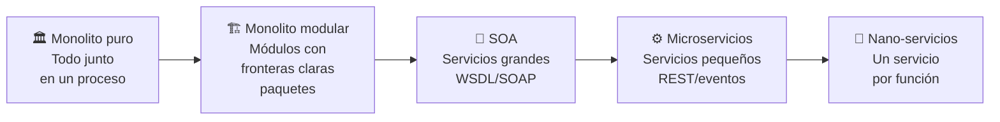

### El monolito modular como paso intermedio

Antes de ir directo a microservicios, considera el **monolito modular**:

- El código está en un solo proyecto y se despliega junto.
- Los módulos tienen **fronteras claras** (paquetes Java, interfaces explícitas).
- Los módulos no se acceden directamente entre sí — solo a través de interfaces.
- La base de datos puede tener **schemas separados por módulo**.

```
fabritech-monolito/
├── modules/
│   ├── catalog/
│   │   ├── api/        ← interfaz pública del módulo
│   │   ├── internal/   ← implementación privada
│   │   └── CatalogModule.java
│   ├── inventory/
│   │   ├── api/
│   │   ├── internal/
│   │   └── InventoryModule.java
│   └── orders/
│       ├── api/
│       ├── internal/
│       └── OrderModule.java
```

**Ventaja:** cuando decidas extraer un módulo como microservicio, las fronteras ya están definidas. El trabajo de DDD ya está hecho.

---

## El caso real de Netflix

Netflix es el ejemplo más citado de migración exitosa de monolito a microservicios.

| Año | Evento |
|-----|--------|
| 2007 | Netflix streaming empieza como monolito Java (llamado "the Monolith") |
| 2008 | Corrupción de BD, 3 días sin poder enviar DVDs. Deciden migrar a AWS |
| 2009 | Empiezan a extraer servicios uno a uno |
| 2012 | La arquitectura tiene ~100 microservicios |
| 2016 | Migración completada. > 700 microservicios en producción |
| Hoy | > 1000 microservicios. Herramientas propias: Eureka, Hystrix, Ribbon, Zuul |

**Lo que aprendieron:**
- La migración tomó **7 años**, no meses.
- Cada servicio requiere equipos dedicados de SRE (Site Reliability Engineering).
- Invirtieron masivamente en herramientas de observabilidad antes de migrar.
- Los primeros servicios extraídos fueron los menos acoplados (streaming de video, recomendaciones).

---

## El costo real de migrar

Migrar a microservicios **no es gratis**. Antes de decidir, el equipo de FabriTech debe entender los costos:

### Costos nuevos que no existían en el monolito

| Área | Costo nuevo |
|------|-------------|
| **Infraestructura** | En lugar de 1 servidor, necesitas al menos 15 (uno por servicio) + API Gateway + Broker + Registry |
| **Operaciones** | Monitorear, loggear y hacer deploy de 15 servicios en lugar de 1 |
| **Complejidad de red** | Latencia entre servicios, timeouts, circuit breakers — problemas que no existían |
| **Transacciones distribuidas** | Lo que era un `@Transactional` ahora requiere implementar Saga |
| **Testing** | Los tests de integración ahora requieren levantar múltiples servicios |
| **Consistencia eventual** | Los datos pueden estar temporalmente inconsistentes entre servicios |
| **Skills del equipo** | El equipo necesita aprender Docker, Kubernetes, Kafka, service mesh |

### Regla de los tres equipos

> Si tienes menos de **3 equipos independientes** desarrollando el sistema, los microservicios probablemente añaden más complejidad de la que resuelven.

**FabriTech tiene 300 personas pero ¿cuántos son devs?**

Si el equipo de desarrollo es de 8 personas: considera el monolito modular primero.  
Si el equipo es de 30+ personas con squads independientes: los microservicios empiezan a tener sentido.

---

## Framework de decisión

Usa esta tabla para evaluar si tiene sentido migrar:

| Criterio | Peso | FabriTech |
|----------|------|-----------|
| ¿Los módulos escalan de forma independiente? | Alto | ✅ E-commerce vs. backoffice |
| ¿Hay equipos que se bloquean entre sí? | Alto | ✅ Logística bloquea a ventas |
| ¿El build/test tarda > 15 minutos? | Medio | ✅ 28 minutos |
| ¿Los deploys causan incidentes frecuentes? | Alto | ✅ 35% de deploys tienen rollback |
| ¿Hay partes del sistema que nadie entiende? | Medio | ✅ Módulo de nóminas |
| ¿Hay > 2 equipos de desarrollo? | Alto | ✅ 4 equipos: ventas, fab, logística, backoffice |
| ¿El equipo tiene experiencia con contenedores y Kafka? | Alto | ❌ Requiere capacitación |
| ¿Hay presupuesto para infraestructura adicional? | Alto | ✅ Aprobado por directorio |

**Resultado de FabriTech:** migración recomendada, comenzando por dominios bien delimitados.

---

## El principio que guía todo

> **"Divide by business capability, not by technical layer."**

❌ Arquitectura por capas técnicas (incorrecto para microservicios):
```
frontend-service
backend-service
database-service
```

✅ Arquitectura por capacidad de negocio (correcto):
```
catalog-service
inventory-service
order-service
shipping-service
```

Los servicios técnicos no tienen dueño claro, cambian juntos y no escalan de forma independiente.

---

*← [Volver al índice](./README.md) | Siguiente: [02 — Caso FabriTech →](./02_caso-fabritech.md)*


<!-- START OF FILE: docs_extras_monolito-a-microservicios_02_caso-fabritech.md -->
# Documento: docs extras monolito-a-microservicios 02 caso-fabritech
---
# 02 — Caso de estudio: FabriTech S.A.

← [Volver al índice](./README.md)

---

## La empresa

**FabriTech S.A.** es una empresa chilena fundada en 1998, dedicada a la fabricación y comercialización de **electrónica doméstica** (aspiradoras robóticas, purificadores de aire, cargadores portátiles). Con 28 años de trayectoria, pasó de ser un pequeño taller de manufactura a una empresa con presencia nacional.

### Datos generales

| Dato | Valor |
|------|-------|
| Fundación | 1998, Santiago de Chile |
| RUT | 76.123.456-7 |
| Empleados | ~300 |
| Sucursales | 12 (Arica, Iquique, Antofagasta, La Serena, Viña del Mar, Santiago Centro, Santiago Maipú, Rancagua, Talca, Concepción, Temuco, Puerto Montt) |
| Casa central | Pudahuel, Santiago (planta + bodega + oficinas + punto de venta mayorista) |
| Proveedores activos | 43 |
| SKUs activos | ~180 productos terminados |
| Ventas anuales | ~$4.200 millones CLP |
| Plataforma web | fabritech.cl (e-commerce + catálogo) |

---

## Estructura organizacional

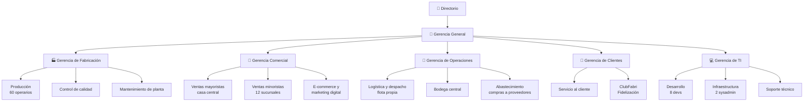

---

## Flujos de negocio detallados

### Flujo 1: Abastecimiento de materias primas

```
1. Bodega central detecta stock bajo de componentes
2. Jefe de abastecimiento revisa en el sistema las órdenes de compra pendientes
3. Se emite una Orden de Compra (OC) al proveedor
4. Proveedor confirma fecha de entrega
5. Materiales llegan a casa central
6. Encargado de bodega registra la recepción en el sistema
7. El stock de materias primas se actualiza
8. Se genera una alerta a fabricación: "Materiales disponibles"
```

### Flujo 2: Fabricación de un lote de productos

```
1. Gerencia comercial proyecta demanda del próximo mes
2. Gerencia de fabricación crea Orden de Producción (OP) con:
   - Producto a fabricar (SKU)
   - Cantidad
   - Fecha límite
3. El sistema verifica que hay suficientes materias primas (BOM check)
4. Si hay materias primas: OP se inicia (estado: EN_PRODUCCIÓN)
5. Si no hay: sistema genera aviso de compra de materiales
6. Al completarse el lote, control de calidad aprueba o rechaza
7. Si aprobado: los productos ingresan a bodega central como PRODUCTO_TERMINADO
8. El stock de productos terminados se actualiza
```

### Flujo 3: Reabastecimiento de sucursal

```
1. Sucursal detecta stock bajo (automático o manual)
2. Jefe de sucursal solicita transferencia de stock en el sistema
3. Bodega central confirma disponibilidad
4. Se programa despacho con flota propia (camión)
5. El sistema genera guía de despacho (PDF)
6. El chofer del camión registra la salida de bodega central
7. Al llegar a la sucursal, el encargado confirma recepción
8. El stock de la sucursal se actualiza
9. El stock de bodega central se actualiza (descuenta)
```

### Flujo 4: Venta minorista en sucursal

```
1. Cliente llega a la sucursal
2. Vendedor busca el producto en el sistema (verifica stock local)
3. Si hay stock: se registra la venta
   a. El sistema busca o registra al cliente (RUT o email)
   b. Se genera boleta/factura en el sistema
   c. Se registra el pago (efectivo, débito, crédito)
   d. El stock de la sucursal disminuye
   e. Si el cliente tiene cuenta ClubFabri: se acreditan puntos
4. Si no hay stock: el vendedor puede ver si hay stock en otras sucursales
                    y puede hacer reserva + envío al cliente
```

### Flujo 5: Venta por e-commerce

```
1. Cliente navega en fabritech.cl
2. Agrega productos al carrito
3. Al hacer checkout:
   a. Verifica stock en bodega central (o sucursal más cercana)
   b. El stock queda RESERVADO (no disponible para otro comprador)
4. Cliente paga (Webpay, tarjeta)
5. Sistema confirma el pago
6. Se genera boleta electrónica (PDF enviado por email)
7. Se crean instrucciones de despacho
8. Logística elige carrier (Starken, Chilexpress, DHL según destino y peso)
9. Se obtiene código de tracking del carrier
10. Cliente recibe email con tracking
11. Sistema monitorea el estado del envío (webhooks del carrier)
12. Al entregarse: se acreditan puntos ClubFabri
```

### Flujo 6: Programa de fidelización (ClubFabri)

```
Acumulación:
  - $1.000 CLP gastados = 10 puntos
  - Tier Bronze (0-499 pts): multiplicador 1x
  - Tier Silver (500-1999 pts): multiplicador 1.5x
  - Tier Gold (2000-4999 pts): multiplicador 2x
  - Tier Platinum (5000+ pts): multiplicador 3x + envío gratis

Canje:
  - 100 puntos = $500 CLP de descuento
  - Mínimo de canje: 200 puntos

Eventos especiales:
  - Cumpleaños del cliente: doble puntos ese día
  - Promociones de temporada: puntos extra en categorías específicas
```

---

## El sistema monolítico actual

### Stack tecnológico

| Capa | Tecnología |
|------|------------|
| Backend | Java 11, Spring Boot 2.7, Spring MVC |
| ORM | Hibernate + Spring Data JPA |
| Base de datos | MySQL 8.0 (un servidor, una base) |
| Frontend web | Thymeleaf (renderizado server-side) |
| E-commerce | Angular 12 (SPA que consume el mismo backend) |
| App mobile | Android nativo (Java) + iOS (Swift) |
| Reportes | JasperReports embebido en el monolito |
| Email | JavaMailSender directo en los servicios |
| PDF | iText embebido en los servicios |
| Servidor | Tomcat embebido, 1 servidor físico en casa central |
| Deploy | JAR subido por FTP al servidor, reinicio manual |

### Métricas del sistema actual

| Métrica | Valor |
|---------|-------|
| Líneas de código | ~180.000 LOC |
| Clases Java | ~620 |
| Tablas en BD | 87 |
| Tiempo de build | 28 minutos |
| Tiempo de deploy | 12 minutos (downtime completo) |
| Tests unitarios | 340 (cobertura ~18%) |
| Tests de integración | 12 |
| Deploys por semana | ~1.5 |
| Deploys con rollback | 35% |
| Incidentes P1 por mes | ~4 |
| Tiempo medio de resolución (MTTR) | 2.5 horas |

---

## Problemas documentados

### Incidente #1 — Módulo de reportes vs. ventas (Noviembre 2025)

El equipo de backoffice desplegó una nueva versión del módulo de reportes que incluía una consulta SQL pesada sin índice. La consulta trababa el pool de conexiones de toda la aplicación. El sistema de ventas quedó sin poder procesar pagos por **47 minutos** en plena campaña de Navidad.

**Pérdida estimada:** $8.2 millones CLP en ventas no realizadas.

### Incidente #2 — Deploy de logística bloquea fidelización (Agosto 2025)

El equipo de logística necesitaba urgente un fix en el cálculo de costos de envío. Para desplegar el fix, toda la aplicación debía reiniciarse. El reinicio duró 12 minutos. Durante ese tiempo, el sistema de fidelización tampoco funcionaba, aunque no tenía ningún bug.

**Impacto:** 200 clientes no pudieron canjear puntos durante una promoción de doble puntos.

### Incidente #3 — Refactor de Customer rompe Facturas (Mayo 2025)

Un desarrollador renombró el campo `rut` a `taxId` en la entidad `Customer` (para estandarizar con el formato internacional). El rename automático en IDE no detectó que una clase de generación de facturas usaba el nombre del campo via reflexión para construir el XML del SII. Las facturas electrónicas dejaron de generarse correctamente.

**Impacto:** 48 horas de facturas inválidas, penalización del SII.

### Problema estructural: la clase OrderService

```java
// OrderService.java — 1.247 líneas
// Responsabilidades mezcladas:
public class OrderService {

    // Lógica de pedidos (correcto)
    public Order createOrder(OrderRequest request) { ... }

    // Verifica stock — debería ser InventoryService
    private boolean checkStock(String sku, int qty) { ... }

    // Calcula puntos — debería ser LoyaltyService
    private void awardPoints(Long customerId, BigDecimal amount) { ... }

    // Genera PDF — debería ser PdfService
    private byte[] generateInvoicePdf(Order order) { ... }

    // Envía email — debería ser EmailService
    private void sendConfirmationEmail(Order order) { ... }

    // Notifica al carrier — debería ser ShippingService
    private String createShipmentInCarrier(Order order) { ... }

    // Actualiza stock — debería ser InventoryService
    private void decrementStock(List<OrderItem> items) { ... }

    // Crea factura en BD — debería ser PaymentService
    private Invoice createInvoice(Order order) { ... }
}
```

Esta clase viola el **Single Responsibility Principle** y es el epicentro de la mayoría de los conflictos de merge.

---

## Objetivos de la migración

El directorio de FabriTech aprobó un proyecto de 18 meses para migrar gradualmente el monolito. Los objetivos son:

| Objetivo | Métrica de éxito |
|----------|-----------------|
| Reducir el impacto de los deploys | Incidentes por deploy < 5% (hoy: 35%) |
| Escalar e-commerce de forma independiente | Costo de infraestructura en peak: -60% |
| Reducir tiempo de build | < 5 minutos por servicio (hoy: 28 min total) |
| Aumentar frecuencia de deploy | > 5 deploys/semana (hoy: 1.5) |
| Mejorar tiempo de resolución (MTTR) | < 30 minutos (hoy: 2.5 horas) |
| Aumentar cobertura de tests | > 70% por servicio (hoy: 18%) |
| Eliminar bloqueos entre equipos | 0 deploys que requieran coordinación entre > 1 equipo |

---

## El equipo de desarrollo

| Squad | Integrantes | Dominio responsable |
|-------|-------------|---------------------|
| **Squad Comercial** | 2 devs | Catálogo, pedidos, e-commerce |
| **Squad Operaciones** | 2 devs | Inventario, fabricación, compras |
| **Squad Clientes** | 2 devs | Clientes, fidelización, pagos |
| **Squad Logística** | 1 dev | Envíos, carriers |
| **Squad Plataforma** | 1 dev (líder técnico) | API Gateway, infraestructura, auth |

La migración se asignará un squad por dominio, con el Squad Plataforma coordinando la infraestructura transversal.

---

*← [01 — ¿Por qué migrar?](./01_por-que-migrar.md) | Siguiente: [03 — El Monolito →](./03_el-monolito.md)*


<!-- START OF FILE: docs_extras_monolito-a-microservicios_03_el-monolito.md -->
# Documento: docs extras monolito-a-microservicios 03 el-monolito
---
# 03 — El monolito actual

← [Volver al índice](./README.md)

---

## Anatomía del monolito de FabriTech

Para migrar de forma segura, primero hay que **entender profundamente** lo que existe. Esta es la estructura real del monolito de FabriTech antes de la migración.

### Estructura de paquetes

```
cl.fabritech/
├── config/
│   ├── SecurityConfig.java
│   ├── JpaConfig.java
│   ├── EmailConfig.java
│   └── WebConfig.java
│
├── controller/
│   ├── ProductController.java          (42 endpoints)
│   ├── ManufacturingController.java    (18 endpoints)
│   ├── SupplierController.java         (24 endpoints)
│   ├── InventoryController.java        (31 endpoints)
│   ├── BranchController.java           (15 endpoints)
│   ├── CustomerController.java         (28 endpoints)
│   ├── OrderController.java            (37 endpoints)
│   ├── LoyaltyController.java          (22 endpoints)
│   ├── ShippingController.java         (29 endpoints)
│   ├── PaymentController.java          (19 endpoints)
│   ├── ReportController.java           (44 endpoints)
│   └── AuthController.java             (8 endpoints)
│
├── service/
│   ├── ProductService.java             (680 líneas)
│   ├── ManufacturingService.java       (524 líneas)
│   ├── InventoryService.java           (891 líneas)   ← más grande
│   ├── OrderService.java               (1247 líneas)  ← el problemático
│   ├── CustomerService.java            (443 líneas)
│   ├── LoyaltyService.java             (389 líneas)
│   ├── ShippingService.java            (712 líneas)
│   ├── PaymentService.java             (601 líneas)
│   ├── ReportService.java              (934 líneas)
│   ├── EmailService.java               (287 líneas)   ← mezclado con todo
│   ├── PdfService.java                 (356 líneas)   ← mezclado con todo
│   └── NotificationService.java        (198 líneas)
│
├── repository/
│   ├── ProductRepository.java
│   ├── ManufacturingRepository.java
│   ├── InventoryRepository.java
│   ├── OrderRepository.java
│   └── ... (24 repositorios más)
│
├── model/
│   ├── Product.java                    (relaciones a Category, Supplier)
│   ├── ProductionOrder.java            (relación a Product, Employee)
│   ├── BillOfMaterials.java            (relación a Product, RawMaterial)
│   ├── Supplier.java
│   ├── RawMaterial.java                (relación a Supplier)
│   ├── PurchaseOrder.java              (relación a Supplier, RawMaterial)
│   ├── Inventory.java                  (relación a Product, Warehouse)
│   ├── Warehouse.java                  (relación a Branch)
│   ├── Branch.java
│   ├── Customer.java
│   ├── CustomerAddress.java
│   ├── Order.java                      (relación a Customer, Branch, Employee)
│   ├── OrderItem.java                  (relación a Order, Product)
│   ├── LoyaltyAccount.java             (relación a Customer)
│   ├── PointsTransaction.java
│   ├── Shipment.java                   (relación a Order, Carrier)
│   ├── Carrier.java
│   ├── Payment.java                    (relación a Order)
│   ├── Invoice.java                    (relación a Order, Customer)
│   └── ... (67 entidades en total)
│
└── dto/
    └── ... (120+ DTOs)
```

---

## El problema del acoplamiento implícito

El mayor problema del monolito de FabriTech no es la falta de organización en carpetas — los paquetes están razonablemente separados. El problema es el **acoplamiento implícito** que surge de tres fuentes:

### Fuente 1: Inyección de servicios cruzados

```java
// OrderService inyecta servicios de múltiples dominios
@Service
public class OrderService {

    // Dominio de inventario
    @Autowired private InventoryService inventoryService;

    // Dominio de fidelización
    @Autowired private LoyaltyService loyaltyService;

    // Dominio de clientes
    @Autowired private CustomerService customerService;

    // Dominio de envíos
    @Autowired private ShippingService shippingService;

    // Dominio de pagos
    @Autowired private PaymentService paymentService;

    // Servicios técnicos (deberían ser auxiliares independientes)
    @Autowired private EmailService emailService;
    @Autowired private PdfService pdfService;
    @Autowired private NotificationService notificationService;

    // Resultado: cambiar cualquiera de estos servicios puede romper OrderService
}
```

### Fuente 2: Queries que cruzan dominios en la BD

```java
// En ReportService: una query que cruza 6 dominios distintos
@Query("""
    SELECT new cl.fabritech.dto.SalesReport(
        b.name,
        p.name,
        SUM(oi.quantity),
        SUM(oi.quantity * oi.unitPrice),
        c.tier
    )
    FROM Order o
    JOIN o.items oi
    JOIN oi.product p
    JOIN p.category cat
    JOIN o.branch b
    JOIN o.customer c
    JOIN c.loyaltyAccount la
    WHERE o.createdAt BETWEEN :from AND :to
    AND o.status = 'PAID'
    GROUP BY b.id, p.id, c.tier
    ORDER BY SUM(oi.quantity * oi.unitPrice) DESC
""")
List<SalesReport> getSalesByBranchAndProduct(LocalDate from, LocalDate to);
```

Esta query bloquea `Order`, `OrderItem`, `Product`, `Category`, `Branch`, `Customer` y `LoyaltyAccount` simultáneamente. Si el esquema de cualquiera cambia, la query falla.

### Fuente 3: Transacciones @Transactional que cruzan dominios

```java
@Transactional  // ← una sola transacción que abarca 5 dominios
public Order confirmOrder(Long orderId) {

    // Dominio: Pedidos
    Order order = orderRepository.findById(orderId).orElseThrow();

    // Dominio: Inventario
    inventoryService.decrementStock(order.getItems());

    // Dominio: Pagos
    Invoice invoice = paymentService.createInvoice(order);

    // Dominio: Fidelización
    loyaltyService.awardPoints(order.getCustomerId(), order.getTotal());

    // Dominio: Envíos
    Shipment shipment = shippingService.createShipment(order);

    // Auxiliar: Email (si el envío falla, se hace rollback del email también)
    emailService.sendConfirmation(order, invoice, shipment);

    return order;
}
```

Si `shippingService.createShipment` falla (por ejemplo, el carrier externo no responde), hace rollback de **todo**: el stock decrementado se restaura, la factura se borra y los puntos de fidelización no se acreditan. Esto parece correcto a primera vista, pero en realidad **los pedidos pagados deberían poder procesarse incluso si el servicio de envíos tiene problemas temporales**.

---

## El esquema de base de datos monolítico

El monolito tiene 87 tablas en una sola base de datos MySQL. El mayor problema: **tablas que pertenecen a distintos dominios tienen foreign keys entre sí**, haciendo imposible separarlas sin trabajo adicional.

### Mapa de dependencias entre dominios en la BD

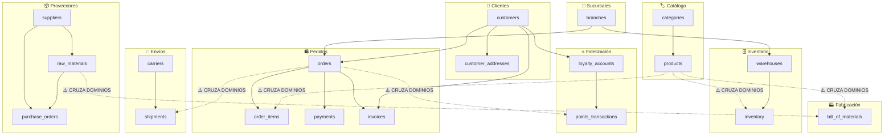

Estas FKs cruzadas son el **mayor obstáculo** para separar los servicios. Cuando `order_items` tiene FK a `products`, extraer el catálogo como servicio independiente no es trivial — hay que decidir si eliminar la FK o duplicar el dato.

---

## Herramientas para analizar un monolito

Antes de migrar, el equipo de FabriTech debe hacer un análisis objetivo del acoplamiento. Estas son las herramientas disponibles:

### ArchUnit — Tests de arquitectura en Java

[ArchUnit](https://www.archunit.org/) permite escribir tests que validan las reglas de arquitectura del monolito. Se pueden detectar violaciones de capas y dependencias circulares:

```java
@AnalyzeClasses(packages = "cl.fabritech")
class ArchitectureTest {

    // Regla: los servicios de dominio no deben inyectar otros servicios de dominio directamente
    // (para detectar acoplamientos implícitos)
    @ArchTest
    static final ArchRule no_domain_service_should_import_another =
        noClasses()
            .that().resideInAPackage("..service..")
            .and().haveSimpleNameEndingWith("Service")
            .should().dependOnClassesThat()
            .resideInAPackage("..service..")
            .andShould().haveSimpleNameEndingWith("Service")
            .because("Los servicios de dominio deben comunicarse via interfaces, no inyección directa");

    // Regla: los reportes no deben tener acceso directo a repositorios de otros dominios
    @ArchTest
    static final ArchRule reports_should_not_access_domain_repos =
        noClasses()
            .that().resideInAPackage("..service.report..")
            .should().dependOnClassesThat()
            .resideInAPackage("..repository..");
}
```

Al ejecutar estos tests en FabriTech, se detectan **87 violaciones** — cada una es un candidato a ser refactorizado durante la migración.

### jdeps — Análisis de dependencias del JDK

```bash
# Generar reporte de dependencias entre paquetes
jdeps --dot-output ./deps-report \
      --multi-release 11 \
      fabritech-monolito.jar

# Visualizar como grafo (requiere graphviz)
dot -Tsvg deps-report/cl.fabritech.service.dot -o service-deps.svg
```

### Structure101 / Sonargraph

Herramientas comerciales que generan un mapa visual del acoplamiento entre módulos, identifican ciclos de dependencias y miden la "distancia de separación" de cada módulo del monolito.

---

## La deuda técnica acumulada

Después del análisis, FabriTech tiene documentada la siguiente deuda técnica:

| Tipo de deuda | Cantidad | Impacto |
|---------------|----------|---------|
| Clases con > 3 responsabilidades | 23 | Alto |
| Servicios que inyectan > 5 dependencias | 8 | Alto |
| Queries que cruzan > 3 dominios | 34 | Alto |
| `@Transactional` que abarcan > 2 dominios | 19 | Medio |
| Código duplicado entre módulos | ~8.000 LOC | Medio |
| Clases sin tests unitarios | 412 / 620 (66%) | Alto |
| Configuraciones hardcoded | 47 | Bajo |
| TODOs sin resolver | 203 | Bajo |

### La regla del "techo de deuda"

Antes de extraer un servicio, el equipo debe reducir la deuda técnica de ese módulo específico por debajo de un umbral:

1. **Cobertura de tests > 60%** en el módulo a extraer
2. **Sin dependencias circulares** dentro del módulo
3. **Interfaz pública documentada** (qué métodos son el contrato externo)
4. **Sin queries cross-domain** en los repositorios del módulo

---

## El modelo de datos a separar

El proceso de separar la BD monolítica sigue la estrategia **"Expand and Contract"**:

### Paso 1: Identificar qué datos pertenecen a qué servicio

| Tabla | Dominio dueño | Tablas que la referencian (FK) |
|-------|--------------|-------------------------------|
| `products` | catalog-service | `order_items`, `inventory`, `bill_of_materials` |
| `inventory` | inventory-service | — |
| `orders` | order-service | `order_items`, `payments`, `invoices`, `shipments` |
| `customers` | customer-service | `orders`, `loyalty_accounts`, `invoices` |
| `loyalty_accounts` | loyalty-service | `points_transactions` |
| `shipments` | shipping-service | — |
| `carriers` | shipping-service | `shipments` |

### Paso 2: Eliminar las FKs cruzadas

Por ejemplo, `order_items` tiene FK a `products`:

```sql
-- Antes: FK real en BD
CREATE TABLE order_items (
    id BIGINT PRIMARY KEY,
    order_id BIGINT NOT NULL,
    product_id BIGINT NOT NULL,           -- FK a products
    product_sku VARCHAR(50) NOT NULL,
    product_name VARCHAR(200) NOT NULL,   -- denormalizado
    unit_price DECIMAL(10,2) NOT NULL,
    quantity INT NOT NULL,
    FOREIGN KEY (order_id) REFERENCES orders(id),
    FOREIGN KEY (product_id) REFERENCES products(id)  -- ← ELIMINAR
);

-- Después: se mantiene el dato denormalizado, se elimina la FK
CREATE TABLE order_items (
    id BIGINT PRIMARY KEY,
    order_id BIGINT NOT NULL,
    product_sku VARCHAR(50) NOT NULL,     -- la referencia es el SKU (string), no la FK
    product_name VARCHAR(200) NOT NULL,  -- snapshot del nombre al momento de la venta
    unit_price DECIMAL(10,2) NOT NULL,
    quantity INT NOT NULL,
    FOREIGN KEY (order_id) REFERENCES orders(id)
);
```

**¿Por qué guardar el nombre y precio en `order_items`?**

Porque si mañana el producto cambia de nombre o precio, el historial de órdenes debe reflejar el precio y nombre **al momento de la compra**, no el actual. Esto es **correcto por diseño**, no un workaround.

---

*← [02 — Caso FabriTech](./02_caso-fabritech.md) | Siguiente: [04 — Bounded Contexts →](./04_bounded-contexts.md)*


<!-- START OF FILE: docs_extras_monolito-a-microservicios_04_bounded-contexts.md -->
# Documento: docs extras monolito-a-microservicios 04 bounded-contexts
---
# 04 — Identificando límites de contexto

← [Volver al índice](./README.md)

---

> 📖 **Contenido complementario — fuera del scope de DSY1103**
>
> Domain-Driven Design (DDD) **no es parte del programa evaluado del curso**, pero es uno de los fundamentos intelectuales detrás de cómo se diseñan los bounded contexts en microservicios. Te recomendamos leer esta sección al menos una vez: te dará un vocabulario y un marco de pensamiento que aplicarás durante toda tu carrera. **Puedes saltarla si estás apurado y volver más tarde.**

---

## Domain-Driven Design (DDD) en una página

**Domain-Driven Design** es una metodología de diseño de software que pone el **dominio del negocio** en el centro de todas las decisiones técnicas. Fue formulada por Eric Evans en su libro *"Domain-Driven Design: Tackling Complexity in the Heart of Software"* (2003).

### Conceptos clave de DDD

| Concepto | Definición | Ejemplo en FabriTech |
|----------|-----------|---------------------|
| **Domain** | El problema de negocio que el software resuelve | La operación completa de FabriTech |
| **Subdomain** | Una parte delimitada del dominio | Ventas, Fabricación, Logística |
| **Bounded Context** | El límite donde un modelo de dominio tiene significado coherente y consistente | El contexto "Pedidos" donde `Order` tiene sentido completo |
| **Ubiquitous Language** | El vocabulario común que usan tanto devs como expertos del negocio dentro de un contexto | "Despacho" significa cosas diferentes en Logística vs. Ventas |
| **Entity** | Objeto con identidad propia que persiste en el tiempo | `Order`, `Customer`, `Product` |
| **Value Object** | Objeto sin identidad propia, definido solo por sus atributos | `Money`, `Address`, `DateRange` |
| **Aggregate** | Cluster de entidades y value objects tratados como una unidad | `Order` + sus `OrderItem`s |
| **Aggregate Root** | La entidad principal del aggregate; es el único punto de entrada | `Order` es la raíz; los `OrderItem`s no se acceden directamente |
| **Domain Event** | Algo que ocurrió en el dominio, expresado en tiempo pasado | `OrderPlaced`, `ProductShipped`, `CustomerRegistered` |
| **Repository** | Abstracción de persistencia para un aggregate | `OrderRepository` |

---

## El lenguaje ubicuo en cada contexto

La misma palabra puede significar cosas diferentes en contextos distintos. Esto es **correcto y esperado** en DDD:

### La palabra "Producto"

| Contexto | Lo que "Producto" significa | Atributos relevantes |
|----------|-----------------------------|---------------------|
| **Catálogo** | Un ítem que FabriTech vende, con descripción y foto | `sku`, `name`, `description`, `images`, `category`, `basePrice` |
| **Inventario** | Una unidad en bodega, con ubicación y cantidad | `sku`, `warehouseLocation`, `quantity`, `reservedQty`, `minimumStock` |
| **Fabricación** | Un bien a producir, con receta de materiales | `sku`, `billOfMaterials`, `productionTime`, `qualityChecklist` |
| **Pedido** | Una línea en una orden, con precio snapshot | `sku`, `nameAtSale`, `priceAtSale`, `quantity` |
| **Envío** | Un ítem físico a transportar, con peso y dimensiones | `sku`, `weightKg`, `dimensionsCm`, `isFragile` |

**Conclusión:** No existe un modelo único de "Producto" — existen 5 modelos, uno por contexto. Intentar crear un único `Product.java` que sirva para todos es el origen de la clase Dios.

### La palabra "Cliente"

| Contexto | Lo que "Cliente" significa |
|----------|---------------------------|
| **Clientes** | Una persona registrada con datos personales | `id`, `name`, `email`, `rut`, `phone` |
| **Fidelización** | Una cuenta con puntos y tier | `customerId`, `points`, `tier`, `joinedAt` |
| **Pedidos** | Un comprador asociado a una orden | `customerId`, `name`, `billingAddress` |
| **Envíos** | Un destinatario con dirección de entrega | `recipientName`, `deliveryAddress`, `phone` |

---

## Event Storming: la sesión práctica

**Event Storming** es un taller colaborativo de 4-8 horas donde participan **desarrolladores y expertos del negocio** juntos. El objetivo es mapear todos los eventos del dominio y descubrir los bounded contexts.

### Materiales necesarios

- Una pared larga (mínimo 4 metros)
- Post-its de 5 colores:
  - 🟠 **Naranja** → Domain Events (pasado: "algo ocurrió")
  - 🔵 **Azul** → Commands (presente: "acción que dispara el evento")
  - 🟡 **Amarillo** → Actors (quién ejecuta el command)
  - 🟢 **Verde** → Aggregates (qué entidad cambia)
  - 🔴 **Rojo** → Hot Spots (problemas, preguntas sin resolver)

### Proceso de la sesión

**Etapa 1 — Caos creativo (45 min)**

Todos los participantes escriben eventos de dominio en naranja y los pegan en la pared, sin orden. Reglas: tiempo pasado, sin tecnicismos.

```
🟠 PedidoCreado
🟠 PagoConfirmado
🟠 ProductoFabricado
🟠 MaterialRecibido
🟠 EnvioEntregado
🟠 ClienteRegistrado
🟠 PuntosAcreditados
🟠 StockBajo
🟠 OrdenDeCompraEmitida
🟠 TransferenciaASucursalDespachada
...
```

**Etapa 2 — Línea de tiempo (45 min)**

Se ordenan los post-its en la pared en orden cronológico, de izquierda a derecha:

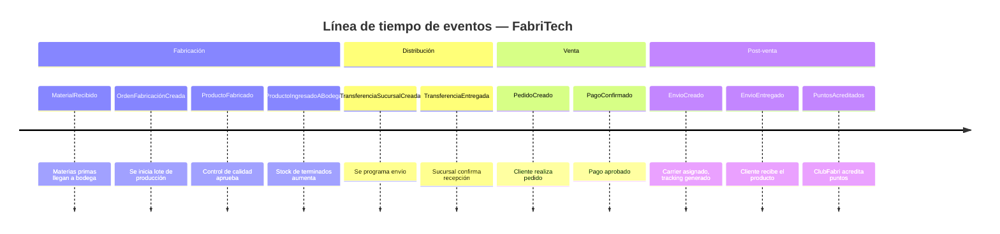

**Etapa 3 — Identificar commands y actores (30 min)**

Para cada evento: ¿qué acción lo disparó? ¿quién la ejecutó?

```
🟡 Encargado Bodega  →  🔵 RegistrarRecepción  →  🟠 MaterialRecibido
🟡 Jefe Producción   →  🔵 CrearOrden          →  🟠 OrdenFabricaciónCreada
🟡 Cliente           →  🔵 HacerPedido          →  🟠 PedidoCreado
🟡 Sistema Pago      →  🔵 ConfirmarPago        →  🟠 PagoConfirmado
```

**Etapa 4 — Aggregates (30 min)**

Agrupar events/commands alrededor de la entidad que cambia:

```
🟢 Order: [PedidoCreado, PedidoModificado, PedidoCancelado, PedidoEntregado]
🟢 Inventory: [StockIncrementado, StockReservado, StockLiberado, StockTransferido]
🟢 Customer: [ClienteRegistrado, DatosActualizados, DirecciónAgregada]
🟢 Shipment: [EnvioCreado, EnvioEnCamino, EnvioEntregado]
```

**Etapa 5 — Bounded Contexts (30 min)**

Trazar líneas verticales en la pared agrupando aggregates relacionados:

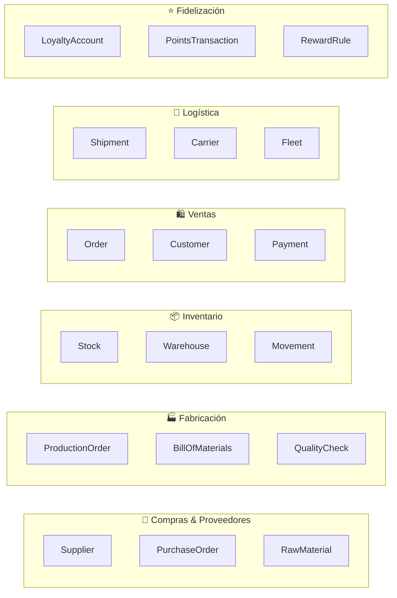

---

## Context Map de FabriTech

El **Context Map** documenta las relaciones entre los bounded contexts. Existen varios tipos de relaciones:

### Tipos de relaciones entre contexts

| Tipo | Descripción | Ejemplo en FabriTech |
|------|-------------|---------------------|
| **Partnership** | Dos contexts coordinan su evolución juntos | `order-service` y `payment-service` |
| **Customer-Supplier** | Un context (upstream) provee datos a otro (downstream) | `catalog-service` ← `order-service` |
| **Conformist** | El downstream acepta el modelo del upstream sin modificarlo | `shipping-service` consume el modelo de carriers externos |
| **Anti-Corruption Layer (ACL)** | El downstream traduce el modelo del upstream a su propio lenguaje | `shipping-service` traduce el API de Starken al modelo interno |
| **Open Host Service** | El upstream expone una API bien definida para múltiples consumers | `catalog-service` con API REST versionada |
| **Published Language** | El upstream define un formato estándar (OpenAPI, eventos JSON) | Eventos en formato CloudEvents |

### Context Map de FabriTech

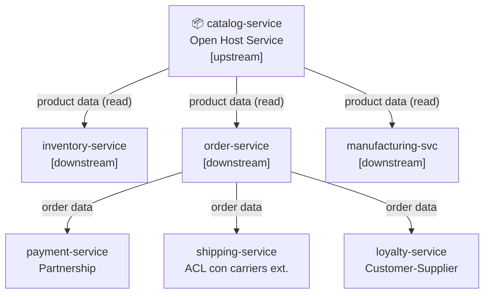

---

## Anti-Corruption Layer (ACL) en profundidad

El ACL es fundamental cuando `shipping-service` se integra con carriers externos (Starken, Chilexpress, DHL). Cada carrier tiene su propio modelo de datos y API. El ACL traduce entre el mundo externo y el modelo interno de FabriTech.

```java
// Modelo interno de FabriTech
public record ShipmentRequest(
    String recipientName,
    String recipientPhone,
    Address deliveryAddress,
    List<Package> packages,
    ServiceLevel serviceLevel  // STANDARD | EXPRESS | SAME_DAY
) {}

// ─────────────────────────────────────────────────────────────

// Modelo de la API de Starken (externo, no controlamos)
public class StarkenShipmentDTO {
    private String nombreDestinatario;
    private String telefonoDestinatario;
    private String direccionEntrega;
    private String ciudadDestino;
    private String regionDestino;
    private Double pesoKg;
    private String tipoServicio;  // "NORMAL", "EXPRESS_24", "EXPRESS_12"
}

// ─────────────────────────────────────────────────────────────

// El ACL: traduce del modelo interno al modelo de Starken
@Component
public class StarkenAdapter implements CarrierAdapter {

    @Override
    public ExternalShipmentResult createShipment(ShipmentRequest request) {
        StarkenShipmentDTO dto = new StarkenShipmentDTO();
        dto.setNombreDestinatario(request.recipientName());
        dto.setTelefonoDestinatario(request.recipientPhone());
        dto.setDireccionEntrega(request.deliveryAddress().street() + ", " +
                                request.deliveryAddress().city());
        dto.setCiudadDestino(request.deliveryAddress().city());
        dto.setRegionDestino(request.deliveryAddress().region());
        dto.setPesoKg(calculateTotalWeight(request.packages()));
        dto.setTipoServicio(mapServiceLevel(request.serviceLevel()));  // ← traducción

        StarkenResponse response = starkenApiClient.createShipment(dto);

        // Traduce la respuesta de Starken al modelo interno
        return new ExternalShipmentResult(
            response.getNroSeguimiento(),   // → trackingCode
            response.getFechaEstimada(),    // → estimatedDelivery
            CarrierStatus.CREATED
        );
    }

    private String mapServiceLevel(ServiceLevel level) {
        return switch (level) {
            case STANDARD  -> "NORMAL";
            case EXPRESS   -> "EXPRESS_24";
            case SAME_DAY  -> "EXPRESS_12";
        };
    }
}
```

**Beneficio:** cuando Starken cambie su API (v2, v3), solo se modifica el `StarkenAdapter`. El resto de `shipping-service` no cambia.

---

## Los 6 bounded contexts de FabriTech

Después del Event Storming, el equipo identificó 6 bounded contexts principales (los microservicios de negocio se derivan de ellos):

### 1. Contexto de Abastecimiento
- **Entidades:** `Supplier`, `RawMaterial`, `PurchaseOrder`
- **Eventos clave:** `PurchaseOrderCreated`, `RawMaterialReceived`
- **Equipo dueño:** Squad Operaciones

### 2. Contexto de Producción
- **Entidades:** `ProductionOrder`, `BillOfMaterials`, `QualityCheck`
- **Eventos clave:** `ProductionStarted`, `ProductionCompleted`
- **Equipo dueño:** Squad Operaciones

### 3. Contexto de Inventario y Distribución
- **Entidades:** `Warehouse`, `StockEntry`, `StockMovement`, `Branch`
- **Eventos clave:** `StockUpdated`, `TransferCreated`, `TransferDelivered`
- **Equipo dueño:** Squad Operaciones

### 4. Contexto de Ventas
- **Entidades:** `Customer`, `Order`, `OrderItem`, `Payment`, `Invoice`
- **Eventos clave:** `OrderPlaced`, `PaymentConfirmed`, `OrderCancelled`
- **Equipo dueño:** Squad Comercial + Squad Clientes

### 5. Contexto de Fidelización
- **Entidades:** `LoyaltyAccount`, `PointsTransaction`, `RewardRule`
- **Eventos clave:** `PointsEarned`, `PointsRedeemed`, `TierUpgraded`
- **Equipo dueño:** Squad Clientes

### 6. Contexto de Logística
- **Entidades:** `Shipment`, `Carrier`, `FleetVehicle`, `Driver`
- **Eventos clave:** `ShipmentCreated`, `ShipmentDispatched`, `ShipmentDelivered`
- **Equipo dueño:** Squad Logística

---

## La Ley de Conway aplicada

> *"Las organizaciones que diseñan sistemas están limitadas a producir diseños que sean copias de las estructuras de comunicación de esas organizaciones."*  
> — Melvin Conway, 1967

FabriTech tiene 5 squads → el sistema tendrá naturalmente 5 grupos de microservicios. **Esto no es coincidencia — es diseño**. La arquitectura debe reflejar la estructura del equipo, y viceversa.

| Squad | Microservicios |
|-------|---------------|
| Squad Comercial | `catalog-service`, `order-service` |
| Squad Operaciones | `inventory-service`, `manufacturing-service`, `procurement-service` |
| Squad Clientes | `customer-service`, `loyalty-service`, `payment-service` |
| Squad Logística | `shipping-service` |
| Squad Plataforma | `auth-service`, `api-gateway`, `notification-service`, `email-service`, `pdf-service` |

---

*← [03 — El Monolito](./03_el-monolito.md) | Siguiente: [05 — Mapa de Servicios →](./05_mapa-servicios.md)*


<!-- START OF FILE: docs_extras_monolito-a-microservicios_05_mapa-servicios.md -->
# Documento: docs extras monolito-a-microservicios 05 mapa-servicios
---
# 05 — Mapa de microservicios

← [Volver al índice](./README.md)

---

## Arquitectura completa

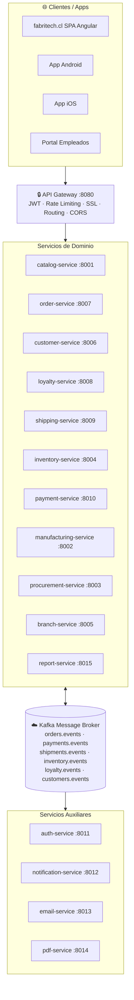

---

## API Gateway en profundidad

> 📖 **Contenido complementario — fuera del scope de DSY1103**
>
> El API Gateway es un componente esencial en arquitecturas de microservicios en producción, pero su implementación y configuración exceden el alcance del curso. Se incluye aquí para que sepas qué es, para qué sirve y cómo se configura cuando llegues a usarlo en un proyecto real.

El API Gateway es el **único punto de entrada** al sistema. Los clientes nunca llaman directamente a los microservicios.

### Responsabilidades del API Gateway

| Responsabilidad | Descripción |
|-----------------|-------------|
| **Routing** | Redirige `/api/v1/orders` → `order-service:8007` |
| **Autenticación** | Valida el JWT antes de enrutar la petición |
| **Rate Limiting** | Máximo N peticiones por IP/usuario por minuto |
| **SSL Termination** | Gestiona el certificado HTTPS; los servicios internos usan HTTP simple |
| **Request Logging** | Registra cada petición con su `traceId` |
| **CORS** | Gestiona las políticas de cross-origin (una sola configuración) |
| **Circuit Breaker** | Si un servicio está caído, retorna respuesta de fallback |
| **Load Balancing** | Distribuye el tráfico entre múltiples instancias del mismo servicio |

### Configuración de routing (Spring Cloud Gateway)

```yaml
# application.yml del API Gateway
spring:
  cloud:
    gateway:
      routes:
        - id: catalog-service
          uri: lb://catalog-service          # lb:// → load balancer automático
          predicates:
            - Path=/api/v1/products/**
          filters:
            - AuthFilter                     # valida JWT
            - name: RequestRateLimiter
              args:
                redis-rate-limiter.replenishRate: 100   # 100 req/seg
                redis-rate-limiter.burstCapacity: 200

        - id: order-service
          uri: lb://order-service
          predicates:
            - Path=/api/v1/orders/**
          filters:
            - AuthFilter
            - name: CircuitBreaker
              args:
                name: orderCircuitBreaker
                fallbackUri: forward:/fallback/orders

        - id: shipping-service
          uri: lb://shipping-service
          predicates:
            - Path=/api/v1/shipments/**
          filters:
            - AuthFilter
```

### Lo que NO debe hacer el API Gateway

❌ **No debe contener lógica de negocio** — el gateway solo enruta y valida, no procesa.

```java
// ❌ MAL: lógica de negocio en el gateway
@Component
public class OrderGatewayFilter implements GatewayFilter {
    public Mono<Void> filter(ServerWebExchange exchange, GatewayFilterChain chain) {
        // Calculando descuentos en el gateway ← INCORRECTO
        BigDecimal discount = calculateDiscount(exchange.getRequest());
        // ...
    }
}

// ✅ BIEN: el gateway solo valida el token y enruta
@Component
public class AuthFilter implements GatewayFilter {
    public Mono<Void> filter(ServerWebExchange exchange, GatewayFilterChain chain) {
        String token = extractToken(exchange.getRequest());
        if (!jwtValidator.isValid(token)) {
            exchange.getResponse().setStatusCode(HttpStatus.UNAUTHORIZED);
            return exchange.getResponse().setComplete();
        }
        return chain.filter(exchange);
    }
}
```

---

## Service Registry y Service Discovery

> 📖 **Contenido complementario — fuera del scope de DSY1103**
>
> El Service Registry resuelve el problema de "¿cómo se encuentran los servicios entre sí?" en un entorno dinámico (muchas instancias, IPs que cambian). Es fundamental en producción pero no se implementa en el curso.

En un ambiente con 15 servicios y múltiples instancias de cada uno, ¿cómo sabe `order-service` la dirección IP y puerto de `inventory-service`?

La respuesta es el **Service Registry** (registro de servicios).

### Funcionamiento

```
1. Al iniciar, cada servicio se registra en el Registry:
   inventory-service → "Soy inventory-service, estoy en 10.0.1.45:8004"

2. El API Gateway (y otros servicios) consultan el Registry:
   "¿Dónde está inventory-service?" → "En 10.0.1.45:8004 y 10.0.1.46:8004"

3. El cliente elige una instancia (round-robin u otro algoritmo)

4. Si una instancia cae, deja de renovar su registro → el Registry la marca como DOWN
```

### Implementación con Spring Cloud Eureka

```java
// En el servidor Eureka (un proyecto Spring Boot separado)
@SpringBootApplication
@EnableEurekaServer
public class ServiceRegistryApplication {
    public static void main(String[] args) {
        SpringApplication.run(ServiceRegistryApplication.class, args);
    }
}
```

```yaml
# En cada microservicio
spring:
  application:
    name: inventory-service    # ← nombre con el que se registra

eureka:
  client:
    serviceUrl:
      defaultZone: http://registry:8761/eureka/
  instance:
    preferIpAddress: true
    leaseRenewalIntervalInSeconds: 10     # heartbeat cada 10 seg
    leaseExpirationDurationInSeconds: 30  # se elimina si no hay heartbeat en 30 seg
```

```java
// En order-service, llamar a inventory-service por nombre (no por IP)
@FeignClient(name = "inventory-service")  // ← Eureka resuelve el nombre a IP
public interface InventoryClient {
    @GetMapping("/api/v1/stock/{warehouseId}/{sku}")
    StockResponse getStock(@PathVariable Long warehouseId, @PathVariable String sku);
}
```

### Eureka vs Consul

| Característica | Eureka | Consul |
|---------------|--------|--------|
| Origen | Netflix | HashiCorp |
| Integración Spring | Nativa (Spring Cloud Netflix) | Requiere dependencia adicional |
| Health checks | Heartbeat periódico | HTTP/TCP/Script activo |
| DNS discovery | No nativo | Sí nativo |
| Key-Value store | No | Sí (útil para config) |
| Complejidad | Baja | Media |
| Recomendado para | Proyectos Spring Boot puros | Entornos multi-lenguaje |

---

## Configuration Server

> 📖 **Contenido complementario — fuera del scope de DSY1103**
>
> El Config Server centraliza la configuración de todos los servicios en un repositorio Git. En el curso cada servicio gestiona su propio `application.yml`. Este patrón es lo que aplicarías al escalar a producción real.

En un monolito, la configuración vive en un solo `application.yml`. Con 15 servicios, gestionar la configuración se complica:

- ¿Cómo cambio el timeout de un servicio sin redesplegar?
- ¿Cómo gestiono configuraciones diferentes por ambiente (dev/staging/prod)?
- ¿Cómo evito duplicar la misma configuración en 15 `application.yml`?

La respuesta es el **Spring Cloud Config Server**.

```
Config Server
    ├── Lee configuraciones de un repositorio Git
    │     fabritech-config/
    │       ├── application.yml          (común a todos los servicios)
    │       ├── order-service.yml        (específico de order-service)
    │       ├── order-service-prod.yml   (order-service en producción)
    │       └── inventory-service.yml
    │
    └── Expone una API que los servicios consultan al iniciar

Cada servicio al iniciar:
    GET http://config-server:8888/order-service/prod
    → recibe su configuración centralizada
```

```yaml
# fabritech-config/order-service.yml (en el repo Git de config)
inventory:
  client:
    timeout: 3000
    retry-max-attempts: 3

order:
  max-items-per-order: 50
  payment-timeout-minutes: 15
```

**Ventaja:** si necesitas cambiar el timeout de inventory-client, editas un archivo en Git → los servicios recargan la config sin reiniciar (con Spring Cloud Bus + Kafka).

---

## Topology de despliegue con Docker y Kubernetes

### Docker: un servicio = un contenedor

```dockerfile
# Dockerfile de order-service
FROM eclipse-temurin:21-jre-alpine
WORKDIR /app
COPY target/order-service.jar app.jar
EXPOSE 8007
ENTRYPOINT ["java", "-jar", "app.jar"]
```

```yaml
# docker-compose.yml (para desarrollo local)
version: "3.9"
services:

  api-gateway:
    image: fabritech/api-gateway:latest
    ports: ["8080:8080"]
    environment:
      EUREKA_URL: http://registry:8761/eureka/

  registry:
    image: fabritech/service-registry:latest
    ports: ["8761:8761"]

  order-service:
    image: fabritech/order-service:latest
    environment:
      SPRING_DATASOURCE_URL: jdbc:postgresql://orders-db:5432/orders
      EUREKA_URL: http://registry:8761/eureka/
    depends_on: [orders-db, registry]

  orders-db:
    image: postgres:16
    environment:
      POSTGRES_DB: orders
      POSTGRES_USER: orders_user
      POSTGRES_PASSWORD: ${ORDERS_DB_PASSWORD}
    volumes:
      - orders-data:/var/lib/postgresql/data

  # ... (15 servicios + sus BDs)

volumes:
  orders-data:
```

### Kubernetes (producción): escalado automático

```yaml
# order-service-deployment.yaml
apiVersion: apps/v1
kind: Deployment
metadata:
  name: order-service
spec:
  replicas: 3                           # 3 instancias en producción
  selector:
    matchLabels:
      app: order-service
  template:
    spec:
      containers:
        - name: order-service
          image: fabritech/order-service:2.1.0
          ports:
            - containerPort: 8007
          readinessProbe:               # Kubernetes solo enruta a pods sanos
            httpGet:
              path: /actuator/health/readiness
              port: 8007
            initialDelaySeconds: 30
            periodSeconds: 10
          livenessProbe:                # Kubernetes reinicia pods muertos
            httpGet:
              path: /actuator/health/liveness
              port: 8007
          resources:
            requests:
              memory: "256Mi"
              cpu: "250m"
            limits:
              memory: "512Mi"
              cpu: "500m"
---
# Escalado automático según CPU
apiVersion: autoscaling/v2
kind: HorizontalPodAutoscaler
metadata:
  name: order-service-hpa
spec:
  scaleTargetRef:
    apiVersion: apps/v1
    kind: Deployment
    name: order-service
  minReplicas: 2
  maxReplicas: 10                       # escala hasta 10 instancias en peak
  metrics:
    - type: Resource
      resource:
        name: cpu
        target:
          type: Utilization
          averageUtilization: 70        # escala cuando CPU > 70%
```

---

## Flujo completo de una petición

Este es el camino que sigue la petición `POST /api/v1/orders` (crear un pedido en e-commerce):

```
1.  Cliente → HTTPS → API Gateway
2.  API Gateway verifica JWT → válido, usuario = customer-456
3.  API Gateway → HTTP → order-service:8007/api/v1/orders
4.  order-service valida el request body
5.  order-service → HTTP → customer-service:8006/api/v1/customers/456
6.  customer-service responde: cliente válido ✓
7.  order-service → HTTP → inventory-service:8004/api/v1/stock/reserve
    { sku: "FT-ASP-001", quantity: 1 }
8.  inventory-service reserva el stock, responde: reservationId=R-789 ✓
9.  order-service crea la Order en su BD (estado: STOCK_RESERVED)
10. order-service → Kafka topic: orders.events
    { type: "OrderCreated", orderId: "ORD-7821", customerId: "456" }
11. order-service responde al API Gateway: 201 Created
12. API Gateway → HTTPS → Cliente: { orderId: "ORD-7821", ... }

---- asíncronamente, en paralelo: ----

13. payment-service consume orders.events → crea registro de pago pendiente
14. email-service consume orders.events → envía email de confirmación
15. notification-service consume orders.events → envía push notification
```

El paso 11 ocurre ~200ms después del paso 1. Los pasos 13-15 ocurren sin que el cliente espere.

---

*← [04 — Bounded Contexts](./04_bounded-contexts.md) | Siguiente: [06 — Descripción de Servicios →](./06_descripcion-servicios.md)*


<!-- START OF FILE: docs_extras_monolito-a-microservicios_06_descripcion-servicios.md -->
# Documento: docs extras monolito-a-microservicios 06 descripcion-servicios
---
# 06 — Descripción de cada servicio

← [Volver al índice](./README.md)

---

## Guía de lectura

Cada servicio se documenta con:
- **Responsabilidad única** (lo que hace y lo que NO hace)
- **Modelo de datos** (entidades propias, sin FKs a otras BDs)
- **APIs** (endpoints principales)
- **Eventos** (qué publica, qué consume)
- **Decisiones de diseño** (por qué se estructuró así)

---

## catalog-service (Puerto 8001)

### Responsabilidad

Gestionar el **catálogo de productos** que FabriTech fabrica y vende: nombre, descripción, imágenes, precio base, categorías y estado.

**NO es responsable de:**
- Stock ni disponibilidad (→ `inventory-service`)
- Precio final con descuentos (→ `order-service`)
- Producción del producto (→ `manufacturing-service`)

### Modelo de datos

```sql
CREATE TABLE products (
    id          BIGSERIAL PRIMARY KEY,
    sku         VARCHAR(20)    UNIQUE NOT NULL,  -- ej: FT-ASP-001
    name        VARCHAR(200)   NOT NULL,
    description TEXT,
    base_price  DECIMAL(10,2)  NOT NULL,
    category_id BIGINT         NOT NULL REFERENCES categories(id),
    is_active   BOOLEAN        DEFAULT true,
    created_at  TIMESTAMP      DEFAULT NOW(),
    updated_at  TIMESTAMP      DEFAULT NOW()
);

CREATE TABLE categories (
    id          BIGSERIAL PRIMARY KEY,
    name        VARCHAR(100)   UNIQUE NOT NULL,
    description TEXT
);

CREATE TABLE product_images (
    id          BIGSERIAL PRIMARY KEY,
    product_id  BIGINT         NOT NULL REFERENCES products(id),
    url         TEXT           NOT NULL,
    is_primary  BOOLEAN        DEFAULT false,
    sort_order  INT            DEFAULT 0
);
```

### APIs

```
GET  /api/v1/products                  → lista paginada (filtros: category, active, search)
GET  /api/v1/products/{sku}            → detalle completo con imágenes
POST /api/v1/products                  → crear producto [ROLE_ADMIN]
PUT  /api/v1/products/{sku}            → actualizar [ROLE_ADMIN]
PUT  /api/v1/products/{sku}/deactivate → desactivar (no se elimina) [ROLE_ADMIN]

GET  /api/v1/categories                → lista de categorías
POST /api/v1/categories                → crear categoría [ROLE_ADMIN]
```

### Eventos publicados

```json
// Topic: catalog.events
{ "type": "ProductCreated",     "sku": "FT-ASP-002", "basePrice": 89990 }
{ "type": "ProductPriceUpdated","sku": "FT-ASP-002", "oldPrice": 89990, "newPrice": 79990 }
{ "type": "ProductDeactivated", "sku": "FT-ASP-002" }
```

---

## inventory-service (Puerto 8004)

### Responsabilidad

El servicio más crítico. Gestiona el **stock físico** en bodega central y en cada sucursal, los movimientos de inventario y las reservas de stock antes de vender.

**Patrón de reserva:**

```
DISPONIBLE = stockTotal - stockReservado

Al crear un pedido:
  1. reserve(sku, qty)   → stockReservado += qty  (si stockDisponible >= qty)
  2. ...el cliente paga...
  3a. confirm(sku, qty)  → stockTotal -= qty, stockReservado -= qty
  3b. release(sku, qty)  → stockReservado -= qty  (si el pago falló)
```

### Modelo de datos

```sql
CREATE TABLE warehouses (
    id        BIGSERIAL PRIMARY KEY,
    type      VARCHAR(20) NOT NULL CHECK (type IN ('CENTRAL', 'BRANCH')),
    branch_id BIGINT,               -- NULL si type = 'CENTRAL'
    name      VARCHAR(100) NOT NULL
);

CREATE TABLE stock_entries (
    id                BIGSERIAL PRIMARY KEY,
    warehouse_id      BIGINT         NOT NULL REFERENCES warehouses(id),
    product_sku       VARCHAR(20)    NOT NULL,
    quantity          INT            NOT NULL DEFAULT 0,
    reserved_quantity INT            NOT NULL DEFAULT 0,
    minimum_stock     INT            NOT NULL DEFAULT 5,
    updated_at        TIMESTAMP      DEFAULT NOW(),
    UNIQUE (warehouse_id, product_sku)
);

CREATE TABLE stock_movements (
    id            BIGSERIAL PRIMARY KEY,
    warehouse_id  BIGINT      NOT NULL REFERENCES warehouses(id),
    product_sku   VARCHAR(20) NOT NULL,
    movement_type VARCHAR(20) NOT NULL CHECK (movement_type IN ('IN','OUT','RESERVE','RELEASE','TRANSFER')),
    quantity      INT         NOT NULL,
    reference_id  VARCHAR(50),  -- orderId, shipmentId, productionOrderId
    reason        TEXT,
    created_at    TIMESTAMP   DEFAULT NOW()
);
```

### Lógica de reserva (implementación)

```java
@Service
@Transactional
public class StockReservationService {

    public ReservationResult reserve(String sku, Long warehouseId, int quantity) {
        StockEntry entry = stockEntryRepository
            .findByWarehouseIdAndProductSku(warehouseId, sku)
            .orElseThrow(() -> new StockNotFoundException(sku, warehouseId));

        int available = entry.getQuantity() - entry.getReservedQuantity();

        if (available < quantity) {
            return ReservationResult.insufficient(available);
        }

        entry.setReservedQuantity(entry.getReservedQuantity() + quantity);
        stockEntryRepository.save(entry);

        // Registrar el movimiento para auditoría
        stockMovementRepository.save(StockMovement.reserve(entry, quantity));

        // Si el disponible restante cae bajo el mínimo, publicar alerta
        int remainingAvailable = available - quantity;
        if (remainingAvailable < entry.getMinimumStock()) {
            eventPublisher.publishStockLow(sku, warehouseId, remainingAvailable);
        }

        return ReservationResult.success();
    }
}
```

### APIs

```
GET  /api/v1/stock/{warehouseId}/{sku}       → stock disponible
GET  /api/v1/stock/{warehouseId}/low-stock   → productos bajo el mínimo
POST /api/v1/stock/reserve                   → reservar stock
POST /api/v1/stock/confirm                   → confirmar salida definitiva
POST /api/v1/stock/release                   → liberar reserva
POST /api/v1/stock/transfer                  → transferir entre bodegas
POST /api/v1/stock/receive                   → ingresar stock (producción/compra)
```

### Eventos

**Publica:** `StockReserved`, `StockConfirmed`, `StockReleased`, `StockLow`, `StockTransferred`

**Consume:**
- `ProductionCompleted` (de manufacturing-service) → `stock/receive`
- `RawMaterialReceived` (de procurement-service) → actualiza materias primas
- `TransferDelivered` (de shipping-service) → actualiza stock en sucursal

---

## order-service (Puerto 8007)

### Responsabilidad

Gestiona el **ciclo de vida completo de los pedidos**: desde la creación hasta la entrega. Es el coordinador de la Saga de compra.

### Máquina de estados del pedido

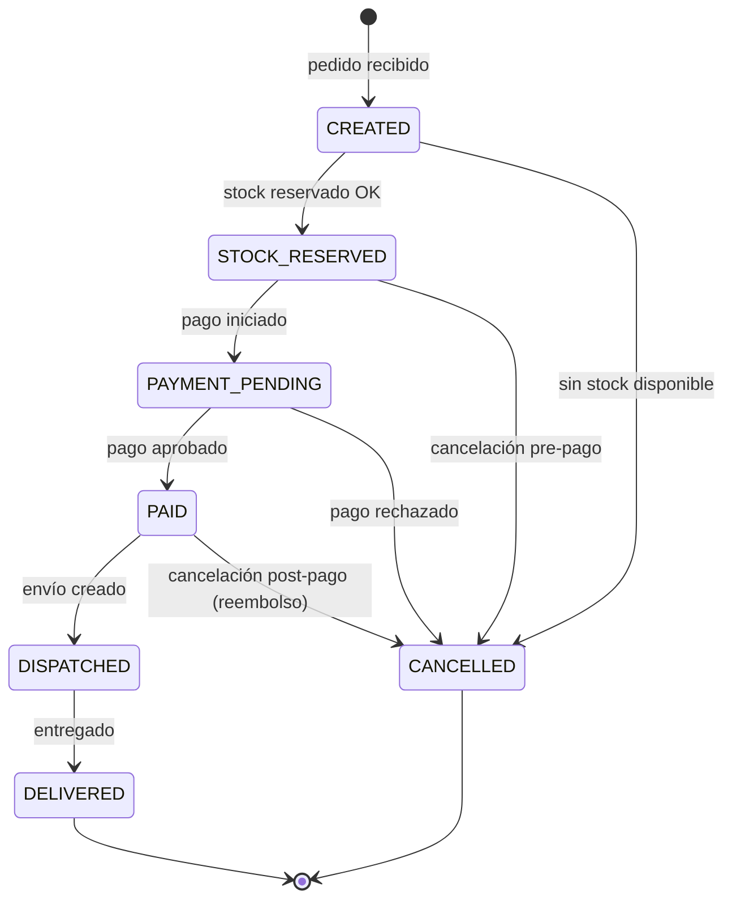

### Modelo de datos

```sql
CREATE TABLE orders (
    id          BIGSERIAL PRIMARY KEY,
    customer_id BIGINT         NOT NULL,      -- referencia soft (no FK a otra BD)
    branch_id   BIGINT,                       -- NULL para pedidos web
    type        VARCHAR(20)    NOT NULL CHECK (type IN ('ONLINE','IN_STORE','WHOLESALE')),
    status      VARCHAR(30)    NOT NULL,
    subtotal    DECIMAL(10,2)  NOT NULL,
    discount    DECIMAL(10,2)  DEFAULT 0,
    tax         DECIMAL(10,2)  NOT NULL,
    total       DECIMAL(10,2)  NOT NULL,
    notes       TEXT,
    created_at  TIMESTAMP      DEFAULT NOW(),
    updated_at  TIMESTAMP      DEFAULT NOW()
);

CREATE TABLE order_items (
    id           BIGSERIAL PRIMARY KEY,
    order_id     BIGINT         NOT NULL REFERENCES orders(id),
    product_sku  VARCHAR(20)    NOT NULL,       -- snapshot, no FK
    product_name VARCHAR(200)   NOT NULL,       -- snapshot del nombre al momento
    unit_price   DECIMAL(10,2)  NOT NULL,       -- snapshot del precio al momento
    quantity     INT            NOT NULL,
    subtotal     DECIMAL(10,2)  NOT NULL        -- unit_price * quantity
);

CREATE TABLE order_status_history (
    id          BIGSERIAL PRIMARY KEY,
    order_id    BIGINT      NOT NULL REFERENCES orders(id),
    from_status VARCHAR(30),
    to_status   VARCHAR(30) NOT NULL,
    reason      TEXT,
    changed_at  TIMESTAMP   DEFAULT NOW()
);
```

> **¿Por qué `product_name` y `unit_price` en `order_items`?**
> El precio y el nombre pueden cambiar en el catálogo. El historial de pedidos debe reflejar el precio pagado, no el precio actual.

### Saga de creación de pedido

```java
@Service
public class OrderCreationSaga {

    @Transactional
    public Order createOrder(CreateOrderRequest request) {

        // Paso 1: validar cliente (síncrono — necesitamos saber si existe)
        CustomerDTO customer = customerClient.getCustomer(request.customerId());
        // Si falla: 404 al usuario, no se crea nada

        // Paso 2: obtener precios del catálogo (síncrono — necesitamos el precio)
        List<ProductPriceDTO> prices = catalogClient.getPrices(
            request.items().stream().map(CreateOrderItem::sku).toList()
        );

        // Paso 3: reservar stock (síncrono — necesitamos confirmación)
        ReservationResult reservation = inventoryClient.reserve(
            buildReservationRequest(request.items(), request.warehouseId())
        );
        if (!reservation.isSuccess()) {
            throw new InsufficientStockException(reservation.details());
        }

        // Paso 4: crear la orden en BD
        Order order = orderRepository.save(buildOrder(request, prices, reservation));

        // Paso 5: publicar evento (asíncrono — el pago se coordina independientemente)
        eventPublisher.publish(new OrderCreatedEvent(order));

        return order;
    }

    // Compensación: si algo falla después del paso 3, liberar la reserva
    @EventListener
    public void onPaymentFailed(PaymentFailedEvent event) {
        inventoryClient.release(event.orderId());
        updateOrderStatus(event.orderId(), OrderStatus.CANCELLED, "Pago rechazado");
    }
}
```

---

## customer-service (Puerto 8006)

### Responsabilidad

Registro y gestión del **perfil de compradores**. Este servicio es de datos maestros: es la fuente de verdad sobre quién es un cliente.

### Modelo de datos

```sql
CREATE TABLE customers (
    id           BIGSERIAL PRIMARY KEY,
    email        VARCHAR(254) UNIQUE NOT NULL,
    rut          VARCHAR(12)  UNIQUE,
    first_name   VARCHAR(100) NOT NULL,
    last_name    VARCHAR(100) NOT NULL,
    phone        VARCHAR(20),
    birth_date   DATE,
    is_active    BOOLEAN      DEFAULT true,
    created_at   TIMESTAMP    DEFAULT NOW()
);

CREATE TABLE customer_addresses (
    id           BIGSERIAL PRIMARY KEY,
    customer_id  BIGINT       NOT NULL REFERENCES customers(id),
    alias        VARCHAR(50),           -- ej: "Casa", "Trabajo"
    street       VARCHAR(200) NOT NULL,
    city         VARCHAR(100) NOT NULL,
    region       VARCHAR(100) NOT NULL,
    zip_code     VARCHAR(10),
    is_default   BOOLEAN      DEFAULT false
);
```

### APIs

```
POST /api/v1/customers                              → registrar cliente
GET  /api/v1/customers/{id}                         → perfil
PUT  /api/v1/customers/{id}                         → actualizar datos
GET  /api/v1/customers/by-email/{email}             → buscar por email
GET  /api/v1/customers/{id}/addresses               → direcciones
POST /api/v1/customers/{id}/addresses               → agregar dirección
PUT  /api/v1/customers/{id}/addresses/{addressId}/default → marcar como default
```

### Eventos publicados

```json
{ "type": "CustomerRegistered", "customerId": 456, "email": "ana@ejemplo.cl" }
{ "type": "CustomerUpdated",    "customerId": 456, "changedFields": ["phone"] }
```

---

## loyalty-service (Puerto 8008)

### Responsabilidad

El programa **ClubFabri**: acumulación de puntos, canjes y niveles de cliente.

### Lógica de acumulación

```java
@Service
public class PointsCalculationService {

    // Regla base: $1.000 CLP = 10 puntos
    private static final BigDecimal POINTS_PER_PESO = new BigDecimal("0.01");

    public int calculatePoints(BigDecimal orderAmount, String customerTier) {
        BigDecimal basePoints = orderAmount.multiply(POINTS_PER_PESO);
        BigDecimal multiplier = switch (customerTier) {
            case "BRONZE"   -> BigDecimal.ONE;
            case "SILVER"   -> new BigDecimal("1.5");
            case "GOLD"     -> new BigDecimal("2.0");
            case "PLATINUM" -> new BigDecimal("3.0");
            default         -> BigDecimal.ONE;
        };
        return basePoints.multiply(multiplier).intValue();
    }

    // Recalcular tier después de cada acumulación
    public String calculateTier(int totalPoints) {
        if (totalPoints >= 5000) return "PLATINUM";
        if (totalPoints >= 2000) return "GOLD";
        if (totalPoints >= 500)  return "SILVER";
        return "BRONZE";
    }
}
```

### Consumo del evento OrderPaid

```java
@Component
public class OrderPaidEventHandler {

    @KafkaListener(topics = "orders.events")
    public void handleOrderEvent(OrderEvent event) {
        if (!"OrderPaid".equals(event.type())) return;

        LoyaltyAccount account = accountRepository
            .findByCustomerId(event.customerId())
            .orElseThrow();

        int pointsToAdd = pointsCalculator.calculatePoints(
            event.totalAmount(),
            account.getTier()
        );

        account.addPoints(pointsToAdd);
        String newTier = pointsCalculator.calculateTier(account.getTotalPoints());

        if (!newTier.equals(account.getTier())) {
            account.setTier(newTier);
            // Publicar evento de upgrade de tier
            eventPublisher.publish(new TierUpgradedEvent(account.getCustomerId(), newTier));
        }

        accountRepository.save(account);
    }
}
```

---

## shipping-service (Puerto 8009)

### Responsabilidad

Gestiona **todos los envíos**: reabastecimiento de sucursales (flota propia) y envíos a clientes (flota propia + carriers externos).

### Selección automática de carrier

```java
@Service
public class CarrierSelectionService {

    public Carrier selectCarrier(ShipmentRequest request) {
        // Regla 1: si es transferencia a sucursal → flota propia siempre
        if (request.type() == ShipmentType.REPLENISHMENT) {
            return fleetCarrier;
        }

        // Regla 2: si el peso > 30kg y es Región Metropolitana → flota propia
        if (request.totalWeightKg() > 30 &&
            request.destination().region().equals("Metropolitana")) {
            return fleetCarrier;
        }

        // Regla 3: si el cliente pagó envío express → DHL
        if (request.serviceLevel() == ServiceLevel.EXPRESS) {
            return dhlAdapter;
        }

        // Regla 4: destino norte del país → Starken
        List<String> northRegions = List.of("Arica y Parinacota", "Tarapacá", "Antofagasta", "Atacama");
        if (northRegions.contains(request.destination().region())) {
            return starkenAdapter;
        }

        // Regla 5: default → Chilexpress (mejor precio en rutas estándar)
        return chilexpressAdapter;
    }
}
```

### Tracking en tiempo real

Los carriers envían **webhooks** cuando el estado del envío cambia. Shipping-service expone endpoints para recibirlos:

```
POST /webhooks/starken    → recibe actualizaciones de Starken
POST /webhooks/chilexpress → recibe actualizaciones de Chilexpress
POST /webhooks/dhl        → recibe actualizaciones de DHL
```

Al recibir el webhook, actualiza el estado del `Shipment` y publica un evento:

```java
@PostMapping("/webhooks/starken")
public ResponseEntity<Void> receiveStarkenWebhook(
        @RequestBody StarkenWebhookPayload payload,
        @RequestHeader("X-Starken-Signature") String signature) {

    // Verificar firma para autenticar que viene de Starken
    if (!starkenSignatureVerifier.verify(payload, signature)) {
        return ResponseEntity.status(401).build();
    }

    ShipmentStatus newStatus = starkenAdapter.translateStatus(payload.getEstado());
    shipmentService.updateStatus(payload.getNroSeguimiento(), newStatus);

    return ResponseEntity.ok().build();
}
```

---

## payment-service (Puerto 8010)

### Responsabilidad

Procesamiento de **pagos y facturación electrónica**. Integra con pasarelas de pago externas (Webpay, Flow, Stripe).

### Modelo de datos

```sql
CREATE TABLE payments (
    id             BIGSERIAL PRIMARY KEY,
    order_id       BIGINT         NOT NULL,     -- referencia soft
    amount         DECIMAL(10,2)  NOT NULL,
    currency       VARCHAR(3)     DEFAULT 'CLP',
    method         VARCHAR(20)    NOT NULL CHECK (method IN ('WEBPAY','FLOW','STRIPE','CASH','TRANSFER')),
    status         VARCHAR(20)    NOT NULL,
    external_id    VARCHAR(100),               -- ID de la transacción en el proveedor
    failure_reason TEXT,
    processed_at   TIMESTAMP,
    created_at     TIMESTAMP      DEFAULT NOW()
);

CREATE TABLE invoices (
    id             BIGSERIAL PRIMARY KEY,
    order_id       BIGINT         NOT NULL,
    customer_id    BIGINT         NOT NULL,
    invoice_number VARCHAR(20)    UNIQUE NOT NULL,
    type           VARCHAR(10)    CHECK (type IN ('BOLETA','FACTURA')),
    status         VARCHAR(20)    NOT NULL DEFAULT 'PENDING',
    pdf_url        TEXT,
    issued_at      TIMESTAMP
);
```

### Integración con Webpay (Transbank)

```java
@Service
public class WebpayPaymentGateway implements PaymentGateway {

    @Override
    public PaymentInitResult initiate(PaymentRequest request) {
        // Llamada a SDK de Transbank
        TransactionCreateResponse response = Transaction.create(
            generateBuyOrder(request.orderId()),
            generateSessionId(),
            request.amount().doubleValue(),
            request.returnUrl()   // URL de retorno tras pago
        );

        return new PaymentInitResult(
            response.getUrl() + "?token_ws=" + response.getToken(),
            response.getToken()
        );
    }

    @Override
    public PaymentConfirmResult confirm(String token) {
        TransactionCommitResponse response = Transaction.commit(token);

        return new PaymentConfirmResult(
            response.getStatus().equals("AUTHORIZED"),
            response.getAuthorizationCode(),
            response.getResponseCode()
        );
    }
}
```

---

*← [05 — Mapa de Servicios](./05_mapa-servicios.md) | Siguiente: [07 — Servicios Auxiliares →](./07_servicios-auxiliares.md)*


<!-- START OF FILE: docs_extras_monolito-a-microservicios_07_servicios-auxiliares.md -->
# Documento: docs extras monolito-a-microservicios 07 servicios-auxiliares
---
# 07 — Servicios auxiliares

← [Volver al índice](./README.md)

---

## ¿Qué hace a un servicio "auxiliar"?

Los servicios auxiliares son **capacidades técnicas transversales** que no pertenecen a ningún dominio de negocio específico, sino que apoyan a múltiples servicios. Sus características:

| Característica | Descripción |
|----------------|-------------|
| **Sin lógica de negocio propia** | No saben si el pedido es urgente o si el cliente es Gold |
| **Consumidores de eventos o API calls** | Reciben instrucciones claras: "envía este email", "genera este PDF" |
| **Encapsulamiento de dependencias externas** | Ocultan la complejidad de SendGrid, Firebase, iText, etc. |
| **Reusables** | Los 10 servicios de dominio pueden usarlos sin duplicar código |
| **Sin estado de negocio** | No guardan entidades de negocio — solo metadata técnica (logs, plantillas) |

---

## auth-service (Puerto 8011)

### Responsabilidades

Gestionar la **identidad y autenticación** de todos los usuarios del sistema:
- Empleados internos (cajeros, bodegueros, gerentes, admins de TI)
- Clientes externos (compradores del e-commerce)

> `auth-service` gestiona **credenciales**. `customer-service` gestiona **perfiles**. Son responsabilidades distintas: un cliente puede existir en `customer-service` sin haberse registrado en la app (fue atendido en tienda física).

### JWT: estructura del token

```json
{
  "header": { "alg": "RS256", "typ": "JWT" },
  "payload": {
    "sub": "456",                             // userId
    "email": "ana@ejemplo.cl",
    "roles": ["CUSTOMER"],                    // o ["EMPLOYEE", "CASHIER", "BRANCH_MANAGER"]
    "branchId": null,                         // para empleados de sucursal
    "iat": 1714168800,                        // issued at
    "exp": 1714172400                         // expires (1 hora)
  }
}
```

### Flujo de autenticación

```
1. Cliente → POST /api/v1/auth/login { email, password }
2. auth-service verifica password con bcrypt
3. auth-service genera:
   - access_token  (JWT, expira en 1 hora)
   - refresh_token (UUID opaco, expira en 30 días, guardado en BD)
4. Responde: { access_token, refresh_token, expiresIn: 3600 }

5. Para renovar sin pedir contraseña de nuevo:
   POST /api/v1/auth/refresh { refresh_token }
   → nuevo access_token
```

### RBAC (Role-Based Access Control)

```java
// Roles del sistema
public enum Role {
    // Clientes externos
    CUSTOMER,

    // Empleados internos
    EMPLOYEE,
    CASHIER,           // vendedor en sucursal
    WAREHOUSE_STAFF,   // bodeguero
    BRANCH_MANAGER,    // jefe de sucursal
    PRODUCTION_STAFF,  // operario de fabricación
    PROCUREMENT_STAFF, // abastecimiento

    // Administración
    MANAGER,           // gerente
    ADMIN              // TI - acceso total
}
```

```java
// En cada microservicio: extrae y valida el rol del JWT
@Component
public class JwtAuthFilter extends OncePerRequestFilter {

    @Override
    protected void doFilterInternal(HttpServletRequest request,
                                    HttpServletResponse response,
                                    FilterChain chain) throws IOException, ServletException {
        String token = extractToken(request);
        if (token != null && jwtVerifier.isValid(token)) {
            Claims claims = jwtVerifier.parse(token);
            String userId = claims.getSubject();
            List<String> roles = claims.get("roles", List.class);

            UsernamePasswordAuthenticationToken auth =
                new UsernamePasswordAuthenticationToken(userId, null, toAuthorities(roles));
            SecurityContextHolder.getContext().setAuthentication(auth);
        }
        chain.doFilter(request, response);
    }
}
```

```java
// Uso en controller
@PostMapping("/api/v1/products")
@PreAuthorize("hasRole('ADMIN')")   // solo admins pueden crear productos
public ResponseEntity<Product> createProduct(@RequestBody @Valid ProductRequest req) { ... }

@GetMapping("/api/v1/products")
@PreAuthorize("permitAll()")        // público
public ResponseEntity<Page<Product>> listProducts(...) { ... }
```

---

## notification-service (Puerto 8012)

### Canales de notificación

| Canal | Tecnología | Casos de uso |
|-------|-----------|--------------|
| **Push Android** | Firebase Cloud Messaging (FCM) | Pedido listo, envío en camino, oferta |
| **Push iOS** | Apple Push Notification Service (APNs) | Ídem |
| **SMS** | Twilio | OTP, alerta crítica de entrega |
| **In-app** | WebSocket (STOMP) | Notificación en panel de empleados |

### Arquitectura interna

```java
// Router: decide qué adapter usar según el canal
@Service
public class NotificationRouter {

    private final Map<String, NotificationAdapter> adapters;

    public NotificationRouter(FcmAdapter fcm, ApnsAdapter apns,
                              TwilioAdapter twilio, WebSocketAdapter ws) {
        this.adapters = Map.of(
            "PUSH_ANDROID", fcm,
            "PUSH_IOS",     apns,
            "SMS",          twilio,
            "IN_APP",       ws
        );
    }

    public void send(NotificationRequest request) {
        NotificationAdapter adapter = adapters.get(request.channel());
        if (adapter == null) {
            throw new UnsupportedChannelException(request.channel());
        }
        adapter.send(request);
    }
}
```

### Preferencias del usuario

`notification-service` mantiene las preferencias de notificación de cada usuario:

```sql
CREATE TABLE notification_preferences (
    user_id          VARCHAR(50) PRIMARY KEY,
    push_enabled     BOOLEAN DEFAULT true,
    sms_enabled      BOOLEAN DEFAULT false,
    order_updates    BOOLEAN DEFAULT true,
    promotions       BOOLEAN DEFAULT true,
    device_token_android TEXT,
    device_token_ios     TEXT,
    phone_number         VARCHAR(20)
);
```

### Consumo de eventos

```java
@KafkaListener(topics = {"orders.events", "shipments.events", "loyalty.events"})
public void handleEvent(DomainEvent event) {
    NotificationRequest request = switch (event.type()) {
        case "OrderPaid"          -> buildOrderConfirmedNotification(event);
        case "ShipmentDispatched" -> buildShipmentNotification(event);
        case "ShipmentDelivered"  -> buildDeliveredNotification(event);
        case "TierUpgraded"       -> buildTierUpgradeNotification(event);
        default                   -> null;
    };

    if (request != null) {
        router.send(request);
    }
}
```

---

## email-service (Puerto 8013)

### Arquitectura de plantillas

Los emails usan **Thymeleaf** para el renderizado HTML. Las plantillas viven en el servicio:

```
email-service/src/main/resources/
└── templates/
    ├── order-confirmed.html
    ├── shipment-dispatched.html
    ├── invoice-ready.html
    ├── loyalty-tier-upgrade.html
    ├── stock-alert.html
    └── partials/
        ├── header.html     (logo + colores corporativos de FabriTech)
        └── footer.html     (datos legales, links de baja)
```

### Renderizado de un email

```java
@Service
public class EmailTemplateRenderer {

    private final TemplateEngine templateEngine;

    public String render(String templateName, Map<String, Object> variables) {
        Context ctx = new Context(Locale.forLanguageTag("es-CL"));
        variables.forEach(ctx::setVariable);
        return templateEngine.process(templateName, ctx);
    }
}
```

```html
<!-- templates/order-confirmed.html -->
<!DOCTYPE html>
<html xmlns:th="http://www.thymeleaf.org">
<body>
  <div th:replace="partials/header :: header"></div>

  <h1>Hola, <span th:text="${customerName}">Cliente</span> 👋</h1>
  <p>Tu pedido <strong th:text="'#' + ${orderId}">ORD-7821</strong> fue confirmado.</p>

  <table>
    <tr th:each="item : ${items}">
      <td th:text="${item.productName}"></td>
      <td th:text="${item.quantity}"></td>
      <td th:text="${#numbers.formatCurrency(item.subtotal)}"></td>
    </tr>
  </table>

  <p><strong>Total: <span th:text="${#numbers.formatCurrency(total)}"></span></strong></p>

  <div th:replace="partials/footer :: footer"></div>
</body>
</html>
```

### Proveedores de email soportados

| Proveedor | Ventaja | Configuración |
|-----------|---------|---------------|
| **SendGrid** | Analítica avanzada, alta deliverability | API key |
| **AWS SES** | Costo muy bajo (volumen alto) | IAM credentials |
| **Mailgun** | Simple, buen soporte LATAM | API key |
| **SMTP propio** | Control total, para on-premise | host + credentials |

El proveedor se selecciona via variable de entorno — el código no cambia:

```yaml
# application.yml
email:
  provider: sendgrid    # o: ses | mailgun | smtp
  sendgrid:
    api-key: ${SENDGRID_API_KEY}
  from: noreply@fabritech.cl
  from-name: FabriTech
```

### Manejo de fallos y reintentos

```java
@KafkaListener(topics = "email.requests")
@RetryableTopic(
    attempts = "3",
    backoff = @Backoff(delay = 5000, multiplier = 2),  // 5s, 10s, 20s
    dltTopicSuffix = "-dlt"    // Dead Letter Topic para emails que no se pudieron enviar
)
public void handleEmailRequest(EmailRequest request) {
    emailSender.send(request);
}
```

Los emails que fallan 3 veces van al **Dead Letter Topic** `email.requests-dlt`, donde un proceso de monitoreo alerta al equipo de TI.

---

## pdf-service (Puerto 8014)

### Stack de generación de PDFs

```
1. Thymeleaf          → renderiza el HTML con datos dinámicos
2. Flying Saucer      → convierte el HTML/CSS a un árbol de rendering
3. iText / OpenPDF    → genera el archivo PDF binario
4. ResponseEntity<byte[]> → entrega el PDF directamente en la respuesta HTTP
```

### Plantillas disponibles

| Template | Descripción | Quién lo solicita |
|----------|-------------|-------------------|
| `INVOICE_BOLETA` | Boleta electrónica (datos simplificados) | `payment-service` |
| `INVOICE_FACTURA` | Factura con datos del emisor y receptor | `payment-service` |
| `DISPATCH_GUIDE` | Guía de despacho para el chofer | `shipping-service` |
| `PURCHASE_ORDER` | Orden de compra para el proveedor | `procurement-service` |
| `PICKING_LIST` | Lista de picking para bodeguero | `order-service` |
| `PRODUCTION_ORDER` | Orden de producción con BOM | `manufacturing-service` |
| `SALES_REPORT` | Reporte de ventas en PDF | `report-service` |

### API REST

```
POST /api/v1/pdf/generate
Content-Type: application/json

{
  "template": "INVOICE_BOLETA",
  "filename": "boleta-7821",
  "data": {
    "invoiceNumber": "B-00042156",
    "issuedAt": "2026-04-26T15:30:00",
    "seller": {
      "name": "FabriTech S.A.",
      "rut": "76.123.456-7",
      "address": "Av. Independencia 1234, Pudahuel"
    },
    "items": [
      { "description": "Aspiradora Robótica FT-ASP-001", "qty": 1, "price": 89990 }
    ],
    "total": 89990
  }
}

→ 200 OK
Content-Type: application/pdf
Content-Disposition: attachment; filename="boleta-7821-2026.pdf"

<bytes del PDF>
```

### Entrega del PDF como respuesta HTTP

```java
@RestController
@RequestMapping("/api/v1/pdf")
public class PdfController {

    private final PdfGenerationService pdfService;

    @PostMapping(value = "/generate", produces = MediaType.APPLICATION_PDF_VALUE)
    public ResponseEntity<byte[]> generate(@RequestBody PdfRequest request) {
        byte[] pdfBytes = pdfService.generate(request.template(), request.data());

        return ResponseEntity.ok()
            .header(HttpHeaders.CONTENT_DISPOSITION,
                    "attachment; filename=\"" + request.filename() + ".pdf\"")
            .contentType(MediaType.APPLICATION_PDF)
            .contentLength(pdfBytes.length)
            .body(pdfBytes);
    }
}
```

> 📖 **En producción:** cuando el PDF debe persistir o compartirse por URL, se sube a un sistema de almacenamiento de objetos (S3, MinIO, Google Cloud Storage) y se retorna una URL pre-firmada con tiempo de expiración. En el contexto del curso, la entrega directa en la respuesta es el enfoque adecuado.

### Almacenamiento en S3 (referencia para producción)

```java
// ⚠️ Requiere AWS SDK o MinIO Client — fuera del scope del curso
@Service
public class PdfStorageService {

    private final S3Client s3;

    public String uploadAndGetUrl(String filename, byte[] pdfBytes) {
        PutObjectRequest request = PutObjectRequest.builder()
            .bucket("fabritech-documents")
            .key("invoices/" + filename + ".pdf")
            .contentType("application/pdf")
            .build();

        s3.putObject(request, RequestBody.fromBytes(pdfBytes));

        // URL pre-firmada válida por 24 horas
        GetObjectPresignRequest presignRequest = GetObjectPresignRequest.builder()
            .signatureDuration(Duration.ofHours(24))
            .getObjectRequest(b -> b.bucket("fabritech-documents")
                                    .key("invoices/" + filename + ".pdf"))
            .build();

        return s3Presigner.presignGetObject(presignRequest).url().toString();
    }
}
```

---

## report-service (Puerto 8015)

### El problema de los reportes en un monolito

En el monolito, los reportes hacen queries pesadas sobre la BD de producción, compitiendo con las transacciones del negocio. En una temporada alta, un reporte de ventas podía demorar 45 segundos y bloquear otras consultas.

### La solución: CQRS

**Command Query Responsibility Segregation (CQRS)**: separar las operaciones de escritura (commands) de las de lectura (queries).

```
                    WRITE SIDE (transaccional)
order-service   → BD PostgreSQL orders_db (normalizada, rápida para escritura)
                            │
                            │ eventos via Kafka
                            ▼
                    READ SIDE (analítica)
report-service  → BD Elasticsearch / PostgreSQL reports_db
                  (denormalizada, pre-calculada, rápida para lectura)
```

### Modelo de datos denormalizado (para reportes)

```sql
-- Una sola tabla plana con todo lo que necesitan los reportes
-- Se carga desde los eventos de dominio
CREATE TABLE sales_facts (
    id               BIGSERIAL PRIMARY KEY,
    order_id         VARCHAR(20),
    order_date       DATE NOT NULL,
    order_month      VARCHAR(7) NOT NULL,     -- ej: "2026-04"
    branch_id        BIGINT,
    branch_name      VARCHAR(100),
    customer_id      BIGINT,
    customer_tier    VARCHAR(20),
    product_sku      VARCHAR(20),
    product_name     VARCHAR(200),
    category_name    VARCHAR(100),
    quantity         INT,
    unit_price       DECIMAL(10,2),
    subtotal         DECIMAL(10,2),
    discount         DECIMAL(10,2),
    carrier_name     VARCHAR(50),
    payment_method   VARCHAR(20)
);

-- Index para los reportes más frecuentes
CREATE INDEX idx_sales_month       ON sales_facts(order_month);
CREATE INDEX idx_sales_branch      ON sales_facts(branch_id, order_month);
CREATE INDEX idx_sales_product     ON sales_facts(product_sku, order_month);
CREATE INDEX idx_sales_customer    ON sales_facts(customer_id);
```

### Consumer de eventos

```java
@KafkaListener(topics = {"orders.events", "shipments.events"})
public void handleEvent(DomainEvent event) {
    if ("OrderPaid".equals(event.type())) {
        // Construye y persiste los "hechos" de la venta
        List<SalesFact> facts = event.items().stream()
            .map(item -> SalesFact.builder()
                .orderId(event.orderId())
                .orderDate(event.paidAt().toLocalDate())
                .orderMonth(YearMonth.from(event.paidAt()).toString())
                .branchId(event.branchId())
                .branchName(event.branchName())   // denormalizado
                .productSku(item.sku())
                .productName(item.name())          // denormalizado
                .quantity(item.quantity())
                .unitPrice(item.unitPrice())
                .subtotal(item.subtotal())
                .build())
            .toList();

        salesFactRepository.saveAll(facts);
    }
}
```

### APIs de reportes

```
GET /api/v1/reports/sales
    ?from=2026-01-01&to=2026-04-30
    &groupBy=branch                    → ventas por sucursal
    &groupBy=product                   → ventas por producto
    &groupBy=category                  → ventas por categoría
    &format=json|csv|pdf               → formato de salida

GET /api/v1/reports/inventory/current  → snapshot actual de stock
GET /api/v1/reports/loyalty/top-customers?limit=50 → mejores clientes por LTV
GET /api/v1/reports/production/monthly → resumen de producción del mes
```

### Latencia de datos (eventual consistency)

Los datos del `report-service` tienen un retraso de **segundos** respecto a los datos transaccionales, ya que se alimentan de eventos Kafka. Este retraso es **aceptable para reportes** (nadie necesita un reporte en tiempo real al milisegundo), pero debe comunicarse a los usuarios del backoffice.

---

*← [06 — Descripción de Servicios](./06_descripcion-servicios.md) | Siguiente: [08 — Comunicación →](./08_comunicacion.md)*


<!-- START OF FILE: docs_extras_monolito-a-microservicios_08_comunicacion.md -->
# Documento: docs extras monolito-a-microservicios 08 comunicacion
---
# 08 — Comunicación entre servicios

← [Volver al índice](./README.md)

---

> 🎯 **Scope del curso DSY1103:** En el curso trabajamos exclusivamente con **comunicación síncrona** (RestClient / FeignClient). Es el patrón más directo y suficiente para los proyectos del curso.
>
> 📖 **La sección de comunicación asíncrona (Kafka, Message Broker, eventos)** es **complementaria** — no evaluada, pero muy recomendada. En el mundo real la mayoría de arquitecturas de microservicios maduras combinan ambos estilos.

---

## Sincrónico vs. Asincrónico

La decisión más importante en la arquitectura de microservicios es cuándo usar comunicación **síncrona** (el llamante espera la respuesta) y cuándo **asíncrona** (el llamante no espera).

### La regla de oro

> **Sincrónico:** cuando el resultado afecta la respuesta al usuario en la misma petición.  
> **Asincrónico:** para todo lo demás.

### Cuadro comparativo

| Aspecto | REST Síncrono | Eventos Asíncronos |
|---------|--------------|-------------------|
| **Acoplamiento temporal** | Alto — ambos deben estar disponibles | Bajo — el productor no necesita al consumidor |
| **Latencia** | La del servicio más lento de la cadena | Baja en el productor; el consumidor procesa después |
| **Confiabilidad** | Si el target falla, falla el llamante | Si el consumidor falla, reintenta cuando vuelve |
| **Trazabilidad** | Fácil (stack trace lineal) | Requiere correlation ID + distributed tracing |
| **Consistencia** | Inmediata | Eventual |
| **Caso de uso ideal** | Validaciones bloqueantes, leer datos | Notificaciones, propagar cambios, coordinar workflows |

### Mapa de comunicaciones de FabriTech

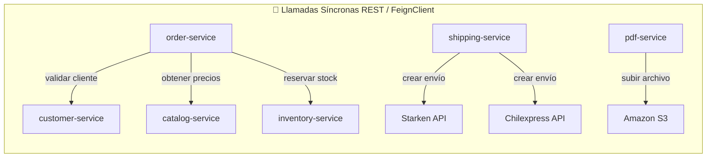

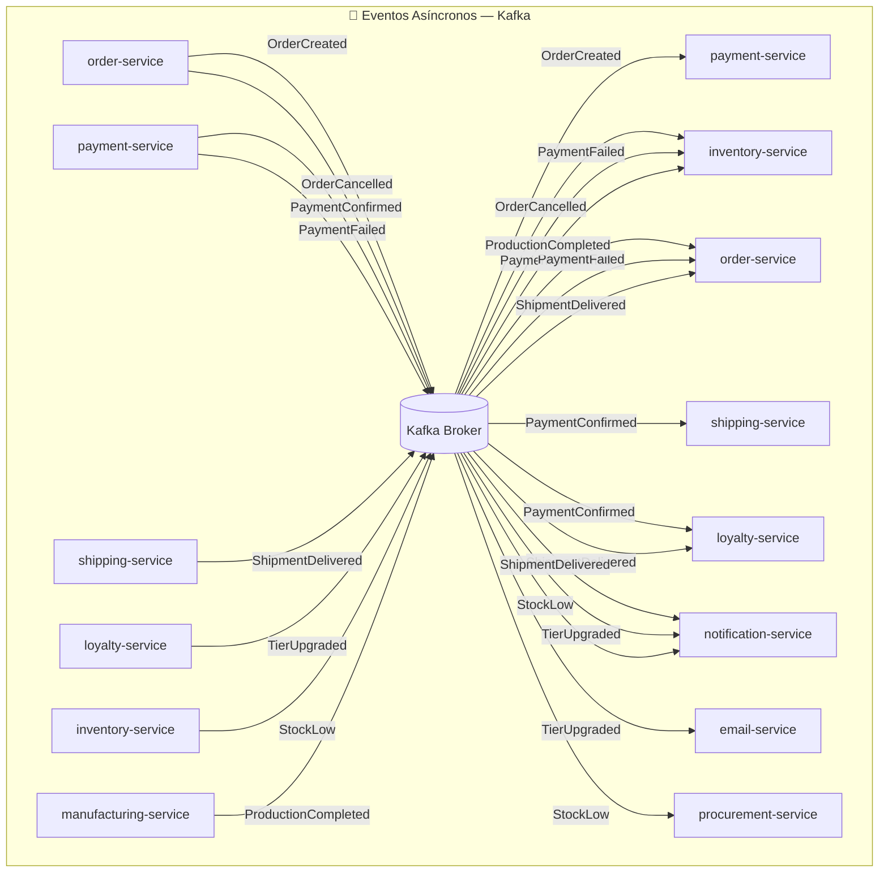

---

## REST Síncrono con FeignClient

Spring Cloud OpenFeign simplifica las llamadas HTTP entre servicios:

```java
// Declarar el cliente (en order-service)
@FeignClient(
    name = "inventory-service",
    fallbackFactory = InventoryClientFallback.class
)
public interface InventoryClient {

    @PostMapping("/api/v1/stock/reserve")
    ReservationResult reserve(@RequestBody ReservationRequest request);

    @PostMapping("/api/v1/stock/release")
    void release(@RequestParam String orderId);

    @GetMapping("/api/v1/stock/{warehouseId}/{sku}")
    StockInfo getStock(@PathVariable Long warehouseId, @PathVariable String sku);
}
```

### Configuración de timeout

```yaml
# application.yml de order-service
spring:
  cloud:
    openfeign:
      client:
        config:
          inventory-service:
            connectTimeout: 2000     # 2 seg para conectar
            readTimeout: 5000        # 5 seg para leer la respuesta
          default:
            connectTimeout: 3000
            readTimeout: 8000
```

---

## Circuit Breaker con Resilience4j

El **Circuit Breaker** protege al sistema cuando un servicio dependiente falla o es lento. Funciona como un interruptor eléctrico: cuando detecta demasiados fallos, "abre el circuito" y deja de hacer llamadas, retornando una respuesta de fallback inmediata.

### Estados del Circuit Breaker

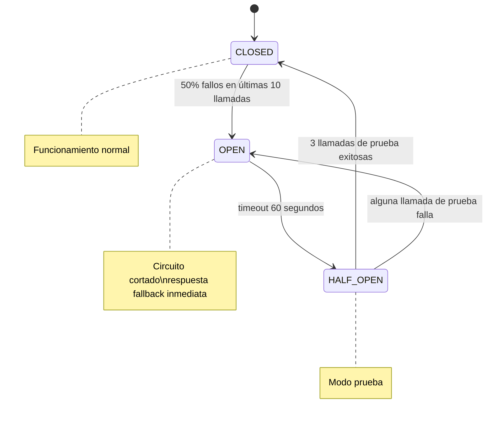

### Implementación en FabriTech

```yaml
## Configuración (application.yml de order-service)
resilience4j:
  circuitbreaker:
    instances:
      inventory-service:
        slidingWindowSize: 10                      # evalúa las últimas 10 llamadas
        minimumNumberOfCalls: 5                    # mínimo 5 antes de calcular ratio
        failureRateThreshold: 50                   # abre si >50% fallan
        waitDurationInOpenState: 60s               # espera 60s antes de probar
        permittedNumberOfCallsInHalfOpenState: 3
        recordExceptions:
          - java.io.IOException
          - java.util.concurrent.TimeoutException
          - feign.FeignException.ServiceUnavailable

      catalog-service:
        slidingWindowSize: 20
        failureRateThreshold: 40
        waitDurationInOpenState: 30s
```

```java
// Uso en el servicio
@Service
public class OrderCreationService {

    @CircuitBreaker(name = "inventory-service", fallbackMethod = "handleInventoryUnavailable")
    @TimeLimiter(name = "inventory-service")    // corta si tarda más de 5s
    public CompletableFuture<ReservationResult> reserveStock(ReservationRequest request) {
        return CompletableFuture.supplyAsync(() -> inventoryClient.reserve(request));
    }

    // Fallback: el inventario no está disponible
    public CompletableFuture<ReservationResult> handleInventoryUnavailable(
            ReservationRequest request, Throwable ex) {
        log.warn("inventory-service no disponible: {}", ex.getMessage());
        // Opción 1: rechazar el pedido (conservador — FabriTech eligió esto)
        return CompletableFuture.completedFuture(
            ReservationResult.serviceUnavailable("El inventario está temporalmente no disponible")
        );
        // Opción 2: permitir el pedido sin verificar stock (permisivo — riesgo de oversell)
    }
}
```

### Retry con backoff exponencial

```java
@Retry(name = "external-carriers", fallbackMethod = "carrierFallback")
public ShipmentResult createShipmentInCarrier(ShipmentRequest request) {
    return selectedCarrier.createShipment(request);
}
```

```yaml
resilience4j:
  retry:
    instances:
      external-carriers:
        maxAttempts: 3
        waitDuration: 1s
        enableExponentialBackoff: true
        exponentialBackoffMultiplier: 2        # 1s, 2s, 4s
        retryExceptions:
          - java.io.IOException
          - feign.RetryableException
        ignoreExceptions:
          - cl.fabritech.shipping.CarrierRejectedException  # no reintentar si el carrier rechaza
```

---

## Eventos asíncronos con Kafka

> 📖 **Contenido complementario — fuera del scope de DSY1103**
>
> Kafka y la mensajería asíncrona son temas avanzados que se estudian en cursos de arquitectura distribuida. Lo que sigue es una referencia de cómo se implementa en la práctica, ideal para cuando trabajes en proyectos reales.

### ¿Por qué Kafka?

| Característica | Kafka | RabbitMQ |
|----------------|-------|----------|
| **Persistencia** | Los mensajes persisten días/semanas | Temporal (se elimina al consumir) |
| **Replay** | Sí — un consumidor puede releer eventos pasados | No |
| **Throughput** | Muy alto (millones msg/seg) | Alto (miles msg/seg) |
| **Modelo** | Pull — el consumidor decide cuándo leer | Push — el broker envía cuando hay mensajes |
| **Orden** | Garantizado dentro de una partición | No garantizado |
| **Complejidad** | Mayor (requiere ZooKeeper/KRaft) | Menor |
| **Ideal para** | Event sourcing, auditoría, alta carga | Task queues, RPC asíncrono |

FabriTech elige **Kafka** porque necesita historial de eventos (auditoría) y replay (el `report-service` puede reprocesar eventos históricos para corregir datos).

### Estructura de un evento de dominio

Todos los eventos siguen el formato **CloudEvents**:

```json
{
  "specversion": "1.0",
  "id": "evt-8f2a3b1c",
  "source": "order-service",
  "type": "cl.fabritech.orders.OrderPaid",
  "datacontenttype": "application/json",
  "time": "2026-04-26T15:30:00Z",
  "data": {
    "orderId": "ORD-7821",
    "customerId": 456,
    "totalAmount": 89990,
    "items": [
      { "sku": "FT-ASP-001", "name": "Aspiradora Robótica", "quantity": 1, "unitPrice": 89990 }
    ],
    "paidAt": "2026-04-26T15:30:00Z"
  }
}
```

### Productor en Spring Boot

```java
@Service
public class DomainEventPublisher {

    private final KafkaTemplate<String, DomainEvent> kafkaTemplate;

    public void publish(DomainEvent event) {
        // La clave del mensaje es el ID de la entidad principal
        // → garantiza que eventos del mismo pedido van a la misma partición (orden preservado)
        kafkaTemplate.send(event.topic(), event.entityId(), event)
            .whenComplete((result, ex) -> {
                if (ex != null) {
                    log.error("Error publicando evento {}: {}", event.type(), ex.getMessage());
                    // Guardar en outbox table para reintentar
                    outboxRepository.save(OutboxEntry.from(event));
                }
            });
    }
}
```

### Consumer con idempotencia

Los eventos pueden entregarse más de una vez (Kafka garantiza "al menos una vez"). Los consumers deben ser **idempotentes**:

```java
@KafkaListener(topics = "orders.events", groupId = "loyalty-service")
public void handleOrderEvent(OrderEvent event) {
    // Verificar si ya procesamos este evento (por ID)
    if (processedEventRepository.existsById(event.id())) {
        log.info("Evento {} ya procesado, ignorando", event.id());
        return;
    }

    // Procesar el evento
    if ("OrderPaid".equals(event.type())) {
        loyaltyService.awardPoints(event.customerId(), event.totalAmount());
    }

    // Marcar como procesado (dentro de la misma transacción)
    processedEventRepository.save(new ProcessedEvent(event.id()));
}
```

---

## Saga Pattern: orquestación vs. coreografía

Cuando una operación de negocio abarca múltiples servicios, necesitamos coordinar las compensaciones si algo falla.

### Saga Coreografiada (FabriTech la usa para el flujo de pedido)

Cada servicio escucha eventos y decide qué hacer. No hay un coordinador central.

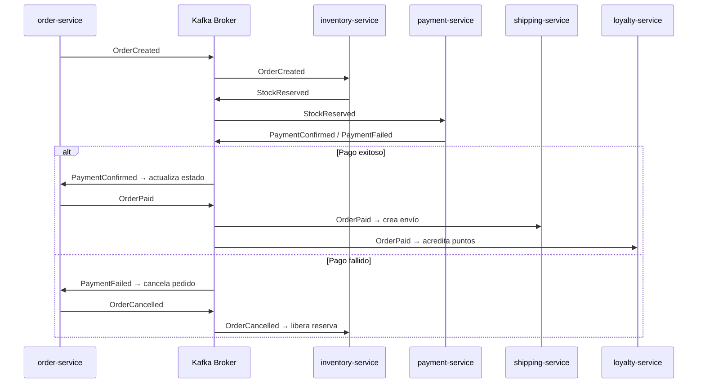

**Ventaja:** simple, sin coordinador central que se convierta en punto de fallo.  
**Desventaja:** difícil de entender el flujo completo si hay muchos servicios.

### Saga Orquestada (para flujos complejos con muchas compensaciones)

Un servicio **orquestador** coordina todos los pasos y compensaciones:

```java
// En order-service: el orquestador de la saga
@Service
public class OrderSagaOrchestrator {

    @Saga  // (con Axon Framework o similar)
    public void handle(StartOrderSagaCommand cmd) {

        // Paso 1
        sendCommand(new ReserveStockCommand(cmd.orderId(), cmd.items()));
    }

    @SagaEventHandler(associationProperty = "orderId")
    public void on(StockReservedEvent event) {
        // Paso 2
        sendCommand(new ProcessPaymentCommand(event.orderId(), event.amount()));
    }

    @SagaEventHandler(associationProperty = "orderId")
    public void on(PaymentFailedEvent event) {
        // Compensación: liberar el stock
        sendCommand(new ReleaseStockCommand(event.orderId()));
        // Marcar saga como fallida
        end();
    }

    @SagaEventHandler(associationProperty = "orderId")
    public void on(PaymentConfirmedEvent event) {
        // Paso 3
        sendCommand(new CreateShipmentCommand(event.orderId()));
        end();    // saga completada exitosamente
    }
}
```

---

## Outbox Pattern: garantía de entrega

Problema: ¿qué pasa si `order-service` guarda el pedido en BD pero luego falla antes de publicar el evento en Kafka?

```
order-service:
  1. BEGIN TRANSACTION
  2. INSERT INTO orders (...)          ← guardar en BD ✓
  3. INSERT INTO outbox (event_data)   ← guardar el evento en BD ✓
  4. COMMIT                            ← transacción atómica
  5. (proceso separado)
     SELECT * FROM outbox WHERE published = false
     → kafkaTemplate.send(event)
     → UPDATE outbox SET published = true
```

El paso 5 es un **Outbox Publisher** que corre en background cada segundo. Así se garantiza que **si el pedido se guardó, el evento se publicará eventualmente** (aunque la app caiga entre los pasos 4 y 5).

---

*← [07 — Servicios Auxiliares](./07_servicios-auxiliares.md) | Siguiente: [09 — Strangler Fig →](./09_strangler-fig.md)*


<!-- START OF FILE: docs_extras_monolito-a-microservicios_09_strangler-fig.md -->
# Documento: docs extras monolito-a-microservicios 09 strangler-fig
---
# 09 — Estrategia de migración: Strangler Fig

← [Volver al índice](./README.md)

---

## El patrón

El **Strangler Fig** (higo estrangulador) toma su nombre de un árbol tropical que crece alrededor de otro árbol existente, reemplazándolo lentamente sin derribar el árbol original hasta que está completamente sustituido.

```mermaid
flowchart TB
    subgraph MON["🏛️ Monolito original"]
        MA["Módulo A ✅ migrado"]
        MB["Módulo B ✅ migrado"]
        MC["Módulo C 🔄 en proceso"]
        MD["Módulo D ⏳ pendiente"]
    end

    subgraph MS["⚙️ Microservicios nuevos"]
        SA["service-a"]
        SB["service-b"]
    end

    GW["🔒 API Gateway\nenruta al monolito o al microservicio"]

    MA -.->|reemplazado por| SA
    MB -.->|reemplazado por| SB

    MON --> GW
    MS --> GW
```

El monolito sigue funcionando durante toda la migración. El API Gateway decide a qué destino enrutar cada request. A medida que los microservicios están listos, el gateway redirige el tráfico y eventualmente el monolito se retira.

---

## Principios del Strangler Fig

1. **Nunca Big Bang** — no se reescribe todo a la vez.
2. **El monolito no cambia** durante la migración de un dominio (o los cambios son mínimos).
3. **Siempre hay rollback** — el API Gateway puede revertir el tráfico al monolito en segundos.
4. **Orden correcto** — se migran primero los dominios con menos dependencias.
5. **Verificación en producción** — cada servicio se prueba con tráfico real antes de retirar el monolito.

---

## Hoja de ruta detallada de FabriTech

### Fase 0: Preparación (semanas 1-4)

**Objetivo:** crear la infraestructura sin tocar el monolito.

```
Tareas:
  ✓ Instalar y configurar el API Gateway (Spring Cloud Gateway)
  ✓ Desplegar el Service Registry (Eureka)
  ✓ Desplegar el Config Server
  ✓ Configurar el stack de observabilidad (Prometheus + Grafana + Zipkin)
  ✓ Implementar el CI/CD pipeline base (GitHub Actions → Docker → Kubernetes)
  ✓ Registrar el monolito en Eureka (como "legacy-service")
  ✓ El API Gateway redirige TODO el tráfico al monolito (estado inicial)

Validación:
  Todo funciona exactamente igual que antes, pero con el Gateway por delante.
```

### Fase 1: auth-service (semanas 5-8)

**Por qué primero:** el módulo de auth es pequeño, bien delimitado y ningún otro módulo depende de él en el sentido de ejecución de negocio (solo lo llaman para validar tokens).

```
Tareas:
  1. Construir auth-service con Spring Boot (JWT, BCrypt, refresh tokens)
  2. Migrar la tabla users del monolito → BD propia de auth-service
     (con script de migración SQL + validación de conteo de registros)
  3. Configurar el Gateway para que /api/v1/auth/** → auth-service
  4. Canary release: 10% del tráfico → auth-service, 90% → monolito
  5. Monitorear durante 48h
  6. Si OK: 100% → auth-service
  7. Eliminar el módulo de auth del monolito
```

**Script de validación post-migración:**
```sql
-- Verificar que todos los usuarios se migraron
SELECT COUNT(*) FROM monolito_db.users;           -- debe coincidir con:
SELECT COUNT(*) FROM auth_db.users;

-- Verificar que los hash de contraseñas son iguales
SELECT u1.email, u1.password_hash = u2.password_hash as match
FROM monolito_db.users u1
JOIN auth_db.users u2 ON u1.email = u2.email
WHERE u1.password_hash != u2.password_hash;        -- debe retornar 0 filas
```

### Fase 2: catalog-service (semanas 9-12)

**Por qué aquí:** el catálogo es principalmente de lectura y tiene pocas escrituras. Migrar los reads primero reduce el riesgo.

```
Tareas:
  1. Construir catalog-service
  2. Migrar tablas: products, categories, product_images
  3. Configurar el Gateway: /api/v1/products/** → catalog-service
  4. El monolito puede seguir leyendo el catálogo vía API (en lugar de la BD)
     [Fase transitoria: el monolito hace HTTP calls a catalog-service]
  5. Canary release → validación → 100%
  6. Eliminar módulo de productos del monolito
```

**Patrón "Monolito llama al nuevo servicio":**

Durante la transición, el monolito llama al nuevo servicio en lugar de a la BD directamente:

```java
// En el monolito, antes de la migración:
@Autowired
private ProductRepository productRepository;

public Product getProduct(String sku) {
    return productRepository.findBySku(sku).orElseThrow();
}

// Durante la transición (monolito llama a catalog-service):
@Autowired
private CatalogServiceClient catalogServiceClient;  // ← nuevo cliente HTTP

public Product getProduct(String sku) {
    // Ya no lee de la BD propia — delega al nuevo servicio
    return catalogServiceClient.getProduct(sku);
}
```

### Fase 3: branch-service (semanas 13-14)

**Por qué aquí:** datos maestros simples, pocas escrituras, bajo riesgo.

```
Tareas:
  1. Construir branch-service
  2. Migrar tabla branches (12 sucursales = pocos registros)
  3. Gateway: /api/v1/branches/** → branch-service
  4. Deploy y validación
```

### Fase 4: customer-service (semanas 15-20)

**Complejidad:** muchos módulos del monolito usan datos de clientes. Requiere más coordinación.

```
Tareas:
  1. Construir customer-service
  2. Migrar tablas: customers, customer_addresses
  3. CUIDADO: orders y invoices tienen FK a customers en el monolito
     → Las FKs deben eliminarse antes de separar las BDs
     → Se reemplaza con referencia por ID (soft reference)
  4. Gateway: /api/v1/customers/** → customer-service
  5. Canary release con período de validación más largo (7 días)
```

**Migración de FK a referencia soft:**

```sql
-- ANTES: FK real
CREATE TABLE orders (
    customer_id BIGINT NOT NULL REFERENCES customers(id)
);

-- PASO 1: eliminar la constraint (la BD ahora solo tiene el ID, sin integridad referencial)
ALTER TABLE orders DROP CONSTRAINT fk_orders_customer;

-- PASO 2: mover la tabla customers a la nueva BD
-- pg_dump -t customers monolito_db | psql customer_db

-- PASO 3: actualizar el código del monolito para obtener datos de clientes via API
-- (no más JOIN — se hace una llamada HTTP a customer-service)
```

### Fase 5: loyalty-service (semanas 21-24)

Depende de customer-service (ya migrado en Fase 4).

```
Tareas:
  1. Construir loyalty-service
  2. Migrar tablas: loyalty_accounts, points_transactions, reward_rules
  3. Subscribir a eventos: CustomerRegistered (de customer-service)
  4. Subscribir a eventos: OrderPaid (cuando order-service esté listo)
     [Transitorio: el monolito publica OrderPaid en Kafka]
  5. Gateway: /api/v1/loyalty/** → loyalty-service
```

### Fases 6-8: PDF, Email, Notification (semanas 25-30)

Servicios sin estado de negocio, fáciles de extraer.

```
Para cada uno:
  1. Construir el servicio auxiliar
  2. Publicar su API
  3. Actualizar el monolito para llamar al servicio auxiliar en lugar de ejecutarlo internamente
  4. Validar
  5. Eliminar el módulo del monolito
```

### Fase 9: inventory-service (semanas 31-38)

El más crítico. Requiere el mayor cuidado.

```
Preparación específica:
  1. Auditar todos los lugares del monolito que leen/escriben inventario
     (pueden ser decenas de sitios)
  2. Definir el contrato de API completo antes de construir
  3. Construir con tests de integración exhaustivos
  4. Implementar el patrón de reserva (reserve/confirm/release) en paralelo con el monolito
  5. Período de "Parallel Run": ambos sistemas actualizan el stock simultáneamente
     durante 2 semanas, y se verifican que los números coincidan

Parallel Run:
  order-service (monolito) actualiza stock → en monolito_db
  order-service (monolito) también llama → inventory-service (nuevo)
  Se compara el stock entre ambas BDs cada hora
  Si divergen → alerta → investigar causa

  Al cabo de 2 semanas sin divergencias: cortar el monolito, solo inventory-service es la fuente de verdad
```

### Fase 10: order-service (semanas 39-48)

El más complejo. Depende de inventory-service (Fase 9), customer-service (Fase 4) y catalog-service (Fase 2).

```
Desafíos específicos:
  - El OrderService del monolito tiene 1.247 líneas → dividir en:
    * OrderCreationSaga (Paso 1-4 del flujo)
    * OrderStateMachine (máquina de estados)
    * OrderQueryService (búsquedas, historial)
  - Migrar historial de pedidos (años de datos)
    → Script de migración por lotes (100.000 registros a la vez)
    → Validar sumas de subtotales para verificar integridad
```

### Fases 11-15: payment, shipping, procurement, manufacturing, report

Continúan con el mismo patrón. La última en retirarse es la tabla "central" del monolito.

### Fase Final: retirar el monolito

```
Condiciones de salida:
  ✓ 0% del tráfico enrutado al monolito por el Gateway
  ✓ 30 días sin incidentes relacionados con la migración
  ✓ Todos los tests de humo pasan en el nuevo stack
  ✓ El equipo de TI tiene runbooks actualizados para cada servicio

Acciones:
  1. Desactivar el proceso del monolito
  2. Hacer backup final de monolito_db
  3. Archivar el repositorio del monolito (no eliminar — historial valioso)
  4. Festejar 🎉
```

---

## Migración de base de datos: Expand-Contract

La estrategia **Expand-Contract** permite separar una BD monolítica de forma segura:

```
EXPAND:
  1. Agregar las nuevas columnas/tablas en la BD monolítica (sin eliminar las viejas)
  2. El código empieza a escribir en las columnas nuevas Y en las viejas (dual write)

CONTRACT:
  3. Verificar que los datos nuevos son correctos
  4. Eliminar las escrituras a las columnas viejas del código
  5. Eliminar las columnas/tablas viejas de la BD

Ejemplo: separar customer.email del monolito a customer-service
  Expand:   customer_service_db.customers.email ← se crea y empieza a recibir datos
  Contract: monolito.customers.email se elimina del código, luego de la BD
```

---

## Canary Releases durante la migración

Un **Canary Release** envía un pequeño porcentaje del tráfico al nuevo servicio mientras el resto va al monolito. Así se valida el comportamiento en producción con riesgo acotado.

```yaml
# Configuración en el API Gateway (Spring Cloud Gateway)
spring:
  cloud:
    gateway:
      routes:
        # 10% del tráfico va al nuevo inventory-service
        - id: inventory-service-canary
          uri: lb://inventory-service
          predicates:
            - Path=/api/v1/stock/**
            - Weight=inventory-group, 10          # ← 10%
          filters:
            - AuthFilter

        # 90% del tráfico va al monolito
        - id: inventory-monolith
          uri: lb://legacy-monolith
          predicates:
            - Path=/api/v1/stock/**
            - Weight=inventory-group, 90          # ← 90%
```

Se monitorea durante 48h. Si la tasa de error del canary es ≤ la del monolito → aumentar al 50% → luego 100%.

---

*← [08 — Comunicación](./08_comunicacion.md) | Siguiente: [10 — Buenas Prácticas →](./10_buenas-practicas.md)*


<!-- START OF FILE: docs_extras_monolito-a-microservicios_10_buenas-practicas.md -->
# Documento: docs extras monolito-a-microservicios 10 buenas-practicas
---
# 10 — Buenas prácticas

← [Volver al índice](./README.md)

---

## 1. Base de datos por servicio

### La regla

Cada microservicio **posee exclusivamente** su base de datos. Ningún otro servicio puede conectarse a ella directamente.

```
✅ CORRECTO:
  order-service → orders_db (PostgreSQL 5432 interno, no expuesto)
  inventory-service → inventory_db (PostgreSQL 5433 interno, no expuesto)

❌ INCORRECTO:
  order-service → orders_db
  inventory-service → orders_db    ← comparte BD con order-service
```

### ¿Cómo compartir datos sin compartir BD?

| Necesidad | Solución |
|-----------|---------|
| Leer datos de otro servicio | Llamada a su API REST |
| Reaccionar a cambios | Suscribirse a sus eventos (Kafka) |
| Reportes que combinan datos de varios servicios | `report-service` con BD de lectura propia (alimentada por eventos) |
| Datos de referencia que no cambian (ej: lista de países) | Duplicar en cada servicio que los necesita |

### Elección de BD por servicio en FabriTech

| Servicio | BD | Justificación |
|----------|-----|---------------|
| `order-service` | PostgreSQL | Transacciones ACID, consistencia |
| `inventory-service` | PostgreSQL | Transacciones críticas (stock reserva/confirm) |
| `loyalty-service` | PostgreSQL + Redis | PostgreSQL para historial; Redis para el saldo de puntos (acceso rápido) |
| `catalog-service` | PostgreSQL + Redis | Redis para caché de productos (lectura intensiva) |
| `report-service` | Elasticsearch | Full-text search, analítica rápida |
| `auth-service` | PostgreSQL + Redis | Redis para blacklist de tokens revocados |
| `notification-service` | PostgreSQL | Historial de preferencias y notificaciones enviadas |

---

## 2. Versionado de APIs

### ¿Por qué versionar?

```
catalog-service tiene 3 consumers:
  - web (Angular)
  - app Android
  - app iOS
  - order-service (otro microservicio)

Si catalog-service cambia el contrato de /api/v1/products sin versionar,
todos los consumers se rompen al mismo tiempo.
```

### Estrategia de versioning en FabriTech

**Versionado en la URL** (el más claro y visible):

```
/api/v1/products         ← versión actual (soportada indefinidamente)
/api/v2/products         ← nueva versión con campos adicionales
```

### Ciclo de vida de una versión

```
v1 en ACTIVE → anunciar v2 → v1 pasa a DEPRECATED → período de transición (3 meses)
→ v1 pasa a SUNSET (retorna 410 Gone) → v1 se elimina
```

```java
// En el Controller: manejar múltiples versiones
@RestController
@RequestMapping("/api")
public class ProductController {

    // v1: respuesta básica
    @GetMapping("/v1/products/{sku}")
    public ResponseEntity<ProductV1Response> getProductV1(@PathVariable String sku) {
        Product product = productService.getBySku(sku);
        return ResponseEntity.ok(ProductV1Response.from(product));
    }

    // v2: respuesta con imágenes + especificaciones técnicas
    @GetMapping("/v2/products/{sku}")
    public ResponseEntity<ProductV2Response> getProductV2(@PathVariable String sku) {
        Product product = productService.getBySku(sku);
        return ResponseEntity.ok(ProductV2Response.from(product));
    }

    // v1 deprecated: agregar header de advertencia
    @GetMapping("/v1/products")
    @Deprecated(since = "v2.0")
    public ResponseEntity<List<ProductV1Response>> listProductsV1(...) {
        return ResponseEntity.ok()
            .header("Deprecation", "true")
            .header("Sunset", "2026-12-31")
            .header("Link", "/api/v2/products; rel=\"successor-version\"")
            .body(products);
    }
}
```

---

## 3. Observabilidad: los tres pilares

### Pilar 1: Logging estructurado

Los logs deben ser **estructurados** (JSON), no texto plano. Esto permite filtrar y buscar en Elasticsearch/Kibana.

```java
// Configuración de Logback (logback-spring.xml)
// Usar logstash-logback-encoder para JSON

// En el código: siempre usar SLF4J, nunca System.out.println
@Slf4j
@Service
public class OrderCreationService {

    public Order createOrder(CreateOrderRequest request) {
        log.info("Iniciando creación de pedido",
            StructuredArguments.keyValue("customerId", request.customerId()),
            StructuredArguments.keyValue("itemCount", request.items().size()),
            StructuredArguments.keyValue("totalAmount", request.totalAmount())
        );
        // Resultado en JSON:
        // {"message":"Iniciando creación de pedido","customerId":456,"itemCount":3,"totalAmount":89990}
    }
}
```

**Correlation ID:** toda petición recibe un ID único que se propaga entre servicios:

```java
// En el API Gateway: inyectar traceId en cada petición
@Component
public class TraceIdFilter implements GatewayFilter {

    @Override
    public Mono<Void> filter(ServerWebExchange exchange, GatewayFilterChain chain) {
        String traceId = Optional
            .ofNullable(exchange.getRequest().getHeaders().getFirst("X-Trace-Id"))
            .orElse(UUID.randomUUID().toString());

        return chain.filter(
            exchange.mutate()
                .request(r -> r.header("X-Trace-Id", traceId))
                .build()
        ).contextWrite(Context.of("traceId", traceId));
    }
}
```

```java
// En cada servicio: incluir traceId en todos los logs
@Slf4j
@Component
public class LoggingFilter extends OncePerRequestFilter {

    @Override
    protected void doFilterInternal(HttpServletRequest request,
                                    HttpServletResponse response,
                                    FilterChain chain) throws ServletException, IOException {
        String traceId = request.getHeader("X-Trace-Id");
        MDC.put("traceId", traceId);         // aparece en todos los logs del request
        try {
            chain.doFilter(request, response);
        } finally {
            MDC.clear();
        }
    }
}
```

### Pilar 2: Métricas con Prometheus + Grafana

> 📖 **Contenido complementario — fuera del scope de DSY1103**
>
> Prometheus y Grafana son el estándar industrial para métricas en microservicios. No se implementan en el curso, pero es importante que sepas que existen y cómo se integran con Spring Boot Actuator cuando trabajes en producción.

Spring Boot Actuator expone métricas automáticamente:

```yaml
# application.yml
management:
  endpoints:
    web:
      exposure:
        include: health, metrics, prometheus
  metrics:
    export:
      prometheus:
        enabled: true
    tags:
      application: ${spring.application.name}
      environment: ${ENVIRONMENT:dev}
```

**Métricas disponibles automáticamente:**
- `http_server_requests_seconds` — latencia por endpoint
- `jvm_memory_used_bytes` — uso de memoria
- `hikaricp_connections_active` — conexiones de BD activas
- `kafka_consumer_lag` — lag del consumer Kafka

**Métricas de negocio personalizadas:**

```java
@Service
public class OrderCreationService {

    private final MeterRegistry meterRegistry;

    public Order createOrder(CreateOrderRequest request) {
        Timer.Sample sample = Timer.start(meterRegistry);
        try {
            Order order = doCreateOrder(request);
            meterRegistry.counter("orders.created",
                "type", order.getType().name()).increment();
            sample.stop(meterRegistry.timer("orders.creation.duration",
                "status", "success"));
            return order;
        } catch (InsufficientStockException e) {
            meterRegistry.counter("orders.rejected", "reason", "insufficient_stock").increment();
            sample.stop(meterRegistry.timer("orders.creation.duration",
                "status", "rejected_stock"));
            throw e;
        }
    }
}
```

**Dashboard de Grafana para FabriTech:**

```
Panel 1: Pedidos por minuto (rate de orders.created)
Panel 2: Latencia p95 de /api/v1/orders (http_server_requests_seconds)
Panel 3: Tasa de error de inventory-service (circuit breaker state)
Panel 4: Lag de Kafka consumers
Panel 5: Uso de memoria por servicio
Panel 6: Alertas activas
```

### Pilar 3: Trazas distribuidas con Zipkin

> 📖 **Contenido complementario — fuera del scope de DSY1103**
>
> El tracing distribuido permite seguir una petición a través de múltiples microservicios. Zipkin (o Jaeger) es la herramienta estándar para esto. Se menciona aquí como referencia para cuando trabajes con arquitecturas reales en producción.

```yaml
# application.yml (todos los servicios)
management:
  tracing:
    sampling:
      probability: 0.1    # muestrea el 10% de las peticiones en producción
                          # (en dev: 1.0 para samplear todo)
  zipkin:
    tracing:
      endpoint: http://zipkin:9411/api/v2/spans
```

Cuando un cliente hace `POST /api/v1/orders`, Zipkin muestra:

```
Trace ID: abc-123-def-456
├─ API Gateway             5ms
├─── order-service         187ms
│    ├─ customer-service   23ms
│    ├─ catalog-service    15ms
│    └─ inventory-service  142ms  ← el cuello de botella está aquí
│         └─ (BD query)    140ms  ← falta un índice
```

---

## 4. Health Checks con Spring Actuator

```yaml
management:
  health:
    db:
      enabled: true
    kafka:
      enabled: true
    diskspace:
      enabled: true
      threshold: 10GB
  endpoint:
    health:
      show-details: always
      probes:
        enabled: true      # activa /health/liveness y /health/readiness
```

**Diferencia importante:**

| Endpoint | Propósito | Falla cuando |
|----------|-----------|-------------|
| `/health/liveness` | ¿El proceso está vivo? | La app se trabó, hay deadlock |
| `/health/readiness` | ¿El servicio puede atender peticiones? | BD no disponible, Kafka caído |

Kubernetes usa `liveness` para decidir si reiniciar el pod, y `readiness` para decidir si enrutar tráfico.

---

## 5. Contratos de API con OpenAPI

```java
// En cada microservicio: documentar con SpringDoc
@Configuration
public class OpenApiConfig {

    @Bean
    public OpenAPI openApiSpec() {
        return new OpenAPI()
            .info(new Info()
                .title("Order Service API")
                .description("Gestión del ciclo de vida de pedidos en FabriTech")
                .version("v2.1.0")
                .contact(new Contact()
                    .name("Squad Comercial")
                    .email("squad-comercial@fabritech.cl")))
            .components(new Components()
                .addSecuritySchemes("bearerAuth",
                    new SecurityScheme()
                        .type(SecurityScheme.Type.HTTP)
                        .scheme("bearer")
                        .bearerFormat("JWT")));
    }
}
```

```java
// Anotar los endpoints para documentación automática
@Operation(summary = "Crear nuevo pedido",
           description = "Reserva stock y crea el pedido. Retorna 409 si no hay stock suficiente.")
@ApiResponses({
    @ApiResponse(responseCode = "201", description = "Pedido creado exitosamente"),
    @ApiResponse(responseCode = "400", description = "Datos del pedido inválidos"),
    @ApiResponse(responseCode = "404", description = "Cliente no encontrado"),
    @ApiResponse(responseCode = "409", description = "Stock insuficiente")
})
@PostMapping("/api/v1/orders")
public ResponseEntity<OrderResponse> createOrder(@Valid @RequestBody CreateOrderRequest request) { ... }
```

### Contract Testing con Pact

Para verificar que `order-service` y `inventory-service` son compatibles **sin desplegar ambos**:

```java
// En order-service (consumer): define el contrato esperado
@ExtendWith(PactConsumerTestExt.class)
@PactTestFor(providerName = "inventory-service")
class InventoryClientContractTest {

    @Pact(consumer = "order-service")
    public RequestResponsePact reserveStockPact(PactDslWithProvider builder) {
        return builder
            .given("producto FT-ASP-001 tiene 10 unidades disponibles")
            .uponReceiving("reserva de 1 unidad de FT-ASP-001")
                .method("POST")
                .path("/api/v1/stock/reserve")
                .body(new PactDslJsonBody()
                    .stringValue("sku", "FT-ASP-001")
                    .integerType("quantity", 1))
            .willRespondWith()
                .status(200)
                .body(new PactDslJsonBody()
                    .booleanType("success", true)
                    .stringType("reservationId"))
            .toPact();
    }
}
```

---

## 6. Seguridad entre servicios

### mTLS (mutual TLS) en producción

En el monolito, las clases se llaman entre sí — no hay red de por medio. En microservicios, las llamadas entre servicios viajan por la red interna. Sin mTLS, cualquier proceso dentro del cluster podría llamar a cualquier servicio.

Con mTLS, tanto el cliente como el servidor verifican sus identidades via certificados:

```yaml
# Con Istio service mesh (gestiona mTLS automáticamente en Kubernetes)
apiVersion: security.istio.io/v1beta1
kind: PeerAuthentication
metadata:
  name: default
  namespace: fabritech
spec:
  mtls:
    mode: STRICT    # rechaza conexiones sin mTLS
```

### Gestión de secretos con Vault

```yaml
# Nunca en application.yml:
spring.datasource.password: ${DB_PASSWORD}    # ← viene de variable de entorno

# En producción con HashiCorp Vault:
spring:
  cloud:
    vault:
      token: ${VAULT_TOKEN}
      uri: https://vault.fabritech.internal
      kv:
        enabled: true
        backend: secret
        application-name: order-service
```

---

## 7. Conway's Law y estructura de equipos

> *"Si tienes 4 squads, tu arquitectura tendrá 4 grupos de servicios."*

Para que los microservicios funcionen, la **estructura del equipo debe alinearse con la arquitectura**:

| ❌ Organización por capa técnica | ✅ Organización por dominio |
|--------------------------------|---------------------------|
| Equipo Frontend | Squad Comercial (fullstack: web + API de catálogo y pedidos) |
| Equipo Backend | Squad Operaciones (fullstack: API de inventario y producción) |
| Equipo BD | Squad Clientes (fullstack: API de clientes y fidelización) |
| Equipo Ops | Squad Logística (fullstack: API de envíos) |
| — | Squad Plataforma (infraestructura, APIs transversales) |

Cada squad **posee, despliega y opera** sus servicios. No hay "equipo de backend" que sea el cuello de botella de todos los features.

---

## 8. SLA y SLO por servicio

Cada servicio debe tener objetivos de nivel de servicio definidos:

| Servicio | Disponibilidad (SLO) | Latencia p95 (SLO) | Periodo de retención de datos |
|----------|---------------------|---------------------|-------------------------------|
| `order-service` | 99.9% | < 500ms | 5 años |
| `inventory-service` | 99.95% | < 200ms | 3 años |
| `catalog-service` | 99.5% | < 100ms | Permanente |
| `notification-service` | 99.0% | < 2s | 90 días |
| `report-service` | 98.0% | < 5s | 7 años |

Cuando un servicio viola su SLO, se dispara una alerta en el dashboard de Grafana y se abre automáticamente un incidente en el sistema de guardia (PagerDuty).

---

*← [09 — Strangler Fig](./09_strangler-fig.md) | Siguiente: [11 — Anti-patrones →](./11_antipatrones.md)*


<!-- START OF FILE: docs_extras_monolito-a-microservicios_11_antipatrones.md -->
# Documento: docs extras monolito-a-microservicios 11 antipatrones
---
# 11 — Anti-patrones a evitar

← [Volver al índice](./README.md)

---

## El catálogo de errores más comunes

Los anti-patrones en microservicios son especialmente peligrosos porque muchas veces **parecen una buena solución** cuando se implementan. Solo se nota el daño semanas o meses después.

---

## Anti-patrón 1: El Monolito Distribuido

### ¿Qué es?

Se separan los servicios físicamente (procesos, deployments separados) pero siguen estando **fuertemente acoplados**: comparten BD, se llaman síncronamente en cadenas largas, o los cambios en uno requieren cambios coordinados en otros.

### Cómo se ve en FabriTech

```java
// ❌ order-service accede DIRECTAMENTE a la BD de inventory-service
// (mismo servidor MySQL, diferente schema, pero misma conexión)
@Service
public class OrderService {

    @Autowired
    private JdbcTemplate jdbcTemplate;

    public boolean checkAndReserveStock(String sku, int quantity) {
        // Acceso directo a la BD de otro servicio ← MONOLITO DISTRIBUIDO
        Integer stock = jdbcTemplate.queryForObject(
            "SELECT quantity - reserved_quantity FROM inventory_db.stock_entries WHERE product_sku = ?",
            Integer.class, sku
        );
        if (stock >= quantity) {
            jdbcTemplate.update(
                "UPDATE inventory_db.stock_entries SET reserved_quantity = reserved_quantity + ? WHERE product_sku = ?",
                quantity, sku
            );
            return true;
        }
        return false;
    }
}
```

### Síntomas de monolito distribuido

| Síntoma | Descripción |
|---------|-------------|
| **Deploy coordinado** | Para desplegar order-service siempre hay que desplegar inventory-service también |
| **Esquema compartido** | Los servicios leen tablas de la BD de otros servicios |
| **FKs entre servicios** | `order_items.product_id` tiene FK real a `catalog_db.products.id` |
| **Lógica de negocio en el gateway** | El API Gateway hace transformaciones de negocio, no solo routing |

### Cómo corregirlo

```java
// ✅ order-service llama a la API de inventory-service
@Service
public class OrderService {

    @Autowired
    private InventoryClient inventoryClient;   // FeignClient → HTTP a inventory-service

    public boolean checkAndReserveStock(String sku, int quantity) {
        ReservationResult result = inventoryClient.reserve(
            new ReservationRequest(sku, quantity)
        );
        return result.isSuccess();
    }
}
```

---

## Anti-patrón 2: Servicios Charlatanes (Chatty Services)

### ¿Qué es?

Un flujo de usuario requiere decenas de llamadas síncronas encadenadas entre servicios. Cada llamada agrega latencia, y si cualquiera falla, todo el flujo falla.

### Cómo se ve en FabriTech

```
El cliente hace GET /api/v1/orders/{id}/summary

order-service recibe la petición y hace:
  → customer-service:   GET /customers/456          (20ms)
  → loyalty-service:    GET /loyalty/456/balance     (18ms)
  → catalog-service:    GET /products/FT-ASP-001     (15ms)
  → catalog-service:    GET /products/FT-CHG-003     (15ms)
  → inventory-service:  GET /stock/1/FT-ASP-001      (22ms)
  → shipping-service:   GET /shipments/order-7821    (30ms)
  → payment-service:    GET /payments/order-7821     (19ms)

Total: 7 llamadas síncronas en secuencia = ~140ms mínimo
Si cualquiera de las 7 falla → error al usuario
```

### Cómo corregirlo

**Opción 1: Paralelizar las llamadas independientes**

```java
// Ejecutar en paralelo todo lo que no depende de otra llamada
public OrderSummary getOrderSummary(Long orderId) {
    Order order = orderRepository.findById(orderId).orElseThrow();

    // Lanzar todas las llamadas en paralelo
    CompletableFuture<CustomerDTO> customerFuture =
        CompletableFuture.supplyAsync(() -> customerClient.getCustomer(order.getCustomerId()));

    CompletableFuture<LoyaltyBalance> loyaltyFuture =
        CompletableFuture.supplyAsync(() -> loyaltyClient.getBalance(order.getCustomerId()));

    CompletableFuture<ShipmentDTO> shipmentFuture =
        CompletableFuture.supplyAsync(() -> shippingClient.getByOrder(orderId));

    CompletableFuture<PaymentDTO> paymentFuture =
        CompletableFuture.supplyAsync(() -> paymentClient.getByOrder(orderId));

    // Esperar todas juntas → latencia = la llamada más lenta, no la suma
    CompletableFuture.allOf(customerFuture, loyaltyFuture, shipmentFuture, paymentFuture).join();

    // Resultado: ~30ms (la más lenta) en lugar de ~140ms (suma secuencial)
    return buildSummary(order, customerFuture.join(), loyaltyFuture.join(),
                        shipmentFuture.join(), paymentFuture.join());
}
```

**Opción 2: BFF (Backend for Frontend)**

Crear un servicio específico para la vista del cliente que consolide los datos:

```
mobile-bff-service → consume eventos y mantiene una vista denormalizada de las órdenes
                    → un solo endpoint: GET /mobile/orders/{id}/summary
                    → responde con todos los datos en una sola llamada
```

**Opción 3: Datos locales (denormalización controlada)**

`order-service` guarda el nombre del cliente y su tier al momento de crear el pedido (snapshot). No necesita llamar a `customer-service` ni `loyalty-service` para mostrar el resumen.

---

## Anti-patrón 3: BD Compartida

### ¿Qué es?

Múltiples servicios escriben y leen de la misma base de datos. Es el anti-patrón más dañino a largo plazo.

### Consecuencias

| Consecuencia | Descripción |
|-------------|-------------|
| **Acoplamiento de esquema** | Cambiar una columna en `orders` puede romper `report-service` y `payment-service` simultáneamente |
| **Contención de recursos** | Una consulta lenta de `report-service` bloquea el pool de conexiones de `order-service` |
| **Sin frontera de dominio** | Cualquier servicio puede escribir en cualquier tabla, sin control |
| **Migración imposible** | No puedes cambiar de PostgreSQL a MongoDB en un servicio si la BD es compartida |

### Cómo detectarlo

```sql
-- En el monolito migrado: buscar conexiones de múltiples servicios a la misma BD
SELECT
    client_addr,
    usename,
    datname,
    COUNT(*) as connections
FROM pg_stat_activity
GROUP BY client_addr, usename, datname
ORDER BY connections DESC;

-- Si ves IPs de order-service Y inventory-service conectadas a "orders_db" → problema
```

---

## Anti-patrón 4: Big Bang Migration

### ¿Qué es?

Intentar reescribir y desplegar todos los microservicios a la vez en una sola release.

### Por qué falla siempre

```
Mes 1-4:  Diseño de la arquitectura completa ✓
Mes 5-14: Desarrollo de los 15 servicios
Mes 15:   El gran deploy

REALIDAD:
  - El monolito original siguió evolucionando durante 14 meses
  - La reescritura tiene 4 meses de desfase con el monolito
  - Hay 200+ nuevas features en el monolito que no están en los microservicios
  - El equipo está agotado
  - El deploy del gran día falla 3 veces
  - Se aplaza 2 meses más
  - ...
```

### Cómo evitarlo: Strangler Fig + releases incrementales

Ver [09 — Strangler Fig](./09_strangler-fig.md) para la estrategia correcta.

---

## Anti-patrón 5: Nano-servicios

### ¿Qué es?

Dividir demasiado: un servicio por tabla, un servicio por función, un servicio por endpoint.

### Cómo se ve

```
// ❌ Demasiada granularidad
customer-name-service      (solo gestiona el nombre del cliente)
customer-email-service     (solo gestiona el email del cliente)
customer-phone-service     (solo gestiona el teléfono del cliente)
customer-address-service   (solo gestiona las direcciones)
```

### Consecuencias

| Consecuencia | Descripción |
|-------------|-------------|
| **Overhead operacional brutal** | 50 servicios con 50 BDs, 50 pipelines de CI/CD, 50 dashboards de monitoreo |
| **Latencia extrema** | Para mostrar el perfil de un cliente: 4 llamadas a 4 servicios |
| **Transacciones imposibles** | Actualizar nombre + teléfono requiere una Saga de 2 pasos |
| **Sin valor real** | Los nano-servicios no escalan de forma independiente (siempre se usan juntos) |

### El tamaño correcto

> Un servicio debe encapsular **una capacidad de negocio completa** — no una tabla, no una función técnica, sino algo que el negocio reconoce como una unidad.

`customer-service` es un servicio correcto: gestiona todo sobre un cliente (datos, direcciones, estado).

---

## Anti-patrón 6: Sincronismo Excesivo

### ¿Qué es?

Usar REST síncrono para todas las comunicaciones, incluyendo aquellas donde no se necesita respuesta inmediata.

### Ejemplo concreto

```java
// ❌ order-service espera a que el email se envíe antes de responder al cliente
@PostMapping("/api/v1/orders")
public ResponseEntity<OrderResponse> createOrder(@RequestBody CreateOrderRequest req) {
    Order order = orderService.createOrder(req);       // 100ms

    // El cliente espera que se envíe el email antes de recibir su respuesta
    emailService.sendConfirmation(order);              // 800ms (latencia de SendGrid)
    notificationService.sendPush(order.getCustomerId()); // 300ms (latencia de FCM)
    loyaltyService.awardPoints(order);                 // 150ms

    // El cliente esperó 1.350ms cuando solo necesitaba 100ms
    return ResponseEntity.status(201).body(OrderResponse.from(order));
}
```

### La corrección

```java
// ✅ Responder inmediatamente, disparar el resto de forma asíncrona
@PostMapping("/api/v1/orders")
public ResponseEntity<OrderResponse> createOrder(@RequestBody CreateOrderRequest req) {
    Order order = orderService.createOrder(req);       // 100ms
    eventPublisher.publish(new OrderCreatedEvent(order)); // <1ms (Kafka)

    // Responde en ~101ms. El email, push y puntos se procesan después en sus propios servicios.
    return ResponseEntity.status(201).body(OrderResponse.from(order));
}
```

---

## Anti-patrón 7: God Service

### ¿Qué es?

Un servicio que concentra demasiadas responsabilidades — el equivalente del monolito dentro de los microservicios.

### Señales de alerta

- El servicio tiene > 50 endpoints
- El servicio tiene > 20 tablas en su BD propia
- El servicio necesita > 10 otros servicios para funcionar
- El tiempo de build del servicio es > 10 minutos

### En FabriTech: el riesgo del order-service

```
❌ Si order-service incluye:
  - Gestión de pedidos (correcto)
  - Cálculo de precios y descuentos  ← debería ser pricing-service o catalog
  - Gestión de clientes              ← debería ser customer-service
  - Generación de facturas           ← debería ser payment-service
  - Cálculo de puntos                ← debería ser loyalty-service
  - Gestión de envíos                ← debería ser shipping-service
```

**Regla:** si un servicio tiene > 2 equipos trabajando en él simultáneamente, probablemente debe dividirse.

---

## Anti-patrón 8: Sin Gestión de Fallos

### ¿Qué es?

Implementar microservicios sin Circuit Breaker, sin timeout, sin retry, asumiendo que la red es confiable.

### El resultado

```
order-service llama a inventory-service sin timeout:
  - inventory-service tiene un problema de BD → responde en 30 segundos
  - El thread de order-service espera los 30 segundos
  - 50 usuarios concurrentes → 50 threads bloqueados esperando
  - El pool de threads de order-service se agota
  - order-service deja de responder
  - El API Gateway marca order-service como DOWN
  - Todos los pedidos dejan de funcionar

Todo esto por un problema en inventory-service que solo afectaba a las reservas,
no a los pedidos en sí.
```

### La solución mínima

```yaml
# Siempre configurar timeouts en todos los clientes HTTP
spring:
  cloud:
    openfeign:
      client:
        config:
          default:
            connectTimeout: 2000   # 2 seg para conectar
            readTimeout: 5000      # 5 seg para leer

resilience4j:
  circuitbreaker:
    instances:
      default:
        failureRateThreshold: 50
        waitDurationInOpenState: 30s
```

---

## Checklist de anti-patrones

Antes de dar por terminada la migración de un servicio, verificar que NO incurre en ninguno:

| Anti-patrón | Pregunta de verificación |
|-------------|--------------------------|
| Monolito distribuido | ¿Este servicio conecta a la BD de otro servicio? |
| Chatty services | ¿Hay flujos que hacen > 5 llamadas síncronas encadenadas? |
| BD compartida | ¿Más de un servicio puede escribir en esta BD? |
| Big bang | ¿Se está planeando desplegar > 3 servicios nuevos al mismo tiempo? |
| Nano-servicios | ¿El servicio hace solo una cosa que no escala de forma independiente? |
| Sincronismo excesivo | ¿Hay llamadas síncronas donde no se necesita respuesta inmediata? |
| God service | ¿El servicio tiene > 30 endpoints o > 15 tablas? |
| Sin gestión de fallos | ¿Todos los clientes HTTP tienen timeout y circuit breaker? |

---

*← [10 — Buenas Prácticas](./10_buenas-practicas.md) | Siguiente: [12 — Checklist →](./12_checklist.md)*


<!-- START OF FILE: docs_extras_monolito-a-microservicios_12_checklist.md -->
# Documento: docs extras monolito-a-microservicios 12 checklist
---
# 12 — Checklist de migración

← [Volver al índice](./README.md)

---

## Cómo usar este checklist

Este documento es una **guía de verificación práctica** para cada fase de la migración de FabriTech. Cada sección corresponde a un momento del proceso. Se recomienda completarla en equipo, no individualmente.

> 🟢 `PASS` — cumple el criterio  
> 🔴 `FAIL` — no cumple, bloquea el avance  
> 🟡 `PARTIAL` — cumple parcialmente, requiere plan de acción  
> ⚪ `N/A` — no aplica para este servicio

---

## Checklist 1: ¿Estamos listos para empezar la migración?

Completar ANTES de iniciar cualquier extracción de servicios.

### Infraestructura

| # | Criterio | Estado |
|---|----------|--------|
| 1.1 | El API Gateway está desplegado y enrutando 100% del tráfico al monolito | ⬜ |
| 1.2 | El Service Registry (Eureka) está operativo y el monolito se registra en él | ⬜ |
| 1.3 | El Config Server está desplegado | ⬜ |
| 1.4 | El stack de observabilidad está operativo: Prometheus + Grafana + Zipkin | ⬜ |
| 1.5 | El Message Broker (Kafka) está desplegado con al menos 3 brokers (HA) | ⬜ |
| 1.6 | El pipeline de CI/CD base está configurado (build → test → push → deploy) | ⬜ |
| 1.7 | El ambiente de staging refleja fielmente producción | ⬜ |
| 1.8 | Existe un proceso documentado de rollback para el API Gateway | ⬜ |

### Equipo

| # | Criterio | Estado |
|---|----------|--------|
| 1.9 | Todos los squads conocen la arquitectura objetivo | ⬜ |
| 1.10 | Al menos un miembro por squad sabe operar Docker y Kubernetes | ⬜ |
| 1.11 | Los SLOs de cada servicio están definidos y documentados | ⬜ |
| 1.12 | El proceso de guardia (on-call) está definido por servicio | ⬜ |

### Código del monolito

| # | Criterio | Estado |
|---|----------|--------|
| 1.13 | El análisis de acoplamiento (ArchUnit) está ejecutado y documentado | ⬜ |
| 1.14 | Existe un mapa de dependencias entre módulos del monolito | ⬜ |
| 1.15 | El Event Storming fue realizado con representantes del negocio | ⬜ |
| 1.16 | Los bounded contexts están documentados y acordados | ⬜ |

---

## Checklist 2: Diseño de un nuevo microservicio

Completar ANTES de comenzar a codear un nuevo servicio.

### Definición de responsabilidades

| # | Criterio | Estado |
|---|----------|--------|
| 2.1 | La responsabilidad del servicio está documentada en una sola oración | ⬜ |
| 2.2 | Está documentado lo que el servicio NO hace (fronteras) | ⬜ |
| 2.3 | El servicio tiene un squad dueño definido | ⬜ |
| 2.4 | Los eventos que el servicio publica están documentados (nombre + payload) | ⬜ |
| 2.5 | Los eventos que el servicio consume están documentados | ⬜ |
| 2.6 | Las APIs síncronas que el servicio expone están documentadas (OpenAPI) | ⬜ |
| 2.7 | Las APIs síncronas que el servicio llama están documentadas | ⬜ |

### Base de datos

| # | Criterio | Estado |
|---|----------|--------|
| 2.8 | El servicio tiene su propia BD (no comparte con ningún otro) | ⬜ |
| 2.9 | La BD elegida es apropiada para el patrón de acceso (OLTP / caché / full-text) | ⬜ |
| 2.10 | Las migraciones de BD están gestionadas con Flyway o Liquibase | ⬜ |
| 2.11 | No existen FKs hacia tablas de otros servicios | ⬜ |
| 2.12 | Los datos que se "duplican" (snapshots) están justificados | ⬜ |

### Resilience

| # | Criterio | Estado |
|---|----------|--------|
| 2.13 | Todos los clientes HTTP tienen timeout configurado | ⬜ |
| 2.14 | Todos los clientes HTTP tienen Circuit Breaker configurado | ⬜ |
| 2.15 | Todos los Circuit Breakers tienen un fallback definido | ⬜ |
| 2.16 | Los consumers de Kafka son idempotentes | ⬜ |
| 2.17 | Se implementa el Outbox Pattern para garantizar entrega de eventos | ⬜ |

---

## Checklist 3: Antes del deploy a producción

Completar DESPUÉS de desarrollar el servicio y ANTES de exponerlo con tráfico real.

### Testing

| # | Criterio | Estado |
|---|----------|--------|
| 3.1 | Cobertura de tests unitarios > 60% | ⬜ |
| 3.2 | Tests de integración con la BD propia | ⬜ |
| 3.3 | Tests de integración con Kafka (Testcontainers) | ⬜ |
| 3.4 | Contract tests (Pact) con todos los consumers del servicio | ⬜ |
| 3.5 | Tests de carga (k6 / Gatling) para el escenario de peak | ⬜ |
| 3.6 | Tests de caos: ¿qué pasa si los servicios dependientes caen? | ⬜ |

### Configuración

| # | Criterio | Estado |
|---|----------|--------|
| 3.7 | NO hay secretos (passwords, API keys) en el código ni en el repositorio | ⬜ |
| 3.8 | La configuración de prod viene de variables de entorno o Vault | ⬜ |
| 3.9 | El health check `/actuator/health` responde correctamente | ⬜ |
| 3.10 | El endpoint `/actuator/health/readiness` verifica la BD y Kafka | ⬜ |
| 3.11 | Los logs están en formato JSON estructurado con traceId | ⬜ |
| 3.12 | Las métricas están expuestas en `/actuator/prometheus` | ⬜ |

### Observabilidad

| # | Criterio | Estado |
|---|----------|--------|
| 3.13 | Existe un dashboard de Grafana para el servicio | ⬜ |
| 3.14 | Las alertas críticas están configuradas (error rate > 5%, latencia p95 > SLO) | ⬜ |
| 3.15 | Las trazas aparecen en Zipkin para peticiones de prueba | ⬜ |

### Documentación

| # | Criterio | Estado |
|---|----------|--------|
| 3.16 | La API está documentada en Swagger UI y accesible | ⬜ |
| 3.17 | Existe un runbook: cómo reiniciar, cómo hacer rollback, cómo diagnosticar | ⬜ |
| 3.18 | El README del repositorio describe cómo correr el servicio localmente | ⬜ |

---

## Checklist 4: Migración de la BD del monolito

Para cuando se mueve una tabla del monolito a la BD del nuevo servicio.

### Preparación

| # | Criterio | Estado |
|---|----------|--------|
| 4.1 | Están documentados TODOS los lugares del monolito que acceden a las tablas a migrar | ⬜ |
| 4.2 | Existe un script de migración de datos (SQL) probado en staging | ⬜ |
| 4.3 | El script de migración valida la integridad de los datos migrados | ⬜ |
| 4.4 | Se estimó el tiempo de migración para el volumen de producción | ⬜ |
| 4.5 | Existe un plan de rollback si la migración falla a mitad | ⬜ |

### Estrategia Expand-Contract

| # | Criterio | Estado |
|---|----------|--------|
| 4.6 | Las tablas nuevas existen en la BD del microservicio (expand) | ⬜ |
| 4.7 | El código escribe simultáneamente en ambas BDs (dual write) | ⬜ |
| 4.8 | Se verificó que los datos de ambas BDs son consistentes (por al menos 48h) | ⬜ |
| 4.9 | Se eliminaron las escrituras del monolito a las tablas migradas (contract) | ⬜ |
| 4.10 | Las FKs desde el monolito a las tablas migradas fueron eliminadas | ⬜ |
| 4.11 | El monolito lee los datos mediante la API del microservicio (no de la BD) | ⬜ |

---

## Checklist 5: Canary Release y validación en producción

| # | Criterio | Estado |
|---|----------|--------|
| 5.1 | El Gateway está configurado para Canary (ej: 10% al nuevo servicio) | ⬜ |
| 5.2 | La tasa de error del canary es ≤ la del monolito durante 24h | ⬜ |
| 5.3 | La latencia del canary cumple el SLO durante 24h | ⬜ |
| 5.4 | No hay diferencias en los datos de negocio entre canary y monolito | ⬜ |
| 5.5 | El equipo estuvo en guardia activa durante las primeras 24h | ⬜ |

### Escalar a 100%

| # | Criterio | Estado |
|---|----------|--------|
| 5.6 | El 50% del tráfico fue validado por al menos 24h | ⬜ |
| 5.7 | El 100% del tráfico fue redirigido al nuevo servicio | ⬜ |
| 5.8 | El monolito sigue disponible (apagado pero desplegado) por al menos 72h post-migración | ⬜ |

---

## Checklist 6: Cierre — Retirar el módulo del monolito

| # | Criterio | Estado |
|---|----------|--------|
| 6.1 | 0% del tráfico va al módulo correspondiente del monolito | ⬜ |
| 6.2 | 30 días sin incidentes relacionados con la migración | ⬜ |
| 6.3 | El código del módulo fue eliminado del monolito | ⬜ |
| 6.4 | Las tablas migradas fueron eliminadas de `monolito_db` (backup previo) | ⬜ |
| 6.5 | El diagrama de arquitectura fue actualizado | ⬜ |
| 6.6 | Los runbooks del servicio nuevo están verificados | ⬜ |

---

## Resumen de fases y estado

Usar esta tabla para seguimiento del proyecto completo:

| Fase | Servicio | Estado | Inicio real | Fin real | Notas |
|------|----------|--------|-------------|----------|-------|
| 0 | Infraestructura base | ⬜ Pendiente | | | |
| 1 | auth-service | ⬜ Pendiente | | | |
| 2 | catalog-service | ⬜ Pendiente | | | |
| 3 | branch-service | ⬜ Pendiente | | | |
| 4 | customer-service | ⬜ Pendiente | | | |
| 5 | loyalty-service | ⬜ Pendiente | | | |
| 6 | pdf-service | ⬜ Pendiente | | | |
| 7 | email-service | ⬜ Pendiente | | | |
| 8 | notification-service | ⬜ Pendiente | | | |
| 9 | inventory-service | ⬜ Pendiente | | | |
| 10 | order-service | ⬜ Pendiente | | | |
| 11 | payment-service | ⬜ Pendiente | | | |
| 12 | shipping-service | ⬜ Pendiente | | | |
| 13 | procurement-service | ⬜ Pendiente | | | |
| 14 | manufacturing-service | ⬜ Pendiente | | | |
| 15 | report-service | ⬜ Pendiente | | | |
| 16 | **Retirar monolito** | ⬜ Pendiente | | | 🎉 |

---

*← [11 — Anti-patrones](./11_antipatrones.md) | [Volver al índice →](./README.md)*


<!-- START OF FILE: docs_extras_monolito-a-microservicios_README.md -->
# Documento: docs extras monolito-a-microservicios README
---
# 🏗️ De Monolito a Microservicios

## Buenas prácticas para dividir un sistema monolítico

---

## Índice

1. [¿Por qué dividir un monolito?](#1-por-qué-dividir-un-monolito)
2. [Caso de estudio: FabriTech S.A.](#2-caso-de-estudio-fabritech-sa)
3. [El monolito actual](#3-el-monolito-actual)
4. [Identificando límites de contexto](#4-identificando-límites-de-contexto) *(📖 DDD — complementario)*
5. [Mapa de microservicios propuesto](#5-mapa-de-microservicios-propuesto) *(📖 API Gateway, Service Registry, Config Server — complementario)*
6. [Descripción de cada servicio](#6-descripción-de-cada-servicio)
7. [Servicios auxiliares](#7-servicios-auxiliares)
8. [Comunicación entre servicios](#8-comunicación-entre-servicios) *(✅ síncrono | 📖 async/Kafka — complementario)*
9. [Estrategia de migración — Strangler Fig](#9-estrategia-de-migración--strangler-fig)
10. [Buenas prácticas](#10-buenas-prácticas) *(📖 Prometheus, Grafana, Zipkin — complementario)*
11. [Anti-patrones a evitar](#11-anti-patrones-a-evitar)
12. [Checklist de migración](#12-checklist-de-migración)

---

## 🎯 Alcance de este extra y el curso DSY1103

> Este extra cubre un espectro amplio del mundo de microservicios **a propósito**: el objetivo es darte el panorama completo para que entiendas el contexto real en el que operan los sistemas que construirás.
>
> Sin embargo, no todo el contenido es parte del programa del curso. La siguiente tabla te ayuda a priorizar:

| Tema | ¿En el curso? | Sección |
|------|:---:|---------|
| Arquitectura de microservicios (qué son, cuándo usarlos) | ✅ Sí | §1, §2, §3 |
| Comunicación **síncrona** con RestClient / FeignClient | ✅ Sí | §8 (primera parte) |
| Descripción de servicios y su API REST | ✅ Sí | §6 |
| Estrategia Strangler Fig (conocimiento de migración) | ✅ Sí | §9 |
| **DDD y Bounded Contexts** | 📖 Opcional | §4 |
| **Comunicación asíncrona (Kafka / Message Broker)** | 📖 Complementario | §8 |
| **API Gateway** | 📖 Complementario | §5 |
| **Service Discovery & Registry (Eureka/Consul)** | 📖 Complementario | §5 |
| **Config Server** | 📖 Complementario | §5 |
| **Observabilidad: Prometheus, Grafana, Zipkin** | 📖 Complementario | §10 |

> - ✅ **En el curso:** contenido evaluable del programa DSY1103.
> - 📖 **Complementario:** no es evaluado, pero te hace mejor profesional. Se indica explícitamente en cada sección.

---

## 1. ¿Por qué dividir un monolito?

Un **monolito** es una aplicación donde todo el código —lógica de negocio, acceso a datos, presentación— convive en un único proceso y se despliega como una sola unidad. No es malo por definición; de hecho, **la mayoría de los sistemas exitosos empezaron como monolitos**.

El problema aparece cuando el sistema crece:

| Síntoma en el monolito | Consecuencia |
|------------------------|--------------|
| Un cambio pequeño requiere redesplegar todo | Riesgo alto, deploys lentos |
| El equipo se bloquea entre sí al modificar el mismo código | Conflictos de merge, coordinación costosa |
| La base de datos es un único punto de fallo | Un bug tumba todo |
| Escalar un módulo obliga a escalar todo | Costo innecesario de infraestructura |
| El tiempo de build/test crece semana a semana | Ciclo de desarrollo lento |
| Nadie entiende el sistema completo | Acoplamiento invisible, deuda técnica |

Los **microservicios** proponen dividir el sistema en servicios pequeños, independientes, con responsabilidades claras, que se comunican entre sí por red.

> ⚠️ **Advertencia:** los microservicios no eliminan la complejidad, la redistribuyen. Antes de migrar, asegúrate de entender bien los límites de tu dominio — si los límites son incorrectos, solo habrás creado un **monolito distribuido**, que es lo peor de ambos mundos.

> 🔎 [Ver análisis completo →](./01_por-que-migrar.md)

---

## 2. Caso de estudio: FabriTech S.A.

**FabriTech S.A.** es una empresa mediana con las siguientes características:

| Aspecto | Detalle |
|---------|---------|
| **Actividad** | Fabricación y venta de productos propios (electrónica doméstica) |
| **Casa central** | Una planta industrial + oficinas + bodega central + punto de venta mayorista |
| **Sucursales** | 12 sucursales distribuidas en distintas ciudades |
| **Proveedores** | ~40 proveedores de materias primas y componentes |
| **Clientes** | Consumidores finales (venta minorista en sucursales y web) + distribuidores (venta mayorista desde casa central) |
| **Logística** | Flota propia de 5 camiones para distribución entre casa central y sucursales; contratos con Starken, Chilexpress y DHL para envíos a clientes finales |
| **Empleados** | ~300 personas entre fabricación, ventas, logística y administración |

### Flujos principales del negocio

```mermaid
flowchart TD
    P[PROVEEDOR] -->|Compra materias primas| BC[BODEGA CENTRAL]
    BC --> FAB[Fabricación de productos]
    FAB --> BCT[BODEGA CENTRAL terminados]
    BCT -->|Envío a sucursales| BS[BODEGA SUCURSAL]
    BCT -->|Venta mayorista| VM[Venta mayorista]
    BS --> VMI[Venta minorista]
    VMI --> CF[CLIENTE FINAL]
    CF --> ENV[Envío a domicilio / retiro]
```

> 🔎 [Ver caso completo →](./02_caso-fabritech.md)

---

## 3. El monolito actual

El sistema monolítico de FabriTech tiene un único proyecto con los siguientes módulos mezclados:

```
fabritech-monolito/
├── controllers/
│   ├── ProductController.java
│   ├── ManufacturingController.java
│   ├── SupplierController.java
│   ├── InventoryController.java
│   ├── BranchController.java
│   ├── CustomerController.java
│   ├── OrderController.java
│   ├── LoyaltyController.java
│   ├── ShippingController.java
│   └── ReportController.java
├── services/           (toda la lógica de negocio mezclada)
├── repositories/       (todo acceso a datos sobre la misma BD)
├── models/             (>80 entidades JPA en el mismo esquema)
└── resources/
    └── application.yml (una BD, un servidor, un deploy)
```

### Problemas concretos que ya sufre FabriTech

- El equipo de logística no puede desplegar su módulo de envíos sin congelar a los equipos de ventas y fabricación.
- Un bug en el módulo de reportes tiró el sistema de ventas tres veces en el último mes.
- Escalar el módulo de e-commerce en temporada alta obliga a escalar también fabricación y backoffice.
- El módulo de fidelización hace 12 JOINs sobre la base de datos central para calcular los puntos de un cliente.
- Nadie toca el módulo de nóminas porque "siempre se rompe algo más".

> 🔎 [Ver análisis del monolito →](./03_el-monolito.md)

---

## 4. Identificando límites de contexto

Antes de definir los microservicios, se aplica **Domain-Driven Design (DDD)** para identificar los **Bounded Contexts** (límites de contexto): zonas del sistema donde los conceptos tienen significado propio y coherente.

### Herramienta: Event Storming

El equipo realiza un **Event Storming** — una sesión colaborativa donde se listan todos los eventos de negocio que ocurren en el sistema y se agrupan por dominio:

| Evento de negocio | Dominio |
|-------------------|---------|
| `MaterialesRecibidos` | Compras |
| `OrdenDeFabricacionIniciada` | Fabricación |
| `ProductoTerminadoIngresadoABodega` | Inventario |
| `TransferenciaASucursalDespachada` | Inventario / Envíos |
| `StockDeProductoActualizado` | Inventario |
| `ClienteRegistrado` | Clientes |
| `PedidoCreado` | Pedidos |
| `PagoConfirmado` | Pagos |
| `PuntosFidelizaciónAcreditados` | Fidelización |
| `EnvioCreado` | Envíos |
| `EnvioEntregado` | Envíos |
| `FacturaGenerada` | Pagos |
| `ReporteDeVentasSolicitado` | Reportes |

### Criterios para definir los límites

Al agrupar los eventos, se aplican tres preguntas:

1. **¿Cambia independientemente?** — Si el módulo de logística puede evolucionar sin tocar el de ventas, son dominios separados.
2. **¿Tiene su propio lenguaje?** — El concepto "Producto" en Catálogo (nombre, descripción, foto) es diferente del "Producto" en Inventario (SKU, stock, ubicación en bodega).
3. **¿Tiene su propio dueño?** — El equipo de fidelización es quien define las reglas de puntos, no el equipo de ventas.

> 🔎 [Ver bounded contexts →](./04_bounded-contexts.md)

---

## 5. Mapa de microservicios propuesto

### Servicios de dominio

| # | Servicio | Puerto | Responsabilidad |
|---|----------|--------|-----------------|
| 1 | `catalog-service` | 8001 | Catálogo de productos: nombre, descripción, precio de venta, categorías |
| 2 | `manufacturing-service` | 8002 | Órdenes de producción, BOM (lista de materiales), control de calidad |
| 3 | `procurement-service` | 8003 | Proveedores, órdenes de compra, recepción de materias primas |
| 4 | `inventory-service` | 8004 | Stock en bodega central y bodegas de sucursales, movimientos de inventario |
| 5 | `branch-service` | 8005 | Sucursales: datos, zona geográfica, bodega asignada, venta mayorista |
| 6 | `customer-service` | 8006 | Registro de compradores, perfil, historial de compras |
| 7 | `order-service` | 8007 | Ciclo de vida de pedidos, validación de stock, historial de órdenes |
| 8 | `loyalty-service` | 8008 | Programa de recompensas: acumulación de puntos, canjes, tiers |
| 9 | `shipping-service` | 8009 | Envíos a sucursales y clientes, flota propia + carriers externos |
| 10 | `payment-service` | 8010 | Pagos, facturación, notas de crédito |

### Servicios auxiliares

| # | Servicio | Puerto | Responsabilidad |
|---|----------|--------|-----------------|
| 11 | `auth-service` | 8011 | Autenticación JWT, gestión de usuarios internos y permisos |
| 12 | `notification-service` | 8012 | Push notifications, SMS, notificaciones in-app |
| 13 | `email-service` | 8013 | Emails transaccionales (confirmaciones, alertas, newsletters) |
| 14 | `pdf-service` | 8014 | Generación de PDFs: facturas, guías de despacho, informes |
| 15 | `report-service` | 8015 | Analítica, reportes de ventas, inventario, producción |

### Infraestructura

| Componente | Propósito |
|------------|-----------|
| **API Gateway** | Punto único de entrada, routing, rate limiting, autenticación |
| **Service Registry** | Descubrimiento de servicios (Eureka / Consul) |
| **Message Broker** | Comunicación asíncrona entre servicios (Kafka o RabbitMQ) |
| **Config Server** | Configuración centralizada por ambiente |
| **Distributed Tracing** | Seguimiento de llamadas entre servicios (Zipkin) |

> 🔎 [Ver mapa de servicios →](./05_mapa-servicios.md)

---

## 6. Descripción de cada servicio

### 📦 catalog-service

Gestiona el **catálogo de productos terminados** que FabriTech fabrica y vende.

**Datos propios:**
```
Product { id, sku, name, description, category, basePrice, images, isActive }
Category { id, name, description }
```

**APIs principales:**
```
GET  /api/v1/products            → lista paginada con filtros
GET  /api/v1/products/{sku}      → detalle de producto
POST /api/v1/products            → crear producto (admin)
PUT  /api/v1/products/{sku}      → actualizar
```

**Eventos que publica:**
- `ProductCreated`, `ProductPriceUpdated`, `ProductDeactivated`

> El catálogo **no sabe nada de stock**. Solo define qué productos existen y cuánto cuestan. El stock es responsabilidad de `inventory-service`.

---

### 🏭 manufacturing-service

Gestiona la **producción de productos**.

**Datos propios:**
```
ProductionOrder { id, productSku, quantity, status, startedAt, completedAt }
BillOfMaterials { id, productSku, rawMaterialId, quantityRequired }
QualityCheck    { id, orderId, result, inspectedAt }
```

**APIs principales:**
```
POST /api/v1/production-orders           → crear orden de producción
GET  /api/v1/production-orders/{id}      → estado de una orden
PUT  /api/v1/production-orders/{id}/complete → marcar como terminada
```

**Eventos que publica:**
- `ProductionOrderCreated`
- `ProductionCompleted` → lo consume `inventory-service` para ingresar stock

**Llama a:**
- `procurement-service` (sync): verificar disponibilidad de materias primas antes de iniciar producción
- `inventory-service` (async via evento): al terminar, informa las unidades producidas

---

### 🛒 procurement-service

Gestiona **proveedores y compra de materias primas**.

**Datos propios:**
```
Supplier       { id, name, contact, taxId, paymentTerms }
RawMaterial    { id, supplierId, name, unit, currentStock }
PurchaseOrder  { id, supplierId, items, status, expectedDelivery }
```

**APIs principales:**
```
GET  /api/v1/suppliers                   → lista de proveedores
POST /api/v1/purchase-orders             → emitir orden de compra
PUT  /api/v1/purchase-orders/{id}/receive → registrar recepción de materiales
```

**Eventos que publica:**
- `RawMaterialReceived` → lo consume `manufacturing-service`
- `StockAlertTriggered` (cuando el stock de una materia prima cae bajo el mínimo)

---

### 🗄️ inventory-service

**Servicio más crítico**: gestiona el stock en bodega central y en cada sucursal.

**Datos propios:**
```
WarehouseLocation { id, type: CENTRAL | BRANCH, branchId? }
StockEntry        { id, warehouseId, productSku, quantity, reservedQuantity }
StockMovement     { id, warehouseId, productSku, type: IN|OUT|TRANSFER, quantity, reason }
```

**APIs principales:**
```
GET  /api/v1/stock/{warehouseId}/{sku}          → stock disponible
POST /api/v1/stock/reserve                      → reservar stock (antes de vender)
POST /api/v1/stock/confirm                      → confirmar salida
POST /api/v1/stock/transfer                     → transferencia central → sucursal
GET  /api/v1/stock/{warehouseId}/low-stock      → productos bajo mínimo
```

**Patrón de reserva antes de vender:**
```
1. order-service llama POST /stock/reserve     → stock queda reservado
2. payment-service confirma el pago
3. order-service llama POST /stock/confirm     → stock sale definitivamente
   O bien:
3b. Si el pago falla → POST /stock/release     → libera la reserva
```

**Eventos que publica:**
- `StockReserved`, `StockReleased`, `StockLow`, `StockTransferred`

---

### 🏪 branch-service

Gestiona las **sucursales** de la empresa.

**Datos propios:**
```
Branch { id, name, city, address, phone, warehouseId, managerEmployeeId, isActive }
```

**APIs principales:**
```
GET  /api/v1/branches          → lista de sucursales
GET  /api/v1/branches/{id}     → detalle de sucursal
```

> Es un servicio de **datos maestros** — raramente cambia. Otros servicios lo consultan para obtener datos de la sucursal asociada a un pedido o una bodega.

---

### 👤 customer-service

Gestiona el **registro y perfil de compradores**.

**Datos propios:**
```
Customer       { id, firstName, lastName, email, phone, rut, createdAt }
CustomerAddress { id, customerId, street, city, region, isDefault }
```

**APIs principales:**
```
POST /api/v1/customers               → registrar nuevo cliente
GET  /api/v1/customers/{id}          → perfil de cliente
PUT  /api/v1/customers/{id}          → actualizar datos
GET  /api/v1/customers/{id}/addresses → direcciones registradas
```

**Eventos que publica:**
- `CustomerRegistered` → lo consume `loyalty-service` para crear la cuenta de puntos

---

### 🛍️ order-service

El **corazón del ciclo de venta**: gestiona el ciclo de vida de los pedidos.

**Datos propios:**
```
Order      { id, customerId, branchId, type: ONLINE|IN_STORE, status, total, createdAt }
OrderItem  { id, orderId, productSku, quantity, unitPrice }
```

**Ciclo de vida de un pedido:**
```
CREATED → STOCK_RESERVED → PAYMENT_PENDING → PAID → DISPATCHED → DELIVERED
                                                               ↘ CANCELLED
```

**APIs principales:**
```
POST /api/v1/orders              → crear pedido
GET  /api/v1/orders/{id}         → estado del pedido
GET  /api/v1/orders/customer/{customerId} → historial del cliente
PUT  /api/v1/orders/{id}/cancel  → cancelar
```

**Llama a (sync):**
- `inventory-service`: reservar stock al crear el pedido
- `customer-service`: validar que el cliente existe

**Publica eventos:**
- `OrderCreated` → lo consume `payment-service`
- `OrderPaid` → lo consume `shipping-service`, `loyalty-service`
- `OrderCancelled` → lo consume `inventory-service` (para liberar reserva)

---

### 🌟 loyalty-service

Gestiona el **programa de fidelización**: puntos, canjes y niveles de cliente.

**Datos propios:**
```
LoyaltyAccount { id, customerId, points, tier: BRONZE|SILVER|GOLD|PLATINUM }
PointsTransaction { id, accountId, type: EARN|REDEEM, amount, orderId, createdAt }
RewardRule     { id, spendAmount, earnPoints, validFrom, validTo }
```

**APIs principales:**
```
GET  /api/v1/loyalty/{customerId}          → saldo de puntos y tier
GET  /api/v1/loyalty/{customerId}/history  → historial de transacciones
POST /api/v1/loyalty/redeem                → canjear puntos en un pedido
```

**Consume eventos:**
- `CustomerRegistered` → crea la cuenta de puntos
- `OrderPaid` → acredita puntos según el monto comprado

> El tier (Bronze/Silver/Gold/Platinum) se recalcula automáticamente cuando el saldo de puntos cruza los umbrales definidos.

---

### 🚚 shipping-service

Gestiona **todos los envíos**: desde la casa central a sucursales (reabastecimiento) y desde sucursales o e-commerce a clientes finales.

**Datos propios:**
```
Shipment   { id, type: REPLENISHMENT|CUSTOMER_DELIVERY, originId, destinationId,
             carrierId, trackingCode, status, estimatedDelivery }
Carrier    { id, name, type: OWN_FLEET|THIRD_PARTY, apiEndpoint, apiKey }
Fleet      { id, vehicleId, driverId, capacity, currentLocation }
```

**APIs principales:**
```
POST /api/v1/shipments                    → crear envío
GET  /api/v1/shipments/{id}/track         → tracking en tiempo real
PUT  /api/v1/shipments/{id}/delivered     → marcar como entregado
GET  /api/v1/shipments/branch/{branchId}  → envíos pendientes hacia una sucursal
```

**Carriers externos integrados:**

| Carrier | Tipo | Integración |
|---------|------|-------------|
| Flota propia | `OWN_FLEET` | Sistema interno GPS |
| Starken | `THIRD_PARTY` | REST API + webhook |
| Chilexpress | `THIRD_PARTY` | REST API + webhook |
| DHL | `THIRD_PARTY` | REST API + webhook |

**Consume eventos:**
- `OrderPaid` → crea el envío al cliente

**Publica eventos:**
- `ShipmentCreated`, `ShipmentDispatched`, `ShipmentDelivered`
→ los consume `notification-service` para avisar al cliente

---

### 💳 payment-service

Gestiona **pagos y facturación**.

**Datos propios:**
```
Payment  { id, orderId, amount, method: CREDIT|DEBIT|TRANSFER|CASH, status, processedAt }
Invoice  { id, orderId, customerId, items, subtotal, tax, total, pdfUrl }
```

**APIs principales:**
```
POST /api/v1/payments              → procesar pago
GET  /api/v1/payments/{orderId}    → estado de pago de un pedido
GET  /api/v1/invoices/{id}         → datos de factura
GET  /api/v1/invoices/{id}/pdf     → descargar PDF
```

**Consume eventos:**
- `OrderCreated` → queda en espera de pago

**Publica eventos:**
- `PaymentConfirmed` → lo consumen `order-service`, `inventory-service`
- `PaymentFailed` → lo consume `order-service` para cancelar

**Llama a (async):**
- `pdf-service`: genera la factura en PDF al confirmar el pago

> 🔎 [Ver descripción detallada de servicios →](./06_descripcion-servicios.md)

---

## 7. Servicios auxiliares

Los servicios auxiliares son **transversales**: no pertenecen a ningún dominio de negocio específico, sino que proveen capacidades técnicas que otros servicios consumen.

### 🔐 auth-service

Gestiona la **identidad y autenticación** de los usuarios internos del sistema (empleados, administradores) y de los clientes externos.

```
User    { id, email, passwordHash, roles: [ADMIN, MANAGER, CASHIER, CUSTOMER] }
Session { id, userId, token, expiresAt }
```

```
POST /api/v1/auth/login          → devuelve JWT
POST /api/v1/auth/refresh        → refresca el token
POST /api/v1/auth/logout
GET  /api/v1/auth/me             → datos del usuario autenticado
```

El **API Gateway** valida el JWT contra `auth-service` antes de enrutar la petición al servicio destino.

> `customer-service` gestiona el *perfil* del comprador; `auth-service` gestiona sus *credenciales de acceso*. Son responsabilidades distintas.

---

### 🔔 notification-service

Envía **notificaciones en tiempo real** a usuarios finales y empleados.

**Canales soportados:**
| Canal | Casos de uso |
|-------|--------------|
| Push (FCM/APNs) | Pedido listo, envío en camino, oferta especial |
| SMS (Twilio) | Código de verificación, alerta de entrega |
| In-app | Notificación en el panel del empleado |

**API:**
```
POST /api/v1/notifications/send
{
  "recipientId": "customer-456",
  "channel": "PUSH",
  "title": "Tu pedido está en camino",
  "body": "Tu pedido #7821 fue despachado hoy.",
  "data": { "orderId": "7821" }
}
```

**Consume eventos:** `ShipmentDispatched`, `ShipmentDelivered`, `StockLow`

> `notification-service` **no sabe nada de lógica de negocio**. Solo recibe un mensaje estructurado y lo entrega por el canal indicado.

---

### 📧 email-service

Envía **emails transaccionales** usando plantillas.

**Plantillas disponibles:**
| Código | Asunto |
|--------|--------|
| `ORDER_CONFIRMED` | "Tu pedido #{{orderId}} fue confirmado" |
| `SHIPMENT_DISPATCHED` | "Tu pedido está en camino — tracking: {{trackingCode}}" |
| `INVOICE_READY` | "Tu factura está disponible" |
| `LOYALTY_TIER_UPGRADE` | "¡Felicidades! Subiste a Gold 🥇" |
| `STOCK_ALERT_INTERNAL` | "Alerta: stock bajo en {{productSku}}" |
| `PURCHASE_ORDER_SENT` | "Orden de compra enviada a {{supplierName}}" |

**API:**
```
POST /api/v1/emails/send
{
  "to": "cliente@ejemplo.cl",
  "template": "ORDER_CONFIRMED",
  "variables": {
    "orderId": "7821",
    "customerName": "Ana García",
    "total": "$45.990"
  }
}
```

**Proveedor subyacente:** SendGrid, AWS SES, o SMTP propio — encapsulado dentro del servicio. Los otros servicios no saben (ni les importa) qué proveedor se usa.

---

### 📄 pdf-service

Genera **documentos PDF** a partir de datos y plantillas HTML.

**Documentos que genera:**

| Documento | Quién lo solicita | Evento desencadenante |
|-----------|-------------------|-----------------------|
| Factura / Boleta | `payment-service` | `PaymentConfirmed` |
| Guía de despacho | `shipping-service` | `ShipmentCreated` |
| Orden de compra | `procurement-service` | `PurchaseOrderCreated` |
| Reporte de ventas | `report-service` | Solicitud manual (admin) |
| Reporte de inventario | `report-service` | Solicitud manual (admin) |
| Etiqueta de envío | `shipping-service` | `ShipmentCreated` |

**API:**
```
POST /api/v1/pdf/generate
{
  "template": "INVOICE",
  "data": { "orderId": "7821", "items": [...], "total": 45990 }
}
→ Response: { "url": "https://storage.fabritech.cl/invoices/7821.pdf" }
```

Internamente usa [Thymeleaf](https://www.thymeleaf.org/) + [Flying Saucer](https://github.com/flyingsaucerproject/flyingsaucer) o [iText](https://itextpdf.com/) para renderizar HTML a PDF, y sube el archivo a S3 o un storage propio.

---

### 📊 report-service

Genera **reportes de negocio** bajo demanda, sin impactar el rendimiento de los servicios transaccionales.

**Reportes disponibles:**
- Ventas por sucursal (período, producto, canal)
- Inventario actual por bodega
- Productos más vendidos
- Clientes con mayor valor de por vida (LTV)
- Órdenes de producción del mes
- Rendimiento de proveedores (lead time, calidad)

**Patrón CQRS:** `report-service` tiene su propia base de datos de lectura (replica/denormalizada), alimentada por los eventos que publican los demás servicios. Así las consultas analíticas no compiten con las escrituras transaccionales.

```
order-service publica → OrderPaid
                           ↓
                    report-service consume y escribe
                    en su BD de lectura (Elasticsearch o PostgreSQL denormalizado)
                           ↓
                    GET /api/v1/reports/sales → query rápida
```

> 🔎 [Ver servicios auxiliares →](./07_servicios-auxiliares.md)

---

## 8. Comunicación entre servicios

### Sincrónica vs. Asincrónica

| Tipo | Cuándo usarla | Tecnología |
|------|--------------|------------|
| **REST síncrono** | El llamante necesita la respuesta *ahora* para continuar | `RestClient`, `FeignClient` |
| **Eventos asíncronos** | El llamante no necesita esperar; solo notifica que algo ocurrió | Kafka, RabbitMQ |

### Regla de oro

> Usa **sincrónico** cuando el resultado afecta directamente la respuesta al usuario.  
> Usa **asincrónico** para todo lo demás.

### Ejemplos de FabriTech

| Interacción | Tipo | Justificación |
|-------------|------|---------------|
| `order-service` verifica stock antes de confirmar | REST sync | El usuario espera la confirmación |
| `order-service` notifica al completar el pago | Evento async | El cliente ya fue confirmado; el envío puede organizarse después |
| `payment-service` genera la factura | Evento async | El PDF no bloquea la confirmación del pago |
| `loyalty-service` acredita puntos | Evento async | El cliente puede esperar; los puntos no son urgentes |
| `shipping-service` llama a carrier externo | REST sync con circuit breaker | Necesita el código de tracking |

### Manejo de fallos en llamadas síncronas — Circuit Breaker

Cuando `order-service` llama a `inventory-service` y este cae, se usa el patrón **Circuit Breaker** (con Resilience4j en Spring Boot):

```java
@CircuitBreaker(name = "inventory", fallbackMethod = "stockFallback")
public StockResponse checkStock(String sku, int quantity) {
    return inventoryClient.getStock(sku, quantity);
}

public StockResponse stockFallback(String sku, int quantity, Exception e) {
    // Retorna "stock desconocido" o rechaza el pedido
    return StockResponse.unavailable("Inventario temporalmente no disponible");
}
```

### Transacciones distribuidas — Saga Pattern

Cuando una operación de negocio involucra múltiples servicios, **no existe una transacción ACID global**. Se usa el patrón **Saga**:

```mermaid
sequenceDiagram
    participant O as order-service
    participant I as inventory-service
    participant P as payment-service
    participant S as shipping-service
    participant L as loyalty-service
    participant E as email-service

    O->>O: 1. crea pedido (CREATED)
    O->>I: 2. reservar stock
    I-->>O: OK / falla → cancelar pedido
    O->>P: 3. procesar pago
    P-->>O: OK / falla → liberar stock + cancelar
    O->>S: 4. crear envío
    S-->>O: OK / falla → reembolsar + liberar + cancelar
    O-)L: 5. acreditar puntos (async)
    O-)E: 6. enviar confirmación (async)
```

Cada paso publica un evento de éxito o fallo; los servicios aguas abajo reaccionan y compensan si es necesario.

> 🔎 [Ver comunicación entre servicios →](./08_comunicacion.md)

---

## 9. Estrategia de migración — Strangler Fig

El **Strangler Fig Pattern** (patrón del higo estrangulador) es la forma segura de migrar un monolito:

1. Se **construye el microservicio** nuevo al lado del monolito.
2. Se redirige **gradualmente** el tráfico hacia el nuevo servicio (vía API Gateway).
3. Una vez que el microservicio maneja el 100% del tráfico, se **elimina** esa parte del monolito.
4. Se repite para el siguiente dominio.

El monolito nunca muere de golpe — va siendo "estrangulado" pieza por pieza.

### Hoja de ruta para FabriTech

| Fase | Servicio a extraer | Riesgo | Valor | Justificación |
|------|--------------------|--------|-------|---------------|
| **0** | API Gateway | Bajo | Alto | Prerequisito: todo el tráfico pasa por aquí |
| **1** | `auth-service` | Bajo | Alto | Poco acoplamiento, alto impacto en seguridad |
| **2** | `catalog-service` | Bajo | Medio | Solo lectura, sin dependencias transaccionales |
| **3** | `branch-service` | Bajo | Bajo | Datos maestros simples |
| **4** | `customer-service` | Medio | Alto | Muchos consumers, pero interfaz clara |
| **5** | `loyalty-service` | Medio | Alto | Depende de `customer-service` (ya extraído) |
| **6** | `pdf-service` | Bajo | Medio | Auxiliar puro, sin estado de negocio |
| **7** | `email-service` | Bajo | Medio | Auxiliar puro |
| **8** | `notification-service` | Bajo | Medio | Auxiliar puro |
| **9** | `inventory-service` | Alto | Crítico | Core del negocio; extraer con cuidado |
| **10** | `order-service` | Alto | Crítico | Depende de inventario ya extraído |
| **11** | `payment-service` | Alto | Alto | Integración con terceros de pago |
| **12** | `shipping-service` | Medio | Alto | Depende de órdenes ya extraídas |
| **13** | `procurement-service` | Medio | Medio | Backoffice, menor urgencia |
| **14** | `manufacturing-service` | Medio | Medio | Backoffice, menor urgencia |
| **15** | `report-service` | Bajo | Medio | Consume eventos; base de datos separada desde el inicio |
| **—** | 🏁 Retirar monolito | — | — | Todo el tráfico está en microservicios |

### Técnicas de migración de base de datos

El mayor desafío no es el código, sino la base de datos. Se usa la estrategia **Database-per-Service** con migración gradual:

```
Paso 1: El microservicio nuevo tiene su propia BD
Paso 2: El monolito y el microservicio leen de la misma BD (temporalmente)
Paso 3: Se migra el acceso a escritura al microservicio
Paso 4: El monolito lee del microservicio (vía API)
Paso 5: Se cortan las conexiones directas del monolito a esas tablas
```

> 🔎 [Ver estrategia Strangler Fig →](./09_strangler-fig.md)

---

## 10. Buenas prácticas

### 🗄️ Base de datos por servicio

Cada microservicio tiene su propia base de datos. Ningún otro servicio puede acceder directamente a ella.

```
✅ order-service → orders_db (PostgreSQL)
✅ inventory-service → inventory_db (PostgreSQL)
✅ loyalty-service → loyalty_db (Redis + PostgreSQL)
✅ report-service → reports_db (Elasticsearch)

❌ order-service → SELECT * FROM inventory_db.stock  ← PROHIBIDO
```

Si necesitas datos de otro servicio: llama a su API o consume sus eventos.

### 🔢 Versionado de APIs

Siempre versionar los endpoints para poder evolucionar sin romper consumers existentes:

```
/api/v1/orders    → versión actual
/api/v2/orders    → nueva versión con cambios breaking
```

Mantener ambas versiones activas durante un período de transición.

### 💪 Diseño para el fallo

- **Circuit Breaker:** corta el circuito cuando un servicio falla repetidamente
- **Retry con backoff exponencial:** reintenta con espera creciente: 1s, 2s, 4s, 8s
- **Timeout:** toda llamada HTTP debe tener timeout configurado (nunca usar el default infinito)
- **Fallback:** siempre define un comportamiento alternativo cuando el servicio no está disponible

### 🔍 Observabilidad

Los tres pilares de la observabilidad en microservicios:

| Pilar | Qué es | Herramienta |
|-------|--------|-------------|
| **Logs** | Registros de eventos | Logback + ELK Stack |
| **Métricas** | Contadores, tiempos de respuesta, throughput | Prometheus + Grafana |
| **Trazas distribuidas** | Seguimiento de una petición a través de múltiples servicios | Zipkin / Jaeger |

Cada petición debe tener un **Correlation ID** (traceId) que se propaga entre servicios:

```
[API Gateway] → traceId: abc-123 → [order-service] → traceId: abc-123 → [inventory-service]
```

### 🔒 Seguridad

- **Autenticación:** JWT validado en el API Gateway
- **Autorización:** cada servicio valida los roles del usuario en el token
- **Comunicación entre servicios:** mTLS (mutual TLS) en producción
- **Secretos:** nunca en el código, siempre en variables de entorno o Vault

### 🏥 Health checks

Cada servicio expone endpoints de salud (Spring Actuator):

```
GET /actuator/health        → UP / DOWN
GET /actuator/health/db     → estado de la BD
GET /actuator/health/broker → estado del message broker
```

El API Gateway y el orquestador (Kubernetes) los usan para enrutar solo hacia instancias saludables.

### 📐 Contratos de API

Documenta cada servicio con **OpenAPI / Swagger**. El contrato es lo único que el consumidor necesita conocer — nunca la implementación interna.

```yaml
# Contrato mínimo de inventory-service
openapi: "3.0.0"
paths:
  /api/v1/stock/{warehouseId}/{sku}:
    get:
      summary: Consultar stock disponible
      parameters:
        - name: warehouseId
          in: path
          required: true
          schema: { type: integer }
        - name: sku
          in: path
          required: true
          schema: { type: string }
      responses:
        "200":
          description: Stock actual
          content:
            application/json:
              schema:
                $ref: '#/components/schemas/StockResponse'
```

### 📏 Tamaño correcto de un servicio

No existe una regla exacta, pero una guía práctica:

> Un microservicio debe ser lo suficientemente pequeño para que **un equipo de 2-4 personas** lo entienda, lo posea y lo despliegue de forma independiente.

Si un servicio hace demasiado → dividirlo.  
Si un servicio es tan pequeño que hace una sola operación → probablemente es un nano-servicio.

> 🔎 [Ver buenas prácticas →](./10_buenas-practicas.md)

---

## 11. Anti-patrones a evitar

### ❌ El monolito distribuido

El error más común: se separan los servicios físicamente pero siguen estando **fuertemente acoplados**:

```
// order-service llama DIRECTAMENTE a la BD de inventory-service
// en lugar de llamar a su API

@Query("SELECT s FROM Stock s WHERE s.productSku = :sku")  // ← acceso a BD ajena
public Stock getStockDirectly(String sku) { ... }
```

Resultado: tienes todos los problemas de los microservicios (red, latencia, deploys separados) más todos los problemas del monolito (acoplamiento fuerte, cambios en cascada).

### ❌ Servicios charlatanes (Chatty Services)

Un flujo que requiere 15 llamadas síncronas encadenadas para completarse:

```
order-service
  → customer-service (validar cliente)
    → loyalty-service (verificar tier)
      → inventory-service (verificar stock)
        → pricing-service (calcular precio)
          → discount-service (calcular descuento)
            → tax-service (calcular impuesto)
              → ...
```

**Solución:** usar eventos donde sea posible; denormalizar datos que se leen frecuentemente; considerar un BFF (Backend for Frontend).

### ❌ Base de datos compartida

Múltiples servicios escribiendo y leyendo en la misma base de datos. Pareciera más simple al principio, pero:

- Cambiar el esquema rompe todos los servicios a la vez
- Un servicio lento bloquea el pool de conexiones de todos
- No hay límite real entre los dominios

### ❌ Big Bang Migration

"Vamos a reescribir todo en microservicios en 6 meses y entregar el día X."

**Problema:** los sistemas en producción nunca se pueden apagar 6 meses. Y a mitad del proceso, el monolito original ha seguido evolucionando y la reescritura ya está desactualizada.

**Solución:** Strangler Fig — siempre.

### ❌ Nano-servicios

Dividir demasiado: un servicio por tabla de base de datos, o un servicio por endpoint.

```
// Esto es un nano-servicio sin sentido:
customer-name-service   → solo devuelve el nombre del cliente
customer-email-service  → solo devuelve el email del cliente
customer-phone-service  → solo devuelve el teléfono del cliente
```

Resultado: overhead de red brutal, complejidad de deploys sin beneficio real.

### ❌ Sincronismo donde no hace falta

Usar REST síncrono para operaciones que no requieren respuesta inmediata. Por ejemplo, llamar síncronamente a `email-service` desde `order-service`:

```
// El cliente espera la respuesta del pedido
// y no puede continuar hasta que el email se haya enviado
// → si email-service está caído, el pedido falla

POST /orders
  → POST /emails/send   ← ¡no debería bloquear!
```

**Solución:** publicar un evento `OrderCreated`; que `email-service` lo consuma cuando pueda.

> 🔎 [Ver anti-patrones con código →](./11_antipatrones.md)

---

## 12. Checklist de migración

Antes de empezar a migrar un dominio del monolito a un microservicio:

### Preparación

- [ ] ¿El límite de contexto está claramente definido? (¿sabes exactamente qué datos posee este servicio?)
- [ ] ¿Se realizó un Event Storming para mapear los eventos del dominio?
- [ ] ¿Existe un API Gateway en frente del monolito?
- [ ] ¿Hay un sistema de logging centralizado?
- [ ] ¿Hay un sistema de distributed tracing?
- [ ] ¿El equipo sabe operar contenedores (Docker/Kubernetes)?

### Diseño del nuevo servicio

- [ ] ¿El servicio tiene su propia base de datos?
- [ ] ¿Los endpoints siguen el patrón `/api/v{n}/...`?
- [ ] ¿Está documentada la API con OpenAPI?
- [ ] ¿Están definidos los eventos que publica y los que consume?
- [ ] ¿Hay circuit breakers en todas las llamadas a otros servicios?
- [ ] ¿Hay health checks (`/actuator/health`)?
- [ ] ¿Los timeouts están configurados explícitamente?

### Migración

- [ ] ¿El nuevo servicio fue testeado en un ambiente de staging con carga real?
- [ ] ¿El API Gateway puede enrutar tanto al monolito como al nuevo servicio (para rollback)?
- [ ] ¿Se definió un plan de rollback si el servicio falla en producción?
- [ ] ¿Los logs del nuevo servicio incluyen el Correlation ID?

### Cierre

- [ ] ¿El nuevo servicio maneja el 100% del tráfico de ese dominio?
- [ ] ¿El código del dominio fue eliminado del monolito?
- [ ] ¿Las tablas del monolito fueron migradas o eliminadas?
- [ ] ¿Se actualizó la documentación de arquitectura?

> 🔎 [Ver checklist completo →](./12_checklist.md)

---

## Resumen visual — Arquitectura final de FabriTech

```mermaid
flowchart TD
    subgraph Clientes["🌐 Clientes / Apps"]
        SPA["fabritech.cl SPA Angular"]
        MOB["App Móvil Android / iOS"]
        EMP["Portal Empleados"]
    end

    GW["🔒 API Gateway\nAuth JWT · Rate Limiting · Routing"]

    subgraph Ventas["Dominio Ventas"]
        CUS["customer-svc"]
        OS["order-svc"]
        LS["loyalty-svc"]
        PS["payment-svc"]
    end

    subgraph Operaciones["Dominio Operaciones"]
        INV["inventory-svc"]
        BR["branch-svc"]
        SH["shipping-svc"]
        CAT["catalog-svc"]
    end

    subgraph Backoffice["Dominio Backoffice"]
        MFG["manufacturing-svc"]
        PRO["procurement-svc"]
        REP["report-svc"]
    end

    MB[("☁️ Message Broker\nKafka / RabbitMQ")]

    subgraph Auxiliares["Servicios Auxiliares"]
        NOTIF["notification-svc"]
        ES["email-svc"]
        PDF["pdf-svc"]
    end

    Clientes --> GW
    GW --> Ventas
    GW --> Operaciones
    GW --> Backoffice
    Ventas <--> MB
    Operaciones <--> MB
    Backoffice <--> MB
    MB --> Auxiliares
```

---

*Última actualización: Abril 2026 — DSY1103 Fullstack I Backend*


<!-- START OF FILE: docs_extras_native-compilation_01_graalvm.md -->
# Documento: docs extras native-compilation 01 graalvm
---
# 01 — GraalVM Native Image

> Material complementario para DSY1103. La compilación nativa no es parte del currículo oficial.

---

## ¿Qué es GraalVM?

GraalVM es una distribución del JDK desarrollada por Oracle Labs que extiende el JDK estándar con capacidades adicionales:

- **Native Image:** compila Java a un ejecutable nativo (tema de este archivo)
- **Polyglot:** permite ejecutar código JavaScript, Python, Ruby dentro de la JVM
- **Truffle framework:** para implementar nuevos lenguajes sobre la JVM
- **GraalVM JIT:** compilador JIT de alta performance que reemplaza al C2 estándar

Para compilación nativa solo necesitas la herramienta `native-image`, que viene incluida en la distribución GraalVM.

---

## Cómo funciona internamente

```mermaid
flowchart TD
    subgraph BuildTime["Tiempo de build (minutos)"]
        jar["tu-app.jar\n(bytecode)"]
        analysis["Análisis estático\nde alcanzabilidad\n(reachability analysis)"]
        deps["Dependencias del classpath\n(Spring, Jackson, etc.)"]
        jdk_libs["Librerías del JDK\n(java.util, java.io...)"]
        aot["Código generado por\nSpring AOT"]

        compiled["Código compilado\na máquina nativa\n(x86/ARM)"]
        substrate["Substrate VM\n(runtime mínimo embebido:\nGC, threads, signal handling)"]
        binary["✅ Ejecutable nativo\n(binario autónomo)"]

        jar --> analysis
        deps --> analysis
        jdk_libs --> analysis
        aot --> analysis
        analysis --> compiled
        substrate --> binary
        compiled --> binary
    end

    subgraph Runtime["Tiempo de ejecución (ms)"]
        binary -->|"./tu-app (sin JVM)"| running["Aplicación corriendo\n~50ms startup\n~50MB RAM"]
    end
```

El proceso más importante es el **análisis de alcanzabilidad** (*reachability analysis*): GraalVM rastrea todo el código que puede ser invocado partiendo de los puntos de entrada (el `main`). Solo lo que es alcanzable se incluye en el binario final. Todo lo demás se descarta.

---

## El Closed World Assumption

Esta es la restricción más importante de la compilación nativa: **en tiempo de build se debe conocer todo el código que se va a ejecutar**.

```mermaid
flowchart LR
    subgraph JVM["JVM estándar (mundo abierto)"]
        J1["Carga clases\nen tiempo de ejecución"]
        J2["Reflexión dinámica:\nClass.forName('com.mipkg.MiClase')"]
        J3["JNI, Proxies dinámicos"]
        J1 & J2 & J3 --> JOK["✅ Todo funciona\nen runtime"]
    end

    subgraph Native["GraalVM Native (mundo cerrado)"]
        N1["Solo el código\nconocido en build time"]
        N2["Reflexión requiere\nconfiguration files"]
        N3["Proxies requieren\nregistro explícito"]
        N1 & N2 & N3 --> NOK["⚠️ Si algo dinámico\nno está declarado → falla en runtime"]
    end
```

### Problemas comunes con la reflexión

El código Java puede cargar clases dinámicamente con:
```java
Class.forName("com.ejemplo.MiServicio")
```

GraalVM no puede saber en build time qué cadena se pasará ahí. La solución es declararlo en archivos de configuración:

```json
// src/main/resources/META-INF/native-image/reflect-config.json
[
  {
    "name": "com.ejemplo.MiServicio",
    "allDeclaredConstructors": true,
    "allDeclaredMethods": true,
    "allDeclaredFields": true
  }
]
```

**La buena noticia:** Spring Boot AOT genera estos archivos automáticamente para todo el código de Spring. Solo necesitas configuración manual para librerías muy dinámicas o código propio que use reflexión directamente.

---

## Archivos de configuración de Native Image

GraalVM lee archivos en `META-INF/native-image/` para saber qué código dinámico incluir:

| Archivo | Propósito |
|---|---|
| `reflect-config.json` | Clases accedidas por reflexión |
| `resource-config.json` | Archivos de recursos (`classpath:*.properties`, etc.) |
| `proxy-config.json` | Interfaces usadas para crear proxies dinámicos |
| `jni-config.json` | Código accedido via JNI (Java Native Interface) |
| `serialization-config.json` | Clases serializadas/deserializadas |

Spring AOT genera la mayoría de estos. Para ver qué generó:
```bash
# Después de mvnw package, busca en target/spring-aot/
find target/spring-aot -name "*.json" | head -20
```

---

## El agente de trazado (Tracing Agent)

Para aplicaciones con reflexión difícil de detectar estáticamente, GraalVM incluye un agente que observa la aplicación JVM en ejecución y genera los archivos de configuración automáticamente:

```bash
# Ejecutar la app con el agente activado
java -agentlib:native-image-agent=config-output-dir=src/main/resources/META-INF/native-image \
     -jar target/mi-app.jar

# Mientras corre, hacer peticiones a TODOS los endpoints para que el agente los registre
curl http://localhost:8080/ticket-app/tickets
curl -X POST http://localhost:8080/ticket-app/tickets ...

# Ctrl+C para detener — el agente escribe los archivos de config
```

Esto genera automáticamente los JSONs de configuración. Luego puedes hacer el build nativo con esa configuración incluida.

---

## Distribuciones de GraalVM

Existen varias distribuciones:

| Distribución | Organización | Gratuita |
|---|---|---|
| **GraalVM Community Edition** | Oracle | ✅ |
| **GraalVM Enterprise Edition** | Oracle | ❌ (licencia comercial) |
| **Liberica NIK** | BellSoft | ✅ |
| **Mandrel** | Red Hat | ✅ (enfocado en Quarkus) |
| **Eclipse Temurin + Native Image** | Adoptium | En desarrollo |

Para Spring Boot: **GraalVM Community Edition** es suficiente y la más usada.

---

## Instalación de GraalVM

### Con SDKMAN (Linux/Mac — recomendado)
```bash
sdk install java 21.0.3-graalce   # GraalVM Community Edition 21
sdk use java 21.0.3-graalce
java -version                      # debería mostrar "GraalVM CE"
native-image --version             # verificar que native-image está disponible
```

### Con Scoop (Windows)
```powershell
scoop bucket add java
scoop install graalvm-community-21
```

### Manual (Windows/Linux/Mac)
1. Descargar desde [graalvm.org](https://www.graalvm.org/downloads/) la versión Community Edition
2. Descomprimir y agregar `bin/` al PATH
3. Verificar: `native-image --version`

---

## Build nativo directo (sin Spring)

Para entender el proceso sin la magia de Spring:

```bash
# 1. Compilar Java normal
javac HolaMundo.java

# 2. Compilar a nativo
native-image HolaMundo

# 3. Ejecutar el binario (no requiere Java instalado)
./holomundo
```

Para proyectos Maven, el plugin de GraalVM:
```xml
<!-- pom.xml -->
<plugin>
  <groupId>org.graalvm.buildtools</groupId>
  <artifactId>native-maven-plugin</artifactId>
  <version>0.10.3</version>
</plugin>
```

```bash
mvn -Pnative native:compile
```

---

## Siguiente paso

- [`02_spring_boot_native.md`](./02_spring_boot_native.md) — Cómo construir un ejecutable nativo con Spring Boot 4, Dockerfile para imágenes nativas y comparativa de rendimiento


<!-- START OF FILE: docs_extras_native-compilation_02_spring_boot_native.md -->
# Documento: docs extras native-compilation 02 spring boot native
---
# 02 — Spring Boot 4 y compilación nativa

> Material complementario para DSY1103. La compilación nativa no es parte del currículo oficial.

---

## Spring AOT — el puente entre Spring y GraalVM

Spring Framework 6 (base de Spring Boot 3 y 4) introdujo el procesamiento **AOT** (*Ahead-Of-Time*). El problema es que Spring usa reflexión masivamente: lee anotaciones, crea beans dinámicamente, genera proxies. Todo eso es incompatible con el *Closed World* de GraalVM si no se prepara antes.

Spring AOT resuelve esto generando **código estático equivalente** en tiempo de build:

```mermaid
flowchart TD
    subgraph BuildNormal["Build JVM normal (mvn package)"]
        code1["@Service, @Repository\n@Autowired..."]
        jar1["app.jar\n(bytecode con anotaciones)"]
        spring1["Spring lee anotaciones\nen runtime via reflexión"]
        code1 --> jar1 --> spring1
    end

    subgraph BuildAOT["Build Nativo (mvn -Pnative package)"]
        code2["@Service, @Repository\n@Autowired..."]
        aot["Spring AOT\n(procesamiento en build time)"]
        generated["Código Java generado:\n- BeanDefinitions estáticas\n- reflect-config.json\n- proxy-config.json"]
        native_img["GraalVM native-image"]
        binary["Ejecutable nativo\n(sin reflexión en runtime)"]

        code2 --> aot --> generated --> native_img --> binary
    end
```

No necesitas cambiar tu código Spring Boot. Solo activar el perfil `native` en el build.

---

## Requisitos para compilación nativa con Spring Boot 4

| Requisito | Descripción |
|---|---|
| **GraalVM 21+** instalado | Con `native-image` disponible en el PATH. Ver [`01_graalvm.md`](./01_graalvm.md) |
| **Spring Boot 4.x** | Ya incluye `spring-boot-starter` con soporte AOT nativo |
| `spring-boot-maven-plugin` | Ya viene en el `pom.xml` generado por Spring Initializr |
| **Tiempo y paciencia** | El build nativo tarda 3–10 minutos vs ~10 segundos del JAR normal |

> **Verificar GraalVM antes de intentar el build:**
> ```bash
> java -version        # debe decir GraalVM
> native-image --version
> ```

---

## Cómo activar el soporte nativo en el pom.xml

Los proyectos generados con Spring Initializr que marcaron "GraalVM Native Support" ya tienen esto. Para proyectos existentes, agrega el plugin:

```xml
<!-- pom.xml — ya debería estar si usaste Spring Initializr con native support -->
<build>
    <plugins>
        <plugin>
            <groupId>org.springframework.boot</groupId>
            <artifactId>spring-boot-maven-plugin</artifactId>
            <configuration>
                <!-- Opcional: personalizar el nombre del ejecutable -->
                <imageName>mi-app</imageName>
            </configuration>
        </plugin>

        <!-- Plugin de GraalVM para build nativo directo -->
        <plugin>
            <groupId>org.graalvm.buildtools</groupId>
            <artifactId>native-maven-plugin</artifactId>
        </plugin>
    </plugins>
</build>

<!-- Perfil 'native' activa la compilación nativa con Maven -->
<profiles>
    <profile>
        <id>native</id>
        <build>
            <plugins>
                <plugin>
                    <groupId>org.graalvm.buildtools</groupId>
                    <artifactId>native-maven-plugin</artifactId>
                    <executions>
                        <execution>
                            <id>build-native</id>
                            <goals><goal>compile-no-fork</goal></goals>
                            <phase>package</phase>
                        </execution>
                    </executions>
                </plugin>
            </plugins>
        </build>
    </profile>
</profiles>
```

---

## Comandos de build

```bash
# Build JVM normal (rápido, para desarrollo)
mvnw.cmd package -DskipTests

# Build nativo local (lento, requiere GraalVM instalado)
mvnw.cmd -Pnative native:compile -DskipTests

# El ejecutable queda en target/ (Linux/Mac: target/mi-app, Windows: target/mi-app.exe)
./target/mi-app

# Test con perfil nativo (compila y ejecuta tests en nativo)
mvnw.cmd -Pnative test
```

---

## Opción 2: Build via Buildpacks (sin GraalVM local)

Spring Boot puede construir la imagen nativa usando **Buildpacks** de Cloud Native Buildpacks. No requiere GraalVM instalado en tu máquina — solo Docker.

```bash
# Construye una imagen Docker con el ejecutable nativo dentro
mvnw.cmd spring-boot:build-image -Pnative

# Luego corre la imagen
docker run --rm -p 8080:8080 mi-app:0.0.1-SNAPSHOT
```

**Ventaja:** no necesitas instalar GraalVM.  
**Desventaja:** el proceso es más lento (descarga el buildpack la primera vez) y menos transparente.

---

## Dockerfile para imagen nativa

Una vez que tienes el ejecutable nativo, el Dockerfile es mucho más simple:

```dockerfile
# ─────────────────────────────────────────────
# Etapa 1: compilación nativa (requiere GraalVM)
# ─────────────────────────────────────────────
FROM ghcr.io/graalvm/native-image-community:21 AS build
WORKDIR /app
COPY .mvn/ .mvn/
COPY mvnw pom.xml ./
RUN ./mvnw dependency:go-offline -q
COPY src/ src/
RUN ./mvnw -Pnative native:compile -DskipTests --no-transfer-progress

# ─────────────────────────────────────────────
# Etapa 2: imagen final — sin JVM
# ─────────────────────────────────────────────
FROM debian:12-slim
WORKDIR /app

# El ejecutable nativo no necesita Java — es código máquina directo
COPY --from=build /app/target/mi-app .

# Librerías de sistema que el ejecutable puede necesitar
RUN apt-get update && apt-get install -y --no-install-recommends \
    libstdc++6 zlib1g \
    && rm -rf /var/lib/apt/lists/*

EXPOSE 8080
ENTRYPOINT ["./mi-app"]
```

Comparativa de imágenes resultantes:

| Imagen | Base | Tamaño aprox. |
|---|---|---|
| JVM standard | `eclipse-temurin:21-jre` | ~200 MB |
| JVM + JAR | `eclipse-temurin:21-jre` + JAR | ~220 MB |
| **Nativo** | `debian:12-slim` | **~60 MB** |
| **Nativo mínimo** | `scratch` (si es fully static) | **~30 MB** |

---

## Compilación fully-static (imagen scratch)

Para la imagen más pequeña posible, puedes compilar un binario completamente estático que no dependa de librerías del sistema operativo. Esto permite usar la imagen `scratch` (literalmente vacía):

```dockerfile
# En el Dockerfile, en la etapa de build:
RUN ./mvnw -Pnative native:compile \
    -DskipTests \
    -Dspring-boot.native.musl=true \
    --no-transfer-progress

# Imagen final: cero dependencias
FROM scratch
COPY --from=build /app/target/mi-app /mi-app
EXPOSE 8080
ENTRYPOINT ["/mi-app"]
```

> Requiere que el build ocurra sobre Alpine/musl. Útil en CI/CD o Kubernetes con restricciones de tamaño extremas.

---

## Restricciones y problemas frecuentes

### Reflexión no declarada
```
Exception in thread "main" com.oracle.svm.core.jdk.UnsupportedFeatureError:
  Reflection registration failed for class com.ejemplo.MiClase
```
**Solución:** agregar la clase a `reflect-config.json` o usar el agente de trazado (ver `01_graalvm.md`).

### Recursos no incluidos
```
java.io.FileNotFoundException: application.yml not found in classpath
```
**Solución:** Spring Boot incluye automáticamente los recursos de `src/main/resources`. Si tienes archivos en rutas no estándar, decláralos en `resource-config.json`.

### Proxies dinámicos (muy común con Spring Data, Feign)
Spring AOT genera automáticamente la configuración para los proxies que Spring crea. Para librerías de terceros que crean sus propios proxies, puede ser necesaria configuración adicional.

### Tiempo de build
El build nativo es lento. Para desarrollo diario sigue usando el JAR normal. Solo compila nativo para:
- Probar que la app funciona en modo nativo
- CI/CD para producción

---

## Comparativa de rendimiento real

Mediciones aproximadas para un microservicio Spring Boot simple (similar a los de esta asignatura):

```mermaid
xychart-beta
    title "Startup time (segundos)"
    x-axis ["JVM -jar", "JVM + CDS", "Nativo"]
    y-axis "Segundos" 0 --> 5
    bar [4.2, 2.1, 0.08]
```

```mermaid
xychart-beta
    title "Memoria RSS en reposo (MB)"
    x-axis ["JVM -jar", "JVM + Xmx64m", "Nativo"]
    y-axis "MB" 0 --> 300
    bar [250, 120, 52]
```

> **CDS** (Class Data Sharing) es una optimización del JDK estándar que precarga las clases del JDK al inicio. No llega a los niveles del nativo pero mejora el startup sin el costo del build nativo.

---

## ¿Vale la pena para los proyectos de la asignatura?

**Para aprendizaje: no.** El ciclo de desarrollo (editar → compilar → probar) con GraalVM nativo es doloroso: cada cambio requiere 5-10 minutos de build.

**Para el proyecto final evaluado:** tampoco es necesario. La asignatura evalúa la arquitectura y funcionalidad, no el rendimiento de startup.

**Para aprender más allá de la asignatura:** sí vale investigarlo. El mundo de microservicios en Kubernetes y serverless cada vez adopta más el ejecutable nativo, especialmente con frameworks como [Quarkus](https://quarkus.io/) y [Micronaut](https://micronaut.io/) que lo tienen como primer ciudadano.

---

## Recursos para profundizar

- [Spring Boot — Native Image Support](https://docs.spring.io/spring-boot/reference/native-image/introducing-graalvm-native-images.html)
- [Spring AOT Processing](https://docs.spring.io/spring-framework/reference/core/aot.html)
- [GraalVM Native Image Docs](https://www.graalvm.org/latest/reference-manual/native-image/)
- [Guía práctica: Spring Boot Native con Docker](https://spring.io/guides/gs/spring-boot-docker/)
- [Quarkus](https://quarkus.io/) — Framework Java diseñado desde cero para nativos


<!-- START OF FILE: docs_extras_native-compilation_README.md -->
# Documento: docs extras native-compilation README
---
# ⚡ Compilación Nativa en Spring Boot

> **Nota:** La compilación nativa no es parte de la asignatura DSY1103. Este material es complementario para quienes quieran entender cómo funcionan las aplicaciones Java de alto rendimiento y bajo consumo de memoria.

---

## Contenido

| Archivo | Descripción |
|---|---|
| **README.md** (este archivo) | ¿Qué es la compilación nativa? JIT vs AOT |
| [`01_graalvm.md`](./01_graalvm.md) | GraalVM Native Image: closed world, reflection, configuración |
| [`02_spring_boot_native.md`](./02_spring_boot_native.md) | Spring Boot 4 + native: cómo construir, Docker nativo, tradeoffs |

---

## ¿Qué es la compilación nativa?

Cuando ejecutas una aplicación Java con el JDK estándar, el proceso es el siguiente:

```mermaid
flowchart LR
    src["Código fuente\n(.java)"]
    bytecode["Bytecode\n(.class / .jar)"]
    jvm["JVM\n(en tiempo de ejecución)"]
    machine["Código máquina\n(x86, ARM...)"]

    src -->|"javac\n(en desarrollo)"| bytecode
    bytecode -->|"interpreta y\ncompila en caliente"| jvm
    jvm -->|"JIT Compiler"| machine
```

El código `.jar` no es código máquina — es **bytecode**, un lenguaje intermedio que la JVM interpreta y compila **en tiempo de ejecución** (JIT = *Just In Time*). Esto tiene un costo: la aplicación tarda varios segundos en arrancar y consume bastante memoria mientras "calienta".

**La compilación nativa hace todo ese trabajo antes de desplegar:**

```mermaid
flowchart LR
    src["Código fuente\n(.java)"]
    bytecode["Bytecode\n(.class / .jar)"]
    native["Ejecutable nativo\n(binario para Linux/Mac/Windows)"]
    run["Se ejecuta\ndirectamente"]

    src -->|"javac"| bytecode
    bytecode -->|"native-image\n(GraalVM — puede tardar minutos)"| native
    native -->|"sin JVM"| run
```

El resultado es un **binario autónomo** — no necesita Java instalado para ejecutarse. Arranca en milisegundos y consume mucho menos memoria.

---

## JIT vs AOT — la diferencia central

| | JIT (estándar) | AOT / Nativo |
|---|---|---|
| **Compilación** | En tiempo de ejecución | Antes del despliegue |
| **Startup** | 2–8 segundos (Spring Boot) | 50–200 ms |
| **Memoria en reposo** | 200–400 MB | 30–80 MB |
| **Throughput pico** | Alto (JIT optimiza código caliente) | Ligeramente menor (sin JIT dinámico) |
| **Tiempo de build** | Segundos | 3–10 minutos |
| **Reflexión dinámica** | ✅ Funciona libremente | ⚠️ Requiere configuración |
| **Depuración** | Fácil | Más difícil |
| **Tamaño imagen Docker** | ~200 MB (JRE + JAR) | ~30–60 MB (sin JVM) |

```mermaid
xychart-beta
    title "Startup time: JVM vs Nativo"
    x-axis ["Spring Boot JVM", "Spring Boot Nativo"]
    y-axis "Segundos" 0 --> 6
    bar [4.5, 0.12]
```

```mermaid
xychart-beta
    title "Memoria en reposo (MB)"
    x-axis ["Spring Boot JVM", "Spring Boot Nativo"]
    y-axis "MB" 0 --> 350
    bar [280, 55]
```

---

## ¿Cuándo vale la pena?

```mermaid
flowchart TD
    Q1{"¿El startup rápido\nes crítico?"}
    Q2{"¿La memoria\nes muy limitada?"}
    Q3{"¿Es serverless /\nFaaS / Lambda?"}
    Q4{"¿Tienes tiempo para\nconfigurar reflection\ny el build largo?"}

    JVM["Quédate con JVM estándar\n(eclipse-temurin:21-jre)"]
    Native["Considera compilación nativa\n(GraalVM Native Image)"]
    Invest["Puede valer la inversión\npero no es trivial"]

    Q1 -->|No| Q2
    Q2 -->|No| JVM
    Q1 -->|Sí| Q3
    Q2 -->|Sí| Q4
    Q3 -->|Sí| Native
    Q3 -->|No| Q4
    Q4 -->|No| JVM
    Q4 -->|Sí| Invest
```

**Casos donde el nativo brilla:**
- Funciones serverless (AWS Lambda, Google Cloud Functions) — se instancian y destruyen constantemente, el startup importa mucho
- Microservicios en Kubernetes con escalado horizontal frecuente
- CLI tools escritas en Java que deben sentirse "instantáneas"
- Entornos edge con RAM limitada (IoT, Raspberry Pi)

**Casos donde JVM sigue siendo mejor:**
- Aplicaciones de larga vida (servidores que corren días/semanas) — el JIT se vuelve más eficiente con el tiempo
- Aplicaciones con mucha reflexión dinámica (frameworks legacy, algunas herramientas de testing)
- Desarrollo activo con ciclos rápidos de debug

---

## Relación con Spring Boot 4

Spring Boot 4 (que usa este curso) tiene **soporte nativo de primera clase** gracias a Spring AOT (*Ahead-Of-Time processing*). No es necesario hacer nada especial en el código — Spring se encarga de analizar el contexto de aplicación en tiempo de build y generar el código estático necesario.

> Ver [`02_spring_boot_native.md`](./02_spring_boot_native.md) para cómo activarlo y construir la imagen.

---

## Recursos para aprender más

- [GraalVM Native Image — Documentación oficial](https://www.graalvm.org/latest/reference-manual/native-image/)
- [Spring Boot Native Support](https://docs.spring.io/spring-boot/reference/native-image/introducing-graalvm-native-images.html)
- [Introducing GraalVM Native Images (video)](https://www.youtube.com/watch?v=DVbg3sXeZAs)


<!-- START OF FILE: docs_extras_richardson-maturity-model_README.md -->
# Documento: docs extras richardson-maturity-model README
---
# 🏗️ Niveles de Madurez de Richardson

## ¿Qué es el Modelo de Madurez de Richardson?
El **Richardson Maturity Model (RMM)** es un modelo propuesto por **Leonard Richardson** y popularizado por **Martin Fowler** que clasifica las APIs en **4 niveles (0 al 3)** según qué tan bien aplican los principios de la arquitectura REST. Es una herramienta de diagnóstico y guía para el diseño de APIs.

> 📖 Artículo original de Martin Fowler: [martinfowler.com/articles/richardsonMaturityModel.html](https://martinfowler.com/articles/richardsonMaturityModel.html)

---

## Los 4 Niveles

```
Nivel 3 ██████████  HATEOAS
Nivel 2 ████████    Verbos HTTP        ← Mínimo esperado en este curso
Nivel 1 ██████      Recursos
Nivel 0 ████        Un solo endpoint
```

---

## 🔴 Nivel 0 — El Pantano de POX *(The Swamp of POX)*

> Un único endpoint que actúa como un túnel de mensajes. No se aprovecha HTTP como protocolo; solo se usa como transporte.

**POX** = *Plain Old XML* (aunque hoy suele ser JSON).

### Características
- Un único endpoint (ej. `/api`, `/service`, `/rpc`)
- Se usa un solo verbo HTTP (generalmente `POST` para todo)
- La acción y los datos van en el cuerpo del mensaje
- No hay diferenciación entre recursos

### Ejemplo

```http
POST /api HTTP/1.1
Content-Type: application/json

{ "accion": "obtenerTicket", "id": 1 }

---

POST /api HTTP/1.1
Content-Type: application/json

{ "accion": "crearTicket", "titulo": "Error en login", "estado": "ABIERTO" }

---

POST /api HTTP/1.1
Content-Type: application/json

{ "accion": "eliminarTicket", "id": 1 }
```

### Problemas
- Difícil de mantener y documentar
- No aprovecha caché HTTP
- Viola el principio de recursos identificables
- Típico de APIs SOAP o RPC mal migradas a HTTP

---

## 🟡 Nivel 1 — Recursos *(Resources)*

> Se identifican los **recursos** del dominio como entidades separadas con sus propias URLs. Sin embargo, aún no se usan correctamente los verbos HTTP.

### Características
- Múltiples endpoints, uno por tipo de recurso
- Los recursos se identifican en la URL
- Se sigue usando generalmente `POST` para todas las operaciones
- La acción puede seguir estando en la URL o en el cuerpo

### Ejemplo

```http
POST /tickets          ← "obtener todos los tickets"
POST /tickets/1        ← "obtener el ticket con id 1"
POST /tickets/crear    ← "crear un nuevo ticket"
POST /tickets/1/cerrar ← "cerrar el ticket con id 1"
```

### Mejora respecto al Nivel 0
- Las URLs identifican recursos específicos
- Es más fácil entender qué entidad está involucrada

### Problema que persiste
- Los verbos HTTP no tienen semántica: todo sigue siendo `POST`
- Las URLs contienen verbos (antipatrón REST)

---

## 🟠 Nivel 2 — Verbos HTTP *(HTTP Verbs)*

> Se utilizan los **verbos HTTP** con su semántica correcta y los **códigos de estado** de respuesta son significativos.

### Características
- `GET` → leer, sin efectos secundarios, **cacheable**
- `POST` → crear un nuevo recurso
- `PUT` → reemplazar completamente un recurso existente
- `PATCH` → actualizar parcialmente un recurso
- `DELETE` → eliminar un recurso
- Los códigos de estado HTTP comunican el resultado de la operación

### Códigos de estado más comunes

| Código | Significado | Cuándo usarlo |
|--------|-------------|---------------|
| `200 OK` | Operación exitosa | GET, PUT, PATCH exitosos |
| `201 Created` | Recurso creado | POST exitoso |
| `204 No Content` | Sin contenido en respuesta | DELETE exitoso |
| `400 Bad Request` | Petición inválida | Datos mal formados o inválidos |
| `401 Unauthorized` | Sin autenticación | Token faltante o inválido |
| `403 Forbidden` | Sin autorización | Usuario autenticado pero sin permisos |
| `404 Not Found` | Recurso no encontrado | El ID no existe |
| `409 Conflict` | Conflicto de estado | Recurso ya existe, estado inválido |
| `500 Internal Server Error` | Error del servidor | Excepción no controlada |

### Ejemplo

```http
GET    /tickets          → 200 OK           (lista de tickets)
GET    /tickets/1        → 200 OK           (ticket encontrado)
GET    /tickets/99       → 404 Not Found    (ticket no existe)

POST   /tickets          → 201 Created      (ticket creado)
       Body: { "titulo": "Error en login", "estado": "ABIERTO" }

PUT    /tickets/1        → 200 OK           (ticket actualizado completo)
       Body: { "titulo": "Error en login v2", "estado": "EN_PROGRESO" }

PATCH  /tickets/1        → 200 OK           (actualización parcial)
       Body: { "estado": "CERRADO" }

DELETE /tickets/1        → 204 No Content   (ticket eliminado)
DELETE /tickets/99       → 404 Not Found    (ticket no existe)
```

### Implementación en Spring Boot

```java
@RestController
@RequestMapping("/tickets")
public class TicketController {

    @GetMapping
    public ResponseEntity<List<Ticket>> listar() {
        return ResponseEntity.ok(service.listarTodos());
    }

    @GetMapping("/{id}")
    public ResponseEntity<Ticket> obtener(@PathVariable Long id) {
        return service.buscarPorId(id)
            .map(ResponseEntity::ok)
            .orElse(ResponseEntity.notFound().build());
    }

    @PostMapping
    public ResponseEntity<Ticket> crear(@RequestBody Ticket ticket) {
        Ticket creado = service.guardar(ticket);
        URI location = URI.create("/tickets/" + creado.getId());
        return ResponseEntity.created(location).body(creado);
    }

    @PutMapping("/{id}")
    public ResponseEntity<Ticket> actualizar(
            @PathVariable Long id,
            @RequestBody Ticket ticket) {
        return ResponseEntity.ok(service.actualizar(id, ticket));
    }

    @DeleteMapping("/{id}")
    public ResponseEntity<Void> eliminar(@PathVariable Long id) {
        service.eliminar(id);
        return ResponseEntity.noContent().build();
    }
}
```

> ⭐ **Este es el nivel mínimo esperado en este curso.**

---

## 🟢 Nivel 3 — Controles Hipermedia *(HATEOAS)*

> La API incluye en cada respuesta **enlaces hipermedia** que guían al cliente sobre las acciones disponibles desde el estado actual del recurso.

**HATEOAS** = *Hypermedia As The Engine Of Application State*

### Concepto
El cliente **no necesita conocer de antemano** la estructura de URLs. En cambio, la API le dice qué puede hacer a continuación a través de enlaces embebidos en la respuesta.

Es similar a navegar por una página web: no escribes URLs manualmente, sino que haces clic en los enlaces que la página te ofrece.

### Ejemplo de respuesta con HATEOAS

```json
{
  "id": 1,
  "titulo": "Error en login",
  "estado": "ABIERTO",
  "_links": {
    "self": {
      "href": "/tickets/1",
      "method": "GET"
    },
    "actualizar": {
      "href": "/tickets/1",
      "method": "PUT"
    },
    "cerrar": {
      "href": "/tickets/1/cerrar",
      "method": "POST"
    },
    "eliminar": {
      "href": "/tickets/1",
      "method": "DELETE"
    },
    "todos": {
      "href": "/tickets",
      "method": "GET"
    }
  }
}
```

Si el ticket ya está `CERRADO`, la respuesta no incluiría el enlace `cerrar`:

```json
{
  "id": 1,
  "titulo": "Error en login",
  "estado": "CERRADO",
  "_links": {
    "self":   { "href": "/tickets/1", "method": "GET" },
    "reabrir": { "href": "/tickets/1/reabrir", "method": "POST" },
    "todos":  { "href": "/tickets", "method": "GET" }
  }
}
```

### Implementación con Spring HATEOAS

```xml
<!-- pom.xml -->
<dependency>
    <groupId>org.springframework.boot</groupId>
    <artifactId>spring-boot-starter-hateoas</artifactId>
</dependency>
```

```java
@RestController
@RequestMapping("/tickets")
public class TicketController {

    @GetMapping("/{id}")
    public EntityModel<Ticket> obtener(@PathVariable Long id) {
        Ticket ticket = service.buscarPorId(id)
            .orElseThrow(() -> new TicketNotFoundException(id));

        EntityModel<Ticket> model = EntityModel.of(ticket);

        model.add(linkTo(methodOn(TicketController.class).obtener(id))
            .withSelfRel());
        model.add(linkTo(methodOn(TicketController.class).listar())
            .withRel("todos"));

        if ("ABIERTO".equals(ticket.getEstado())) {
            model.add(linkTo(methodOn(TicketController.class).cerrar(id))
                .withRel("cerrar"));
        }

        return model;
    }
}
```

### Ventajas de HATEOAS
- El cliente es más desacoplado de la API
- La API puede evolucionar sin romper a los clientes
- Autodescubrimiento: los clientes aprenden qué pueden hacer

### Desventajas / Consideraciones
- Mayor complejidad de implementación
- No todos los clientes (SPAs, móviles) lo aprovechan
- Puede aumentar el tamaño de las respuestas

---

## Resumen comparativo

| Nivel | Nombre | URLs | Verbos HTTP | Códigos Estado | Hipermedia |
|-------|--------|------|-------------|----------------|------------|
| 0 | Pantano de POX | ❌ Una sola | ❌ Solo POST | ❌ Ignorados | ❌ |
| 1 | Recursos | ✅ Por recurso | ❌ Solo POST | ❌ Ignorados | ❌ |
| 2 | Verbos HTTP | ✅ Por recurso | ✅ Correctos | ✅ Correctos | ❌ |
| 3 | HATEOAS | ✅ Por recurso | ✅ Correctos | ✅ Correctos | ✅ |

---

## ¿Debo implementar siempre el Nivel 3?

No necesariamente. El **Nivel 2 es el estándar de la industria** para la mayoría de APIs REST. HATEOAS (Nivel 3) es más apropiado cuando:

- La API es consumida por clientes que no conocen la estructura de antemano
- Se busca máximo desacoplamiento entre cliente y servidor
- La API es pública y debe ser autodescubrible
- El estado del recurso determina dinámicamente qué acciones están disponibles

---

## Recursos recomendados

| Recurso | Tipo | Enlace |
|---------|------|--------|
| Richardson Maturity Model | 📖 Artículo (Martin Fowler) | [martinfowler.com](https://martinfowler.com/articles/richardsonMaturityModel.html) |
| Spring HATEOAS | 📄 Documentación oficial | [spring.io/projects/spring-hateoas](https://spring.io/projects/spring-hateoas) |
| REST API Tutorial | 📖 Guía | [restfulapi.net](https://restfulapi.net/) |
| HTTP Status Codes | 📄 Referencia | [developer.mozilla.org](https://developer.mozilla.org/es/docs/Web/HTTP/Status) |

---

*[← Volver a Extras](../README.md)*


<!-- START OF FILE: docs_extras_solid_README.md -->
# Documento: docs extras solid README
---
# 🧱 Principios SOLID

## ¿Qué son los principios SOLID?

**SOLID** es un acrónimo que agrupa cinco principios de diseño orientado a objetos formulados por Robert C. Martin ("Uncle Bob"). Aplicarlos produce código que es:

- **Fácil de mantener** — los cambios tienen un impacto localizado
- **Fácil de extender** — agregar funcionalidades no rompe lo existente
- **Fácil de testear** — las clases son pequeñas y cohesivas
- **Fácil de entender** — cada clase tiene una responsabilidad clara

> 📌 Spring Boot aplica estos principios de forma natural con su arquitectura de capas (`@Controller`, `@Service`, `@Repository`) y el sistema de inyección de dependencias (`@Autowired`, `@RequiredArgsConstructor`).

---

## Los 5 principios

| Letra | Principio | Idea en una frase |
|-------|-----------|-------------------|
| **S** | Single Responsibility | Una clase = una razón para cambiar |
| **O** | Open/Closed | Abierta para extensión, cerrada para modificación |
| **L** | Liskov Substitution | Las subclases deben poder reemplazar a su clase base |
| **I** | Interface Segregation | Interfaces pequeñas y específicas |
| **D** | Dependency Inversion | Depender de abstracciones, no de implementaciones concretas |

---

## S — Single Responsibility Principle (SRP)

> *"Una clase debe tener una sola razón para cambiar."*

Cada clase debe tener **una única responsabilidad**. Si una clase hace demasiadas cosas, un cambio en cualquiera de ellas obliga a modificar esa clase, aumentando el riesgo de introducir errores.

### ❌ Violación de SRP

```java
// Esta clase hace demasiado: lógica de negocio + acceso a datos + envío de emails
public class TicketService {

    public void crearTicket(Ticket ticket) {
        // 1. Validar
        if (ticket.getTitle() == null || ticket.getTitle().isBlank()) {
            throw new IllegalArgumentException("El título no puede estar vacío");
        }

        // 2. Guardar en base de datos (responsabilidad del repositorio)
        String sql = "INSERT INTO tickets (title, status) VALUES (?, ?)";
        // ... lógica JDBC directamente aquí ...

        // 3. Enviar email (responsabilidad de un servicio de notificaciones)
        String mensaje = "Tu ticket '" + ticket.getTitle() + "' fue creado.";
        // ... lógica de envío de email directamente aquí ...
    }
}
```

### ✅ Aplicando SRP

```java
// Cada clase tiene UNA responsabilidad

@Repository
public class TicketRepository {       // responsabilidad: acceso a datos
    public Ticket save(Ticket ticket) { /* ... */ }
    public Optional<Ticket> findById(Long id) { /* ... */ }
}

@Service
public class EmailService {           // responsabilidad: notificaciones
    public void enviarConfirmacion(String email, String titulo) { /* ... */ }
}

@Service
@RequiredArgsConstructor
public class TicketService {          // responsabilidad: lógica de negocio
    private final TicketRepository ticketRepository;
    private final EmailService emailService;

    public Ticket crear(Ticket ticket) {
        validar(ticket);
        Ticket guardado = ticketRepository.save(ticket);
        emailService.enviarConfirmacion(ticket.getUserEmail(), ticket.getTitle());
        return guardado;
    }

    private void validar(Ticket ticket) {
        if (ticket.getTitle() == null || ticket.getTitle().isBlank()) {
            throw new IllegalArgumentException("El título no puede estar vacío");
        }
    }
}
```

> 💡 En Spring Boot, la arquitectura Controller → Service → Repository **aplica SRP por diseño**: cada capa tiene exactamente una responsabilidad.

---

## O — Open/Closed Principle (OCP)

> *"Las entidades de software deben estar abiertas para extensión, pero cerradas para modificación."*

Puedes **agregar** nuevo comportamiento sin **modificar** el código existente. Esto se logra principalmente mediante **interfaces** y **polimorfismo**.

### ❌ Violación de OCP

```java
// Cada vez que se agrega un nuevo tipo de notificación, hay que modificar esta clase
public class NotificadorService {

    public void notificar(String tipo, String destinatario, String mensaje) {
        if ("EMAIL".equals(tipo)) {
            // lógica de email...
        } else if ("SMS".equals(tipo)) {
            // lógica de SMS...
        } else if ("PUSH".equals(tipo)) {
            // lógica de notificación push...
            // cada nuevo tipo requiere modificar este método ❌
        }
    }
}
```

### ✅ Aplicando OCP

```java
// Contrato cerrado para modificación
public interface Notificador {
    void notificar(String destinatario, String mensaje);
}

// Implementaciones cerradas para modificación, pero la familia es abierta para extensión
@Service("emailNotificador")
public class EmailNotificador implements Notificador {
    @Override
    public void notificar(String destinatario, String mensaje) {
        System.out.println("Email a " + destinatario + ": " + mensaje);
    }
}

@Service("smsNotificador")
public class SmsNotificador implements Notificador {
    @Override
    public void notificar(String destinatario, String mensaje) {
        System.out.println("SMS a " + destinatario + ": " + mensaje);
    }
}

// Si necesito WhatsApp, solo agrego una nueva clase — no modifico nada existente ✅
@Service("whatsappNotificador")
public class WhatsAppNotificador implements Notificador {
    @Override
    public void notificar(String destinatario, String mensaje) {
        System.out.println("WhatsApp a " + destinatario + ": " + mensaje);
    }
}
```

---

## L — Liskov Substitution Principle (LSP)

> *"Los objetos de una subclase deben poder reemplazar a los de su clase base sin alterar el comportamiento correcto del programa."*

Si una clase `B` extiende a `A`, debería poder usarse en cualquier lugar donde se use `A`, sin efectos inesperados.

### ❌ Violación de LSP

```java
public class TicketRepository {
    public List<Ticket> findAll() {
        return /* todos los tickets */;
    }
}

public class TicketReadOnlyRepository extends TicketRepository {
    @Override
    public List<Ticket> findAll() {
        return /* solo los tickets del usuario actual */;
        // ⚠️ El comportamiento cambió: findAll() ya no devuelve TODOS los tickets
        // Quien esperaba la clase base obtendrá resultados inesperados
    }
}
```

### ✅ Aplicando LSP

```java
// Contrato claro mediante interfaces
public interface TicketReader {
    List<Ticket> findAll();
    Optional<Ticket> findById(Long id);
}

public interface TicketWriter {
    Ticket save(Ticket ticket);
    void deleteById(Long id);
}

// Implementación completa: puede usarse donde se espere TicketReader o TicketWriter
@Repository
public class TicketJpaRepository implements TicketReader, TicketWriter {
    @Override public List<Ticket> findAll() { /* ... */ }
    @Override public Optional<Ticket> findById(Long id) { /* ... */ }
    @Override public Ticket save(Ticket ticket) { /* ... */ }
    @Override public void deleteById(Long id) { /* ... */ }
}

// Implementación solo de lectura: cumple el contrato de TicketReader íntegramente
public class TicketCacheRepository implements TicketReader {
    @Override public List<Ticket> findAll() { /* devuelve desde caché */ }
    @Override public Optional<Ticket> findById(Long id) { /* desde caché */ }
}
```

---

## I — Interface Segregation Principle (ISP)

> *"Los clientes no deberían verse obligados a depender de interfaces que no usan."*

Prefiere **interfaces pequeñas y específicas** sobre interfaces grandes y generales. Una clase que implementa una interfaz no debería tener que implementar métodos que no necesita.

### ❌ Violación de ISP

```java
// Interfaz demasiado grande: obliga a implementar métodos que no aplican a todos
public interface TicketOperations {
    List<Ticket> findAll();
    Optional<Ticket> findById(Long id);
    Ticket save(Ticket ticket);
    void deleteById(Long id);
    List<Ticket> findByUserAndStatus(Long userId, String status);
    void exportToCsv(String filePath);            // no todos los repos pueden hacer esto
    void sendDigestEmail(String recipientEmail);   // ¿esto debería estar en el repositorio?
}
```

### ✅ Aplicando ISP

```java
// Interfaces pequeñas y enfocadas
public interface TicketFinder {
    List<Ticket> findAll();
    Optional<Ticket> findById(Long id);
    List<Ticket> findByStatus(String status);
}

public interface TicketPersistence {
    Ticket save(Ticket ticket);
    void deleteById(Long id);
}

public interface TicketExporter {
    void exportToCsv(String filePath);
}

// Cada implementación solo depende de lo que realmente usa
@Repository
public class TicketRepository implements TicketFinder, TicketPersistence {
    @Override public List<Ticket> findAll() { /* ... */ }
    @Override public Optional<Ticket> findById(Long id) { /* ... */ }
    @Override public List<Ticket> findByStatus(String status) { /* ... */ }
    @Override public Ticket save(Ticket ticket) { /* ... */ }
    @Override public void deleteById(Long id) { /* ... */ }
    // No implementa exportToCsv porque no le corresponde
}

@Service
public class TicketCsvExporter implements TicketExporter {
    @Override
    public void exportToCsv(String filePath) { /* ... */ }
}
```

---

## D — Dependency Inversion Principle (DIP)

> *"Los módulos de alto nivel no deben depender de módulos de bajo nivel. Ambos deben depender de abstracciones."*

Las clases de negocio (alto nivel) no deben instanciar directamente sus dependencias (bajo nivel). Deben recibir abstracciones (interfaces) que el framework o el sistema de inyección de dependencias resuelve.

### ❌ Violación de DIP

```java
public class TicketService {

    // ❌ TicketService instancia directamente su dependencia
    // Está acoplado a la implementación concreta TicketRepository
    private TicketRepository ticketRepository = new TicketRepository();

    public List<Ticket> findAll() {
        return ticketRepository.findAll();
        // Si cambia TicketRepository, hay que modificar TicketService también
    }
}
```

### ✅ Aplicando DIP

```java
// Abstracción (interfaz) — lo que TicketService realmente necesita
public interface TicketFinder {
    List<Ticket> findAll();
    Optional<Ticket> findById(Long id);
}

// Implementación concreta — módulo de bajo nivel
@Repository
public class TicketRepository implements TicketFinder {
    @Override
    public List<Ticket> findAll() { /* ... */ }

    @Override
    public Optional<Ticket> findById(Long id) { /* ... */ }
}

// TicketService depende de la ABSTRACCIÓN, no de la implementación concreta
@Service
@RequiredArgsConstructor
public class TicketService {

    private final TicketFinder ticketFinder;  // ✅ depende de la interfaz

    public List<Ticket> listarTodos() {
        return ticketFinder.findAll();
        // Spring inyectará automáticamente TicketRepository (que implementa TicketFinder)
        // Si mañana cambiamos por TicketCacheRepository, TicketService no cambia ✅
    }
}
```

> 💡 **Spring Boot aplica DIP automáticamente** con su contenedor de inyección de dependencias. Declaras la dependencia como interfaz (`TicketFinder`) y Spring resuelve qué implementación concreta inyectar en tiempo de ejecución.

---

## SOLID en la arquitectura del proyecto Tickets

```
@RestController                    @Service                      @Repository
TicketController                   TicketService                 TicketRepository
     │                                  │                              │
     │  depende de (DIP)                │  depende de (DIP)            │
     ▼                                  ▼                              ▼
 (interfaz)                        (interfaz)                    (implementación)
 TicketService                     TicketRepository               JpaRepository
     │                                                                  │
     │  SRP: solo HTTP                  │  SRP: solo lógica             │  SRP: solo datos
     │  OCP: nuevos endpoints           │  OCP: nueva lógica            │  OCP: nueva query
     │       = nueva clase              │       = nuevo servicio        │       = nuevo método
```

| Principio | Dónde se aplica en el proyecto |
|-----------|-------------------------------|
| **S** | Controller solo maneja HTTP; Service solo contiene lógica; Repository solo accede a datos |
| **O** | Agregar un nuevo endpoint = nueva clase, no modificar las existentes |
| **L** | `JpaRepository` puede reemplazar a cualquier `Repository` genérico |
| **I** | Interfaces de servicio específicas en lugar de una mega-interfaz |
| **D** | Controller inyecta interfaz de servicio; Service inyecta interfaz de repositorio |

---

## Señales de que estás violando SOLID

| Señal | Principio violado |
|-------|------------------|
| La clase tiene más de 200 líneas | **S** — demasiadas responsabilidades |
| Cada nueva funcionalidad requiere modificar la misma clase | **O** — no está cerrada para modificación |
| Una subclase lanza `UnsupportedOperationException` | **L** — no puede reemplazar a la base |
| Una clase implementa métodos que no usa (los deja vacíos) | **I** — interfaz demasiado grande |
| Usas `new ClaseConcretas()` dentro de servicios | **D** — acoplado a implementaciones |

---

## Recursos recomendados

| Recurso | Tipo | Enlace |
|---------|------|--------|
| SOLID (Refactoring Guru) | 📖 Guía visual | [refactoring.guru/es/solid](https://refactoring.guru/es/design-patterns) |
| Uncle Bob — Clean Code | 📚 Libro | Robert C. Martin — *Clean Code* |
| Baeldung — SOLID Principles | 📄 Artículo | [baeldung.com/solid-principles](https://www.baeldung.com/solid-principles) |
| SOLID in Spring Boot (YouTube) | 🎥 Video | Buscar "SOLID principles Spring Boot" |

---

*[← Volver a Extras](../README.md)*


<!-- START OF FILE: docs_extras_terminal_bash.md -->
# Documento: docs extras terminal bash
---
# 🐧 Terminal — Bash (Linux / macOS)

> **Shell:** `bash` · `zsh` (macOS por defecto desde Catalina)
> **Sistemas:** Ubuntu, Debian, Fedora, macOS, WSL2 en Windows

---

## 1. ¿Qué es una terminal y un shell?

La **terminal** es el programa que muestra la ventana de texto. El **shell** es el intérprete que lee tus comandos y los ejecuta. En Linux/macOS el shell más común es `bash` (Bourne Again Shell) o `zsh`.

```bash
# El prompt típico de bash
usuario@hostname:~/proyectos$
# └─ usuario   → tu nombre de usuario
#    hostname  → nombre del equipo
#    ~/proyectos → directorio actual (~ = carpeta home)
#    $          → indica que eres usuario normal (# = root/admin)
```

---

## 2. Navegación: rutas absolutas y relativas

Antes de ejecutar cualquier comando, necesitas saber **dónde estás** en el sistema de archivos. Cada vez que abres una terminal empiezas en tu carpeta home (`~`). Navegar con rutas **absolutas** (desde la raíz `/`) siempre funciona sin importar desde dónde estés; las rutas **relativas** dependen de tu posición actual y son más cortas de escribir.

> 🎯 **Cuándo lo usarás:** entrar a la carpeta `Tickets/` para ejecutar `./mvnw`, moverse entre `src/main/java` y `src/test/java`, navegar a la carpeta de logs en un servidor.

### Conceptos clave

| Símbolo | Significado |
|---------|-------------|
| `/` | Raíz del sistema de archivos |
| `~` | Carpeta home del usuario (`/home/usuario`) |
| `.` | Directorio actual |
| `..` | Directorio padre (un nivel arriba) |

### Comandos

```bash
# ¿Dónde estoy?
pwd
# Salida: /home/usuario/proyectos

# Ir a una ruta absoluta
cd /home/usuario/proyectos

# Ir a una ruta relativa (desde donde estoy)
cd Tickets
cd ../docs

# Ir a la carpeta home directamente
cd ~
cd          # también funciona sin argumento

# Volver al directorio anterior
cd -
```

---

## 3. Listar contenido de un directorio

Antes de crear, mover o eliminar algo, **verifica qué hay en el directorio**. `ls` es el comando que más usarás en el día a día. La opción `-la` es la más completa: muestra permisos, propietario, tamaño y fecha de cada archivo, incluyendo los ocultos (los que empiezan con `.`, como `.gitignore` o `.env`).

> 🎯 **Cuándo lo usarás:** confirmar que `pom.xml` existe antes de compilar, verificar si el JAR fue generado en `target/`, comprobar que `.env` está presente sin que Git lo vea, revisar la estructura de un proyecto recién clonado.

```bash
# Listar archivos y carpetas
ls

# Listar con detalles (permisos, tamaño, fecha)
ls -l

# Listar incluyendo archivos ocultos (los que empiezan con .)
ls -a

# Combinado: detalles + ocultos
ls -la

# Listar otra carpeta sin entrar en ella
ls -la /home/usuario/proyectos

# Listar con tamaños legibles (KB, MB)
ls -lh
```

```
# Salida de ls -la
drwxr-xr-x  5 usuario grupo 4096 mar 19 10:30 .
drwxr-xr-x 12 usuario grupo 4096 mar 18 09:00 ..
-rw-r--r--  1 usuario grupo 1234 mar 19 10:25 pom.xml
drwxr-xr-x  3 usuario grupo 4096 mar 17 08:00 src/
```

---

## 4. Crear, mover, copiar y eliminar archivos y carpetas

Estas operaciones son la base del trabajo con el sistema de archivos. En un servidor **no hay interfaz gráfica** para arrastrar y soltar: todo se hace desde la terminal. Es fundamental dominar estos comandos para organizar proyectos, mover artefactos compilados o limpiar directorios temporales.

> ⚠️ **Importante:** en Linux no hay papelera de reciclaje. `rm` elimina de forma permanente e irreversible. Siempre verifica dos veces antes de ejecutar `rm -rf`.

> 🎯 **Cuándo lo usarás:** crear la estructura de un nuevo módulo, renombrar un archivo de configuración, copiar un JAR al directorio de deploy, limpiar la carpeta `target/` antes de compilar.

### Crear

```bash
# Crear una carpeta
mkdir mi-carpeta

# Crear carpetas anidadas de una vez
mkdir -p padre/hijo/nieto

# Crear un archivo vacío
touch archivo.txt

# Crear un archivo con contenido
echo "hola mundo" > saludo.txt
```

### Mover y renombrar

En Bash `mv` sirve para **mover** y también para **renombrar**: si el destino es un nombre de archivo (no una carpeta existente), renombra. Si es una carpeta existente, mueve el archivo dentro de ella.

> 🎯 **Cuándo lo usarás:** renombrar `application.properties` a `application-dev.properties`, mover un script de deploy a la carpeta correcta.

```bash
# Mover archivo a otra carpeta
mv archivo.txt /home/usuario/docs/

# Renombrar un archivo (es el mismo comando)
mv archivo.txt nuevo-nombre.txt

# Mover y renombrar en un solo paso
mv archivo.txt /docs/nuevo-nombre.txt
```

### Copiar

`cp` copia sin eliminar el original. Para carpetas es obligatorio usar `-r` (recursivo); sin esa bandera, `cp` falla con un error.

> 🎯 **Cuándo lo usarás:** hacer un backup de `application.properties` antes de modificarlo, duplicar un módulo como punto de partida para otro.

```bash
# Copiar un archivo
cp archivo.txt copia.txt

# Copiar a otra carpeta
cp archivo.txt /docs/

# Copiar una carpeta completa (recursivo)
cp -r mi-carpeta/ /backup/mi-carpeta/
```

### Eliminar

`rm` es irreversible. La combinación `-rf` (recursivo + forzado) eliminará **todo** lo que haya dentro de la carpeta sin pedir confirmación. Úsala solo cuando estés completamente seguro.

> 🎯 **Cuándo lo usarás:** limpiar `target/` para forzar una compilación limpia (`./mvnw clean`), eliminar logs antiguos en un servidor, borrar una rama de carpetas de prueba.

```bash
# Eliminar un archivo
rm archivo.txt

# Eliminar sin confirmación
rm -f archivo.txt

# Eliminar una carpeta y todo su contenido
rm -rf mi-carpeta/

# ⚠️ CUIDADO: rm -rf no tiene papelera. Es irreversible.
```

---

## 5. Leer archivos desde la terminal

Leer archivos sin abrir un editor es una habilidad crítica en servidores remotos donde no hay GUI. `cat` vuelca el contenido completo; `less` permite navegar por archivos largos; `tail -f` es el comando más usado en producción para **monitorear logs en tiempo real** mientras la aplicación corre.

> 🎯 **Cuándo lo usarás:** revisar `application.properties` en producción, leer el `pom.xml` para verificar dependencias, seguir los logs de Spring Boot con `tail -f` mientras pruebas un endpoint, ver los últimos errores de un archivo de log.

```bash
# Ver todo el contenido de un archivo
cat archivo.txt

# Ver con números de línea
cat -n archivo.txt

# Ver página por página (navegar con espacio / q para salir)
less archivo.txt

# Ver solo las primeras N líneas (por defecto 10)
head archivo.txt
head -n 20 archivo.txt

# Ver solo las últimas N líneas
tail archivo.txt
tail -n 50 archivo.txt

# Seguir un archivo en tiempo real (útil para logs)
tail -f app.log
```

---

## 6. Variables de entorno

Las variables de entorno permiten **configurar la aplicación de forma diferente según el entorno** (desarrollo, staging, producción) sin modificar el código fuente. Spring Boot las lee directamente a través de `${MI_VARIABLE}` en `application.properties` o con `@Value`. Nunca hardcodees contraseñas, tokens o URLs en el código: usa variables de entorno.

> 🎯 **Cuándo lo usarás:** inyectar la URL de base de datos o contraseñas al arrancar Spring Boot, activar un perfil con `SPRING_PROFILES_ACTIVE=prod`, verificar que `JAVA_HOME` apunta al JDK correcto, pasar una API key externa sin subirla al repositorio.

```bash
# Ver TODAS las variables de entorno
env
printenv

# Ver una variable específica
printenv HOME
echo $HOME
echo $PATH

# Definir una variable en la sesión actual (temporal)
export MI_VAR="hola"
echo $MI_VAR

# Usar la variable al ejecutar un comando
MI_VAR="produccion" ./mvnw spring-boot:run

# Variables comunes del sistema
echo $HOME     # /home/usuario
echo $USER     # nombre de usuario
echo $PATH     # rutas donde se buscan ejecutables
echo $PWD      # directorio actual (igual que pwd)
```

> 📌 Las variables definidas con `export` solo existen mientras dure la sesión de terminal. Para hacerlas permanentes, se agregan al archivo `~/.bashrc` o `~/.zshrc`.

---

## 7. Redirección y pipes

La **redirección** envía la salida de un comando a un archivo en lugar de a la pantalla. Los **pipes** (`|`) encadenan comandos: la salida del primero se convierte en la entrada del segundo. Combinados, permiten construir flujos de procesamiento poderosos sin escribir código.

> 🎯 **Cuándo lo usarás:** guardar la salida de `./mvnw test` en un archivo para revisarla después, filtrar logs en tiempo real para ver solo los errores (`tail -f app.log | grep ERROR`), contar cuántos endpoints tiene el proyecto (`grep -r "@GetMapping" src/ | wc -l`), encadenar búsquedas sobre archivos grandes.

### Redirección

```bash
# Redirigir la salida de un comando a un archivo (sobreescribe)
echo "texto" > archivo.txt

# Agregar al final del archivo (sin sobreescribir)
echo "más texto" >> archivo.txt

# Redirigir errores a un archivo
./mvnw test 2> errores.log

# Redirigir salida normal Y errores al mismo archivo
./mvnw test > todo.log 2>&1
```

### Pipes `|`

El pipe (`|`) conecta la salida de un comando con la entrada del siguiente.

```bash
# Filtrar la salida de ls
ls -la | grep ".xml"

# Contar cuántos archivos hay
ls | wc -l

# Ver los primeros 5 resultados de un listado largo
ls -la | head -n 5

# Ver logs filtrando solo errores
cat app.log | grep "ERROR"
```

---

## 8. Búsqueda de texto en archivos

`grep` es una de las herramientas más poderosas de la terminal. Permite encontrar **cualquier texto dentro de cualquier archivo** sin necesidad de abrir un editor. Es especialmente útil para buscar en proyectos grandes o en archivos de log extensos donde el scroll manual sería impracticable.

> 🎯 **Cuándo lo usarás:** encontrar todos los archivos donde se usa `TicketService`, buscar un `NullPointerException` específico en cientos de líneas de log, localizar qué clase define una anotación `@RestController`, filtrar únicamente las líneas de `WARN` y `ERROR` de un log de producción.

```bash
# Buscar texto en un archivo
grep "ERROR" app.log

# Buscar sin distinguir mayúsculas/minúsculas
grep -i "error" app.log

# Mostrar número de línea donde aparece
grep -n "NullPointerException" app.log

# Buscar recursivamente en todos los archivos de una carpeta
grep -r "TicketService" src/

# Buscar e invertir: mostrar líneas que NO contienen el texto
grep -v "DEBUG" app.log

# Buscar múltiples patrones
grep -E "ERROR|WARN" app.log
```

---

## 9. Permisos de archivos (ejecución de scripts)

Linux controla con precisión **quién puede leer, escribir o ejecutar** cada archivo. Cuando clonas un repositorio, los scripts como `mvnw` pueden llegar sin permiso de ejecución y fallar con `Permission denied`. El comando `chmod` ajusta esos permisos.

> 🎯 **Cuándo lo usarás:** dar permisos a `mvnw` justo después de clonar el repositorio (`chmod +x mvnw`), asegurar que un script de deploy pueda ejecutarse en el servidor, restringir la lectura de un archivo `.env` que contiene credenciales (`chmod 600 .env`).

```bash
# Ver permisos de un archivo
ls -l mvnw
# Salida: -rw-r--r-- 1 usuario grupo 10284 mar 19 mvnw
#          └─ sin permiso de ejecución (x)

# Dar permiso de ejecución al propietario
chmod +x mvnw

# Ahora sí se puede ejecutar
./mvnw spring-boot:run

# Permisos en formato octal (el más común en servidores)
chmod 755 script.sh   # rwxr-xr-x
chmod 644 config.txt  # rw-r--r--
```

### Tabla de permisos

| Símbolo | Significado | Octal |
|---------|-------------|-------|
| `r` | Leer | 4 |
| `w` | Escribir | 2 |
| `x` | Ejecutar | 1 |
| `-` | Sin permiso | 0 |

> 📌 Los permisos se agrupan de a 3: **propietario** · **grupo** · **otros**. Por eso `755` = `rwx` + `r-x` + `r-x`.

---

## 10. Comandos de red: `ping` y `curl`

`ping` verifica que hay **conectividad básica** con un host. `curl` es mucho más potente: permite hacer peticiones HTTP completas (GET, POST, PUT, DELETE) directamente desde la terminal, con cabeceras, cuerpo JSON y visualización del código de respuesta. Es el equivalente a Postman, pero sin interfaz gráfica.

> 🎯 **Cuándo lo usarás:** verificar que Spring Boot levantó correctamente en el puerto 8080, probar un endpoint REST desde el servidor sin instalar nada extra, depurar si la API devuelve el código HTTP correcto, hacer peticiones de prueba en un servidor remoto al que solo tienes acceso por terminal.

### ping

```bash
# Verificar conectividad con un host
ping google.com

# Limitar a 4 paquetes
ping -c 4 google.com

# Hacer ping a localhost
ping localhost
ping 127.0.0.1
```

### curl

```bash
# GET básico
curl http://localhost:8080/api/v1/tickets

# GET con respuesta formateada (requiere jq instalado)
curl http://localhost:8080/api/v1/tickets | jq

# GET con cabeceras visibles
curl -v http://localhost:8080/api/v1/tickets

# POST con cuerpo JSON
curl -X POST http://localhost:8080/api/v1/tickets \
  -H "Content-Type: application/json" \
  -d '{"title": "Bug en login", "status": "OPEN"}'

# PUT
curl -X PUT http://localhost:8080/api/v1/tickets/1 \
  -H "Content-Type: application/json" \
  -d '{"title": "Bug corregido", "status": "CLOSED"}'

# DELETE
curl -X DELETE http://localhost:8080/api/v1/tickets/1

# Ver solo el código de respuesta HTTP
curl -o /dev/null -s -w "%{http_code}" http://localhost:8080/api/v1/tickets
```

---

## 11. Atajos y productividad

Conocer los atajos de teclado marca la diferencia entre una experiencia frustrante y una fluida. **`Ctrl + R`** es especialmente valioso: busca en el historial completo de comandos a medida que escribes, ahorrando el tiempo de reescribir comandos largos. **`Tab`** autocompleta rutas y comandos, evitando errores tipográficos.

> 🎯 **Cuándo lo usarás:** recuperar rápidamente el comando `./mvnw spring-boot:run` del historial, cancelar un proceso de Maven colgado con `Ctrl + C`, autocompletar rutas largas de `src/main/java/com/empresa/...` con un solo `Tab`.

| Atajo | Acción |
|-------|--------|
| `Tab` | Autocompletar nombre de archivo o comando |
| `Tab Tab` | Mostrar todas las opciones de autocompletado |
| `↑` / `↓` | Navegar por el historial de comandos |
| `Ctrl + C` | Cancelar el comando en ejecución |
| `Ctrl + Z` | Suspender el proceso actual |
| `Ctrl + L` | Limpiar la pantalla (equivale a `clear`) |
| `Ctrl + A` | Ir al inicio de la línea |
| `Ctrl + E` | Ir al final de la línea |
| `Ctrl + R` | Buscar en el historial de comandos |
| `!!` | Repetir el último comando |
| `history` | Ver historial completo de comandos |

---

## 12. Referencia rápida (cheat sheet)

```bash
# ─── NAVEGACIÓN ───────────────────────────────────────
pwd                        # directorio actual
cd /ruta/absoluta          # ir a ruta absoluta
cd carpeta                 # ir a subcarpeta (relativo)
cd ..                      # subir un nivel
cd ~                       # ir al home
cd -                       # volver al directorio anterior

# ─── LISTADO ──────────────────────────────────────────
ls                         # listar
ls -la                     # listar con detalles y ocultos
ls -lh                     # listar con tamaños legibles

# ─── ARCHIVOS Y CARPETAS ──────────────────────────────
mkdir carpeta              # crear carpeta
mkdir -p a/b/c             # crear carpetas anidadas
touch archivo.txt          # crear archivo vacío
cp origen destino          # copiar archivo
cp -r origen/ destino/     # copiar carpeta
mv origen destino          # mover o renombrar
rm archivo.txt             # eliminar archivo
rm -rf carpeta/            # eliminar carpeta (¡cuidado!)

# ─── LECTURA ──────────────────────────────────────────
cat archivo.txt            # ver contenido completo
less archivo.txt           # ver página a página
head -n 20 archivo.txt     # primeras 20 líneas
tail -n 20 archivo.txt     # últimas 20 líneas
tail -f app.log            # seguir en tiempo real

# ─── BÚSQUEDA ─────────────────────────────────────────
grep "texto" archivo.txt   # buscar texto
grep -r "texto" src/       # buscar recursivo
grep -n "texto" archivo    # con número de línea

# ─── VARIABLES ────────────────────────────────────────
export VAR="valor"         # definir variable
echo $VAR                  # leer variable
printenv                   # ver todas las variables

# ─── RED ──────────────────────────────────────────────
ping -c 4 host             # verificar conectividad
curl http://localhost:8080  # petición GET
curl -X POST ... -d '{}'   # petición POST con JSON

# ─── PERMISOS ─────────────────────────────────────────
chmod +x archivo           # dar permiso de ejecución
chmod 755 archivo          # rwxr-xr-x
ls -l                      # ver permisos

# ─── PIPES Y REDIRECCIÓN ──────────────────────────────
cmd1 | cmd2                # pipe: salida de cmd1 → entrada de cmd2
echo "texto" > archivo     # sobreescribir archivo
echo "texto" >> archivo    # agregar al final
cmd 2> errores.log         # redirigir errores
```

---

> 🔗 Ver la guía equivalente para Windows: [CMD y PowerShell](./windows.md)

*Última actualización: Marzo 2026 — DSY1103 Fullstack I Backend*


<!-- START OF FILE: docs_extras_terminal_README.md -->
# Documento: docs extras terminal README
---
# 🖥️ Terminal — Línea de Comandos

## ¿Por qué importa la terminal?

Todo servidor de producción corre **Linux sin interfaz gráfica**. Saber moverse en una terminal no es opcional para un desarrollador backend: es la diferencia entre poder deployar una aplicación o depender de que alguien más lo haga.

Además, herramientas como **Git**, **Maven**, **Docker** y el propio **Spring Boot** se usan principalmente desde la terminal.

---

## Dos mundos, los mismos conceptos

Este material cubre exactamente los mismos conceptos en dos guías paralelas, una para cada sistema operativo:

| Guía | Sistema | Shell | Archivo |
|------|---------|-------|---------|
| 🐧 [Bash](./bash.md) | Linux / macOS | `bash` / `zsh` | `bash.md` |
| 🪟 [CMD y PowerShell](./windows.md) | Windows | `cmd.exe` / `pwsh` | `windows.md` |

> 💡 **Recomendación:** aunque uses Windows en el día a día, estudia también la guía de Bash. Los servidores donde vivirán tus APIs son Linux.

---

## Conceptos cubiertos (en ambas guías)

| # | Concepto |
|---|----------|
| 1 | ¿Qué es una terminal y un shell? |
| 2 | Navegación: rutas absolutas y relativas |
| 3 | Listar contenido de un directorio |
| 4 | Crear, mover, copiar y eliminar archivos y carpetas |
| 5 | Leer archivos desde la terminal |
| 6 | Variables de entorno |
| 7 | Redirección y pipes |
| 8 | Búsqueda de texto en archivos |
| 9 | Permisos de archivos (ejecución de scripts) |
| 10 | Comandos de red: `ping`, `curl` |
| 11 | Atajos y productividad |
| 12 | Referencia rápida (cheat sheet) |

---

## Conexión con el curso

| Situación en el curso | Comando que necesitas |
|-----------------------|-----------------------|
| Ejecutar el proyecto | `./mvnw spring-boot:run` (Bash) · `.\mvnw spring-boot:run` (PowerShell) |
| Correr los tests | `./mvnw test` |
| Ver variables de entorno | `printenv` (Bash) · `$env:VAR` (PowerShell) |
| Descargar con curl | `curl http://localhost:8080/api/v1/tickets` |
| Buscar texto en logs | `grep "ERROR" app.log` (Bash) · `Select-String` (PowerShell) |

---

*Última actualización: Marzo 2026 — DSY1103 Fullstack I Backend*


<!-- START OF FILE: docs_extras_terminal_windows.md -->
# Documento: docs extras terminal windows
---
# 🪟 Terminal — CMD y PowerShell (Windows)

> **Shells disponibles en Windows:**
> - **CMD** (`cmd.exe`) — el clásico, heredado de MS-DOS. Limitado pero universal.
> - **PowerShell** (`pwsh` / `powershell.exe`) — moderno, potente, orientado a objetos. **Recomendado.**
>
> En este documento cada bloque de código indica explícitamente si pertenece a **CMD** o **PowerShell**.

---

## 1. ¿Qué es una terminal y un shell?

La **terminal** (o consola) es el programa que muestra la ventana de texto. El **shell** es el intérprete que lee tus comandos y los ejecuta.

**Cómo abrirlos:**
- `Win + R` → escribir `cmd` → Enter (abre CMD)
- `Win + R` → escribir `powershell` → Enter (abre PowerShell)
- Buscar **"Windows Terminal"** en el menú inicio (abre ambos en pestañas)

**CMD:**
```cmd
:: Prompt de CMD
C:\Users\usuario\proyectos>
:: └─ C:\ → unidad y ruta actual
::    >   → indica que puedes escribir un comando
```

**PowerShell:**
```powershell
# Prompt de PowerShell
PS C:\Users\usuario\proyectos>
# └─ PS  → indica que estás en PowerShell
```

> 💡 Los comentarios en CMD usan `::` y en PowerShell usan `#`.

---

## 2. Navegación: rutas absolutas y relativas

Antes de ejecutar cualquier comando, necesitas saber **dónde estás** en el sistema de archivos. Cada vez que abres una terminal empiezas en la carpeta del usuario (`C:\Users\tu-usuario`). Navegar con rutas **absolutas** (`C:\ruta\completa`) siempre funciona sin importar desde dónde estés; las rutas **relativas** dependen de tu posición actual y son más cortas de escribir.

> 🎯 **Cuándo lo usarás:** entrar a la carpeta `Tickets\` para ejecutar `.\mvnw`, moverse entre `src\main\java` y `src\test\java`, cambiar de unidad de disco cuando el proyecto está en `D:\`.

### Conceptos clave

| Símbolo | Significado |
|---------|-------------|
| `C:\` | Raíz de la unidad C |
| `%USERPROFILE%` (CMD) · `$HOME` (PS) | Carpeta del usuario (`C:\Users\usuario`) |
| `.` | Directorio actual |
| `..` | Directorio padre (un nivel arriba) |

### Comandos

**CMD:**
```cmd
:: ¿Dónde estoy?
cd
:: Salida: C:\Users\usuario\proyectos

:: Ir a una ruta absoluta
cd C:\Users\usuario\proyectos

:: Ir a una ruta relativa
cd Tickets
cd ..\docs

:: Ir a la carpeta del usuario
cd %USERPROFILE%

::  Cambiar de unidad (CMD)
D:
```

**PowerShell:**
```powershell
# ¿Dónde estoy?
Get-Location       # o su alias:
pwd

# Ir a una ruta absoluta
Set-Location C:\Users\usuario\proyectos   # o su alias:
cd C:\Users\usuario\proyectos

# Ir a una ruta relativa
cd Tickets
cd ..\docs

# Ir a la carpeta del usuario
cd $HOME
cd ~               # también funciona en PowerShell

# Volver al directorio anterior
cd -               # solo en PowerShell
```

---

## 3. Listar contenido de un directorio

Antes de crear, mover o eliminar algo, **verifica qué hay en el directorio**. En CMD se usa `dir`; en PowerShell `Get-ChildItem` (o sus alias `ls` / `dir`). La opción `-Force` en PowerShell equivale a `dir /A` en CMD e incluye archivos ocultos como `.gitignore` o `.env`.

> 🎯 **Cuándo lo usarás:** confirmar que `pom.xml` existe antes de compilar, verificar si el JAR fue generado en `target\`, comprobar que `.env` está presente, revisar la estructura de un proyecto recién clonado.

**CMD:**
```cmd
:: Listar archivos y carpetas
dir

:: Listar con más detalle
dir /Q

:: Listar incluyendo archivos ocultos
dir /A

:: Listar otra carpeta sin entrar
dir C:\proyectos
```

**PowerShell:**
```powershell
# Listar archivos y carpetas
Get-ChildItem    # o sus alias:
ls
dir

# Listar con detalles
Get-ChildItem | Format-List

# Listar incluyendo archivos ocultos
Get-ChildItem -Force

# Listar otra carpeta sin entrar
Get-ChildItem C:\proyectos

# Listar solo archivos .md
Get-ChildItem *.md
```

---

## 4. Crear, mover, copiar y eliminar archivos y carpetas

Estas operaciones son la base del trabajo con el sistema de archivos. Dominarlas te permite organizar proyectos, mover artefactos compilados o limpiar directorios temporales **sin depender del explorador de archivos**, lo que es esencial al trabajar en servidores remotos.

> ⚠️ **Importante:** tanto `del` (CMD) como `Remove-Item` (PowerShell) eliminan archivos de forma permanente, **sin enviarlos a la papelera**. Verifica siempre el path antes de ejecutar.

> 🎯 **Cuándo lo usarás:** crear la estructura de un nuevo módulo, renombrar un archivo de configuración, copiar un JAR al directorio de deploy, limpiar la carpeta `target\` antes de compilar.

### Crear

**CMD:**
```cmd
:: Crear una carpeta
mkdir mi-carpeta

:: Crear carpetas anidadas
mkdir padre\hijo\nieto

:: Crear un archivo vacío
type nul > archivo.txt

:: Crear un archivo con contenido
echo hola mundo > saludo.txt
```

**PowerShell:**
```powershell
# Crear una carpeta
New-Item -ItemType Directory -Name mi-carpeta   # o:
mkdir mi-carpeta

# Crear carpetas anidadas
New-Item -ItemType Directory -Path padre\hijo\nieto -Force

# Crear un archivo vacío
New-Item -ItemType File -Name archivo.txt        # o:
ni archivo.txt

# Crear un archivo con contenido
Set-Content saludo.txt "hola mundo"              # o:
"hola mundo" | Out-File saludo.txt
```

### Mover y renombrar

En CMD `move` mueve y `ren` / `rename` renombra (son comandos distintos). En PowerShell `Move-Item` hace ambas cosas según si el destino es una carpeta existente o un nombre de archivo nuevo.

> 🎯 **Cuándo lo usarás:** renombrar `application.properties` a `application-dev.properties`, mover un script de deploy a la carpeta correcta, reorganizar la estructura de carpetas de un módulo.

**CMD:**
```cmd
:: Mover archivo a otra carpeta
move archivo.txt C:\docs\

:: Renombrar un archivo
rename archivo.txt nuevo-nombre.txt
ren archivo.txt nuevo-nombre.txt
```

**PowerShell:**
```powershell
# Mover archivo a otra carpeta
Move-Item archivo.txt C:\docs\             # o:
mv archivo.txt C:\docs\

# Renombrar un archivo
Rename-Item archivo.txt nuevo-nombre.txt   # o:
mv archivo.txt nuevo-nombre.txt

# Mover y renombrar en un paso
Move-Item archivo.txt C:\docs\nuevo-nombre.txt
```

### Copiar

`copy` (CMD) y `Copy-Item` (PowerShell) copian sin eliminar el original. Para carpetas completas es obligatorio usar `xcopy /E /I` en CMD o `-Recurse` en PowerShell.

> 🎯 **Cuándo lo usarás:** hacer un backup de `application.properties` antes de modificarlo, duplicar un módulo como punto de partida para otro.

**CMD:**
```cmd
:: Copiar un archivo
copy archivo.txt copia.txt

:: Copiar a otra carpeta
copy archivo.txt C:\docs\

:: Copiar una carpeta completa
xcopy mi-carpeta\ C:\backup\mi-carpeta\ /E /I
```

**PowerShell:**
```powershell
# Copiar un archivo
Copy-Item archivo.txt copia.txt            # o:
cp archivo.txt copia.txt

# Copiar a otra carpeta
Copy-Item archivo.txt C:\docs\

# Copiar una carpeta completa (recursivo)
Copy-Item mi-carpeta\ C:\backup\mi-carpeta\ -Recurse
```

### Eliminar

`del` (CMD) y `Remove-Item` (PowerShell) son **permanentes e irreversibles**: no hay papelera. La combinación `-Recurse -Force` en PowerShell eliminará todo el contenido de una carpeta sin pedir confirmación.

> 🎯 **Cuándo lo usarás:** limpiar `target\` para forzar una compilación limpia (`.\mvnw clean`), eliminar logs antiguos en un servidor, borrar carpetas temporales de prueba.

**CMD:**
```cmd
:: Eliminar un archivo
del archivo.txt

:: Eliminar sin confirmación
del /F archivo.txt

:: Eliminar una carpeta y su contenido
rmdir /S /Q mi-carpeta
```

**PowerShell:**
```powershell
# Eliminar un archivo
Remove-Item archivo.txt                    # o:
rm archivo.txt

# Eliminar sin confirmación
Remove-Item archivo.txt -Force

# Eliminar una carpeta y todo su contenido
Remove-Item mi-carpeta -Recurse -Force

# ⚠️ CUIDADO: Remove-Item no usa papelera. Es irreversible.
```

---

## 5. Leer archivos desde la terminal

Leer archivos sin abrir un editor es una habilidad crítica al conectarse a servidores remotos. En CMD `type` vuelca el contenido completo y `more` pagina; en PowerShell `Get-Content` es mucho más flexible: puede mostrar las primeras o últimas líneas, y con `-Wait` **monitorea el archivo en tiempo real**, equivalente al `tail -f` de Linux.

> 🎯 **Cuándo lo usarás:** revisar `application.properties` en producción, leer el `pom.xml` para verificar dependencias, seguir los logs de Spring Boot con `Get-Content app.log -Wait -Tail 20` mientras pruebas un endpoint, ver los últimos errores de un archivo de log.

**CMD:**
```cmd
:: Ver todo el contenido de un archivo
type archivo.txt

:: Ver página por página
more archivo.txt
:: (Espacio para avanzar, Q para salir)
```

**PowerShell:**
```powershell
# Ver todo el contenido de un archivo
Get-Content archivo.txt                    # o:
cat archivo.txt

# Ver con números de línea
Get-Content archivo.txt | Select-String "" | ForEach-Object { "$($_.LineNumber): $($_.Line)" }

# Ver página por página
Get-Content archivo.txt | more

# Ver solo las primeras N líneas
Get-Content archivo.txt -TotalCount 20    # o:
Get-Content archivo.txt | Select-Object -First 20

# Ver solo las últimas N líneas
Get-Content archivo.txt -Tail 20          # o:
Get-Content archivo.txt | Select-Object -Last 20

# Seguir un archivo en tiempo real (útil para logs)
Get-Content app.log -Wait -Tail 20
```

---

## 6. Variables de entorno

Las variables de entorno permiten **configurar la aplicación de forma diferente según el entorno** (desarrollo, staging, producción) sin modificar el código fuente. Spring Boot las lee directamente a través de `${MI_VARIABLE}` en `application.properties` o con `@Value`. Nunca hardcodees contraseñas, tokens o URLs en el código: usa variables de entorno.

> 🎯 **Cuándo lo usarás:** inyectar la URL de base de datos o contraseñas al arrancar Spring Boot, activar un perfil con `$env:SPRING_PROFILES_ACTIVE = "prod"`, verificar que `JAVA_HOME` apunta al JDK correcto, pasar una API key externa sin subirla al repositorio.

**CMD:**
```cmd
:: Ver TODAS las variables de entorno
set

:: Ver una variable específica
echo %USERPROFILE%
echo %PATH%
echo %JAVA_HOME%

:: Definir una variable en la sesión actual (temporal)
set MI_VAR=hola
echo %MI_VAR%

:: Definir de forma permanente (persiste al cerrar la terminal)
setx MI_VAR "valor permanente"
```

**PowerShell:**
```powershell
# Ver TODAS las variables de entorno
Get-ChildItem Env:                         # o:
ls Env:

# Ver una variable específica
$env:USERPROFILE
$env:PATH
$env:JAVA_HOME

# Definir una variable en la sesión actual (temporal)
$env:MI_VAR = "hola"
$env:MI_VAR

# Definir de forma permanente (nivel usuario)
[System.Environment]::SetEnvironmentVariable("MI_VAR", "valor", "User")

# Variables comunes del sistema
$env:USERPROFILE    # C:\Users\usuario
$env:USERNAME       # nombre de usuario
$env:COMPUTERNAME   # nombre del equipo
$HOME               # alias de USERPROFILE en PS
```

> 📌 Las variables definidas con `$env:VAR = "valor"` solo existen mientras dure la sesión de PowerShell. Para hacerlas permanentes, se agregan al perfil de PowerShell (`$PROFILE`) o usando `SetEnvironmentVariable`.

---

## 7. Redirección y pipes

La **redirección** envía la salida de un comando a un archivo en lugar de a la pantalla. Los **pipes** (`|`) encadenan comandos. En PowerShell el pipe es especialmente potente porque no pasa texto plano sino **objetos**, lo que permite filtrar, ordenar y transformar resultados con precisión usando `Where-Object`, `Select-Object` o `Measure-Object`.

> 🎯 **Cuándo lo usarás:** guardar la salida de `.\mvnw test` en un archivo para revisarla, filtrar logs para ver solo errores (`Get-Content app.log | Where-Object { $_ -match "ERROR" }`), contar cuántos archivos `.java` tiene el proyecto (`Get-ChildItem src\ -Recurse -Filter *.java | Measure-Object`), redirigir errores de compilación a un log.

### Redirección

**CMD:**
```cmd
:: Redirigir la salida a un archivo (sobreescribe)
echo texto > archivo.txt

:: Agregar al final del archivo
echo más texto >> archivo.txt

:: Redirigir errores a un archivo
mvnw.cmd test 2> errores.log
```

**PowerShell:**
```powershell
# Redirigir la salida a un archivo (sobreescribe)
"texto" | Out-File archivo.txt             # o:
"texto" > archivo.txt

# Agregar al final (sin sobreescribir)
"más texto" | Out-File archivo.txt -Append # o:
"más texto" >> archivo.txt

# Redirigir errores
.\mvnw test 2> errores.log

# Redirigir salida normal Y errores
.\mvnw test *> todo.log
```

### Pipes `|`

**CMD:**
```cmd
:: Filtrar la salida de dir
dir | find ".xml"

:: Ver los primeros resultados
dir | more
```

**PowerShell:**
```powershell
# El pipe en PowerShell pasa OBJETOS (no texto plano)
# Filtrar por nombre
Get-ChildItem | Where-Object { $_.Name -like "*.xml" }

# Contar elementos
Get-ChildItem | Measure-Object

# Ver los primeros 5 resultados
Get-ChildItem | Select-Object -First 5

# Filtrar logs
Get-Content app.log | Where-Object { $_ -match "ERROR" }
```

---

## 8. Búsqueda de texto en archivos

En CMD se usa `find` para búsquedas simples y `findstr` para búsquedas recursivas o con patrones. En PowerShell, `Select-String` (alias `sls`) es equivalente a `grep` de Linux: busca en archivos, muestra el número de línea y soporte regex. Es especialmente útil para analizar proyectos grandes sin abrir un IDE.

> 🎯 **Cuándo lo usarás:** encontrar todos los archivos donde se usa `TicketService`, buscar un `NullPointerException` específico en cientos de líneas de log, localizar qué clase tiene la anotación `@RestController`, filtrar solo las líneas de `WARN` y `ERROR` de un log de producción.

**CMD:**
```cmd
:: Buscar texto en un archivo
find "ERROR" app.log

:: Buscar sin distinguir mayúsculas/minúsculas
find /I "error" app.log

:: Mostrar número de línea
find /N "NullPointerException" app.log

:: Buscar recursivamente (requiere findstr)
findstr /S /I "TicketService" src\*
```

**PowerShell:**
```powershell
# Buscar texto en un archivo
Select-String "ERROR" app.log              # o su alias:
sls "ERROR" app.log

# Buscar sin distinguir mayúsculas/minúsculas (por defecto en PS)
Select-String "error" app.log

# Mostrar número de línea (siempre visible en PS)
Select-String "NullPointerException" app.log
# Salida: app.log:42:java.lang.NullPointerException

# Buscar recursivamente en todos los archivos de una carpeta
Get-ChildItem src\ -Recurse | Select-String "TicketService"

# Buscar con regex
Select-String "ERROR|WARN" app.log

# Buscar e invertir (líneas que NO contienen el texto)
Get-Content app.log | Where-Object { $_ -notmatch "DEBUG" }
```

---

## 9. Permisos de archivos (ejecución de scripts)

En Windows los permisos funcionan diferente a Linux. El principal obstáculo es la **política de ejecución** de PowerShell, que por seguridad bloquea la ejecución de scripts locales por defecto. Configurar `RemoteSigned` es el primer paso obligatorio al instalar el entorno de desarrollo.

> 🎯 **Cuándo lo usarás:** habilitar la ejecución de `.\mvnw` la primera vez que usas PowerShell en un equipo nuevo, ejecutar scripts de automatización del proyecto, desbloquear scripts de configuración descargados del repositorio.

**CMD:**
```cmd
:: En CMD no existe el equivalente a chmod.
:: Los archivos .bat y .cmd se ejecutan directamente.
.\mvnw.cmd spring-boot:run
```

**PowerShell:**
```powershell
# Ver la política de ejecución actual
Get-ExecutionPolicy

# Permitir scripts locales (recomendado para desarrollo)
# ⚠️ Ejecutar PowerShell como Administrador
Set-ExecutionPolicy -ExecutionPolicy RemoteSigned -Scope CurrentUser

# Ejecutar el Maven Wrapper
.\mvnw spring-boot:run

# Ver permisos de un archivo
Get-Acl archivo.txt

# Ver si un archivo es de solo lectura
Get-Item archivo.txt | Select-Object IsReadOnly

# Quitar atributo de solo lectura
Set-ItemProperty archivo.txt -Name IsReadOnly -Value $false
```

> 📌 `RemoteSigned` permite ejecutar scripts locales sin firmar, pero bloquea los descargados de internet que no estén firmados. Es la configuración recomendada para desarrollo.

---

## 10. Comandos de red: `ping` y `curl`

`ping` verifica que hay **conectividad básica** con un host. `curl` permite hacer peticiones HTTP completas (GET, POST, PUT, DELETE) desde la terminal. En PowerShell la alternativa nativa es `Invoke-RestMethod`, que además **parsea la respuesta JSON automáticamente** devolviéndola como objeto, lo que facilita inspeccionar campos concretos de la respuesta.

> 🎯 **Cuándo lo usarás:** verificar que Spring Boot levantó en el puerto 8080, probar un endpoint REST sin abrir Postman, depurar si la API devuelve el código HTTP correcto, hacer peticiones de prueba en un servidor remoto accesible solo por terminal.

### ping

**CMD:**
```cmd
:: Verificar conectividad
ping google.com

:: Limitar a 4 paquetes
ping -n 4 google.com

:: Hacer ping a localhost
ping localhost
ping 127.0.0.1
```

**PowerShell:**
```powershell
# Verificar conectividad
ping google.com                              # funciona igual que CMD

# Versión PowerShell nativa
Test-Connection google.com
Test-Connection google.com -Count 4

# Hacer ping a localhost
Test-Connection localhost
```

### curl

**CMD:**
```cmd
:: En CMD no hay curl nativo en versiones antiguas.
:: Desde Windows 10 (1803+) está disponible curl.exe
curl http://localhost:8080/api/v1/tickets

:: POST con JSON
:: (^ es el carácter de continuación de línea en CMD)
curl -X POST http://localhost:8080/api/v1/tickets ^
  -H "Content-Type: application/json" ^
  -d "{\"title\": \"Bug en login\", \"status\": \"OPEN\"}"

:: DELETE
curl -X DELETE http://localhost:8080/api/v1/tickets/1

:: Ver solo el código de respuesta HTTP
curl -o NUL -s -w "%{http_code}" http://localhost:8080/api/v1/tickets
```

**PowerShell:**
```powershell
# ⚠️ El alias "curl" en PS apunta a Invoke-WebRequest, NO al curl real.
# Para usar el curl real, escribe curl.exe explícitamente.

# GET con curl real
curl.exe http://localhost:8080/api/v1/tickets

# GET con el cmdlet nativo de PowerShell
Invoke-RestMethod http://localhost:8080/api/v1/tickets

# POST con cuerpo JSON (PowerShell nativo)
# (` es el carácter de continuación de línea en PowerShell)
$body = @{ title = "Bug en login"; status = "OPEN" } | ConvertTo-Json
Invoke-RestMethod -Uri http://localhost:8080/api/v1/tickets `
  -Method POST `
  -ContentType "application/json" `
  -Body $body

# PUT
$body = @{ title = "Bug corregido"; status = "CLOSED" } | ConvertTo-Json
Invoke-RestMethod -Uri http://localhost:8080/api/v1/tickets/1 `
  -Method PUT `
  -ContentType "application/json" `
  -Body $body

# DELETE
Invoke-RestMethod -Uri http://localhost:8080/api/v1/tickets/1 -Method DELETE

# Ver código de respuesta HTTP
(Invoke-WebRequest http://localhost:8080/api/v1/tickets).StatusCode
```

> 💡 Para evitar confusión con el alias, en PowerShell es recomendable usar `curl.exe` (el binario real) o `Invoke-RestMethod` (el nativo de PS).

---

## 11. Atajos y productividad

Conocer los atajos de teclado marca la diferencia entre una experiencia frustrante y una fluida. En PowerShell, **`Ctrl + R`** busca en el historial completo de comandos a medida que escribes. **`Tab`** autocompleta tanto comandos como parámetros y rutas. En ambos shells, **`Ctrl + C`** es el salvavidas para cancelar cualquier proceso colgado.

> 🎯 **Cuándo lo usarás:** recuperar rápidamente el comando `.\mvnw spring-boot:run` del historial sin volver a escribirlo, cancelar un proceso de Maven colgado con `Ctrl + C`, autocompletar rutas largas como `src\main\java\com\empresa\...` con un solo `Tab`.

---

## 12. Referencia rápida (cheat sheet)

**CMD:**
```cmd
:: ─── NAVEGACIÓN ─────────────────────────────────────────────
cd                             :: directorio actual
cd C:\ruta\absoluta            :: ir a ruta absoluta
cd carpeta                     :: ir a subcarpeta (relativo)
cd ..                          :: subir un nivel
cd %USERPROFILE%               :: ir al home
D:                             :: cambiar de unidad

:: ─── LISTADO ────────────────────────────────────────────────
dir                            :: listar
dir /A                         :: listar con ocultos
dir /Q                         :: listar con propietario

:: ─── ARCHIVOS Y CARPETAS ────────────────────────────────────
mkdir carpeta                  :: crear carpeta
mkdir padre\hijo\nieto         :: crear carpetas anidadas
type nul > archivo.txt         :: crear archivo vacío
echo texto > archivo.txt       :: crear archivo con contenido
copy origen destino            :: copiar archivo
xcopy origen\ destino\ /E /I   :: copiar carpeta
move origen destino            :: mover archivo
ren archivo.txt nuevo.txt      :: renombrar archivo
del archivo.txt                :: eliminar archivo
rmdir /S /Q carpeta            :: eliminar carpeta

:: ─── LECTURA ─────────────────────────────────────────────────
type archivo.txt               :: ver contenido completo
more archivo.txt               :: ver página por página

:: ─── BÚSQUEDA ───────────────────────────────────────────────
find "texto" archivo.txt       :: buscar texto
find /I "texto" archivo.txt    :: buscar sin case-sensitive
find /N "texto" archivo.txt    :: buscar con número de línea
findstr /S /I "texto" src\*    :: buscar recursivo

:: ─── VARIABLES ───────────────────────────────────────────────
set                            :: ver todas las variables
echo %MI_VAR%                  :: leer variable
set MI_VAR=valor               :: definir variable (sesión)
setx MI_VAR "valor"            :: definir variable (permanente)

:: ─── RED ──────────────────────────────────────────────────────
ping -n 4 host                 :: verificar conectividad
curl http://localhost:8080     :: petición GET
curl -X POST ... -d "{}"       :: petición POST con JSON

:: ─── PIPES Y REDIRECCIÓN ─────────────────────────────────────
cmd1 | cmd2                    :: pipe
echo texto > archivo.txt       :: sobreescribir
echo texto >> archivo.txt      :: agregar al final
cmd 2> errores.log             :: redirigir errores
```

**PowerShell:**
```powershell
# ─── NAVEGACIÓN ───────────────────────────────────────────────
pwd / Get-Location            # directorio actual
cd C:\ruta\absoluta           # ir a ruta absoluta
cd carpeta                    # ir a subcarpeta (relativo)
cd ..                         # subir un nivel
cd ~  /  cd $HOME             # ir al home
cd -                          # volver al directorio anterior (solo PS)

# ─── LISTADO ──────────────────────────────────────────────────
ls / dir / Get-ChildItem      # listar
Get-ChildItem -Force          # listar con ocultos
Get-ChildItem *.xml           # filtrar por extensión

# ─── ARCHIVOS Y CARPETAS ──────────────────────────────────────
mkdir carpeta                          # crear carpeta
New-Item -ItemType File -Name f.txt    # crear archivo vacío
cp origen destino / Copy-Item          # copiar archivo
Copy-Item origen\ destino\ -Recurse   # copiar carpeta
mv origen destino / Move-Item          # mover o renombrar
rm archivo / Remove-Item               # eliminar archivo
Remove-Item carpeta -Recurse -Force    # eliminar carpeta

# ─── LECTURA ──────────────────────────────────────────────────
cat archivo / Get-Content archivo      # ver contenido completo
Get-Content archivo -TotalCount 20     # primeras 20 líneas
Get-Content archivo -Tail 20           # últimas 20 líneas
Get-Content app.log -Wait -Tail 20     # seguir en tiempo real

# ─── BÚSQUEDA ─────────────────────────────────────────────────
Select-String "texto" archivo          # buscar texto (alias: sls)
Get-ChildItem src\ -Recurse | sls "x"  # buscar recursivo

# ─── VARIABLES ────────────────────────────────────────────────
$env:MI_VAR = "valor"                  # definir variable (sesión)
$env:MI_VAR                            # leer variable
ls Env:                                # ver todas las variables

# ─── RED ──────────────────────────────────────────────────────
ping localhost                         # verificar conectividad
Test-Connection google.com             # ping nativo PS
curl.exe http://localhost:8080         # petición GET (curl real)
Invoke-RestMethod http://localhost:8080 -Method GET
Invoke-RestMethod http://... -Method POST -Body $json -ContentType "application/json"

# ─── PERMISOS / EJECUCIÓN ─────────────────────────────────────
Get-ExecutionPolicy                              # ver política actual
Set-ExecutionPolicy RemoteSigned -Scope CurrentUser  # habilitar scripts
.\mvnw spring-boot:run                           # ejecutar Maven Wrapper

# ─── PIPES Y REDIRECCIÓN ──────────────────────────────────────
cmd1 | cmd2                            # pipe (pasa objetos en PS)
"texto" > archivo.txt                  # sobreescribir
"texto" >> archivo.txt                 # agregar al final
cmd *> todo.log                        # salida + errores al mismo archivo
```

---

> 🔗 Ver la guía equivalente para Linux/macOS: [Bash](./bash.md)

*Última actualización: Marzo 2026 — DSY1103 Fullstack I Backend*


<!-- START OF FILE: docs_extras_tips-de-programacion_00_como_pensar_un_problema.md -->
# Documento: docs extras tips-de-programacion 00 como pensar un problema
---
# Módulo 00 — Cómo pensar un problema antes de codear

> Este módulo no tiene código. Tiene algo más valioso: el proceso mental que separa a quien resuelve problemas de quien solo copia sintaxis.

---

## El error más común

Cuando aparece un problema, la mayoría de estudiantes hace esto:

```
Lee el enunciado → Abre el editor → Empieza a escribir código
```

Y después de 20 minutos tiene un código que no funciona, no sabe por qué, y no sabe por dónde empezar a arreglarlo.

El problema no es Java. El problema es que **no había un plan**.

---

## El proceso correcto

```
Lee el enunciado → Entiende el problema → Diseña la solución → Escribe el código
```

Puede parecer que el paso intermedio toma tiempo. En realidad te **ahorra** tiempo, porque no vuelves a empezar tres veces.

---

## Las tres preguntas fundamentales

Antes de escribir una sola línea de Java, responde estas tres preguntas en papel o en comentarios:

### 1. ¿Qué tengo? (datos de entrada)
¿Con qué datos trabajo? ¿De dónde vienen? ¿Qué tipo son?

```
Ejemplos:
- Una lista de precios (List<Double>)
- Un nombre de usuario (String)
- Una edad (int)
- Un objeto Ticket con status y prioridad
```

### 2. ¿Qué quiero? (resultado esperado)
¿Qué debe producir el programa? ¿Un número, un mensaje, una lista filtrada, un booleano?

```
Ejemplos:
- El total de la compra (double)
- Si el usuario puede acceder o no (boolean)
- La lista de tickets con status "ABIERTO" (List<Ticket>)
- Un mensaje de error si algo falla (String)
```

### 3. ¿Cómo llego? (el algoritmo)
¿Qué pasos necesito para transformar lo que tengo en lo que quiero?

```
Ejemplos:
- Recorrer la lista → sumar cada precio → devolver el total
- Verificar si la edad >= 18 → y si el rol es "ADMIN" → devolver true/false
- Filtrar los tickets por status → devolver solo los que coinciden
```

---

## Pseudocódigo: escribe primero en español

El **pseudocódigo** es escribir el algoritmo en lenguaje natural estructurado, antes de traducirlo a Java. No tiene sintaxis exacta — es para pensar, no para ejecutar.

**Ejemplo:** calcular si un estudiante aprueba o reprueba

```
// Pseudocódigo
1. Recibir las notas del estudiante
2. Sumar todas las notas
3. Dividir por la cantidad de notas → obtener promedio
4. Si promedio >= 4.0:
       el estudiante aprueba
   Si no:
       el estudiante reprueba
5. Mostrar el resultado
```

Ahora sí, traducir a Java es casi mecánico:

```java
List<Double> notas = List.of(5.5, 4.0, 6.2, 3.8);

double suma = 0;
for (double nota : notas) {
    suma += nota;
}

double promedio = suma / notas.size();

if (promedio >= 4.0) {
    System.out.println("Aprueba con promedio: " + promedio);
} else {
    System.out.println("Reprueba con promedio: " + promedio);
}
```

---

## Divide y vencerás

Si el problema parece grande, **divídelo en partes más pequeñas** y resuelve una a la vez.

**Ejemplo:** sistema de registro de tickets

❌ Forma incorrecta de pensar:
> "Tengo que hacer todo el sistema de tickets"

✅ Forma correcta de pensar:
> 1. Primero: representar un ticket (clase o record)
> 2. Luego: poder crear tickets nuevos
> 3. Luego: poder listar los tickets existentes
> 4. Luego: poder cambiar el estado de un ticket
> 5. Luego: exponer todo eso como endpoints

Cada uno de esos pasos es manejable. Juntos forman el sistema completo.

---

## La plantilla mental (úsala siempre)

```
┌─────────────────────────────────────────────┐
│  PROBLEMA: [descripción en una oración]      │
│                                             │
│  TENGO:                                     │
│    - dato 1: tipo                           │
│    - dato 2: tipo                           │
│                                             │
│  QUIERO:                                    │
│    - resultado: tipo                        │
│                                             │
│  PASOS:                                     │
│    1.                                       │
│    2.                                       │
│    3.                                       │
└─────────────────────────────────────────────┘
```

---

## Aplicando la plantilla: ejemplo completo guiado

**Enunciado:** "Dado un carrito de compras con productos y precios, calcular el total aplicando un descuento del 10% si el subtotal supera los $50.000."

```
PROBLEMA: calcular el total del carrito con descuento condicional

TENGO:
  - lista de productos: List<Producto>
  - cada Producto tiene: nombre (String), precio (double), cantidad (int)
  - tasa de descuento: 10% si subtotal > 50.000

QUIERO:
  - subtotal: double  (suma de precio × cantidad de cada producto)
  - descuento aplicado: double
  - total final: double

PASOS:
  1. Recorrer la lista de productos
  2. Por cada producto: acumular (precio × cantidad) al subtotal
  3. Verificar si subtotal > 50.000
  4. Si sí → calcular descuento = subtotal × 0.10
  5. Si no → descuento = 0
  6. total = subtotal - descuento
  7. Mostrar subtotal, descuento y total
```

Con ese plan, el código se escribe solo:

```java
record Producto(String nombre, double precio, int cantidad) {}

List<Producto> carrito = List.of(
    new Producto("Teclado",  29_990, 1),
    new Producto("Mouse",   15_500, 2),
    new Producto("Pad",      8_000, 1)
);

// Paso 1-2: acumular subtotal
double subtotal = 0;
for (Producto p : carrito) {
    subtotal += p.precio() * p.cantidad();
}

// Paso 3-5: descuento condicional
double descuento = subtotal > 50_000 ? subtotal * 0.10 : 0;

// Paso 6: total
double total = subtotal - descuento;

// Paso 7: mostrar
System.out.printf("Subtotal:  $%,.2f%n", subtotal);
System.out.printf("Descuento: $%,.2f%n", descuento);
System.out.printf("Total:     $%,.2f%n", total);
```

---

## Resumen

| Hábito | Por qué importa |
|--------|----------------|
| Responde las 3 preguntas antes de codear | Evita reescribir el código 3 veces |
| Escribe pseudocódigo primero | El código se convierte en traducción, no en invención |
| Divide el problema en partes | Cada parte es manejable; el conjunto es el sistema |
| Lee el resultado esperado antes de escribir código | Sabes cuándo terminaste |

> 💡 Un buen programador no es el que escribe más rápido. Es el que **piensa mejor** antes de escribir.

→ [Siguiente: Situaciones básicas](./01_situaciones_basicas.md)


<!-- START OF FILE: docs_extras_tips-de-programacion_01_situaciones_basicas.md -->
# Documento: docs extras tips-de-programacion 01 situaciones basicas
---
# Módulo 01 — Situaciones básicas
> **Nivel:** 🟡 Básico — Java puro en consola, sin clases propias ni colecciones complejas.  
> **Prerequisito:** haber leído el [módulo 00](./00_como_pensar_un_problema.md).
---
## Tip 01 — "Quiero que el programa reaccione diferente según un valor"
### 📋 El escenario
Tienes un valor (un número, un texto, un estado) y el programa debe ejecutar cosas distintas según cuál sea. Puede ser un caso simple (dos caminos) o uno con muchas opciones discretas.
*Ejemplos:* mostrar un mensaje según el código HTTP recibido; calcular el precio según la categoría del producto.
### ❌ El error común
```java
// ❌ Comparar Strings con == → compara referencias de memoria, no contenido
String status = "ABIERTO";
if (status == "ABIERTO") { ... }  // puede fallar aunque visualmente parezca igual
// ❌ Cadena interminable de if/else para valores discretos conocidos
if      (categoria.equals("BASICO"))       precio = 5_000;
else if (categoria.equals("ESTANDAR"))     precio = 10_000;
else if (categoria.equals("PREMIUM"))      precio = 20_000;
else if (categoria.equals("EMPRESARIAL"))  precio = 50_000;
// ... y así con más categorías
```
### 🧠 ¿Cómo pienso esto?
```
¿Cuántas ramas tiene la decisión?
  2 caminos  → if / else  (o ternario si cabe en una línea)
  3+ caminos → switch expression  (más limpio, sin fall-through)
  Muchos pares clave→valor que pueden crecer → Map<clave, resultado>
¿Qué tipo es el valor que comparo?
  String  → equals() obligatorio, nunca ==
  int / enum → == o switch (ambos válidos)
```
### ✅ La solución
```java
// ── Caso simple: dos caminos ─────────────────────────────────────────────────
int edad = 20;
String acceso = edad >= 18 ? "Permitido" : "Denegado";   // ternario
// ── Varios caminos con String: switch expression (Java 14+) ──────────────────
String status = "EN_PROGRESO";
String mensaje = switch (status) {
    case "ABIERTO"     -> "Pendiente de atención";
    case "EN_PROGRESO" -> "Siendo trabajado";
    case "CERRADO"     -> "Resuelto";
    default            -> "Estado desconocido: " + status;
};
System.out.println(mensaje);  // "Siendo trabajado"
// ── Muchos pares clave→valor (pueden crecer o venir de configuración): Map ────
Map<String, Double> precios = Map.of(
    "BASICO",       5_000.0,
    "ESTANDAR",    10_000.0,
    "PREMIUM",     20_000.0,
    "EMPRESARIAL", 50_000.0
);
String categoria = "PREMIUM";
double precio = precios.getOrDefault(categoria, 0.0);
System.out.printf("Precio: $%,.2f%n", precio);  // $20,000.00
// ── Con int: switch también funciona ─────────────────────────────────────────
int codigo = 404;
String descripcion = switch (codigo) {
    case 200 -> "OK";
    case 201 -> "Created";
    case 400 -> "Bad Request";
    case 404 -> "Not Found";
    case 500 -> "Internal Server Error";
    default  -> "Código " + codigo;
};
```
> 💡 **Regla:** usa `equals()` para comparar `String`, nunca `==`. Con 3 o más casos discretos del mismo tipo, `switch expression` es más legible que una cadena de `if/else if`. Si los pares pueden crecer o vienen de configuración, usa un `Map`.
---
## Tip 02 — "Quiero repetir algo hasta que ocurra una condición"
### 📋 El escenario
El programa debe seguir ejecutando un bloque mientras algo sea verdadero, o detenerse cuando ocurra un evento: el usuario acierta un dato, se alcanza un límite, se encuentra un elemento.
*Ejemplo:* pedir una contraseña hasta que sea correcta, con máximo 3 intentos.
### ❌ El error común
```java
int intentos = 0;
while (intentos < 3) {
    System.out.println("Ingrese contraseña");
    // ❌ olvidó incrementar intentos → bucle infinito
}
```
### 🧠 ¿Cómo pienso esto?
```
¿Sé cuántas veces se repite?
  Sí, N veces fijas      → for (int i = 0; i < N; i++)
  No, depende de algo    → while
Para while:
  1. Inicializar la variable de control ANTES del bucle
  2. Modificarla DENTRO del bucle (si no → bucle infinito)
  3. Usar break para salir anticipadamente cuando ocurra el evento
  4. Verificar DESPUÉS del bucle qué causó la salida (éxito o límite)
```
### ✅ La solución
```java
final String CLAVE_CORRECTA = "java21";
final int    LIMITE         = 3;
int          intentos       = 0;
boolean      acceso         = false;
Scanner scanner = new Scanner(System.in);
while (intentos < LIMITE) {
    System.out.printf("Contraseña (%d/%d): ", intentos + 1, LIMITE);
    String entrada = scanner.nextLine();
    intentos++;
    if (entrada.equals(CLAVE_CORRECTA)) {
        acceso = true;
        break;          // salir inmediatamente al acertar
    }
    System.out.println("Incorrecta.");
}
if (acceso) {
    System.out.println("✅ Bienvenido");
} else {
    System.out.println("❌ Cuenta bloqueada tras " + LIMITE + " intentos");
}
```
```java
// Variante: do-while → ejecuta al menos una vez antes de verificar la condición
int numero;
do {
    System.out.print("Ingresa un número entre 1 y 10: ");
    numero = scanner.nextInt();
} while (numero < 1 || numero > 10);
System.out.println("Número válido: " + numero);
```
> 💡 **Regla:** la variable de control del `while` **siempre** debe cambiar dentro del bucle. Usa `break` para salir cuando ocurra el evento buscado. Usa un `boolean` externo para distinguir, después del bucle, si saliste por éxito o por límite.
---
## Tip 03 — "Tengo una lista y quiero recorrerla, procesarla o buscar en ella"
### 📋 El escenario
Tienes una colección de elementos y necesitas: ejecutar algo sobre cada uno, buscar si existe alguno que cumple una condición, o quedarte solo con los que te interesan.
*Ejemplos:* mostrar tickets, verificar si un usuario ya existe, listar solo los elementos activos.
### ❌ El error común
```java
List<String> tickets = List.of("A", "B", "C");
// ❌ Condición <= en lugar de < → IndexOutOfBoundsException en el último elemento
for (int i = 0; i <= tickets.size(); i++) {
    System.out.println(tickets.get(i));
}
// ❌ Eliminar elementos mientras se recorre → ConcurrentModificationException
for (String t : tickets) {
    if (t.equals("B")) tickets.remove(t);   // falla en tiempo de ejecución
}
```
### 🧠 ¿Cómo pienso esto?
```
¿Qué necesito hacer?
  Ejecutar algo sobre cada elemento     → for-each  o  forEach + lambda
  Necesito el índice también            → for clásico  (i = 0; i < size; i++)
  ¿Existe alguno que cumple X?          → contains()  o  stream().anyMatch()
  Quedarme solo con los que cumplen X   → nueva lista vacía + for-each
                                          o  stream().filter().toList()
Nunca modificar la lista original mientras la recorro con for-each.
```
### ✅ La solución
```java
List<String> tickets = List.of("Error en login", "Botón roto", "Página lenta");
// ── Recorrer sin índice: for-each ─────────────────────────────────────────────
for (String t : tickets) {
    System.out.println("- " + t);
}
// ── Recorrer con índice: for clásico (< no <=) ────────────────────────────────
for (int i = 0; i < tickets.size(); i++) {
    System.out.printf("%d. %s%n", i + 1, tickets.get(i));
}
// ── Buscar si existe un elemento ──────────────────────────────────────────────
List<String> usuarios = new ArrayList<>(List.of("ana", "carlos", "maria"));
String nuevo = "carlos";
if (usuarios.contains(nuevo)) {
    System.out.println("Ya existe");
} else {
    usuarios.add(nuevo);
    System.out.println("Registrado");
}
// Búsqueda con condición más específica (ignora mayúsculas)
boolean existe = usuarios.stream().anyMatch(u -> u.equalsIgnoreCase(nuevo));
// ── Filtrar: crear una lista nueva, no modificar la original ──────────────────
List<String> conError = tickets.stream()
        .filter(t -> t.toLowerCase().contains("error"))
        .toList();
System.out.println(conError);   // [Error en login]
```
> 💡 **Regla:** el `for` clásico siempre es `i < lista.size()`, nunca `<=`. Prefiere `for-each` cuando no necesitas el índice. Nunca elimines o agregues elementos mientras recorres con `for-each` — filtra creando una lista nueva.
---
## Tip 04 — "Quiero asegurarme de que los datos son correctos antes de procesarlos"
### 📋 El escenario
Antes de ejecutar la lógica principal, los datos de entrada pueden ser nulos, vacíos, estar fuera de rango o violar una regla de negocio. Si no se detecta a tiempo, el error aparece más tarde y es más difícil de rastrear.
*Ejemplo:* un método que calcula el promedio no debería continuar si la lista está vacía o tiene notas fuera de escala.
### ❌ El error común
```java
// ❌ Procesar sin validar → excepción oscura en tiempo de ejecución
double calcularPromedio(List<Double> notas) {
    double suma = 0;
    for (double n : notas) suma += n;
    return suma / notas.size();   // ArithmeticException si la lista está vacía
}
// ❌ Validar con anidamiento profundo (pirámide de la muerte)
if (usuario != null) {
    if (usuario.isActivo()) {
        if (usuario.getRol().equals("ADMIN")) {
            // lógica real en el nivel 3 de anidamiento
        }
    }
}
```
### 🧠 ¿Cómo pienso esto?
```
Patrón: Guard Clauses (cláusulas de guardia)
  1. Verificar cada condición inválida AL INICIO del método
  2. Si una condición falla → salir inmediatamente (return / throw)
  3. El resto del método asume que los datos son válidos → sin anidamiento extra
Ventaja: el "caso feliz" queda plano, al final, sin indentación extra.
```
### ✅ La solución
```java
// ✅ Guard clauses: salir temprano en cada caso inválido
double calcularPromedio(List<Double> notas) {
    if (notas == null)    throw new IllegalArgumentException("La lista no puede ser null");
    if (notas.isEmpty())  throw new IllegalArgumentException("La lista no puede estar vacía");
    if (notas.stream().anyMatch(n -> n < 1.0 || n > 7.0))
                          throw new IllegalArgumentException("Notas deben estar entre 1.0 y 7.0");
    // a partir de aquí los datos son válidos — sin anidamiento
    return notas.stream().mapToDouble(Double::doubleValue).sum() / notas.size();
}
// ✅ Guard clauses vs pirámide: mismo resultado, mucho más legible
void verificarPublicacion(Usuario usuario) {
    if (usuario == null)                     { System.out.println("No encontrado"); return; }
    if (!usuario.isActivo())                 { System.out.println("Inactivo");      return; }
    if (!usuario.getRol().equals("PREMIUM")) { System.out.println("Sin permiso");   return; }
    if (usuario.getPostsHoy() >= 10)         { System.out.println("Límite diario"); return; }
    System.out.println("✅ Puede publicar");   // caso feliz al final, sin anidamiento
}
// Uso del método con guard clauses
try {
    double promedio = calcularPromedio(List.of(5.5, 6.0, 4.8));
    System.out.printf("Promedio: %.2f%n", promedio);   // 5.43
} catch (IllegalArgumentException e) {
    System.out.println("Error: " + e.getMessage());
}
```
> 💡 **Regla:** valida al inicio del método con guard clauses. Si una condición es inválida, sal inmediatamente con `return` o `throw`. El "caso feliz" queda plano y sin anidamiento al final del método.
---
## Tip 05 — "Tengo un número guardado como texto y al operarlo falla o se concatena"
### 📋 El escenario
El programa recibe un valor numérico como `String` (consola, archivo, parámetro de URL) y al intentar operar con él el resultado es incorrecto o lanza una excepción en tiempo de ejecución.
*Ejemplo:* el usuario escribe `"25"` y al sumarle 1 obtienes `"251"` en lugar de `26`.
### ❌ El error común
```java
Scanner scanner = new Scanner(System.in);
String edadTexto = scanner.nextLine();   // usuario escribe "25"
System.out.println(edadTexto + 1);           // ❌ "251"   → concatenación, no suma
int edad = Integer.parseInt("veinticinco");  // ❌ NumberFormatException
```
### 🧠 ¿Cómo pienso esto?
```
TENGO:   un String que debería representar un número
QUIERO:  un int / double para operar matemáticamente
PASOS:
  1. Convertir con parseInt() / parseDouble() ANTES de operar
  2. Limpiar espacios con .trim() antes de parsear
  3. El String puede no ser un número válido → try-catch NumberFormatException
  4. Validar el rango si el negocio lo exige (no solo que sea número)
```
### ✅ La solución
```java
// ── Tabla de conversiones ────────────────────────────────────────────────────
int    entero  = Integer.parseInt("42");         // "42"    → 42
double decimal = Double.parseDouble("3.14");     // "3.14"  → 3.14
long   grande  = Long.parseLong("9000000000");   // String  → long
String s1 = String.valueOf(42);                  // 42      → "42"
String s2 = String.format("%.2f", 3.14);         // 3.14    → "3.14"
// ── Conversión segura desde consola ──────────────────────────────────────────
Scanner scanner = new Scanner(System.in);
System.out.print("Ingresa tu edad: ");
String entrada = scanner.nextLine();
try {
    int edad = Integer.parseInt(entrada.trim());   // .trim() elimina espacios
    if (edad < 0 || edad > 150) {
        System.out.println("Edad fuera de rango");
    } else {
        System.out.println("El año que viene tendrás: " + (edad + 1));  // suma real
    }
} catch (NumberFormatException e) {
    System.out.println("'" + entrada + "' no es un número válido");
}
// ── Suma vs concatenación: el tipo del operando izquierdo decide ──────────────
System.out.println("Resultado: " + 3 + 4);     // ❌ "Resultado: 34"
System.out.println("Resultado: " + (3 + 4));   // ✅ "Resultado: 7"
```
> 💡 **Regla:** convierte el `String` a número con `parseInt` / `parseDouble` **antes** de operar. Usa `.trim()` para eliminar espacios. Protégete del `NumberFormatException` con `try-catch`. El `+` entre un `String` y cualquier otro valor siempre concatena — usa paréntesis para forzar la operación aritmética.

---

## Tip 06 — "Necesito combinar varias condiciones en un solo if"

### 📋 El escenario
La lógica exige que se cumplan varias condiciones a la vez (o al menos una). Anidar `if` dentro de `if` funciona pero es difícil de leer y mantener.

*Ejemplo:* un usuario puede acceder solo si tiene sesión activa Y su rol es `ADMIN` Y no está bloqueado.

### ❌ El error común
```java
// ❌ Tres if anidados cuando uno solo alcanza
if (usuario.isActivo()) {
    if (usuario.getRol().equals("ADMIN")) {
        if (!usuario.isBloqueado()) {
            // lógica real al tercer nivel de indentación
        }
    }
}
```

### 🧠 ¿Cómo pienso esto?
```
Operadores lógicos en Java:
  &&  → Y lógico:  ambas deben ser true
  ||  → O lógico:  al menos una debe ser true
  !   → Negación:  invierte el valor booleano

Cortocircuito:
  A && B → si A es false, B ni se evalúa
  A || B → si A es true,  B ni se evalúa
```

### ✅ La solución

```java
// ── Un solo if con todas las condiciones ──────────────────────────────────────
boolean puedeAcceder = usuario.isActivo()
        && usuario.getRol().equals("ADMIN")
        && !usuario.isBloqueado();

if (puedeAcceder) {
    System.out.println("✅ Acceso concedido");
} else {
    System.out.println("❌ Acceso denegado");
}

// ── || para condiciones alternativas ─────────────────────────────────────────
String rol = usuario.getRol();
if (rol.equals("ADMIN") || rol.equals("MODERADOR")) {
    System.out.println("Puede gestionar contenido");
}

// ── ! para invertir ───────────────────────────────────────────────────────────
if (!lista.isEmpty()) {
    procesarPrimero(lista.get(0));
}

// ── Mezcla con paréntesis para claridad ──────────────────────────────────────
// ¿Puede editar? → es admin  O  (es autor Y el contenido es suyo)
boolean puedeEditar = esAdmin || (esAutor && esContenidoPropio);
```

> 💡 **Regla:** `&&` para "todo debe cumplirse", `||` para "al menos uno debe cumplirse", `!` para invertir. Cuando mezcles los tres en la misma expresión, usa paréntesis — el código se lee más rápido y el orden de evaluación queda explícito.

---

## Tip 07 — "Quiero saber si un valor está dentro de un rango"

### 📋 El escenario
Necesitas comprobar si un número está entre un mínimo y un máximo, si una fecha cae en un periodo o si una cadena tiene la longitud correcta.

*Ejemplo:* verificar que la nota esté entre 1.0 y 7.0, o que la prioridad esté entre 1 y 5.

### ❌ El error común
```java
// ❌ Comparación incompleta — falta el límite superior
int prioridad = 6;
if (prioridad > 0) {  // acepta 6, 7, 100... sin límite
    System.out.println("Válida");
}

// ❌ Lógica invertida con &&: nunca puede ser cierto a la vez
if (prioridad < 1 && prioridad > 5) {  // imposible
    System.out.println("Inválida");
}
```

### 🧠 ¿Cómo pienso esto?
```
¿El valor está DENTRO del rango [min, max]?
  valor >= min && valor <= max

¿El valor está FUERA del rango?
  valor < min || valor > max   ← OR, no AND

Nemotécnica:
  "dentro"  →  && (debe cumplir AMBOS extremos)
  "fuera"   →  || (basta con romper UNO de los extremos)
```

### ✅ La solución

```java
// ── Dentro del rango ──────────────────────────────────────────────────────────
double nota = 5.5;
boolean notaValida = nota >= 1.0 && nota <= 7.0;

// ── Fuera del rango (para lanzar error) ──────────────────────────────────────
if (nota < 1.0 || nota > 7.0) {
    throw new IllegalArgumentException("Nota fuera de rango: " + nota);
}

// ── Clamping: forzar al rango si se pasa ─────────────────────────────────────
int valorUsuario = 12;
int valorSeguro  = Math.max(1, Math.min(valorUsuario, 10));  // resultado: 10

// ── Descuento escalonado por rangos ──────────────────────────────────────────
double compra = 75_000;
double descuento;

if      (compra >= 100_000)                          descuento = 20.0;
else if (compra >=  50_000 && compra < 100_000)      descuento = 10.0;
else if (compra >=  20_000 && compra <  50_000)      descuento =  5.0;
else                                                 descuento =  0.0;

System.out.printf("Descuento: %.0f%%%n", descuento);  // 10%
```

> 💡 **Regla:** "dentro del rango" usa `&&` (las dos condiciones deben ser true). "Fuera del rango" usa `||` (basta con que una falle). La confusión entre `&&` y `||` en rangos es la fuente de bugs lógicos muy silenciosos.

---

## Tip 08 — "Quiero contar cuántos elementos de una lista cumplen una condición"

### 📋 El escenario
Tienes una colección y necesitas saber cuántos elementos satisfacen un criterio: cuántos tickets están abiertos, cuántos estudiantes aprobaron, cuántos productos tienen stock bajo.

### ❌ El error común
```java
// ❌ return dentro del bucle → devuelve en el primero que cumple, no cuenta todos
int contador = 0;
for (String estado : estados) {
    if (estado.equals("ABIERTO")) {
        contador++;
        return contador;  // ❌ sale al encontrar el primero
    }
}
```

### 🧠 ¿Cómo pienso esto?
```
TENGO:   lista con N elementos
QUIERO:  cuántos cumplen la condición X

PASOS:
  1. Inicializar contador = 0  FUERA del bucle
  2. Recorrer TODOS los elementos (sin return ni break)
  3. Si cumple la condición → contador++
  4. Usar el resultado DESPUÉS del bucle
```

### ✅ La solución

```java
List<String> estados = List.of("ABIERTO", "CERRADO", "ABIERTO", "EN_PROGRESO", "ABIERTO");

// ── Opción A: for-each con contador ───────────────────────────────────────────
int abiertos = 0;
for (String estado : estados) {
    if (estado.equals("ABIERTO")) abiertos++;
}
System.out.println("Abiertos: " + abiertos);   // 3

// ── Opción B: stream().filter().count() ──────────────────────────────────────
long cantidad = estados.stream()
        .filter(e -> e.equals("ABIERTO"))
        .count();

// ── Múltiples contadores en un solo recorrido ─────────────────────────────────
int cntAbierto = 0, cntCerrado = 0, cntProgreso = 0;
for (String e : estados) {
    switch (e) {
        case "ABIERTO"     -> cntAbierto++;
        case "CERRADO"     -> cntCerrado++;
        case "EN_PROGRESO" -> cntProgreso++;
    }
}
System.out.printf("Abiertos: %d | Cerrados: %d | En progreso: %d%n",
    cntAbierto, cntCerrado, cntProgreso);
```

> 💡 **Regla:** el contador se inicializa en `0` **fuera** del bucle y se incrementa dentro. Nunca uses `return` ni `break` dentro de un contador — eso lo convierte en "buscar el primero", no en "contar todos".

---

## Tip 09 — "Quiero sumar todos los valores de una lista"

### 📋 El escenario
Necesitas calcular el total de un conjunto de valores: la suma de precios de un carrito, el total de horas trabajadas, la suma de calificaciones para promediar.

### ❌ El error común
```java
// ❌ El acumulador se declara DENTRO del bucle → se reinicia en cada iteración
for (double precio : precios) {
    double total = 0;   // reinicia cada vuelta
    total += precio;    // solo tiene el último valor
}
```

### 🧠 ¿Cómo pienso esto?
```
PASOS:
  1. Declarar acumulador = 0.0  FUERA y ANTES del bucle
  2. En cada iteración: acumulador += valorActual
  3. Usar el resultado DESPUÉS del bucle

Declararlo DENTRO del bucle reinicia el acumulador en cada vuelta.
```

### ✅ La solución

```java
List<Double> precios = List.of(9_990.0, 15_500.0, 3_200.0, 8_750.0);

// ── Opción A: acumulador clásico ──────────────────────────────────────────────
double total = 0.0;   // ← FUERA del bucle
for (double precio : precios) {
    total += precio;
}
System.out.printf("Total: $%,.2f%n", total);   // $37,440.00

// ── Opción B: stream ──────────────────────────────────────────────────────────
double totalStream = precios.stream()
        .mapToDouble(Double::doubleValue)
        .sum();

// ── Promedio ──────────────────────────────────────────────────────────────────
double promedio = total / precios.size();

// ── Estadísticas completas ────────────────────────────────────────────────────
DoubleSummaryStatistics stats = precios.stream()
        .mapToDouble(Double::doubleValue)
        .summaryStatistics();
System.out.println("Suma: " + stats.getSum());
System.out.println("Prom: " + stats.getAverage());
System.out.println("Máx:  " + stats.getMax());
System.out.println("Mín:  " + stats.getMin());
```

> 💡 **Regla:** el acumulador se declara e inicializa en `0` o `0.0` **antes** del bucle. Declararlo dentro del bucle es el error más frecuente con acumuladores — lo reinicia en cada iteración.

---

## Tip 10 — "La división entre dos enteros me da 0 o un número sin decimales"

### 📋 El escenario
Divides dos números enteros y el resultado es siempre entero aunque esperas decimal. O el resultado es `0` porque el dividendo es menor que el divisor.

*Ejemplo:* `7 / 2` debería dar `3.5` pero da `3`. O `3 / 10` debería dar `0.3` pero da `0`.

### ❌ El error común
```java
int aprobados = 7, total = 10;
double porcentaje = aprobados / total * 100;  // ❌ resultado: 0.0
// Porque: int/int = 0, luego 0 * 100 = 0
```

### 🧠 ¿Cómo pienso esto?
```
Java:  int / int = int  → trunca los decimales

Para obtener decimal, al menos UN operando debe ser double:
  Opción 1: cast explícito: (double) entero / otroEntero
  Opción 2: multiplicar por 1.0 antes de dividir
  Opción 3: declarar las variables como double

El cast debe aplicarse ANTES de la división, no después.
```

### ✅ La solución

```java
System.out.println(7 / 2);         // 3    ← división entera
System.out.println(7 / 2.0);       // 3.5  ← uno es double → resultado double
System.out.println(7.0 / 2);       // 3.5

int aprobados = 7, total = 10;

// ❌ Ambos int → trunca
double mal = aprobados / total;              // 0.0

// ✅ Cast explícito antes de dividir
double pct = (double) aprobados / total;     // 0.7
System.out.printf("Aprobaron: %.1f%%%n", pct * 100);  // "70.0%"

// ✅ Multiplicar por 1.0
double pct2 = aprobados * 1.0 / total;      // 0.7

// ── División entera INTENCIONAL (cuando quieres el entero) ───────────────────
int minutos = 137;
int horas   = minutos / 60;   // 2   (intentional int)
int resto   = minutos % 60;   // 17
System.out.printf("%dh %dmin%n", horas, resto);  // "2h 17min"
```

> 💡 **Regla:** `int / int` siempre devuelve `int` en Java, descartando los decimales. Castea uno de los operandos con `(double)` **antes** de la división. Recuerda que multiplicar por `100` para porcentajes debe hacerse **después** del cast.

---

## Tip 11 — "Quiero ejecutar un bloque de código exactamente N veces"

### 📋 El escenario
Necesitas repetir una acción un número fijo de veces conocido: imprimir una tabla, generar N objetos de prueba, ejecutar exactamente 10 iteraciones.

### ❌ El error común
```java
// ❌ Off-by-one: <= en lugar de < ejecuta N+1 veces
for (int i = 0; i <= 5; i++) {
    System.out.println("Vuelta " + i);  // imprime 0,1,2,3,4,5 → 6 veces
}
```

### 🧠 ¿Cómo pienso esto?
```
Forma canónica:
  for (int i = 0; i < N; i++)  →  ejecuta exactamente N veces (i: 0 a N-1)

Si necesitas i como número visible (1 a N): ajusta dentro del cuerpo con i+1
Si el rango importa (ej: del 1 al 10): usa i = 1; i <= 10
```

### ✅ La solución

```java
int N = 5;

// ── Forma canónica: 0 a N-1, exactamente N veces ─────────────────────────────
for (int i = 0; i < N; i++) {
    System.out.println("Iteración " + (i + 1) + " de " + N);
}

// ── Rango visible 1 a 10 ──────────────────────────────────────────────────────
for (int i = 1; i <= 10; i++) {
    System.out.printf("%d × 7 = %d%n", i, i * 7);  // tabla del 7
}

// ── Generar N objetos de prueba ───────────────────────────────────────────────
List<String> tickets = new ArrayList<>();
for (int i = 1; i <= 10; i++) {
    tickets.add("Ticket-" + String.format("%03d", i));  // "Ticket-001"...
}

// ── Cuenta regresiva ──────────────────────────────────────────────────────────
for (int i = N; i >= 1; i--) {
    System.out.println("Cuenta: " + i);
}
System.out.println("¡Ya!");
```

> 💡 **Regla:** `for (int i = 0; i < N; i++)` ejecuta exactamente N veces y es la forma más predecible. Si el número visible dentro del bucle importa, usa `i + 1`. El error off-by-one (`<` vs `<=`) es el bug más frecuente en bucles `for`.

---

## Tip 12 — "Tengo un valor que no debería cambiar y me lo modifican por error"

### 📋 El escenario
Usas un número o texto como si fuera configurable (el IVA, el límite de intentos, una URL base) pero está escrito directamente en el código sin protección. Alguien lo reasigna accidentalmente o el mismo valor aparece copiado en 5 lugares.

### ❌ El error común
```java
// ❌ Magic numbers — ¿qué significan 3 y 0.19?
if (intentos >= 3) bloquear();
double total = precio * 1.19;

// ❌ Variable en lugar de constante — nada impide reasignarla
double iva = 0.19;
iva = 0.21;  // accidentalmente en un refactor
```

### 🧠 ¿Cómo pienso esto?
```
Si un valor:
  - aparece en más de un lugar del código
  - no debería cambiar en tiempo de ejecución
  - tiene un significado de negocio
→ debe ser una CONSTANTE

Java: static final + NOMBRE_EN_MAYUSCULAS_CON_GUION
```

### ✅ La solución

```java
// ── Constantes de clase ───────────────────────────────────────────────────────
public class Config {
    public static final int    MAX_INTENTOS_LOGIN = 3;
    public static final double TASA_IVA           = 0.19;
    public static final String ROL_ADMIN          = "ADMIN";
    public static final int    PRIORIDAD_MIN       = 1;
    public static final int    PRIORIDAD_MAX       = 5;
}

// ── Uso — el nombre documenta el significado ──────────────────────────────────
if (intentos >= Config.MAX_INTENTOS_LOGIN) { bloquear(); }
double totalConIVA = precio * (1 + Config.TASA_IVA);

// ── final local: proteger dentro del método ───────────────────────────────────
final int limite = calcularLimite(usuario);
// limite = 10;  ← error de compilación → Java avisa inmediatamente

// ── enum como constantes de dominio ──────────────────────────────────────────
public enum TicketStatus { ABIERTO, EN_PROGRESO, CERRADO, CANCELADO }
```

> 💡 **Regla:** los valores que no cambian en tiempo de ejecución van en `static final` con nombre en `MAYUSCULAS`. Un cambio en la constante se propaga a todos los sitios automáticamente — no hay que buscar y reemplazar manualmente.

---

## Tip 13 — "Quiero saber si un número es par, múltiplo o tiene alguna propiedad numérica"

### 📋 El escenario
Necesitas verificar si un número cumple una propiedad basada en la división: si es par o impar, si es múltiplo de otro, si cae en cierta posición periódica.

### ❌ El error común
```java
// ❌ Comparar el cociente en lugar del resto
if (numero / 2 == 0) {  // nunca es true para números >= 2
    System.out.println("Es par");
}
```

### 🧠 ¿Cómo pienso esto?
```
El operador % (módulo) devuelve el RESTO de la división entera.

  numero % 2 == 0  → es par      (el resto al dividir por 2 es 0)
  numero % 2 != 0  → es impar
  numero % N == 0  → es múltiplo de N
  i % 3 == 0       → cada 3 posiciones (0, 3, 6, 9...)
```

### ✅ La solución

```java
// ── Par / Impar ───────────────────────────────────────────────────────────────
int n = 17;
System.out.println(n % 2 == 0 ? "par" : "impar");   // "impar"

// ── Múltiplo de N ─────────────────────────────────────────────────────────────
System.out.println(15 % 5 == 0);   // true → 15 es múltiplo de 5
System.out.println(15 % 7 == 0);   // false

// ── Acción periódica: aplicar algo cada N iteraciones ─────────────────────────
for (int i = 1; i <= 9; i++) {
    System.out.print(i);
    if (i % 3 == 0) System.out.print(" | ");  // separador cada 3
    else            System.out.print(", ");
}
// 1, 2, 3 | 4, 5, 6 | 7, 8, 9 |

// ── Turno circular (asignar mesa en restaurante) ──────────────────────────────
int mesas = 4;
for (int cliente = 1; cliente <= 10; cliente++) {
    int mesa = ((cliente - 1) % mesas) + 1;
    System.out.printf("Cliente %d → Mesa %d%n", cliente, mesa);
}

// ── Año bisiesto ──────────────────────────────────────────────────────────────
int anio = 2024;
boolean bisiesto = (anio % 4 == 0 && anio % 100 != 0) || (anio % 400 == 0);
```

> 💡 **Regla:** `%` devuelve el **resto**, no el cociente. `n % 2 == 0` es "es par". `n % N == 0` es "es múltiplo de N". Es uno de los operadores más usados en lógica de programación y algoritmos.

---

## Tip 14 — "Tengo el mismo bloque de código copiado en varios lugares"

### 📋 El escenario
El mismo bloque de 5-10 líneas aparece copiado en distintos lugares. Cuando hay un bug, hay que corregirlo en todos — y es fácil olvidar uno.

### ❌ El error común
```java
// ❌ Mismo cálculo en 3 lugares del main — si cambia la tasa de IVA, hay que cambiarla en 3 sitios
double precio1 = 10_000;
System.out.printf("Neto: $%,.2f | Total: $%,.2f%n", precio1, precio1 * 1.19);

double precio2 = 25_000;
System.out.printf("Neto: $%,.2f | Total: $%,.2f%n", precio2, precio2 * 1.19);

double precio3 = 8_500;
System.out.printf("Neto: $%,.2f | Total: $%,.2f%n", precio3, precio3 * 1.19);
```

### 🧠 ¿Cómo pienso esto?
```
Patrón: Extracción de método

Pasos:
  1. Identificar qué CAMBIA entre las copias → serán los PARÁMETROS
  2. Identificar qué es SIEMPRE IGUAL → será el CUERPO del método
  3. Extraer a un método con esos parámetros
  4. Reemplazar cada copia por una llamada al método
```

### ✅ La solución

```java
// ✅ Método extraído: la lógica vive en un solo lugar
static void imprimirConIVA(String descripcion, double precioNeto) {
    final double IVA   = 0.19;
    double montoIVA    = precioNeto * IVA;
    double total       = precioNeto + montoIVA;
    System.out.printf("%-20s Neto: $%,9.2f | IVA: $%,8.2f | Total: $%,10.2f%n",
            descripcion, precioNeto, montoIVA, total);
}

public static void main(String[] args) {
    imprimirConIVA("Teclado mecánico",  10_000);
    imprimirConIVA("Monitor 27\"",       25_000);
    imprimirConIVA("Pad ergonómico",      8_500);
    // Si la tasa cambia → se cambia en UN solo lugar
}
```

> 💡 **Regla:** si copias y pegas un bloque, ese bloque merece su propio método. Los parámetros son lo que cambia entre copias; el cuerpo es lo que siempre es igual. Un cambio en el método se propaga a todos los sitios.

---

## Tip 15 — "Necesito guardar varios valores del mismo tipo sin crear una variable por cada uno"

### 📋 El escenario
Tienes 10 calificaciones, 5 nombres de productos o 20 IDs. Crear una variable por cada valor (`nota1`, `nota2`, `nota3`...) no escala y no se puede recorrer.

### ❌ El error común
```java
// ❌ Una variable por cada valor — no se puede recorrer ni escala
double nota1 = 5.5, nota2 = 4.8, nota3 = 6.2, nota4 = 3.9, nota5 = 7.0;
// ¿Cómo calculo el promedio? ¿Y si hay 100 notas?
```

### 🧠 ¿Cómo pienso esto?
```
¿Cuántos elementos y cambian?
  Cantidad fija conocida al compilar  → array  int[], double[]
  Cantidad variable o desconocida     → List<T>  (la más flexible)

¿Necesito modificar la lista después de crearla?
  Sí → new ArrayList<>()
  No → List.of()  (inmutable, más eficiente)
```

### ✅ La solución

```java
// ── ArrayList: lista mutable (agregar, eliminar, modificar) ──────────────────
List<Double> notas = new ArrayList<>();
notas.add(5.5);
notas.add(4.8);
notas.add(6.2);
notas.add(3.9);
notas.add(7.0);

System.out.println("Total:   " + notas.size());
System.out.println("Primera: " + notas.get(0));
System.out.println("Última:  " + notas.get(notas.size() - 1));

// ── List.of: lista inmutable (solo lectura) ───────────────────────────────────
List<String> estados = List.of("ABIERTO", "EN_PROGRESO", "CERRADO");

// ── Calcular el promedio ──────────────────────────────────────────────────────
double suma = 0;
for (double nota : notas) suma += nota;
double promedio = suma / notas.size();
System.out.printf("Promedio: %.2f%n", promedio);

// ── Con Streams ───────────────────────────────────────────────────────────────
double promedioStream = notas.stream()
        .mapToDouble(Double::doubleValue).average().orElse(0.0);

// ── Array primitivo (tamaño fijo, tipo primitivo) ─────────────────────────────
double[] calificaciones = {5.5, 4.8, 6.2, 3.9, 7.0};
System.out.println("Longitud: " + calificaciones.length);
```

> 💡 **Regla:** usa `List<T>` en lugar de variables individuales cuando tienes varios valores del mismo tipo. `new ArrayList<>()` para listas que crecen; `List.of()` para listas fijas. Nunca crees `valor1`, `valor2`, `valor3` — eso es una lista disfrazada.

---

## Resumen del módulo 01

| Tip | Situación | Herramienta clave |
|-----|-----------|------------------|
| 01 | Decidir según un valor | `equals()`, `switch` expression, `Map` |
| 02 | Repetir hasta que ocurra algo | `while` + `break` + `boolean` de control |
| 03 | Recorrer, buscar o filtrar una lista | `for-each`, `contains()`, `stream().filter()` |
| 04 | Validar antes de procesar | Guard clauses — `return` / `throw` temprano |
| 05 | String con número → operación incorrecta | `parseInt`, `parseDouble`, `NumberFormatException` |
| 06 | Combinar varias condiciones en un if | `&&`, `\|\|`, `!` con paréntesis |
| 07 | Verificar si un valor está en un rango | `>= min && <= max` / `< min \|\| > max` |
| 08 | Contar cuántos elementos cumplen una condición | Contador + `if` / `stream().filter().count()` |
| 09 | Sumar o acumular valores de una lista | Acumulador fuera del bucle / `mapToDouble().sum()` |
| 10 | División entera da resultado sin decimales | Cast `(double)` antes de dividir |
| 11 | Ejecutar un bloque exactamente N veces | `for (int i = 0; i < N; i++)` |
| 12 | Un valor que no debe cambiar nunca | `static final` + `NOMBRE_EN_MAYUSCULAS` |
| 13 | Saber si un número es par, múltiplo, etc. | Operador `%` (módulo / resto) |
| 14 | El mismo bloque copiado en varios lugares | Extraer método con parámetros |
| 15 | Guardar varios valores del mismo tipo | `List<T>`, `ArrayList`, `List.of()` |

→ [Siguiente: Situaciones intermedias](./02_situaciones_intermedias.md)


<!-- START OF FILE: docs_extras_tips-de-programacion_02_situaciones_intermedias.md -->
# Documento: docs extras tips-de-programacion 02 situaciones intermedias
---
# Módulo 02 — Situaciones intermedias

> **Nivel:** 🟠 Intermedio — Java con clases propias, objetos y Streams.  
> **Prerequisito:** haber leído el [módulo 01](./01_situaciones_basicas.md).

---

## Tip 16 — "Comparo dos objetos y me dice que son distintos aunque tienen los mismos datos"

### 📋 El escenario
Tienes dos objetos del mismo tipo con exactamente los mismos valores, pero al compararlos el programa dice que son diferentes. Sucede porque usaste `==` en lugar de `equals()`.

*Ejemplo:* dos tickets con el mismo ID creados por separado que no son reconocidos como iguales.

### ❌ El error común
```java
Ticket t1 = new Ticket(1, "Error en login", "ABIERTO");
Ticket t2 = new Ticket(1, "Error en login", "ABIERTO");

if (t1 == t2) {   // ❌ compara direcciones de memoria, no contenido
    System.out.println("Son iguales");
} else {
    System.out.println("Son diferentes");  // siempre llega aquí
}
```

### 🧠 ¿Cómo pienso esto?
```
== compara REFERENCIAS (direcciones de memoria en el heap)
   → solo es true si las dos variables apuntan al MISMO objeto

equals() compara CONTENIDO
   → es lo que necesitamos para comparar objetos por valor

¿Quién implementa equals()?
  String, Integer, LocalDate… → ya lo tienen implementado
  Mis clases propias           → debo sobreescribir equals() y hashCode()
  record                       → Java lo genera automáticamente ✅
```

### ✅ La solución

```java
// ── Opción A: record — equals() y hashCode() incluidos sin código extra ────────
record Ticket(int id, String titulo, String status) {}

Ticket t1 = new Ticket(1, "Error en login", "ABIERTO");
Ticket t2 = new Ticket(1, "Error en login", "ABIERTO");

System.out.println(t1.equals(t2));   // ✅ true
System.out.println(t1 == t2);        // false  (distintas referencias)

// ── Opción B: clase normal con equals() implementado ─────────────────────────
public class Ticket {
    private int id;
    // ...otros campos...

    @Override
    public boolean equals(Object o) {
        if (this == o) return true;
        if (!(o instanceof Ticket other)) return false;
        return this.id == other.id;   // el ID es el identificador de negocio
    }

    @Override
    public int hashCode() {
        return Integer.hashCode(id);
    }
}

// ── Casos especiales ──────────────────────────────────────────────────────────
// String: equals() sí compara contenido
"hola".equals("hola")   // ✅ true
"hola" == "hola"        // ⚠️ puede ser true en el pool, pero NO te fíes

// null-safe: equalsIgnoreCase también es null-unsafe
String s = null;
// s.equals("hola")        // ❌ NullPointerException
"hola".equals(s)           // ✅ false  — el literal a la izquierda
Objects.equals(s, "hola")  // ✅ false  — null-safe
```

> 💡 **Regla:** para objetos, usa siempre `equals()`. El operador `==` solo es correcto para primitivos (`int`, `double`, `boolean`) y para comprobar si una referencia es `null`. Cuando crees clases propias de dominio, prefiere `record` — Java implementa `equals` y `hashCode` automáticamente.

---

## Tip 17 — "El programa explota con NullPointerException"

### 📋 El escenario
El programa falla en tiempo de ejecución con `NullPointerException` (NPE) al intentar llamar un método o acceder a un campo de una variable que vale `null`.

*Ejemplo:* buscar un ticket por ID y llamar un método sobre el resultado sin verificar si se encontró.

### ❌ El error común
```java
Ticket ticket = buscarPorId(lista, 99);     // puede devolver null
System.out.println(ticket.getTitulo());     // ❌ NPE si ticket es null
```

### 🧠 ¿Cómo pienso esto?
```
NPE ocurre cuando llamas un método sobre null:  null.metodo()

¿Cuándo puede ser null?
  - Resultado de una búsqueda que no encontró nada
  - Parámetro de entrada no validado
  - Campo de un objeto que no fue inicializado

Estrategias:
  1. Verificar null explícitamente antes de usarla
  2. Usar Optional para expresar "puede no existir"
  3. Inicializar siempre con un valor por defecto
```

### ✅ La solución

```java
// ── Opción A: verificación null explícita ─────────────────────────────────────
Ticket ticket = buscarPorId(lista, 99);

if (ticket != null) {
    System.out.println("Ticket: " + ticket.getTitulo());
} else {
    System.out.println("No encontrado");
}

// ── Opción B: Optional — la forma moderna y expresiva ─────────────────────────
Optional<Ticket> resultado = lista.stream()
        .filter(t -> t.getId() == 99)
        .findFirst();

// Ejecutar solo si existe
resultado.ifPresentOrElse(
    t  -> System.out.println("Ticket: " + t.getTitulo()),
    () -> System.out.println("No encontrado")
);

// Extraer con valor por defecto
String titulo = resultado
        .map(Ticket::getTitulo)
        .orElse("Sin título");

// ── En métodos que pueden no encontrar nada: devolver Optional, no null ────────
public Optional<Ticket> buscarPorId(List<Ticket> lista, int id) {
    return lista.stream()
            .filter(t -> t.getId() == id)
            .findFirst();                   // devuelve Optional<Ticket>
}

// ── Null-safe con Objects.requireNonNull ──────────────────────────────────────
public Ticket actualizar(Ticket ticket) {
    Objects.requireNonNull(ticket, "El ticket no puede ser null");
    // a partir de aquí ticket es seguro de usar
    return ticketRepository.save(ticket);
}
```

> 💡 **Regla:** nunca llames métodos sobre una referencia sin saber si puede ser `null`. Usa `Optional` cuando un método "puede no encontrar nada" — comunica la posibilidad de ausencia de forma explícita en el tipo de retorno. Nunca devuelvas `null` desde un método — devuelve `Optional.empty()`.

---

## Tip 18 — "Quiero filtrar, transformar u ordenar una lista de objetos"

### 📋 El escenario
Tienes una lista de objetos y necesitas aplicar una o varias operaciones sobre ella: quedarte con un subconjunto, convertir cada elemento a otro tipo, ordenarlos o encadenar varias operaciones.

*Ejemplo:* de todos los tickets, obtener los títulos en mayúsculas de los que están abiertos, ordenados alfabéticamente.

### ❌ El error común
```java
// ❌ Múltiples recorridos y listas intermedias para cada operación
List<Ticket> abiertos = new ArrayList<>();
for (Ticket t : tickets) {
    if (t.getStatus().equals("ABIERTO")) abiertos.add(t);
}
Collections.sort(abiertos, (a, b) -> a.getTitulo().compareTo(b.getTitulo()));
List<String> titulos = new ArrayList<>();
for (Ticket t : abiertos) {
    titulos.add(t.getTitulo().toUpperCase());
}
```

### 🧠 ¿Cómo pienso esto?
```
Piensa en el Stream como una tubería (pipeline):
  1. filter  → reduce la cantidad de elementos
  2. sorted  → ordena
  3. map     → transforma cada elemento en otra cosa
  4. toList  → materializa el resultado

Orden importa: filter primero hace que las operaciones siguientes trabajen
con menos elementos → más eficiente.
```

### ✅ La solución

```java
List<Ticket> tickets = obtenerTodos();

// ── filter: quedarse con un subconjunto ───────────────────────────────────────
List<Ticket> abiertos = tickets.stream()
        .filter(t -> t.getStatus().equals("ABIERTO"))
        .toList();

// ── map: transformar cada elemento en otra cosa ───────────────────────────────
List<String> titulos = tickets.stream()
        .map(Ticket::getTitulo)           // Ticket → String
        .toList();

// ── sorted: ordenar por un criterio ──────────────────────────────────────────
List<Ticket> porPrioridad = tickets.stream()
        .sorted(Comparator.comparingInt(Ticket::getPrioridad).reversed())
        .toList();

// ── Pipeline completo: filtrar + ordenar + transformar ───────────────────────
List<String> resultado = tickets.stream()
        .filter(t -> t.getStatus().equals("ABIERTO"))    // 1. solo abiertos
        .sorted(Comparator.comparing(Ticket::getTitulo)) // 2. orden A → Z
        .map(t -> t.getTitulo().toUpperCase())           // 3. a mayúsculas
        .toList();                                       // 4. materializar

// ── Agrupar por categoría ─────────────────────────────────────────────────────
Map<String, List<Ticket>> porStatus = tickets.stream()
        .collect(Collectors.groupingBy(Ticket::getStatus));

porStatus.forEach((status, lista) ->
    System.out.println(status + ": " + lista.size()));
// ABIERTO: 5   CERRADO: 12   EN_PROGRESO: 3

// ── Buscar el primero que cumple ─────────────────────────────────────────────
Optional<Ticket> masUrgente = tickets.stream()
        .filter(t -> t.getStatus().equals("ABIERTO"))
        .max(Comparator.comparingInt(Ticket::getPrioridad));
```

> 💡 **Regla:** `filter` reduce, `map` transforma, `sorted` ordena, `groupingBy` agrupa. Encadénalos en un pipeline limpio. El orden `filter → sorted → map` es el más eficiente: primero reduce la cantidad de elementos, luego los transforma.

---

## Tip 19 — "Necesito trabajar con fechas en mi sistema y no sé qué tipo usar"

### 📋 El escenario
El sistema necesita registrar cuándo se creó un ticket, calcular cuántos días lleva abierto, verificar si un vencimiento ya pasó o mostrar fechas formateadas. Java tiene múltiples tipos de fecha y es fácil elegir el incorrecto.

### ❌ El error común
```java
// ❌ Usar Date o Calendar (API antigua, mutable, thread-unsafe)
Date fechaCreacion = new Date();
Calendar cal = Calendar.getInstance();
cal.add(Calendar.DAY_OF_MONTH, 7);   // verboso y propenso a errores

// ❌ Guardar fechas como String
String fechaCierre = "2026-03-19";   // ¿cómo calculas días entre fechas?
```

### 🧠 ¿Cómo pienso esto?
```
¿Qué necesito representar?

  Solo fecha (día/mes/año)         → LocalDate
  Solo hora                        → LocalTime
  Fecha + hora                     → LocalDateTime
  Diferencia en días/meses/años    → Period
  Diferencia en horas/minutos/seg  → Duration

Regla: nunca Date, nunca Calendar, nunca String para fechas.
```

### ✅ La solución

```java
import java.time.*;
import java.time.format.DateTimeFormatter;
import java.time.temporal.ChronoUnit;

// ── Crear fechas ──────────────────────────────────────────────────────────────
LocalDate hoy          = LocalDate.now();                  // 2026-03-19
LocalDate vencimiento  = LocalDate.of(2026, 4, 30);
LocalDate desdeCadena  = LocalDate.parse("2026-03-19");    // ISO-8601

LocalDateTime ahora    = LocalDateTime.now();              // 2026-03-19T14:30:00
LocalDateTime creacion = LocalDateTime.of(2026, 3, 1, 9, 0);

// ── Aritmética ────────────────────────────────────────────────────────────────
LocalDate enUnaSemana  = hoy.plusDays(7);
LocalDate elMesPasado  = hoy.minusMonths(1);
LocalDateTime maniana  = ahora.plusDays(1);

// ── Comparar ──────────────────────────────────────────────────────────────────
boolean vencido = LocalDate.now().isAfter(vencimiento);
boolean esHoy   = hoy.isEqual(LocalDate.now());

// ── Calcular diferencia ───────────────────────────────────────────────────────
long diasAbierto = ChronoUnit.DAYS.between(creacion.toLocalDate(), LocalDate.now());
System.out.println("Días abierto: " + diasAbierto);

Period periodo = Period.between(creacion.toLocalDate(), LocalDate.now());
System.out.printf("Abierto hace: %d meses y %d días%n",
    periodo.getMonths(), periodo.getDays());

// ── Formatear para mostrar ────────────────────────────────────────────────────
DateTimeFormatter fmt = DateTimeFormatter.ofPattern("dd/MM/yyyy HH:mm");
System.out.println("Creado: " + creacion.format(fmt));   // "01/03/2026 09:00"
```

### 🌐 Variante en API

```java
// application.yml → para que Jackson serialice como ISO-8601 y no como timestamp
// spring:
//   jackson:
//     serialization:
//       write-dates-as-timestamps: false

record TicketResponse(
    int           id,
    String        titulo,
    LocalDateTime creadoEn,    // JSON: "2026-03-01T09:00:00"
    LocalDate     vencimiento  // JSON: "2026-04-30"
) {}
```

> 💡 **Regla:** `LocalDate` para fechas sin hora, `LocalDateTime` para timestamps de eventos. Nunca `Date`, `Calendar` ni `String` para representar fechas. En Spring Boot, configura `write-dates-as-timestamps: false` en el YAML para que las fechas se serialicen en formato legible.

---

## Tip 20 — "Tengo la misma lógica copiada en varios métodos y no sé cómo evitarlo"

### 📋 El escenario
El mismo bloque de código aparece en múltiples métodos. Cuando hay un bug o cambia la regla, debes modificarlo en todos los lugares — y es fácil olvidar uno.

*Ejemplo:* la validación de prioridad (entre 1 y 5) está copiada en `crear`, `actualizar` y `reasignar`.

### ❌ El error común
```java
// ❌ Misma lógica copiada 3 veces — si cambia el rango, hay que cambiarla en 3 lugares
public Ticket crear(TicketRequest req) {
    if (req.prioridad() < 1 || req.prioridad() > 5)
        throw new IllegalArgumentException("Prioridad inválida");
    // ...
}
public Ticket actualizar(int id, TicketRequest req) {
    if (req.prioridad() < 1 || req.prioridad() > 5)   // copia exacta
        throw new IllegalArgumentException("Prioridad inválida");
    // ...
}
public Ticket reasignar(int id, TicketRequest req) {
    if (req.prioridad() < 1 || req.prioridad() > 5)   // tercera copia
        throw new IllegalArgumentException("Prioridad inválida");
    // ...
}
```

### 🧠 ¿Cómo pienso esto?
```
Principio DRY: Don't Repeat Yourself (No te repitas)

Si copias y pegas un bloque de código, es la señal de que ese bloque
necesita su propio método o clase.

PASOS:
  1. Identificar el bloque que se repite
  2. Extraerlo a un método privado con nombre descriptivo
  3. Reemplazar cada copia por una llamada al método
  4. Si se necesita en varias clases → clase utilitaria estática o componente
```

### ✅ La solución

```java
@Service
public class TicketService {

    private static final int PRIORIDAD_MIN = 1;
    private static final int PRIORIDAD_MAX = 5;

    // ✅ Un solo lugar donde vive la regla
    private void validarPrioridad(int prioridad) {
        if (prioridad < PRIORIDAD_MIN || prioridad > PRIORIDAD_MAX) {
            throw new IllegalArgumentException(
                "La prioridad debe estar entre " + PRIORIDAD_MIN +
                " y " + PRIORIDAD_MAX + ". Recibido: " + prioridad
            );
        }
    }

    public Ticket crear(TicketRequest req) {
        validarPrioridad(req.prioridad());   // ← una línea en lugar de 3
        // ...
    }
    public Ticket actualizar(int id, TicketRequest req) {
        validarPrioridad(req.prioridad());   // ← misma llamada
        // ...
    }
    public Ticket reasignar(int id, TicketRequest req) {
        validarPrioridad(req.prioridad());   // ← misma llamada
        // ...
    }
}

// Alternativa: clase utilitaria para validaciones reutilizables entre servicios
public final class TicketValidator {

    private TicketValidator() {}   // no instanciable

    public static void validarPrioridad(int prioridad) {
        if (prioridad < 1 || prioridad > 5)
            throw new IllegalArgumentException("Prioridad inválida: " + prioridad);
    }

    public static void validarTitulo(String titulo) {
        if (titulo == null || titulo.isBlank())
            throw new IllegalArgumentException("El título no puede estar vacío");
        if (titulo.length() > 100)
            throw new IllegalArgumentException("El título no puede superar 100 caracteres");
    }
}
```

> 💡 **Regla DRY:** si copias y pegas un bloque, ese bloque merece su propio método. Un cambio en un único lugar debe ser suficiente para que el comportamiento cambie en todos los sitios que lo usan. Si la validación es compleja o se comparte entre servicios, extráela a una clase utilitaria.

---

## Tip 21 — "Uso Strings como estados en todo el código y cometo errores de tipeo"

### 📋 El escenario
El código compara `"ABIERTO"`, `"CERRADO"`, `"EN_PROGRESO"` en decenas de lugares. Un espacio extra o una mayúscula equivocada genera un bug invisible que solo se detecta en producción.

### ❌ El error común
```java
// ❌ Magic strings — Java no avisa si el valor no es válido
ticket.setStatus("ABEIRTO");   // typo silencioso
if (ticket.getStatus().equals("ABIERTO")) { ... }  // no coincide → bug
```

### 🧠 ¿Cómo pienso esto?
```
Si un campo tiene un conjunto FIJO y CONOCIDO de valores posibles,
ese campo no debería ser un String → debería ser un enum.

Ventajas del enum:
  - El compilador avisa si el valor no existe
  - El IDE autocompleta los valores válidos
  - == en lugar de equals() (los enum son singletons)
  - Puede tener métodos de negocio propios
```

### ✅ La solución

```java
// ── Definir el enum ───────────────────────────────────────────────────────────
public enum TicketStatus {
    ABIERTO,
    EN_PROGRESO,
    CERRADO,
    CANCELADO;

    // Método de negocio en el propio enum
    public boolean esTerminal() {
        return this == CERRADO || this == CANCELADO;
    }
}

// ── Usar el enum en la clase ──────────────────────────────────────────────────
public class Ticket {
    private int          id;
    private String       titulo;
    private TicketStatus status;   // ← tipo enum, no String
}

// ── Comparar con == (enum son singletons) ─────────────────────────────────────
Ticket t = new Ticket(1, "Error", TicketStatus.ABIERTO);

if (t.getStatus() == TicketStatus.ABIERTO) {   // ✅ el compilador verifica
    System.out.println("Pendiente de atención");
}
if (t.getStatus().esTerminal()) {
    System.out.println("No se puede modificar");
}

// ── Switch exhaustivo sobre enum ──────────────────────────────────────────────
String msg = switch (t.getStatus()) {
    case ABIERTO      -> "Pendiente";
    case EN_PROGRESO  -> "En curso";
    case CERRADO      -> "Resuelto";
    case CANCELADO    -> "Cancelado";
    // si falta un caso → el compilador avisa ✅
};
```

### 🌐 Variante en API
```java
// Spring convierte automáticamente String → enum en @RequestParam y @RequestBody
// Si el valor no existe en el enum → 400 Bad Request automático
@GetMapping
public ResponseEntity<List<Ticket>> listar(
        @RequestParam(required = false) TicketStatus status) { ... }
```

> 💡 **Regla:** si un campo tiene un conjunto cerrado de valores válidos, usa `enum` en lugar de `String`. El compilador garantiza que solo se usen valores del enum — sin typos, sin magic strings.

---

## Tip 22 — "Quiero obtener el máximo, mínimo o primer elemento que cumple algo"

### 📋 El escenario
De una lista de objetos necesitas encontrar el de mayor prioridad, el más reciente, el primero que cumple una condición, o saber si existe al menos uno que la cumple.

### ❌ El error común
```java
// ❌ Recorrer toda la lista aunque ya encontraste lo que buscabas
Ticket masUrgente = null;
for (Ticket t : tickets) {
    if (t.getStatus().equals("ABIERTO")) {
        masUrgente = t;   // ❌ sigue iterando — siempre queda el último, no el mayor
    }
}
```

### 🧠 ¿Cómo pienso esto?
```
¿Necesito...
  ...el PRIMERO que cumple una condición?  → filter + findFirst()
  ...el de MAYOR valor?                    → filter + max(Comparator)
  ...el de MENOR valor?                    → filter + min(Comparator)
  ...saber si EXISTE alguno?               → anyMatch()
  ...que TODOS cumplan?                    → allMatch()
  ...que NINGUNO cumpla?                   → noneMatch()

Todos devuelven Optional (puede que no haya ninguno).
```

### ✅ La solución

```java
List<Ticket> tickets = obtenerTodos();

// ── Primero que cumple ────────────────────────────────────────────────────────
Optional<Ticket> primero = tickets.stream()
        .filter(t -> t.getStatus() == TicketStatus.ABIERTO)
        .findFirst();

// ── El de mayor prioridad ─────────────────────────────────────────────────────
Optional<Ticket> masUrgente = tickets.stream()
        .filter(t -> t.getStatus() == TicketStatus.ABIERTO)
        .max(Comparator.comparingInt(Ticket::getPrioridad));

masUrgente.ifPresentOrElse(
    t  -> System.out.println("Más urgente: " + t.getTitulo()),
    () -> System.out.println("Sin tickets abiertos")
);

// ── El más reciente ───────────────────────────────────────────────────────────
Optional<Ticket> reciente = tickets.stream()
        .max(Comparator.comparing(Ticket::getCreadoEn));

// ── ¿Existe alguno con prioridad 5? ──────────────────────────────────────────
boolean hayUrgentes = tickets.stream()
        .anyMatch(t -> t.getPrioridad() == 5);

// ── ¿Todos están cerrados? ────────────────────────────────────────────────────
boolean todosCerrados = tickets.stream()
        .allMatch(t -> t.getStatus() == TicketStatus.CERRADO);

// ── ¿Ninguno está cancelado? ──────────────────────────────────────────────────
boolean sinCancelados = tickets.stream()
        .noneMatch(t -> t.getStatus() == TicketStatus.CANCELADO);
```

> 💡 **Regla:** para buscar uno solo → `findFirst()` o `max/min`. Para verificar existencia → `anyMatch/allMatch/noneMatch`. Todos devuelven `Optional` (para `findFirst/max/min`) o `boolean` — úsalos en lugar de recorrer manualmente.

---

## Tip 23 — "Necesito obtener estadísticas de una lista: total, promedio, máximo"

### 📋 El escenario
Tienes una lista de objetos y necesitas varios indicadores a la vez: suma, promedio, valor máximo y mínimo. Hacerlos en recorridos separados es ineficiente.

### ❌ El error común
```java
// ❌ Tres recorridos para tres estadísticas
double suma   = tickets.stream().mapToInt(Ticket::getPrioridad).sum();
double max    = tickets.stream().mapToInt(Ticket::getPrioridad).max().orElse(0);
double min    = tickets.stream().mapToInt(Ticket::getPrioridad).min().orElse(0);
double prom   = tickets.stream().mapToInt(Ticket::getPrioridad).average().orElse(0);
```

### 🧠 ¿Cómo pienso esto?
```
IntSummaryStatistics y DoubleSummaryStatistics calculan
todas las estadísticas en UN SOLO recorrido.

Para campos de tipo int  → mapToInt().summaryStatistics()
Para campos de tipo double → mapToDouble().summaryStatistics()
```

### ✅ La solución

```java
List<Ticket> tickets = obtenerTodos();

// ── Un solo recorrido para todas las estadísticas ─────────────────────────────
IntSummaryStatistics stats = tickets.stream()
        .mapToInt(Ticket::getPrioridad)
        .summaryStatistics();

System.out.println("Total tickets: " + stats.getCount());
System.out.println("Suma prioridades: " + stats.getSum());
System.out.printf("Prioridad prom:   %.2f%n", stats.getAverage());
System.out.println("Prioridad máx:    " + stats.getMax());
System.out.println("Prioridad mín:    " + stats.getMin());

// ── Estadísticas solo de los abiertos ─────────────────────────────────────────
IntSummaryStatistics statsAbiertos = tickets.stream()
        .filter(t -> t.getStatus() == TicketStatus.ABIERTO)
        .mapToInt(Ticket::getPrioridad)
        .summaryStatistics();

// ── Conteo por grupo con Collectors.counting() ────────────────────────────────
Map<TicketStatus, Long> conteo = tickets.stream()
        .collect(Collectors.groupingBy(Ticket::getStatus, Collectors.counting()));
conteo.forEach((s, c) -> System.out.println(s + ": " + c));
```

> 💡 **Regla:** usa `summaryStatistics()` cuando necesites varias métricas del mismo campo — calcula todas en un solo recorrido. `Collectors.groupingBy(..., Collectors.counting())` para contar por categoría.

---

## Tip 24 — "Necesito crear una excepción con un mensaje específico para cada error de negocio"

### 📋 El escenario
Quieres comunicar errores de negocio de forma precisa: "el ticket ya está cerrado", "el usuario no tiene permiso para esto", "el producto no tiene stock". Con `IllegalArgumentException` genérica todo se mezcla.

### ❌ El error común
```java
// ❌ Misma excepción para todo — el que llama no sabe qué tipo de error manejar
throw new RuntimeException("Error");
throw new Exception("Algo salió mal");
```

### 🧠 ¿Cómo pienso esto?
```
Una excepción por cada tipo de error de negocio:
  TicketNotFoundException  → cuando no se encuentra
  TicketCerradoException   → cuando está cerrado y no permite cambios
  StockInsuficienteException → cuando no hay stock

Heredar de RuntimeException → no obliga al llamador a capturarla
Nombre descriptivo + mensaje con los datos del contexto
```

### ✅ La solución

```java
// ── Excepciones personalizadas ────────────────────────────────────────────────
public class TicketNotFoundException extends RuntimeException {
    public TicketNotFoundException(int id) {
        super("No se encontró el ticket con ID: " + id);
    }
}

public class TicketCerradoException extends RuntimeException {
    public TicketCerradoException(int id) {
        super("El ticket #" + id + " está cerrado y no puede modificarse");
    }
}

public class StockInsuficienteException extends RuntimeException {
    public StockInsuficienteException(String producto, int disponible, int solicitado) {
        super("Stock insuficiente para '" + producto
            + "': disponible=" + disponible + ", solicitado=" + solicitado);
    }
}

// ── Uso en el Service ─────────────────────────────────────────────────────────
public Ticket cerrar(int id) {
    Ticket ticket = ticketRepository.findById(id)
            .orElseThrow(() -> new TicketNotFoundException(id));  // 404

    if (ticket.getStatus() == TicketStatus.CERRADO) {
        throw new TicketCerradoException(id);   // 409
    }

    ticket.setStatus(TicketStatus.CERRADO);
    return ticketRepository.save(ticket);
}

// ── En consola: capturar por tipo específico ──────────────────────────────────
try {
    servicio.cerrar(99);
} catch (TicketNotFoundException e) {
    System.out.println("No encontrado: " + e.getMessage());
} catch (TicketCerradoException e) {
    System.out.println("Ya cerrado: " + e.getMessage());
}
```

> 💡 **Regla:** una excepción por tipo de error de negocio. Hereda de `RuntimeException` para no forzar `try-catch` en todos los llamadores. El mensaje debe incluir los datos del contexto (el ID, el valor que causó el error) para facilitar la depuración.

---

## Tip 25 — "Quiero devolver más de un valor desde un método"

### 📋 El escenario
Un método necesita devolver dos o tres valores relacionados: el resultado y un mensaje de estado, el precio con y sin descuento, el ticket creado y si ya existía antes.

### ❌ El error común
```java
// ❌ Modificar un parámetro de entrada para "devolver" el segundo valor
public double calcularDescuento(double precio, double[] resultado) {
    resultado[0] = precio * 0.1;  // hack: usar array como "puntero"
    return precio - resultado[0];
}
```

### 🧠 ¿Cómo pienso esto?
```
Java solo permite un valor de retorno.

Para devolver múltiples valores relacionados:
  → Crear un record que los agrupe
  → El record es inmutable, conciso y tiene equals/hashCode

No uses arrays ni colecciones para esto — pierde semántica.
```

### ✅ La solución

```java
// ── record como tipo de retorno compuesto ─────────────────────────────────────
record ResultadoDescuento(
    double precioOriginal,
    double montoDescuento,
    double precioFinal,
    String categoria     // "BÁSICO", "PREFERENTE", "VIP"
) {}

public ResultadoDescuento calcularDescuento(double precio, int puntosFidelidad) {
    double porcentaje = puntosFidelidad > 1000 ? 0.20
                      : puntosFidelidad > 500  ? 0.10
                      : 0.05;

    String categoria  = puntosFidelidad > 1000 ? "VIP"
                      : puntosFidelidad > 500  ? "PREFERENTE"
                      : "BÁSICO";

    double monto = precio * porcentaje;
    return new ResultadoDescuento(precio, monto, precio - monto, categoria);
}

// ── Uso — el record documenta qué es cada valor ───────────────────────────────
ResultadoDescuento r = calcularDescuento(50_000, 750);
System.out.println("Cliente:     " + r.categoria());
System.out.printf("Descuento:   $%,.2f%n", r.montoDescuento());
System.out.printf("Total final: $%,.2f%n", r.precioFinal());

// ── Otro ejemplo: resultado de una operación de creación ──────────────────────
record CreacionTicket(Ticket ticket, boolean eraExistente) {}

public CreacionTicket crearOActualizar(TicketRequest req) {
    Optional<Ticket> existente = ticketRepository.findByTitulo(req.titulo());
    if (existente.isPresent()) {
        return new CreacionTicket(existente.get(), true);
    }
    return new CreacionTicket(ticketRepository.save(mapear(req)), false);
}
```

> 💡 **Regla:** cuando un método necesita devolver varios valores relacionados, crea un `record` que los agrupe. El `record` tiene nombre, tipos explícitos y se lee como documentación. Nunca uses arrays ni listas para esto.

---

## Tip 26 — "El cliente envía datos que pueden o no incluir ciertos campos opcionales"

### 📋 El escenario
Algunos campos de una petición o de un objeto son opcionales: pueden llegar o no. Si usas `String` o `int`, no hay forma nativa de distinguir "no enviado" de "enviado con valor vacío o cero".

### ❌ El error común
```java
// ❌ Usar null como señal "no enviado" — poco expresivo y propenso a NPE
public void actualizar(Ticket ticket, String nuevoTitulo) {
    if (nuevoTitulo != null) {   // ¿null = no cambiar? ¿o es un bug?
        ticket.setTitulo(nuevoTitulo);
    }
}
```

### 🧠 ¿Cómo pienso esto?
```
Optional<T> expresa EXPLÍCITAMENTE "este valor puede no estar presente".

  Optional.empty()       → no está presente
  Optional.of(valor)     → está presente con ese valor
  Optional.ofNullable(v) → presente si v != null, vacío si v == null

Métodos útiles:
  .isPresent()        → ¿tiene valor?
  .get()              → obtener (lanza si vacío, usar con cuidado)
  .orElse(defecto)    → valor o defecto
  .ifPresent(accion)  → ejecutar solo si presente
```

### ✅ La solución

```java
// ── Optional como tipo de campo en DTO de actualización parcial ───────────────
record TicketPatchDto(
    Optional<String>       titulo,
    Optional<String>       descripcion,
    Optional<TicketStatus> status,
    Optional<Integer>      prioridad
) {}

// ── Service: aplicar solo los campos presentes ────────────────────────────────
public Ticket actualizarParcial(int id, TicketPatchDto patch) {
    Ticket ticket = ticketRepository.findById(id)
            .orElseThrow(() -> new TicketNotFoundException(id));

    patch.titulo()      .ifPresent(ticket::setTitulo);
    patch.descripcion() .ifPresent(ticket::setDescripcion);
    patch.status()      .ifPresent(ticket::setStatus);
    patch.prioridad()   .ifPresent(ticket::setPrioridad);

    return ticketRepository.save(ticket);
}

// ── Optional en métodos de consulta ──────────────────────────────────────────
public Optional<Ticket> buscarPorTitulo(String titulo) {
    return ticketRepository.findAll().stream()
            .filter(t -> t.getTitulo().equalsIgnoreCase(titulo))
            .findFirst();   // Optional<Ticket> — puede estar vacío
}

// ── Encadenar transformaciones ────────────────────────────────────────────────
String tituloBuscado = "Error en login";
String resultado = buscarPorTitulo(tituloBuscado)
        .map(Ticket::getTitulo)
        .map(String::toUpperCase)
        .orElse("No encontrado");
```

> 💡 **Regla:** usa `Optional<T>` cuando un valor puede legítimamente no estar presente. Evita `null` para comunicar ausencia — es invisible y propenso a NPE. En DTOs de actualización parcial, `Optional<T>` en cada campo permite distinguir "no enviado" de "enviado con valor".

---

## Tip 27 — "Manejo excepciones pero no sé cómo diferenciar el tipo de error"

### 📋 El escenario
Un bloque de código puede lanzar distintos tipos de excepciones y necesitas reaccionar diferente según cuál sea: si es un error de formato, tratar diferente que si es un error de conexión o de negocio.

### ❌ El error común
```java
// ❌ Capturar todo con Exception — se pierde información del tipo de error
try {
    procesarTicket(id);
} catch (Exception e) {
    System.out.println("Error: " + e.getMessage());  // ¿qué tipo fue?
}
```

### 🧠 ¿Cómo pienso esto?
```
Java permite múltiples bloques catch para distintos tipos:
  try {
    ...
  } catch (TipoEspecifico1 e) {  // primero los más específicos
    ...
  } catch (TipoEspecifico2 e) {
    ...
  } catch (Exception e) {        // último: el más general
    ...
  }

finally: se ejecuta SIEMPRE (con o sin excepción) — para liberar recursos.
try-with-resources: para Closeable (archivos, conexiones) → cierra automáticamente.
```

### ✅ La solución

```java
// ── Múltiples catch ───────────────────────────────────────────────────────────
try {
    int id = Integer.parseInt(input);        // puede lanzar NumberFormatException
    Ticket t = ticketService.buscar(id);     // puede lanzar TicketNotFoundException
    procesarTicket(t);

} catch (NumberFormatException e) {
    System.out.println("ID inválido — debe ser un número: " + input);

} catch (TicketNotFoundException e) {
    System.out.println("No encontrado: " + e.getMessage());

} catch (IllegalStateException e) {
    System.out.println("Estado incorrecto: " + e.getMessage());

} catch (Exception e) {
    System.out.println("Error inesperado: " + e.getMessage());
    e.printStackTrace();   // para depurar errores no previstos
}

// ── finally: código que SIEMPRE se ejecuta ───────────────────────────────────
Connection conn = null;
try {
    conn = obtenerConexion();
    // usar conn...
} catch (SQLException e) {
    System.out.println("Error BD: " + e.getMessage());
} finally {
    if (conn != null) conn.close();   // siempre se ejecuta
}

// ── try-with-resources: cierra automáticamente ────────────────────────────────
try (BufferedReader reader = new BufferedReader(new FileReader("datos.txt"))) {
    String linea;
    while ((linea = reader.readLine()) != null) {
        System.out.println(linea);
    }
}   // reader.close() se llama automáticamente
```

> 💡 **Regla:** captura siempre los tipos más específicos primero. Nunca hagas `catch (Exception e)` como única opción — pierdes información valiosa. Usa `try-with-resources` para cualquier recurso que implemente `Closeable` (archivos, conexiones, streams).

---

## Tip 28 — "Necesito transformar cada elemento de una lista y unirlos en un solo String"

### 📋 El escenario
Tienes una lista de objetos y necesitas producir un texto concatenando alguna propiedad de cada uno, con un separador entre elementos.

*Ejemplo:* construir `"Error en login, Botón roto, Página lenta"` a partir de una lista de tickets.

### ❌ El error común
```java
// ❌ Concatenar manualmente con StringBuilder → verboso
StringBuilder sb = new StringBuilder();
for (Ticket t : tickets) {
    sb.append(t.getTitulo());
    sb.append(", ");
}
String resultado = sb.toString();
// ❌ resultado tiene una coma extra al final: "Error en login, Botón roto, "
```

### 🧠 ¿Cómo pienso esto?
```
TENGO:   List<Objeto>
QUIERO:  String con propiedades unidas por separador

PASOS con Stream:
  1. map()     → extraer la propiedad String de cada objeto
  2. collect(Collectors.joining(separador)) → unir con separador

Collectors.joining tiene tres variantes:
  joining()               → sin separador
  joining(", ")           → separador entre elementos
  joining(", ", "[", "]") → separador + prefijo + sufijo
```

### ✅ La solución

```java
List<Ticket> tickets = obtenerTodos();

// ── joining: la forma idiomática ─────────────────────────────────────────────
String titulos = tickets.stream()
        .map(Ticket::getTitulo)
        .collect(Collectors.joining(", "));
System.out.println(titulos);   // "Error en login, Botón roto, Página lenta"

// ── Con prefijo y sufijo ──────────────────────────────────────────────────────
String formato = tickets.stream()
        .map(t -> "[" + t.getPrioridad() + "] " + t.getTitulo())
        .collect(Collectors.joining("\n"));
System.out.println(formato);
// [5] Error en login
// [3] Botón roto
// [2] Página lenta

// ── String.join para listas de Strings simples ────────────────────────────────
List<String> roles = List.of("ADMIN", "EDITOR", "LECTOR");
System.out.println(String.join(" | ", roles));   // "ADMIN | EDITOR | LECTOR"

// ── Con filtro previo ─────────────────────────────────────────────────────────
String soloAbiertos = tickets.stream()
        .filter(t -> t.getStatus() == TicketStatus.ABIERTO)
        .map(Ticket::getTitulo)
        .collect(Collectors.joining(", ", "Abiertos: [", "]"));
System.out.println(soloAbiertos);   // "Abiertos: [Error en login, Botón roto]"
```

> 💡 **Regla:** para unir elementos en un String, usa `Collectors.joining()` — maneja el separador sin comas extras al final. Para listas simples de String, `String.join()` es suficiente.

---

## Tip 29 — "Quiero agrupar elementos de una lista en un Map sin recorrerla manualmente"

### 📋 El escenario
Tienes una lista plana de objetos y necesitas organizarlos en grupos según alguna propiedad: todos los ABIERTO juntos, todos los CERRADO juntos; o agrupar productos por categoría, ventas por vendedor.

### ❌ El error común
```java
// ❌ Construir el Map manualmente — propenso a errores con null keys
Map<String, List<Ticket>> grupos = new HashMap<>();
for (Ticket t : tickets) {
    String key = t.getStatus().name();
    if (!grupos.containsKey(key)) {
        grupos.put(key, new ArrayList<>());
    }
    grupos.get(key).add(t);
}
```

### 🧠 ¿Cómo pienso esto?
```
Collectors.groupingBy(función de agrupación)
  → devuelve Map<K, List<V>>

Collectors.groupingBy(f1, Collectors.counting())
  → devuelve Map<K, Long> — cuenta en lugar de acumular

Collectors.groupingBy(f1, Collectors.summarizingInt(f2))
  → devuelve estadísticas por grupo
```

### ✅ La solución

```java
List<Ticket> tickets = obtenerTodos();

// ── Agrupar por status ────────────────────────────────────────────────────────
Map<TicketStatus, List<Ticket>> porStatus = tickets.stream()
        .collect(Collectors.groupingBy(Ticket::getStatus));

porStatus.forEach((status, lista) ->
    System.out.println(status + ": " + lista.size() + " tickets"));
// ABIERTO: 5   CERRADO: 12   EN_PROGRESO: 3

// ── Contar por grupo ──────────────────────────────────────────────────────────
Map<TicketStatus, Long> conteo = tickets.stream()
        .collect(Collectors.groupingBy(Ticket::getStatus, Collectors.counting()));

// ── Suma de prioridades por grupo ─────────────────────────────────────────────
Map<TicketStatus, Integer> sumaPrioridades = tickets.stream()
        .collect(Collectors.groupingBy(
            Ticket::getStatus,
            Collectors.summingInt(Ticket::getPrioridad)
        ));

// ── Extraer solo los títulos por grupo ────────────────────────────────────────
Map<TicketStatus, List<String>> titulosPorStatus = tickets.stream()
        .collect(Collectors.groupingBy(
            Ticket::getStatus,
            Collectors.mapping(Ticket::getTitulo, Collectors.toList())
        ));

// ── toMap: cuando el resultado es un Map<K, V> (no Map<K, List>) ──────────────
Map<Integer, String> idATitulo = tickets.stream()
        .collect(Collectors.toMap(
            Ticket::getId,
            Ticket::getTitulo
        ));
System.out.println(idATitulo.get(1));   // "Error en login"
```

> 💡 **Regla:** `groupingBy` produce `Map<K, List<V>>` — para agrupar. `toMap` produce `Map<K, V>` — para indexar uno a uno (cuida que no haya claves duplicadas, o usa el tercer parámetro merge function).

---

## Tip 30 — "Necesito procesar una lista y producir un solo valor resultado"

### 📋 El escenario
Quieres reducir toda una lista a un único resultado que no es solo suma o conteo: el producto de todos los números, la concatenación de todos los elementos, el mayor de varios acumulados, etc.

### ❌ El error común
```java
// ❌ Acumulador manual que funciona pero es difícil de generalizar
double producto = 1;
for (double n : numeros) {
    producto = producto * n;
}
```

### 🧠 ¿Cómo pienso esto?
```
Stream.reduce(identidad, operación)
  identidad  → el valor neutro de la operación (0 para suma, 1 para producto)
  operación  → cómo combinar el acumulado con el elemento actual

Si no hay identidad → devuelve Optional (puede que la lista esté vacía)
```

### ✅ La solución

```java
List<Integer> numeros = List.of(1, 2, 3, 4, 5);

// ── Suma con reduce ───────────────────────────────────────────────────────────
int suma = numeros.stream()
        .reduce(0, Integer::sum);   // identidad = 0, operación = suma
System.out.println("Suma: " + suma);   // 15

// ── Producto ──────────────────────────────────────────────────────────────────
int producto = numeros.stream()
        .reduce(1, (acc, n) -> acc * n);   // identidad = 1, operación = producto
System.out.println("Producto: " + producto);   // 120

// ── Máximo manual ─────────────────────────────────────────────────────────────
Optional<Integer> maximo = numeros.stream()
        .reduce(Integer::max);   // sin identidad → Optional
maximo.ifPresent(m -> System.out.println("Máximo: " + m));  // 5

// ── Acumular objetos ──────────────────────────────────────────────────────────
List<Ticket> tickets = obtenerTodos();

// Resumen acumulado: concatenar títulos de tickets urgentes
String resumen = tickets.stream()
        .filter(t -> t.getPrioridad() >= 4)
        .map(Ticket::getTitulo)
        .reduce("Urgentes: ", (acc, titulo) -> acc + titulo + " | ");
System.out.println(resumen);

// ── En la práctica, para suma y producto hay formas más directas ──────────────
int sumaDirecta = numeros.stream().mapToInt(Integer::intValue).sum();
OptionalInt maxDirecto = numeros.stream().mapToInt(Integer::intValue).max();
```

> 💡 **Regla:** `reduce` es la operación más general de los Streams — puede expresar suma, producto, concatenación y cualquier operación de "muchos → uno". Para las operaciones más comunes (suma, max, min), usa los atajos `mapToInt().sum()`, `.max()`, `.min()` que son más legibles.

---

## Resumen del módulo 02

| Tip | Situación | Herramienta clave |
|-----|-----------|------------------|
| 16 | Comparar objetos con los mismos datos | `equals()` / `record` |
| 17 | NullPointerException al usar un resultado | `null check` / `Optional` |
| 18 | Filtrar, transformar u ordenar una lista | `filter`, `map`, `sorted`, `groupingBy` |
| 19 | Trabajar con fechas | `LocalDate`, `LocalDateTime`, `ChronoUnit` |
| 20 | Lógica duplicada en varios métodos | Extraer método privado — principio DRY |
| 21 | Magic strings con typos silenciosos | `enum` + `==` + `switch` exhaustivo |
| 22 | Encontrar el máximo, mínimo o primero | `max`, `min`, `findFirst`, `anyMatch` |
| 23 | Estadísticas de una lista | `summaryStatistics()`, `groupingBy + counting()` |
| 24 | Excepción específica para cada error de negocio | `RuntimeException` personalizada |
| 25 | Devolver más de un valor desde un método | `record` como tipo de retorno compuesto |
| 26 | Campos opcionales en objetos o peticiones | `Optional<T>` en campos del DTO |
| 27 | Diferenciar el tipo de error para reaccionar diferente | Múltiples `catch`, `finally`, `try-with-resources` |
| 28 | Unir propiedades de una lista en un String | `Collectors.joining()`, `String.join()` |
| 29 | Agrupar elementos en un Map | `groupingBy`, `toMap`, `counting()` |
| 30 | Reducir toda una lista a un solo valor | `Stream.reduce()`, `mapToInt().sum()` |

→ [Siguiente: Situaciones en REST API](./03_situaciones_api.md)


<!-- START OF FILE: docs_extras_tips-de-programacion_03_situaciones_api.md -->
# Documento: docs extras tips-de-programacion 03 situaciones api
---
# Módulo 03 — Situaciones en REST API

> **Nivel:** 🔴 Avanzado — Spring Boot, REST API, capas Controller / Service / Repository.  
> **Prerequisito:** haber leído los [módulos 01](./01_situaciones_basicas.md) y [02](./02_situaciones_intermedias.md).

---

## Tip 31 — "Tengo lógica en consola y quiero exponerla como API bien estructurada"

### 📋 El escenario
Ya tienes la lógica funcionando en un `main`. Ahora necesitas que esa misma lógica responda a peticiones HTTP y que el código sea mantenible a medida que crezca.

*Ejemplo:* el cálculo de descuentos necesita ser accesible desde `POST /descuentos/calcular`.

### ❌ El error común
```java
// ❌ Toda la lógica dentro del Controller
@PostMapping("/calcular")
public ResponseEntity<?> calcular(@RequestBody DescuentoRequest req) {
    if (req.precio() <= 0) return ResponseEntity.badRequest().build();
    double monto  = req.precio() * (req.porcentaje() / 100);
    double total  = req.precio() - monto;
    return ResponseEntity.ok(total);
}
```

### 🧠 ¿Cómo pienso esto?
```
En REST API cada capa tiene UNA responsabilidad:
  Controller  → recibe la petición, delega, responde. Nada más.
  Service     → toda la lógica de decisión vive aquí.
  Repository  → acceso a datos.
```

### ✅ La solución

```java
// 1. DTOs
record DescuentoRequest(double precio, double porcentaje) {}
record DescuentoResponse(double precioOriginal, double montoDescuento, double precioFinal) {}

// 2. Service — aquí vive la lógica (igual que en el main)
@Service
public class DescuentoService {
    public DescuentoResponse calcular(double precio, double porcentaje) {
        if (precio <= 0)
            throw new IllegalArgumentException("El precio debe ser mayor a 0");
        if (porcentaje < 0 || porcentaje > 100)
            throw new IllegalArgumentException("El porcentaje debe estar entre 0 y 100");
        double monto  = precio * (porcentaje / 100);
        return new DescuentoResponse(precio, monto, precio - monto);
    }
}

// 3. Controller — delgado: recibe, delega, responde
@RestController
@RequestMapping("/descuentos")
public class DescuentoController {
    private final DescuentoService descuentoService;

    public DescuentoController(DescuentoService descuentoService) {
        this.descuentoService = descuentoService;
    }

    @PostMapping("/calcular")
    public ResponseEntity<DescuentoResponse> calcular(@RequestBody DescuentoRequest req) {
        return ResponseEntity.ok(descuentoService.calcular(req.precio(), req.porcentaje()));
    }
}
```

```http
POST /descuentos/calcular
{ "precio": 50000, "porcentaje": 20 }
→ { "precioOriginal": 50000.0, "montoDescuento": 10000.0, "precioFinal": 40000.0 }
```

> 💡 **Regla de oro:** si el Controller hace más de 3-5 líneas de lógica en un método, algo está en el lugar incorrecto. El Controller nunca calcula ni decide; solo traduce la petición HTTP en una llamada al Service y devuelve la respuesta.

---

## Tip 32 — "No sé cómo leer los datos que envía el cliente ni cómo validarlos"

### 📋 El escenario
La petición HTTP puede traer datos en tres lugares distintos: en la URL, como parámetros de query o en el cuerpo JSON. Confundirlos genera que el endpoint no reciba los datos que espera.

### ❌ El error común
```java
// ❌ Usar @RequestParam para recibir un objeto complejo
@PostMapping
public ResponseEntity<?> crear(@RequestParam String titulo,
                                @RequestParam String descripcion,
                                @RequestParam int prioridad) { ... }
```

### 🧠 ¿Cómo pienso esto?
```
¿Dónde viene el dato?              ¿Qué anotación usar?
──────────────────────────────────────────────────────
/tickets/42                     → @PathVariable
/tickets?status=ABIERTO         → @RequestParam
Body: { "titulo": "..." }       → @RequestBody  (objetos complejos)
```

### ✅ La solución

```java
// 1. DTO con validaciones declarativas
record TicketRequest(
    @NotBlank(message = "El título es obligatorio")
    @Size(min = 5, max = 100, message = "El título debe tener entre 5 y 100 caracteres")
    String titulo,

    @NotBlank(message = "La descripción es obligatoria")
    String descripcion,

    @Min(value = 1, message = "La prioridad mínima es 1")
    @Max(value = 5, message = "La prioridad máxima es 5")
    int prioridad
) {}

// 2. Controller con las tres anotaciones
@RestController
@RequestMapping("/tickets")
public class TicketController {

    @GetMapping("/{id}")   // @PathVariable — ID en la URL
    public ResponseEntity<Ticket> buscar(@PathVariable int id) { ... }

    @GetMapping           // @RequestParam — filtros opcionales
    public ResponseEntity<List<Ticket>> listar(
            @RequestParam(required = false) String status,
            @RequestParam(defaultValue = "0") int pagina) { ... }

    @PostMapping          // @RequestBody + @Valid — objeto JSON en el cuerpo
    public ResponseEntity<Ticket> crear(@Valid @RequestBody TicketRequest req) { ... }
}

// 3. Manejador global de errores de validación
@RestControllerAdvice
public class GlobalExceptionHandler {
    @ExceptionHandler(MethodArgumentNotValidException.class)
    public ResponseEntity<Map<String, String>> handleValidation(
            MethodArgumentNotValidException ex) {
        Map<String, String> errores = new LinkedHashMap<>();
        ex.getBindingResult().getFieldErrors()
          .forEach(e -> errores.put(e.getField(), e.getDefaultMessage()));
        return ResponseEntity.badRequest().body(errores);
    }
}
```

> 💡 **Regla:** `@PathVariable` para IDs en la ruta, `@RequestParam` para filtros opcionales, `@RequestBody` para objetos complejos. Las validaciones de formato van en el DTO con anotaciones Bean Validation — no en el Controller a mano.

---

## Tip 33 — "No sé qué status HTTP devolver ni cómo comunicar errores al cliente"

### 📋 El escenario
El endpoint siempre devuelve `200 OK` sin importar lo que ocurra, o cuando hay un error de negocio el cliente recibe un `500` con un stacktrace inútil.

### 🧠 ¿Cómo pienso esto?
```
Pregúntate: ¿qué pasó en el servidor?

✅ Todo fue bien:
  200 OK          → GET exitoso, PUT/PATCH exitoso
  201 Created     → POST que creó un recurso nuevo
  204 No Content  → DELETE exitoso (sin cuerpo)

⚠️ Error del cliente:
  400 Bad Request    → datos inválidos / malformados
  404 Not Found      → el recurso no existe
  409 Conflict       → regla de negocio violada / ya existe

❌ Error del servidor:
  500 Internal Server Error → excepción no manejada
```

### ✅ La solución

```java
@GetMapping("/{id}")
public ResponseEntity<Ticket> buscar(@PathVariable int id) {
    return ticketService.buscarPorId(id)
            .map(ResponseEntity::ok)                    // 200
            .orElse(ResponseEntity.notFound().build()); // 404
}

@PostMapping
public ResponseEntity<Ticket> crear(@Valid @RequestBody TicketRequest req) {
    Ticket creado = ticketService.crear(req);
    URI location = URI.create("/tickets/" + creado.getId());
    return ResponseEntity.created(location).body(creado);   // 201
}

@DeleteMapping("/{id}")
public ResponseEntity<Void> eliminar(@PathVariable int id) {
    ticketService.eliminar(id);
    return ResponseEntity.noContent().build();   // 204
}

// Excepciones → @RestControllerAdvice
record ErrorResponse(int status, String error, String mensaje) {}

@RestControllerAdvice
public class GlobalExceptionHandler {
    @ExceptionHandler(TicketNotFoundException.class)
    public ResponseEntity<ErrorResponse> handleNotFound(TicketNotFoundException ex) {
        return ResponseEntity.status(404).body(new ErrorResponse(404, "Not Found", ex.getMessage()));
    }
    @ExceptionHandler(TicketCerradoException.class)
    public ResponseEntity<ErrorResponse> handleConflict(TicketCerradoException ex) {
        return ResponseEntity.status(409).body(new ErrorResponse(409, "Conflict", ex.getMessage()));
    }
}
```

> 💡 **Regla:** el Controller nunca tiene `try/catch`. Cada tipo de error tiene su excepción personalizada; el `@RestControllerAdvice` las mapea al status HTTP correcto. Una excepción por cada tipo de error de negocio.

---

## Tip 34 — "Mi API devuelve todos los registros de golpe o el cliente no puede filtrar"

### 📋 El escenario
El endpoint devuelve todos los registros sin límite (con 10.000 filas tarda segundos) o los clientes no tienen forma de filtrar los resultados desde la URL.

### ❌ El error común
```java
@GetMapping
public ResponseEntity<List<Ticket>> listar() {
    return ResponseEntity.ok(ticketRepository.findAll());  // potencialmente ilimitado
}
```

### ✅ La solución

```java
// GET /tickets?status=ABIERTO&prioridad=4&q=login&pagina=0&tamanio=10
@GetMapping
public ResponseEntity<PaginaResponse<TicketResponse>> listar(
        @RequestParam(required = false)    String status,
        @RequestParam(required = false)    Integer prioridad,
        @RequestParam(required = false)    String q,
        @RequestParam(defaultValue = "0")  int pagina,
        @RequestParam(defaultValue = "10") int tamanio) {
    return ResponseEntity.ok(ticketService.listar(status, prioridad, q, pagina, tamanio));
}

// Paginación con Spring Data
public interface TicketRepository extends JpaRepository<Ticket, Integer> {
    Page<Ticket> findByStatus(String status, Pageable pageable);
}

// Service con filtros + paginación
public PaginaResponse<TicketResponse> listar(String status, Integer prioridad,
                                              String q, int pagina, int tamanio) {
    List<Ticket> todos = ticketRepository.findAll();
    List<Ticket> filtrados = todos.stream()
            .filter(t -> status    == null || t.getStatus().equalsIgnoreCase(status))
            .filter(t -> prioridad == null || t.getPrioridad() == prioridad)
            .filter(t -> q == null || t.getTitulo().toLowerCase().contains(q.toLowerCase()))
            .toList();

    int inicio = pagina * tamanio;
    int fin    = Math.min(inicio + tamanio, filtrados.size());
    List<TicketResponse> pagActual = filtrados.subList(inicio, fin).stream()
            .map(t -> new TicketResponse(t.getId(), t.getTitulo(), t.getStatus()))
            .toList();

    return new PaginaResponse<>(pagActual, pagina, tamanio, filtrados.size(),
            (int) Math.ceil((double) filtrados.size() / tamanio),
            fin >= filtrados.size());
}

record PaginaResponse<T>(List<T> contenido, int pagina, int tamanio,
                          long totalElementos, int totalPaginas, boolean esUltima) {}
```

> 💡 **Regla:** todo endpoint de colección debe paginar. Los filtros son siempre `required = false` — si no llegan, no filtres por ese campo. Nunca hagas `findAll()` sin límite en producción.

---

## Tip 35 — "El cliente quiere actualizar solo algunos campos, no todo el objeto"

### 📋 El escenario
Con `PUT`, el cliente debe enviar el objeto completo aunque solo quiera cambiar un campo. Si olvida alguno, ese campo queda en `null` en la base de datos.

### ✅ La solución

```java
// DTO de actualización parcial — todos los campos son opcionales
record TicketPatchRequest(
    String       titulo,       // null = no cambiar
    String       descripcion,
    TicketStatus status,
    Integer      prioridad     // Integer (no int) para poder ser null
) {}

// Service: aplicar solo lo que llegó
public Ticket actualizarParcial(int id, TicketPatchRequest patch) {
    Ticket ticket = ticketRepository.findById(id)
            .orElseThrow(() -> new TicketNotFoundException(id));

    if (patch.titulo()      != null) ticket.setTitulo(patch.titulo());
    if (patch.descripcion() != null) ticket.setDescripcion(patch.descripcion());
    if (patch.status()      != null) {
        if (ticket.getStatus() == TicketStatus.CERRADO) throw new TicketCerradoException(id);
        ticket.setStatus(patch.status());
    }
    if (patch.prioridad()   != null) ticket.setPrioridad(patch.prioridad());

    return ticketRepository.save(ticket);
}

// Controller
@PatchMapping("/{id}")
public ResponseEntity<Ticket> actualizarParcial(@PathVariable int id,
                                                 @RequestBody TicketPatchRequest patch) {
    return ResponseEntity.ok(ticketService.actualizarParcial(id, patch));
}
```

```http
PUT  /tickets/42  →  body completo (todos los campos)
PATCH /tickets/42 →  { "status": "EN_PROGRESO" }  (solo lo que cambia)
```

> 💡 **Regla:** `PUT` reemplaza todo el recurso; `PATCH` modifica solo los campos enviados. Usa `Integer` (no `int`) en el DTO de patch para que los campos opcionales puedan ser `null`.

---

## Tip 36 — "Tengo URLs, puertos y claves escritas directamente en el código"

### 📋 El escenario
La URL de la base de datos, el puerto del servidor, las claves de APIs externas están hardcodeadas en el código. Cambiarlas para distintos entornos (dev, staging, producción) obliga a recompilar.

### ❌ El error común
```java
// ❌ Valores hardcodeados — hay que cambiarlos manualmente por entorno
String dbUrl   = "jdbc:postgresql://localhost:5432/tickets_dev";
String apiKey  = "sk-1234567890abcdef";
int    timeout = 30;
```

### 🧠 ¿Cómo pienso esto?
```
Principio: separar CONFIGURACIÓN de CÓDIGO.

Todo valor que cambia entre entornos va en:
  application.yml (o application.properties)  → configuración del proyecto
  Variables de entorno del sistema            → secretos y valores sensibles

Spring inyecta los valores con:
  @Value("${clave}")   → valor individual
  @ConfigurationProperties(prefix = "mi.config")  → grupo de valores
```

### ✅ La solución

```yaml
# application.yml
app:
  nombre: "Sistema de Tickets"
  version: "1.0"
  tickets:
    prioridad-maxima: 5
    dias-vencimiento: 30
  api-externa:
    url: "https://api.ejemplo.com"
    timeout-segundos: 30
```

```java
// ── @Value: inyectar valores individuales ─────────────────────────────────────
@Service
public class TicketService {

    @Value("${app.tickets.prioridad-maxima}")
    private int prioridadMaxima;

    @Value("${app.tickets.dias-vencimiento}")
    private int diasVencimiento;

    @Value("${app.nombre}")
    private String nombreApp;

    public void validarPrioridad(int prioridad) {
        if (prioridad < 1 || prioridad > prioridadMaxima)
            throw new IllegalArgumentException("Prioridad fuera de rango [1-" + prioridadMaxima + "]");
    }
}

// ── @ConfigurationProperties: grupo de valores con clase propia ───────────────
@ConfigurationProperties(prefix = "app.api-externa")
record ApiExternaConfig(String url, int timeoutSegundos) {}

@Service
public class IntegracionService {

    private final ApiExternaConfig config;

    public IntegracionService(ApiExternaConfig config) {
        this.config = config;
    }

    public void llamarApi() {
        System.out.println("Llamando a: " + config.url());
        // timeout: config.timeoutSegundos()
    }
}
```

```java
// Habilitar @ConfigurationProperties en la clase principal
@SpringBootApplication
@EnableConfigurationProperties(ApiExternaConfig.class)
public class TicketsApplication { ... }
```

> 💡 **Regla:** ningún valor que cambie entre entornos debe estar hardcodeado en el código. Los valores van en `application.yml` y se inyectan con `@Value` o `@ConfigurationProperties`. Los secretos (claves, contraseñas) van en variables de entorno del sistema operativo, nunca en el código fuente.

---

## Tip 37 — "Necesito saber qué está ocurriendo en mi API cuando algo falla"

### 📋 El escenario
El programa falla y solo tienes el stacktrace. No sabes qué datos llegaron, qué flujo siguió, en qué punto falló. Los `System.out.println` para depurar son difíciles de controlar y no se pueden desactivar en producción.

### ❌ El error común
```java
// ❌ Prints que quedan en producción o que hay que quitar manualmente
System.out.println("Entrando a crear ticket...");
System.out.println("Ticket creado: " + ticket.getId());
System.out.println("ERROR: " + e.getMessage());
```

### 🧠 ¿Cómo pienso esto?
```
El sistema de logging tiene NIVELES (de menor a mayor gravedad):
  TRACE / DEBUG → detalles internos (desarrollo)
  INFO          → eventos importantes del negocio (producción)
  WARN          → algo raro pero no fatal
  ERROR         → algo falló y necesita atención

En producción: WARN o INFO.
En desarrollo: DEBUG.
Nunca System.out.println en producción.
```

### ✅ La solución

```java
import org.slf4j.Logger;
import org.slf4j.LoggerFactory;

@Service
public class TicketService {

    // Una instancia de Logger por clase
    private static final Logger log = LoggerFactory.getLogger(TicketService.class);

    public Ticket crear(TicketRequest req) {
        log.debug("Intentando crear ticket: {}", req.titulo());

        Ticket ticket = mapear(req);
        Ticket guardado = ticketRepository.save(ticket);

        log.info("Ticket creado exitosamente — ID: {}, título: '{}'",
                guardado.getId(), guardado.getTitulo());
        return guardado;
    }

    public void eliminar(int id) {
        if (!ticketRepository.existsById(id)) {
            log.warn("Intento de eliminar ticket inexistente — ID: {}", id);
            throw new TicketNotFoundException(id);
        }
        ticketRepository.deleteById(id);
        log.info("Ticket #{} eliminado", id);
    }
}

// En el @RestControllerAdvice: siempre loguear errores inesperados
@ExceptionHandler(Exception.class)
public ResponseEntity<ErrorResponse> handleGeneral(Exception ex) {
    log.error("Error inesperado no manejado: {}", ex.getMessage(), ex);
    return ResponseEntity.internalServerError()
            .body(new ErrorResponse(500, "Internal Server Error", "Error interno del servidor"));
}
```

```yaml
# application.yml — controlar nivel por paquete
logging:
  level:
    root: INFO
    com.ejemplo.tickets: DEBUG   # más detalle en tu propio código
```

> 💡 **Regla:** usa `log.info()` para eventos de negocio importantes, `log.debug()` para flujo interno, `log.warn()` para situaciones inesperadas no fatales, `log.error()` cuando algo falló. El formato `{}` de SLF4J es más eficiente que concatenar Strings con `+`.

---

## Tip 38 — "El JSON de mi respuesta tiene el campo de fecha como un número extraño"

### 📋 El escenario
Tu endpoint devuelve un campo `LocalDateTime` o `LocalDate` y en el JSON aparece como un array de números `[2026, 3, 19, 14, 30]` o como un timestamp en milisegundos en lugar de `"2026-03-19T14:30:00"`.

### ❌ El error común
```json
// ❌ Sin configurar Jackson para fechas:
{ "id": 1, "titulo": "Error", "creadoEn": [2026, 3, 19, 14, 30, 0] }

// o en milisegundos:
{ "id": 1, "titulo": "Error", "creadoEn": 1742390400000 }
```

### 🧠 ¿Cómo pienso esto?
```
Por defecto, Jackson serializa las fechas de java.time como arrays o timestamps.
Para obtener el formato ISO-8601 legible hay dos caminos:

  Opción 1: configuración global en application.yml
  Opción 2: anotación @JsonFormat en el campo específico
```

### ✅ La solución

```yaml
# application.yml — configuración global (recomendado)
spring:
  jackson:
    serialization:
      write-dates-as-timestamps: false
    time-zone: America/Santiago
```

```java
// DTO con fechas — Jackson las serializa como ISO-8601 con la config global
record TicketResponse(
    int           id,
    String        titulo,
    LocalDateTime creadoEn,    // JSON: "2026-03-19T14:30:00"
    LocalDate     vencimiento  // JSON: "2026-03-30"
) {}

// ── Si necesitas un formato específico → @JsonFormat ──────────────────────────
public class Ticket {

    @JsonFormat(pattern = "dd/MM/yyyy HH:mm", timezone = "America/Santiago")
    private LocalDateTime creadoEn;      // JSON: "19/03/2026 14:30"

    @JsonFormat(pattern = "dd/MM/yyyy")
    private LocalDate vencimiento;       // JSON: "30/03/2026"
}

// ── Deserializar fechas que llegan del cliente ─────────────────────────────────
record TicketRequest(
    String titulo,

    @JsonFormat(pattern = "yyyy-MM-dd")
    LocalDate vencimiento         // el cliente envía: "2026-04-30"
) {}
```

```java
// Si usas records o necesitas el módulo JavaTime de Jackson:
// Asegúrate de tener en pom.xml:
// <dependency>
//   <groupId>com.fasterxml.jackson.datatype</groupId>
//   <artifactId>jackson-datatype-jsr310</artifactId>
// </dependency>
// Spring Boot lo incluye automáticamente con spring-boot-starter-web
```

> 💡 **Regla:** agrega `write-dates-as-timestamps: false` en `application.yml` — esa única línea hace que todas las fechas de tu API se serialicen como `"2026-03-19T14:30:00"`. Usa `@JsonFormat` solo cuando necesitas un formato personalizado distinto del ISO-8601.

---

## Tip 39 — "Mi API necesita obtener datos de otra API externa"

### 📋 El escenario
Tu servicio necesita llamar a una API de terceros o a otro microservicio: obtener el tipo de cambio, consultar datos de un usuario en otro sistema, enviar una notificación.

### ❌ El error común
```java
// ❌ Construir la petición HTTP a mano con URLConnection
URL url = new URL("https://api.ejemplo.com/datos");
HttpURLConnection conn = (HttpURLConnection) url.openConnection();
conn.setRequestMethod("GET");
// ... 30 líneas de código para leer la respuesta
```

### 🧠 ¿Cómo pienso esto?
```
Spring Boot ofrece dos clientes HTTP modernos:
  RestClient (Spring 6.1+, recomendado) → síncrono, fluent API
  RestTemplate (anterior, aún vigente)  → síncrono, más verboso

Para cada llamada externa:
  1. Construir la URL
  2. Hacer la petición (GET, POST, etc.)
  3. Deserializar la respuesta al DTO esperado
  4. Manejar errores de red y errores HTTP
```

### ✅ La solución

```java
// ── Con RestClient (Spring 6.1+) ──────────────────────────────────────────────
@Service
public class TipoCambioService {

    private final RestClient restClient;

    public TipoCambioService() {
        this.restClient = RestClient.builder()
                .baseUrl("https://api.tipocambio.ejemplo.com")
                .build();
    }

    // GET /v1/tipo-cambio?moneda=USD
    public double obtenerTipoCambio(String moneda) {
        TipoCambioResponse respuesta = restClient.get()
                .uri("/v1/tipo-cambio?moneda={moneda}", moneda)
                .retrieve()
                .body(TipoCambioResponse.class);

        if (respuesta == null) throw new RuntimeException("Sin respuesta del servicio externo");
        return respuesta.valor();
    }

    // POST con body
    public void notificar(NotificacionRequest req) {
        restClient.post()
                .uri("/v1/notificaciones")
                .contentType(MediaType.APPLICATION_JSON)
                .body(req)
                .retrieve()
                .toBodilessEntity();  // no nos interesa el body de la respuesta
    }
}

// DTOs de la API externa
record TipoCambioResponse(String moneda, double valor, LocalDate fecha) {}
record NotificacionRequest(String destinatario, String mensaje) {}
```

```java
// ── Con RestTemplate (compatible con versiones anteriores) ────────────────────
@Service
public class TipoCambioServiceLegacy {

    private final RestTemplate restTemplate = new RestTemplate();

    public double obtenerTipoCambio(String moneda) {
        String url = "https://api.tipocambio.ejemplo.com/v1/tipo-cambio?moneda=" + moneda;
        TipoCambioResponse respuesta = restTemplate.getForObject(url, TipoCambioResponse.class);
        return respuesta != null ? respuesta.valor() : 0.0;
    }
}
```

> 💡 **Regla:** centraliza todas las llamadas a una API externa en un `@Service` dedicado. Nunca llames APIs externas desde el Controller. Maneja siempre el caso de respuesta nula o error de red — las APIs externas pueden fallar.

---

## Tip 40 — "Todos mis endpoints del mismo controlador repiten el path base"

### 📋 El escenario
Tienes 8 endpoints en un mismo Controller y todos empiezan con `/api/v1/tickets`. Tienes que repetir el prefijo en cada `@GetMapping`, `@PostMapping`, etc.

### ❌ El error común
```java
@RestController
public class TicketController {
    @GetMapping("/api/v1/tickets")           public ResponseEntity<?> listar() {...}
    @GetMapping("/api/v1/tickets/{id}")      public ResponseEntity<?> buscar(...) {...}
    @PostMapping("/api/v1/tickets")          public ResponseEntity<?> crear(...) {...}
    @PutMapping("/api/v1/tickets/{id}")      public ResponseEntity<?> actualizar(...) {...}
    @DeleteMapping("/api/v1/tickets/{id}")   public ResponseEntity<?> eliminar(...) {...}
}
```

### 🧠 ¿Cómo pienso esto?
```
@RequestMapping a nivel de clase define el prefijo común.
Cada método solo indica el sufijo específico (vacío si comparte exactamente la ruta base).

También se puede configurar un prefijo global para toda la API en application.yml.
```

### ✅ La solución

```java
// ── @RequestMapping en la clase — prefijo compartido ─────────────────────────
@RestController
@RequestMapping("/api/v1/tickets")
public class TicketController {

    @GetMapping              public ResponseEntity<List<Ticket>> listar() {...}
    @GetMapping("/{id}")     public ResponseEntity<Ticket>       buscar(@PathVariable int id) {...}
    @PostMapping             public ResponseEntity<Ticket>       crear(...) {...}
    @PutMapping("/{id}")     public ResponseEntity<Ticket>       actualizar(...) {...}
    @PatchMapping("/{id}")   public ResponseEntity<Ticket>       actualizarParcial(...) {...}
    @DeleteMapping("/{id}")  public ResponseEntity<Void>         eliminar(...) {...}
}

// ── Prefijo global para toda la API en application.yml ────────────────────────
// spring:
//   mvc:
//     servlet:
//       path: /api
//
// Así todos los controladores quedan bajo /api/**
// y los @RequestMapping solo necesitan: /v1/tickets

// ── Versionado por path ───────────────────────────────────────────────────────
@RestController
@RequestMapping("/api/v1/tickets")
public class TicketControllerV1 { ... }

@RestController
@RequestMapping("/api/v2/tickets")
public class TicketControllerV2 { ... }  // nueva versión con cambios incompatibles
```

> 💡 **Regla:** pon siempre `@RequestMapping` en la clase del Controller con el path base. Los métodos solo añaden el sufijo específico. Si cambias el path base, lo cambias en un solo lugar.

---

## Tip 41 — "No sé cómo exponer información del estado de mi API sin escribir endpoints a mano"

### 📋 El escenario
Necesitas saber si tu API está corriendo, cuánta memoria usa, qué configuración tiene activa, sin tener que escribir endpoints propios para cada cosa.

### 🧠 ¿Cómo pienso esto?
```
Spring Boot Actuator expone endpoints de monitoreo automáticamente:
  /actuator/health   → estado de la aplicación
  /actuator/info     → información del proyecto
  /actuator/metrics  → métricas de la JVM y de la aplicación
  /actuator/env      → variables de entorno (con cuidado en producción)
```

### ✅ La solución

```xml
<!-- pom.xml: agregar la dependencia -->
<dependency>
    <groupId>org.springframework.boot</groupId>
    <artifactId>spring-boot-starter-actuator</artifactId>
</dependency>
```

```yaml
# application.yml
management:
  endpoints:
    web:
      exposure:
        include: health, info, metrics   # exponer solo estos
  endpoint:
    health:
      show-details: always              # mostrar detalles del estado

info:
  app:
    nombre: Sistema de Tickets
    version: 1.0.0
    descripcion: API de gestión de tickets de soporte
```

```http
# Verificar el estado de la API
GET /actuator/health
→ {
    "status": "UP",
    "components": {
      "db": { "status": "UP", "details": { "database": "PostgreSQL" } },
      "diskSpace": { "status": "UP" }
    }
  }

GET /actuator/info
→ { "app": { "nombre": "Sistema de Tickets", "version": "1.0.0" } }

GET /actuator/metrics/jvm.memory.used
→ { "name": "jvm.memory.used", "measurements": [{"statistic": "VALUE", "value": 123456789}] }
```

> 💡 **Regla:** en producción, expón solo `health` e `info` públicamente. Los endpoints como `env` o `beans` exponen información sensible — protégelos con Spring Security o desactívalos. Actuator es la forma estándar de monitorear tu API sin escribir endpoints propios.

---

## Tip 42 — "Mi endpoint responde muy lento porque consulta siempre lo mismo a la base de datos"

### 📋 El escenario
Ciertos datos cambian muy poco (las categorías, los roles, la configuración) pero tu API los consulta en la BD en cada petición. Esto genera latencia innecesaria y carga en la base de datos.

### 🧠 ¿Cómo pienso esto?
```
Caché: guardar el resultado de una operación costosa para reutilizarlo.

Spring @Cacheable:
  1. Primera llamada → ejecuta el método, guarda el resultado en caché
  2. Llamadas siguientes con los mismos parámetros → devuelve el caché
  3. @CacheEvict → invalida la caché cuando los datos cambian
```

### ✅ La solución

```xml
<!-- pom.xml: caché simple (en memoria, sin dependencias extra) -->
<dependency>
    <groupId>org.springframework.boot</groupId>
    <artifactId>spring-boot-starter-cache</artifactId>
</dependency>
```

```java
// Habilitar el caché en la aplicación
@SpringBootApplication
@EnableCaching
public class TicketsApplication { ... }
```

```java
@Service
public class CategoriaService {

    // ── @Cacheable: el resultado se guarda la primera vez ─────────────────────
    @Cacheable("categorias")
    public List<Categoria> listarCategorias() {
        // Esta consulta solo se ejecuta en la PRIMERA llamada
        // Las siguientes llamadas devuelven el resultado en caché
        System.out.println("Consultando BD...");   // solo aparece una vez
        return categoriaRepository.findAll();
    }

    // ── @Cacheable con clave por parámetro ────────────────────────────────────
    @Cacheable(value = "categorias", key = "#id")
    public Categoria buscarPorId(int id) {
        return categoriaRepository.findById(id)
                .orElseThrow(() -> new CategoriaNotFoundException(id));
    }

    // ── @CacheEvict: invalida el caché cuando los datos cambian ───────────────
    @CacheEvict(value = "categorias", allEntries = true)
    public Categoria crear(CategoriaRequest req) {
        Categoria nueva = categoriaRepository.save(mapear(req));
        // La próxima llamada a listarCategorias() irá a la BD
        return nueva;
    }

    @CacheEvict(value = "categorias", key = "#id")
    public void eliminar(int id) {
        categoriaRepository.deleteById(id);
    }
}
```

> 💡 **Regla:** usa `@Cacheable` solo en métodos cuyos resultados cambian poco y cuya consulta es costosa. Siempre implementa `@CacheEvict` cuando los datos se modifican — si no, la caché devuelve datos desactualizados. Para producción con múltiples instancias, usa Redis en lugar del caché en memoria.

---

## Tip 43 — "Quiero documentar mis endpoints automáticamente"

### 📋 El escenario
Otros desarrolladores (o tú mismo en 3 meses) necesitan saber qué endpoints tiene tu API, qué datos reciben, qué devuelven y cómo usarlos. Mantener documentación manual es costoso y queda desactualizada.

### ✅ La solución

```xml
<!-- pom.xml -->
<dependency>
    <groupId>org.springdoc</groupId>
    <artifactId>springdoc-openapi-starter-webmvc-ui</artifactId>
    <version>2.3.0</version>
</dependency>
```

```yaml
# application.yml
springdoc:
  swagger-ui:
    path: /swagger-ui.html   # URL para ver la UI
  api-docs:
    path: /v3/api-docs        # URL del JSON de la especificación
```

```java
// Documentar el Controller con anotaciones OpenAPI
@RestController
@RequestMapping("/api/v1/tickets")
@Tag(name = "Tickets", description = "Gestión de tickets de soporte")
public class TicketController {

    @Operation(summary = "Listar todos los tickets",
               description = "Devuelve la lista paginada de tickets, con filtros opcionales")
    @ApiResponse(responseCode = "200", description = "Lista obtenida exitosamente")
    @GetMapping
    public ResponseEntity<PaginaResponse<TicketResponse>> listar(...) { ... }

    @Operation(summary = "Crear un nuevo ticket")
    @ApiResponse(responseCode = "201", description = "Ticket creado")
    @ApiResponse(responseCode = "400", description = "Datos inválidos")
    @PostMapping
    public ResponseEntity<Ticket> crear(@Valid @RequestBody TicketRequest req) { ... }

    @Operation(summary = "Buscar ticket por ID")
    @ApiResponse(responseCode = "200", description = "Ticket encontrado")
    @ApiResponse(responseCode = "404", description = "Ticket no encontrado")
    @GetMapping("/{id}")
    public ResponseEntity<Ticket> buscar(@PathVariable int id) { ... }
}

// Documentar el DTO
record TicketRequest(
    @Schema(description = "Título del ticket", example = "Error en el login")
    @NotBlank String titulo,

    @Schema(description = "Prioridad de 1 (baja) a 5 (urgente)", example = "4")
    @Min(1) @Max(5) int prioridad
) {}
```

```
Acceder a la documentación:
  http://localhost:8080/swagger-ui.html  → interfaz visual interactiva
  http://localhost:8080/v3/api-docs      → especificación JSON (OpenAPI 3.0)
```

> 💡 **Regla:** SpringDoc genera automáticamente la documentación básica sin ninguna anotación. Agrega `@Operation` y `@ApiResponse` solo en endpoints donde el comportamiento no es obvio o cuando quieres indicar los posibles status codes de error. La interfaz Swagger UI permite probar los endpoints directamente desde el navegador.

---

## Tip 44 — "Necesito ejecutar código antes de que llegue la petición al Controller"

### 📋 El escenario
Quieres hacer algo para todas (o algunas) peticiones antes de que lleguen al Controller: registrar el tiempo de respuesta, agregar headers comunes, verificar un token básico, rechazar peticiones sin ciertos parámetros.

### 🧠 ¿Cómo pienso esto?
```
Spring tiene dos mecanismos para interceptar peticiones:
  HandlerInterceptor → más flexible, accede al Controller y al modelo
  Filter (javax/jakarta) → más bajo nivel, intercepta antes del DispatcherServlet

Para la mayoría de casos: HandlerInterceptor es suficiente.
```

### ✅ La solución

```java
// ── HandlerInterceptor: interceptar antes y después del Controller ─────────────
@Component
public class LoggingInterceptor implements HandlerInterceptor {

    private static final Logger log = LoggerFactory.getLogger(LoggingInterceptor.class);

    @Override
    public boolean preHandle(HttpServletRequest req,
                             HttpServletResponse res,
                             Object handler) {
        // Ejecutado ANTES del Controller
        req.setAttribute("tiempoInicio", System.currentTimeMillis());
        log.info("→ {} {}", req.getMethod(), req.getRequestURI());
        return true;   // true = continuar con la petición; false = abortar
    }

    @Override
    public void afterCompletion(HttpServletRequest req,
                                HttpServletResponse res,
                                Object handler,
                                Exception ex) {
        // Ejecutado DESPUÉS del Controller (siempre, incluso con excepción)
        long inicio   = (long) req.getAttribute("tiempoInicio");
        long duracion = System.currentTimeMillis() - inicio;
        log.info("← {} {} → {} ({}ms)",
                req.getMethod(), req.getRequestURI(), res.getStatus(), duracion);
    }
}

// ── Registrar el interceptor ──────────────────────────────────────────────────
@Configuration
public class WebConfig implements WebMvcConfigurer {

    private final LoggingInterceptor loggingInterceptor;

    public WebConfig(LoggingInterceptor loggingInterceptor) {
        this.loggingInterceptor = loggingInterceptor;
    }

    @Override
    public void addInterceptors(InterceptorRegistry registry) {
        registry.addInterceptor(loggingInterceptor)
                .addPathPatterns("/api/**")      // aplicar solo a /api/**
                .excludePathPatterns("/actuator/**"); // excluir actuator
    }
}
```

> 💡 **Regla:** usa `HandlerInterceptor` para lógica transversal que aplica a múltiples endpoints (logging, métricas, headers comunes). Para autenticación y autorización, Spring Security es la herramienta correcta. El método `preHandle` debe devolver `true` para que la petición continúe.

---

## Tip 45 — "Quiero enviar correos, notificaciones u otras tareas que no deben bloquear la respuesta"

### 📋 El escenario
Después de crear un ticket, necesitas enviar un correo de confirmación. Si enviar el correo tarda 2 segundos, la petición del cliente espera esos 2 segundos innecesariamente — la respuesta debería llegar antes, y el correo enviarse en segundo plano.

### 🧠 ¿Cómo pienso esto?
```
@Async: ejecuta el método en un hilo separado del pool.
  1. La petición principal recibe la respuesta inmediatamente
  2. El método marcado como @Async continúa en segundo plano

Requiere: @EnableAsync en la clase de configuración principal.
```

### ✅ La solución

```java
// Habilitar @Async
@SpringBootApplication
@EnableAsync
public class TicketsApplication { ... }
```

```java
// ── Service de notificaciones — métodos async ─────────────────────────────────
@Service
public class NotificacionService {

    private static final Logger log = LoggerFactory.getLogger(NotificacionService.class);

    @Async   // ← se ejecuta en un hilo del pool, no bloquea al llamador
    public void enviarConfirmacionCreacion(Ticket ticket) {
        log.info("Enviando correo para ticket #{}...", ticket.getId());
        // simular el envío
        try { Thread.sleep(2000); } catch (InterruptedException e) { Thread.currentThread().interrupt(); }
        log.info("Correo enviado para ticket #{}", ticket.getId());
    }

    @Async
    public void notificarCambioStatus(Ticket ticket, TicketStatus statusAnterior) {
        log.info("Notificando cambio de estado #{}: {} → {}",
                ticket.getId(), statusAnterior, ticket.getStatus());
        // lógica de notificación...
    }
}

// ── Service principal: llama al async y responde inmediatamente ────────────────
@Service
public class TicketService {

    private final TicketRepository    ticketRepository;
    private final NotificacionService notificacionService;

    public Ticket crear(TicketRequest req) {
        Ticket ticket = ticketRepository.save(mapear(req));

        // Esta llamada NO bloquea — el correo se envía en segundo plano
        notificacionService.enviarConfirmacionCreacion(ticket);

        return ticket;   // respuesta inmediata al cliente
    }
}
```

> 💡 **Regla:** usa `@Async` para operaciones que no afectan el resultado de la petición: envío de correos, notificaciones, auditoría, sincronización con sistemas externos. El método `@Async` debe estar en una clase diferente al que lo llama — Spring no puede interceptar métodos `@Async` llamados desde la misma clase.

---

## Resumen del módulo 03

| Tip | Situación | Herramienta clave |
|-----|-----------|------------------|
| 31 | Migrar lógica a API con buena estructura | `@Service` + `@RestController` delgado |
| 32 | Leer y validar datos de la petición | `@PathVariable` · `@RequestParam` · `@RequestBody` · `@Valid` |
| 33 | Status HTTP correcto y errores claros | `ResponseEntity` · excepciones custom · `@RestControllerAdvice` |
| 34 | Filtrar y paginar resultados | `@RequestParam` opcionales · `Pageable` · `Page<T>` |
| 35 | Actualizar solo algunos campos | `@PatchMapping` · DTO con campos anulables |
| 36 | Valores de configuración fuera del código | `@Value` · `@ConfigurationProperties` · `application.yml` |
| 37 | Registrar lo que ocurre en la API | SLF4J `Logger` · niveles INFO / DEBUG / WARN / ERROR |
| 38 | Fechas en JSON con formato incorrecto | `write-dates-as-timestamps: false` · `@JsonFormat` |
| 39 | Consumir datos de otra API externa | `RestClient` · `RestTemplate` |
| 40 | Repetir el path base en cada endpoint | `@RequestMapping` en la clase |
| 41 | Monitorear el estado de la API | Spring Actuator · `/actuator/health` |
| 42 | Consultas lentas que siempre devuelven lo mismo | `@Cacheable` · `@CacheEvict` · `@EnableCaching` |
| 43 | Documentar endpoints automáticamente | SpringDoc OpenAPI · Swagger UI |
| 44 | Ejecutar código antes de cada petición | `HandlerInterceptor` · `WebMvcConfigurer` |
| 45 | Tareas en segundo plano sin bloquear la respuesta | `@Async` · `@EnableAsync` |

→ [Ver tabla global de tips](./README.md#tabla-global-de-tips)


<!-- START OF FILE: docs_extras_tips-de-programacion_04_cheat_sheet.md -->
# Documento: docs extras tips-de-programacion 04 cheat sheet
---
# Módulo 04 — Cheat Sheet: los 45 tips de un vistazo

> Referencia rápida con la regla clave de cada tip.  
> Para el desarrollo completo de cada situación consulta los módulos [01](./01_situaciones_basicas.md), [02](./02_situaciones_intermedias.md) y [03](./03_situaciones_api.md).

---

## 🟡 Básico — Consola (Tips 01–15)

| Tip | Situación | Regla de bolsillo |
|-----|-----------|-------------------|
| **01** | Decidir según un valor | `String` → `equals()` nunca `==` · 3+ casos → `switch expression` · muchos pares → `Map` |
| **02** | Repetir hasta que ocurra algo | La variable de control del `while` **siempre** cambia dentro del bucle · usa `break` + `boolean` |
| **03** | Recorrer, buscar o filtrar una lista | `for` siempre `< size` nunca `<=` · no modifiques la lista mientras la recorres · filtra con `stream().filter()` |
| **04** | Validar antes de procesar | Guard clauses al inicio: verificar cada condición inválida y salir con `return`/`throw` · caso feliz al final |
| **05** | String con número → operación incorrecta | `parseInt` / `parseDouble` antes de operar · `.trim()` · `try-catch NumberFormatException` · `+` siempre concatena con String |
| **06** | Combinar varias condiciones en un if | `&&` para "todo debe cumplirse" · `\|\|` para "al menos uno" · `!` para invertir · usa paréntesis al mezclarlos |
| **07** | Verificar si un valor está en un rango | "dentro" → `>= min && <= max` · "fuera" → `< min \|\| > max` · `&&` y `||` no son intercambiables |
| **08** | Contar elementos que cumplen una condición | Contador en `0` **fuera** del bucle · nunca `return`/`break` dentro del contador · `stream().filter().count()` |
| **09** | Sumar valores de una lista | Acumulador en `0.0` **antes** del bucle · declararlo dentro lo reinicia en cada vuelta · `mapToDouble().sum()` |
| **10** | División entera sin decimales | `int / int = int` → castea con `(double)` **antes** de dividir · multiplicar por `100` para porcentaje va **después** del cast |
| **11** | Ejecutar un bloque exactamente N veces | `for (int i = 0; i < N; i++)` → exactamente N veces · si el número visible importa usa `i + 1` · `<` nunca `<=` |
| **12** | Valor que no debe cambiar nunca | `static final` + `NOMBRE_EN_MAYUSCULAS` · un cambio se propaga a todos los sitios automáticamente |
| **13** | Saber si un número es par, múltiplo, etc. | `%` devuelve el **resto** · `n % 2 == 0` es par · `n % N == 0` es múltiplo de N |
| **14** | El mismo bloque copiado en varios lugares | Extraer método: lo que cambia = parámetros · lo que es igual = cuerpo · un cambio, efecto en todos |
| **15** | Guardar varios valores del mismo tipo | `List<T>` en lugar de variables individuales · `new ArrayList<>()` si crece · `List.of()` si es fija |

---

## 🟠 Intermedio — Objetos y Streams (Tips 16–30)

| Tip | Situación | Regla de bolsillo |
|-----|-----------|-------------------|
| **16** | Objetos iguales pero `==` dice distintos | `==` compara referencias · `equals()` compara contenido · `record` lo implementa automáticamente |
| **17** | NullPointerException al usar un resultado | Nunca uses una referencia sin saber si es `null` · usa `Optional` cuando un método puede no encontrar nada |
| **18** | Filtrar, transformar u ordenar una lista de objetos | `filter` reduce · `map` transforma · `sorted` ordena · `groupingBy` agrupa · orden `filter → sorted → map` |
| **19** | Trabajar con fechas | `LocalDate` (solo fecha) · `LocalDateTime` (fecha + hora) · `ChronoUnit.DAYS.between` · nunca `Date` ni `String` |
| **20** | Lógica duplicada en varios métodos | DRY: extrae método privado · si es compartida entre clases → clase utilitaria estática |
| **21** | Magic strings con typos silenciosos | `enum` en lugar de `String` · el compilador garantiza valores válidos · `switch` exhaustivo avisa si falta un caso |
| **22** | Obtener el máximo, mínimo o primero que cumple | `findFirst()` · `max/min(Comparator)` · `anyMatch/allMatch/noneMatch` · todos devuelven `Optional` o `boolean` |
| **23** | Estadísticas de una lista | `summaryStatistics()` calcula todo en un solo recorrido · `groupingBy + counting()` para contar por categoría |
| **24** | Excepción específica para cada error de negocio | Una excepción por tipo de error · hereda de `RuntimeException` · mensaje con los datos del contexto |
| **25** | Devolver más de un valor desde un método | Crea un `record` que agrupe los valores · nunca uses arrays ni listas para esto |
| **26** | Campos opcionales en objetos o peticiones | `Optional<T>` para distinguir "no enviado" de "enviado vacío" · `ifPresent` para aplicar solo si existe |
| **27** | Diferenciar el tipo de error | Captura los tipos más específicos primero · nunca solo `catch (Exception e)` · `try-with-resources` para `Closeable` |
| **28** | Unir propiedades de una lista en un String | `Collectors.joining(sep)` maneja separadores sin comas extras · `String.join()` para listas simples |
| **29** | Agrupar elementos en un Map | `groupingBy` → `Map<K, List<V>>` · `toMap` → `Map<K, V>` · `counting()` para contar por grupo |
| **30** | Reducir toda una lista a un solo valor | `reduce(identidad, operación)` · para suma/max/min usa `mapToInt().sum()/max()/min()` que son más legibles |

---

## 🔴 Avanzado — REST API Spring Boot (Tips 31–45)

| Tip | Situación | Regla de bolsillo |
|-----|-----------|-------------------|
| **31** | Migrar lógica a API bien estructurada | Controller recibe y delega · Service calcula · si el Controller tiene lógica, está mal |
| **32** | Leer y validar datos de la petición | `@PathVariable` para IDs · `@RequestParam` para filtros · `@RequestBody` para objetos · `@Valid` + Bean Validation |
| **33** | Status HTTP correcto y errores claros | `200` OK · `201` Created · `204` No Content · `400` Bad Request · `404` Not Found · `409` Conflict · nunca `try/catch` en Controller |
| **34** | Filtrar y paginar resultados | Filtros siempre `required = false` · `Pageable` para paginar · nunca `findAll()` sin límite en producción |
| **35** | Actualizar solo algunos campos | `PUT` = reemplaza todo · `PATCH` = campos opcionales · `Integer` (no `int`) en DTO de patch para poder ser `null` |
| **36** | URLs, puertos y claves en el código fuente | Todo valor que cambia por entorno va en `application.yml` · secretos en variables de entorno, nunca en el código |
| **37** | Saber qué ocurre en la API cuando algo falla | SLF4J `Logger` · `INFO` para eventos de negocio · `DEBUG` para flujo interno · `ERROR` cuando algo falló · `{}` en lugar de `+` |
| **38** | JSON con fechas en formato incorrecto | `write-dates-as-timestamps: false` en YAML → formato ISO-8601 · `@JsonFormat` solo para formatos personalizados |
| **39** | Consumir datos de otra API externa | `RestClient` (Spring 6.1+) o `RestTemplate` · centraliza en un `@Service` dedicado · maneja siempre la respuesta nula |
| **40** | Path base repetido en cada endpoint | `@RequestMapping` en la clase del Controller · los métodos solo añaden el sufijo · un cambio en un solo lugar |
| **41** | Monitorear el estado de la API | Spring Actuator · `/actuator/health` · expón solo `health` e `info` públicamente en producción |
| **42** | Consultas lentas que siempre devuelven lo mismo | `@Cacheable` guarda el resultado · `@CacheEvict` invalida cuando cambian los datos · `@EnableCaching` para activar |
| **43** | Documentar endpoints automáticamente | SpringDoc OpenAPI · Swagger UI en `/swagger-ui.html` · `@Operation` y `@ApiResponse` para comportamientos no obvios |
| **44** | Ejecutar código antes de llegar al Controller | `HandlerInterceptor` + `WebMvcConfigurer` · `preHandle` devuelve `true` para continuar o `false` para abortar |
| **45** | Tareas en segundo plano sin bloquear la respuesta | `@Async` + `@EnableAsync` · el método `@Async` debe estar en una clase diferente al que lo llama |

---

## Mapa de dependencias entre tips

```
Tip 01 (decidir)
  └── Tip 21 (enum en lugar de magic strings)
        └── Tip 33 (switch en status HTTP correcto)

Tip 02 (repetir)
  └── Tip 17 (NPE al buscar en bucle)
        └── Tip 22 (findFirst / max con Optional)

Tip 03 (listas)
  └── Tip 18 (Streams: filter/map/sorted)
        ├── Tip 28 (joining: unir en String)
        ├── Tip 29 (groupingBy: agrupar en Map)
        ├── Tip 30 (reduce: un solo valor)
        └── Tip 34 (filtrar desde URL + paginar)

Tip 04 (validar)
  └── Tip 20 (DRY: extraer validación)
        └── Tip 32 (Bean Validation en DTO)

Tip 05 (String ↔ número)
  └── Tip 32 (@RequestParam → Spring convierte automáticamente)

Tip 06 (condiciones combinadas)
  └── Tip 07 (rangos: && vs ||)

Tip 08 (contar)
  └── Tip 23 (summaryStatistics: estadísticas completas)

Tip 09 (sumar)
  └── Tip 23 (summaryStatistics incluye suma y promedio)

Tip 12 (constantes)
  └── Tip 36 (valores de configuración en application.yml)

Tip 14 (no repetir código)
  └── Tip 20 (DRY con método privado o clase utilitaria)

Tip 16 (equals vs ==)
  └── Tip 33 (comparar status del ticket al lanzar excepción)

Tip 17 (NPE → Optional)
  └── Tip 26 (Optional en campos opcionales del DTO)

Tip 19 (fechas)
  └── Tip 38 (fechas en JSON con @JsonFormat)

Tip 24 (excepciones de negocio)
  └── Tip 33 (@RestControllerAdvice → status HTTP por tipo)

Tip 31 (estructura de capas)
  └── Tip 37 (logging por capa: info en Service, error en Advice)
        └── Tip 44 (interceptor para logging transversal)

Tip 36 (configuración externa)
  └── Tip 42 (caché configurable por entorno)
```

---

## Hoja de referencia rápida — Anotaciones Spring Boot

| Anotación | Dónde va | Para qué |
|-----------|----------|----------|
| `@RestController` | Clase | Marca como Controller REST (retorna JSON) |
| `@RequestMapping` | Clase | Path base compartido por todos los métodos |
| `@GetMapping` | Método | Responde a HTTP GET |
| `@PostMapping` | Método | Responde a HTTP POST |
| `@PutMapping` | Método | Responde a HTTP PUT |
| `@PatchMapping` | Método | Responde a HTTP PATCH |
| `@DeleteMapping` | Método | Responde a HTTP DELETE |
| `@PathVariable` | Parámetro | Extrae un segmento de la URL `/tickets/{id}` |
| `@RequestParam` | Parámetro | Extrae parámetro de query string `?status=ABIERTO` |
| `@RequestBody` | Parámetro | Deserializa el JSON del cuerpo de la petición |
| `@Valid` | Parámetro | Activa la validación Bean Validation en el objeto |
| `@Service` | Clase | Marca como componente de lógica de negocio |
| `@RestControllerAdvice` | Clase | Manejador global de excepciones |
| `@ExceptionHandler` | Método | Asocia un tipo de excepción con un handler |
| `@Value` | Campo | Inyecta un valor de `application.yml` |
| `@ConfigurationProperties` | Clase/Record | Agrupa propiedades de `application.yml` |
| `@Cacheable` | Método | Cachea el resultado según los parámetros |
| `@CacheEvict` | Método | Invalida el caché al modificar datos |
| `@EnableCaching` | Clase principal | Activa el sistema de caché |
| `@Async` | Método | Ejecuta en hilo separado (no bloquea) |
| `@EnableAsync` | Clase principal | Activa la ejecución asíncrona |

---

*Última actualización: Marzo 2026 — DSY1103 Fullstack I Backend*


<!-- START OF FILE: docs_extras_tips-de-programacion_README.md -->
# Documento: docs extras tips-de-programacion README
---
# 💡 Tips de Programación

> **Nivel de entrada:** cualquiera — empieza por el módulo que corresponda a tu nivel actual.  
> **Objetivo:** desarrollar el razonamiento lógico para leer una situación real, entender qué necesita el código y escribir la solución paso a paso.  
> **Lenguaje:** Java 21 — desde consola hasta REST API con Spring Boot.

---

## ¿De qué trata este extra?

Saber la sintaxis de Java no es suficiente para programar. El verdadero desafío es **leer una situación, entender qué necesita el algoritmo y traducirlo a código correcto**.

Este extra presenta **45 situaciones reales** — 15 por nivel — organizadas de menor a mayor complejidad. Cada una sigue la misma estructura:

1. 📋 **El escenario** — qué está pasando en lenguaje natural
2. ❌ **El error común** — qué hace la mayoría de estudiantes al principio
3. 🧠 **¿Cómo pienso esto?** — el razonamiento paso a paso antes de escribir código
4. ✅ **La solución** — código Java limpio y explicado
5. 🌐 **Variante en API** — cómo se vería en un endpoint REST (cuando aplica)

> 📌 No saltes directo al código. Lee primero el razonamiento — ahí está el aprendizaje real.

---

## Índice de módulos

| # | Módulo | Nivel | Tips |
|---|--------|-------|------|
| 00 | [Cómo pensar un problema antes de codear](./00_como_pensar_un_problema.md) | 🟢 Todos | Metodología general |
| 01 | [Situaciones básicas](./01_situaciones_basicas.md) | 🟡 Básico | Tips 01 – 15 |
| 02 | [Situaciones intermedias](./02_situaciones_intermedias.md) | 🟠 Intermedio | Tips 16 – 30 |
| 03 | [Situaciones en REST API](./03_situaciones_api.md) | 🔴 Avanzado | Tips 31 – 45 |
| 04 | [Cheat Sheet — los 45 tips de un vistazo](./04_cheat_sheet.md) | 🟢 Todos | Referencia rápida |

---

## Mapa de situaciones

```
💡 Tips de Programación
│
├── 00 Metodología ──────────────────────────────────┐
│   ¿Qué tengo? · ¿Qué quiero? · ¿Cómo llego?       │  Base de todo
│   Pseudocódigo · dividir el problema               │
│                                                    ┘
├── 01 Básico — Consola ──────────────────────────────┐
│   Tip 01 — Decidir según un valor                  │
│   Tip 02 — Repetir hasta que ocurra algo           │
│   Tip 03 — Recorrer, buscar o filtrar una lista    │
│   Tip 04 — Validar antes de procesar               │
│   Tip 05 — String con número → operación incorrecta│  Java puro
│   Tip 06 — Combinar varias condiciones en un if    │  en consola
│   Tip 07 — Verificar si un valor está en un rango  │
│   Tip 08 — Contar elementos que cumplen condición  │
│   Tip 09 — Sumar valores de una lista              │
│   Tip 10 — División entera sin decimales           │
│   Tip 11 — Ejecutar un bloque exactamente N veces  │
│   Tip 12 — Valores que no deben cambiar            │
│   Tip 13 — Par, múltiplo y propiedades numéricas   │
│   Tip 14 — Código copiado en varios lugares        │
│   Tip 15 — Guardar varios valores del mismo tipo   │
│                                                    ┘
├── 02 Intermedio — Objetos y Streams ────────────────┐
│   Tip 16 — Comparar objetos correctamente          │
│   Tip 17 — El programa explota con NPE             │
│   Tip 18 — Filtrar, transformar u ordenar lista    │
│   Tip 19 — Trabajar con fechas                     │
│   Tip 20 — Lógica duplicada en varios métodos      │  Java con
│   Tip 21 — Magic strings con typos silenciosos     │  clases y
│   Tip 22 — Máximo, mínimo o primero que cumple     │  Streams
│   Tip 23 — Estadísticas de una lista               │
│   Tip 24 — Excepciones específicas de negocio      │
│   Tip 25 — Devolver más de un valor               │
│   Tip 26 — Campos opcionales en objetos            │
│   Tip 27 — Diferenciar el tipo de error            │
│   Tip 28 — Unir propiedades en un String           │
│   Tip 29 — Agrupar elementos en un Map             │
│   Tip 30 — Reducir una lista a un solo valor       │
│                                                    ┘
└── 03 Avanzado — REST API Spring Boot ──────────────┐
    Tip 31 — Migrar lógica de consola a API          │
    Tip 32 — Leer y validar datos de la petición     │
    Tip 33 — Status HTTP correcto y errores claros   │
    Tip 34 — Filtrar y paginar resultados            │
    Tip 35 — Actualizar solo algunos campos          │
    Tip 36 — Configuración fuera del código          │  Spring Boot
    Tip 37 — Registrar lo que ocurre en la API       │  REST API
    Tip 38 — Fechas en JSON con formato incorrecto   │
    Tip 39 — Consumir datos de otra API externa      │
    Tip 40 — Path base repetido en cada endpoint     │
    Tip 41 — Monitorear el estado de la API          │
    Tip 42 — Consultas lentas que devuelven lo mismo │
    Tip 43 — Documentar endpoints automáticamente    │
    Tip 44 — Código antes de llegar al Controller    │
    Tip 45 — Tareas sin bloquear la respuesta        │
                                                     ┘
```

---

## ¿Cómo usar este extra?

1. **Empieza siempre por el [módulo 00](./00_como_pensar_un_problema.md)** — aunque sea breve, cambia la forma de enfrentarte a cualquier problema.
2. **Lee cada situación completa**, no saltes al código directamente.
3. **Antes de ver la solución**, intenta escribir el pseudocódigo tú mismo.
4. **Si ya dominas un nivel**, avanza al siguiente — las situaciones son acumulativas.
5. Los tips del [módulo 03](./03_situaciones_api.md) asumen que ya manejas los dos anteriores.
6. Usa el [módulo 04](./04_cheat_sheet.md) como referencia rápida cuando necesites recordar la regla de un tip.

---

## Tabla global de tips

| # | Nivel | Situación | Módulo |
|---|-------|-----------|--------|
| 01 | 🟡 | Decidir según un valor | [→ 01](./01_situaciones_basicas.md#tip-01) |
| 02 | 🟡 | Repetir hasta que ocurra algo | [→ 01](./01_situaciones_basicas.md#tip-02) |
| 03 | 🟡 | Recorrer, buscar o filtrar una lista | [→ 01](./01_situaciones_basicas.md#tip-03) |
| 04 | 🟡 | Validar antes de procesar | [→ 01](./01_situaciones_basicas.md#tip-04) |
| 05 | 🟡 | String con número → operación incorrecta | [→ 01](./01_situaciones_basicas.md#tip-05) |
| 06 | 🟡 | Combinar varias condiciones en un if | [→ 01](./01_situaciones_basicas.md#tip-06) |
| 07 | 🟡 | Verificar si un valor está en un rango | [→ 01](./01_situaciones_basicas.md#tip-07) |
| 08 | 🟡 | Contar cuántos elementos cumplen una condición | [→ 01](./01_situaciones_basicas.md#tip-08) |
| 09 | 🟡 | Sumar todos los valores de una lista | [→ 01](./01_situaciones_basicas.md#tip-09) |
| 10 | 🟡 | División entre enteros sin decimales | [→ 01](./01_situaciones_basicas.md#tip-10) |
| 11 | 🟡 | Ejecutar un bloque exactamente N veces | [→ 01](./01_situaciones_basicas.md#tip-11) |
| 12 | 🟡 | Valor que no debería cambiar nunca | [→ 01](./01_situaciones_basicas.md#tip-12) |
| 13 | 🟡 | Saber si un número es par, múltiplo, etc. | [→ 01](./01_situaciones_basicas.md#tip-13) |
| 14 | 🟡 | El mismo bloque copiado en varios lugares | [→ 01](./01_situaciones_basicas.md#tip-14) |
| 15 | 🟡 | Guardar varios valores del mismo tipo | [→ 01](./01_situaciones_basicas.md#tip-15) |
| 16 | 🟠 | Comparar objetos con los mismos datos | [→ 02](./02_situaciones_intermedias.md#tip-16) |
| 17 | 🟠 | NullPointerException al usar un resultado | [→ 02](./02_situaciones_intermedias.md#tip-17) |
| 18 | 🟠 | Filtrar, transformar u ordenar una lista de objetos | [→ 02](./02_situaciones_intermedias.md#tip-18) |
| 19 | 🟠 | Trabajar con fechas | [→ 02](./02_situaciones_intermedias.md#tip-19) |
| 20 | 🟠 | Lógica duplicada en varios métodos | [→ 02](./02_situaciones_intermedias.md#tip-20) |
| 21 | 🟠 | Magic strings con typos silenciosos | [→ 02](./02_situaciones_intermedias.md#tip-21) |
| 22 | 🟠 | Obtener el máximo, mínimo o primero que cumple | [→ 02](./02_situaciones_intermedias.md#tip-22) |
| 23 | 🟠 | Estadísticas de una lista (total, promedio, máx.) | [→ 02](./02_situaciones_intermedias.md#tip-23) |
| 24 | 🟠 | Excepción específica para cada error de negocio | [→ 02](./02_situaciones_intermedias.md#tip-24) |
| 25 | 🟠 | Devolver más de un valor desde un método | [→ 02](./02_situaciones_intermedias.md#tip-25) |
| 26 | 🟠 | Campos opcionales en objetos o peticiones | [→ 02](./02_situaciones_intermedias.md#tip-26) |
| 27 | 🟠 | Diferenciar el tipo de error para reaccionar diferente | [→ 02](./02_situaciones_intermedias.md#tip-27) |
| 28 | 🟠 | Unir propiedades de una lista en un String | [→ 02](./02_situaciones_intermedias.md#tip-28) |
| 29 | 🟠 | Agrupar elementos de una lista en un Map | [→ 02](./02_situaciones_intermedias.md#tip-29) |
| 30 | 🟠 | Reducir toda una lista a un solo valor | [→ 02](./02_situaciones_intermedias.md#tip-30) |
| 31 | 🔴 | Migrar lógica de consola a API bien estructurada | [→ 03](./03_situaciones_api.md#tip-31) |
| 32 | 🔴 | Leer y validar datos de la petición | [→ 03](./03_situaciones_api.md#tip-32) |
| 33 | 🔴 | Status HTTP correcto y errores claros | [→ 03](./03_situaciones_api.md#tip-33) |
| 34 | 🔴 | Filtrar y paginar resultados | [→ 03](./03_situaciones_api.md#tip-34) |
| 35 | 🔴 | Actualizar solo algunos campos (PATCH vs PUT) | [→ 03](./03_situaciones_api.md#tip-35) |
| 36 | 🔴 | URLs, puertos y claves en el código fuente | [→ 03](./03_situaciones_api.md#tip-36) |
| 37 | 🔴 | Saber qué ocurre en la API cuando algo falla | [→ 03](./03_situaciones_api.md#tip-37) |
| 38 | 🔴 | JSON con fechas en formato incorrecto | [→ 03](./03_situaciones_api.md#tip-38) |
| 39 | 🔴 | Consumir datos de otra API externa | [→ 03](./03_situaciones_api.md#tip-39) |
| 40 | 🔴 | Path base repetido en cada endpoint | [→ 03](./03_situaciones_api.md#tip-40) |
| 41 | 🔴 | Monitorear el estado de la API sin endpoints propios | [→ 03](./03_situaciones_api.md#tip-41) |
| 42 | 🔴 | Consultas lentas que siempre devuelven lo mismo | [→ 03](./03_situaciones_api.md#tip-42) |
| 43 | 🔴 | Documentar endpoints automáticamente | [→ 03](./03_situaciones_api.md#tip-43) |
| 44 | 🔴 | Ejecutar código antes de que llegue la petición | [→ 03](./03_situaciones_api.md#tip-44) |
| 45 | 🔴 | Tareas en segundo plano sin bloquear la respuesta | [→ 03](./03_situaciones_api.md#tip-45) |

---

*Última actualización: Marzo 2026 — DSY1103 Fullstack I Backend*


<!-- START OF FILE: docs_extras_uso-de-pc_linux.md -->
# Documento: docs extras uso-de-pc linux
---
# 🐧 Uso de PC para Programadores — Linux (Ubuntu / Mint)

> **Sistema:** Linux con escritorio — Ubuntu, Linux Mint, Fedora, Pop!_OS u otras distros similares  
> **Herramienta principal:** Administrador de archivos (Nautilus en Ubuntu, Nemo en Mint, Dolphin en KDE)  
> **Carpeta raíz:** `/`

---

## 1. ¿Qué es el sistema de archivos?

El **sistema de archivos** en Linux se organiza como un **árbol único** que parte desde la raíz `/`. No hay letras de disco (`C:\`, `D:\`) como en Windows — todo está bajo un solo árbol.

```
/                           ← Raíz del sistema (root)
├── home/                   ← Carpetas de usuarios
│   └── tunombre/           ← TU carpeta de usuario (home)
│       ├── Escritorio/     ← Escritorio (Desktop)
│       ├── Documentos/     ← Documents
│       ├── Descargas/      ← Downloads
│       ├── Imágenes/       ← Pictures
│       └── IdeaProjects/   ← ← ← Proyectos de IntelliJ (por defecto)
├── usr/                    ← Programas del sistema
├── etc/                    ← Archivos de configuración del sistema
├── var/                    ← Logs y datos variables
└── tmp/                    ← Archivos temporales
```

> 💡 En Linux la barra que separa carpetas es `/` (barra normal). La raíz del sistema es `/`, y tu carpeta personal está en `/home/tunombre/`.

---

## 2. Carpetas, archivos y extensiones

| Concepto | Descripción | Ejemplo |
|----------|-------------|---------|
| **Carpeta (directorio)** | Contenedor que agrupa archivos o más carpetas | `mi-proyecto/` |
| **Archivo** | Unidad de información con nombre y extensión | `Main.java` |
| **Extensión** | Sufijo del nombre que indica el tipo de archivo | `.java` `.xml` `.yml` `.md` |
| **Archivo oculto** | Nombre que empieza con `.` — no se muestra por defecto | `.gitignore` `.env` `.git/` |

> 🐧 En Linux, a diferencia de Windows, las extensiones **no son obligatorias** para el sistema operativo — un archivo puede ejecutarse sin extensión. Pero en programación siempre se usan.

### Extensiones frecuentes en programación

| Extensión | Tipo | Para qué sirve |
|-----------|------|----------------|
| `.java` | Código fuente | Clases Java |
| `.xml` | Configuración | `pom.xml` (Maven) |
| `.yml` / `.yaml` | Configuración | `application.yml` (Spring Boot) |
| `.properties` | Configuración | `application.properties` |
| `.json` | Datos | Respuestas de API, configuraciones |
| `.md` | Documentación | `README.md` |
| `.zip` | Comprimido | Proyecto descargado de start.spring.io |
| `.jar` | Ejecutable Java | Resultado del build de Maven |
| `.sh` | Script | Script de shell ejecutable |

### Mostrar archivos ocultos y extensiones

```
En el Administrador de archivos (Nautilus / Nemo / Dolphin):

Mostrar archivos ocultos:
  Atajo: Ctrl + H
  O menú: Ver → Mostrar archivos ocultos

Mostrar extensiones:
  En Linux las extensiones SIEMPRE son visibles — no hay que activarlas.
```

---

## 3. Rutas absolutas y relativas

### Ruta absoluta

Parte desde `/` (la raíz del sistema). Siempre lleva al mismo lugar sin importar dónde estés.

```
/home/tunombre/IdeaProjects/mi-proyecto/src/main/java/Main.java
```

### Ruta relativa

Parte desde tu ubicación actual.

```bash
# Si estás en /home/tunombre/IdeaProjects/mi-proyecto/
src/main/java/Main.java

# Subir un nivel
../otro-proyecto/

# Carpeta actual
./src/
```

### Símbolos especiales de rutas en Linux

| Símbolo | Significado | Ejemplo |
|---------|-------------|---------|
| `/` | Raíz del sistema | `/home/tunombre/` |
| `~` | Tu carpeta home | `~/IdeaProjects/` = `/home/tunombre/IdeaProjects/` |
| `.` | Carpeta actual | `./src/` |
| `..` | Carpeta padre (un nivel arriba) | `../` |

> 💡 `~` es un atajo muy usado. `~/IdeaProjects/` significa exactamente `/home/tunombre/IdeaProjects/` — es la misma ruta.

---

## 4. Tu carpeta de usuario (home)

En Linux tu carpeta de usuario (equivalente al `C:\Users\TuNombre\` de Windows) es:

```
/home/tunombre/
```

Se puede acceder de varias formas:

```
Opción 1: Escribir ~ en la terminal: cd ~
Opción 2: En el Administrador de archivos → clic en "Inicio" o "Home" en el panel izquierdo
Opción 3: Navegar manualmente: / → home → tunombre
Opción 4: En terminal: echo $HOME  (muestra la ruta completa)
```

---

## 5. ¿Dónde se guardan los proyectos de IntelliJ IDEA?

### Ubicación por defecto

Cuando creas un proyecto en IntelliJ IDEA, **por defecto se guarda en**:

```
/home/tunombre/IdeaProjects/nombre-del-proyecto/
```

O en notación corta:

```
~/IdeaProjects/nombre-del-proyecto/
```

> ⚠️ Esta carpeta la crea IntelliJ automáticamente la primera vez. Si no la ves, es porque todavía no has creado ningún proyecto.

### Cómo ver la ubicación desde IntelliJ

**Opción 1 — Barra de título:**
```
La ruta aparece en la barra de título de IntelliJ:
mi-proyecto – [/home/tunombre/IdeaProjects/mi-proyecto]
```

**Opción 2 — Clic derecho sobre el proyecto:**
```
Panel izquierdo (Project) → clic derecho sobre el nombre del proyecto
→ "Open In" → "Files"
→ Se abre la carpeta en el Administrador de archivos
```

**Opción 3 — Terminal dentro de IntelliJ:**
```
View → Tool Windows → Terminal
Escribir: pwd
Aparece la ruta completa: /home/tunombre/IdeaProjects/mi-proyecto
```

### Qué hay dentro de una carpeta de proyecto Spring Boot

```
mi-proyecto/
├── src/
│   ├── main/
│   │   ├── java/com/ejemplo/
│   │   │   └── MiProyectoApplication.java   ← clase principal
│   │   └── resources/
│   │       └── application.yml              ← configuración
│   └── test/
│       └── java/com/ejemplo/
│           └── MiProyectoApplicationTests.java
├── target/                                  ← generado por Maven (NO editar)
├── .mvn/                                    ← Maven Wrapper
├── mvnw                                     ← Maven Wrapper (Linux/Mac) ← ejecutable
├── mvnw.cmd                                 ← Maven Wrapper (Windows)
├── pom.xml                                  ← dependencias del proyecto
└── README.md
```

> 🗑️ La carpeta `target/` la genera Maven automáticamente al compilar. **No se sube a GitHub** y puede borrarse sin perder código.

---

## 6. Cómo encontrar un proyecto desde el Administrador de archivos

### Si sabes el nombre del proyecto

```
1. Abrir el Administrador de archivos
   Ubuntu: tecla Super (Windows) → buscar "Archivos" → Enter
   Mint:   clic en el ícono de carpeta en la barra de tareas

2. Ir a Inicio (Home) en el panel izquierdo

3. Buscar y abrir la carpeta IdeaProjects/

4. Doble clic en el proyecto
```

### Si no sabes dónde está

**Buscar desde el Administrador de archivos:**
```
Nautilus (Ubuntu):    Ctrl + F → escribir el nombre
Nemo (Mint):          Ctrl + F → escribir el nombre
Dolphin (KDE):        F3 para panel de búsqueda → escribir nombre
```

**Buscar desde la terminal:**
```bash
# Buscar carpeta por nombre desde tu home
find ~ -type d -name "nombre-del-proyecto"

# Buscar archivo pom.xml (todos los proyectos Maven)
find ~ -name "pom.xml" -not -path "*/target/*"

# Buscar archivo por nombre
find ~ -name "Main.java"
```

### Abrir el proyecto en IntelliJ desde el Administrador de archivos

```
Opción 1: Arrastrar la carpeta del proyecto a IntelliJ
Opción 2: File → Open → navegar hasta la carpeta del proyecto → OK
Opción 3: Clic derecho sobre la carpeta
          → "Abrir con IntelliJ IDEA"
          (aparece si IntelliJ está instalado y registrado)
```

> ⚠️ Siempre abre la **carpeta raíz del proyecto** (donde está el `pom.xml`), no un archivo `.java` suelto.

---

## 7. Crear, renombrar, mover y eliminar

### Crear una carpeta nueva

```
Opción 1: Clic derecho en espacio vacío del Administrador → "Nueva carpeta"
Opción 2: Atajo (Nautilus / Nemo): Ctrl + Shift + N
Opción 3: Desde la terminal: mkdir nombre-carpeta
```

### Crear un archivo nuevo

```
Clic derecho en espacio vacío → "Documento vacío" (si aparece la opción)
O desde la terminal: touch nombre-archivo.txt
```

> 💡 Para crear un archivo `.java`, `.yml`, etc., créalo desde IntelliJ — no desde el Administrador de archivos.

### Renombrar

```
Opción 1: Clic derecho sobre el archivo/carpeta → "Renombrar"
Opción 2: Seleccionar y presionar F2
Opción 3: Desde la terminal: mv nombre-viejo nombre-nuevo
```

### Mover

```
Opción 1: Arrastrar con el mouse a la nueva carpeta
Opción 2: Cortar (Ctrl + X) → ir al destino → pegar (Ctrl + V)
Opción 3: Desde la terminal: mv /ruta/origen /ruta/destino
```

### Copiar

```
Opción 1: Ctrl + C → ir al destino → Ctrl + V
Opción 2: Clic derecho → Copiar → ir al destino → Clic derecho → Pegar
Opción 3: Desde la terminal: cp -r /ruta/origen /ruta/destino
```

### Eliminar

```
Opción 1: Seleccionar → tecla Supr / Delete → va a la Papelera
Opción 2: Clic derecho → "Mover a la papelera"
Opción 3: Shift + Delete → elimina permanentemente (sin papelera)
Opción 4: Desde la terminal: rm -rf nombre-carpeta  ← ¡cuidado! no hay vuelta atrás
```

> ⚠️ `rm -rf` es permanente e instantáneo. Úsalo con mucho cuidado. Eliminar la carpeta `target/` es seguro. **Nunca elimines** `src/`, `pom.xml` ni `.git/`.

---

## 8. Mostrar archivos ocultos

En Linux, los archivos y carpetas cuyo nombre comienza con `.` son **ocultos**. Los más importantes en un proyecto son `.git/`, `.gitignore`, `.env`, `.mvn/` y `.idea/`.

```
En el Administrador de archivos:
  Atajo:  Ctrl + H        ← activa/desactiva archivos ocultos
  Menú:   Ver → Mostrar archivos ocultos

En la terminal:
  ls -la                  ← lista todos los archivos, incluyendo ocultos
```

### Archivos ocultos importantes en un proyecto

| Archivo / Carpeta | Para qué sirve |
|-------------------|----------------|
| `.git/` | Repositorio Git — no borrar nunca |
| `.mvn/` | Configuración de Maven Wrapper |
| `.gitignore` | Lista de archivos que Git ignora |
| `.env` | Variables de entorno locales |
| `.idea/` | Configuración interna de IntelliJ |

---

## 9. Buscar archivos y carpetas

### Búsqueda desde el Administrador de archivos

```
Nautilus (Ubuntu):  Ctrl + F → escribir nombre
Nemo (Mint):        Ctrl + F → escribir nombre
```

### Búsqueda desde la terminal

```bash
# Buscar carpeta por nombre
find ~ -type d -name "tickets"

# Buscar archivo por nombre
find ~ -type f -name "Main.java"

# Buscar todos los pom.xml (proyectos Maven), excluyendo target/
find ~ -name "pom.xml" -not -path "*/target/*"

# Buscar archivos con cierta extensión
find ~ -name "*.java"

# Buscar texto dentro de archivos
grep -r "public class" ~/IdeaProjects/
```

### Búsqueda desde el lanzador de apps

```
Ubuntu:  tecla Super → escribir el nombre del archivo → Enter
Mint:    menú Inicio → buscar en el campo de búsqueda
```

---

## 10. Organización recomendada para proyectos

### Estructura sugerida

```
/home/tunombre/
└── IdeaProjects/          ← carpeta por defecto de IntelliJ (o crear Proyectos/)
    ├── DSY1103/           ← carpeta del curso
    │   ├── tickets/       ← proyecto del curso
    │   └── ejercicios/    ← ejercicios prácticos
    └── personales/        ← proyectos propios
```

O bien, usar directamente la carpeta por defecto de IntelliJ:

```
~/IdeaProjects/
├── tickets/
├── ejercicio-01/
└── ejercicio-02/
```

### Reglas de nombres de carpetas y archivos

> 🐧 En Linux los nombres son **sensibles a mayúsculas**: `Proyecto` y `proyecto` son dos carpetas distintas.

| ✅ Correcto | ❌ Incorrecto | Problema |
|------------|--------------|---------|
| `mi-proyecto` | `mi proyecto` | Los espacios causan errores en la terminal |
| `tickets-api` | `Tickets API` | Espacios y mayúsculas inconsistentes |
| `ejercicio-01` | `Ejercicio (1)` | Paréntesis problemáticos en rutas |
| `dsy1103` | `DSY 1103 FINAL` | Espacios en ruta |

### Dónde NO guardar proyectos

| ❌ Ubicación | ⚠️ Por qué evitarla |
|-------------|---------------------|
| `~/Escritorio/` | Se mezcla con íconos, difícil de encontrar |
| `~/Descargas/` | Se limpia frecuentemente, riesgo de perder el proyecto |
| Carpetas sincronizadas en tiempo real | La sincronización puede corromper archivos de Maven o Git |

---

## 11. Descomprimir un proyecto de start.spring.io

Cuando descargas un proyecto de [start.spring.io](https://start.spring.io/) obtienes un archivo `.zip`.

### Pasos correctos (interfaz gráfica)

```
1. El archivo descargado está en: ~/Descargas/demo.zip

2. Mover el ZIP a tu carpeta de proyectos:
   Cortar (Ctrl+X) → pegar en ~/IdeaProjects/ (Ctrl+V)

3. Extraer el ZIP:
   Clic derecho sobre el ZIP → "Extraer aquí"
   Resultado: ~/IdeaProjects/demo/ (carpeta del proyecto)

4. Abrir en IntelliJ:
   File → Open → navegar hasta "demo" → OK
   IntelliJ detecta el pom.xml y configura el proyecto automáticamente
```

### Pasos correctos (terminal)

```bash
# Mover el ZIP a la carpeta de proyectos
mv ~/Descargas/demo.zip ~/IdeaProjects/

# Ir a la carpeta de proyectos
cd ~/IdeaProjects/

# Descomprimir
unzip demo.zip

# Verificar que se creó la carpeta
ls -la

# El proyecto está en:
ls demo/
```

### Dar permisos de ejecución al Maven Wrapper

Después de descomprimir, el archivo `mvnw` puede no tener permisos de ejecución:

```bash
cd ~/IdeaProjects/demo/
chmod +x mvnw

# Verificar permisos (debe aparecer -rwxr-xr-x)
ls -la mvnw
```

### Error más común al descomprimir

```
❌ Error: descomprimir directamente desde ~/Descargas/ sin mover el ZIP
   Resultado: el proyecto queda en Descargas — difícil de encontrar luego

❌ Error: abrir el ZIP con doble clic y copiar archivos sueltos desde adentro
   Resultado: falta estructura, Maven no funciona

✅ Correcto: mover el ZIP → extraer → abrir la carpeta resultante en IntelliJ
```

---

## 12. Atajos de teclado esenciales en Linux

### En el Administrador de archivos

| Atajo | Acción |
|-------|--------|
| `Ctrl + H` | Mostrar / ocultar archivos ocultos |
| `Ctrl + F` | Buscar archivos |
| `Ctrl + C` | Copiar |
| `Ctrl + X` | Cortar |
| `Ctrl + V` | Pegar |
| `Ctrl + Z` | Deshacer |
| `Ctrl + A` | Seleccionar todo |
| `F2` | Renombrar |
| `Delete` | Enviar a la Papelera |
| `Shift + Delete` | Eliminar permanentemente |
| `Ctrl + Shift + N` | Nueva carpeta (Nautilus/Nemo) |
| `Alt + ←` | Ir a la carpeta anterior |
| `Alt + ↑` | Subir un nivel de carpeta |
| `Ctrl + L` | Editar la barra de ruta (escribir ruta manualmente) |

### En el sistema (escritorio)

| Atajo | Acción |
|-------|--------|
| `Super` (tecla Windows) | Abrir lanzador de apps (Ubuntu) / Menú Inicio (Mint) |
| `Ctrl + Alt + T` | Abrir una terminal |
| `Super + E` | Abrir el Administrador de archivos (algunas distros) |

---

## 13. Cheat Sheet — Referencia rápida Linux

```
📁 SISTEMA DE ARCHIVOS
   Raíz del sistema   → /
   Tu carpeta home    → /home/tunombre/  o  ~
   Proyectos IntelliJ → ~/IdeaProjects/
   Ver ruta actual    → pwd  (en terminal)
   Ver ruta de home   → echo $HOME

📂 OPERACIONES BÁSICAS (Administrador de archivos)
   Nueva carpeta      → Ctrl + Shift + N  o  clic derecho → Nueva carpeta
   Renombrar          → F2
   Copiar             → Ctrl + C  →  ir al destino  →  Ctrl + V
   Mover              → Ctrl + X  →  ir al destino  →  Ctrl + V
   Eliminar (papelera)→ Delete
   Eliminar (perm.)   → Shift + Delete

📂 OPERACIONES BÁSICAS (Terminal)
   Nueva carpeta      → mkdir nombre
   Renombrar / Mover  → mv origen destino
   Copiar carpeta     → cp -r origen destino
   Eliminar carpeta   → rm -rf nombre  ← ¡cuidado!
   Ver contenido      → ls -la
   Ruta actual        → pwd

👁️  VER ARCHIVOS OCULTOS
   Administrador      → Ctrl + H
   Terminal           → ls -la

🔍 BUSCAR
   Administrador      → Ctrl + F → escribir nombre
   Terminal           → find ~ -name "nombre"
   Buscar pom.xml     → find ~ -name "pom.xml" -not -path "*/target/*"

📦 ABRIR PROYECTO EN INTELLIJ
   ✅ Siempre abrir la CARPETA del proyecto (donde está pom.xml)
   ❌ Nunca abrir un archivo .java suelto
   Atajo: clic derecho sobre carpeta → Open In → Files

🗂️ NOMBRES DE CARPETAS
   ✅ mi-proyecto    ✅ tickets-api    ✅ ejercicio-01
   ❌ mi proyecto    ❌ Tickets API    ❌ Ejercicio (1)
   ⚠️  Linux distingue MAYÚSCULAS: "Proyecto" ≠ "proyecto"

⚠️  NO GUARDAR PROYECTOS EN:
   ❌ Escritorio · ❌ Descargas · ❌ Carpetas sincronizadas en tiempo real
   ✅ ~/IdeaProjects/  o  ~/Proyectos/

🔑 PERMISOS (mvnw)
   chmod +x mvnw      → dar permiso de ejecución al Maven Wrapper
```

---

*Última actualización: Marzo 2026 — DSY1103 Fullstack I Backend*


<!-- START OF FILE: docs_extras_uso-de-pc_README.md -->
# Documento: docs extras uso-de-pc README
---
# 🖥️ Uso de PC para Programadores

> **Nivel de entrada:** sin requisitos — este extra es para quienes empiezan desde cero o tienen dudas básicas sobre cómo manejar su computador como desarrollador.  
> **Objetivo:** entender el sistema de archivos, saber dónde se guardan los proyectos y manejar el PC con confianza para programar.  
> **Contexto:** Windows 10/11 y Linux (Ubuntu / Mint / cualquier distribución con escritorio).

---

## ¿Por qué importa saber usar el PC como programador?

Muchos estudiantes abren IntelliJ IDEA, crean un proyecto, escriben código… y no saben dónde está ese código en su computador.

Esto genera problemas reales:

- No encuentran el proyecto para subirlo a GitHub.
- Borran carpetas sin querer y pierden trabajo.
- Descomprimen proyectos en el lugar equivocado.
- Tienen 10 copias del mismo proyecto en distintas ubicaciones.
- Les piden la ruta del archivo y no saben ni qué es una ruta.

> 💡 Un programador que no entiende cómo funciona el sistema de archivos de su propio computador tiene una desventaja enorme desde el primer día.

---

## Dos guías, los mismos conceptos

Este extra cubre exactamente los mismos conceptos en dos guías paralelas:

| Guía | Sistema | Archivo |
|------|---------|---------|
| 🪟 [Windows 10 / 11](./windows.md) | File Explorer, rutas con `\`, disco `C:\` | `windows.md` |
| 🐧 [Linux (Ubuntu / Mint)](./linux.md) | Administrador de archivos, rutas con `/`, carpeta `home` | `linux.md` |

> 💡 Aunque uses solo un sistema, leer ambas guías ayuda a entender las diferencias y a no confundirse cuando ves rutas de un sistema distinto en tutoriales o en el trabajo.

---

## Conceptos cubiertos (en ambas guías)

| # | Concepto |
|---|----------|
| 1 | ¿Qué es el sistema de archivos? |
| 2 | Carpetas, archivos y extensiones |
| 3 | Rutas absolutas y relativas |
| 4 | ¿Dónde está mi carpeta de usuario (`home`)? |
| 5 | **¿Dónde se guardan los proyectos de IntelliJ?** |
| 6 | Cómo encontrar un proyecto desde el explorador de archivos |
| 7 | Crear, renombrar, mover y eliminar archivos y carpetas |
| 8 | Mostrar archivos ocultos y extensiones de archivo |
| 9 | Buscar archivos y carpetas |
| 10 | Organización recomendada: dónde guardar tus proyectos |
| 11 | Descomprimir un proyecto (`.zip` de Spring Initializr) |
| 12 | Atajos de teclado esenciales |
| 13 | Referencia rápida (cheat sheet) |

---

## Errores más comunes que se evitan con este extra

| ❌ Error frecuente | ✅ Lo que hay que hacer |
|-------------------|------------------------|
| Guardar proyectos en el Escritorio | Crear una carpeta `Proyectos/` en `Documentos` o en `home` |
| Guardar proyectos en `Descargas` | Mover el proyecto a una ubicación fija y organizada |
| No saber dónde está el proyecto | Aprende a leer la ruta en IntelliJ y en el explorador |
| Abrir archivos `.java` sueltos | Siempre abrir la **carpeta raíz del proyecto** en IntelliJ |
| Copiar carpetas con nombre "Copia de..." | Usar Git para versionar, no duplicar carpetas |
| Guardar en OneDrive / Google Drive | Puede causar errores con Maven — mejor fuera de carpetas sincronizadas |
| Descomprimir sobre el ZIP | Extraer siempre en una carpeta nueva y clara |

---

## Conexión con el curso

| Situación en el curso | Concepto de este extra que necesitas |
|-----------------------|-------------------------------------|
| Crear el primer proyecto Spring Boot | Saber dónde guardarlo y con qué nombre |
| Subir el proyecto a GitHub | Saber la ruta completa del proyecto |
| Abrir un proyecto clonado | Abrir la carpeta raíz, no un archivo suelto |
| Descomprimir proyecto de start.spring.io | Extraer en la carpeta correcta |
| Compartir el proyecto con el profesor | Comprimir la carpeta correcta (sin `target/`) |

---

*Última actualización: Marzo 2026 — DSY1103 Fullstack I Backend*


<!-- START OF FILE: docs_extras_uso-de-pc_windows.md -->
# Documento: docs extras uso-de-pc windows
---
# 🪟 Uso de PC para Programadores — Windows 10 / 11

> **Sistema:** Windows 10 / 11  
> **Herramienta principal:** Explorador de archivos (`Explorador de Windows`)  
> **Carpeta raíz:** `C:\`

---

## 1. ¿Qué es el sistema de archivos?

El **sistema de archivos** es la forma en que el sistema operativo organiza todo lo que hay en el disco duro: tus documentos, fotos, programas, código fuente — todo.

En Windows se organiza como un **árbol** que parte desde un disco:

```
C:\                          ← Raíz del disco C
├── Program Files\           ← Programas instalados (64 bits)
├── Program Files (x86)\     ← Programas instalados (32 bits)
├── Windows\                 ← Sistema operativo
└── Users\                   ← Carpetas de usuarios
    └── TuNombre\            ← TU carpeta de usuario (home)
        ├── Desktop\         ← Escritorio
        ├── Documents\       ← Documentos
        ├── Downloads\       ← Descargas
        ├── Pictures\        ← Imágenes
        └── IdeaProjects\    ← ← ← Proyectos de IntelliJ (por defecto)
```

> 💡 Todo en Windows empieza desde una letra de disco (`C:\`, `D:\`, etc.). La barra que separa carpetas es `\` (barra invertida).

---

## 2. Carpetas, archivos y extensiones

| Concepto | Descripción | Ejemplo |
|----------|-------------|---------|
| **Carpeta (directorio)** | Contenedor que agrupa archivos o más carpetas | `mi-proyecto\` |
| **Archivo** | Unidad de información con un nombre y extensión | `Main.java` |
| **Extensión** | Sufijo del nombre que indica el tipo de archivo | `.java` `.xml` `.yml` `.md` |

### Extensiones frecuentes en programación

| Extensión | Tipo | Para qué sirve |
|-----------|------|----------------|
| `.java` | Código fuente | Clases Java |
| `.xml` | Configuración | `pom.xml` (Maven) |
| `.yml` / `.yaml` | Configuración | `application.yml` (Spring Boot) |
| `.properties` | Configuración | `application.properties` |
| `.json` | Datos | Respuestas de API, configuraciones |
| `.md` | Documentación | `README.md` |
| `.zip` | Comprimido | Proyecto descargado de start.spring.io |
| `.jar` | Ejecutable Java | Resultado del build de Maven |
| `.class` | Bytecode Java | Java compilado (generado automáticamente) |

### Mostrar extensiones de archivo (¡importante!)

Por defecto Windows **oculta** las extensiones. Como programador necesitas verlas siempre:

```
1. Abrir el Explorador de archivos
2. Clic en la pestaña "Ver" (Windows 10) o menú "Ver" → "Mostrar" (Windows 11)
3. Activar: ✅ "Extensiones de nombre de archivo"
4. Activar: ✅ "Elementos ocultos"
```

**Windows 10:**
```
Explorador → Ver → (marcar) Extensiones de nombre de archivo
                 → (marcar) Elementos ocultos
```

**Windows 11:**
```
Explorador → Ver → Mostrar → (marcar) Extensiones de nombre de archivo
                            → (marcar) Elementos ocultos
```

---

## 3. Rutas absolutas y relativas

Una **ruta** es la dirección de un archivo o carpeta dentro del sistema de archivos.

### Ruta absoluta

Parte siempre desde la raíz del disco. No importa en qué carpeta estés: siempre lleva al mismo lugar.

```
C:\Users\TuNombre\IdeaProjects\mi-proyecto\src\main\java\Main.java
```

### Ruta relativa

Parte desde la ubicación actual. Depende de dónde estés parado.

```
# Si estás en C:\Users\TuNombre\IdeaProjects\mi-proyecto\
src\main\java\Main.java

# Subir un nivel
..\otro-proyecto\

# Carpeta actual
.\src\
```

### Separadores de ruta en Windows

| Símbolo | Nombre | Uso |
|---------|--------|-----|
| `\` | Barra invertida (backslash) | Separador en Windows |
| `/` | Barra normal (slash) | También funciona en consola PowerShell/Git Bash |
| `C:` | Letra de disco | Identifica el disco |

---

## 4. Tu carpeta de usuario (home)

En Windows tu carpeta de usuario es:

```
C:\Users\TuNombre\
```

Se puede acceder de varias formas:

```
Opción 1: Escribir %USERPROFILE% en la barra de direcciones del Explorador
Opción 2: Escribir ~ en PowerShell o Git Bash
Opción 3: Ir a "Este equipo" → disco C → Users → TuNombre
Opción 4: Clic en el nombre de usuario en el panel izquierdo del Explorador
```

---

## 5. ¿Dónde se guardan los proyectos de IntelliJ IDEA?

### Ubicación por defecto

Cuando creas un proyecto en IntelliJ IDEA, **por defecto se guarda en**:

```
C:\Users\TuNombre\IdeaProjects\nombre-del-proyecto\
```

> ⚠️ Esta carpeta la crea IntelliJ automáticamente la primera vez. Si no la ves, es porque todavía no has creado ningún proyecto.

### Cómo ver la ubicación desde IntelliJ

**Opción 1 — Barra de título:**
```
La ruta aparece en la barra de título de IntelliJ:
mi-proyecto – [C:\Users\TuNombre\IdeaProjects\mi-proyecto]
```

**Opción 2 — Clic derecho sobre el proyecto:**
```
Panel izquierdo (Project) → clic derecho sobre el nombre del proyecto
→ "Open In" → "Explorer"
→ Se abre la carpeta en el Explorador de Windows
```

**Opción 3 — Archivo del proyecto:**
```
File → Open in → Explorer
```

**Opción 4 — Terminal dentro de IntelliJ:**
```
View → Tool Windows → Terminal
Escribir: cd .
Aparece la ruta actual del proyecto
```

### Qué hay dentro de una carpeta de proyecto Spring Boot

```
mi-proyecto\
├── src\
│   ├── main\
│   │   ├── java\com\ejemplo\
│   │   │   └── MiProyectoApplication.java   ← clase principal
│   │   └── resources\
│   │       └── application.yml              ← configuración
│   └── test\
│       └── java\com\ejemplo\
│           └── MiProyectoApplicationTests.java
├── target\                                  ← generado por Maven (NO editar)
├── .mvn\                                    ← Maven Wrapper
├── mvnw                                     ← Maven Wrapper (Linux/Mac)
├── mvnw.cmd                                 ← Maven Wrapper (Windows)
├── pom.xml                                  ← dependencias del proyecto
└── README.md
```

> 🗑️ La carpeta `target\` la genera Maven automáticamente al compilar. **No se sube a GitHub** y puede borrarse sin perder código.

---

## 6. Cómo encontrar un proyecto desde el Explorador

### Si sabes el nombre del proyecto

```
1. Abrir el Explorador de archivos (Win + E)
2. Ir a C:\Users\TuNombre\IdeaProjects\
3. Buscar la carpeta con el nombre del proyecto
4. Doble clic para entrar
```

### Si no sabes dónde está

**Buscar desde el Explorador:**
```
1. Abrir el Explorador (Win + E)
2. Clic en "Este equipo" en el panel izquierdo
3. En el cuadro de búsqueda (arriba a la derecha) escribir el nombre del proyecto
4. Esperar los resultados → clic derecho → "Abrir ubicación del archivo"
```

**Buscar desde el menú Inicio:**
```
Win → escribir el nombre del archivo o carpeta → Enter
```

### Abrir el proyecto en IntelliJ desde el Explorador

```
Opción 1: Arrastrar la carpeta del proyecto a IntelliJ
Opción 2: File → Open → navegar hasta la carpeta del proyecto → OK
Opción 3: Clic derecho sobre la carpeta → "Open Folder as IntelliJ IDEA Project"
          (aparece si IntelliJ está instalado)
```

> ⚠️ Siempre abre la **carpeta raíz del proyecto** (donde está el `pom.xml`), no un archivo `.java` suelto.

---

## 7. Crear, renombrar, mover y eliminar

### Crear una carpeta nueva

```
Opción 1: Clic derecho en espacio vacío del Explorador → Nuevo → Carpeta
Opción 2: Botón "Nueva carpeta" en la barra de herramientas del Explorador
Opción 3: Ctrl + Shift + N (dentro del Explorador)
```

### Crear un archivo nuevo

```
Clic derecho en espacio vacío → Nuevo → Documento de texto (u otro tipo)
```

> 💡 Para crear un archivo `.java`, `.yml`, etc., créalo desde IntelliJ — no desde el Explorador.

### Renombrar

```
Opción 1: Clic derecho sobre el archivo/carpeta → Cambiar nombre
Opción 2: Seleccionar y presionar F2
Opción 3: Clic lento (dos clics separados, no doble clic) sobre el nombre
```

### Mover (cortar y pegar)

```
Seleccionar → Ctrl + X  (cortar)
Ir a destino → Ctrl + V  (pegar)

También: arrastrar con el mouse entre carpetas
```

### Copiar

```
Seleccionar → Ctrl + C  (copiar)
Ir a destino → Ctrl + V  (pegar)
```

### Eliminar

```
Opción 1: Seleccionar → tecla Supr (Delete) → va a la Papelera
Opción 2: Seleccionar → Shift + Supr → elimina permanentemente (sin papelera)
Opción 3: Clic derecho → Eliminar
```

> ⚠️ Eliminar la carpeta `target\` es seguro — Maven la regenera. **Nunca elimines** `src\`, `pom.xml` ni `.git\`.

---

## 8. Mostrar archivos ocultos

Los archivos y carpetas que empiezan con `.` (como `.git`, `.mvn`, `.env`) son **ocultos** por defecto en Windows.

```
Windows 10:
Explorador → pestaña "Ver" → marcar "Elementos ocultos"

Windows 11:
Explorador → Ver → Mostrar → Elementos ocultos
```

### Archivos ocultos importantes en un proyecto

| Archivo / Carpeta | Para qué sirve |
|-------------------|----------------|
| `.git\` | Repositorio Git — no borrar nunca |
| `.mvn\` | Configuración de Maven Wrapper |
| `.gitignore` | Lista de archivos que Git ignora |
| `.env` | Variables de entorno locales |
| `.idea\` | Configuración interna de IntelliJ |

---

## 9. Buscar archivos y carpetas

### Búsqueda rápida desde el Explorador

```
1. Abrir el Explorador y navegar a la carpeta donde quieres buscar
2. Clic en el cuadro de búsqueda (arriba a la derecha)
3. Escribir el nombre del archivo o parte de él
4. Presionar Enter
```

### Búsqueda avanzada

```
# Buscar por extensión:
*.java        → todos los archivos Java
*.yml         → todos los archivos YAML
pom.xml       → buscar por nombre exacto

# Buscar contenido dentro de archivos (desde PowerShell):
Select-String -Path "C:\Users\TuNombre\IdeaProjects\*\*.java" -Pattern "public class"
```

### Búsqueda desde el menú Inicio

```
Win → escribir nombre → aparecen resultados inmediatos
```

---

## 10. Organización recomendada para proyectos

### Estructura sugerida

```
C:\
└── Users\
    └── TuNombre\
        └── Proyectos\          ← crear esta carpeta tú mismo
            ├── DSY1103\        ← carpeta del curso
            │   ├── tickets\    ← proyecto del curso
            │   └── ejercicios\ ← ejercicios prácticos
            └── personales\     ← proyectos propios
```

O bien, usar la carpeta que IntelliJ crea por defecto:

```
C:\Users\TuNombre\IdeaProjects\
├── tickets\
├── ejercicio-01\
└── ejercicio-02\
```

### Reglas de nombres de carpetas y archivos

| ✅ Correcto | ❌ Incorrecto | Problema |
|------------|--------------|---------|
| `mi-proyecto` | `mi proyecto` | Los espacios causan errores en la terminal |
| `tickets-api` | `Tickets API` | Espacios y mayúsculas inconsistentes |
| `ejercicio-01` | `Ejercicio (1)` | Paréntesis problemáticos en rutas |
| `dsy1103` | `DSY 1103 FINAL` | Espacios en ruta |

### Dónde NO guardar proyectos

| ❌ Ubicación | ⚠️ Por qué evitarla |
|-------------|---------------------|
| `Escritorio\` | Se mezcla con otros ícono, difícil de encontrar |
| `Descargas\` | Se limpia frecuentemente, riesgo de perder el proyecto |
| `OneDrive\` | La sincronización en tiempo real puede corromper archivos de Maven o Git |
| `Google Drive\` | Mismo problema que OneDrive |
| Raíz de `C:\` | Desordenado, puede requerir permisos de administrador |

---

## 11. Descomprimir un proyecto de start.spring.io

Cuando descargas un proyecto de [start.spring.io](https://start.spring.io/) obtienes un archivo `.zip`.

### Pasos correctos

```
1. El archivo descargado está en: C:\Users\TuNombre\Downloads\demo.zip

2. Mover el ZIP a tu carpeta de proyectos:
   Cortar (Ctrl+X) → pegar en C:\Users\TuNombre\IdeaProjects\ (Ctrl+V)

3. Extraer el ZIP:
   Clic derecho sobre el ZIP → "Extraer todo..."
   → Destino: C:\Users\TuNombre\IdeaProjects\
   → Clic en "Extraer"

4. Resultado: C:\Users\TuNombre\IdeaProjects\demo\ (carpeta del proyecto)

5. Abrir en IntelliJ:
   File → Open → navegar hasta "demo" → OK
   IntelliJ detecta el pom.xml y configura el proyecto automáticamente
```

### Error más común al descomprimir

```
❌ Error: extraer directamente desde la carpeta Descargas sin mover el ZIP antes
   Resultado: el proyecto queda en Descargas — difícil de encontrar luego

❌ Error: abrir el ZIP con doble clic y copiar archivos sueltos desde adentro
   Resultado: falta estructura, Maven no funciona

✅ Correcto: mover el ZIP → extraer → abrir la carpeta resultante en IntelliJ
```

---

## 12. Atajos de teclado esenciales en Windows

| Atajo | Acción |
|-------|--------|
| `Win + E` | Abrir el Explorador de archivos |
| `Win + D` | Mostrar/ocultar el escritorio |
| `Ctrl + C` | Copiar |
| `Ctrl + X` | Cortar |
| `Ctrl + V` | Pegar |
| `Ctrl + Z` | Deshacer |
| `Ctrl + A` | Seleccionar todo |
| `F2` | Renombrar archivo o carpeta seleccionado |
| `Delete` | Enviar a la Papelera |
| `Shift + Delete` | Eliminar permanentemente |
| `Alt + ←` | Ir a la carpeta anterior en el Explorador |
| `Alt + ↑` | Subir un nivel de carpeta en el Explorador |
| `Ctrl + Shift + N` | Nueva carpeta en el Explorador |
| `Win + R` | Abrir cuadro "Ejecutar" (útil: escribir `%USERPROFILE%`) |

---

## 13. Cheat Sheet — Referencia rápida Windows

```
📁 SISTEMA DE ARCHIVOS
   Raíz del disco     → C:\
   Tu carpeta home    → C:\Users\TuNombre\
   Proyectos IntelliJ → C:\Users\TuNombre\IdeaProjects\
   Acceso rápido home → %USERPROFILE% en la barra de direcciones

📂 OPERACIONES BÁSICAS (Explorador de archivos)
   Nueva carpeta      → Ctrl + Shift + N
   Renombrar          → F2
   Copiar             → Ctrl + C  →  ir al destino  →  Ctrl + V
   Mover              → Ctrl + X  →  ir al destino  →  Ctrl + V
   Eliminar (papelera)→ Delete
   Eliminar (perm.)   → Shift + Delete
   Deshacer           → Ctrl + Z

🔍 BUSCAR
   Desde Explorador   → clic en cuadro de búsqueda → escribir nombre
   Desde Inicio       → Win → escribir nombre

👁️ VER ARCHIVOS OCULTOS Y EXTENSIONES
   Windows 10         → Explorador → Ver → ✅ Extensiones · ✅ Elementos ocultos
   Windows 11         → Explorador → Ver → Mostrar → ✅ Extensiones · ✅ Elementos ocultos

📦 ABRIR PROYECTO EN INTELLIJ
   ✅ Siempre abrir la CARPETA del proyecto (donde está pom.xml)
   ❌ Nunca abrir un archivo .java suelto
   Atajo: clic derecho sobre carpeta del proyecto → Open In → Explorer

🗂️ NOMBRES DE CARPETAS
   ✅ mi-proyecto    ✅ tickets-api    ✅ ejercicio-01
   ❌ mi proyecto    ❌ Tickets API    ❌ Ejercicio (1)

⚠️  NO GUARDAR PROYECTOS EN:
   ❌ Escritorio · ❌ Descargas · ❌ OneDrive · ❌ Google Drive
   ✅ C:\Users\TuNombre\IdeaProjects\ o C:\Users\TuNombre\Proyectos\
```

---

*Última actualización: Marzo 2026 — DSY1103 Fullstack I Backend*


<!-- START OF FILE: docs_extras_yaml_README.md -->
# Documento: docs extras yaml README
---
# 📄 YAML — Configuración en Spring Boot

## ¿Qué es YAML?

**YAML** (*YAML Ain't Markup Language*) es un formato de serialización de datos diseñado para ser **legible por humanos**. A diferencia de JSON (que usa llaves y corchetes) o `.properties` (que usa pares `clave=valor` planos), YAML usa **indentación** para representar jerarquía, lo que lo hace muy intuitivo para configuraciones complejas.

Spring Boot soporta tanto `application.properties` como `application.yml`. A medida que la configuración crece, **YAML escala mucho mejor** porque evita la repetición de prefijos y permite agrupar visualmente las propiedades relacionadas.

```yaml
# application.properties equivalente:
# server.port=8080
# server.servlet.context-path=/api/v1
# spring.application.name=Tickets

# En application.yml:
server:
  port: 8080
  servlet:
    context-path: /api/v1

spring:
  application:
    name: Tickets
```

---

## 1. Regla fundamental: la indentación

> ⚠️ **La indentación en YAML es obligatoria y significativa.** Un error de espaciado rompe el archivo completo.

```yaml
# ✅ Correcto — 2 espacios por nivel (convención estándar)
server:
  port: 8080
  servlet:
    context-path: /api/v1

# ❌ Incorrecto — mezcla de espacios
server:
    port: 8080   # 4 espacios
  servlet:       # 2 espacios — inconsistente, error
    context-path: /api/v1
```

**Reglas de oro:**
- Usa siempre **2 espacios** por nivel de indentación (nunca tabulaciones)
- Todos los elementos del mismo nivel deben tener **exactamente la misma indentación**
- Los dos puntos (`:`) van seguidos de un **espacio** antes del valor: `clave: valor`

---

## 2. Tipos de datos escalares

YAML infiere el tipo de dato automáticamente. Spring Boot lee estos valores y los convierte al tipo Java correspondiente.

```yaml
# Números enteros → int, long
server:
  port: 8080
  max-connections: 200

# Números decimales → float, double
app:
  tax-rate: 0.19
  timeout: 30.5

# Booleanos → boolean
# Valores true: true, yes, on
# Valores false: false, no, off
features:
  swagger-enabled: true
  maintenance-mode: false

# Nulo → null (o simplemente sin valor)
app:
  api-key: null
  description:        # también es null si no tiene valor
```

> ⚠️ **Cuidado con los booleanos:** `yes`, `no`, `on`, `off` son válidos en YAML pero pueden causar confusión. En Spring Boot se recomienda usar siempre `true` o `false`.

---

## 3. Strings (cadenas de texto)

Los strings son el tipo más común en `application.yml`. Las comillas son **opcionales** salvo en casos especiales.

```yaml
# Sin comillas — la mayoría de los casos
spring:
  application:
    name: Tickets API

# Con comillas simples — cuando el valor contiene caracteres especiales
# (las comillas simples no interpretan secuencias de escape)
app:
  mensaje: 'Bienvenido al sistema: ingresa tus credenciales'
  patron: '^\d{4}-\d{2}-\d{2}$'

# Con comillas dobles — cuando necesitas secuencias de escape (\n, \t, etc.)
app:
  separador: "linea1\nlinea2"
  ruta-windows: "C:\\Users\\usuario\\proyectos"

# Cuándo son OBLIGATORIAS las comillas:
config:
  valor-true: "true"        # sin comillas sería booleano, no string
  version: "1.0"            # sin comillas podría interpretarse como número
  vacio: ""                 # string vacío explícito
  especiales: "host:puerto" # contiene : que confundiría al parser
```

---

## 4. Strings multilínea

Útiles para mensajes largos, SQL embebido, certificados o cualquier texto que ocupe varias líneas.

```yaml
# Bloque literal con | → preserva los saltos de línea exactamente
app:
  mensaje-bienvenida: |
    Bienvenido al sistema de tickets.
    Por favor inicia sesión para continuar.
    Soporte: soporte@empresa.com

# Bloque plegado con > → une las líneas con espacios (ignora los saltos)
app:
  descripcion: >
    Esta es una descripción muy larga
    que se une en una sola línea
    cuando Spring Boot la lee.
    # Resultado: "Esta es una descripción muy larga que se une en una sola línea cuando Spring Boot la lee."
```

---

## 5. Listas

Las listas en YAML se representan con guión (`-`) seguido de un espacio. Son el equivalente a los arrays en Java.

```yaml
# Lista de strings
app:
  cors:
    allowed-origins:
      - http://localhost:4200
      - http://localhost:3000
      - https://mi-app.com

# Lista de números
server:
  allowed-ports:
    - 8080
    - 8443
    - 9090

# Lista en formato compacto (inline) — equivalente al bloque anterior
app:
  roles-admin: [ADMIN, SUPER_ADMIN, ROOT]

# Lista de objetos (cada elemento tiene múltiples campos)
app:
  datasources:
    - name: principal
      url: jdbc:postgresql://localhost:5432/tickets
      driver: org.postgresql.Driver
    - name: replica
      url: jdbc:postgresql://replica:5432/tickets
      driver: org.postgresql.Driver
```

**Lectura en Java con Spring Boot:**

```java
// Para listas simples
@Value("${app.cors.allowed-origins}")
private List<String> allowedOrigins;

// Para listas de objetos, se usa @ConfigurationProperties
@ConfigurationProperties(prefix = "app")
public record AppConfig(List<DataSourceConfig> datasources) {}
```

---

## 6. Objetos anidados (mapas)

Los objetos en YAML son pares `clave: valor` agrupados por indentación. Cada nivel de indentación representa un nivel más profundo en la jerarquía.

```yaml
# Equivalencia entre .properties y .yml

# .properties:
# spring.datasource.url=jdbc:h2:mem:testdb
# spring.datasource.username=sa
# spring.datasource.password=
# spring.datasource.driver-class-name=org.h2.Driver

# application.yml:
spring:
  datasource:
    url: jdbc:h2:mem:testdb
    username: sa
    password:
    driver-class-name: org.h2.Driver
```

La clave de YAML es que **no repite el prefijo** en cada línea. Cuanto más profunda es la jerarquía, más claro se ve el beneficio frente a `.properties`.

---

## 7. Comentarios

Los comentarios en YAML usan `#`. Todo lo que va después del `#` en una línea es ignorado por el parser.

```yaml
# Comentario de línea completa

server:
  port: 8080  # comentario al final de una línea

# ── Sección de base de datos ──────────────────────────
spring:
  datasource:
    # url: jdbc:postgresql://localhost:5432/db  ← línea desactivada
    url: jdbc:h2:mem:testdb                     # usar H2 en desarrollo
    username: sa
    password:   # vacío intencional para H2
```

> 💡 Los comentarios son una de las grandes ventajas de YAML sobre JSON (que no los soporta). Úsalos para documentar decisiones de configuración o deshabilitar temporalmente propiedades.

---

## 8. YAML vs `.properties` — comparativa

| Aspecto | `.properties` | `.yml` |
|---------|--------------|--------|
| Jerarquía | Prefijo repetido en cada línea | Indentación visual |
| Listas | `prop[0]=a`, `prop[1]=b` | Guiones `-` |
| Comentarios | `# comentario` | `# comentario` |
| Multilínea | No soportado nativamente | `\|` y `>` |
| Legibilidad con muchas propiedades | ❌ Se vuelve repetitivo | ✅ Agrupa visualmente |
| Riesgo de error | Bajo (formato plano) | Medio (indentación estricta) |
| Preferencia en proyectos reales | Legacy / simple | ✅ Estándar actual |

```properties
# application.properties — difícil de leer con muchas propiedades
spring.datasource.url=jdbc:postgresql://localhost:5432/tickets
spring.datasource.username=admin
spring.datasource.password=secret
spring.datasource.hikari.maximum-pool-size=10
spring.datasource.hikari.minimum-idle=2
spring.jpa.hibernate.ddl-auto=validate
spring.jpa.show-sql=false
spring.jpa.properties.hibernate.format_sql=true
```

```yaml
# application.yml — mismo resultado, más legible
spring:
  datasource:
    url: jdbc:postgresql://localhost:5432/tickets
    username: admin
    password: secret
    hikari:
      maximum-pool-size: 10
      minimum-idle: 2
  jpa:
    hibernate:
      ddl-auto: validate
    show-sql: false
    properties:
      hibernate:
        format_sql: true
```

---

## 9. Estructura base de `application.yml` en Spring Boot

Esta es la estructura típica de un proyecto Spring Boot real organizada por secciones:

```yaml
# ── Aplicación ────────────────────────────────────────────────
spring:
  application:
    name: tickets-api

# ── Servidor ──────────────────────────────────────────────────
server:
  port: 8080
  servlet:
    context-path: /api/v1

# ── Base de datos ─────────────────────────────────────────────
spring:
  datasource:
    url: jdbc:postgresql://localhost:5432/tickets
    username: ${DB_USER}          # valor desde variable de entorno
    password: ${DB_PASSWORD}
    driver-class-name: org.postgresql.Driver

# ── JPA / Hibernate ───────────────────────────────────────────
  jpa:
    hibernate:
      ddl-auto: update            # create | update | validate | none
    show-sql: false
    open-in-view: false

# ── Logging ───────────────────────────────────────────────────
logging:
  level:
    root: INFO
    com.empresa.tickets: DEBUG    # más detalle en nuestro paquete
  file:
    name: logs/app.log

# ── Actuator (monitoreo) ──────────────────────────────────────
management:
  endpoints:
    web:
      exposure:
        include: health, info
```

> 📌 En un `application.yml` real **no repitas la clave `spring:`** dos veces como en el ejemplo de arriba: agrupa todas las propiedades bajo un único bloque `spring:`. El ejemplo está separado por secciones solo para explicar cada parte.

---

## 10. Variables de entorno en YAML

YAML se integra directamente con las variables de entorno usando la sintaxis `${NOMBRE_VARIABLE}`. Esto es fundamental para no guardar credenciales en el repositorio.

```yaml
spring:
  datasource:
    url: ${DB_URL:jdbc:h2:mem:testdb}    # valor por defecto después de :
    username: ${DB_USER:sa}
    password: ${DB_PASSWORD:}            # por defecto: string vacío

  security:
    oauth2:
      client:
        registration:
          github:
            client-id: ${GITHUB_CLIENT_ID}      # sin valor por defecto → obligatorio
            client-secret: ${GITHUB_CLIENT_SECRET}

server:
  port: ${PORT:8080}    # útil en plataformas cloud que asignan el puerto
```

**Sintaxis:**

| Expresión | Comportamiento |
|-----------|----------------|
| `${VAR}` | Lee la variable; falla si no existe |
| `${VAR:valor}` | Lee la variable; usa `valor` si no existe |
| `${VAR:}` | Lee la variable; usa string vacío si no existe |

---

## 11. Perfiles de Spring Boot

Los perfiles permiten tener **configuraciones diferentes por entorno** (dev, test, prod) en un mismo proyecto. Hay dos formas de organizarlos.

### Opción A — Archivos separados (recomendada)

```
src/main/resources/
├── application.yml           ← configuración base (siempre se carga)
├── application-dev.yml       ← se carga solo con perfil "dev"
├── application-test.yml      ← se carga solo con perfil "test"
└── application-prod.yml      ← se carga solo con perfil "prod"
```

```yaml
# application.yml — base compartida
spring:
  application:
    name: tickets-api

server:
  servlet:
    context-path: /api/v1
```

```yaml
# application-dev.yml — sobreescribe o agrega propiedades para dev
server:
  port: 8080

spring:
  datasource:
    url: jdbc:h2:mem:testdb
    username: sa
    password:
  jpa:
    show-sql: true
    hibernate:
      ddl-auto: create-drop

logging:
  level:
    com.empresa.tickets: DEBUG
```

```yaml
# application-prod.yml — configuración de producción
server:
  port: ${PORT:8080}

spring:
  datasource:
    url: ${DB_URL}
    username: ${DB_USER}
    password: ${DB_PASSWORD}
  jpa:
    show-sql: false
    hibernate:
      ddl-auto: validate

logging:
  level:
    root: WARN
    com.empresa.tickets: INFO
```

### Opción B — Todo en un solo archivo con separador `---`

```yaml
# application.yml con múltiples perfiles

# ── Configuración base ────────────────────────────────────────
spring:
  application:
    name: tickets-api
server:
  servlet:
    context-path: /api/v1

---
# ── Perfil: dev ───────────────────────────────────────────────
spring:
  config:
    activate:
      on-profile: dev
  datasource:
    url: jdbc:h2:mem:testdb
    username: sa
  jpa:
    show-sql: true
server:
  port: 8080

---
# ── Perfil: prod ──────────────────────────────────────────────
spring:
  config:
    activate:
      on-profile: prod
  datasource:
    url: ${DB_URL}
    username: ${DB_USER}
    password: ${DB_PASSWORD}
server:
  port: ${PORT:8080}
```

### Activar un perfil

```bash
# Al ejecutar con Maven
./mvnw spring-boot:run -Dspring-boot.run.profiles=dev

# Como variable de entorno
export SPRING_PROFILES_ACTIVE=dev
./mvnw spring-boot:run

# En application.yml (perfil por defecto para desarrollo)
spring:
  profiles:
    active: dev   # ⚠️ no hacer esto en prod, usar variable de entorno
```

---

## 12. Propiedades personalizadas y `@ConfigurationProperties`

Puedes definir tus propias propiedades en YAML y leerlas en Java de forma tipada.

```yaml
# application.yml
app:
  nombre: Tickets API
  version: 1.0.0
  max-tickets-por-usuario: 10
  cors:
    allowed-origins:
      - http://localhost:4200
      - https://mi-frontend.com
    allowed-methods:
      - GET
      - POST
      - PUT
      - DELETE
  mail:
    host: smtp.gmail.com
    port: 587
    remitente: noreply@empresa.com
```

```java
// Java — leer con @ConfigurationProperties (forma recomendada)
@ConfigurationProperties(prefix = "app")
public record AppProperties(
    String nombre,
    String version,
    int maxTicketsPorUsuario,
    CorsProperties cors,
    MailProperties mail
) {
    public record CorsProperties(
        List<String> allowedOrigins,
        List<String> allowedMethods
    ) {}

    public record MailProperties(
        String host,
        int port,
        String remitente
    ) {}
}

// Java — leer con @Value (forma simple, para valores individuales)
@Value("${app.nombre}")
private String nombre;

@Value("${app.max-tickets-por-usuario:5}")  // con valor por defecto
private int maxTickets;
```

> 📌 **Convención de nombres:** Spring Boot acepta tanto `camelCase` (`maxTicketsPorUsuario`) como `kebab-case` (`max-tickets-por-usuario`) en el YAML. Se recomienda usar `kebab-case` en el archivo `.yml` y `camelCase` en Java — Spring los convierte automáticamente (*Relaxed Binding*).

---

## 13. Errores comunes

### ❌ Usar tabulaciones en vez de espacios

```yaml
# ❌ Error — tabulación en vez de espacios (invisible pero fatal)
server:
	port: 8080   # TAB → falla con "mapping values are not allowed here"

# ✅ Correcto — 2 espacios
server:
  port: 8080
```

### ❌ Olvidar el espacio después de `:`

```yaml
# ❌ Error
server:
  port:8080    # sin espacio → Spring no lo parsea correctamente

# ✅ Correcto
server:
  port: 8080
```

### ❌ Strings sin comillas que YAML interpreta como otro tipo

```yaml
# ❌ Problemático
app:
  activo: yes        # YAML lo lee como booleano true, no como string "yes"
  version: 1.0       # YAML lo lee como número decimal, no como string "1.0"
  codigo: 007        # YAML lo lee como número 7 (pierde el 0 inicial)
  vacio:             # YAML lo lee como null, no como string ""

# ✅ Con comillas cuando importa el tipo
app:
  activo: "yes"
  version: "1.0"
  codigo: "007"
  vacio: ""
```

### ❌ Indentación inconsistente al definir listas

```yaml
# ❌ Error — el guión debe estar al mismo nivel
spring:
  profiles:
    active:
    - dev     # mal: el - debería estar indentado bajo active

# ✅ Correcto
spring:
  profiles:
    active:
      - dev
```

### ❌ Duplicar una clave raíz

```yaml
# ❌ Error — spring: aparece dos veces en el mismo bloque
spring:
  application:
    name: Tickets

spring:           # segunda aparición: sobreescribe la primera
  datasource:
    url: jdbc:h2:mem:testdb

# ✅ Correcto — todo bajo un único bloque spring:
spring:
  application:
    name: Tickets
  datasource:
    url: jdbc:h2:mem:testdb
```

---

## 14. Referencia rápida (cheat sheet)

```yaml
# ─── TIPOS DE DATOS ───────────────────────────────────────────
entero: 8080
decimal: 0.19
booleano: true
nulo: null
texto: Hola mundo
texto-especial: "valor: con dos puntos"
texto-escape: "linea1\nlinea2"

# ─── LISTAS ───────────────────────────────────────────────────
lista-bloque:
  - elemento1
  - elemento2
  - elemento3

lista-inline: [elemento1, elemento2, elemento3]

# ─── OBJETOS ANIDADOS ─────────────────────────────────────────
padre:
  hijo:
    nieto: valor

# ─── VARIABLES DE ENTORNO ─────────────────────────────────────
propiedad: ${VARIABLE}               # obligatoria
propiedad: ${VARIABLE:por-defecto}   # con fallback
propiedad: ${VARIABLE:}              # fallback vacío

# ─── MULTILÍNEA ───────────────────────────────────────────────
literal: |
  preserva
  los saltos

plegado: >
  une todas
  las líneas

# ─── COMENTARIOS ──────────────────────────────────────────────
# línea completa comentada
clave: valor  # comentario al final

# ─── ESTRUCTURA SPRING BOOT ───────────────────────────────────
spring:
  application:
    name: mi-api
  datasource:
    url: ${DB_URL:jdbc:h2:mem:testdb}
    username: ${DB_USER:sa}
    password: ${DB_PASSWORD:}
  jpa:
    hibernate:
      ddl-auto: update
    show-sql: false

server:
  port: ${PORT:8080}
  servlet:
    context-path: /api/v1

logging:
  level:
    root: INFO
    com.empresa: DEBUG

# ─── PERFILES ─────────────────────────────────────────────────
---
spring:
  config:
    activate:
      on-profile: dev
# propiedades específicas de dev...

---
spring:
  config:
    activate:
      on-profile: prod
# propiedades específicas de prod...
```

---

*Última actualización: Marzo 2026 — DSY1103 Fullstack I Backend*


